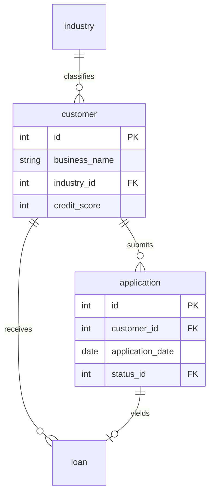

# ER Document Guide

This guide describes the ER document. The skill produces the Chinese variant `02-{dataset_name}_er_document-cn.md` during the authoring pass. The English variant `02-{dataset_name}_er_document.md` comes later from the `translate-to-en` skill.

The `02-` prefix marks this file as the second artifact in the dataset bundle, behind the business context (`01-`) and ahead of SQL queries (`03-`) and the Python generator (`04-`).

After splitting the business context into its own file, the ER document focuses on the data. Tables, columns, constraints, sample rows, and generation rules. The wider business narrative (company, industry, project framing) lives in the business context file, not here.

The default market is North America.

---

## 1. Purpose

The ER document is the contract between the schema, the Python generator, and the SQL queries. A reader who has already absorbed the business context file should be able to open the ER document and see what tables exist, how they connect, what each column means, which fields are computed from others, and which distributions are deliberately skewed by what magnitude.

If the business context answers why, the ER document answers what.

Treat the per-table descriptions as teaching content. The reader has just finished the business context but is not a data modeler. Explain what each table does in business terms, not just in data terms. A line like "this table stores customer records" tells the reader nothing they could not guess from the table name. A line like "each row is one business borrower who has filed at least one loan application, including the financial profile our underwriting model needs" tells them what they need to know.

---

## 2. Required content beats

Organize sections however reads best. The following beats must all appear.

### Beat 1. Pointer to the business context

A one-line pointer at the very top of the file:

> 业务背景, 行业科普, 术语表请见 `01-{dataset_name}_business_context-cn.md`. 本文档只描述数据.

This tells future readers where to find context that is intentionally not in the ER document.

### Beat 2. Dataset metadata

Right after the pointer:

- Complexity tier (Low, Medium, High, Large).
- Table count.
- Approximate total row count.
- Number of FK relationships, with a callout for any non-DDL-enforced scoping rules.
- The `REFERENCE_DATE` constant value, matching the generator and the SQL queries.

### Beat 3. Mermaid ER diagram (mandatory)

Every ER document must include at least one Mermaid `erDiagram` block. This is non-negotiable.

For datasets with more than twelve tables, split the diagram into two or three logical sub-diagrams along domain lines. One mega diagram with twenty tables is unreadable. Sub-diagrams might be "Customers and Applications," "Loans and Payments," "Defaults and Recoveries."

Show primary keys, foreign keys, types, and the key business columns. Do not list every column. The diagram is for orientation, not exhaustive reference.

Example shape:

### Beat 4. Per-table sections

For each table, include the elements below. The first three are required content, not optional. The bracketed comments describe what good content looks like.

- **Heading** with `### {N}. {table_name}` matching the `__tablename__` in the Python generator.
- **Business purpose** in a short paragraph (two to four sentences). Explain what entity this represents in the business, who in the company cares about it, and what business question it helps answer. Write for the layperson reader, not the data modeler. If a table name is ambiguous (such as "splice_record" or "policy_term"), explain what the entity actually is before listing columns.
- **Scope notes** in a blockquote when a non-obvious rule applies. Example: "status codes 1 to 4 only appear in application.status_id; codes 5 to 8 only appear in loan.current_status_id. The DDL does not enforce this; analysts must respect it."
- **Column table** with name, type, constraints, and description. Descriptions should name business meaning, not parrot the column name. "FICO-style credit score (300 to 850) of the primary owner or personal guarantor; SMB underwriting at this scale typically uses personal credit rather than commercial bureau scores" beats "credit score."
- **Foreign keys** listed explicitly with cardinality (1:1, 1:N, M:N) and ON DELETE behavior.
- **Indexes** when any non-PK indexes exist.
- **Sample data** with two to five representative rows. Pick rows that show variation. The common case plus an edge case beats five rows that all look alike.

### Beat 5. Data generation rules

This section is where the embedded business traps become a contract. The Python generator will be checked against these statements. Group the rules into the categories below (headings flexible).

- **Temporal ordering.** Every chain of dates that must respect ordering. Example: `customer.first_contact_date` precedes `application.application_date` by at least sixty days; `application.application_date` precedes `application.decision_date`; `loan.disbursement_date` precedes `loan.maturity_date`.
- **Referential integrity.** FK rules the DDL enforces plus any scoping rules the DDL cannot enforce.
- **Value ranges.** For each numeric and categorical column, the realistic band. Cite industry conventions where applicable (FICO 300 to 850, credit term in months from the set {12, 24, 36, 48, 60}).
- **Computed fields.** Every column derived from others. `loan.outstanding_balance` is the closed-form amortization at REFERENCE_DATE. `default_event.loss_amount` equals `outstanding_at_default` minus `recovery_amount`.
- **Distribution rules (observed magnitudes).** What the generator actually produces. Approval rate around 74 percent. Grade mix A around 20 percent, B around 25 percent, C around 28 percent, D around 18 percent, E around 9 percent. Overall default rate around 9 percent.
- **Business traps embedded.** The most important sub-section. Each trap has a name (matching the business problem it serves), the expected magnitude in numbers, and a reference to the SQL query that surfaces it. Example: "Q1 风险定价: Grade C 实际违约 10 percent 对比 implied 6.0 percent. 约 4pp 定价不足. SQL 查询 Q1 暴露这条偏置."

### Beat 6. Faker strategy

A compact reference table mapping common field patterns to the Faker call or sampling strategy and a one-line rationale.

| 字段模式 | Faker 方法 | 说明 |
|----------|------------|------|
| business_name | `fake.company()` | 北美公司名 |
| credit_score | 按等级权重抽样 + 区间内均匀 | 保证审批后等级分布达到目标 |
| city | `random.choice(north_american_cities)` | 限制在公司所在州 / 省 |

### Beat 7. File manifest

A table listing the TSV files in topological order:

| # | 文件名 | 表 | 行数 | 依赖 |
|---|--------|-----|------|------|
| 01 | 01_industry.tsv | industry | 15 | 无 |
| 02 | 02_risk_grade.tsv | risk_grade | 5 | 无 |
| 03 | 03_customer.tsv | customer | 800 | industry |

### Beat 8. SQLite DDL

The full `CREATE TABLE` and `CREATE INDEX` statements in topological order. The block should be copy-paste-runnable in a SQLite shell.

### Beat 9. (Optional) Reconciled invariants

For datasets with parent rollup fields, an appendix listing the invariants the generator enforces. Example: `account.lifetime_arr_won_usd = SUM(opportunity.amount_usd WHERE Won)`. The reviewer skill verifies these.

---

## 3. The Chinese narrative voice

The narration is Chinese; the business is North American. Three rules:

1. Sample data uses North American identifiers (California cities, US ZIP codes, USD currency, Canadian provinces when relevant).
2. Column names and table names are English snake_case. Always.
3. DDL is identical across Chinese and English variants.

---

## 4. The English version

The English variant is produced later by the `translate-to-en` skill. Schema details (table names, column names, types, constraints, sample values, DDL) stay identical. Only narrative text is re-voiced. Do not author the English file by hand.

---

## 5. Anti-patterns to avoid

- Re-explaining the company, the industry, or the glossary here. That content lives in the business context file.
- Skipping the Mermaid diagram or replacing it with an ASCII relationship sketch.
- Per-table business purposes that read identically across tables ("This table stores X data") and convey no information.
- Column descriptions that just restate the column name.
- A mega Mermaid diagram with eighteen tables when domain-split sub-diagrams would be readable.
- Distribution claims the Python generator does not actually produce. Every claim here is checked.
- Sample rows that all look alike. Pick rows that reflect variation.
- Sample data in RMB, with Chinese cities, or with Chinese regulators. The market is North America.
