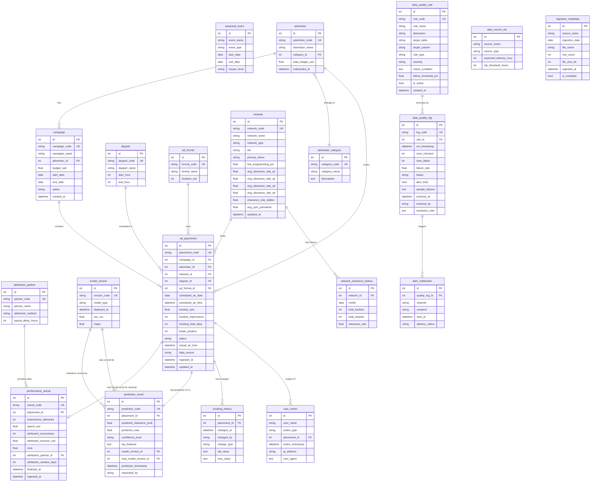

# Vantage Media CTV 广告投放分析数据模型文档

> 业务背景, 行业科普, 术语表请见 `01-advertising_ctv_campaign_analytics_high_business_context-cn.md`. 本文档只描述数据。

> **数据集:** `advertising_ctv_campaign_analytics_high`
> **复杂度:** High (20 张表, ~164,000 行)
> **外键关系:** 16 (含若干 DDL 无法强制的逻辑约束, 见数据生成规则)
> **参考当前日期 (AS_OF_DATE):** `2025-10-31` (与生成器和 SQL 查询一致)
> **业务领域:** AdTech / CTV / AutoML
> **生成方:** Fake Data Generator Agent

---

## 目录

1. [数据集概览](#1-数据集概览)
2. [ML 与 AutoML 能力支持](#2-ml-与-automl-能力支持)
3. [实体关系图](#3-实体关系图)
4. [表定义](#4-表定义)
5. [数据生成规则](#5-数据生成规则)
6. [KPI 字典](#6-kpi-字典)
7. [BI 主题域与仪表盘蓝图](#7-bi-主题域与仪表盘蓝图)
8. [文件清单](#8-文件清单)
9. [使用说明](#9-使用说明)
10. [数据完整性验证](#10-数据完整性验证)
11. [SQLite DDL](#11-sqlite-ddl)

---

## 1. 数据集概览

### 1.1 关键指标

| 指标 | 值 |
|------|------|
| 表总数 | 20 |
| 总行数 | ~164,000 |
| 外键关系 | 16 |
| 时间窗 | 6 个月 (2025-05-01 → 2025-10-31) |
| ML 训练特征回看窗 | 6 个月 (2024-11 → 2025-04, 通过 `network_clearance_history`) |
| 模型版本数 | 6 (3 clearance classifier + 3 ROAS regressor) |
| SQLite 数据库大小 | ~29 MB |

### 1.2 各表行数

| # | 表名 | 行数 | 类型 |
|---|------|-----|------|
| 01 | advertiser_category | 8 | 枚举 |
| 02 | daypart | 6 | 枚举 |
| 03 | ad_format | 4 | 枚举 |
| 04 | attribution_partner | 4 | 枚举 |
| 05 | seasonal_event | 5 | 配置 |
| 06 | model_version | 6 | ML 注册表 |
| 07 | network | 15 | 维度 |
| 08 | advertiser | 120 | 维度 (客户) |
| 09 | data_quality_rule | 10 | 配置 |
| 10 | campaign | 400 | 业务 |
| 11 | network_clearance_history | 90 | 时序特征 |
| 12 | data_source_sla | 5 | 配置 |
| 13 | ingestion_metadata | 719 | 运维事件 |
| 14 | **ad_placement** ⭐ | **50,000** | **核心事实** |
| 15 | data_quality_log | 1,800 | DQ 事件 |
| 16 | **performance_actual** | **42,350** | 效果事实 (仅 cleared) |
| 17 | **prediction_result** | **50,000** | ML 预测 (1:1 placement) |
| 18 | booking_history | 3,000 | 审计 |
| 19 | user_action | 15,000 | 操作审计 |
| 20 | alert_notification | 34 | 告警 |

### 1.3 实际业务分布 (已生成数据)

#### Placement 状态分布

| 状态 | 数量 | 占比 |
|------|------|------|
| cleared | 42,350 | 84.70% |
| preempted | 7,398 | 14.80% |
| pending | 252 | 0.50% |

#### 每月预订量 (Q4 高峰可见)

| 月份 | Placement 数 | 媒体购买金额(gross) |
|------|------------|---------------------|
| 2025-05 | 8,017 | ~$12.9M |
| 2025-06 | 7,622 | ~$12.1M |
| 2025-07 | 7,875 | ~$12.5M |
| 2025-08 | 7,786 | ~$12.3M |
| 2025-09 | 7,605 | ~$12.2M |
| 2025-10 | 11,095 (**Q4 +40%**) | ~$17.7M |

#### 各网络类型的清除率与 ROAS

(清除率/ROAS 为已结案 cleared+preempted 口径)

| 网络类型 | Placement 数 | 清除率 | 平均 ROAS |
|---------|------------|--------|----------|
| linear_broadcast (NBC/CBS/ABC/FOX) | 13,171 | 82.4% | 1.05x |
| linear_cable (ESPN/HGTV/TBS...) | 26,730 | 82.6% | 1.14x |
| streaming_avod (Hulu/Peacock/Pluto) | 9,847 | 95.7% | 1.52x |

#### 模型版本表现 (Shadow Scoring)

| 模型版本 | 部署日 | Clearance 准确率 | ROAS MAPE |
|---------|-------|---------------|----------|
| v2.1.5 (+ v2.1.5-roas) | 2025-04-01 | 86.0% | 12.0% |
| v2.2.0 (+ v2.2.0-roas) | 2025-05-15 | 85.8% | 7.9% |
| v2.3.1 (+ v2.3.1-roas) | 2025-07-01 | 85.6% | 5.0% |

> Clearance 准确率按 `model_version_id` (classifier) 分组; ROAS MAPE 按 `roas_model_version_id` (regressor) 分组。

> **解读**:Clearance 二分类准确率几乎持平 (~86%),因为类别极度不均衡 (cleared 85%, preempted 14%),多数类预测器已能拿到 ~85% baseline,模型只比 baseline 多 ~1pp 的边际收益。**ROAS 回归 MAPE 单调下降** (12% → 8% → 5%),展示了 AutoML 在回归任务上的真实改进。这两条曲线告诉 CDO:**该把精力转向解决类别不均衡 (Recall on preempted),而不是继续调 clearance 模型噪声**。

---

## 2. ML 与 AutoML 能力支持

数据集每张表在 AutoML pipeline 中的角色:

| 角色 | 表 | 在 ML 中的用途 |
|------|---|--------------|
| **Feature: 静态网络属性** | `network` | network_type、tier、demo、live_programming_pct |
| **Feature: 时序回看** | `network_clearance_history` | 用 2024-11 → 2025-04 历史清除率作为 placement 评分时刻的网络特征,**避免 label leakage** |
| **Feature: 时段** | `daypart` | start_hour, end_hour |
| **Feature: 广告主属性** | `advertiser`, `advertiser_category` | category, total_budget_usd (broker 客户预算可作为客户分层特征) |
| **Feature: 季节性事件** | `seasonal_event` | NFL Regular Season window → 体育向网络罚分特征 |
| **Feature: 预订属性** | `ad_placement.{booking_lead_days, break_position, ad_format_id, scheduled_air_time}` | 预订侧特征 |
| **Label: Clearance** | `ad_placement.status` ∈ {cleared, preempted} | 二分类标签 |
| **Label: ROAS** | `performance_actual.roas` | 回归标签 (仅 cleared 子集) |
| **Model Registry** | `model_version` | 部署时间 + 评估指标 (AUC-ROC, MAPE) |
| **Predictions** | `prediction_result` | predicted_clearance_prob, predicted_roas, top_features (JSON), model_version_id (clearance classifier), roas_model_version_id (roas regressor) |
| **Prediction explainability** | `prediction_result.top_features` | AutoML 给买手的 Top-N 重要特征列表 (Shapley values 简化版) |
| **Continuous monitoring** | `prediction_result` JOIN `performance_actual` | 预测 vs 实际,见 Q4 / Q14 |
| **Audit & retraining triggers** | `user_action` (`create_prediction` 类型) | 客户触发的重新评分次数 → 监控 SLA |
| **DQ Guardrails** | `data_quality_rule`, `data_quality_log` | 保证训练数据可信 (P0/P1 规则覆盖 ad_placement / performance_actual 的 NULL / 范围 / 异常值检测) |

### 2.1 训练 / 评估时间切分

```
Feature window (lookback)         Training & Eval window
[2024-11 ───── 2025-04]           [2025-05 ───── 2025-10]
       network_clearance_history         ad_placement + performance_actual
       (静态聚合特征,提前于训练窗,避免泄漏)     (label 真值在此窗内确定)
```

- 训练集:2025-05 → 2025-08 (4 个月)
- 验证集:2025-09 (1 个月)
- Held-out 测试:2025-10 (1 个月, 含 NFL 高峰 + Q4 boost,模拟生产环境难度)

### 2.2 Shadow Scoring 设计

Booking Copilot 是**双任务 AutoML**:每条 placement 同时被一个 clearance classifier 和一个
roas regressor 评分。`prediction_result` 因此有两个模型 FK:

- `model_version_id` → clearance classifier (v2.1.5 / v2.2.0 / v2.3.1,id 1/2/3),决定 `predicted_clearance_prob`。
- `roas_model_version_id` → 配对的同代 roas regressor (v2.1.5-roas / v2.2.0-roas / v2.3.1-roas,id 4/5/6),决定 `predicted_roas`。

3 代版本 **同时**对所有 50K placement 做评分,classifier 在三版本间随机均匀分配 (每代约 16.6K 条),
regressor 则与同一条预测的 classifier **配对**(同代),因此 6 个模型版本全部被引用、无孤儿行。
这让 Q14 (clearance 版本对比) 与 Q4/Q14-footer (roas 版本对比) 都能基于**同分布数据**对照,
避免"老版本只看简单数据,新版本只看难数据"的混淆。

---

## 3. 实体关系图



---

## 4. 表定义

### 1. advertiser_category (广告主类别)

**描述:** 广告主行业类别枚举表。用于分析不同行业在不同网络上的 ROAS 表现差异。

| 列名 | 类型 | 约束 | 描述 |
|------|------|------|------|
| id | INTEGER | PK, AUTO_INCREMENT | 主键 |
| category_code | VARCHAR(20) | UNIQUE, NOT NULL | 类别代码（如 HEALTH, FINANCE） |
| category_name | VARCHAR(100) | NOT NULL | 类别名称 |
| description | TEXT | NULL | 类别描述 |

**外键:** 无

**示例数据:**

| id | category_code | category_name | description |
|----|---------------|---------------|-------------|
| 1 | HEALTH | Health & Wellness | 补充剂、保健品、健身器材 |
| 2 | FINANCE | Financial Services | 银行、保险、投资理财 |
| 3 | APPAREL | Apparel & Fashion | 服装、鞋履、配饰 |

---

### 2. daypart (时段)

**描述:** 电视播出时段枚举表。不同时段的 CPM 价格和受众特征差异很大。

| 列名 | 类型 | 约束 | 描述 |
|------|------|------|------|
| id | INTEGER | PK, AUTO_INCREMENT | 主键 |
| daypart_code | VARCHAR(20) | UNIQUE, NOT NULL | 时段代码 |
| daypart_name | VARCHAR(50) | NOT NULL | 时段名称 |
| start_hour | INTEGER | NOT NULL | 开始小时（24 小时制） |
| end_hour | INTEGER | NOT NULL | 结束小时 |

**外键:** 无

**示例数据:**

| id | daypart_code | daypart_name | start_hour | end_hour |
|----|--------------|--------------|------------|----------|
| 1 | EARLY_MORNING | Early Morning | 5 | 9 |
| 2 | DAYTIME | Daytime | 9 | 16 |
| 4 | PRIMETIME | Primetime | 20 | 23 |

---

### 3. ad_format (广告格式)

**描述:** 广告时长格式枚举。不同时长的广告位价格和清除率不同。

| 列名 | 类型 | 约束 | 描述 |
|------|------|------|------|
| id | INTEGER | PK, AUTO_INCREMENT | 主键 |
| format_code | VARCHAR(20) | UNIQUE, NOT NULL | 格式代码 |
| format_name | VARCHAR(100) | NOT NULL | 格式名称 |
| duration_sec | INTEGER | NOT NULL | 广告时长（秒） |

**外键:** 无

**示例数据:**

| id | format_code | format_name | duration_sec |
|----|-------------|-------------|--------------|
| 1 | SPOT_15 | 15-Second Spot | 15 |
| 2 | SPOT_30 | 30-Second Spot | 30 |
| 3 | SPOT_60 | 60-Second Spot | 60 |

---

### 4. attribution_partner (归因合作伙伴)

**描述:** 提供转化归因数据的第三方合作伙伴。不同合作伙伴的归因方法和延迟不同，影响 ROAS 计算。

| 列名 | 类型 | 约束 | 描述 |
|------|------|------|------|
| id | INTEGER | PK, AUTO_INCREMENT | 主键 |
| partner_code | VARCHAR(20) | UNIQUE, NOT NULL | 合作伙伴代码 |
| partner_name | VARCHAR(100) | NOT NULL | 合作伙伴名称 |
| attribution_method | VARCHAR(50) | NOT NULL | 归因方法（pixel_match / ip_match / panel_extrapolation） |
| typical_delay_hours | INTEGER | NOT NULL | 典型数据延迟（小时） |

**外键:** 无

**示例数据:**

| id | partner_code | partner_name | attribution_method | typical_delay_hours |
|----|--------------|--------------|-------------------|---------------------|
| 1 | ATTR_PRO | AttributionPro | pixel_match | 12 |
| 2 | NIELSEN_DIG | Nielsen Digital | panel_extrapolation | 48 |

---

### 5. seasonal_event (季节性事件)

**描述:** 影响广告位清除率和效果的季节性事件日历（如 NFL 赛季、黑五购物节）。

| 列名 | 类型 | 约束 | 描述 |
|------|------|------|------|
| id | INTEGER | PK, AUTO_INCREMENT | 主键 |
| event_name | VARCHAR(100) | NOT NULL | 事件名称 |
| event_type | VARCHAR(50) | NOT NULL | 事件类型（sports / holiday / retail） |
| start_date | DATE | NOT NULL | 开始日期 |
| end_date | DATE | NOT NULL | 结束日期 |
| impact_level | VARCHAR(20) | NOT NULL | 影响程度（low / medium / high） |

**外键:** 无

**示例数据:**

| id | event_name | event_type | start_date | end_date | impact_level |
|----|------------|------------|------------|----------|--------------|
| 1 | NFL Regular Season | sports | 2025-09-05 | 2025-10-31 | high |
| 2 | Back to School | retail | 2025-08-15 | 2025-09-10 | medium |

---

### 6. model_version (ML 模型版本)

**描述:** 部署的 ML 模型版本记录。用于追踪模型迭代对预测准确度的提升。

| 列名 | 类型 | 约束 | 描述 |
|------|------|------|------|
| id | INTEGER | PK, AUTO_INCREMENT | 主键 |
| version_code | VARCHAR(20) | UNIQUE, NOT NULL | 版本号 |
| model_type | VARCHAR(50) | NOT NULL | 模型类型（clearance_classifier / roas_regressor） |
| deployed_at | DATETIME | NOT NULL | 部署时间 |
| auc_roc | FLOAT | NULL | AUC-ROC 评估指标（仅分类模型） |
| mape | FLOAT | NULL | MAPE 评估指标 |

**外键:** 无

**示例数据:**

| id | version_code | model_type | deployed_at | auc_roc | mape |
|----|--------------|------------|-------------|---------|------|
| 1 | v2.1.5 | clearance_classifier | 2025-04-01 | 0.768 | 28.1 |
| 3 | v2.3.1 | clearance_classifier | 2025-07-01 | 0.824 | 18.2 |

---

### 7. network (电视/流媒体网络)

**描述:** 电视台和流媒体平台维度表。存储网络特征和历史清除率数据，是 ML 模型的核心特征来源。

| 列名 | 类型 | 约束 | 描述 |
|------|------|------|------|
| id | INTEGER | PK, AUTO_INCREMENT | 主键 |
| network_code | VARCHAR(20) | UNIQUE, NOT NULL | 网络代码（如 ESPN, HGTV） |
| network_name | VARCHAR(100) | NOT NULL | 网络名称 |
| network_type | VARCHAR(50) | NOT NULL | 网络类型（linear_cable / linear_broadcast / streaming_avod） |
| tier | VARCHAR(20) | NOT NULL | 层级（premium / standard / niche） |
| primary_demo | VARCHAR(50) | NOT NULL | 主要受众（如 Adults 18-49） |
| live_programming_pct | FLOAT | NOT NULL | 直播节目占比（影响清除率） |
| avg_clearance_rate_q1 | FLOAT | NOT NULL | Q1 历史平均清除率（**仅作 ML 模型特征输入**，本数据集时间窗 5-10 月不直接消费） |
| avg_clearance_rate_q2 | FLOAT | NOT NULL | Q2 历史平均清除率（部分覆盖数据起始月份 5-6 月） |
| avg_clearance_rate_q3 | FLOAT | NOT NULL | Q3 历史平均清除率（数据集中 7-9 月使用） |
| avg_clearance_rate_q4 | FLOAT | NOT NULL | Q4 历史平均清除率（数据集中 10 月使用） |
| clearance_rate_stddev | FLOAT | NOT NULL | 清除率标准差（波动性） |
| avg_cpm_primetime | FLOAT | NOT NULL | 黄金时段平均 CPM |
| updated_at | DATETIME | NOT NULL | 更新时间 |

**外键:** 无

**示例数据:**

| network_code | network_name | network_type | tier | live_programming_pct | avg_clearance_rate_q4 | avg_cpm_primetime |
|--------------|--------------|--------------|------|----------------------|----------------------|-------------------|
| ESPN | ESPN | linear_cable | premium | 0.62 | 0.58 | 34.50 |
| HGTV | HGTV | linear_cable | standard | 0.04 | 0.90 | 18.20 |
| HULU | Hulu Live | streaming_avod | premium | 0.15 | 0.94 | 28.75 |

---

### 8. advertiser (广告主)

**描述:** 品牌客户表。每个广告主属于一个行业类别，有独立的预算。

| 列名 | 类型 | 约束 | 描述 |
|------|------|------|------|
| id | INTEGER | PK, AUTO_INCREMENT | 主键 |
| advertiser_code | VARCHAR(20) | UNIQUE, NOT NULL | 广告主代码 |
| advertiser_name | VARCHAR(100) | NOT NULL | 广告主名称 |
| category_id | INTEGER | FK → advertiser_category.id | 所属行业类别 |
| total_budget_usd | FLOAT | NOT NULL | 总预算（美元） |
| onboarded_at | DATETIME | NOT NULL | 客户入驻时间 |

**外键:**
- `category_id` → `advertiser_category.id`

**示例数据:**

| id | advertiser_code | advertiser_name | category_id | total_budget_usd | onboarded_at |
|----|-----------------|-----------------|-------------|------------------|--------------|
| 1 | ADV-0001 | Luminary Health | 1 | 1,200,000 | 2024-03-15 |
| 2 | ADV-0002 | Chime Bank | 2 | 3,500,000 | 2023-11-22 |

---

### 9. data_quality_rule (数据质量规则)

**描述:** 数据质量检查规则配置表。每条规则定义一个自动化的数据质量检查逻辑。

> **关于 `check_condition` 字段：** 此字段是 *描述性元数据*（业务规则的人类可读伪 SQL），由数据治理团队维护，用于运维文档和审计追溯。它**不会被自动执行**——真正的 DQ 检查由独立的 Airflow DAG 实现，结果落到 `data_quality_log`。因此本字段中出现的 `DATE('now')`、`MAX(...)` 等仅作为业务规则说明，运行 `data_quality_log` 上的查询时无需依赖这些条件。

| 列名 | 类型 | 约束 | 描述 |
|------|------|------|------|
| id | INTEGER | PK, AUTO_INCREMENT | 主键 |
| rule_code | VARCHAR(20) | UNIQUE, NOT NULL | 规则代码 |
| rule_name | VARCHAR(100) | NOT NULL | 规则名称 |
| dimension | VARCHAR(20) | NOT NULL | 质量维度（completeness / accuracy / timeliness / consistency） |
| target_table | VARCHAR(100) | NOT NULL | 目标表名 |
| target_column | VARCHAR(100) | NULL | 目标列名 |
| rule_type | VARCHAR(50) | NOT NULL | 规则类型（null_check / range_check / zscore_anomaly） |
| severity | VARCHAR(10) | NOT NULL | 严重程度（P0 / P1 / P2） |
| check_condition | TEXT | NOT NULL | 检查条件（SQL 表达式） |
| failure_threshold_pct | FLOAT | NOT NULL | 失败阈值百分比 |
| is_active | BOOLEAN | NOT NULL, DEFAULT TRUE | 是否启用 |
| created_at | DATETIME | NOT NULL | 创建时间 |

**外键:** 无

**示例数据:**

| rule_code | rule_name | dimension | target_table | rule_type | severity | check_condition |
|-----------|-----------|-----------|--------------|-----------|----------|-----------------|
| DQR-001 | Placement ID Not Null | completeness | ad_placement | null_check | P0 | placement_code IS NULL |
| DQR-004 | ROAS Anomaly Detection | accuracy | performance_actual | zscore_anomaly | P1 | ABS(z_score) > 3.0 |

---

### 10. campaign (广告活动)

**描述:** 广告活动表。一个活动包含多个广告位预订，有独立的预算和时间周期。

| 列名 | 类型 | 约束 | 描述 |
|------|------|------|------|
| id | INTEGER | PK, AUTO_INCREMENT | 主键 |
| campaign_code | VARCHAR(30) | UNIQUE, NOT NULL | 活动代码 |
| campaign_name | VARCHAR(200) | NOT NULL | 活动名称 |
| advertiser_id | INTEGER | FK → advertiser.id | 所属广告主 |
| budget_usd | FLOAT | NOT NULL | 活动预算 |
| start_date | DATE | NOT NULL | 开始日期 |
| end_date | DATE | NOT NULL | 结束日期 |
| status | VARCHAR(20) | NOT NULL | 状态（active / completed / paused） |
| created_at | DATETIME | NOT NULL | 创建时间 |

**外键:**
- `advertiser_id` → `advertiser.id`

**示例数据:**

| campaign_code | campaign_name | advertiser_id | budget_usd | start_date | end_date | status |
|---------------|---------------|---------------|------------|------------|----------|--------|
| CMP-0001 | Summer Health Boost | 1 | 250,000 | 2025-06-01 | 2025-08-31 | active |

---

### 11. network_clearance_history (网络历史清除率)

**描述:** 每个网络按月统计的历史清除率数据。用于 ML 特征工程和趋势分析。

> **设计意图（重要）：** 本表覆盖 **2024-11 → 2025-04**，*故意* 早于 `ad_placement` 数据窗口（2025-05 → 2025-10）。这是 ML 实践中的标准做法：模型用历史窗口作为特征，预测/评估在另一个窗口进行，避免训练特征与预测样本的时间泄漏。
> 不要把本表当成 `ad_placement` 的月度聚合来核对——它们刻意不重叠。

| 列名 | 类型 | 约束 | 描述 |
|------|------|------|------|
| id | INTEGER | PK, AUTO_INCREMENT | 主键 |
| network_id | INTEGER | FK → network.id, **UNIQUE (network_id, month)** | 网络 ID |
| month | DATE | NOT NULL, **UNIQUE (network_id, month)** | 月份（月初日期） |
| total_booked | INTEGER | NOT NULL | 当月预订总数 |
| total_cleared | INTEGER | NOT NULL | 当月实际播出数 |
| clearance_rate | FLOAT | NOT NULL | 清除率 |

**唯一性约束:** `UNIQUE (network_id, month)` —— 每个网络每月只有一条记录。

**外键:**
- `network_id` → `network.id`

**示例数据:**

| network_id | month | total_booked | total_cleared | clearance_rate |
|------------|-------|--------------|---------------|----------------|
| 1 | 2024-11-01 | 450 | 261 | 0.58 |
| 3 | 2024-11-01 | 320 | 294 | 0.92 |

---

### 12. data_source_sla (数据源 SLA)

**描述:** 数据源交付 SLA 配置表。定义每个数据源的预期交付时间和容忍延迟。

| 列名 | 类型 | 约束 | 描述 |
|------|------|------|------|
| id | INTEGER | PK, AUTO_INCREMENT | 主键 |
| source_name | VARCHAR(100) | NOT NULL, **UNIQUE** | 数据源名称（与 `ingestion_metadata.source_name` 逻辑对应） |
| source_type | VARCHAR(50) | NOT NULL | 数据源类型（network_log / streaming_log / attribution） |
| expected_delivery_hour | INTEGER | NOT NULL | 预期交付时刻（小时） |
| sla_threshold_hours | INTEGER | NOT NULL | SLA 阈值（超过即告警） |

**外键:** 无（结构上独立）

**逻辑关联（约定，不是数据库外键）:**
- `data_source_sla.source_name` ↔ `ingestion_metadata.source_name`：业务上一一对应。
- 之所以不建硬外键，是因为 SLA 配置由数据治理团队预先维护，新数据源在配置进入 SLA 表之前可能就开始采集；引入硬 FK 会强制 SLA 表必须先存在，与运维流程不符。
- Stage 3 生成器保证两边的 source_name 取值完全对齐。SQL 端按 `source_name` 等值连接即可。

**示例数据:**

| source_name | source_type | expected_delivery_hour | sla_threshold_hours |
|-------------|-------------|------------------------|---------------------|
| ESPN Delivery Log | network_log | 6 | 2 |
| AttributionPro API | attribution | 12 | 4 |

---

### 13. ingestion_metadata (数据采集元数据)

**描述:** 每次数据采集的元数据记录。用于追踪数据新鲜度和完整性。

| 列名 | 类型 | 约束 | 描述 |
|------|------|------|------|
| id | INTEGER | PK, AUTO_INCREMENT | 主键 |
| source_name | VARCHAR(100) | NOT NULL | 数据源名称 |
| ingestion_date | DATE | NOT NULL | 采集日期 |
| file_name | VARCHAR(200) | NOT NULL | 文件名 |
| row_count | INTEGER | NOT NULL | 行数 |
| file_size_kb | INTEGER | NOT NULL | 文件大小（KB） |
| ingested_at | DATETIME | NOT NULL | 实际采集时间 |
| is_complete | BOOLEAN | NOT NULL | 是否完整 |

**外键:** 无

**示例数据:**

| source_name | ingestion_date | file_name | row_count | ingested_at | is_complete |
|-------------|----------------|-----------|-----------|-------------|-------------|
| ESPN Delivery Log | 2025-09-15 | ESPN_Delivery_Log_20250915.csv | 142 | 2025-09-15 06:42:00 | true |

---

### 14. ad_placement (广告位预订) ⭐ **核心事实表**

**描述:** 广告位预订记录表，是整个数据集的核心事实表。每条记录代表一个已预订的广告播出位置。

| 列名 | 类型 | 约束 | 描述 |
|------|------|------|------|
| id | INTEGER | PK, AUTO_INCREMENT | 主键 |
| placement_code | VARCHAR(30) | UNIQUE, NOT NULL | 广告位唯一代码 |
| campaign_id | INTEGER | FK → campaign.id | 所属活动 |
| advertiser_id | INTEGER | FK → advertiser.id | 广告主 |
| network_id | INTEGER | FK → network.id | 网络 |
| daypart_id | INTEGER | FK → daypart.id | 时段 |
| ad_format_id | INTEGER | FK → ad_format.id | 广告格式 |
| scheduled_air_date | DATE | NOT NULL | 计划播出日期 |
| scheduled_air_time | DATETIME | NOT NULL | 计划播出时间 |
| booked_cpm | FLOAT | NOT NULL | 预订 CPM |
| booked_impressions | INTEGER | NOT NULL | 预订曝光数 |
| booking_lead_days | INTEGER | NOT NULL | 预订提前天数 |
| break_position | INTEGER | NOT NULL | 在广告段中的位置 |
| status | VARCHAR(20) | NOT NULL | 状态（pending / cleared / preempted） |
| actual_air_time | DATETIME | NULL | 实际播出时间（未播出则为 NULL） |
| data_source | VARCHAR(50) | NULL | 数据来源 |
| ingested_at | DATETIME | NOT NULL | 数据入库时间 |
| updated_at | DATETIME | NOT NULL | 更新时间 |

**外键:**
- `campaign_id` → `campaign.id`
- `advertiser_id` → `advertiser.id`
- `network_id` → `network.id`
- `daypart_id` → `daypart.id`
- `ad_format_id` → `ad_format.id`

**业务逻辑:**
- `status = 'cleared'` ⟺ `actual_air_time IS NOT NULL`（cleared 有播出时间，preempted/pending 均为 NULL）
- `status = 'cleared'` 与 `status = 'preempted'` 都已结案、都有 `data_source`（网络日志确认了"播出"或"被抢占"）
- `status = 'pending'` ⟹ `actual_air_time IS NULL` **AND** `data_source IS NULL`（结果尚未回传，约占数据快照末期，即数据快照截止前 2-3 天的高风险位）
- 因此 `preempted` 与 `pending` 的真正区分维度是 **`data_source`**（preempted 非 NULL、pending 为 NULL）外加 `scheduled_air_date`（pending 仅落在 2025-10-29 → 2025-10-31）；它们的 `actual_air_time` 同为 NULL，不能用 actual_air_time 区分
- `ingested_at > scheduled_air_time`（数据在播出后到达）
- `advertiser_id = (SELECT advertiser_id FROM campaign WHERE id = ad_placement.campaign_id)` —— 反规范化字段，与 campaign.advertiser_id 强制一致

**示例数据:**

| placement_code | campaign_id | network_id | daypart_id | scheduled_air_date | booked_cpm | status | actual_air_time |
|----------------|-------------|------------|------------|--------------------|------------|--------|-----------------|
| PL-2025-000001 | 1 | 1 | 4 | 2025-09-15 | 36.20 | preempted | NULL |
| PL-2025-000002 | 1 | 3 | 2 | 2025-09-15 | 19.50 | cleared | 2025-09-15 14:32:00 |

---

### 15. data_quality_log (数据质量日志)

**描述:** 数据质量规则执行日志。每次规则检查产生一条记录。

| 列名 | 类型 | 约束 | 描述 |
|------|------|------|------|
| id | INTEGER | PK, AUTO_INCREMENT | 主键 |
| log_code | VARCHAR(30) | UNIQUE, NOT NULL | 日志代码 |
| rule_id | INTEGER | FK → data_quality_rule.id | 规则 ID |
| run_timestamp | DATETIME | NOT NULL | 执行时间 |
| rows_checked | INTEGER | NOT NULL | 检查行数 |
| rows_failed | INTEGER | NOT NULL | 失败行数 |
| failure_rate | FLOAT | NOT NULL | 失败率 |
| status | VARCHAR(20) | NOT NULL | 状态（passed / warning / failed） |
| alert_fired | BOOLEAN | NOT NULL | 是否触发告警 |
| sample_failures | TEXT | NULL | 失败样本（JSON） |
| resolved_at | DATETIME | NULL | 解决时间 |
| resolved_by | VARCHAR(50) | NULL | 解决人 |
| resolution_note | TEXT | NULL | 解决说明 |

**外键:**
- `rule_id` → `data_quality_rule.id`

**示例数据:**

| log_code | rule_id | run_timestamp | rows_checked | rows_failed | status | alert_fired | resolved_at |
|----------|---------|---------------|--------------|-------------|--------|-------------|-------------|
| DQL-20250915-001 | 1 | 2025-09-15 06:30:00 | 2148 | 0 | passed | false | NULL |
| DQL-20250915-003 | 3 | 2025-09-15 07:00:00 | 1 | 1 | failed | true | 2025-09-15 08:45:00 |

---

### 16. performance_actual (实际效果数据)

**描述:** 广告位实际播出后的效果数据。包含曝光数、花费、归因转化和 ROAS。

| 列名 | 类型 | 约束 | 描述 |
|------|------|------|------|
| id | INTEGER | PK, AUTO_INCREMENT | 主键 |
| actual_code | VARCHAR(30) | UNIQUE, NOT NULL | 效果记录代码 |
| placement_id | INTEGER | FK → ad_placement.id | 关联广告位 |
| impressions_delivered | INTEGER | NOT NULL | 实际曝光数 |
| spend_usd | FLOAT | NOT NULL | 实际花费 |
| attributed_conversions | INTEGER | NOT NULL | 归因转化数 |
| attributed_revenue_usd | FLOAT | NOT NULL | 归因收入 |
| roas | FLOAT | NOT NULL | ROAS（= attributed_revenue_usd / spend_usd） |
| attribution_partner_id | INTEGER | FK → attribution_partner.id | 归因合作伙伴 |
| attribution_window_days | INTEGER | NOT NULL | 归因窗口（天） |
| finalized_at | DATETIME | NOT NULL | 归因完成时间 |
| ingested_at | DATETIME | NOT NULL | 数据入库时间 |

**外键:**
- `placement_id` → `ad_placement.id`
- `attribution_partner_id` → `attribution_partner.id`

**业务逻辑:**
- `roas = attributed_revenue_usd / spend_usd`
- `impressions_delivered ≈ booked_impressions * 0.95-1.05`
- 只有 `ad_placement.status = 'cleared'` 的记录才会有对应的 performance_actual

**示例数据:**

| actual_code | placement_id | impressions_delivered | spend_usd | attributed_conversions | roas | attribution_partner_id |
|-------------|--------------|----------------------|-----------|------------------------|------|------------------------|
| ACT-000002 | 2 | 28,741 | 765.95 | 26 | 1.21 | 2 |
| ACT-000003 | 3 | 10,222 | 293.78 | 0 | 0.86 | 3 |

---

### 17. prediction_result (ML 预测结果)

**描述:** ML 模型对广告位的清除率和 ROAS 预测记录。预测发生在预订时（实际结果之前）。

| 列名 | 类型 | 约束 | 描述 |
|------|------|------|------|
| id | INTEGER | PK, AUTO_INCREMENT | 主键 |
| prediction_code | VARCHAR(30) | UNIQUE, NOT NULL | 预测记录代码 |
| placement_id | INTEGER | FK → ad_placement.id | 关联广告位 |
| predicted_clearance_prob | FLOAT | NOT NULL | 预测清除概率 [0, 1] |
| predicted_roas | FLOAT | NOT NULL | 预测 ROAS |
| confidence_level | VARCHAR(20) | NOT NULL | 置信度（low / medium / high） |
| top_features | TEXT | NOT NULL | 重要特征（JSON） |
| model_version_id | INTEGER | FK → model_version.id | clearance classifier 版本（产出 predicted_clearance_prob，id ∈ {1,2,3}） |
| roas_model_version_id | INTEGER | FK → model_version.id | 配对的 roas regressor 版本（产出 predicted_roas，id ∈ {4,5,6}） |
| prediction_timestamp | DATETIME | NOT NULL | 预测时间 |
| requested_by | VARCHAR(50) | NOT NULL | 请求用户 |

**外键:**
- `placement_id` → `ad_placement.id`
- `model_version_id` → `model_version.id`（clearance classifier）
- `roas_model_version_id` → `model_version.id`（roas regressor）

> **双任务来源（重要）：** 本表的一条预测同时承载二分类输出（`predicted_clearance_prob`）和回归输出（`predicted_roas`），二者来自**不同的模型**。因此用两个 FK 分别指向 `model_version`：`model_version_id` 挂 clearance classifier，`roas_model_version_id` 挂同代配对的 roas regressor（v2.1.5 ↔ v2.1.5-roas，依此类推）。这样 6 个模型版本全部被引用，没有孤儿行；Q14 看 classifier 迭代、Q14-footer/Q4 看 regressor 迭代，互不干扰。

**业务逻辑:**
- `prediction_timestamp < scheduled_air_time`（预测必须在播出前——所有版本都成立）
- `prediction_timestamp ≈ scheduled_air_date - booking_lead_days`（预测发生在预订时，是 placement 真实的首次评分时刻）

> **Shadow scoring 设计（重要）：** `model_version_id` 与 `prediction_timestamp` **解耦**——三个模型版本同时挂载，对所有 placement 都进行了 backtesting 评分，每个 placement 的 `prediction_result.model_version_id` 是从三个版本里随机分配的。
>
> 这意味着会出现 `model_version.deployed_at > prediction_timestamp` 的记录（约 ~20% 的预测发生在该版本部署之前）。这是预期行为，反映 backtesting 用未来模型回放评估历史预订。如果想严格按"业务首次预测时只用当时已上线模型"过滤，应在 SQL 中加 `WHERE prediction_timestamp >= mv.deployed_at` 谓词；这样能拿到时间上因果正向的子集（约 80% 数据）。Q14 / Q2 默认对全集做评估以保证三版本同分布对比。

**示例数据:**

| prediction_code | placement_id | predicted_clearance_prob | predicted_roas | confidence_level | model_version_id | roas_model_version_id |
|-----------------|--------------|--------------------------|----------------|------------------|------------------|-----------------------|
| PRED-20250901-00001 | 1 | 0.44 | 0.71 | medium | 3 | 6 |
| PRED-20250901-00002 | 2 | 0.91 | 1.48 | high | 1 | 4 |

---

### 18. booking_history (预订历史变更)

**描述:** 广告位预订变更审计日志。记录 CPM 调整、时间改期、取消等操作。

| 列名 | 类型 | 约束 | 描述 |
|------|------|------|------|
| id | INTEGER | PK, AUTO_INCREMENT | 主键 |
| placement_id | INTEGER | FK → ad_placement.id | 关联广告位 |
| changed_at | DATETIME | NOT NULL | 变更时间 |
| changed_by | VARCHAR(50) | NOT NULL | 变更人 |
| change_type | VARCHAR(50) | NOT NULL | 变更类型（status_change / cpm_adjustment / time_reschedule / cancellation） |
| old_value | TEXT | NULL | 旧值 |
| new_value | TEXT | NULL | 新值 |

**外键:**
- `placement_id` → `ad_placement.id`

**示例数据:**

| placement_id | changed_at | changed_by | change_type | old_value | new_value |
|--------------|------------|------------|-------------|-----------|-----------|
| 1 | 2025-09-10 10:30:00 | buyer_sarah | cpm_adjustment | 35.20 | 38.50 |

---

### 19. user_action (用户操作审计)

**描述:** 用户在平台上的操作审计日志。用于安全审计和用户行为分析。

| 列名 | 类型 | 约束 | 描述 |
|------|------|------|------|
| id | INTEGER | PK, AUTO_INCREMENT | 主键 |
| user_name | VARCHAR(50) | NOT NULL | 用户名 |
| action_type | VARCHAR(50) | NOT NULL | 操作类型（view_placement / create_prediction / book_placement / modify_booking / cancel_booking / view_analytics） |
| placement_id | INTEGER | FK → ad_placement.id, NULL | 关联广告位（如适用） |
| action_timestamp | DATETIME | NOT NULL | 操作时间 |
| ip_address | VARCHAR(50) | NOT NULL | IP 地址 |
| user_agent | TEXT | NULL | User Agent |

**外键:**
- `placement_id` → `ad_placement.id` (可为 NULL)

**示例数据:**

| user_name | action_type | placement_id | action_timestamp | ip_address |
|-----------|-------------|--------------|------------------|------------|
| sarah_chen | book_placement | 1 | 2025-09-01 09:15:00 | 192.168.1.100 |

---

### 20. alert_notification (告警通知)

**描述:** 数据质量告警通知发送记录。记录每次告警发送到 Slack/Email 的结果。

| 列名 | 类型 | 约束 | 描述 |
|------|------|------|------|
| id | INTEGER | PK, AUTO_INCREMENT | 主键 |
| quality_log_id | INTEGER | FK → data_quality_log.id | 关联质量日志 |
| channel | VARCHAR(20) | NOT NULL | 通知渠道（slack / email） |
| recipient | VARCHAR(100) | NOT NULL | 接收方 |
| sent_at | DATETIME | NOT NULL | 发送时间 |
| delivery_status | VARCHAR(20) | NOT NULL | 发送状态（delivered / failed） |

**外键:**
- `quality_log_id` → `data_quality_log.id`

**示例数据:**

| quality_log_id | channel | recipient | sent_at | delivery_status |
|----------------|---------|-----------|---------|-----------------|
| 142 | slack | #data-quality | 2025-09-15 07:01:30 | delivered |

---

## 5. 数据生成规则

### 业务逻辑约束

1. **时间顺序约束:**
   - `prediction_timestamp < scheduled_air_time < ingested_at < finalized_at`
   - `booking_date = scheduled_air_date - booking_lead_days`
   - `finalized_at = scheduled_air_time + attribution_window_days + partner_delay`
   - **`ad_placement.scheduled_air_date` 落在所属 campaign 的 `[start_date, end_date]` ∩ 数据窗 `[2025-05-01, 2025-10-31]` 内**（air_date 在 campaign 窗口内加权抽样，保证"按活动周期切分"的分析自洽，无越窗 placement）

2. **引用完整性:**
   - 只有 `status = 'cleared'` 的 ad_placement 才有对应的 performance_actual
   - 所有 ad_placement 都有对应的 prediction_result（预测在预订时生成）

3. **计算字段一致性:**
   - `performance_actual.roas = attributed_revenue_usd / spend_usd`
   - `network_clearance_history.clearance_rate = total_cleared / total_booked`
   - `data_quality_log.failure_rate = rows_failed / rows_checked`

4. **分布规则:**
   - 清除率分布（取自 network.avg_clearance_rate_q3/q4，所有 15 个网络都按表里的数值生成）：
     - ESPN/ESPN2 (体育有线) Q4: 55-65%
     - HGTV/Food Network (生活方式有线) 全年: 90-95%
     - 流媒体 (Hulu/Peacock/Pluto) 全年: 93-97%
     - 线性广播 (NBC/CBS/ABC/FOX) Q3: 84-91%，Q4: 62-74% (NFL 影响)
   - ROAS 分布（覆盖全部 8 个 category × 3 个 network_type 矩阵，无空洞）：
     - Health 品牌 on HGTV (linear_cable): 1.2-1.8x
     - Health 品牌 on ESPN (体育，sports penalty): 0.5-0.9x
     - Finance 品牌 on NBC (linear_broadcast): 1.1-1.6x
     - Auto 品牌 on ESPN (体育，免 penalty): 1.4-2.1x
   - 数据质量异常：~3% 的数据行有质量问题
   - placement.status 分布：~85% cleared、~14% preempted（按网络清除率分配）、~0.5% pending（仅 2025-10-29 → 2025-10-31 的 25% 概率，模拟刚预订但尚未确认结果的"高风险队列"）

5. **季节性模式:**
   - Q4 (10 月) 预订量 +40%（在每个 campaign 的活动窗内对 10 月每日权重 1.4、其他月份 1.0 加权抽样实现）
   - NFL Regular Season (2025-09-05 → 2025-10-31): ESPN/ESPN2/FOX 清除率下降 15-20%（区间随机）
   - 预订提前期越短，清除率越高（**分级单调**）：≤7 天 +7.5pp / 8-14 天 +3.5pp / 15-30 天 +0.5pp / 31-60 天 -3pp / >60 天 -6pp（按 lead 分布加权后均值 ≈ +2.1pp，与旧版 ≤7 单档 +5pp 持平，整体清除率维持 ~85%）
   - 预订提前期分布：短 lead 更常见（3 天 16%，7 天 18%，14 天 16%，21 天 13%，30 天 11%，45 天 9%，60 天 7%，75 天 6%，90 天 4%）——引入 75/90 天使 Q9 的 `>60天` 分桶非空

6. **反规范化字段一致性:**
   - `ad_placement.advertiser_id` 严格等于 `campaign.advertiser_id`（生成器从 campaign 表反查 advertiser_id，不再独立随机）
   - Q6/Q15/Q19 等"广告主维度"查询无论从 advertiser→placement 直连还是 advertiser→campaign→placement 间接连接都给出一致结果

7. **预算口径一致性（advertiser 年度预算 ↔ campaign 预算 ↔ 实际花费）:**
   - placement 的 campaign 归属按 **advertiser 年度预算加权**抽样（权重 ∝ `advertiser.total_budget_usd` / 该 advertiser 的 campaign 数）→ 每个 advertiser 的 placement 花费体量 **∝ 其年度预算**，落在 业务背景文档第 2 节 客户分档内。
   - `booked_impressions` 量级（1万–10万）经过标定，使全体 advertiser 6 个月**总媒体花费 ≈ 全体年度预算之和的 ~40%**（CTV 只是其媒体组合的一部分，符合 DTC 品牌从数字广告向 CTV 扩展的设定）。
   - 三个口径的关系：`advertiser.total_budget_usd`（年度，业务背景文档第 2 节 分档）≥ 其旗下所有 `campaign.budget_usd` 之和（6 个月，约为年度预算的一半量级）≥ 6 个月实际花费（`performance_actual.spend_usd`，仅 cleared）。因此 Q6/Q15/Q19 同时展示客户预算与花费/活动预算时**口径自洽**，不会出现"单 campaign 预算 > 客户整年预算"的矛盾。
   - `campaign.budget_usd` 由旗下 placement 计划花费反推（× uniform 0.9–1.4，见 Q15），与实际花费自洽。

### Faker 生成策略

| 字段模式 | Faker 方法 | 备注 |
|----------|------------|------|
| company name | `fake.company()` | 广告主名称 |
| datetime (过去) | `fake.date_time_between(start_date=START_DATE, end_date=END_DATE)` | 播出时间 |
| ip_address | `fake.ipv4()` | 用户 IP |
| user_agent | `fake.user_agent()` | 浏览器标识 |
| boolean (加权) | `fake.boolean(chance_of_getting_true=80)` | 清除状态 |
| uniform float | `random.uniform(0.5, 1.5)` | ROAS 噪声 |
| normal float | `random.gauss(mu=1.2, sigma=0.3)` | ROAS 分布 |

### 特殊数据生成逻辑

1. **清除率生成（基于网络和季度）:**
   ```python
   base_rate = network.avg_clearance_rate_q{quarter}
   if is_sports_network and quarter == 4:
       base_rate -= 0.15
   # 分级 lead 加成 (单调): ≤7 +0.075 / 8-14 +0.035 / 15-30 +0.005 / 31-60 -0.03 / >60 -0.06
   base_rate += lead_clearance_adjustment(booking_lead_days)
   cleared = random.random() < base_rate
   ```

2. **ROAS 生成（基于类别和网络类型）:**
   ```python
   expected_roas = ROAS_MATRIX[category_id][network_type]
   if is_sports_network and category_id != AUTO:
       expected_roas *= 0.6
   actual_roas = expected_roas * random.uniform(0.7, 1.3)
   ```

3. **模型预测误差按版本收窄（同时作用于 clearance 与 ROAS 两个预测输出）:**
   - v2.1.5 / v2.1.5-roas: 误差 ±12%
   - v2.2.0 / v2.2.0-roas: 误差 ±8%
   - v2.3.1 / v2.3.1-roas: 误差 ±5%
   - **Model version 分配策略**：本数据集采用 *shadow scoring* 设计——三代模型版本同时在线为每个 placement 评分。`prediction_result.model_version_id`（clearance classifier，id 1/2/3）随机均匀分配；`prediction_result.roas_model_version_id`（roas regressor，id 4/5/6）与同一条预测的 classifier **同代配对**。`model_version.deployed_at` 表示该版本成为主用版本的时间（与随机分配解耦）。这让 Q14 / Q4 这类版本对比能基于同分布数据，且 6 个版本全部被引用、无孤儿行。
   - `predicted_clearance_prob` 与 `gen_ad_placements` 使用相同的 base 公式（q3/q4 切换、NFL 罚分均值 0.175、分级 lead 加成），只在最后叠加版本化的均匀噪声 `±model_noise`。
   - **注意**：尽管模型噪声逐代收窄，但 **clearance 二分类准确率在三代间几乎持平（~86%）**——因为类别极度不均衡（cleared ~85%），majority-class baseline 已锁死整体准确率，noise 收窄无法突破（详见 §1.3 解读与 Q2/Q14）。真正单调改善的是 **ROAS 回归 MAPE（12% → 8% → 5%）**。
   - `predicted_roas` 以 placement 实际 ROAS 为锚点叠加版本化噪声 → 按 `roas_model_version_id` 分组的 Q4 / Q14-footer MAPE 单调下降。

   > **已知简化（caveat）**: `predicted_roas` 对 *cleared* placement 采用 actual_roas + 小噪声；对 *preempted / pending* placement 用网络基线 + 同等量级噪声。这是为了让 Q4 (MAPE) 故事在 cleared 子集上漂亮收敛的合理简化。如按 status 切分 MAPE，会看到 cleared 组误差显著低于 preempted 组——这是已知的"美化"，不是 bug。生产环境中预测应该独立于 actual。

4. **归因延迟一致性:**
   - `finalized_at = scheduled_air_time + attribution_window_days + partner.typical_delay_hours`
   - partner_delay 直接读取 `attribution_partner.typical_delay_hours`（Nielsen 48h、AttributionPro 12h、ImpactTracker 24h、ConversionPixel 6h），不再硬编码。

---

## 6. KPI 字典

数据集中可计算的所有核心指标的规范定义。每个 KPI 包括其公式 (伪 SQL)、数据源和归属主题域。

### 6.1 媒体采购 KPI (主题域 A)

| KPI | 定义 | 公式 | 来源 |
|-----|------|------|------|
| **Total Bookings** | 期间预订的 placement 数 | `COUNT(ad_placement.id)` 按 scheduled_air_date 过滤 | ad_placement |
| **Clearance Rate** | 实际播出 placement 占已结案的比例 | `SUM(status='cleared') / COUNT(status IN ('cleared','preempted'))` | ad_placement |
| **Preemption Rate** | 被抢占占比 | `SUM(status='preempted') / COUNT(status IN ('cleared','preempted'))` | ad_placement |
| **Booked CPM** | 平均预订 CPM | `AVG(booked_cpm)` | ad_placement |
| **Booked Impressions** | 预订总曝光 | `SUM(booked_impressions)` | ad_placement |
| **Gross Media Buy (USD)** | 媒体购买金额 | `SUM(booked_cpm × booked_impressions / 1000)` | ad_placement |
| **Average Lead Time (days)** | 平均预订提前期 | `AVG(booking_lead_days)` | ad_placement |
| **Preemption Opportunity Cost** | 被抢占的未交付机会成本 | `SUM(booked_cpm × booked_impressions / 1000) WHERE status='preempted'` | ad_placement |

### 6.2 效果归因 KPI (主题域 B)

| KPI | 定义 | 公式 | 来源 |
|-----|------|------|------|
| **Impressions Delivered** | 实际交付曝光 | `SUM(impressions_delivered)` | performance_actual |
| **Spend (USD)** | 实际媒体花费 | `SUM(spend_usd)` | performance_actual |
| **Attributed Revenue** | 归因收入 | `SUM(attributed_revenue_usd)` | performance_actual |
| **ROAS (placement-level)** | 单 placement 回报 | `attributed_revenue_usd / spend_usd` | performance_actual |
| **ROAS (spend-weighted)** | 按花费加权 ROAS | `SUM(attributed_revenue_usd) / SUM(spend_usd)` | performance_actual |
| **Attributed Conversions** | 归因转化数 | `SUM(attributed_conversions)` | performance_actual |
| **CPA (Cost per Acquisition)** | 单转化成本 | `SUM(spend_usd) / SUM(attributed_conversions)` | performance_actual |
| **Attribution Lag (hours)** | 归因延迟 | `AVG(finalized_at - scheduled_air_time)` (转小时) | performance_actual |
| **Partner Attribution Variance** | 不同 partner 报告 ROAS 的方差 | `STDDEV(roas) GROUP BY attribution_partner_id` | performance_actual + attribution_partner |

### 6.3 AutoML 模型监控 KPI (主题域 C)

| KPI | 定义 | 公式 | 来源 |
|-----|------|------|------|
| **Prediction Coverage** | 有预测的 placement 比例 | `COUNT(prediction_result) / COUNT(ad_placement)` (理论上 100%) | prediction_result + ad_placement |
| **Clearance Accuracy** | 二分类预测准确率 | `AVG((pred>=0.5 AND status='cleared') OR (pred<0.5 AND status='preempted'))` | prediction_result + ad_placement |
| **Clearance Recall (preempted)** | 抢占类召回率 (业务关键) | `TN / (TN + FP)`,即 `predicted<0.5 AND actual=preempted / actual=preempted` | prediction_result + ad_placement |
| **Clearance Precision (preempted)** | 抢占类精确率 | `TN / (TN + FN)` | prediction_result + ad_placement |
| **ROAS MAPE** | ROAS 回归误差 | `AVG(ABS(predicted_roas - roas) / roas) × 100` | prediction_result + performance_actual |
| **AUC-ROC** | 二分类排序质量 | 从 `model_version.auc_roc` 读取 (离线计算) | model_version |
| **Prediction Confidence Mix** | 高/中/低置信度分布 | `COUNT GROUP BY confidence_level` | prediction_result |
| **Time-to-Prediction (sec)** | 预测请求 → 返回的延迟 (业务 SLA) | 通过 `user_action.create_prediction` 类型推算 | user_action |
| **Model Drift Indicator** | 滚动 7 天 vs 30 天准确率差 | 见 SQL #14 衍生 | prediction_result + ad_placement |
| **Shadow Model Win Rate** | 新版本相对老版本胜出比例 | 各版本准确率对比 (Q14) | prediction_result + model_version |

### 6.4 数据质量与运维 KPI (主题域 D)

| KPI | 定义 | 公式 | 来源 |
|-----|------|------|------|
| **DQ Pass Rate** | 检查通过率 | `SUM(status='passed') / COUNT(*)` | data_quality_log |
| **P0 Alert Count** | P0 严重告警数 | `COUNT WHERE severity='P0' AND alert_fired=1` | data_quality_log + data_quality_rule |
| **MTTR (Mean Time to Resolve, hours)** | 平均解决时长 | `AVG(resolved_at - run_timestamp)` 转小时 | data_quality_log |
| **DQ Resolution Rate** | 已解决告警占比 | `SUM(resolved_at IS NOT NULL) / SUM(alert_fired=1)` | data_quality_log |
| **SLA Compliance Rate** | 数据源准时交付比例 | 见 SQL #10 (实际到达 vs expected_delivery_hour + sla_threshold_hours) | data_source_sla + ingestion_metadata |
| **Ingestion Completeness** | 完整文件占比 | `AVG(is_complete)` | ingestion_metadata |
| **Alert Channel Delivery Rate** | 告警送达率 | `SUM(delivery_status='delivered') / COUNT(*)` | alert_notification |

---

## 7. BI 主题域与仪表盘蓝图

20 张表自然分解为 **4 个 BI 主题域 (数据集市)**,由 **9 个标准化仪表盘** 在 3 个层级 (战略 / 运营 / 分析) 上服务。

### 7.1 三层 BI 架构


### 7.2 四个 BI 主题域

| # | 主题域 | 核心问题 | 主要表 | KPI 示例 |
|---|--------|---------|--------|---------|
| **A** | **媒体采购与库存** | "哪些网络可靠?哪些时段抢占风险高?Q4 NFL 季节怎么避坑?" | ad_placement, network, daypart, seasonal_event, network_clearance_history | 清除率、抢占率、机会成本、预订提前期 |
| **B** | **效果归因与商业回报** | "ROAS 最高的客户/品类是谁?不同归因方法是否一致?" | performance_actual, attribution_partner, advertiser, advertiser_category | ROAS、CPA、归因延迟、partner 差异 |
| **C** | **AutoML 模型监控** | "模型准吗?哪个版本最好?客户的定制模型有没有漂移?" | prediction_result, model_version, performance_actual, ad_placement | 准确率、MAPE、AUC、Recall on preempted、版本对比 |
| **D** | **数据质量与运维** | "上游数据按时到了吗?DQ 告警在升级吗?P0 多长时间能修?" | data_quality_rule, data_quality_log, alert_notification, ingestion_metadata, data_source_sla | DQ Pass Rate、MTTR、SLA Compliance |

### 7.3 9 个仪表盘

#### L3 战略 (3 个仪表盘)

| ID | 仪表盘 | 受众 | 刷新 | 关键控件 |
|----|-------|------|------|---------|
| **D1** | 月度业务概览 | CEO / VP Sales | 月度 | 媒体购买金额趋势、Top advertiser ROAS、被抢占机会成本 |
| **D2** | AutoML ROI 看板 | CTO / CDO | 月度 | 模型版本对比 (Q14)、ROAS MAPE 趋势 (Q4)、客户采纳率 |
| **D3** | 季度 P&L | CFO | 季度 | Take rate × Gross Media Buy、AutoML 模块附加费占比 |

#### L2 运营 (6 个仪表盘,日刷新)

| ID | 仪表盘 | 受众 | 告警阈值 | 关键控件 |
|----|-------|------|---------|---------|
| **D4** | 网络清除率监控 | Trading Desk Lead | 任一网络清除率 < 50% | 当日 + 7 天前瞻预订清除率 (Q1) |
| **D5** | 高风险位预警 | Media Buyer | 风险位 > 100 条 | 清除概率 < 0.65 的 pending 位 (Q3) |
| **D6** | 模型准确率监控 | Data Science Lead | 准确率 < 85% / MAPE > 10% | 滚动 7 天准确率 / MAPE (Q2, Q4, Q14) |
| **D7** | 数据质量驾驶舱 | Data Eng Lead | P0 告警 > 0 | DQ Pass Rate 趋势 + P0 MTTR (Q5, Q17) |
| **D8** | 归因延迟监控 | Data Eng Lead | 任一 partner 平均延迟 > SLA × 1.5 | 各 partner 平均延迟 (Q10) |
| **D9** | 用户活动审计 | Security / Trading Desk Lead | 单用户取消操作 > 50% | Top 20 活跃用户 + 操作类型分布 (Q13) |

### 7.4 主题域 × 仪表盘覆盖矩阵

| 主题域 | L3 | L2 |
|-------|-----|-----|
| A. 媒体采购与库存 | D1, D3 | D4, D5 |
| B. 效果归因与商业回报 | D1, D3 | (覆盖在 SQL 即可) |
| C. AutoML 模型监控 | D2 | D6 |
| D. 数据质量与运维 | — | D7, D8, D9 |

---

## 8. 文件清单

| 序号 | 文件名 | 表名 | 行数 | 依赖 |
|------|--------|------|------|------|
| 01 | 01_advertiser_category.tsv | advertiser_category | 8 | 无 |
| 02 | 02_daypart.tsv | daypart | 6 | 无 |
| 03 | 03_ad_format.tsv | ad_format | 4 | 无 |
| 04 | 04_attribution_partner.tsv | attribution_partner | 4 | 无 |
| 05 | 05_seasonal_event.tsv | seasonal_event | 5 | 无 |
| 06 | 06_model_version.tsv | model_version | 6 | 无 |
| 07 | 07_network.tsv | network | 15 | 无 |
| 08 | 08_advertiser.tsv | advertiser | **120** | advertiser_category |
| 09 | 09_data_quality_rule.tsv | data_quality_rule | 10 | 无 |
| 10 | 10_campaign.tsv | campaign | **400** | advertiser |
| 11 | 11_network_clearance_history.tsv | network_clearance_history | 90 | network |
| 12 | 12_data_source_sla.tsv | data_source_sla | 5 | 无 |
| 13 | 13_ingestion_metadata.tsv | ingestion_metadata | **~720** | 无 |
| 14 | 14_ad_placement.tsv | ad_placement | **50,000** | campaign, network, daypart, ad_format |
| 15 | 15_data_quality_log.tsv | data_quality_log | 1,800 | data_quality_rule |
| 16 | 16_performance_actual.tsv | performance_actual | **~42,500** | ad_placement, attribution_partner |
| 17 | 17_prediction_result.tsv | prediction_result | **50,000** | ad_placement, model_version |
| 18 | 18_booking_history.tsv | booking_history | **3,000** | ad_placement |
| 19 | 19_user_action.tsv | user_action | **15,000** | ad_placement |
| 20 | 20_alert_notification.tsv | alert_notification | ~34 | data_quality_log |
| **总计** | | | **~164,000** | |

> 注:alert_notification 行数取决于实际触发告警的质量日志数 × 渠道扇出。当前生成器在 ~3% 失败率 + 50% 升级到 `failed` 状态前提下产生 ~34 行 (180 天 × 告警 × 1-2 渠道扇出经过抽样)。

---

## 9. 使用说明

### 生成数据

```bash
cd dataset/advertising_ctv_campaign_analytics_high
python advertising_ctv_campaign_analytics_high_data_generator.py
```

### 查询 SQLite 数据库

```bash
sqlite3 advertising_ctv_campaign_analytics_high.sqlite
```

### 典型分析场景

1. **ML 模型效果评估:**
   ```sql
   SELECT
       p.predicted_clearance_prob,
       CASE WHEN a.status = 'cleared' THEN 1 ELSE 0 END AS actual_cleared,
       p.model_version_id
   FROM prediction_result p
   JOIN ad_placement a ON p.placement_id = a.id
   WHERE a.status IN ('cleared', 'preempted');
   ```

2. **网络清除率分析:**
   ```sql
   SELECT
       n.network_name,
       COUNT(*) AS total_booked,
       SUM(CASE WHEN a.status = 'cleared' THEN 1 ELSE 0 END) AS total_cleared,
       ROUND(AVG(CASE WHEN a.status = 'cleared' THEN 1.0 ELSE 0.0 END), 4) AS clearance_rate
   FROM ad_placement a
   JOIN network n ON a.network_id = n.id
   GROUP BY n.network_name
   ORDER BY clearance_rate ASC;
   ```

3. **数据质量监控面板:**
   ```sql
   SELECT
       r.rule_name,
       l.status,
       COUNT(*) AS check_count,
       SUM(CASE WHEN l.alert_fired THEN 1 ELSE 0 END) AS alert_count
   FROM data_quality_log l
   JOIN data_quality_rule r ON l.rule_id = r.id
   WHERE l.run_timestamp >= DATE('now', '-7 days')
   GROUP BY r.rule_name, l.status;
   ```

---

## 10. 数据完整性验证

运行以下查询验证数据质量：

```sql
-- 验证 ROAS 计算正确性
SELECT COUNT(*) AS invalid_roas_count
FROM performance_actual
WHERE ABS(roas - (attributed_revenue_usd / spend_usd)) > 0.01;

-- 验证清除状态与实际播出时间一致性
SELECT COUNT(*) AS inconsistent_status
FROM ad_placement
WHERE (status = 'cleared' AND actual_air_time IS NULL)
   OR (status = 'preempted' AND actual_air_time IS NOT NULL);

-- 验证预测时间早于播出时间
SELECT COUNT(*) AS invalid_prediction_time
FROM prediction_result p
JOIN ad_placement a ON p.placement_id = a.id
WHERE p.prediction_timestamp >= a.scheduled_air_time;
```

预期结果：所有计数应为 0。

---

## 11. SQLite DDL

以下是全部 20 张表的 `CREATE TABLE` 语句, 按拓扑顺序排列 (被依赖的表在前), 与 `04-advertising_ctv_campaign_analytics_high_data_generator-cn.py` 里的 SQLAlchemy ORM 模型一一对应。这段可以直接粘进 SQLite shell 跑。注意: SQLite 的外键约束默认不强制, 需要先 `PRAGMA foreign_keys = ON;` 才生效; 此外有几条逻辑约束 (如 ad_placement.advertiser_id 必须等于 campaign.advertiser_id, data_source_sla.source_name 与 ingestion_metadata.source_name 对齐) DDL 无法表达, 由生成器保证, 详见数据生成规则。

```sql
PRAGMA foreign_keys = ON;

-- 第一层: 枚举与配置表 (无外键依赖)
CREATE TABLE advertiser_category (
    id INTEGER PRIMARY KEY AUTOINCREMENT,
    category_code VARCHAR(20) NOT NULL UNIQUE,
    category_name VARCHAR(100) NOT NULL,
    description TEXT
);

CREATE TABLE daypart (
    id INTEGER PRIMARY KEY AUTOINCREMENT,
    daypart_code VARCHAR(20) NOT NULL UNIQUE,
    daypart_name VARCHAR(50) NOT NULL,
    start_hour INTEGER NOT NULL,
    end_hour INTEGER NOT NULL
);

CREATE TABLE ad_format (
    id INTEGER PRIMARY KEY AUTOINCREMENT,
    format_code VARCHAR(20) NOT NULL UNIQUE,
    format_name VARCHAR(100) NOT NULL,
    duration_sec INTEGER NOT NULL
);

CREATE TABLE attribution_partner (
    id INTEGER PRIMARY KEY AUTOINCREMENT,
    partner_code VARCHAR(20) NOT NULL UNIQUE,
    partner_name VARCHAR(100) NOT NULL,
    attribution_method VARCHAR(50) NOT NULL,
    typical_delay_hours INTEGER NOT NULL
);

CREATE TABLE seasonal_event (
    id INTEGER PRIMARY KEY AUTOINCREMENT,
    event_name VARCHAR(100) NOT NULL,
    event_type VARCHAR(50) NOT NULL,
    start_date DATE NOT NULL,
    end_date DATE NOT NULL,
    impact_level VARCHAR(20) NOT NULL
);

CREATE TABLE model_version (
    id INTEGER PRIMARY KEY AUTOINCREMENT,
    version_code VARCHAR(20) NOT NULL UNIQUE,
    model_type VARCHAR(50) NOT NULL,
    deployed_at DATETIME NOT NULL,
    auc_roc FLOAT,
    mape FLOAT
);

-- 第二层: 维度表
CREATE TABLE network (
    id INTEGER PRIMARY KEY AUTOINCREMENT,
    network_code VARCHAR(20) NOT NULL UNIQUE,
    network_name VARCHAR(100) NOT NULL,
    network_type VARCHAR(50) NOT NULL,
    tier VARCHAR(20) NOT NULL,
    primary_demo VARCHAR(50) NOT NULL,
    live_programming_pct FLOAT NOT NULL,
    avg_clearance_rate_q1 FLOAT NOT NULL,
    avg_clearance_rate_q2 FLOAT NOT NULL,
    avg_clearance_rate_q3 FLOAT NOT NULL,
    avg_clearance_rate_q4 FLOAT NOT NULL,
    clearance_rate_stddev FLOAT NOT NULL,
    avg_cpm_primetime FLOAT NOT NULL,
    updated_at DATETIME
);

CREATE TABLE advertiser (
    id INTEGER PRIMARY KEY AUTOINCREMENT,
    advertiser_code VARCHAR(20) NOT NULL UNIQUE,
    advertiser_name VARCHAR(100) NOT NULL,
    category_id INTEGER NOT NULL REFERENCES advertiser_category(id),
    total_budget_usd FLOAT NOT NULL,
    onboarded_at DATETIME NOT NULL
);

CREATE TABLE data_quality_rule (
    id INTEGER PRIMARY KEY AUTOINCREMENT,
    rule_code VARCHAR(20) NOT NULL UNIQUE,
    rule_name VARCHAR(100) NOT NULL,
    dimension VARCHAR(20) NOT NULL,
    target_table VARCHAR(100) NOT NULL,
    target_column VARCHAR(100),
    rule_type VARCHAR(50) NOT NULL,
    severity VARCHAR(10) NOT NULL,
    check_condition TEXT NOT NULL,
    failure_threshold_pct FLOAT NOT NULL,
    is_active BOOLEAN,
    created_at DATETIME
);

-- 第三层: 依赖第二层
CREATE TABLE campaign (
    id INTEGER PRIMARY KEY AUTOINCREMENT,
    campaign_code VARCHAR(30) NOT NULL UNIQUE,
    campaign_name VARCHAR(200) NOT NULL,
    advertiser_id INTEGER NOT NULL REFERENCES advertiser(id),
    budget_usd FLOAT NOT NULL,
    start_date DATE NOT NULL,
    end_date DATE NOT NULL,
    status VARCHAR(20) NOT NULL,
    created_at DATETIME
);

CREATE TABLE network_clearance_history (
    id INTEGER PRIMARY KEY AUTOINCREMENT,
    network_id INTEGER NOT NULL REFERENCES network(id),
    month DATE NOT NULL,
    total_booked INTEGER NOT NULL,
    total_cleared INTEGER NOT NULL,
    clearance_rate FLOAT NOT NULL,
    CONSTRAINT uq_network_clearance_history_network_month UNIQUE (network_id, month)
);

CREATE TABLE data_source_sla (
    id INTEGER PRIMARY KEY AUTOINCREMENT,
    source_name VARCHAR(100) NOT NULL,
    source_type VARCHAR(50) NOT NULL,
    expected_delivery_hour INTEGER NOT NULL,
    sla_threshold_hours INTEGER NOT NULL
);

CREATE TABLE ingestion_metadata (
    id INTEGER PRIMARY KEY AUTOINCREMENT,
    source_name VARCHAR(100) NOT NULL,
    ingestion_date DATE NOT NULL,
    file_name VARCHAR(200) NOT NULL,
    row_count INTEGER NOT NULL,
    file_size_kb INTEGER NOT NULL,
    ingested_at DATETIME NOT NULL,
    is_complete BOOLEAN
);

-- 第四层: 核心事实表
CREATE TABLE ad_placement (
    id INTEGER PRIMARY KEY AUTOINCREMENT,
    placement_code VARCHAR(30) NOT NULL UNIQUE,
    campaign_id INTEGER NOT NULL REFERENCES campaign(id),
    advertiser_id INTEGER NOT NULL REFERENCES advertiser(id),
    network_id INTEGER NOT NULL REFERENCES network(id),
    daypart_id INTEGER NOT NULL REFERENCES daypart(id),
    ad_format_id INTEGER NOT NULL REFERENCES ad_format(id),
    scheduled_air_date DATE NOT NULL,
    scheduled_air_time DATETIME NOT NULL,
    booked_cpm FLOAT NOT NULL,
    booked_impressions INTEGER NOT NULL,
    booking_lead_days INTEGER NOT NULL,
    break_position INTEGER NOT NULL,
    status VARCHAR(20) NOT NULL,
    actual_air_time DATETIME,
    data_source VARCHAR(50),
    ingested_at DATETIME NOT NULL,
    updated_at DATETIME
);

CREATE TABLE data_quality_log (
    id INTEGER PRIMARY KEY AUTOINCREMENT,
    log_code VARCHAR(30) NOT NULL UNIQUE,
    rule_id INTEGER NOT NULL REFERENCES data_quality_rule(id),
    run_timestamp DATETIME NOT NULL,
    rows_checked INTEGER NOT NULL,
    rows_failed INTEGER NOT NULL,
    failure_rate FLOAT NOT NULL,
    status VARCHAR(20) NOT NULL,
    alert_fired BOOLEAN,
    sample_failures TEXT,
    resolved_at DATETIME,
    resolved_by VARCHAR(50),
    resolution_note TEXT
);

-- 第五层: 依赖广告位的表
CREATE TABLE performance_actual (
    id INTEGER PRIMARY KEY AUTOINCREMENT,
    actual_code VARCHAR(30) NOT NULL UNIQUE,
    placement_id INTEGER NOT NULL REFERENCES ad_placement(id),
    impressions_delivered INTEGER NOT NULL,
    spend_usd FLOAT NOT NULL,
    attributed_conversions INTEGER NOT NULL,
    attributed_revenue_usd FLOAT NOT NULL,
    roas FLOAT NOT NULL,
    attribution_partner_id INTEGER NOT NULL REFERENCES attribution_partner(id),
    attribution_window_days INTEGER NOT NULL,
    finalized_at DATETIME NOT NULL,
    ingested_at DATETIME NOT NULL
);

CREATE TABLE prediction_result (
    id INTEGER PRIMARY KEY AUTOINCREMENT,
    prediction_code VARCHAR(30) NOT NULL UNIQUE,
    placement_id INTEGER NOT NULL REFERENCES ad_placement(id),
    predicted_clearance_prob FLOAT NOT NULL,
    predicted_roas FLOAT NOT NULL,
    confidence_level VARCHAR(20) NOT NULL,
    top_features TEXT NOT NULL,
    model_version_id INTEGER NOT NULL REFERENCES model_version(id),
    roas_model_version_id INTEGER NOT NULL REFERENCES model_version(id),
    prediction_timestamp DATETIME NOT NULL,
    requested_by VARCHAR(50) NOT NULL
);

CREATE TABLE booking_history (
    id INTEGER PRIMARY KEY AUTOINCREMENT,
    placement_id INTEGER NOT NULL REFERENCES ad_placement(id),
    changed_at DATETIME NOT NULL,
    changed_by VARCHAR(50) NOT NULL,
    change_type VARCHAR(50) NOT NULL,
    old_value TEXT,
    new_value TEXT
);

CREATE TABLE user_action (
    id INTEGER PRIMARY KEY AUTOINCREMENT,
    user_name VARCHAR(50) NOT NULL,
    action_type VARCHAR(50) NOT NULL,
    placement_id INTEGER REFERENCES ad_placement(id),
    action_timestamp DATETIME NOT NULL,
    ip_address VARCHAR(50) NOT NULL,
    user_agent TEXT
);

CREATE TABLE alert_notification (
    id INTEGER PRIMARY KEY AUTOINCREMENT,
    quality_log_id INTEGER NOT NULL REFERENCES data_quality_log(id),
    channel VARCHAR(20) NOT NULL,
    recipient VARCHAR(100) NOT NULL,
    sent_at DATETIME NOT NULL,
    delivery_status VARCHAR(20) NOT NULL
);
```

---

**文档版本:** 2.1 (0.2.1 spec 重组: 业务背景拆分到独立文档 + 补 DDL, 业务与数据未改动)
**生成日期:** 2026-06-22
**数据集复杂度:** High (50K placements, ~164K rows)
**业务领域:** AdTech / CTV Advertising / AutoML
**虚构公司:** Vantage Media (Booking Copilot 产品)
