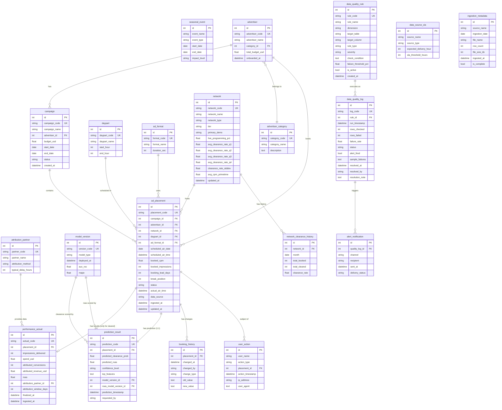
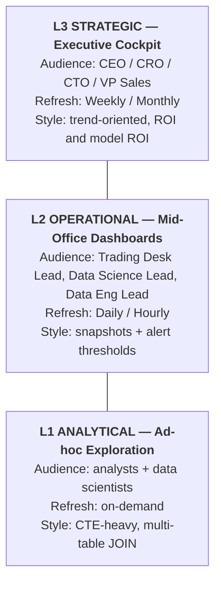

# Vantage Media CTV Ad Campaign Analytics Data Model Document

> Business context, industry primer, and glossary are in `01-advertising_ctv_campaign_analytics_high_business_context.md`. This document only describes the data.

> **Dataset:** `advertising_ctv_campaign_analytics_high`
> **Complexity:** High (20 tables, ~164,000 rows)
> **Foreign key relationships:** 16 (including several logical constraints that DDL cannot enforce, see data generation rules)
> **Reference current date (AS_OF_DATE):** `2025-10-31` (aligned with the generator and SQL queries)
> **Business domain:** AdTech / CTV / AutoML
> **Generated by:** Fake Data Generator Agent

---

## Table of Contents

1. [Dataset Overview](#1-dataset-overview)
2. [ML and AutoML Capability Support](#2-ml-and-automl-capability-support)
3. [Entity Relationship Diagram](#3-entity-relationship-diagram)
4. [Table Definitions](#4-table-definitions)
5. [Data Generation Rules](#5-data-generation-rules)
6. [KPI Dictionary](#6-kpi-dictionary)
7. [BI Subject Areas and Dashboard Blueprint](#7-bi-subject-areas-and-dashboard-blueprint)
8. [File Inventory](#8-file-inventory)
9. [Usage Notes](#9-usage-notes)
10. [Data Integrity Verification](#10-data-integrity-verification)
11. [SQLite DDL](#11-sqlite-ddl)

---

## 1. Dataset Overview

### 1.1 Key Metrics

| Metric | Value |
|------|------|
| Total tables | 20 |
| Total rows | ~164,000 |
| Foreign key relationships | 16 |
| Time window | 6 months (2025-05-01 → 2025-10-31) |
| ML training feature lookback window | 6 months (2024-11 → 2025-04, via `network_clearance_history`) |
| Model versions | 6 (3 clearance classifiers + 3 ROAS regressors) |
| SQLite database size | ~29 MB |

### 1.2 Row Counts by Table

| # | Table | Rows | Type |
|---|------|-----|------|
| 01 | advertiser_category | 8 | Enum |
| 02 | daypart | 6 | Enum |
| 03 | ad_format | 4 | Enum |
| 04 | attribution_partner | 4 | Enum |
| 05 | seasonal_event | 5 | Config |
| 06 | model_version | 6 | ML registry |
| 07 | network | 15 | Dimension |
| 08 | advertiser | 120 | Dimension (customer) |
| 09 | data_quality_rule | 10 | Config |
| 10 | campaign | 400 | Business |
| 11 | network_clearance_history | 90 | Time-series feature |
| 12 | data_source_sla | 5 | Config |
| 13 | ingestion_metadata | 719 | Ops event |
| 14 | **ad_placement** ⭐ | **50,000** | **Core fact** |
| 15 | data_quality_log | 1,800 | DQ event |
| 16 | **performance_actual** | **42,350** | Performance fact (cleared only) |
| 17 | **prediction_result** | **50,000** | ML predictions (1:1 placement) |
| 18 | booking_history | 3,000 | Audit |
| 19 | user_action | 15,000 | Action audit |
| 20 | alert_notification | 34 | Alerts |

### 1.3 Actual Business Distribution (Generated Data)

#### Placement Status Distribution

| Status | Count | Share |
|------|------|------|
| cleared | 42,350 | 84.70% |
| preempted | 7,398 | 14.80% |
| pending | 252 | 0.50% |

#### Monthly Booking Volume (Q4 Peak Visible)

| Month | Placements | Gross Media Buy |
|------|------------|---------------------|
| 2025-05 | 8,017 | ~$12.9M |
| 2025-06 | 7,622 | ~$12.1M |
| 2025-07 | 7,875 | ~$12.5M |
| 2025-08 | 7,786 | ~$12.3M |
| 2025-09 | 7,605 | ~$12.2M |
| 2025-10 | 11,095 (**Q4 +40%**) | ~$17.7M |

#### Clearance Rate and ROAS by Network Type

(Clearance rate / ROAS computed on resolved cleared+preempted records)

| Network Type | Placements | Clearance Rate | Average ROAS |
|---------|------------|--------|----------|
| linear_broadcast (NBC/CBS/ABC/FOX) | 13,171 | 82.4% | 1.05x |
| linear_cable (ESPN/HGTV/TBS...) | 26,730 | 82.6% | 1.14x |
| streaming_avod (Hulu/Peacock/Pluto) | 9,847 | 95.7% | 1.52x |

#### Model Version Performance (Shadow Scoring)

| Model Version | Deploy Date | Clearance Accuracy | ROAS MAPE |
|---------|-------|---------------|----------|
| v2.1.5 (+ v2.1.5-roas) | 2025-04-01 | 86.0% | 12.0% |
| v2.2.0 (+ v2.2.0-roas) | 2025-05-15 | 85.8% | 7.9% |
| v2.3.1 (+ v2.3.1-roas) | 2025-07-01 | 85.6% | 5.0% |

> Clearance accuracy is grouped by `model_version_id` (classifier); ROAS MAPE is grouped by `roas_model_version_id` (regressor).

> **Interpretation**: Clearance binary classification accuracy is essentially flat (~86%) because the class is extremely imbalanced (cleared 85%, preempted 14%) — a majority-class predictor already gets a ~85% baseline, and the model only beats baseline by ~1pp. **ROAS regression MAPE drops monotonically** (12% → 8% → 5%), showing the real AutoML improvement on the regression task. These two curves tell the CDO: **redirect effort toward solving class imbalance (Recall on preempted), not toward squeezing more noise out of the clearance model**.

---

## 2. ML and AutoML Capability Support

The role each table plays in the AutoML pipeline:

| Role | Table | Use in ML |
|------|---|--------------|
| **Feature: static network attributes** | `network` | network_type, tier, demo, live_programming_pct |
| **Feature: time-series lookback** | `network_clearance_history` | Use 2024-11 → 2025-04 historical clearance rates as the network features at placement scoring time, **avoiding label leakage** |
| **Feature: daypart** | `daypart` | start_hour, end_hour |
| **Feature: advertiser attributes** | `advertiser`, `advertiser_category` | category, total_budget_usd (broker customer budget usable as a customer-tier feature) |
| **Feature: seasonal events** | `seasonal_event` | NFL Regular Season window → sports-network penalty feature |
| **Feature: booking attributes** | `ad_placement.{booking_lead_days, break_position, ad_format_id, scheduled_air_time}` | Booking-side features |
| **Label: Clearance** | `ad_placement.status` ∈ {cleared, preempted} | Binary classification label |
| **Label: ROAS** | `performance_actual.roas` | Regression label (cleared subset only) |
| **Model Registry** | `model_version` | Deploy time + eval metrics (AUC-ROC, MAPE) |
| **Predictions** | `prediction_result` | predicted_clearance_prob, predicted_roas, top_features (JSON), model_version_id (clearance classifier), roas_model_version_id (roas regressor) |
| **Prediction explainability** | `prediction_result.top_features` | AutoML's Top-N important features surfaced to the buyer (simplified Shapley values) |
| **Continuous monitoring** | `prediction_result` JOIN `performance_actual` | Predicted vs actual, see Q4 / Q14 |
| **Audit & retraining triggers** | `user_action` (`create_prediction` type) | Number of customer-triggered rescores → monitor SLA |
| **DQ Guardrails** | `data_quality_rule`, `data_quality_log` | Keep training data trustworthy (P0/P1 rules cover NULL / range / anomaly checks on ad_placement / performance_actual) |

### 2.1 Train / Eval Time Split

```
Feature window (lookback)         Training & Eval window
[2024-11 ───── 2025-04]           [2025-05 ───── 2025-10]
       network_clearance_history         ad_placement + performance_actual
       (static aggregate features, predates training window, avoids leakage)     (label ground truth determined in this window)
```

- Training set: 2025-05 → 2025-08 (4 months)
- Validation set: 2025-09 (1 month)
- Held-out test: 2025-10 (1 month, includes NFL peak + Q4 boost, simulates production difficulty)

### 2.2 Shadow Scoring Design

Booking Copilot is a **dual-task AutoML system**: every placement is scored by both a clearance classifier and a roas regressor at the same time. As a result, `prediction_result` has two model FKs:

- `model_version_id` → clearance classifier (v2.1.5 / v2.2.0 / v2.3.1, ids 1/2/3), drives `predicted_clearance_prob`.
- `roas_model_version_id` → the paired same-generation roas regressor (v2.1.5-roas / v2.2.0-roas / v2.3.1-roas, ids 4/5/6), drives `predicted_roas`.

All three generations score all 50K placements **simultaneously**, with classifiers randomly and uniformly assigned across the three versions (about 16.6K each), while the regressor is **paired** with its same-generation classifier on the same prediction record. So all 6 model versions are referenced — no orphan rows. This lets Q14 (clearance version comparison) and Q4 / Q14-footer (roas version comparison) both operate on **same-distribution data**, avoiding the "old version only saw easy data, new version only saw hard data" confound.

---

## 3. Entity Relationship Diagram



---

## 4. Table Definitions

### 1. advertiser_category (advertiser category)

**Description:** Enum table of advertiser industry categories. Used to analyze ROAS differences by industry across networks.

| Column | Type | Constraints | Description |
|------|------|------|------|
| id | INTEGER | PK, AUTO_INCREMENT | Primary key |
| category_code | VARCHAR(20) | UNIQUE, NOT NULL | Category code (e.g., HEALTH, FINANCE) |
| category_name | VARCHAR(100) | NOT NULL | Category name |
| description | TEXT | NULL | Category description |

**Foreign keys:** None

**Sample data:**

| id | category_code | category_name | description |
|----|---------------|---------------|-------------|
| 1 | HEALTH | Health & Wellness | Supplements, health products, fitness equipment |
| 2 | FINANCE | Financial Services | Banking, insurance, investment/finance |
| 3 | APPAREL | Apparel & Fashion | Clothing, footwear, accessories |

---

### 2. daypart (daypart)

**Description:** Enum table of TV broadcast dayparts. CPM pricing and audience profile vary widely across dayparts.

| Column | Type | Constraints | Description |
|------|------|------|------|
| id | INTEGER | PK, AUTO_INCREMENT | Primary key |
| daypart_code | VARCHAR(20) | UNIQUE, NOT NULL | Daypart code |
| daypart_name | VARCHAR(50) | NOT NULL | Daypart name |
| start_hour | INTEGER | NOT NULL | Start hour (24-hour) |
| end_hour | INTEGER | NOT NULL | End hour |

**Foreign keys:** None

**Sample data:**

| id | daypart_code | daypart_name | start_hour | end_hour |
|----|--------------|--------------|------------|----------|
| 1 | EARLY_MORNING | Early Morning | 5 | 9 |
| 2 | DAYTIME | Daytime | 9 | 16 |
| 4 | PRIMETIME | Primetime | 20 | 23 |

---

### 3. ad_format (ad format)

**Description:** Enum of ad-duration formats. Different durations have different inventory pricing and clearance rates.

| Column | Type | Constraints | Description |
|------|------|------|------|
| id | INTEGER | PK, AUTO_INCREMENT | Primary key |
| format_code | VARCHAR(20) | UNIQUE, NOT NULL | Format code |
| format_name | VARCHAR(100) | NOT NULL | Format name |
| duration_sec | INTEGER | NOT NULL | Ad duration (seconds) |

**Foreign keys:** None

**Sample data:**

| id | format_code | format_name | duration_sec |
|----|-------------|-------------|--------------|
| 1 | SPOT_15 | 15-Second Spot | 15 |
| 2 | SPOT_30 | 30-Second Spot | 30 |
| 3 | SPOT_60 | 60-Second Spot | 60 |

---

### 4. attribution_partner (attribution partner)

**Description:** Third-party partners that provide conversion attribution data. Attribution method and latency vary by partner and affect ROAS computation.

| Column | Type | Constraints | Description |
|------|------|------|------|
| id | INTEGER | PK, AUTO_INCREMENT | Primary key |
| partner_code | VARCHAR(20) | UNIQUE, NOT NULL | Partner code |
| partner_name | VARCHAR(100) | NOT NULL | Partner name |
| attribution_method | VARCHAR(50) | NOT NULL | Attribution method (pixel_match / ip_match / panel_extrapolation) |
| typical_delay_hours | INTEGER | NOT NULL | Typical data delay (hours) |

**Foreign keys:** None

**Sample data:**

| id | partner_code | partner_name | attribution_method | typical_delay_hours |
|----|--------------|--------------|-------------------|---------------------|
| 1 | ATTR_PRO | AttributionPro | pixel_match | 12 |
| 2 | NIELSEN_DIG | Nielsen Digital | panel_extrapolation | 48 |

---

### 5. seasonal_event (seasonal event)

**Description:** Calendar of seasonal events that affect inventory clearance rate and performance (e.g., NFL season, Black Friday).

| Column | Type | Constraints | Description |
|------|------|------|------|
| id | INTEGER | PK, AUTO_INCREMENT | Primary key |
| event_name | VARCHAR(100) | NOT NULL | Event name |
| event_type | VARCHAR(50) | NOT NULL | Event type (sports / holiday / retail) |
| start_date | DATE | NOT NULL | Start date |
| end_date | DATE | NOT NULL | End date |
| impact_level | VARCHAR(20) | NOT NULL | Impact level (low / medium / high) |

**Foreign keys:** None

**Sample data:**

| id | event_name | event_type | start_date | end_date | impact_level |
|----|------------|------------|------------|----------|--------------|
| 1 | NFL Regular Season | sports | 2025-09-05 | 2025-10-31 | high |
| 2 | Back to School | retail | 2025-08-15 | 2025-09-10 | medium |

---

### 6. model_version (ML model version)

**Description:** Registry of deployed ML model versions. Used to track prediction accuracy improvements across model iterations.

| Column | Type | Constraints | Description |
|------|------|------|------|
| id | INTEGER | PK, AUTO_INCREMENT | Primary key |
| version_code | VARCHAR(20) | UNIQUE, NOT NULL | Version code |
| model_type | VARCHAR(50) | NOT NULL | Model type (clearance_classifier / roas_regressor) |
| deployed_at | DATETIME | NOT NULL | Deploy time |
| auc_roc | FLOAT | NULL | AUC-ROC metric (classifier only) |
| mape | FLOAT | NULL | MAPE metric |

**Foreign keys:** None

**Sample data:**

| id | version_code | model_type | deployed_at | auc_roc | mape |
|----|--------------|------------|-------------|---------|------|
| 1 | v2.1.5 | clearance_classifier | 2025-04-01 | 0.768 | 28.1 |
| 3 | v2.3.1 | clearance_classifier | 2025-07-01 | 0.824 | 18.2 |

---

### 7. network (TV / streaming network)

**Description:** Dimension table for TV channels and streaming platforms. Stores network attributes and historical clearance rate data; a core feature source for the ML models.

| Column | Type | Constraints | Description |
|------|------|------|------|
| id | INTEGER | PK, AUTO_INCREMENT | Primary key |
| network_code | VARCHAR(20) | UNIQUE, NOT NULL | Network code (e.g., ESPN, HGTV) |
| network_name | VARCHAR(100) | NOT NULL | Network name |
| network_type | VARCHAR(50) | NOT NULL | Network type (linear_cable / linear_broadcast / streaming_avod) |
| tier | VARCHAR(20) | NOT NULL | Tier (premium / standard / niche) |
| primary_demo | VARCHAR(50) | NOT NULL | Primary audience (e.g., Adults 18-49) |
| live_programming_pct | FLOAT | NOT NULL | Share of live programming (drives clearance rate) |
| avg_clearance_rate_q1 | FLOAT | NOT NULL | Historical average Q1 clearance rate (**ML feature input only**; the dataset window May–Oct does not consume it directly) |
| avg_clearance_rate_q2 | FLOAT | NOT NULL | Historical average Q2 clearance rate (partial coverage of May–June, the start of the data window) |
| avg_clearance_rate_q3 | FLOAT | NOT NULL | Historical average Q3 clearance rate (used by Jul–Sep in the dataset) |
| avg_clearance_rate_q4 | FLOAT | NOT NULL | Historical average Q4 clearance rate (used by Oct in the dataset) |
| clearance_rate_stddev | FLOAT | NOT NULL | Clearance rate stddev (volatility) |
| avg_cpm_primetime | FLOAT | NOT NULL | Average primetime CPM |
| updated_at | DATETIME | NOT NULL | Update time |

**Foreign keys:** None

**Sample data:**

| network_code | network_name | network_type | tier | live_programming_pct | avg_clearance_rate_q4 | avg_cpm_primetime |
|--------------|--------------|--------------|------|----------------------|----------------------|-------------------|
| ESPN | ESPN | linear_cable | premium | 0.62 | 0.58 | 34.50 |
| HGTV | HGTV | linear_cable | standard | 0.04 | 0.90 | 18.20 |
| HULU | Hulu Live | streaming_avod | premium | 0.15 | 0.94 | 28.75 |

---

### 8. advertiser (advertiser)

**Description:** Brand customer table. Each advertiser belongs to one industry category and has its own budget.

| Column | Type | Constraints | Description |
|------|------|------|------|
| id | INTEGER | PK, AUTO_INCREMENT | Primary key |
| advertiser_code | VARCHAR(20) | UNIQUE, NOT NULL | Advertiser code |
| advertiser_name | VARCHAR(100) | NOT NULL | Advertiser name |
| category_id | INTEGER | FK → advertiser_category.id | Industry category |
| total_budget_usd | FLOAT | NOT NULL | Total budget (USD) |
| onboarded_at | DATETIME | NOT NULL | Customer onboarding time |

**Foreign keys:**
- `category_id` → `advertiser_category.id`

**Sample data:**

| id | advertiser_code | advertiser_name | category_id | total_budget_usd | onboarded_at |
|----|-----------------|-----------------|-------------|------------------|--------------|
| 1 | ADV-0001 | Luminary Health | 1 | 1,200,000 | 2024-03-15 |
| 2 | ADV-0002 | Chime Bank | 2 | 3,500,000 | 2023-11-22 |

---

### 9. data_quality_rule (data quality rule)

**Description:** Configuration table for data quality check rules. Each row defines one automated data quality check.

> **About the `check_condition` field:** This field is *descriptive metadata* (a human-readable pseudo-SQL of the business rule), maintained by the data governance team for ops documentation and audit traceability. It is **not automatically executed** — the real DQ checks are implemented by a separate Airflow DAG, with results landing in `data_quality_log`. So things like `DATE('now')` or `MAX(...)` that appear in this field are only business-rule descriptions; queries running on `data_quality_log` do not need to rely on these conditions.

| Column | Type | Constraints | Description |
|------|------|------|------|
| id | INTEGER | PK, AUTO_INCREMENT | Primary key |
| rule_code | VARCHAR(20) | UNIQUE, NOT NULL | Rule code |
| rule_name | VARCHAR(100) | NOT NULL | Rule name |
| dimension | VARCHAR(20) | NOT NULL | Quality dimension (completeness / accuracy / timeliness / consistency) |
| target_table | VARCHAR(100) | NOT NULL | Target table name |
| target_column | VARCHAR(100) | NULL | Target column name |
| rule_type | VARCHAR(50) | NOT NULL | Rule type (null_check / range_check / zscore_anomaly) |
| severity | VARCHAR(10) | NOT NULL | Severity (P0 / P1 / P2) |
| check_condition | TEXT | NOT NULL | Check condition (SQL expression) |
| failure_threshold_pct | FLOAT | NOT NULL | Failure threshold percentage |
| is_active | BOOLEAN | NOT NULL, DEFAULT TRUE | Whether enabled |
| created_at | DATETIME | NOT NULL | Create time |

**Foreign keys:** None

**Sample data:**

| rule_code | rule_name | dimension | target_table | rule_type | severity | check_condition |
|-----------|-----------|-----------|--------------|-----------|----------|-----------------|
| DQR-001 | Placement ID Not Null | completeness | ad_placement | null_check | P0 | placement_code IS NULL |
| DQR-004 | ROAS Anomaly Detection | accuracy | performance_actual | zscore_anomaly | P1 | ABS(z_score) > 3.0 |

---

### 10. campaign (campaign)

**Description:** Campaign table. A campaign contains many placement bookings and has its own budget and time window.

| Column | Type | Constraints | Description |
|------|------|------|------|
| id | INTEGER | PK, AUTO_INCREMENT | Primary key |
| campaign_code | VARCHAR(30) | UNIQUE, NOT NULL | Campaign code |
| campaign_name | VARCHAR(200) | NOT NULL | Campaign name |
| advertiser_id | INTEGER | FK → advertiser.id | Owning advertiser |
| budget_usd | FLOAT | NOT NULL | Campaign budget |
| start_date | DATE | NOT NULL | Start date |
| end_date | DATE | NOT NULL | End date |
| status | VARCHAR(20) | NOT NULL | Status (active / completed / paused) |
| created_at | DATETIME | NOT NULL | Create time |

**Foreign keys:**
- `advertiser_id` → `advertiser.id`

**Sample data:**

| campaign_code | campaign_name | advertiser_id | budget_usd | start_date | end_date | status |
|---------------|---------------|---------------|------------|------------|----------|--------|
| CMP-0001 | Summer Health Boost | 1 | 250,000 | 2025-06-01 | 2025-08-31 | active |

---

### 11. network_clearance_history (network historical clearance)

**Description:** Monthly historical clearance rate statistics per network. Used for ML feature engineering and trend analysis.

> **Design intent (important):** This table covers **2024-11 → 2025-04**, *deliberately* predating the `ad_placement` data window (2025-05 → 2025-10). This is standard ML practice: use the historical window as features and do prediction/evaluation in a separate window to avoid temporal leakage between training features and prediction samples.
> Do not try to reconcile this table against monthly aggregates of `ad_placement` — they don't overlap on purpose.

| Column | Type | Constraints | Description |
|------|------|------|------|
| id | INTEGER | PK, AUTO_INCREMENT | Primary key |
| network_id | INTEGER | FK → network.id, **UNIQUE (network_id, month)** | Network ID |
| month | DATE | NOT NULL, **UNIQUE (network_id, month)** | Month (first day of the month) |
| total_booked | INTEGER | NOT NULL | Total booked that month |
| total_cleared | INTEGER | NOT NULL | Total aired that month |
| clearance_rate | FLOAT | NOT NULL | Clearance rate |

**Uniqueness constraint:** `UNIQUE (network_id, month)` — one record per network per month.

**Foreign keys:**
- `network_id` → `network.id`

**Sample data:**

| network_id | month | total_booked | total_cleared | clearance_rate |
|------------|-------|--------------|---------------|----------------|
| 1 | 2024-11-01 | 450 | 261 | 0.58 |
| 3 | 2024-11-01 | 320 | 294 | 0.92 |

---

### 12. data_source_sla (data source SLA)

**Description:** Configuration table for data source delivery SLAs. Defines expected delivery time and tolerated delay for each source.

| Column | Type | Constraints | Description |
|------|------|------|------|
| id | INTEGER | PK, AUTO_INCREMENT | Primary key |
| source_name | VARCHAR(100) | NOT NULL, **UNIQUE** | Source name (logically corresponds to `ingestion_metadata.source_name`) |
| source_type | VARCHAR(50) | NOT NULL | Source type (network_log / streaming_log / attribution) |
| expected_delivery_hour | INTEGER | NOT NULL | Expected delivery hour |
| sla_threshold_hours | INTEGER | NOT NULL | SLA threshold (alert if exceeded) |

**Foreign keys:** None (structurally independent)

**Logical association (by convention, not a database FK):**
- `data_source_sla.source_name` ↔ `ingestion_metadata.source_name`: 1-to-1 in business terms.
- The reason a hard FK is not declared is that SLA configuration is maintained ahead of time by the data governance team, and a new data source may start being ingested before its SLA entry is configured; a hard FK would force the SLA table to exist first, which doesn't match the ops workflow.
- The Stage 3 generator ensures the source_name values on both sides line up exactly. On the SQL side just join on `source_name`.

**Sample data:**

| source_name | source_type | expected_delivery_hour | sla_threshold_hours |
|-------------|-------------|------------------------|---------------------|
| ESPN Delivery Log | network_log | 6 | 2 |
| AttributionPro API | attribution | 12 | 4 |

---

### 13. ingestion_metadata (ingestion metadata)

**Description:** Metadata record for each data ingestion. Used to track data freshness and completeness.

| Column | Type | Constraints | Description |
|------|------|------|------|
| id | INTEGER | PK, AUTO_INCREMENT | Primary key |
| source_name | VARCHAR(100) | NOT NULL | Source name |
| ingestion_date | DATE | NOT NULL | Ingestion date |
| file_name | VARCHAR(200) | NOT NULL | File name |
| row_count | INTEGER | NOT NULL | Row count |
| file_size_kb | INTEGER | NOT NULL | File size (KB) |
| ingested_at | DATETIME | NOT NULL | Actual ingestion time |
| is_complete | BOOLEAN | NOT NULL | Whether complete |

**Foreign keys:** None

**Sample data:**

| source_name | ingestion_date | file_name | row_count | ingested_at | is_complete |
|-------------|----------------|-----------|-----------|-------------|-------------|
| ESPN Delivery Log | 2025-09-15 | ESPN_Delivery_Log_20250915.csv | 142 | 2025-09-15 06:42:00 | true |

---

### 14. ad_placement (ad placement booking) ⭐ **Core fact table**

**Description:** Ad placement booking records — the core fact table of the entire dataset. Each row represents one booked ad airing slot.

| Column | Type | Constraints | Description |
|------|------|------|------|
| id | INTEGER | PK, AUTO_INCREMENT | Primary key |
| placement_code | VARCHAR(30) | UNIQUE, NOT NULL | Unique placement code |
| campaign_id | INTEGER | FK → campaign.id | Owning campaign |
| advertiser_id | INTEGER | FK → advertiser.id | Advertiser |
| network_id | INTEGER | FK → network.id | Network |
| daypart_id | INTEGER | FK → daypart.id | Daypart |
| ad_format_id | INTEGER | FK → ad_format.id | Ad format |
| scheduled_air_date | DATE | NOT NULL | Scheduled air date |
| scheduled_air_time | DATETIME | NOT NULL | Scheduled air time |
| booked_cpm | FLOAT | NOT NULL | Booked CPM |
| booked_impressions | INTEGER | NOT NULL | Booked impressions |
| booking_lead_days | INTEGER | NOT NULL | Booking lead days |
| break_position | INTEGER | NOT NULL | Position within the commercial break |
| status | VARCHAR(20) | NOT NULL | Status (pending / cleared / preempted) |
| actual_air_time | DATETIME | NULL | Actual air time (NULL if not aired) |
| data_source | VARCHAR(50) | NULL | Data source |
| ingested_at | DATETIME | NOT NULL | Data ingestion time |
| updated_at | DATETIME | NOT NULL | Update time |

**Foreign keys:**
- `campaign_id` → `campaign.id`
- `advertiser_id` → `advertiser.id`
- `network_id` → `network.id`
- `daypart_id` → `daypart.id`
- `ad_format_id` → `ad_format.id`

**Business logic:**
- `status = 'cleared'` ⟺ `actual_air_time IS NOT NULL` (cleared records have an air time; preempted and pending are both NULL)
- `status = 'cleared'` and `status = 'preempted'` are both resolved and both have a `data_source` (the network log has confirmed either "aired" or "preempted")
- `status = 'pending'` ⟹ `actual_air_time IS NULL` **AND** `data_source IS NULL` (results have not come back yet; this concentrates at the end of the snapshot, i.e., high-risk slots within 2-3 days of the cutoff)
- Therefore the real distinguishing dimension between `preempted` and `pending` is **`data_source`** (preempted not NULL, pending NULL) plus `scheduled_air_date` (pending only falls between 2025-10-29 → 2025-10-31); their `actual_air_time` are both NULL, so actual_air_time cannot be used to distinguish them
- `ingested_at > scheduled_air_time` (data arrives after the airing)
- `advertiser_id = (SELECT advertiser_id FROM campaign WHERE id = ad_placement.campaign_id)` — a denormalized field, forced to match campaign.advertiser_id

**Sample data:**

| placement_code | campaign_id | network_id | daypart_id | scheduled_air_date | booked_cpm | status | actual_air_time |
|----------------|-------------|------------|------------|--------------------|------------|--------|-----------------|
| PL-2025-000001 | 1 | 1 | 4 | 2025-09-15 | 36.20 | preempted | NULL |
| PL-2025-000002 | 1 | 3 | 2 | 2025-09-15 | 19.50 | cleared | 2025-09-15 14:32:00 |

---

### 15. data_quality_log (data quality log)

**Description:** Execution log of data quality rule runs. Each rule check produces one record.

| Column | Type | Constraints | Description |
|------|------|------|------|
| id | INTEGER | PK, AUTO_INCREMENT | Primary key |
| log_code | VARCHAR(30) | UNIQUE, NOT NULL | Log code |
| rule_id | INTEGER | FK → data_quality_rule.id | Rule ID |
| run_timestamp | DATETIME | NOT NULL | Execution time |
| rows_checked | INTEGER | NOT NULL | Rows checked |
| rows_failed | INTEGER | NOT NULL | Rows failed |
| failure_rate | FLOAT | NOT NULL | Failure rate |
| status | VARCHAR(20) | NOT NULL | Status (passed / warning / failed) |
| alert_fired | BOOLEAN | NOT NULL | Whether an alert was fired |
| sample_failures | TEXT | NULL | Sample failures (JSON) |
| resolved_at | DATETIME | NULL | Resolution time |
| resolved_by | VARCHAR(50) | NULL | Resolver |
| resolution_note | TEXT | NULL | Resolution note |

**Foreign keys:**
- `rule_id` → `data_quality_rule.id`

**Sample data:**

| log_code | rule_id | run_timestamp | rows_checked | rows_failed | status | alert_fired | resolved_at |
|----------|---------|---------------|--------------|-------------|--------|-------------|-------------|
| DQL-20250915-001 | 1 | 2025-09-15 06:30:00 | 2148 | 0 | passed | false | NULL |
| DQL-20250915-003 | 3 | 2025-09-15 07:00:00 | 1 | 1 | failed | true | 2025-09-15 08:45:00 |

---

### 16. performance_actual (actual performance)

**Description:** Actual performance data after an ad placement airs. Includes impressions, spend, attributed conversions, and ROAS.

| Column | Type | Constraints | Description |
|------|------|------|------|
| id | INTEGER | PK, AUTO_INCREMENT | Primary key |
| actual_code | VARCHAR(30) | UNIQUE, NOT NULL | Performance record code |
| placement_id | INTEGER | FK → ad_placement.id | Linked placement |
| impressions_delivered | INTEGER | NOT NULL | Actual impressions delivered |
| spend_usd | FLOAT | NOT NULL | Actual spend |
| attributed_conversions | INTEGER | NOT NULL | Attributed conversions |
| attributed_revenue_usd | FLOAT | NOT NULL | Attributed revenue |
| roas | FLOAT | NOT NULL | ROAS (= attributed_revenue_usd / spend_usd) |
| attribution_partner_id | INTEGER | FK → attribution_partner.id | Attribution partner |
| attribution_window_days | INTEGER | NOT NULL | Attribution window (days) |
| finalized_at | DATETIME | NOT NULL | Attribution completion time |
| ingested_at | DATETIME | NOT NULL | Data ingestion time |

**Foreign keys:**
- `placement_id` → `ad_placement.id`
- `attribution_partner_id` → `attribution_partner.id`

**Business logic:**
- `roas = attributed_revenue_usd / spend_usd`
- `impressions_delivered ≈ booked_impressions * 0.95-1.05`
- Only records with `ad_placement.status = 'cleared'` have a corresponding performance_actual

**Sample data:**

| actual_code | placement_id | impressions_delivered | spend_usd | attributed_conversions | roas | attribution_partner_id |
|-------------|--------------|----------------------|-----------|------------------------|------|------------------------|
| ACT-000002 | 2 | 28,741 | 765.95 | 26 | 1.21 | 2 |
| ACT-000003 | 3 | 10,222 | 293.78 | 0 | 0.86 | 3 |

---

### 17. prediction_result (ML prediction result)

**Description:** ML model predictions of clearance probability and ROAS for each ad placement. The prediction is generated at booking time (before the actual outcome).

| Column | Type | Constraints | Description |
|------|------|------|------|
| id | INTEGER | PK, AUTO_INCREMENT | Primary key |
| prediction_code | VARCHAR(30) | UNIQUE, NOT NULL | Prediction record code |
| placement_id | INTEGER | FK → ad_placement.id | Linked placement |
| predicted_clearance_prob | FLOAT | NOT NULL | Predicted clearance probability [0, 1] |
| predicted_roas | FLOAT | NOT NULL | Predicted ROAS |
| confidence_level | VARCHAR(20) | NOT NULL | Confidence level (low / medium / high) |
| top_features | TEXT | NOT NULL | Top features (JSON) |
| model_version_id | INTEGER | FK → model_version.id | Clearance classifier version (produces predicted_clearance_prob, id ∈ {1,2,3}) |
| roas_model_version_id | INTEGER | FK → model_version.id | Paired roas regressor version (produces predicted_roas, id ∈ {4,5,6}) |
| prediction_timestamp | DATETIME | NOT NULL | Prediction time |
| requested_by | VARCHAR(50) | NOT NULL | Requesting user |

**Foreign keys:**
- `placement_id` → `ad_placement.id`
- `model_version_id` → `model_version.id` (clearance classifier)
- `roas_model_version_id` → `model_version.id` (roas regressor)

> **Dual-task origin (important):** A single prediction record here carries both the binary classification output (`predicted_clearance_prob`) and the regression output (`predicted_roas`), and the two come from **different models**. Hence two FKs that both point at `model_version`: `model_version_id` carries the clearance classifier, while `roas_model_version_id` carries the same-generation paired roas regressor (v2.1.5 ↔ v2.1.5-roas, and so on). This way all 6 model versions are referenced and there are no orphan rows; Q14 looks at classifier iteration while Q14-footer / Q4 look at regressor iteration without interfering with each other.

**Business logic:**
- `prediction_timestamp < scheduled_air_time` (prediction must precede airing — holds for all versions)
- `prediction_timestamp ≈ scheduled_air_date - booking_lead_days` (the prediction happens at booking time, which is the placement's real first scoring moment)

> **Shadow scoring design (important):** `model_version_id` and `prediction_timestamp` are **decoupled** — all three model versions are loaded simultaneously and do backtesting scoring on every placement, and each placement's `prediction_result.model_version_id` is randomly assigned from the three versions.
>
> This means there will be records with `model_version.deployed_at > prediction_timestamp` (about ~20% of predictions happen before the assigned version was deployed). This is expected behavior, reflecting backtesting in which a future model replays evaluation against historical bookings. If you want to strictly filter to "only use models that were live at the time of the business's first prediction," add `WHERE prediction_timestamp >= mv.deployed_at` in SQL; that gives you the temporally causal subset (about 80% of the data). Q14 / Q2 evaluate over the full set by default to keep the three-version comparison on the same data distribution.

**Sample data:**

| prediction_code | placement_id | predicted_clearance_prob | predicted_roas | confidence_level | model_version_id | roas_model_version_id |
|-----------------|--------------|--------------------------|----------------|------------------|------------------|-----------------------|
| PRED-20250901-00001 | 1 | 0.44 | 0.71 | medium | 3 | 6 |
| PRED-20250901-00002 | 2 | 0.91 | 1.48 | high | 1 | 4 |

---

### 18. booking_history (booking history changes)

**Description:** Audit log of placement booking changes. Records CPM adjustments, time reschedules, cancellations, and similar operations.

| Column | Type | Constraints | Description |
|------|------|------|------|
| id | INTEGER | PK, AUTO_INCREMENT | Primary key |
| placement_id | INTEGER | FK → ad_placement.id | Linked placement |
| changed_at | DATETIME | NOT NULL | Change time |
| changed_by | VARCHAR(50) | NOT NULL | Changed by |
| change_type | VARCHAR(50) | NOT NULL | Change type (status_change / cpm_adjustment / time_reschedule / cancellation) |
| old_value | TEXT | NULL | Old value |
| new_value | TEXT | NULL | New value |

**Foreign keys:**
- `placement_id` → `ad_placement.id`

**Sample data:**

| placement_id | changed_at | changed_by | change_type | old_value | new_value |
|--------------|------------|------------|-------------|-----------|-----------|
| 1 | 2025-09-10 10:30:00 | buyer_sarah | cpm_adjustment | 35.20 | 38.50 |

---

### 19. user_action (user action audit)

**Description:** Audit log of user actions on the platform. Used for security auditing and user behavior analysis.

| Column | Type | Constraints | Description |
|------|------|------|------|
| id | INTEGER | PK, AUTO_INCREMENT | Primary key |
| user_name | VARCHAR(50) | NOT NULL | User name |
| action_type | VARCHAR(50) | NOT NULL | Action type (view_placement / create_prediction / book_placement / modify_booking / cancel_booking / view_analytics) |
| placement_id | INTEGER | FK → ad_placement.id, NULL | Linked placement (if applicable) |
| action_timestamp | DATETIME | NOT NULL | Action time |
| ip_address | VARCHAR(50) | NOT NULL | IP address |
| user_agent | TEXT | NULL | User Agent |

**Foreign keys:**
- `placement_id` → `ad_placement.id` (nullable)

**Sample data:**

| user_name | action_type | placement_id | action_timestamp | ip_address |
|-----------|-------------|--------------|------------------|------------|
| sarah_chen | book_placement | 1 | 2025-09-01 09:15:00 | 192.168.1.100 |

---

### 20. alert_notification (alert notification)

**Description:** Record of data quality alert notifications sent. Logs the result of each alert sent to Slack/Email.

| Column | Type | Constraints | Description |
|------|------|------|------|
| id | INTEGER | PK, AUTO_INCREMENT | Primary key |
| quality_log_id | INTEGER | FK → data_quality_log.id | Linked quality log |
| channel | VARCHAR(20) | NOT NULL | Notification channel (slack / email) |
| recipient | VARCHAR(100) | NOT NULL | Recipient |
| sent_at | DATETIME | NOT NULL | Sent time |
| delivery_status | VARCHAR(20) | NOT NULL | Delivery status (delivered / failed) |

**Foreign keys:**
- `quality_log_id` → `data_quality_log.id`

**Sample data:**

| quality_log_id | channel | recipient | sent_at | delivery_status |
|----------------|---------|-----------|---------|-----------------|
| 142 | slack | #data-quality | 2025-09-15 07:01:30 | delivered |

---

## 5. Data Generation Rules

### Business Logic Constraints

1. **Temporal ordering constraints:**
   - `prediction_timestamp < scheduled_air_time < ingested_at < finalized_at`
   - `booking_date = scheduled_air_date - booking_lead_days`
   - `finalized_at = scheduled_air_time + attribution_window_days + partner_delay`
   - **`ad_placement.scheduled_air_date` falls within the intersection of the owning campaign's `[start_date, end_date]` and the data window `[2025-05-01, 2025-10-31]`** (air_date is sampled with weights inside the campaign window, keeping "split by campaign period" analyses self-consistent and free of out-of-window placements)

2. **Referential integrity:**
   - Only ad_placement records with `status = 'cleared'` have a corresponding performance_actual
   - All ad_placement records have a corresponding prediction_result (prediction is generated at booking time)

3. **Computed field consistency:**
   - `performance_actual.roas = attributed_revenue_usd / spend_usd`
   - `network_clearance_history.clearance_rate = total_cleared / total_booked`
   - `data_quality_log.failure_rate = rows_failed / rows_checked`

4. **Distribution rules:**
   - Clearance rate distribution (taken from network.avg_clearance_rate_q3/q4; all 15 networks are generated from the values in the table):
     - ESPN/ESPN2 (sports cable) Q4: 55-65%
     - HGTV/Food Network (lifestyle cable) year-round: 90-95%
     - Streaming (Hulu/Peacock/Pluto) year-round: 93-97%
     - Linear broadcast (NBC/CBS/ABC/FOX) Q3: 84-91%, Q4: 62-74% (NFL impact)
   - ROAS distribution (covers the full 8 categories × 3 network_types matrix, no gaps):
     - Health brand on HGTV (linear_cable): 1.2-1.8x
     - Health brand on ESPN (sports, sports penalty): 0.5-0.9x
     - Finance brand on NBC (linear_broadcast): 1.1-1.6x
     - Auto brand on ESPN (sports, penalty exempt): 1.4-2.1x
   - Data quality issues: ~3% of data rows have quality issues
   - placement.status distribution: ~85% cleared, ~14% preempted (assigned by network clearance rate), ~0.5% pending (only at a 25% probability within 2025-10-29 → 2025-10-31, simulating "just-booked but not yet confirmed" high-risk queue)

5. **Seasonal patterns:**
   - Q4 (October) booking volume +40% (implemented by weighting each daily slot within each campaign window with weight 1.4 in October and 1.0 in other months)
   - NFL Regular Season (2025-09-05 → 2025-10-31): ESPN/ESPN2/FOX clearance rate drops 15-20% (random within range)
   - Shorter booking lead time, higher clearance rate (**monotonic by tier**): ≤7 days +7.5pp / 8-14 days +3.5pp / 15-30 days +0.5pp / 31-60 days -3pp / >60 days -6pp (weighted by the lead-day distribution, mean ≈ +2.1pp, comparable to the previous single ≤7 +5pp setup, with overall clearance rate staying ~85%)
   - Booking lead time distribution: short leads more common (3 days 16%, 7 days 18%, 14 days 16%, 21 days 13%, 30 days 11%, 45 days 9%, 60 days 7%, 75 days 6%, 90 days 4%) — adding 75/90 days makes Q9's `>60 days` bucket non-empty

6. **Denormalized field consistency:**
   - `ad_placement.advertiser_id` strictly equals `campaign.advertiser_id` (the generator looks up advertiser_id from the campaign table rather than picking randomly)
   - "Advertiser dimension" queries like Q6/Q15/Q19 give consistent results whether they join from advertiser→placement directly or from advertiser→campaign→placement indirectly

7. **Budget caliber consistency (advertiser annual budget ↔ campaign budget ↔ actual spend):**
   - Placement campaign assignment is sampled with weights **proportional to advertiser annual budget** (weight ∝ `advertiser.total_budget_usd` / that advertiser's campaign count) → each advertiser's placement spend volume is **proportional to their annual budget** and lands inside the customer tier in §2 of the business context document.
   - `booked_impressions` magnitude (10K–100K) is calibrated so that the **total 6-month media spend across all advertisers ≈ ~40% of the sum of all annual budgets** (CTV is only part of their media mix, matching the setup of DTC brands expanding from digital advertising into CTV).
   - Relationship among the three calibers: `advertiser.total_budget_usd` (annual, tier in §2 of the business context document) ≥ the sum of all `campaign.budget_usd` they own (6 months, roughly half of annual budget magnitude) ≥ 6-month actual spend (`performance_actual.spend_usd`, cleared only). So when Q6/Q15/Q19 simultaneously surface customer budget and spend / campaign budget, **the calibers are self-consistent** — there's no "a single campaign budget exceeds the customer's full-year budget" contradiction.
   - `campaign.budget_usd` is back-derived from planned spend of its placements (× uniform 0.9–1.4, see Q15), making it consistent with actual spend.

### Faker Generation Strategy

| Field pattern | Faker method | Notes |
|----------|------------|------|
| company name | `fake.company()` | Advertiser name |
| datetime (past) | `fake.date_time_between(start_date=START_DATE, end_date=END_DATE)` | Air time |
| ip_address | `fake.ipv4()` | User IP |
| user_agent | `fake.user_agent()` | Browser identifier |
| boolean (weighted) | `fake.boolean(chance_of_getting_true=80)` | Clearance status |
| uniform float | `random.uniform(0.5, 1.5)` | ROAS noise |
| normal float | `random.gauss(mu=1.2, sigma=0.3)` | ROAS distribution |

### Special Data Generation Logic

1. **Clearance rate generation (based on network and quarter):**
   ```python
   base_rate = network.avg_clearance_rate_q{quarter}
   if is_sports_network and quarter == 4:
       base_rate -= 0.15
   # Tiered lead adjustment (monotonic): ≤7 +0.075 / 8-14 +0.035 / 15-30 +0.005 / 31-60 -0.03 / >60 -0.06
   base_rate += lead_clearance_adjustment(booking_lead_days)
   cleared = random.random() < base_rate
   ```

2. **ROAS generation (based on category and network type):**
   ```python
   expected_roas = ROAS_MATRIX[category_id][network_type]
   if is_sports_network and category_id != AUTO:
       expected_roas *= 0.6
   actual_roas = expected_roas * random.uniform(0.7, 1.3)
   ```

3. **Model prediction error narrows by version (applies to both clearance and ROAS prediction outputs):**
   - v2.1.5 / v2.1.5-roas: ±12% error
   - v2.2.0 / v2.2.0-roas: ±8% error
   - v2.3.1 / v2.3.1-roas: ±5% error
   - **Model version assignment strategy:** This dataset uses *shadow scoring* — all three model generations are loaded simultaneously and score every placement. `prediction_result.model_version_id` (clearance classifier, ids 1/2/3) is randomly and uniformly assigned; `prediction_result.roas_model_version_id` (roas regressor, ids 4/5/6) is **same-generation paired** with the classifier on the same prediction record. `model_version.deployed_at` represents when that version became the primary version (decoupled from the random assignment). This lets version comparisons like Q14 / Q4 rest on same-distribution data, with all 6 versions referenced and no orphan rows.
   - `predicted_clearance_prob` uses the same base formula as `gen_ad_placements` (q3/q4 switch, NFL penalty mean 0.175, tiered lead adjustment) and only adds versioned uniform noise `±model_noise` at the end.
   - **Note:** Even though model noise narrows generation by generation, **clearance binary accuracy stays essentially flat across the three generations (~86%)** — because the class is extremely imbalanced (cleared ~85%), the majority-class baseline already locks in overall accuracy, and noise narrowing cannot break through it (see §1.3 interpretation and Q2/Q14). What actually improves monotonically is **ROAS regression MAPE (12% → 8% → 5%)**.
   - `predicted_roas` is anchored at the placement's actual ROAS plus versioned noise → grouping by `roas_model_version_id`, Q4 / Q14-footer MAPE drops monotonically.

   > **Known simplification (caveat):** For *cleared* placements `predicted_roas` uses actual_roas + small noise; for *preempted / pending* placements it uses the network baseline + same-magnitude noise. This is a reasonable simplification to let the Q4 (MAPE) story converge nicely on the cleared subset. If you split MAPE by status, you'll see error on the cleared group is significantly lower than on the preempted group — this is a known "polish," not a bug. In production, predictions should be independent from actual.

4. **Attribution latency consistency:**
   - `finalized_at = scheduled_air_time + attribution_window_days + partner.typical_delay_hours`
   - partner_delay reads directly from `attribution_partner.typical_delay_hours` (Nielsen 48h, AttributionPro 12h, ImpactTracker 24h, ConversionPixel 6h), not hard-coded.

---

## 6. KPI Dictionary

Canonical definitions of every core metric that can be computed from the dataset. Each KPI lists its formula (pseudo SQL), source, and owning subject area.

### 6.1 Media Buying KPIs (Subject Area A)

| KPI | Definition | Formula | Source |
|-----|------|------|------|
| **Total Bookings** | Number of placements booked in the period | `COUNT(ad_placement.id)` filtered by scheduled_air_date | ad_placement |
| **Clearance Rate** | Fraction of resolved placements that aired | `SUM(status='cleared') / COUNT(status IN ('cleared','preempted'))` | ad_placement |
| **Preemption Rate** | Fraction preempted | `SUM(status='preempted') / COUNT(status IN ('cleared','preempted'))` | ad_placement |
| **Booked CPM** | Average booked CPM | `AVG(booked_cpm)` | ad_placement |
| **Booked Impressions** | Total booked impressions | `SUM(booked_impressions)` | ad_placement |
| **Gross Media Buy (USD)** | Media buy amount | `SUM(booked_cpm × booked_impressions / 1000)` | ad_placement |
| **Average Lead Time (days)** | Average booking lead time | `AVG(booking_lead_days)` | ad_placement |
| **Preemption Opportunity Cost** | Undelivered opportunity cost from preemption | `SUM(booked_cpm × booked_impressions / 1000) WHERE status='preempted'` | ad_placement |

### 6.2 Performance and Attribution KPIs (Subject Area B)

| KPI | Definition | Formula | Source |
|-----|------|------|------|
| **Impressions Delivered** | Actual impressions delivered | `SUM(impressions_delivered)` | performance_actual |
| **Spend (USD)** | Actual media spend | `SUM(spend_usd)` | performance_actual |
| **Attributed Revenue** | Attributed revenue | `SUM(attributed_revenue_usd)` | performance_actual |
| **ROAS (placement-level)** | Per-placement return | `attributed_revenue_usd / spend_usd` | performance_actual |
| **ROAS (spend-weighted)** | Spend-weighted ROAS | `SUM(attributed_revenue_usd) / SUM(spend_usd)` | performance_actual |
| **Attributed Conversions** | Attributed conversions | `SUM(attributed_conversions)` | performance_actual |
| **CPA (Cost per Acquisition)** | Cost per conversion | `SUM(spend_usd) / SUM(attributed_conversions)` | performance_actual |
| **Attribution Lag (hours)** | Attribution latency | `AVG(finalized_at - scheduled_air_time)` (converted to hours) | performance_actual |
| **Partner Attribution Variance** | Variance of ROAS reported by different partners | `STDDEV(roas) GROUP BY attribution_partner_id` | performance_actual + attribution_partner |

### 6.3 AutoML Model Monitoring KPIs (Subject Area C)

| KPI | Definition | Formula | Source |
|-----|------|------|------|
| **Prediction Coverage** | Fraction of placements with a prediction | `COUNT(prediction_result) / COUNT(ad_placement)` (theoretically 100%) | prediction_result + ad_placement |
| **Clearance Accuracy** | Binary classification accuracy | `AVG((pred>=0.5 AND status='cleared') OR (pred<0.5 AND status='preempted'))` | prediction_result + ad_placement |
| **Clearance Recall (preempted)** | Recall on the preempted class (business-critical) | `TN / (TN + FP)`, i.e., `predicted<0.5 AND actual=preempted / actual=preempted` | prediction_result + ad_placement |
| **Clearance Precision (preempted)** | Precision on the preempted class | `TN / (TN + FN)` | prediction_result + ad_placement |
| **ROAS MAPE** | ROAS regression error | `AVG(ABS(predicted_roas - roas) / roas) × 100` | prediction_result + performance_actual |
| **AUC-ROC** | Binary ranking quality | Read from `model_version.auc_roc` (offline-computed) | model_version |
| **Prediction Confidence Mix** | High/medium/low confidence distribution | `COUNT GROUP BY confidence_level` | prediction_result |
| **Time-to-Prediction (sec)** | Prediction request → response latency (business SLA) | Derived via `user_action.create_prediction` type | user_action |
| **Model Drift Indicator** | Rolling 7-day vs 30-day accuracy delta | See derived form in SQL #14 | prediction_result + ad_placement |
| **Shadow Model Win Rate** | New version vs old version win rate | Version-to-version accuracy comparison (Q14) | prediction_result + model_version |

### 6.4 Data Quality and Ops KPIs (Subject Area D)

| KPI | Definition | Formula | Source |
|-----|------|------|------|
| **DQ Pass Rate** | Check pass rate | `SUM(status='passed') / COUNT(*)` | data_quality_log |
| **P0 Alert Count** | P0 severe alert count | `COUNT WHERE severity='P0' AND alert_fired=1` | data_quality_log + data_quality_rule |
| **MTTR (Mean Time to Resolve, hours)** | Mean time to resolve | `AVG(resolved_at - run_timestamp)` converted to hours | data_quality_log |
| **DQ Resolution Rate** | Share of alerts resolved | `SUM(resolved_at IS NOT NULL) / SUM(alert_fired=1)` | data_quality_log |
| **SLA Compliance Rate** | Share of on-time data source deliveries | See SQL #10 (actual arrival vs expected_delivery_hour + sla_threshold_hours) | data_source_sla + ingestion_metadata |
| **Ingestion Completeness** | Share of complete files | `AVG(is_complete)` | ingestion_metadata |
| **Alert Channel Delivery Rate** | Alert delivery rate | `SUM(delivery_status='delivered') / COUNT(*)` | alert_notification |

---

## 7. BI Subject Areas and Dashboard Blueprint

The 20 tables naturally decompose into **4 BI subject areas (data marts)**, served by **9 standardized dashboards** at 3 levels (strategic / operational / analytical).

### 7.1 Three-Layer BI Architecture



### 7.2 Four BI Subject Areas

| # | Subject area | Core question | Main tables | Example KPIs |
|---|--------|---------|--------|---------|
| **A** | **Media buying and inventory** | "Which networks are reliable? Which dayparts have high preemption risk? How do we avoid pitfalls during Q4 NFL season?" | ad_placement, network, daypart, seasonal_event, network_clearance_history | Clearance rate, preemption rate, opportunity cost, booking lead time |
| **B** | **Performance attribution and commercial return** | "Which customers / categories have the highest ROAS? Do attribution methods agree?" | performance_actual, attribution_partner, advertiser, advertiser_category | ROAS, CPA, attribution lag, partner variance |
| **C** | **AutoML model monitoring** | "Is the model accurate? Which version is best? Are customer custom models drifting?" | prediction_result, model_version, performance_actual, ad_placement | Accuracy, MAPE, AUC, Recall on preempted, version comparison |
| **D** | **Data quality and ops** | "Did upstream data arrive on time? Are DQ alerts escalating? How long to fix P0s?" | data_quality_rule, data_quality_log, alert_notification, ingestion_metadata, data_source_sla | DQ Pass Rate, MTTR, SLA Compliance |

### 7.3 9 Dashboards

#### L3 Strategic (3 dashboards)

| ID | Dashboard | Audience | Refresh | Key controls |
|----|-------|------|------|---------|
| **D1** | Monthly Business Overview | CEO / VP Sales | Monthly | Media buy trend, top advertiser ROAS, preempted opportunity cost |
| **D2** | AutoML ROI Dashboard | CTO / CDO | Monthly | Model version comparison (Q14), ROAS MAPE trend (Q4), customer adoption rate |
| **D3** | Quarterly P&L | CFO | Quarterly | Take rate × Gross Media Buy, AutoML module add-on fee share |

#### L2 Operational (6 dashboards, daily refresh)

| ID | Dashboard | Audience | Alert threshold | Key controls |
|----|-------|------|---------|---------|
| **D4** | Network Clearance Monitoring | Trading Desk Lead | Any network clearance rate < 50% | Same-day + 7-day forward clearance rate (Q1) |
| **D5** | High-Risk Slot Alerts | Media Buyer | Risk slots > 100 | Pending slots with clearance probability < 0.65 (Q3) |
| **D6** | Model Accuracy Monitoring | Data Science Lead | Accuracy < 85% / MAPE > 10% | Rolling 7-day accuracy / MAPE (Q2, Q4, Q14) |
| **D7** | Data Quality Cockpit | Data Eng Lead | P0 alerts > 0 | DQ Pass Rate trend + P0 MTTR (Q5, Q17) |
| **D8** | Attribution Latency Monitoring | Data Eng Lead | Any partner average latency > SLA × 1.5 | Average latency per partner (Q10) |
| **D9** | User Action Audit | Security / Trading Desk Lead | Single-user cancel rate > 50% | Top 20 active users + action type distribution (Q13) |

### 7.4 Subject Area × Dashboard Coverage Matrix

| Subject area | L3 | L2 |
|-------|-----|-----|
| A. Media buying and inventory | D1, D3 | D4, D5 |
| B. Performance attribution and commercial return | D1, D3 | (covered by SQL) |
| C. AutoML model monitoring | D2 | D6 |
| D. Data quality and ops | — | D7, D8, D9 |

---

## 8. File Inventory

| # | File name | Table | Rows | Dependencies |
|------|--------|------|------|------|
| 01 | 01_advertiser_category.tsv | advertiser_category | 8 | None |
| 02 | 02_daypart.tsv | daypart | 6 | None |
| 03 | 03_ad_format.tsv | ad_format | 4 | None |
| 04 | 04_attribution_partner.tsv | attribution_partner | 4 | None |
| 05 | 05_seasonal_event.tsv | seasonal_event | 5 | None |
| 06 | 06_model_version.tsv | model_version | 6 | None |
| 07 | 07_network.tsv | network | 15 | None |
| 08 | 08_advertiser.tsv | advertiser | **120** | advertiser_category |
| 09 | 09_data_quality_rule.tsv | data_quality_rule | 10 | None |
| 10 | 10_campaign.tsv | campaign | **400** | advertiser |
| 11 | 11_network_clearance_history.tsv | network_clearance_history | 90 | network |
| 12 | 12_data_source_sla.tsv | data_source_sla | 5 | None |
| 13 | 13_ingestion_metadata.tsv | ingestion_metadata | **~720** | None |
| 14 | 14_ad_placement.tsv | ad_placement | **50,000** | campaign, network, daypart, ad_format |
| 15 | 15_data_quality_log.tsv | data_quality_log | 1,800 | data_quality_rule |
| 16 | 16_performance_actual.tsv | performance_actual | **~42,500** | ad_placement, attribution_partner |
| 17 | 17_prediction_result.tsv | prediction_result | **50,000** | ad_placement, model_version |
| 18 | 18_booking_history.tsv | booking_history | **3,000** | ad_placement |
| 19 | 19_user_action.tsv | user_action | **15,000** | ad_placement |
| 20 | 20_alert_notification.tsv | alert_notification | ~34 | data_quality_log |
| **Total** | | | **~164,000** | |

> Note: alert_notification row count depends on the number of quality log records that actually trigger alerts × channel fan-out. The current generator produces ~34 rows under ~3% failure rate + 50% escalation to `failed` (180 days × alerts × 1-2 channel fan-out after sampling).

---

## 9. Usage Notes

### Generating Data

```bash
cd dataset/advertising_ctv_campaign_analytics_high
python advertising_ctv_campaign_analytics_high_data_generator.py
```

### Querying the SQLite Database

```bash
sqlite3 advertising_ctv_campaign_analytics_high.sqlite
```

### Typical Analysis Scenarios

1. **ML model effectiveness evaluation:**
   ```sql
   SELECT
       p.predicted_clearance_prob,
       CASE WHEN a.status = 'cleared' THEN 1 ELSE 0 END AS actual_cleared,
       p.model_version_id
   FROM prediction_result p
   JOIN ad_placement a ON p.placement_id = a.id
   WHERE a.status IN ('cleared', 'preempted');
   ```

2. **Network clearance rate analysis:**
   ```sql
   SELECT
       n.network_name,
       COUNT(*) AS total_booked,
       SUM(CASE WHEN a.status = 'cleared' THEN 1 ELSE 0 END) AS total_cleared,
       ROUND(AVG(CASE WHEN a.status = 'cleared' THEN 1.0 ELSE 0.0 END), 4) AS clearance_rate
   FROM ad_placement a
   JOIN network n ON a.network_id = n.id
   GROUP BY n.network_name
   ORDER BY clearance_rate ASC;
   ```

3. **Data quality monitoring panel:**
   ```sql
   SELECT
       r.rule_name,
       l.status,
       COUNT(*) AS check_count,
       SUM(CASE WHEN l.alert_fired THEN 1 ELSE 0 END) AS alert_count
   FROM data_quality_log l
   JOIN data_quality_rule r ON l.rule_id = r.id
   WHERE l.run_timestamp >= DATE('now', '-7 days')
   GROUP BY r.rule_name, l.status;
   ```

---

## 10. Data Integrity Verification

Run the following queries to verify data quality:

```sql
-- Verify ROAS computation correctness
SELECT COUNT(*) AS invalid_roas_count
FROM performance_actual
WHERE ABS(roas - (attributed_revenue_usd / spend_usd)) > 0.01;

-- Verify consistency between clearance status and actual air time
SELECT COUNT(*) AS inconsistent_status
FROM ad_placement
WHERE (status = 'cleared' AND actual_air_time IS NULL)
   OR (status = 'preempted' AND actual_air_time IS NOT NULL);

-- Verify prediction time precedes air time
SELECT COUNT(*) AS invalid_prediction_time
FROM prediction_result p
JOIN ad_placement a ON p.placement_id = a.id
WHERE p.prediction_timestamp >= a.scheduled_air_time;
```

Expected result: all counts should be 0.

---

## 11. SQLite DDL

Below are the `CREATE TABLE` statements for all 20 tables, sorted in topological order (dependencies first), one-to-one with the SQLAlchemy ORM models in `04-advertising_ctv_campaign_analytics_high_data_generator.py`. You can paste this directly into the SQLite shell. Note: SQLite's foreign key constraints are not enforced by default; you need `PRAGMA foreign_keys = ON;` first. Also, several logical constraints (such as ad_placement.advertiser_id must equal campaign.advertiser_id, and data_source_sla.source_name aligned with ingestion_metadata.source_name) cannot be expressed in DDL and are guaranteed by the generator; see Data Generation Rules for details.

```sql
PRAGMA foreign_keys = ON;

-- Layer 1: enums and config tables (no FK dependencies)
CREATE TABLE advertiser_category (
    id INTEGER PRIMARY KEY AUTOINCREMENT,
    category_code VARCHAR(20) NOT NULL UNIQUE,
    category_name VARCHAR(100) NOT NULL,
    description TEXT
);

CREATE TABLE daypart (
    id INTEGER PRIMARY KEY AUTOINCREMENT,
    daypart_code VARCHAR(20) NOT NULL UNIQUE,
    daypart_name VARCHAR(50) NOT NULL,
    start_hour INTEGER NOT NULL,
    end_hour INTEGER NOT NULL
);

CREATE TABLE ad_format (
    id INTEGER PRIMARY KEY AUTOINCREMENT,
    format_code VARCHAR(20) NOT NULL UNIQUE,
    format_name VARCHAR(100) NOT NULL,
    duration_sec INTEGER NOT NULL
);

CREATE TABLE attribution_partner (
    id INTEGER PRIMARY KEY AUTOINCREMENT,
    partner_code VARCHAR(20) NOT NULL UNIQUE,
    partner_name VARCHAR(100) NOT NULL,
    attribution_method VARCHAR(50) NOT NULL,
    typical_delay_hours INTEGER NOT NULL
);

CREATE TABLE seasonal_event (
    id INTEGER PRIMARY KEY AUTOINCREMENT,
    event_name VARCHAR(100) NOT NULL,
    event_type VARCHAR(50) NOT NULL,
    start_date DATE NOT NULL,
    end_date DATE NOT NULL,
    impact_level VARCHAR(20) NOT NULL
);

CREATE TABLE model_version (
    id INTEGER PRIMARY KEY AUTOINCREMENT,
    version_code VARCHAR(20) NOT NULL UNIQUE,
    model_type VARCHAR(50) NOT NULL,
    deployed_at DATETIME NOT NULL,
    auc_roc FLOAT,
    mape FLOAT
);

-- Layer 2: dimension tables
CREATE TABLE network (
    id INTEGER PRIMARY KEY AUTOINCREMENT,
    network_code VARCHAR(20) NOT NULL UNIQUE,
    network_name VARCHAR(100) NOT NULL,
    network_type VARCHAR(50) NOT NULL,
    tier VARCHAR(20) NOT NULL,
    primary_demo VARCHAR(50) NOT NULL,
    live_programming_pct FLOAT NOT NULL,
    avg_clearance_rate_q1 FLOAT NOT NULL,
    avg_clearance_rate_q2 FLOAT NOT NULL,
    avg_clearance_rate_q3 FLOAT NOT NULL,
    avg_clearance_rate_q4 FLOAT NOT NULL,
    clearance_rate_stddev FLOAT NOT NULL,
    avg_cpm_primetime FLOAT NOT NULL,
    updated_at DATETIME
);

CREATE TABLE advertiser (
    id INTEGER PRIMARY KEY AUTOINCREMENT,
    advertiser_code VARCHAR(20) NOT NULL UNIQUE,
    advertiser_name VARCHAR(100) NOT NULL,
    category_id INTEGER NOT NULL REFERENCES advertiser_category(id),
    total_budget_usd FLOAT NOT NULL,
    onboarded_at DATETIME NOT NULL
);

CREATE TABLE data_quality_rule (
    id INTEGER PRIMARY KEY AUTOINCREMENT,
    rule_code VARCHAR(20) NOT NULL UNIQUE,
    rule_name VARCHAR(100) NOT NULL,
    dimension VARCHAR(20) NOT NULL,
    target_table VARCHAR(100) NOT NULL,
    target_column VARCHAR(100),
    rule_type VARCHAR(50) NOT NULL,
    severity VARCHAR(10) NOT NULL,
    check_condition TEXT NOT NULL,
    failure_threshold_pct FLOAT NOT NULL,
    is_active BOOLEAN,
    created_at DATETIME
);

-- Layer 3: depends on layer 2
CREATE TABLE campaign (
    id INTEGER PRIMARY KEY AUTOINCREMENT,
    campaign_code VARCHAR(30) NOT NULL UNIQUE,
    campaign_name VARCHAR(200) NOT NULL,
    advertiser_id INTEGER NOT NULL REFERENCES advertiser(id),
    budget_usd FLOAT NOT NULL,
    start_date DATE NOT NULL,
    end_date DATE NOT NULL,
    status VARCHAR(20) NOT NULL,
    created_at DATETIME
);

CREATE TABLE network_clearance_history (
    id INTEGER PRIMARY KEY AUTOINCREMENT,
    network_id INTEGER NOT NULL REFERENCES network(id),
    month DATE NOT NULL,
    total_booked INTEGER NOT NULL,
    total_cleared INTEGER NOT NULL,
    clearance_rate FLOAT NOT NULL,
    CONSTRAINT uq_network_clearance_history_network_month UNIQUE (network_id, month)
);

CREATE TABLE data_source_sla (
    id INTEGER PRIMARY KEY AUTOINCREMENT,
    source_name VARCHAR(100) NOT NULL,
    source_type VARCHAR(50) NOT NULL,
    expected_delivery_hour INTEGER NOT NULL,
    sla_threshold_hours INTEGER NOT NULL
);

CREATE TABLE ingestion_metadata (
    id INTEGER PRIMARY KEY AUTOINCREMENT,
    source_name VARCHAR(100) NOT NULL,
    ingestion_date DATE NOT NULL,
    file_name VARCHAR(200) NOT NULL,
    row_count INTEGER NOT NULL,
    file_size_kb INTEGER NOT NULL,
    ingested_at DATETIME NOT NULL,
    is_complete BOOLEAN
);

-- Layer 4: core fact tables
CREATE TABLE ad_placement (
    id INTEGER PRIMARY KEY AUTOINCREMENT,
    placement_code VARCHAR(30) NOT NULL UNIQUE,
    campaign_id INTEGER NOT NULL REFERENCES campaign(id),
    advertiser_id INTEGER NOT NULL REFERENCES advertiser(id),
    network_id INTEGER NOT NULL REFERENCES network(id),
    daypart_id INTEGER NOT NULL REFERENCES daypart(id),
    ad_format_id INTEGER NOT NULL REFERENCES ad_format(id),
    scheduled_air_date DATE NOT NULL,
    scheduled_air_time DATETIME NOT NULL,
    booked_cpm FLOAT NOT NULL,
    booked_impressions INTEGER NOT NULL,
    booking_lead_days INTEGER NOT NULL,
    break_position INTEGER NOT NULL,
    status VARCHAR(20) NOT NULL,
    actual_air_time DATETIME,
    data_source VARCHAR(50),
    ingested_at DATETIME NOT NULL,
    updated_at DATETIME
);

CREATE TABLE data_quality_log (
    id INTEGER PRIMARY KEY AUTOINCREMENT,
    log_code VARCHAR(30) NOT NULL UNIQUE,
    rule_id INTEGER NOT NULL REFERENCES data_quality_rule(id),
    run_timestamp DATETIME NOT NULL,
    rows_checked INTEGER NOT NULL,
    rows_failed INTEGER NOT NULL,
    failure_rate FLOAT NOT NULL,
    status VARCHAR(20) NOT NULL,
    alert_fired BOOLEAN,
    sample_failures TEXT,
    resolved_at DATETIME,
    resolved_by VARCHAR(50),
    resolution_note TEXT
);

-- Layer 5: tables that depend on ad_placement
CREATE TABLE performance_actual (
    id INTEGER PRIMARY KEY AUTOINCREMENT,
    actual_code VARCHAR(30) NOT NULL UNIQUE,
    placement_id INTEGER NOT NULL REFERENCES ad_placement(id),
    impressions_delivered INTEGER NOT NULL,
    spend_usd FLOAT NOT NULL,
    attributed_conversions INTEGER NOT NULL,
    attributed_revenue_usd FLOAT NOT NULL,
    roas FLOAT NOT NULL,
    attribution_partner_id INTEGER NOT NULL REFERENCES attribution_partner(id),
    attribution_window_days INTEGER NOT NULL,
    finalized_at DATETIME NOT NULL,
    ingested_at DATETIME NOT NULL
);

CREATE TABLE prediction_result (
    id INTEGER PRIMARY KEY AUTOINCREMENT,
    prediction_code VARCHAR(30) NOT NULL UNIQUE,
    placement_id INTEGER NOT NULL REFERENCES ad_placement(id),
    predicted_clearance_prob FLOAT NOT NULL,
    predicted_roas FLOAT NOT NULL,
    confidence_level VARCHAR(20) NOT NULL,
    top_features TEXT NOT NULL,
    model_version_id INTEGER NOT NULL REFERENCES model_version(id),
    roas_model_version_id INTEGER NOT NULL REFERENCES model_version(id),
    prediction_timestamp DATETIME NOT NULL,
    requested_by VARCHAR(50) NOT NULL
);

CREATE TABLE booking_history (
    id INTEGER PRIMARY KEY AUTOINCREMENT,
    placement_id INTEGER NOT NULL REFERENCES ad_placement(id),
    changed_at DATETIME NOT NULL,
    changed_by VARCHAR(50) NOT NULL,
    change_type VARCHAR(50) NOT NULL,
    old_value TEXT,
    new_value TEXT
);

CREATE TABLE user_action (
    id INTEGER PRIMARY KEY AUTOINCREMENT,
    user_name VARCHAR(50) NOT NULL,
    action_type VARCHAR(50) NOT NULL,
    placement_id INTEGER REFERENCES ad_placement(id),
    action_timestamp DATETIME NOT NULL,
    ip_address VARCHAR(50) NOT NULL,
    user_agent TEXT
);

CREATE TABLE alert_notification (
    id INTEGER PRIMARY KEY AUTOINCREMENT,
    quality_log_id INTEGER NOT NULL REFERENCES data_quality_log(id),
    channel VARCHAR(20) NOT NULL,
    recipient VARCHAR(100) NOT NULL,
    sent_at DATETIME NOT NULL,
    delivery_status VARCHAR(20) NOT NULL
);
```

---

**Document version:** 2.1 (0.2.1 spec restructure: business context split into a separate document + DDL appendix added, no changes to business or data)
**Generation date:** 2026-06-22
**Dataset complexity:** High (50K placements, ~164K rows)
**Business domain:** AdTech / CTV Advertising / AutoML
**Fictional company:** Vantage Media (Booking Copilot product)
