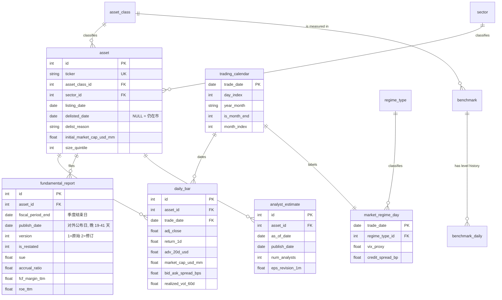
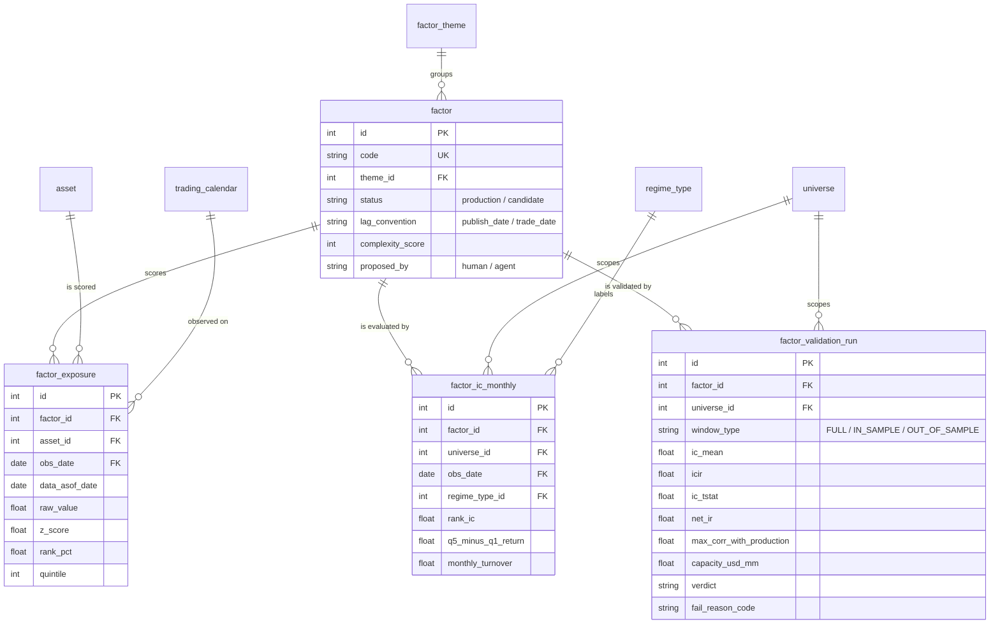
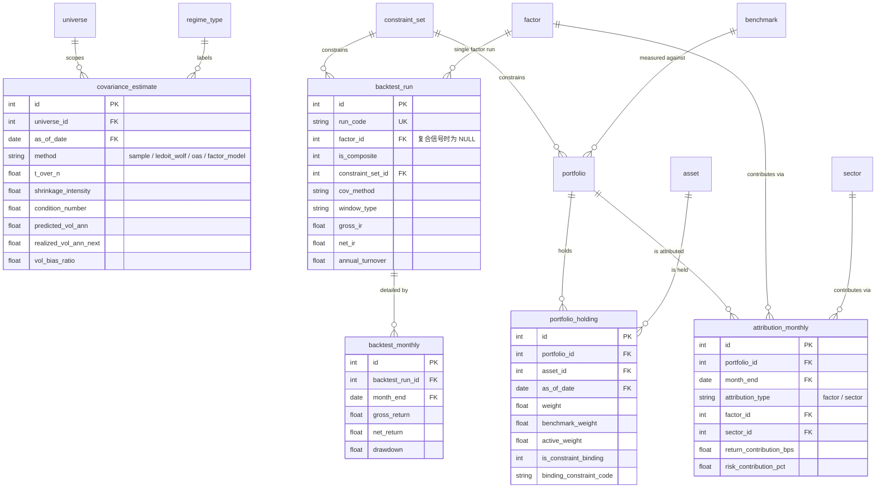
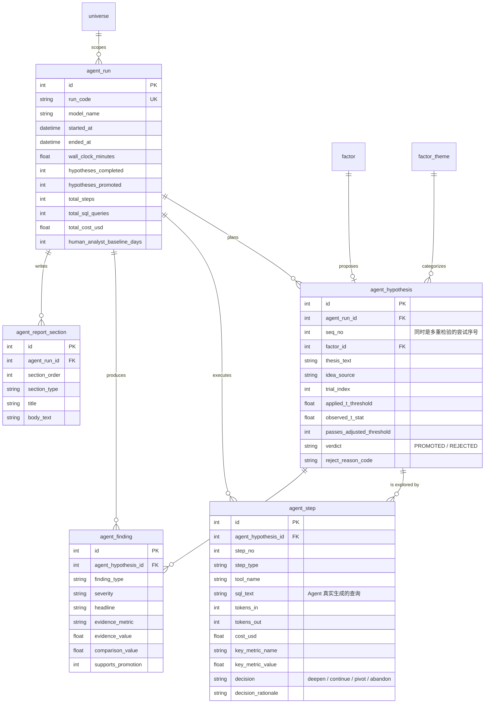

# Tessellate Capital Management 因子研究 AI Agent - ER 文档

> 业务背景, 行业科普, 术语表请见 `01-asset_management_factor_research_agent_large_business_context-cn.md`. 本文档只描述数据。

## 数据集元信息

| 项 | 值 |
|----|-----|
| 复杂度 | **Large** |
| 表数量 | **29 张** |
| 总行数 | **1,944,637 行** |
| 外键关系 | 49 条 (另有 5 条 DDL 无法表达的作用域规则, 见 §3.2) |
| `REFERENCE_DATE` | **`2026-06-30`** |
| 数据窗口 | 2022-12-01 至 2026-06-30, 899 个交易日, 43 个月末观测点, 42 个可用月度 IC |
| 最大的表 | `daily_bar` (1,067,551 行) 与 `factor_exposure` (788,416 行) |
| 生成耗时 | 约 40 秒 (TSV + SQLite 全流程) |

数据分成五个域:

| 域 | 表 | 一句话 |
|----|-----|-------|
| **A 参考数据** | `asset_class` `sector` `regime_type` `factor_theme` `universe` `benchmark` `constraint_set` `portfolio` `trading_calendar` `asset` | 枚举与主数据 |
| **B 市场与基本面时间序列** | `market_regime_day` `benchmark_daily` `daily_bar` `fundamental_report` `analyst_estimate` | 原始事实层, 全库最大 |
| **C 因子体系** | `factor` `factor_exposure` `factor_ic_monthly` `factor_validation_run` | 打分、检验、独立验证结论 |
| **D 组合与风险** | `covariance_estimate` `backtest_run` `backtest_monthly` `portfolio_holding` `attribution_monthly` | 协方差、回测、持仓、归因 |
| **E AI Agent 轨迹** | `agent_run` `agent_hypothesis` `agent_step` `agent_finding` `agent_report_section` | 本数据集的主角 |

---

## 1. ER 图

29 张表画在一张图上没法看,按域拆成四张。

### 1.1 域 A + B: 参考数据与市场时间序列



### 1.2 域 C: 因子体系



### 1.3 域 D: 组合构建、回测与归因



### 1.4 域 E: AI Agent 探索轨迹



---

## 2. 表结构详解

### 2.1 域 A: 参考数据

#### 1. asset_class

**业务用途:** 把研究池里的标的分成"单只美股"和"跨资产 ETF 代理"两类。这个区分很重要,因为 **因子逻辑只适用于股票** —— `factor_exposure` 里根本不会出现跨资产标的。跨资产 sleeve 存在的意义是让 TCM 的多资产策略有东西可配,以及给风险模型提供股票之外的相关性来源。

| 字段 | 类型 | 约束 | 说明 |
|------|------|------|------|
| `id` | INTEGER | PK | |
| `code` | VARCHAR(32) | NOT NULL, UNIQUE | 机器可读代码 |
| `name` | VARCHAR(80) | NOT NULL | 展示名 |
| `description` | VARCHAR(255) | NOT NULL | 这一类到底包含什么 |

**全表内容 (5 行):**

| id | code | name |
|----|------|------|
| 1 | `US_EQUITY` | US Common Equity |
| 2 | `EQUITY_ETF` | Equity Index ETF |
| 3 | `RATES_ETF` | Rates / Treasury ETF |
| 4 | `CREDIT_ETF` | Credit ETF |
| 5 | `COMMOD_FX_ETF` | Commodity and FX ETF |

#### 2. sector

**业务用途:** GICS 风格的 11 个板块。它有两个用途: 一是 **板块中性化** —— 组合优化时限制每个板块的权重偏离基准不超过一定幅度;二是 **板块归因** —— 把主动收益拆一份出来看看有多少来自行业押注而不是选股。`benchmark_weight` 记录该板块在基准里的权重,是计算偏离度的分母。

| 字段 | 类型 | 约束 | 说明 |
|------|------|------|------|
| `id` | INTEGER | PK | |
| `gics_code` | VARCHAR(8) | NOT NULL, UNIQUE | GICS 两位板块代码 |
| `name` | VARCHAR(80) | NOT NULL | 板块名 |
| `benchmark_weight` | FLOAT | NOT NULL | 该板块在基准中的目标权重, 11 个加总为 1.0 |

**样本数据:**

| id | gics_code | name | benchmark_weight |
|----|-----------|------|------------------|
| 6 | 35 | Health Care | 0.122 |
| 8 | 45 | Information Technology | 0.312 |
| 11 | 60 | Real Estate | 0.019 |

> **作用域说明:** `asset.sector_id` 只对 `asset_class_id = 1` 的股票非空。跨资产 ETF 代理的 `sector_id` 是 NULL,DDL 不强制这一点,写查询时要用 LEFT JOIN 或显式过滤。

#### 3. regime_type

**业务用途:** 市场状态的枚举。**这张表是整个数据集里最容易被低估的一张。** 一个因子在全样本上的平均 IC 可能看着不错,但按 regime 拆开就会发现它只在某一种环境下有效,换个环境甚至反向。没有这张表,`NEWS_SENT_7D` 那个陷阱就无从暴露。

| 字段 | 类型 | 约束 | 说明 |
|------|------|------|------|
| `id` | INTEGER | PK | |
| `code` | VARCHAR(32) | NOT NULL, UNIQUE | |
| `name` | VARCHAR(80) | NOT NULL | |
| `description` | VARCHAR(255) | NOT NULL | 这种市场环境长什么样 |
| `typical_vol_ann` | FLOAT | NOT NULL | 该 regime 的典型年化波动率 |

**全表内容 (4 行):**

| id | code | typical_vol_ann | 覆盖月份 |
|----|------|----------------|---------|
| 1 | `RECOVERY` | 0.165 | 2022-12 至 2023-10 (11 个月) |
| 2 | `LOW_VOL_BULL` | 0.121 | 2023-11 至 2024-07, 以及 2025-12 至 2026-06 (共 16 个月, **两段不连续**) |
| 3 | `HIGH_VOL_STRESS` | 0.312 | 2024-08 至 2025-03 (8 个月) |
| 4 | `RISING_RATE` | 0.198 | 2025-04 至 2025-11 (8 个月) |

#### 4. factor_theme

**业务用途:** 因子的最上层分类。业内通行的组织方式是三层: **单个 signal → 聚合成 factor → 归入 theme**。本数据集直接从 factor 这一层开始,theme 用来回答"我的因子库在主题上是不是过度集中"这类组合层面的问题。

| 字段 | 类型 | 约束 | 说明 |
|------|------|------|------|
| `id` | INTEGER | PK | |
| `code` | VARCHAR(32) | NOT NULL, UNIQUE | |
| `name` | VARCHAR(80) | NOT NULL | |
| `economic_rationale` | VARCHAR(255) | NOT NULL | 这个主题为什么应该赚钱的经济学解释 |

**全表内容 (9 行):** `VALUE` `GROWTH` `QUALITY` `MOMENTUM` `TECHNICAL` `LOW_VOL` `LIQUIDITY` `CARRY` `SENTIMENT`。

#### 5. universe

**业务用途:** 研究池定义。**同一个因子在不同池子上的表现差异,是容量分析唯一的直接证据。** `MICRO_VALUE` 在 `US_ALL` 上 RankIC 0.0316 看着挺好,在 `US_MICRO_250` 上 0.0746,在 `US_LARGE_500` 上只有 0.0111 —— 三个数字放在一起,结论立刻就出来了。

| 字段 | 类型 | 约束 | 说明 |
|------|------|------|------|
| `id` | INTEGER | PK | |
| `code` | VARCHAR(32) | NOT NULL, UNIQUE | |
| `name` | VARCHAR(80) | NOT NULL | |
| `selection_rule` | VARCHAR(255) | NOT NULL | 成分股的筛选规则, 每个调仓日重新执行 |
| `approx_member_count` | INTEGER | NOT NULL | 典型成分数量 |

**全表内容 (4 行):**

| id | code | selection_rule | 数量 |
|----|------|---------------|------|
| 1 | `US_ALL` | 观测日实际在市的全部美股 | 1,080 到 1,200 |
| 2 | `US_LARGE_500` | 每次调仓时市值最大的 500 只 | 498 到 500 |
| 3 | `US_MICRO_250` | 每次调仓时市值最小的 250 只 | 246 到 250 |
| 4 | `CROSS_ASSET_40` | 跨资产 sleeve 的 40 个 ETF 代理 | 40 |

> **池子的划分只在股票内部排名。** 40 个跨资产 ETF 代理的市值恰好落在美股市值分布的中上段,如果排名时把它们算进去,每个月会从 top 500 里挤掉二十几个名额,`US_LARGE_500` 就永远凑不满 500 只。生成器给非股票一个负市值,让它们统一排到全部股票之后。
>
> **为什么偶尔是 498 / 499 而不是恰好 500:** `factor_ic_monthly` 只统计 **当月算得出前瞻收益** 的标的,而 top 500 里当月正好退市的那一两只算不出来。同理 `US_MICRO_250` 会落在 246-250。

> **作用域说明:** `factor_ic_monthly` 与 `factor_validation_run` 只对 universe 1/2/3 产出数据。`CROSS_ASSET_40` 没有股票因子,不参与因子检验。

#### 6. benchmark

**业务用途:** 业绩基准。组合的主动收益 (active return) 就是组合收益减去基准收益,tracking error 也是相对它算的。

| 字段 | 类型 | 约束 | 说明 |
|------|------|------|------|
| `id` | INTEGER | PK | |
| `code` | VARCHAR(32) | NOT NULL, UNIQUE | |
| `name` | VARCHAR(120) | NOT NULL | |
| `asset_class_id` | INTEGER | FK → `asset_class.id` | 该基准衡量的资产类别 |

**全表内容 (4 行):** `TCM_US_CORE`、`TCM_US_SMALL`、`TCM_MULTI_6040`、`TCM_CASH`。

#### 7. constraint_set

**业务用途:** 组合优化的约束档位。**这张表把"约束不是免费的"变成了一组可对比的数字。** 同一个复合信号跑四遍,只换约束,净 IR 从 1.32 掉到 0.61。

| 字段 | 类型 | 约束 | 说明 |
|------|------|------|------|
| `id` | INTEGER | PK | |
| `code` | VARCHAR(32) | NOT NULL, UNIQUE | |
| `name` | VARCHAR(80) | NOT NULL | |
| `max_asset_weight` | FLOAT | NOT NULL | 单票权重上限 |
| `max_sector_deviation` | FLOAT | NOT NULL | 板块权重相对基准的最大偏离, 0.0 表示严格中性 |
| `max_annual_turnover` | FLOAT | NOT NULL | 年换手上限, 1.2 = 120% |
| `max_tracking_error` | FLOAT | NOT NULL | 跟踪误差上限 |
| `max_adv_participation` | FLOAT | NOT NULL | 单日成交额参与度上限 |

**全表内容 (4 行):**

| id | code | 单票 | 板块偏离 | 年换手 | TE | ADV 参与 |
|----|------|------|---------|--------|----|---------|
| 1 | `UNCONSTRAINED` | 10% | 100% | **2500%** | 50% | 100% |
| 2 | `SECTOR_NEUTRAL` | 5% | **0%** | 2000% | 50% | 100% |
| 3 | `LIQUIDITY_TIGHT` | 3% | 3% | 2000% | 50% | **5%** |
| 4 | `FULL_PRODUCTION` | **2.5%** | **2%** | **120%** | **5%** | **5%** |

#### 8. portfolio

**业务用途:** 组合主数据。两个实盘组合外加一个 paper 组合。**`TCM_ATLAS_PAPER` 是本数据集唯一有持仓明细的组合** —— 它按 Atlas 推进的 4 个因子等权合成打分构建,是"如果真的按 Agent 的结论去投,会长什么样"的可视化。

| 字段 | 类型 | 约束 | 说明 |
|------|------|------|------|
| `id` | INTEGER | PK | |
| `code` | VARCHAR(32) | NOT NULL, UNIQUE | |
| `name` | VARCHAR(120) | NOT NULL | |
| `portfolio_type` | VARCHAR(16) | NOT NULL | `live` 或 `paper` |
| `benchmark_id` | INTEGER | FK → `benchmark.id` | |
| `universe_id` | INTEGER | FK → `universe.id` | |
| `constraint_set_id` | INTEGER | FK → `constraint_set.id` | |
| `aum_usd_mm` | FLOAT | NOT NULL | paper 组合为 0 |
| `inception_date` | DATE | NOT NULL | |

**全表内容 (3 行):**

| id | code | type | AUM (mm) | universe | constraint |
|----|------|------|----------|----------|-----------|
| 1 | `TCM_USCE` | live | 14,200 | US_LARGE_500 | FULL_PRODUCTION |
| 2 | `TCM_MAS` | live | 6,800 | CROSS_ASSET_40 | FULL_PRODUCTION |
| 3 | `TCM_ATLAS_PAPER` | paper | 0 | US_LARGE_500 | FULL_PRODUCTION |

#### 9. trading_calendar

**业务用途:** 交易日历。**所有时间序列表的日期都必须落在这张表里**,这是全库的时间主键。`is_month_end` 标出调仓日 —— 因子暴露、协方差估计、组合权重全部锚定在这 43 个日期上。`month_index` 对每个交易日都有定义 (它所属月份的序号 0 到 42),这是把日频数据聚合到月度的分组键。

| 字段 | 类型 | 约束 | 说明 |
|------|------|------|------|
| `trade_date` | DATE | PK | |
| `day_index` | INTEGER | NOT NULL | 从 0 开始的连续交易日序号 |
| `year_month` | VARCHAR(7) | NOT NULL | `YYYY-MM` |
| `is_month_end` | INTEGER | NOT NULL | 1 = 该月最后一个交易日 (调仓日) |
| `is_quarter_end` | INTEGER | NOT NULL | 1 = 3/6/9/12 月的最后一个交易日 |
| `month_index` | INTEGER | NOT NULL | 所属月份序号 0-42 |

**样本数据:**

| trade_date | day_index | year_month | is_month_end | is_quarter_end | month_index |
|------------|-----------|-----------|--------------|----------------|-------------|
| 2022-12-01 | 0 | 2022-12 | 0 | 0 | 0 |
| 2022-12-30 | 21 | 2022-12 | 1 | 1 | 0 |
| 2026-06-30 | 898 | 2026-06 | 1 | 1 | 42 |

> **口径说明:** 日历剔除了 NYSE 的十个全天休市日 (元旦、马丁路德金日、总统日、耶稣受难日、阵亡将士纪念日、六月节、独立日、劳动节、感恩节、圣诞节)。899 个交易日 ÷ 43 个月 ≈ 每月 20.9 天。

#### 10. asset

**业务用途:** 可投资标的主数据。**这张表最关键的字段是 `delisted_date`。** 120 只标的有非空的退市日,它们在退市前 12 个月经历了一段死亡螺旋。一个加了 `WHERE delisted_date IS NULL` 的分析会系统性高估收益 —— 这是幸存者偏差在本数据集里的具体载体。

> **死亡螺旋的量级要说清楚,因为它有两个数字。** 生成器注入的是 **每月 -7.5%** 的特异漂移 (常量 `DELISTED_PRE_DELIST_MONTHLY_DRIFT`,连续 12 个月折合累计约 -61%)。但它只是注入项:月度总收益还要叠加 `beta × 市场收益`,再被 `max(1 + 总收益, 0.25)` 这条 -75% 的下限截断。**落地后从月末复权价实测出来的是每月约 -5.4%。** 文档里凡是说"实测"的地方指的都是后者。

`size_quintile` 按初始市值把股票分成 5 档 (1 = 最小),用于容量分析的分组。注意它是 **静态** 的,而按 `daily_bar.market_cap_usd_mm` 动态分组会得到略有差异的结果,两种做法都合理,写查询时说清楚用的哪一种即可。

| 字段 | 类型 | 约束 | 说明 |
|------|------|------|------|
| `id` | INTEGER | PK | |
| `ticker` | VARCHAR(12) | NOT NULL, UNIQUE | 3 或 4 位字母 |
| `company_name` | VARCHAR(160) | NOT NULL | |
| `asset_class_id` | INTEGER | FK → `asset_class.id` | |
| `sector_id` | INTEGER | FK → `sector.id`, NULLABLE | 跨资产代理为 NULL |
| `listing_date` | DATE | NOT NULL | 全部早于数据窗口起点 |
| `delisted_date` | DATE | NULLABLE | **NULL = 仍在市**, 非空 = 已退市 |
| `delist_reason` | VARCHAR(32) | NULLABLE | `MERGER` / `BANKRUPTCY` / `EXCHANGE_DELISTING` / `GOING_PRIVATE` |
| `initial_market_cap_usd_mm` | FLOAT | NOT NULL | 窗口起点的市值 (百万美元) |
| `size_quintile` | INTEGER | NOT NULL | 1 = 最小市值, 5 = 最大;**0 = 不适用** (40 个跨资产 ETF 代理没有可比市值) |
| `country` | VARCHAR(2) | NOT NULL | 恒为 `US` |

**样本数据:**

| id | ticker | company_name | class | sector | delisted_date | delist_reason | mcap (mm) | size_q |
|----|--------|--------------|-------|--------|---------------|--------------|-----------|--------|
| 5 | GYK | Guzman, Hoffman and Baldwin | 1 | 3 | NULL | NULL | 4,785.78 | 4 |
| 1081 | SYEG | Humphrey-Baker | 1 | 4 | 2024-03-26 | BANKRUPTCY | 120.00 | 1 |
| 1082 | JSJ | Washington, Lynch and Johnson | 1 | 7 | 2024-07-21 | BANKRUPTCY | 12,725.39 | 5 |
| 1210 | ILVF | Treasury Curve Proxy Series 03 | 3 | NULL | NULL | NULL | 4,431.53 | **0** |

> **注意 id 1082:** 一只市值 127 亿美元的大公司也可能破产退市。退市标的不全是微盘股,这一点对幸存者偏差分析很重要 —— 不能简单地用"过滤掉小市值"来替代"正确处理退市"。

---

### 2.2 域 B: 市场与基本面时间序列

#### 11. market_regime_day

**业务用途:** 每个交易日的市场状态标签,外加三个宏观风险指标。做 regime 拆分分析时,先把这张表按 `trade_date` 关联上去,再按 `regime_type_id` 分组即可。三个指标提供了"为什么这个月被标成这个 regime"的可核对依据。

| 字段 | 类型 | 约束 | 说明 |
|------|------|------|------|
| `trade_date` | DATE | PK, FK → `trading_calendar.trade_date` | |
| `regime_type_id` | INTEGER | FK → `regime_type.id` | |
| `vix_proxy` | FLOAT | NOT NULL | 隐含波动率指数代理, 约等于年化波动率 × 100 |
| `term_spread_bp` | FLOAT | NOT NULL | 期限利差 (bps), 加息期会倒挂为负 |
| `credit_spread_bp` | FLOAT | NOT NULL | 信用利差 (bps), 压力期显著走阔 |

**样本数据:**

| trade_date | regime_type_id | vix_proxy | term_spread_bp | credit_spread_bp |
|------------|----------------|-----------|----------------|------------------|
| 2023-06-30 | 1 (RECOVERY) | 16.77 | 54.4 | 115.1 |
| 2024-09-30 | 3 (HIGH_VOL_STRESS) | 34.95 | 9.4 | 374.9 |

#### 12. benchmark_daily

**业务用途:** 四条基准的日频净值与收益。计算组合主动收益时它是减数。`TCM_CASH` 那条线相当于无风险利率 (年化约 4.3%),做 Sharpe ratio 时用得上。

> **`TCM_US_CORE` 是真的等于它所代表的那个股票池,这一点是刻意保证的。** 它由 `daily_bar` 里全部美股按 **上一交易日市值** 加权算出 (权重必须在当天开盘前就已知,这是指数编制的标准做法;退市标的在最后一个交易日之后自然退出篮子),再叠加一个很小的跟踪噪声。实测年化 **+10.5%**,与股票池自身的市值加权收益基本重合。
>
> **为什么强调这件事:** 如果基准是"另外造出来的一条线",那么任何按本文档指示做 `组合收益 − 基准收益` 的分析师,拿到的主动收益都会带一个跟选股能力无关的系统性偏差,而且极难察觉。`TCM_US_SMALL` 同理,它是 `size_quintile ∈ {1,2}` 那批票的市值加权 (年化 +14.2%,小盘更猛);`TCM_MULTI_6040` 是 0.6 × core 加债券端票息 (+7.8%)。

| 字段 | 类型 | 约束 | 说明 |
|------|------|------|------|
| `id` | INTEGER | PK | |
| `benchmark_id` | INTEGER | FK → `benchmark.id` | |
| `trade_date` | DATE | FK → `trading_calendar.trade_date` | |
| `close_level` | FLOAT | NOT NULL | 指数点位, 起点统一为 100 |
| `return_1d` | FLOAT | NOT NULL | 当日收益率 |

**索引:** `(benchmark_id, trade_date)` 是天然的复合查询键。

#### 13. daily_bar

**业务用途:** **全库最大的表 (1,067,551 行), 也是一切计算的源头。** 因子的前瞻收益、已实现波动率、市值分组、交易成本参数,全部从这张表来。

一个必须理解的细节: **`close_price` 是原始价格,`adj_close` 是含股息再投资的复权价格。算收益必须用 `adj_close`,用 `close_price` 会漏掉分红。** `return_1d` 已经是按 `adj_close` 口径算好的,直接用即可。

流动性三件套 (`adv_20d_usd`、`bid_ask_spread_bps`、`dollar_volume_usd`) 是成本模型和容量模型的全部输入。价差按 `2.4 + 900 / sqrt(市值)` 生成,这条平方根反比关系是美股微观结构里最稳定的经验规律之一 —— 千亿市值的大盘股约 5 bps,一亿市值的微盘股可以到 90 bps 以上。

| 字段 | 类型 | 约束 | 说明 |
|------|------|------|------|
| `id` | INTEGER | PK | |
| `asset_id` | INTEGER | FK → `asset.id` | |
| `trade_date` | DATE | FK → `trading_calendar.trade_date` | |
| `close_price` | FLOAT | NOT NULL | 原始收盘价 (USD) |
| `adj_close` | FLOAT | NOT NULL | **含股息再投资的复权价, 算收益用这个** |
| `return_1d` | FLOAT | NOT NULL | 当日总收益 (含股息) |
| `volume_shares` | INTEGER | NOT NULL | 成交股数 |
| `dollar_volume_usd` | FLOAT | NOT NULL | 当日成交金额 |
| `adv_20d_usd` | FLOAT | NOT NULL | 20 日平均成交金额, **冲击成本与容量的分母** |
| `market_cap_usd_mm` | FLOAT | NOT NULL | 当日市值 (百万美元) |
| `bid_ask_spread_bps` | FLOAT | NOT NULL | 买卖价差 (bps), **交易成本的第一块** |
| `realized_vol_60d` | FLOAT | NOT NULL | 60 日已实现波动率 (年化) |

**样本数据 (asset_id = 5, 三年间的两个时点):**

| trade_date | close_price | adj_close | return_1d | dollar_volume_usd | adv_20d_usd | market_cap_usd_mm | spread_bps | vol_60d |
|------------|-------------|-----------|-----------|-------------------|-------------|-------------------|------------|---------|
| 2023-06-30 | 36.2674 | 36.2775 | 0.002125 | 8,904,519 | 25,501,359 | 3,685.87 | 17.22 | 0.23141 |
| 2026-06-30 | 171.8465 | 172.1380 | -0.001575 | 56,562,973 | 117,647,572 | 17,464.85 | 9.21 | 0.23798 |

> **作用域说明:** 已退市标的在 `delisted_date` 之后没有行情行。做月度前瞻收益时,必须检查下一个月末是否存在,否则 `LEAD()` 会跨过一个空洞取到几个月后的价格。推荐写法见 SQL 文档 Q1 的 `fwd` CTE。

#### 14. fundamental_report

**业务用途:** PIT 财报。**这张表承载了本数据集最重要的两条陷阱 (T1 look-ahead 与 T8 修订偏差),它的两组日期和 version 字段就是陷阱的开关。**

理解这张表只需要抓住三点:

1. **`fiscal_period_end` 是财季结束日,`publish_date` 是数字对外公布日,两者相差 19 到 41 天。** 在 `fiscal_period_end` 那一天,市场上没有任何人知道这份财报的内容。
2. **同一个 `(asset_id, fiscal_period_end)` 可能有两行:** `version = 1` 是原始公布版,`version = 2` 是事后修订版 (`is_restated = 1`),修订版的 `publish_date` 比原始版晚 78 到 132 天。**26.3%** 的公司是"会修订的申报人" (316 / 1,200),全表 **19.3%** 的行是 version 2。
3. **各公司的财季结束日是错开的** (三分之一在同一月),这既符合现实 (很多公司不是 12 月财年),也保证了每个月都有约三分之一的标的能触发 look-ahead 陷阱。

| 字段 | 类型 | 约束 | 说明 |
|------|------|------|------|
| `id` | INTEGER | PK | |
| `asset_id` | INTEGER | FK → `asset.id` | |
| `fiscal_period_end` | DATE | NOT NULL | 财季结束日。**用它做 as-of 过滤 = look-ahead bias** |
| `publish_date` | DATE | NOT NULL | 对外公布日。**正确的 as-of 过滤字段** |
| `version` | INTEGER | NOT NULL | 1 = 原始版, 2 = 修订版 |
| `is_restated` | INTEGER | NOT NULL | 1 表示本行是修订版 |
| `revenue_usd_mm` | FLOAT | NOT NULL | 营业收入 |
| `net_income_usd_mm` | FLOAT | NOT NULL | 净利润 |
| `operating_cash_flow_usd_mm` | FLOAT | NOT NULL | 经营性现金流 |
| `capex_usd_mm` | FLOAT | NOT NULL | 资本开支 |
| `total_equity_usd_mm` | FLOAT | NOT NULL | 股东权益 |
| `eps_actual` | FLOAT | NOT NULL | 实际每股收益 |
| `sue` | FLOAT | NOT NULL | 标准化盈余意外, 约 N(0,1)。**PEAD 因子的原料** |
| `accrual_ratio` | FLOAT | NOT NULL | 应计占比。**越低盈余质量越高**, 与 ACC_QUALITY 反向 |
| `fcf_margin_ttm` | FLOAT | NOT NULL | TTM 自由现金流利润率。**version 1 与 2 的差就是 T8 陷阱** |
| `roe_ttm` | FLOAT | NOT NULL | TTM 净资产收益率 |

**样本数据 (asset_id = 5):**

| id | fiscal_period_end | publish_date | version | is_restated | revenue | net_income | eps_actual | sue | accrual_ratio | fcf_margin_ttm | roe_ttm |
|----|-------------------|--------------|---------|-------------|---------|-----------|-----------|-----|---------------|----------------|---------|
| 70 | 2023-01-31 | 2023-03-13 | 1 | 0 | 1,538.16 | 101.89 | 2.1757 | -0.0736 | -0.02717 | 0.15938 | 0.05722 |
| 71 | 2023-04-28 | 2023-06-01 | 1 | 0 | 1,539.30 | 52.91 | 1.1298 | 0.4778 | -0.01412 | 0.14232 | 0.03789 |
| 72 | 2023-07-31 | 2023-09-09 | 1 | 0 | 2,732.83 | 237.40 | 5.0694 | -0.2237 | 0.03170 | 0.11324 | 0.07220 |

> **这是全库最容易写错的一张表。** 任何关联它的查询都必须显式声明:(a) 用 `publish_date` 还是 `fiscal_period_end` 做 as-of 过滤;(b) 取 `version = 1` 还是最新版本。两个选择组合出四种口径,结果可以差好几倍。

#### 15. analyst_estimate

**业务用途:** 卖方一致预期的月度快照,是 `EPS_REV_60D` 因子 (H02) 的原料。`num_analysts` 与市值强相关 —— 大盘股有 20 多个分析师跟踪,微盘股常常只有 1 到 2 个,这本身就解释了为什么很多"信息类"因子在小盘股上更有效。

注意它也带 `publish_date`,只是滞后很短 (2 天) —— 数据商在月末后两天发布汇总。**滞后短不等于可以忽略,严谨的做法仍然是按 `publish_date` 过滤。**

| 字段 | 类型 | 约束 | 说明 |
|------|------|------|------|
| `id` | INTEGER | PK | |
| `asset_id` | INTEGER | FK → `asset.id` | |
| `as_of_date` | DATE | NOT NULL | 快照对应的月末 |
| `publish_date` | DATE | NOT NULL | 数据商发布日 = `as_of_date + 2 天` |
| `num_analysts` | INTEGER | NOT NULL | 覆盖的分析师数量 |
| `fy1_eps_mean` | FLOAT | NOT NULL | 下一财年 EPS 一致预期 |
| `eps_revision_1m` | FLOAT | NOT NULL | 过去 1 个月的预期修正幅度 |
| `eps_revision_3m` | FLOAT | NOT NULL | 过去 3 个月的预期修正幅度 |
| `rating_mean` | FLOAT | NOT NULL | 平均评级 1-5, **越低越看多** |

**样本数据 (asset_id = 5):**

| as_of_date | publish_date | num_analysts | fy1_eps_mean | eps_revision_1m | eps_revision_3m | rating_mean |
|------------|--------------|--------------|--------------|-----------------|-----------------|-------------|
| 2022-12-30 | 2023-01-01 | 22 | 1.5766 | 0.00133 | 0.00466 | 2.93 |
| 2023-01-31 | 2023-02-02 | 22 | 1.0796 | 0.01442 | 0.02856 | 3.00 |

---

### 2.3 域 C: 因子体系

#### 16. factor

**业务用途:** 因子定义表,只有 16 行,但它是域 C 的中枢。

**6 个 `status = 'production'` 的因子是 TCM 已经在用的生产因子库**,由人类研究员在 2017 到 2022 年间陆续加入。它们在本数据集里的角色是 **对照基线** —— 任何新因子都要跟它们比相关性,相关性太高就说明不是新东西。

**10 个 `status = 'candidate'` 的因子全部由 Atlas 在 2026-07-06 这一轮里提出**,`proposed_by = 'agent'`。

两个容易忽略但很重要的字段:

- **`lag_convention`** 声明这个因子的 as-of 规则。`publish_date` 表示它依赖基本面数据、必须按公布日对齐;`trade_date` 表示纯价格类因子、当天可得。
- **`complexity_score` 与 `feature_count`** 记录因子表达式的操作符数量和使用的原始字段数。这两个字段用来复现业内所谓的"复杂度控制"正则 —— **表达式越复杂,过拟合的可能性越大**,Agent 生成的因子尤其需要这道闸。

| 字段 | 类型 | 约束 | 说明 |
|------|------|------|------|
| `id` | INTEGER | PK | |
| `code` | VARCHAR(32) | NOT NULL, UNIQUE | 因子代码, 全库通用 |
| `name` | VARCHAR(120) | NOT NULL | 人类可读的因子名 |
| `theme_id` | INTEGER | FK → `factor_theme.id` | |
| `status` | VARCHAR(16) | NOT NULL | `production` 或 `candidate` |
| `lag_convention` | VARCHAR(24) | NOT NULL | `publish_date` 或 `trade_date` |
| `complexity_score` | INTEGER | NOT NULL | 表达式里的操作符个数 |
| `feature_count` | INTEGER | NOT NULL | 用到的原始字段数 |
| `proposed_by` | VARCHAR(16) | NOT NULL | `human` 或 `agent` |
| `first_proposed_date` | DATE | NOT NULL | 候选因子统一为 2026-07-06 |

**全表内容 (16 行):**

| id | code | theme | status | lag_convention | complexity | features | proposed_by |
|----|------|-------|--------|----------------|-----------|----------|-------------|
| 1 | `VAL_EP` | VALUE | production | publish_date | 3 | 2 | human |
| 2 | `MOM_12_1` | MOMENTUM | production | trade_date | 4 | 1 | human |
| 3 | `QUA_ROE` | QUALITY | production | publish_date | 3 | 2 | human |
| 4 | `VOL_LOW_60D` | LOW_VOL | production | trade_date | 4 | 1 | human |
| 5 | `SIZ_LOG_MCAP` | LIQUIDITY | production | trade_date | 3 | 1 | human |
| 6 | `LIQ_AMIHUD` | LIQUIDITY | production | trade_date | 5 | 2 | human |
| 7 | `ACC_QUALITY` | QUALITY | candidate | publish_date | 6 | 3 | agent |
| 8 | `EPS_REV_60D` | GROWTH | candidate | publish_date | 5 | 3 | agent |
| 9 | `PEAD_SUE` | GROWTH | candidate | publish_date | 7 | 4 | agent |
| 10 | `STR_REV_5D` | TECHNICAL | candidate | trade_date | 3 | 1 | agent |
| 11 | `VOL_SKEW_ADJ` | LOW_VOL | candidate | trade_date | **9** | 2 | agent |
| 12 | `MICRO_VALUE` | VALUE | candidate | publish_date | 8 | 4 | agent |
| 13 | `NEWS_SENT_7D` | SENTIMENT | candidate | publish_date | 6 | 2 | agent |
| 14 | `SEARCH_TREND` | SENTIMENT | candidate | publish_date | 5 | 2 | agent |
| 15 | `DIV_GROWTH_5Y` | QUALITY | candidate | publish_date | 6 | 3 | agent |
| 16 | `FCF_MARGIN_TTM` | CARRY | candidate | publish_date | 6 | 4 | agent |

> 留意 `VOL_SKEW_ADJ` 的 `complexity_score = 9`,是全库最高的。它同时也是被判定为伪新因子的那一个 —— **复杂度最高、原创性最低,这两件事同时出现不是巧合。**

#### 17. factor_exposure

**业务用途:** **全库第二大的表 (788,416 行)。** 每个因子在每个月末、对每只在池股票都有一行打分。16 个因子 × 43 个月 × 约 1,150 只在市股票 ≈ 79 万行。

四个打分字段是层层递进的:

- **`raw_value`** 是业务量纲的原始值 (比如 `VAL_EP` 的 0.052 就是 5.2% 的盈利收益率)。分析师看它判断"这个数合不合理"。
- **`z_score`** 是横截面标准化后的分数,均值 0 标准差 1。**跨因子比较只能用它。**
- **`rank_pct`** 是该月横截面的百分位排名 (0 到 1)。
- **`quintile`** 由 `rank_pct` 切成 5 档,1 最低 5 最高。分层单调性检验直接按它分组。

**`data_asof_date` 是这张表里最容易被忽略的字段。** 它记录这个打分背后的数据有多陈旧: `lag_convention = 'publish_date'` 的因子是 `obs_date - 24 天`,`trade_date` 的因子就是 `obs_date` 本身。看到一个因子的 `data_asof_date` 比 `obs_date` 早很多,就要警惕它的实际可用性。

| 字段 | 类型 | 约束 | 说明 |
|------|------|------|------|
| `id` | INTEGER | PK | |
| `factor_id` | INTEGER | FK → `factor.id` | |
| `asset_id` | INTEGER | FK → `asset.id` | |
| `obs_date` | DATE | FK → `trading_calendar.trade_date` | 月末观测日 |
| `data_asof_date` | DATE | NOT NULL | 打分背后数据的截止日 |
| `raw_value` | FLOAT | NOT NULL | 业务量纲的原始值 |
| `z_score` | FLOAT | NOT NULL | 横截面标准化打分 |
| `rank_pct` | FLOAT | NOT NULL | 横截面百分位 0-1 |
| `quintile` | INTEGER | NOT NULL | 1-5, **1 = 打分最低** |

**样本数据 (factor_id = 7 即 ACC_QUALITY, obs_date = 2025-06-30):**

| asset_id | obs_date | data_asof_date | raw_value | z_score | rank_pct | quintile |
|----------|----------|----------------|-----------|---------|----------|----------|
| 1 | 2025-06-30 | 2025-06-06 | 0.029573 | 0.282258 | 0.615315 | 4 |
| 2 | 2025-06-30 | 2025-06-06 | 0.027557 | 0.233103 | 0.589189 | 3 |

> **作用域说明:** 只有 `asset_class_id = 1` 的股票有因子暴露。跨资产 ETF 代理在这张表里完全不出现,DDL 不强制,写查询时不需要额外过滤,但要知道 join 之后行数会少 40 个标的。

#### 18. factor_ic_monthly

**业务用途:** **Model Validation 组口径的月度 RankIC。这是全数据集里"裁判"的角色 —— 它由统一的评价流水线产出,研究员和 Agent 都无权改写。**

口径是死的: **月末因子排名 vs 下一个自然月总收益的 Spearman 相关系数** (月末复权价→下月末复权价的总收益, 不做 beta 调整)。16 个因子 × 3 个池子 × 42 个月 = 2,016 行。

除了 IC,这张表还带两个每月都算的量:`q5_minus_q1_return` (当月多空毛收益) 与 `monthly_turnover` (Q5 篮子被换掉的比例)。有了它们,**成本后的业绩可以完全从这张表推出来,不需要再回原始数据**。

`regime_type_id` 直接冗余在这里,是为了让 regime 拆分查询不必再 join 一次日历。

| 字段 | 类型 | 约束 | 说明 |
|------|------|------|------|
| `id` | INTEGER | PK | |
| `factor_id` | INTEGER | FK → `factor.id` | |
| `universe_id` | INTEGER | FK → `universe.id` | 只有 1/2/3 |
| `obs_date` | DATE | FK → `trading_calendar.trade_date` | |
| `regime_type_id` | INTEGER | FK → `regime_type.id` | 该月所属 regime |
| `rank_ic` | FLOAT | NOT NULL | 该月的 RankIC |
| `n_assets` | INTEGER | NOT NULL | 参与计算的标的数 |
| `fwd_horizon_days` | INTEGER | NOT NULL | 前瞻期, 恒为 21 (一个月) |
| `q5_minus_q1_return` | FLOAT | NOT NULL | 当月多空毛收益 (月度, 未年化) |
| `monthly_turnover` | FLOAT | NOT NULL | Q5 篮子的月度更换比例 |

**样本数据 (factor_id = 7, universe_id = 1):**

| obs_date | regime_type_id | rank_ic | n_assets | q5_minus_q1_return | monthly_turnover |
|----------|----------------|---------|----------|--------------------|------------------|
| 2022-12-30 | 1 | 0.001892 | 1200 | -0.000489 | 1.000000 |
| 2023-01-31 | 1 | -0.016152 | 1200 | -0.008901 | 0.195833 |

> **三点口径提醒:**
> 1. 第一个观测月的 `monthly_turnover` 恒为 1.0,因为没有上个月可比,**自己做换手统计时应排除** (SQL 文档 Q6 就加了 `month_index > 0`)。
> 2. **但 `factor_validation_run.annual_turnover` 刻意 *没有* 排除它** —— 它对全部 42 个月取均值。所以官方值会比 Q6 那种排除首月的重算值系统性偏高一点,低换手因子上尤其明显 (`SIZ_LOG_MCAP` 官方 0.79 对重算 0.22)。这不是 bug:官方口径是一个固定不变的评价流水线,一旦为某个因子调整样本,跨因子就不可比了。**看到两个数不一样时,先确认对方排没排首月。**
> 3. 横截面方差为零的 (因子, 月份) 组合会被 **整行剔除** 而不是填 0 —— 填 0 会把"没有信息"伪装成"没有预测力"。

#### 19. factor_validation_run

**业务用途:** Model Validation 组出具的正式验证结论 (68 行)。**这是全数据集信息密度最高的一张表** —— 一行 24 个字段,把一个因子该看的东西全说完了。

**68 行不是"因子 × 池子 × 窗口"的满笛卡尔积**,结构是这样的:

| universe | window_type | 覆盖的因子 | 行数 |
|----------|-------------|-----------|------|
| 1 `US_ALL` | `FULL` / `IN_SAMPLE` / `OUT_OF_SAMPLE` | 全部 16 个 | 48 |
| 2 `US_LARGE_500` | 仅 `FULL` | **只有 10 个候选因子** | 10 |
| 3 `US_MICRO_250` | 仅 `FULL` | **只有 10 个候选因子** | 10 |

**6 个生产因子在 `US_LARGE_500` / `US_MICRO_250` 上没有验证行** —— 它们早就上线了,验证组不会为已上线的因子重复做池子拆分。写 Q18 那种按池子透视的查询时,记得用 `f.status = 'candidate'` 过滤,否则 6 个生产因子会带着三列 NULL 出现在结果里。

`verdict` 由写死在生成器里的规则判定,研究员改不了。判定顺序即优先级:

1. `max_corr_with_production > 0.75` → **FAIL / REDUNDANT_WITH_EXISTING**
2. 该因子在各 regime 上的 IC 出现符号翻转 (最大 > 0.02 且最小 < -0.02) → **FAIL / REGIME_DEPENDENT**
3. 微盘池 IC 超过全池 IC 两倍且微盘容量 < 5 亿美元 → **FAIL / CAPACITY_CONSTRAINED**
4. `ic_tstat < applied_t_threshold` → **FAIL / FAILS_MULTIPLE_TESTING**
5. `capacity_usd_mm < 500` → **FAIL / CAPACITY_CONSTRAINED**
6. `net_ir < 0.20` → **FAIL / COST_PROHIBITIVE**
7. `net_ir < 0.45` → **CONDITIONAL**
8. 否则 → **PASS**

| 字段 | 类型 | 约束 | 说明 |
|------|------|------|------|
| `id` | INTEGER | PK | |
| `factor_id` | INTEGER | FK → `factor.id` | |
| `universe_id` | INTEGER | FK → `universe.id` | |
| `window_type` | VARCHAR(16) | NOT NULL | `FULL` / `IN_SAMPLE` / `OUT_OF_SAMPLE` |
| `sample_start` / `sample_end` | DATE | NOT NULL | 窗口起止 |
| `n_months` | INTEGER | NOT NULL | 有效月份数 |
| `ic_mean` / `ic_std` | FLOAT | NOT NULL | 月度 IC 的均值与标准差 |
| `icir` | FLOAT | NOT NULL | `ic_mean / ic_std`, **不年化** |
| `ic_tstat` | FLOAT | NOT NULL | `ic_mean / (ic_std / sqrt(n_months))` |
| `ic_hit_rate` | FLOAT | NOT NULL | IC > 0 的月份占比 |
| `q5_q1_annual_return` | FLOAT | NOT NULL | 多空毛收益年化 |
| `annual_turnover` | FLOAT | NOT NULL | 年化双边换手, **22.8 表示 2280%** |
| `cost_bps_annual` | FLOAT | NOT NULL | 年化交易成本 (bps) |
| `gross_ir` / `net_ir` | FLOAT | NOT NULL | 扣成本前 / 后的信息比率 |
| `max_drawdown` | FLOAT | NOT NULL | 净收益序列的最大回撤 |
| `deflated_sharpe` | FLOAT | NOT NULL | 按尝试次数打折后的 Sharpe |
| `max_corr_with_production` | FLOAT | NOT NULL | 与生产因子库 IC 序列的最大相关系数 |
| `capacity_usd_mm` | FLOAT | NOT NULL | 容量 (百万美元) |
| `verdict` | VARCHAR(16) | NOT NULL | `PASS` / `CONDITIONAL` / `FAIL` |
| `fail_reason_code` | VARCHAR(40) | NULLABLE | 失败原因码 |
| `validated_on` | DATE | NOT NULL | 恒为 2026-07-09 |

**核心结论 (universe_id = 1, window_type = 'FULL', 16 行的全貌):**

| code | status | trial | 门槛 t | ic_mean | icir | t | 年换手 | 成本 bps | 毛 IR | 净 IR | 相关性 | 容量 mm | verdict | 原因 |
|------|--------|-------|--------|---------|------|---|--------|---------|-------|-------|--------|---------|---------|------|
| VAL_EP | prod | 1 | 2.43 | 0.0238 | 0.43 | 2.77 | 5.8 | 151 | 1.34 | 1.07 | 0.27 | 7,322 | PASS | - |
| MOM_12_1 | prod | 1 | 2.43 | 0.0227 | 0.41 | 2.68 | 9.4 | 243 | 1.16 | 0.73 | 0.23 | 7,413 | PASS | - |
| QUA_ROE | prod | 1 | 2.43 | 0.0258 | 0.38 | 2.46 | 4.8 | 120 | 1.36 | 1.19 | 0.39 | 7,889 | PASS | - |
| VOL_LOW_60D | prod | 1 | 2.43 | 0.0218 | 0.41 | 2.65 | 6.6 | 169 | 1.07 | 0.77 | 0.21 | 7,578 | PASS | - |
| SIZ_LOG_MCAP | prod | 1 | 2.43 | 0.0136 | 0.46 | 2.97 | 0.8 | 20 | 1.34 | 1.28 | 0.36 | 28,268 | PASS | - |
| LIQ_AMIHUD | prod | 1 | 2.43 | 0.0197 | 0.53 | 3.45 | 6.7 | 169 | 1.86 | 1.38 | 0.39 | 7,693 | PASS | - |
| **ACC_QUALITY** | cand | 1 | 2.43 | 0.0275 | 0.42 | 2.73 | 5.5 | 144 | 1.30 | **1.07** | 0.19 | 7,196 | **PASS** | - |
| **EPS_REV_60D** | cand | 2 | 2.68 | 0.0452 | 0.54 | 3.52 | 13.0 | 336 | 1.81 | **1.41** | 0.28 | 7,488 | **PASS** | - |
| **PEAD_SUE** | cand | 3 | 2.86 | 0.0341 | 0.68 | 4.43 | 12.5 | 324 | 2.34 | **1.74** | 0.33 | 7,293 | **PASS** | - |
| **STR_REV_5D** | cand | 4 | 3.00 | 0.0333 | 0.48 | 3.11 | 22.8 | 586 | 1.67 | **0.83** | 0.31 | 2,920 | **PASS** | - |
| VOL_SKEW_ADJ | cand | 5 | 3.11 | 0.0183 | 0.38 | 2.47 | 6.9 | 178 | 1.30 | 0.93 | 0.93 | 7,429 | FAIL | REDUNDANT_WITH_EXISTING |
| MICRO_VALUE | cand | 6 | 3.21 | 0.0316 | 0.71 | 4.58 | 6.1 | 160 | 2.53 | 2.16 | 0.33 | 7,225 | FAIL | CAPACITY_CONSTRAINED |
| NEWS_SENT_7D | cand | 7 | 3.29 | 0.0140 | 0.28 | 1.82 | 20.5 | 527 | 0.65 | -0.37 | 0.34 | 1 | FAIL | REGIME_DEPENDENT |
| SEARCH_TREND | cand | 8 | 3.36 | 0.0158 | 0.36 | 2.32 | 14.0 | 361 | 1.40 | 0.53 | 0.29 | 791 | FAIL | FAILS_MULTIPLE_TESTING |
| DIV_GROWTH_5Y | cand | 9 | 3.43 | 0.0124 | 0.24 | 1.54 | 4.2 | 109 | 0.60 | 0.39 | 0.35 | 7,229 | FAIL | FAILS_MULTIPLE_TESTING |
| FCF_MARGIN_TTM | cand | 10 | 3.49 | 0.0314 | 0.99 | 6.39 | 5.1 | 129 | 3.01 | 2.62 | 0.19 | 7,623 | PASS | - |

> **最后一行是全数据集最重要的一行。** `FCF_MARGIN_TTM` 在这张表上所有指标都漂亮得无可挑剔 —— t = 6.39,净 IR = 2.62,与存量因子相关性只有 0.19,容量 76 亿美元。**它拿到的结论是 PASS。** 但 Atlas 否决了它,理由是 `RESTATEMENT_CONTAMINATED`。原因在 `agent_finding` 里: 用 `version = 1` 的原始财报重算,RankIC 从 0.0296 掉到 0.0071。**标准验证流水线看不见这个问题,因为它的输入本来就是被污染的数据。** 这是本数据集想让读者记住的那一课。

> **`DIV_GROWTH_5Y` 那一行是同一课的第二个版本,只是更安静。** 这张表给它的 `fail_reason_code` 是 `FAILS_MULTIPLE_TESTING` (t = 1.54,过不了 3.43 的门槛),而 `agent_hypothesis.reject_reason_code` 写的是 `SURVIVORSHIP_DEPENDENT`。**两边都对,而且必须不一样:** 上面那 7 条判定规则里 **根本没有幸存者偏差这一条** —— 流水线只看得见"t 值不够",看不见"t 值不够是因为池子里少了 120 只死掉的公司"。验证流水线报告的是症状,Agent 报告的是病因。看到这两个理由码不一致时,不要当成数据错误。

---

### 2.4 域 D: 组合构建、回测与归因

#### 20. covariance_estimate

**业务用途:** 月末协方差估计的元数据 (172 行 = 43 个月 × 4 种方法)。**这张表不存矩阵本身,只存"这次估计靠不靠谱"的证据。**

四种方法的对比是这张表存在的全部理由:

| method | 说明 |
|--------|------|
| `sample` | 朴素样本协方差, 不做任何收缩 |
| `ledoit_wolf` | Ledoit-Wolf 收缩, 朝常相关矩阵拉 |
| `oas` | Oracle Approximating Shrinkage |
| `factor_model` | 因子模型协方差 `Σ = β Σf β' + Σ_idio` |

**`t_over_n = 0.5` 是这张表的核心事实:** 250 个交易日的回看窗口、500 只标的的研究池,待估参数远多于观测样本,**样本协方差必然奇异** (`is_singular = 1`,条件数约 4.2 万)。收缩类方法把条件数压到 200 左右,代价是牺牲一点精确性。

**`vol_bias_ratio = 实际波动 ÷ 预测波动`** 是评价的落脚点。等于 1 最好,大于 1 说明低估了风险。

| 字段 | 类型 | 约束 | 说明 |
|------|------|------|------|
| `id` | INTEGER | PK | |
| `universe_id` | INTEGER | FK → `universe.id` | 恒为 2 (US_LARGE_500) |
| `as_of_date` | DATE | FK → `trading_calendar.trade_date` | 月末 |
| `regime_type_id` | INTEGER | FK → `regime_type.id` | |
| `method` | VARCHAR(24) | NOT NULL | 四种方法之一 |
| `lookback_days` | INTEGER | NOT NULL | 恒为 250 |
| `halflife_days` | INTEGER | NOT NULL | EWMA 半衰期, `sample` 为 0 (等权) |
| `n_assets` | INTEGER | NOT NULL | 恒为 500 |
| `t_over_n` | FLOAT | NOT NULL | 恒为 0.5, **小于 1 就必然奇异** |
| `shrinkage_intensity` | FLOAT | NOT NULL | 收缩强度 0-1, `sample` 为 0 |
| `condition_number` | FLOAT | NOT NULL | 条件数, 越大越病态 |
| `is_singular` | INTEGER | NOT NULL | 1 = 数学上不可逆 |
| `avg_pairwise_corr` | FLOAT | NOT NULL | 平均两两相关系数, 压力期会飙升 |
| `predicted_vol_ann` | FLOAT | NOT NULL | 该方法预测的组合年化波动 |
| `realized_vol_ann_next` | FLOAT | NOT NULL | 下个月实际发生的年化波动 |
| `vol_bias_ratio` | FLOAT | NOT NULL | 实际 ÷ 预测 |

**样本数据 (2024-08-30, 也就是市场刚切进 HIGH_VOL_STRESS 的第一个月末):**

| method | shrinkage | condition_number | is_singular | avg_pairwise_corr | predicted_vol | realized_vol | **vol_bias_ratio** |
|--------|-----------|------------------|-------------|-------------------|---------------|--------------|--------------------|
| `sample` | 0.0000 | 44,730 | **1** | 0.6155 | 0.15980 | 0.29658 | **1.8559** |
| `ledoit_wolf` | 0.3973 | 200 | 0 | 0.6144 | 0.24560 | 0.33945 | **1.3821** |
| `oas` | 0.3772 | 198 | 0 | 0.5369 | 0.23440 | 0.32274 | 1.3769 |
| `factor_model` | 0.9784 | 96 | 0 | 0.5571 | 0.27802 | 0.33323 | 1.1985 |

> **这四行就是 T9 陷阱的现场。** 样本协方差预测组合年化波动 16.0%,实际来了 29.7% —— **实际风险几乎是预测的两倍**。这不是学术玩具,2008 和 2020 年不少量化基金爆仓就是这个机制: 回看窗口里全是平静期的数据,模型完全没有预料到 regime 已经变了。

> **一条诚实的说明: T9 与 T10 的性质和 T1-T8 不一样。** T1 到 T8 都是"能从原始数据自己挖出来"的陷阱 —— 你可以从 `fundamental_report` 重建因子、从 `daily_bar` 重算收益,亲手把它们复现一遍。而这张表 **不存协方差矩阵本身**,只存关于它的元信息:`predicted_vol_ann` 是由 `realized / bias` 反推出来的,`vol_bias_ratio` 因此是输入常量的恒等变换,`daily_bar` 里没有任何东西可以印证它。同理,`backtest_run` 里四套约束档共用同一条收益序列做平移,所以四条 run 的 `active_vol_ann` 与 `tracking_error` 完全相同 —— 现实中收紧跟踪误差约束当然会改变波动率。**这两条陷阱应当被"读出来"而不是"发现",它们的作用是让 Q20 / Q21 有对象可查,不是让读者去复现。** 用它们做教学时请说明这一点。

#### 21. backtest_run

**业务用途:** 一次回测的汇总结果 (56 行)。三类 run:

1. **单因子回测 (48 行):** 16 个因子 × 3 个窗口 (`FULL` / `IN_SAMPLE` / `OUT_OF_SAMPLE`)。**它们的业绩数字直接复用 `factor_validation_run` 的口径**,保证"回测里的数字"和"验证报告里的数字"天然一致 —— 现实中这两边对不上是最常见的事故来源。
2. **复合信号 × 四套约束 (4 行):** `BT-ATLAS-COMPOSITE-*`。**这 4 行量化了 T10 约束侵蚀。**
3. **复合信号 × 四种协方差方法的 walk-forward (4 行):** `BT-ATLAS-WALKFWD-*`。

`factor_id` 在复合信号的 run 上为 NULL,用 `is_composite` 区分。

| 字段 | 类型 | 约束 | 说明 |
|------|------|------|------|
| `id` | INTEGER | PK | |
| `run_code` | VARCHAR(48) | NOT NULL, UNIQUE | 人类可读的回测编号 |
| `factor_id` | INTEGER | FK → `factor.id`, NULLABLE | 复合信号为 NULL |
| `is_composite` | INTEGER | NOT NULL | 1 = 复合信号 |
| `universe_id` | INTEGER | FK → `universe.id` | |
| `constraint_set_id` | INTEGER | FK → `constraint_set.id` | |
| `cov_method` | VARCHAR(24) | NOT NULL | 用了哪种协方差估计 |
| `window_type` | VARCHAR(16) | NOT NULL | `FULL` / `IN_SAMPLE` / `OUT_OF_SAMPLE` / `WALK_FORWARD` |
| `start_date` / `end_date` | DATE | NOT NULL | |
| `n_rebalances` | INTEGER | NOT NULL | 调仓次数 |
| `gross_return_ann` / `net_return_ann` | FLOAT | NOT NULL | 年化毛 / 净收益 |
| `active_vol_ann` | FLOAT | NOT NULL | 年化主动波动 |
| `gross_ir` / `net_ir` | FLOAT | NOT NULL | 毛 / 净信息比率 |
| `max_drawdown` | FLOAT | NOT NULL | |
| `annual_turnover` | FLOAT | NOT NULL | |
| `cost_bps_annual` | FLOAT | NOT NULL | |
| `tracking_error` | FLOAT | NOT NULL | |

**T10 约束侵蚀的四行 (`is_composite = 1`, `window_type = 'FULL'`):**

| run_code | constraint_set | 毛 IR | **净 IR** | 年换手 | **相对无约束损失的 alpha** |
|----------|----------------|-------|-----------|--------|---------------------------|
| `BT-ATLAS-COMPOSITE-UNCONSTRAINED` | UNCONSTRAINED | 1.57 | **1.32** | 3.10 | 0.0% |
| `BT-ATLAS-COMPOSITE-SECTOR_NEUTRAL` | SECTOR_NEUTRAL | 1.28 | **1.05** | 2.85 | **20.5%** |
| `BT-ATLAS-COMPOSITE-LIQUIDITY_TIGHT` | LIQUIDITY_TIGHT | 0.93 | **0.78** | 1.90 | **40.9%** |
| `BT-ATLAS-COMPOSITE-FULL_PRODUCTION` | FULL_PRODUCTION | 0.70 | **0.61** | 1.15 | **53.8%** |

#### 22. backtest_monthly

**业务用途:** 回测的月度明细 (1,616 行)。回撤归因、IS/OOS 对比、regime 拆分都建立在这张表上。`drawdown` 是滚动计算的,取当月净值相对历史峰值的跌幅。

| 字段 | 类型 | 约束 | 说明 |
|------|------|------|------|
| `id` | INTEGER | PK | |
| `backtest_run_id` | INTEGER | FK → `backtest_run.id` | |
| `month_end` | DATE | FK → `trading_calendar.trade_date` | |
| `regime_type_id` | INTEGER | FK → `regime_type.id` | |
| `gross_return` / `net_return` | FLOAT | NOT NULL | 当月毛 / 净收益 |
| `benchmark_return` | FLOAT | NOT NULL | 多空组合恒为 0 (市场中性) |
| `active_return` | FLOAT | NOT NULL | = `net_return - benchmark_return` |
| `turnover` | FLOAT | NOT NULL | 当月换手 |
| `cost_bps` | FLOAT | NOT NULL | 当月成本 (bps) |
| `drawdown` | FLOAT | NOT NULL | 当月末的回撤幅度 |

#### 23. portfolio_holding

**业务用途:** `TCM_ATLAS_PAPER` 组合的月末持仓 (7,740 行 = 43 个月 × 180 只)。**这是"如果真按 Atlas 的结论去投,组合会长什么样"的唯一具体载体。**

构建逻辑: 在 `US_LARGE_500` 池里,按 4 个入围因子的 z-score 等权平均算出 `composite_score`,取分数最高的 180 只,权重按分数线性映射后归一,再套上 `FULL_PRODUCTION` 约束档的 2.5% 单票上限与 5% ADV 参与度上限。

**`is_constraint_binding` 与 `binding_constraint_code` 是这张表最有教学价值的两个字段** —— 它们标出哪些票被约束"顶住了",也就是模型想多买但被规则拦住的地方。

> **实测下来,顶格的几乎全是流动性,不是集中度:** 全表 7,740 行里 `MAX_ADV_PARTICIPATION` 顶格 414 次,`MAX_ASSET_WEIGHT` 只顶格 **1 次**。这不是巧合而是结构决定的 —— 180 只票线性映射后归一,单只票的量级在 1/180 ≈ 0.56% 附近,离 2.5% 的上限差一个数量级。**所以这一列告诉你的是"这个组合被流动性卡住了",而不是"这个组合太集中了"**,处方完全不同 (见 SQL 文档 Q10)。它是 T10 那 53.8% alpha 流失的其中一个现场,不是全部 —— 板块中性和换手上限那两块削减发生在优化器层面,持仓表里看不到。

> **两个权重不在同一个集合上归一,这一点必须知道:** `weight` 在持有的 180 只上加总为 1;`benchmark_weight` 是在 **整个 `US_LARGE_500` 池 (约 500 只)** 上按市值归一的,所以持仓行里的 `SUM(benchmark_weight)` 每月只有约 **0.35**,`SUM(active_weight)` 约 **0.65**。这对一个 long-only sleeve 在数学上是对的 —— 那些没持有的票贡献了 -0.65 的低配,但它们不在这张表里。**任何拿 `SUM(active_weight)` 做自检的人都会读出"净多头 65%",那是表的边界造成的,不是组合真的加了杠杆。** 同样的偏置会顺着 `attribution_monthly.avg_active_exposure` 传下去。

| 字段 | 类型 | 约束 | 说明 |
|------|------|------|------|
| `id` | INTEGER | PK | |
| `portfolio_id` | INTEGER | FK → `portfolio.id` | 恒为 3 |
| `asset_id` | INTEGER | FK → `asset.id` | |
| `as_of_date` | DATE | FK → `trading_calendar.trade_date` | 月末 |
| `weight` | FLOAT | NOT NULL | 组合权重, 每月加总为 1 |
| `benchmark_weight` | FLOAT | NOT NULL | 该票在基准中的权重 (按市值) |
| `active_weight` | FLOAT | NOT NULL | = `weight - benchmark_weight` |
| `composite_score` | FLOAT | NOT NULL | 4 个入围因子 z-score 的等权平均 |
| `is_constraint_binding` | INTEGER | NOT NULL | 1 = 该票被某条约束顶到上限 |
| `binding_constraint_code` | VARCHAR(32) | NULLABLE | `MAX_ASSET_WEIGHT` 或 `MAX_ADV_PARTICIPATION` |

#### 24. attribution_monthly

**业务用途:** 月度归因 (1,160 行)。把 paper 组合的主动收益拆成两个维度: **factor 维度** (16 行/月) 与 **sector 维度** (最多 11 行/月),用 `attribution_type` 区分。

这张表回答的是一个特别容易自欺的问题: **"我赚的到底是 alpha,还是偷偷承担了某个风险因子或行业的敞口?"** 一个看起来赚钱的组合,如果收益贡献大头来自 `SIZ_LOG_MCAP` (规模因子),那它其实只是在做多小盘股,和选股能力无关。

`factor_id` 与 `sector_id` 互斥: `attribution_type = 'factor'` 时前者非空后者为空,反之亦然。

| 字段 | 类型 | 约束 | 说明 |
|------|------|------|------|
| `id` | INTEGER | PK | |
| `portfolio_id` | INTEGER | FK → `portfolio.id` | 恒为 3 |
| `month_end` | DATE | FK → `trading_calendar.trade_date` | |
| `attribution_type` | VARCHAR(16) | NOT NULL | `factor` 或 `sector` |
| `factor_id` | INTEGER | FK → `factor.id`, NULLABLE | `sector` 行为 NULL |
| `sector_id` | INTEGER | FK → `sector.id`, NULLABLE | `factor` 行为 NULL |
| `return_contribution_bps` | FLOAT | NOT NULL | 该维度对当月主动收益的贡献 (bps) |
| `risk_contribution_pct` | FLOAT | NOT NULL | 风险贡献占比, **每个 (月份, 维度) 内归一到 100** |
| `avg_active_exposure` | FLOAT | NOT NULL | 组合在该因子/板块上的主动暴露 |

---

### 2.5 域 E: AI Agent 探索轨迹

> 这五张表是本数据集区别于普通量化数据集的地方。**它们记录的不是"因子研究的结果",而是"因子研究的过程"** —— Agent 提了什么假设、生成了什么查询、看到什么数字、据此做了什么决定。最终的 AI agent app 要消费的主要就是这一块。

#### 25. agent_run

**业务用途:** Atlas 的一次完整探索。本数据集收录 `RUN-2026-Q2-001` 这一轮 (1 行)。

`model_name` 刻意写成一个中性代号 `frontier-llm-v5` —— 数据集不绑定任何具体厂商的模型。

**`human_analyst_baseline_days = 22`** 是这一行最重要的字段: 它是同等工作量的人工基线估计 (一个研究员一周认真检验 3 到 8 个假设,10 个假设加完整验证约需一个月)。把它和 `wall_clock_minutes = 35.74` 放在一起,就是整个项目要证明的那个比值。

| 字段 | 类型 | 约束 | 说明 |
|------|------|------|------|
| `id` | INTEGER | PK | |
| `run_code` | VARCHAR(32) | NOT NULL, UNIQUE | `RUN-2026-Q2-001` |
| `objective` | TEXT | NOT NULL | 这一轮的任务描述 (自然语言) |
| `universe_id` | INTEGER | FK → `universe.id` | |
| `model_name` | VARCHAR(64) | NOT NULL | 中性代号 |
| `started_at` / `ended_at` | DATETIME | NOT NULL | 2026-07-06 09:12 至 09:47 |
| `wall_clock_minutes` | FLOAT | NOT NULL | **35.74** |
| `hypotheses_planned` / `hypotheses_completed` | INTEGER | NOT NULL | 10 / 10 |
| `hypotheses_promoted` | INTEGER | NOT NULL | **4** |
| `total_steps` | INTEGER | NOT NULL | **94** |
| `total_sql_queries` | INTEGER | NOT NULL | **84** (94 步里有 10 步是写备忘录, 不发查询) |
| `total_tokens` | INTEGER | NOT NULL | 572,277 |
| `total_cost_usd` | FLOAT | NOT NULL | **2.658** |
| `human_analyst_baseline_days` | INTEGER | NOT NULL | **22** |
| `status` | VARCHAR(16) | NOT NULL | `COMPLETED` |

#### 26. agent_hypothesis

**业务用途:** Agent 提出的 10 个研究假设,一个一行。

**`seq_no` 是这张表设计上最关键的字段: 它既是假设的顺序号,也是多重检验意义上的"第几次尝试"。** `applied_t_threshold` 由它算出 (`2.00 + 0.62 × ln(seq_no + 1)`),从第 1 个假设的 2.43 一路升到第 10 个的 3.49。**试得越多,门槛越高** —— 这条规则被物化成了表里的一列,而不是留在文档的注意事项里。

`idea_source` 记录假设从哪来: `literature` (学术文献)、`memory` (研究记忆库)、`data_mining` (数据挖掘)、`analyst_note` (人类研究员的笔记)。做产能复盘时,可以按来源统计哪一类想法的命中率更高。

| 字段 | 类型 | 约束 | 说明 |
|------|------|------|------|
| `id` | INTEGER | PK | 与 `seq_no` 一致 |
| `agent_run_id` | INTEGER | FK → `agent_run.id` | |
| `seq_no` | INTEGER | NOT NULL | 1-10, **同时是尝试序号** |
| `factor_id` | INTEGER | FK → `factor.id` | 该假设对应的候选因子 |
| `title` | VARCHAR(200) | NOT NULL | 一句话假设 |
| `thesis_text` | TEXT | NOT NULL | 完整的经济学论证 |
| `idea_source` | VARCHAR(24) | NOT NULL | `literature` / `memory` / `data_mining` / `analyst_note` |
| `theme_id` | INTEGER | FK → `factor_theme.id` | |
| `trial_index` | INTEGER | NOT NULL | = `seq_no` |
| `applied_t_threshold` | FLOAT | NOT NULL | **该尝试序号对应的调整后 t 门槛** |
| `observed_t_stat` | FLOAT | NOT NULL | 实测 t 值 |
| `passes_adjusted_threshold` | INTEGER | NOT NULL | 1 = 过了调整后门槛 |
| `verdict` | VARCHAR(16) | NOT NULL | `PROMOTED` 或 `REJECTED` |
| `reject_reason_code` | VARCHAR(40) | NULLABLE | 六种否决原因码之一 |
| `n_steps` | INTEGER | NOT NULL | 这个假设花了几步 |
| `elapsed_minutes` | FLOAT | NOT NULL | 这个假设花了几分钟 |
| `created_at` | DATETIME | NOT NULL | |

**全表内容 (10 行的关键列):**

| seq | factor | source | 门槛 t | 实测 t | 过门槛 | 步数 | 耗时(分) | verdict | reject_reason_code |
|-----|--------|--------|--------|--------|--------|------|---------|---------|-------------------|
| 1 | ACC_QUALITY | literature | 2.43 | 2.73 | 1 | 11 | 4.54 | **PROMOTED** | - |
| 2 | EPS_REV_60D | literature | 2.68 | 3.52 | 1 | 12 | 4.49 | **PROMOTED** | - |
| 3 | PEAD_SUE | literature | 2.86 | 4.43 | 1 | 13 | 4.68 | **PROMOTED** | - |
| 4 | STR_REV_5D | data_mining | 3.00 | 3.11 | 1 | 11 | 3.86 | **PROMOTED** | - |
| 5 | VOL_SKEW_ADJ | memory | 3.11 | 2.47 | 0 | 7 | 2.66 | REJECTED | `REDUNDANT_WITH_EXISTING` |
| 6 | MICRO_VALUE | data_mining | 3.21 | 4.58 | 1 | 8 | 2.37 | REJECTED | `CAPACITY_CONSTRAINED` |
| 7 | NEWS_SENT_7D | analyst_note | 3.29 | 1.83 | 0 | 9 | 3.70 | REJECTED | `REGIME_DEPENDENT` |
| 8 | SEARCH_TREND | data_mining | 3.36 | **2.32** | 0 | 6 | 2.50 | REJECTED | `FAILS_MULTIPLE_TESTING` |
| 9 | DIV_GROWTH_5Y | literature | 3.43 | 1.54 | 0 | 8 | 3.40 | REJECTED | `SURVIVORSHIP_DEPENDENT` |
| 10 | FCF_MARGIN_TTM | memory | 3.49 | **6.39** | 1 | 9 | 3.52 | REJECTED | `RESTATEMENT_CONTAMINATED` |

> **看第 6 和第 10 行: `passes_adjusted_threshold = 1` 却被否决。** 这两个假设的统计显著性完全没问题,否决它们的是容量和数据完整性 —— **统计显著只是入场券,不是通行证。** 反过来看第 8 行: t = 2.32 能过传统的 2.0,但过不了第 8 次尝试对应的 3.36。同一个数字,换个上下文就是两个结论。

#### 27. agent_step

**业务用途:** Agent 探索轨迹的最小单位 (94 行)。**`sql_text` 字段保存它当时真实生成并执行的那条业务查询** —— app 端可以直接把这些语句当 few-shot 示例喂给模型,也可以拿来做回归测试。

> **这张表有一条硬不变式,是整个 app 数据契约的核心:**
>
> **把某一行的 `sql_text` 原样贴进 `sqlite3` 执行,它返回的结果里必须真的包含这一行的 `key_metric_value`。**
>
> 人类审批 Agent 的轨迹时,做的就是这件事:点开"给我看 `ic_first_version_only = 0.0071` 背后的那条查询",然后自己跑一遍。**一旦 `sql_text` 和 `key_metric_value` 对不上,整条轨迹就从"可以逐步重放的证据链"退化成了"看起来像真的装饰"**,而这个数据集存在的全部理由就是前者。84 条 `sql_text` 里有 74 条互不重复;重复的那 10 条集中在每个假设都会走的头两步 (`scope_universe`、`build_factor` 的模板只有因子代码不同),这是正常的。
>
> 与之配套:**`rows_returned` 是该查询对本库的真实返回行数,不是抽样出来的。** 一条确定性查询对着一个静态库跑两次不可能返回不同行数,所以这一列可以直接用来验证轨迹的真伪。`tokens_in` / `tokens_out` / `latency_ms` 则是纯粹的装饰性字段 (见 §4)。
>
> **同一个 `step_type` 的两步不一定是同一条 SQL。** 最典型的是 H03 `PEAD_SUE` 的两次 `compute_ic`: 第 3 步是"只用 `fiscal_period_end` 做 as-of"的朴素重建 (自己的样本 42 个月),第 5 步是"两种 as-of 规则并排、只在共同样本上比"的对照查询 (41 个月)。**两条查询、两个样本、两个数字 —— 这正是这个假设的教学内容。**

**`decision` 与 `decision_rationale` 是这张表的灵魂。** 它们把"AI 做了什么"变成"AI 为什么这么做":

| decision | 含义 |
|----------|------|
| `continue` | 结果符合预期, 按计划走下一步 |
| `deepen` | **发现苗头, 加做一层更细的切分** |
| `pivot` | 结果一般, 改用更便宜的筛查再定 |
| `abandon` | 找到确凿的否决依据, 放弃这个假设 |

13 种 `step_type` 覆盖了一次完整的因子体检:

| step_type | 次数 | 干什么 |
|-----------|------|-------|
| `scope_universe` | 10 | 摸底数据可用性与池子稳定性 |
| `build_factor` | 10 | 构造暴露, 检查数据陈旧度 |
| `compute_ic` | 11 | 算月度 RankIC 序列 |
| `stratify_quintiles` | 10 | 分层单调性检验 |
| `decay_profile` | 6 | 信号衰减速度 |
| `turnover_cost` | 7 | 换手与成本后 IR |
| `orthogonality` | 7 | 与存量因子的相关性 |
| `capacity_split` | 7 | 按池子/市值拆容量 |
| `regime_split` | 5 | 按 regime 拆 IC |
| `multiple_testing` | 6 | 对照调整后 t 门槛 |
| `pit_audit` | 3 | as-of 口径与财报修订审计 |
| `survivorship_audit` | 2 | 退市标的对结论的影响 |
| `summarize` | 10 | 写备忘录段落 (**不发 SQL**) |

| 字段 | 类型 | 约束 | 说明 |
|------|------|------|------|
| `id` | INTEGER | PK | |
| `agent_run_id` | INTEGER | FK → `agent_run.id` | |
| `agent_hypothesis_id` | INTEGER | FK → `agent_hypothesis.id` | |
| `step_no` | INTEGER | NOT NULL | 该假设内部的步骤序号 |
| `step_type` | VARCHAR(24) | NOT NULL | 13 种之一 |
| `tool_name` | VARCHAR(32) | NOT NULL | `sqlite_query` 或 `write_memo` |
| `sql_text` | TEXT | NULLABLE | **实际执行的 SQL**, `summarize` 步为 NULL |
| `rows_returned` | INTEGER | NOT NULL | 查询返回行数 |
| `latency_ms` | INTEGER | NOT NULL | 查询耗时 |
| `tokens_in` / `tokens_out` | INTEGER | NOT NULL | token 消耗 |
| `cost_usd` | FLOAT | NOT NULL | 该步成本 |
| `key_metric_name` | VARCHAR(40) | NULLABLE | 这一步盯的那个指标名 |
| `key_metric_value` | FLOAT | NULLABLE | 该指标的值 |
| `decision` | VARCHAR(16) | NOT NULL | `continue` / `deepen` / `pivot` / `abandon` |
| `decision_rationale` | TEXT | NOT NULL | **决策理由的自然语言说明** |
| `started_at` | DATETIME | NOT NULL | |

**样本数据 (假设 3 = PEAD_SUE 的前 5 步, 完整展示 look-ahead 是怎么被发现的):**

| step | step_type | key_metric_name | key_metric_value | rows | decision |
|------|-----------|-----------------|------------------|------|----------|
| 1 | `scope_universe` | live_names_avg | 1145.953488 | 43 | continue |
| 2 | `build_factor` | max_data_lag_days | 24.00 | 1 | continue |
| 3 | `compute_ic` | **rank_ic_mean_naive** | **0.124593** | 1 | **deepen** |
| 4 | `pit_audit` | avg_publish_lag_days | 29.899969 | 2 | deepen |
| 5 | `compute_ic` | **rank_ic_mean_corrected** | **0.027274** | 1 | deepen |

第 3 步和第 5 步 **不是同一条 SQL**,数字也不该被直接相除:第 3 步是朴素重建自己的样本 (42 个月,0.1246),第 5 步那条对照查询在两种口径都有值的共同样本上 (41 个月) 给出 leaky **0.1101** 对 correct **0.0273**,虚增 **4.03 倍** —— 后者才是 SQL 文档 Q13 和 `agent_finding` 里记录的那组数。

第 3 步的 `decision_rationale` 原文是: *"First-pass IC is implausibly high for a well-known published anomaly. Before believing it, audit the point-in-time discipline of the underlying fundamentals."* —— **Agent 是因为"这个数字对一个众所周知的公开异象来说高得不合理"才去查 PIT 口径的,不是碰巧查到的。** 这个判断链条本身就是数据集要展示的东西。

#### 28. agent_finding

**业务用途:** Agent 得出的具体发现 (31 行)。**报告里的每一句结论都能追溯到这里的某一行。**

`finding_type` 有四种: `signal_measured` (测到了什么)、`cost_measured` (成本是多少)、`trap_detected` (**发现了陷阱**)、`signal_confirmed` (确认可推进)。

`evidence_value` 与 `comparison_value` 成对出现,构成"这个数 vs 那个数"的对照。比如 PEAD_SUE 那条 `trap_detected`: `evidence_value` 是虚增倍数,`comparison_value` 是正确口径下的 IC。

| 字段 | 类型 | 约束 | 说明 |
|------|------|------|------|
| `id` | INTEGER | PK | |
| `agent_run_id` | INTEGER | FK → `agent_run.id` | |
| `agent_hypothesis_id` | INTEGER | FK → `agent_hypothesis.id` | |
| `finding_type` | VARCHAR(24) | NOT NULL | 四种之一 |
| `severity` | VARCHAR(12) | NOT NULL | `info` / `high` / `critical` |
| `headline` | VARCHAR(255) | NOT NULL | 一句话结论 (含具体数字) |
| `evidence_metric` | VARCHAR(48) | NOT NULL | 证据指标名 |
| `evidence_value` | FLOAT | NOT NULL | 证据数值 |
| `comparison_value` | FLOAT | NULLABLE | 对照数值 |
| `threshold_applied` | FLOAT | NULLABLE | 判定用的门槛 |
| `supports_promotion` | INTEGER | NOT NULL | 1 = 这条发现支持推进 |
| `confidence` | FLOAT | NOT NULL | Agent 对该发现的置信度 0-1 |

**七条 `severity IN ('high','critical')` 的 `trap_detected` 发现 (4 条 critical + 3 条 high):**

| 假设 | severity | headline 要点 | evidence | comparison |
|------|----------|--------------|----------|------------|
| 3 PEAD_SUE | critical | 朴素 join 让 IC 虚增约 4.0 倍 | 4.035081 | 0.027274 |
| 5 VOL_SKEW_ADJ | high | 与生产低波因子 IC 相关性 0.93 | 0.9308 | - |
| 6 MICRO_VALUE | high | 微盘 IC 0.0746 vs 全池 0.0316, 微盘容量仅 214mm | 214.4 | 0.074609 |
| 7 NEWS_SENT_7D | critical | 低波 +0.052 / 高波 -0.046, 符号翻转 | 0.052322 | -0.045893 |
| 8 SEARCH_TREND | high | t 2.32 过得了 2.0, 过不了 3.36 | 2.3193 | 2.00 |
| 9 DIV_GROWTH_5Y | critical | 存续 8.71%/年 vs 全池 3.10%/年 | 0.087097 | 0.030987 |
| 10 FCF_MARGIN_TTM | critical | version 1 重算后 IC 崩塌 | 0.007102 | 0.029573 |

> **这七行的每一个数字都能被 SQL 文档里对应的那条查询逐位复现** —— T1 对 Q13、T2 对 Q14、T3 对 Q15、T6 对 Q17、T7 对 Q18、T8 对 Q19。这是刻意的:`agent_finding` 是 Agent 写给人看的结论,而人验证结论的唯一方式就是自己跑一遍那条查询。

#### 29. agent_report_section

**业务用途:** Agent 自动生成的最终研究备忘录 (12 段)。**结构严格照搬机构研究报告的四段式:模型假设 (assumptions) → 验证结论 (validation_results) → 关键风险驱动 (key_risk_drivers) → 局限 (limitations),外加执行摘要、附录和建议。**

`body_text` 里的数字全部由生成器从实际数据填入,不是硬编码的文案 —— 也就是说,**报告和数据永远是一致的**。

| 字段 | 类型 | 约束 | 说明 |
|------|------|------|------|
| `id` | INTEGER | PK | |
| `agent_run_id` | INTEGER | FK → `agent_run.id` | |
| `section_order` | INTEGER | NOT NULL | 1-12 |
| `section_type` | VARCHAR(24) | NOT NULL | 见下表 |
| `title` | VARCHAR(160) | NOT NULL | |
| `body_text` | TEXT | NOT NULL | 段落正文 |
| `referenced_hypothesis_seqs` | VARCHAR(64) | NULLABLE | 引用的假设序号, 逗号分隔 |

**12 段的结构:**

| order | section_type | title | 引用假设 |
|-------|--------------|-------|---------|
| 1 | `executive_summary` | Executive Summary | 1,2,3,4 |
| 2 | `assumptions` | Model Assumptions | - |
| 3-6 | `validation_results` | Promoted: {因子代码} × 4 段 | 各自 |
| 7 | `key_risk_drivers` | Key Risk Drivers | - |
| 8 | `limitations` | Limitations | - |
| 9 | `appendix` | Rejected Hypotheses and Cause | 5-10 |
| 10 | `appendix` | Point-in-Time Audit Results | 3,10 |
| 11 | `appendix` | Survivorship and Capacity Audit | 6,9 |
| 12 | `recommendation` | Recommendation | - |

> **第 12 段的最后一句值得单独拎出来:** *"Log all ten hypotheses, including the rejected ones, in the research memory so the next run does not re-derive them."* —— **失败的假设也要记录**,否则下一轮 Agent 会在第 40 个假设时重新发明第 7 个。这是 2025-2026 年那批 alpha 挖掘 Agent 框架 (AlphaAgent、XALPHA、FactorMiner、AlphaMemo) 反复强调的同一条经验。

---

## 3. 数据生成规则

本节是生成器与文档之间的契约。**下面每一条声明,生成器都必须真实产出;审查这个数据集时,逐条核对即可。**

### 3.1 时序约束

| 约束 | 说明 |
|------|------|
| `asset.listing_date` < `2022-12-01` | 全部标的在窗口起点前已上市, 没有窗口内 IPO |
| `asset.delisted_date` ∈ [第 10 个月末, 倒数第 4 个月末] | 退市时点铺开, 保证每个月都有正在消失的标的 |
| `daily_bar.trade_date` ∈ [`listing_date`, `delisted_date`] | 退市后没有行情行 |
| `fundamental_report.publish_date` = `fiscal_period_end` + 19 到 41 天 | **T1 陷阱的成因**。19-41 天覆盖了 SEC 对大型加速申报人 40 天的 10-Q 截止要求 |
| version 2 的 `publish_date` = version 1 的 `publish_date` + 78 到 132 天 | 修订通常在下一个季度落地 |
| `analyst_estimate.publish_date` = `as_of_date` + 2 天 | 数据商的汇总滞后 |
| `factor_exposure.data_asof_date` = `obs_date` − 24 天 (基本面因子) 或 `obs_date` (价格因子) | 由 `factor.lag_convention` 决定 |
| `agent_step.started_at` 在假设内严格递增 | 探索轨迹是一条时间线 |
| `agent_run.started_at` = 2026-07-06 09:12, 晚于 `REFERENCE_DATE` | Agent 是在数据截止一周后跑的 |

### 3.2 引用完整性

DDL 强制的 49 条外键之外,还有 5 条 **DDL 无法表达** 的作用域规则,写查询时必须自己遵守:

1. `asset.sector_id` 只对 `asset_class_id = 1` 非空,跨资产代理为 NULL。
2. `factor_exposure` 只覆盖 `asset_class_id = 1` 的股票,40 个跨资产代理完全不出现。
3. `factor_ic_monthly` 与 `factor_validation_run` 只用 `universe_id ∈ {1, 2, 3}`,`CROSS_ASSET_40` 不参与因子检验。
4. `backtest_run.factor_id` 在 `is_composite = 1` 时为 NULL,反之非空。
5. `attribution_monthly` 的 `factor_id` 与 `sector_id` 互斥,由 `attribution_type` 决定哪个非空。

### 3.3 取值范围

下面每一行都是 **对生成结果的实测**,不是生成器的输入参数。

| 列 | 实测范围 | 依据 |
|----|------|------|
| `asset.initial_market_cap_usd_mm` | 120 到 **389,577** | 对数正态 `exp(N(7.6, 1.55))` 截断到 [120, 2.9e6], 1,240 个样本上的实际最大值远够不到理论上限 |
| `daily_bar.bid_ask_spread_bps` | **3.54** 到 190.0 | `clip(2.4 + 900/sqrt(市值), 1.8, 190)`; 下限 1.8 需要市值到 40 万亿美元才够得着, 所以实测下限由最大的那只票决定 |
| `daily_bar.realized_vol_60d` | **0.088 到 0.732** | 由日收益滚动 60 日标准差 × √252 算出 |
| `fundamental_report.sue` | 约 N(0, 1) | 标准化盈余意外的定义就是标准化后的量 |
| `analyst_estimate.num_analysts` | 1 到 34 (均值 16.3) | `round(N(2.5 + 4.6 × size_quintile, 2.2))`, 与市值强相关 |
| `analyst_estimate.rating_mean` | 1.0 到 5.0 | 卖方评级的通行区间, 越低越看多 |
| `factor_exposure.z_score` | **-7.82 到 +6.73** | 横截面标准化的结果。绝对值超过 4 的是尾部少数观测 —— 1,150 只票 × 43 个月 × 16 个因子接近 79 万个抽样, 出现 6-7 倍标准差属于正常, 不做 winsorize 是刻意的 (winsorize 会悄悄改变排名) |
| `factor_ic_monthly.rank_ic` | **-0.239 到 +0.469** | 上尾几乎全部来自 `US_MICRO_250`: 250 只票的横截面, 单期 IC 抽样标准差就有 1/√250 ≈ 0.063, 再叠加 `MICRO_VALUE` 在微盘端的强载荷。**`US_ALL` 上的实际范围窄得多**, 那才是拿来跟"±0.25"这种经验区间对照的口径 |
| `covariance_estimate.t_over_n` | 恒为 0.5 | 250 天 ÷ 500 只 |
| `covariance_estimate.shrinkage_intensity` | 0.0 到 **1.0** | 收缩强度是一个比例, 1.0 = 完全用结构化目标。抖动后会截回 1.0 —— 大于 1 意味着越过目标继续收缩, 数学上没有意义 |
| `covariance_estimate.condition_number` | **76.9 到 54,164** | 收缩后一两百, 不收缩四万以上 |

### 3.4 计算字段

以下列不是随机抽的,而是从别的列算出来的。**改了输入,输出必须跟着改。**

| 列 | 计算方式 |
|----|---------|
| `daily_bar.adj_close` | `close_price × (1 + 累计股息率)` |
| `daily_bar.return_1d` | 由日对数收益还原, 含股息 |
| `daily_bar.market_cap_usd_mm` | `initial_market_cap × exp(累计对数收益)` |
| `daily_bar.adv_20d_usd` | `dollar_volume_usd` 的 20 日滚动均值 (按标的分组) |
| `daily_bar.realized_vol_60d` | `return_1d` 的 60 日滚动标准差 × √252 |
| `factor_exposure.raw_value` | `中心值 + 尺度 × z_score`, 每个因子一组常量 |
| `factor_exposure.rank_pct` | 该 (因子, 月份) 内 `z_score` 的百分位排名 |
| `factor_exposure.quintile` | `floor(rank_pct × 5) + 1`, 上限 5 |
| `factor_ic_monthly` 的前瞻收益 | **月末复权价 → 下一个月末复权价的总收益**, 完全从月末行情算出, 不做 beta 调整、不做 winsorize。**这是全库最重要的一条可复现性承诺:** 任何人都能用 SQL 文档 Q1 的 `fwd` CTE 从 `daily_bar` 自己重算出来, 全部 16 个因子逐月对账的最大偏差是 **0.00038** (差异只来自并列值的名次处理) |
| `factor_ic_monthly.rank_ic` | 该月因子排名与前瞻收益排名的 Pearson 相关 (即 Spearman) |
| `factor_ic_monthly.q5_minus_q1_return` | Q5 平均前瞻收益 − Q1 平均前瞻收益 |
| `factor_ic_monthly.monthly_turnover` | `1 − |Q5(m) ∩ Q5(m-1)| / |Q5(m)|` |
| `factor_validation_run.*` | 全部由 `factor_ic_monthly` 聚合而来, 公式见业务背景文档第 8 节 |
| `covariance_estimate.vol_bias_ratio` | `realized_vol_ann_next / predicted_vol_ann` |
| `backtest_monthly.drawdown` | 净收益序列的滚动峰值回撤 |
| `portfolio_holding.active_weight` | `weight − benchmark_weight` |
| `attribution_monthly.risk_contribution_pct` | 每个 (月份, 归因维度) 内归一到 100 |
| `agent_hypothesis.applied_t_threshold` | `2.00 + 0.62 × ln(seq_no + 1)` |
| `agent_run.total_*` | 由 `agent_step` 汇总 |

### 3.5 分布实测值

| 项 | 实测 |
|----|------|
| 在市股票 / 已退市股票 | 1,080 / **120** |
| 跨资产代理 | 40 |
| 退市原因分布 (120 只) | MERGER 53 只 (44.2%), EXCHANGE_DELISTING 35 只 (29.2%), BANKRUPTCY 22 只 (18.3%), GOING_PRIVATE 10 只 (8.3%);抽样权重是 40/25/25/10, 120 个样本上的实际落点与之有偏差属正常 |
| 财报总行数 / 其中 version 2 | 19,724 / **3,809 (19.3%)** |
| "会修订"的公司占比 | 约 26% |
| 生产因子 / 候选因子 | 6 / 10 |
| Atlas 推进 / 否决 | **4 / 6** |
| 验证结论 PASS / FAIL (universe 1, FULL) | 11 / 5 |
| 月度 IC 观测数 | 42 (第 43 个月末没有下个月, 无前瞻收益) |
| 生产因子 IC 均值范围 | 0.0136 到 0.0258 |
| 候选因子 IC 均值范围 | 0.0124 到 0.0452 |

### 3.6 植入的业务陷阱

**这是本节最重要的一小节。** 每条陷阱给出名称、实测量级、以及暴露它的 SQL 查询编号。

| 编号 | 陷阱 | 实测量级 | 暴露它的查询 |
|------|------|---------|-------------|
| **T1** | **Look-ahead bias** (`PEAD_SUE`) | 从 `fundamental_report` 重建 SUE 因子: 按 `publish_date` 过滤 RankIC = **0.0273**, 按 `fiscal_period_end` 过滤 = **0.1101**, **虚增 4.03 倍**。`factor_exposure` 里存的是正确版本, 仓库口径 RankIC = 0.0341 | **Q13** |
| **T2** | **Survivorship bias** (`DIV_GROWTH_5Y`) | Q5-Q1 年化: 只看存续标的 **+8.71%**, 纳入 120 只退市标的 **+3.10%**, 差 **5.6pp** | **Q14** |
| **T3** | **多重检验** (`SEARCH_TREND`) | IC t = **2.32**, 过得了传统 2.0, 过不了第 8 次尝试的门槛 **3.36** | **Q15** |
| **T4** | **成本吞噬** (`STR_REV_5D`) | 年化双边换手 **22.8 倍**, 成本 **586 bps**, 毛 IR **1.67** → 净 IR **0.83**, 吃掉 **50%** | **Q11, Q12** |
| **T5** | **Regime 依赖** (`NEWS_SENT_7D`) | LOW_VOL_BULL 下 IC **+0.0523**, HIGH_VOL_STRESS 下 **-0.0459**, **符号翻转** | **Q16** |
| **T6** | **伪新因子** (`VOL_SKEW_ADJ`) | 与生产因子库 IC 序列最大相关系数 **0.93**, 远超 0.75 红线 | **Q17** |
| **T7** | **容量陷阱** (`MICRO_VALUE`) | RankIC: US_MICRO_250 **0.0746** / US_ALL **0.0316** / US_LARGE_500 **0.0111** (微盘是大盘的 6.7 倍); 微盘容量仅 **2.14 亿美元** | **Q18** |
| **T8** | **数据修订偏差** (`FCF_MARGIN_TTM`) | 用最新版财报 RankIC **0.0296**, 用 version 1 原始版 **0.0071**。**标准验证给它的结论是 PASS** | **Q19** |
| **T9** | **协方差 regime 失配** | 压力期起始两个月 `vol_bias_ratio`: sample **1.93** (条件数 47,000), ledoit_wolf **1.35** (条件数 216) | **Q20** |
| **T10** | **约束侵蚀 alpha** | 复合信号净 IR: UNCONSTRAINED **1.32** → FULL_PRODUCTION **0.61**, 削掉 **53.8%** | **Q21** |

#### T1 与 T8 的口径对账 (读之前先看这一段)

T1 和 T8 在库里各有两组数字。**它们都对,分属两套口径,不要当成矛盾:**

| | 仓库口径 | 重建口径 |
|--|---------|---------|
| 数据来源 | `factor_exposure` / `factor_ic_monthly` (已策展的面板) | `fundamental_report` (从零重建) |
| 覆盖 | **42** 个月 × 每月约 1,150 只票 | **41** 个月 × 只覆盖"当月已有 v1 财报公布"的标的 |
| `PEAD_SUE` | RankIC **0.0341** | 正确 **0.0273** / 错误 **0.1101** |
| `FCF_MARGIN_TTM` | RankIC **0.0314** | 最新版 **0.0296** / version 1 **0.0071** |
| 出现在 | `factor_ic_monthly`、`factor_validation_run`、SQL 文档 Q4 / Q15 / Q18 | SQL 文档 **Q13 / Q19**、`agent_step`、`agent_finding`、`agent_report_section` |

**为什么重建口径只有 41 个月:** 第一个观测月是 2022-12-30,而库里最早的一份财报 `publish_date` 是 2023-01-18。那一天没有任何"已公布"的数字可用,整月落空。

**为什么 Agent 轨迹用的是重建口径:** 因为 `agent_step.sql_text` 里存的就是那条重建查询 —— 轨迹里的每个数字都必须能被它自己那条 SQL 复现 (见 §2.5 #27 的硬不变式)。**如果轨迹里写着 0.0341 而它的 SQL 返回 0.0273,人类审批时第一眼就会发现对不上。**

**这个差本身就是一课:** 重建口径 ≠ 仓库口径,而分析师复算时用的永远是重建口径。任何一份把"我自己算的"和"仓库里存的"混在一起的报告,都会在某个位置对不上账。

---

## 4. Faker 与抽样策略

| 字段模式 | 方法 | 说明 |
|----------|------|------|
| `asset.company_name` | `fake.company()` | 北美公司名 (locale `en_US`) |
| `asset.ticker` | 3-4 位随机大写字母 + 去重集合 | 美股代码的形态 |
| `asset.initial_market_cap_usd_mm` | `exp(gauss(7.6, 1.55))`, 截断到 [120, 2.9e6] | 对数正态, 复现美股市值的极端右偏 |
| `asset.sector_id` | 按 `SECTOR_DEFS` 的基准权重加权抽样 | 科技占 31%, 地产占 2%, 与实际指数构成一致 |
| `asset.delist_reason` | 加权 `random.choices` | MERGER 最常见, GOING_PRIVATE 最少 |
| 因子潜变量 | 按因子各自的 AR(1) 持续性系数演化 | 持续性直接决定换手率 |
| 前瞻收益 | `(Σ 因子载荷 × z + 噪声) × 月度特异波动` | 载荷即目标 RankIC |
| 载荷的月度波动 | 均值受控的随机乘数 (整体平移使均值恰为 1) | 让 IC 有真实的时序波动, 但样本均值不漂移 |
| 日频收益 | 先定月度目标, 再把月内日收益整体平移使其加总吻合 | 保证日频与月频严格自洽 |
| `fundamental_report.publish_date` | `fiscal_period_end + randint(19, 41)` | T1 陷阱的成因 |
| `analyst_estimate.num_analysts` | `gauss(2.5 + 4.6 × size_quintile, 2.2)`, 下限 1 | 覆盖度与市值强相关 |
| `agent_step` 的 `tokens_in` / `tokens_out` / `latency_ms` | 区间内均匀抽样 | **只有这三列是装饰性的**, 让轨迹看起来真实, 不承载业务含义 (`agent_run.total_tokens` / `total_cost_usd` 由它们汇总而来, 所以那两个数也只有量级意义) |
| `agent_step.rows_returned` | **不抽样**, 取该条 `sql_text` 对本库的真实返回行数 | 一条确定性查询对着静态库跑两次不可能返回不同行数; 这一列可以直接用来验证轨迹的真伪 |
| `agent_step.key_metric_value` | **不抽样**, 全部来自实测 | 与 `sql_text` 之间是硬不变式, 见 §2.5 #27 |

**随机性控制:** `RANDOM_SEED = 42` 同时喂给 `random.seed` 与 `Faker.seed`,生成器完全可复现。**没有任何一处调用 `datetime.now()` 或 `date.today()`** —— 所有"今天"的语义都锚定在 `REFERENCE_DATE = 2026-06-30`。

---

## 5. 文件清单

TSV 按拓扑顺序输出到 `data/`,加载 SQLite 时按同样的顺序。

| # | 文件名 | 表 | 行数 | 依赖 |
|---|--------|-----|------|------|
| 01 | `01_asset_class.tsv` | asset_class | 5 | 无 |
| 02 | `02_sector.tsv` | sector | 11 | 无 |
| 03 | `03_regime_type.tsv` | regime_type | 4 | 无 |
| 04 | `04_factor_theme.tsv` | factor_theme | 9 | 无 |
| 05 | `05_universe.tsv` | universe | 4 | 无 |
| 06 | `06_benchmark.tsv` | benchmark | 4 | asset_class |
| 07 | `07_constraint_set.tsv` | constraint_set | 4 | 无 |
| 08 | `08_portfolio.tsv` | portfolio | 3 | benchmark, universe, constraint_set |
| 09 | `09_trading_calendar.tsv` | trading_calendar | 899 | 无 |
| 10 | `10_asset.tsv` | asset | 1,240 | asset_class, sector |
| 11 | `11_market_regime_day.tsv` | market_regime_day | 899 | trading_calendar, regime_type |
| 12 | `12_benchmark_daily.tsv` | benchmark_daily | 3,596 | benchmark, trading_calendar |
| 13 | `13_daily_bar.tsv` | daily_bar | **1,067,551** | asset, trading_calendar |
| 14 | `14_fundamental_report.tsv` | fundamental_report | 19,724 | asset |
| 15 | `15_analyst_estimate.tsv` | analyst_estimate | 49,276 | asset |
| 16 | `16_factor.tsv` | factor | 16 | factor_theme |
| 17 | `17_factor_exposure.tsv` | factor_exposure | **788,416** | factor, asset, trading_calendar |
| 18 | `18_factor_ic_monthly.tsv` | factor_ic_monthly | 2,016 | factor, universe, regime_type |
| 19 | `19_factor_validation_run.tsv` | factor_validation_run | 68 | factor, universe |
| 20 | `20_covariance_estimate.tsv` | covariance_estimate | 172 | universe, regime_type |
| 21 | `21_backtest_run.tsv` | backtest_run | 56 | factor, universe, constraint_set |
| 22 | `22_backtest_monthly.tsv` | backtest_monthly | 1,616 | backtest_run, regime_type |
| 23 | `23_portfolio_holding.tsv` | portfolio_holding | 7,740 | portfolio, asset |
| 24 | `24_attribution_monthly.tsv` | attribution_monthly | 1,160 | portfolio, factor, sector |
| 25 | `25_agent_run.tsv` | agent_run | 1 | universe |
| 26 | `26_agent_hypothesis.tsv` | agent_hypothesis | 10 | agent_run, factor, factor_theme |
| 27 | `27_agent_step.tsv` | agent_step | 94 | agent_run, agent_hypothesis |
| 28 | `28_agent_finding.tsv` | agent_finding | 31 | agent_run, agent_hypothesis |
| 29 | `29_agent_report_section.tsv` | agent_report_section | 12 | agent_run |
| | | **合计** | **1,944,637** | |

> **`27_agent_step.tsv` 里的 `sql_text` 含换行符**,polars 写出时会自动加引号包裹,读回时也能正确解析。用其他工具打开这个文件时要选支持 RFC 4180 引号规则的解析器,`wc -l` 数出来的行数会远大于实际记录数。

---

## 6. SQLite DDL

以下语句可以直接粘进 `sqlite3` 执行,顺序即拓扑顺序。

```sql
CREATE TABLE asset_class (
	id INTEGER NOT NULL, 
	code VARCHAR(32) NOT NULL, 
	name VARCHAR(80) NOT NULL, 
	description VARCHAR(255) NOT NULL, 
	PRIMARY KEY (id), 
	UNIQUE (code)
);

CREATE TABLE sector (
	id INTEGER NOT NULL, 
	gics_code VARCHAR(8) NOT NULL, 
	name VARCHAR(80) NOT NULL, 
	benchmark_weight FLOAT NOT NULL, 
	PRIMARY KEY (id), 
	UNIQUE (gics_code)
);

CREATE TABLE regime_type (
	id INTEGER NOT NULL, 
	code VARCHAR(32) NOT NULL, 
	name VARCHAR(80) NOT NULL, 
	description VARCHAR(255) NOT NULL, 
	typical_vol_ann FLOAT NOT NULL, 
	PRIMARY KEY (id), 
	UNIQUE (code)
);

CREATE TABLE factor_theme (
	id INTEGER NOT NULL, 
	code VARCHAR(32) NOT NULL, 
	name VARCHAR(80) NOT NULL, 
	economic_rationale VARCHAR(255) NOT NULL, 
	PRIMARY KEY (id), 
	UNIQUE (code)
);

CREATE TABLE universe (
	id INTEGER NOT NULL, 
	code VARCHAR(32) NOT NULL, 
	name VARCHAR(80) NOT NULL, 
	selection_rule VARCHAR(255) NOT NULL, 
	approx_member_count INTEGER NOT NULL, 
	PRIMARY KEY (id), 
	UNIQUE (code)
);

CREATE TABLE benchmark (
	id INTEGER NOT NULL, 
	code VARCHAR(32) NOT NULL, 
	name VARCHAR(120) NOT NULL, 
	asset_class_id INTEGER NOT NULL, 
	PRIMARY KEY (id), 
	UNIQUE (code), 
	FOREIGN KEY(asset_class_id) REFERENCES asset_class (id)
);

CREATE TABLE constraint_set (
	id INTEGER NOT NULL, 
	code VARCHAR(32) NOT NULL, 
	name VARCHAR(80) NOT NULL, 
	max_asset_weight FLOAT NOT NULL, 
	max_sector_deviation FLOAT NOT NULL, 
	max_annual_turnover FLOAT NOT NULL, 
	max_tracking_error FLOAT NOT NULL, 
	max_adv_participation FLOAT NOT NULL, 
	PRIMARY KEY (id), 
	UNIQUE (code)
);

CREATE TABLE portfolio (
	id INTEGER NOT NULL, 
	code VARCHAR(32) NOT NULL, 
	name VARCHAR(120) NOT NULL, 
	portfolio_type VARCHAR(16) NOT NULL, 
	benchmark_id INTEGER NOT NULL, 
	universe_id INTEGER NOT NULL, 
	constraint_set_id INTEGER NOT NULL, 
	aum_usd_mm FLOAT NOT NULL, 
	inception_date DATE NOT NULL, 
	PRIMARY KEY (id), 
	UNIQUE (code), 
	FOREIGN KEY(benchmark_id) REFERENCES benchmark (id), 
	FOREIGN KEY(universe_id) REFERENCES universe (id), 
	FOREIGN KEY(constraint_set_id) REFERENCES constraint_set (id)
);

CREATE TABLE trading_calendar (
	trade_date DATE NOT NULL, 
	day_index INTEGER NOT NULL, 
	year_month VARCHAR(7) NOT NULL, 
	is_month_end INTEGER NOT NULL, 
	is_quarter_end INTEGER NOT NULL, 
	month_index INTEGER NOT NULL, 
	PRIMARY KEY (trade_date)
);

CREATE TABLE asset (
	id INTEGER NOT NULL, 
	ticker VARCHAR(12) NOT NULL, 
	company_name VARCHAR(160) NOT NULL, 
	asset_class_id INTEGER NOT NULL, 
	sector_id INTEGER, 
	listing_date DATE NOT NULL, 
	delisted_date DATE, 
	delist_reason VARCHAR(32), 
	initial_market_cap_usd_mm FLOAT NOT NULL, 
	size_quintile INTEGER NOT NULL, 
	country VARCHAR(2) NOT NULL, 
	PRIMARY KEY (id), 
	UNIQUE (ticker), 
	FOREIGN KEY(asset_class_id) REFERENCES asset_class (id), 
	FOREIGN KEY(sector_id) REFERENCES sector (id)
);

CREATE TABLE market_regime_day (
	trade_date DATE NOT NULL, 
	regime_type_id INTEGER NOT NULL, 
	vix_proxy FLOAT NOT NULL, 
	term_spread_bp FLOAT NOT NULL, 
	credit_spread_bp FLOAT NOT NULL, 
	PRIMARY KEY (trade_date), 
	FOREIGN KEY(trade_date) REFERENCES trading_calendar (trade_date), 
	FOREIGN KEY(regime_type_id) REFERENCES regime_type (id)
);

CREATE TABLE benchmark_daily (
	id INTEGER NOT NULL, 
	benchmark_id INTEGER NOT NULL, 
	trade_date DATE NOT NULL, 
	close_level FLOAT NOT NULL, 
	return_1d FLOAT NOT NULL, 
	PRIMARY KEY (id), 
	FOREIGN KEY(benchmark_id) REFERENCES benchmark (id), 
	FOREIGN KEY(trade_date) REFERENCES trading_calendar (trade_date)
);

CREATE TABLE daily_bar (
	id INTEGER NOT NULL, 
	asset_id INTEGER NOT NULL, 
	trade_date DATE NOT NULL, 
	close_price FLOAT NOT NULL, 
	adj_close FLOAT NOT NULL, 
	return_1d FLOAT NOT NULL, 
	volume_shares INTEGER NOT NULL, 
	dollar_volume_usd FLOAT NOT NULL, 
	adv_20d_usd FLOAT NOT NULL, 
	market_cap_usd_mm FLOAT NOT NULL, 
	bid_ask_spread_bps FLOAT NOT NULL, 
	realized_vol_60d FLOAT NOT NULL, 
	PRIMARY KEY (id), 
	FOREIGN KEY(asset_id) REFERENCES asset (id), 
	FOREIGN KEY(trade_date) REFERENCES trading_calendar (trade_date)
);

CREATE TABLE fundamental_report (
	id INTEGER NOT NULL, 
	asset_id INTEGER NOT NULL, 
	fiscal_period_end DATE NOT NULL, 
	publish_date DATE NOT NULL, 
	version INTEGER NOT NULL, 
	is_restated INTEGER NOT NULL, 
	revenue_usd_mm FLOAT NOT NULL, 
	net_income_usd_mm FLOAT NOT NULL, 
	operating_cash_flow_usd_mm FLOAT NOT NULL, 
	capex_usd_mm FLOAT NOT NULL, 
	total_equity_usd_mm FLOAT NOT NULL, 
	eps_actual FLOAT NOT NULL, 
	sue FLOAT NOT NULL, 
	accrual_ratio FLOAT NOT NULL, 
	fcf_margin_ttm FLOAT NOT NULL, 
	roe_ttm FLOAT NOT NULL, 
	PRIMARY KEY (id), 
	FOREIGN KEY(asset_id) REFERENCES asset (id)
);

CREATE TABLE analyst_estimate (
	id INTEGER NOT NULL, 
	asset_id INTEGER NOT NULL, 
	as_of_date DATE NOT NULL, 
	publish_date DATE NOT NULL, 
	num_analysts INTEGER NOT NULL, 
	fy1_eps_mean FLOAT NOT NULL, 
	eps_revision_1m FLOAT NOT NULL, 
	eps_revision_3m FLOAT NOT NULL, 
	rating_mean FLOAT NOT NULL, 
	PRIMARY KEY (id), 
	FOREIGN KEY(asset_id) REFERENCES asset (id)
);

CREATE TABLE factor (
	id INTEGER NOT NULL, 
	code VARCHAR(32) NOT NULL, 
	name VARCHAR(120) NOT NULL, 
	theme_id INTEGER NOT NULL, 
	status VARCHAR(16) NOT NULL, 
	lag_convention VARCHAR(24) NOT NULL, 
	complexity_score INTEGER NOT NULL, 
	feature_count INTEGER NOT NULL, 
	proposed_by VARCHAR(16) NOT NULL, 
	first_proposed_date DATE NOT NULL, 
	PRIMARY KEY (id), 
	UNIQUE (code), 
	FOREIGN KEY(theme_id) REFERENCES factor_theme (id)
);

CREATE TABLE factor_exposure (
	id INTEGER NOT NULL, 
	factor_id INTEGER NOT NULL, 
	asset_id INTEGER NOT NULL, 
	obs_date DATE NOT NULL, 
	data_asof_date DATE NOT NULL, 
	raw_value FLOAT NOT NULL, 
	z_score FLOAT NOT NULL, 
	rank_pct FLOAT NOT NULL, 
	quintile INTEGER NOT NULL, 
	PRIMARY KEY (id), 
	FOREIGN KEY(factor_id) REFERENCES factor (id), 
	FOREIGN KEY(asset_id) REFERENCES asset (id), 
	FOREIGN KEY(obs_date) REFERENCES trading_calendar (trade_date)
);

CREATE TABLE factor_ic_monthly (
	id INTEGER NOT NULL, 
	factor_id INTEGER NOT NULL, 
	universe_id INTEGER NOT NULL, 
	obs_date DATE NOT NULL, 
	regime_type_id INTEGER NOT NULL, 
	rank_ic FLOAT NOT NULL, 
	n_assets INTEGER NOT NULL, 
	fwd_horizon_days INTEGER NOT NULL, 
	q5_minus_q1_return FLOAT NOT NULL, 
	monthly_turnover FLOAT NOT NULL, 
	PRIMARY KEY (id), 
	FOREIGN KEY(factor_id) REFERENCES factor (id), 
	FOREIGN KEY(universe_id) REFERENCES universe (id), 
	FOREIGN KEY(obs_date) REFERENCES trading_calendar (trade_date), 
	FOREIGN KEY(regime_type_id) REFERENCES regime_type (id)
);

CREATE TABLE factor_validation_run (
	id INTEGER NOT NULL, 
	factor_id INTEGER NOT NULL, 
	universe_id INTEGER NOT NULL, 
	window_type VARCHAR(16) NOT NULL, 
	sample_start DATE NOT NULL, 
	sample_end DATE NOT NULL, 
	n_months INTEGER NOT NULL, 
	ic_mean FLOAT NOT NULL, 
	ic_std FLOAT NOT NULL, 
	icir FLOAT NOT NULL, 
	ic_tstat FLOAT NOT NULL, 
	ic_hit_rate FLOAT NOT NULL, 
	q5_q1_annual_return FLOAT NOT NULL, 
	annual_turnover FLOAT NOT NULL, 
	cost_bps_annual FLOAT NOT NULL, 
	gross_ir FLOAT NOT NULL, 
	net_ir FLOAT NOT NULL, 
	max_drawdown FLOAT NOT NULL, 
	deflated_sharpe FLOAT NOT NULL, 
	max_corr_with_production FLOAT NOT NULL, 
	capacity_usd_mm FLOAT NOT NULL, 
	verdict VARCHAR(16) NOT NULL, 
	fail_reason_code VARCHAR(40), 
	validated_on DATE NOT NULL, 
	PRIMARY KEY (id), 
	FOREIGN KEY(factor_id) REFERENCES factor (id), 
	FOREIGN KEY(universe_id) REFERENCES universe (id)
);

CREATE TABLE covariance_estimate (
	id INTEGER NOT NULL, 
	universe_id INTEGER NOT NULL, 
	as_of_date DATE NOT NULL, 
	regime_type_id INTEGER NOT NULL, 
	method VARCHAR(24) NOT NULL, 
	lookback_days INTEGER NOT NULL, 
	halflife_days INTEGER NOT NULL, 
	n_assets INTEGER NOT NULL, 
	t_over_n FLOAT NOT NULL, 
	shrinkage_intensity FLOAT NOT NULL, 
	condition_number FLOAT NOT NULL, 
	is_singular INTEGER NOT NULL, 
	avg_pairwise_corr FLOAT NOT NULL, 
	predicted_vol_ann FLOAT NOT NULL, 
	realized_vol_ann_next FLOAT NOT NULL, 
	vol_bias_ratio FLOAT NOT NULL, 
	PRIMARY KEY (id), 
	FOREIGN KEY(universe_id) REFERENCES universe (id), 
	FOREIGN KEY(as_of_date) REFERENCES trading_calendar (trade_date), 
	FOREIGN KEY(regime_type_id) REFERENCES regime_type (id)
);

CREATE TABLE backtest_run (
	id INTEGER NOT NULL, 
	run_code VARCHAR(48) NOT NULL, 
	factor_id INTEGER, 
	is_composite INTEGER NOT NULL, 
	universe_id INTEGER NOT NULL, 
	constraint_set_id INTEGER NOT NULL, 
	cov_method VARCHAR(24) NOT NULL, 
	window_type VARCHAR(16) NOT NULL, 
	start_date DATE NOT NULL, 
	end_date DATE NOT NULL, 
	n_rebalances INTEGER NOT NULL, 
	gross_return_ann FLOAT NOT NULL, 
	net_return_ann FLOAT NOT NULL, 
	active_vol_ann FLOAT NOT NULL, 
	gross_ir FLOAT NOT NULL, 
	net_ir FLOAT NOT NULL, 
	max_drawdown FLOAT NOT NULL, 
	annual_turnover FLOAT NOT NULL, 
	cost_bps_annual FLOAT NOT NULL, 
	tracking_error FLOAT NOT NULL, 
	PRIMARY KEY (id), 
	UNIQUE (run_code), 
	FOREIGN KEY(factor_id) REFERENCES factor (id), 
	FOREIGN KEY(universe_id) REFERENCES universe (id), 
	FOREIGN KEY(constraint_set_id) REFERENCES constraint_set (id)
);

CREATE TABLE backtest_monthly (
	id INTEGER NOT NULL, 
	backtest_run_id INTEGER NOT NULL, 
	month_end DATE NOT NULL, 
	regime_type_id INTEGER NOT NULL, 
	gross_return FLOAT NOT NULL, 
	net_return FLOAT NOT NULL, 
	benchmark_return FLOAT NOT NULL, 
	active_return FLOAT NOT NULL, 
	turnover FLOAT NOT NULL, 
	cost_bps FLOAT NOT NULL, 
	drawdown FLOAT NOT NULL, 
	PRIMARY KEY (id), 
	FOREIGN KEY(backtest_run_id) REFERENCES backtest_run (id), 
	FOREIGN KEY(month_end) REFERENCES trading_calendar (trade_date), 
	FOREIGN KEY(regime_type_id) REFERENCES regime_type (id)
);

CREATE TABLE portfolio_holding (
	id INTEGER NOT NULL, 
	portfolio_id INTEGER NOT NULL, 
	asset_id INTEGER NOT NULL, 
	as_of_date DATE NOT NULL, 
	weight FLOAT NOT NULL, 
	benchmark_weight FLOAT NOT NULL, 
	active_weight FLOAT NOT NULL, 
	composite_score FLOAT NOT NULL, 
	is_constraint_binding INTEGER NOT NULL, 
	binding_constraint_code VARCHAR(32), 
	PRIMARY KEY (id), 
	FOREIGN KEY(portfolio_id) REFERENCES portfolio (id), 
	FOREIGN KEY(asset_id) REFERENCES asset (id), 
	FOREIGN KEY(as_of_date) REFERENCES trading_calendar (trade_date)
);

CREATE TABLE attribution_monthly (
	id INTEGER NOT NULL, 
	portfolio_id INTEGER NOT NULL, 
	month_end DATE NOT NULL, 
	attribution_type VARCHAR(16) NOT NULL, 
	factor_id INTEGER, 
	sector_id INTEGER, 
	return_contribution_bps FLOAT NOT NULL, 
	risk_contribution_pct FLOAT NOT NULL, 
	avg_active_exposure FLOAT NOT NULL, 
	PRIMARY KEY (id), 
	FOREIGN KEY(portfolio_id) REFERENCES portfolio (id), 
	FOREIGN KEY(month_end) REFERENCES trading_calendar (trade_date), 
	FOREIGN KEY(factor_id) REFERENCES factor (id), 
	FOREIGN KEY(sector_id) REFERENCES sector (id)
);

CREATE TABLE agent_run (
	id INTEGER NOT NULL, 
	run_code VARCHAR(32) NOT NULL, 
	objective TEXT NOT NULL, 
	universe_id INTEGER NOT NULL, 
	model_name VARCHAR(64) NOT NULL, 
	started_at DATETIME NOT NULL, 
	ended_at DATETIME NOT NULL, 
	wall_clock_minutes FLOAT NOT NULL, 
	hypotheses_planned INTEGER NOT NULL, 
	hypotheses_completed INTEGER NOT NULL, 
	hypotheses_promoted INTEGER NOT NULL, 
	total_steps INTEGER NOT NULL, 
	total_sql_queries INTEGER NOT NULL, 
	total_tokens INTEGER NOT NULL, 
	total_cost_usd FLOAT NOT NULL, 
	human_analyst_baseline_days INTEGER NOT NULL, 
	status VARCHAR(16) NOT NULL, 
	PRIMARY KEY (id), 
	UNIQUE (run_code), 
	FOREIGN KEY(universe_id) REFERENCES universe (id)
);

CREATE TABLE agent_hypothesis (
	id INTEGER NOT NULL, 
	agent_run_id INTEGER NOT NULL, 
	seq_no INTEGER NOT NULL, 
	factor_id INTEGER NOT NULL, 
	title VARCHAR(200) NOT NULL, 
	thesis_text TEXT NOT NULL, 
	idea_source VARCHAR(24) NOT NULL, 
	theme_id INTEGER NOT NULL, 
	trial_index INTEGER NOT NULL, 
	applied_t_threshold FLOAT NOT NULL, 
	observed_t_stat FLOAT NOT NULL, 
	passes_adjusted_threshold INTEGER NOT NULL, 
	verdict VARCHAR(16) NOT NULL, 
	reject_reason_code VARCHAR(40), 
	n_steps INTEGER NOT NULL, 
	elapsed_minutes FLOAT NOT NULL, 
	created_at DATETIME NOT NULL, 
	PRIMARY KEY (id), 
	FOREIGN KEY(agent_run_id) REFERENCES agent_run (id), 
	FOREIGN KEY(factor_id) REFERENCES factor (id), 
	FOREIGN KEY(theme_id) REFERENCES factor_theme (id)
);

CREATE TABLE agent_step (
	id INTEGER NOT NULL, 
	agent_run_id INTEGER NOT NULL, 
	agent_hypothesis_id INTEGER NOT NULL, 
	step_no INTEGER NOT NULL, 
	step_type VARCHAR(24) NOT NULL, 
	tool_name VARCHAR(32) NOT NULL, 
	sql_text TEXT, 
	rows_returned INTEGER NOT NULL, 
	latency_ms INTEGER NOT NULL, 
	tokens_in INTEGER NOT NULL, 
	tokens_out INTEGER NOT NULL, 
	cost_usd FLOAT NOT NULL, 
	key_metric_name VARCHAR(40), 
	key_metric_value FLOAT, 
	decision VARCHAR(16) NOT NULL, 
	decision_rationale TEXT NOT NULL, 
	started_at DATETIME NOT NULL, 
	PRIMARY KEY (id), 
	FOREIGN KEY(agent_run_id) REFERENCES agent_run (id), 
	FOREIGN KEY(agent_hypothesis_id) REFERENCES agent_hypothesis (id)
);

CREATE TABLE agent_finding (
	id INTEGER NOT NULL, 
	agent_run_id INTEGER NOT NULL, 
	agent_hypothesis_id INTEGER NOT NULL, 
	finding_type VARCHAR(24) NOT NULL, 
	severity VARCHAR(12) NOT NULL, 
	headline VARCHAR(255) NOT NULL, 
	evidence_metric VARCHAR(48) NOT NULL, 
	evidence_value FLOAT NOT NULL, 
	comparison_value FLOAT, 
	threshold_applied FLOAT, 
	supports_promotion INTEGER NOT NULL, 
	confidence FLOAT NOT NULL, 
	PRIMARY KEY (id), 
	FOREIGN KEY(agent_run_id) REFERENCES agent_run (id), 
	FOREIGN KEY(agent_hypothesis_id) REFERENCES agent_hypothesis (id)
);

CREATE TABLE agent_report_section (
	id INTEGER NOT NULL, 
	agent_run_id INTEGER NOT NULL, 
	section_order INTEGER NOT NULL, 
	section_type VARCHAR(24) NOT NULL, 
	title VARCHAR(160) NOT NULL, 
	body_text TEXT NOT NULL, 
	referenced_hypothesis_seqs VARCHAR(64), 
	PRIMARY KEY (id), 
	FOREIGN KEY(agent_run_id) REFERENCES agent_run (id)
);

```
