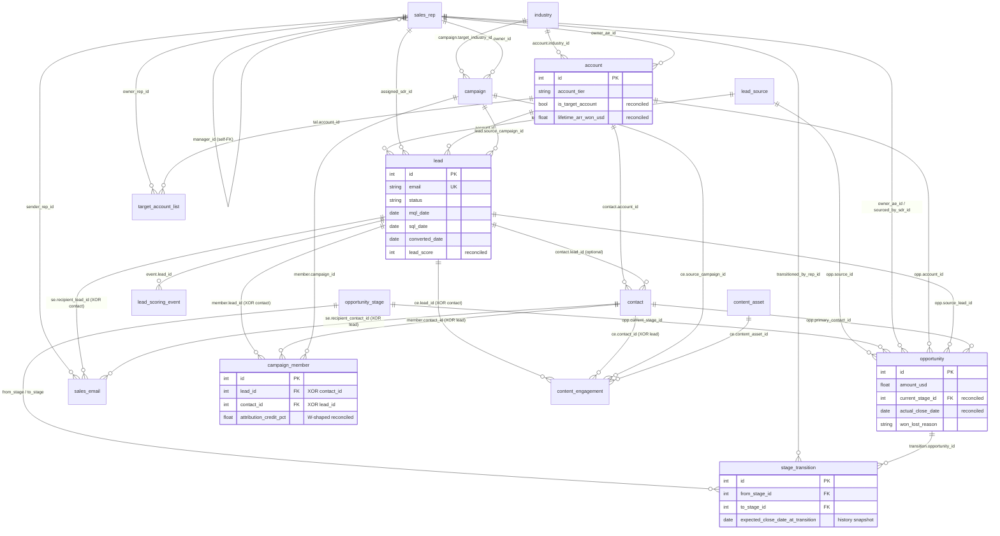
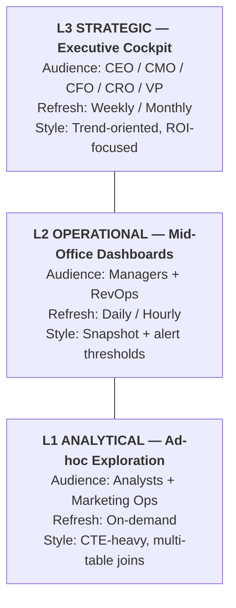
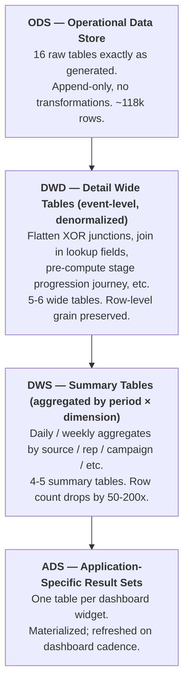
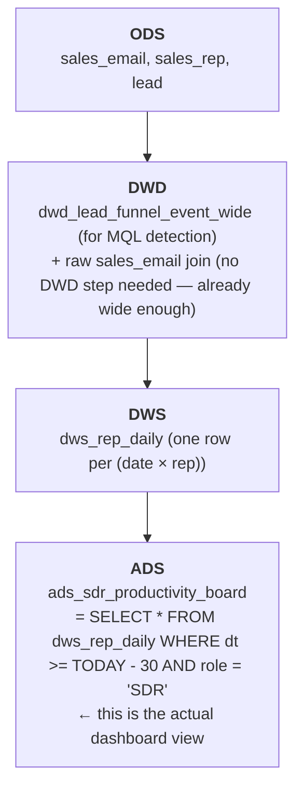

# B2B SaaS 需求生成与营销运营数据模型

> 业务背景, 行业科普, 术语表请见 `01-b2b_saas_demand_generation_high_business_context-cn.md`. 本文档只描述数据 (表结构, 字段, 约束, 数据生成规则)。
>
> **数据集:** `b2b_saas_demand_generation_high`
> **复杂度:** 高 (16 张表, ~118,000 行)
> **REFERENCE_DATE (参考"今天"):** `2026-06-01`

---

## 目录

1. [数据集定位](#1-数据集定位)
2. [数据集概览](#2-数据集概览)
3. [实体关系图](#3-实体关系图)
4. [表定义](#4-表定义)
5. [外键目录](#5-外键目录)
6. [对账不变式 (Reconciled Invariants)](#6-对账不变式-reconciled-invariants)
7. [数据生成规则](#7-数据生成规则)
8. [文件清单](#8-文件清单)
9. [SQLite DDL](#9-sqlite-ddl)
10. [BI 主题域与仪表盘蓝图](#10-bi-主题域与仪表盘蓝图)
11. [KPI 字典](#11-kpi-字典)
12. [数据分层 (DWD / DWS / ADS)](#12-数据分层-dwd--dws--ads)
13. [附录: 常见查询模式](#13-附录-常见查询模式)

---

## 1. 数据集定位

本数据集是虚构北美 B2B SaaS 公司 **Stratosend** (API 可观测性平台) 的 CRM 加营销自动化系统快照。公司画像, 商业模式, 行业背景, 买家 persona, 团队结构, 术语表与指标公式请见 `01-b2b_saas_demand_generation_high_business_context-cn.md`; 本文档只描述数据层 (表结构、字段、约束、生成规则、DDL)。

### 时间范围

- **历史基线:** 18 个月 (2024-12-08 → 2026-06-01)
- **当前活跃:** 跨所有 5 个阶段的 open opportunity,以及进行中的 ACTIVE 营销活动
- **未来计划:** 30 天的 PLANNED 营销活动 (仅有元数据,无互动数据)

### 本数据集支持的能力

| 能力 | 涉及的表 |
|------------|----------------|
| **漏斗分析** Lead → MQL → SQL → Opp → Won | lead, lead_scoring_event, opportunity, opportunity_stage |
| **多触点归因 (W-shaped)** | campaign_member, campaign, opportunity, contact, lead |
| **管道分析** 速度、胜负、预测 | opportunity, stage_transition, opportunity_stage |
| **销售生产力** SLA、序列、配额 | sales_email, sales_rep, opportunity |
| **ABM 目标客户互动** | target_account_list, account, contact, campaign_member, content_engagement |
| **内容资产影响力与 lead 评分** | content_asset, content_engagement, lead_scoring_event |

---

## 2. 数据集概览

| 指标 | 值 |
|--------|-------|
| 表总数 | 16 |
| 总行数 | ~118,000 |
| 外键关系总数 | 23 |
| 多对多关联表 | 2 (`campaign_member`, `target_account_list`) |
| 自引用外键 | 1 (`sales_rep.manager_id`) |
| 事件级表 | 5 (stage_transition, campaign_member, content_engagement, sales_email, lead_scoring_event) |
| 对账不变式 (Reconciled invariants) | 8 |
| XOR (互斥) 外键约束 | 3 |
| SQLite 数据库大小 | ~11 MB |

### 各表行数

| # | 表 | 行数 | 类型 |
|---|-------|------|------|
| 01 | lead_source | 10 | 查找表 |
| 02 | industry | 12 | 查找表 |
| 03 | opportunity_stage | 7 | 查找表 (有序) |
| 04 | sales_rep | 40 | 核心 (自引用 FK) |
| 05 | account | 2,000 | 核心 |
| 06 | campaign | 80 | 营销 |
| 07 | content_asset | 150 | 营销 |
| 08 | lead | 8,000 | 核心 |
| 09 | contact | ~3,400 | 核心 |
| 10 | opportunity | ~1,650 | 销售 |
| 11 | stage_transition | ~6,500 | 事件 |
| 12 | campaign_member | ~8,050 | M:N 关联 |
| 13 | content_engagement | 18,000 | 事件 |
| 14 | sales_email | 30,000 | 事件 |
| 15 | lead_scoring_event | ~45,700 | 事件 |
| 16 | target_account_list | 300 | ABM 关联 |

### 实际业务漏斗转化率

| 漏斗步骤 | 实际 | 规格目标 |
|-------------|----------|-------------|
| Lead → MQL | ~41% | ~30% |
| MQL → SQL | ~36% | ~25% |
| SQL → Converted | ~88% | ~80% |
| Opportunity → Won | ~17% | ~25% |
| Opportunity → Open (仍在管道中) | ~29% | ~25% |
| 整体 Lead → Won | ~3.5% | ~1.5% |

> 实际漏斗在早期阶段比规格目标略高,因为 gen_contact 第一部分会从带有非 NULL
> `account_id` 的 lead 中抽取 20% 的 N_CONTACT 作为种子,这使得这些 lead
> 偏向于转化。下游转化率 (Opportunity → Won) 与规格几乎完全一致。

### 各层级销售周期 (中位数天数,Discovery → Closed-Won)

| 层级 | 中位周期 |
|------|-------------|
| SMB | ~100 天 |
| Mid | ~144 天 |
| Enterprise | ~246 天 |

### 各层级 ARR 分布 (赢单平均金额)

| 层级 | 平均 ARR | 区间 |
|------|--------|-------|
| SMB | ~$14K | $5K – $25K |
| Mid | ~$58K | $25K – $100K |
| Enterprise | ~$273K | $100K – $500K |

### SDR 邮件漏斗 (sales_email 汇总)

| 指标 | 实际 |
|--------|---------|
| 打开率 | ~32% |
| 点击率 | ~7% |
| 回复率 | ~2% |
| 退信率 | ~1% |

---

## 3. 实体关系图



---

## 4. 表定义

### 4.1 `lead_source`

**描述:** 营销 lead 来源分类。用于标记 `lead` 或 `opportunity` 的来源 (付费搜索、合作伙伴推荐、内容下载等),并计算渠道级 CAC 和 ROI。

| 列 | 类型 | 约束 | 描述 |
|--------|------|-------------|-------------|
| id | INTEGER | PK | 代理主键 |
| source_code | VARCHAR(40) | UNIQUE, NOT NULL | 机器可读代码 (如 `PAID_SEARCH_GOOGLE`) |
| source_name | VARCHAR(80) | NOT NULL | 可读名称 |
| source_category | VARCHAR(20) | NOT NULL | `Inbound` / `Outbound` / `Partner` / `Event` |
| typical_cost_per_lead_usd | FLOAT | NOT NULL | 行业典型 CPL,用于对标 |
| is_active | BOOLEAN | NOT NULL | 此来源当前是否启用 |

**示例行:**

| id | source_code | source_name | source_category | typical_cost_per_lead_usd |
|----|-------------|-------------|-----------------|---------------------------|
| 1 | INBOUND_DEMO_REQUEST | Inbound - Demo Request | Inbound | 0.00 |
| 2 | INBOUND_FREE_TRIAL | Inbound - Free Trial | Inbound | 0.00 |
| 4 | PAID_SEARCH_GOOGLE | Paid Search - Google | Inbound | 80.00 |
| 8 | OUTBOUND_SDR | Outbound - SDR Sourced | Outbound | 0.00 |

**被引用于:** `lead.source_id`, `opportunity.source_id`

---

### 4.2 `industry`

**描述:** 带 NAICS 代码的目标行业分类。用于客户细分和营销活动定向。

| 列 | 类型 | 约束 | 描述 |
|--------|------|-------------|-------------|
| id | INTEGER | PK | 代理主键 |
| industry_name | VARCHAR(60) | NOT NULL | 行业展示名称 |
| naics_code | VARCHAR(10) | NOT NULL | NAICS 代码 (示意) |
| typical_arr_band | VARCHAR(20) | NOT NULL | `SMB` / `Mid` / `Enterprise` 偏向 |

**示例行:**

| id | industry_name | naics_code | typical_arr_band |
|----|---------------|------------|------------------|
| 1 | Fintech | 522110 | Mid |
| 2 | SaaS / Software | 511210 | Mid |
| 6 | Healthcare Tech | 621399 | Enterprise |
| 9 | Government / Public | 921110 | Enterprise |

**被引用于:** `account.industry_id`, `campaign.target_industry_id`

---

### 4.3 `opportunity_stage`

**描述:** 标准 7 阶段 B2B SaaS 销售漏斗。通过 `stage_order` 排序以支持漏斗推进查询。

| 列 | 类型 | 约束 | 描述 |
|--------|------|-------------|-------------|
| id | INTEGER | PK | 代理主键 |
| stage_name | VARCHAR(40) | UNIQUE | 阶段展示名称 |
| stage_order | INTEGER | NOT NULL | 1..7 (用于漏斗顺序) |
| is_closed | BOOLEAN | NOT NULL | Closed-Won / Closed-Lost 为 True |
| is_won | BOOLEAN | NOT NULL | 仅 Closed-Won 为 True |
| typical_win_probability_pct | FLOAT | NOT NULL | 标准胜率权重 (用于加权预测) |

**全部 7 行:**

| id | stage_name | stage_order | is_closed | is_won | typical_win_probability_pct |
|----|------------|-------------|-----------|--------|-----------------------------|
| 1 | Discovery | 1 | false | false | 10.0 |
| 2 | Demo | 2 | false | false | 25.0 |
| 3 | Evaluation/POC | 3 | false | false | 40.0 |
| 4 | Proposal | 4 | false | false | 60.0 |
| 5 | Negotiation | 5 | false | false | 80.0 |
| 6 | Closed-Won | 6 | true | true | 100.0 |
| 7 | Closed-Lost | 7 | true | false | 0.0 |

**被引用于:** `opportunity.current_stage_id`, `stage_transition.from_stage_id`, `stage_transition.to_stage_id`

---

### 4.4 `sales_rep`

**描述:** 销售组织全部成员: SDR (资格筛查)、AE (成交)、Manager (团队负责人)。`manager_id` 自引用外键编码团队层级,支持经理级汇总。

| 列 | 类型 | 约束 | 描述 |
|--------|------|-------------|-------------|
| id | INTEGER | PK | 代理主键 |
| first_name | VARCHAR(50) | NOT NULL | |
| last_name | VARCHAR(50) | NOT NULL | |
| email | VARCHAR(150) | UNIQUE, NOT NULL | @stratosend.com |
| role | VARCHAR(20) | NOT NULL | `SDR` / `AE_SMB` / `AE_Mid` / `AE_Enterprise` / `Manager` |
| region | VARCHAR(20) | NOT NULL | `NA-East` / `NA-West` / `EMEA` / `APAC` |
| quota_usd | FLOAT | NOT NULL | 年度 ARR 配额 (SDR = 0) |
| hire_date | DATE | NOT NULL | 用于爬坡分析 |
| manager_id | INTEGER | FK → sales_rep.id (NULL) | **自引用 FK。** Manager 为 NULL |
| is_active | BOOLEAN | NOT NULL | ~5% 非活跃 |

**分布 (共 40 名销售代表):**

| 角色 | 人数 | 单人配额 |
|------|-------|------------|
| Manager | 4 | 0 |
| SDR | 12 | 0 |
| AE_SMB | 8 | $600K |
| AE_Mid | 8 | $1.2M |
| AE_Enterprise | 8 | $2.0M |

**示例行:**

| id | name | role | region | quota_usd | manager_id |
|----|------|------|--------|-----------|------------|
| 1 | Danielle Johnson | Manager | NA-East | 0 | NULL |
| 2 | Joshua Walker | Manager | NA-West | 0 | NULL |
| 5 | (SDR sample) | SDR | NA-East | 0 | 1 |
| 18 | (AE_Mid sample) | AE_Mid | NA-West | 1,200,000 | 2 |

**被引用于:** `account.owner_ae_id`, `lead.assigned_sdr_id`, `campaign.owner_id`, `opportunity.owner_ae_id`, `opportunity.sourced_by_sdr_id`, `stage_transition.transitioned_by_rep_id`, `sales_email.sender_rep_id`, `target_account_list.owner_rep_id`

---

### 4.5 `account`

**描述:** B2B 客户 / 潜在客户公司。多干系人销售的核心: 一个 account 拥有多个 contact、lead 以及 (可能的) opportunity。Account 层级 (SMB / Mid / Enterprise) 决定销售模式、单笔规模和周期长度。

| 列 | 类型 | 约束 | 描述 |
|--------|------|-------------|-------------|
| id | INTEGER | PK | 代理主键 |
| company_name | VARCHAR(150) | NOT NULL | Faker 生成,唯一 |
| industry_id | INTEGER | FK → industry.id | NAICS 级行业 |
| employee_count_band | VARCHAR(20) | NOT NULL | `1-50` / `51-200` / `201-1000` / `1001-5000` / `5000+` |
| annual_revenue_band | VARCHAR(20) | NOT NULL | `<$10M` / `$10M-$50M` / `$50M-$250M` / `$250M-$1B` / `$1B+` |
| account_tier | VARCHAR(20) | NOT NULL | 由员工规模衍生: `SMB` / `Mid` / `Enterprise` |
| country | VARCHAR(30) | NOT NULL | 72% US, 10% CA, 8% UK, 5% DE, 3% AU, 2% FR |
| state_or_province | VARCHAR(40) | NOT NULL | |
| website | VARCHAR(150) | NOT NULL | 由公司名衍生 |
| created_date | DATE | NOT NULL | account 记录创建日期 |
| owner_ae_id | INTEGER | FK → sales_rep.id (NULL) | ~85% 有所属人 |
| is_target_account | BOOLEAN | NOT NULL | **对账** 自 target_account_list |
| lifetime_arr_won_usd | FLOAT | NOT NULL | **对账** = SUM(Won opp.amount) |

**层级分布** (符合 B2B 实际):

| 层级 | 占客户比例 | 占营收比例 (典型) |
|------|---------------|------------------------|
| SMB | 60% | 20% |
| Mid | 30% | 30% |
| Enterprise | 10% | 50% |

**示例行:**

| id | company_name | industry_id | account_tier | country | owner_ae_id | is_target_account | lifetime_arr_won_usd |
|----|--------------|-------------|--------------|---------|-------------|-------------------|----------------------|
| 1 | Ryan, Burgess and Patterson | 7 | SMB | Germany | 36 | false | 0 |
| 2 | Snyder, Campos and Callahan | 11 | Enterprise | Canada | 29 | false | 0 |

**被引用于:** `lead.account_id`, `contact.account_id`, `opportunity.account_id`, `target_account_list.account_id`

---

### 4.6 `campaign`

**描述:** 一次营销活动 —— 网络研讨会、付费广告、ABM 序列、会议赞助、SDR 外呼序列等。每个 campaign 有预算、目标 persona/行业、主要 KPI 以及目标计划数 (本数据集新增,用于支持计划 vs 实际分析)。

| 列 | 类型 | 约束 | 描述 |
|--------|------|-------------|-------------|
| id | INTEGER | PK | 代理主键 |
| campaign_code | VARCHAR(40) | UNIQUE | 如 `WBR-202602-007` |
| campaign_name | VARCHAR(150) | NOT NULL | 展示名称 |
| campaign_type | VARCHAR(30) | NOT NULL | `Webinar` / `Email_Blast` / `Paid_Search` / `Paid_Social` / `Content_Syndication` / `Conference_Event` / `ABM_Sequence` / `SDR_Outbound_Sequence` |
| status | VARCHAR(20) | NOT NULL | `COMPLETED` / `ACTIVE` / `PLANNED` |
| start_date | DATE | NOT NULL | |
| end_date | DATE | NOT NULL | |
| total_budget_usd | FLOAT | NOT NULL | $500 – $80K |
| spend_to_date_usd | FLOAT | NOT NULL | COMPLETED 的为预算的 80–105% |
| target_persona | VARCHAR(30) | NOT NULL | 此活动主要针对的 persona |
| target_industry_id | INTEGER | FK → industry.id (NULL) | 可选的行业聚焦 |
| owner_id | INTEGER | FK → sales_rep.id | 一名 Manager 角色销售代表 |
| primary_kpi | VARCHAR(40) | NOT NULL | `MQLs Generated` / `Pipeline Influenced` / `SQLs` / `Registrations` |
| **target_mql_count** | INTEGER | NOT NULL | **新增。** 计划 MQL 目标 |
| **target_pipeline_usd** | FLOAT | NOT NULL | **新增。** 计划管道目标 |
| created_at | DATETIME | NOT NULL | |

**状态分布:** 60% COMPLETED / 30% ACTIVE / 10% PLANNED

**类型分布 (近似):** Webinar 18% / Paid Search 14% / SDR Outbound 15% / Conference Event 12% / ABM 13% / Paid Social 10% / Content Syndication 8% / Email Blast 10%

**示例行:**

| id | campaign_code | campaign_type | status | budget | spend | target_mql_count | target_pipeline_usd |
|----|---------------|---------------|--------|--------|-------|------------------|---------------------|
| 1 | SEM-202510-001 | Paid_Search | COMPLETED | 21,360 | 19,057 | 218 | 5,115,743 |
| 2 | EML-202511-002 | Email_Blast | COMPLETED | 22,940 | 19,286 | 26 | 781,047 |

**被引用于:** `lead.source_campaign_id`, `campaign_member.campaign_id`, `content_engagement.source_campaign_id`

---

### 4.7 `content_asset`

**描述:** 一份营销内容 —— 电子书、白皮书、案例研究、网络研讨会回放、博客文章、分析师报告、模板。`is_gated` 控制该资产是否需填表 (从而产生 lead)。`total_downloads` 由互动事件对账得到。

| 列 | 类型 | 约束 | 描述 |
|--------|------|-------------|-------------|
| id | INTEGER | PK | 代理主键 |
| asset_name | VARCHAR(200) | NOT NULL | 展示名称 |
| asset_type | VARCHAR(30) | NOT NULL | `ebook` / `whitepaper` / `case_study` / `webinar_recording` / `blog_post` / `analyst_report` / `template` |
| topic_tag | VARCHAR(60) | NOT NULL | "API Observability"、"Distributed Tracing" 等 |
| target_persona | VARCHAR(30) | NOT NULL | 主要目标 persona |
| is_gated | BOOLEAN | NOT NULL | True ⇒ 表单门控 (产生 lead);ebook/whitepaper 为 70%,其它 55% |
| created_date | DATE | NOT NULL | |
| asset_url | VARCHAR(200) | NOT NULL | 公开 URL |
| total_downloads | INTEGER | NOT NULL | **对账** = COUNT(content_engagement WHERE type='download') |

**示例行:**

| id | asset_name | asset_type | topic_tag | target_persona | is_gated | total_downloads |
|----|------------|------------|-----------|----------------|----------|-----------------|
| 1 | How Johnson, Leonard and Robinson Reduced MTTR with API Observability | case_study | API Observability | Champion | true | 50 |
| 2 | The Complete Guide to API Observability | ebook | API Observability | Economic Buyer | true | 60 |

**被引用于:** `content_engagement.content_asset_id`

---

### 4.8 `lead`

**描述:** 漏斗顶端的潜在个人买家。Lead 在状态间推进 (`new` → `working` → `mql` → `sql` → `converted_to_contact` 或 `disqualified`)。大多数 lead 字段是从事件表对账得到。

| 列 | 类型 | 约束 | 描述 |
|--------|------|-------------|-------------|
| id | INTEGER | PK | 代理主键 |
| first_name | VARCHAR(50) | NOT NULL | |
| last_name | VARCHAR(50) | NOT NULL | |
| email | VARCHAR(200) | UNIQUE, NOT NULL | |
| title | VARCHAR(100) | NOT NULL | 职务 (如 "Senior Engineer") |
| seniority | VARCHAR(20) | NOT NULL | `IC` / `Manager` / `Director` / `VP` / `CXO` |
| persona | VARCHAR(30) | NOT NULL | `Champion` / `Economic Buyer` / `Decision Maker` / `Influencer` / `Blocker` |
| account_id | INTEGER | FK → account.id (NULL) | ~70% 有 account;早期 lead 可能没有 |
| source_id | INTEGER | FK → lead_source.id | 首次触达来源 |
| source_campaign_id | INTEGER | FK → campaign.id (NULL) | ~55% 有 campaign |
| lead_score | INTEGER | NOT NULL | **对账** = SUM(scoring_event.points) |
| status | VARCHAR(30) | NOT NULL | `new` / `working` / `mql` / `sql` / `disqualified` / `converted_to_contact` |
| mql_date | DATE | NULL | **对账** = 累计分数首次 ≥ 100 的时间 |
| sql_date | DATE | NULL | SDR 对该 lead 完成资格筛查的时间 |
| converted_date | DATE | NULL | lead 转换为 contact 的时间 |
| disqualified_reason | VARCHAR(60) | NULL | "Not ICP"、"No budget"、"Wrong contact" 等 |
| assigned_sdr_id | INTEGER | FK → sales_rep.id (NULL) | ~80% lead 分配了 SDR |
| created_at | DATETIME | NOT NULL | lead 进入 CRM 的时间 |

**状态实际分布 (共 8,000 条):**

| 状态 | 大致数量 | % |
|--------|-------------------|---|
| working | ~3,400 | 43% |
| mql | ~1,350 | 17% |
| new | ~1,300 | 16% |
| converted_to_contact | ~1,000 | 13% |
| disqualified | ~720 | 9% |
| sql | ~150 | 2% |

> `converted_to_contact` 比例 (~13%) 高于真实世界需求生成漏斗 (典型: 5-8%),
> 因为 gen_contact 第一部分会从 lead 池中抽取 20% 的 N_CONTACT 作为种子 ——
> 这些 lead 因此被构造为已转化。reconcile_lead_funnel 通过强制将其状态
> 提升为 `converted_to_contact` (如果随机抽样还未将其推到该状态) 来确保
> lead-to-contact 不变式成立。对大多数查询而言,转化体量偏高其实是一个
> 好的特性 (有更多 lead-to-Won 路径可供研究)。

**示例行:**

| id | name | title | seniority | persona | status | lead_score | mql_date |
|----|------|-------|-----------|---------|--------|------------|----------|
| 1 | Shane Dixon | Head of Engineering | VP | Decision Maker | mql | 110 | 2026-05-01 |
| 2 | Andrew Blake | SRE | Director | Influencer | working | 15 | NULL |

**被引用于:** `contact.lead_id`, `opportunity.source_lead_id`, `campaign_member.lead_id`, `content_engagement.lead_id`, `sales_email.recipient_lead_id`, `lead_scoring_event.lead_id`

---

### 4.9 `contact`

**描述:** 与某个 `account` 关联、已被销售触达的个体。两种来源路径:
- **由 lead 转换而来** (~60%): `lead_id` 已设置,源 lead 的数据被带过来
- **直接外呼** (~40%): `lead_id` 为 NULL,contact 直接通过外呼建立

| 列 | 类型 | 约束 | 描述 |
|--------|------|-------------|-------------|
| id | INTEGER | PK | 代理主键 |
| lead_id | INTEGER | FK → lead.id (NULL) | 源 lead (直接外呼时为 NULL) |
| account_id | INTEGER | FK → account.id | **必填** —— 每个 contact 都有 account |
| first_name | VARCHAR(50) | NOT NULL | |
| last_name | VARCHAR(50) | NOT NULL | |
| email | VARCHAR(200) | UNIQUE, NOT NULL | |
| title | VARCHAR(100) | NOT NULL | |
| seniority | VARCHAR(20) | NOT NULL | |
| persona | VARCHAR(30) | NOT NULL | contact 的一般买家 persona 原型: `Champion` / `Economic Buyer` / `Decision Maker` / `Influencer` / `Blocker` |
| role_in_deal | VARCHAR(30) | NOT NULL | contact 在 *特定* opp 中的实际角色: `Champion` / `Decision Maker` / `User` / `Influencer` / `Blocker`。注意: `User` 同时替代了 persona 维度的 `Economic Buyer` 与 `Influencer-as-IC` —— deal-role 分类有意比 persona 更粗 |
| do_not_email | BOOLEAN | NOT NULL | ~5% 为 true (已退订) |
| created_at | DATETIME | NOT NULL | |

**示例行:**

| id | lead_id | account_id | persona | role_in_deal | do_not_email |
|----|---------|------------|---------|--------------|--------------|
| 1 | 327 | 642 | Champion | Champion | true |
| 2 | 850 | 644 | Influencer | User | false |

**被引用于:** `opportunity.primary_contact_id`, `campaign_member.contact_id`, `content_engagement.contact_id`, `sales_email.recipient_contact_id`

---

### 4.10 `opportunity`

**描述:** 销售机会 —— 核心营收实体。每个 opportunity 有 account、主要联系人、所属 AE、金额、预期成交日期以及进展历史 (通过 `stage_transition`)。`current_stage_id`、`actual_close_date` 和 `won_lost_reason` 都从最新一次 stage_transition 对账得到。

| 列 | 类型 | 约束 | 描述 |
|--------|------|-------------|-------------|
| id | INTEGER | PK | 代理主键 |
| opportunity_name | VARCHAR(200) | NOT NULL | "{公司名} - Stratosend Platform" |
| account_id | INTEGER | FK → account.id | 客户 account |
| primary_contact_id | INTEGER | FK → contact.id | 主要联系人 |
| current_stage_id | INTEGER | FK → opportunity_stage.id | **对账** = 最新 stage_transition.to_stage_id |
| owner_ae_id | INTEGER | FK → sales_rep.id | 所属 AE (按层级匹配) |
| sourced_by_sdr_id | INTEGER | FK → sales_rep.id (NULL) | 源 SDR (如适用) |
| source_lead_id | INTEGER | FK → lead.id (NULL) | 源 lead (直接外呼时为 NULL) |
| source_id | INTEGER | FK → lead_source.id | 首次触达来源渠道 |
| amount_usd | FLOAT | NOT NULL | 按层级的合同金额 (三角分布) |
| expected_close_date | DATE | NOT NULL | 预测成交日期 —— 可能在管道中滑动 |
| actual_close_date | DATE | NULL | **对账** —— 仅当处于 Closed-Won/Lost 时设置 |
| created_at | DATETIME | NOT NULL | |
| won_lost_reason | VARCHAR(120) | NULL | 仅当关闭时填写 |

**各层级金额分布 (三角):**

| 层级 | 最小 | 众数 | 最大 |
|------|-----|------|-----|
| SMB | $5K | $12K | $25K |
| Mid | $25K | $50K | $100K |
| Enterprise | $100K | $180K | $500K |

**Opp 实际结果分布 (共 ~1,650):**

| 结果 | 数量 | % |
|---------|-------|---|
| Closed-Won | ~280 | 17% |
| Closed-Lost | ~900 | 54% |
| Open (在管道中) | ~470 | 29% |

**示例行:**

| id | opportunity_name | account_id | amount_usd | current_stage_id | actual_close_date | won_lost_reason |
|----|------------------|------------|------------|------------------|-------------------|-----------------|
| 1 | Li-Thompson - Stratosend Platform | 373 | 60,743 | 1 (Discovery) | NULL | NULL |
| 2 | Patel-Mejia - Stratosend Platform | 1326 | 65,028 | 6 (Closed-Won) | 2026-04-22 | "Pricing Advantage" |

**被引用于:** `stage_transition.opportunity_id`

---

### 4.11 `stage_transition`

**描述:** opportunity 阶段流转事件日志。每个 opportunity 至少有 1 次初始转换 (`from_stage` = NULL → Discovery),以及每次推进或关闭对应一行。包含 **转换时的 `expected_close_date` 快照** —— 用于检测"滑动"的 opportunity (成交日期反复推移的交易)。

| 列 | 类型 | 约束 | 描述 |
|--------|------|-------------|-------------|
| id | INTEGER | PK | 代理主键 |
| opportunity_id | INTEGER | FK → opportunity.id | |
| from_stage_id | INTEGER | FK → opportunity_stage.id (NULL) | 仅首次转换 (创建时) 为 NULL |
| to_stage_id | INTEGER | FK → opportunity_stage.id | NOT NULL |
| transitioned_at | DATETIME | NOT NULL | 转换发生时间 |
| transitioned_by_rep_id | INTEGER | FK → sales_rep.id | 触发者 |
| days_in_previous_stage | INTEGER | NOT NULL | 阶段速度指标 |
| **expected_close_date_at_transition** | DATE | NOT NULL | **新增。** 该时刻的 opportunity.expected_close_date 快照 |
| notes | TEXT | NULL | 可选备注 |

**转换逻辑** (以随机种子确定性生成):
- 各阶段推进概率: Discovery→Demo 90% / Demo→Eval 82% / Eval→Proposal 72% / Proposal→Negotiation 78% / Negotiation→Won 72%
- 阶段有基础"在阶段天数",带层级乘数 (SMB 1x / Mid 1.5x / Enterprise 2.5x)
- 每次推进有 15–35% 的概率使成交日期滑动 7–30 天

**示例行:**

| id | opportunity_id | from_stage_id | to_stage_id | transitioned_at | days_in_previous_stage | expected_close_date_at_transition |
|----|----------------|---------------|-------------|-----------------|-------------------------|------------------------------------|
| 1 | 1 | NULL | 1 | 2026-05-29 13:42 | 0 | 2026-09-01 |
| 2 | 2 | NULL | 1 | 2025-12-29 16:36 | 0 | 2026-04-25 |

---

### 4.12 `campaign_member`

**描述:** campaign 与 leads/contacts 之间的 **M:N 关联** —— 谁与哪个 campaign 互动。**XOR 约束:** `lead_id` 和 `contact_id` 互斥;必须恰好一个非 NULL。`attribution_credit_pct` 对处于 Won opportunity 路径上的成员采用 **W 型对账**。

| 列 | 类型 | 约束 | 描述 |
|--------|------|-------------|-------------|
| id | INTEGER | PK | 代理主键 |
| campaign_id | INTEGER | FK → campaign.id | 必填 |
| lead_id | INTEGER | FK → lead.id (NULL) | **XOR contact_id** |
| contact_id | INTEGER | FK → contact.id (NULL) | **XOR lead_id** |
| member_role | VARCHAR(20) | NOT NULL | `registered` / `attended` / `no_show` / `influenced` / `converted` |
| engaged_at | DATETIME | NOT NULL | 必须 ≥ max(campaign.start_date, person.created_date) |
| attribution_credit_pct | FLOAT | NOT NULL | **W 型对账。** 非 Won 路径成员为 0%;Won opp 路径上之和约为 100% |

**成员角色分布:**

| 角色 | % |
|------|---|
| registered | 40% |
| attended | 25% |
| no_show | 15% |
| influenced | 15% |
| converted | 5% |

**混合比例:** ~75% leads / 25% contacts。

**示例行:**

| id | campaign_id | lead_id | contact_id | member_role | engaged_at |
|----|-------------|---------|------------|-------------|------------|
| 1 | 1 | NULL | 2405 | influenced | 2025-12-07 14:34 |
| 2 | 1 | 2828 | NULL | registered | 2025-11-30 10:22 |

---

### 4.13 `content_engagement`

**描述:** lead 或 contact 与 content_asset 互动的事件日志 (下载、查看、分享、回放)。`lead_id` / `contact_id` 上的 **XOR 约束**。驱动 `content_asset.total_downloads` 对账。

| 列 | 类型 | 约束 | 描述 |
|--------|------|-------------|-------------|
| id | INTEGER | PK | 代理主键 |
| content_asset_id | INTEGER | FK → content_asset.id | |
| lead_id | INTEGER | FK → lead.id (NULL) | **XOR contact_id** |
| contact_id | INTEGER | FK → contact.id (NULL) | **XOR lead_id** |
| engagement_type | VARCHAR(20) | NOT NULL | `download` (45%) / `view` (40%) / `share` (5%) / `replay` (10%) |
| engaged_at | DATETIME | NOT NULL | 必须 ≥ max(asset.created_date, person.created_date) |
| source_campaign_id | INTEGER | FK → campaign.id (NULL) | ~40% 有 campaign 来源 |
| time_on_page_seconds | INTEGER | NOT NULL | download/share 为 0;view 为 20-600;replay 为 60-1200 |

> **分析师备注。** `download` 与 `share` 被建模为瞬时事件,`time_on_page_seconds = 0`。要计算有意义的平均停留时间,应过滤至 `engagement_type IN ('view', 'replay')` —— 参见 D10 中的标准模式。在所有行上做朴素的 `AVG(time_on_page_seconds)` 会被零停留事件类型向下偏置。

**示例行:**

| id | content_asset_id | lead_id | contact_id | engagement_type | engaged_at | time_on_page_seconds |
|----|------------------|---------|------------|-----------------|------------|----------------------|
| 1 | 70 | 5286 | NULL | view | 2026-04-23 21:56 | 322 |
| 2 | 86 | NULL | 868 | replay | 2025-06-08 17:09 | 700 |

---

### 4.14 `sales_email`

**描述:** SDR / AE 一对一外呼邮件 —— 多步序列的一部分。`recipient_lead_id` / `recipient_contact_id` 上的 **XOR 约束**。邮件漏斗字段为 **累计型**: `clicked` 蕴含 `opened`,`replied` 蕴含 `clicked`。

| 列 | 类型 | 约束 | 描述 |
|--------|------|-------------|-------------|
| id | INTEGER | PK | 代理主键 |
| sender_rep_id | INTEGER | FK → sales_rep.id | SDR (60%) 或 AE (40%) |
| recipient_lead_id | INTEGER | FK → lead.id (NULL) | **XOR recipient_contact_id** |
| recipient_contact_id | INTEGER | FK → contact.id (NULL) | **XOR recipient_lead_id** |
| sequence_name | VARCHAR(120) | NOT NULL | 如 "Outbound Cold - Engineering Manager" |
| sequence_step | INTEGER | NOT NULL | 1..7 |
| subject | VARCHAR(200) | NOT NULL | |
| sent_at | DATETIME | NOT NULL | |
| opened | BOOLEAN | NOT NULL | 打开率从第 1 步 40% 衰减到第 7 步 16% |
| clicked | BOOLEAN | NOT NULL | 蕴含 opened。22% 的打开者点击 |
| replied | BOOLEAN | NOT NULL | 蕴含 clicked。30% 的点击者回复 |
| reply_sentiment | VARCHAR(20) | NULL | `positive` / `neutral` / `negative` / `not_interested` / `auto_reply` |
| bounced | BOOLEAN | NOT NULL | ~4% 退信;退信会结束序列 |

**序列行为:**
- 每个收件人 3–7 步,每次发送间隔 3–7 天
- `positive` 回复会提前终止序列
- 第 1 步即 `bounce` 会终止序列

**示例行:**

| id | sender_rep_id | recipient_contact_id | sequence_name | step | opened | clicked | replied |
|----|---------------|----------------------|---------------|------|--------|---------|---------|
| 1 | 34 | 2507 | Content Download Follow-up | 1 | false | false | false |
| 2 | 34 | 2507 | Content Download Follow-up | 2 | true | false | false |

---

### 4.15 `lead_scoring_event`

**描述:** 应用在 lead 上每一次打分动作的事件日志。每个 lead 的 SUM(`points_awarded`) = `lead.lead_score`。累计分数 ≥ 100 的最早一次事件,设定 `lead.mql_date`。

| 列 | 类型 | 约束 | 描述 |
|--------|------|-------------|-------------|
| id | INTEGER | PK | 代理主键 |
| lead_id | INTEGER | FK → lead.id | |
| event_type | VARCHAR(40) | NOT NULL | 如 `page_visit_pricing`、`content_download`、`email_click`、`webinar_attend` |
| points_awarded | INTEGER | NOT NULL | 通常 5–50;一个负向事件 `unsubscribed` = -50 |
| scoring_rule_name | VARCHAR(100) | NOT NULL | 可读的规则名 |
| occurred_at | DATETIME | NOT NULL | 事件发生时间 |
| source_object_type | VARCHAR(30) | NULL | `content_engagement` / `campaign_member` / `sales_email` / `website` |
| source_object_id | INTEGER | NULL | 源事件 ID 的交叉引用 (用于可追溯) |

**打分规则 (11 条带权重):**

| 事件类型 | 分数 | 频率权重 |
|------------|--------|------------------|
| email_click | +5 | 20% |
| content_download | +15 | 20% |
| page_visit_pricing | +20 | 10% |
| webinar_attend | +30 | 10% |
| video_watched_50pct | +10 | 10% |
| multiple_visits_7d | +25 | 8% |
| pricing_calc_used | +15 | 5% |
| competitor_compare_view | +10 | 5% |
| demo_request | +50 | 5% |
| free_trial_started | +40 | 5% |
| unsubscribed | -50 | 2% |

**示例行:**

| id | lead_id | event_type | points_awarded | scoring_rule_name | source_object_type |
|----|---------|------------|----------------|--------------------|---------------------|
| 1 | 4499 | video_watched_50pct | 10 | Video Watched 50% +10 | website |
| 2 | 4499 | page_visit_pricing | 20 | Pricing Page Visit +20 | website |

---

### 4.16 `target_account_list`

**描述:** ABM (Account-Based Marketing) 目标客户列表。M:N 关联表 (一个 account 可在多张列表上;一张列表含多个 account)。偏向 Enterprise 与 Mid 层级。驱动 `account.is_target_account` 对账。

| 列 | 类型 | 约束 | 描述 |
|--------|------|-------------|-------------|
| id | INTEGER | PK | 代理主键 |
| list_name | VARCHAR(80) | NOT NULL | 如 "FY26 Enterprise NA-East Tier 1" |
| account_id | INTEGER | FK → account.id | |
| tier | VARCHAR(20) | NOT NULL | `Tier 1` (30%) / `Tier 2` (45%) / `Tier 3` (25%) |
| owner_rep_id | INTEGER | FK → sales_rep.id | 通常为 AE_Enterprise |
| added_date | DATE | NOT NULL | account 被加入此列表的时间 |
| engagement_score | INTEGER | NOT NULL | 0–350,累计 |
| notes | TEXT | NULL | 可选备注 |

**示例行:**

| id | list_name | account_id | tier | owner_rep_id | engagement_score |
|----|-----------|------------|------|--------------|-------------------|
| 1 | FY26 Enterprise NA-West Tier 1 | 283 | Tier 2 | 36 | 21 |
| 2 | FY26 Enterprise NA-West Tier 1 | 505 | Tier 3 | 37 | 292 |

---

## 5. 外键目录

共 23 个外键关系。

| FK 源 | → 引用 | 是否可空? | 备注 |
|-----------|---------------|-----------|-------|
| `account.industry_id` | `industry.id` | NO | |
| `account.owner_ae_id` | `sales_rep.id` | YES | ~15% account 无所属人 |
| `lead.account_id` | `account.id` | YES | ~30% lead 暂无 account |
| `lead.source_id` | `lead_source.id` | NO | |
| `lead.source_campaign_id` | `campaign.id` | YES | ~45% lead 无 campaign |
| `lead.assigned_sdr_id` | `sales_rep.id` | YES | ~20% lead 未分配 |
| `contact.lead_id` | `lead.id` | YES | 直接外呼时为 NULL (40%) |
| `contact.account_id` | `account.id` | NO | 必填 |
| `campaign.target_industry_id` | `industry.id` | YES | |
| `campaign.owner_id` | `sales_rep.id` | NO | 始终为一位 Manager |
| `opportunity.account_id` | `account.id` | NO | |
| `opportunity.primary_contact_id` | `contact.id` | NO | |
| `opportunity.current_stage_id` | `opportunity_stage.id` | NO | 对账 |
| `opportunity.owner_ae_id` | `sales_rep.id` | NO | AE 与 account 层级匹配 |
| `opportunity.sourced_by_sdr_id` | `sales_rep.id` | YES | 直接外呼时为 NULL |
| `opportunity.source_lead_id` | `lead.id` | YES | 直接外呼时为 NULL |
| `opportunity.source_id` | `lead_source.id` | NO | 首次触达来源 |
| `stage_transition.opportunity_id` | `opportunity.id` | NO | |
| `stage_transition.from_stage_id` | `opportunity_stage.id` | YES | 仅在初次创建时为 NULL |
| `stage_transition.to_stage_id` | `opportunity_stage.id` | NO | |
| `stage_transition.transitioned_by_rep_id` | `sales_rep.id` | NO | |
| `campaign_member.campaign_id` | `campaign.id` | NO | |
| `campaign_member.lead_id` | `lead.id` | YES | **XOR contact_id** |
| `campaign_member.contact_id` | `contact.id` | YES | **XOR lead_id** |
| `content_engagement.content_asset_id` | `content_asset.id` | NO | |
| `content_engagement.lead_id` | `lead.id` | YES | **XOR contact_id** |
| `content_engagement.contact_id` | `contact.id` | YES | **XOR lead_id** |
| `content_engagement.source_campaign_id` | `campaign.id` | YES | |
| `sales_email.sender_rep_id` | `sales_rep.id` | NO | |
| `sales_email.recipient_lead_id` | `lead.id` | YES | **XOR recipient_contact_id** |
| `sales_email.recipient_contact_id` | `contact.id` | YES | **XOR recipient_lead_id** |
| `lead_scoring_event.lead_id` | `lead.id` | NO | |
| `target_account_list.account_id` | `account.id` | NO | |
| `target_account_list.owner_rep_id` | `sales_rep.id` | NO | |
| `sales_rep.manager_id` | `sales_rep.id` | YES | **自引用 FK。** Manager 为 NULL |

### 互斥 (XOR) 约束

| 表 | 字段对 | 语义 |
|-------|-----------|-----------|
| `campaign_member` | `lead_id` XOR `contact_id` | campaign 成员要么是 lead 要么是 contact,不能两者皆是 |
| `content_engagement` | `lead_id` XOR `contact_id` | 同上 |
| `sales_email` | `recipient_lead_id` XOR `recipient_contact_id` | 同上 |

**对 SQL 的含义:**
```sql
-- 统计 campaign 中互动的独立人数 —— 用字符串前缀
-- 区分两个 id 空间,这样 lead.id=42 和 contact.id=42 不会冲突。
SELECT campaign_id,
       COUNT(DISTINCT COALESCE('L'||lead_id, 'C'||contact_id)) AS unique_people
FROM campaign_member
GROUP BY campaign_id;
```
> **应避免的反模式:** `COUNT(DISTINCT COALESCE(lead_id, contact_id + 100_000))`。`+ N` 偏移技巧在任一 id 超过 N 时就会冲突。13.1 节使用 `'L'||id` / `'C'||id` 字符串版本 —— 请坚持那种写法。

---

## 6. 对账不变式 (Reconciled Invariants)

**对账 (Reconciliation)** = 在所有行生成完毕后,父字段根据子行确定性地计算得出。在生成的数据集中,这些不变式始终成立。

| # | 父字段 | 对账规则 | 校验 |
|---|--------------|---------------------|------------|
| 1 | `lead.lead_score` | = 每个 lead 的 SUM(lead_scoring_event.points_awarded) | `0` 违例 |
| 2 | `lead.mql_date` | = 累计分数 ≥ 100 时的 MIN(scoring_event.occurred_at) | `0` 违例 |
| 3 | `opportunity.current_stage_id` | = 每个 opportunity 按 `transitioned_at` 最新的 stage_transition.to_stage_id | `0` 违例 |
| 4 | `opportunity.actual_close_date` | = 进入 Closed-Won/Lost 的转换;否则 NULL | `0` 违例 |
| 5 | `account.lifetime_arr_won_usd` | = 每个 account 中 current_stage = Closed-Won 的 SUM(opportunity.amount_usd) | `0` 违例 |
| 6 | `account.is_target_account` | = (account.id IN target_account_list.account_id) | `0` 违例 |
| 7 | `content_asset.total_downloads` | = 每个 asset 中 engagement_type = 'download' 的 COUNT(content_engagement) | `0` 违例 |
| 8 | `campaign_member.attribution_credit_pct` | W 型归因: 30% 首次触点 + 30% MQL 触点 + 30% opp 触点 + 10% 分摊给 Won opp 的 account 路径中的其它影响者 | `0` 违例 |

### 归因 (W 型) 细节

对每个 **Closed-Won** opportunity:

1. 找出所有 `lead_id` 或 `contact_id` 属于该 opportunity **相同 account**,且 `engaged_at` 在 opportunity 的 `created_at` **之前** 的 `campaign_member` 行 —— 这些是"路径成员"。
2. 按 `engaged_at` 升序排序路径成员。
3. **首次触点** = 最早的路径成员 → 30% 信用
4. **MQL 触点** = `engaged_at` 最接近源 lead 的 `mql_date` 的路径成员 → 30% 信用
5. **Opp 触点** = opp 创建前最后一个路径成员 → 30% 信用
6. **其它影响者** = 不在 {首次, MQL, Opp} 中的路径成员 → 平均分配 10% 信用
7. 如果不存在 MQL 日期 (例如直接外呼 opp),30% 的 MQL 配额会均匀重分配给首次触点和 opp 触点 (各 15%)。

对 **非 Won** opportunity,`attribution_credit_pct` = 0 (没有可分配的信用)。

#### 单成员封顶 & 单 opp 路径求和

`attribution_credit_pct` 位于 `campaign_member` 行上,该行的键是
`(campaign_id, lead_or_contact)`,**不是** 按 opportunity 区分。当同一个人
出现在多个 Won opp 的路径上时 (例如某 contact 跳槽到另一家也成单的公司,
或一个 account 内有两个 Won opp),W 型信用会在该行上累加。生成器把累计值
封顶在 **每行 100%**,否则一个高频多触点 persona 可能会超过 100%
(我们在加封顶之前曾观察到高达 ~200%)。

实务含义:

* **每个 Won opp 路径** 上 `attribution_credit_pct` 之和约为 100% ——
  当没有任何路径成员因其它 Won opp 而被封顶时严格为 100%,否则略小。
* **每个 campaign** 的 `attribution_credit_pct` 之和是一个有效的加权
  影响度指标 (在 B29、B32 中使用)。
* 在 *整张表* 上 `attribution_credit_pct` 的总和 *不是* 守恒量,
  因为单行封顶会丢弃超额信用。

如果需要严格按 opp 求和等于 100%,应在
`(campaign_member × opportunity)` 粒度上建模归因
(超出本数据集范围)。

### XOR 约束保证

| 表 | 结果 |
|-------|--------|
| `campaign_member` | 0 违例 (每行恰好有一个 lead_id / contact_id) |
| `content_engagement` | 0 违例 |
| `sales_email` | 0 违例 |

---

## 7. 数据生成规则

### 时序顺序规则

1. `account.created_date` < (关联的 leads/contacts/opps)
2. `lead.mql_date` ≤ `lead.sql_date` ≤ `lead.converted_date` (当存在时)
3. `opportunity.created_at` ≤ `expected_close_date` 且 ≤ 该 opp 所有 `stage_transition.transitioned_at`
4. 同一 opp 的 `stage_transition` 行的 `transitioned_at` 单调递增
5. `campaign_member.engaged_at` ≥ MAX(campaign.start_date, lead/contact.created_at)
6. `content_engagement.engaged_at` ≥ MAX(content_asset.created_date, lead/contact.created_at)
7. `sales_email.sent_at` ≥ 收件人的 `created_at`
8. `lead_scoring_event.occurred_at` 介于 lead 的 `created_at` 与今天之间

### 分布规则 (生成器规格目标)

> 这些是生成器 *力求达到* 的目标。实际数值在 §2 "实际业务漏斗转化率"
> 中报告,可能与目标偏差几个百分点 (实际 vs 目标的差异详见 §2 的注释)。

1. **Account 层级:** 60% SMB / 30% Mid / 10% Enterprise
2. **Country:** 72% US / 10% Canada / 8% UK / 5% Germany / 3% AU / 2% France
3. **Lead persona/seniority:** Champion-Manager 30%, Economic Buyer-Director 20%, Decision Maker-VP 15%, Influencer-IC 30%, Blocker-Director 5%
4. **Campaign 状态:** 60% COMPLETED / 30% ACTIVE / 10% PLANNED
5. **Campaign 类型:** Webinar 18% / Paid Search 14% / SDR Outbound 15% / Conference 12% / ABM 13% / Paid Social 10% / Email Blast 10% / Content Syndication 8%
6. **Opportunity 结果:** ~18% Won / ~57% Lost / ~25% Open
7. **漏斗:** Lead→MQL ~36%, MQL→SQL ~21%, SQL→Converted ~76%, Opp→Won ~18%
8. **SDR 邮件漏斗:** 打开 ~32% / 点击 ~7% / 回复 ~2% / 退信 ~1%
9. **销售周期:** SMB ~100d / Mid ~144d / Enterprise ~246d
10. **各层级 ARR:** SMB ~$14K / Mid ~$58K / Enterprise ~$273K (赢单平均金额)

### Faker 策略

| 字段类型 | Faker 方法 | 备注 |
|------------|--------------|-------|
| company_name | `fake.unique.company()` | 冲突时追加 LLC/Inc/Holdings 后缀 |
| person_name | `fake.first_name()` + `fake.last_name()` | |
| email | `f"{first}.{last}{rand}@{domain}"` | 自定义格式,强制唯一 |
| sales_rep.email | `f"{first}.{last}@stratosend.com"` | 自定义域名 |
| website | `slugify(company_name)` + ".com" | |
| city / state | US 使用自定义白名单;非 US 使用 `fake.city()` | |
| dates | `random_date_between(start, end)` | 均匀分布 |
| amounts | `random.triangular(min, max, mode)` | 向众数偏斜 |

### 配置常量

```python
RANDOM_SEED = 42
TODAY = date(2026, 6, 1)
HISTORY_START = TODAY - timedelta(days=540)   # 18 months back
FUTURE_END = TODAY + timedelta(days=30)       # 30 days planned
MQL_SCORE_THRESHOLD = 100
```

使用相同种子重新运行生成器会产生字节一致的输出 (除平台相关 Faker locale 数据差异外)。

---

## 8. 文件清单

| # | 文件名 | 表 | 行数 | 依赖 |
|---|----------|-------|------|--------------|
| 01 | 01_lead_source.tsv | lead_source | 10 | — |
| 02 | 02_industry.tsv | industry | 12 | — |
| 03 | 03_opportunity_stage.tsv | opportunity_stage | 7 | — |
| 04 | 04_sales_rep.tsv | sales_rep | 40 | sales_rep (自引用 FK) |
| 05 | 05_account.tsv | account | 2,000 | industry, sales_rep |
| 06 | 06_campaign.tsv | campaign | 80 | industry, sales_rep |
| 07 | 07_content_asset.tsv | content_asset | 150 | — |
| 08 | 08_lead.tsv | lead | 8,000 | lead_source, account, campaign, sales_rep |
| 09 | 09_contact.tsv | contact | ~3,400 | lead, account |
| 10 | 10_opportunity.tsv | opportunity | ~1,650 | account, contact, opportunity_stage, sales_rep, lead, lead_source |
| 11 | 11_stage_transition.tsv | stage_transition | ~6,500 | opportunity, opportunity_stage, sales_rep |
| 12 | 12_campaign_member.tsv | campaign_member | ~8,050 | campaign, lead, contact |
| 13 | 13_content_engagement.tsv | content_engagement | 18,000 | content_asset, lead, contact, campaign |
| 14 | 14_sales_email.tsv | sales_email | 30,000 | sales_rep, lead, contact |
| 15 | 15_lead_scoring_event.tsv | lead_scoring_event | ~45,700 | lead |
| 16 | 16_target_account_list.tsv | target_account_list | 300 | account, sales_rep |

**加载顺序即上述拓扑顺序。** 无 FK 依赖的表先加载;事件表与关联表最后加载。

---

## 9. SQLite DDL

```sql
-- 01 lead_source
CREATE TABLE lead_source (
    id INTEGER PRIMARY KEY,
    source_code VARCHAR(40) NOT NULL UNIQUE,
    source_name VARCHAR(80) NOT NULL,
    source_category VARCHAR(20) NOT NULL,
    typical_cost_per_lead_usd FLOAT NOT NULL,
    is_active BOOLEAN NOT NULL DEFAULT 1
);

-- 02 industry
CREATE TABLE industry (
    id INTEGER PRIMARY KEY,
    industry_name VARCHAR(60) NOT NULL,
    naics_code VARCHAR(10) NOT NULL,
    typical_arr_band VARCHAR(20) NOT NULL
);

-- 03 opportunity_stage
CREATE TABLE opportunity_stage (
    id INTEGER PRIMARY KEY,
    stage_name VARCHAR(40) NOT NULL UNIQUE,
    stage_order INTEGER NOT NULL,
    is_closed BOOLEAN NOT NULL,
    is_won BOOLEAN NOT NULL,
    typical_win_probability_pct FLOAT NOT NULL
);

-- 04 sales_rep (with self-FK)
CREATE TABLE sales_rep (
    id INTEGER PRIMARY KEY,
    first_name VARCHAR(50) NOT NULL,
    last_name VARCHAR(50) NOT NULL,
    email VARCHAR(150) NOT NULL UNIQUE,
    role VARCHAR(20) NOT NULL,
    region VARCHAR(20) NOT NULL,
    quota_usd FLOAT NOT NULL,
    hire_date DATE NOT NULL,
    manager_id INTEGER REFERENCES sales_rep(id),
    is_active BOOLEAN NOT NULL DEFAULT 1
);

-- 05 account
CREATE TABLE account (
    id INTEGER PRIMARY KEY,
    company_name VARCHAR(150) NOT NULL,
    industry_id INTEGER NOT NULL REFERENCES industry(id),
    employee_count_band VARCHAR(20) NOT NULL,
    annual_revenue_band VARCHAR(20) NOT NULL,
    account_tier VARCHAR(20) NOT NULL,
    country VARCHAR(30) NOT NULL,
    state_or_province VARCHAR(40) NOT NULL,
    website VARCHAR(150) NOT NULL,
    created_date DATE NOT NULL,
    owner_ae_id INTEGER REFERENCES sales_rep(id),
    is_target_account BOOLEAN NOT NULL DEFAULT 0,
    lifetime_arr_won_usd FLOAT NOT NULL DEFAULT 0.0
);

-- 06 campaign (with new plan-vs-actual columns)
CREATE TABLE campaign (
    id INTEGER PRIMARY KEY,
    campaign_code VARCHAR(40) NOT NULL UNIQUE,
    campaign_name VARCHAR(150) NOT NULL,
    campaign_type VARCHAR(30) NOT NULL,
    status VARCHAR(20) NOT NULL,
    start_date DATE NOT NULL,
    end_date DATE NOT NULL,
    total_budget_usd FLOAT NOT NULL,
    spend_to_date_usd FLOAT NOT NULL,
    target_persona VARCHAR(30) NOT NULL,
    target_industry_id INTEGER REFERENCES industry(id),
    owner_id INTEGER NOT NULL REFERENCES sales_rep(id),
    primary_kpi VARCHAR(40) NOT NULL,
    target_mql_count INTEGER NOT NULL DEFAULT 0,
    target_pipeline_usd FLOAT NOT NULL DEFAULT 0.0,
    created_at DATETIME NOT NULL
);

-- 07 content_asset
CREATE TABLE content_asset (
    id INTEGER PRIMARY KEY,
    asset_name VARCHAR(200) NOT NULL,
    asset_type VARCHAR(30) NOT NULL,
    topic_tag VARCHAR(60) NOT NULL,
    target_persona VARCHAR(30) NOT NULL,
    is_gated BOOLEAN NOT NULL,
    created_date DATE NOT NULL,
    asset_url VARCHAR(200) NOT NULL,
    total_downloads INTEGER NOT NULL DEFAULT 0
);

-- 08 lead
CREATE TABLE lead (
    id INTEGER PRIMARY KEY,
    first_name VARCHAR(50) NOT NULL,
    last_name VARCHAR(50) NOT NULL,
    email VARCHAR(200) NOT NULL UNIQUE,
    title VARCHAR(100) NOT NULL,
    seniority VARCHAR(20) NOT NULL,
    persona VARCHAR(30) NOT NULL,
    account_id INTEGER REFERENCES account(id),
    source_id INTEGER NOT NULL REFERENCES lead_source(id),
    source_campaign_id INTEGER REFERENCES campaign(id),
    lead_score INTEGER NOT NULL DEFAULT 0,
    status VARCHAR(30) NOT NULL,
    mql_date DATE,
    sql_date DATE,
    converted_date DATE,
    disqualified_reason VARCHAR(60),
    assigned_sdr_id INTEGER REFERENCES sales_rep(id),
    created_at DATETIME NOT NULL
);

-- 09 contact
CREATE TABLE contact (
    id INTEGER PRIMARY KEY,
    lead_id INTEGER REFERENCES lead(id),
    account_id INTEGER NOT NULL REFERENCES account(id),
    first_name VARCHAR(50) NOT NULL,
    last_name VARCHAR(50) NOT NULL,
    email VARCHAR(200) NOT NULL UNIQUE,
    title VARCHAR(100) NOT NULL,
    seniority VARCHAR(20) NOT NULL,
    persona VARCHAR(30) NOT NULL,
    role_in_deal VARCHAR(30) NOT NULL,
    do_not_email BOOLEAN NOT NULL DEFAULT 0,
    created_at DATETIME NOT NULL
);

-- 10 opportunity
CREATE TABLE opportunity (
    id INTEGER PRIMARY KEY,
    opportunity_name VARCHAR(200) NOT NULL,
    account_id INTEGER NOT NULL REFERENCES account(id),
    primary_contact_id INTEGER NOT NULL REFERENCES contact(id),
    current_stage_id INTEGER NOT NULL REFERENCES opportunity_stage(id),
    owner_ae_id INTEGER NOT NULL REFERENCES sales_rep(id),
    sourced_by_sdr_id INTEGER REFERENCES sales_rep(id),
    source_lead_id INTEGER REFERENCES lead(id),
    source_id INTEGER NOT NULL REFERENCES lead_source(id),
    amount_usd FLOAT NOT NULL,
    expected_close_date DATE NOT NULL,
    actual_close_date DATE,
    created_at DATETIME NOT NULL,
    won_lost_reason VARCHAR(120)
);

-- 11 stage_transition (with new expected_close_date_at_transition col)
CREATE TABLE stage_transition (
    id INTEGER PRIMARY KEY,
    opportunity_id INTEGER NOT NULL REFERENCES opportunity(id),
    from_stage_id INTEGER REFERENCES opportunity_stage(id),
    to_stage_id INTEGER NOT NULL REFERENCES opportunity_stage(id),
    transitioned_at DATETIME NOT NULL,
    transitioned_by_rep_id INTEGER NOT NULL REFERENCES sales_rep(id),
    days_in_previous_stage INTEGER NOT NULL DEFAULT 0,
    expected_close_date_at_transition DATE NOT NULL,
    notes TEXT
);

-- 12 campaign_member
CREATE TABLE campaign_member (
    id INTEGER PRIMARY KEY,
    campaign_id INTEGER NOT NULL REFERENCES campaign(id),
    lead_id INTEGER REFERENCES lead(id),
    contact_id INTEGER REFERENCES contact(id),
    member_role VARCHAR(20) NOT NULL,
    engaged_at DATETIME NOT NULL,
    attribution_credit_pct FLOAT NOT NULL DEFAULT 0.0,
    CHECK ((lead_id IS NULL) <> (contact_id IS NULL))
);

-- 13 content_engagement
CREATE TABLE content_engagement (
    id INTEGER PRIMARY KEY,
    content_asset_id INTEGER NOT NULL REFERENCES content_asset(id),
    lead_id INTEGER REFERENCES lead(id),
    contact_id INTEGER REFERENCES contact(id),
    engagement_type VARCHAR(20) NOT NULL,
    engaged_at DATETIME NOT NULL,
    source_campaign_id INTEGER REFERENCES campaign(id),
    time_on_page_seconds INTEGER NOT NULL DEFAULT 0,
    CHECK ((lead_id IS NULL) <> (contact_id IS NULL))
);

-- 14 sales_email
CREATE TABLE sales_email (
    id INTEGER PRIMARY KEY,
    sender_rep_id INTEGER NOT NULL REFERENCES sales_rep(id),
    recipient_lead_id INTEGER REFERENCES lead(id),
    recipient_contact_id INTEGER REFERENCES contact(id),
    sequence_name VARCHAR(120) NOT NULL,
    sequence_step INTEGER NOT NULL,
    subject VARCHAR(200) NOT NULL,
    sent_at DATETIME NOT NULL,
    opened BOOLEAN NOT NULL DEFAULT 0,
    clicked BOOLEAN NOT NULL DEFAULT 0,
    replied BOOLEAN NOT NULL DEFAULT 0,
    reply_sentiment VARCHAR(20),
    bounced BOOLEAN NOT NULL DEFAULT 0,
    CHECK ((recipient_lead_id IS NULL) <> (recipient_contact_id IS NULL))
);

-- 15 lead_scoring_event
CREATE TABLE lead_scoring_event (
    id INTEGER PRIMARY KEY,
    lead_id INTEGER NOT NULL REFERENCES lead(id),
    event_type VARCHAR(40) NOT NULL,
    points_awarded INTEGER NOT NULL,
    scoring_rule_name VARCHAR(100) NOT NULL,
    occurred_at DATETIME NOT NULL,
    source_object_type VARCHAR(30),
    source_object_id INTEGER
);

-- 16 target_account_list
CREATE TABLE target_account_list (
    id INTEGER PRIMARY KEY,
    list_name VARCHAR(80) NOT NULL,
    account_id INTEGER NOT NULL REFERENCES account(id),
    tier VARCHAR(20) NOT NULL,
    owner_rep_id INTEGER NOT NULL REFERENCES sales_rep(id),
    added_date DATE NOT NULL,
    engagement_score INTEGER NOT NULL DEFAULT 0,
    notes TEXT
);

-- Recommended indexes for query performance:
CREATE INDEX idx_lead_status ON lead(status);
CREATE INDEX idx_lead_mql_date ON lead(mql_date);
CREATE INDEX idx_lead_source_id ON lead(source_id);
CREATE INDEX idx_lead_assigned_sdr_id ON lead(assigned_sdr_id);
CREATE INDEX idx_opp_current_stage ON opportunity(current_stage_id);
CREATE INDEX idx_opp_owner_ae ON opportunity(owner_ae_id);
CREATE INDEX idx_opp_account ON opportunity(account_id);
CREATE INDEX idx_st_opp ON stage_transition(opportunity_id);
CREATE INDEX idx_st_transitioned_at ON stage_transition(transitioned_at);
CREATE INDEX idx_se_sender ON sales_email(sender_rep_id);
CREATE INDEX idx_se_sent_at ON sales_email(sent_at);
CREATE INDEX idx_ce_asset ON content_engagement(content_asset_id);
CREATE INDEX idx_cm_campaign ON campaign_member(campaign_id);
CREATE INDEX idx_lse_lead ON lead_scoring_event(lead_id);
CREATE INDEX idx_lse_occurred ON lead_scoring_event(occurred_at);
```

---

## 10. BI 主题域与仪表盘蓝图

这 16 张表的 schema 自然分解为 **6 个 BI 主题域 (数据集市)**,由 **15 个标准化仪表盘** 在 3 个层级 (战略 / 运营 / 分析) 上服务。本节将主题域映射到仪表盘,再映射到具体的表与查询。

### 10.1 三层 BI 架构



### 10.2 六个 BI 主题域

| # | 主题域 | 核心问题 | 主要表 | KPI 示例 |
|---|--------------|---------------|----------------|--------------|
| **A** | **需求与漏斗** | "我们在哪里丢失 lead,以及漏斗顶端质量如何?" | lead, lead_scoring_event, contact, opportunity | Lead→MQL 转化率, MQL 老化, 失格率 |
| **B** | **Campaign 表现** | "哪些 campaign 产生 MQL / SQL / 管道?" | campaign, campaign_member, content_engagement | 每 MQL 成本, 影响管道, ROI |
| **C** | **管道与预测** | "管道健康度如何,以及什么会成交?" | opportunity, stage_transition, opportunity_stage | Open ARR, 胜率, 阶段速度, 预测 |
| **D** | **销售生产力** | "销售代表相对预期表现如何?" | sales_rep, sales_email, opportunity | 配额达成, SDR SLA, 序列回复率 |
| **E** | **归因与营收** | "哪些触点真正产生营收?" | campaign_member (W-shaped), opportunity, lead_source | 首次触点 vs W 型 CAC, LTV/CAC |
| **F** | **ABM 与客户智能** | "我们对战略客户的互动效果如何?" | target_account_list, account, contact, campaign_member | 多干系人覆盖, Tier-1 互动速度 |

每个主题域对应一个逻辑 **数据集市** —— 针对该受众的问题进行优化的去范式化视图层。

### 10.3 15 个仪表盘

#### L3 战略 (5 个仪表盘)

| ID | 仪表盘 | 受众 | 刷新 | 关键控件 (与引用的 SQL 查询) |
|----|-----------|----------|---------|----------------------------------------|
| **D1** | 季度营销 P&L | CMO | 月度 | 渠道 ROI 柱图 (Q1, ✦ 对应 SQL #1), 支出→管道瀑布, Top-3 获胜 campaign 排行 |
| **D2** | 管道健康快照 | 销售副总裁 | 周度 | 各阶段 Open ARR (SQL #2), 覆盖率仪表, 阶段年龄分布直方图 |
| **D3** | CFO 单位经济 | CFO | 月度 | 混合 CAC 趋势 (SQL #3), 渠道 CAC 矩阵, CAC 回本月数, LTV/CAC 比 |
| **D4** | 季度 Lead 队列 | CRO | 季度 | 队列漏斗网格 (SQL #4) —— Q1 队列 6 个月后 vs Q4 队列等 |
| **D5** | 12 个月滚动胜率 | 高管 | 月度 | 滚动 90 天胜率折线, 与上年同期叠加 |

#### L2 运营 (10 个仪表盘,日刷新)

| ID | 仪表盘 | 受众 | 告警阈值 | 关键控件 (与 SQL 查询) |
|----|-----------|----------|-----------------|------------------------------|
| **D6** | 每日漏斗快照 | Demand Gen Manager | MQL→SQL <15% | 昨日新 lead / MQL / SQL / Opp / Won (SQL #5);30 天追溯趋势 |
| **D7** | SDR 每日生产力 | SDR Manager | SLA <80% | 发送邮件 (SQL #6), 回复率, 每 SDR 处理 MQL 数, SLA 合规网格 |
| **D8** | AE Open 管道看板 | 销售副总裁 | 停滞 >25% | 各 AE Open opp (SQL #7), ARR, 阶段分布, 停滞标记数 |
| **D9** | 活跃 Campaign 追踪 | Demand Gen Manager | 落后计划 50% | ACTIVE campaign vs 计划 (SQL #8), MQL 进度, 花费进度 |
| **D10** | 本周热门内容 | Content Marketing | — | 下载量 Top 资产 (SQL #9), 平均停留时间, persona 拆分 |
| **D11** | ABM Tier-1 脉搏 | ABM Lead | 14 天零触达 | 目标 account 7 天互动变化 (SQL #10), 零触达告警 |
| **D12** | 停滞 Opportunity 告警 | SDR Manager | — | 30+ 天无 stage_transition 的 opp (SQL #11) |
| **D13** | MQL 老化分桶 | Marketing Ops | — | 按年龄分桶的未处理 MQL 数 (SQL #12) |
| **D14** | Manager 团队汇总 | 销售副总裁 | — | 通过自引用 FK manager_id 的团队 ARR、胜单数 (SQL #13) |
| **D15** | 今日预测 | RevOps | — | Open ARR × stage_probability 加权预测 (SQL #14) |

具体每个仪表盘控件背后的 SQL,详见 `03-b2b_saas_demand_generation_high_sql_queries-cn.md` 中的 D1–D15 查询。

### 10.4 主题域 × 仪表盘覆盖矩阵

| 主题域 | L3 仪表盘 | L2 仪表盘 |
|--------------|---------------|---------------|
| A. 需求与漏斗 | D4 | D6, D13 |
| B. Campaign 表现 | D1 | D9, D10 |
| C. 管道与预测 | D2, D5 | D8, D11, D12, D14, D15 |
| D. 销售生产力 | — | D7 |
| E. 归因与营收 | D1, D3 | — |
| F. ABM 与客户智能 | — | D11 |

### 10.5 35 个业务问题 (L1 分析)

除标准化仪表盘外,L1 分析层回答 **不适合固定控件的多样化一次性业务问题**。这些按主题域组织,详见 `03-b2b_saas_demand_generation_high_sql_queries-cn.md` 中的 B1–B35 查询。

各主题域的覆盖:

| 主题域 | 业务问题数 | 查询 ID |
|--------------|------------------------|-----------|
| A. 需求与漏斗 | 7 | B1–B7 |
| B. Campaign 与内容 | 8 | B8–B15 |
| C. 管道与预测 | 7 | B16–B22 |
| D. 销售生产力 | 6 | B23–B28 |
| E. 归因与营收 | 4 | B29–B32 |
| F. ABM 与客户智能 | 3 | B33–B35 |

---

## 11. KPI 字典

数据集中可计算的所有核心指标的规范定义。每个 KPI 包括其公式 (伪 SQL)、数据源和主题域。

### 11.1 漏斗 KPI (主题域 A)

| KPI | 定义 | 公式 | 来源 |
|-----|------------|---------|--------|
| **Lead Count** | 期间创建的 lead 总数 | `COUNT(lead.id)` 按 created_at 过滤 | lead |
| **MQL Count** | 跨过打分阈值的 lead | `COUNT(lead.id) WHERE mql_date IS NOT NULL` | lead |
| **SQL Count** | SDR 资格筛查的 lead | `COUNT(lead.id) WHERE sql_date IS NOT NULL` | lead |
| **Lead→MQL Rate** | 成为 MQL 的 lead 比例 | `MQL Count / Lead Count` | lead |
| **MQL→SQL Rate** | 成为 SQL 的 MQL 比例 | `SQL Count / MQL Count` | lead |
| **SQL→Opportunity Rate** | 成为 opportunity 的 SQL 比例 | `COUNT(DISTINCT opp.source_lead_id where lead.status='converted_to_contact') / SQL Count` | lead + opportunity |
| **Disqualification Rate** | 被标记为 disqualified 的 lead 比例 | `COUNT WHERE status='disqualified' / Lead Count` | lead |
| **Overall Lead→Won Rate** | 端到端转化 | `Wins / Lead Count` | lead + opportunity |
| **MQL Aging (days)** | 从 MQL 日期到 SQL 日期或今天的天数 | `MQL→SQL: AVG(sql_date - mql_date); Unworked: TODAY - mql_date` | lead |
| **Lead Score (per lead)** | 所有打分事件之和 | `SUM(lead_scoring_event.points_awarded)` | lead_scoring_event (对账到 lead.lead_score) |

### 11.2 Campaign KPI (主题域 B)

| KPI | 定义 | 公式 | 来源 |
|-----|------------|---------|--------|
| **Campaign Spend** | campaign 花费 | `campaign.spend_to_date_usd` | campaign |
| **Campaign Budget** | 分配预算 | `campaign.total_budget_usd` | campaign |
| **Spend Utilization** | 预算消耗比 | `spend_to_date_usd / total_budget_usd` | campaign |
| **Members Engaged** | 每 campaign 独立 leads + contacts | `COUNT(DISTINCT COALESCE(lead_id, contact_id)) PER campaign_id` | campaign_member |
| **Attended Rate** | 报名者出席率 (网络研讨会) | `COUNT WHERE member_role='attended' / COUNT WHERE member_role IN ('registered','attended','no_show')` | campaign_member |
| **MQLs from Campaign** | 此 campaign 首次触达的 MQL | `COUNT(lead WHERE lead.source_campaign_id = c.id AND mql_date IS NOT NULL)` | lead |
| **Cost per MQL** | campaign 效率 | `spend_to_date_usd / MQLs from Campaign` | campaign + lead |
| **Influenced Pipeline (USD)** | account 上有任何 campaign_member 的 opp 之和 | `SUM(opportunity.amount_usd)`,opp 的 account 有 ≥1 个此 campaign 成员 | campaign + opportunity |
| **Pipeline ROI** | 每花费 1 美元的影响管道 | `Influenced Pipeline / Campaign Spend` | campaign + opportunity |
| **Plan-Achievement Rate (MQL)** | 实际 vs 计划 MQL | `(actual MQL count) / campaign.target_mql_count` | campaign |
| **Plan-Achievement Rate (Pipeline)** | 实际影响管道 vs 计划 | `Influenced Pipeline / campaign.target_pipeline_usd` | campaign + opportunity |

### 11.3 管道 KPI (主题域 C)

| KPI | 定义 | 公式 | 来源 |
|-----|------------|---------|--------|
| **Open Pipeline (USD)** | 所有未关闭 opp 的 ARR | `SUM(amount_usd) WHERE opportunity_stage.is_closed = 0` | opportunity + opportunity_stage |
| **Weighted Forecast** | 管道 × 胜率 | open opp 的 `SUM(amount_usd × typical_win_probability_pct / 100)` | opportunity + opportunity_stage |
| **Win Rate** | 关闭 opp 中赢单比例 | `Wins / (Wins + Losses)` | opportunity |
| **Average Deal Size** | Won opp 的平均金额 | `AVG(amount_usd) WHERE is_won=1` | opportunity |
| **Median Sales Cycle (days)** | 从 created_at 到 actual_close_date 的中位天数 | `MEDIAN(actual_close_date - created_at::date) WHERE is_won=1` | opportunity |
| **Stage Velocity** | 每个阶段的中位停留天数 | `MEDIAN(days_in_previous_stage) GROUP BY from_stage_id` | stage_transition |
| **Stage Conversion** | 从阶段 X 推进到 X+1 的比例 | 见查询 B17 | stage_transition |
| **Stale Rate** | 30+ 天无转换的 opp 比例 | `COUNT WHERE max(transitioned_at) < TODAY - 30 / COUNT(open opps)` | opportunity + stage_transition |
| **Slipped Deal Count** | 成交日期移动 2+ 次的 opp | `COUNT(opp) WHERE distinct expected_close_date_at_transition values > 2` | stage_transition |
| **Coverage Ratio** | Open 管道 ÷ 配额 | `SUM(open opps) / SUM(active AE quota)` | opportunity + sales_rep |
| **Pipeline Concentration** | 前 N 个 account 的管道占比 | 见查询 B22 | opportunity + account |

### 11.4 销售生产力 KPI (主题域 D)

| KPI | 定义 | 公式 | 来源 |
|-----|------------|---------|--------|
| **Quota Attainment** | 每 AE 的 Won ARR / 配额 | `SUM(won opp.amount) / sales_rep.quota_usd` | opportunity + sales_rep |
| **Emails Sent per SDR** | 日 / 周量 | `COUNT(sales_email) PER sender_rep_id PER period` | sales_email |
| **Open Rate** | 已打开比例 (在总发送上) | `SUM(opened) / COUNT(*)` | sales_email |
| **Click Rate** | 已点击比例 | `SUM(clicked) / COUNT(*)` | sales_email |
| **Reply Rate** | 已回复比例 | `SUM(replied) / COUNT(*)` | sales_email |
| **Positive Reply Rate** | 正面回复比例 | `SUM(reply_sentiment='positive') / COUNT(*)` | sales_email |
| **Bounce Rate** | 退信比例 | `SUM(bounced) / COUNT(*)` | sales_email |
| **SLA Compliance** | 24 小时内被 SDR 触达的 MQL 比例 | `COUNT(MQL WHERE first_email_after_mql_in_hours ≤ 24) / COUNT(MQL)` | lead + sales_email |
| **Sequence Step Decay** | 按 sequence_step 的回复率 | `SUM(replied) / COUNT(*) GROUP BY sequence_step` | sales_email |
| **Ramp Time** | 从入职到首次赢单的天数 | `MIN(won opp.actual_close_date) - sales_rep.hire_date` | opportunity + sales_rep |
| **Pipeline Sourced (USD)** | 每 SDR 源生 ARR | `SUM(opp.amount) WHERE sourced_by_sdr_id = ?` | opportunity |

### 11.5 归因与营收 KPI (主题域 E)

| KPI | 定义 | 公式 | 来源 |
|-----|------------|---------|--------|
| **First-Touch Pipeline (per source)** | 按首次触达来源汇总赢单金额 | `SUM(opp.amount_usd) GROUP BY opp.source_id WHERE Won` | opportunity + lead_source |
| **Last-Touch Pipeline (per source)** | 按成交前最后触点汇总 | 自 campaign_member.engaged_at DESC 自定义计算 | campaign_member + opportunity |
| **W-Shaped Credit (per campaign)** | attribution_credit_pct × opp.amount 之和 | `SUM(opp.amount × cm.attribution_credit_pct / 100)` | campaign_member + opportunity |
| **Blended CAC** | 总营销支出 / 新客户数 | `SUM(campaign.spend_to_date_usd) / COUNT(distinct Won account.id)` | campaign + opportunity |
| **CAC by Channel** | 各来源 CPL × lead 到 Won 比例 | 见查询 B31 | lead_source + lead + opportunity |
| **CAC Payback (months)** | CAC / 月度 ARR | `CAC / (ARR / 12)` | 衍生 |
| **LTV/CAC Ratio** | 生命周期价值 / 获客成本 | `(avg_arr × retention_yrs) / CAC` (假设 3 年留存) | opportunity |
| **Source Win Rate** | 每个首次触达来源的胜率 | `Wins / Opps per source_id` | opportunity + lead_source |

### 11.6 ABM 与 Account KPI (主题域 F)

| KPI | 定义 | 公式 | 来源 |
|-----|------------|---------|--------|
| **Stakeholder Coverage** | 每个目标 account 触达的不同 persona 数 | `COUNT(DISTINCT contact.persona) per target account` | target_account_list + contact + campaign_member |
| **Engagement Score (live)** | 每个目标 account 的累计触点 | 该 account 所有 engagement/email/member 之和 | target_account_list + 多张表 |
| **No-Touch Days** | 自上次互动以来的天数 | `TODAY - MAX(engaged_at OR sent_at) per account` | target_account_list + 事件 |
| **Tier-1 ABM Win Rate** | Tier-1 account 的胜率 | `Wins / Opps among Tier-1 target accounts` | target_account_list + opportunity |
| **ABM vs Non-ABM Lift** | Tier-1 胜率 / 非 ABM 胜率 | 衍生 | target_account_list + opportunity |
| **Account Expansion** | 拥有多次 Won opp 的 account | `COUNT account WHERE COUNT(Won opp) > 1` | account + opportunity |

---

## 12. 数据分层 (DWD / DWS / ADS)

对于使用分层数据平台架构 (由阿里巴巴数据平台推广的 DWD/DWS/ADS 约定) 的生产级 BI 部署,应将原始的 16 表 schema 通过三层转换: **DWD (Data Warehouse Detail) → DWS (Data Warehouse Summary) → ADS (Application Data Service)**。

### 12.1 分层概览



### 12.2 推荐 DWD 表

#### DWD-01: `dwd_lead_funnel_event_wide`

**粒度:** 每 (lead × scoring event) 一行,带 lead 属性富化。

**用途:** 所有漏斗分析 —— MQL 跨越、分数十分位分析、lead 来源归因。

| 列 | 类型 | 备注 |
|--------|------|-------|
| event_id | INT | PK |
| lead_id | INT | |
| lead_email | VARCHAR | 去范式化 |
| lead_persona | VARCHAR | 去范式化 |
| lead_seniority | VARCHAR | 去范式化 |
| account_id | INT | 通过 lead 去范式化 |
| account_tier | VARCHAR | 通过 account 去范式化 |
| account_industry_name | VARCHAR | 通过 industry 去范式化 |
| source_code | VARCHAR | 通过 lead_source 去范式化 |
| source_category | VARCHAR | 去范式化 |
| occurred_at | DATETIME | |
| event_type | VARCHAR | |
| points_awarded | INT | |
| cumulative_score_at_event | INT | 窗口函数: SUM OVER (PARTITION BY lead_id ORDER BY occurred_at) |
| is_mql_crossing | BOOLEAN | 若此事件首次将累计分数推过 100 则为 True |

#### DWD-02: `dwd_opportunity_journey_wide`

**粒度:** 每 (opportunity × stage_transition) 一行。

**用途:** 阶段速度、胜负路径、回退检测、成交日期滑动。

| 列 | 类型 | 备注 |
|--------|------|-------|
| transition_id | INT | PK |
| opportunity_id | INT | |
| account_id | INT | 去范式化 |
| account_tier | VARCHAR | 去范式化 |
| account_industry | VARCHAR | 去范式化 |
| owner_ae_id | INT | 去范式化 |
| owner_ae_name | VARCHAR | 去范式化 |
| owner_ae_role | VARCHAR | 去范式化 |
| manager_id | INT | 通过 sales_rep.manager_id (为团队汇总去范式化) |
| sourced_by_sdr_id | INT | 去范式化 |
| source_code | VARCHAR | 去范式化 |
| amount_usd | FLOAT | |
| from_stage_name | VARCHAR | 通过 stage 去范式化 |
| to_stage_name | VARCHAR | 去范式化 |
| from_stage_order | INT | 支持回退检测 |
| to_stage_order | INT | |
| is_stage_regression | BOOLEAN | 若 to_stage_order < from_stage_order 则为 True |
| transitioned_at | DATETIME | |
| days_in_previous_stage | INT | |
| expected_close_date_at_transition | DATE | |
| is_close_date_slip | BOOLEAN | 若此次转换将 expected_close_date 推迟于上次转换则为 True |

#### DWD-03: `dwd_engagement_unified`

**粒度:** 每个互动事件一行 (campaign_member ∪ content_engagement ∪ sales_email),XOR 已展平。

**用途:** 跨渠道统一互动视图,用于 ABM 评分、全漏斗归因。

| 列 | 类型 | 备注 |
|--------|------|-------|
| engagement_id | VARCHAR | 复合 PK: `cm_{id}` / `ce_{id}` / `se_{id}` |
| engagement_type | VARCHAR | `campaign_member` / `content_engagement` / `sales_email` |
| sub_type | VARCHAR | 互动源内的角色/类型 (如 `attended`、`download`、`replied`) |
| person_type | VARCHAR | `lead` 或 `contact` (XOR 已展平) |
| person_id | INT | `lead.id` 或 `contact.id` |
| account_id | INT | 通过人去范式化 |
| account_tier | VARCHAR | |
| campaign_id | INT | 对 content_engagement / sales_email 可空 |
| content_asset_id | INT | 仅对 content_engagement 非空 |
| engaged_at | DATETIME | 统一时间戳 |
| points_or_credit | FLOAT | attribution_credit_pct 或打分 |

#### DWD-04: `dwd_account_pipeline_snapshot`

**粒度:** 每 account × 快照日期 (通常按日) 一行。

**用途:** 跟踪任一 account 随时间的管道价值、阶段分布与互动。

| 列 | 类型 | 备注 |
|--------|------|-------|
| snapshot_date | DATE | |
| account_id | INT | |
| account_tier | VARCHAR | |
| is_target_account | BOOLEAN | |
| open_opp_count | INT | |
| open_arr_usd | FLOAT | |
| won_count | INT | |
| won_arr_usd | FLOAT | |
| lost_count | INT | |
| stakeholders_engaged_count | INT | 有互动的不同 persona 数 |
| total_emails_received_30d | INT | 滚动 30 天 |
| total_content_engagements_30d | INT | |

#### DWD-05: `dwd_campaign_performance_wide`

**粒度:** 每 (campaign × day) 一行,带运行指标。

**用途:** 计划 vs 实际跟踪、campaign 效率仪表盘。

| 列 | 类型 | 备注 |
|--------|------|-------|
| campaign_id | INT | |
| as_of_date | DATE | |
| campaign_type | VARCHAR | 去范式化 |
| status | VARCHAR | 去范式化 |
| budget_consumed_pct | FLOAT | |
| members_to_date | INT | |
| mqls_attributed_to_date | INT | 带 source_campaign_id 且 mql_date ≤ as_of_date 的 lead |
| sqls_attributed_to_date | INT | |
| influenced_open_pipeline_usd | FLOAT | |
| influenced_won_arr_usd | FLOAT | |
| target_mql_count | INT | 来自 campaign |
| pct_of_mql_target | FLOAT | 实际 / 目标 |
| target_pipeline_usd | FLOAT | |
| pct_of_pipeline_target | FLOAT | |

### 12.3 推荐 DWS 表

#### DWS-01: `dws_funnel_daily`

**粒度:** 日 × source × 层级 (3 键复合)。

**刷新:** 按日。

**使用场景:** D6 每日漏斗快照、D5 胜率趋势、B1 漏斗。

| 列 | 类型 | 备注 |
|--------|------|-------|
| dt | DATE | |
| source_code | VARCHAR | |
| account_tier | VARCHAR | |
| new_lead_count | INT | |
| mql_count | INT | |
| sql_count | INT | |
| converted_count | INT | |
| disqual_count | INT | |
| opp_created_count | INT | |
| won_count | INT | |
| won_arr_usd | FLOAT | |

#### DWS-02: `dws_rep_daily`

**粒度:** 日 × sales_rep。

**刷新:** 按日。

**使用场景:** D7 SDR 生产力、D8 AE 管道、B24 配额达成。

| 列 | 类型 |
|--------|------|
| dt | DATE |
| rep_id | INT |
| role | VARCHAR |
| manager_id | INT |
| emails_sent | INT |
| emails_opened | INT |
| emails_clicked | INT |
| emails_replied | INT |
| positive_replies | INT |
| opps_owned_count | INT |
| open_arr_owned_usd | FLOAT |
| won_count_ytd | INT |
| won_arr_ytd_usd | FLOAT |
| quota_attainment_pct | FLOAT |

#### DWS-03: `dws_campaign_daily`

**粒度:** 日 × campaign。

**刷新:** 按日。

**使用场景:** D9 Campaign 追踪、B8 Top Campaign、B10 类型 ROI。

| 列 | 类型 |
|--------|------|
| dt | DATE |
| campaign_id | INT |
| campaign_type | VARCHAR |
| status | VARCHAR |
| new_members_count | INT |
| new_attendees_count | INT |
| spend_to_date_usd | FLOAT |
| mqls_to_date | INT |
| sqls_to_date | INT |
| influenced_pipeline_usd | FLOAT |
| influenced_won_arr_usd | FLOAT |
| roi_ratio | FLOAT |

#### DWS-04: `dws_account_engagement_weekly`

**粒度:** 周 × account。

**刷新:** 按周。

**使用场景:** D11 ABM 脉搏、B33 多干系人、B34 ABM vs 非 ABM。

| 列 | 类型 |
|--------|------|
| wk_start | DATE |
| account_id | INT |
| account_tier | VARCHAR |
| is_target_account | BOOLEAN |
| email_touches | INT |
| content_engagements | INT |
| campaign_engagements | INT |
| distinct_personas_engaged | INT |
| open_opp_count | INT |
| open_arr_usd | FLOAT |
| engagement_score | INT |

#### DWS-05: `dws_attribution_won_opp`

**粒度:** 每 Won opportunity 一行,含归因模型对比。

**刷新:** 按日。

**使用场景:** B29 首次/最后/W 比较、D1 营销 P&L、D3 CAC。

| 列 | 类型 |
|--------|------|
| opp_id | INT |
| account_id | INT |
| amount_usd | FLOAT |
| won_date | DATE |
| first_touch_source | VARCHAR |
| first_touch_credit_usd | FLOAT |
| last_touch_source | VARCHAR |
| last_touch_credit_usd | FLOAT |
| w_shaped_first_campaign_id | INT |
| w_shaped_first_credit_usd | FLOAT |
| w_shaped_mql_campaign_id | INT |
| w_shaped_mql_credit_usd | FLOAT |
| w_shaped_opp_campaign_id | INT |
| w_shaped_opp_credit_usd | FLOAT |
| w_shaped_other_credit_usd | FLOAT |

### 12.4 ADS 层映射

每个 L2/L3 仪表盘映射到一个或多个 ADS 物化视图。ADS 表与仪表盘控件一对一 —— 宽度足以驱动可视化,窄到查询成本低廉。

| 仪表盘 | ADS 表 (建议命名) |
|-----------|-------------------------------|
| D1 CMO P&L | `ads_cmo_quarterly_pnl`, `ads_cmo_channel_roi_rank` |
| D2 销售副总裁管道健康 | `ads_vp_open_pipeline_by_stage`, `ads_vp_coverage_ratio` |
| D3 CFO 单位经济 | `ads_cfo_cac_by_channel`, `ads_cfo_payback_period` |
| D4 队列成熟 | `ads_lead_cohort_quarterly` |
| D5 胜率趋势 | `ads_winrate_rolling_90d` |
| D6 每日漏斗 | `ads_daily_funnel_30d` |
| D7 SDR 生产力 | `ads_sdr_daily_board` |
| D8 AE 管道看板 | `ads_ae_open_pipeline_board` |
| D9 活跃 Campaign | `ads_active_campaign_tracker` |
| D10 热门内容 | `ads_content_weekly_leaderboard` |
| D11 ABM 脉搏 | `ads_abm_tier1_pulse` |
| D12 停滞 Opp | `ads_stale_opp_alert` |
| D13 MQL 老化 | `ads_mql_aging_bucket` |
| D14 Manager 汇总 | `ads_manager_team_rollup` |
| D15 预测 | `ads_today_weighted_forecast` |

### 12.5 血缘示例: D7 SDR 30 天生产力看板



真实生产部署会以调度批处理任务 (Airflow / dbt / 等价方案) 维护 DWD/DWS,并以薄 SELECT 层或物化视图实现 ADS。

---

## 13. 附录: 常见查询模式

这些模式在 50 个 SQL 查询中反复出现 —— 值得理解一次。

### 13.1 XOR 关联 → 统一人物 id

```sql
-- "人" 要么是 lead 要么是 contact。要在两者间计数独立人数:
SELECT
    COUNT(DISTINCT
        CASE WHEN lead_id IS NOT NULL THEN 'L' || lead_id
             ELSE 'C' || contact_id END
    ) AS unique_people
FROM campaign_member;
```

### 13.2 opportunity 的最新阶段 (窗口模式)

```sql
WITH latest AS (
  SELECT opportunity_id,
         to_stage_id,
         transitioned_at,
         ROW_NUMBER() OVER (PARTITION BY opportunity_id
                            ORDER BY transitioned_at DESC) AS rn
  FROM stage_transition
)
SELECT * FROM latest WHERE rn = 1;
```

注: `opportunity.current_stage_id` 已对账匹配,因此直接对 `opportunity` 查询也可以。仅在 "此 opp 在日期 X 处于哪个阶段?" 时使用窗口。

### 13.3 lead 分数随时间累计

```sql
SELECT lead_id, occurred_at, points_awarded,
       SUM(points_awarded) OVER (PARTITION BY lead_id
                                 ORDER BY occurred_at
                                 ROWS UNBOUNDED PRECEDING) AS cum_score
FROM lead_scoring_event;
```

### 13.4 经由自引用 FK 的 Manager 团队汇总

```sql
-- 每位 Manager 的直接下属:
SELECT m.id AS manager_id,
       m.first_name || ' ' || m.last_name AS manager,
       COUNT(r.id) AS direct_report_count
FROM sales_rep m
LEFT JOIN sales_rep r ON r.manager_id = m.id
WHERE m.role = 'Manager'
GROUP BY m.id;
```

### 13.5 Account 级管道汇总

```sql
SELECT a.id, a.company_name, a.account_tier,
       COUNT(o.id)                                    AS opp_count,
       SUM(CASE WHEN s.is_won = 1 THEN o.amount_usd ELSE 0 END) AS won_arr_usd,
       SUM(CASE WHEN s.is_closed = 0 THEN o.amount_usd ELSE 0 END) AS open_arr_usd
FROM account a
LEFT JOIN opportunity o ON o.account_id = a.id
LEFT JOIN opportunity_stage s ON s.id = o.current_stage_id
GROUP BY a.id;
```

### 13.6 队列分析 (季度)

```sql
WITH lead_cohort AS (
  SELECT id,
         STRFTIME('%Y-Q', created_at) || ((CAST(STRFTIME('%m', created_at) AS INT) - 1) / 3 + 1) AS cohort_q,
         status
  FROM lead
)
SELECT cohort_q,
       COUNT(*) AS leads,
       COUNT(CASE WHEN status IN ('mql','sql','converted_to_contact') THEN 1 END) AS reached_mql_plus,
       100.0 * COUNT(CASE WHEN status IN ('mql','sql','converted_to_contact') THEN 1 END)
            / COUNT(*) AS pct
FROM lead_cohort
GROUP BY cohort_q
ORDER BY cohort_q;
```

### 13.7 阶段间转化率

```sql
-- 在曾进入 Discovery 的 opp 中,多少曾进入 Demo?
WITH ever_in AS (
  SELECT DISTINCT t.opportunity_id, s.stage_name
  FROM stage_transition t
  JOIN opportunity_stage s ON s.id = t.to_stage_id
)
SELECT
  COUNT(DISTINCT CASE WHEN stage_name = 'Discovery' THEN opportunity_id END) AS discovery_n,
  COUNT(DISTINCT CASE WHEN stage_name = 'Demo' THEN opportunity_id END) AS demo_n,
  100.0 * COUNT(DISTINCT CASE WHEN stage_name = 'Demo' THEN opportunity_id END)
        / NULLIF(COUNT(DISTINCT CASE WHEN stage_name = 'Discovery' THEN opportunity_id END), 0)
    AS disc_to_demo_pct
FROM ever_in;
```

---

**ER 文档结束。**

对应的业务问题与完整 SQL 示例,详见 `03-b2b_saas_demand_generation_high_sql_queries-cn.md`。
