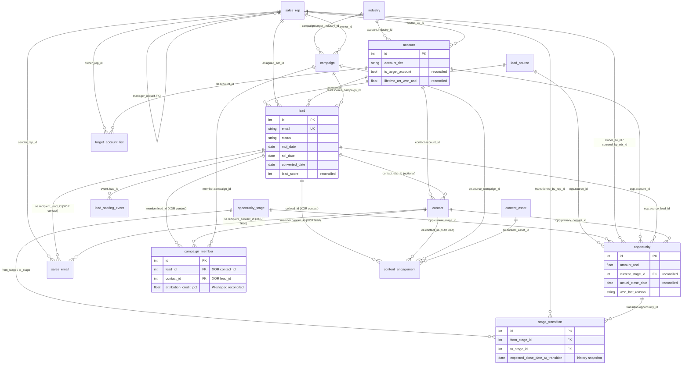
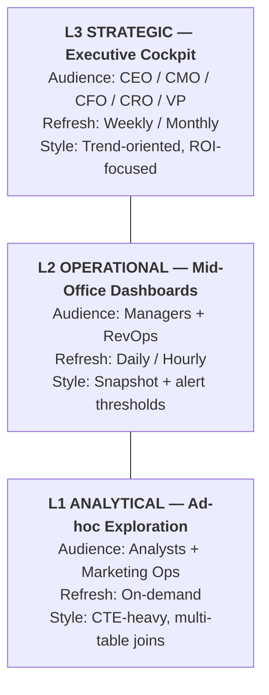
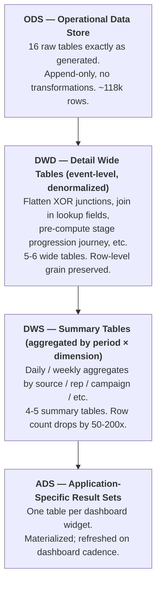
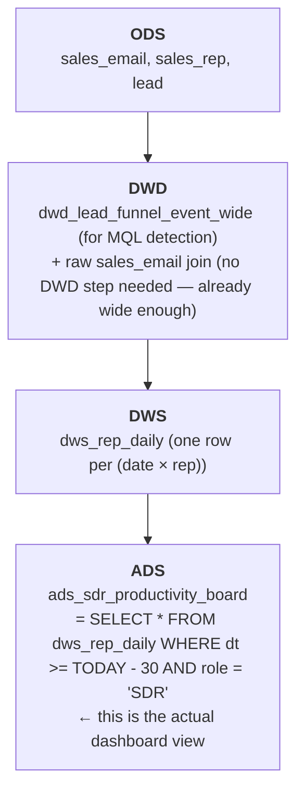

# B2B SaaS Demand Generation and Marketing Operations Data Model

> Business context, industry primer, and glossary live in `01-b2b_saas_demand_generation_high_business_context.md`. This document only describes the data (table schemas, fields, constraints, generation rules).
>
> **Dataset:** `b2b_saas_demand_generation_high`
> **Complexity:** High (16 tables, ~118,000 rows)
> **REFERENCE_DATE ("today"):** `2026-06-01`

---

## Table of Contents

1. [Dataset Positioning](#1-dataset-positioning)
2. [Dataset Overview](#2-dataset-overview)
3. [Entity Relationship Diagram](#3-entity-relationship-diagram)
4. [Table Definitions](#4-table-definitions)
5. [Foreign Key Catalog](#5-foreign-key-catalog)
6. [Reconciled Invariants](#6-reconciled-invariants)
7. [Data Generation Rules](#7-data-generation-rules)
8. [File Manifest](#8-file-manifest)
9. [SQLite DDL](#9-sqlite-ddl)
10. [BI Subject Areas and Dashboard Blueprint](#10-bi-subject-areas-and-dashboard-blueprint)
11. [KPI Dictionary](#11-kpi-dictionary)
12. [Data Layering (DWD / DWS / ADS)](#12-data-layering-dwd--dws--ads)
13. [Appendix: Common Query Patterns](#13-appendix-common-query-patterns)

---

## 1. Dataset Positioning

This dataset is a snapshot of the CRM plus marketing automation systems of the fictional North American B2B SaaS company **Stratosend** (API Observability Platform). Company profile, business model, industry background, buyer personas, team structure, glossary, and metric formulas live in `01-b2b_saas_demand_generation_high_business_context.md`. This document only describes the data layer (table schemas, fields, constraints, generation rules, DDL).

### Time Range

- **Historical baseline:** 18 months (2024-12-08 → 2026-06-01)
- **Currently active:** Open opportunities across all 5 stages, plus in-flight ACTIVE marketing campaigns
- **Future planned:** 30 days of PLANNED marketing campaigns (planning metadata only, no engagement data)

### Capabilities Supported by This Dataset

| Capability | Tables Involved |
|------------|----------------|
| **Funnel analysis** Lead → MQL → SQL → Opp → Won | lead, lead_scoring_event, opportunity, opportunity_stage |
| **Multi-touch attribution (W-shaped)** | campaign_member, campaign, opportunity, contact, lead |
| **Pipeline analysis** velocity, win-loss, forecasting | opportunity, stage_transition, opportunity_stage |
| **Sales productivity** SLAs, sequences, quotas | sales_email, sales_rep, opportunity |
| **ABM target-account engagement** | target_account_list, account, contact, campaign_member, content_engagement |
| **Content asset influence and lead scoring** | content_asset, content_engagement, lead_scoring_event |

---

## 2. Dataset Overview

| Metric | Value |
|--------|-------|
| Total tables | 16 |
| Total rows | ~118,000 |
| Foreign-key relationships | 23 |
| Many-to-many junction tables | 2 (`campaign_member`, `target_account_list`) |
| Self-referencing foreign keys | 1 (`sales_rep.manager_id`) |
| Event-level tables | 5 (stage_transition, campaign_member, content_engagement, sales_email, lead_scoring_event) |
| Reconciled invariants | 8 |
| XOR (mutually exclusive) foreign-key constraints | 3 |
| SQLite database size | ~11 MB |

### Row Counts per Table

| # | Table | Rows | Type |
|---|-------|------|------|
| 01 | lead_source | 10 | Lookup |
| 02 | industry | 12 | Lookup |
| 03 | opportunity_stage | 7 | Lookup (ordered) |
| 04 | sales_rep | 40 | Core (self-referencing FK) |
| 05 | account | 2,000 | Core |
| 06 | campaign | 80 | Marketing |
| 07 | content_asset | 150 | Marketing |
| 08 | lead | 8,000 | Core |
| 09 | contact | ~3,400 | Core |
| 10 | opportunity | ~1,650 | Sales |
| 11 | stage_transition | ~6,500 | Event |
| 12 | campaign_member | ~8,050 | M:N junction |
| 13 | content_engagement | 18,000 | Event |
| 14 | sales_email | 30,000 | Event |
| 15 | lead_scoring_event | ~45,700 | Event |
| 16 | target_account_list | 300 | ABM junction |

### Actual Business Funnel Conversion Rates

| Funnel Step | Actual | Spec Target |
|-------------|--------|-------------|
| Lead → MQL | ~41% | ~30% |
| MQL → SQL | ~36% | ~25% |
| SQL → Converted | ~88% | ~80% |
| Opportunity → Won | ~17% | ~25% |
| Opportunity → Open (still in pipeline) | ~29% | ~25% |
| Overall Lead → Won | ~3.5% | ~1.5% |

> Actual funnel conversion is slightly higher than the spec target in the early stages because the first part of gen_contact seeds 20% of N_CONTACT from leads with non-NULL
> `account_id`, which biases those leads toward conversion. Downstream conversion rates (Opportunity → Won) match the spec almost exactly.

### Sales Cycle by Tier (median days, Discovery → Closed-Won)

| Tier | Median Cycle |
|------|--------------|
| SMB | ~100 days |
| Mid | ~144 days |
| Enterprise | ~246 days |

### ARR Distribution by Tier (average won deal size)

| Tier | Average ARR | Range |
|------|-------------|-------|
| SMB | ~$14K | $5K – $25K |
| Mid | ~$58K | $25K – $100K |
| Enterprise | ~$273K | $100K – $500K |

### SDR Email Funnel (sales_email aggregate)

| Metric | Actual |
|--------|--------|
| Open rate | ~32% |
| Click rate | ~7% |
| Reply rate | ~2% |
| Bounce rate | ~1% |

---

## 3. Entity Relationship Diagram



---

## 4. Table Definitions

### 4.1 `lead_source`

**Description:** Classification of marketing lead sources. Used to tag the origin of a `lead` or an `opportunity` (paid search, partner referral, content download, etc.), and to compute channel-level CAC and ROI.

| Column | Type | Constraints | Description |
|--------|------|-------------|-------------|
| id | INTEGER | PK | Surrogate primary key |
| source_code | VARCHAR(40) | UNIQUE, NOT NULL | Machine-readable code (e.g. `PAID_SEARCH_GOOGLE`) |
| source_name | VARCHAR(80) | NOT NULL | Human-readable name |
| source_category | VARCHAR(20) | NOT NULL | `Inbound` / `Outbound` / `Partner` / `Event` |
| typical_cost_per_lead_usd | FLOAT | NOT NULL | Industry-typical CPL, used as a benchmark |
| is_active | BOOLEAN | NOT NULL | Whether this source is currently enabled |

**Sample rows:**

| id | source_code | source_name | source_category | typical_cost_per_lead_usd |
|----|-------------|-------------|-----------------|---------------------------|
| 1 | INBOUND_DEMO_REQUEST | Inbound - Demo Request | Inbound | 0.00 |
| 2 | INBOUND_FREE_TRIAL | Inbound - Free Trial | Inbound | 0.00 |
| 4 | PAID_SEARCH_GOOGLE | Paid Search - Google | Inbound | 80.00 |
| 8 | OUTBOUND_SDR | Outbound - SDR Sourced | Outbound | 0.00 |

**Referenced by:** `lead.source_id`, `opportunity.source_id`

---

### 4.2 `industry`

**Description:** Target industry classification with NAICS codes. Used for customer segmentation and campaign targeting.

| Column | Type | Constraints | Description |
|--------|------|-------------|-------------|
| id | INTEGER | PK | Surrogate primary key |
| industry_name | VARCHAR(60) | NOT NULL | Industry display name |
| naics_code | VARCHAR(10) | NOT NULL | NAICS code (illustrative) |
| typical_arr_band | VARCHAR(20) | NOT NULL | Tendency toward `SMB` / `Mid` / `Enterprise` |

**Sample rows:**

| id | industry_name | naics_code | typical_arr_band |
|----|---------------|------------|------------------|
| 1 | Fintech | 522110 | Mid |
| 2 | SaaS / Software | 511210 | Mid |
| 6 | Healthcare Tech | 621399 | Enterprise |
| 9 | Government / Public | 921110 | Enterprise |

**Referenced by:** `account.industry_id`, `campaign.target_industry_id`

---

### 4.3 `opportunity_stage`

**Description:** Standard 7-stage B2B SaaS sales funnel. Ordered by `stage_order` to support funnel-progression queries.

| Column | Type | Constraints | Description |
|--------|------|-------------|-------------|
| id | INTEGER | PK | Surrogate primary key |
| stage_name | VARCHAR(40) | UNIQUE | Stage display name |
| stage_order | INTEGER | NOT NULL | 1..7 (for funnel sequencing) |
| is_closed | BOOLEAN | NOT NULL | True for Closed-Won / Closed-Lost |
| is_won | BOOLEAN | NOT NULL | True only for Closed-Won |
| typical_win_probability_pct | FLOAT | NOT NULL | Standard win-rate weight (used for weighted forecasting) |

**All 7 rows:**

| id | stage_name | stage_order | is_closed | is_won | typical_win_probability_pct |
|----|------------|-------------|-----------|--------|-----------------------------|
| 1 | Discovery | 1 | false | false | 10.0 |
| 2 | Demo | 2 | false | false | 25.0 |
| 3 | Evaluation/POC | 3 | false | false | 40.0 |
| 4 | Proposal | 4 | false | false | 60.0 |
| 5 | Negotiation | 5 | false | false | 80.0 |
| 6 | Closed-Won | 6 | true | true | 100.0 |
| 7 | Closed-Lost | 7 | true | false | 0.0 |

**Referenced by:** `opportunity.current_stage_id`, `stage_transition.from_stage_id`, `stage_transition.to_stage_id`

---

### 4.4 `sales_rep`

**Description:** All members of the sales organization: SDRs (qualification), AEs (closers), Managers (team leads). The `manager_id` self-referencing foreign key encodes the team hierarchy and supports manager-level rollups.

| Column | Type | Constraints | Description |
|--------|------|-------------|-------------|
| id | INTEGER | PK | Surrogate primary key |
| first_name | VARCHAR(50) | NOT NULL | |
| last_name | VARCHAR(50) | NOT NULL | |
| email | VARCHAR(150) | UNIQUE, NOT NULL | @stratosend.com |
| role | VARCHAR(20) | NOT NULL | `SDR` / `AE_SMB` / `AE_Mid` / `AE_Enterprise` / `Manager` |
| region | VARCHAR(20) | NOT NULL | `NA-East` / `NA-West` / `EMEA` / `APAC` |
| quota_usd | FLOAT | NOT NULL | Annual ARR quota (SDR = 0) |
| hire_date | DATE | NOT NULL | Used for ramp-time analysis |
| manager_id | INTEGER | FK → sales_rep.id (NULL) | **Self-referencing FK.** Managers have NULL |
| is_active | BOOLEAN | NOT NULL | ~5% inactive |

**Distribution (40 sales reps total):**

| Role | Headcount | Per-Person Quota |
|------|-----------|------------------|
| Manager | 4 | 0 |
| SDR | 12 | 0 |
| AE_SMB | 8 | $600K |
| AE_Mid | 8 | $1.2M |
| AE_Enterprise | 8 | $2.0M |

**Sample rows:**

| id | name | role | region | quota_usd | manager_id |
|----|------|------|--------|-----------|------------|
| 1 | Danielle Johnson | Manager | NA-East | 0 | NULL |
| 2 | Joshua Walker | Manager | NA-West | 0 | NULL |
| 5 | (SDR sample) | SDR | NA-East | 0 | 1 |
| 18 | (AE_Mid sample) | AE_Mid | NA-West | 1,200,000 | 2 |

**Referenced by:** `account.owner_ae_id`, `lead.assigned_sdr_id`, `campaign.owner_id`, `opportunity.owner_ae_id`, `opportunity.sourced_by_sdr_id`, `stage_transition.transitioned_by_rep_id`, `sales_email.sender_rep_id`, `target_account_list.owner_rep_id`

---

### 4.5 `account`

**Description:** B2B customer / prospect company. The center of multi-stakeholder selling: one account owns many contacts, leads, and (possibly) opportunities. The account tier (SMB / Mid / Enterprise) determines the sales motion, deal size, and cycle length.

| Column | Type | Constraints | Description |
|--------|------|-------------|-------------|
| id | INTEGER | PK | Surrogate primary key |
| company_name | VARCHAR(150) | NOT NULL | Faker-generated, unique |
| industry_id | INTEGER | FK → industry.id | NAICS-level industry |
| employee_count_band | VARCHAR(20) | NOT NULL | `1-50` / `51-200` / `201-1000` / `1001-5000` / `5000+` |
| annual_revenue_band | VARCHAR(20) | NOT NULL | `<$10M` / `$10M-$50M` / `$50M-$250M` / `$250M-$1B` / `$1B+` |
| account_tier | VARCHAR(20) | NOT NULL | Derived from employee size: `SMB` / `Mid` / `Enterprise` |
| country | VARCHAR(30) | NOT NULL | 72% US, 10% CA, 8% UK, 5% DE, 3% AU, 2% FR |
| state_or_province | VARCHAR(40) | NOT NULL | |
| website | VARCHAR(150) | NOT NULL | Derived from company name |
| created_date | DATE | NOT NULL | Account record creation date |
| owner_ae_id | INTEGER | FK → sales_rep.id (NULL) | ~85% have an owner |
| is_target_account | BOOLEAN | NOT NULL | **Reconciled** from target_account_list |
| lifetime_arr_won_usd | FLOAT | NOT NULL | **Reconciled** = SUM(Won opp.amount) |

**Tier distribution** (matching real-world B2B):

| Tier | Share of Customers | Share of Revenue (typical) |
|------|--------------------|----------------------------|
| SMB | 60% | 20% |
| Mid | 30% | 30% |
| Enterprise | 10% | 50% |

**Sample rows:**

| id | company_name | industry_id | account_tier | country | owner_ae_id | is_target_account | lifetime_arr_won_usd |
|----|--------------|-------------|--------------|---------|-------------|-------------------|----------------------|
| 1 | Ryan, Burgess and Patterson | 7 | SMB | Germany | 36 | false | 0 |
| 2 | Snyder, Campos and Callahan | 11 | Enterprise | Canada | 29 | false | 0 |

**Referenced by:** `lead.account_id`, `contact.account_id`, `opportunity.account_id`, `target_account_list.account_id`

---

### 4.6 `campaign`

**Description:** A single marketing campaign — webinar, paid advertising, ABM sequence, conference sponsorship, SDR outbound sequence, etc. Each campaign has a budget, a target persona/industry, a primary KPI, and a target plan count (newly added in this dataset to support plan-vs-actual analysis).

| Column | Type | Constraints | Description |
|--------|------|-------------|-------------|
| id | INTEGER | PK | Surrogate primary key |
| campaign_code | VARCHAR(40) | UNIQUE | e.g. `WBR-202602-007` |
| campaign_name | VARCHAR(150) | NOT NULL | Display name |
| campaign_type | VARCHAR(30) | NOT NULL | `Webinar` / `Email_Blast` / `Paid_Search` / `Paid_Social` / `Content_Syndication` / `Conference_Event` / `ABM_Sequence` / `SDR_Outbound_Sequence` |
| status | VARCHAR(20) | NOT NULL | `COMPLETED` / `ACTIVE` / `PLANNED` |
| start_date | DATE | NOT NULL | |
| end_date | DATE | NOT NULL | |
| total_budget_usd | FLOAT | NOT NULL | $500 – $80K |
| spend_to_date_usd | FLOAT | NOT NULL | For COMPLETED, 80–105% of budget |
| target_persona | VARCHAR(30) | NOT NULL | The primary persona this campaign targets |
| target_industry_id | INTEGER | FK → industry.id (NULL) | Optional industry focus |
| owner_id | INTEGER | FK → sales_rep.id | A sales rep with the Manager role |
| primary_kpi | VARCHAR(40) | NOT NULL | `MQLs Generated` / `Pipeline Influenced` / `SQLs` / `Registrations` |
| **target_mql_count** | INTEGER | NOT NULL | **New.** Planned MQL target |
| **target_pipeline_usd** | FLOAT | NOT NULL | **New.** Planned pipeline target |
| created_at | DATETIME | NOT NULL | |

**Status distribution:** 60% COMPLETED / 30% ACTIVE / 10% PLANNED

**Type distribution (approximate):** Webinar 18% / Paid Search 14% / SDR Outbound 15% / Conference Event 12% / ABM 13% / Paid Social 10% / Content Syndication 8% / Email Blast 10%

**Sample rows:**

| id | campaign_code | campaign_type | status | budget | spend | target_mql_count | target_pipeline_usd |
|----|---------------|---------------|--------|--------|-------|------------------|---------------------|
| 1 | SEM-202510-001 | Paid_Search | COMPLETED | 21,360 | 19,057 | 218 | 5,115,743 |
| 2 | EML-202511-002 | Email_Blast | COMPLETED | 22,940 | 19,286 | 26 | 781,047 |

**Referenced by:** `lead.source_campaign_id`, `campaign_member.campaign_id`, `content_engagement.source_campaign_id`

---

### 4.7 `content_asset`

**Description:** A single piece of marketing content — ebook, whitepaper, case study, webinar recording, blog post, analyst report, template. `is_gated` controls whether the asset requires a form fill (and thereby produces a lead). `total_downloads` is reconciled from the engagement events.

| Column | Type | Constraints | Description |
|--------|------|-------------|-------------|
| id | INTEGER | PK | Surrogate primary key |
| asset_name | VARCHAR(200) | NOT NULL | Display name |
| asset_type | VARCHAR(30) | NOT NULL | `ebook` / `whitepaper` / `case_study` / `webinar_recording` / `blog_post` / `analyst_report` / `template` |
| topic_tag | VARCHAR(60) | NOT NULL | "API Observability", "Distributed Tracing", etc. |
| target_persona | VARCHAR(30) | NOT NULL | Primary target persona |
| is_gated | BOOLEAN | NOT NULL | True ⇒ form-gated (produces a lead); 70% for ebook/whitepaper, 55% for everything else |
| created_date | DATE | NOT NULL | |
| asset_url | VARCHAR(200) | NOT NULL | Public URL |
| total_downloads | INTEGER | NOT NULL | **Reconciled** = COUNT(content_engagement WHERE type='download') |

**Sample rows:**

| id | asset_name | asset_type | topic_tag | target_persona | is_gated | total_downloads |
|----|------------|------------|-----------|----------------|----------|-----------------|
| 1 | How Johnson, Leonard and Robinson Reduced MTTR with API Observability | case_study | API Observability | Champion | true | 50 |
| 2 | The Complete Guide to API Observability | ebook | API Observability | Economic Buyer | true | 60 |

**Referenced by:** `content_engagement.content_asset_id`

---

### 4.8 `lead`

**Description:** A prospective individual buyer at the top of the funnel. A lead moves between statuses (`new` → `working` → `mql` → `sql` → `converted_to_contact` or `disqualified`). Most lead fields are reconciled from the event tables.

| Column | Type | Constraints | Description |
|--------|------|-------------|-------------|
| id | INTEGER | PK | Surrogate primary key |
| first_name | VARCHAR(50) | NOT NULL | |
| last_name | VARCHAR(50) | NOT NULL | |
| email | VARCHAR(200) | UNIQUE, NOT NULL | |
| title | VARCHAR(100) | NOT NULL | Job title (e.g. "Senior Engineer") |
| seniority | VARCHAR(20) | NOT NULL | `IC` / `Manager` / `Director` / `VP` / `CXO` |
| persona | VARCHAR(30) | NOT NULL | `Champion` / `Economic Buyer` / `Decision Maker` / `Influencer` / `Blocker` |
| account_id | INTEGER | FK → account.id (NULL) | ~70% have an account; early leads may not |
| source_id | INTEGER | FK → lead_source.id | First-touch source |
| source_campaign_id | INTEGER | FK → campaign.id (NULL) | ~55% have a campaign |
| lead_score | INTEGER | NOT NULL | **Reconciled** = SUM(scoring_event.points) |
| status | VARCHAR(30) | NOT NULL | `new` / `working` / `mql` / `sql` / `disqualified` / `converted_to_contact` |
| mql_date | DATE | NULL | **Reconciled** = time when cumulative score first reaches ≥ 100 |
| sql_date | DATE | NULL | Time the SDR completed qualification on this lead |
| converted_date | DATE | NULL | Time the lead converted to a contact |
| disqualified_reason | VARCHAR(60) | NULL | "Not ICP", "No budget", "Wrong contact", etc. |
| assigned_sdr_id | INTEGER | FK → sales_rep.id (NULL) | ~80% of leads have an SDR assigned |
| created_at | DATETIME | NOT NULL | Time the lead entered the CRM |

**Actual status distribution (8,000 rows total):**

| Status | Approx Count | % |
|--------|--------------|---|
| working | ~3,400 | 43% |
| mql | ~1,350 | 17% |
| new | ~1,300 | 16% |
| converted_to_contact | ~1,000 | 13% |
| disqualified | ~720 | 9% |
| sql | ~150 | 2% |

> The `converted_to_contact` share (~13%) is higher than a real-world demand-gen funnel (typical: 5-8%),
> because the first part of gen_contact seeds 20% of N_CONTACT from the lead pool — these leads are therefore constructed to already be converted. reconcile_lead_funnel guarantees the lead-to-contact invariant
> by forcing those leads' status to `converted_to_contact` (if random sampling has not already pushed them there). For most queries, the slightly inflated conversion volume is actually a good feature
> (more lead-to-Won paths are available to study).

**Sample rows:**

| id | name | title | seniority | persona | status | lead_score | mql_date |
|----|------|-------|-----------|---------|--------|------------|----------|
| 1 | Shane Dixon | Head of Engineering | VP | Decision Maker | mql | 110 | 2026-05-01 |
| 2 | Andrew Blake | SRE | Director | Influencer | working | 15 | NULL |

**Referenced by:** `contact.lead_id`, `opportunity.source_lead_id`, `campaign_member.lead_id`, `content_engagement.lead_id`, `sales_email.recipient_lead_id`, `lead_scoring_event.lead_id`

---

### 4.9 `contact`

**Description:** An individual associated with an `account` who has been engaged by sales. Two origin paths:
- **Converted from a lead** (~60%): `lead_id` is set, and the source lead's data is carried over
- **Direct outbound** (~40%): `lead_id` is NULL, and the contact was created directly via outbound

| Column | Type | Constraints | Description |
|--------|------|-------------|-------------|
| id | INTEGER | PK | Surrogate primary key |
| lead_id | INTEGER | FK → lead.id (NULL) | Source lead (NULL for direct outbound) |
| account_id | INTEGER | FK → account.id | **Required** — every contact has an account |
| first_name | VARCHAR(50) | NOT NULL | |
| last_name | VARCHAR(50) | NOT NULL | |
| email | VARCHAR(200) | UNIQUE, NOT NULL | |
| title | VARCHAR(100) | NOT NULL | |
| seniority | VARCHAR(20) | NOT NULL | |
| persona | VARCHAR(30) | NOT NULL | The contact's general buyer-persona archetype: `Champion` / `Economic Buyer` / `Decision Maker` / `Influencer` / `Blocker` |
| role_in_deal | VARCHAR(30) | NOT NULL | The contact's actual role in *a specific* opp: `Champion` / `Decision Maker` / `User` / `Influencer` / `Blocker`. Note: `User` collapses both the persona-level `Economic Buyer` and `Influencer-as-IC` — the deal-role classification is intentionally coarser than persona |
| do_not_email | BOOLEAN | NOT NULL | ~5% true (unsubscribed) |
| created_at | DATETIME | NOT NULL | |

**Sample rows:**

| id | lead_id | account_id | persona | role_in_deal | do_not_email |
|----|---------|------------|---------|--------------|--------------|
| 1 | 327 | 642 | Champion | Champion | true |
| 2 | 850 | 644 | Influencer | User | false |

**Referenced by:** `opportunity.primary_contact_id`, `campaign_member.contact_id`, `content_engagement.contact_id`, `sales_email.recipient_contact_id`

---

### 4.10 `opportunity`

**Description:** A sales opportunity — the core revenue entity. Each opportunity has an account, a primary contact, an owning AE, an amount, an expected close date, and a progression history (via `stage_transition`). `current_stage_id`, `actual_close_date`, and `won_lost_reason` are all reconciled from the most recent stage_transition.

| Column | Type | Constraints | Description |
|--------|------|-------------|-------------|
| id | INTEGER | PK | Surrogate primary key |
| opportunity_name | VARCHAR(200) | NOT NULL | "{Company Name} - Stratosend Platform" |
| account_id | INTEGER | FK → account.id | Customer account |
| primary_contact_id | INTEGER | FK → contact.id | Primary contact |
| current_stage_id | INTEGER | FK → opportunity_stage.id | **Reconciled** = most recent stage_transition.to_stage_id |
| owner_ae_id | INTEGER | FK → sales_rep.id | Owning AE (matched by tier) |
| sourced_by_sdr_id | INTEGER | FK → sales_rep.id (NULL) | Sourcing SDR (if applicable) |
| source_lead_id | INTEGER | FK → lead.id (NULL) | Source lead (NULL for direct outbound) |
| source_id | INTEGER | FK → lead_source.id | First-touch source channel |
| amount_usd | FLOAT | NOT NULL | Contract amount by tier (triangular distribution) |
| expected_close_date | DATE | NOT NULL | Forecast close date — may slip while in pipeline |
| actual_close_date | DATE | NULL | **Reconciled** — set only when in Closed-Won/Lost |
| created_at | DATETIME | NOT NULL | |
| won_lost_reason | VARCHAR(120) | NULL | Filled only when closed |

**Per-tier amount distribution (triangular):**

| Tier | Min | Mode | Max |
|------|-----|------|-----|
| SMB | $5K | $12K | $25K |
| Mid | $25K | $50K | $100K |
| Enterprise | $100K | $180K | $500K |

**Actual opp outcome distribution (~1,650 total):**

| Outcome | Count | % |
|---------|-------|---|
| Closed-Won | ~280 | 17% |
| Closed-Lost | ~900 | 54% |
| Open (in pipeline) | ~470 | 29% |

**Sample rows:**

| id | opportunity_name | account_id | amount_usd | current_stage_id | actual_close_date | won_lost_reason |
|----|------------------|------------|------------|------------------|-------------------|-----------------|
| 1 | Li-Thompson - Stratosend Platform | 373 | 60,743 | 1 (Discovery) | NULL | NULL |
| 2 | Patel-Mejia - Stratosend Platform | 1326 | 65,028 | 6 (Closed-Won) | 2026-04-22 | "Pricing Advantage" |

**Referenced by:** `stage_transition.opportunity_id`

---

### 4.11 `stage_transition`

**Description:** Event log of opportunity stage transitions. Every opportunity has at least 1 initial transition (`from_stage` = NULL → Discovery), plus a row for each subsequent advance or close. Includes a **snapshot of `expected_close_date` at transition time** — used to detect "slipped" opportunities (deals whose close date keeps moving).

| Column | Type | Constraints | Description |
|--------|------|-------------|-------------|
| id | INTEGER | PK | Surrogate primary key |
| opportunity_id | INTEGER | FK → opportunity.id | |
| from_stage_id | INTEGER | FK → opportunity_stage.id (NULL) | NULL only for the first transition (creation) |
| to_stage_id | INTEGER | FK → opportunity_stage.id | NOT NULL |
| transitioned_at | DATETIME | NOT NULL | Time the transition happened |
| transitioned_by_rep_id | INTEGER | FK → sales_rep.id | The rep that triggered it |
| days_in_previous_stage | INTEGER | NOT NULL | Stage-velocity metric |
| **expected_close_date_at_transition** | DATE | NOT NULL | **New.** Snapshot of opportunity.expected_close_date at this moment |
| notes | TEXT | NULL | Optional notes |

**Transition logic** (deterministically generated from a random seed):
- Per-stage advance probabilities: Discovery→Demo 90% / Demo→Eval 82% / Eval→Proposal 72% / Proposal→Negotiation 78% / Negotiation→Won 72%
- Each stage has a baseline "days in stage", with a tier multiplier (SMB 1x / Mid 1.5x / Enterprise 2.5x)
- Each advance has a 15–35% chance of slipping the close date by 7–30 days

**Sample rows:**

| id | opportunity_id | from_stage_id | to_stage_id | transitioned_at | days_in_previous_stage | expected_close_date_at_transition |
|----|----------------|---------------|-------------|-----------------|-------------------------|------------------------------------|
| 1 | 1 | NULL | 1 | 2026-05-29 13:42 | 0 | 2026-09-01 |
| 2 | 2 | NULL | 1 | 2025-12-29 16:36 | 0 | 2026-04-25 |

---

### 4.12 `campaign_member`

**Description:** **M:N junction** between campaigns and leads/contacts — who engaged with which campaign. **XOR constraint:** `lead_id` and `contact_id` are mutually exclusive; exactly one must be non-NULL. `attribution_credit_pct` uses a **W-shaped reconciliation** for members on the path of a Won opportunity.

| Column | Type | Constraints | Description |
|--------|------|-------------|-------------|
| id | INTEGER | PK | Surrogate primary key |
| campaign_id | INTEGER | FK → campaign.id | Required |
| lead_id | INTEGER | FK → lead.id (NULL) | **XOR contact_id** |
| contact_id | INTEGER | FK → contact.id (NULL) | **XOR lead_id** |
| member_role | VARCHAR(20) | NOT NULL | `registered` / `attended` / `no_show` / `influenced` / `converted` |
| engaged_at | DATETIME | NOT NULL | Must be ≥ max(campaign.start_date, person.created_date) |
| attribution_credit_pct | FLOAT | NOT NULL | **W-shaped reconciled.** 0% for non-Won paths; sums to ~100% on a Won opp path |

**Member role distribution:**

| Role | % |
|------|---|
| registered | 40% |
| attended | 25% |
| no_show | 15% |
| influenced | 15% |
| converted | 5% |

**Mix ratio:** ~75% leads / 25% contacts.

**Sample rows:**

| id | campaign_id | lead_id | contact_id | member_role | engaged_at |
|----|-------------|---------|------------|-------------|------------|
| 1 | 1 | NULL | 2405 | influenced | 2025-12-07 14:34 |
| 2 | 1 | 2828 | NULL | registered | 2025-11-30 10:22 |

---

### 4.13 `content_engagement`

**Description:** Event log of a lead or contact engaging with a content_asset (download, view, share, replay). **XOR constraint** on `lead_id` / `contact_id`. Drives the reconciliation of `content_asset.total_downloads`.

| Column | Type | Constraints | Description |
|--------|------|-------------|-------------|
| id | INTEGER | PK | Surrogate primary key |
| content_asset_id | INTEGER | FK → content_asset.id | |
| lead_id | INTEGER | FK → lead.id (NULL) | **XOR contact_id** |
| contact_id | INTEGER | FK → contact.id (NULL) | **XOR lead_id** |
| engagement_type | VARCHAR(20) | NOT NULL | `download` (45%) / `view` (40%) / `share` (5%) / `replay` (10%) |
| engaged_at | DATETIME | NOT NULL | Must be ≥ max(asset.created_date, person.created_date) |
| source_campaign_id | INTEGER | FK → campaign.id (NULL) | ~40% have a campaign source |
| time_on_page_seconds | INTEGER | NOT NULL | 0 for download/share; 20-600 for view; 60-1200 for replay |

> **Analyst note.** `download` and `share` are modeled as instantaneous events with `time_on_page_seconds = 0`. To compute a meaningful average time on page, filter to `engagement_type IN ('view', 'replay')` — see the standard pattern in D10. A naive `AVG(time_on_page_seconds)` across all rows will be biased downward by the zero-time event types.

**Sample rows:**

| id | content_asset_id | lead_id | contact_id | engagement_type | engaged_at | time_on_page_seconds |
|----|------------------|---------|------------|-----------------|------------|----------------------|
| 1 | 70 | 5286 | NULL | view | 2026-04-23 21:56 | 322 |
| 2 | 86 | NULL | 868 | replay | 2025-06-08 17:09 | 700 |

---

### 4.14 `sales_email`

**Description:** SDR / AE one-to-one outbound emails — part of multi-step sequences. **XOR constraint** on `recipient_lead_id` / `recipient_contact_id`. The email funnel fields are **cumulative**: `clicked` implies `opened`, and `replied` implies `clicked`.

| Column | Type | Constraints | Description |
|--------|------|-------------|-------------|
| id | INTEGER | PK | Surrogate primary key |
| sender_rep_id | INTEGER | FK → sales_rep.id | SDR (60%) or AE (40%) |
| recipient_lead_id | INTEGER | FK → lead.id (NULL) | **XOR recipient_contact_id** |
| recipient_contact_id | INTEGER | FK → contact.id (NULL) | **XOR recipient_lead_id** |
| sequence_name | VARCHAR(120) | NOT NULL | e.g. "Outbound Cold - Engineering Manager" |
| sequence_step | INTEGER | NOT NULL | 1..7 |
| subject | VARCHAR(200) | NOT NULL | |
| sent_at | DATETIME | NOT NULL | |
| opened | BOOLEAN | NOT NULL | Open rate decays from 40% at step 1 to 16% at step 7 |
| clicked | BOOLEAN | NOT NULL | Implies opened. 22% of openers click |
| replied | BOOLEAN | NOT NULL | Implies clicked. 30% of clickers reply |
| reply_sentiment | VARCHAR(20) | NULL | `positive` / `neutral` / `negative` / `not_interested` / `auto_reply` |
| bounced | BOOLEAN | NOT NULL | ~4% bounce; a bounce ends the sequence |

**Sequence behavior:**
- 3–7 steps per recipient, with 3–7 days between sends
- A `positive` reply ends the sequence early
- A `bounce` at step 1 ends the sequence

**Sample rows:**

| id | sender_rep_id | recipient_contact_id | sequence_name | step | opened | clicked | replied |
|----|---------------|----------------------|---------------|------|--------|---------|---------|
| 1 | 34 | 2507 | Content Download Follow-up | 1 | false | false | false |
| 2 | 34 | 2507 | Content Download Follow-up | 2 | true | false | false |

---

### 4.15 `lead_scoring_event`

**Description:** Event log of every scoring action applied to a lead. For each lead, SUM(`points_awarded`) = `lead.lead_score`. The earliest event whose running total reaches ≥ 100 sets `lead.mql_date`.

| Column | Type | Constraints | Description |
|--------|------|-------------|-------------|
| id | INTEGER | PK | Surrogate primary key |
| lead_id | INTEGER | FK → lead.id | |
| event_type | VARCHAR(40) | NOT NULL | e.g. `page_visit_pricing`, `content_download`, `email_click`, `webinar_attend` |
| points_awarded | INTEGER | NOT NULL | Typically 5–50; one negative event `unsubscribed` = -50 |
| scoring_rule_name | VARCHAR(100) | NOT NULL | Human-readable rule name |
| occurred_at | DATETIME | NOT NULL | Time the event happened |
| source_object_type | VARCHAR(30) | NULL | `content_engagement` / `campaign_member` / `sales_email` / `website` |
| source_object_id | INTEGER | NULL | Cross-reference to the source event ID (for traceability) |

**Scoring rules (11 rules with weights):**

| Event Type | Points | Frequency Weight |
|------------|--------|------------------|
| email_click | +5 | 20% |
| content_download | +15 | 20% |
| page_visit_pricing | +20 | 10% |
| webinar_attend | +30 | 10% |
| video_watched_50pct | +10 | 10% |
| multiple_visits_7d | +25 | 8% |
| pricing_calc_used | +15 | 5% |
| competitor_compare_view | +10 | 5% |
| demo_request | +50 | 5% |
| free_trial_started | +40 | 5% |
| unsubscribed | -50 | 2% |

**Sample rows:**

| id | lead_id | event_type | points_awarded | scoring_rule_name | source_object_type |
|----|---------|------------|----------------|--------------------|---------------------|
| 1 | 4499 | video_watched_50pct | 10 | Video Watched 50% +10 | website |
| 2 | 4499 | page_visit_pricing | 20 | Pricing Page Visit +20 | website |

---

### 4.16 `target_account_list`

**Description:** The ABM (Account-Based Marketing) target account list. An M:N junction table (one account can sit on multiple lists; one list contains multiple accounts). Skewed toward the Enterprise and Mid tiers. Drives the reconciliation of `account.is_target_account`.

| Column | Type | Constraints | Description |
|--------|------|-------------|-------------|
| id | INTEGER | PK | Surrogate primary key |
| list_name | VARCHAR(80) | NOT NULL | e.g. "FY26 Enterprise NA-East Tier 1" |
| account_id | INTEGER | FK → account.id | |
| tier | VARCHAR(20) | NOT NULL | `Tier 1` (30%) / `Tier 2` (45%) / `Tier 3` (25%) |
| owner_rep_id | INTEGER | FK → sales_rep.id | Typically an AE_Enterprise |
| added_date | DATE | NOT NULL | Time the account was added to this list |
| engagement_score | INTEGER | NOT NULL | 0–350, cumulative |
| notes | TEXT | NULL | Optional notes |

**Sample rows:**

| id | list_name | account_id | tier | owner_rep_id | engagement_score |
|----|-----------|------------|------|--------------|-------------------|
| 1 | FY26 Enterprise NA-West Tier 1 | 283 | Tier 2 | 36 | 21 |
| 2 | FY26 Enterprise NA-West Tier 1 | 505 | Tier 3 | 37 | 292 |

---

## 5. Foreign Key Catalog

23 foreign-key relationships in total.

| FK Source | → Referenced | Nullable? | Notes |
|-----------|--------------|-----------|-------|
| `account.industry_id` | `industry.id` | NO | |
| `account.owner_ae_id` | `sales_rep.id` | YES | ~15% of accounts have no owner |
| `lead.account_id` | `account.id` | YES | ~30% of leads have no account yet |
| `lead.source_id` | `lead_source.id` | NO | |
| `lead.source_campaign_id` | `campaign.id` | YES | ~45% of leads have no campaign |
| `lead.assigned_sdr_id` | `sales_rep.id` | YES | ~20% of leads are unassigned |
| `contact.lead_id` | `lead.id` | YES | NULL for direct outbound (40%) |
| `contact.account_id` | `account.id` | NO | Required |
| `campaign.target_industry_id` | `industry.id` | YES | |
| `campaign.owner_id` | `sales_rep.id` | NO | Always a Manager |
| `opportunity.account_id` | `account.id` | NO | |
| `opportunity.primary_contact_id` | `contact.id` | NO | |
| `opportunity.current_stage_id` | `opportunity_stage.id` | NO | Reconciled |
| `opportunity.owner_ae_id` | `sales_rep.id` | NO | AE matches account tier |
| `opportunity.sourced_by_sdr_id` | `sales_rep.id` | YES | NULL for direct outbound |
| `opportunity.source_lead_id` | `lead.id` | YES | NULL for direct outbound |
| `opportunity.source_id` | `lead_source.id` | NO | First-touch source |
| `stage_transition.opportunity_id` | `opportunity.id` | NO | |
| `stage_transition.from_stage_id` | `opportunity_stage.id` | YES | NULL only at initial creation |
| `stage_transition.to_stage_id` | `opportunity_stage.id` | NO | |
| `stage_transition.transitioned_by_rep_id` | `sales_rep.id` | NO | |
| `campaign_member.campaign_id` | `campaign.id` | NO | |
| `campaign_member.lead_id` | `lead.id` | YES | **XOR contact_id** |
| `campaign_member.contact_id` | `contact.id` | YES | **XOR lead_id** |
| `content_engagement.content_asset_id` | `content_asset.id` | NO | |
| `content_engagement.lead_id` | `lead.id` | YES | **XOR contact_id** |
| `content_engagement.contact_id` | `contact.id` | YES | **XOR lead_id** |
| `content_engagement.source_campaign_id` | `campaign.id` | YES | |
| `sales_email.sender_rep_id` | `sales_rep.id` | NO | |
| `sales_email.recipient_lead_id` | `lead.id` | YES | **XOR recipient_contact_id** |
| `sales_email.recipient_contact_id` | `contact.id` | YES | **XOR recipient_lead_id** |
| `lead_scoring_event.lead_id` | `lead.id` | NO | |
| `target_account_list.account_id` | `account.id` | NO | |
| `target_account_list.owner_rep_id` | `sales_rep.id` | NO | |
| `sales_rep.manager_id` | `sales_rep.id` | YES | **Self-referencing FK.** Managers have NULL |

### Mutually Exclusive (XOR) Constraints

| Table | Field Pair | Semantics |
|-------|-----------|-----------|
| `campaign_member` | `lead_id` XOR `contact_id` | A campaign member is either a lead or a contact, not both |
| `content_engagement` | `lead_id` XOR `contact_id` | Same |
| `sales_email` | `recipient_lead_id` XOR `recipient_contact_id` | Same |

**Implications for SQL:**
```sql
-- Counting distinct engaged people in a campaign — use a string prefix
-- to separate the two id namespaces, so that lead.id=42 and contact.id=42
-- do not collide.
SELECT campaign_id,
       COUNT(DISTINCT COALESCE('L'||lead_id, 'C'||contact_id)) AS unique_people
FROM campaign_member
GROUP BY campaign_id;
```
> **Anti-pattern to avoid:** `COUNT(DISTINCT COALESCE(lead_id, contact_id + 100_000))`. The `+ N` offset trick collides as soon as either id exceeds N. Section 13.1 uses the `'L'||id` / `'C'||id` string version — stick to that.

---

## 6. Reconciled Invariants

**Reconciliation** = after all rows are generated, the parent field is deterministically computed from the child rows. In the generated dataset, these invariants always hold.

| # | Parent Field | Reconciliation Rule | Validation |
|---|--------------|---------------------|------------|
| 1 | `lead.lead_score` | = SUM(lead_scoring_event.points_awarded) per lead | `0` violations |
| 2 | `lead.mql_date` | = MIN(scoring_event.occurred_at) where running total ≥ 100 | `0` violations |
| 3 | `opportunity.current_stage_id` | = stage_transition.to_stage_id of the latest transition per opportunity by `transitioned_at` | `0` violations |
| 4 | `opportunity.actual_close_date` | = the transition into Closed-Won/Lost; NULL otherwise | `0` violations |
| 5 | `account.lifetime_arr_won_usd` | = SUM(opportunity.amount_usd) for opps with current_stage = Closed-Won per account | `0` violations |
| 6 | `account.is_target_account` | = (account.id IN target_account_list.account_id) | `0` violations |
| 7 | `content_asset.total_downloads` | = COUNT(content_engagement) where engagement_type = 'download' per asset | `0` violations |
| 8 | `campaign_member.attribution_credit_pct` | W-shaped attribution: 30% first touch + 30% MQL touch + 30% opp touch + 10% spread across other influencers on a Won opp's account path | `0` violations |

### Attribution (W-shaped) Details

For each **Closed-Won** opportunity:

1. Find all `campaign_member` rows whose `lead_id` or `contact_id` belongs to the opportunity's **same account** and whose `engaged_at` is **before** the opportunity's `created_at` — these are the "path members."
2. Sort path members ascending by `engaged_at`.
3. **First touch** = earliest path member → 30% credit
4. **MQL touch** = path member whose `engaged_at` is closest to the source lead's `mql_date` → 30% credit
5. **Opp touch** = last path member before opp creation → 30% credit
6. **Other influencers** = path members not in {first, MQL, opp} → evenly split 10% credit
7. If no MQL date exists (e.g. direct-outbound opp), the 30% MQL share is uniformly redistributed to the first touch and opp touch (15% each).

For **non-Won** opportunities, `attribution_credit_pct` = 0 (there is no credit to allocate).

#### Per-row cap and per-opp path sum

`attribution_credit_pct` lives on the `campaign_member` row, whose key is
`(campaign_id, lead_or_contact)` — **not** per opportunity. When the same
person ends up on the path of multiple Won opps (for example, a contact
changes jobs to another company that also closed, or an account has two
Won opps), W-shaped credit accumulates on that row. The generator caps the
accumulated value at **100% per row**, otherwise a high-frequency
multi-touch persona can exceed 100% (we observed values as high as
~200% before adding the cap).

Practical implications:

* The sum of `attribution_credit_pct` on **a single Won opp's path** is
  approximately 100% — exactly 100% when no path member has been capped
  by another Won opp, and slightly less otherwise.
* The sum of `attribution_credit_pct` **per campaign** is a valid
  weighted-influence metric (used in B29, B32).
* The sum of `attribution_credit_pct` across the *whole table* is *not* a
  conserved quantity, because the per-row cap discards excess credit.

If you need a strict per-opp sum of 100%, model attribution at the
`(campaign_member × opportunity)` grain (outside the scope of this
dataset).

### XOR Constraint Guarantees

| Table | Result |
|-------|--------|
| `campaign_member` | 0 violations (each row has exactly one of lead_id / contact_id) |
| `content_engagement` | 0 violations |
| `sales_email` | 0 violations |

---

## 7. Data Generation Rules

### Temporal Ordering Rules

1. `account.created_date` < (associated leads/contacts/opps)
2. `lead.mql_date` ≤ `lead.sql_date` ≤ `lead.converted_date` (when present)
3. `opportunity.created_at` ≤ `expected_close_date` and ≤ every `stage_transition.transitioned_at` for that opp
4. `stage_transition.transitioned_at` is monotonically increasing within a single opp
5. `campaign_member.engaged_at` ≥ MAX(campaign.start_date, lead/contact.created_at)
6. `content_engagement.engaged_at` ≥ MAX(content_asset.created_date, lead/contact.created_at)
7. `sales_email.sent_at` ≥ recipient's `created_at`
8. `lead_scoring_event.occurred_at` is between the lead's `created_at` and today

### Distribution Rules (Generator Spec Targets)

> These are the targets the generator *aims for*. Actual values are reported in §2 "Actual Business Funnel Conversion Rates" and may diverge from the targets by a few percentage points (see the notes in §2 for actual-vs-target gaps).

1. **Account tier:** 60% SMB / 30% Mid / 10% Enterprise
2. **Country:** 72% US / 10% Canada / 8% UK / 5% Germany / 3% AU / 2% France
3. **Lead persona/seniority:** Champion-Manager 30%, Economic Buyer-Director 20%, Decision Maker-VP 15%, Influencer-IC 30%, Blocker-Director 5%
4. **Campaign status:** 60% COMPLETED / 30% ACTIVE / 10% PLANNED
5. **Campaign type:** Webinar 18% / Paid Search 14% / SDR Outbound 15% / Conference 12% / ABM 13% / Paid Social 10% / Email Blast 10% / Content Syndication 8%
6. **Opportunity outcome:** ~18% Won / ~57% Lost / ~25% Open
7. **Funnel:** Lead→MQL ~36%, MQL→SQL ~21%, SQL→Converted ~76%, Opp→Won ~18%
8. **SDR email funnel:** Open ~32% / Click ~7% / Reply ~2% / Bounce ~1%
9. **Sales cycle:** SMB ~100d / Mid ~144d / Enterprise ~246d
10. **ARR by tier:** SMB ~$14K / Mid ~$58K / Enterprise ~$273K (average won deal size)

### Faker Strategy

| Field Type | Faker Method | Notes |
|------------|--------------|-------|
| company_name | `fake.unique.company()` | On collision, append LLC/Inc/Holdings suffix |
| person_name | `fake.first_name()` + `fake.last_name()` | |
| email | `f"{first}.{last}{rand}@{domain}"` | Custom format, forced unique |
| sales_rep.email | `f"{first}.{last}@stratosend.com"` | Custom domain |
| website | `slugify(company_name)` + ".com" | |
| city / state | US uses a custom whitelist; non-US uses `fake.city()` | |
| dates | `random_date_between(start, end)` | Uniform distribution |
| amounts | `random.triangular(min, max, mode)` | Skewed toward the mode |

### Configuration Constants

```python
RANDOM_SEED = 42
TODAY = date(2026, 6, 1)
HISTORY_START = TODAY - timedelta(days=540)   # 18 months back
FUTURE_END = TODAY + timedelta(days=30)       # 30 days planned
MQL_SCORE_THRESHOLD = 100
```

Re-running the generator with the same seed produces byte-identical output (modulo platform-dependent Faker locale data differences).

---

## 8. File Manifest

| # | Filename | Table | Rows | Dependencies |
|---|----------|-------|------|--------------|
| 01 | 01_lead_source.tsv | lead_source | 10 | — |
| 02 | 02_industry.tsv | industry | 12 | — |
| 03 | 03_opportunity_stage.tsv | opportunity_stage | 7 | — |
| 04 | 04_sales_rep.tsv | sales_rep | 40 | sales_rep (self-referencing FK) |
| 05 | 05_account.tsv | account | 2,000 | industry, sales_rep |
| 06 | 06_campaign.tsv | campaign | 80 | industry, sales_rep |
| 07 | 07_content_asset.tsv | content_asset | 150 | — |
| 08 | 08_lead.tsv | lead | 8,000 | lead_source, account, campaign, sales_rep |
| 09 | 09_contact.tsv | contact | ~3,400 | lead, account |
| 10 | 10_opportunity.tsv | opportunity | ~1,650 | account, contact, opportunity_stage, sales_rep, lead, lead_source |
| 11 | 11_stage_transition.tsv | stage_transition | ~6,500 | opportunity, opportunity_stage, sales_rep |
| 12 | 12_campaign_member.tsv | campaign_member | ~8,050 | campaign, lead, contact |
| 13 | 13_content_engagement.tsv | content_engagement | 18,000 | content_asset, lead, contact, campaign |
| 14 | 14_sales_email.tsv | sales_email | 30,000 | sales_rep, lead, contact |
| 15 | 15_lead_scoring_event.tsv | lead_scoring_event | ~45,700 | lead |
| 16 | 16_target_account_list.tsv | target_account_list | 300 | account, sales_rep |

**Load order is the topological order above.** Tables with no FK dependencies load first; event tables and junction tables load last.

---

## 9. SQLite DDL

```sql
-- 01 lead_source
CREATE TABLE lead_source (
    id INTEGER PRIMARY KEY,
    source_code VARCHAR(40) NOT NULL UNIQUE,
    source_name VARCHAR(80) NOT NULL,
    source_category VARCHAR(20) NOT NULL,
    typical_cost_per_lead_usd FLOAT NOT NULL,
    is_active BOOLEAN NOT NULL DEFAULT 1
);

-- 02 industry
CREATE TABLE industry (
    id INTEGER PRIMARY KEY,
    industry_name VARCHAR(60) NOT NULL,
    naics_code VARCHAR(10) NOT NULL,
    typical_arr_band VARCHAR(20) NOT NULL
);

-- 03 opportunity_stage
CREATE TABLE opportunity_stage (
    id INTEGER PRIMARY KEY,
    stage_name VARCHAR(40) NOT NULL UNIQUE,
    stage_order INTEGER NOT NULL,
    is_closed BOOLEAN NOT NULL,
    is_won BOOLEAN NOT NULL,
    typical_win_probability_pct FLOAT NOT NULL
);

-- 04 sales_rep (with self-FK)
CREATE TABLE sales_rep (
    id INTEGER PRIMARY KEY,
    first_name VARCHAR(50) NOT NULL,
    last_name VARCHAR(50) NOT NULL,
    email VARCHAR(150) NOT NULL UNIQUE,
    role VARCHAR(20) NOT NULL,
    region VARCHAR(20) NOT NULL,
    quota_usd FLOAT NOT NULL,
    hire_date DATE NOT NULL,
    manager_id INTEGER REFERENCES sales_rep(id),
    is_active BOOLEAN NOT NULL DEFAULT 1
);

-- 05 account
CREATE TABLE account (
    id INTEGER PRIMARY KEY,
    company_name VARCHAR(150) NOT NULL,
    industry_id INTEGER NOT NULL REFERENCES industry(id),
    employee_count_band VARCHAR(20) NOT NULL,
    annual_revenue_band VARCHAR(20) NOT NULL,
    account_tier VARCHAR(20) NOT NULL,
    country VARCHAR(30) NOT NULL,
    state_or_province VARCHAR(40) NOT NULL,
    website VARCHAR(150) NOT NULL,
    created_date DATE NOT NULL,
    owner_ae_id INTEGER REFERENCES sales_rep(id),
    is_target_account BOOLEAN NOT NULL DEFAULT 0,
    lifetime_arr_won_usd FLOAT NOT NULL DEFAULT 0.0
);

-- 06 campaign (with new plan-vs-actual columns)
CREATE TABLE campaign (
    id INTEGER PRIMARY KEY,
    campaign_code VARCHAR(40) NOT NULL UNIQUE,
    campaign_name VARCHAR(150) NOT NULL,
    campaign_type VARCHAR(30) NOT NULL,
    status VARCHAR(20) NOT NULL,
    start_date DATE NOT NULL,
    end_date DATE NOT NULL,
    total_budget_usd FLOAT NOT NULL,
    spend_to_date_usd FLOAT NOT NULL,
    target_persona VARCHAR(30) NOT NULL,
    target_industry_id INTEGER REFERENCES industry(id),
    owner_id INTEGER NOT NULL REFERENCES sales_rep(id),
    primary_kpi VARCHAR(40) NOT NULL,
    target_mql_count INTEGER NOT NULL DEFAULT 0,
    target_pipeline_usd FLOAT NOT NULL DEFAULT 0.0,
    created_at DATETIME NOT NULL
);

-- 07 content_asset
CREATE TABLE content_asset (
    id INTEGER PRIMARY KEY,
    asset_name VARCHAR(200) NOT NULL,
    asset_type VARCHAR(30) NOT NULL,
    topic_tag VARCHAR(60) NOT NULL,
    target_persona VARCHAR(30) NOT NULL,
    is_gated BOOLEAN NOT NULL,
    created_date DATE NOT NULL,
    asset_url VARCHAR(200) NOT NULL,
    total_downloads INTEGER NOT NULL DEFAULT 0
);

-- 08 lead
CREATE TABLE lead (
    id INTEGER PRIMARY KEY,
    first_name VARCHAR(50) NOT NULL,
    last_name VARCHAR(50) NOT NULL,
    email VARCHAR(200) NOT NULL UNIQUE,
    title VARCHAR(100) NOT NULL,
    seniority VARCHAR(20) NOT NULL,
    persona VARCHAR(30) NOT NULL,
    account_id INTEGER REFERENCES account(id),
    source_id INTEGER NOT NULL REFERENCES lead_source(id),
    source_campaign_id INTEGER REFERENCES campaign(id),
    lead_score INTEGER NOT NULL DEFAULT 0,
    status VARCHAR(30) NOT NULL,
    mql_date DATE,
    sql_date DATE,
    converted_date DATE,
    disqualified_reason VARCHAR(60),
    assigned_sdr_id INTEGER REFERENCES sales_rep(id),
    created_at DATETIME NOT NULL
);

-- 09 contact
CREATE TABLE contact (
    id INTEGER PRIMARY KEY,
    lead_id INTEGER REFERENCES lead(id),
    account_id INTEGER NOT NULL REFERENCES account(id),
    first_name VARCHAR(50) NOT NULL,
    last_name VARCHAR(50) NOT NULL,
    email VARCHAR(200) NOT NULL UNIQUE,
    title VARCHAR(100) NOT NULL,
    seniority VARCHAR(20) NOT NULL,
    persona VARCHAR(30) NOT NULL,
    role_in_deal VARCHAR(30) NOT NULL,
    do_not_email BOOLEAN NOT NULL DEFAULT 0,
    created_at DATETIME NOT NULL
);

-- 10 opportunity
CREATE TABLE opportunity (
    id INTEGER PRIMARY KEY,
    opportunity_name VARCHAR(200) NOT NULL,
    account_id INTEGER NOT NULL REFERENCES account(id),
    primary_contact_id INTEGER NOT NULL REFERENCES contact(id),
    current_stage_id INTEGER NOT NULL REFERENCES opportunity_stage(id),
    owner_ae_id INTEGER NOT NULL REFERENCES sales_rep(id),
    sourced_by_sdr_id INTEGER REFERENCES sales_rep(id),
    source_lead_id INTEGER REFERENCES lead(id),
    source_id INTEGER NOT NULL REFERENCES lead_source(id),
    amount_usd FLOAT NOT NULL,
    expected_close_date DATE NOT NULL,
    actual_close_date DATE,
    created_at DATETIME NOT NULL,
    won_lost_reason VARCHAR(120)
);

-- 11 stage_transition (with new expected_close_date_at_transition col)
CREATE TABLE stage_transition (
    id INTEGER PRIMARY KEY,
    opportunity_id INTEGER NOT NULL REFERENCES opportunity(id),
    from_stage_id INTEGER REFERENCES opportunity_stage(id),
    to_stage_id INTEGER NOT NULL REFERENCES opportunity_stage(id),
    transitioned_at DATETIME NOT NULL,
    transitioned_by_rep_id INTEGER NOT NULL REFERENCES sales_rep(id),
    days_in_previous_stage INTEGER NOT NULL DEFAULT 0,
    expected_close_date_at_transition DATE NOT NULL,
    notes TEXT
);

-- 12 campaign_member
CREATE TABLE campaign_member (
    id INTEGER PRIMARY KEY,
    campaign_id INTEGER NOT NULL REFERENCES campaign(id),
    lead_id INTEGER REFERENCES lead(id),
    contact_id INTEGER REFERENCES contact(id),
    member_role VARCHAR(20) NOT NULL,
    engaged_at DATETIME NOT NULL,
    attribution_credit_pct FLOAT NOT NULL DEFAULT 0.0,
    CHECK ((lead_id IS NULL) <> (contact_id IS NULL))
);

-- 13 content_engagement
CREATE TABLE content_engagement (
    id INTEGER PRIMARY KEY,
    content_asset_id INTEGER NOT NULL REFERENCES content_asset(id),
    lead_id INTEGER REFERENCES lead(id),
    contact_id INTEGER REFERENCES contact(id),
    engagement_type VARCHAR(20) NOT NULL,
    engaged_at DATETIME NOT NULL,
    source_campaign_id INTEGER REFERENCES campaign(id),
    time_on_page_seconds INTEGER NOT NULL DEFAULT 0,
    CHECK ((lead_id IS NULL) <> (contact_id IS NULL))
);

-- 14 sales_email
CREATE TABLE sales_email (
    id INTEGER PRIMARY KEY,
    sender_rep_id INTEGER NOT NULL REFERENCES sales_rep(id),
    recipient_lead_id INTEGER REFERENCES lead(id),
    recipient_contact_id INTEGER REFERENCES contact(id),
    sequence_name VARCHAR(120) NOT NULL,
    sequence_step INTEGER NOT NULL,
    subject VARCHAR(200) NOT NULL,
    sent_at DATETIME NOT NULL,
    opened BOOLEAN NOT NULL DEFAULT 0,
    clicked BOOLEAN NOT NULL DEFAULT 0,
    replied BOOLEAN NOT NULL DEFAULT 0,
    reply_sentiment VARCHAR(20),
    bounced BOOLEAN NOT NULL DEFAULT 0,
    CHECK ((recipient_lead_id IS NULL) <> (recipient_contact_id IS NULL))
);

-- 15 lead_scoring_event
CREATE TABLE lead_scoring_event (
    id INTEGER PRIMARY KEY,
    lead_id INTEGER NOT NULL REFERENCES lead(id),
    event_type VARCHAR(40) NOT NULL,
    points_awarded INTEGER NOT NULL,
    scoring_rule_name VARCHAR(100) NOT NULL,
    occurred_at DATETIME NOT NULL,
    source_object_type VARCHAR(30),
    source_object_id INTEGER
);

-- 16 target_account_list
CREATE TABLE target_account_list (
    id INTEGER PRIMARY KEY,
    list_name VARCHAR(80) NOT NULL,
    account_id INTEGER NOT NULL REFERENCES account(id),
    tier VARCHAR(20) NOT NULL,
    owner_rep_id INTEGER NOT NULL REFERENCES sales_rep(id),
    added_date DATE NOT NULL,
    engagement_score INTEGER NOT NULL DEFAULT 0,
    notes TEXT
);

-- Recommended indexes for query performance:
CREATE INDEX idx_lead_status ON lead(status);
CREATE INDEX idx_lead_mql_date ON lead(mql_date);
CREATE INDEX idx_lead_source_id ON lead(source_id);
CREATE INDEX idx_lead_assigned_sdr_id ON lead(assigned_sdr_id);
CREATE INDEX idx_opp_current_stage ON opportunity(current_stage_id);
CREATE INDEX idx_opp_owner_ae ON opportunity(owner_ae_id);
CREATE INDEX idx_opp_account ON opportunity(account_id);
CREATE INDEX idx_st_opp ON stage_transition(opportunity_id);
CREATE INDEX idx_st_transitioned_at ON stage_transition(transitioned_at);
CREATE INDEX idx_se_sender ON sales_email(sender_rep_id);
CREATE INDEX idx_se_sent_at ON sales_email(sent_at);
CREATE INDEX idx_ce_asset ON content_engagement(content_asset_id);
CREATE INDEX idx_cm_campaign ON campaign_member(campaign_id);
CREATE INDEX idx_lse_lead ON lead_scoring_event(lead_id);
CREATE INDEX idx_lse_occurred ON lead_scoring_event(occurred_at);
```

---

## 10. BI Subject Areas and Dashboard Blueprint

The schema of these 16 tables decomposes naturally into **6 BI subject areas (data marts)**, served by **15 standardized dashboards** across 3 tiers (Strategic / Operational / Analytical). This section maps subject areas to dashboards and then to specific tables and queries.

### 10.1 Three-Tier BI Architecture



### 10.2 Six BI Subject Areas

| # | Subject Area | Core Question | Primary Tables | Example KPIs |
|---|--------------|---------------|----------------|--------------|
| **A** | **Demand and Funnel** | "Where are we losing leads, and what is the top-of-funnel quality?" | lead, lead_scoring_event, contact, opportunity | Lead→MQL conversion rate, MQL aging, disqualification rate |
| **B** | **Campaign Performance** | "Which campaigns produce MQLs / SQLs / pipeline?" | campaign, campaign_member, content_engagement | Cost per MQL, influenced pipeline, ROI |
| **C** | **Pipeline and Forecast** | "How healthy is the pipeline, and what will close?" | opportunity, stage_transition, opportunity_stage | Open ARR, win rate, stage velocity, forecast |
| **D** | **Sales Productivity** | "How are reps performing relative to expectations?" | sales_rep, sales_email, opportunity | Quota attainment, SDR SLA, sequence reply rate |
| **E** | **Attribution and Revenue** | "Which touches actually produce revenue?" | campaign_member (W-shaped), opportunity, lead_source | First-touch vs W-shaped, CAC, LTV/CAC |
| **F** | **ABM and Account Intelligence** | "How well are we engaging strategic accounts?" | target_account_list, account, contact, campaign_member | Multi-stakeholder coverage, Tier-1 engagement velocity |

Each subject area corresponds to a logical **data mart** — a denormalized view layer optimized for that audience's questions.

### 10.3 15 Dashboards

#### L3 Strategic (5 dashboards)

| ID | Dashboard | Audience | Refresh | Key Widgets (and referenced SQL queries) |
|----|-----------|----------|---------|------------------------------------------|
| **D1** | Quarterly Marketing P&L | CMO | Monthly | Channel ROI bar chart (Q1, ✦ corresponds to SQL #1), spend→pipeline waterfall, Top-3 winning campaigns leaderboard |
| **D2** | Pipeline Health Snapshot | VP Sales | Weekly | Open ARR by stage (SQL #2), coverage gauge, stage-age distribution histogram |
| **D3** | CFO Unit Economics | CFO | Monthly | Blended CAC trend (SQL #3), CAC-by-channel matrix, CAC payback months, LTV/CAC ratio |
| **D4** | Quarterly Lead Cohort | CRO | Quarterly | Cohort funnel grid (SQL #4) — Q1 cohort after 6 months vs Q4 cohort, etc. |
| **D5** | Rolling 12-Month Win Rate | Executives | Monthly | Rolling 90-day win rate line, overlaid with same period last year |

#### L2 Operational (10 dashboards, daily refresh)

| ID | Dashboard | Audience | Alert Threshold | Key Widgets (and SQL queries) |
|----|-----------|----------|-----------------|------------------------------|
| **D6** | Daily Funnel Snapshot | Demand Gen Manager | MQL→SQL <15% | Yesterday's new leads / MQLs / SQLs / Opps / Wins (SQL #5); 30-day backward trend |
| **D7** | SDR Daily Productivity | SDR Manager | SLA <80% | Emails sent (SQL #6), reply rate, MQLs handled per SDR, SLA-compliance grid |
| **D8** | AE Open Pipeline Board | VP Sales | Stale >25% | Open opps per AE (SQL #7), ARR, stage distribution, stale-flag count |
| **D9** | Active Campaign Tracker | Demand Gen Manager | Behind plan 50% | ACTIVE campaigns vs plan (SQL #8), MQL progress, spend progress |
| **D10** | This Week's Hot Content | Content Marketing | — | Top assets by downloads (SQL #9), average time on page, persona breakdown |
| **D11** | ABM Tier-1 Pulse | ABM Lead | 14 days no-touch | Target accounts' 7-day engagement delta (SQL #10), no-touch alerts |
| **D12** | Stale Opportunity Alerts | SDR Manager | — | Opps with no stage_transition for 30+ days (SQL #11) |
| **D13** | MQL Aging Buckets | Marketing Ops | — | Count of unworked MQLs bucketed by age (SQL #12) |
| **D14** | Manager Team Rollup | VP Sales | — | Team ARR and win count via self-referencing FK manager_id (SQL #13) |
| **D15** | Today's Forecast | RevOps | — | Open ARR × stage_probability weighted forecast (SQL #14) |

For the SQL behind each dashboard widget, see queries D1–D15 in `03-b2b_saas_demand_generation_high_sql_queries.md`.

### 10.4 Subject Area × Dashboard Coverage Matrix

| Subject Area | L3 Dashboards | L2 Dashboards |
|--------------|---------------|---------------|
| A. Demand and Funnel | D4 | D6, D13 |
| B. Campaign Performance | D1 | D9, D10 |
| C. Pipeline and Forecast | D2, D5 | D8, D11, D12, D14, D15 |
| D. Sales Productivity | — | D7 |
| E. Attribution and Revenue | D1, D3 | — |
| F. ABM and Account Intelligence | — | D11 |

### 10.5 35 Business Questions (L1 Analytical)

In addition to the standardized dashboards, the L1 analytical layer answers **diverse ad-hoc business questions that do not fit into fixed widgets**. These are organized by subject area; see queries B1–B35 in `03-b2b_saas_demand_generation_high_sql_queries.md`.

Coverage per subject area:

| Subject Area | Business Question Count | Query IDs |
|--------------|-------------------------|-----------|
| A. Demand and Funnel | 7 | B1–B7 |
| B. Campaign and Content | 8 | B8–B15 |
| C. Pipeline and Forecast | 7 | B16–B22 |
| D. Sales Productivity | 6 | B23–B28 |
| E. Attribution and Revenue | 4 | B29–B32 |
| F. ABM and Account Intelligence | 3 | B33–B35 |

---

## 11. KPI Dictionary

The canonical definition of every core metric computable from the dataset. Each KPI includes its formula (pseudo-SQL), data source, and subject area.

### 11.1 Funnel KPIs (Subject Area A)

| KPI | Definition | Formula | Source |
|-----|------------|---------|--------|
| **Lead Count** | Total leads created in the period | `COUNT(lead.id)` filtered by created_at | lead |
| **MQL Count** | Leads that crossed the scoring threshold | `COUNT(lead.id) WHERE mql_date IS NOT NULL` | lead |
| **SQL Count** | Leads qualified by an SDR | `COUNT(lead.id) WHERE sql_date IS NOT NULL` | lead |
| **Lead→MQL Rate** | Share of leads that became MQLs | `MQL Count / Lead Count` | lead |
| **MQL→SQL Rate** | Share of MQLs that became SQLs | `SQL Count / MQL Count` | lead |
| **SQL→Opportunity Rate** | Share of SQLs that became opportunities | `COUNT(DISTINCT opp.source_lead_id where lead.status='converted_to_contact') / SQL Count` | lead + opportunity |
| **Disqualification Rate** | Share of leads marked disqualified | `COUNT WHERE status='disqualified' / Lead Count` | lead |
| **Overall Lead→Won Rate** | End-to-end conversion | `Wins / Lead Count` | lead + opportunity |
| **MQL Aging (days)** | Days from MQL date to SQL date or today | `MQL→SQL: AVG(sql_date - mql_date); Unworked: TODAY - mql_date` | lead |
| **Lead Score (per lead)** | Sum of all scoring events | `SUM(lead_scoring_event.points_awarded)` | lead_scoring_event (reconciled to lead.lead_score) |

### 11.2 Campaign KPIs (Subject Area B)

| KPI | Definition | Formula | Source |
|-----|------------|---------|--------|
| **Campaign Spend** | Campaign spend | `campaign.spend_to_date_usd` | campaign |
| **Campaign Budget** | Allocated budget | `campaign.total_budget_usd` | campaign |
| **Spend Utilization** | Budget consumption ratio | `spend_to_date_usd / total_budget_usd` | campaign |
| **Members Engaged** | Distinct leads + contacts per campaign | `COUNT(DISTINCT COALESCE(lead_id, contact_id)) PER campaign_id` | campaign_member |
| **Attended Rate** | Attendance ratio of registrants (webinar) | `COUNT WHERE member_role='attended' / COUNT WHERE member_role IN ('registered','attended','no_show')` | campaign_member |
| **MQLs from Campaign** | MQLs first-touched by this campaign | `COUNT(lead WHERE lead.source_campaign_id = c.id AND mql_date IS NOT NULL)` | lead |
| **Cost per MQL** | Campaign efficiency | `spend_to_date_usd / MQLs from Campaign` | campaign + lead |
| **Influenced Pipeline (USD)** | Sum of opp amounts where the account has any campaign_member | `SUM(opportunity.amount_usd)` for opps whose account has ≥1 member in this campaign | campaign + opportunity |
| **Pipeline ROI** | Influenced pipeline per dollar of spend | `Influenced Pipeline / Campaign Spend` | campaign + opportunity |
| **Plan-Achievement Rate (MQL)** | Actual vs planned MQLs | `(actual MQL count) / campaign.target_mql_count` | campaign |
| **Plan-Achievement Rate (Pipeline)** | Actual influenced pipeline vs planned | `Influenced Pipeline / campaign.target_pipeline_usd` | campaign + opportunity |

### 11.3 Pipeline KPIs (Subject Area C)

| KPI | Definition | Formula | Source |
|-----|------------|---------|--------|
| **Open Pipeline (USD)** | ARR across all open opps | `SUM(amount_usd) WHERE opportunity_stage.is_closed = 0` | opportunity + opportunity_stage |
| **Weighted Forecast** | Pipeline × win probability | `SUM(amount_usd × typical_win_probability_pct / 100)` for open opps | opportunity + opportunity_stage |
| **Win Rate** | Share of closed opps that are wins | `Wins / (Wins + Losses)` | opportunity |
| **Average Deal Size** | Average amount of Won opps | `AVG(amount_usd) WHERE is_won=1` | opportunity |
| **Median Sales Cycle (days)** | Median days from created_at to actual_close_date | `MEDIAN(actual_close_date - created_at::date) WHERE is_won=1` | opportunity |
| **Stage Velocity** | Median days in each stage | `MEDIAN(days_in_previous_stage) GROUP BY from_stage_id` | stage_transition |
| **Stage Conversion** | Share advancing from stage X to X+1 | See query B17 | stage_transition |
| **Stale Rate** | Share of opps with no transition in 30+ days | `COUNT WHERE max(transitioned_at) < TODAY - 30 / COUNT(open opps)` | opportunity + stage_transition |
| **Slipped Deal Count** | Opps whose close date moved 2+ times | `COUNT(opp) WHERE distinct expected_close_date_at_transition values > 2` | stage_transition |
| **Coverage Ratio** | Open pipeline ÷ quota | `SUM(open opps) / SUM(active AE quota)` | opportunity + sales_rep |
| **Pipeline Concentration** | Pipeline share of top N accounts | See query B22 | opportunity + account |

### 11.4 Sales Productivity KPIs (Subject Area D)

| KPI | Definition | Formula | Source |
|-----|------------|---------|--------|
| **Quota Attainment** | Won ARR per AE / quota | `SUM(won opp.amount) / sales_rep.quota_usd` | opportunity + sales_rep |
| **Emails Sent per SDR** | Daily / weekly volume | `COUNT(sales_email) PER sender_rep_id PER period` | sales_email |
| **Open Rate** | Opened share (of total sent) | `SUM(opened) / COUNT(*)` | sales_email |
| **Click Rate** | Clicked share | `SUM(clicked) / COUNT(*)` | sales_email |
| **Reply Rate** | Replied share | `SUM(replied) / COUNT(*)` | sales_email |
| **Positive Reply Rate** | Positive-reply share | `SUM(reply_sentiment='positive') / COUNT(*)` | sales_email |
| **Bounce Rate** | Bounced share | `SUM(bounced) / COUNT(*)` | sales_email |
| **SLA Compliance** | Share of MQLs reached by an SDR within 24 hours | `COUNT(MQL WHERE first_email_after_mql_in_hours ≤ 24) / COUNT(MQL)` | lead + sales_email |
| **Sequence Step Decay** | Reply rate by sequence_step | `SUM(replied) / COUNT(*) GROUP BY sequence_step` | sales_email |
| **Ramp Time** | Days from hire date to first won deal | `MIN(won opp.actual_close_date) - sales_rep.hire_date` | opportunity + sales_rep |
| **Pipeline Sourced (USD)** | ARR sourced per SDR | `SUM(opp.amount) WHERE sourced_by_sdr_id = ?` | opportunity |

### 11.5 Attribution and Revenue KPIs (Subject Area E)

| KPI | Definition | Formula | Source |
|-----|------------|---------|--------|
| **First-Touch Pipeline (per source)** | Won amount grouped by first-touch source | `SUM(opp.amount_usd) GROUP BY opp.source_id WHERE Won` | opportunity + lead_source |
| **Last-Touch Pipeline (per source)** | Grouped by the last touch before close | Custom computation from campaign_member.engaged_at DESC | campaign_member + opportunity |
| **W-Shaped Credit (per campaign)** | Sum of attribution_credit_pct × opp.amount | `SUM(opp.amount × cm.attribution_credit_pct / 100)` | campaign_member + opportunity |
| **Blended CAC** | Total marketing spend / new customers | `SUM(campaign.spend_to_date_usd) / COUNT(distinct Won account.id)` | campaign + opportunity |
| **CAC by Channel** | Per-source CPL × lead-to-Won ratio | See query B31 | lead_source + lead + opportunity |
| **CAC Payback (months)** | CAC / monthly ARR | `CAC / (ARR / 12)` | Derived |
| **LTV/CAC Ratio** | Lifetime value / acquisition cost | `(avg_arr × retention_yrs) / CAC` (assumes 3-year retention) | opportunity |
| **Source Win Rate** | Win rate per first-touch source | `Wins / Opps per source_id` | opportunity + lead_source |

### 11.6 ABM and Account KPIs (Subject Area F)

| KPI | Definition | Formula | Source |
|-----|------------|---------|--------|
| **Stakeholder Coverage** | Distinct personas reached per target account | `COUNT(DISTINCT contact.persona) per target account` | target_account_list + contact + campaign_member |
| **Engagement Score (live)** | Cumulative touches per target account | Sum of all engagement/email/member rows for that account | target_account_list + multiple tables |
| **No-Touch Days** | Days since the last engagement | `TODAY - MAX(engaged_at OR sent_at) per account` | target_account_list + events |
| **Tier-1 ABM Win Rate** | Win rate on Tier-1 accounts | `Wins / Opps among Tier-1 target accounts` | target_account_list + opportunity |
| **ABM vs Non-ABM Lift** | Tier-1 win rate / non-ABM win rate | Derived | target_account_list + opportunity |
| **Account Expansion** | Accounts with more than one Won opp | `COUNT account WHERE COUNT(Won opp) > 1` | account + opportunity |

---

## 12. Data Layering (DWD / DWS / ADS)

For a production-grade BI deployment using the layered data-platform architecture (the DWD/DWS/ADS convention popularized by the Alibaba data platform), the raw 16-table schema should be transformed through three layers: **DWD (Data Warehouse Detail) → DWS (Data Warehouse Summary) → ADS (Application Data Service)**.

### 12.1 Layering Overview



### 12.2 Recommended DWD Tables

#### DWD-01: `dwd_lead_funnel_event_wide`

**Grain:** One row per (lead × scoring event), enriched with lead attributes.

**Use:** All funnel analytics — MQL crossings, score-decile analysis, lead-source attribution.

| Column | Type | Notes |
|--------|------|-------|
| event_id | INT | PK |
| lead_id | INT | |
| lead_email | VARCHAR | Denormalized |
| lead_persona | VARCHAR | Denormalized |
| lead_seniority | VARCHAR | Denormalized |
| account_id | INT | Denormalized via lead |
| account_tier | VARCHAR | Denormalized via account |
| account_industry_name | VARCHAR | Denormalized via industry |
| source_code | VARCHAR | Denormalized via lead_source |
| source_category | VARCHAR | Denormalized |
| occurred_at | DATETIME | |
| event_type | VARCHAR | |
| points_awarded | INT | |
| cumulative_score_at_event | INT | Window function: SUM OVER (PARTITION BY lead_id ORDER BY occurred_at) |
| is_mql_crossing | BOOLEAN | True if this event is the first to push cumulative score past 100 |

#### DWD-02: `dwd_opportunity_journey_wide`

**Grain:** One row per (opportunity × stage_transition).

**Use:** Stage velocity, win-loss paths, regression detection, close-date slippage.

| Column | Type | Notes |
|--------|------|-------|
| transition_id | INT | PK |
| opportunity_id | INT | |
| account_id | INT | Denormalized |
| account_tier | VARCHAR | Denormalized |
| account_industry | VARCHAR | Denormalized |
| owner_ae_id | INT | Denormalized |
| owner_ae_name | VARCHAR | Denormalized |
| owner_ae_role | VARCHAR | Denormalized |
| manager_id | INT | Via sales_rep.manager_id (denormalized for team rollups) |
| sourced_by_sdr_id | INT | Denormalized |
| source_code | VARCHAR | Denormalized |
| amount_usd | FLOAT | |
| from_stage_name | VARCHAR | Denormalized via stage |
| to_stage_name | VARCHAR | Denormalized |
| from_stage_order | INT | Enables regression detection |
| to_stage_order | INT | |
| is_stage_regression | BOOLEAN | True if to_stage_order < from_stage_order |
| transitioned_at | DATETIME | |
| days_in_previous_stage | INT | |
| expected_close_date_at_transition | DATE | |
| is_close_date_slip | BOOLEAN | True if this transition's expected_close_date is later than the previous transition's |

#### DWD-03: `dwd_engagement_unified`

**Grain:** One row per engagement event (campaign_member ∪ content_engagement ∪ sales_email), XOR flattened.

**Use:** Unified cross-channel engagement view for ABM scoring and full-funnel attribution.

| Column | Type | Notes |
|--------|------|-------|
| engagement_id | VARCHAR | Composite PK: `cm_{id}` / `ce_{id}` / `se_{id}` |
| engagement_type | VARCHAR | `campaign_member` / `content_engagement` / `sales_email` |
| sub_type | VARCHAR | Role/type within the engagement source (e.g. `attended`, `download`, `replied`) |
| person_type | VARCHAR | `lead` or `contact` (XOR flattened) |
| person_id | INT | `lead.id` or `contact.id` |
| account_id | INT | Denormalized via person |
| account_tier | VARCHAR | |
| campaign_id | INT | Nullable for content_engagement / sales_email |
| content_asset_id | INT | Non-null only for content_engagement |
| engaged_at | DATETIME | Unified timestamp |
| points_or_credit | FLOAT | attribution_credit_pct or scoring points |

#### DWD-04: `dwd_account_pipeline_snapshot`

**Grain:** One row per account × snapshot date (typically daily).

**Use:** Track the pipeline value, stage distribution, and engagement of any account over time.

| Column | Type | Notes |
|--------|------|-------|
| snapshot_date | DATE | |
| account_id | INT | |
| account_tier | VARCHAR | |
| is_target_account | BOOLEAN | |
| open_opp_count | INT | |
| open_arr_usd | FLOAT | |
| won_count | INT | |
| won_arr_usd | FLOAT | |
| lost_count | INT | |
| stakeholders_engaged_count | INT | Distinct personas with engagement |
| total_emails_received_30d | INT | Rolling 30 days |
| total_content_engagements_30d | INT | |

#### DWD-05: `dwd_campaign_performance_wide`

**Grain:** One row per (campaign × day), with running metrics.

**Use:** Plan vs actual tracking, campaign efficiency dashboards.

| Column | Type | Notes |
|--------|------|-------|
| campaign_id | INT | |
| as_of_date | DATE | |
| campaign_type | VARCHAR | Denormalized |
| status | VARCHAR | Denormalized |
| budget_consumed_pct | FLOAT | |
| members_to_date | INT | |
| mqls_attributed_to_date | INT | Leads with source_campaign_id and mql_date ≤ as_of_date |
| sqls_attributed_to_date | INT | |
| influenced_open_pipeline_usd | FLOAT | |
| influenced_won_arr_usd | FLOAT | |
| target_mql_count | INT | From campaign |
| pct_of_mql_target | FLOAT | Actual / target |
| target_pipeline_usd | FLOAT | |
| pct_of_pipeline_target | FLOAT | |

### 12.3 Recommended DWS Tables

#### DWS-01: `dws_funnel_daily`

**Grain:** Day × source × tier (3-key composite).

**Refresh:** Daily.

**Use cases:** D6 Daily Funnel Snapshot, D5 Win-Rate Trend, B1 Funnel.

| Column | Type | Notes |
|--------|------|-------|
| dt | DATE | |
| source_code | VARCHAR | |
| account_tier | VARCHAR | |
| new_lead_count | INT | |
| mql_count | INT | |
| sql_count | INT | |
| converted_count | INT | |
| disqual_count | INT | |
| opp_created_count | INT | |
| won_count | INT | |
| won_arr_usd | FLOAT | |

#### DWS-02: `dws_rep_daily`

**Grain:** Day × sales_rep.

**Refresh:** Daily.

**Use cases:** D7 SDR Productivity, D8 AE Pipeline, B24 Quota Attainment.

| Column | Type |
|--------|------|
| dt | DATE |
| rep_id | INT |
| role | VARCHAR |
| manager_id | INT |
| emails_sent | INT |
| emails_opened | INT |
| emails_clicked | INT |
| emails_replied | INT |
| positive_replies | INT |
| opps_owned_count | INT |
| open_arr_owned_usd | FLOAT |
| won_count_ytd | INT |
| won_arr_ytd_usd | FLOAT |
| quota_attainment_pct | FLOAT |

#### DWS-03: `dws_campaign_daily`

**Grain:** Day × campaign.

**Refresh:** Daily.

**Use cases:** D9 Campaign Tracker, B8 Top Campaigns, B10 Type ROI.

| Column | Type |
|--------|------|
| dt | DATE |
| campaign_id | INT |
| campaign_type | VARCHAR |
| status | VARCHAR |
| new_members_count | INT |
| new_attendees_count | INT |
| spend_to_date_usd | FLOAT |
| mqls_to_date | INT |
| sqls_to_date | INT |
| influenced_pipeline_usd | FLOAT |
| influenced_won_arr_usd | FLOAT |
| roi_ratio | FLOAT |

#### DWS-04: `dws_account_engagement_weekly`

**Grain:** Week × account.

**Refresh:** Weekly.

**Use cases:** D11 ABM Pulse, B33 Multi-Stakeholder, B34 ABM vs Non-ABM.

| Column | Type |
|--------|------|
| wk_start | DATE |
| account_id | INT |
| account_tier | VARCHAR |
| is_target_account | BOOLEAN |
| email_touches | INT |
| content_engagements | INT |
| campaign_engagements | INT |
| distinct_personas_engaged | INT |
| open_opp_count | INT |
| open_arr_usd | FLOAT |
| engagement_score | INT |

#### DWS-05: `dws_attribution_won_opp`

**Grain:** One row per Won opportunity, with attribution-model comparison.

**Refresh:** Daily.

**Use cases:** B29 First/Last/W comparison, D1 Marketing P&L, D3 CAC.

| Column | Type |
|--------|------|
| opp_id | INT |
| account_id | INT |
| amount_usd | FLOAT |
| won_date | DATE |
| first_touch_source | VARCHAR |
| first_touch_credit_usd | FLOAT |
| last_touch_source | VARCHAR |
| last_touch_credit_usd | FLOAT |
| w_shaped_first_campaign_id | INT |
| w_shaped_first_credit_usd | FLOAT |
| w_shaped_mql_campaign_id | INT |
| w_shaped_mql_credit_usd | FLOAT |
| w_shaped_opp_campaign_id | INT |
| w_shaped_opp_credit_usd | FLOAT |
| w_shaped_other_credit_usd | FLOAT |

### 12.4 ADS Layer Mapping

Each L2/L3 dashboard maps to one or more ADS materialized views. ADS tables are one-to-one with dashboard widgets — wide enough to drive the visualization, narrow enough to keep query cost low.

| Dashboard | ADS Table (suggested naming) |
|-----------|------------------------------|
| D1 CMO P&L | `ads_cmo_quarterly_pnl`, `ads_cmo_channel_roi_rank` |
| D2 VP Sales Pipeline Health | `ads_vp_open_pipeline_by_stage`, `ads_vp_coverage_ratio` |
| D3 CFO Unit Economics | `ads_cfo_cac_by_channel`, `ads_cfo_payback_period` |
| D4 Cohort Maturation | `ads_lead_cohort_quarterly` |
| D5 Win-Rate Trend | `ads_winrate_rolling_90d` |
| D6 Daily Funnel | `ads_daily_funnel_30d` |
| D7 SDR Productivity | `ads_sdr_daily_board` |
| D8 AE Pipeline Board | `ads_ae_open_pipeline_board` |
| D9 Active Campaign | `ads_active_campaign_tracker` |
| D10 Hot Content | `ads_content_weekly_leaderboard` |
| D11 ABM Pulse | `ads_abm_tier1_pulse` |
| D12 Stale Opp | `ads_stale_opp_alert` |
| D13 MQL Aging | `ads_mql_aging_bucket` |
| D14 Manager Rollup | `ads_manager_team_rollup` |
| D15 Forecast | `ads_today_weighted_forecast` |

### 12.5 Lineage Example: D7 SDR 30-Day Productivity Board



A real production deployment would maintain DWD/DWS via scheduled batch jobs (Airflow / dbt / equivalents), and implement ADS as a thin SELECT layer or materialized views.

---

## 13. Appendix: Common Query Patterns

These patterns recur across the 50 SQL queries — worth understanding once.

### 13.1 XOR Junction → Unified Person ID

```sql
-- "Person" is either a lead or a contact. To count distinct people across both:
SELECT
    COUNT(DISTINCT
        CASE WHEN lead_id IS NOT NULL THEN 'L' || lead_id
             ELSE 'C' || contact_id END
    ) AS unique_people
FROM campaign_member;
```

### 13.2 Latest Stage of an Opportunity (Window Pattern)

```sql
WITH latest AS (
  SELECT opportunity_id,
         to_stage_id,
         transitioned_at,
         ROW_NUMBER() OVER (PARTITION BY opportunity_id
                            ORDER BY transitioned_at DESC) AS rn
  FROM stage_transition
)
SELECT * FROM latest WHERE rn = 1;
```

Note: `opportunity.current_stage_id` is already reconciled to match, so querying `opportunity` directly is fine. Use the window pattern only when asking "which stage was this opp in on date X?"

### 13.3 Cumulative Lead Score Over Time

```sql
SELECT lead_id, occurred_at, points_awarded,
       SUM(points_awarded) OVER (PARTITION BY lead_id
                                 ORDER BY occurred_at
                                 ROWS UNBOUNDED PRECEDING) AS cum_score
FROM lead_scoring_event;
```

### 13.4 Manager Team Rollup via Self-Referencing FK

```sql
-- Direct reports per Manager:
SELECT m.id AS manager_id,
       m.first_name || ' ' || m.last_name AS manager,
       COUNT(r.id) AS direct_report_count
FROM sales_rep m
LEFT JOIN sales_rep r ON r.manager_id = m.id
WHERE m.role = 'Manager'
GROUP BY m.id;
```

### 13.5 Account-Level Pipeline Rollup

```sql
SELECT a.id, a.company_name, a.account_tier,
       COUNT(o.id)                                    AS opp_count,
       SUM(CASE WHEN s.is_won = 1 THEN o.amount_usd ELSE 0 END) AS won_arr_usd,
       SUM(CASE WHEN s.is_closed = 0 THEN o.amount_usd ELSE 0 END) AS open_arr_usd
FROM account a
LEFT JOIN opportunity o ON o.account_id = a.id
LEFT JOIN opportunity_stage s ON s.id = o.current_stage_id
GROUP BY a.id;
```

### 13.6 Cohort Analysis (Quarterly)

```sql
WITH lead_cohort AS (
  SELECT id,
         STRFTIME('%Y-Q', created_at) || ((CAST(STRFTIME('%m', created_at) AS INT) - 1) / 3 + 1) AS cohort_q,
         status
  FROM lead
)
SELECT cohort_q,
       COUNT(*) AS leads,
       COUNT(CASE WHEN status IN ('mql','sql','converted_to_contact') THEN 1 END) AS reached_mql_plus,
       100.0 * COUNT(CASE WHEN status IN ('mql','sql','converted_to_contact') THEN 1 END)
            / COUNT(*) AS pct
FROM lead_cohort
GROUP BY cohort_q
ORDER BY cohort_q;
```

### 13.7 Stage-to-Stage Conversion Rate

```sql
-- Of opps that ever entered Discovery, how many ever entered Demo?
WITH ever_in AS (
  SELECT DISTINCT t.opportunity_id, s.stage_name
  FROM stage_transition t
  JOIN opportunity_stage s ON s.id = t.to_stage_id
)
SELECT
  COUNT(DISTINCT CASE WHEN stage_name = 'Discovery' THEN opportunity_id END) AS discovery_n,
  COUNT(DISTINCT CASE WHEN stage_name = 'Demo' THEN opportunity_id END) AS demo_n,
  100.0 * COUNT(DISTINCT CASE WHEN stage_name = 'Demo' THEN opportunity_id END)
        / NULLIF(COUNT(DISTINCT CASE WHEN stage_name = 'Discovery' THEN opportunity_id END), 0)
    AS disc_to_demo_pct
FROM ever_in;
```

---

**End of ER document.**

For the corresponding business questions and full SQL examples, see `03-b2b_saas_demand_generation_high_sql_queries.md`.
