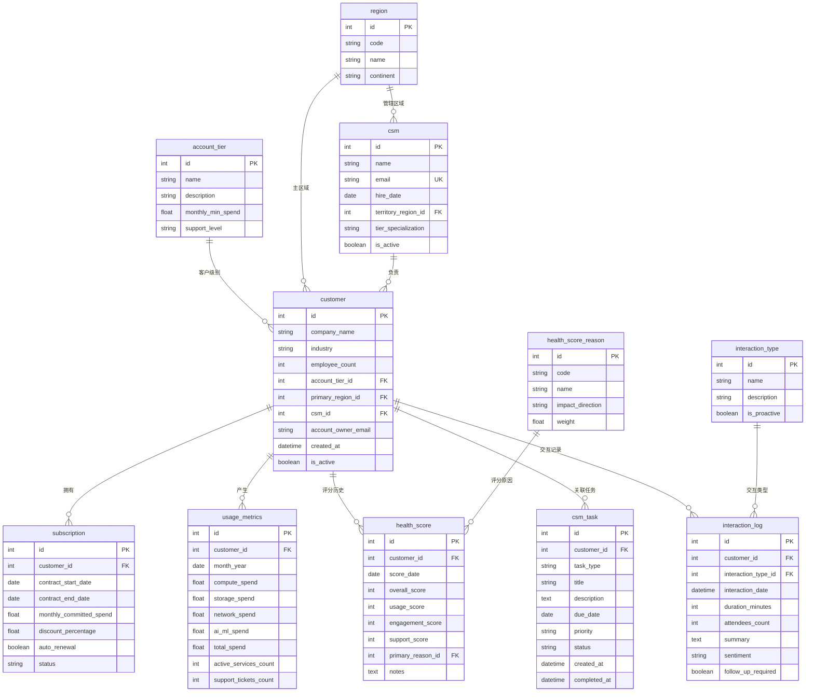

# 云服务商客户成功管理 ER 文档

> 业务背景, 行业科普, 术语表请见 `01-cloud_provider_customer_success_medium_business_context-cn.md`. 本文档只描述数据.

> **数据集:** `cloud_provider_customer_success_medium`
> **虚构公司:** NimbusScale, Inc.
> **复杂度:** Medium (11 张表, ~2,290 行)
> **参考"今天" (REFERENCE_DATE):** `2026-06-20`
> **配套查询:** `03-cloud_provider_customer_success_medium_sql_queries-cn.md`

本文档是 schema, Python 生成器, SQL 查询三者之间的契约: 有哪些表, 它们如何连接, 每个字段是什么业务含义, 哪些字段由别的字段算出, 以及哪些分布被刻意做了偏置, 偏置幅度多大. 读者应已读过 `01` 业务背景文档, 这里不再重复公司, 行业, 术语等叙事内容.

---

## 1. 数据集概览

| 指标 | 值 |
|------|------|
| 表数量 | 11 |
| 总行数 | ~2,290 (±20 种子波动) |
| 外键关系 | 10 (全部一对多) |
| 枚举 / 查找表 | 4 (`account_tier`, `health_score_reason`, `interaction_type`, `region`) |
| 员工表 | 1 (`csm`) |
| 业务表 | 6 (`customer`, `subscription`, `usage_metrics`, `health_score`, `csm_task`, `interaction_log`) |
| UNIQUE 约束 | 2 (`usage_metrics(customer_id, month_year)`, `health_score(customer_id, score_date)`) |
| 业务不变式 | 15 条 (见 [数据生成规则](#4-数据生成规则)) |
| SQLite 数据库大小 | ~320 KB |

### 各表行数

| # | 表 | 行数 | 角色 |
|---|-----|------|------|
| 01 | account_tier | 4 | 查找表 |
| 02 | health_score_reason | 8 | 查找表 |
| 03 | interaction_type | 6 | 查找表 |
| 04 | region | 10 | 查找表 |
| 05 | csm | 15 | 员工 (13 在职 + 2 离职) |
| 06 | customer | 150 | 核心 (140 活跃 + 10 churned-only, ±2 种子波动) |
| 07 | subscription | ~170 | 销售 (每客户 1-2 份) |
| 08 | usage_metrics | ~790 | 时序 (每客户至多 6 个月) |
| 09 | health_score | ~427 | 时序 (每客户 3 个月度快照) |
| 10 | csm_task | 300 | 活动 |
| 11 | interaction_log | 400 | 活动 |

---

## 2. 实体关系图



---

## 3. 表定义

### 1. account_tier

**描述:** 客户账户级别枚举表,定义不同级别客户的特征和支持等级。

| 列名 | 类型 | 约束 | 描述 |
|------|------|------|------|
| id | INTEGER | PK, AUTO_INCREMENT | 主键 |
| name | VARCHAR(50) | NOT NULL, UNIQUE | 级别名称 (Enterprise, Business, Pro, Basic) |
| description | VARCHAR(200) | | 级别描述 |
| monthly_min_spend | FLOAT | NOT NULL | 该级别最低月消费 |
| support_level | VARCHAR(50) | | 对应的支持等级 |

**示例数据:**

| id | name | description | monthly_min_spend | support_level |
|----|------|-------------|-------------------|---------------|
| 1 | Enterprise | Large enterprise customers with dedicated support | 50000.0 | Enterprise |
| 2 | Business | Growing businesses with business-level support | 10000.0 | Business |
| 3 | Pro | Professional tier for SMBs | 1000.0 | Developer |
| 4 | Basic | Basic tier for startups | 0.0 | Basic |

---

### 2. health_score_reason

**描述:** 健康度评分变化的原因类型。`weight` 字段为业务保留,目前查询未消费。

| 列名 | 类型 | 约束 | 描述 |
|------|------|------|------|
| id | INTEGER | PK, AUTO_INCREMENT | 主键 |
| code | VARCHAR(50) | NOT NULL, UNIQUE | 原因代码 |
| name | VARCHAR(100) | NOT NULL | 原因描述 |
| impact_direction | VARCHAR(20) | | 影响方向 (positive/negative/neutral) |
| weight | FLOAT | DEFAULT 1.0 | 业务侧权重 (信息字段,SQL 未使用) |

**示例数据:**

| id | code | name | impact_direction | weight |
|----|------|------|------------------|--------|
| 1 | USAGE_INCREASE | Usage increased significantly | positive | 1.5 |
| 2 | USAGE_DECREASE | Usage decreased significantly | negative | 2.0 |
| 7 | CONTRACT_RISK | Contract renewal at risk | negative | 2.5 |

---

### 3. interaction_type

**描述:** 客户交互类型枚举。

| 列名 | 类型 | 约束 | 描述 |
|------|------|------|------|
| id | INTEGER | PK, AUTO_INCREMENT | 主键 |
| name | VARCHAR(50) | NOT NULL, UNIQUE | 交互类型名称 |
| description | VARCHAR(200) | | 类型描述 |
| is_proactive | BOOLEAN | DEFAULT TRUE | 是否为主动触达 |

---

### 4. region

**描述:** 云服务区域枚举,对应 AWS 区域 (us-east-1, eu-west-1 等)。注意: `code` 代表 NimbusScale 的云数据中心区域,与公司办公室所在城市 (西雅图 / 法兰克福 / 东京 / 圣保罗) 不一一对应 — 数据中心通常多于办公室,且按客户负载分布。

| 列名 | 类型 | 约束 | 描述 |
|------|------|------|------|
| id | INTEGER | PK, AUTO_INCREMENT | 主键 |
| code | VARCHAR(20) | NOT NULL, UNIQUE | 区域代码 |
| name | VARCHAR(100) | NOT NULL | 区域全名 |
| continent | VARCHAR(50) | | 所在大洲 |

---

### 5. csm

**描述:** Customer Success Manager (CSM) 员工主表。每位 CSM 有一个 tier_specialization(Enterprise / Mid-Market / SMB),客户的 csm_id 必须来自对应专门化的**在职** CSM。

| 列名 | 类型 | 约束 | 描述 |
|------|------|------|------|
| id | INTEGER | PK, AUTO_INCREMENT | 主键 |
| name | VARCHAR(100) | NOT NULL | CSM 姓名 |
| email | VARCHAR(255) | NOT NULL, UNIQUE | CSM 公司邮箱 (格式: `firstname.lastname.<csm_id>@cloudprovider.com`) |
| hire_date | DATE | NOT NULL | 入职日期 |
| territory_region_id | INTEGER | FK → region.id | 主负责区域 |
| tier_specialization | VARCHAR(20) | NOT NULL | 专门化 (Enterprise / Mid-Market / SMB) |
| is_active | BOOLEAN | DEFAULT TRUE | 是否在职 |

**专门化与客户分配规则:**
- `Enterprise` CSM (4 人,全员在职): 仅服务 Enterprise tier 客户
- `Mid-Market` CSM (6 人,其中 5 人在职): 主要服务 Business 与部分 Pro 客户
- `SMB` CSM (5 人,其中 4 人在职): 主要服务 Pro 与 Basic 客户

**离职 / 转岗规则:**
- 15 个 CSM 中有 2 位为 inactive (Mid-Market 1 位、SMB 1 位),模拟"已离职"
- 客户分配时**只在 active CSM 中按 specialization 抽取**,等价于 CSM 离职后客户被同 specialization 的在职同事接管 (即 inactive CSM 的 `customer_count = 0`)
- Query 16 等带 `WHERE csm.is_active = 1` 的查询会输出 13 行 (= 15 总 - 2 inactive),与"在职 CSM 工作负载"业务语义一致

**示例数据 (email 格式示例,实际 name 由 faker 随机抽,id 与名字不一定固定对应):**

| id | name | email | hire_date | tier_specialization | is_active |
|----|------|-------|-----------|---------------------|-----------|
| 1 | Allen Robinson | allen.robinson.1@cloudprovider.com | 2022-03-15 | Enterprise | TRUE |
| 5 | Gabrielle Davis | gabrielle.davis.5@cloudprovider.com | 2021-08-20 | Mid-Market | TRUE |
| 10 | Lisa Hensley | lisa.hensley.10@cloudprovider.com | 2020-11-04 | Mid-Market | **FALSE** |
| 11 | Amber Perez | amber.perez.11@cloudprovider.com | 2024-01-10 | SMB | TRUE |
| 15 | Nicholas Martin | nicholas.martin.15@cloudprovider.com | 2023-05-22 | SMB | **FALSE** |

---

### 6. customer

**描述:** 客户公司核心实体。CSM 归属通过 `csm_id` FK 维护 (CSM 联系方式存放在 `csm` 表)。`is_active` 由订阅状态派生 — 任一 subscription 非 churned/expired 即视为活跃。

| 列名 | 类型 | 约束 | 描述 |
|------|------|------|------|
| id | INTEGER | PK, AUTO_INCREMENT | 主键 |
| company_name | VARCHAR(200) | NOT NULL | 公司名称 |
| industry | VARCHAR(100) | | 所属行业 |
| employee_count | INTEGER | | 员工数量 |
| account_tier_id | INTEGER | NOT NULL, FK → account_tier.id | 账户级别 |
| primary_region_id | INTEGER | NOT NULL, FK → region.id | 主要使用区域 |
| csm_id | INTEGER | NOT NULL, FK → csm.id | 负责的 CSM |
| account_owner_email | VARCHAR(255) | | 客户主联系人邮箱 |
| created_at | DATETIME | NOT NULL | 客户创建时间 |
| is_active | BOOLEAN | DEFAULT TRUE | 是否活跃 (由订阅状态派生) |

---

### 7. subscription

**描述:** 客户订阅/合同。
- `monthly_committed_spend` 按 tier 分档生成 (Enterprise 50k-500k / Business 10k-80k / Pro 1k-15k / Basic 100-3k)
- `discount_percentage` 按 tier 分档 (高 tier 更大折扣)
- `contract_start_date` 不早于 `customer.created_at`
- `contract_end_date` 通过精确月份运算 (`add_months`) 得到

| 列名 | 类型 | 约束 | 描述 |
|------|------|------|------|
| id | INTEGER | PK, AUTO_INCREMENT | 主键 |
| customer_id | INTEGER | NOT NULL, FK → customer.id | 所属客户 |
| contract_start_date | DATE | NOT NULL | 合同开始日期 (≥ customer.created_at) |
| contract_end_date | DATE | NOT NULL | 合同结束日期 |
| monthly_committed_spend | FLOAT | NOT NULL | 月度承诺消费 (按 tier 区间) |
| discount_percentage | FLOAT | DEFAULT 0.0 | 折扣百分比 (按 tier 区间) |
| auto_renewal | BOOLEAN | DEFAULT TRUE | 是否自动续约 |
| status | VARCHAR(20) | DEFAULT 'active' | active/pending_renewal/churned/expired |

---

### 8. usage_metrics

**描述:** 客户月度使用量指标。
- UNIQUE 约束 `(customer_id, month_year)`
- `base_compute / base_storage / base_network` 按 tier 缩放
- `active_services_count` 按 tier 区间分配 (Enterprise 10-30、Business 5-18、Pro 3-10、Basic 1-6)
- `support_tickets_count` 由客户健康度基线反向驱动:`tickets ~ Gauss(μ, σ)` 其中 μ = 1 + 7·(100-baseline)/55
- `month_year` 不早于 `customer.created_at` 所在月份

| 列名 | 类型 | 约束 | 描述 |
|------|------|------|------|
| id | INTEGER | PK, AUTO_INCREMENT | 主键 |
| customer_id | INTEGER | NOT NULL, FK → customer.id | 所属客户 |
| month_year | DATE | NOT NULL | 月份 (每月第一天) |
| compute_spend | FLOAT | DEFAULT 0.0 | 计算资源消费 |
| storage_spend | FLOAT | DEFAULT 0.0 | 存储消费 |
| network_spend | FLOAT | DEFAULT 0.0 | 网络消费 |
| ai_ml_spend | FLOAT | DEFAULT 0.0 | AI/ML 服务消费 |
| total_spend | FLOAT | NOT NULL | 总消费 = compute + storage + network + ai_ml |
| active_services_count | INTEGER | DEFAULT 1 | 使用的服务数量 |
| support_tickets_count | INTEGER | DEFAULT 0 | 支持工单数量 (与健康度反向相关) |

**唯一约束:** `(customer_id, month_year)`

---

### 9. health_score

**描述:** 客户健康度评分历史。
- 三个子分 (`usage_score / engagement_score / support_score`) 独立采样,统一 NOT NULL
- `overall_score = round(0.4·usage + 0.3·engagement + 0.3·support)` — 子分驱动综合,不是反过来
- `support_score` 显式由 customer 近期平均工单数反向驱动
- `score_date` 不早于 `customer.created_at`
- UNIQUE 约束 `(customer_id, score_date)`

| 列名 | 类型 | 约束 | 描述 |
|------|------|------|------|
| id | INTEGER | PK, AUTO_INCREMENT | 主键 |
| customer_id | INTEGER | NOT NULL, FK → customer.id | 所属客户 |
| score_date | DATE | NOT NULL | 评分日期 |
| overall_score | INTEGER | NOT NULL | 综合健康度 (0-100, 子分加权派生) |
| usage_score | INTEGER | NOT NULL | 用量趋势得分 |
| engagement_score | INTEGER | NOT NULL | 互动参与得分 |
| support_score | INTEGER | NOT NULL | 支持体验得分 (反向受工单数驱动) |
| primary_reason_id | INTEGER | NOT NULL, FK → health_score_reason.id | 主要评分原因 |
| notes | TEXT | NULLABLE | 备注说明 |

**唯一约束:** `(customer_id, score_date)`

---

### 10. csm_task

**描述:** CSM 任务。

- `created_at` 不早于 `customer.created_at`
- `task_type` 按客户的订阅状态 / `health_baseline` 加权选择,与业务直觉对齐 (详见下文 "task_type ↔ 客户状态耦合")

| 列名 | 类型 | 约束 | 描述 |
|------|------|------|------|
| id | INTEGER | PK, AUTO_INCREMENT | 主键 |
| customer_id | INTEGER | NOT NULL, FK → customer.id | 关联客户 |
| task_type | VARCHAR(50) | NOT NULL | 任务类型 (分布与客户状态相关) |
| title | VARCHAR(200) | NOT NULL | 任务标题 |
| description | TEXT | | 任务描述 |
| due_date | DATE | NOT NULL | 截止日期 |
| priority | VARCHAR(20) | DEFAULT 'medium' | low/medium/high/critical |
| status | VARCHAR(20) | DEFAULT 'open' | open/in_progress/completed/cancelled |
| created_at | DATETIME | NOT NULL | 创建时间 |
| completed_at | DATETIME | NULLABLE | 完成时间 |

**任务类型枚举:**
- `renewal_prep`: 续约准备
- `expansion_opportunity`: 扩容机会
- `risk_mitigation`: 风险干预
- `qbr_scheduling`: QBR 会议安排
- `onboarding`: 新服务启用
- `training`: 培训安排

**task_type ↔ 客户状态耦合规则:**

| 客户状态 (按订阅 + health_baseline) | 主导 task_type 权重 | 业务直觉 |
|--------------------------------------|---------------------|----------|
| **churned / expired-only** (无 active 也无 pending_renewal 订阅) | **不分配任务** | CSM 已不再服务此客户 |
| **pending_renewal** (有 pending_renewal 订阅) | `renewal_prep` 45% / `qbr_scheduling` 20% / 其他 35% | 续约期需准备方案 |
| **active + baseline ≥ 75** (健康客户) | `expansion_opportunity` 35% / `training` 20% / `qbr_scheduling` 20% / 其他 25% | 健康度高 → 扩容潜力 |
| **active + baseline < 60** (低健康客户) | `risk_mitigation` 45% / `qbr_scheduling` 20% / `training` 15% / 其他 20% | 低健康度 → 风险干预 |
| **active + baseline 60-74** (中等健康客户) | `qbr_scheduling` 25% / `training` 20% / `expansion_opportunity` 20% / 其他 35% | 较均衡 |

> 这一耦合使 churned-only 客户的任务数恒为 0,pending_renewal 客户中 renewal_prep 占比远高于均匀分布,高 baseline 客户的 expansion_opportunity 明显多于 risk_mitigation — Query 12 (流失风险)、Query 15 (扩容机会) 的业务故事在数据上更具说服力。

---

### 11. interaction_log

**描述:** 客户交互记录。`interaction_date` 不早于 `customer.created_at`。

| 列名 | 类型 | 约束 | 描述 |
|------|------|------|------|
| id | INTEGER | PK, AUTO_INCREMENT | 主键 |
| customer_id | INTEGER | NOT NULL, FK → customer.id | 关联客户 |
| interaction_type_id | INTEGER | NOT NULL, FK → interaction_type.id | 交互类型 |
| interaction_date | DATETIME | NOT NULL | 交互时间 (≥ customer.created_at) |
| duration_minutes | INTEGER | NULLABLE | 时长 (分钟,Email 类型为 NULL) |
| attendees_count | INTEGER | DEFAULT 1 | 参与人数 |
| summary | TEXT | NULLABLE | 交互摘要 |
| sentiment | VARCHAR(20) | NULLABLE | positive/neutral/negative |
| follow_up_required | BOOLEAN | DEFAULT FALSE | 是否需要后续跟进 |

---

## 4. 数据生成规则

### 业务逻辑约束

1. **账户级别分布:** Enterprise 15%, Business 30%, Pro 35%, Basic 20%
2. **员工数量关联:** Enterprise 5,000-100,000;Business 500-10,000;Pro 50-1,000;Basic 5-100
3. **CSM 专门化分配:**
   - Enterprise CSM → Enterprise 客户
   - Mid-Market CSM → Business 客户 + 部分 Pro
   - SMB CSM → Pro + Basic 客户
4. **monthly_committed_spend 按 tier 分档:**
   - Enterprise: $50,000 - $500,000
   - Business: $10,000 - $80,000
   - Pro: $1,000 - $15,000
   - Basic: $100 - $3,000
5. **discount_percentage 按 tier 分档:**
   - Enterprise: 10-30%; Business: 5-20%; Pro: 0-10%; Basic: 0-5%
6. **合同时长:** 12/24/36 个月随机,使用精确月份运算
7. **订阅状态逻辑:** 合同结束日决定状态 (expired/pending_renewal/active)
8. **健康度评分:**
   - 每个客户在生成时分配一个隐含的 `health_baseline ∈ [45, 95]` 字段 (**不持久化**,仅在生成器内部使用)。该字段是客户健康倾向的"隐变量",同时驱动工单数和健康度子分
   - 子分 (usage / engagement / support) 由 baseline + 噪声独立采样
   - support_score 由客户 **usage_metrics 实际覆盖月 (至多近 6 个月)** 的平均工单数反向驱动: `95 - 6·avg_tickets + N(0,6)`
   - `overall = round(0.4·usage + 0.3·engagement + 0.3·support)` — 子分驱动综合分
9. **support_tickets_count 反向驱动健康度:** 月度工单数 ~ Gauss(μ, σ),μ = 1 + 7·(100-baseline)/55,因此低 `health_baseline` 客户工单更多 — 支撑 Query 14 所呈现的强负相关
10. **用量趋势:** 40% 增长趋势, 35% 稳定, 25% 下降趋势 (按月递增/递减因子)
11. **AI/ML 使用:** 60% 客户基础消费包含 AI/ML 服务
12. **时序一致性约束:**
    - subscription.contract_start_date ≥ customer.created_at
    - usage_metrics.month_year ≥ customer.created_at 所在月份
    - health_score.score_date ≥ customer.created_at
    - csm_task.created_at ≥ customer.created_at
    - interaction_log.interaction_date ≥ customer.created_at
13. **customer.is_active 派生:** 若客户全部 subscription 处于 churned/expired 状态,则 is_active = FALSE
14. **CSM 离职与客户转岗:** 15 个 CSM 中 id=10 (Mid-Market) 与 id=15 (SMB) 为 `is_active=FALSE`,模拟离职。客户分配阶段只在 active CSM 池中按 specialization 抽取,因此 inactive CSM 的 `customer_count = 0`,等价于"离职 CSM 的客户由同 specialization 的在职同事接管"。Query 16 等带 `WHERE csm.is_active = 1` 的查询输出 13 行 (= 15 - 2 inactive)。
15. **csm_task.task_type ↔ 客户状态轻量耦合:** 任务按客户当前订阅状态 + `health_baseline` 加权选取 task_type,具体规则见 §10 csm_task 表的耦合规则表。核心效果:
    - **churned / expired-only 客户**: 不分配任何任务 (CSM 已不再服务)
    - **pending_renewal 客户**: `renewal_prep` 占比 ~37% (远高于均匀分布的 17%)
    - **active + baseline ≥75**: `expansion_opportunity` 显著多于 `risk_mitigation`
    - **active + baseline <60**: `risk_mitigation` 占主导

### Faker 生成策略

| 字段模式 | Faker 方法 | 备注 |
|----------|------------|------|
| company_name | `fake.company()` | 英文公司名 |
| csm.name | `fake.name()` | CSM 姓名 |
| csm.email | `firstname.lastname.<csm_id>@cloudprovider.com` | 保证 UNIQUE |
| account_owner_email | `fake.company_email()` | 公司邮箱格式 |
| customer.created_at | `fake.date_time_between('-3y', '-1m')` | 时序基线 |
| industry | `random.choice(industries)` | 15 个行业 |

---

## 5. 文件清单

| 序号 | 文件名 | 表名 | 行数 (典型) | 依赖 |
|------|--------|------|------------|------|
| 01 | 01_account_tier.tsv | account_tier | 4 | 无 |
| 02 | 02_health_score_reason.tsv | health_score_reason | 8 | 无 |
| 03 | 03_interaction_type.tsv | interaction_type | 6 | 无 |
| 04 | 04_region.tsv | region | 10 | 无 |
| 05 | 05_csm.tsv | csm | 15 | region |
| 06 | 06_customer.tsv | customer | 150 | account_tier, region, csm |
| 07 | 07_subscription.tsv | subscription | ~175 | customer |
| 08 | 08_usage_metrics.tsv | usage_metrics | ~800 | customer |
| 09 | 09_health_score.tsv | health_score | ~430 | customer, health_score_reason |
| 10 | 10_csm_task.tsv | csm_task | 300 | customer |
| 11 | 11_interaction_log.tsv | interaction_log | 400 | customer, interaction_type |

**总计:** ~2,290 行 (±20 种子波动)

> usage_metrics / health_score 行数略低于 6 × 150 / 3 × 150 是预期: 部分客户的 created_at 在最近 1-5 个月内,早于其创建的月份会被时序约束跳过 (usage_metrics ~ 790-800 vs 理论 900;health_score ~ 425-435 vs 理论 450;随种子可能 ±10)。

> **本月新建客户的查询行为说明:** 本月内新建的客户 (created_at 在 -1m 至 today 之间) 因时序约束尚未生成 usage_metrics 行,因此在依赖 INNER JOIN usage_metrics / health_score 的聚合查询 (Q5, Q13, Q14, Q15) 中会被静默剔除。这是符合业务现实的行为 (新客户暂无可分析的历史数据)。Q1 / Q3 / Q17 等仅依赖 customer 或 subscription 的查询不受影响。

---

## 6. 数据库 Schema (SQLite DDL)

```sql
-- 枚举/字典表
CREATE TABLE account_tier (
    id INTEGER PRIMARY KEY AUTOINCREMENT,
    name VARCHAR(50) NOT NULL UNIQUE,
    description VARCHAR(200),
    monthly_min_spend FLOAT NOT NULL,
    support_level VARCHAR(50)
);

CREATE TABLE health_score_reason (
    id INTEGER PRIMARY KEY AUTOINCREMENT,
    code VARCHAR(50) NOT NULL UNIQUE,
    name VARCHAR(100) NOT NULL,
    impact_direction VARCHAR(20),
    weight FLOAT DEFAULT 1.0
);

CREATE TABLE interaction_type (
    id INTEGER PRIMARY KEY AUTOINCREMENT,
    name VARCHAR(50) NOT NULL UNIQUE,
    description VARCHAR(200),
    is_proactive BOOLEAN DEFAULT TRUE
);

CREATE TABLE region (
    id INTEGER PRIMARY KEY AUTOINCREMENT,
    code VARCHAR(20) NOT NULL UNIQUE,
    name VARCHAR(100) NOT NULL,
    continent VARCHAR(50)
);

-- CSM 员工表
CREATE TABLE csm (
    id INTEGER PRIMARY KEY AUTOINCREMENT,
    name VARCHAR(100) NOT NULL,
    email VARCHAR(255) NOT NULL UNIQUE,
    hire_date DATE NOT NULL,
    territory_region_id INTEGER NOT NULL REFERENCES region(id),
    tier_specialization VARCHAR(20) NOT NULL,
    is_active BOOLEAN DEFAULT TRUE
);

-- 核心业务表
CREATE TABLE customer (
    id INTEGER PRIMARY KEY AUTOINCREMENT,
    company_name VARCHAR(200) NOT NULL,
    industry VARCHAR(100),
    employee_count INTEGER,
    account_tier_id INTEGER NOT NULL REFERENCES account_tier(id),
    primary_region_id INTEGER NOT NULL REFERENCES region(id),
    csm_id INTEGER NOT NULL REFERENCES csm(id),
    account_owner_email VARCHAR(255),
    created_at DATETIME NOT NULL,
    is_active BOOLEAN DEFAULT TRUE
);

CREATE TABLE subscription (
    id INTEGER PRIMARY KEY AUTOINCREMENT,
    customer_id INTEGER NOT NULL REFERENCES customer(id),
    contract_start_date DATE NOT NULL,
    contract_end_date DATE NOT NULL,
    monthly_committed_spend FLOAT NOT NULL,
    discount_percentage FLOAT DEFAULT 0.0,
    auto_renewal BOOLEAN DEFAULT TRUE,
    status VARCHAR(20) DEFAULT 'active'
);

CREATE TABLE usage_metrics (
    id INTEGER PRIMARY KEY AUTOINCREMENT,
    customer_id INTEGER NOT NULL REFERENCES customer(id),
    month_year DATE NOT NULL,
    compute_spend FLOAT DEFAULT 0.0,
    storage_spend FLOAT DEFAULT 0.0,
    network_spend FLOAT DEFAULT 0.0,
    ai_ml_spend FLOAT DEFAULT 0.0,
    total_spend FLOAT NOT NULL,
    active_services_count INTEGER DEFAULT 1,
    support_tickets_count INTEGER DEFAULT 0,
    UNIQUE (customer_id, month_year)
);

CREATE TABLE health_score (
    id INTEGER PRIMARY KEY AUTOINCREMENT,
    customer_id INTEGER NOT NULL REFERENCES customer(id),
    score_date DATE NOT NULL,
    overall_score INTEGER NOT NULL,
    usage_score INTEGER NOT NULL,
    engagement_score INTEGER NOT NULL,
    support_score INTEGER NOT NULL,
    primary_reason_id INTEGER NOT NULL REFERENCES health_score_reason(id),
    notes TEXT,
    UNIQUE (customer_id, score_date)
);

CREATE TABLE csm_task (
    id INTEGER PRIMARY KEY AUTOINCREMENT,
    customer_id INTEGER NOT NULL REFERENCES customer(id),
    task_type VARCHAR(50) NOT NULL,
    title VARCHAR(200) NOT NULL,
    description TEXT,
    due_date DATE NOT NULL,
    priority VARCHAR(20) DEFAULT 'medium',
    status VARCHAR(20) DEFAULT 'open',
    created_at DATETIME NOT NULL,
    completed_at DATETIME
);

CREATE TABLE interaction_log (
    id INTEGER PRIMARY KEY AUTOINCREMENT,
    customer_id INTEGER NOT NULL REFERENCES customer(id),
    interaction_type_id INTEGER NOT NULL REFERENCES interaction_type(id),
    interaction_date DATETIME NOT NULL,
    duration_minutes INTEGER,
    attendees_count INTEGER DEFAULT 1,
    summary TEXT,
    sentiment VARCHAR(20),
    follow_up_required BOOLEAN DEFAULT FALSE
);
```
