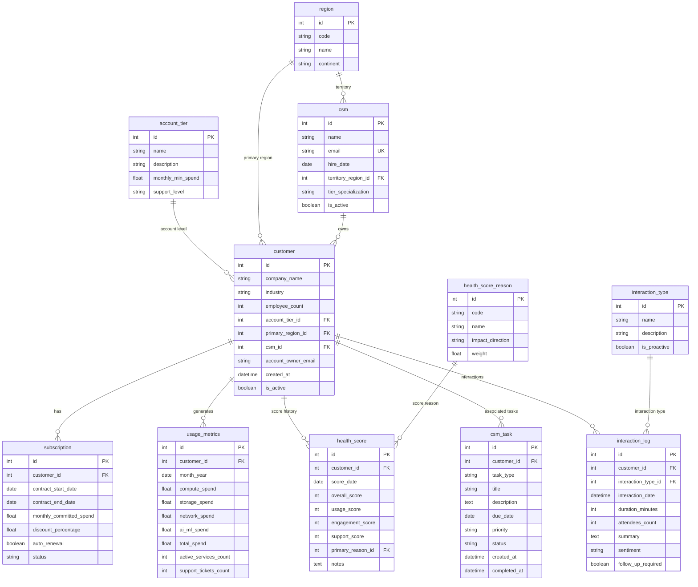

# Cloud Provider Customer Success Management ER Document

> For business context, industry primer, and glossary, see `01-cloud_provider_customer_success_medium_business_context.md`. This document only describes the data.

> **Dataset:** `cloud_provider_customer_success_medium`
> **Fictional company:** NimbusScale, Inc.
> **Complexity:** Medium (11 tables, ~2,290 rows)
> **Reference "today" (REFERENCE_DATE):** `2026-06-20`
> **Companion queries:** `03-cloud_provider_customer_success_medium_sql_queries.md`

This document is the contract between the schema, the Python generator, and the SQL queries: which tables exist, how they connect, what every field means in business terms, which fields are derived from others, and which distributions have been deliberately biased and by how much. The reader is assumed to have already gone through the `01` business context document, so company, industry, and terminology narrative is not repeated here.

---

## 1. Dataset Overview

| Metric | Value |
|--------|-------|
| Number of tables | 11 |
| Total row count | ~2,290 (±20 seed jitter) |
| Foreign-key relationships | 10 (all one-to-many) |
| Enum / lookup tables | 4 (`account_tier`, `health_score_reason`, `interaction_type`, `region`) |
| Employee tables | 1 (`csm`) |
| Business tables | 6 (`customer`, `subscription`, `usage_metrics`, `health_score`, `csm_task`, `interaction_log`) |
| UNIQUE constraints | 2 (`usage_metrics(customer_id, month_year)`, `health_score(customer_id, score_date)`) |
| Business invariants | 15 (see [Data generation rules](#4-data-generation-rules)) |
| SQLite database size | ~320 KB |

### Row counts per table

| # | Table | Row count | Role |
|---|-------|-----------|------|
| 01 | account_tier | 4 | Lookup table |
| 02 | health_score_reason | 8 | Lookup table |
| 03 | interaction_type | 6 | Lookup table |
| 04 | region | 10 | Lookup table |
| 05 | csm | 15 | Employees (13 active + 2 inactive) |
| 06 | customer | 150 | Core (140 active + 10 churned-only, ±2 seed jitter) |
| 07 | subscription | ~170 | Sales (1-2 per customer) |
| 08 | usage_metrics | ~790 | Time series (up to 6 months per customer) |
| 09 | health_score | ~427 | Time series (3 monthly snapshots per customer) |
| 10 | csm_task | 300 | Activity |
| 11 | interaction_log | 400 | Activity |

---

## 2. Entity Relationship Diagram



---

## 3. Table Definitions

### 1. account_tier

**Description:** Enum table for customer account tier. Defines the characteristics and support level for each tier.

| Column | Type | Constraints | Description |
|--------|------|-------------|-------------|
| id | INTEGER | PK, AUTO_INCREMENT | Primary key |
| name | VARCHAR(50) | NOT NULL, UNIQUE | Tier name (Enterprise, Business, Pro, Basic) |
| description | VARCHAR(200) | | Tier description |
| monthly_min_spend | FLOAT | NOT NULL | Minimum monthly spend for this tier |
| support_level | VARCHAR(50) | | Corresponding support level |

**Example data:**

| id | name | description | monthly_min_spend | support_level |
|----|------|-------------|-------------------|---------------|
| 1 | Enterprise | Large enterprise customers with dedicated support | 50000.0 | Enterprise |
| 2 | Business | Growing businesses with business-level support | 10000.0 | Business |
| 3 | Pro | Professional tier for SMBs | 1000.0 | Developer |
| 4 | Basic | Basic tier for startups | 0.0 | Basic |

---

### 2. health_score_reason

**Description:** Reason types for health-score changes. The `weight` field is reserved for the business and is not consumed by any current query.

| Column | Type | Constraints | Description |
|--------|------|-------------|-------------|
| id | INTEGER | PK, AUTO_INCREMENT | Primary key |
| code | VARCHAR(50) | NOT NULL, UNIQUE | Reason code |
| name | VARCHAR(100) | NOT NULL | Reason description |
| impact_direction | VARCHAR(20) | | Impact direction (positive/negative/neutral) |
| weight | FLOAT | DEFAULT 1.0 | Business-side weight (informational, not used in SQL) |

**Example data:**

| id | code | name | impact_direction | weight |
|----|------|------|------------------|--------|
| 1 | USAGE_INCREASE | Usage increased significantly | positive | 1.5 |
| 2 | USAGE_DECREASE | Usage decreased significantly | negative | 2.0 |
| 7 | CONTRACT_RISK | Contract renewal at risk | negative | 2.5 |

---

### 3. interaction_type

**Description:** Enum table for customer interaction types.

| Column | Type | Constraints | Description |
|--------|------|-------------|-------------|
| id | INTEGER | PK, AUTO_INCREMENT | Primary key |
| name | VARCHAR(50) | NOT NULL, UNIQUE | Interaction type name |
| description | VARCHAR(200) | | Type description |
| is_proactive | BOOLEAN | DEFAULT TRUE | Whether the interaction is proactive outreach |

---

### 4. region

**Description:** Enum table for cloud-service regions, mapped to AWS-style region codes (us-east-1, eu-west-1, etc.). Note: `code` represents NimbusScale's cloud data-center regions, which do not map one-to-one with the company's office cities (Seattle / Frankfurt / Tokyo / Sao Paulo). Data centers usually outnumber offices and are placed based on customer workload distribution.

| Column | Type | Constraints | Description |
|--------|------|-------------|-------------|
| id | INTEGER | PK, AUTO_INCREMENT | Primary key |
| code | VARCHAR(20) | NOT NULL, UNIQUE | Region code |
| name | VARCHAR(100) | NOT NULL | Region full name |
| continent | VARCHAR(50) | | Continent |

---

### 5. csm

**Description:** Master table for Customer Success Managers (CSMs). Every CSM has a tier_specialization (Enterprise / Mid-Market / SMB), and a customer's csm_id must point to an **active** CSM with the matching specialization.

| Column | Type | Constraints | Description |
|--------|------|-------------|-------------|
| id | INTEGER | PK, AUTO_INCREMENT | Primary key |
| name | VARCHAR(100) | NOT NULL | CSM name |
| email | VARCHAR(255) | NOT NULL, UNIQUE | CSM corporate email (format: `firstname.lastname.<csm_id>@cloudprovider.com`) |
| hire_date | DATE | NOT NULL | Hire date |
| territory_region_id | INTEGER | FK -> region.id | Primary region of responsibility |
| tier_specialization | VARCHAR(20) | NOT NULL | Specialization (Enterprise / Mid-Market / SMB) |
| is_active | BOOLEAN | DEFAULT TRUE | Whether the CSM is currently employed |

**Specialization and customer-assignment rules:**
- `Enterprise` CSMs (4 people, all active): serve Enterprise tier customers only
- `Mid-Market` CSMs (6 people, 5 active): serve Business and some Pro customers
- `SMB` CSMs (5 people, 4 active): serve Pro and Basic customers

**Departure / transition rules:**
- Of the 15 CSMs, 2 are inactive (1 Mid-Market and 1 SMB), simulating "departed" employees
- Customer assignment **only draws from active CSMs by specialization**, equivalent to: when a CSM departs, their customers are taken over by active peers in the same specialization (so inactive CSMs end up with `customer_count = 0`)
- Queries like Query 16 that include `WHERE csm.is_active = 1` return 13 rows (= 15 total - 2 inactive), consistent with the "active-CSM workload" business semantics

**Example data (email format example; actual `name` is randomly drawn by faker, id and name are not fixed):**

| id | name | email | hire_date | tier_specialization | is_active |
|----|------|-------|-----------|---------------------|-----------|
| 1 | Allen Robinson | allen.robinson.1@cloudprovider.com | 2022-03-15 | Enterprise | TRUE |
| 5 | Gabrielle Davis | gabrielle.davis.5@cloudprovider.com | 2021-08-20 | Mid-Market | TRUE |
| 10 | Lisa Hensley | lisa.hensley.10@cloudprovider.com | 2020-11-04 | Mid-Market | **FALSE** |
| 11 | Amber Perez | amber.perez.11@cloudprovider.com | 2024-01-10 | SMB | TRUE |
| 15 | Nicholas Martin | nicholas.martin.15@cloudprovider.com | 2023-05-22 | SMB | **FALSE** |

---

### 6. customer

**Description:** Core entity for the customer company. CSM ownership is maintained via the `csm_id` FK (CSM contact info lives in the `csm` table). `is_active` is derived from subscription status: if any subscription is not churned/expired, the customer is considered active.

| Column | Type | Constraints | Description |
|--------|------|-------------|-------------|
| id | INTEGER | PK, AUTO_INCREMENT | Primary key |
| company_name | VARCHAR(200) | NOT NULL | Company name |
| industry | VARCHAR(100) | | Industry |
| employee_count | INTEGER | | Employee count |
| account_tier_id | INTEGER | NOT NULL, FK -> account_tier.id | Account tier |
| primary_region_id | INTEGER | NOT NULL, FK -> region.id | Primary region of usage |
| csm_id | INTEGER | NOT NULL, FK -> csm.id | Owning CSM |
| account_owner_email | VARCHAR(255) | | Customer-side primary contact email |
| created_at | DATETIME | NOT NULL | Customer creation timestamp |
| is_active | BOOLEAN | DEFAULT TRUE | Active flag (derived from subscription status) |

---

### 7. subscription

**Description:** Customer subscription / contract.
- `monthly_committed_spend` is bucketed by tier (Enterprise 50k-500k / Business 10k-80k / Pro 1k-15k / Basic 100-3k)
- `discount_percentage` is bucketed by tier (higher tiers get bigger discounts)
- `contract_start_date` is no earlier than `customer.created_at`
- `contract_end_date` is computed with precise month arithmetic (`add_months`)

| Column | Type | Constraints | Description |
|--------|------|-------------|-------------|
| id | INTEGER | PK, AUTO_INCREMENT | Primary key |
| customer_id | INTEGER | NOT NULL, FK -> customer.id | Owning customer |
| contract_start_date | DATE | NOT NULL | Contract start date (>= customer.created_at) |
| contract_end_date | DATE | NOT NULL | Contract end date |
| monthly_committed_spend | FLOAT | NOT NULL | Monthly committed spend (range depends on tier) |
| discount_percentage | FLOAT | DEFAULT 0.0 | Discount percentage (range depends on tier) |
| auto_renewal | BOOLEAN | DEFAULT TRUE | Whether auto-renewal is on |
| status | VARCHAR(20) | DEFAULT 'active' | active/pending_renewal/churned/expired |

---

### 8. usage_metrics

**Description:** Monthly usage metrics for each customer.
- UNIQUE constraint on `(customer_id, month_year)`
- `base_compute / base_storage / base_network` scale by tier
- `active_services_count` is bucketed by tier (Enterprise 10-30, Business 5-18, Pro 3-10, Basic 1-6)
- `support_tickets_count` is inversely driven by the customer's health baseline: `tickets ~ Gauss(mu, sigma)` where mu = 1 + 7 * (100 - baseline) / 55
- `month_year` is no earlier than the month containing `customer.created_at`

| Column | Type | Constraints | Description |
|--------|------|-------------|-------------|
| id | INTEGER | PK, AUTO_INCREMENT | Primary key |
| customer_id | INTEGER | NOT NULL, FK -> customer.id | Owning customer |
| month_year | DATE | NOT NULL | Month (first day of the month) |
| compute_spend | FLOAT | DEFAULT 0.0 | Compute spend |
| storage_spend | FLOAT | DEFAULT 0.0 | Storage spend |
| network_spend | FLOAT | DEFAULT 0.0 | Network spend |
| ai_ml_spend | FLOAT | DEFAULT 0.0 | AI/ML service spend |
| total_spend | FLOAT | NOT NULL | Total = compute + storage + network + ai_ml |
| active_services_count | INTEGER | DEFAULT 1 | Number of services in use |
| support_tickets_count | INTEGER | DEFAULT 0 | Support ticket count (inversely correlated with health) |

**Unique constraint:** `(customer_id, month_year)`

---

### 9. health_score

**Description:** History of customer health scores.
- The three sub-scores (`usage_score / engagement_score / support_score`) are sampled independently and are all NOT NULL
- `overall_score = round(0.4 * usage + 0.3 * engagement + 0.3 * support)` -- sub-scores drive the composite, not the other way around
- `support_score` is explicitly driven (inversely) by the customer's recent average ticket count
- `score_date` is no earlier than `customer.created_at`
- UNIQUE constraint on `(customer_id, score_date)`

| Column | Type | Constraints | Description |
|--------|------|-------------|-------------|
| id | INTEGER | PK, AUTO_INCREMENT | Primary key |
| customer_id | INTEGER | NOT NULL, FK -> customer.id | Owning customer |
| score_date | DATE | NOT NULL | Score date |
| overall_score | INTEGER | NOT NULL | Composite health (0-100, derived from weighted sub-scores) |
| usage_score | INTEGER | NOT NULL | Usage trend sub-score |
| engagement_score | INTEGER | NOT NULL | Engagement sub-score |
| support_score | INTEGER | NOT NULL | Support experience sub-score (inversely driven by tickets) |
| primary_reason_id | INTEGER | NOT NULL, FK -> health_score_reason.id | Primary reason for the score |
| notes | TEXT | NULLABLE | Notes |

**Unique constraint:** `(customer_id, score_date)`

---

### 10. csm_task

**Description:** CSM tasks.

- `created_at` is no earlier than `customer.created_at`
- `task_type` is weighted by the customer's subscription status and `health_baseline`, in line with business intuition (see "task_type vs. customer state coupling" below)

| Column | Type | Constraints | Description |
|--------|------|-------------|-------------|
| id | INTEGER | PK, AUTO_INCREMENT | Primary key |
| customer_id | INTEGER | NOT NULL, FK -> customer.id | Associated customer |
| task_type | VARCHAR(50) | NOT NULL | Task type (distribution depends on customer state) |
| title | VARCHAR(200) | NOT NULL | Task title |
| description | TEXT | | Task description |
| due_date | DATE | NOT NULL | Due date |
| priority | VARCHAR(20) | DEFAULT 'medium' | low/medium/high/critical |
| status | VARCHAR(20) | DEFAULT 'open' | open/in_progress/completed/cancelled |
| created_at | DATETIME | NOT NULL | Creation timestamp |
| completed_at | DATETIME | NULLABLE | Completion timestamp |

**Task type enum:**
- `renewal_prep`: Renewal preparation
- `expansion_opportunity`: Expansion opportunity
- `risk_mitigation`: Risk intervention
- `qbr_scheduling`: QBR meeting scheduling
- `onboarding`: Onboarding a new service
- `training`: Training arrangement

**task_type vs. customer-state coupling rules:**

| Customer state (by subscription + health_baseline) | Dominant task_type weights | Business intuition |
|-----------------------------------------------------|----------------------------|---------------------|
| **churned / expired-only** (no active or pending_renewal subscriptions) | **No tasks assigned** | CSM no longer serves this customer |
| **pending_renewal** (has a pending_renewal subscription) | `renewal_prep` 45% / `qbr_scheduling` 20% / other 35% | Renewal cycle needs proposals |
| **active + baseline >= 75** (healthy customer) | `expansion_opportunity` 35% / `training` 20% / `qbr_scheduling` 20% / other 25% | High health -> expansion potential |
| **active + baseline < 60** (low-health customer) | `risk_mitigation` 45% / `qbr_scheduling` 20% / `training` 15% / other 20% | Low health -> risk intervention |
| **active + baseline 60-74** (medium-health customer) | `qbr_scheduling` 25% / `training` 20% / `expansion_opportunity` 20% / other 35% | Balanced mix |

> This coupling ensures churned-only customers always have zero tasks, makes `renewal_prep` heavily over-represented for pending_renewal customers vs. a uniform distribution, and makes `expansion_opportunity` clearly more common than `risk_mitigation` for high-baseline customers. This makes the business stories in Query 12 (churn risk) and Query 15 (expansion opportunities) more convincing in the data.

---

### 11. interaction_log

**Description:** Customer interaction records. `interaction_date` is no earlier than `customer.created_at`.

| Column | Type | Constraints | Description |
|--------|------|-------------|-------------|
| id | INTEGER | PK, AUTO_INCREMENT | Primary key |
| customer_id | INTEGER | NOT NULL, FK -> customer.id | Associated customer |
| interaction_type_id | INTEGER | NOT NULL, FK -> interaction_type.id | Interaction type |
| interaction_date | DATETIME | NOT NULL | Interaction timestamp (>= customer.created_at) |
| duration_minutes | INTEGER | NULLABLE | Duration in minutes (NULL for Email type) |
| attendees_count | INTEGER | DEFAULT 1 | Number of attendees |
| summary | TEXT | NULLABLE | Interaction summary |
| sentiment | VARCHAR(20) | NULLABLE | positive/neutral/negative |
| follow_up_required | BOOLEAN | DEFAULT FALSE | Whether follow-up is required |

---

## 4. Data Generation Rules

### Business-logic constraints

1. **Account tier distribution:** Enterprise 15%, Business 30%, Pro 35%, Basic 20%
2. **Employee count by tier:** Enterprise 5,000-100,000; Business 500-10,000; Pro 50-1,000; Basic 5-100
3. **CSM specialization mapping:**
   - Enterprise CSM -> Enterprise customers
   - Mid-Market CSM -> Business customers + some Pro
   - SMB CSM -> Pro + Basic customers
4. **monthly_committed_spend ranges by tier:**
   - Enterprise: $50,000 - $500,000
   - Business: $10,000 - $80,000
   - Pro: $1,000 - $15,000
   - Basic: $100 - $3,000
5. **discount_percentage ranges by tier:**
   - Enterprise: 10-30%; Business: 5-20%; Pro: 0-10%; Basic: 0-5%
6. **Contract length:** Randomly 12/24/36 months, using precise month arithmetic
7. **Subscription status logic:** Status (expired/pending_renewal/active) is determined by contract end date
8. **Health-score scoring:**
   - Each customer is assigned an implicit `health_baseline ∈ [45, 95]` at generation time (**not persisted**, used only inside the generator). This is a latent variable for the customer's health tendency and drives both ticket count and health sub-scores.
   - Sub-scores (usage / engagement / support) are sampled independently from baseline + noise
   - support_score is inversely driven by the average ticket count over the customer's **actual usage_metrics coverage months (up to the last 6)**: `95 - 6 * avg_tickets + N(0, 6)`
   - `overall = round(0.4 * usage + 0.3 * engagement + 0.3 * support)` -- sub-scores drive the composite
9. **support_tickets_count inversely drives health:** Monthly ticket count ~ Gauss(mu, sigma), mu = 1 + 7 * (100 - baseline) / 55, so customers with a low `health_baseline` get more tickets, which gives Query 14 its strong negative correlation
10. **Usage trend:** 40% growing, 35% stable, 25% declining (monthly increasing/decreasing factors)
11. **AI/ML usage:** 60% of customers include AI/ML services in their baseline spend
12. **Time-series consistency constraints:**
    - subscription.contract_start_date >= customer.created_at
    - usage_metrics.month_year >= the month containing customer.created_at
    - health_score.score_date >= customer.created_at
    - csm_task.created_at >= customer.created_at
    - interaction_log.interaction_date >= customer.created_at
13. **customer.is_active derivation:** If all of a customer's subscriptions are in churned/expired status, is_active = FALSE
14. **CSM departure and customer reassignment:** Of the 15 CSMs, id=10 (Mid-Market) and id=15 (SMB) have `is_active=FALSE`, simulating departures. Customer assignment only draws from the active CSM pool by specialization, so inactive CSMs end up with `customer_count = 0`, equivalent to "the departed CSMs' customers have been taken over by active peers with the same specialization." Queries like Query 16 that include `WHERE csm.is_active = 1` return 13 rows (= 15 - 2 inactive).
15. **csm_task.task_type lightweight coupling to customer state:** Tasks pick a task_type weighted by the customer's current subscription status + `health_baseline`. The specific rules are in the coupling table under §10 csm_task. Core effects:
    - **churned / expired-only customers:** No tasks assigned (CSM no longer serves them)
    - **pending_renewal customers:** `renewal_prep` accounts for ~37% (much higher than the uniform ~17%)
    - **active + baseline >= 75:** `expansion_opportunity` significantly outnumbers `risk_mitigation`
    - **active + baseline < 60:** `risk_mitigation` dominates

### Faker generation strategy

| Field pattern | Faker method | Notes |
|----------------|--------------|-------|
| company_name | `fake.company()` | English company names |
| csm.name | `fake.name()` | CSM name |
| csm.email | `firstname.lastname.<csm_id>@cloudprovider.com` | Guaranteed UNIQUE |
| account_owner_email | `fake.company_email()` | Company email format |
| customer.created_at | `fake.date_time_between('-3y', '-1m')` | Time-series baseline |
| industry | `random.choice(industries)` | 15 industries |

---

## 5. File List

| # | Filename | Table | Row count (typical) | Dependencies |
|---|----------|-------|---------------------|--------------|
| 01 | 01_account_tier.tsv | account_tier | 4 | None |
| 02 | 02_health_score_reason.tsv | health_score_reason | 8 | None |
| 03 | 03_interaction_type.tsv | interaction_type | 6 | None |
| 04 | 04_region.tsv | region | 10 | None |
| 05 | 05_csm.tsv | csm | 15 | region |
| 06 | 06_customer.tsv | customer | 150 | account_tier, region, csm |
| 07 | 07_subscription.tsv | subscription | ~175 | customer |
| 08 | 08_usage_metrics.tsv | usage_metrics | ~800 | customer |
| 09 | 09_health_score.tsv | health_score | ~430 | customer, health_score_reason |
| 10 | 10_csm_task.tsv | csm_task | 300 | customer |
| 11 | 11_interaction_log.tsv | interaction_log | 400 | customer, interaction_type |

**Total:** ~2,290 rows (±20 seed jitter)

> usage_metrics / health_score row counts being slightly below 6 × 150 / 3 × 150 is expected: some customers' created_at falls within the last 1-5 months, and months before that creation date are skipped by time-series constraints (usage_metrics ~ 790-800 vs. theoretical 900; health_score ~ 425-435 vs. theoretical 450; ±10 across seeds).

> **Query behavior for customers created this month:** Customers created within the last month (created_at between -1m and today) have no usage_metrics rows yet due to time-series constraints, so they are silently dropped from aggregation queries that INNER JOIN usage_metrics / health_score (Q5, Q13, Q14, Q15). This matches business reality (new customers have no usable history yet). Queries like Q1 / Q3 / Q17, which only depend on customer or subscription, are unaffected.

---

## 6. Database Schema (SQLite DDL)

```sql
-- Enum / lookup tables
CREATE TABLE account_tier (
    id INTEGER PRIMARY KEY AUTOINCREMENT,
    name VARCHAR(50) NOT NULL UNIQUE,
    description VARCHAR(200),
    monthly_min_spend FLOAT NOT NULL,
    support_level VARCHAR(50)
);

CREATE TABLE health_score_reason (
    id INTEGER PRIMARY KEY AUTOINCREMENT,
    code VARCHAR(50) NOT NULL UNIQUE,
    name VARCHAR(100) NOT NULL,
    impact_direction VARCHAR(20),
    weight FLOAT DEFAULT 1.0
);

CREATE TABLE interaction_type (
    id INTEGER PRIMARY KEY AUTOINCREMENT,
    name VARCHAR(50) NOT NULL UNIQUE,
    description VARCHAR(200),
    is_proactive BOOLEAN DEFAULT TRUE
);

CREATE TABLE region (
    id INTEGER PRIMARY KEY AUTOINCREMENT,
    code VARCHAR(20) NOT NULL UNIQUE,
    name VARCHAR(100) NOT NULL,
    continent VARCHAR(50)
);

-- CSM employee table
CREATE TABLE csm (
    id INTEGER PRIMARY KEY AUTOINCREMENT,
    name VARCHAR(100) NOT NULL,
    email VARCHAR(255) NOT NULL UNIQUE,
    hire_date DATE NOT NULL,
    territory_region_id INTEGER NOT NULL REFERENCES region(id),
    tier_specialization VARCHAR(20) NOT NULL,
    is_active BOOLEAN DEFAULT TRUE
);

-- Core business tables
CREATE TABLE customer (
    id INTEGER PRIMARY KEY AUTOINCREMENT,
    company_name VARCHAR(200) NOT NULL,
    industry VARCHAR(100),
    employee_count INTEGER,
    account_tier_id INTEGER NOT NULL REFERENCES account_tier(id),
    primary_region_id INTEGER NOT NULL REFERENCES region(id),
    csm_id INTEGER NOT NULL REFERENCES csm(id),
    account_owner_email VARCHAR(255),
    created_at DATETIME NOT NULL,
    is_active BOOLEAN DEFAULT TRUE
);

CREATE TABLE subscription (
    id INTEGER PRIMARY KEY AUTOINCREMENT,
    customer_id INTEGER NOT NULL REFERENCES customer(id),
    contract_start_date DATE NOT NULL,
    contract_end_date DATE NOT NULL,
    monthly_committed_spend FLOAT NOT NULL,
    discount_percentage FLOAT DEFAULT 0.0,
    auto_renewal BOOLEAN DEFAULT TRUE,
    status VARCHAR(20) DEFAULT 'active'
);

CREATE TABLE usage_metrics (
    id INTEGER PRIMARY KEY AUTOINCREMENT,
    customer_id INTEGER NOT NULL REFERENCES customer(id),
    month_year DATE NOT NULL,
    compute_spend FLOAT DEFAULT 0.0,
    storage_spend FLOAT DEFAULT 0.0,
    network_spend FLOAT DEFAULT 0.0,
    ai_ml_spend FLOAT DEFAULT 0.0,
    total_spend FLOAT NOT NULL,
    active_services_count INTEGER DEFAULT 1,
    support_tickets_count INTEGER DEFAULT 0,
    UNIQUE (customer_id, month_year)
);

CREATE TABLE health_score (
    id INTEGER PRIMARY KEY AUTOINCREMENT,
    customer_id INTEGER NOT NULL REFERENCES customer(id),
    score_date DATE NOT NULL,
    overall_score INTEGER NOT NULL,
    usage_score INTEGER NOT NULL,
    engagement_score INTEGER NOT NULL,
    support_score INTEGER NOT NULL,
    primary_reason_id INTEGER NOT NULL REFERENCES health_score_reason(id),
    notes TEXT,
    UNIQUE (customer_id, score_date)
);

CREATE TABLE csm_task (
    id INTEGER PRIMARY KEY AUTOINCREMENT,
    customer_id INTEGER NOT NULL REFERENCES customer(id),
    task_type VARCHAR(50) NOT NULL,
    title VARCHAR(200) NOT NULL,
    description TEXT,
    due_date DATE NOT NULL,
    priority VARCHAR(20) DEFAULT 'medium',
    status VARCHAR(20) DEFAULT 'open',
    created_at DATETIME NOT NULL,
    completed_at DATETIME
);

CREATE TABLE interaction_log (
    id INTEGER PRIMARY KEY AUTOINCREMENT,
    customer_id INTEGER NOT NULL REFERENCES customer(id),
    interaction_type_id INTEGER NOT NULL REFERENCES interaction_type(id),
    interaction_date DATETIME NOT NULL,
    duration_minutes INTEGER,
    attendees_count INTEGER DEFAULT 1,
    summary TEXT,
    sentiment VARCHAR(20),
    follow_up_required BOOLEAN DEFAULT FALSE
);
```
