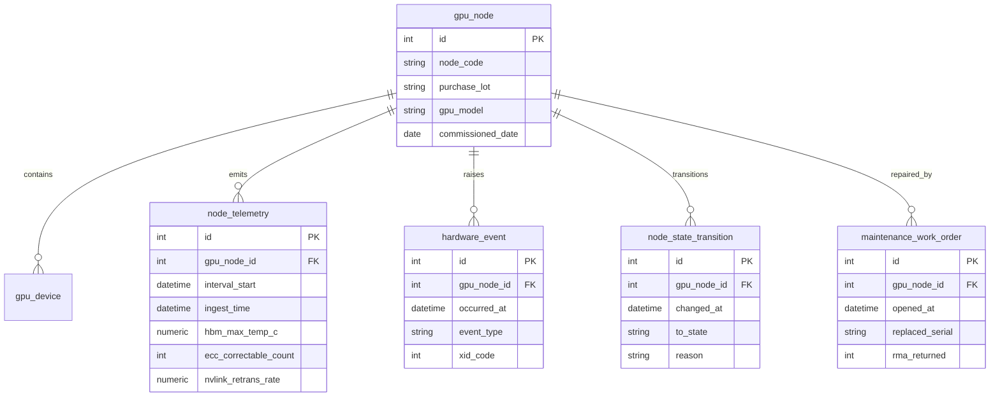
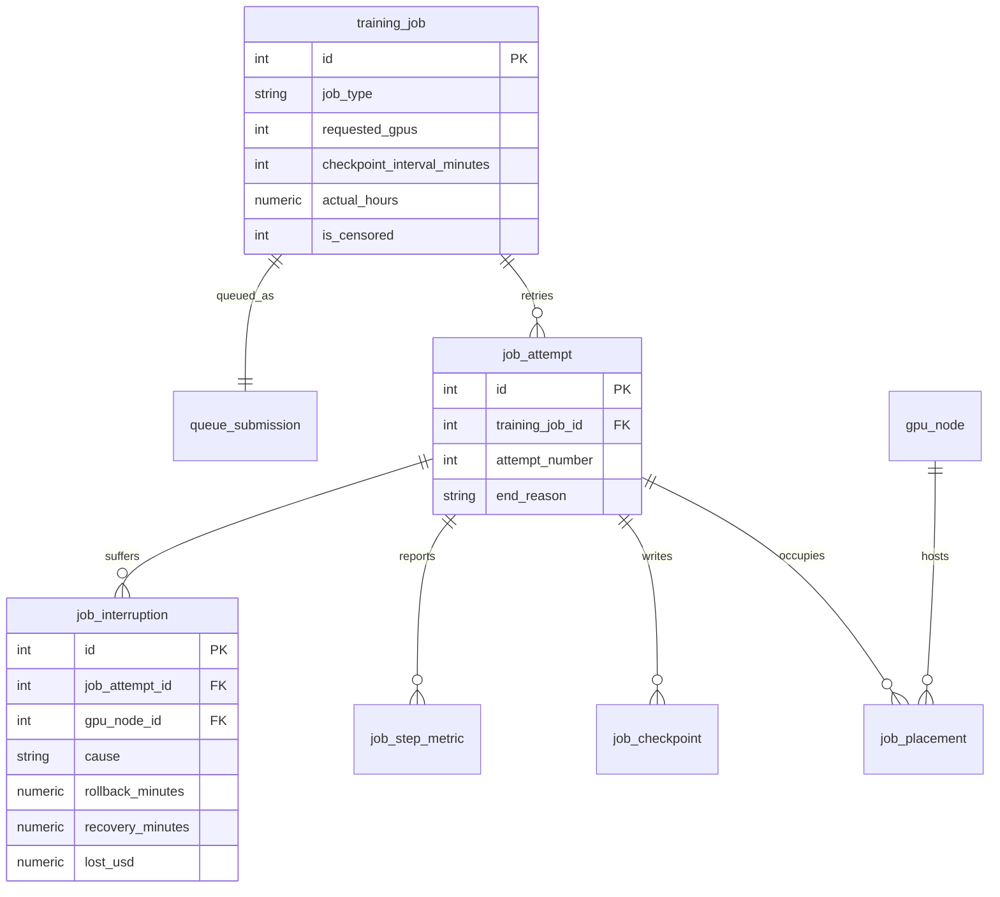
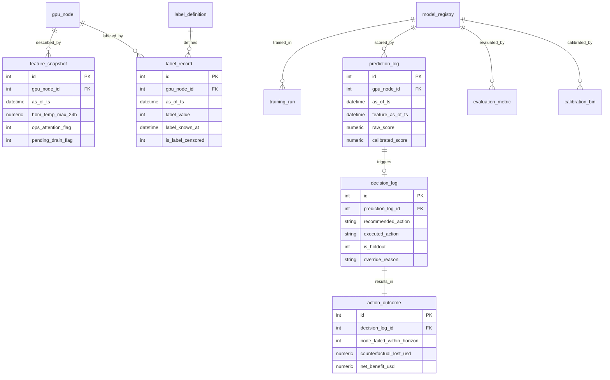

# Kestrel Compute 自愈调度数据集 ER 文档

业务背景, 模型族说明, 术语表请见 `01-cloud_provider_gpu_fleet_selfhealing_large_business_context-cn.md`. 本文档只描述数据.

---

## 1. 数据集元信息

| 项目 | 值 |
| :--- | :--- |
| 复杂度层级 | Large |
| 表数量 | 26 |
| 总行数 | 2,572,888 |
| 外键关系 | 25 条 |
| `REFERENCE_DATE` | `2026-05-31` |
| 数据窗口 | 2026-02-01 至 2026-05-31, 共 120 天 |
| 模型上线日 | 2026-04-01 |
| 遥测粒度 | 15 分钟 |
| as_of 粒度 | 6 小时 |
| 标签观测窗 | 24 小时 |
| 数据库文件 | `cloud_provider_gpu_fleet_selfhealing_large.sqlite` |

DDL 管不了但必须遵守的规则:

> 第一, `feature_snapshot` 与 `label_record` 通过 `(gpu_node_id, as_of_ts)` 组合一一对应, 两表行数相同 (88,828). DDL 没有在这个组合上建唯一约束, 但重复行会直接破坏训练集.
>
> 第二, `feature_definition.availability_lag_minutes` 为负的两个特征 (`ops_attention_flag`, `pending_drain_flag`) 是泄漏特征. 它们物理上存在于 `feature_snapshot` 里, 没有任何机制阻止你把它们喂进模型.
>
> 第三, `label_record.label_known_at` 晚于 `as_of_ts` 26 小时. 训练某个时点的模型时, 只能使用 `label_known_at <= 该时点` 的标签. DDL 不会替你做这个过滤.
>
> 第四, `decision_log.is_holdout = 1` 的样本是唯一的无偏标签来源. `override_reason` 非空但 `is_holdout = 0` 的样本看起来也 "没被干预", 但那是非随机选择的结果, 不能当无偏样本用.

---

## 2. 四层架构与实体关系

数据分四层, 层与层之间的依赖方向是单向的: 事实层产生特征与标签, 特征与标签产生模型, 模型产生决策, 决策反过来改变未来的事实. 最后这条反馈边是选择性标签陷阱的来源.

### 第一层 原始事实



### 第二层 作业与中断



### 第三层与第四层 特征标签, 模型, 决策



---

## 3. 第一层 原始事实

### gpu_node

一行是集群里的一个计算节点, 8 张 GPU. 故障预测的实体粒度就是它, 所有特征与标签都挂在节点上而不是卡上. `purchase_lot` 这一列比看起来重要得多: 三个批次的失效机理完全不同, 它是分布漂移的主维度, 也是评估时最重要的切片维度.

| 列 | 类型 | 约束 | 说明 |
| :--- | :--- | :--- | :--- |
| `id` | INTEGER | PK | |
| `node_code` | VARCHAR(20) | UNIQUE | 形如 `A3-001` |
| `cluster_name` | VARCHAR(20) | NOT NULL | 恒为 `ABI1-A3` |
| `rack_code` | VARCHAR(20) | NOT NULL | 机架, 每架 8 个节点 |
| `purchase_lot` | VARCHAR(30) | NOT NULL | 三个批次之一, 决定失效机理 |
| `gpu_model` | VARCHAR(40) | NOT NULL | H100 / H200 / GB200 |
| `gpu_count` | INTEGER | NOT NULL | 恒为 8 |
| `commissioned_date` | DATE | NOT NULL | 上架日. GB200 在窗口内才上架 |
| `rated_power_w` | NUMERIC(10,1) | NOT NULL | 额定功率, 功耗偏离的分母 |
| `current_status` | VARCHAR(15) | NOT NULL | 快照时刻的状态 |

三个批次的构成:

| purchase_lot | gpu_model | 节点数 | 上架期 | 失效机理 |
| :--- | :--- | :-- | :--- | :--- |
| LOT-H100-2024Q3 | H100-SXM5-80GB | 84 | 2024-08 到 2024-10 | 热失效主导 |
| LOT-H200-2025Q2 | H200-SXM5-141GB | 66 | 2025-05 到 2025-07 | 热失效主导 |
| LOT-GB200-2026Q1 | GB200-NVL72-192GB | 50 | 2026-02-25 到 2026-03-10 | 互联与供电失效主导 |

样例: `id=1, node_code=A3-001, purchase_lot=LOT-H100-2024Q3, commissioned_date=2024-09-07, rated_power_w=6800, current_status=UP`

### gpu_device

卡级明细, 1,572 行. 注意原始安装了 1,600 张, 差额的 28 张已 RMA 退回并从这张表里移除, 只在 `maintenance_work_order.replaced_serial` 里留有记录.

> 作用域提醒: 这是幸存者偏差的来源. 用这张表算 MTBF 或批次可靠性, 会系统性高估, 因为最不可靠的那批卡已经不在表里了. 要算准, 必须把工单里的 RMA 记录并回来.

| 列 | 类型 | 说明 |
| :--- | :--- | :--- |
| `id` / `serial_number` | INTEGER / VARCHAR(30) | 主键与序列号 |
| `gpu_node_id` | INTEGER FK | 所属节点, 多对一 |
| `slot_index` | INTEGER | 槽位 0 到 7 |
| `gpu_model` / `purchase_lot` | VARCHAR | 冗余自节点, 便于卡级分析 |
| `installed_at` | DATETIME | 安装时刻 |

### firmware_rollout

固件推送批次, 9 行. 固件变更会改变遥测基线, 是模型漂移的一个已知诱因, 也是 `firmware_age_days` 特征的来源.

| 列 | 说明 |
| :--- | :--- |
| `firmware_version` / `purchase_lot` | 版本号与适用批次 |
| `rollout_started_at` / `rollout_completed_at` | 推送窗口 |
| `node_count` | 覆盖节点数 |

### node_telemetry

数据集里最大的表, 2,151,072 行, 15 分钟粒度. 全部预测特征的原料.

> 作用域提醒: 处于检修状态 (REPAIR) 的节点仍然上电上报, 但 `sm_utilization_pct = 0` 且温度贴近进风温度. 算特征时如果不排除这些区间, 会把 "机器在修" 误当成 "机器很凉快很健康".

| 列 | 类型 | 说明 |
| :--- | :--- | :--- |
| `gpu_node_id` | INTEGER FK | 节点 |
| `interval_start` | DATETIME | 区间起点 |
| `ingest_time` | DATETIME | 落库时刻, 比 `interval_start` 晚 17 分钟 |
| `gpu_avg_temp_c` | NUMERIC(6,2) | GPU 平均温度 |
| `hbm_max_temp_c` | NUMERIC(6,2) | HBM 最高温度, 热失效的主要观测量 |
| `inlet_temp_c` | NUMERIC(6,2) | 机房进风温度, 全集群共用的环境混淆变量 |
| `power_draw_w` | NUMERIC(10,1) | 实际功耗 |
| `power_deviation_pct` | NUMERIC(8,4) | 相对额定的偏离比例, GB200 失效的主要观测量之一 |
| `sm_utilization_pct` | NUMERIC(6,2) | SM 利用率 |
| `ecc_correctable_count` | INTEGER | 可纠正 ECC 计数, 劣化的早期信号 |
| `ecc_uncorrectable_count` | INTEGER | 不可纠正 ECC, 极稀疏, 出现即接近故障 |
| `nvlink_retrans_rate` | NUMERIC(10,6) | NVLink 重传率, GB200 失效的主要观测量 |
| `pcie_replay_count` | INTEGER | PCIe 重放计数 |
| `fan_rpm_avg` | NUMERIC(8,1) | 风扇转速, 对温度上升的代偿反应 |
| `throttle_seconds` | NUMERIC(8,2) | 热降频秒数 |

样例: `gpu_node_id=1, interval_start=2026-02-01 00:00, ingest_time=2026-02-01 00:17, hbm_max_temp_c=63.34, inlet_temp_c=16.88, ecc_correctable_count=2, nvlink_retrans_rate=0.000682, fan_rpm_avg=5097.7`

### hardware_event

离散硬件事件, 1,256 行. XID 与不可纠正 ECC 是故障前最强的单点信号, 但它们出现得晚且稀疏, 光靠规则告警来不及, 这正是要上模型的原因.

| 列 | 说明 |
| :--- | :--- |
| `occurred_at` / `ingest_time` | 发生与落库时刻 |
| `event_type` | `XID_ERROR` / `THERMAL_THROTTLE` / `PCIE_REPLAY_BURST` / `NVLINK_FLAP` |
| `severity` | `INFO` / `WARNING` / `CRITICAL`, 越接近故障越严重 |
| `xid_code` | NVIDIA XID 错误码, 非 XID 事件为空 |

### node_state_transition

节点状态机变更, 375 行. 这张表是标签的直接来源, 也是泄漏特征 `pending_drain_flag` 的来源.

> 作用域提醒: `to_state = 'DRAINING'` 且 `reason = 'MODEL_PREDICTED_FAILURE_RISK'` 的记录只在上线后出现, 它们代表模型成功拦截的故障. `to_state = 'DOWN'` 且 `reason = 'UNPLANNED_HARDWARE_FAILURE'` 才是真实故障, 标签只认这一类.

状态流转的两条路径:

| 路径 | 触发 | 状态序列 | 记录数 |
| :--- | :--- | :--- | :-- |
| 非计划故障 | 硬件真的挂了 | UP → DOWN → REPAIR → UP | 74 次 |
| 计划内排空 | 模型预测到风险 | UP → DRAINING → REPAIR → UP | 51 次 |

### maintenance_work_order

维修工单与换件, 125 行. `opened_at` 是运维察觉的时刻, 永远晚于劣化开始, 把它做成前向窗特征就是泄漏.

| 列 | 说明 |
| :--- | :--- |
| `opened_at` / `closed_at` | 开单与关单时刻 |
| `work_order_type` | `UNPLANNED_REPAIR` (崩溃后抢修) 或 `PLANNED_PREEMPTIVE` (模型预警后计划检修) |
| `replaced_part` | 换下的部件, 未换件为空 |
| `replaced_serial` | 换下的卡序列号. 这是找回被移除设备的唯一线索 |
| `rma_returned` | 1 表示退回原厂, 该序列号已从 `gpu_device` 移除 |
| `labor_hours` | 工时. 计划内检修显著低于抢修 |

---

## 4. 第二层 作业与中断

### training_job

900 个客户作业. 中断代价的量级由 `requested_gpus` 与 `checkpoint_interval_minutes` 共同决定.

> 作用域提醒: 右删失就在这张表里. `is_censored = 1` 的 225 个作业在快照时刻仍在运行, `completed_at` 与 `actual_hours` 都是空. 它们的 `planned_hours` 平均 553.9 小时, 而已完成作业平均只有 127.0 小时. 直接 `WHERE actual_hours IS NOT NULL` 会把长作业整体剔掉.

| 列 | 说明 |
| :--- | :--- |
| `job_type` | `PRETRAIN` / `FINETUNE` / `RLHF` / `EVAL_SWEEP` / `RESEARCH` |
| `priority_tier` | `RESERVED` / `ON_DEMAND` / `SPOT` |
| `requested_gpus` | 8 到 1,024 |
| `checkpoint_interval_minutes` | 预训练 240, 微调 90, 评测 30 |
| `planned_hours` / `actual_hours` | 计划与实际时长, 后者删失时为空 |
| `is_censored` | 1 表示右删失 |

### job_attempt, job_placement, job_checkpoint, job_step_metric

`job_attempt` (1,729 行) 是作业的一次运行尝试, 被中断后重启会产生新的 attempt, `attempt_number` 递增. `ramp_to_full_speed_minutes` 是 M3 恢复时长模型的一部分标签.

`job_placement` (88,283 行) 是 attempt 与节点的分配关系. 判断一次节点故障会波及哪些作业, 唯一靠它.

`job_checkpoint` (49,040 行) 记录每次检查点写入. 中断时回滚多少, 取决于离上一个检查点多远.

`job_step_metric` (48,959 行) 是采样的训练步指标, 含 `step_time_ms`, `mfu_pct`, `slowest_node_id`. 这是 M5 慢节点检测的原料, 而且它没有标签, 只能用无监督或弱监督方法.

### job_interruption

978 次中断. 这是 M3 的标签来源, 也是收益核算的基础.

| cause | 次数 | 说明 |
| :--- | :-- | :--- |
| NODE_HARDWARE_FAILURE | 814 | 节点硬件故障, 模型要防的就是这一类, 每一条都归到某个真实故障节点 |
| DR_CURTAILMENT | 39 | 园区参与需求响应主动削减负载, 与能源数据集的接口 |
| SOFTWARE_OOM | 36 | 显存溢出, 与硬件无关 |
| NETWORK_FABRIC_FAULT | 32 | 网络故障 |
| PREEMPTION_BY_HIGHER_PRIORITY | 30 | 被高优先级作业抢占 |
| USER_CANCEL | 27 | 用户主动取消 |

三项时长分别是 `rollback_minutes` (回滚), `requeue_wait_minutes` (重排队) 和 `recovery_minutes` (恢复满速), 加起来乘以 GPU 数就是 `lost_gpu_hours`. 全窗口累计损失 618 万美元, 平均每次 2,217.6 GPU 小时.

### queue_submission

900 行排队记录, M4 等待时长模型的训练数据. `wait_minutes` 与 `queue_depth_at_submit`, `free_gpus_at_submit`, `priority_tier` 三者都相关, 结构是可学的.

---

## 5. 第三层 特征与标签

### feature_definition

26 行特征字典. 这张表是整个第三层的灵魂, 因为它把 "这个特征什么时候才能用" 这件事显式记录了下来.

| 列 | 说明 |
| :--- | :--- |
| `feature_name` | 与 `feature_snapshot` 的列名一一对应 |
| `availability_lag_minutes` | 线上打分时该特征相对当前时刻滞后多久可得 |
| `source_layer` | `telemetry` (实时) / `warehouse` (批处理, 有滞后) / `event` / `asset` |
| `is_leaky` | 由 `availability_lag_minutes < 0` 推出的冗余标记 |

三档滞后的含义:

| availability_lag_minutes | 特征数 | 含义 |
| :-- | :-- | :--- |
| 0 | 21 | 实时可得, 训练与线上一致 |
| 60 | 3 | 走数仓批处理, 线上只能拿到一小时前的值. 训练时用理想值会产生偏斜 |
| -1080 | 2 | 负数. 取用了 as_of 之后 18 小时的信息, 是泄漏 |

滞后 60 分钟的三个特征是 `hbm_temp_excess_over_lot`, `firmware_age_days`, `open_work_order_count`, 它们都走数仓批处理管线.

### feature_snapshot

88,828 行, 以 `(gpu_node_id, as_of_ts)` 为键. 存的不是当前状态, 而是 "截至 as_of 那一刻可见的状态". 只追加不更新.

特征分五族:

| 族 | 特征 | 针对的失效机理 |
| :--- | :--- | :--- |
| 热 | `hbm_temp_max_1h/24h`, `hbm_temp_slope_24h`, `hbm_temp_excess_over_lot`, `throttle_sec_24h` | H100 与 H200 |
| 显存纠错 | `ecc_corr_sum_1h/24h`, `ecc_corr_slope_24h`, `ecc_uncorr_sum_24h` | H100 与 H200 |
| 互联 | `nvlink_retrans_mean_1h/24h`, `nvlink_retrans_slope_24h` | GB200 |
| 供电与散热 | `power_dev_mean_24h`, `power_dev_slope_24h`, `fan_rpm_mean_24h`, `fan_rpm_slope_24h` | GB200 |
| 资产与事件 | `days_since_commission`, `days_since_last_repair`, `firmware_age_days`, `xid_count_24h/7d`, `open_work_order_count` | 通用 |

另有两个环境变量 `inlet_temp_mean_24h` 与 `sm_util_mean_24h`, 它们本身不预示故障, 但是必要的混淆控制. `hbm_temp_excess_over_lot` 就是把这两个变量的影响剥掉之后的温度超出量, 是热族里最有用的一个.

最后两列 `ops_attention_flag` 与 `pending_drain_flag` 是泄漏特征, 见第 7 节陷阱 2.

样例 (一个健康节点): `gpu_node_id=1, as_of_ts=2026-02-02 00:00, hbm_temp_max_24h=71.958, hbm_temp_excess_over_lot=7.241, ecc_corr_sum_24h=234.49, nvlink_retrans_mean_24h=0.000451, days_since_commission=513, days_since_last_repair=9999, ops_attention_flag=0`

### label_definition 与 label_record

`label_definition` 有 3 行, 但只有第 1 个被物化:

| id | label_name | 观测窗 | 是否物化 | 说明 |
| :-- | :--- | :-- | :-- | :--- |
| 1 | node_hw_failure_24h | 24h | 是 | 主标签, 已写进 `label_record` |
| 2 | node_hw_failure_72h | 72h | 否 | 正例更多, 提前量更长, 需自行用 SQL 重算 |
| 3 | job_impacting_failure_24h | 24h | 否 | 只算故障时该节点上有作业在跑的情况, 更贴近业务价值 |

三个口径训出来是三个不同的模型. 口径 3 的正例最少但业务价值最高, 因为空转节点故障不造成任何损失.

`label_record` 88,828 行, 与 `feature_snapshot` 一一对应.

| 列 | 说明 |
| :--- | :--- |
| `label_value` | 0 或 1 |
| `label_known_at` | 标签真正可知的时刻, 比 `as_of_ts` 晚 26 小时 |
| `is_label_censored` | 1 表示该节点在观测窗内被模型主动排空, 真实结局不可观测 |
| `censoring_reason` | 删失原因, 目前只有 `PREEMPTIVE_DRAIN_BY_MODEL` |

样例 (一个正例): `gpu_node_id=2, as_of_ts=2026-03-16 00:00, label_value=1, label_known_at=2026-03-17 02:00, is_label_censored=0`

### dataset_split

4 行, 把切分边界存成数据.

| split_name | 窗口 | 行数 | 正例数 | 正例率 |
| :--- | :--- | :-- | :-- | :-- |
| train | 2026-02-01 到 03-12 | 24,028 | 106 | 0.441% |
| validation | 2026-03-12 到 03-22 | 8,000 | 77 | 0.963% |
| test | 2026-03-22 到 04-01 | 8,000 | 50 | 0.625% |
| production | 2026-04-01 到 06-01 | 48,800 | 60 | 0.123% |

production 段正例率断崖式下降, 那是模型自己造成的.

---

## 6. 第四层 模型与决策

### model_registry 与 training_run

`model_registry` 9 行, 覆盖五个模型族. `deployed_at` 非空的是当前在线的版本.

`training_run` 8 行, 记录每次训练. 这张表最有价值的是它把**做错了的实验也留了下来**:

| run_code | 特征集 | 切分 | test AUC | 说明 |
| :--- | :--- | :--- | :-- | :--- |
| TR-M1-001 | 干净 24 个 | 时间 | 0.8513 | 基线, 这是真实水平 |
| TR-M1-002 | 含 2 个泄漏特征 | 时间 | 0.9438 | 指标虚高, 泄漏所致 |
| TR-M1-003 | 干净 24 个 | 随机打散 | 0.9209 | 指标虚高, 时间泄漏所致 |
| TR-M1-004 | 干净 24 个 | 时间 | 0.8513 | 加保序回归校准. AUC 不变, Brier 显著改善 |
| TR-M1-005 | 干净 24 个 | 时间 | 0.5688 | 上线后含删失样本重训, 明显退化 |
| TR-M1-006 | 干净 24 个 | 时间 | 0.6562 | 剔除删失样本重训, 性能部分恢复 |

上表只列了 M1 的 6 行. 另有 2 行是 M2 (作业剩余时长, 分位数回归) 的训练记录 TR-M2-001 / TR-M2-002, 回归模型不适用 AUC, 故 `test_auc` 记为 0 占位, 合计 8 行.

表里所有指标都是真实训练测出来的, 不是编的.

### prediction_log

48,800 行, 上线后每个 `(节点, as_of)` 一条.

> 作用域提醒: `feature_as_of_ts` 比 `as_of_ts` 早 60 分钟, 记录的是线上真正取到特征的时点. 离线复现线上预测时, 带 60 分钟滞后的那三个特征必须按 `feature_as_of_ts` 取值, 按 `as_of_ts` 取会拿到线上根本没有的信息.

| 列 | 说明 |
| :--- | :--- |
| `raw_score` | 生产模型的原始输出, 未校准 |
| `calibrated_score` | 校准后的概率. 只有 v1.1 版本有, 生产用的是 `raw_score` |
| `scoring_latency_ms` | 打分延迟 |

样例: `gpu_node_id=1, as_of_ts=2026-04-01 00:00, feature_as_of_ts=2026-03-31 23:00, raw_score=0.04135171, calibrated_score=0.00586865`

注意这一行: 原始分数 0.0414 而校准后只有 0.0059, 高估了七倍.

### evaluation_metric 与 calibration_bin

`evaluation_metric` 16 行, 按 4 个半月窗口乘以切片维度 (overall 与三个 purchase_lot) 存指标. `calibration_bin` 40 行, 存可靠性曲线的分箱.

校准曲线的实测数据 (2026-05-01 窗口):

| 分箱 | 预测均值 | 真实频率 | 样本数 |
| :--- | :-- | :-- | :-- |
| 0.0 到 0.1 | 0.0541 | 0.0002 | 6,326 |
| 0.4 到 0.5 | 0.4466 | 0.0037 | 268 |
| 0.6 到 0.7 | 0.6466 | 0.0125 | 80 |
| 0.8 到 0.9 | 0.8480 | 0.0625 | 16 |

每一档都高估了一个数量级以上. 拿这个概率去乘美元, 决策必然全错.

### decision_log 与 action_outcome

各 464 行. 这两张表分开是刻意的: 建议, 执行, 结果发生在三个不同的时刻, 合成一张表就没法表达 "建议了但没执行" 这件事.

`decision_log` 的执行分布:

| executed_action | is_holdout | 行数 | 含义 |
| :--- | :-- | :-- | :--- |
| DRAIN | 0 | 51 | 建议被执行, 故障被拦截 |
| NO_ACTION | 1 | 20 | 留出组, 刻意不执行, 提供无偏标签 |
| NO_ACTION | 0 | 17 | 人工 override, 非随机 |
| MONITOR | 0 | 376 | 分数过阈值但当时没有活跃劣化, 属误报 |

`action_outcome` 里 `counterfactual_lost_usd` 是 "如果不采取行动会损失多少" 的估计. 这是估计而不是观测, 只有留出组能提供接近观测的反事实. 计算总收益时把全部行的 `net_benefit_usd` 直接相加, 会得到一个被自己的假设撑起来的数字.

样例 (一条留出组记录): `gpu_node_id=61, as_of_ts=2026-04-01 06:00, recommended_action=DRAIN, executed_action=NO_ACTION, is_holdout=1, override_reason=EXPLORATION_HOLDOUT, expected_benefit_usd=11308.63, expected_cost_usd=1324`

---

## 7. 内嵌建模陷阱

每一条都给出了实测数字. 数字来自真实训练 (HistGradientBoostingClassifier, 180 轮, 学习率 0.08), 不是编的.

**1. 选择性标签.** 上线前正例率 0.582%, 上线后 0.123%. 用含删失样本的全量数据重训, 5 月下旬 AUC 0.5688; 剔除 `is_label_censored = 1` 再重训, 回到 0.6562. 对应 `training_run` 的 TR-M1-005 与 TR-M1-006.

**2. 特征泄漏.** `ops_attention_flag` 与 `pending_drain_flag` 的窗口写成了前向 18 小时. 加上它们 test AUC 从 0.8513 涨到 0.9438, PR-AUC 从 0.5521 涨到 0.7589. 线索在 `feature_definition.availability_lag_minutes = -1080`.

**3. 时间泄漏.** 随机划分 AUC 0.9209, 按时间划分 0.8513, 虚高 6.96 个百分点. 机制是每个节点有可辨认的固定偏移 (温度基线标准差 3.4 度, 风扇基线标准差 560 转), 加上同一次故障产生 4 个高度相似的正例样本, 随机划分会把它们拆到训练与测试两边.

**4. 训练服务偏斜.** 三个特征滞后 60 分钟. `prediction_log.feature_as_of_ts` 比 `as_of_ts` 早整整 60 分钟.

**5. 标签迟到.** `label_known_at` 平均比 `as_of_ts` 晚 26.0 小时.

**6. 分布漂移.** 上线后按批次切片的 AUC: H100 0.9016, H200 0.8274, GB200 0.8207. 机理是 GB200 的劣化信号集中在 `nvlink_retrans_rate` 与 `power_deviation_pct` 上, 而训练窗以热失效样本为主.

**7. 极端不平衡.** 全库正例率 0.33% (88,828 行中 293 个正例). 全预测负例的 accuracy 是 99.67%.

**8. 概率未校准.** 预测值 0.8 到 0.9 那一箱, 预测均值 0.8480, 真实频率 0.0625, 高估 13.6 倍.

**9. 右删失.** 225 个作业删失, `planned_hours` 平均 553.9 小时; 675 个已完成作业平均 127.0 小时. 相差 4.4 倍.

**10. 幸存者偏差.** 原装 1,600 张卡, 表里 1,572 张, 28 张已 RMA 移除.

---

## 8. 数据生成规则

### 时间顺序

`node_telemetry.ingest_time` 比 `interval_start` 晚 17 分钟. `hardware_event.ingest_time` 晚 20 到 240 秒. `label_record.label_known_at` 晚 26 小时. `action_outcome.observed_at` 比对应决策的 `as_of_ts` 晚 26 小时. `job_attempt.ended_at` 晚于 `started_at`. `maintenance_work_order.closed_at` 晚于 `opened_at`.

### 故障过程

节点不是瞬间坏掉的. 每次故障前有一段劣化期, 时长服从对数正态分布, 中位数 26 小时, 截断在 8 到 64 小时之间. 劣化进度从 onset 时的 0 线性到 failure 时的 1, 各遥测指标按进度的**平方** 放大, 平方是为了让信号在临近故障时才明显, 早期难以察觉.

各指标在劣化终点的漂移幅度乘以批次指纹系数:

| 指标 | 基础幅度 | H100 系数 | H200 系数 | GB200 系数 |
| :--- | :-- | :-- | :-- | :-- |
| HBM 温度 | +5.0 度 | 1.35 | 1.25 | 0.40 |
| 可纠正 ECC | 9.5 倍 | 1.25 | 1.30 | 0.65 |
| NVLink 重传 | 3.2 倍 | 0.55 | 0.70 | 2.60 |
| 风扇转速 | +7.5% | 1.30 | 1.20 | 0.50 |
| 功耗偏离 | +2.4% | 0.60 | 0.70 | 2.70 |

健康节点有 5.5% 的区间会出现随机尖峰 (幅度 0.70), 这是假阳性的来源. 没有它模型 AUC 会接近 1, 数据集就失去了教学价值.

### 环境混淆

进风温度全集群共用一条序列, 由季节项 (振幅 5.5 度) 加日内项 (振幅 2.8 度) 加噪声构成. 它同时抬高所有节点的 GPU 温度与风扇转速. 直接用绝对温度做特征的模型会把 "天热" 学成 "要坏了", 必须用 `hbm_temp_excess_over_lot` 这类归一化特征.

### 反馈闭环

这是这份数据集里唯一一处非单向的因果关系, 也是生成顺序不能改的原因:

1. 先抽出全部潜在劣化事件 (onset 与 failure 时刻)
2. 给每个上线后的事件随机分配处置臂: TREAT 71%, HOLDOUT 18%, OVERRIDE 11%
3. 模拟模型在各 as_of 点打分, TREAT 臂的事件在第一次分数过阈值时被拦截
4. 再生成遥测, 被拦截的事件在排空时刻停止劣化并进入检修态
5. 最后生成标签, 被拦截的事件不产生正例, 但会被标记为 `is_label_censored = 1`

处置臂必须按事件粘性分配而不是每次打分独立抽. 一次劣化会被打分四五次, 如果每次独立抽 18%, 逃脱概率不到 0.1%, 上线后一个正例都剩不下.

### 分布特征

| 指标 | 实际产出值 |
| :--- | :--- |
| 真实故障次数 | 74 |
| 被模型拦截次数 | 51 |
| 全库正例率 | 0.33% |
| 上线前 / 上线后正例率 | 0.582% / 0.123% |
| 作业中断次数 | 978, 其中 814 次由节点硬件故障引起 |
| 累计中断损失 | 6,181,130 美元 |
| 删失作业数 | 225 (占 25%) |
| RMA 退回卡数 | 28 |

---

## 9. 索引

时序表动辄百万行, 没有复合索引任何按实体切片再按时间过滤的查询都会退化成全表扫描.

| 索引名 | 表 | 列 |
| :--- | :--- | :--- |
| `ix_telemetry_node_time` | node_telemetry | (gpu_node_id, interval_start) |
| `ix_hwevent_node_time` | hardware_event | (gpu_node_id, occurred_at) |
| `ix_state_node_time` | node_state_transition | (gpu_node_id, changed_at) |
| `ix_wo_node_time` | maintenance_work_order | (gpu_node_id, opened_at) |
| `ix_feat_node_asof` | feature_snapshot | (gpu_node_id, as_of_ts) |
| `ix_label_node_asof` | label_record | (gpu_node_id, as_of_ts) |
| `ix_pred_node_asof` | prediction_log | (gpu_node_id, as_of_ts) |
| `ix_decision_node_asof` | decision_log | (gpu_node_id, as_of_ts) |
| `ix_placement_node` | job_placement | (gpu_node_id, placed_at) |
| `ix_attempt_job` | job_attempt | (training_job_id) |
| `ix_ckpt_attempt` | job_checkpoint | (job_attempt_id, written_at) |
| `ix_step_attempt` | job_step_metric | (job_attempt_id, recorded_at) |
| `ix_interrupt_time` | job_interruption | (interrupted_at) |
| `ix_outcome_decision` | action_outcome | (decision_log_id) |
| `ix_device_node` | gpu_device | (gpu_node_id) |
| `ix_node_lot` | gpu_node | (purchase_lot) |
| `ix_job_submitted` | training_job | (submitted_at) |

---

## 10. 文件清单

| # | 文件 | 表 | 行数 |
| :-- | :--- | :--- | :-- |
| 01 | 01_gpu_node.tsv | gpu_node | 200 |
| 02 | 02_gpu_device.tsv | gpu_device | 1,572 |
| 03 | 03_firmware_rollout.tsv | firmware_rollout | 9 |
| 04 | 04_node_telemetry.tsv | node_telemetry | 2,151,072 |
| 05 | 05_hardware_event.tsv | hardware_event | 1,256 |
| 06 | 06_node_state_transition.tsv | node_state_transition | 375 |
| 07 | 07_maintenance_work_order.tsv | maintenance_work_order | 125 |
| 08 | 08_training_job.tsv | training_job | 900 |
| 09 | 09_job_attempt.tsv | job_attempt | 1,729 |
| 10 | 10_job_placement.tsv | job_placement | 88,283 |
| 11 | 11_job_checkpoint.tsv | job_checkpoint | 49,040 |
| 12 | 12_job_step_metric.tsv | job_step_metric | 48,959 |
| 13 | 13_job_interruption.tsv | job_interruption | 978 |
| 14 | 14_queue_submission.tsv | queue_submission | 900 |
| 15 | 15_feature_definition.tsv | feature_definition | 26 |
| 16 | 16_feature_snapshot.tsv | feature_snapshot | 88,828 |
| 17 | 17_label_definition.tsv | label_definition | 3 |
| 18 | 18_label_record.tsv | label_record | 88,828 |
| 19 | 19_dataset_split.tsv | dataset_split | 4 |
| 20 | 20_model_registry.tsv | model_registry | 9 |
| 21 | 21_training_run.tsv | training_run | 8 |
| 22 | 22_prediction_log.tsv | prediction_log | 48,800 |
| 23 | 23_evaluation_metric.tsv | evaluation_metric | 16 |
| 24 | 24_calibration_bin.tsv | calibration_bin | 40 |
| 25 | 25_decision_log.tsv | decision_log | 464 |
| 26 | 26_action_outcome.tsv | action_outcome | 464 |

合计 2,572,888 行.

---

## 11. SQLite DDL

完整 DDL 见数据库文件本身 (`sqlite3 cloud_provider_gpu_fleet_selfhealing_large.sqlite .schema`). 下面只列出四层的核心表, 便于快速理解结构.

```sql
CREATE TABLE feature_snapshot (
        id INTEGER NOT NULL,
        gpu_node_id INTEGER NOT NULL,
        as_of_ts DATETIME NOT NULL,
        computed_at DATETIME NOT NULL,
        hbm_temp_max_1h NUMERIC(8, 3) NOT NULL,
        hbm_temp_max_24h NUMERIC(8, 3) NOT NULL,
        hbm_temp_slope_24h NUMERIC(8, 4) NOT NULL,
        hbm_temp_excess_over_lot NUMERIC(8, 3) NOT NULL,
        ecc_corr_sum_1h NUMERIC(10, 2) NOT NULL,
        ecc_corr_sum_24h NUMERIC(10, 2) NOT NULL,
        ecc_corr_slope_24h NUMERIC(10, 4) NOT NULL,
        ecc_uncorr_sum_24h NUMERIC(10, 2) NOT NULL,
        nvlink_retrans_mean_1h NUMERIC(10, 6) NOT NULL,
        nvlink_retrans_mean_24h NUMERIC(10, 6) NOT NULL,
        nvlink_retrans_slope_24h NUMERIC(10, 6) NOT NULL,
        fan_rpm_mean_24h NUMERIC(10, 2) NOT NULL,
        fan_rpm_slope_24h NUMERIC(10, 4) NOT NULL,
        power_dev_mean_24h NUMERIC(8, 4) NOT NULL,
        power_dev_slope_24h NUMERIC(8, 5) NOT NULL,
        sm_util_mean_24h NUMERIC(6, 2) NOT NULL,
        inlet_temp_mean_24h NUMERIC(6, 2) NOT NULL,
        xid_count_24h INTEGER NOT NULL,
        xid_count_7d INTEGER NOT NULL,
        throttle_sec_24h NUMERIC(10, 2) NOT NULL,
        days_since_commission NUMERIC(8, 2) NOT NULL,
        days_since_last_repair NUMERIC(8, 2) NOT NULL,
        firmware_age_days NUMERIC(8, 2) NOT NULL,
        open_work_order_count INTEGER NOT NULL,
        ops_attention_flag INTEGER NOT NULL,
        pending_drain_flag INTEGER NOT NULL,
        PRIMARY KEY (id),
        FOREIGN KEY(gpu_node_id) REFERENCES gpu_node (id)
);

CREATE TABLE label_record (
        id INTEGER NOT NULL,
        gpu_node_id INTEGER NOT NULL,
        as_of_ts DATETIME NOT NULL,
        label_definition_id INTEGER NOT NULL,
        label_value INTEGER NOT NULL,
        label_known_at DATETIME NOT NULL,
        is_label_censored INTEGER NOT NULL,
        censoring_reason VARCHAR(40),
        PRIMARY KEY (id),
        FOREIGN KEY(gpu_node_id) REFERENCES gpu_node (id),
        FOREIGN KEY(label_definition_id) REFERENCES label_definition (id)
);

CREATE TABLE prediction_log (
        id INTEGER NOT NULL,
        model_registry_id INTEGER NOT NULL,
        gpu_node_id INTEGER NOT NULL,
        as_of_ts DATETIME NOT NULL,
        scored_at DATETIME NOT NULL,
        feature_as_of_ts DATETIME NOT NULL,
        raw_score NUMERIC(10, 8) NOT NULL,
        calibrated_score NUMERIC(10, 8),
        scoring_latency_ms NUMERIC(8, 2) NOT NULL,
        PRIMARY KEY (id),
        FOREIGN KEY(model_registry_id) REFERENCES model_registry (id),
        FOREIGN KEY(gpu_node_id) REFERENCES gpu_node (id)
);

CREATE TABLE decision_log (
        id INTEGER NOT NULL,
        prediction_log_id INTEGER NOT NULL,
        gpu_node_id INTEGER NOT NULL,
        as_of_ts DATETIME NOT NULL,
        recommended_action VARCHAR(20) NOT NULL,
        expected_benefit_usd NUMERIC(12, 2) NOT NULL,
        expected_cost_usd NUMERIC(12, 2) NOT NULL,
        executed_action VARCHAR(20) NOT NULL,
        is_holdout INTEGER NOT NULL,
        override_reason VARCHAR(50),
        decided_at DATETIME NOT NULL,
        PRIMARY KEY (id),
        FOREIGN KEY(prediction_log_id) REFERENCES prediction_log (id),
        FOREIGN KEY(gpu_node_id) REFERENCES gpu_node (id)
);
```
