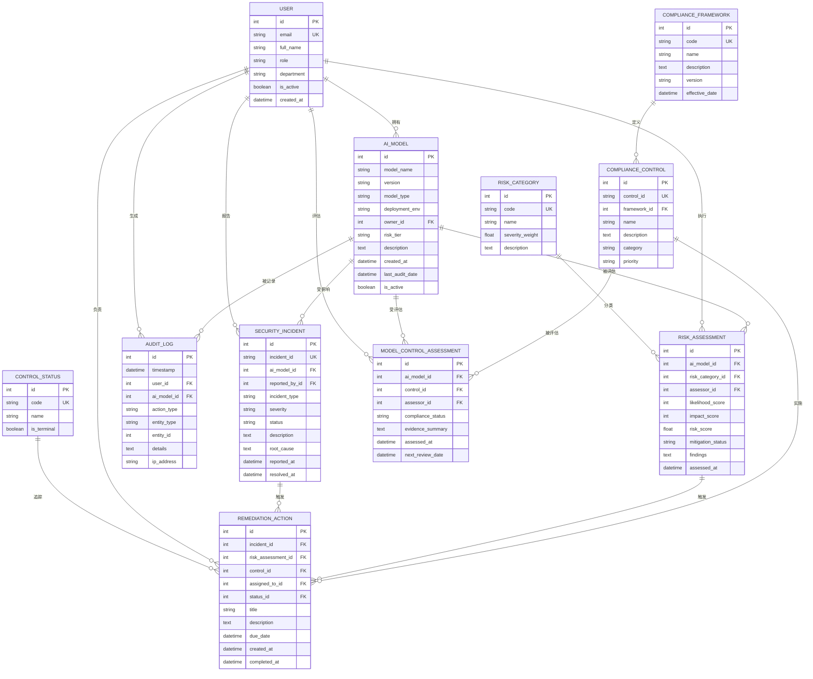

# 网络安全 — AI 合规审计系统 ER 文档

> 业务背景, 行业科普, 术语表请见 `01-cybersecurity_ai_compliance_audit_medium_business_context-cn.md`. 本文档只描述数据。

## 数据集元信息

- **复杂度级别:** Medium
- **表数量:** 11 个表
- **总记录数:** ~1,399 行
- **关系类型:** 多个 1:N 外键关系，1 个 M:N 桥接表（`model_control_assessment`），含枚举表和可空外键。另有两条 schema 无法强制、由生成器保证的约束：`audit_log.(entity_type, entity_id)` 多态引用，以及 `remediation_action` 的 `incident_id` / `risk_assessment_id` XOR 互斥。
- **时间锚点（REFERENCE_DATE 约定）:** 本数据集**不使用固定的 REFERENCE_DATE 常量**，而是在生成器运行时刻基于 `datetime.now()` 动态回推所有日期字段（`RANDOM_SEED = 42`）。这样做是为避免数据集"时间过期"导致 SQL 查询失去判别力（例如 Query 19 用 `julianday('now')` 与历史快照日期对比）。代价是：每次重跑生成器时绝对日期会整体平移，但与"今天"的相对偏移保持一致。**因此请在生成数据后尽快运行 SQL 查询。** 业务侧解读见业务背景文档第 6 节。

---

## 实体关系图



---

## 表定义

### 1. compliance_framework

**描述:** 合规框架参考表，存储 NIST AI RMF、GDPR、HIPAA 等治理 AI 系统的合规标准。

| 列名 | 类型 | 约束 | 描述 |
|------|------|------|------|
| id | INTEGER | PK | 主键 |
| code | VARCHAR(20) | UNIQUE, NOT NULL | 框架简码（如 NIST_AI_RMF） |
| name | VARCHAR(100) | NOT NULL | 框架全称 |
| description | TEXT | | 详细描述 |
| version | VARCHAR(20) | | 框架版本 |
| effective_date | DATETIME | | 生效日期 |

**外键:** 无

**完整枚举（6 条）:**

| id | code | 中文名 |
|----|------|-------|
| 1 | NIST_AI_RMF | NIST AI 风险管理框架 |
| 2 | GDPR | 欧盟通用数据保护条例 |
| 3 | HIPAA | 美国健康保险流通与责任法 |
| 4 | OWASP_AI | OWASP AI 安全 Top 10 |
| 5 | ISO_27001 | ISO/IEC 27001 信息安全 |
| 6 | SOC2 | SOC 2 Type II 审计标准 |

**简化说明（已知偏差）:** 真实世界中同一控制项可同时映射到多个框架（如 NIST AC-2 同时满足 ISO 27001）。Medium 复杂度下我们将 `compliance_control.framework_id` 简化为 1:N（每个控制只归属一个框架）。如要建模 M:N 框架映射，可独立扩展。

---

### 2. risk_category

**描述:** AI 系统风险类别枚举表，定义各类风险及其严重程度权重。

| 列名 | 类型 | 约束 | 描述 |
|------|------|------|------|
| id | INTEGER | PK | 主键 |
| code | VARCHAR(30) | UNIQUE, NOT NULL | 类别代码 |
| name | VARCHAR(100) | NOT NULL | 类别名称 |
| severity_weight | FLOAT | NOT NULL | 风险评分权重（0.9-1.8） |
| description | TEXT | | 类别描述 |

**外键:** 无

**完整枚举（8 条）:**

| id | code | name | severity_weight |
|----|------|------|-----------------|
| 1 | DATA_PRIVACY | Data Privacy Violation | 1.5 |
| 2 | MODEL_BIAS | Algorithmic Bias | 1.3 |
| 3 | ADVERSARIAL | Adversarial Attack | 1.8 |
| 4 | DATA_DRIFT | Data Drift | 1.0 |
| 5 | MODEL_INVERSION | Model Inversion Attack | 1.6 |
| 6 | PROMPT_INJECTION | Prompt Injection | 1.7 |
| 7 | SUPPLY_CHAIN | Supply Chain Vulnerability | 1.4 |
| 8 | EXPLAINABILITY | Lack of Explainability | 0.9 |

---

### 3. control_status

**描述:** 控制措施状态枚举表，用于追踪整改行动进度。

| 列名 | 类型 | 约束 | 描述 |
|------|------|------|------|
| id | INTEGER | PK | 主键 |
| code | VARCHAR(20) | UNIQUE, NOT NULL | 状态代码 |
| name | VARCHAR(50) | NOT NULL | 显示名称 |
| is_terminal | BOOLEAN | DEFAULT FALSE | 是否为终态 |

**外键:** 无

**完整枚举（5 条）:**

| id | code | name | is_terminal |
|----|------|------|-------------|
| 1 | PENDING | Pending Review | false |
| 2 | IN_PROGRESS | In Progress | false |
| 3 | COMPLETED | Completed | true |
| 4 | DEFERRED | Deferred | false |
| 5 | CANCELLED | Cancelled | true |

---

### 4. user

**描述:** 系统用户表，包括审计师、工程师、管理人员等不同角色。

| 列名 | 类型 | 约束 | 描述 |
|------|------|------|------|
| id | INTEGER | PK | 主键 |
| email | VARCHAR(100) | UNIQUE, NOT NULL | 用户邮箱 |
| full_name | VARCHAR(100) | NOT NULL | 全名 |
| role | VARCHAR(50) | NOT NULL | 职位角色 |
| department | VARCHAR(50) | NOT NULL | 所属部门 |
| is_active | BOOLEAN | DEFAULT TRUE | 是否活跃 |
| created_at | DATETIME | NOT NULL | 创建时间 |

**外键:** 无

**完整角色枚举（8 个）:**
- AI Security Engineer（AI安全工程师 / Engineering）
- Compliance Auditor（合规审计师 / Compliance）
- Data Scientist（数据科学家 / Data Science）
- MLOps Engineer（MLOps工程师 / Engineering）
- Risk Manager（风险经理 / Risk Management）
- Security Analyst（安全分析师 / Security）
- Product Manager（产品经理 / Product）
- DevOps Engineer（DevOps工程师 / Engineering）

**完整 department 枚举（6 个）:** `Engineering`, `Compliance`, `Data Science`, `Risk Management`, `Security`, `Product`。
（角色 → 部门是 N:1 映射：Engineering 容纳 3 个角色 [AI Security Engineer / MLOps Engineer / DevOps Engineer]，其余部门各对应 1 个角色。Query 7 按 `department` 分组时实际只有 6 个桶。）

**示例数据:**

| id | email | full_name | role | department |
|----|-------|-----------|------|------------|
| 1 | john.doe@example.com | John Doe | AI Security Engineer | Engineering |
| 2 | jane.smith@example.com | Jane Smith | Compliance Auditor | Compliance |

---

### 5. ai_model

**描述:** AI/ML 模型注册表，记录组织内部署或开发中的所有 AI 模型。

| 列名 | 类型 | 约束 | 描述 |
|------|------|------|------|
| id | INTEGER | PK | 主键 |
| model_name | VARCHAR(100) | NOT NULL | 模型名称 |
| version | VARCHAR(20) | NOT NULL | 语义化版本号 |
| model_type | VARCHAR(50) | NOT NULL | 模型类型（分类、LLM等） |
| deployment_env | VARCHAR(30) | NOT NULL | 部署环境 |
| owner_id | INTEGER | FK → user.id | 模型负责人 |
| risk_tier | VARCHAR(20) | NOT NULL | 风险等级 |
| description | TEXT | | 模型描述 |
| created_at | DATETIME | NOT NULL | 注册日期 |
| last_audit_date | DATETIME | | 最近审计日期 |
| is_active | BOOLEAN | DEFAULT TRUE | 是否激活 |

**外键:**
- `owner_id` → `user.id`

**deployment_env 枚举:** `production`, `staging`, `development`, `canary`（注意全小写，SQL 比较需大小写一致）

**model_type 枚举:** `Classification`, `Regression`, `NLP`, `Computer Vision`, `Recommendation`, `Anomaly Detection`, `LLM`, `Embedding`

**示例数据:**

| id | model_name | version | model_type | risk_tier | deployment_env |
|----|------------|---------|------------|-----------|----------------|
| 1 | FraudDetector_XYZ | v2.1.15 | Classification | HIGH | production |
| 2 | ChatBot_ABC | v1.0.5 | LLM | CRITICAL | staging |

---

### 6. compliance_control

**描述:** 合规控制措施表，映射到具体框架的控制要求。

| 列名 | 类型 | 约束 | 描述 |
|------|------|------|------|
| id | INTEGER | PK | 主键 |
| control_id | VARCHAR(30) | UNIQUE, NOT NULL | 控制措施 ID |
| framework_id | INTEGER | FK → compliance_framework.id | 所属框架 |
| name | VARCHAR(200) | NOT NULL | 控制措施名称 |
| description | TEXT | | 详细描述 |
| category | VARCHAR(50) | NOT NULL | 分类 |
| priority | VARCHAR(20) | NOT NULL | 优先级 |

**外键:**
- `framework_id` → `compliance_framework.id`

**完整 category 枚举（6 个）:**
- Governance（治理）
- Data Management（数据管理）
- Model Development（模型开发）
- Deployment（部署）
- Monitoring（监控）
- Incident Response（事件响应）

**完整 priority 枚举（4 档）:** `P1-Critical`, `P2-High`, `P3-Medium`, `P4-Low`

**示例数据:**

| id | control_id | framework_id | name | category | priority |
|----|------------|--------------|------|----------|----------|
| 1 | NIST-GOV-001 | 1 | Implement automated validation for AI model inputs | Governance | P1-Critical |
| 2 | GDPR-DAT-002 | 2 | Establish continuous monitoring for model performance | Data Management | P2-High |

---

### 7. risk_assessment

**描述:** AI 模型风险评估记录表，记录各类风险的评估结果。

| 列名 | 类型 | 约束 | 描述 |
|------|------|------|------|
| id | INTEGER | PK | 主键 |
| ai_model_id | INTEGER | FK → ai_model.id | 被评估模型 |
| risk_category_id | INTEGER | FK → risk_category.id | 风险类别 |
| assessor_id | INTEGER | FK → user.id | 评估人员 |
| likelihood_score | INTEGER | NOT NULL | 可能性评分（1-5） |
| impact_score | INTEGER | NOT NULL | 影响程度评分（1-5） |
| risk_score | FLOAT | NOT NULL | 综合风险评分 |
| mitigation_status | VARCHAR(30) | NOT NULL | 缓解状态 |
| findings | TEXT | | 评估发现 |
| assessed_at | DATETIME | NOT NULL | 评估日期 |

**外键:**
- `ai_model_id` → `ai_model.id`
- `risk_category_id` → `risk_category.id`
- `assessor_id` → `user.id`

**风险评分公式:** `risk_score = likelihood_score * impact_score * severity_weight`

**完整 mitigation_status 枚举（5 个）:** `NOT_STARTED`, `IN_PROGRESS`, `MITIGATED`, `ACCEPTED`, `TRANSFERRED`

**findings 示例:**
- `Model shows elevated risk in edge case handling scenarios requiring attention.`
- `Assessment identified compliance gap related to data preprocessing that needs mitigation.`
- `Review found potential bias patterns affecting inference pipeline components.`
- `Analysis detected vulnerability in access controls requiring control implementation.`

**示例数据:**

| id | ai_model_id | risk_category_id | likelihood_score | impact_score | risk_score | mitigation_status |
|----|-------------|------------------|------------------|--------------|------------|-------------------|
| 1 | 5 | 3 | 4 | 5 | 36.0 | IN_PROGRESS |
| 2 | 12 | 1 | 2 | 3 | 9.0 | MITIGATED |

---

### 8. model_control_assessment

**描述:** 模型 × 控制项的合规评估桥接表（M:N）。合规审计师为每个适用控制项评估每个模型，记录"该模型在该控制项上是否符合"的评估结论、证据摘要、评估时间与下次复审日期。这是 AI 合规审计场景的核心动作记录，使"模型—控制项符合性"成为一等查询对象。

| 列名 | 类型 | 约束 | 描述 |
|------|------|------|------|
| id | INTEGER | PK | 主键 |
| ai_model_id | INTEGER | FK → ai_model.id, NOT NULL | 被评估模型 |
| control_id | INTEGER | FK → compliance_control.id, NOT NULL | 被评估的控制项 |
| assessor_id | INTEGER | FK → user.id, NOT NULL | 评估人员 |
| compliance_status | VARCHAR(30) | NOT NULL | 符合性结论 |
| evidence_summary | TEXT | | 证据摘要（指向真实系统中证据链的概要） |
| assessed_at | DATETIME | NOT NULL | 评估时间 |
| next_review_date | DATETIME | | 计划下次复审时间 |

**外键:**
- `ai_model_id` → `ai_model.id`
- `control_id` → `compliance_control.id`
- `assessor_id` → `user.id`

**完整 compliance_status 枚举（4 个）:**
- `COMPLIANT`（符合，50%）
- `PARTIALLY_COMPLIANT`（部分符合，25%）
- `NON_COMPLIANT`（不符合，15%）
- `NOT_APPLICABLE`（不适用，10%）

**唯一性约束（生成器保证，未在 schema 中声明）:** 同一 `(ai_model_id, control_id)` 配对在一次生成中至多出现一次。实务系统通常会加 UNIQUE(ai_model_id, control_id, assessed_at) 复合约束以支持历史评估，本数据集为简化未加。

**示例数据:**

> ⚠️ 下方日期是文档撰写时的占位符（约定为相对"今天"约 3-4 个月前）。由于数据集采用**动态时间锚点**（生成器运行时 `datetime.now()`），sqlite 中的实际日期会随生成时间整体平移；表格用于展示**字段结构与数据形态**，不与生成的 sqlite 一一对应。

| id | ai_model_id | control_id | compliance_status | assessed_at | next_review_date |
|----|-------------|------------|-------------------|-------------|------------------|
| 1 | 12 | 35 | COMPLIANT | 2026-03-12 | 2026-09-08 |
| 2 | 7 | 18 | PARTIALLY_COMPLIANT | 2026-02-01 | 2026-08-15 |

---

### 9. audit_log

**描述:** 系统审计日志表，记录所有合规相关操作的完整追踪。

| 列名 | 类型 | 约束 | 描述 |
|------|------|------|------|
| id | INTEGER | PK | 主键 |
| timestamp | DATETIME | NOT NULL | 操作时间 |
| user_id | INTEGER | FK → user.id | 操作用户 |
| ai_model_id | INTEGER | FK → ai_model.id, NULLABLE | 关联模型 |
| action_type | VARCHAR(50) | NOT NULL | 操作类型 |
| entity_type | VARCHAR(50) | NOT NULL | 实体类型（多态） |
| entity_id | INTEGER | | 实体 ID（多态外键，无 schema 约束） |
| details | TEXT | | 操作详情 |
| ip_address | VARCHAR(45) | | 客户端 IP |

**外键:**
- `user_id` → `user.id`
- `ai_model_id` → `ai_model.id`（可空）

**多态 (entity_type, entity_id) 字段说明:** 这是**有意的多态引用**。`entity_id` 没有 schema 级 FK 约束，因为不同的 `entity_type` 指向不同的表。生成器保证 `entity_id` 落在对应表的真实 id 范围内（例如 `entity_type='USER'` 时 `entity_id ∈ [1, 30]`），从而支持手工按 `(entity_type, entity_id)` join 回真实记录。`entity_type='REPORT'` 是合成类型（无对应表），仅作为"导出报告"操作的标识，其 `entity_id` 取 1-50 的合成范围。

**完整 action_type 枚举（11 个）:** `CREATE`, `UPDATE`, `DELETE`, `VIEW`, `EXPORT`, `APPROVE`, `REJECT`, `DEPLOY`, `ROLLBACK`, `ASSESS`, `REMEDIATE`

**完整 entity_type 枚举（8 个）:** `AI_MODEL`, `RISK_ASSESSMENT`, `COMPLIANCE_CONTROL`, `SECURITY_INCIDENT`, `REMEDIATION_ACTION`, `USER`, `MODEL_CONTROL_ASSESSMENT`, `REPORT`

**ip_address 说明:** 字段宽度 VARCHAR(45) 预留给 IPv6（含 IPv4-mapped 形式），但当前生成器仅产生 IPv4 字符串（`fake.ipv4()`），所有值长度 ≤ 15。

**时序约束:** `timestamp` 严格晚于 `user.created_at`；若 `ai_model_id` 非空，则也严格晚于该 `ai_model.created_at`。

**示例数据:**

> ⚠️ 下方日期是文档撰写时的占位符。由于数据集采用**动态时间锚点**（生成器运行时 `datetime.now()`），sqlite 中的实际日期会随生成时间整体平移；表格用于展示**字段结构与数据形态**，不与生成的 sqlite 一一对应。

| id | timestamp | user_id | action_type | entity_type | details |
|----|-----------|---------|-------------|-------------|---------|
| 1 | 2026-05-15 10:30:00 | 5 | CREATE | AI_MODEL | User performed create on ai model record |
| 2 | 2026-05-15 14:22:00 | 3 | ASSESS | RISK_ASSESSMENT | Action assess completed for risk assessment entity |

---

### 10. security_incident

**描述:** AI 系统安全事件表，记录攻击、泄露等安全问题。

| 列名 | 类型 | 约束 | 描述 |
|------|------|------|------|
| id | INTEGER | PK | 主键 |
| incident_id | VARCHAR(30) | UNIQUE, NOT NULL | 事件编号（年份取自 reported_at.year） |
| ai_model_id | INTEGER | FK → ai_model.id | 受影响模型 |
| reported_by_id | INTEGER | FK → user.id | 报告人 |
| incident_type | VARCHAR(50) | NOT NULL | 事件类型 |
| severity | VARCHAR(20) | NOT NULL | 严重程度 |
| status | VARCHAR(30) | NOT NULL | 当前状态 |
| description | TEXT | NOT NULL | 事件描述 |
| root_cause | TEXT | | 根因分析（仅 RESOLVED/CLOSED 时填写） |
| reported_at | DATETIME | NOT NULL | 报告时间 |
| resolved_at | DATETIME | | 解决时间 |

**外键:**
- `ai_model_id` → `ai_model.id`
- `reported_by_id` → `user.id`

**完整 incident_type 枚举（8 个）:**
- ADVERSARIAL_ATTACK（对抗攻击）
- DATA_BREACH（数据泄露）
- PROMPT_INJECTION（提示注入）
- MODEL_THEFT（模型盗窃）
- UNAUTHORIZED_ACCESS（未授权访问）
- DATA_POISONING（数据投毒）
- API_ABUSE（API滥用）
- INSIDER_THREAT（内部威胁）

**完整 status 枚举（5 个）:** `OPEN`, `INVESTIGATING`, `CONTAINED`, `RESOLVED`, `CLOSED`

**incident_id 格式:** `INC-{YYYY}-{NNNN}`，其中 `YYYY` 取自 `reported_at.year`（不再硬编码 2023）。

**示例数据:**

| id | incident_id | ai_model_id | incident_type | severity | status |
|----|-------------|-------------|---------------|----------|--------|
| 1 | INC-2026-0001 | 12 | PROMPT_INJECTION | HIGH | INVESTIGATING |
| 2 | INC-2026-0002 | 5 | ADVERSARIAL_ATTACK | CRITICAL | RESOLVED |

---

### 11. remediation_action

**描述:** 整改行动表，用于跟踪安全事件或风险发现的修复措施。

| 列名 | 类型 | 约束 | 描述 |
|------|------|------|------|
| id | INTEGER | PK | 主键 |
| incident_id | INTEGER | FK → security_incident.id, NULLABLE | 关联事件 |
| risk_assessment_id | INTEGER | FK → risk_assessment.id, NULLABLE | 关联评估 |
| control_id | INTEGER | FK → compliance_control.id | 实施的控制措施 |
| assigned_to_id | INTEGER | FK → user.id | 负责人 |
| status_id | INTEGER | FK → control_status.id | 当前状态 |
| title | VARCHAR(200) | NOT NULL | 行动标题 |
| description | TEXT | | 行动详情 |
| due_date | DATETIME | NOT NULL | 截止日期 |
| created_at | DATETIME | NOT NULL | 创建时间 |
| completed_at | DATETIME | | 完成时间 |

**外键:**
- `incident_id` → `security_incident.id`（可空）
- `risk_assessment_id` → `risk_assessment.id`（可空）
- `control_id` → `compliance_control.id`
- `assigned_to_id` → `user.id`
- `status_id` → `control_status.id`

**严格互斥规则:** `incident_id` 与 `risk_assessment_id` **恰好一个非空**（XOR）。即：每条整改行动必须关联一个上游（事件或风险评估）且只能关联一个，不能两者都空，也不能两者都非空。

**示例数据:**

| id | incident_id | risk_assessment_id | control_id | title | status_id |
|----|-------------|-------------------|------------|-------|-----------|
| 1 | 5 | NULL | 12 | Implement input validation to address identified vulnerability | 2 |
| 2 | NULL | 23 | 8 | Configure automated scanning monitoring for early detection | 3 |

---

## 数据生成规则

### 业务逻辑约束

1. **风险评分计算:** `risk_score = likelihood_score * impact_score * severity_weight`
2. **时间顺序:**
   - `reported_at < resolved_at`（已解决的事件）
   - `ai_model.created_at > owner.created_at`
   - `risk_assessment.assessed_at > ai_model.created_at`
   - `model_control_assessment.assessed_at > ai_model.created_at`
   - `security_incident.reported_at > ai_model.created_at`
   - `audit_log.timestamp > user.created_at`（操作者已存在）
   - `audit_log.timestamp > ai_model.created_at`（若引用模型）
3. **完成逻辑:** 仅当 `status_id = 3`（COMPLETED）时设置 `completed_at`
4. **互斥性（XOR）:** `remediation_action.incident_id` 与 `risk_assessment_id` 恰好一个非空
5. **外键完整性:** 所有外键必须引用有效的父记录
6. **多态字段 entity_id:** 与 `entity_type` 联动，落在目标表的 id 范围内（无 schema FK 约束）
7. **incident_id 年份:** 从 `reported_at.year` 派生，跨年事件自动获得正确年份前缀

### 分布规则

| 字段 | 分布 |
|------|------|
| ai_model.risk_tier | 加权: HIGH(30%), MEDIUM(35%), LOW(25%), CRITICAL(10%) |
| security_incident.severity | 加权: CRITICAL(10%), HIGH(25%), MEDIUM(40%), LOW(25%) |
| ai_model.is_active | 85% true, 15% false |
| user.is_active | 90% true, 10% false |
| risk_assessment.mitigation_status | 均匀分布于 5 个状态（NOT_STARTED / IN_PROGRESS / MITIGATED / ACCEPTED / TRANSFERRED） |
| model_control_assessment.compliance_status | 加权: COMPLIANT(50%), PARTIALLY_COMPLIANT(25%), NON_COMPLIANT(15%), NOT_APPLICABLE(10%) |
| ai_model.last_audit_date | 20% NULL（从未审计）+ 在已审计模型中，年龄 ≥ 220 天的有 50% 概率被标为 stale（>180 天前），其余为 recent（≤180 天） |
| security_incident.status | 5 个状态均匀分布（接受为简化；实务通常 RESOLVED+CLOSED 占 60-80%） |
| audit_log.ai_model_id | 70% 非空, 30% 与具体模型无关 |
| remediation_action.incident_id vs risk_assessment_id | 60% 关联事件, 40% 关联风险评估 |

### 业务陷阱声明（Embedded Business Traps）

下表是生成器**刻意制造、并由特定 SQL 查询负责暴露**的分布与语义陷阱。每条给出名称、期望量级（基于 `RANDOM_SEED=42`，重跑有 ±5% 波动）和对应查询。SQL 文档的"期望结果"应与这些量级一致。

| 陷阱 | 期望量级 | 业务含义 | 暴露查询 |
|------|---------|---------|---------|
| **高风险模型占比** | HIGH+CRITICAL ≈ 30–40%（加权目标 40%） | 董事会关心的整体风险敞口 | Q1, Q17, Q20 |
| **Q19 审计覆盖缺口判别力** | 需审计模型命中率 ≈ 20–30%（约 20% 从未审计 + 约 10% stale） | `last_audit_date` 故意留 20% NULL + 老模型 50% 概率 stale，保证 Query 19 不会全命中也不会全不命中 | Q19 |
| **NOT_APPLICABLE 分母陷阱** | MCA 中 NOT_APPLICABLE ≈ 9–10% | 若把"不适用"算进符合率分母，会人为压低符合率；Q14 用 `applicable_assessments` 排除它 | Q14 |
| **按框架的符合率** | Compliance Rate ≈ 45–65% | 反映"发现问题多 vs 整改健康"，故意不接近 100% | Q14 |
| **整改完成率** | COMPLETED ≈ 18–20% | 5 状态近均匀分布下的完成占比，运营 KPI | Q5, Q18 |
| **已 RESOLVED+CLOSED 事件占比** | ≈ 40%（5 状态均匀的 2/5） | 决定 MTTR 有多少样本可算，接受为简化 | Q8 |
| **Q11 row-inflation 语义陷阱** | 若用 `SUM(CASE)` 会被评估行数倍乘 | LEFT JOIN 一对多 `risk_assessment` 后聚合的经典坑，须用 `COUNT(DISTINCT CASE … THEN am.id END)` 修复 | Q11 |
| **互斥规则违例** | 0 | `remediation_action` 的 incident_id / risk_assessment_id XOR 严格保证 | — |
| **时序违例** | 0 | 跨表派生时间强约束（见上方"时间顺序"） | — |

> **判别力随时间漂移提示：** 上述 Q19 命中率依赖动态时间锚点。若数据生成后过了 6+ 个月仍未重跑生成器，所有 `last_audit_date` 都会变 stale，命中率向 100% 漂移而失去判别力。生成器采用动态锚点正是为避免此问题，但需要**生成后立即查询**才能保持上表量级。

### Faker 生成策略

| 字段模式 | Faker 方法 / 策略 |
|----------|------------------|
| email | `fake.unique.email()` |
| full_name | `fake.name()` |
| ip_address | `fake.ipv4()`（仅 IPv4，字段宽度 VARCHAR(45) 为 IPv6 预留） |
| description | `fake.paragraph(nb_sentences=2)` |
| findings | 模板化随机组合（见上方 findings 示例） |
| evidence_summary | 模板化随机组合（method × artifact） |
| model_name | 前缀 + `fake.lexify('???').upper()` |

---

## 文件清单

| 序号 | 文件名 | 表名 | 行数 | 依赖 |
|------|--------|------|------|------|
| 01 | 01_compliance_framework.tsv | compliance_framework | 6 | 无 |
| 02 | 02_risk_category.tsv | risk_category | 8 | 无 |
| 03 | 03_control_status.tsv | control_status | 5 | 无 |
| 04 | 04_user.tsv | user | 30 | 无 |
| 05 | 05_ai_model.tsv | ai_model | 50 | user |
| 06 | 06_compliance_control.tsv | compliance_control | 100 | compliance_framework |
| 07 | 07_risk_assessment.tsv | risk_assessment | 200 | ai_model, risk_category, user |
| 08 | 08_model_control_assessment.tsv | model_control_assessment | 300 | ai_model, compliance_control, user |
| 09 | 09_audit_log.tsv | audit_log | 500 | user, ai_model |
| 10 | 10_security_incident.tsv | security_incident | 80 | ai_model, user |
| 11 | 11_remediation_action.tsv | remediation_action | 120 | security_incident, risk_assessment, compliance_control, user, control_status |

**总记录数:** ~1,399 行

### TSV 文件契约

如果绕过 SQLite 直接消费 TSV 文件（例如导入其它数据库或用 polars/pandas 读取），需要了解以下隐含约定（由生成器中 `polars.DataFrame.write_csv(..., separator="\t")` 决定）：

| 维度 | 约定 |
|------|------|
| 编码 | UTF-8（无 BOM） |
| 字段分隔符 | tab (`\t`) |
| 行分隔符 | LF (`\n`) |
| 表头 | 第一行；列名与本 ER 文档表定义一致 |
| NULL 表示 | 空字符串（例如 `nullable=True` 的字段没有值时写成空） |
| 布尔类型 | 字符串 `true` / `false`（小写） |
| 日期时间 | ISO 8601 字符串，例如 `2026-06-20T15:30:00`（精确到秒） |
| 浮点数 | 普通十进制字符串（如 `36.0`，不使用科学计数法） |
| 加载顺序 | 严格按文件名前缀 01..11 的拓扑序，否则 FK 约束失败 |

下游消费时需要将空字符串自行视作 NULL（生成器加载到 SQLite 时也做了同样的转换）。

---

## 数据库 Schema (SQLite DDL)

```sql
-- 自动生成的 DDL 供参考
CREATE TABLE compliance_framework (
    id INTEGER PRIMARY KEY,
    code VARCHAR(20) UNIQUE NOT NULL,
    name VARCHAR(100) NOT NULL,
    description TEXT,
    version VARCHAR(20),
    effective_date DATETIME
);

CREATE TABLE risk_category (
    id INTEGER PRIMARY KEY,
    code VARCHAR(30) UNIQUE NOT NULL,
    name VARCHAR(100) NOT NULL,
    severity_weight FLOAT NOT NULL,
    description TEXT
);

CREATE TABLE control_status (
    id INTEGER PRIMARY KEY,
    code VARCHAR(20) UNIQUE NOT NULL,
    name VARCHAR(50) NOT NULL,
    is_terminal BOOLEAN DEFAULT FALSE
);

CREATE TABLE user (
    id INTEGER PRIMARY KEY,
    email VARCHAR(100) UNIQUE NOT NULL,
    full_name VARCHAR(100) NOT NULL,
    role VARCHAR(50) NOT NULL,
    department VARCHAR(50) NOT NULL,
    is_active BOOLEAN DEFAULT TRUE,
    created_at DATETIME NOT NULL
);

CREATE TABLE ai_model (
    id INTEGER PRIMARY KEY,
    model_name VARCHAR(100) NOT NULL,
    version VARCHAR(20) NOT NULL,
    model_type VARCHAR(50) NOT NULL,
    deployment_env VARCHAR(30) NOT NULL,
    owner_id INTEGER NOT NULL REFERENCES user(id),
    risk_tier VARCHAR(20) NOT NULL,
    description TEXT,
    created_at DATETIME NOT NULL,
    last_audit_date DATETIME,
    is_active BOOLEAN DEFAULT TRUE
);

CREATE TABLE compliance_control (
    id INTEGER PRIMARY KEY,
    control_id VARCHAR(30) UNIQUE NOT NULL,
    framework_id INTEGER NOT NULL REFERENCES compliance_framework(id),
    name VARCHAR(200) NOT NULL,
    description TEXT,
    category VARCHAR(50) NOT NULL,
    priority VARCHAR(20) NOT NULL
);

CREATE TABLE risk_assessment (
    id INTEGER PRIMARY KEY,
    ai_model_id INTEGER NOT NULL REFERENCES ai_model(id),
    risk_category_id INTEGER NOT NULL REFERENCES risk_category(id),
    assessor_id INTEGER NOT NULL REFERENCES user(id),
    likelihood_score INTEGER NOT NULL,
    impact_score INTEGER NOT NULL,
    risk_score FLOAT NOT NULL,
    mitigation_status VARCHAR(30) NOT NULL,
    findings TEXT,
    assessed_at DATETIME NOT NULL
);

CREATE TABLE model_control_assessment (
    id INTEGER PRIMARY KEY,
    ai_model_id INTEGER NOT NULL REFERENCES ai_model(id),
    control_id INTEGER NOT NULL REFERENCES compliance_control(id),
    assessor_id INTEGER NOT NULL REFERENCES user(id),
    compliance_status VARCHAR(30) NOT NULL,
    evidence_summary TEXT,
    assessed_at DATETIME NOT NULL,
    next_review_date DATETIME
);

CREATE TABLE audit_log (
    id INTEGER PRIMARY KEY,
    timestamp DATETIME NOT NULL,
    user_id INTEGER NOT NULL REFERENCES user(id),
    ai_model_id INTEGER REFERENCES ai_model(id),
    action_type VARCHAR(50) NOT NULL,
    entity_type VARCHAR(50) NOT NULL,
    entity_id INTEGER,
    details TEXT,
    ip_address VARCHAR(45)
);

CREATE TABLE security_incident (
    id INTEGER PRIMARY KEY,
    incident_id VARCHAR(30) UNIQUE NOT NULL,
    ai_model_id INTEGER NOT NULL REFERENCES ai_model(id),
    reported_by_id INTEGER NOT NULL REFERENCES user(id),
    incident_type VARCHAR(50) NOT NULL,
    severity VARCHAR(20) NOT NULL,
    status VARCHAR(30) NOT NULL,
    description TEXT NOT NULL,
    root_cause TEXT,
    reported_at DATETIME NOT NULL,
    resolved_at DATETIME
);

CREATE TABLE remediation_action (
    id INTEGER PRIMARY KEY,
    incident_id INTEGER REFERENCES security_incident(id),
    risk_assessment_id INTEGER REFERENCES risk_assessment(id),
    control_id INTEGER NOT NULL REFERENCES compliance_control(id),
    assigned_to_id INTEGER NOT NULL REFERENCES user(id),
    status_id INTEGER NOT NULL REFERENCES control_status(id),
    title VARCHAR(200) NOT NULL,
    description TEXT,
    due_date DATETIME NOT NULL,
    created_at DATETIME NOT NULL,
    completed_at DATETIME
);
```

---

## 已知简化（Medium 复杂度下的取舍）

为保持 Medium 复杂度的边界，下列实体未建模，列出供未来 High 复杂度版本参考：

- **证据/附件实体 (evidence/attachment)**：当前用 `model_control_assessment.evidence_summary` 文本字段承载证据摘要。真实系统通常会有独立表存储文件、URL、上传人、哈希等。
- **training_dataset / model_artifact**：训练数据集与模型工件追溯（NIST AI RMF 部分控制项需要）。
- **data_subject / consent**：GDPR/HIPAA 的数据主体与同意记录。
- **organization / team 层级**：当前仅有 user.department 字符串，没有层级结构。
- **同一控制项映射多个框架（M:N）**：当前 `compliance_control.framework_id` 为 1:N 简化。
