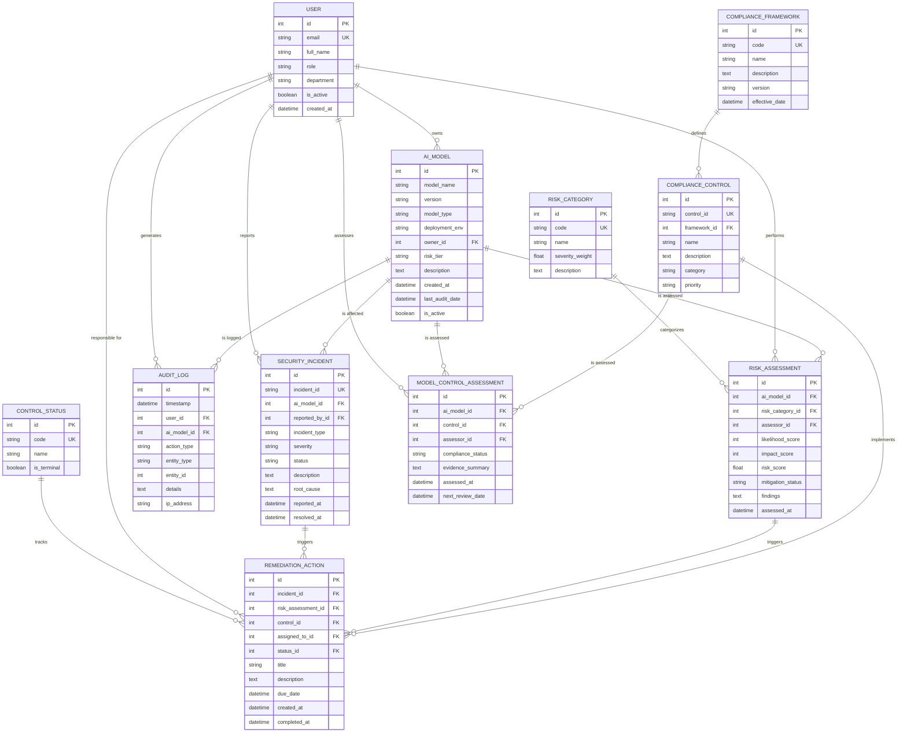

# Cybersecurity — AI Compliance Audit System ER Document

> For business context, industry primer, and glossary, see `01-cybersecurity_ai_compliance_audit_medium_business_context.md`. This document only describes the data.

## Dataset Metadata

- **Complexity Level:** Medium
- **Number of tables:** 11 tables
- **Total records:** ~1,399 rows
- **Relationship types:** Multiple 1:N foreign-key relationships, one M:N bridge table (`model_control_assessment`), with enum tables and nullable foreign keys. Plus two constraints that the schema cannot enforce and are guaranteed by the generator: the `audit_log.(entity_type, entity_id)` polymorphic reference, and the `remediation_action` XOR mutual exclusion between `incident_id` and `risk_assessment_id`.
- **Time anchor (REFERENCE_DATE convention):** This dataset **does not use a fixed REFERENCE_DATE constant**. Instead, all date fields are dynamically computed back from `datetime.now()` at generator runtime (`RANDOM_SEED = 42`). This is done to avoid the dataset "expiring" and losing discriminative power in SQL queries (for example, Query 19 uses `julianday('now')` to compare against historical snapshot dates). The trade-off: each time you rerun the generator, the absolute dates shift uniformly, but the relative offsets to "today" stay consistent. **So please run the SQL queries as soon as possible after generating the data.** See section 6 of the business context document for the business-side interpretation.

---

## Entity Relationship Diagram



---

## Table Definitions

### 1. compliance_framework

**Description:** Compliance framework reference table, storing compliance standards governing AI systems such as NIST AI RMF, GDPR, and HIPAA.

| Column | Type | Constraints | Description |
|------|------|------|------|
| id | INTEGER | PK | Primary key |
| code | VARCHAR(20) | UNIQUE, NOT NULL | Framework short code (e.g., NIST_AI_RMF) |
| name | VARCHAR(100) | NOT NULL | Full framework name |
| description | TEXT | | Detailed description |
| version | VARCHAR(20) | | Framework version |
| effective_date | DATETIME | | Effective date |

**Foreign keys:** None

**Full enumeration (6 rows):**

| id | code | Name |
|----|------|-------|
| 1 | NIST_AI_RMF | NIST AI Risk Management Framework |
| 2 | GDPR | EU General Data Protection Regulation |
| 3 | HIPAA | US Health Insurance Portability and Accountability Act |
| 4 | OWASP_AI | OWASP AI Security Top 10 |
| 5 | ISO_27001 | ISO/IEC 27001 Information Security |
| 6 | SOC2 | SOC 2 Type II Audit Standard |

**Simplification note (known deviation):** In the real world, the same control can map to multiple frameworks at once (e.g., NIST AC-2 also satisfies ISO 27001). At Medium complexity, we simplify `compliance_control.framework_id` to 1:N (each control belongs to only one framework). To model M:N framework mappings, a separate extension would be needed.

---

### 2. risk_category

**Description:** Enumeration table of AI system risk categories, defining each category and its severity weight.

| Column | Type | Constraints | Description |
|------|------|------|------|
| id | INTEGER | PK | Primary key |
| code | VARCHAR(30) | UNIQUE, NOT NULL | Category code |
| name | VARCHAR(100) | NOT NULL | Category name |
| severity_weight | FLOAT | NOT NULL | Risk score weight (0.9-1.8) |
| description | TEXT | | Category description |

**Foreign keys:** None

**Full enumeration (8 rows):**

| id | code | name | severity_weight |
|----|------|------|-----------------|
| 1 | DATA_PRIVACY | Data Privacy Violation | 1.5 |
| 2 | MODEL_BIAS | Algorithmic Bias | 1.3 |
| 3 | ADVERSARIAL | Adversarial Attack | 1.8 |
| 4 | DATA_DRIFT | Data Drift | 1.0 |
| 5 | MODEL_INVERSION | Model Inversion Attack | 1.6 |
| 6 | PROMPT_INJECTION | Prompt Injection | 1.7 |
| 7 | SUPPLY_CHAIN | Supply Chain Vulnerability | 1.4 |
| 8 | EXPLAINABILITY | Lack of Explainability | 0.9 |

---

### 3. control_status

**Description:** Enumeration table of control measure statuses, used to track remediation action progress.

| Column | Type | Constraints | Description |
|------|------|------|------|
| id | INTEGER | PK | Primary key |
| code | VARCHAR(20) | UNIQUE, NOT NULL | Status code |
| name | VARCHAR(50) | NOT NULL | Display name |
| is_terminal | BOOLEAN | DEFAULT FALSE | Whether it is a terminal state |

**Foreign keys:** None

**Full enumeration (5 rows):**

| id | code | name | is_terminal |
|----|------|------|-------------|
| 1 | PENDING | Pending Review | false |
| 2 | IN_PROGRESS | In Progress | false |
| 3 | COMPLETED | Completed | true |
| 4 | DEFERRED | Deferred | false |
| 5 | CANCELLED | Cancelled | true |

---

### 4. user

**Description:** System user table, including auditors, engineers, managers, and other roles.

| Column | Type | Constraints | Description |
|------|------|------|------|
| id | INTEGER | PK | Primary key |
| email | VARCHAR(100) | UNIQUE, NOT NULL | User email |
| full_name | VARCHAR(100) | NOT NULL | Full name |
| role | VARCHAR(50) | NOT NULL | Job role |
| department | VARCHAR(50) | NOT NULL | Department |
| is_active | BOOLEAN | DEFAULT TRUE | Whether active |
| created_at | DATETIME | NOT NULL | Creation time |

**Foreign keys:** None

**Full role enumeration (8 roles):**
- AI Security Engineer (Engineering)
- Compliance Auditor (Compliance)
- Data Scientist (Data Science)
- MLOps Engineer (Engineering)
- Risk Manager (Risk Management)
- Security Analyst (Security)
- Product Manager (Product)
- DevOps Engineer (Engineering)

**Full department enumeration (6 departments):** `Engineering`, `Compliance`, `Data Science`, `Risk Management`, `Security`, `Product`.
(Role → department is an N:1 mapping: Engineering contains 3 roles [AI Security Engineer / MLOps Engineer / DevOps Engineer], the other departments each correspond to 1 role. When Query 7 groups by `department`, there are actually only 6 buckets.)

**Sample data:**

| id | email | full_name | role | department |
|----|-------|-----------|------|------------|
| 1 | john.doe@example.com | John Doe | AI Security Engineer | Engineering |
| 2 | jane.smith@example.com | Jane Smith | Compliance Auditor | Compliance |

---

### 5. ai_model

**Description:** AI/ML model registry, recording all AI models deployed or under development within the organization.

| Column | Type | Constraints | Description |
|------|------|------|------|
| id | INTEGER | PK | Primary key |
| model_name | VARCHAR(100) | NOT NULL | Model name |
| version | VARCHAR(20) | NOT NULL | Semantic version |
| model_type | VARCHAR(50) | NOT NULL | Model type (Classification, LLM, etc.) |
| deployment_env | VARCHAR(30) | NOT NULL | Deployment environment |
| owner_id | INTEGER | FK → user.id | Model owner |
| risk_tier | VARCHAR(20) | NOT NULL | Risk tier |
| description | TEXT | | Model description |
| created_at | DATETIME | NOT NULL | Registration date |
| last_audit_date | DATETIME | | Last audit date |
| is_active | BOOLEAN | DEFAULT TRUE | Whether active |

**Foreign keys:**
- `owner_id` → `user.id`

**deployment_env enumeration:** `production`, `staging`, `development`, `canary` (note all lowercase; SQL comparison must match the case)

**model_type enumeration:** `Classification`, `Regression`, `NLP`, `Computer Vision`, `Recommendation`, `Anomaly Detection`, `LLM`, `Embedding`

**Sample data:**

| id | model_name | version | model_type | risk_tier | deployment_env |
|----|------------|---------|------------|-----------|----------------|
| 1 | FraudDetector_XYZ | v2.1.15 | Classification | HIGH | production |
| 2 | ChatBot_ABC | v1.0.5 | LLM | CRITICAL | staging |

---

### 6. compliance_control

**Description:** Compliance control measures table, mapping to specific control requirements within a framework.

| Column | Type | Constraints | Description |
|------|------|------|------|
| id | INTEGER | PK | Primary key |
| control_id | VARCHAR(30) | UNIQUE, NOT NULL | Control measure ID |
| framework_id | INTEGER | FK → compliance_framework.id | Owning framework |
| name | VARCHAR(200) | NOT NULL | Control measure name |
| description | TEXT | | Detailed description |
| category | VARCHAR(50) | NOT NULL | Category |
| priority | VARCHAR(20) | NOT NULL | Priority |

**Foreign keys:**
- `framework_id` → `compliance_framework.id`

**Full category enumeration (6 categories):**
- Governance
- Data Management
- Model Development
- Deployment
- Monitoring
- Incident Response

**Full priority enumeration (4 levels):** `P1-Critical`, `P2-High`, `P3-Medium`, `P4-Low`

**Sample data:**

| id | control_id | framework_id | name | category | priority |
|----|------------|--------------|------|----------|----------|
| 1 | NIST-GOV-001 | 1 | Implement automated validation for AI model inputs | Governance | P1-Critical |
| 2 | GDPR-DAT-002 | 2 | Establish continuous monitoring for model performance | Data Management | P2-High |

---

### 7. risk_assessment

**Description:** AI model risk assessment record table, capturing the assessment results for each risk type.

| Column | Type | Constraints | Description |
|------|------|------|------|
| id | INTEGER | PK | Primary key |
| ai_model_id | INTEGER | FK → ai_model.id | Assessed model |
| risk_category_id | INTEGER | FK → risk_category.id | Risk category |
| assessor_id | INTEGER | FK → user.id | Assessor |
| likelihood_score | INTEGER | NOT NULL | Likelihood score (1-5) |
| impact_score | INTEGER | NOT NULL | Impact score (1-5) |
| risk_score | FLOAT | NOT NULL | Composite risk score |
| mitigation_status | VARCHAR(30) | NOT NULL | Mitigation status |
| findings | TEXT | | Assessment findings |
| assessed_at | DATETIME | NOT NULL | Assessment date |

**Foreign keys:**
- `ai_model_id` → `ai_model.id`
- `risk_category_id` → `risk_category.id`
- `assessor_id` → `user.id`

**Risk score formula:** `risk_score = likelihood_score * impact_score * severity_weight`

**Full mitigation_status enumeration (5 values):** `NOT_STARTED`, `IN_PROGRESS`, `MITIGATED`, `ACCEPTED`, `TRANSFERRED`

**findings examples:**
- `Model shows elevated risk in edge case handling scenarios requiring attention.`
- `Assessment identified compliance gap related to data preprocessing that needs mitigation.`
- `Review found potential bias patterns affecting inference pipeline components.`
- `Analysis detected vulnerability in access controls requiring control implementation.`

**Sample data:**

| id | ai_model_id | risk_category_id | likelihood_score | impact_score | risk_score | mitigation_status |
|----|-------------|------------------|------------------|--------------|------------|-------------------|
| 1 | 5 | 3 | 4 | 5 | 36.0 | IN_PROGRESS |
| 2 | 12 | 1 | 2 | 3 | 9.0 | MITIGATED |

---

### 8. model_control_assessment

**Description:** Bridge table (M:N) for the model × control compliance assessment. Compliance auditors assess each applicable control for each model and record the conclusion of "is this model compliant on this control", an evidence summary, the assessment time, and the next review date. This is the core action record for AI compliance audit scenarios, making "model-control compliance" a first-class query object.

| Column | Type | Constraints | Description |
|------|------|------|------|
| id | INTEGER | PK | Primary key |
| ai_model_id | INTEGER | FK → ai_model.id, NOT NULL | Assessed model |
| control_id | INTEGER | FK → compliance_control.id, NOT NULL | Assessed control |
| assessor_id | INTEGER | FK → user.id, NOT NULL | Assessor |
| compliance_status | VARCHAR(30) | NOT NULL | Compliance conclusion |
| evidence_summary | TEXT | | Evidence summary (a summary pointing to the evidence chain in a real system) |
| assessed_at | DATETIME | NOT NULL | Assessment time |
| next_review_date | DATETIME | | Scheduled next review time |

**Foreign keys:**
- `ai_model_id` → `ai_model.id`
- `control_id` → `compliance_control.id`
- `assessor_id` → `user.id`

**Uniqueness constraint (guaranteed by the generator, not declared in the schema):** The same `(ai_model_id, control_id)` pair appears at most once per generation run. Real-world systems usually add a UNIQUE(ai_model_id, control_id, assessed_at) composite constraint to support historical assessments; this dataset omits it for simplicity.

**Full compliance_status enumeration (4 values):**
- `COMPLIANT` (compliant, 50%)
- `PARTIALLY_COMPLIANT` (partially compliant, 25%)
- `NON_COMPLIANT` (non-compliant, 15%)
- `NOT_APPLICABLE` (not applicable, 10%)

**Sample data:**

> Warning: the dates below are placeholders at the time this document was authored (conventionally about 3-4 months before "today"). Because the dataset uses a **dynamic time anchor** (the generator's `datetime.now()` at runtime), the actual dates in sqlite shift uniformly with the generation time; the table is for illustrating **field structure and data shape** and does not match the generated sqlite row-for-row.

| id | ai_model_id | control_id | compliance_status | assessed_at | next_review_date |
|----|-------------|------------|-------------------|-------------|------------------|
| 1 | 12 | 35 | COMPLIANT | 2026-03-12 | 2026-09-08 |
| 2 | 7 | 18 | PARTIALLY_COMPLIANT | 2026-02-01 | 2026-08-15 |

---

### 9. audit_log

**Description:** System audit log table, capturing a complete trace of all compliance-related actions.

| Column | Type | Constraints | Description |
|------|------|------|------|
| id | INTEGER | PK | Primary key |
| timestamp | DATETIME | NOT NULL | Action time |
| user_id | INTEGER | FK → user.id | Acting user |
| ai_model_id | INTEGER | FK → ai_model.id, NULLABLE | Associated model |
| action_type | VARCHAR(50) | NOT NULL | Action type |
| entity_type | VARCHAR(50) | NOT NULL | Entity type (polymorphic) |
| entity_id | INTEGER | | Entity ID (polymorphic FK, no schema constraint) |
| details | TEXT | | Action details |
| ip_address | VARCHAR(45) | | Client IP |

**Foreign keys:**
- `user_id` → `user.id`
- `ai_model_id` → `ai_model.id` (nullable)

**Polymorphic (entity_type, entity_id) field notes:** This is a **deliberate polymorphic reference**. `entity_id` has no schema-level FK constraint because different `entity_type` values point to different tables. The generator guarantees that `entity_id` falls within the real id range of the corresponding table (for example, when `entity_type='USER'`, `entity_id ∈ [1, 30]`), making it possible to manually join back to real records by `(entity_type, entity_id)`. `entity_type='REPORT'` is a synthetic type (no corresponding table); it just identifies "export report" actions, with its `entity_id` drawn from a synthetic range of 1-50.

**Full action_type enumeration (11 values):** `CREATE`, `UPDATE`, `DELETE`, `VIEW`, `EXPORT`, `APPROVE`, `REJECT`, `DEPLOY`, `ROLLBACK`, `ASSESS`, `REMEDIATE`

**Full entity_type enumeration (8 values):** `AI_MODEL`, `RISK_ASSESSMENT`, `COMPLIANCE_CONTROL`, `SECURITY_INCIDENT`, `REMEDIATION_ACTION`, `USER`, `MODEL_CONTROL_ASSESSMENT`, `REPORT`

**ip_address note:** The field width VARCHAR(45) is reserved for IPv6 (including the IPv4-mapped form), but the current generator only produces IPv4 strings (`fake.ipv4()`), so all values are ≤ 15 characters long.

**Temporal constraints:** `timestamp` is strictly later than `user.created_at`; if `ai_model_id` is non-null, it is also strictly later than that `ai_model.created_at`.

**Sample data:**

> Warning: the dates below are placeholders at the time this document was authored. Because the dataset uses a **dynamic time anchor** (the generator's `datetime.now()` at runtime), the actual dates in sqlite shift uniformly with the generation time; the table is for illustrating **field structure and data shape** and does not match the generated sqlite row-for-row.

| id | timestamp | user_id | action_type | entity_type | details |
|----|-----------|---------|-------------|-------------|---------|
| 1 | 2026-05-15 10:30:00 | 5 | CREATE | AI_MODEL | User performed create on ai model record |
| 2 | 2026-05-15 14:22:00 | 3 | ASSESS | RISK_ASSESSMENT | Action assess completed for risk assessment entity |

---

### 10. security_incident

**Description:** AI system security incident table, recording attacks, breaches, and other security issues.

| Column | Type | Constraints | Description |
|------|------|------|------|
| id | INTEGER | PK | Primary key |
| incident_id | VARCHAR(30) | UNIQUE, NOT NULL | Incident number (year is taken from reported_at.year) |
| ai_model_id | INTEGER | FK → ai_model.id | Affected model |
| reported_by_id | INTEGER | FK → user.id | Reporter |
| incident_type | VARCHAR(50) | NOT NULL | Incident type |
| severity | VARCHAR(20) | NOT NULL | Severity |
| status | VARCHAR(30) | NOT NULL | Current status |
| description | TEXT | NOT NULL | Incident description |
| root_cause | TEXT | | Root cause analysis (only filled when RESOLVED/CLOSED) |
| reported_at | DATETIME | NOT NULL | Report time |
| resolved_at | DATETIME | | Resolution time |

**Foreign keys:**
- `ai_model_id` → `ai_model.id`
- `reported_by_id` → `user.id`

**Full incident_type enumeration (8 values):**
- ADVERSARIAL_ATTACK
- DATA_BREACH
- PROMPT_INJECTION
- MODEL_THEFT
- UNAUTHORIZED_ACCESS
- DATA_POISONING
- API_ABUSE
- INSIDER_THREAT

**Full status enumeration (5 values):** `OPEN`, `INVESTIGATING`, `CONTAINED`, `RESOLVED`, `CLOSED`

**incident_id format:** `INC-{YYYY}-{NNNN}`, where `YYYY` is taken from `reported_at.year` (no longer hardcoded as 2023).

**Sample data:**

| id | incident_id | ai_model_id | incident_type | severity | status |
|----|-------------|-------------|---------------|----------|--------|
| 1 | INC-2026-0001 | 12 | PROMPT_INJECTION | HIGH | INVESTIGATING |
| 2 | INC-2026-0002 | 5 | ADVERSARIAL_ATTACK | CRITICAL | RESOLVED |

---

### 11. remediation_action

**Description:** Remediation action table, used to track corrective measures for security incidents or risk findings.

| Column | Type | Constraints | Description |
|------|------|------|------|
| id | INTEGER | PK | Primary key |
| incident_id | INTEGER | FK → security_incident.id, NULLABLE | Associated incident |
| risk_assessment_id | INTEGER | FK → risk_assessment.id, NULLABLE | Associated assessment |
| control_id | INTEGER | FK → compliance_control.id | Control measure being implemented |
| assigned_to_id | INTEGER | FK → user.id | Assignee |
| status_id | INTEGER | FK → control_status.id | Current status |
| title | VARCHAR(200) | NOT NULL | Action title |
| description | TEXT | | Action details |
| due_date | DATETIME | NOT NULL | Due date |
| created_at | DATETIME | NOT NULL | Created time |
| completed_at | DATETIME | | Completion time |

**Foreign keys:**
- `incident_id` → `security_incident.id` (nullable)
- `risk_assessment_id` → `risk_assessment.id` (nullable)
- `control_id` → `compliance_control.id`
- `assigned_to_id` → `user.id`
- `status_id` → `control_status.id`

**Strict mutual exclusion rule:** `incident_id` and `risk_assessment_id` have **exactly one** non-null value (XOR). That is, each remediation action must be associated with one upstream (incident or risk assessment) and only one — neither both null nor both non-null.

**Sample data:**

| id | incident_id | risk_assessment_id | control_id | title | status_id |
|----|-------------|-------------------|------------|-------|-----------|
| 1 | 5 | NULL | 12 | Implement input validation to address identified vulnerability | 2 |
| 2 | NULL | 23 | 8 | Configure automated scanning monitoring for early detection | 3 |

---

## Data Generation Rules

### Business Logic Constraints

1. **Risk score calculation:** `risk_score = likelihood_score * impact_score * severity_weight`
2. **Temporal ordering:**
   - `reported_at < resolved_at` (for resolved incidents)
   - `ai_model.created_at > owner.created_at`
   - `risk_assessment.assessed_at > ai_model.created_at`
   - `model_control_assessment.assessed_at > ai_model.created_at`
   - `security_incident.reported_at > ai_model.created_at`
   - `audit_log.timestamp > user.created_at` (acting user already exists)
   - `audit_log.timestamp > ai_model.created_at` (if a model is referenced)
3. **Completion logic:** `completed_at` is set only when `status_id = 3` (COMPLETED).
4. **Mutual exclusion (XOR):** `remediation_action.incident_id` and `risk_assessment_id` have exactly one non-null value.
5. **Foreign key integrity:** All foreign keys must reference valid parent records.
6. **Polymorphic field entity_id:** Coordinated with `entity_type`, falls within the target table's id range (no schema-level FK constraint).
7. **incident_id year:** Derived from `reported_at.year`, so incidents that span across years automatically get the correct year prefix.

### Distribution Rules

| Field | Distribution |
|------|------|
| ai_model.risk_tier | Weighted: HIGH(30%), MEDIUM(35%), LOW(25%), CRITICAL(10%) |
| security_incident.severity | Weighted: CRITICAL(10%), HIGH(25%), MEDIUM(40%), LOW(25%) |
| ai_model.is_active | 85% true, 15% false |
| user.is_active | 90% true, 10% false |
| risk_assessment.mitigation_status | Uniform across 5 statuses (NOT_STARTED / IN_PROGRESS / MITIGATED / ACCEPTED / TRANSFERRED) |
| model_control_assessment.compliance_status | Weighted: COMPLIANT(50%), PARTIALLY_COMPLIANT(25%), NON_COMPLIANT(15%), NOT_APPLICABLE(10%) |
| ai_model.last_audit_date | 20% NULL (never audited) + among audited models, those of age ≥ 220 days have a 50% chance of being marked stale (> 180 days ago), the rest are recent (≤ 180 days) |
| security_incident.status | Uniform across 5 statuses (accepted as a simplification; in practice RESOLVED+CLOSED usually account for 60-80%) |
| audit_log.ai_model_id | 70% non-null, 30% unrelated to a specific model |
| remediation_action.incident_id vs risk_assessment_id | 60% linked to an incident, 40% linked to a risk assessment |

### Embedded Business Traps

The table below lists distribution and semantic traps that the generator **deliberately creates and that specific SQL queries are responsible for exposing**. Each row provides a name, the expected magnitude (under `RANDOM_SEED=42`, with ±5% jitter on reruns), and the corresponding query. The "expected results" in the SQL document should be consistent with these magnitudes.

| Trap | Expected magnitude | Business meaning | Exposing query |
|------|---------|---------|---------|
| **High-risk model share** | HIGH+CRITICAL ≈ 30–40% (weighted target 40%) | Overall risk exposure the board cares about | Q1, Q17, Q20 |
| **Q19 audit coverage gap discriminative power** | Audit-needed model hit rate ≈ 20–30% (about 20% never audited + about 10% stale) | `last_audit_date` is deliberately left 20% NULL + older models get 50% chance of being stale, to ensure Query 19 doesn't hit 100% or 0% | Q19 |
| **NOT_APPLICABLE denominator trap** | NOT_APPLICABLE ≈ 9–10% of MCA | Counting "not applicable" in the compliance-rate denominator artificially depresses the rate; Q14 uses `applicable_assessments` to exclude it | Q14 |
| **Compliance rate by framework** | Compliance Rate ≈ 45–65% | Reflects "lots of problems found vs. healthy remediation"; deliberately not near 100% | Q14 |
| **Remediation completion rate** | COMPLETED ≈ 18–20% | Completed share under near-uniform distribution over 5 statuses, an operational KPI | Q5, Q18 |
| **Share of RESOLVED+CLOSED incidents** | ≈ 40% (2/5 under uniform distribution over 5 statuses) | Determines how many samples MTTR can be computed over, accepted as a simplification | Q8 |
| **Q11 row-inflation semantic trap** | Using `SUM(CASE)` would be multiplied by the number of assessment rows | Classic pitfall when LEFT JOIN-ing the one-to-many `risk_assessment` and aggregating; must be fixed with `COUNT(DISTINCT CASE … THEN am.id END)` | Q11 |
| **Mutual exclusion violations** | 0 | The XOR between incident_id and risk_assessment_id on `remediation_action` is strictly enforced | — |
| **Temporal violations** | 0 | Cross-table derived-time hard constraints (see "Temporal ordering" above) | — |

> **Note on discriminative drift over time:** The Q19 hit rate above depends on the dynamic time anchor. If the data hasn't been regenerated for 6+ months after generation, all `last_audit_date` values will become stale, and the hit rate will drift toward 100%, losing discriminative power. The dynamic anchor is used precisely to avoid this issue, but the magnitudes above can only be preserved if you **query immediately after generation**.

### Faker Generation Strategy

| Field pattern | Faker method / strategy |
|----------|------------------|
| email | `fake.unique.email()` |
| full_name | `fake.name()` |
| ip_address | `fake.ipv4()` (IPv4 only; field width VARCHAR(45) is reserved for IPv6) |
| description | `fake.paragraph(nb_sentences=2)` |
| findings | Templated random combination (see findings examples above) |
| evidence_summary | Templated random combination (method × artifact) |
| model_name | Prefix + `fake.lexify('???').upper()` |

---

## File List

| # | Filename | Table name | Rows | Dependencies |
|------|--------|------|------|------|
| 01 | 01_compliance_framework.tsv | compliance_framework | 6 | None |
| 02 | 02_risk_category.tsv | risk_category | 8 | None |
| 03 | 03_control_status.tsv | control_status | 5 | None |
| 04 | 04_user.tsv | user | 30 | None |
| 05 | 05_ai_model.tsv | ai_model | 50 | user |
| 06 | 06_compliance_control.tsv | compliance_control | 100 | compliance_framework |
| 07 | 07_risk_assessment.tsv | risk_assessment | 200 | ai_model, risk_category, user |
| 08 | 08_model_control_assessment.tsv | model_control_assessment | 300 | ai_model, compliance_control, user |
| 09 | 09_audit_log.tsv | audit_log | 500 | user, ai_model |
| 10 | 10_security_incident.tsv | security_incident | 80 | ai_model, user |
| 11 | 11_remediation_action.tsv | remediation_action | 120 | security_incident, risk_assessment, compliance_control, user, control_status |

**Total records:** ~1,399 rows

### TSV File Contract

If you bypass SQLite and consume the TSV files directly (for example, importing into another database or reading with polars/pandas), be aware of the following implicit conventions (determined by `polars.DataFrame.write_csv(..., separator="\t")` in the generator):

| Dimension | Convention |
|------|------|
| Encoding | UTF-8 (no BOM) |
| Field separator | tab (`\t`) |
| Row separator | LF (`\n`) |
| Header | First row; column names match the table definitions in this ER document |
| NULL representation | Empty string (e.g., a field with `nullable=True` is written as empty when missing) |
| Boolean type | Strings `true` / `false` (lowercase) |
| Datetime | ISO 8601 string, e.g., `2026-06-20T15:30:00` (precision to the second) |
| Floats | Plain decimal strings (e.g., `36.0`, no scientific notation) |
| Load order | Strictly the topological order implied by file prefixes 01..11, otherwise FK constraints will fail |

Downstream consumers need to treat empty strings as NULL themselves (the generator does the same conversion when loading into SQLite).

---

## Database Schema (SQLite DDL)

```sql
-- Auto-generated DDL for reference
CREATE TABLE compliance_framework (
    id INTEGER PRIMARY KEY,
    code VARCHAR(20) UNIQUE NOT NULL,
    name VARCHAR(100) NOT NULL,
    description TEXT,
    version VARCHAR(20),
    effective_date DATETIME
);

CREATE TABLE risk_category (
    id INTEGER PRIMARY KEY,
    code VARCHAR(30) UNIQUE NOT NULL,
    name VARCHAR(100) NOT NULL,
    severity_weight FLOAT NOT NULL,
    description TEXT
);

CREATE TABLE control_status (
    id INTEGER PRIMARY KEY,
    code VARCHAR(20) UNIQUE NOT NULL,
    name VARCHAR(50) NOT NULL,
    is_terminal BOOLEAN DEFAULT FALSE
);

CREATE TABLE user (
    id INTEGER PRIMARY KEY,
    email VARCHAR(100) UNIQUE NOT NULL,
    full_name VARCHAR(100) NOT NULL,
    role VARCHAR(50) NOT NULL,
    department VARCHAR(50) NOT NULL,
    is_active BOOLEAN DEFAULT TRUE,
    created_at DATETIME NOT NULL
);

CREATE TABLE ai_model (
    id INTEGER PRIMARY KEY,
    model_name VARCHAR(100) NOT NULL,
    version VARCHAR(20) NOT NULL,
    model_type VARCHAR(50) NOT NULL,
    deployment_env VARCHAR(30) NOT NULL,
    owner_id INTEGER NOT NULL REFERENCES user(id),
    risk_tier VARCHAR(20) NOT NULL,
    description TEXT,
    created_at DATETIME NOT NULL,
    last_audit_date DATETIME,
    is_active BOOLEAN DEFAULT TRUE
);

CREATE TABLE compliance_control (
    id INTEGER PRIMARY KEY,
    control_id VARCHAR(30) UNIQUE NOT NULL,
    framework_id INTEGER NOT NULL REFERENCES compliance_framework(id),
    name VARCHAR(200) NOT NULL,
    description TEXT,
    category VARCHAR(50) NOT NULL,
    priority VARCHAR(20) NOT NULL
);

CREATE TABLE risk_assessment (
    id INTEGER PRIMARY KEY,
    ai_model_id INTEGER NOT NULL REFERENCES ai_model(id),
    risk_category_id INTEGER NOT NULL REFERENCES risk_category(id),
    assessor_id INTEGER NOT NULL REFERENCES user(id),
    likelihood_score INTEGER NOT NULL,
    impact_score INTEGER NOT NULL,
    risk_score FLOAT NOT NULL,
    mitigation_status VARCHAR(30) NOT NULL,
    findings TEXT,
    assessed_at DATETIME NOT NULL
);

CREATE TABLE model_control_assessment (
    id INTEGER PRIMARY KEY,
    ai_model_id INTEGER NOT NULL REFERENCES ai_model(id),
    control_id INTEGER NOT NULL REFERENCES compliance_control(id),
    assessor_id INTEGER NOT NULL REFERENCES user(id),
    compliance_status VARCHAR(30) NOT NULL,
    evidence_summary TEXT,
    assessed_at DATETIME NOT NULL,
    next_review_date DATETIME
);

CREATE TABLE audit_log (
    id INTEGER PRIMARY KEY,
    timestamp DATETIME NOT NULL,
    user_id INTEGER NOT NULL REFERENCES user(id),
    ai_model_id INTEGER REFERENCES ai_model(id),
    action_type VARCHAR(50) NOT NULL,
    entity_type VARCHAR(50) NOT NULL,
    entity_id INTEGER,
    details TEXT,
    ip_address VARCHAR(45)
);

CREATE TABLE security_incident (
    id INTEGER PRIMARY KEY,
    incident_id VARCHAR(30) UNIQUE NOT NULL,
    ai_model_id INTEGER NOT NULL REFERENCES ai_model(id),
    reported_by_id INTEGER NOT NULL REFERENCES user(id),
    incident_type VARCHAR(50) NOT NULL,
    severity VARCHAR(20) NOT NULL,
    status VARCHAR(30) NOT NULL,
    description TEXT NOT NULL,
    root_cause TEXT,
    reported_at DATETIME NOT NULL,
    resolved_at DATETIME
);

CREATE TABLE remediation_action (
    id INTEGER PRIMARY KEY,
    incident_id INTEGER REFERENCES security_incident(id),
    risk_assessment_id INTEGER REFERENCES risk_assessment(id),
    control_id INTEGER NOT NULL REFERENCES compliance_control(id),
    assigned_to_id INTEGER NOT NULL REFERENCES user(id),
    status_id INTEGER NOT NULL REFERENCES control_status(id),
    title VARCHAR(200) NOT NULL,
    description TEXT,
    due_date DATETIME NOT NULL,
    created_at DATETIME NOT NULL,
    completed_at DATETIME
);
```

---

## Known Simplifications (Trade-offs at Medium Complexity)

To stay within the Medium-complexity envelope, the following entities are not modeled, listed here for reference in a future High-complexity version:

- **Evidence / attachment entity**: Currently the `model_control_assessment.evidence_summary` text field carries the evidence summary. Real systems usually have a separate table to store files, URLs, uploader, hash, etc.
- **training_dataset / model_artifact**: Training dataset and model artifact lineage (required by parts of NIST AI RMF).
- **data_subject / consent**: Data subject and consent records for GDPR/HIPAA.
- **organization / team hierarchy**: Currently we only have the user.department string with no hierarchy.
- **One control mapping to multiple frameworks (M:N)**: Currently `compliance_control.framework_id` is simplified to 1:N.
