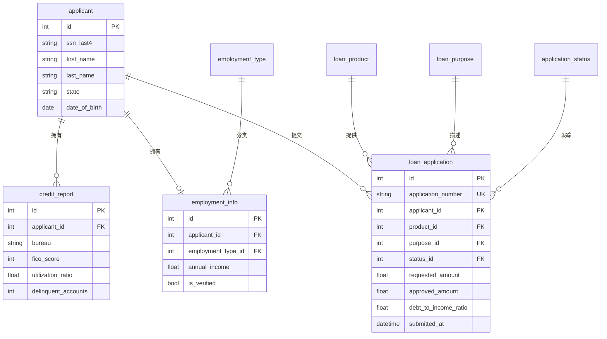
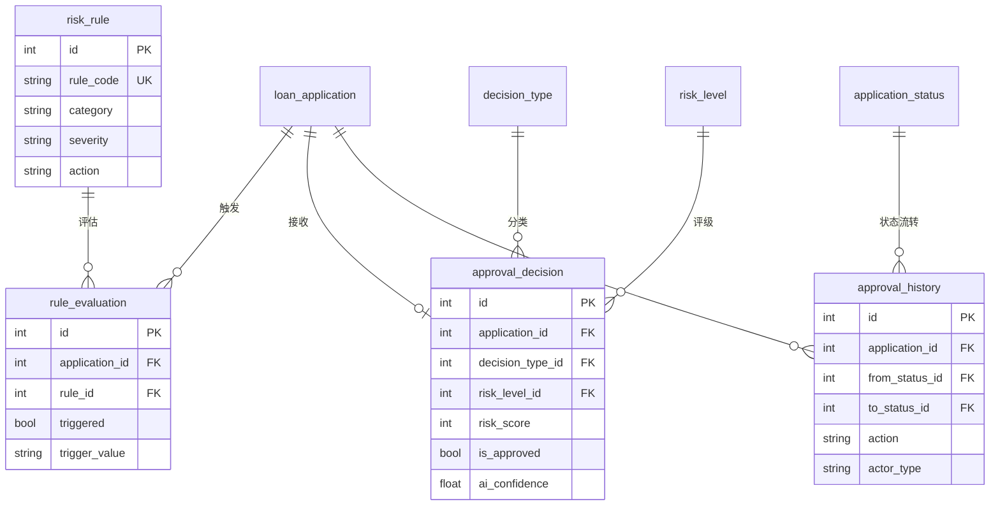
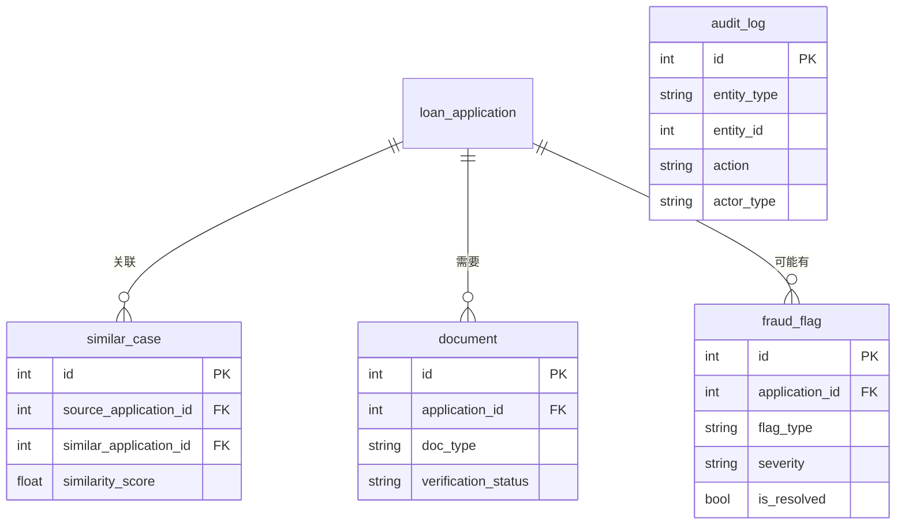

# Northpeak Lending 智能信贷审批助手数据模型

业务背景, 行业科普, 术语表请见 `01-digital_lending_credit_approval_assistant_high_business_context-cn.md`. 本文档只描述数据。

这份文档是 schema、Python 生成器和 SQL 查询三者之间的契约。读过业务背景后，你应该能从这里看清有哪些表、它们怎么连接、每个字段是什么业务含义、哪些字段是算出来的，以及哪些分布是被刻意安排或简化过的。如果业务背景回答的是"为什么"，这份 ER 文档回答的是"是什么"。

---

## 1. 数据集元数据

| 项目 | 值 |
|------|----|
| 复杂度级别 | High |
| 表数量 | 18 |
| 总行数 | 约 18,000 到 20,000 行 |
| 外键关系数 | 约 16 个（含两条指向同一父表的自关联） |
| 时间锚点 | 相对时间，以生成时的"当下"向前回溯约 18 个月 |

关于时间锚点要点说明：本数据集没有固定的 `REFERENCE_DATE` 常量。生成器用相对时间（`date_time_between(start_date="-18m", end_date="now")` 一类），SQL 查询里用 `DATE('now')` 取动态当前日期。把"now"理解成"数据生成 / 查询执行的那一天"即可。这样数据永远新鲜，代价是跨天重跑不完全可复现。

有一条 DDL 无法强制、但分析时必须尊重的作用域规则：`approval_history` 的 `from_status_id` 和 `to_status_id` 都指向 `application_status.id`，是同一张父表的两个外键；`similar_case` 的 `source_application_id` 和 `similar_application_id` 也都指向 `loan_application.id`。这类自引用关系在 JOIN 时要分清别名，别把两端搞混。

---

## 2. 实体关系图

18 张表分三个域来看：申请人与申请、审批与风控、扩展与辅助。三张子图共享核心表 `loan_application`。

申请人与申请域：



审批与风控域：



扩展与辅助域：



`audit_log` 不通过外键关联，而是用 `entity_type` 加 `entity_id` 软引用各类实体，所以单独画在辅助域里。

---

## 3. 枚举与维度表

这五张加产品、规则两张共七张表是系统的"字典"，行数少、几乎不变，给业务表提供可读的分类。

### 1. application_status（申请状态）

每一行是贷款申请生命周期中的一个状态。运营和高管看漏斗、算批准率都靠它把申请分档。

| 列名 | 类型 | 约束 | 描述 |
|------|------|------|------|
| id | INTEGER | PK | 主键 |
| code | VARCHAR(20) | UNIQUE, NOT NULL | 状态代码（PENDING, IN_REVIEW, APPROVED 等） |
| name | VARCHAR(50) | NOT NULL | 可读的状态名称 |
| description | TEXT | | 状态含义的详细描述 |

样例数据：

| id | code | name | description |
|----|------|------|-------------|
| 1 | PENDING | 待审核 | 申请已提交，等待初审 |
| 2 | IN_REVIEW | 审核中 | 申请正在被审批员审核 |
| 3 | APPROVED | 已批准 | 申请已批准，等待放款 |
| 4 | DECLINED | 已拒绝 | 申请被拒绝 |

完整集合还包括 5 CANCELLED（已取消）、6 FUNDED（已放款）、7 EXPIRED（已过期）。

### 2. employment_type（雇佣类型）

申请人的就业状态分类，是收入评估的基础。全职和自雇的收入稳定性差别很大，风控会区别对待。

| 列名 | 类型 | 约束 | 描述 |
|------|------|------|------|
| id | INTEGER | PK | 主键 |
| code | VARCHAR(20) | UNIQUE, NOT NULL | 雇佣类型代码 |
| name | VARCHAR(50) | NOT NULL | 雇佣类型名称 |

样例数据：

| id | code | name |
|----|------|------|
| 1 | FULL_TIME | 全职员工 |
| 3 | SELF_EMPLOYED | 自雇 |
| 5 | RETIRED | 退休 |

完整集合共 7 种：另有 PART_TIME、CONTRACTOR、UNEMPLOYED、STUDENT。

### 3. loan_purpose（贷款用途）

借款拿去干什么，用于产品匹配和合规分类。用途和产品要逻辑自洽，比如房贷只能配购房或再融资。

| 列名 | 类型 | 约束 | 描述 |
|------|------|------|------|
| id | INTEGER | PK | 主键 |
| code | VARCHAR(30) | UNIQUE, NOT NULL | 用途代码 |
| name | VARCHAR(100) | NOT NULL | 用途名称 |
| description | TEXT | | 详细说明 |

样例数据：

| id | code | name | description |
|----|------|------|-------------|
| 1 | HOME_PURCHASE | 购房 | 购买自住房产 |
| 5 | DEBT_CONSOLIDATION | 债务整合 | 整合多笔债务 |

完整集合共 11 种，覆盖购房、再融资、购车、车贷再融资、信用卡还清、家装、医疗、教育、小微企业、其他。

### 4. decision_type（决策类型）

审批是机器自动做的还是人工做的，批还是拒。`is_auto` 字段把"机审 vs 人审"标出来，是衡量自动化率的关键。

| 列名 | 类型 | 约束 | 描述 |
|------|------|------|------|
| id | INTEGER | PK | 主键 |
| code | VARCHAR(30) | UNIQUE, NOT NULL | 决策类型代码 |
| name | VARCHAR(50) | NOT NULL | 决策类型名称 |
| is_auto | BOOLEAN | NOT NULL | 是否为自动决策 |

样例数据：

| id | code | name | is_auto |
|----|------|------|---------|
| 1 | AUTO_APPROVE | 自动批准 | true |
| 3 | MANUAL_APPROVE | 人工批准 | false |

完整集合共 5 种：另有 AUTO_DECLINE、MANUAL_DECLINE、REFERRED（转人工复核）。

### 5. risk_level（风险等级）

把内部风险评分（0 到 1000）分成五档，从极低到极高，方便业务侧快速判断一笔申请有多危险。

| 列名 | 类型 | 约束 | 描述 |
|------|------|------|------|
| id | INTEGER | PK | 主键 |
| code | VARCHAR(20) | UNIQUE, NOT NULL | 风险等级代码 |
| name | VARCHAR(50) | NOT NULL | 风险等级名称 |
| score_min | INTEGER | NOT NULL | 该等级的最低分 |
| score_max | INTEGER | NOT NULL | 该等级的最高分 |
| color | VARCHAR(20) | | UI 显示颜色 |

样例数据：

| id | code | name | score_min | score_max | color |
|----|------|------|-----------|-----------|-------|
| 1 | VERY_LOW | 极低风险 | 0 | 200 | green |
| 4 | HIGH | 高风险 | 601 | 800 | orange |

完整集合共 5 档：VERY_LOW、LOW、MEDIUM、HIGH、VERY_HIGH。

### 6. loan_product（贷款产品）

公司在售的贷款产品及其条款和准入门槛。每款产品有自己的金额区间、期限区间、基准利率和最低信用分要求，是申请金额校验和定价的基线。

| 列名 | 类型 | 约束 | 描述 |
|------|------|------|------|
| id | INTEGER | PK | 主键 |
| code | VARCHAR(20) | UNIQUE, NOT NULL | 产品代码 |
| name | VARCHAR(100) | NOT NULL | 产品名称 |
| description | TEXT | | 产品描述 |
| min_amount | FLOAT | NOT NULL | 最低贷款金额 |
| max_amount | FLOAT | NOT NULL | 最高贷款金额 |
| min_term_months | INTEGER | NOT NULL | 最短贷款期限 |
| max_term_months | INTEGER | NOT NULL | 最长贷款期限 |
| base_interest_rate | FLOAT | NOT NULL | 基准年利率（%） |
| min_credit_score | INTEGER | NOT NULL | 最低 FICO 信用分要求 |
| is_active | BOOLEAN | DEFAULT true | 产品是否在售 |
| created_at | DATETIME | | 产品创建时间 |

样例数据：

| id | code | name | min_amount | max_amount | base_interest_rate | min_credit_score |
|----|------|------|------------|------------|-------------------|------------------|
| 1 | MORTGAGE_30Y | 30年固定利率房贷 | 50000 | 2000000 | 6.5 | 620 |
| 5 | PERSONAL | 个人贷款 | 1000 | 50000 | 9.99 | 640 |

完整集合共 8 款：两款房贷、两款车贷、两款个人贷（普通和优质）、HELOC、债务整合贷。

### 7. risk_rule（风控规则库）

自动审批用的风控规则。每条规则有类别（信用 / 收入 / 欺诈 / 合规）、严重程度（提示 / 警告 / 硬性拒绝）和触发动作（标记 / 减额 / 拒绝）。这是 AI 助手做自动决策的依据。

| 列名 | 类型 | 约束 | 描述 |
|------|------|------|------|
| id | INTEGER | PK | 主键 |
| rule_code | VARCHAR(30) | UNIQUE, NOT NULL | 规则标识符 |
| name | VARCHAR(200) | NOT NULL | 规则名称 |
| description | TEXT | | 规则说明 |
| category | VARCHAR(50) | | 规则类别（credit / income / fraud / compliance） |
| severity | VARCHAR(20) | | 规则严重程度（info / warning / hard_stop） |
| condition_sql | TEXT | | 类 SQL 条件表达式 |
| action | VARCHAR(50) | | 触发时的动作（flag / reduce_amount / reject） |
| is_active | BOOLEAN | DEFAULT true | 规则是否启用 |
| version | INTEGER | DEFAULT 1 | 规则版本号 |
| created_at | DATETIME | | 规则创建时间 |
| updated_at | DATETIME | | 最后更新时间 |

样例数据：

| id | rule_code | name | category | severity | action |
|----|-----------|------|----------|----------|--------|
| 1 | CREDIT_SCORE_MIN | 最低信用分检查 | credit | hard_stop | reject |
| 6 | DTI_MAX | 最高债务收入比 | income | hard_stop | reject |
| 10 | VELOCITY_CHECK | 申请频率检查 | fraud | warning | flag |

完整集合共 16 条，覆盖信用类 5 条、收入类 4 条、欺诈类 4 条、合规类 3 条。

---

## 4. 申请人与申请

这一组表记录"谁在借钱"和"借什么"，是整个数据集的主干。

### 8. applicant（申请人）

每一行是一个曾向 Northpeak 提交过贷款申请的个人，包含承保需要的身份和地址信息。出于隐私只存 SSN 后 4 位。营销和合规看地理分布、年龄结构时从这里取数。

| 列名 | 类型 | 约束 | 描述 |
|------|------|------|------|
| id | INTEGER | PK | 主键 |
| ssn_last4 | VARCHAR(4) | NOT NULL | SSN 后 4 位 |
| first_name | VARCHAR(50) | NOT NULL | 名 |
| last_name | VARCHAR(50) | NOT NULL | 姓 |
| email | VARCHAR(255) | NOT NULL | 电子邮箱 |
| phone | VARCHAR(20) | | 电话号码 |
| date_of_birth | DATE | NOT NULL | 出生日期 |
| address_line1 | VARCHAR(255) | | 街道地址 |
| address_line2 | VARCHAR(255) | | 公寓 / 套房 |
| city | VARCHAR(100) | | 城市 |
| state | VARCHAR(2) | | 美国州代码 |
| zip_code | VARCHAR(10) | | 邮政编码 |
| created_at | DATETIME | | 记录创建时间 |

外键：无。

样例数据：

| id | first_name | last_name | email | state | date_of_birth |
|----|------------|-----------|-------|-------|---------------|
| 1 | John | Smith | jsmith@email.com | CA | 1985-03-15 |
| 2 | Sarah | Johnson | sjohnson@email.com | TX | 1990-07-22 |

### 9. credit_report（信用报告）

从征信机构拉来的信用报告，含 FICO 分和信用历史细节。一个申请人因为 tri-merge 可能有来自 Experian、Equifax、TransUnion 的 1 到 3 份报告，分数略有差异。承保和风控规则的大量输入都来自这张表。

| 列名 | 类型 | 约束 | 描述 |
|------|------|------|------|
| id | INTEGER | PK | 主键 |
| applicant_id | INTEGER | FK → applicant.id, NOT NULL | 关联的申请人 |
| bureau | VARCHAR(20) | NOT NULL | 征信机构（Experian / Equifax / TransUnion） |
| fico_score | INTEGER | NOT NULL | FICO 信用分（300 到 850） |
| total_accounts | INTEGER | | 信用账户总数 |
| open_accounts | INTEGER | | 当前开放账户数 |
| total_balance | FLOAT | | 未偿还余额总额 |
| total_credit_limit | FLOAT | | 可用信用总额 |
| utilization_ratio | FLOAT | | 信用利用率（0 到 100%） |
| delinquent_accounts | INTEGER | | 逾期账户数 |
| public_records | INTEGER | | 破产、判决等公共记录 |
| inquiries_last_6mo | INTEGER | | 近 6 个月信用查询次数 |
| oldest_account_age_months | INTEGER | | 最老账户年龄 |
| report_date | DATETIME | NOT NULL | 报告获取时间 |
| raw_data | TEXT | | 原始 JSON 响应 |

外键：`applicant_id` → `applicant.id`。

样例数据：

| id | applicant_id | bureau | fico_score | utilization_ratio | delinquent_accounts |
|----|--------------|--------|------------|-------------------|---------------------|
| 1 | 1 | Experian | 742 | 23.5 | 0 |
| 2 | 1 | Equifax | 738 | 24.1 | 0 |
| 3 | 2 | TransUnion | 651 | 67.2 | 1 |

### 10. employment_info（就业信息）

申请人的就业和收入信息，每个申请人一条。`is_verified` 标记收入是否已用工资单或税表核实，是合规和 DTI 计算的关键。

| 列名 | 类型 | 约束 | 描述 |
|------|------|------|------|
| id | INTEGER | PK | 主键 |
| applicant_id | INTEGER | FK → applicant.id, NOT NULL | 关联的申请人 |
| employment_type_id | INTEGER | FK → employment_type.id, NOT NULL | 雇佣类型 |
| employer_name | VARCHAR(200) | | 当前雇主 |
| job_title | VARCHAR(100) | | 职位 |
| annual_income | FLOAT | NOT NULL | 申报年收入 |
| monthly_income | FLOAT | NOT NULL | 月收入（年收入 / 12） |
| employment_start_date | DATE | | 当前雇主入职日期 |
| is_verified | BOOLEAN | DEFAULT false | 收入是否已验证 |
| verification_date | DATETIME | | 验证时间 |
| verification_method | VARCHAR(50) | | 验证方式 |

外键：`applicant_id` → `applicant.id`，`employment_type_id` → `employment_type.id`。

样例数据：

| id | applicant_id | employer_name | annual_income | is_verified | verification_method |
|----|--------------|---------------|---------------|-------------|---------------------|
| 1 | 1 | Google LLC | 185000.00 | true | paystub |
| 2 | 2 | 自雇 | 72000.00 | true | tax_return |

### 11. loan_application（贷款申请）

整个数据集的核心事实表，每一行是一笔贷款申请，串起申请人、产品、用途、状态，记录申请金额、批准金额、利率、月供、DTI、渠道和各阶段时间戳。几乎所有业务分析都从这张表出发。

| 列名 | 类型 | 约束 | 描述 |
|------|------|------|------|
| id | INTEGER | PK | 主键 |
| application_number | VARCHAR(20) | UNIQUE, NOT NULL | 唯一申请编号 |
| applicant_id | INTEGER | FK → applicant.id, NOT NULL | 申请人 |
| product_id | INTEGER | FK → loan_product.id, NOT NULL | 贷款产品 |
| purpose_id | INTEGER | FK → loan_purpose.id, NOT NULL | 贷款用途 |
| status_id | INTEGER | FK → application_status.id, NOT NULL | 当前状态 |
| requested_amount | FLOAT | NOT NULL | 申请金额 |
| requested_term_months | INTEGER | NOT NULL | 申请期限 |
| approved_amount | FLOAT | | 最终批准金额 |
| approved_term_months | INTEGER | | 最终批准期限 |
| approved_interest_rate | FLOAT | | 最终年利率 |
| monthly_payment | FLOAT | | 计算的月还款额 |
| debt_to_income_ratio | FLOAT | | 债务收入比（%） |
| channel | VARCHAR(20) | | 申请渠道（web / mobile / branch / partner） |
| ip_address | VARCHAR(45) | | 申请 IP 地址 |
| device_fingerprint | VARCHAR(100) | | 设备标识 |
| submitted_at | DATETIME | NOT NULL | 提交时间 |
| decision_at | DATETIME | | 决策时间 |
| funded_at | DATETIME | | 放款时间 |
| created_at | DATETIME | | 记录创建时间 |

外键：`applicant_id` → `applicant.id`，`product_id` → `loan_product.id`，`purpose_id` → `loan_purpose.id`，`status_id` → `application_status.id`。

样例数据：

| id | application_number | applicant_id | product_id | requested_amount | status_id | channel |
|----|--------------------|--------------|------------|------------------|-----------|---------|
| 1 | APP20240101000001 | 1 | 5 | 25000.00 | 3 | web |
| 2 | APP20240115000002 | 2 | 3 | 35000.00 | 4 | mobile |

---

## 5. 审批与风控

这一组表记录"申请是怎么被评估和决策的"。

### 12. rule_evaluation（规则评估）

每笔申请会被风控规则库里的若干条规则逐一评估，每条评估结果一行。`triggered` 标记这条规则有没有命中。这是规则触发频率分析和规则有效性分析的数据来源。

| 列名 | 类型 | 约束 | 描述 |
|------|------|------|------|
| id | INTEGER | PK | 主键 |
| application_id | INTEGER | FK → loan_application.id, NOT NULL | 被评估的申请 |
| rule_id | INTEGER | FK → risk_rule.id, NOT NULL | 被评估的规则 |
| triggered | BOOLEAN | NOT NULL | 是否满足规则条件 |
| trigger_value | VARCHAR(255) | | 触发规则的实际值 |
| threshold_value | VARCHAR(255) | | 规则阈值 |
| evaluated_at | DATETIME | NOT NULL | 评估时间 |

外键：`application_id` → `loan_application.id`，`rule_id` → `risk_rule.id`。

样例数据：

| id | application_id | rule_id | triggered | trigger_value | threshold_value |
|----|----------------|---------|-----------|---------------|-----------------|
| 1 | 1 | 1 | false | 742 | 640 |
| 2 | 2 | 6 | true | 47.2 | 43.0 |

### 13. approval_decision（审批决策）

每笔申请的最终审批结论，含 AI 给的风险评分、风险等级、置信度和建议文本，以及是机审还是人审、人审的话审批员是谁。`is_approved` 是最终批 / 拒。

| 列名 | 类型 | 约束 | 描述 |
|------|------|------|------|
| id | INTEGER | PK | 主键 |
| application_id | INTEGER | FK → loan_application.id, NOT NULL | 申请 |
| decision_type_id | INTEGER | FK → decision_type.id, NOT NULL | 自动 vs 人工 |
| risk_level_id | INTEGER | FK → risk_level.id, NOT NULL | 风险分类 |
| risk_score | INTEGER | | 计算的风险分（0 到 1000） |
| is_approved | BOOLEAN | NOT NULL | 最终决策 |
| decision_reason | TEXT | | 决策说明 |
| decline_codes | VARCHAR(255) | | 逗号分隔的拒绝原因代码 |
| reviewer_id | VARCHAR(50) | | 人工审批员（如为人工） |
| ai_recommendation | TEXT | | AI Agent 的建议文本 |
| ai_confidence | FLOAT | | AI 置信度（0 到 1） |
| decision_at | DATETIME | NOT NULL | 决策时间 |

外键：`application_id` → `loan_application.id`，`decision_type_id` → `decision_type.id`，`risk_level_id` → `risk_level.id`。

样例数据：

| id | application_id | is_approved | ai_recommendation | ai_confidence |
|----|----------------|-------------|-------------------|---------------|
| 1 | 1 | true | 基于良好的信用历史和稳定收入，建议以标准利率批准。 | 0.92 |
| 2 | 2 | false | DTI 比率较高但还款记录优秀。建议拒绝。 | 0.78 |

### 14. approval_history（审批历史）

申请状态流转的审计追踪，每一次状态变化一行，记录从哪个状态到哪个状态、谁操作的。合规和事后复盘靠它还原决策过程。`from_status_id` 和 `to_status_id` 都指向 `application_status`。

| 列名 | 类型 | 约束 | 描述 |
|------|------|------|------|
| id | INTEGER | PK | 主键 |
| application_id | INTEGER | FK → loan_application.id, NOT NULL | 申请 |
| from_status_id | INTEGER | FK → application_status.id | 原状态 |
| to_status_id | INTEGER | FK → application_status.id, NOT NULL | 新状态 |
| action | VARCHAR(50) | NOT NULL | 执行的操作 |
| actor_type | VARCHAR(20) | | 操作者类型（system / agent / human） |
| actor_id | VARCHAR(50) | | 操作者标识 |
| notes | TEXT | | 附加说明 |
| created_at | DATETIME | | 流转时间 |

外键：`application_id` → `loan_application.id`，`from_status_id` → `application_status.id`，`to_status_id` → `application_status.id`。

---

## 6. 扩展与辅助

这一组表支撑 AI 检索、材料管理、欺诈与合规审计。

### 15. similar_case（相似案例）

预计算的相似历史案例对，供 AI 助手在审查新申请时检索"类似的人当时是怎么处理的"。`source` 和 `similar` 两个外键都指向 `loan_application`，相似度分数 0 到 1。

| 列名 | 类型 | 约束 | 描述 |
|------|------|------|------|
| id | INTEGER | PK | 主键 |
| source_application_id | INTEGER | FK → loan_application.id, NOT NULL | 当前申请 |
| similar_application_id | INTEGER | FK → loan_application.id, NOT NULL | 相似的历史申请 |
| similarity_score | FLOAT | NOT NULL | 相似度分数（0 到 1） |
| matching_factors | TEXT | | JSON：匹配的因素 |
| computed_at | DATETIME | NOT NULL | 计算时间 |

外键：`source_application_id` → `loan_application.id`，`similar_application_id` → `loan_application.id`。

### 16. document（申请材料）

随申请上传的支持文件，比如收入证明、身份证件、银行对账单。`verification_status` 跟踪材料是否已验证，是文件验证积压分析的数据来源。

| 列名 | 类型 | 约束 | 描述 |
|------|------|------|------|
| id | INTEGER | PK | 主键 |
| application_id | INTEGER | FK → loan_application.id, NOT NULL | 申请 |
| doc_type | VARCHAR(50) | NOT NULL | 文档类型（收入证明、身份证等） |
| file_name | VARCHAR(255) | NOT NULL | 原始文件名 |
| file_size_bytes | INTEGER | | 文件大小 |
| mime_type | VARCHAR(50) | | MIME 类型 |
| ocr_extracted_text | TEXT | | OCR 提取的文本 |
| verification_status | VARCHAR(20) | | pending / verified / rejected |
| uploaded_at | DATETIME | NOT NULL | 上传时间 |
| verified_at | DATETIME | | 验证时间 |

外键：`application_id` → `loan_application.id`。

### 17. fraud_flag（欺诈标记）

被欺诈检测系统或模型标记的可疑申请，只覆盖一小部分申请。记录标记类型、严重程度和是否已解决，是欺诈运营团队的工作队列。

| 列名 | 类型 | 约束 | 描述 |
|------|------|------|------|
| id | INTEGER | PK | 主键 |
| application_id | INTEGER | FK → loan_application.id, NOT NULL | 被标记的申请 |
| flag_type | VARCHAR(50) | NOT NULL | 类型（identity / income / address / device / velocity / synthetic_id） |
| severity | VARCHAR(20) | NOT NULL | 严重程度（low / medium / high / critical） |
| description | TEXT | NOT NULL | 标记说明 |
| evidence | TEXT | | JSON 格式的证据详情 |
| is_resolved | BOOLEAN | DEFAULT false | 是否已解决 |
| resolution_notes | TEXT | | 解决方式说明 |
| flagged_at | DATETIME | NOT NULL | 标记时间 |
| resolved_at | DATETIME | | 解决时间 |

外键：`application_id` → `loan_application.id`。

### 18. audit_log（审计日志）

系统级审计追踪，用于合规。它不通过外键关联，而是用 `entity_type` 加 `entity_id` 软引用申请、申请人、决策等实体。监管和安全审计会查它。

| 列名 | 类型 | 约束 | 描述 |
|------|------|------|------|
| id | INTEGER | PK | 主键 |
| entity_type | VARCHAR(50) | NOT NULL | 实体类型（application / applicant / decision） |
| entity_id | INTEGER | NOT NULL | 实体 ID |
| action | VARCHAR(50) | NOT NULL | 操作（create / update / view / approve / decline） |
| actor_type | VARCHAR(20) | NOT NULL | 操作者类型（system / agent / human / api） |
| actor_id | VARCHAR(50) | | 操作者标识 |
| old_value | TEXT | | 原值（JSON） |
| new_value | TEXT | | 新值（JSON） |
| ip_address | VARCHAR(45) | | 请求 IP |
| user_agent | VARCHAR(500) | | 浏览器 / 客户端信息 |
| created_at | DATETIME | | 日志时间 |

外键：无（通过 entity_type / entity_id 软引用）。

---

## 7. 数据生成规则

这一节把生成器实际产出的分布写成契约，方便核对查询的预期结果。

### 时间顺序

每笔申请的时间链满足 `submitted_at` 早于 `decision_at` 早于 `funded_at`。只有进入 APPROVED / DECLINED / FUNDED 状态的申请才有 `decision_at`，只有 FUNDED 状态才有 `funded_at`（决策后 1 到 7 天放款）。所有时间都落在最近约 18 个月内。

### 取值范围

FICO 分 300 到 850（基准 520 到 820 再加机构间扰动后截断）。DTI 大致 15% 到 55%。利用率 0 到 100%。批准利率 4.5% 到 18%。风险评分 0 到 1000。申请金额按产品各有区间，房贷十万到七十五万、个人贷三千到三万五等。

### 计算字段

`monthly_income` 等于 `annual_income / 12`。`utilization_ratio` 等于 `total_balance / total_credit_limit * 100`。`monthly_payment` 由批准金额、利率、期限按等额本息摊销公式算出。`application_number` 由提交年月加序号拼成。

### 分布特征（生成器实际产出）

| 维度 | 分布 |
|------|------|
| 申请状态 | PENDING 5%、IN_REVIEW 5%、APPROVED 40%、DECLINED 25%、CANCELLED 10%、FUNDED 10%、EXPIRED 5% |
| 审批决策批准率 | `approval_decision.is_approved` 约 60% |
| 产品占比 | PERSONAL 25%、AUTO_NEW 20%、MORTGAGE_30Y 15%、AUTO_USED 15%、MORTGAGE_15Y 8%、HELOC 7%、PERSONAL_PRIME 5%、DEBT_CONSOL 5% |
| 渠道占比 | web 45%、mobile 35%、branch 10%、partner 10% |
| 规则触发率 | 整体约 15% |
| 收入已验证比例 | 约 70% |
| 欺诈标记覆盖 | 约 10% 的申请被标记 |
| 欺诈解决率 | 约 70%（设计概率 60%，样本仅约 80 条，波动较大） |
| 信用报告 | 每个申请人 1 到 3 份（均值约 2 份） |

### 业务陷阱与已知简化声明

这个数据集以教学和演示为目的，刻意保留了几处可被查询暴露的特征和简化，分析时要心里有数。

第一，批准率有两套口径且互相独立。`approval_decision.is_approved` 约 60%，而按 `application_status` 算（APPROVED 加 FUNDED）约 50%，两表独立生成、并不强一致。对应查询 Q1（决策表口径）和 Q14、Q2（状态口径），报告时要固定一种口径，否则数字对不上。

第二，每笔申请都有一条审批决策记录，包括仍处于 PENDING / IN_REVIEW 的申请也有。现实中未决申请不该有最终决策，这里是简化。做漏斗或"未决 vs 已决"分析时要用 `application_status` 而不是 `approval_decision` 来判断是否真的决策完毕。

第三，规则触发是按固定 15% 概率独立抽样的，与申请本身的真实风险无关联。这会让查询 Q20（规则有效性，触发时拒绝率）看到规则触发和最终拒绝几乎不相关，触发时拒绝率接近整体拒绝率而非接近 90%。这是有意保留的"反面教材"：它演示了一条没有预测力的规则在数据上长什么样，正好是风险政策分析师要识别和淘汰的对象。

第四，DTI 是 15% 到 55% 的均匀分布，不是现实中的钟形分布，所以 Q13 各产品的 DTI 分布会偏平。审批历史的状态流转也是随机生成的，不保证业务上合法的顺序，仅供演示审计表的结构。

---

## 8. Faker 生成策略

| 字段模式 | Faker 方法 / 策略 | 说明 |
|----------|-------------------|------|
| first_name, last_name | `fake.first_name()`, `fake.last_name()` | 分字段存 |
| email | `fake.unique.email()` | 每个申请人唯一 |
| phone | `fake.phone_number()` | 美国格式 |
| address_line1 | `fake.street_address()` | 完整街道地址 |
| city | `fake.city()` | 北美城市 |
| state | `random.choice(US_STATES)` | 50 个州的 2 位代码 |
| zip_code | `fake.zipcode()` | 美国邮编 |
| date_of_birth | `fake.date_of_birth(21, 75)` | 成年申请人 |
| employer_name | `fake.company()` | 北美公司名 |
| amount | `random.uniform(min, max)` | 按产品区间 |
| fico_score | `random.randint(520, 820)` 加扰动后截断到 300 到 850 | 贴近真实信用分分布 |
| datetime（最近） | `fake.date_time_between(start="-18m", end="now")` | 最近 18 个月 |
| ip_address | `fake.ipv4()` | 申请来源 IP |
| device_fingerprint | `fake.uuid4()[:32]` | 设备指纹 |
| 枚举权重抽样 | `random.choices(values, weights=...)` | 控制状态、产品、渠道等分布 |

---

## 9. 文件清单

按拓扑顺序（无外键依赖的表优先）：

| 序号 | 文件名 | 表名 | 行数 | 依赖 |
|------|--------|------|------|------|
| 01 | 01_application_status.tsv | application_status | 7 | 无 |
| 02 | 02_employment_type.tsv | employment_type | 7 | 无 |
| 03 | 03_loan_purpose.tsv | loan_purpose | 11 | 无 |
| 04 | 04_decision_type.tsv | decision_type | 5 | 无 |
| 05 | 05_risk_level.tsv | risk_level | 5 | 无 |
| 06 | 06_loan_product.tsv | loan_product | 8 | 无 |
| 07 | 07_risk_rule.tsv | risk_rule | 16 | 无 |
| 08 | 08_applicant.tsv | applicant | 500 | 无 |
| 09 | 09_credit_report.tsv | credit_report | 约 1,000 | applicant |
| 10 | 10_employment_info.tsv | employment_info | 500 | applicant, employment_type |
| 11 | 11_loan_application.tsv | loan_application | 800 | applicant, loan_product, loan_purpose, application_status |
| 12 | 12_rule_evaluation.tsv | rule_evaluation | 约 8,000 | loan_application, risk_rule |
| 13 | 13_approval_decision.tsv | approval_decision | 800 | loan_application, decision_type, risk_level |
| 14 | 14_approval_history.tsv | approval_history | 约 2,800 | loan_application, application_status |
| 15 | 15_similar_case.tsv | similar_case | 1,000 | loan_application |
| 16 | 16_document.tsv | document | 约 2,000 | loan_application |
| 17 | 17_fraud_flag.tsv | fraud_flag | 约 80 | loan_application |
| 18 | 18_audit_log.tsv | audit_log | 2,000 | 无（通过 type / id 引用实体） |

总计 18 张表，约 18,000 行以上数据。

---

## 10. 数据库 Schema（SQLite DDL）

```sql
-- 枚举表
CREATE TABLE application_status (
    id INTEGER PRIMARY KEY,
    code VARCHAR(20) NOT NULL UNIQUE,
    name VARCHAR(50) NOT NULL,
    description TEXT
);

CREATE TABLE employment_type (
    id INTEGER PRIMARY KEY,
    code VARCHAR(20) NOT NULL UNIQUE,
    name VARCHAR(50) NOT NULL
);

CREATE TABLE loan_purpose (
    id INTEGER PRIMARY KEY,
    code VARCHAR(30) NOT NULL UNIQUE,
    name VARCHAR(100) NOT NULL,
    description TEXT
);

CREATE TABLE decision_type (
    id INTEGER PRIMARY KEY,
    code VARCHAR(30) NOT NULL UNIQUE,
    name VARCHAR(50) NOT NULL,
    is_auto BOOLEAN NOT NULL
);

CREATE TABLE risk_level (
    id INTEGER PRIMARY KEY,
    code VARCHAR(20) NOT NULL UNIQUE,
    name VARCHAR(50) NOT NULL,
    score_min INTEGER NOT NULL,
    score_max INTEGER NOT NULL,
    color VARCHAR(20)
);

-- 核心业务表
CREATE TABLE loan_product (
    id INTEGER PRIMARY KEY,
    code VARCHAR(20) NOT NULL UNIQUE,
    name VARCHAR(100) NOT NULL,
    description TEXT,
    min_amount FLOAT NOT NULL,
    max_amount FLOAT NOT NULL,
    min_term_months INTEGER NOT NULL,
    max_term_months INTEGER NOT NULL,
    base_interest_rate FLOAT NOT NULL,
    min_credit_score INTEGER NOT NULL,
    is_active BOOLEAN DEFAULT 1,
    created_at DATETIME
);

CREATE TABLE applicant (
    id INTEGER PRIMARY KEY,
    ssn_last4 VARCHAR(4) NOT NULL,
    first_name VARCHAR(50) NOT NULL,
    last_name VARCHAR(50) NOT NULL,
    email VARCHAR(255) NOT NULL,
    phone VARCHAR(20),
    date_of_birth DATE NOT NULL,
    address_line1 VARCHAR(255),
    address_line2 VARCHAR(255),
    city VARCHAR(100),
    state VARCHAR(2),
    zip_code VARCHAR(10),
    created_at DATETIME
);

CREATE TABLE credit_report (
    id INTEGER PRIMARY KEY,
    applicant_id INTEGER NOT NULL REFERENCES applicant(id),
    bureau VARCHAR(20) NOT NULL,
    fico_score INTEGER NOT NULL,
    total_accounts INTEGER,
    open_accounts INTEGER,
    total_balance FLOAT,
    total_credit_limit FLOAT,
    utilization_ratio FLOAT,
    delinquent_accounts INTEGER,
    public_records INTEGER,
    inquiries_last_6mo INTEGER,
    oldest_account_age_months INTEGER,
    report_date DATETIME NOT NULL,
    raw_data TEXT
);

CREATE TABLE employment_info (
    id INTEGER PRIMARY KEY,
    applicant_id INTEGER NOT NULL REFERENCES applicant(id),
    employment_type_id INTEGER NOT NULL REFERENCES employment_type(id),
    employer_name VARCHAR(200),
    job_title VARCHAR(100),
    annual_income FLOAT NOT NULL,
    monthly_income FLOAT NOT NULL,
    employment_start_date DATE,
    is_verified BOOLEAN DEFAULT 0,
    verification_date DATETIME,
    verification_method VARCHAR(50)
);

CREATE TABLE loan_application (
    id INTEGER PRIMARY KEY,
    application_number VARCHAR(20) NOT NULL UNIQUE,
    applicant_id INTEGER NOT NULL REFERENCES applicant(id),
    product_id INTEGER NOT NULL REFERENCES loan_product(id),
    purpose_id INTEGER NOT NULL REFERENCES loan_purpose(id),
    status_id INTEGER NOT NULL REFERENCES application_status(id),
    requested_amount FLOAT NOT NULL,
    requested_term_months INTEGER NOT NULL,
    approved_amount FLOAT,
    approved_term_months INTEGER,
    approved_interest_rate FLOAT,
    monthly_payment FLOAT,
    debt_to_income_ratio FLOAT,
    channel VARCHAR(20),
    ip_address VARCHAR(45),
    device_fingerprint VARCHAR(100),
    submitted_at DATETIME NOT NULL,
    decision_at DATETIME,
    funded_at DATETIME,
    created_at DATETIME
);

-- 审批流程表
CREATE TABLE risk_rule (
    id INTEGER PRIMARY KEY,
    rule_code VARCHAR(30) NOT NULL UNIQUE,
    name VARCHAR(200) NOT NULL,
    description TEXT,
    category VARCHAR(50),
    severity VARCHAR(20),
    condition_sql TEXT,
    action VARCHAR(50),
    is_active BOOLEAN DEFAULT 1,
    version INTEGER DEFAULT 1,
    created_at DATETIME,
    updated_at DATETIME
);

CREATE TABLE rule_evaluation (
    id INTEGER PRIMARY KEY,
    application_id INTEGER NOT NULL REFERENCES loan_application(id),
    rule_id INTEGER NOT NULL REFERENCES risk_rule(id),
    triggered BOOLEAN NOT NULL,
    trigger_value VARCHAR(255),
    threshold_value VARCHAR(255),
    evaluated_at DATETIME NOT NULL
);

CREATE TABLE approval_decision (
    id INTEGER PRIMARY KEY,
    application_id INTEGER NOT NULL REFERENCES loan_application(id),
    decision_type_id INTEGER NOT NULL REFERENCES decision_type(id),
    risk_level_id INTEGER NOT NULL REFERENCES risk_level(id),
    risk_score INTEGER,
    is_approved BOOLEAN NOT NULL,
    decision_reason TEXT,
    decline_codes VARCHAR(255),
    reviewer_id VARCHAR(50),
    ai_recommendation TEXT,
    ai_confidence FLOAT,
    decision_at DATETIME NOT NULL
);

CREATE TABLE approval_history (
    id INTEGER PRIMARY KEY,
    application_id INTEGER NOT NULL REFERENCES loan_application(id),
    from_status_id INTEGER REFERENCES application_status(id),
    to_status_id INTEGER NOT NULL REFERENCES application_status(id),
    action VARCHAR(50) NOT NULL,
    actor_type VARCHAR(20),
    actor_id VARCHAR(50),
    notes TEXT,
    created_at DATETIME
);

-- 扩展表
CREATE TABLE similar_case (
    id INTEGER PRIMARY KEY,
    source_application_id INTEGER NOT NULL REFERENCES loan_application(id),
    similar_application_id INTEGER NOT NULL REFERENCES loan_application(id),
    similarity_score FLOAT NOT NULL,
    matching_factors TEXT,
    computed_at DATETIME NOT NULL
);

CREATE TABLE document (
    id INTEGER PRIMARY KEY,
    application_id INTEGER NOT NULL REFERENCES loan_application(id),
    doc_type VARCHAR(50) NOT NULL,
    file_name VARCHAR(255) NOT NULL,
    file_size_bytes INTEGER,
    mime_type VARCHAR(50),
    ocr_extracted_text TEXT,
    verification_status VARCHAR(20),
    uploaded_at DATETIME NOT NULL,
    verified_at DATETIME
);

CREATE TABLE fraud_flag (
    id INTEGER PRIMARY KEY,
    application_id INTEGER NOT NULL REFERENCES loan_application(id),
    flag_type VARCHAR(50) NOT NULL,
    severity VARCHAR(20) NOT NULL,
    description TEXT NOT NULL,
    evidence TEXT,
    is_resolved BOOLEAN DEFAULT 0,
    resolution_notes TEXT,
    flagged_at DATETIME NOT NULL,
    resolved_at DATETIME
);

CREATE TABLE audit_log (
    id INTEGER PRIMARY KEY,
    entity_type VARCHAR(50) NOT NULL,
    entity_id INTEGER NOT NULL,
    action VARCHAR(50) NOT NULL,
    actor_type VARCHAR(20) NOT NULL,
    actor_id VARCHAR(50),
    old_value TEXT,
    new_value TEXT,
    ip_address VARCHAR(45),
    user_agent VARCHAR(500),
    created_at DATETIME
);
```
