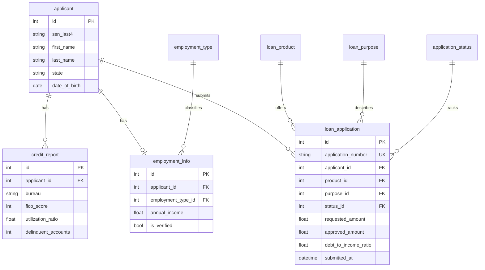
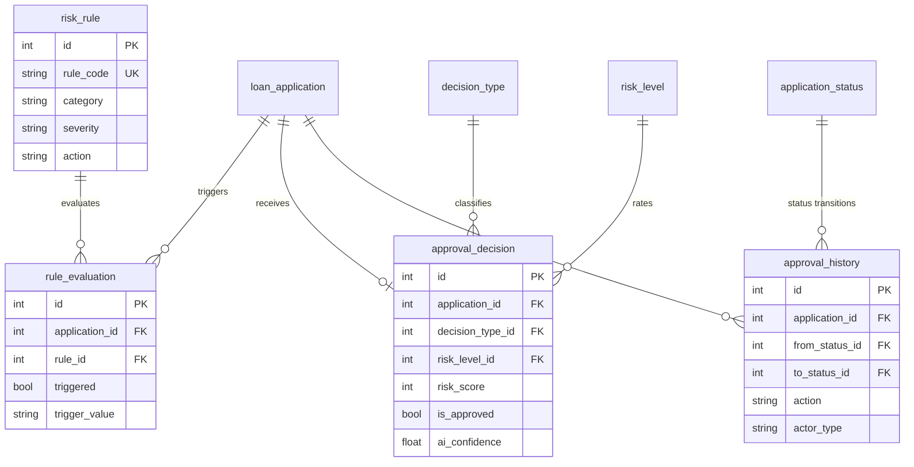
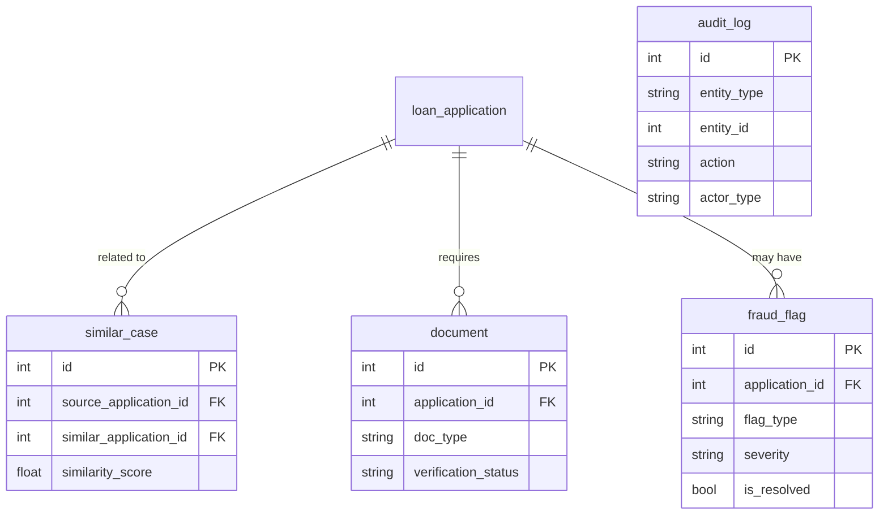

# Northpeak Lending AI Credit Approval Assistant Data Model

For business background, industry primer, and glossary, see `01-digital_lending_credit_approval_assistant_high_business_context.md`. This document describes data only.

This document is the contract between the schema, the Python generator, and the SQL queries. After reading the business background, you should be able to see clearly here what tables exist, how they connect, what each field means in business terms, which fields are computed, and which distributions have been intentionally arranged or simplified. If the business background answers "why," this ER document answers "what."

---

## 1. Dataset Metadata

| Item | Value |
|------|-------|
| Complexity level | High |
| Number of tables | 18 |
| Total rows | ~18,000 to 20,000 |
| Number of foreign-key relationships | ~16 (including two self-referential links to the same parent table) |
| Time anchor | Relative time, looking back ~18 months from "now" at generation time |

A note on the time anchor: this dataset has no fixed `REFERENCE_DATE` constant. The generator uses relative time (e.g., `date_time_between(start_date="-18m", end_date="now")`), and SQL queries use `DATE('now')` to read the current date dynamically. Treat "now" as "the day the data was generated / the query was executed." The benefit is that data is always fresh; the cost is that runs across midnight are not perfectly reproducible.

There is one scoping rule the DDL can't enforce but that analysts must respect: `approval_history.from_status_id` and `to_status_id` both point at `application_status.id` — two foreign keys against the same parent table — and `similar_case.source_application_id` and `similar_application_id` both point at `loan_application.id`. Be sure to alias each side carefully in JOINs so you don't confuse the two ends.

---

## 2. Entity Relationship Diagram

The 18 tables fall into three domains: applicants and applications; approval and risk; and extensions / supporting. All three subgraphs share the core table `loan_application`.

Applicants and applications domain:



Approval and risk domain:



Extensions and supporting domain:



`audit_log` doesn't have foreign-key relationships; it soft-references various entities using `entity_type` and `entity_id`, so it's drawn separately in the supporting domain.

---

## 3. Enum and Dimension Tables

These five tables, plus the product and rule tables, make seven "dictionary" tables — small, nearly static, providing readable categories to the business tables.

### 1. application_status

Each row is one stage in a loan application's lifecycle. Operations and executives lean on this to segment applications when looking at funnels or computing approval rates.

| Column | Type | Constraint | Description |
|--------|------|------------|-------------|
| id | INTEGER | PK | Primary key |
| code | VARCHAR(20) | UNIQUE, NOT NULL | Status code (PENDING, IN_REVIEW, APPROVED, etc.) |
| name | VARCHAR(50) | NOT NULL | Human-readable status name |
| description | TEXT | | Detailed description of the status |

Sample data:

| id | code | name | description |
|----|------|------|-------------|
| 1 | PENDING | Pending Review | Application submitted, awaiting initial review |
| 2 | IN_REVIEW | In Review | Application is being reviewed by an underwriter |
| 3 | APPROVED | Approved | Application approved, awaiting funding |
| 4 | DECLINED | Declined | Application has been declined |

The full set also includes 5 CANCELLED, 6 FUNDED, and 7 EXPIRED.

### 2. employment_type

Categorization of the applicant's employment status — the foundation for income assessment. The income stability of a full-time employee versus a self-employed person is very different, and risk management treats them differently.

| Column | Type | Constraint | Description |
|--------|------|------------|-------------|
| id | INTEGER | PK | Primary key |
| code | VARCHAR(20) | UNIQUE, NOT NULL | Employment type code |
| name | VARCHAR(50) | NOT NULL | Employment type name |

Sample data:

| id | code | name |
|----|------|------|
| 1 | FULL_TIME | Full-Time Employee |
| 3 | SELF_EMPLOYED | Self-Employed |
| 5 | RETIRED | Retired |

The full set has 7 types: also PART_TIME, CONTRACTOR, UNEMPLOYED, STUDENT.

### 3. loan_purpose

What the borrowed funds will be used for, used for product matching and compliance categorization. Purpose and product must be logically consistent — a mortgage can only be paired with a home purchase or refinance.

| Column | Type | Constraint | Description |
|--------|------|------------|-------------|
| id | INTEGER | PK | Primary key |
| code | VARCHAR(30) | UNIQUE, NOT NULL | Purpose code |
| name | VARCHAR(100) | NOT NULL | Purpose name |
| description | TEXT | | Detailed description |

Sample data:

| id | code | name | description |
|----|------|------|-------------|
| 1 | HOME_PURCHASE | Home Purchase | Purchase of a primary residence |
| 5 | DEBT_CONSOLIDATION | Debt Consolidation | Consolidate multiple debts |

The full set has 11 purposes covering home purchase, refinance, auto purchase, auto refinance, credit card payoff, home improvement, medical, education, small business, and other.

### 4. decision_type

Whether the decision was made by the system or a human, and whether it's an approval or denial. The `is_auto` field distinguishes automated vs. manual decisions and is the key to measuring automation rate.

| Column | Type | Constraint | Description |
|--------|------|------------|-------------|
| id | INTEGER | PK | Primary key |
| code | VARCHAR(30) | UNIQUE, NOT NULL | Decision type code |
| name | VARCHAR(50) | NOT NULL | Decision type name |
| is_auto | BOOLEAN | NOT NULL | Whether the decision is automated |

Sample data:

| id | code | name | is_auto |
|----|------|------|---------|
| 1 | AUTO_APPROVE | Auto Approve | true |
| 3 | MANUAL_APPROVE | Manual Approve | false |

The full set has 5 types: also AUTO_DECLINE, MANUAL_DECLINE, REFERRED (referred to manual review).

### 5. risk_level

Buckets the internal risk score (0 to 1000) into five tiers from very low to very high, so business users can quickly assess how risky an application is.

| Column | Type | Constraint | Description |
|--------|------|------------|-------------|
| id | INTEGER | PK | Primary key |
| code | VARCHAR(20) | UNIQUE, NOT NULL | Risk level code |
| name | VARCHAR(50) | NOT NULL | Risk level name |
| score_min | INTEGER | NOT NULL | Minimum score for this tier |
| score_max | INTEGER | NOT NULL | Maximum score for this tier |
| color | VARCHAR(20) | | Color displayed in the UI |

Sample data:

| id | code | name | score_min | score_max | color |
|----|------|------|-----------|-----------|-------|
| 1 | VERY_LOW | Very Low Risk | 0 | 200 | green |
| 4 | HIGH | High Risk | 601 | 800 | orange |

The full set has 5 tiers: VERY_LOW, LOW, MEDIUM, HIGH, VERY_HIGH.

### 6. loan_product

The loan products the company sells, along with their terms and eligibility thresholds. Each product has its own amount range, term range, base rate, and minimum credit score — the baseline for amount validation and pricing.

| Column | Type | Constraint | Description |
|--------|------|------------|-------------|
| id | INTEGER | PK | Primary key |
| code | VARCHAR(20) | UNIQUE, NOT NULL | Product code |
| name | VARCHAR(100) | NOT NULL | Product name |
| description | TEXT | | Product description |
| min_amount | FLOAT | NOT NULL | Minimum loan amount |
| max_amount | FLOAT | NOT NULL | Maximum loan amount |
| min_term_months | INTEGER | NOT NULL | Minimum loan term |
| max_term_months | INTEGER | NOT NULL | Maximum loan term |
| base_interest_rate | FLOAT | NOT NULL | Base APR (%) |
| min_credit_score | INTEGER | NOT NULL | Minimum FICO score required |
| is_active | BOOLEAN | DEFAULT true | Whether the product is currently offered |
| created_at | DATETIME | | When the product was created |

Sample data:

| id | code | name | min_amount | max_amount | base_interest_rate | min_credit_score |
|----|------|------|------------|------------|-------------------|------------------|
| 1 | MORTGAGE_30Y | 30-Year Fixed-Rate Mortgage | 50000 | 2000000 | 6.5 | 620 |
| 5 | PERSONAL | Personal Loan | 1000 | 50000 | 9.99 | 640 |

The full set has 8 products: two mortgages, two auto loans, two personal loans (standard and prime), HELOC, and debt consolidation.

### 7. risk_rule

The risk rule library used by automated underwriting. Each rule has a category (credit / income / fraud / compliance), a severity (info / warning / hard_stop), and a triggered action (flag / reduce_amount / reject). This is the basis on which the AI assistant makes automated decisions.

| Column | Type | Constraint | Description |
|--------|------|------------|-------------|
| id | INTEGER | PK | Primary key |
| rule_code | VARCHAR(30) | UNIQUE, NOT NULL | Rule identifier |
| name | VARCHAR(200) | NOT NULL | Rule name |
| description | TEXT | | Rule description |
| category | VARCHAR(50) | | Rule category (credit / income / fraud / compliance) |
| severity | VARCHAR(20) | | Rule severity (info / warning / hard_stop) |
| condition_sql | TEXT | | SQL-like condition expression |
| action | VARCHAR(50) | | Action when triggered (flag / reduce_amount / reject) |
| is_active | BOOLEAN | DEFAULT true | Whether the rule is enabled |
| version | INTEGER | DEFAULT 1 | Rule version number |
| created_at | DATETIME | | When the rule was created |
| updated_at | DATETIME | | When the rule was last updated |

Sample data:

| id | rule_code | name | category | severity | action |
|----|-----------|------|----------|----------|--------|
| 1 | CREDIT_SCORE_MIN | Minimum credit score check | credit | hard_stop | reject |
| 6 | DTI_MAX | Maximum debt-to-income ratio | income | hard_stop | reject |
| 10 | VELOCITY_CHECK | Application velocity check | fraud | warning | flag |

The full set has 16 rules: 5 credit, 4 income, 4 fraud, and 3 compliance.

---

## 4. Applicants and Applications

These tables capture "who is borrowing" and "what they're borrowing," and form the backbone of the dataset.

### 8. applicant

Each row is an individual who has submitted a loan application to Northpeak. It includes the identity and address information needed for underwriting. For privacy, only the last 4 digits of the SSN are stored. Marketing and compliance pull from here when looking at geographic distribution and age demographics.

| Column | Type | Constraint | Description |
|--------|------|------------|-------------|
| id | INTEGER | PK | Primary key |
| ssn_last4 | VARCHAR(4) | NOT NULL | Last 4 digits of SSN |
| first_name | VARCHAR(50) | NOT NULL | First name |
| last_name | VARCHAR(50) | NOT NULL | Last name |
| email | VARCHAR(255) | NOT NULL | Email address |
| phone | VARCHAR(20) | | Phone number |
| date_of_birth | DATE | NOT NULL | Date of birth |
| address_line1 | VARCHAR(255) | | Street address |
| address_line2 | VARCHAR(255) | | Apartment / suite |
| city | VARCHAR(100) | | City |
| state | VARCHAR(2) | | U.S. state code |
| zip_code | VARCHAR(10) | | ZIP code |
| created_at | DATETIME | | Record creation time |

Foreign keys: none.

Sample data:

| id | first_name | last_name | email | state | date_of_birth |
|----|------------|-----------|-------|-------|---------------|
| 1 | John | Smith | jsmith@email.com | CA | 1985-03-15 |
| 2 | Sarah | Johnson | sjohnson@email.com | TX | 1990-07-22 |

### 9. credit_report

Credit reports pulled from credit bureaus, containing FICO scores and credit history detail. Because of tri-merge, an applicant may have 1 to 3 reports from Experian, Equifax, and TransUnion, with slightly different scores. Many of the inputs to underwriting and risk rules come from this table.

| Column | Type | Constraint | Description |
|--------|------|------------|-------------|
| id | INTEGER | PK | Primary key |
| applicant_id | INTEGER | FK → applicant.id, NOT NULL | Linked applicant |
| bureau | VARCHAR(20) | NOT NULL | Credit bureau (Experian / Equifax / TransUnion) |
| fico_score | INTEGER | NOT NULL | FICO score (300 to 850) |
| total_accounts | INTEGER | | Total credit accounts |
| open_accounts | INTEGER | | Currently open accounts |
| total_balance | FLOAT | | Total outstanding balance |
| total_credit_limit | FLOAT | | Total available credit |
| utilization_ratio | FLOAT | | Credit utilization (0 to 100%) |
| delinquent_accounts | INTEGER | | Past-due accounts |
| public_records | INTEGER | | Bankruptcies, judgments, etc. |
| inquiries_last_6mo | INTEGER | | Credit inquiries in the last 6 months |
| oldest_account_age_months | INTEGER | | Age of oldest account |
| report_date | DATETIME | NOT NULL | When the report was pulled |
| raw_data | TEXT | | Raw JSON response |

Foreign keys: `applicant_id` → `applicant.id`.

Sample data:

| id | applicant_id | bureau | fico_score | utilization_ratio | delinquent_accounts |
|----|--------------|--------|------------|-------------------|---------------------|
| 1 | 1 | Experian | 742 | 23.5 | 0 |
| 2 | 1 | Equifax | 738 | 24.1 | 0 |
| 3 | 2 | TransUnion | 651 | 67.2 | 1 |

### 10. employment_info

Employment and income information for the applicant — one row per applicant. The `is_verified` flag indicates whether the income has been verified with pay stubs or tax returns, and is critical for compliance and DTI calculation.

| Column | Type | Constraint | Description |
|--------|------|------------|-------------|
| id | INTEGER | PK | Primary key |
| applicant_id | INTEGER | FK → applicant.id, NOT NULL | Linked applicant |
| employment_type_id | INTEGER | FK → employment_type.id, NOT NULL | Employment type |
| employer_name | VARCHAR(200) | | Current employer |
| job_title | VARCHAR(100) | | Job title |
| annual_income | FLOAT | NOT NULL | Stated annual income |
| monthly_income | FLOAT | NOT NULL | Monthly income (annual / 12) |
| employment_start_date | DATE | | Start date with current employer |
| is_verified | BOOLEAN | DEFAULT false | Whether income has been verified |
| verification_date | DATETIME | | When verification took place |
| verification_method | VARCHAR(50) | | Verification method |

Foreign keys: `applicant_id` → `applicant.id`, `employment_type_id` → `employment_type.id`.

Sample data:

| id | applicant_id | employer_name | annual_income | is_verified | verification_method |
|----|--------------|---------------|---------------|-------------|---------------------|
| 1 | 1 | Google LLC | 185000.00 | true | paystub |
| 2 | 2 | Self-Employed | 72000.00 | true | tax_return |

### 11. loan_application

The core fact table of the dataset. Each row is a single loan application, linking applicant, product, purpose, and status, and recording requested amount, approved amount, rate, monthly payment, DTI, channel, and timestamps at each stage. Almost every business analysis starts here.

| Column | Type | Constraint | Description |
|--------|------|------------|-------------|
| id | INTEGER | PK | Primary key |
| application_number | VARCHAR(20) | UNIQUE, NOT NULL | Unique application number |
| applicant_id | INTEGER | FK → applicant.id, NOT NULL | Applicant |
| product_id | INTEGER | FK → loan_product.id, NOT NULL | Loan product |
| purpose_id | INTEGER | FK → loan_purpose.id, NOT NULL | Loan purpose |
| status_id | INTEGER | FK → application_status.id, NOT NULL | Current status |
| requested_amount | FLOAT | NOT NULL | Requested amount |
| requested_term_months | INTEGER | NOT NULL | Requested term |
| approved_amount | FLOAT | | Final approved amount |
| approved_term_months | INTEGER | | Final approved term |
| approved_interest_rate | FLOAT | | Final APR |
| monthly_payment | FLOAT | | Computed monthly payment |
| debt_to_income_ratio | FLOAT | | DTI (%) |
| channel | VARCHAR(20) | | Application channel (web / mobile / branch / partner) |
| ip_address | VARCHAR(45) | | Application IP address |
| device_fingerprint | VARCHAR(100) | | Device fingerprint |
| submitted_at | DATETIME | NOT NULL | Submission time |
| decision_at | DATETIME | | Decision time |
| funded_at | DATETIME | | Funding time |
| created_at | DATETIME | | Record creation time |

Foreign keys: `applicant_id` → `applicant.id`, `product_id` → `loan_product.id`, `purpose_id` → `loan_purpose.id`, `status_id` → `application_status.id`.

Sample data:

| id | application_number | applicant_id | product_id | requested_amount | status_id | channel |
|----|--------------------|--------------|------------|------------------|-----------|---------|
| 1 | APP20240101000001 | 1 | 5 | 25000.00 | 3 | web |
| 2 | APP20240115000002 | 2 | 3 | 35000.00 | 4 | mobile |

---

## 5. Approval and Risk

These tables capture "how an application is evaluated and decided."

### 12. rule_evaluation

Each application is evaluated one rule at a time against the risk rule library, with one row per evaluation result. `triggered` indicates whether the rule fired. This is the data source for rule trigger-frequency analysis and rule effectiveness analysis.

| Column | Type | Constraint | Description |
|--------|------|------------|-------------|
| id | INTEGER | PK | Primary key |
| application_id | INTEGER | FK → loan_application.id, NOT NULL | Application evaluated |
| rule_id | INTEGER | FK → risk_rule.id, NOT NULL | Rule evaluated |
| triggered | BOOLEAN | NOT NULL | Whether the rule condition was met |
| trigger_value | VARCHAR(255) | | Actual value that triggered the rule |
| threshold_value | VARCHAR(255) | | Rule threshold |
| evaluated_at | DATETIME | NOT NULL | Evaluation time |

Foreign keys: `application_id` → `loan_application.id`, `rule_id` → `risk_rule.id`.

Sample data:

| id | application_id | rule_id | triggered | trigger_value | threshold_value |
|----|----------------|---------|-----------|---------------|-----------------|
| 1 | 1 | 1 | false | 742 | 640 |
| 2 | 2 | 6 | true | 47.2 | 43.0 |

### 13. approval_decision

The final approval verdict for each application, including the AI-supplied risk score, risk tier, confidence, and recommendation text, plus whether the decision was system-made or human-made, and the human reviewer's ID if applicable. `is_approved` is the final approve / decline.

| Column | Type | Constraint | Description |
|--------|------|------------|-------------|
| id | INTEGER | PK | Primary key |
| application_id | INTEGER | FK → loan_application.id, NOT NULL | Application |
| decision_type_id | INTEGER | FK → decision_type.id, NOT NULL | Auto vs. manual |
| risk_level_id | INTEGER | FK → risk_level.id, NOT NULL | Risk tier |
| risk_score | INTEGER | | Computed risk score (0 to 1000) |
| is_approved | BOOLEAN | NOT NULL | Final decision |
| decision_reason | TEXT | | Explanation of the decision |
| decline_codes | VARCHAR(255) | | Comma-separated decline reason codes |
| reviewer_id | VARCHAR(50) | | Human reviewer (if manual) |
| ai_recommendation | TEXT | | Recommendation text from the AI agent |
| ai_confidence | FLOAT | | AI confidence (0 to 1) |
| decision_at | DATETIME | NOT NULL | Decision time |

Foreign keys: `application_id` → `loan_application.id`, `decision_type_id` → `decision_type.id`, `risk_level_id` → `risk_level.id`.

Sample data:

| id | application_id | is_approved | ai_recommendation | ai_confidence |
|----|----------------|-------------|-------------------|---------------|
| 1 | 1 | true | Based on strong credit history and stable income, recommend approval at standard rate. | 0.92 |
| 2 | 2 | false | DTI is elevated, but repayment history is excellent. Recommend decline. | 0.78 |

### 14. approval_history

An audit trail of application status transitions, with one row per status change recording from which status to which, and who acted. Compliance and after-the-fact reviews rely on this to reconstruct the decision process. Both `from_status_id` and `to_status_id` point to `application_status`.

| Column | Type | Constraint | Description |
|--------|------|------------|-------------|
| id | INTEGER | PK | Primary key |
| application_id | INTEGER | FK → loan_application.id, NOT NULL | Application |
| from_status_id | INTEGER | FK → application_status.id | Original status |
| to_status_id | INTEGER | FK → application_status.id, NOT NULL | New status |
| action | VARCHAR(50) | NOT NULL | Action taken |
| actor_type | VARCHAR(20) | | Actor type (system / agent / human) |
| actor_id | VARCHAR(50) | | Actor identifier |
| notes | TEXT | | Additional notes |
| created_at | DATETIME | | Transition time |

Foreign keys: `application_id` → `loan_application.id`, `from_status_id` → `application_status.id`, `to_status_id` → `application_status.id`.

---

## 6. Extensions and Supporting

These tables support AI retrieval, document management, fraud, and compliance auditing.

### 15. similar_case

Pre-computed pairs of similar historical applications, used by the AI assistant to retrieve "how were similar applicants handled?" when reviewing a new application. Both foreign keys, `source` and `similar`, point to `loan_application`. The similarity score is between 0 and 1.

| Column | Type | Constraint | Description |
|--------|------|------------|-------------|
| id | INTEGER | PK | Primary key |
| source_application_id | INTEGER | FK → loan_application.id, NOT NULL | The current application |
| similar_application_id | INTEGER | FK → loan_application.id, NOT NULL | A similar historical application |
| similarity_score | FLOAT | NOT NULL | Similarity score (0 to 1) |
| matching_factors | TEXT | | JSON: matching factors |
| computed_at | DATETIME | NOT NULL | Computation time |

Foreign keys: `source_application_id` → `loan_application.id`, `similar_application_id` → `loan_application.id`.

### 16. document

Supporting documents uploaded with the application, such as proof of income, ID, or bank statements. `verification_status` tracks whether the document has been verified, and is the data source for document verification backlog analysis.

| Column | Type | Constraint | Description |
|--------|------|------------|-------------|
| id | INTEGER | PK | Primary key |
| application_id | INTEGER | FK → loan_application.id, NOT NULL | Application |
| doc_type | VARCHAR(50) | NOT NULL | Document type (income proof, ID, etc.) |
| file_name | VARCHAR(255) | NOT NULL | Original file name |
| file_size_bytes | INTEGER | | File size |
| mime_type | VARCHAR(50) | | MIME type |
| ocr_extracted_text | TEXT | | OCR-extracted text |
| verification_status | VARCHAR(20) | | pending / verified / rejected |
| uploaded_at | DATETIME | NOT NULL | Upload time |
| verified_at | DATETIME | | Verification time |

Foreign keys: `application_id` → `loan_application.id`.

### 17. fraud_flag

Applications flagged as suspicious by the fraud-detection system or a model — only a small share of applications. Records the flag type, severity, and resolution status, and is the fraud operations team's work queue.

| Column | Type | Constraint | Description |
|--------|------|------------|-------------|
| id | INTEGER | PK | Primary key |
| application_id | INTEGER | FK → loan_application.id, NOT NULL | Flagged application |
| flag_type | VARCHAR(50) | NOT NULL | Type (identity / income / address / device / velocity / synthetic_id) |
| severity | VARCHAR(20) | NOT NULL | Severity (low / medium / high / critical) |
| description | TEXT | NOT NULL | Flag description |
| evidence | TEXT | | Evidence detail in JSON format |
| is_resolved | BOOLEAN | DEFAULT false | Whether it has been resolved |
| resolution_notes | TEXT | | Notes on the resolution |
| flagged_at | DATETIME | NOT NULL | When it was flagged |
| resolved_at | DATETIME | | When it was resolved |

Foreign keys: `application_id` → `loan_application.id`.

### 18. audit_log

System-level audit trail for compliance. It doesn't use foreign keys; instead it soft-references applications, applicants, decisions, etc. via `entity_type` plus `entity_id`. Regulators and security audits look here.

| Column | Type | Constraint | Description |
|--------|------|------------|-------------|
| id | INTEGER | PK | Primary key |
| entity_type | VARCHAR(50) | NOT NULL | Entity type (application / applicant / decision) |
| entity_id | INTEGER | NOT NULL | Entity ID |
| action | VARCHAR(50) | NOT NULL | Action (create / update / view / approve / decline) |
| actor_type | VARCHAR(20) | NOT NULL | Actor type (system / agent / human / api) |
| actor_id | VARCHAR(50) | | Actor identifier |
| old_value | TEXT | | Old value (JSON) |
| new_value | TEXT | | New value (JSON) |
| ip_address | VARCHAR(45) | | Request IP |
| user_agent | VARCHAR(500) | | Browser / client information |
| created_at | DATETIME | | Log time |

Foreign keys: none (soft references via entity_type / entity_id).

---

## 7. Data Generation Rules

This section writes the distributions actually produced by the generator into a contract, so you can verify the expected results of queries.

### Time order

The time chain for each application satisfies `submitted_at` before `decision_at` before `funded_at`. Only applications that move into APPROVED / DECLINED / FUNDED status have `decision_at`, and only FUNDED have `funded_at` (funded 1 to 7 days after decision). All times fall within roughly the last 18 months.

### Value ranges

FICO score 300 to 850 (a baseline of 520 to 820 plus inter-bureau perturbation, truncated to range). DTI roughly 15% to 55%. Utilization 0 to 100%. Approved APR 4.5% to 18%. Risk score 0 to 1000. Application amounts vary by product, e.g., mortgages $100K to $750K, personal loans $3K to $35K.

### Computed fields

`monthly_income` equals `annual_income / 12`. `utilization_ratio` equals `total_balance / total_credit_limit * 100`. `monthly_payment` is computed from approved amount, rate, and term using the level-payment amortization formula. `application_number` is composed of the submission year-month plus a sequence number.

### Distribution characteristics (what the generator actually produces)

| Dimension | Distribution |
|-----------|--------------|
| Application status | PENDING 5%, IN_REVIEW 5%, APPROVED 40%, DECLINED 25%, CANCELLED 10%, FUNDED 10%, EXPIRED 5% |
| Approval decision approval rate | `approval_decision.is_approved` ~60% |
| Product mix | PERSONAL 25%, AUTO_NEW 20%, MORTGAGE_30Y 15%, AUTO_USED 15%, MORTGAGE_15Y 8%, HELOC 7%, PERSONAL_PRIME 5%, DEBT_CONSOL 5% |
| Channel mix | web 45%, mobile 35%, branch 10%, partner 10% |
| Rule trigger rate | Overall ~15% |
| Income verified rate | ~70% |
| Fraud flag coverage | ~10% of applications flagged |
| Fraud resolution rate | ~70% (design probability 60%, but with a sample of only ~80 records the observed value varies considerably) |
| Credit reports | 1 to 3 per applicant (average ~2) |

### Business traps and known simplifications

This dataset is built for teaching and demo purposes, and intentionally preserves several characteristics and simplifications that queries can expose. Analysts should keep them in mind.

First, there are two independent definitions of approval rate. `approval_decision.is_approved` is ~60%, while counting on `application_status` (APPROVED plus FUNDED) is ~50%. The two tables are generated independently and don't have to agree. The corresponding queries Q1 (decision-table definition) and Q14, Q2 (status definition) require you to pin one definition per report — otherwise the numbers won't reconcile.

Second, every application has an approval decision record, including those still in PENDING / IN_REVIEW. In reality, undecided applications should not have a final decision; this is a simplification. When doing funnel or "undecided vs. decided" analysis, use `application_status` rather than `approval_decision` to determine whether the decision is truly final.

Third, rule triggering is independently sampled at a fixed 15% probability, with no link to the application's actual risk. This causes query Q20 (rule effectiveness, decline rate when triggered) to show that rule triggers and final decline are essentially uncorrelated — the decline rate when triggered is close to the overall decline rate, not close to 90%. This is an intentional "anti-example": it shows what a rule with no predictive power looks like in the data, which is exactly what a risk policy analyst should identify and retire.

Fourth, DTI is uniformly distributed from 15% to 55% rather than the bell-shaped distribution seen in reality, so Q13's per-product DTI distribution will look unusually flat. The approval-history status transitions are also randomly generated and do not guarantee a business-legal sequence — they only demonstrate the structure of the audit table.

---

## 8. Faker Generation Strategy

| Field pattern | Faker method / strategy | Notes |
|---------------|-------------------------|-------|
| first_name, last_name | `fake.first_name()`, `fake.last_name()` | Stored as separate fields |
| email | `fake.unique.email()` | Unique per applicant |
| phone | `fake.phone_number()` | U.S. format |
| address_line1 | `fake.street_address()` | Full street address |
| city | `fake.city()` | North American city |
| state | `random.choice(US_STATES)` | Two-letter code for the 50 states |
| zip_code | `fake.zipcode()` | U.S. ZIP code |
| date_of_birth | `fake.date_of_birth(21, 75)` | Adult applicants |
| employer_name | `fake.company()` | North American company name |
| amount | `random.uniform(min, max)` | Per product range |
| fico_score | `random.randint(520, 820)` plus perturbation, truncated to 300-850 | Approximates a realistic FICO distribution |
| datetime (recent) | `fake.date_time_between(start="-18m", end="now")` | Last 18 months |
| ip_address | `fake.ipv4()` | Source IP of the application |
| device_fingerprint | `fake.uuid4()[:32]` | Device fingerprint |
| Weighted enum sampling | `random.choices(values, weights=...)` | Controls the distribution of status, product, channel, etc. |

---

## 9. File Inventory

In topological order (tables without foreign-key dependencies first):

| # | File name | Table name | Rows | Depends on |
|---|-----------|------------|------|------------|
| 01 | 01_application_status.tsv | application_status | 7 | none |
| 02 | 02_employment_type.tsv | employment_type | 7 | none |
| 03 | 03_loan_purpose.tsv | loan_purpose | 11 | none |
| 04 | 04_decision_type.tsv | decision_type | 5 | none |
| 05 | 05_risk_level.tsv | risk_level | 5 | none |
| 06 | 06_loan_product.tsv | loan_product | 8 | none |
| 07 | 07_risk_rule.tsv | risk_rule | 16 | none |
| 08 | 08_applicant.tsv | applicant | 500 | none |
| 09 | 09_credit_report.tsv | credit_report | ~1,000 | applicant |
| 10 | 10_employment_info.tsv | employment_info | 500 | applicant, employment_type |
| 11 | 11_loan_application.tsv | loan_application | 800 | applicant, loan_product, loan_purpose, application_status |
| 12 | 12_rule_evaluation.tsv | rule_evaluation | ~8,000 | loan_application, risk_rule |
| 13 | 13_approval_decision.tsv | approval_decision | 800 | loan_application, decision_type, risk_level |
| 14 | 14_approval_history.tsv | approval_history | ~2,800 | loan_application, application_status |
| 15 | 15_similar_case.tsv | similar_case | 1,000 | loan_application |
| 16 | 16_document.tsv | document | ~2,000 | loan_application |
| 17 | 17_fraud_flag.tsv | fraud_flag | ~80 | loan_application |
| 18 | 18_audit_log.tsv | audit_log | 2,000 | none (references entities via type / id) |

A total of 18 tables and roughly 18,000+ rows of data.

---

## 10. Database Schema (SQLite DDL)

```sql
-- Enum tables
CREATE TABLE application_status (
    id INTEGER PRIMARY KEY,
    code VARCHAR(20) NOT NULL UNIQUE,
    name VARCHAR(50) NOT NULL,
    description TEXT
);

CREATE TABLE employment_type (
    id INTEGER PRIMARY KEY,
    code VARCHAR(20) NOT NULL UNIQUE,
    name VARCHAR(50) NOT NULL
);

CREATE TABLE loan_purpose (
    id INTEGER PRIMARY KEY,
    code VARCHAR(30) NOT NULL UNIQUE,
    name VARCHAR(100) NOT NULL,
    description TEXT
);

CREATE TABLE decision_type (
    id INTEGER PRIMARY KEY,
    code VARCHAR(30) NOT NULL UNIQUE,
    name VARCHAR(50) NOT NULL,
    is_auto BOOLEAN NOT NULL
);

CREATE TABLE risk_level (
    id INTEGER PRIMARY KEY,
    code VARCHAR(20) NOT NULL UNIQUE,
    name VARCHAR(50) NOT NULL,
    score_min INTEGER NOT NULL,
    score_max INTEGER NOT NULL,
    color VARCHAR(20)
);

-- Core business tables
CREATE TABLE loan_product (
    id INTEGER PRIMARY KEY,
    code VARCHAR(20) NOT NULL UNIQUE,
    name VARCHAR(100) NOT NULL,
    description TEXT,
    min_amount FLOAT NOT NULL,
    max_amount FLOAT NOT NULL,
    min_term_months INTEGER NOT NULL,
    max_term_months INTEGER NOT NULL,
    base_interest_rate FLOAT NOT NULL,
    min_credit_score INTEGER NOT NULL,
    is_active BOOLEAN DEFAULT 1,
    created_at DATETIME
);

CREATE TABLE applicant (
    id INTEGER PRIMARY KEY,
    ssn_last4 VARCHAR(4) NOT NULL,
    first_name VARCHAR(50) NOT NULL,
    last_name VARCHAR(50) NOT NULL,
    email VARCHAR(255) NOT NULL,
    phone VARCHAR(20),
    date_of_birth DATE NOT NULL,
    address_line1 VARCHAR(255),
    address_line2 VARCHAR(255),
    city VARCHAR(100),
    state VARCHAR(2),
    zip_code VARCHAR(10),
    created_at DATETIME
);

CREATE TABLE credit_report (
    id INTEGER PRIMARY KEY,
    applicant_id INTEGER NOT NULL REFERENCES applicant(id),
    bureau VARCHAR(20) NOT NULL,
    fico_score INTEGER NOT NULL,
    total_accounts INTEGER,
    open_accounts INTEGER,
    total_balance FLOAT,
    total_credit_limit FLOAT,
    utilization_ratio FLOAT,
    delinquent_accounts INTEGER,
    public_records INTEGER,
    inquiries_last_6mo INTEGER,
    oldest_account_age_months INTEGER,
    report_date DATETIME NOT NULL,
    raw_data TEXT
);

CREATE TABLE employment_info (
    id INTEGER PRIMARY KEY,
    applicant_id INTEGER NOT NULL REFERENCES applicant(id),
    employment_type_id INTEGER NOT NULL REFERENCES employment_type(id),
    employer_name VARCHAR(200),
    job_title VARCHAR(100),
    annual_income FLOAT NOT NULL,
    monthly_income FLOAT NOT NULL,
    employment_start_date DATE,
    is_verified BOOLEAN DEFAULT 0,
    verification_date DATETIME,
    verification_method VARCHAR(50)
);

CREATE TABLE loan_application (
    id INTEGER PRIMARY KEY,
    application_number VARCHAR(20) NOT NULL UNIQUE,
    applicant_id INTEGER NOT NULL REFERENCES applicant(id),
    product_id INTEGER NOT NULL REFERENCES loan_product(id),
    purpose_id INTEGER NOT NULL REFERENCES loan_purpose(id),
    status_id INTEGER NOT NULL REFERENCES application_status(id),
    requested_amount FLOAT NOT NULL,
    requested_term_months INTEGER NOT NULL,
    approved_amount FLOAT,
    approved_term_months INTEGER,
    approved_interest_rate FLOAT,
    monthly_payment FLOAT,
    debt_to_income_ratio FLOAT,
    channel VARCHAR(20),
    ip_address VARCHAR(45),
    device_fingerprint VARCHAR(100),
    submitted_at DATETIME NOT NULL,
    decision_at DATETIME,
    funded_at DATETIME,
    created_at DATETIME
);

-- Approval workflow tables
CREATE TABLE risk_rule (
    id INTEGER PRIMARY KEY,
    rule_code VARCHAR(30) NOT NULL UNIQUE,
    name VARCHAR(200) NOT NULL,
    description TEXT,
    category VARCHAR(50),
    severity VARCHAR(20),
    condition_sql TEXT,
    action VARCHAR(50),
    is_active BOOLEAN DEFAULT 1,
    version INTEGER DEFAULT 1,
    created_at DATETIME,
    updated_at DATETIME
);

CREATE TABLE rule_evaluation (
    id INTEGER PRIMARY KEY,
    application_id INTEGER NOT NULL REFERENCES loan_application(id),
    rule_id INTEGER NOT NULL REFERENCES risk_rule(id),
    triggered BOOLEAN NOT NULL,
    trigger_value VARCHAR(255),
    threshold_value VARCHAR(255),
    evaluated_at DATETIME NOT NULL
);

CREATE TABLE approval_decision (
    id INTEGER PRIMARY KEY,
    application_id INTEGER NOT NULL REFERENCES loan_application(id),
    decision_type_id INTEGER NOT NULL REFERENCES decision_type(id),
    risk_level_id INTEGER NOT NULL REFERENCES risk_level(id),
    risk_score INTEGER,
    is_approved BOOLEAN NOT NULL,
    decision_reason TEXT,
    decline_codes VARCHAR(255),
    reviewer_id VARCHAR(50),
    ai_recommendation TEXT,
    ai_confidence FLOAT,
    decision_at DATETIME NOT NULL
);

CREATE TABLE approval_history (
    id INTEGER PRIMARY KEY,
    application_id INTEGER NOT NULL REFERENCES loan_application(id),
    from_status_id INTEGER REFERENCES application_status(id),
    to_status_id INTEGER NOT NULL REFERENCES application_status(id),
    action VARCHAR(50) NOT NULL,
    actor_type VARCHAR(20),
    actor_id VARCHAR(50),
    notes TEXT,
    created_at DATETIME
);

-- Extension tables
CREATE TABLE similar_case (
    id INTEGER PRIMARY KEY,
    source_application_id INTEGER NOT NULL REFERENCES loan_application(id),
    similar_application_id INTEGER NOT NULL REFERENCES loan_application(id),
    similarity_score FLOAT NOT NULL,
    matching_factors TEXT,
    computed_at DATETIME NOT NULL
);

CREATE TABLE document (
    id INTEGER PRIMARY KEY,
    application_id INTEGER NOT NULL REFERENCES loan_application(id),
    doc_type VARCHAR(50) NOT NULL,
    file_name VARCHAR(255) NOT NULL,
    file_size_bytes INTEGER,
    mime_type VARCHAR(50),
    ocr_extracted_text TEXT,
    verification_status VARCHAR(20),
    uploaded_at DATETIME NOT NULL,
    verified_at DATETIME
);

CREATE TABLE fraud_flag (
    id INTEGER PRIMARY KEY,
    application_id INTEGER NOT NULL REFERENCES loan_application(id),
    flag_type VARCHAR(50) NOT NULL,
    severity VARCHAR(20) NOT NULL,
    description TEXT NOT NULL,
    evidence TEXT,
    is_resolved BOOLEAN DEFAULT 0,
    resolution_notes TEXT,
    flagged_at DATETIME NOT NULL,
    resolved_at DATETIME
);

CREATE TABLE audit_log (
    id INTEGER PRIMARY KEY,
    entity_type VARCHAR(50) NOT NULL,
    entity_id INTEGER NOT NULL,
    action VARCHAR(50) NOT NULL,
    actor_type VARCHAR(20) NOT NULL,
    actor_id VARCHAR(50),
    old_value TEXT,
    new_value TEXT,
    ip_address VARCHAR(45),
    user_agent VARCHAR(500),
    created_at DATETIME
);
```
