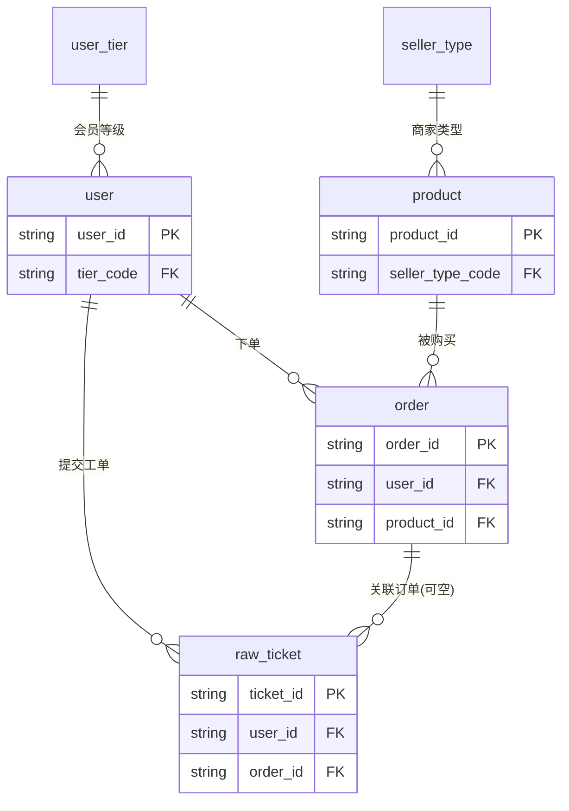
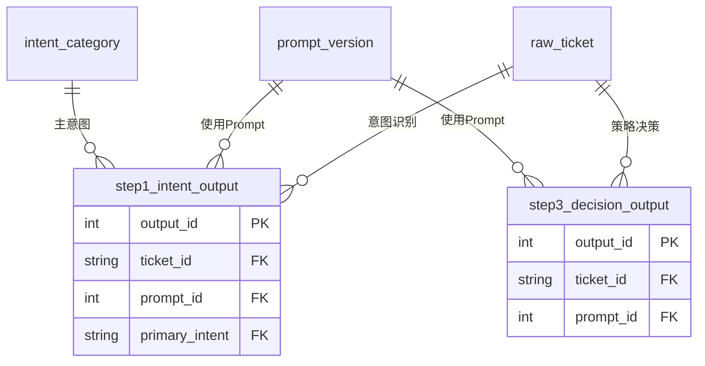
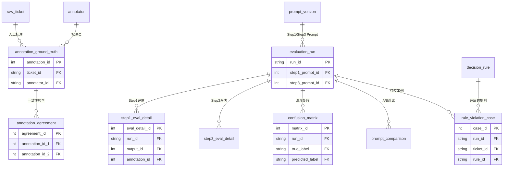
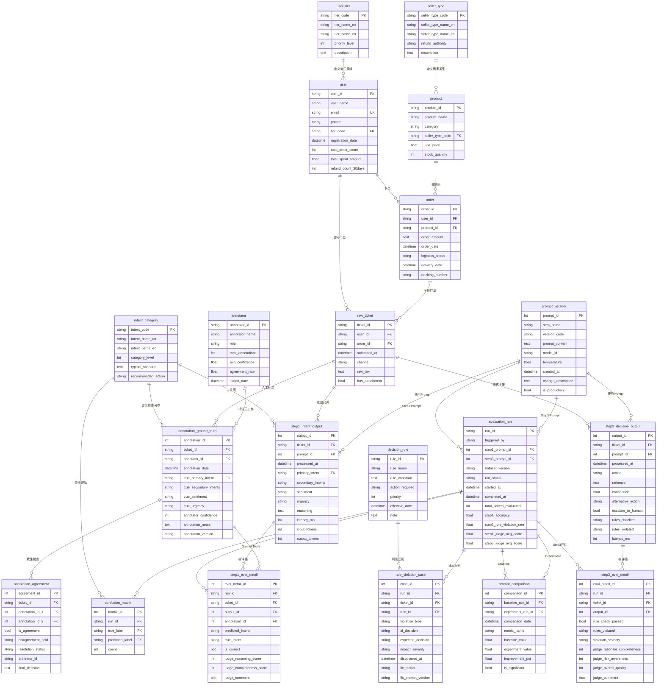

# 电商平台 — AI 客服工单处理系统 · 数据结构 (ER) 文档

> **业务背景, 行业科普, 术语表, KPI 公式请见 [`01-ecommerce_ai_customer_service_high_business_context-cn.md`](01-ecommerce_ai_customer_service_high_business_context-cn.md)。本文档只描述数据 (表、字段、外键、分布、生成规则、DDL)。**

> **数据集:** `ecommerce_ai_customer_service_high`
> **复杂度:** 高 (High)
> **表总数:** 20 张
> **总行数:** ~25,700
> **外键关系:** 34 个 (含 1 组并列双 FK: `annotation_agreement.annotation_id_1` / `annotation_id_2` 同指 `annotation_ground_truth`, 记录同一工单的两条标注)
> **参考日 (REFERENCE_DATE, 查询用固定"今天"):** `2024-12-01`
> **生成方:** Fake Data Generator Agent

---

## 目录

1. [业务背景 (已迁移)](#1-业务背景-已迁移)
2. [术语表 (已迁移)](#2-术语表-已迁移)
3. [数据集概览](#3-数据集概览)
4. [实体关系图](#4-实体关系图)
5. [表定义](#5-表定义)
6. [外键目录](#6-外键目录)
7. [数据生成规则](#7-数据生成规则)
8. [文件清单](#8-文件清单)
9. [SQLite DDL](#9-sqlite-ddl)
10. [KPI 字典 (已迁移)](#10-kpi-字典-已迁移)
11. [BI 主题域与仪表盘蓝图 (已迁移)](#11-bi-主题域与仪表盘蓝图-已迁移)
12. [附录: 常见查询模式索引](#12-附录-常见查询模式索引)

> 说明: §1 业务背景、§2 术语表、§10 KPI 字典、§11 BI 蓝图 已按 0.2.1 规范迁移到业务背景文档 `01-...business_context-cn.md`, 本文仅保留指针。§3 起为数据结构正文。

---

## 1. 业务背景 (已迁移)

公司画像、商业模式、行业概览、项目背景 (实习生小赵的三重角色与时间线)、本数据集支持的能力、以及 4 步 AI 客服流水线的业务叙事, 已按 0.2.1 规范迁移到业务背景文档:

> 见 [`01-ecommerce_ai_customer_service_high_business_context-cn.md`](01-ecommerce_ai_customer_service_high_business_context-cn.md) 的 §1 公司 / §2 商业模式 / §3 行业概览 / §4 项目背景 / §7.1 AI 客服流水线。

下文从 §3 起只描述数据本身。

---

## 2. 术语表 (已迁移)

客服行业、AI/LLM 工程、数据标注、模型评估、业务规则 (R001–R007) 等全部术语解释, 已迁移到业务背景文档:

> 见 [`01-ecommerce_ai_customer_service_high_business_context-cn.md`](01-ecommerce_ai_customer_service_high_business_context-cn.md) 的 §8 术语表 (Glossary) 与 §7.2 决策规则表。

---

## 3. 数据集概览

| 指标 | 值 |
|------|-----|
| 表总数 | 20 |
| 总行数 | ~25,700 |
| 外键关系总数 | 34 |
| 类 junction (并列双 FK) | 1 个 (`annotation_agreement` 用 `annotation_id_1`/`annotation_id_2` 两个并列 FK 指向 `annotation_ground_truth`,记录同一工单的两条标注,非自引用) |
| 事件级表 | 6 (raw_ticket, step1_intent_output, step3_decision_output, step1_eval_detail, step3_eval_detail, rule_violation_case) |
| 业务域数量 | 6 (枚举 / 业务实体 / AI Pipeline / 标注 / 评估 / 规则违反) |
| 时间跨度 | 2024-09-25 ~ 2024-11-30 (约 9 周) |

### 3.1 各表行数

| # | 表 | 行数 | 类型 |
|---|-----|------|------|
| 01 | user_tier | 5 | 枚举 |
| 02 | seller_type | 2 | 枚举 |
| 03 | intent_category | 12 | 枚举 |
| 04 | decision_rule | 7 | 规则配置 |
| 05 | annotator | 10 | 标注团队 |
| 06 | prompt_version | 8 | Prompt 版本 |
| 07 | user | 500 | 业务实体 |
| 08 | product | 200 | 业务实体 |
| 09 | order | 2,000 | 业务实体 |
| 10 | raw_ticket | **5,000** | 事件 (主 fact 表) |
| 11 | step1_intent_output | **5,000** | AI 输出 (每工单 1 条) |
| 12 | step3_decision_output | **5,000** | AI 输出 (每工单 1 条) |
| 13 | annotation_ground_truth | ~1,000 | 标注 (500 样本工单 × 2 标注员) |
| 14 | annotation_agreement | ~500 | 一致性检查 |
| 15 | evaluation_run | 6 | Evaluation 运行 |
| 16 | step1_eval_detail | ~3,000 | 500 样本 × 6 次运行 |
| 17 | step3_eval_detail | ~3,000 | 500 样本 × 6 次运行 |
| 18 | confusion_matrix | ~250 | 跨 run 的混淆矩阵记录 (从 step1_eval_detail 聚合派生) |
| 19 | prompt_comparison | 15 | 版本对比记录 |
| 20 | rule_violation_case | ~150 | 规则违反案例库 |
| | **合计** | **~25,700** | |

### 3.2 关键业务分布

#### 用户会员等级分布 (`user`, 共 500 条)

| 等级 | 占比 | 行数 |
|------|------|------|
| new (新用户) | 15% | ~75 |
| regular (普通会员) | 40% | ~200 |
| vip_silver (白银) | 25% | ~125 |
| vip_gold (黄金) | 15% | ~75 |
| vip_platinum (铂金) | 5% | ~25 |

#### 商家类型分布 (`product`, 共 200 条)

| 类型 | 占比 | 行数 |
|------|------|------|
| nestmart_original (自营) | 70% | ~140 |
| third_party (第三方) | 30% | ~60 |

#### 工单意图分层抽样 (`raw_ticket`, 共 5,000 条)

| 意图代码 | 占比 | 行数 | 业务含义 |
|----------|------|------|----------|
| dispute_non_receipt | 25% | ~1,250 | 物流纠纷 - 未收到货 |
| refund_request | 20% | ~1,000 | 退款请求 |
| dispute_damaged | 15% | ~750 | 物流纠纷 - 收到破损 |
| exchange_request | 10% | ~500 | 换货请求 |
| complaint_quality | 10% | ~500 | 质量投诉 |
| logistics_inquiry | 10% | ~500 | 物流查询 |
| policy_inquiry | 10% | ~500 | 政策咨询 |

> **说明:** 工单 (`raw_ticket`) 的"真实意图"只覆盖上表 **7 个**主意图。`intent_category` 里另外 2 个主意图 `dispute_wrong_item`(收到错误商品) / `complaint_service`(服务投诉) 以及 3 个次意图,**不会作为工单的真实意图出现**,但会作为 AI/标注的"误判预测值"出现在 `step1_eval_detail.predicted_intent` 与 `confusion_matrix.predicted_label` 中 (即:它们是"被错认成的类",而非"真实存在的工单类")。因此 per-intent 准确率、混淆矩阵的"真实标签"维度只有这 7 类。评估样本 (`annotation_ground_truth`, 500 条) 是对全部 5,000 工单的**分层随机抽样**,覆盖这 7 类意图,占比与上表一致。

#### Prompt 迭代效果 (`evaluation_run`, 共 6 条)

| 运行 ID | Step1 Prompt | Step1 准确率 | Step3 规则违反率 |
|---------|--------------|--------------|------------------|
| eval_20241110_140000 | v1 | 81.0% | 12.0% |
| eval_20241112_093000 | v2 | 87.0% | 4.2% |
| eval_20241115_143000 | v3 (调情绪判断) | 87.5% | 4.0% |
| eval_20241119_100000 | v4 (加 few-shot) | 89.0% | 3.5% |
| eval_20241123_140000 | v5 (production) | 90.5% | 3.0% |
| eval_20241128_090000 | v5 (回归验证) | 90.2% | 3.1% |

---

## 4. 实体关系图

20 张表跨 6 个业务域。为便于阅读, 先按域给出 3 张**关系子图** (只画主键和外键骨架), 再给出包含全部字段的**完整属性图**。

### 4.1 子图 A — 业务实体与工单 (枚举 → 用户/商品/订单 → 工单)



### 4.2 子图 B — AI 处理流水线 (工单 → Step1/Step3 输出)



### 4.3 子图 C — 标注 · 评估 · 规则违反



### 4.4 完整属性图 (全字段)



---

## 5. 表定义

### 域 1: 枚举与配置 (5 张)

#### 5.1 `user_tier` (用户会员等级)

**描述:** 定义 NestMart 平台的用户会员等级体系。等级决定了 SLA (24h vs 48h) 和 R006 规则匹配 (VIP 物流纠纷优先全额退款)。**实习生小赵在做 BI Dashboard 时,几乎所有"按会员等级分布"的图表都引用这张表。**

| 列 | 类型 | 约束 | 描述 |
|----|------|------|------|
| tier_code | VARCHAR(20) | PK | 等级代码 |
| tier_name_cn | VARCHAR(50) | NOT NULL | 中文名称 |
| tier_name_en | VARCHAR(50) | NOT NULL | 英文名称 |
| priority_level | INTEGER | NOT NULL | 优先级 (1=最低 ~ 5=最高) |
| description | TEXT | | 等级说明 (含 GMV 阈值) |

**全部 5 行:**

| tier_code | tier_name_cn | priority_level | description |
|-----------|--------------|----------------|-------------|
| new | 新用户 | 1 | 注册未满 30 天或首单未完成的用户 |
| regular | 普通会员 | 2 | 完成首单且累计消费 <$500 |
| vip_silver | 白银会员 | 3 | 累计消费 $500-$1500 |
| vip_gold | 黄金会员 | 4 | 累计消费 $1500-$5000 |
| vip_platinum | 铂金会员 | 5 | 累计消费 >$5000 |

**被引用于:** `user.tier_code`

---

#### 5.2 `seller_type` (商家类型)

**描述:** 区分自营商品和第三方商家入驻商品,决定退款决策权归属。**这是 Step 3 策略决策最关键的业务规则触发器——R002 规则就是基于这张表的 `refund_authority` 字段。**

| 列 | 类型 | 约束 | 描述 |
|----|------|------|------|
| seller_type_code | VARCHAR(20) | PK | 商家类型代码 |
| seller_type_name_cn | VARCHAR(50) | NOT NULL | 中文名称 |
| seller_type_name_en | VARCHAR(50) | NOT NULL | 英文名称 |
| refund_authority | VARCHAR(50) | | 退款决策权 (`platform` / `merchant`) |
| description | TEXT | | 类型说明 |

**全部 2 行:**

| seller_type_code | seller_type_name_cn | refund_authority | description |
|------------------|---------------------|------------------|-------------|
| nestmart_original | NestMart 自营 | platform | 平台自营商品,退款决策权在平台 |
| third_party | 第三方商家 | merchant | 第三方入驻商家,退换货由商家处理 |

**被引用于:** `product.seller_type_code`

---

#### 5.3 `intent_category` (意图分类)

**描述:** Step 1 意图识别的标签体系。9 个**主意图** (`category_level=1`) + 3 个**次意图** (`category_level=2`)。`recommended_action` 列给 Step 3 决策提供基线建议——但**最终决策仍要叠加 R001-R007 规则**才能输出。

| 列 | 类型 | 约束 | 描述 |
|----|------|------|------|
| intent_code | VARCHAR(50) | PK | 意图代码 |
| intent_name_cn | VARCHAR(100) | NOT NULL | 中文名称 |
| intent_name_en | VARCHAR(100) | NOT NULL | 英文名称 |
| category_level | INTEGER | | 1=主意图, 2=次意图 |
| typical_scenario | TEXT | | 典型场景描述 (供 Prompt 引用) |
| recommended_action | VARCHAR(50) | | 推荐处理动作 (供 Step 3 参考) |

**主要 9 个主意图 (level=1):**

| intent_code | intent_name_cn | typical_scenario |
|-------------|----------------|-------------------|
| dispute_non_receipt | 物流纠纷 - 未收到货 | 快递显示已签收但用户声称未实际收到 |
| dispute_damaged | 物流纠纷 - 收到破损 | 商品在运输中损坏 |
| dispute_wrong_item | 物流纠纷 - 收到错误商品 | 收到的商品与订单不符 |
| refund_request | 退款请求 | 七天无理由等正常退款 |
| exchange_request | 换货请求 | 用户希望换货而非退款 |
| logistics_inquiry | 物流查询 | 查询物流状态,无纠纷 |
| complaint_quality | 质量投诉 | 商品质量问题 (已使用) |
| complaint_service | 服务投诉 | 对客服态度或服务质量的投诉 |
| policy_inquiry | 政策咨询 | 咨询退换货政策规定 |

**3 个次意图 (level=2):**

| intent_code | intent_name_cn |
|-------------|----------------|
| reship_request | 重发请求 |
| compensation_request | 补偿要求 |
| complaint_logistics | 物流服务投诉 |

**被引用于:** `step1_intent_output.primary_intent`, `annotation_ground_truth.true_primary_intent`, `confusion_matrix.true_label / predicted_label`

---

#### 5.4 `decision_rule` (业务规则)

**描述:** Step 3 策略决策引擎使用的业务规则库。规则按 `priority` 升序匹配,匹配到的第一条规则的 `action_required` 即为期望动作。**实习生小赵在调试 Step 3 Prompt 时,经常需要把这张表的内容贴到 Prompt 里让 LLM"背规则"。**

完整 7 条规则已经在 §2.5 列出,这里只展示表结构:

| 列 | 类型 | 约束 | 描述 |
|----|------|------|------|
| rule_id | VARCHAR(10) | PK | 规则编号 (R001 ~ R007) |
| rule_name | VARCHAR(200) | NOT NULL | 可读规则名 |
| rule_condition | TEXT | NOT NULL | 触发条件 (伪代码) |
| action_required | VARCHAR(50) | NOT NULL | 期望动作 |
| priority | INTEGER | NOT NULL | 优先级 (数字越小越优先) |
| effective_date | DATETIME | | 生效日期 |
| note | TEXT | | 备注 (业务含义解释) |

**被引用于:** `rule_violation_case.rule_id`, `step3_decision_output.rules_checked / rules_violated` (后两个为 JSON 数组)

---

#### 5.5 `annotator` (标注员)

**描述:** 标注团队成员信息。角色分三种: `annotator` (标注员)、`reviewer` (审核员)、`arbitrator` (仲裁员,处理标注不一致的争议)。`agreement_rate` 是 Cohen's Kappa 指标,反映该标注员与团队其他标注员的一致程度。

| 列 | 类型 | 约束 | 描述 |
|----|------|------|------|
| annotator_id | VARCHAR(20) | PK | 标注员 ID |
| annotator_name | VARCHAR(100) | NOT NULL | 姓名 |
| role | VARCHAR(30) | | annotator / reviewer / arbitrator |
| total_annotations | INTEGER | | 累计标注数量 |
| avg_confidence | FLOAT | | 平均置信度 (1.0-3.0) |
| agreement_rate | FLOAT | NULL | Cohen's Kappa (仅 annotator 有, arbitrator 为 NULL) |
| joined_date | DATETIME | NOT NULL | 加入日期 |

**示例数据 (10 行中的 3 行):**

| annotator_id | annotator_name | role | total_annotations | agreement_rate |
|--------------|----------------|------|-------------------|----------------|
| ANN001 | 张晓月 | annotator | 250 | 0.92 |
| ANN005 | 刘美琪 | annotator | 220 | 0.87 |
| ARB001 | 赵建国 | arbitrator | 45 | NULL |

**被引用于:** `annotation_ground_truth.annotator_id`

---

### 域 2: 业务实体 (3 张)

#### 5.6 `user` (用户)

**描述:** NestMart 平台用户主表。`refund_count_30days` 是 R004 规则的触发字段 (高频退款用户升级人工)。`tier_code` 决定 SLA 等级和 R006 规则匹配。

| 列 | 类型 | 约束 | 描述 |
|----|------|------|------|
| user_id | VARCHAR(20) | PK | 用户 ID (U00000001 格式) |
| user_name | VARCHAR(100) | NOT NULL | 姓名 |
| email | VARCHAR(255) | UNIQUE | 邮箱 |
| phone | VARCHAR(20) | | 手机号 |
| tier_code | VARCHAR(20) | FK → user_tier | 会员等级 |
| registration_date | DATETIME | NOT NULL | 注册日期 |
| total_order_count | INTEGER | DEFAULT 0 | 累计订单数 |
| total_spent_amount | FLOAT | DEFAULT 0.0 | 累计消费金额 ($) |
| refund_count_30days | INTEGER | DEFAULT 0 | 30 天内退款次数 |

**数据生成规则:**
- 会员等级分布: 15% new / 40% regular / 25% silver / 15% gold / 5% platinum
- 各等级的订单数和消费金额在合理区间内
- ~3% 的用户 `refund_count_30days >= 3`,会触发 R004

**被引用于:** `order.user_id`, `raw_ticket.user_id`

---

#### 5.7 `product` (商品)

**描述:** 商品 SKU 表,涵盖 4 大品类。`seller_type_code` 决定退款决策权 (R002)。

| 列 | 类型 | 约束 | 描述 |
|----|------|------|------|
| product_id | VARCHAR(20) | PK | 商品 ID (SKU000001 格式) |
| product_name | VARCHAR(200) | NOT NULL | 商品名称 |
| category | VARCHAR(50) | NOT NULL | 寝具 / 厨房用品 / 家居收纳 / 照明 |
| seller_type_code | VARCHAR(20) | FK → seller_type | 自营 / 第三方 |
| unit_price | FLOAT | NOT NULL | 单价 ($) |
| stock_quantity | INTEGER | DEFAULT 0 | 库存 |

**数据生成规则:**
- 70% 自营 + 30% 第三方
- 价格区间: 寝具 $50-250, 厨房 $30-120, 家居收纳 $25-100, 照明 $60-300

**被引用于:** `order.product_id`

---

#### 5.8 `order` (订单)

**描述:** 订单记录。`logistics_status` 是 R005 规则的触发字段 (运输中不得判定丢件)。

| 列 | 类型 | 约束 | 描述 |
|----|------|------|------|
| order_id | VARCHAR(30) | PK | ORD-2024-XXXXXX |
| user_id | VARCHAR(20) | FK → user | 用户 |
| product_id | VARCHAR(20) | FK → product | 商品 |
| order_amount | FLOAT | NOT NULL | 订单金额 ($) |
| order_date | DATETIME | NOT NULL | 下单日期 |
| logistics_status | VARCHAR(50) | | in_transit / delivered / signed / lost |
| delivery_date | DATETIME | NULL | 配送日期 |
| tracking_number | VARCHAR(50) | | 快递单号 |

**物流状态分布:** 70% signed / 15% delivered / 10% in_transit / 5% lost

**被引用于:** `raw_ticket.order_id` (可为 NULL,咨询类工单不关联订单)

---

### 域 3: AI 处理流水线 (3 张)

#### 5.9 `raw_ticket` (原始工单) — 主 fact 表

**描述:** 用户提交的客服工单原始数据,是整个 AI 流水线的输入。**这是数据集中体量最大的表 (~5,000 条),也是绝大多数 SQL 分析的起点。**

| 列 | 类型 | 约束 | 描述 |
|----|------|------|------|
| ticket_id | VARCHAR(20) | PK | T00000001 格式 |
| user_id | VARCHAR(20) | FK → user | 提交用户 |
| order_id | VARCHAR(30) | FK → order, NULL | 关联订单 (咨询类可为 NULL) |
| submitted_at | DATETIME | NOT NULL | 提交时间 |
| channel | VARCHAR(20) | | web_form / app / chat / email / phone_transcript |
| raw_text | TEXT | NOT NULL | 用户原始文本 (≥50 字) |
| has_attachment | BOOLEAN | DEFAULT FALSE | 是否含附件 (照片证据,R007 相关) |

**数据生成规则:**
- 按意图分层抽样: 25% dispute_non_receipt + 20% refund_request + 15% dispute_damaged + 10% × 4 其它类
- 70% 的工单关联订单, 30% 不关联 (咨询类)
- 30% 含附件 (破损投诉为主)
- 渠道分布: 50% web_form / 25% app / 15% chat / 7% email / 3% phone_transcript

**被引用于:** `step1_intent_output.ticket_id`, `step3_decision_output.ticket_id`, `annotation_ground_truth.ticket_id`, `annotation_agreement.ticket_id`, `step1_eval_detail.ticket_id`, `step3_eval_detail.ticket_id`, `rule_violation_case.ticket_id`

---

#### 5.10 `step1_intent_output` (Step 1 意图识别输出)

**描述:** AI 系统 Step 1 的输出结果。每条工单产生 1 条 (所以本表 ~5,000 行,与 `raw_ticket` 一一对应)。`prompt_id` 指向生成时使用的 Prompt 版本——这样可以追溯"哪个版本的 Prompt 产生了哪条输出"。

| 列 | 类型 | 约束 | 描述 |
|----|------|------|------|
| output_id | INTEGER | PK, AUTO | 输出 ID |
| ticket_id | VARCHAR(20) | FK → raw_ticket | 关联工单 |
| prompt_id | INTEGER | FK → prompt_version | 使用的 Prompt 版本 |
| processed_at | DATETIME | NOT NULL | 处理时间 |
| primary_intent | VARCHAR(50) | FK → intent_category | 主意图 |
| secondary_intents | VARCHAR(200) | | 次意图列表 (JSON 数组字符串) |
| sentiment | VARCHAR(20) | | satisfied / neutral / frustrated / angry |
| urgency | VARCHAR(20) | | low / medium / high |
| reasoning | TEXT | | AI 推理过程 (LLM Judge 评估的依据) |
| latency_ms | INTEGER | | 处理延迟 (毫秒) |
| input_tokens | INTEGER | | 输入 Token 数 |
| output_tokens | INTEGER | | 输出 Token 数 |

---

#### 5.11 `step3_decision_output` (Step 3 策略决策输出)

**描述:** AI 系统 Step 3 的决策结果,每条工单一条。`rules_checked` 是 AI 在决策时检查过的规则列表,`rules_violated` 是被违反的规则——后者非空就说明 AI 输出了不合规的决策,会被 `rule_violation_case` 捕获。

| 列 | 类型 | 约束 | 描述 |
|----|------|------|------|
| output_id | INTEGER | PK, AUTO | 输出 ID |
| ticket_id | VARCHAR(20) | FK → raw_ticket | 关联工单 |
| prompt_id | INTEGER | FK → prompt_version | 使用的 Prompt 版本 |
| processed_at | DATETIME | NOT NULL | 处理时间 |
| action | VARCHAR(50) | NOT NULL | full_refund / partial_refund / reship / transfer_to_merchant / reject / escalate_to_human |
| rationale | TEXT | | 决策推理依据 |
| confidence | FLOAT | | 置信度 (0.0-1.0) |
| alternative_action | VARCHAR(50) | NULL | 备选方案 |
| escalate_to_human | BOOLEAN | DEFAULT FALSE | 是否升级人工 |
| rules_checked | VARCHAR(200) | | 检查过的规则 (JSON 数组) |
| rules_violated | VARCHAR(200) | | 违反的规则 (JSON 数组) |
| latency_ms | INTEGER | | 处理延迟 |

---

### 域 4: 标注与一致性 (2 张)

#### 5.12 `annotation_ground_truth` (人工标注 Ground Truth)

**描述:** 人工标注的"标准答案"。**注意: 不是每条工单都被标注。** 标注成本高,所以从 5,000 条工单中**分层随机抽样** 500 条做评估 (按真实意图分层,覆盖全部 7 类工单意图),每条由 2 个标注员独立标注,共 ~1,000 条记录。`annotation_date` 晚于工单 `submitted_at`、早于首次评估运行。

| 列 | 类型 | 约束 | 描述 |
|----|------|------|------|
| annotation_id | INTEGER | PK, AUTO | 标注 ID |
| ticket_id | VARCHAR(20) | FK → raw_ticket | 工单 |
| annotator_id | VARCHAR(20) | FK → annotator | 标注员 |
| annotation_date | DATETIME | NOT NULL | 标注日期 |
| true_primary_intent | VARCHAR(50) | FK → intent_category | 真实主意图 |
| true_secondary_intents | VARCHAR(200) | | 真实次意图 (JSON) |
| true_sentiment | VARCHAR(20) | | 真实情绪 |
| true_urgency | VARCHAR(20) | | 真实紧急度 |
| annotator_confidence | INTEGER | | 1=不确定, 2=比较确定, 3=非常确定 |
| annotation_notes | TEXT | NULL | 有争议时的备注 |
| annotation_version | VARCHAR(10) | DEFAULT 'v2' | 标注 SOP 版本 |

**数据生成规则:**
- 每条参评工单被 2 个标注员标注 → 共 ~1,000 行
- 95% 两人标注一致, 5% 不一致 (后续要走仲裁)

---

#### 5.13 `annotation_agreement` (标注一致性检查)

**描述:** 双人标注的一致性记录。`is_agreement = FALSE` 的会被 arbitrator 仲裁,最终决定写到 `final_decision`。

| 列 | 类型 | 约束 | 描述 |
|----|------|------|------|
| agreement_id | INTEGER | PK, AUTO | |
| ticket_id | VARCHAR(20) | FK → raw_ticket | |
| annotation_id_1 | INTEGER | FK → annotation_ground_truth | 标注员 1 |
| annotation_id_2 | INTEGER | FK → annotation_ground_truth | 标注员 2 |
| is_agreement | BOOLEAN | NOT NULL | 是否一致 |
| disagreement_field | VARCHAR(50) | NULL | 不一致字段 (一般是 primary_intent) |
| resolution_status | VARCHAR(20) | | pending / resolved / escalated |
| arbitrator_id | VARCHAR(20) | NULL | 仲裁员 ID |
| final_decision | TEXT | NULL | 仲裁最终决定 |

---

### 域 5: Prompt 与评估 (5 张)

#### 5.14 `prompt_version` (Prompt 版本)

**描述:** Prompt 版本管理表。Step1 有 5 个版本 (v1-v5),Step3 有 3 个版本 (v1-v3),合计 8 条。`is_production = TRUE` 是当前线上版本。

| 列 | 类型 | 约束 | 描述 |
|----|------|------|------|
| prompt_id | INTEGER | PK, AUTO | |
| step_name | VARCHAR(50) | NOT NULL | step1_intent / step3_decision |
| version_code | VARCHAR(20) | NOT NULL | v1 / v2 / ... |
| prompt_content | TEXT | NOT NULL | Prompt 完整内容 (本数据集中为占位文本) |
| model_id | VARCHAR(100) | NOT NULL | Claude 3.5 Sonnet (anthropic.claude-3-5-sonnet-20241022-v2:0) |
| temperature | FLOAT | DEFAULT 0.0 | 0.0 表示确定性输出 |
| created_at | DATETIME | NOT NULL | |
| change_description | TEXT | | 版本变更说明 (描述这版改了什么、为什么改) |
| is_production | BOOLEAN | DEFAULT FALSE | 是否当前生产版本 |

**Step1 Prompt 迭代史:**

| version | 改动说明 |
|---------|----------|
| v1 | 初始版本 |
| v2 | 修复 dispute_non_receipt 被误判为 refund_request 的问题,加入"先读完全文"指引 |
| v3 | 优化 sentiment 判断: angry 不再过度泛化 |
| v4 | 加入 5 个 few-shot 示例 (覆盖最难分的意图对) |
| v5 | 当前 production 版本,微调 urgency 阈值 |

---

#### 5.15 `evaluation_run` (Evaluation 运行记录)

**描述:** 每次 Evaluation 的元数据和指标汇总。6 次运行,对应 v1→v5 Prompt 的迭代历程。

| 列 | 类型 | 约束 | 描述 |
|----|------|------|------|
| run_id | VARCHAR(50) | PK | eval_YYYYMMDD_HHMMSS |
| triggered_by | VARCHAR(30) | | manual / github_push / scheduled |
| step1_prompt_id | INTEGER | FK → prompt_version | Step1 用的 Prompt |
| step3_prompt_id | INTEGER | FK → prompt_version | Step3 用的 Prompt |
| dataset_version | VARCHAR(20) | NOT NULL | 标注数据集版本 |
| run_status | VARCHAR(20) | | running / completed / failed |
| started_at | DATETIME | NOT NULL | |
| completed_at | DATETIME | NULL | |
| total_tickets_evaluated | INTEGER | NULL | 评估工单数 (~500/run) |
| step1_accuracy | FLOAT | NULL | Step1 准确率 |
| step3_rule_violation_rate | FLOAT | NULL | Step3 规则违反率 |
| step1_judge_avg_score | FLOAT | NULL | Step1 LLM Judge 平均分 (1-5) |
| step3_judge_avg_score | FLOAT | NULL | Step3 LLM Judge 平均分 (1-5) |

**6 次运行的轨迹见 §3.2 数据集概览。**

---

#### 5.16 `step1_eval_detail` (Step1 详细评估结果)

**描述:** Step1 每条工单 × 每次运行的明细。`is_correct` 是 Reference-based 评估的结果 (与 Ground Truth 比对),`judge_*_score` 是 LLM-as-Judge 的评分。两类评估互补: Reference-based 看分类对错, LLM Judge 看推理质量。

| 列 | 类型 | 约束 | 描述 |
|----|------|------|------|
| eval_detail_id | INTEGER | PK, AUTO | |
| run_id | VARCHAR(50) | FK → evaluation_run | |
| ticket_id | VARCHAR(20) | FK → raw_ticket | |
| output_id | INTEGER | FK → step1_intent_output | AI 输出 |
| annotation_id | INTEGER | FK → annotation_ground_truth | Ground Truth |
| predicted_intent | VARCHAR(50) | | AI 预测意图 |
| true_intent | VARCHAR(50) | | 真实意图 (来自 Ground Truth) |
| is_correct | BOOLEAN | | predicted == true |
| judge_reasoning_score | INTEGER | | LLM Judge: 推理质量 (1-5) |
| judge_completeness_score | INTEGER | | LLM Judge: 完整性 (0/1) |
| judge_comment | TEXT | NULL | LLM Judge 评语 |

**规模:** ~500 评估样本 × 6 次运行 = ~3,000 行

---

#### 5.17 `step3_eval_detail` (Step3 详细评估结果)

**描述:** Step3 每条工单 × 每次运行的明细。除了 LLM Judge 评分,核心字段是 `rule_check_passed`——规则检查通过与否直接驱动 `evaluation_run.step3_rule_violation_rate` 指标。

| 列 | 类型 | 约束 | 描述 |
|----|------|------|------|
| eval_detail_id | INTEGER | PK, AUTO | |
| run_id | VARCHAR(50) | FK → evaluation_run | |
| ticket_id | VARCHAR(20) | FK → raw_ticket | |
| output_id | INTEGER | FK → step3_decision_output | AI 输出 |
| rule_check_passed | BOOLEAN | | 是否全部规则通过 |
| rules_violated | VARCHAR(200) | | 违反规则 (JSON) |
| violation_severity | VARCHAR(20) | NULL | critical / high / medium |
| judge_rationale_completeness | INTEGER | | Judge: 推理完整性 (1-5) |
| judge_risk_awareness | INTEGER | | Judge: 风险意识 (0/1) |
| judge_overall_quality | INTEGER | | Judge: 综合质量 (1-5) |
| judge_comment | TEXT | NULL | |

**规模:** ~500 评估样本 × 6 次运行 = ~3,000 行

---

#### 5.18 `confusion_matrix` (混淆矩阵)

**描述:** 意图分类的混淆矩阵。每行表示 "在某次评估运行里,真实标签 = X、预测标签 = Y 的工单数"。**这是实习生小赵迭代 Step1 Prompt 的核心依据——通过观察非对角线上数值最大的格子,可以发现"哪两个意图最容易被混淆"。**

| 列 | 类型 | 约束 | 描述 |
|----|------|------|------|
| matrix_id | INTEGER | PK, AUTO | |
| run_id | VARCHAR(50) | FK → evaluation_run | |
| true_label | VARCHAR(50) | FK → intent_category | 真实标签 |
| predicted_label | VARCHAR(50) | FK → intent_category | 预测标签 |
| count | INTEGER | NOT NULL | 样本数 (>0 才记录) |

**生成方式 (重要):** 本表**从 `step1_eval_detail` 聚合派生** —— 按 `(run_id, true_intent, predicted_intent)` 分组计数,而非独立构造。因此:每个 run 的所有 `count` 之和 **= 该 run 的评估样本数 (~500)**,且与 `step1_eval_detail` 的对错完全一致。真实标签维度只含 7 类工单意图 (见 §3.2 说明),预测标签维度可能出现被误认成的其它意图。

**规模:** 7 个真实意图 × (对角线 + 若干非对角线误判) × 6 run ≈ 250 行

---

#### 5.19 `prompt_comparison` (Prompt 版本对比)

**描述:** A/B 测试结果记录。`baseline_run_id` 是基线版本的评估运行 ID, `experiment_run_id` 是实验版本。一对版本可以产生多条记录 (每条对应一个对比指标)。

| 列 | 类型 | 约束 | 描述 |
|----|------|------|------|
| comparison_id | INTEGER | PK, AUTO | |
| baseline_run_id | VARCHAR(50) | FK → evaluation_run | 基线版本运行 |
| experiment_run_id | VARCHAR(50) | FK → evaluation_run | 实验版本运行 |
| comparison_date | DATETIME | NOT NULL | |
| metric_name | VARCHAR(50) | | step1_accuracy / dispute_non_receipt_accuracy / step3_rule_violation_rate / ... |
| baseline_value | FLOAT | | |
| experiment_value | FLOAT | | |
| improvement_pct | FLOAT | | 改进百分比 (可正可负) |
| is_significant | BOOLEAN | | 统计显著性 |

---

### 域 6: 规则违反案例库 (1 张)

#### 5.20 `rule_violation_case` (规则违反案例)

**描述:** 每次评估发现的规则违反案例。这张表是**质量管理员日常审计的工作台**——每周质检会要拿这张表过一遍最严重的 case,定位是 AI 没理解规则、还是 Prompt 表达不清晰。

| 列 | 类型 | 约束 | 描述 |
|----|------|------|------|
| case_id | INTEGER | PK, AUTO | |
| run_id | VARCHAR(50) | FK → evaluation_run | 发现该问题的运行 |
| ticket_id | VARCHAR(20) | FK → raw_ticket | |
| rule_id | VARCHAR(10) | FK → decision_rule | 违反的规则 |
| violation_type | VARCHAR(50) | | unauthorized_refund / threshold_exceeded / missing_escalation / premature_decision |
| ai_decision | VARCHAR(50) | | AI 的决策 |
| expected_decision | VARCHAR(50) | | 规则期望的决策 |
| impact_severity | VARCHAR(20) | | critical / high / medium / low |
| discovered_at | DATETIME | NOT NULL | |
| fix_status | VARCHAR(20) | DEFAULT 'open' | open / fixed / wont_fix |
| fix_prompt_version | VARCHAR(20) | NULL | 修复该问题的 Prompt 版本 (如 v2) |

**规模:** ~150 案例 (v1 评估发现最多,后续版本逐步消化)

---

## 6. 外键目录

共 34 个外键关系 (与 ORM/DDL 一致)。

| FK 源 | → 引用 | 是否可空 | 备注 |
|-------|--------|----------|------|
| `user.tier_code` | `user_tier.tier_code` | NO | |
| `product.seller_type_code` | `seller_type.seller_type_code` | NO | |
| `order.user_id` | `user.user_id` | NO | |
| `order.product_id` | `product.product_id` | NO | |
| `raw_ticket.user_id` | `user.user_id` | NO | |
| `raw_ticket.order_id` | `order.order_id` | YES | 30% 咨询类工单不关联订单 |
| `step1_intent_output.ticket_id` | `raw_ticket.ticket_id` | NO | |
| `step1_intent_output.prompt_id` | `prompt_version.prompt_id` | NO | |
| `step1_intent_output.primary_intent` | `intent_category.intent_code` | NO | |
| `step3_decision_output.ticket_id` | `raw_ticket.ticket_id` | NO | |
| `step3_decision_output.prompt_id` | `prompt_version.prompt_id` | NO | |
| `annotation_ground_truth.ticket_id` | `raw_ticket.ticket_id` | NO | |
| `annotation_ground_truth.annotator_id` | `annotator.annotator_id` | NO | |
| `annotation_ground_truth.true_primary_intent` | `intent_category.intent_code` | NO | |
| `annotation_agreement.ticket_id` | `raw_ticket.ticket_id` | NO | |
| `annotation_agreement.annotation_id_1` | `annotation_ground_truth.annotation_id` | NO | |
| `annotation_agreement.annotation_id_2` | `annotation_ground_truth.annotation_id` | NO | |
| `evaluation_run.step1_prompt_id` | `prompt_version.prompt_id` | NO | |
| `evaluation_run.step3_prompt_id` | `prompt_version.prompt_id` | NO | |
| `step1_eval_detail.run_id` | `evaluation_run.run_id` | NO | |
| `step1_eval_detail.ticket_id` | `raw_ticket.ticket_id` | NO | |
| `step1_eval_detail.output_id` | `step1_intent_output.output_id` | NO | |
| `step1_eval_detail.annotation_id` | `annotation_ground_truth.annotation_id` | NO | |
| `step3_eval_detail.run_id` | `evaluation_run.run_id` | NO | |
| `step3_eval_detail.ticket_id` | `raw_ticket.ticket_id` | NO | |
| `step3_eval_detail.output_id` | `step3_decision_output.output_id` | NO | |
| `confusion_matrix.run_id` | `evaluation_run.run_id` | NO | |
| `confusion_matrix.true_label` | `intent_category.intent_code` | NO | |
| `confusion_matrix.predicted_label` | `intent_category.intent_code` | NO | |
| `prompt_comparison.baseline_run_id` | `evaluation_run.run_id` | NO | |
| `prompt_comparison.experiment_run_id` | `evaluation_run.run_id` | NO | |
| `rule_violation_case.run_id` | `evaluation_run.run_id` | NO | |
| `rule_violation_case.ticket_id` | `raw_ticket.ticket_id` | NO | |
| `rule_violation_case.rule_id` | `decision_rule.rule_id` | NO | |

---

## 7. 数据生成规则

### 7.1 拓扑排序

1. **枚举与配置 (无依赖):** user_tier, seller_type, intent_category, decision_rule, annotator, prompt_version
2. **业务实体:** user (依赖 user_tier), product (依赖 seller_type)
3. **订单:** order (依赖 user 和 product)
4. **工单:** raw_ticket (依赖 user 和 order)
5. **AI 输出:** step1_intent_output, step3_decision_output (依赖 raw_ticket 和 prompt_version)
6. **标注:** annotation_ground_truth (依赖 raw_ticket 和 annotator)
7. **一致性:** annotation_agreement (依赖 annotation_ground_truth)
8. **评估:** evaluation_run (依赖 prompt_version)
9. **评估明细:** step1_eval_detail, step3_eval_detail (依赖 evaluation_run + 输出 + 标注)
10. **聚合:** confusion_matrix, prompt_comparison, rule_violation_case (依赖 evaluation_run)

### 7.2 时序顺序约束

1. `user.registration_date` 在 2022-01 ~ 2024-09 之间, 早于其 order
2. `order.order_date` 在 2024-09-01 ~ 2024-10-31 之间 (60 天窗口), **始终早于**其 raw_ticket
3. `raw_ticket.submitted_at` 在 2024-11-01 ~ 2024-11-30 之间 (30 天窗口)
4. `step1/step3_decision_output.processed_at` 紧随 raw_ticket.submitted_at (AI 秒级处理: step1 = 提交 +1~4 秒, step3 = 提交 +5~9 秒),**始终晚于** submitted_at → 处理时长恒为正
5. `prompt_version.created_at` 早于使用它的 evaluation_run.started_at
6. `evaluation_run.started_at` < `completed_at` (后者 NULL 表示 running)
7. `annotation_ground_truth.annotation_date` = 工单 submitted_at + 1~2 天 (**晚于工单提交**),且早于首次评估运行 (2024-11-10),即评估样本取自 11-07 前提交的工单

### 7.3 关键业务分布

| 分布 | 目标 |
|------|------|
| 会员等级 | 15% new / 40% regular / 25% silver / 15% gold / 5% platinum |
| 商家类型 | 70% nestmart_original / 30% third_party |
| 物流状态 | 70% signed / 15% delivered / 10% in_transit / 5% lost |
| 工单意图 (主) | 25% dispute_non_receipt / 20% refund_request / 15% dispute_damaged / 10% × 4 其它 |
| 工单关联订单 | 70% 关联 order / 30% 不关联 (咨询类) |
| 工单含附件 | 30% 含图片 (破损类高频) |
| 工单情绪 (Step1 输出) | ~50% neutral / 25% frustrated / 20% angry / 5% satisfied |
| 工单紧急度 | ~40% medium / 30% high / 30% low |
| 双人标注一致率 | 95% 一致 / 5% 不一致 |
| 标注员置信度 | 60% level-3 / 35% level-2 / 5% level-1 |
| Step3 决策动作 | 35% full_refund / 20% reship / 15% transfer_to_merchant / 15% escalate_to_human / 10% reject / 5% partial_refund |
| 规则违反率 (v1) | ~12% |
| 规则违反率 (v2-v5) | 3-5% (随版本下降) |

### 7.4 Faker 策略

| 字段 | Faker 方法 | 备注 |
|------|------------|------|
| user_name | `fake.name()` | 中文名 (locale=zh_CN) |
| email | `fake.unique.email()` | |
| phone | `fake.phone_number()` | |
| product_name | 模板 `"{category}-{item}-{color}"` | item 和 color 从预定义列表抽样 |
| ticket text | 模板 + 真实场景片段 | 9 个意图各有 2-3 个模板 |
| tracking_number | `f"SF{rand12d}"` | 模拟顺丰单号 |
| dates | `random_date_between(start, end)` | 均匀分布 |
| reasoning / rationale | 模板 + `fake.text()` | 简短解释 |

### 7.5 配置常量

```python
RANDOM_SEED = 42
FAKER_LOCALE = "zh_CN"
TODAY = datetime(2024, 12, 1)
TICKETS_TOTAL = 5000
EVAL_SAMPLE_SIZE = 500
TOTAL_USERS = 500
TOTAL_PRODUCTS = 200
TOTAL_ORDERS = 2000
```

使用相同种子重新运行生成器会产生字节一致的输出。

> 注: 配置常量里 `FAKER_LOCALE = "zh_CN"` 仅影响 `user_name` / `annotator_name` 等**人名字段的字面值**为中文; 业务设定、货币 (USD)、城市与监管语境仍是北美 (见业务背景文档)。这是既有数据集的设定, 本次升级未改动。

### 7.6 业务陷阱声明 (刻意注入的分布)

下面是生成器**有意注入**的分布偏置与相关性。每一条都有期望量级, 并由 `03-..._sql_queries-cn.md` 里对应的 SQL 查询暴露。复核数据时应能在数据里观测到这些量级。

| # | 陷阱名 | 刻意注入的内容 | 期望量级 | 暴露查询 |
|---|--------|----------------|----------|----------|
| T1 | **意图混淆 (业务贴近误判)** | Step1 ~88% 命中真实意图, ~12% 误判; 其中 60% 的误判落在"最易混淆意图对"上 (如 `dispute_non_receipt → refund_request`、`dispute_damaged → complaint_quality`) | v1 run 的混淆矩阵非对角线峰值出现在 `dispute_non_receipt → refund_request` | Q3, Q19 |
| T2 | **Prompt 迭代单调改善** | 6 次评估 `step1_accuracy` 单调上升、`step3_rule_violation_rate` 单调下降 | 准确率 0.81 → ~0.90 (+~9pp); 违反率 0.12 → ~0.03 (降约 75%) | Q2, Q12, Q20 |
| T3 | **R002 头号合规风险** | `rule_violation_case.rule_id` 加权使 R002 (第三方商家退款被 AI 自行批准) 最高频 | R002 ~35% > R003 ~25% > 其余; v1 run 违反案例最多 | Q4, Q13 |
| T4 | **高频退款用户 (R004 反欺诈)** | ~3% 的非新用户 `refund_count_30days` 落在 3~6 | 全库约 10~20 个用户触发 R004 阈值 (≥3) | Q6 |
| T5 | **AI 成本碾压人工** | Token 成本刻意设计为单条远低于人工 | AI 单条 ≈ \$0.005–0.01 vs 人工 ≈ \$4.69/条 | Q7 |
| T6 | **SLA≈100% (反直觉, 教学用)** | SLA 按"处理时长 = `processed_at − submitted_at`"判定, 而非"工单年龄"; AI 秒级处理 | 各等级 SLA 达标率均≈100%; 真正时延在升级人工的工单上 | Q14 |

> **反陷阱声明 (防过度解读, 同样重要):** 以下维度是**独立采样**, 生成器**不**预设强相关: ①工单意图 vs 商品品类 (Q11); ②规则违反案例 vs 订单 `seller_type` (Q13); ③用户价值分层 vs 工单类型/升级率 (Q16)。这些查询的预期结果里已注明: 模板用于"在真实数据上**检验**是否存在相关性", 而不是展示本数据集内部已存在的强相关。复核时不要把它们当成 T1–T6 那样的注入陷阱。

### 7.7 自洽不变式 (生成器保证, 复核可验证)

为保证评估链路内部一致, 生成器强制以下不变式 (对应生成器里的"关键修复"):

1. **混淆矩阵派生自评估明细。** `confusion_matrix` 由 `step1_eval_detail` 按 `(run_id, true_intent, predicted_intent)` 聚合而来 → 每个 run 的 `SUM(count)` = 该 run 的评估样本数 (~500), 且与明细的对错完全一致。
2. **评估头部 = 明细聚合。** `evaluation_run.step1_accuracy` / `step3_rule_violation_rate` / `judge 均分` 由对应明细聚合回填, 消除"头部硬编码 vs 明细重抽"的噪声差。
3. **A/B 对比回指真实指标。** `prompt_comparison.baseline_value` / `experiment_value` 直接取自 `evaluation_run` 的真实指标与明细的 per-intent 准确率, 非硬编码。
4. **跨表归因一致。** 关联订单的工单, 其 `raw_ticket.user_id` = 该订单的 `user_id` (不会出现"A 用户的工单挂到 B 用户的订单")。
5. **标注员工作量 rollup。** `annotator.total_annotations` (一线标注员) 用其实际产出的 Ground Truth 条数回填。

---

## 8. 文件清单

| # | 文件名 | 表 | 行数 | 依赖 |
|---|---------|-----|------|------|
| 01 | 01_user_tier.tsv | user_tier | 5 | — |
| 02 | 02_seller_type.tsv | seller_type | 2 | — |
| 03 | 03_intent_category.tsv | intent_category | 12 | — |
| 04 | 04_decision_rule.tsv | decision_rule | 7 | — |
| 05 | 05_annotator.tsv | annotator | 10 | — |
| 06 | 06_prompt_version.tsv | prompt_version | 8 | — |
| 07 | 07_user.tsv | user | 500 | user_tier |
| 08 | 08_product.tsv | product | 200 | seller_type |
| 09 | 09_order.tsv | order | 2,000 | user, product |
| 10 | 10_raw_ticket.tsv | raw_ticket | **5,000** | user, order |
| 11 | 11_step1_intent_output.tsv | step1_intent_output | **5,000** | raw_ticket, prompt_version, intent_category |
| 12 | 12_step3_decision_output.tsv | step3_decision_output | **5,000** | raw_ticket, prompt_version |
| 13 | 13_annotation_ground_truth.tsv | annotation_ground_truth | ~1,000 | raw_ticket, annotator, intent_category |
| 14 | 14_annotation_agreement.tsv | annotation_agreement | ~500 | annotation_ground_truth |
| 15 | 15_evaluation_run.tsv | evaluation_run | 6 | prompt_version |
| 16 | 16_step1_eval_detail.tsv | step1_eval_detail | ~3,000 | evaluation_run, step1_intent_output, annotation_ground_truth |
| 17 | 17_step3_eval_detail.tsv | step3_eval_detail | ~3,000 | evaluation_run, step3_decision_output |
| 18 | 18_confusion_matrix.tsv | confusion_matrix | ~280 | evaluation_run, intent_category |
| 19 | 19_prompt_comparison.tsv | prompt_comparison | 15 | evaluation_run |
| 20 | 20_rule_violation_case.tsv | rule_violation_case | ~150 | evaluation_run, raw_ticket, decision_rule |
| | **合计** | **20 张** | **~25,700** | |

---

## 9. SQLite DDL

```sql
-- 01 user_tier
CREATE TABLE user_tier (
    tier_code VARCHAR(20) PRIMARY KEY,
    tier_name_cn VARCHAR(50) NOT NULL,
    tier_name_en VARCHAR(50) NOT NULL,
    priority_level INTEGER NOT NULL,
    description TEXT
);

-- 02 seller_type
CREATE TABLE seller_type (
    seller_type_code VARCHAR(20) PRIMARY KEY,
    seller_type_name_cn VARCHAR(50) NOT NULL,
    seller_type_name_en VARCHAR(50) NOT NULL,
    refund_authority VARCHAR(50),
    description TEXT
);

-- 03 intent_category
CREATE TABLE intent_category (
    intent_code VARCHAR(50) PRIMARY KEY,
    intent_name_cn VARCHAR(100) NOT NULL,
    intent_name_en VARCHAR(100) NOT NULL,
    category_level INTEGER,
    typical_scenario TEXT,
    recommended_action VARCHAR(50)
);

-- 04 decision_rule
CREATE TABLE decision_rule (
    rule_id VARCHAR(10) PRIMARY KEY,
    rule_name VARCHAR(200) NOT NULL,
    rule_condition TEXT NOT NULL,
    action_required VARCHAR(50) NOT NULL,
    priority INTEGER NOT NULL,
    effective_date DATETIME,
    note TEXT
);

-- 05 annotator
CREATE TABLE annotator (
    annotator_id VARCHAR(20) PRIMARY KEY,
    annotator_name VARCHAR(100) NOT NULL,
    role VARCHAR(30),
    total_annotations INTEGER DEFAULT 0,
    avg_confidence FLOAT,
    agreement_rate FLOAT,
    joined_date DATETIME NOT NULL
);

-- 06 prompt_version
CREATE TABLE prompt_version (
    prompt_id INTEGER PRIMARY KEY AUTOINCREMENT,
    step_name VARCHAR(50) NOT NULL,
    version_code VARCHAR(20) NOT NULL,
    prompt_content TEXT NOT NULL,
    model_id VARCHAR(100) NOT NULL,
    temperature FLOAT DEFAULT 0.0,
    created_at DATETIME NOT NULL,
    change_description TEXT,
    is_production BOOLEAN DEFAULT 0
);

-- 07 user
CREATE TABLE user (
    user_id VARCHAR(20) PRIMARY KEY,
    user_name VARCHAR(100) NOT NULL,
    email VARCHAR(255) UNIQUE,
    phone VARCHAR(20),
    tier_code VARCHAR(20) REFERENCES user_tier(tier_code),
    registration_date DATETIME NOT NULL,
    total_order_count INTEGER DEFAULT 0,
    total_spent_amount FLOAT DEFAULT 0.0,
    refund_count_30days INTEGER DEFAULT 0
);

-- 08 product
CREATE TABLE product (
    product_id VARCHAR(20) PRIMARY KEY,
    product_name VARCHAR(200) NOT NULL,
    category VARCHAR(50) NOT NULL,
    seller_type_code VARCHAR(20) REFERENCES seller_type(seller_type_code),
    unit_price FLOAT NOT NULL,
    stock_quantity INTEGER DEFAULT 0
);

-- 09 order
CREATE TABLE "order" (
    order_id VARCHAR(30) PRIMARY KEY,
    user_id VARCHAR(20) REFERENCES user(user_id),
    product_id VARCHAR(20) REFERENCES product(product_id),
    order_amount FLOAT NOT NULL,
    order_date DATETIME NOT NULL,
    logistics_status VARCHAR(50),
    delivery_date DATETIME,
    tracking_number VARCHAR(50)
);

-- 10 raw_ticket
CREATE TABLE raw_ticket (
    ticket_id VARCHAR(20) PRIMARY KEY,
    user_id VARCHAR(20) REFERENCES user(user_id),
    order_id VARCHAR(30) REFERENCES "order"(order_id),
    submitted_at DATETIME NOT NULL,
    channel VARCHAR(20),
    raw_text TEXT NOT NULL,
    has_attachment BOOLEAN DEFAULT 0
);

-- 11 step1_intent_output
CREATE TABLE step1_intent_output (
    output_id INTEGER PRIMARY KEY AUTOINCREMENT,
    ticket_id VARCHAR(20) REFERENCES raw_ticket(ticket_id),
    prompt_id INTEGER REFERENCES prompt_version(prompt_id),
    processed_at DATETIME NOT NULL,
    primary_intent VARCHAR(50) REFERENCES intent_category(intent_code),
    secondary_intents VARCHAR(200),
    sentiment VARCHAR(20),
    urgency VARCHAR(20),
    reasoning TEXT,
    latency_ms INTEGER,
    input_tokens INTEGER,
    output_tokens INTEGER
);

-- 12 step3_decision_output
CREATE TABLE step3_decision_output (
    output_id INTEGER PRIMARY KEY AUTOINCREMENT,
    ticket_id VARCHAR(20) REFERENCES raw_ticket(ticket_id),
    prompt_id INTEGER REFERENCES prompt_version(prompt_id),
    processed_at DATETIME NOT NULL,
    action VARCHAR(50) NOT NULL,
    rationale TEXT,
    confidence FLOAT,
    alternative_action VARCHAR(50),
    escalate_to_human BOOLEAN DEFAULT 0,
    rules_checked VARCHAR(200),
    rules_violated VARCHAR(200),
    latency_ms INTEGER
);

-- 13 annotation_ground_truth
CREATE TABLE annotation_ground_truth (
    annotation_id INTEGER PRIMARY KEY AUTOINCREMENT,
    ticket_id VARCHAR(20) REFERENCES raw_ticket(ticket_id),
    annotator_id VARCHAR(20) REFERENCES annotator(annotator_id),
    annotation_date DATETIME NOT NULL,
    true_primary_intent VARCHAR(50) REFERENCES intent_category(intent_code),
    true_secondary_intents VARCHAR(200),
    true_sentiment VARCHAR(20),
    true_urgency VARCHAR(20),
    annotator_confidence INTEGER,
    annotation_notes TEXT,
    annotation_version VARCHAR(10) DEFAULT 'v2'
);

-- 14 annotation_agreement
CREATE TABLE annotation_agreement (
    agreement_id INTEGER PRIMARY KEY AUTOINCREMENT,
    ticket_id VARCHAR(20) REFERENCES raw_ticket(ticket_id),
    annotation_id_1 INTEGER REFERENCES annotation_ground_truth(annotation_id),
    annotation_id_2 INTEGER REFERENCES annotation_ground_truth(annotation_id),
    is_agreement BOOLEAN NOT NULL,
    disagreement_field VARCHAR(50),
    resolution_status VARCHAR(20),
    arbitrator_id VARCHAR(20),
    final_decision TEXT
);

-- 15 evaluation_run
CREATE TABLE evaluation_run (
    run_id VARCHAR(50) PRIMARY KEY,
    triggered_by VARCHAR(30),
    step1_prompt_id INTEGER REFERENCES prompt_version(prompt_id),
    step3_prompt_id INTEGER REFERENCES prompt_version(prompt_id),
    dataset_version VARCHAR(20) NOT NULL,
    run_status VARCHAR(20),
    started_at DATETIME NOT NULL,
    completed_at DATETIME,
    total_tickets_evaluated INTEGER,
    step1_accuracy FLOAT,
    step3_rule_violation_rate FLOAT,
    step1_judge_avg_score FLOAT,
    step3_judge_avg_score FLOAT
);

-- 16 step1_eval_detail
CREATE TABLE step1_eval_detail (
    eval_detail_id INTEGER PRIMARY KEY AUTOINCREMENT,
    run_id VARCHAR(50) REFERENCES evaluation_run(run_id),
    ticket_id VARCHAR(20) REFERENCES raw_ticket(ticket_id),
    output_id INTEGER REFERENCES step1_intent_output(output_id),
    annotation_id INTEGER REFERENCES annotation_ground_truth(annotation_id),
    predicted_intent VARCHAR(50),
    true_intent VARCHAR(50),
    is_correct BOOLEAN,
    judge_reasoning_score INTEGER,
    judge_completeness_score INTEGER,
    judge_comment TEXT
);

-- 17 step3_eval_detail
CREATE TABLE step3_eval_detail (
    eval_detail_id INTEGER PRIMARY KEY AUTOINCREMENT,
    run_id VARCHAR(50) REFERENCES evaluation_run(run_id),
    ticket_id VARCHAR(20) REFERENCES raw_ticket(ticket_id),
    output_id INTEGER REFERENCES step3_decision_output(output_id),
    rule_check_passed BOOLEAN,
    rules_violated VARCHAR(200),
    violation_severity VARCHAR(20),
    judge_rationale_completeness INTEGER,
    judge_risk_awareness INTEGER,
    judge_overall_quality INTEGER,
    judge_comment TEXT
);

-- 18 confusion_matrix
CREATE TABLE confusion_matrix (
    matrix_id INTEGER PRIMARY KEY AUTOINCREMENT,
    run_id VARCHAR(50) REFERENCES evaluation_run(run_id),
    true_label VARCHAR(50) REFERENCES intent_category(intent_code),
    predicted_label VARCHAR(50) REFERENCES intent_category(intent_code),
    count INTEGER NOT NULL
);

-- 19 prompt_comparison
CREATE TABLE prompt_comparison (
    comparison_id INTEGER PRIMARY KEY AUTOINCREMENT,
    baseline_run_id VARCHAR(50) REFERENCES evaluation_run(run_id),
    experiment_run_id VARCHAR(50) REFERENCES evaluation_run(run_id),
    comparison_date DATETIME NOT NULL,
    metric_name VARCHAR(50),
    baseline_value FLOAT,
    experiment_value FLOAT,
    improvement_pct FLOAT,
    is_significant BOOLEAN
);

-- 20 rule_violation_case
CREATE TABLE rule_violation_case (
    case_id INTEGER PRIMARY KEY AUTOINCREMENT,
    run_id VARCHAR(50) REFERENCES evaluation_run(run_id),
    ticket_id VARCHAR(20) REFERENCES raw_ticket(ticket_id),
    rule_id VARCHAR(10) REFERENCES decision_rule(rule_id),
    violation_type VARCHAR(50),
    ai_decision VARCHAR(50),
    expected_decision VARCHAR(50),
    impact_severity VARCHAR(20),
    discovered_at DATETIME NOT NULL,
    fix_status VARCHAR(20) DEFAULT 'open',
    fix_prompt_version VARCHAR(20)
);

-- 推荐索引 (查询性能)
CREATE INDEX idx_ticket_user ON raw_ticket(user_id);
CREATE INDEX idx_ticket_order ON raw_ticket(order_id);
CREATE INDEX idx_ticket_submitted ON raw_ticket(submitted_at);
CREATE INDEX idx_s1_output_ticket ON step1_intent_output(ticket_id);
CREATE INDEX idx_s1_output_prompt ON step1_intent_output(prompt_id);
CREATE INDEX idx_s3_output_ticket ON step3_decision_output(ticket_id);
CREATE INDEX idx_eval_detail_s1_run ON step1_eval_detail(run_id);
CREATE INDEX idx_eval_detail_s3_run ON step3_eval_detail(run_id);
CREATE INDEX idx_cm_run ON confusion_matrix(run_id);
CREATE INDEX idx_violation_run ON rule_violation_case(run_id);
CREATE INDEX idx_violation_rule ON rule_violation_case(rule_id);
```

---

## 10. KPI 字典 (已迁移)

客服运营 / AI 系统性能 / AI 质量评估 / 标注质量 四组 KPI 的定义与公式, 已迁移到业务背景文档:

> 见 [`01-ecommerce_ai_customer_service_high_business_context-cn.md`](01-ecommerce_ai_customer_service_high_business_context-cn.md) 的 §9 关键指标与公式。

---

## 11. BI 主题域与仪表盘蓝图 (已迁移)

三层 BI 架构 (L1 分析 / L2 运营 / L3 战略)、4 个主题域、8 个仪表盘的蓝图, 已迁移到业务背景文档:

> 见 [`01-ecommerce_ai_customer_service_high_business_context-cn.md`](01-ecommerce_ai_customer_service_high_business_context-cn.md) 的 §4 项目背景 (BI 看板)。

---

## 12. 附录: 常见查询模式索引

| 查询场景 | 推荐 SQL 起点 | 涉及表 |
|----------|---------------|--------|
| 工单按用户等级分组 | `GROUP BY user.tier_code` | raw_ticket + user |
| Step1 准确率按意图 | `GROUP BY true_intent` | step1_eval_detail |
| 混淆矩阵 Top-N | `WHERE true_label != predicted_label ORDER BY count DESC` | confusion_matrix |
| Prompt 版本对比 | `JOIN prompt_version ON baseline.step1_prompt_id` | prompt_comparison + prompt_version |
| 规则违反根因分析 | `GROUP BY rule_id, violation_type` | rule_violation_case + decision_rule |
| 时间序列工单量 | `GROUP BY DATE(submitted_at)` | raw_ticket |
| 高频退款用户预警 | `WHERE refund_count_30days >= 3` | user |
| Token 成本计算 | `SUM(output_tokens) × 0.015 / 1000` | step1_intent_output |
| SLA 达标率 | `(step3.processed_at - submitted_at) ≤ SLA_threshold` | raw_ticket + user + step3_decision_output |
| 双人标注一致率 | `SUM(is_agreement) / COUNT(*)` | annotation_agreement |

完整的 20 个业务导向 SQL 查询 (包含详细业务背景、解题思路、难度分级、预期结果说明) 见同目录的 [`03-ecommerce_ai_customer_service_high_sql_queries-cn.md`](03-ecommerce_ai_customer_service_high_sql_queries-cn.md)。

---

**生成工具:** Fake Data Generator Agent
**布局规范:** 0.2.1 (四件套 `NN-` 前缀; 业务背景独立成文)
**参考日:** 2024-12-01
