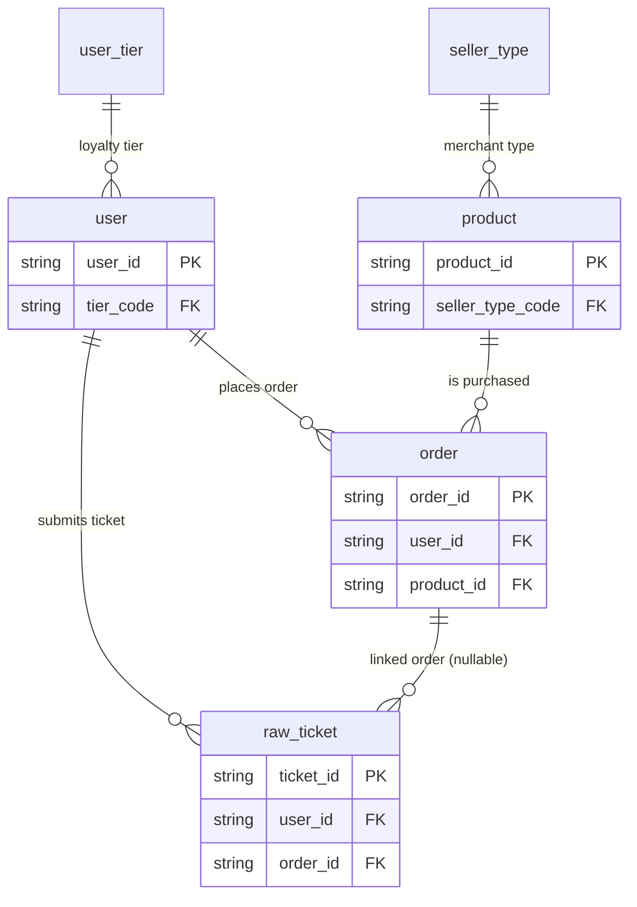
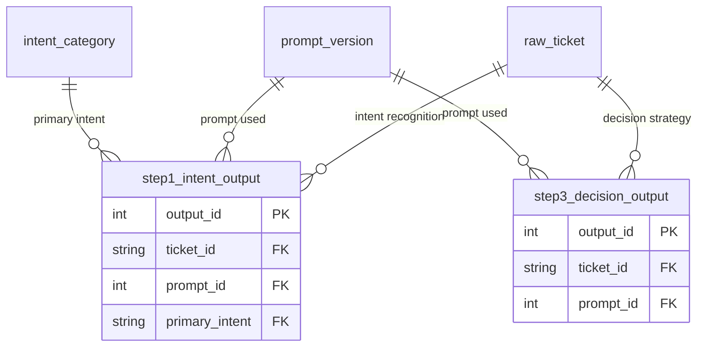
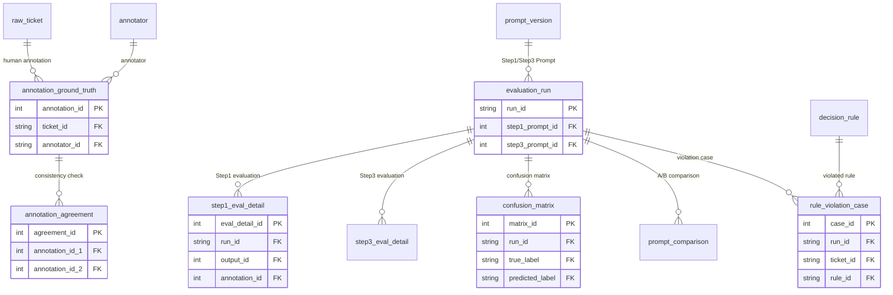
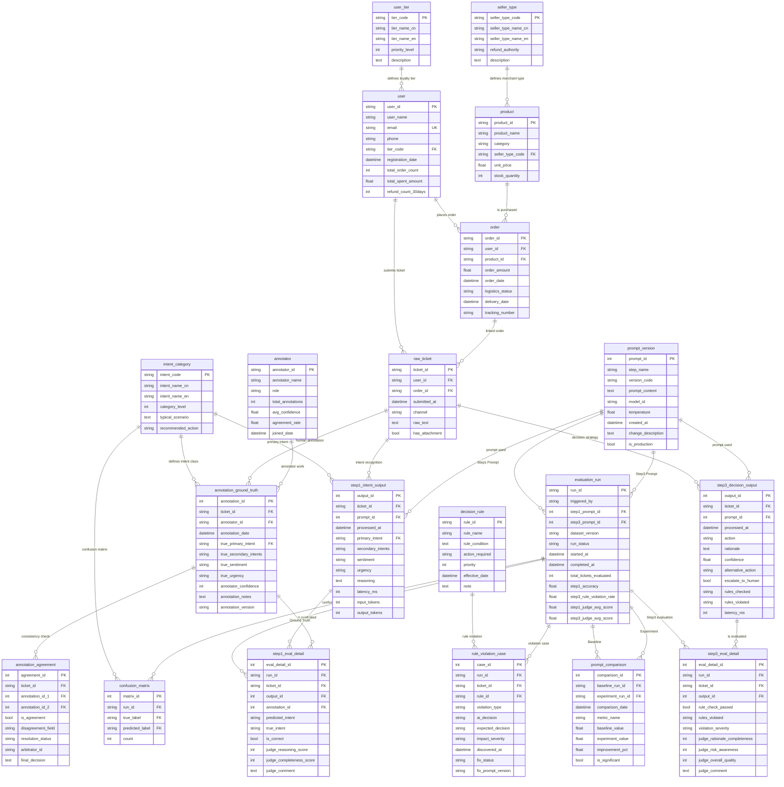

# E-commerce Platform — AI Customer Service Ticket Processing System · Data Structure (ER) Document

> **For business context, industry primer, glossary, and KPI formulas, see [`01-ecommerce_ai_customer_service_high_business_context.md`](01-ecommerce_ai_customer_service_high_business_context.md). This document only describes the data (tables, fields, foreign keys, distributions, generation rules, DDL).**

> **Dataset:** `ecommerce_ai_customer_service_high`
> **Complexity:** High
> **Total tables:** 20
> **Total rows:** ~25,700
> **Foreign-key relationships:** 34 (including 1 set of paired dual FKs: `annotation_agreement.annotation_id_1` / `annotation_id_2` both point to `annotation_ground_truth`, recording two annotations for the same ticket)
> **Reference date (REFERENCE_DATE, the fixed "today" for queries):** `2024-12-01`
> **Generated by:** Fake Data Generator Agent

---

## Table of Contents

1. [Business Context (Migrated)](#1-business-context-migrated)
2. [Glossary (Migrated)](#2-glossary-migrated)
3. [Dataset Overview](#3-dataset-overview)
4. [Entity Relationship Diagram](#4-entity-relationship-diagram)
5. [Table Definitions](#5-table-definitions)
6. [Foreign Key Catalog](#6-foreign-key-catalog)
7. [Data Generation Rules](#7-data-generation-rules)
8. [File Manifest](#8-file-manifest)
9. [SQLite DDL](#9-sqlite-ddl)
10. [KPI Dictionary (Migrated)](#10-kpi-dictionary-migrated)
11. [BI Subject Areas and Dashboard Blueprint (Migrated)](#11-bi-subject-areas-and-dashboard-blueprint-migrated)
12. [Appendix: Common Query Pattern Index](#12-appendix-common-query-pattern-index)

> Note: §1 Business Context, §2 Glossary, §10 KPI Dictionary, and §11 BI Blueprint have all been migrated to the business context document `01-...business_context.md` per the 0.2.1 spec; only pointers remain here. Sections from §3 onward are the actual data-structure content.

---

## 1. Business Context (Migrated)

The company profile, business model, industry overview, project background (intern Alex's three-role setup and timeline), the capabilities this dataset supports, and the business narrative of the 4-step AI customer service pipeline have all been migrated to the business context document per the 0.2.1 spec:

> See [`01-ecommerce_ai_customer_service_high_business_context.md`](01-ecommerce_ai_customer_service_high_business_context.md), §1 Company / §2 Business Model / §3 Industry Overview / §4 Project Background / §7.1 AI Customer Service Pipeline.

From §3 onward, this document covers only the data itself.

---

## 2. Glossary (Migrated)

All glossary entries for customer service industry, AI/LLM engineering, data annotation, model evaluation, and business rules (R001–R007) have been migrated to the business context document:

> See [`01-ecommerce_ai_customer_service_high_business_context.md`](01-ecommerce_ai_customer_service_high_business_context.md), §8 Glossary and §7.2 Decision Rules table.

---

## 3. Dataset Overview

| Metric | Value |
|--------|-------|
| Total tables | 20 |
| Total rows | ~25,700 |
| Total foreign-key relationships | 34 |
| Junction-like (paired dual FKs) | 1 (`annotation_agreement` uses `annotation_id_1` / `annotation_id_2` as paired FKs into `annotation_ground_truth`, recording two annotations for the same ticket; not self-referencing) |
| Event-level tables | 6 (raw_ticket, step1_intent_output, step3_decision_output, step1_eval_detail, step3_eval_detail, rule_violation_case) |
| Number of business domains | 6 (enumerations / business entities / AI pipeline / annotation / evaluation / rule violations) |
| Time span | 2024-09-25 to 2024-11-30 (about 9 weeks) |

### 3.1 Row counts per table

| # | Table | Rows | Type |
|---|-------|------|------|
| 01 | user_tier | 5 | Enum |
| 02 | seller_type | 2 | Enum |
| 03 | intent_category | 12 | Enum |
| 04 | decision_rule | 7 | Rule config |
| 05 | annotator | 10 | Annotation team |
| 06 | prompt_version | 8 | Prompt versions |
| 07 | user | 500 | Business entity |
| 08 | product | 200 | Business entity |
| 09 | order | 2,000 | Business entity |
| 10 | raw_ticket | **5,000** | Event (main fact table) |
| 11 | step1_intent_output | **5,000** | AI output (1 row per ticket) |
| 12 | step3_decision_output | **5,000** | AI output (1 row per ticket) |
| 13 | annotation_ground_truth | ~1,000 | Annotation (500 sample tickets × 2 annotators) |
| 14 | annotation_agreement | ~500 | Consistency checks |
| 15 | evaluation_run | 6 | Evaluation runs |
| 16 | step1_eval_detail | ~3,000 | 500 samples × 6 runs |
| 17 | step3_eval_detail | ~3,000 | 500 samples × 6 runs |
| 18 | confusion_matrix | ~250 | Confusion matrix records across runs (aggregated from step1_eval_detail) |
| 19 | prompt_comparison | 15 | Version-comparison records |
| 20 | rule_violation_case | ~150 | Rule-violation case library |
| | **Total** | **~25,700** | |

### 3.2 Key business distributions

#### User loyalty tier distribution (`user`, 500 rows)

| Tier | Share | Rows |
|------|-------|------|
| new | 15% | ~75 |
| regular | 40% | ~200 |
| vip_silver | 25% | ~125 |
| vip_gold | 15% | ~75 |
| vip_platinum | 5% | ~25 |

#### Merchant type distribution (`product`, 200 rows)

| Type | Share | Rows |
|------|-------|------|
| nestmart_original (first-party) | 70% | ~140 |
| third_party | 30% | ~60 |

#### Ticket intent stratified sampling (`raw_ticket`, 5,000 rows)

| Intent code | Share | Rows | Business meaning |
|-------------|-------|------|------------------|
| dispute_non_receipt | 25% | ~1,250 | Shipping dispute — did not receive |
| refund_request | 20% | ~1,000 | Refund request |
| dispute_damaged | 15% | ~750 | Shipping dispute — received damaged |
| exchange_request | 10% | ~500 | Exchange request |
| complaint_quality | 10% | ~500 | Quality complaint |
| logistics_inquiry | 10% | ~500 | Shipping inquiry |
| policy_inquiry | 10% | ~500 | Policy question |

> **Note:** The "true intent" of a ticket (`raw_ticket`) only covers the **7** main intents above. The other 2 main intents in `intent_category` — `dispute_wrong_item` (received wrong item) and `complaint_service` (service complaint) — plus the 3 sub-intents **never appear as a ticket's true intent**, but they do appear as AI/annotator "wrong-prediction values" in `step1_eval_detail.predicted_intent` and `confusion_matrix.predicted_label` (i.e., they are "classes things get mistaken for," not "classes real tickets actually belong to"). So per-intent accuracy and the "true label" dimension of the confusion matrix cover only these 7 classes. The evaluation sample (`annotation_ground_truth`, 500 rows) is a **stratified random sample** of all 5,000 tickets covering these 7 intents, with proportions matching the table above.

#### Prompt iteration impact (`evaluation_run`, 6 rows)

| Run ID | Step1 Prompt | Step1 accuracy | Step3 rule violation rate |
|--------|--------------|----------------|----------------------------|
| eval_20241110_140000 | v1 | 81.0% | 12.0% |
| eval_20241112_093000 | v2 | 87.0% | 4.2% |
| eval_20241115_143000 | v3 (sentiment tuning) | 87.5% | 4.0% |
| eval_20241119_100000 | v4 (added few-shot) | 89.0% | 3.5% |
| eval_20241123_140000 | v5 (production) | 90.5% | 3.0% |
| eval_20241128_090000 | v5 (regression check) | 90.2% | 3.1% |

---

## 4. Entity Relationship Diagram

20 tables span 6 business domains. To make this easier to read, we first show 3 **per-domain subgraphs** (only PKs and FKs), then a **full attribute diagram** containing every field.

### 4.1 Subgraph A — Business entities and tickets (enums → user/product/order → ticket)



### 4.2 Subgraph B — AI processing pipeline (ticket → Step1 / Step3 outputs)



### 4.3 Subgraph C — Annotation · Evaluation · Rule violations



### 4.4 Full attribute diagram (all fields)



---

## 5. Table Definitions

### Domain 1: Enums and Configuration (5 tables)

#### 5.1 `user_tier` (User loyalty tier)

**Description:** Defines NestMart's user loyalty tier system. The tier determines the SLA (24h vs 48h) and whether rule R006 fires (VIP shipping dispute = priority full refund). **When Alex builds BI dashboards, nearly every "by loyalty tier" chart references this table.**

| Column | Type | Constraint | Description |
|--------|------|------------|-------------|
| tier_code | VARCHAR(20) | PK | Tier code |
| tier_name_cn | VARCHAR(50) | NOT NULL | Chinese name |
| tier_name_en | VARCHAR(50) | NOT NULL | English name |
| priority_level | INTEGER | NOT NULL | Priority (1 = lowest to 5 = highest) |
| description | TEXT | | Tier description (includes spend threshold) |

**All 5 rows:**

| tier_code | tier_name_cn | priority_level | description |
|-----------|--------------|----------------|-------------|
| new | 新用户 | 1 | Registered <30 days or hasn't completed first order |
| regular | 普通会员 | 2 | Completed first order with lifetime spend <$500 |
| vip_silver | 白银会员 | 3 | Lifetime spend $500–$1500 |
| vip_gold | 黄金会员 | 4 | Lifetime spend $1500–$5000 |
| vip_platinum | 铂金会员 | 5 | Lifetime spend >$5000 |

**Referenced by:** `user.tier_code`

---

#### 5.2 `seller_type` (Merchant type)

**Description:** Distinguishes first-party goods from third-party merchant goods, which determines who owns the refund decision. **This is the most critical business-rule trigger for Step 3 decision-making — rule R002 is built directly on this table's `refund_authority` field.**

| Column | Type | Constraint | Description |
|--------|------|------------|-------------|
| seller_type_code | VARCHAR(20) | PK | Merchant type code |
| seller_type_name_cn | VARCHAR(50) | NOT NULL | Chinese name |
| seller_type_name_en | VARCHAR(50) | NOT NULL | English name |
| refund_authority | VARCHAR(50) | | Refund decision authority (`platform` / `merchant`) |
| description | TEXT | | Type description |

**All 2 rows:**

| seller_type_code | seller_type_name_cn | refund_authority | description |
|------------------|---------------------|------------------|-------------|
| nestmart_original | NestMart 自营 | platform | Platform first-party goods; refund authority sits with the platform |
| third_party | 第三方商家 | merchant | Third-party merchants; returns and exchanges are handled by the merchant |

**Referenced by:** `product.seller_type_code`

---

#### 5.3 `intent_category` (Intent classification)

**Description:** The label set for Step 1 intent recognition. 9 **main intents** (`category_level=1`) + 3 **sub-intents** (`category_level=2`). The `recommended_action` column gives Step 3 a baseline suggestion — but **the final decision still has to layer on R001–R007** before producing output.

| Column | Type | Constraint | Description |
|--------|------|------------|-------------|
| intent_code | VARCHAR(50) | PK | Intent code |
| intent_name_cn | VARCHAR(100) | NOT NULL | Chinese name |
| intent_name_en | VARCHAR(100) | NOT NULL | English name |
| category_level | INTEGER | | 1 = main intent, 2 = sub-intent |
| typical_scenario | TEXT | | Typical scenario description (referenced by the Prompt) |
| recommended_action | VARCHAR(50) | | Recommended action (used as Step 3 baseline) |

**The 9 main intents (level=1):**

| intent_code | intent_name_cn | typical_scenario |
|-------------|----------------|-------------------|
| dispute_non_receipt | 物流纠纷 - 未收到货 | Shipper says delivered, but user claims didn't actually receive |
| dispute_damaged | 物流纠纷 - 收到破损 | Item damaged in transit |
| dispute_wrong_item | 物流纠纷 - 收到错误商品 | Received item doesn't match the order |
| refund_request | 退款请求 | Standard refund such as 7-day no-questions-asked |
| exchange_request | 换货请求 | User wants exchange instead of refund |
| logistics_inquiry | 物流查询 | Asking about shipping status, no dispute |
| complaint_quality | 质量投诉 | Product quality issue (already used) |
| complaint_service | 服务投诉 | Complaint about agent attitude or service quality |
| policy_inquiry | 政策咨询 | Asking about return / exchange policy |

**The 3 sub-intents (level=2):**

| intent_code | intent_name_cn |
|-------------|----------------|
| reship_request | 重发请求 |
| compensation_request | 补偿要求 |
| complaint_logistics | 物流服务投诉 |

**Referenced by:** `step1_intent_output.primary_intent`, `annotation_ground_truth.true_primary_intent`, `confusion_matrix.true_label / predicted_label`

---

#### 5.4 `decision_rule` (Business rules)

**Description:** The business rule library used by the Step 3 decision engine. Rules are matched in ascending `priority` order; the `action_required` of the first matched rule is the expected action. **When Alex is debugging the Step 3 Prompt, he often pastes this table's contents directly into the Prompt so the LLM can "memorize the rules."**

The full 7 rules are listed in §2.5; here we only show the table schema:

| Column | Type | Constraint | Description |
|--------|------|------------|-------------|
| rule_id | VARCHAR(10) | PK | Rule number (R001 to R007) |
| rule_name | VARCHAR(200) | NOT NULL | Human-readable rule name |
| rule_condition | TEXT | NOT NULL | Trigger condition (pseudocode) |
| action_required | VARCHAR(50) | NOT NULL | Expected action |
| priority | INTEGER | NOT NULL | Priority (lower number = higher priority) |
| effective_date | DATETIME | | Effective date |
| note | TEXT | | Notes (business meaning) |

**Referenced by:** `rule_violation_case.rule_id`, `step3_decision_output.rules_checked / rules_violated` (the latter two are JSON arrays)

---

#### 5.5 `annotator` (Annotator)

**Description:** Information about annotation team members. Three roles: `annotator`, `reviewer`, `arbitrator` (handles annotation disputes). `agreement_rate` is the Cohen's Kappa score, reflecting how consistent this annotator is with the rest of the team.

| Column | Type | Constraint | Description |
|--------|------|------------|-------------|
| annotator_id | VARCHAR(20) | PK | Annotator ID |
| annotator_name | VARCHAR(100) | NOT NULL | Name |
| role | VARCHAR(30) | | annotator / reviewer / arbitrator |
| total_annotations | INTEGER | | Total annotations done |
| avg_confidence | FLOAT | | Average confidence (1.0–3.0) |
| agreement_rate | FLOAT | NULL | Cohen's Kappa (only annotators; arbitrators are NULL) |
| joined_date | DATETIME | NOT NULL | Date joined |

**Sample data (3 of 10 rows):**

| annotator_id | annotator_name | role | total_annotations | agreement_rate |
|--------------|----------------|------|-------------------|----------------|
| ANN001 | 张晓月 | annotator | 250 | 0.92 |
| ANN005 | 刘美琪 | annotator | 220 | 0.87 |
| ARB001 | 赵建国 | arbitrator | 45 | NULL |

**Referenced by:** `annotation_ground_truth.annotator_id`

---

### Domain 2: Business Entities (3 tables)

#### 5.6 `user` (User)

**Description:** The NestMart user master table. `refund_count_30days` is the trigger field for rule R004 (high-frequency refund users escalated to human). `tier_code` determines SLA tier and whether R006 fires.

| Column | Type | Constraint | Description |
|--------|------|------------|-------------|
| user_id | VARCHAR(20) | PK | User ID (format U00000001) |
| user_name | VARCHAR(100) | NOT NULL | Name |
| email | VARCHAR(255) | UNIQUE | Email |
| phone | VARCHAR(20) | | Phone |
| tier_code | VARCHAR(20) | FK → user_tier | Loyalty tier |
| registration_date | DATETIME | NOT NULL | Registration date |
| total_order_count | INTEGER | DEFAULT 0 | Lifetime order count |
| total_spent_amount | FLOAT | DEFAULT 0.0 | Lifetime spend (USD) |
| refund_count_30days | INTEGER | DEFAULT 0 | Refunds in the past 30 days |

**Generation rules:**
- Loyalty tier distribution: 15% new / 40% regular / 25% silver / 15% gold / 5% platinum
- Order count and spend within each tier sit in plausible ranges
- ~3% of users have `refund_count_30days >= 3`, triggering R004

**Referenced by:** `order.user_id`, `raw_ticket.user_id`

---

#### 5.7 `product` (Product)

**Description:** Product SKU table, spanning 4 main categories. `seller_type_code` determines refund authority (R002).

| Column | Type | Constraint | Description |
|--------|------|------------|-------------|
| product_id | VARCHAR(20) | PK | Product ID (format SKU000001) |
| product_name | VARCHAR(200) | NOT NULL | Product name |
| category | VARCHAR(50) | NOT NULL | Bedding / Kitchen / Home Organization / Lighting |
| seller_type_code | VARCHAR(20) | FK → seller_type | First-party / Third-party |
| unit_price | FLOAT | NOT NULL | Unit price (USD) |
| stock_quantity | INTEGER | DEFAULT 0 | Stock |

**Generation rules:**
- 70% first-party + 30% third-party
- Price ranges: Bedding $50–250, Kitchen $30–120, Home Organization $25–100, Lighting $60–300

**Referenced by:** `order.product_id`

---

#### 5.8 `order` (Order)

**Description:** Order record. `logistics_status` is the trigger field for rule R005 (don't mark as lost while in transit).

| Column | Type | Constraint | Description |
|--------|------|------------|-------------|
| order_id | VARCHAR(30) | PK | ORD-2024-XXXXXX |
| user_id | VARCHAR(20) | FK → user | User |
| product_id | VARCHAR(20) | FK → product | Product |
| order_amount | FLOAT | NOT NULL | Order amount (USD) |
| order_date | DATETIME | NOT NULL | Order date |
| logistics_status | VARCHAR(50) | | in_transit / delivered / signed / lost |
| delivery_date | DATETIME | NULL | Delivery date |
| tracking_number | VARCHAR(50) | | Tracking number |

**Logistics status distribution:** 70% signed / 15% delivered / 10% in_transit / 5% lost

**Referenced by:** `raw_ticket.order_id` (nullable; inquiry-type tickets don't link to an order)

---

### Domain 3: AI Processing Pipeline (3 tables)

#### 5.9 `raw_ticket` (Raw ticket) — main fact table

**Description:** Raw user-submitted ticket data, the input to the entire AI pipeline. **This is the largest table in the dataset (~5,000 rows) and the starting point for the vast majority of SQL analyses.**

| Column | Type | Constraint | Description |
|--------|------|------------|-------------|
| ticket_id | VARCHAR(20) | PK | Format T00000001 |
| user_id | VARCHAR(20) | FK → user | Submitting user |
| order_id | VARCHAR(30) | FK → order, NULL | Linked order (nullable for inquiry-type) |
| submitted_at | DATETIME | NOT NULL | Submission time |
| channel | VARCHAR(20) | | web_form / app / chat / email / phone_transcript |
| raw_text | TEXT | NOT NULL | User's raw text (≥50 chars) |
| has_attachment | BOOLEAN | DEFAULT FALSE | Whether it has an attachment (photo evidence, R007) |

**Generation rules:**
- Stratified sampling by intent: 25% dispute_non_receipt + 20% refund_request + 15% dispute_damaged + 10% × 4 others
- 70% of tickets link to an order, 30% do not (inquiry type)
- 30% contain an attachment (mostly damage complaints)
- Channel distribution: 50% web_form / 25% app / 15% chat / 7% email / 3% phone_transcript

**Referenced by:** `step1_intent_output.ticket_id`, `step3_decision_output.ticket_id`, `annotation_ground_truth.ticket_id`, `annotation_agreement.ticket_id`, `step1_eval_detail.ticket_id`, `step3_eval_detail.ticket_id`, `rule_violation_case.ticket_id`

---

#### 5.10 `step1_intent_output` (Step 1 intent recognition output)

**Description:** The output of Step 1 of the AI system. Each ticket produces 1 row (so this table has ~5,000 rows, one-to-one with `raw_ticket`). `prompt_id` points to the Prompt version used to generate it, so you can trace "which Prompt version produced which output."

| Column | Type | Constraint | Description |
|--------|------|------------|-------------|
| output_id | INTEGER | PK, AUTO | Output ID |
| ticket_id | VARCHAR(20) | FK → raw_ticket | Linked ticket |
| prompt_id | INTEGER | FK → prompt_version | Prompt version used |
| processed_at | DATETIME | NOT NULL | Processing time |
| primary_intent | VARCHAR(50) | FK → intent_category | Main intent |
| secondary_intents | VARCHAR(200) | | List of sub-intents (JSON array string) |
| sentiment | VARCHAR(20) | | satisfied / neutral / frustrated / angry |
| urgency | VARCHAR(20) | | low / medium / high |
| reasoning | TEXT | | AI reasoning trace (the basis for LLM Judge scoring) |
| latency_ms | INTEGER | | Processing latency (ms) |
| input_tokens | INTEGER | | Input token count |
| output_tokens | INTEGER | | Output token count |

---

#### 5.11 `step3_decision_output` (Step 3 decision strategy output)

**Description:** The decision output of Step 3, one row per ticket. `rules_checked` is the list of rules the AI checked while deciding; `rules_violated` is the list of rules violated — if the latter is non-empty, the AI emitted a non-compliant decision, which `rule_violation_case` will pick up.

| Column | Type | Constraint | Description |
|--------|------|------------|-------------|
| output_id | INTEGER | PK, AUTO | Output ID |
| ticket_id | VARCHAR(20) | FK → raw_ticket | Linked ticket |
| prompt_id | INTEGER | FK → prompt_version | Prompt version used |
| processed_at | DATETIME | NOT NULL | Processing time |
| action | VARCHAR(50) | NOT NULL | full_refund / partial_refund / reship / transfer_to_merchant / reject / escalate_to_human |
| rationale | TEXT | | Decision reasoning |
| confidence | FLOAT | | Confidence (0.0–1.0) |
| alternative_action | VARCHAR(50) | NULL | Alternative action |
| escalate_to_human | BOOLEAN | DEFAULT FALSE | Whether escalated to human |
| rules_checked | VARCHAR(200) | | Rules checked (JSON array) |
| rules_violated | VARCHAR(200) | | Rules violated (JSON array) |
| latency_ms | INTEGER | | Processing latency |

---

### Domain 4: Annotation and Consistency (2 tables)

#### 5.12 `annotation_ground_truth` (Human-annotated Ground Truth)

**Description:** The "correct answer" from human annotation. **Note: not every ticket is annotated.** Annotation is expensive, so a **stratified random sample** of 500 tickets out of 5,000 is annotated (stratified by true intent, covering all 7 ticket intent classes), each by 2 annotators independently — about 1,000 records total. `annotation_date` is after the ticket's `submitted_at` and before the first evaluation run.

| Column | Type | Constraint | Description |
|--------|------|------------|-------------|
| annotation_id | INTEGER | PK, AUTO | Annotation ID |
| ticket_id | VARCHAR(20) | FK → raw_ticket | Ticket |
| annotator_id | VARCHAR(20) | FK → annotator | Annotator |
| annotation_date | DATETIME | NOT NULL | Annotation date |
| true_primary_intent | VARCHAR(50) | FK → intent_category | True main intent |
| true_secondary_intents | VARCHAR(200) | | True sub-intents (JSON) |
| true_sentiment | VARCHAR(20) | | True sentiment |
| true_urgency | VARCHAR(20) | | True urgency |
| annotator_confidence | INTEGER | | 1 = unsure, 2 = fairly sure, 3 = very sure |
| annotation_notes | TEXT | NULL | Notes when there is disagreement |
| annotation_version | VARCHAR(10) | DEFAULT 'v2' | Annotation SOP version |

**Generation rules:**
- Each evaluated ticket is annotated by 2 annotators → ~1,000 rows total
- 95% agreement between the two, 5% disagree (these go to arbitration)

---

#### 5.13 `annotation_agreement` (Annotation consistency check)

**Description:** Consistency record for dual annotation. Rows with `is_agreement = FALSE` are arbitrated, with the final call written to `final_decision`.

| Column | Type | Constraint | Description |
|--------|------|------------|-------------|
| agreement_id | INTEGER | PK, AUTO | |
| ticket_id | VARCHAR(20) | FK → raw_ticket | |
| annotation_id_1 | INTEGER | FK → annotation_ground_truth | Annotator 1 |
| annotation_id_2 | INTEGER | FK → annotation_ground_truth | Annotator 2 |
| is_agreement | BOOLEAN | NOT NULL | Whether they agreed |
| disagreement_field | VARCHAR(50) | NULL | Field of disagreement (typically primary_intent) |
| resolution_status | VARCHAR(20) | | pending / resolved / escalated |
| arbitrator_id | VARCHAR(20) | NULL | Arbitrator ID |
| final_decision | TEXT | NULL | Final arbitration decision |

---

### Domain 5: Prompts and Evaluation (5 tables)

#### 5.14 `prompt_version` (Prompt version)

**Description:** Prompt version management table. Step1 has 5 versions (v1–v5), Step3 has 3 versions (v1–v3), totaling 8 rows. `is_production = TRUE` is the current production version.

| Column | Type | Constraint | Description |
|--------|------|------------|-------------|
| prompt_id | INTEGER | PK, AUTO | |
| step_name | VARCHAR(50) | NOT NULL | step1_intent / step3_decision |
| version_code | VARCHAR(20) | NOT NULL | v1 / v2 / ... |
| prompt_content | TEXT | NOT NULL | Full Prompt content (placeholder text in this dataset) |
| model_id | VARCHAR(100) | NOT NULL | Claude 3.5 Sonnet (anthropic.claude-3-5-sonnet-20241022-v2:0) |
| temperature | FLOAT | DEFAULT 0.0 | 0.0 = deterministic output |
| created_at | DATETIME | NOT NULL | |
| change_description | TEXT | | Change notes (what this version changed and why) |
| is_production | BOOLEAN | DEFAULT FALSE | Whether it is the current production version |

**Step1 Prompt iteration history:**

| version | Change notes |
|---------|--------------|
| v1 | Initial version |
| v2 | Fixed `dispute_non_receipt` being misclassified as `refund_request`; added the "read the whole message first" instruction |
| v3 | Improved sentiment detection: "angry" is no longer over-generalized |
| v4 | Added 5 few-shot examples (covering the hardest-to-distinguish intent pairs) |
| v5 | Current production version, fine-tuned urgency thresholds |

---

#### 5.15 `evaluation_run` (Evaluation run record)

**Description:** Metadata and rolled-up metrics for each Evaluation run. 6 runs corresponding to the v1→v5 Prompt iteration journey.

| Column | Type | Constraint | Description |
|--------|------|------------|-------------|
| run_id | VARCHAR(50) | PK | eval_YYYYMMDD_HHMMSS |
| triggered_by | VARCHAR(30) | | manual / github_push / scheduled |
| step1_prompt_id | INTEGER | FK → prompt_version | Step1 Prompt used |
| step3_prompt_id | INTEGER | FK → prompt_version | Step3 Prompt used |
| dataset_version | VARCHAR(20) | NOT NULL | Annotation dataset version |
| run_status | VARCHAR(20) | | running / completed / failed |
| started_at | DATETIME | NOT NULL | |
| completed_at | DATETIME | NULL | |
| total_tickets_evaluated | INTEGER | NULL | Tickets evaluated (~500/run) |
| step1_accuracy | FLOAT | NULL | Step1 accuracy |
| step3_rule_violation_rate | FLOAT | NULL | Step3 rule violation rate |
| step1_judge_avg_score | FLOAT | NULL | Step1 LLM Judge average score (1–5) |
| step3_judge_avg_score | FLOAT | NULL | Step3 LLM Judge average score (1–5) |

**The arc of all 6 runs is shown in §3.2 Dataset Overview.**

---

#### 5.16 `step1_eval_detail` (Step1 detailed evaluation results)

**Description:** Step1 per-ticket × per-run detail. `is_correct` is the Reference-based evaluation result (compared against Ground Truth); the `judge_*_score` fields are LLM-as-Judge scores. The two are complementary: Reference-based covers classification correctness, LLM Judge covers reasoning quality.

| Column | Type | Constraint | Description |
|--------|------|------------|-------------|
| eval_detail_id | INTEGER | PK, AUTO | |
| run_id | VARCHAR(50) | FK → evaluation_run | |
| ticket_id | VARCHAR(20) | FK → raw_ticket | |
| output_id | INTEGER | FK → step1_intent_output | AI output |
| annotation_id | INTEGER | FK → annotation_ground_truth | Ground Truth |
| predicted_intent | VARCHAR(50) | | AI's predicted intent |
| true_intent | VARCHAR(50) | | True intent (from Ground Truth) |
| is_correct | BOOLEAN | | predicted == true |
| judge_reasoning_score | INTEGER | | LLM Judge: reasoning quality (1–5) |
| judge_completeness_score | INTEGER | | LLM Judge: completeness (0/1) |
| judge_comment | TEXT | NULL | LLM Judge comment |

**Scale:** ~500 evaluation samples × 6 runs = ~3,000 rows

---

#### 5.17 `step3_eval_detail` (Step3 detailed evaluation results)

**Description:** Step3 per-ticket × per-run detail. Beyond LLM Judge scores, the core field is `rule_check_passed` — whether all rules pass directly drives the `evaluation_run.step3_rule_violation_rate` metric.

| Column | Type | Constraint | Description |
|--------|------|------------|-------------|
| eval_detail_id | INTEGER | PK, AUTO | |
| run_id | VARCHAR(50) | FK → evaluation_run | |
| ticket_id | VARCHAR(20) | FK → raw_ticket | |
| output_id | INTEGER | FK → step3_decision_output | AI output |
| rule_check_passed | BOOLEAN | | Whether all rules passed |
| rules_violated | VARCHAR(200) | | Rules violated (JSON) |
| violation_severity | VARCHAR(20) | NULL | critical / high / medium |
| judge_rationale_completeness | INTEGER | | Judge: reasoning completeness (1–5) |
| judge_risk_awareness | INTEGER | | Judge: risk awareness (0/1) |
| judge_overall_quality | INTEGER | | Judge: overall quality (1–5) |
| judge_comment | TEXT | NULL | |

**Scale:** ~500 evaluation samples × 6 runs = ~3,000 rows

---

#### 5.18 `confusion_matrix` (Confusion matrix)

**Description:** Intent classification confusion matrix. Each row means "in evaluation run X, the count of tickets where true label = X and predicted label = Y." **This is Alex's core tool for iterating on the Step1 Prompt — by scanning the cells with the highest off-diagonal counts, he can identify the most-confused intent pairs.**

| Column | Type | Constraint | Description |
|--------|------|------------|-------------|
| matrix_id | INTEGER | PK, AUTO | |
| run_id | VARCHAR(50) | FK → evaluation_run | |
| true_label | VARCHAR(50) | FK → intent_category | True label |
| predicted_label | VARCHAR(50) | FK → intent_category | Predicted label |
| count | INTEGER | NOT NULL | Sample count (only stored when >0) |

**Generation method (important):** This table is **aggregated from `step1_eval_detail`** — group by `(run_id, true_intent, predicted_intent)` and count, rather than being constructed independently. Therefore: for each run, the sum of all `count` values **= the run's evaluation sample size (~500)**, and is fully consistent with the correctness in `step1_eval_detail`. The true-label dimension contains only the 7 ticket intent classes (see §3.2), while the predicted-label dimension may include other intents the model misclassified into.

**Scale:** 7 true intents × (diagonal + several off-diagonal misclassifications) × 6 runs ≈ 250 rows

---

#### 5.19 `prompt_comparison` (Prompt version comparison)

**Description:** A/B test result records. `baseline_run_id` is the baseline version's evaluation run ID, `experiment_run_id` is the experiment version's. One version pair can produce multiple rows (one per comparison metric).

| Column | Type | Constraint | Description |
|--------|------|------------|-------------|
| comparison_id | INTEGER | PK, AUTO | |
| baseline_run_id | VARCHAR(50) | FK → evaluation_run | Baseline run |
| experiment_run_id | VARCHAR(50) | FK → evaluation_run | Experiment run |
| comparison_date | DATETIME | NOT NULL | |
| metric_name | VARCHAR(50) | | step1_accuracy / dispute_non_receipt_accuracy / step3_rule_violation_rate / ... |
| baseline_value | FLOAT | | |
| experiment_value | FLOAT | | |
| improvement_pct | FLOAT | | Improvement percentage (can be negative) |
| is_significant | BOOLEAN | | Statistical significance |

---

### Domain 6: Rule Violation Case Library (1 table)

#### 5.20 `rule_violation_case` (Rule violation case)

**Description:** Rule-violation cases discovered in each evaluation. This table is **the Quality Manager's daily audit workbench** — weekly QA walks through the most severe cases in this table to figure out whether the AI failed to understand the rule, or the Prompt phrasing wasn't clear.

| Column | Type | Constraint | Description |
|--------|------|------------|-------------|
| case_id | INTEGER | PK, AUTO | |
| run_id | VARCHAR(50) | FK → evaluation_run | The run that surfaced this issue |
| ticket_id | VARCHAR(20) | FK → raw_ticket | |
| rule_id | VARCHAR(10) | FK → decision_rule | Rule violated |
| violation_type | VARCHAR(50) | | unauthorized_refund / threshold_exceeded / missing_escalation / premature_decision |
| ai_decision | VARCHAR(50) | | AI's decision |
| expected_decision | VARCHAR(50) | | Rule's expected decision |
| impact_severity | VARCHAR(20) | | critical / high / medium / low |
| discovered_at | DATETIME | NOT NULL | |
| fix_status | VARCHAR(20) | DEFAULT 'open' | open / fixed / wont_fix |
| fix_prompt_version | VARCHAR(20) | NULL | Prompt version that fixed it (e.g., v2) |

**Scale:** ~150 cases (most surfaced in the v1 evaluation, gradually worked down by subsequent versions)

---

## 6. Foreign Key Catalog

34 foreign-key relationships in total (consistent with ORM/DDL).

| FK source | → References | Nullable | Notes |
|-----------|--------------|----------|-------|
| `user.tier_code` | `user_tier.tier_code` | NO | |
| `product.seller_type_code` | `seller_type.seller_type_code` | NO | |
| `order.user_id` | `user.user_id` | NO | |
| `order.product_id` | `product.product_id` | NO | |
| `raw_ticket.user_id` | `user.user_id` | NO | |
| `raw_ticket.order_id` | `order.order_id` | YES | 30% inquiry-type tickets don't link to an order |
| `step1_intent_output.ticket_id` | `raw_ticket.ticket_id` | NO | |
| `step1_intent_output.prompt_id` | `prompt_version.prompt_id` | NO | |
| `step1_intent_output.primary_intent` | `intent_category.intent_code` | NO | |
| `step3_decision_output.ticket_id` | `raw_ticket.ticket_id` | NO | |
| `step3_decision_output.prompt_id` | `prompt_version.prompt_id` | NO | |
| `annotation_ground_truth.ticket_id` | `raw_ticket.ticket_id` | NO | |
| `annotation_ground_truth.annotator_id` | `annotator.annotator_id` | NO | |
| `annotation_ground_truth.true_primary_intent` | `intent_category.intent_code` | NO | |
| `annotation_agreement.ticket_id` | `raw_ticket.ticket_id` | NO | |
| `annotation_agreement.annotation_id_1` | `annotation_ground_truth.annotation_id` | NO | |
| `annotation_agreement.annotation_id_2` | `annotation_ground_truth.annotation_id` | NO | |
| `evaluation_run.step1_prompt_id` | `prompt_version.prompt_id` | NO | |
| `evaluation_run.step3_prompt_id` | `prompt_version.prompt_id` | NO | |
| `step1_eval_detail.run_id` | `evaluation_run.run_id` | NO | |
| `step1_eval_detail.ticket_id` | `raw_ticket.ticket_id` | NO | |
| `step1_eval_detail.output_id` | `step1_intent_output.output_id` | NO | |
| `step1_eval_detail.annotation_id` | `annotation_ground_truth.annotation_id` | NO | |
| `step3_eval_detail.run_id` | `evaluation_run.run_id` | NO | |
| `step3_eval_detail.ticket_id` | `raw_ticket.ticket_id` | NO | |
| `step3_eval_detail.output_id` | `step3_decision_output.output_id` | NO | |
| `confusion_matrix.run_id` | `evaluation_run.run_id` | NO | |
| `confusion_matrix.true_label` | `intent_category.intent_code` | NO | |
| `confusion_matrix.predicted_label` | `intent_category.intent_code` | NO | |
| `prompt_comparison.baseline_run_id` | `evaluation_run.run_id` | NO | |
| `prompt_comparison.experiment_run_id` | `evaluation_run.run_id` | NO | |
| `rule_violation_case.run_id` | `evaluation_run.run_id` | NO | |
| `rule_violation_case.ticket_id` | `raw_ticket.ticket_id` | NO | |
| `rule_violation_case.rule_id` | `decision_rule.rule_id` | NO | |

---

## 7. Data Generation Rules

### 7.1 Topological order

1. **Enums and config (no dependencies):** user_tier, seller_type, intent_category, decision_rule, annotator, prompt_version
2. **Business entities:** user (depends on user_tier), product (depends on seller_type)
3. **Orders:** order (depends on user and product)
4. **Tickets:** raw_ticket (depends on user and order)
5. **AI outputs:** step1_intent_output, step3_decision_output (depend on raw_ticket and prompt_version)
6. **Annotation:** annotation_ground_truth (depends on raw_ticket and annotator)
7. **Consistency:** annotation_agreement (depends on annotation_ground_truth)
8. **Evaluation:** evaluation_run (depends on prompt_version)
9. **Evaluation detail:** step1_eval_detail, step3_eval_detail (depend on evaluation_run + output + annotation)
10. **Aggregation:** confusion_matrix, prompt_comparison, rule_violation_case (depend on evaluation_run)

### 7.2 Temporal ordering constraints

1. `user.registration_date` is between 2022-01 and 2024-09, earlier than the user's orders
2. `order.order_date` is between 2024-09-01 and 2024-10-31 (60-day window), **always earlier** than the related raw_ticket
3. `raw_ticket.submitted_at` is between 2024-11-01 and 2024-11-30 (30-day window)
4. `step1/step3_decision_output.processed_at` immediately follows `raw_ticket.submitted_at` (AI handles in seconds: step1 = submission + 1–4 seconds, step3 = submission + 5–9 seconds), **always after** `submitted_at` → handling time is always positive
5. `prompt_version.created_at` is earlier than the `evaluation_run.started_at` that uses it
6. `evaluation_run.started_at` < `completed_at` (NULL means running)
7. `annotation_ground_truth.annotation_date` = ticket `submitted_at` + 1–2 days (**after the ticket is submitted**), and earlier than the first evaluation run (2024-11-10), i.e., the evaluation sample is drawn from tickets submitted before 11-07

### 7.3 Key business distributions

| Distribution | Target |
|--------------|--------|
| Loyalty tier | 15% new / 40% regular / 25% silver / 15% gold / 5% platinum |
| Merchant type | 70% nestmart_original / 30% third_party |
| Logistics status | 70% signed / 15% delivered / 10% in_transit / 5% lost |
| Ticket intent (main) | 25% dispute_non_receipt / 20% refund_request / 15% dispute_damaged / 10% × 4 others |
| Ticket linked to order | 70% linked to order / 30% not linked (inquiry type) |
| Ticket with attachment | 30% include photo (mostly damage cases) |
| Ticket sentiment (Step1 output) | ~50% neutral / 25% frustrated / 20% angry / 5% satisfied |
| Ticket urgency | ~40% medium / 30% high / 30% low |
| Dual-annotation agreement rate | 95% agree / 5% disagree |
| Annotator confidence | 60% level-3 / 35% level-2 / 5% level-1 |
| Step3 decision action | 35% full_refund / 20% reship / 15% transfer_to_merchant / 15% escalate_to_human / 10% reject / 5% partial_refund |
| Rule violation rate (v1) | ~12% |
| Rule violation rate (v2–v5) | 3–5% (decreasing with each version) |

### 7.4 Faker strategy

| Field | Faker method | Notes |
|-------|--------------|-------|
| user_name | `fake.name()` | Chinese name (locale=zh_CN) |
| email | `fake.unique.email()` | |
| phone | `fake.phone_number()` | |
| product_name | Template `"{category}-{item}-{color}"` | item and color sampled from predefined lists |
| ticket text | Template + real-scenario fragments | Each of the 9 intents has 2–3 templates |
| tracking_number | `f"SF{rand12d}"` | Mimics SF Express tracking number |
| dates | `random_date_between(start, end)` | Uniform distribution |
| reasoning / rationale | Template + `fake.text()` | Brief explanation |

### 7.5 Configuration constants

```python
RANDOM_SEED = 42
FAKER_LOCALE = "zh_CN"
TODAY = datetime(2024, 12, 1)
TICKETS_TOTAL = 5000
EVAL_SAMPLE_SIZE = 500
TOTAL_USERS = 500
TOTAL_PRODUCTS = 200
TOTAL_ORDERS = 2000
```

Re-running the generator with the same seed produces byte-identical output.

> Note: the `FAKER_LOCALE = "zh_CN"` config constant only affects the **literal string value** of `user_name` / `annotator_name` and similar person-name fields, making them Chinese; the business setting, currency (USD), cities, and regulatory context remain North American (see the business context document). This is a pre-existing dataset setting that this upgrade did not change.

### 7.6 Business trap declarations (deliberately injected distributions)

The following are distribution biases and correlations the generator **deliberately injects**. Each has an expected magnitude and is surfaced by the matching SQL query in `03-..._sql_queries.md`. When reviewing the data, you should be able to observe these magnitudes in it.

| # | Trap name | Deliberately injected content | Expected magnitude | Surfacing query |
|---|-----------|-------------------------------|--------------------|-----------------|
| T1 | **Intent confusion (business-realistic misclassification)** | Step1 hits the true intent ~88% of the time, misclassifies ~12%; of those misclassifications, 60% land on the "most easily confused intent pairs" (e.g., `dispute_non_receipt → refund_request`, `dispute_damaged → complaint_quality`) | The peak off-diagonal cell in v1's confusion matrix is `dispute_non_receipt → refund_request` | Q3, Q19 |
| T2 | **Monotonic improvement across Prompt iterations** | Across 6 runs, `step1_accuracy` monotonically increases and `step3_rule_violation_rate` monotonically decreases | Accuracy 0.81 → ~0.90 (+~9pp); violation rate 0.12 → ~0.03 (drops ~75%) | Q2, Q12, Q20 |
| T3 | **R002 is the #1 compliance risk** | `rule_violation_case.rule_id` is weighted so R002 (AI unilaterally approving a third-party refund) is the most frequent | R002 ~35% > R003 ~25% > the rest; the v1 run has the most violations | Q4, Q13 |
| T4 | **High-frequency refund users (R004 anti-fraud)** | About 3% of non-new users have `refund_count_30days` in 3–6 | Roughly 10–20 users in the dataset trigger the R004 threshold (≥3) | Q6 |
| T5 | **AI cost crushes human cost** | Token cost per ticket is deliberately set far below human cost | AI per ticket ≈ \$0.005–0.01 vs human ≈ \$4.69/ticket | Q7 |
| T6 | **SLA ≈ 100% (counterintuitive, for teaching)** | SLA is judged by "handling time = `processed_at − submitted_at`", not "ticket age"; AI handles in seconds | SLA compliance ≈ 100% across all tiers; the real latency is on tickets escalated to humans | Q14 |

> **Anti-trap declaration (equally important to prevent over-interpretation):** The following dimensions are **sampled independently** and the generator **does not** preset strong correlations: ① ticket intent vs product category (Q11); ② rule violation cases vs order `seller_type` (Q13); ③ user value tiers vs ticket type / escalation rate (Q16). The expected results for these queries already state: the templates are meant to "**test** for correlation on real data," not to showcase strong correlations baked into this dataset. Don't treat them as injected traps like T1–T6 when reviewing.

### 7.7 Self-consistency invariants (guaranteed by the generator, verifiable in review)

To keep the evaluation chain internally consistent, the generator enforces these invariants (corresponding to "critical fixes" in the generator):

1. **Confusion matrix is derived from evaluation detail.** `confusion_matrix` is aggregated from `step1_eval_detail` by `(run_id, true_intent, predicted_intent)` → each run's `SUM(count)` = that run's evaluation sample size (~500), and is fully consistent with the detail-level correctness.
2. **Run headers = detail aggregation.** `evaluation_run.step1_accuracy` / `step3_rule_violation_rate` / `judge averages` are backfilled by aggregating the corresponding details, eliminating the noise gap between "hardcoded header values" and "re-sampled details."
3. **A/B comparison references real metrics.** `prompt_comparison.baseline_value` / `experiment_value` are taken directly from the real metrics in `evaluation_run` and per-intent accuracy from the detail, not hardcoded.
4. **Cross-table attribution is consistent.** For tickets linked to an order, `raw_ticket.user_id` = the order's `user_id` (you won't see "user A's ticket hanging off user B's order").
5. **Annotator workload rollup.** `annotator.total_annotations` (front-line annotators) is backfilled from the actual count of Ground Truth records they produced.

---

## 8. File Manifest

| # | Filename | Table | Rows | Dependencies |
|---|----------|-------|------|--------------|
| 01 | 01_user_tier.tsv | user_tier | 5 | — |
| 02 | 02_seller_type.tsv | seller_type | 2 | — |
| 03 | 03_intent_category.tsv | intent_category | 12 | — |
| 04 | 04_decision_rule.tsv | decision_rule | 7 | — |
| 05 | 05_annotator.tsv | annotator | 10 | — |
| 06 | 06_prompt_version.tsv | prompt_version | 8 | — |
| 07 | 07_user.tsv | user | 500 | user_tier |
| 08 | 08_product.tsv | product | 200 | seller_type |
| 09 | 09_order.tsv | order | 2,000 | user, product |
| 10 | 10_raw_ticket.tsv | raw_ticket | **5,000** | user, order |
| 11 | 11_step1_intent_output.tsv | step1_intent_output | **5,000** | raw_ticket, prompt_version, intent_category |
| 12 | 12_step3_decision_output.tsv | step3_decision_output | **5,000** | raw_ticket, prompt_version |
| 13 | 13_annotation_ground_truth.tsv | annotation_ground_truth | ~1,000 | raw_ticket, annotator, intent_category |
| 14 | 14_annotation_agreement.tsv | annotation_agreement | ~500 | annotation_ground_truth |
| 15 | 15_evaluation_run.tsv | evaluation_run | 6 | prompt_version |
| 16 | 16_step1_eval_detail.tsv | step1_eval_detail | ~3,000 | evaluation_run, step1_intent_output, annotation_ground_truth |
| 17 | 17_step3_eval_detail.tsv | step3_eval_detail | ~3,000 | evaluation_run, step3_decision_output |
| 18 | 18_confusion_matrix.tsv | confusion_matrix | ~280 | evaluation_run, intent_category |
| 19 | 19_prompt_comparison.tsv | prompt_comparison | 15 | evaluation_run |
| 20 | 20_rule_violation_case.tsv | rule_violation_case | ~150 | evaluation_run, raw_ticket, decision_rule |
| | **Total** | **20 tables** | **~25,700** | |

---

## 9. SQLite DDL

```sql
-- 01 user_tier
CREATE TABLE user_tier (
    tier_code VARCHAR(20) PRIMARY KEY,
    tier_name_cn VARCHAR(50) NOT NULL,
    tier_name_en VARCHAR(50) NOT NULL,
    priority_level INTEGER NOT NULL,
    description TEXT
);

-- 02 seller_type
CREATE TABLE seller_type (
    seller_type_code VARCHAR(20) PRIMARY KEY,
    seller_type_name_cn VARCHAR(50) NOT NULL,
    seller_type_name_en VARCHAR(50) NOT NULL,
    refund_authority VARCHAR(50),
    description TEXT
);

-- 03 intent_category
CREATE TABLE intent_category (
    intent_code VARCHAR(50) PRIMARY KEY,
    intent_name_cn VARCHAR(100) NOT NULL,
    intent_name_en VARCHAR(100) NOT NULL,
    category_level INTEGER,
    typical_scenario TEXT,
    recommended_action VARCHAR(50)
);

-- 04 decision_rule
CREATE TABLE decision_rule (
    rule_id VARCHAR(10) PRIMARY KEY,
    rule_name VARCHAR(200) NOT NULL,
    rule_condition TEXT NOT NULL,
    action_required VARCHAR(50) NOT NULL,
    priority INTEGER NOT NULL,
    effective_date DATETIME,
    note TEXT
);

-- 05 annotator
CREATE TABLE annotator (
    annotator_id VARCHAR(20) PRIMARY KEY,
    annotator_name VARCHAR(100) NOT NULL,
    role VARCHAR(30),
    total_annotations INTEGER DEFAULT 0,
    avg_confidence FLOAT,
    agreement_rate FLOAT,
    joined_date DATETIME NOT NULL
);

-- 06 prompt_version
CREATE TABLE prompt_version (
    prompt_id INTEGER PRIMARY KEY AUTOINCREMENT,
    step_name VARCHAR(50) NOT NULL,
    version_code VARCHAR(20) NOT NULL,
    prompt_content TEXT NOT NULL,
    model_id VARCHAR(100) NOT NULL,
    temperature FLOAT DEFAULT 0.0,
    created_at DATETIME NOT NULL,
    change_description TEXT,
    is_production BOOLEAN DEFAULT 0
);

-- 07 user
CREATE TABLE user (
    user_id VARCHAR(20) PRIMARY KEY,
    user_name VARCHAR(100) NOT NULL,
    email VARCHAR(255) UNIQUE,
    phone VARCHAR(20),
    tier_code VARCHAR(20) REFERENCES user_tier(tier_code),
    registration_date DATETIME NOT NULL,
    total_order_count INTEGER DEFAULT 0,
    total_spent_amount FLOAT DEFAULT 0.0,
    refund_count_30days INTEGER DEFAULT 0
);

-- 08 product
CREATE TABLE product (
    product_id VARCHAR(20) PRIMARY KEY,
    product_name VARCHAR(200) NOT NULL,
    category VARCHAR(50) NOT NULL,
    seller_type_code VARCHAR(20) REFERENCES seller_type(seller_type_code),
    unit_price FLOAT NOT NULL,
    stock_quantity INTEGER DEFAULT 0
);

-- 09 order
CREATE TABLE "order" (
    order_id VARCHAR(30) PRIMARY KEY,
    user_id VARCHAR(20) REFERENCES user(user_id),
    product_id VARCHAR(20) REFERENCES product(product_id),
    order_amount FLOAT NOT NULL,
    order_date DATETIME NOT NULL,
    logistics_status VARCHAR(50),
    delivery_date DATETIME,
    tracking_number VARCHAR(50)
);

-- 10 raw_ticket
CREATE TABLE raw_ticket (
    ticket_id VARCHAR(20) PRIMARY KEY,
    user_id VARCHAR(20) REFERENCES user(user_id),
    order_id VARCHAR(30) REFERENCES "order"(order_id),
    submitted_at DATETIME NOT NULL,
    channel VARCHAR(20),
    raw_text TEXT NOT NULL,
    has_attachment BOOLEAN DEFAULT 0
);

-- 11 step1_intent_output
CREATE TABLE step1_intent_output (
    output_id INTEGER PRIMARY KEY AUTOINCREMENT,
    ticket_id VARCHAR(20) REFERENCES raw_ticket(ticket_id),
    prompt_id INTEGER REFERENCES prompt_version(prompt_id),
    processed_at DATETIME NOT NULL,
    primary_intent VARCHAR(50) REFERENCES intent_category(intent_code),
    secondary_intents VARCHAR(200),
    sentiment VARCHAR(20),
    urgency VARCHAR(20),
    reasoning TEXT,
    latency_ms INTEGER,
    input_tokens INTEGER,
    output_tokens INTEGER
);

-- 12 step3_decision_output
CREATE TABLE step3_decision_output (
    output_id INTEGER PRIMARY KEY AUTOINCREMENT,
    ticket_id VARCHAR(20) REFERENCES raw_ticket(ticket_id),
    prompt_id INTEGER REFERENCES prompt_version(prompt_id),
    processed_at DATETIME NOT NULL,
    action VARCHAR(50) NOT NULL,
    rationale TEXT,
    confidence FLOAT,
    alternative_action VARCHAR(50),
    escalate_to_human BOOLEAN DEFAULT 0,
    rules_checked VARCHAR(200),
    rules_violated VARCHAR(200),
    latency_ms INTEGER
);

-- 13 annotation_ground_truth
CREATE TABLE annotation_ground_truth (
    annotation_id INTEGER PRIMARY KEY AUTOINCREMENT,
    ticket_id VARCHAR(20) REFERENCES raw_ticket(ticket_id),
    annotator_id VARCHAR(20) REFERENCES annotator(annotator_id),
    annotation_date DATETIME NOT NULL,
    true_primary_intent VARCHAR(50) REFERENCES intent_category(intent_code),
    true_secondary_intents VARCHAR(200),
    true_sentiment VARCHAR(20),
    true_urgency VARCHAR(20),
    annotator_confidence INTEGER,
    annotation_notes TEXT,
    annotation_version VARCHAR(10) DEFAULT 'v2'
);

-- 14 annotation_agreement
CREATE TABLE annotation_agreement (
    agreement_id INTEGER PRIMARY KEY AUTOINCREMENT,
    ticket_id VARCHAR(20) REFERENCES raw_ticket(ticket_id),
    annotation_id_1 INTEGER REFERENCES annotation_ground_truth(annotation_id),
    annotation_id_2 INTEGER REFERENCES annotation_ground_truth(annotation_id),
    is_agreement BOOLEAN NOT NULL,
    disagreement_field VARCHAR(50),
    resolution_status VARCHAR(20),
    arbitrator_id VARCHAR(20),
    final_decision TEXT
);

-- 15 evaluation_run
CREATE TABLE evaluation_run (
    run_id VARCHAR(50) PRIMARY KEY,
    triggered_by VARCHAR(30),
    step1_prompt_id INTEGER REFERENCES prompt_version(prompt_id),
    step3_prompt_id INTEGER REFERENCES prompt_version(prompt_id),
    dataset_version VARCHAR(20) NOT NULL,
    run_status VARCHAR(20),
    started_at DATETIME NOT NULL,
    completed_at DATETIME,
    total_tickets_evaluated INTEGER,
    step1_accuracy FLOAT,
    step3_rule_violation_rate FLOAT,
    step1_judge_avg_score FLOAT,
    step3_judge_avg_score FLOAT
);

-- 16 step1_eval_detail
CREATE TABLE step1_eval_detail (
    eval_detail_id INTEGER PRIMARY KEY AUTOINCREMENT,
    run_id VARCHAR(50) REFERENCES evaluation_run(run_id),
    ticket_id VARCHAR(20) REFERENCES raw_ticket(ticket_id),
    output_id INTEGER REFERENCES step1_intent_output(output_id),
    annotation_id INTEGER REFERENCES annotation_ground_truth(annotation_id),
    predicted_intent VARCHAR(50),
    true_intent VARCHAR(50),
    is_correct BOOLEAN,
    judge_reasoning_score INTEGER,
    judge_completeness_score INTEGER,
    judge_comment TEXT
);

-- 17 step3_eval_detail
CREATE TABLE step3_eval_detail (
    eval_detail_id INTEGER PRIMARY KEY AUTOINCREMENT,
    run_id VARCHAR(50) REFERENCES evaluation_run(run_id),
    ticket_id VARCHAR(20) REFERENCES raw_ticket(ticket_id),
    output_id INTEGER REFERENCES step3_decision_output(output_id),
    rule_check_passed BOOLEAN,
    rules_violated VARCHAR(200),
    violation_severity VARCHAR(20),
    judge_rationale_completeness INTEGER,
    judge_risk_awareness INTEGER,
    judge_overall_quality INTEGER,
    judge_comment TEXT
);

-- 18 confusion_matrix
CREATE TABLE confusion_matrix (
    matrix_id INTEGER PRIMARY KEY AUTOINCREMENT,
    run_id VARCHAR(50) REFERENCES evaluation_run(run_id),
    true_label VARCHAR(50) REFERENCES intent_category(intent_code),
    predicted_label VARCHAR(50) REFERENCES intent_category(intent_code),
    count INTEGER NOT NULL
);

-- 19 prompt_comparison
CREATE TABLE prompt_comparison (
    comparison_id INTEGER PRIMARY KEY AUTOINCREMENT,
    baseline_run_id VARCHAR(50) REFERENCES evaluation_run(run_id),
    experiment_run_id VARCHAR(50) REFERENCES evaluation_run(run_id),
    comparison_date DATETIME NOT NULL,
    metric_name VARCHAR(50),
    baseline_value FLOAT,
    experiment_value FLOAT,
    improvement_pct FLOAT,
    is_significant BOOLEAN
);

-- 20 rule_violation_case
CREATE TABLE rule_violation_case (
    case_id INTEGER PRIMARY KEY AUTOINCREMENT,
    run_id VARCHAR(50) REFERENCES evaluation_run(run_id),
    ticket_id VARCHAR(20) REFERENCES raw_ticket(ticket_id),
    rule_id VARCHAR(10) REFERENCES decision_rule(rule_id),
    violation_type VARCHAR(50),
    ai_decision VARCHAR(50),
    expected_decision VARCHAR(50),
    impact_severity VARCHAR(20),
    discovered_at DATETIME NOT NULL,
    fix_status VARCHAR(20) DEFAULT 'open',
    fix_prompt_version VARCHAR(20)
);

-- Recommended indexes (query performance)
CREATE INDEX idx_ticket_user ON raw_ticket(user_id);
CREATE INDEX idx_ticket_order ON raw_ticket(order_id);
CREATE INDEX idx_ticket_submitted ON raw_ticket(submitted_at);
CREATE INDEX idx_s1_output_ticket ON step1_intent_output(ticket_id);
CREATE INDEX idx_s1_output_prompt ON step1_intent_output(prompt_id);
CREATE INDEX idx_s3_output_ticket ON step3_decision_output(ticket_id);
CREATE INDEX idx_eval_detail_s1_run ON step1_eval_detail(run_id);
CREATE INDEX idx_eval_detail_s3_run ON step3_eval_detail(run_id);
CREATE INDEX idx_cm_run ON confusion_matrix(run_id);
CREATE INDEX idx_violation_run ON rule_violation_case(run_id);
CREATE INDEX idx_violation_rule ON rule_violation_case(rule_id);
```

---

## 10. KPI Dictionary (Migrated)

The definitions and formulas for the four KPI groups — customer service operations / AI system performance / AI quality evaluation / annotation quality — have been migrated to the business context document:

> See [`01-ecommerce_ai_customer_service_high_business_context.md`](01-ecommerce_ai_customer_service_high_business_context.md), §9 Key Metrics and Formulas.

---

## 11. BI Subject Areas and Dashboard Blueprint (Migrated)

The three-tier BI architecture (L1 Analysis / L2 Operations / L3 Strategic), 4 subject areas, and the blueprint for 8 dashboards have been migrated to the business context document:

> See [`01-ecommerce_ai_customer_service_high_business_context.md`](01-ecommerce_ai_customer_service_high_business_context.md), §4 Project Background (BI dashboards).

---

## 12. Appendix: Common Query Pattern Index

| Query scenario | Recommended SQL starting point | Tables involved |
|----------------|--------------------------------|------------------|
| Tickets grouped by user tier | `GROUP BY user.tier_code` | raw_ticket + user |
| Step1 accuracy by intent | `GROUP BY true_intent` | step1_eval_detail |
| Confusion matrix Top-N | `WHERE true_label != predicted_label ORDER BY count DESC` | confusion_matrix |
| Prompt version comparison | `JOIN prompt_version ON baseline.step1_prompt_id` | prompt_comparison + prompt_version |
| Rule violation root cause analysis | `GROUP BY rule_id, violation_type` | rule_violation_case + decision_rule |
| Time-series ticket volume | `GROUP BY DATE(submitted_at)` | raw_ticket |
| High-frequency refund user alert | `WHERE refund_count_30days >= 3` | user |
| Token cost calculation | `SUM(output_tokens) × 0.015 / 1000` | step1_intent_output |
| SLA compliance rate | `(step3.processed_at - submitted_at) ≤ SLA_threshold` | raw_ticket + user + step3_decision_output |
| Dual-annotation agreement rate | `SUM(is_agreement) / COUNT(*)` | annotation_agreement |

The complete set of 20 business-oriented SQL queries (with detailed business context, solution approach, difficulty rating, and expected-result notes) is in [`03-ecommerce_ai_customer_service_high_sql_queries.md`](03-ecommerce_ai_customer_service_high_sql_queries.md) in the same directory.

---

**Generated by:** Fake Data Generator Agent
**Layout spec:** 0.2.1 (four-piece `NN-` prefix; business context as a separate file)
**Reference date:** 2024-12-01
