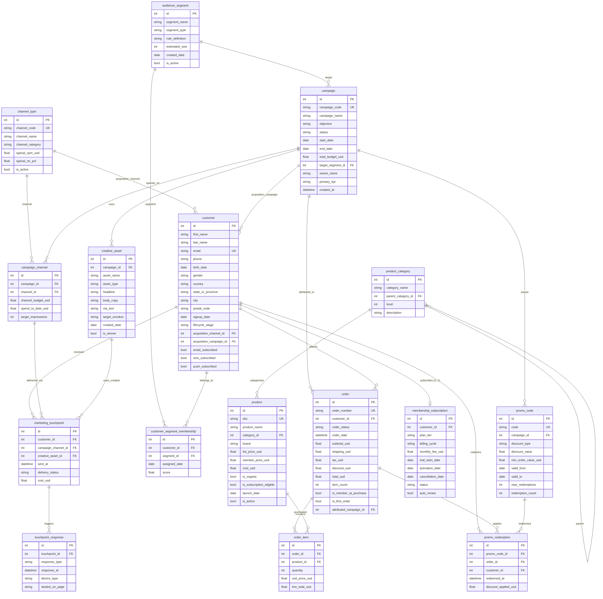

# VerdantBox 电商订阅增长营销 ER 文档

> 业务背景, 行业科普, 术语表请见 `01-ecommerce_subscription_growth_marketing_high_business_context-cn.md`. 本文档只描述数据.

本文件描述 VerdantBox 增长营销数据集的 schema：表、字段、约束、样例数据、生成规则和刻意埋设的业务陷阱。读者应已读过业务背景文档。Schema 把活动定义（campaign）、事件级发送（`marketing_touchpoint`）和用户响应（`touchpoint_response`）解耦，以支持多触点归因和漏斗分析。

## 数据集元信息

- **复杂度等级：** High
- **表数：** 16 张
- **总记录数：** 约 9,000 行
- **关系数：** 14 个 one-to-many，1 个 one-to-one（`customer ↔ membership_subscription`），2 个 many-to-many（连接表），1 个自引用层级（`product_category`）
- **REFERENCE_DATE：** `2026-06-01`（生成器里的 `TODAY` 常量，与 SQL 查询中的日期字面量一致，保证结果可复现）

> ⚠️ **表名 `order` 是 SQL 保留字。** 在裸 SQL 中必须始终加引号引用：`"order"`（SQLite / PostgreSQL）或 `` `order` ``（MySQL）。SQLAlchemy 会自动加引号。

---

## 实体关系图（Entity Relationship Diagram）

---

## 表定义

### 1. channel_type

**描述：** 营销渠道的分类字典（付费 / 自有 / 赚得），附带各渠道的典型经济学指标。

| 字段 | 类型 | 约束 | 描述 |
|--------|------|-------------|-------------|
| id | INTEGER | PK | 主键 |
| channel_code | VARCHAR(40) | UNIQUE, NOT NULL | 短代码，例如 `PAID_SOCIAL_META` |
| channel_name | VARCHAR(80) | NOT NULL | 渠道展示名 |
| channel_category | VARCHAR(20) | NOT NULL | `Owned`（自有）/ `Paid`（付费）/ `Earned`（赚得）之一 |
| typical_cpm_usd | FLOAT | NOT NULL | 行业典型千次曝光成本（CPM） |
| typical_ctr_pct | FLOAT | NOT NULL | 行业典型点击率（CTR，%） |
| is_active | BOOLEAN | NOT NULL | 该渠道是否在生产使用 |

**示例数据：**

| id | channel_code | channel_name | channel_category | typical_cpm_usd | typical_ctr_pct |
|----|--------------|--------------|------------------|-----------------|-----------------|
| 1 | EMAIL | Email Newsletter | Owned | 0.50 | 3.5 |
| 5 | PAID_SOCIAL_META | Paid Social - Meta (FB/IG) | Paid | 9.50 | 1.2 |
| 7 | GOOGLE_ADS | Google Search Ads | Paid | 14.00 | 3.0 |

---

### 2. product_category

**描述：** 两级商品分类树（8 个顶级类 + ~32 个子类）。

| 字段 | 类型 | 约束 | 描述 |
|--------|------|-------------|-------------|
| id | INTEGER | PK | 主键 |
| category_name | VARCHAR(80) | NOT NULL | 分类展示名 |
| parent_category_id | INTEGER | FK → product_category.id, NULL | 自引用；顶级分类为 NULL |
| level | INTEGER | NOT NULL | 1（顶级）或 2（子级） |
| description | TEXT | NOT NULL | 长描述 |

**外键：**
- `parent_category_id` → `product_category.id`（自引用 FK，构建层级）

---

### 3. audience_segment

**描述：** 用于活动定向（targeting）的规则型受众细分定义。

| 字段 | 类型 | 约束 | 描述 |
|--------|------|-------------|-------------|
| id | INTEGER | PK | 主键 |
| segment_name | VARCHAR(120) | NOT NULL | 细分展示名 |
| segment_type | VARCHAR(40) | NOT NULL | `behavioral`、`geo`、`demographic`、`channel_pref`、`subscription`、`category_affinity`、`advocacy` |
| rule_definition | TEXT | NOT NULL | 伪 SQL 或人可读的规则定义 |
| estimated_size | INTEGER | NOT NULL | 营销系统对细分大小的**估算**（见下方说明） |
| created_date | DATE | NOT NULL | 细分创建日期 |
| is_active | BOOLEAN | NOT NULL | 是否在生产使用 |

> **`estimated_size` 与实际 `customer_segment_membership` 的关系：**
> `estimated_size` 是细分被定义时营销系统给出的原始估算（例如"过去 60 天大约 5,000 个沉睡用户"）。当前实际的成员数应该通过
> `COUNT(*) FROM customer_segment_membership WHERE segment_id = ?` 计算。
> 在生成的数据集里这两个数不会一致 —— `estimated_size` 在 800–25,000 区间随机生成，而实际成员是从 1,000 客户基数中抽样得到。
> 在生产环境里，这两个数也会随时间漂移（客户不断进出 segment）。

---

### 4. campaign

**描述：** 营销活动定义。状态横跨 completed / active / planned，同时支持回顾性查询和前瞻性查询。

| 字段 | 类型 | 约束 | 描述 |
|--------|------|-------------|-------------|
| id | INTEGER | PK | 主键 |
| campaign_code | VARCHAR(40) | UNIQUE, NOT NULL | 短代码，例如 `ACQ-202509-007` |
| campaign_name | VARCHAR(150) | NOT NULL | 完整描述性名称 |
| objective | VARCHAR(40) | NOT NULL | `ACQUISITION` / `MEMBERSHIP_CONVERSION` / `REACTIVATION` |
| status | VARCHAR(20) | NOT NULL | `COMPLETED` / `ACTIVE` / `PLANNED` |
| start_date | DATE | NOT NULL | 活动开始日期 |
| end_date | DATE | NOT NULL | 活动结束日期 |
| total_budget_usd | FLOAT | NOT NULL | 总预算 |
| target_segment_id | INTEGER | FK → audience_segment.id, NOT NULL | 主目标细分 |
| owner_name | VARCHAR(80) | NOT NULL | 活动负责人 / DRI |
| primary_kpi | VARCHAR(40) | NOT NULL | 主要成功指标 |
| created_at | DATETIME | NOT NULL | 记录创建时间戳 |

---

### 5. customer

**描述：** 最终用户档案 + 获客归因 + 渠道偏好。

| 字段 | 类型 | 约束 | 描述 |
|--------|------|-------------|-------------|
| id | INTEGER | PK | 主键 |
| first_name, last_name | VARCHAR | NOT NULL | 姓名 |
| email | VARCHAR(150) | UNIQUE, NOT NULL | 登录邮箱 |
| phone | VARCHAR(30) | NOT NULL | 电话 |
| birth_date | DATE | NOT NULL | 出生日期（用于派生年龄） |
| gender | VARCHAR(10) | NOT NULL | `F` / `M` / `NB` / `U` |
| country | VARCHAR(20) | NOT NULL | `USA` 或 `Canada` |
| state_or_province | VARCHAR(40) | NOT NULL | 美国州代码或加拿大省代码 |
| city, postal_code | VARCHAR | NOT NULL | 地址 |
| signup_date | DATE | NOT NULL | 账户注册日期 |
| lifecycle_stage | VARCHAR(20) | NOT NULL | `new` / `active` / `at_risk` / `dormant` / `churned` |
| acquisition_channel_id | INTEGER | FK → channel_type.id, NULL | 获客渠道（NULL = organic 自然流量） |
| acquisition_campaign_id | INTEGER | FK → campaign.id, NULL | 获客活动 |
| email_subscribed, sms_subscribed, push_subscribed | BOOLEAN | NOT NULL | 各渠道订阅意愿 |

---

### 6. product

**描述：** 健康食品 SKU 主数据。

| 字段 | 类型 | 约束 | 描述 |
|--------|------|-------------|-------------|
| id | INTEGER | PK | 主键 |
| sku | VARCHAR(40) | UNIQUE, NOT NULL | SKU 编码 |
| product_name | VARCHAR(150) | NOT NULL | 商品展示名 |
| category_id | INTEGER | FK → product_category.id, NOT NULL | 所属分类 |
| brand | VARCHAR(80) | NOT NULL | 品牌名 |
| list_price_usd | FLOAT | NOT NULL | 标准目录价 |
| member_price_usd | FLOAT | NOT NULL | 会员专享价 |
| cost_usd | FLOAT | NOT NULL | 批发成本 |
| is_organic | BOOLEAN | NOT NULL | 是否 USDA 有机认证 |
| is_subscription_eligible | BOOLEAN | NOT NULL | 是否可加入订阅盒 |
| launch_date | DATE | NOT NULL | 首次上架日期 |
| is_active | BOOLEAN | NOT NULL | 当前是否可售 |

---

### 7. creative_asset

**描述：** 隶属于活动的创意素材（文案 / 标题 / CTA）。

| 字段 | 类型 | 约束 | 描述 |
|--------|------|-------------|-------------|
| id | INTEGER | PK | 主键 |
| campaign_id | INTEGER | FK → campaign.id, NOT NULL | 所属活动 |
| asset_name | VARCHAR(120) | NOT NULL | 内部标签 |
| asset_type | VARCHAR(30) | NOT NULL | `email_html`、`push_copy`、`sms_copy`、`banner_image`、`video_15s`、`video_30s`、`landing_page` |
| headline | VARCHAR(200) | NOT NULL | 标题文案 |
| body_copy | TEXT | NOT NULL | 正文文案 |
| cta_text | VARCHAR(40) | NOT NULL | 行动召唤（CTA）按钮文案 |
| target_emotion | VARCHAR(40) | NOT NULL | `aspirational`（向往）、`relatable`（共鸣）、`educational`（教育）、`urgent`（紧迫）、`trust-building`（建立信任）、`playful`（俏皮） |
| created_date | DATE | NOT NULL | 素材创建日期 |
| is_winner | BOOLEAN | NOT NULL | 是否为 A/B 测试胜出方 |

---

### 8. campaign_channel

**描述：** 按活动 × 渠道的预算和支出分配（M:N 关系）。

| 字段 | 类型 | 约束 | 描述 |
|--------|------|-------------|-------------|
| id | INTEGER | PK | 主键 |
| campaign_id | INTEGER | FK → campaign.id, NOT NULL | 所属活动 |
| channel_id | INTEGER | FK → channel_type.id, NOT NULL | 所属渠道 |
| channel_budget_usd | FLOAT | NOT NULL | 分配到此渠道的预算 |
| spend_to_date_usd | FLOAT | NOT NULL | 已实际支出 |
| target_impressions | INTEGER | NOT NULL | 目标曝光数 |

---

### 9. customer_segment_membership

**描述：** 连接表 —— 哪个客户属于哪个细分，附带分配日期与匹配分数。

| 字段 | 类型 | 约束 | 描述 |
|--------|------|-------------|-------------|
| id | INTEGER | PK | 主键 |
| customer_id | INTEGER | FK → customer.id, NOT NULL | 客户 |
| segment_id | INTEGER | FK → audience_segment.id, NOT NULL | 细分 |
| assigned_date | DATE | NOT NULL | 分配日期 |
| score | FLOAT | NOT NULL | 匹配分数（0–1） |

---

### 10. membership_subscription

**描述：** 每个客户的 VerdantBox+ 会员订阅记录。
**基数关系：** 1:1 —— 每个客户最多一条订阅记录；并非每个客户都有订阅。`status` 字段刻画会员生命周期（`trial` → `active` / `cancelled` / `trial_ended`）。生成器用 `random.sample(customer_ids, k=500)` 强制 `customer_id` 不重复。

| 字段 | 类型 | 约束 | 描述 |
|--------|------|-------------|-------------|
| id | INTEGER | PK | 主键 |
| customer_id | INTEGER | FK → customer.id, NOT NULL | 订阅人 |
| plan_tier | VARCHAR(20) | NOT NULL | `Plus` 或 `Plus Premium` |
| billing_cycle | VARCHAR(20) | NOT NULL | `monthly`（月付）或 `annual`（年付） |
| monthly_fee_usd | FLOAT | NOT NULL | 等效月费 |
| trial_start_date | DATE | NOT NULL | 免费试用开始日期 |
| activation_date | DATE | NULL | 试用转付费的日期（从未转付为 NULL） |
| cancellation_date | DATE | NULL | 取消日期 |
| status | VARCHAR(20) | NOT NULL | `trial` / `trial_ended` / `active` / `cancelled` |
| auto_renew | BOOLEAN | NOT NULL | 是否开启自动续费 |

---

### 11. promo_code

**描述：** 关联到活动的促销码。

| 字段 | 类型 | 约束 | 描述 |
|--------|------|-------------|-------------|
| id | INTEGER | PK | 主键 |
| code | VARCHAR(30) | UNIQUE, NOT NULL | 促销码字符串 |
| campaign_id | INTEGER | FK → campaign.id, NOT NULL | 所属活动 |
| discount_type | VARCHAR(20) | NOT NULL | `PERCENT`（百分比）/ `FIXED`（固定金额）/ `FREE_SHIPPING`（免运费） |
| discount_value | FLOAT | NOT NULL | 折扣值（例如 20 表示 20% 或 $20） |
| min_order_value_usd | FLOAT | NOT NULL | 最低订单 subtotal 门槛 |
| valid_from, valid_to | DATE | NOT NULL | 有效期窗口 |
| max_redemptions | INTEGER | NOT NULL | 核销上限 |
| redemption_count | INTEGER | NOT NULL | 累计核销次数 |

---

### 12. marketing_touchpoint

**描述：** 事件级 —— 每行表示一次营销发送尝试（通过 `delivery_status` 区分 `delivered`、`bounced`、`failed` 三种结果）。

| 字段 | 类型 | 约束 | 描述 |
|--------|------|-------------|-------------|
| id | INTEGER | PK | 主键 |
| customer_id | INTEGER | FK → customer.id, NOT NULL | 接收人 |
| campaign_channel_id | INTEGER | FK → campaign_channel.id, NOT NULL | 哪个 campaign × channel |
| creative_asset_id | INTEGER | FK → creative_asset.id, NOT NULL | 使用的创意素材 |
| sent_at | DATETIME | NOT NULL | 发送时间戳 |
| delivery_status | VARCHAR(20) | NOT NULL | `delivered` / `bounced` / `failed` |
| cost_usd | FLOAT | NOT NULL | 每次发送批次成本 = `channel.typical_cpm_usd × U(2.0, 5.0)`；按 `campaign_channel_id` 汇总后回填 `campaign_channel.spend_to_date_usd` |

---

### 13. touchpoint_response

**描述：** 用户对已投递触点的响应。

| 字段 | 类型 | 约束 | 描述 |
|--------|------|-------------|-------------|
| id | INTEGER | PK | 主键 |
| touchpoint_id | INTEGER | FK → marketing_touchpoint.id, NOT NULL | 源发送触点 |
| response_type | VARCHAR(20) | NOT NULL | `open`（打开）/ `click`（点击）/ `dismiss`（关闭）/ `convert`（转化） |
| response_at | DATETIME | NOT NULL | 响应时间戳 |
| device_type | VARCHAR(20) | NOT NULL | `iOS` / `Android` / `Desktop` / `Tablet` |
| landed_on_page | VARCHAR(100) | NOT NULL | 落地页 URL 路径（无落地页为 `n/a`） |

---

### 14. order

**描述：** 订单头表。包含购买时的会员身份标记和（概率性的）活动归因。

| 字段 | 类型 | 约束 | 描述 |
|--------|------|-------------|-------------|
| id | INTEGER | PK | 主键 |
| order_number | VARCHAR(30) | UNIQUE, NOT NULL | 面向用户的订单号 |
| customer_id | INTEGER | FK → customer.id, NOT NULL | 买家 |
| order_status | VARCHAR(20) | NOT NULL | `processing`（处理中）/ `shipped`（已发货）/ `delivered`（已送达）/ `returned`（已退货）/ `cancelled`（已取消） |
| order_date | DATETIME | NOT NULL | 下单时间戳 |
| subtotal_usd, shipping_usd, tax_usd, discount_usd, total_usd | FLOAT | NOT NULL | 订单金额组成 |
| item_count | INTEGER | NOT NULL | 订单行数 |
| is_member_at_purchase | BOOLEAN | NOT NULL | 下单时买家是否为会员 |
| is_first_order | BOOLEAN | NOT NULL | 是否为该客户的最早订单（=`MIN(order_date)`，由 reconcile 强制保证） |
| attributed_campaign_id | INTEGER | FK → campaign.id, NULL | 见下方归因模型 |

> **归因模型（`attributed_campaign_id`）：** 在生成阶段分两步计算。
> 第一步是真实的 **last-touch 归因** —— 取该客户在订单 60 天前内的最近一次 `click`/`convert` 类 `touchpoint_response`，归属到该 touchpoint 所对应的 campaign。
> 第二步是 **日期窗口回退** —— 如果没有真实 touchpoint 链路，剩余订单中约 70% 会随机分配到一个其窗口覆盖订单日期的 campaign（首单偏向归因为 `ACQUISITION`，复购偏向 `MEMBERSHIP_CONVERSION` / `REACTIVATION`）。生成器日志会输出两条路径的拆分。
> 注意：这是 **campaign 级** 归因，不是 channel 级 —— Q2（Channel ROAS）用 spend-share 加权近似计算渠道级。

---

### 15. order_item

**描述：** 订单明细行。

| 字段 | 类型 | 约束 | 描述 |
|--------|------|-------------|-------------|
| id | INTEGER | PK | 主键 |
| order_id | INTEGER | FK → order.id, NOT NULL | 父订单 |
| product_id | INTEGER | FK → product.id, NOT NULL | 商品 |
| quantity | INTEGER | NOT NULL | 数量 |
| unit_price_usd | FLOAT | NOT NULL | 购买时单价（list_price 或 member_price） |
| line_total_usd | FLOAT | NOT NULL | quantity × unit_price |

---

### 16. promo_redemption

**描述：** 订单上使用的促销码核销记录。

| 字段 | 类型 | 约束 | 描述 |
|--------|------|-------------|-------------|
| id | INTEGER | PK | 主键 |
| promo_code_id | INTEGER | FK → promo_code.id, NOT NULL | 促销码 |
| order_id | INTEGER | FK → order.id, NOT NULL | 订单 |
| customer_id | INTEGER | FK → customer.id, NOT NULL | 核销人 |
| redeemed_at | DATETIME | NOT NULL | 与 order_date 同步 |
| discount_applied_usd | FLOAT | NOT NULL | 实际抵扣的美元金额 |

---

## 数据生成规则

### Reconciled Invariants（生成后由 reconcile 阶段强制保证的不变量）

这些字段在初次 `gen_*` 后由子表反算回写，确保父表与子表口径完全一致。在测试中验证通过，对应生成器中的 `reconcile_*` 函数。

1. `order.subtotal_usd = SUM(order_item.line_total_usd)`（按订单）
2. `order.item_count   = COUNT(order_item)`（按订单）
3. `order.total_usd    = subtotal_usd + shipping_usd + tax_usd − discount_usd`
4. `order_item.line_total_usd = quantity × unit_price_usd`
5. `order.is_first_order = True`，当且仅当此行的 `order_date` 是该客户的 `MIN(order_date)`
6. `campaign_channel.spend_to_date_usd = SUM(marketing_touchpoint.cost_usd)`，按 `campaign_channel_id` 聚合
7. `promo_code.redemption_count = COUNT(promo_redemption)`（按 promo_code）
8. `creative_asset.is_winner` —— 每个 `(campaign_id, asset_type)` 组合**最多** 1 个 winner；组内只有 1 个变体时无 winner

### 业务逻辑约束

1. **时间顺序**
   - `customer.signup_date` ≤ `order.order_date`
   - `marketing_touchpoint.sent_at` ∈ `[campaign.start_date, campaign.end_date]` AND ≥ `customer.signup_date`
   - `touchpoint_response.response_at` > `marketing_touchpoint.sent_at`（72 小时内）
   - `membership_subscription.activation_date` 约在 `trial_start_date` 后 30 天
   - `promo_redemption.redeemed_at` ∈ `[promo_code.valid_from, promo_code.valid_to]`

2. **状态分布真实性**
   - 活动状态比例 ≈ 70% `COMPLETED` / 20% `ACTIVE` / 10% `PLANNED`
   - 订单龄 ≥ 7 天时偏向 `delivered`（~92%）
   - 客户生命周期分布：~5% new / ~40% active / ~18% at_risk / ~22% dormant / ~16% churned

3. **定价与会员经济学**
   - 会员按 `member_price_usd` 购买；非会员按 `list_price_usd`
   - 会员享免运费（`shipping_usd = 0`）
   - **会员篮子更大**（`item_count` 取 3-6，非会员取 1-3）—— 这是"会员 AOV > 非会员 AOV"的底层机制

4. **税**
   - `tax_usd = subtotal_usd × state_tax_rate`，按州/省差异化（例如 CA 9.25%、NY 8%、OR 0%、ON 13%、QC 14.975%），缺省 8%

5. **分布真实性**
   - **会员 AOV ~$225 vs 非会员 ~$120**（实测高 ~87%，由"4.6 vs 2.0 平均件数 × 会员折扣价"共同驱动）
   - 获客渠道分布：Paid Social Meta（22%）> TikTok（18%）> Google（14%）> Referral（12%）> Organic / NULL（17%）
   - 88% 美国 / 12% 加拿大
   - 首单偏向归因到 `ACQUISITION` 活动；复购偏向 `MEMBERSHIP_CONVERSION` / `REACTIVATION`（仅 fallback 路径）

6. **漏斗真实性**
   - 94% 触点成功投递；3% bounce；3% failed
   - 已投递触点中 ~85% 产生响应
   - 响应分布（终态）：50% open / 30% click / 12% dismiss / 8% convert
   - `convert` 隐含用户先点击；`click` 隐含用户先打开

7. **触点成本经济学**
   - 每触点成本 = `channel.typical_cpm_usd × U(2.0, 5.0)` —— 每个触点表示一次批量发送事件，成本随渠道的千次曝光经济学缩放
   - 自有渠道（email、push）<$3 / 触点；付费渠道 $5-$70

8. **归因拆分（当前生成数据实测）**
   - 总归因率：~65% 的订单有 `attributed_campaign_id`
   - 真实 last-touch（有 touchpoint 链路）：占总订单 ~3-10%
   - 日期窗口回退：占总订单 ~55-60%
   - 未归因：~35%（落在无可匹配活动窗口的订单）

### 业务陷阱（Embedded Business Traps）

这一节把上面分散的分布规则提炼成几条**刻意埋设的偏置**。每条陷阱都有名字、预期量级，以及把它暴露出来的 SQL 查询。生成器负责造出这些量级，SQL 查询负责把它们查出来，业务背景文档负责解释它们为什么重要。Reviewer 会按这张表核对生成数据。

| 陷阱 | 预期量级 | 暴露查询 |
|------|---------|---------|
| 会员 AOV 溢价 | 会员 AOV 明显高于非会员，由「会员篮子 3-6 件 vs 非会员 1-3 件 × 会员折扣价」驱动 | Q4 |
| 渠道 ROAS 分层 | Owned 渠道（email、push）近零变动成本，ROAS 居榜首；Paid 渠道 CPM 高、ROAS 靠后 | Q2 |
| 活动目标 ROAS 梯度 | ACQUISITION 的 ROAS 通常低于 REACTIVATION（拉新比唤醒难），MEMBERSHIP_CONVERSION 居中 | Q1 |
| 漏斗逐级流失 | delivered ≈ 94% of sent；engaged ≈ 85% of delivered；click、convert 逐级收窄 | Q3 |
| segment 规模漂移 | `audience_segment.estimated_size`（800–25,000 随机）与实际成员数（从 1,000 客户抽样）系统性不一致 | Q13、Q20 |
| 归因拆分真实性 | ~65% 订单有归因，其中真实 last-touch 仅占 3–10%，其余靠日期窗口回退 | Q1、Q2、Q12 |
| LTV 长尾（Pareto） | Top 20 客户占总收入显著偏高的比例，呈典型长尾分布 | Q6 |
| 预算超支节奏 | 部分 ACTIVE 活动的 `pct_spent` 明显高于 `pct_elapsed`（高出 10pp 以上） | Q17 |

### Faker 生成策略

| 字段模式 | Faker 方法 | 备注 |
|---------------|--------------|-------|
| email | 由 `first_name + last_name + id + domain` 拼接 | 保证唯一 |
| phone | `fake.numerify("###-###-####")` | 北美格式 |
| 人名 | `fake.first_name()` / `fake.last_name()` | Locale `en_US` |
| birth_date | `fake.date_of_birth(minimum_age=18, maximum_age=72)` | 成年人范围 |
| 美国城市 | `fake.city()` | 美国 locale |
| 美国邮编 | `fake.zipcode()` | 5 位 |
| 加拿大邮编 | 随机 `A1A 1A1` 格式 | 手工拼接 |
| body_copy | `fake.paragraph(nb_sentences=3)` | 3 句正文 |

---

## 文件清单（File Manifest）

| # | 文件名 | 表 | 行数 | 依赖 |
|---|----------|-------|------|--------------|
| 01 | 01_channel_type.tsv | channel_type | 10 | 无 |
| 02 | 02_product_category.tsv | product_category | 40 | 自引用 |
| 03 | 03_audience_segment.tsv | audience_segment | 60 | 无 |
| 04 | 04_campaign.tsv | campaign | 50 | audience_segment |
| 05 | 05_customer.tsv | customer | 1000 | channel_type, campaign |
| 06 | 06_product.tsv | product | 500 | product_category |
| 07 | 07_creative_asset.tsv | creative_asset | 200 | campaign |
| 08 | 08_campaign_channel.tsv | campaign_channel | ~159 | campaign, channel_type |
| 09 | 09_customer_segment_membership.tsv | customer_segment_membership | 1000 | customer, audience_segment |
| 10 | 10_membership_subscription.tsv | membership_subscription | 500 | customer（1:1） |
| 11 | 11_promo_code.tsv | promo_code | 80 | campaign |
| 12 | 12_marketing_touchpoint.tsv | marketing_touchpoint | 1000 | customer, campaign_channel, creative_asset |
| 13 | 13_touchpoint_response.tsv | touchpoint_response | ~800 | marketing_touchpoint |
| 14 | 14_order.tsv | order | 1000 | customer, campaign, membership_subscription |
| 15 | 15_order_item.tsv | order_item | ~2,400 | order, product |
| 16 | 16_promo_redemption.tsv | promo_redemption | ~180 | promo_code, order, customer |

合计：16 张表共约 **~9,000 行**。（order_item 增长至 ~2,400，因为每个订单按 `target_item_count` 生成 1-6 个行项，以满足 `subtotal = SUM(line_total)` 不变量。）

---

## 数据库 Schema（SQLite DDL）

完整的 DDL 由 SQLAlchemy 在运行数据生成器时自动生成。每张表都附带完整的 PK + FK 约束。权威 schema 定义见生成器脚本 `ecommerce_subscription_growth_marketing_high_data_generator.py`。
