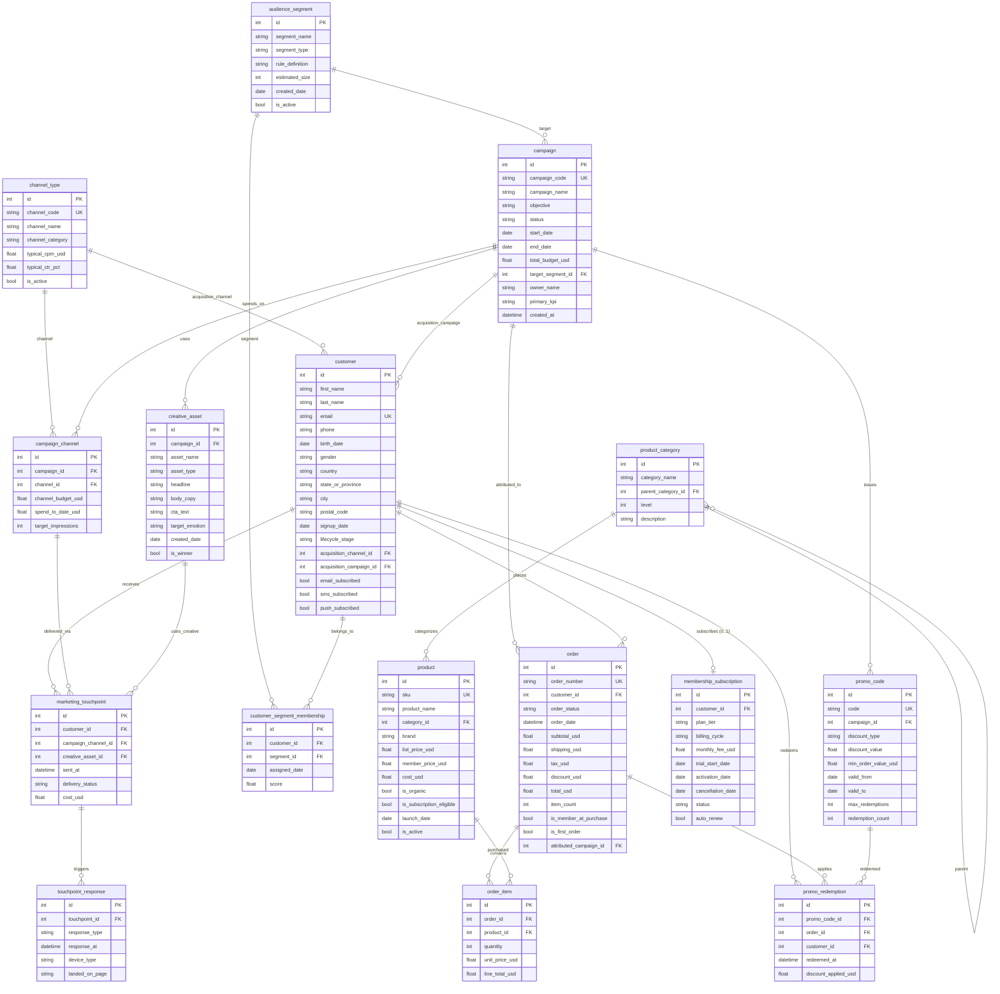

# VerdantBox Ecommerce Subscription Growth Marketing — ER Document

> For business context, industry background, and glossary, see `01-ecommerce_subscription_growth_marketing_high_business_context.md`. This document only describes the data.

This file describes the schema of the VerdantBox growth-marketing dataset: tables, columns, constraints, sample data, generation rules, and the business traps deliberately embedded in the data. The reader is assumed to have already read the business-context document. The schema decouples campaign definition (`campaign`), event-level sends (`marketing_touchpoint`), and user responses (`touchpoint_response`) to support multi-touch attribution and funnel analysis.

## Dataset Metadata

- **Complexity level:** High
- **Number of tables:** 16
- **Total records:** ~9,000 rows
- **Relationships:** 14 one-to-many, 1 one-to-one (`customer ↔ membership_subscription`), 2 many-to-many (via junction tables), 1 self-referencing hierarchy (`product_category`)
- **REFERENCE_DATE:** `2026-06-01` (the `TODAY` constant in the generator, identical to the date literal used in every SQL query, so results are reproducible)

> WARNING: **The table name `order` is a SQL reserved word.** In raw SQL you must always quote it: `"order"` (SQLite / PostgreSQL) or `` `order` `` (MySQL). SQLAlchemy quotes it automatically.

---

## Entity Relationship Diagram

---

## Table Definitions

### 1. channel_type

**Description:** Dictionary table classifying marketing channels (paid / owned / earned), with per-channel typical economics.

| Column | Type | Constraints | Description |
|--------|------|-------------|-------------|
| id | INTEGER | PK | Primary key |
| channel_code | VARCHAR(40) | UNIQUE, NOT NULL | Short code, e.g., `PAID_SOCIAL_META` |
| channel_name | VARCHAR(80) | NOT NULL | Display name |
| channel_category | VARCHAR(20) | NOT NULL | One of `Owned`, `Paid`, `Earned` |
| typical_cpm_usd | FLOAT | NOT NULL | Industry-typical cost per thousand impressions (CPM) |
| typical_ctr_pct | FLOAT | NOT NULL | Industry-typical click-through rate (%) |
| is_active | BOOLEAN | NOT NULL | Whether this channel is currently in production use |

**Sample data:**

| id | channel_code | channel_name | channel_category | typical_cpm_usd | typical_ctr_pct |
|----|--------------|--------------|------------------|-----------------|-----------------|
| 1 | EMAIL | Email Newsletter | Owned | 0.50 | 3.5 |
| 5 | PAID_SOCIAL_META | Paid Social - Meta (FB/IG) | Paid | 9.50 | 1.2 |
| 7 | GOOGLE_ADS | Google Search Ads | Paid | 14.00 | 3.0 |

---

### 2. product_category

**Description:** A two-level product category tree (8 top-level categories + ~32 subcategories).

| Column | Type | Constraints | Description |
|--------|------|-------------|-------------|
| id | INTEGER | PK | Primary key |
| category_name | VARCHAR(80) | NOT NULL | Display name |
| parent_category_id | INTEGER | FK → product_category.id, NULL | Self-reference; top-level categories are NULL |
| level | INTEGER | NOT NULL | 1 (top level) or 2 (sub-level) |
| description | TEXT | NOT NULL | Long description |

**Foreign keys:**
- `parent_category_id` → `product_category.id` (self-referencing FK to build the hierarchy)

---

### 3. audience_segment

**Description:** Rule-based audience definitions used for campaign targeting.

| Column | Type | Constraints | Description |
|--------|------|-------------|-------------|
| id | INTEGER | PK | Primary key |
| segment_name | VARCHAR(120) | NOT NULL | Display name |
| segment_type | VARCHAR(40) | NOT NULL | One of `behavioral`, `geo`, `demographic`, `channel_pref`, `subscription`, `category_affinity`, `advocacy` |
| rule_definition | TEXT | NOT NULL | Pseudo-SQL or human-readable rule definition |
| estimated_size | INTEGER | NOT NULL | The marketing system's **estimated** segment size (see note below) |
| created_date | DATE | NOT NULL | Date the segment was defined |
| is_active | BOOLEAN | NOT NULL | Whether the segment is in production use |

> **Relationship between `estimated_size` and actual `customer_segment_membership`:**
> `estimated_size` is the original estimate the marketing system produced when the segment was defined (e.g., "about 5,000 dormant users in the last 60 days"). The current actual member count should be calculated via
> `COUNT(*) FROM customer_segment_membership WHERE segment_id = ?`.
> In the generated dataset, these two numbers will not match — `estimated_size` is generated randomly in the 800–25,000 range, while actual membership is sampled from a base of 1,000 customers.
> In production, these two numbers also drift over time as customers enter and exit segments.

---

### 4. campaign

**Description:** Marketing campaign definitions. Statuses span completed / active / planned, supporting both retrospective and forward-looking queries.

| Column | Type | Constraints | Description |
|--------|------|-------------|-------------|
| id | INTEGER | PK | Primary key |
| campaign_code | VARCHAR(40) | UNIQUE, NOT NULL | Short code, e.g., `ACQ-202509-007` |
| campaign_name | VARCHAR(150) | NOT NULL | Full descriptive name |
| objective | VARCHAR(40) | NOT NULL | `ACQUISITION` / `MEMBERSHIP_CONVERSION` / `REACTIVATION` |
| status | VARCHAR(20) | NOT NULL | `COMPLETED` / `ACTIVE` / `PLANNED` |
| start_date | DATE | NOT NULL | Campaign start date |
| end_date | DATE | NOT NULL | Campaign end date |
| total_budget_usd | FLOAT | NOT NULL | Total budget |
| target_segment_id | INTEGER | FK → audience_segment.id, NOT NULL | Primary target segment |
| owner_name | VARCHAR(80) | NOT NULL | Campaign owner / DRI |
| primary_kpi | VARCHAR(40) | NOT NULL | The success metric |
| created_at | DATETIME | NOT NULL | Record-creation timestamp |

---

### 5. customer

**Description:** End-user profiles + acquisition attribution + channel preferences.

| Column | Type | Constraints | Description |
|--------|------|-------------|-------------|
| id | INTEGER | PK | Primary key |
| first_name, last_name | VARCHAR | NOT NULL | Name |
| email | VARCHAR(150) | UNIQUE, NOT NULL | Login email |
| phone | VARCHAR(30) | NOT NULL | Phone |
| birth_date | DATE | NOT NULL | Birth date (used to derive age) |
| gender | VARCHAR(10) | NOT NULL | `F` / `M` / `NB` / `U` |
| country | VARCHAR(20) | NOT NULL | `USA` or `Canada` |
| state_or_province | VARCHAR(40) | NOT NULL | U.S. state code or Canadian province code |
| city, postal_code | VARCHAR | NOT NULL | Address |
| signup_date | DATE | NOT NULL | Account signup date |
| lifecycle_stage | VARCHAR(20) | NOT NULL | `new` / `active` / `at_risk` / `dormant` / `churned` |
| acquisition_channel_id | INTEGER | FK → channel_type.id, NULL | Acquisition channel (NULL = organic) |
| acquisition_campaign_id | INTEGER | FK → campaign.id, NULL | Acquisition campaign |
| email_subscribed, sms_subscribed, push_subscribed | BOOLEAN | NOT NULL | Per-channel subscription opt-in |

---

### 6. product

**Description:** Health-food SKU master data.

| Column | Type | Constraints | Description |
|--------|------|-------------|-------------|
| id | INTEGER | PK | Primary key |
| sku | VARCHAR(40) | UNIQUE, NOT NULL | SKU code |
| product_name | VARCHAR(150) | NOT NULL | Display name |
| category_id | INTEGER | FK → product_category.id, NOT NULL | Category |
| brand | VARCHAR(80) | NOT NULL | Brand name |
| list_price_usd | FLOAT | NOT NULL | Standard list price |
| member_price_usd | FLOAT | NOT NULL | Member price |
| cost_usd | FLOAT | NOT NULL | Wholesale cost |
| is_organic | BOOLEAN | NOT NULL | Whether USDA-organic certified |
| is_subscription_eligible | BOOLEAN | NOT NULL | Whether eligible for the subscription box |
| launch_date | DATE | NOT NULL | First listing date |
| is_active | BOOLEAN | NOT NULL | Whether currently sellable |

---

### 7. creative_asset

**Description:** Creative assets (copy / headline / CTA) belonging to a campaign.

| Column | Type | Constraints | Description |
|--------|------|-------------|-------------|
| id | INTEGER | PK | Primary key |
| campaign_id | INTEGER | FK → campaign.id, NOT NULL | Parent campaign |
| asset_name | VARCHAR(120) | NOT NULL | Internal label |
| asset_type | VARCHAR(30) | NOT NULL | `email_html`, `push_copy`, `sms_copy`, `banner_image`, `video_15s`, `video_30s`, `landing_page` |
| headline | VARCHAR(200) | NOT NULL | Headline copy |
| body_copy | TEXT | NOT NULL | Body copy |
| cta_text | VARCHAR(40) | NOT NULL | Call-to-action button text |
| target_emotion | VARCHAR(40) | NOT NULL | `aspirational`, `relatable`, `educational`, `urgent`, `trust-building`, `playful` |
| created_date | DATE | NOT NULL | Asset creation date |
| is_winner | BOOLEAN | NOT NULL | Whether this variant won the A/B test |

---

### 8. campaign_channel

**Description:** Budget and spend allocations per campaign × channel (M:N junction).

| Column | Type | Constraints | Description |
|--------|------|-------------|-------------|
| id | INTEGER | PK | Primary key |
| campaign_id | INTEGER | FK → campaign.id, NOT NULL | Campaign |
| channel_id | INTEGER | FK → channel_type.id, NOT NULL | Channel |
| channel_budget_usd | FLOAT | NOT NULL | Budget allocated to this channel |
| spend_to_date_usd | FLOAT | NOT NULL | Actual spend so far |
| target_impressions | INTEGER | NOT NULL | Target impression count |

---

### 9. customer_segment_membership

**Description:** Junction table — which customer belongs to which segment, with assignment date and match score.

| Column | Type | Constraints | Description |
|--------|------|-------------|-------------|
| id | INTEGER | PK | Primary key |
| customer_id | INTEGER | FK → customer.id, NOT NULL | Customer |
| segment_id | INTEGER | FK → audience_segment.id, NOT NULL | Segment |
| assigned_date | DATE | NOT NULL | Assignment date |
| score | FLOAT | NOT NULL | Match score (0–1) |

---

### 10. membership_subscription

**Description:** A customer's VerdantBox+ membership record.
**Cardinality:** 1:1 — each customer has at most one subscription record, but not every customer has one. The `status` field tracks the membership lifecycle (`trial` → `active` / `cancelled` / `trial_ended`). The generator enforces uniqueness on `customer_id` via `random.sample(customer_ids, k=500)`.

| Column | Type | Constraints | Description |
|--------|------|-------------|-------------|
| id | INTEGER | PK | Primary key |
| customer_id | INTEGER | FK → customer.id, NOT NULL | Subscriber |
| plan_tier | VARCHAR(20) | NOT NULL | `Plus` or `Plus Premium` |
| billing_cycle | VARCHAR(20) | NOT NULL | `monthly` or `annual` |
| monthly_fee_usd | FLOAT | NOT NULL | Equivalent monthly fee |
| trial_start_date | DATE | NOT NULL | Free-trial start date |
| activation_date | DATE | NULL | Date the trial converted to paid (NULL if never converted) |
| cancellation_date | DATE | NULL | Cancellation date |
| status | VARCHAR(20) | NOT NULL | `trial` / `trial_ended` / `active` / `cancelled` |
| auto_renew | BOOLEAN | NOT NULL | Whether auto-renew is enabled |

---

### 11. promo_code

**Description:** Promo codes tied to a campaign.

| Column | Type | Constraints | Description |
|--------|------|-------------|-------------|
| id | INTEGER | PK | Primary key |
| code | VARCHAR(30) | UNIQUE, NOT NULL | The promo code string |
| campaign_id | INTEGER | FK → campaign.id, NOT NULL | Owning campaign |
| discount_type | VARCHAR(20) | NOT NULL | `PERCENT` / `FIXED` / `FREE_SHIPPING` |
| discount_value | FLOAT | NOT NULL | Discount value (e.g., 20 means 20% or $20) |
| min_order_value_usd | FLOAT | NOT NULL | Minimum subtotal to qualify |
| valid_from, valid_to | DATE | NOT NULL | Validity window |
| max_redemptions | INTEGER | NOT NULL | Redemption cap |
| redemption_count | INTEGER | NOT NULL | Cumulative redemption count |

---

### 12. marketing_touchpoint

**Description:** Event-level — each row represents one marketing send attempt (`delivery_status` distinguishes `delivered`, `bounced`, `failed`).

| Column | Type | Constraints | Description |
|--------|------|-------------|-------------|
| id | INTEGER | PK | Primary key |
| customer_id | INTEGER | FK → customer.id, NOT NULL | Recipient |
| campaign_channel_id | INTEGER | FK → campaign_channel.id, NOT NULL | Which campaign × channel |
| creative_asset_id | INTEGER | FK → creative_asset.id, NOT NULL | Creative asset used |
| sent_at | DATETIME | NOT NULL | Send timestamp |
| delivery_status | VARCHAR(20) | NOT NULL | `delivered` / `bounced` / `failed` |
| cost_usd | FLOAT | NOT NULL | Per-send batch cost = `channel.typical_cpm_usd × U(2.0, 5.0)`; rolled up by `campaign_channel_id` and written back to `campaign_channel.spend_to_date_usd` |

---

### 13. touchpoint_response

**Description:** User responses to delivered touchpoints.

| Column | Type | Constraints | Description |
|--------|------|-------------|-------------|
| id | INTEGER | PK | Primary key |
| touchpoint_id | INTEGER | FK → marketing_touchpoint.id, NOT NULL | Source touchpoint |
| response_type | VARCHAR(20) | NOT NULL | `open` / `click` / `dismiss` / `convert` |
| response_at | DATETIME | NOT NULL | Response timestamp |
| device_type | VARCHAR(20) | NOT NULL | `iOS` / `Android` / `Desktop` / `Tablet` |
| landed_on_page | VARCHAR(100) | NOT NULL | Landing-page URL path (`n/a` if no landing page) |

---

### 14. order

**Description:** Order header table. Includes the buyer's member status at purchase and the (probabilistic) campaign attribution.

| Column | Type | Constraints | Description |
|--------|------|-------------|-------------|
| id | INTEGER | PK | Primary key |
| order_number | VARCHAR(30) | UNIQUE, NOT NULL | Customer-facing order number |
| customer_id | INTEGER | FK → customer.id, NOT NULL | Buyer |
| order_status | VARCHAR(20) | NOT NULL | `processing` / `shipped` / `delivered` / `returned` / `cancelled` |
| order_date | DATETIME | NOT NULL | Order timestamp |
| subtotal_usd, shipping_usd, tax_usd, discount_usd, total_usd | FLOAT | NOT NULL | Order amount components |
| item_count | INTEGER | NOT NULL | Number of line items |
| is_member_at_purchase | BOOLEAN | NOT NULL | Whether the buyer was a member at the time of purchase |
| is_first_order | BOOLEAN | NOT NULL | Whether this is the customer's earliest order (= `MIN(order_date)`, enforced by reconcile) |
| attributed_campaign_id | INTEGER | FK → campaign.id, NULL | See attribution model below |

> **Attribution model (`attributed_campaign_id`):** computed in two stages at generation time.
> Stage one is real **last-touch attribution** — find the customer's most recent `click`/`convert` `touchpoint_response` within 60 days before the order, and attribute the order to the campaign behind that touchpoint.
> Stage two is a **date-window fallback** — for the remaining orders, about 70% are randomly assigned to a campaign whose active window covers the order date (first orders skew to `ACQUISITION`; repeat orders skew to `MEMBERSHIP_CONVERSION` / `REACTIVATION`). The generator logs the split between the two paths.
> Note: this is **campaign-level** attribution, not channel-level — Q2 (Channel ROAS) approximates channel-level attribution via spend-share weighting.

---

### 15. order_item

**Description:** Order line items.

| Column | Type | Constraints | Description |
|--------|------|-------------|-------------|
| id | INTEGER | PK | Primary key |
| order_id | INTEGER | FK → order.id, NOT NULL | Parent order |
| product_id | INTEGER | FK → product.id, NOT NULL | Product |
| quantity | INTEGER | NOT NULL | Quantity |
| unit_price_usd | FLOAT | NOT NULL | Unit price at purchase (list_price or member_price) |
| line_total_usd | FLOAT | NOT NULL | quantity × unit_price |

---

### 16. promo_redemption

**Description:** Record of a promo code being redeemed on an order.

| Column | Type | Constraints | Description |
|--------|------|-------------|-------------|
| id | INTEGER | PK | Primary key |
| promo_code_id | INTEGER | FK → promo_code.id, NOT NULL | Promo code |
| order_id | INTEGER | FK → order.id, NOT NULL | Order |
| customer_id | INTEGER | FK → customer.id, NOT NULL | Redeemer |
| redeemed_at | DATETIME | NOT NULL | Synced with order_date |
| discount_applied_usd | FLOAT | NOT NULL | Actual dollar amount discounted |

---

## Data Generation Rules

### Reconciled Invariants (enforced after generation by the reconcile stage)

These columns are recomputed from the child tables and written back into the parent rows after the initial `gen_*` runs, so that parent and child agree exactly. They are verified in tests, and correspond to the `reconcile_*` functions in the generator.

1. `order.subtotal_usd = SUM(order_item.line_total_usd)` (per order)
2. `order.item_count   = COUNT(order_item)` (per order)
3. `order.total_usd    = subtotal_usd + shipping_usd + tax_usd − discount_usd`
4. `order_item.line_total_usd = quantity × unit_price_usd`
5. `order.is_first_order = True` iff this row's `order_date` equals `MIN(order_date)` for that customer
6. `campaign_channel.spend_to_date_usd = SUM(marketing_touchpoint.cost_usd)` aggregated by `campaign_channel_id`
7. `promo_code.redemption_count = COUNT(promo_redemption)` (per promo_code)
8. `creative_asset.is_winner` — each `(campaign_id, asset_type)` combination has **at most** 1 winner; if there is only 1 variant in the group, no winner is marked

### Business-Logic Constraints

1. **Chronological order**
   - `customer.signup_date` ≤ `order.order_date`
   - `marketing_touchpoint.sent_at` ∈ `[campaign.start_date, campaign.end_date]` AND ≥ `customer.signup_date`
   - `touchpoint_response.response_at` > `marketing_touchpoint.sent_at` (within 72 hours)
   - `membership_subscription.activation_date` is approximately 30 days after `trial_start_date`
   - `promo_redemption.redeemed_at` ∈ `[promo_code.valid_from, promo_code.valid_to]`

2. **Realistic status distributions**
   - Campaign status mix ≈ 70% `COMPLETED` / 20% `ACTIVE` / 10% `PLANNED`
   - Orders aged ≥ 7 days skew to `delivered` (~92%)
   - Customer lifecycle distribution: ~5% new / ~40% active / ~18% at_risk / ~22% dormant / ~16% churned

3. **Pricing and member economics**
   - Members buy at `member_price_usd`; non-members at `list_price_usd`
   - Members get free shipping (`shipping_usd = 0`)
   - **Members carry bigger baskets** (`item_count` 3–6 for members, 1–3 for non-members) — this is the underlying mechanism behind "member AOV > non-member AOV"

4. **Tax**
   - `tax_usd = subtotal_usd × state_tax_rate`, varied by state/province (e.g., CA 9.25%, NY 8%, OR 0%, ON 13%, QC 14.975%), default 8%

5. **Distribution realism**
   - **Member AOV ~$225 vs non-member ~$120** (~87% higher in practice, driven by the combination of "4.6 vs 2.0 average item count × member discount pricing")
   - Acquisition channel distribution: Paid Social Meta (22%) > TikTok (18%) > Google (14%) > Referral (12%) > Organic / NULL (17%)
   - 88% U.S. / 12% Canada
   - First orders skew to `ACQUISITION` campaigns; repeat orders skew to `MEMBERSHIP_CONVERSION` / `REACTIVATION` (fallback path only)

6. **Funnel realism**
   - 94% of touchpoints are successfully delivered; 3% bounce; 3% fail
   - Of delivered touchpoints, ~85% produce a response
   - Response distribution (terminal state): 50% open / 30% click / 12% dismiss / 8% convert
   - `convert` implies the user clicked; `click` implies the user opened

7. **Touchpoint cost economics**
   - Per-touchpoint cost = `channel.typical_cpm_usd × U(2.0, 5.0)` — each touchpoint represents one batched send event, with cost scaled by the channel's CPM economics
   - Owned channels (email, push) < $3 / touchpoint; paid channels $5–$70

8. **Attribution split (actual in the generated data)**
   - Overall attribution rate: ~65% of orders have an `attributed_campaign_id`
   - Real last-touch (with a touchpoint chain): ~3–10% of all orders
   - Date-window fallback: ~55–60% of all orders
   - Unattributed: ~35% (orders that fall outside any matching campaign window)

### Embedded Business Traps

This section distills the distribution rules above into a handful of **deliberately embedded biases**. Each trap has a name, an expected magnitude, and the SQL query that exposes it. The generator produces the magnitudes, the SQL queries surface them, and the business-context document explains why they matter. Reviewers will check generated data against this table.

| Trap | Expected magnitude | Exposing query |
|------|---------|---------|
| Member AOV premium | Member AOV is meaningfully higher than non-member, driven by "member basket 3–6 items vs non-member 1–3 items × member discount price" | Q4 |
| Channel ROAS tiering | Owned channels (email, push) have near-zero variable cost and lead in ROAS; paid channels have high CPM and trail | Q2 |
| Campaign-objective ROAS gradient | ACQUISITION ROAS is generally lower than REACTIVATION (it's harder to acquire than to win back), with MEMBERSHIP_CONVERSION in between | Q1 |
| Funnel stage-by-stage drop-off | delivered ≈ 94% of sent; engaged ≈ 85% of delivered; click and convert narrow further at each step | Q3 |
| Segment-size drift | `audience_segment.estimated_size` (random 800–25,000) and actual member count (sampled from 1,000 customers) systematically disagree | Q13, Q20 |
| Attribution-split realism | ~65% of orders are attributed, of which real last-touch is only 3–10%, with the rest from the date-window fallback | Q1, Q2, Q12 |
| LTV long tail (Pareto) | Top 20 customers account for a disproportionately high share of total revenue, a classic long-tail distribution | Q6 |
| Budget-pacing overrun | Some ACTIVE campaigns have `pct_spent` significantly above `pct_elapsed` (more than 10pp higher) | Q17 |

### Faker Generation Strategy

| Field pattern | Faker method | Notes |
|---------------|--------------|-------|
| email | Concatenated from `first_name + last_name + id + domain` | Ensures uniqueness |
| phone | `fake.numerify("###-###-####")` | North American format |
| Person name | `fake.first_name()` / `fake.last_name()` | Locale `en_US` |
| birth_date | `fake.date_of_birth(minimum_age=18, maximum_age=72)` | Adult range |
| U.S. city | `fake.city()` | U.S. locale |
| U.S. ZIP code | `fake.zipcode()` | 5-digit |
| Canadian postal code | Random `A1A 1A1` format | Hand-stitched |
| body_copy | `fake.paragraph(nb_sentences=3)` | 3-sentence body |

---

## File Manifest

| # | Filename | Table | Rows | Dependencies |
|---|----------|-------|------|--------------|
| 01 | 01_channel_type.tsv | channel_type | 10 | None |
| 02 | 02_product_category.tsv | product_category | 40 | Self-reference |
| 03 | 03_audience_segment.tsv | audience_segment | 60 | None |
| 04 | 04_campaign.tsv | campaign | 50 | audience_segment |
| 05 | 05_customer.tsv | customer | 1000 | channel_type, campaign |
| 06 | 06_product.tsv | product | 500 | product_category |
| 07 | 07_creative_asset.tsv | creative_asset | 200 | campaign |
| 08 | 08_campaign_channel.tsv | campaign_channel | ~159 | campaign, channel_type |
| 09 | 09_customer_segment_membership.tsv | customer_segment_membership | 1000 | customer, audience_segment |
| 10 | 10_membership_subscription.tsv | membership_subscription | 500 | customer (1:1) |
| 11 | 11_promo_code.tsv | promo_code | 80 | campaign |
| 12 | 12_marketing_touchpoint.tsv | marketing_touchpoint | 1000 | customer, campaign_channel, creative_asset |
| 13 | 13_touchpoint_response.tsv | touchpoint_response | ~800 | marketing_touchpoint |
| 14 | 14_order.tsv | order | 1000 | customer, campaign, membership_subscription |
| 15 | 15_order_item.tsv | order_item | ~2,400 | order, product |
| 16 | 16_promo_redemption.tsv | promo_redemption | ~180 | promo_code, order, customer |

Total: 16 tables, about **~9,000 rows**. (order_item grows to ~2,400 because each order generates 1–6 line items per `target_item_count`, to satisfy the `subtotal = SUM(line_total)` invariant.)

---

## Database Schema (SQLite DDL)

The full DDL is generated automatically by SQLAlchemy when the data generator runs. Each table comes with complete PK + FK constraints. The authoritative schema definition lives in the generator script `ecommerce_subscription_growth_marketing_high_data_generator.py`.
