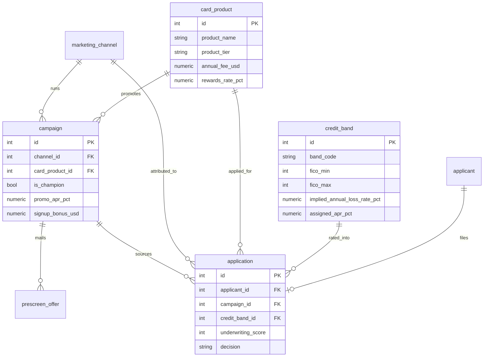
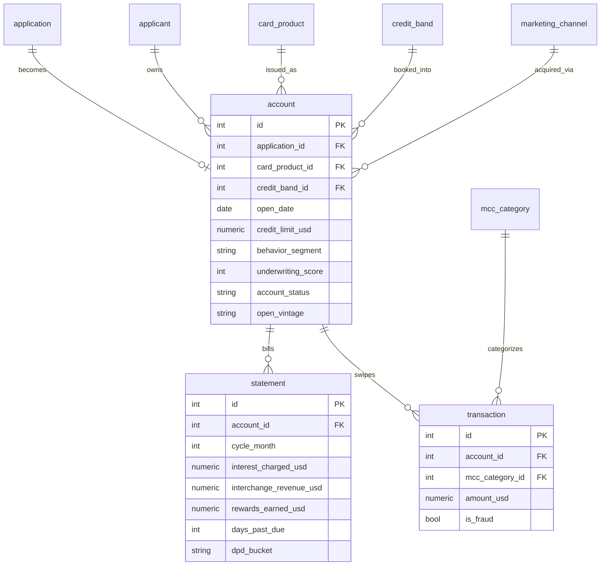
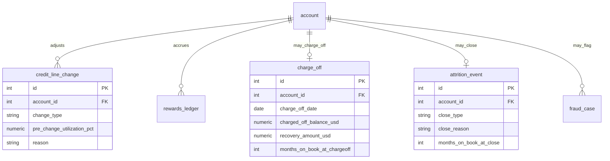

# 金融科技 消费信用卡全生命周期 ER 文档

> 业务背景, 行业科普, 术语表请见 `01-fintech_credit_card_lifecycle_high_business_context-cn.md`. 本文档只描述数据.
>
> 想弄懂本数据集里那 8 个分析 (承保分校准, 渠道逆向选择, transactor 盈利性, promo 悬崖, CLI 逆向选择, bonus churner, vintage 恶化, 产品 P&L) 到底在算什么, 请配合阅读 `05-fintech_credit_card_lifecycle_high_analytics_primer-cn.md`.

---

## 1. 数据集元数据

这是 Keystone Card Company (一家总部位于加州尔湾的消费信用卡发行商) 一整条信用卡生命周期的合成数据. 一张卡从"被营销触达"到"申请, 承保, 开卡, 每月刷卡还款, 直到核销或销卡", 每个阶段都在表里留下痕迹.

| 项目 | 值 |
|------|-----|
| 复杂度 | High |
| 表数量 | 16 |
| 总行数 | 约 194,000 |
| 外键关系 | 约 20 组 (含若干 DDL 不强制的作用域约束, 见第 5 节) |
| REFERENCE_DATE | `2026-06-30` |
| 观测窗口 | 约 24 个月 (最早开卡日 2024-07, 截至 2026-06-30) |
| 货币 | USD (全部) |
| 地域 | 美国加州 (申请人全部为加州居民) |

`REFERENCE_DATE = 2026-06-30` 是全数据集的锚点. 所有"当前快照, 距今多少个月, 账龄 (months_on_book)"的语义都按这一天计算, 生成器, SQL 查询, 本文档三处一致, 保证结果可复现.

行数分布 (数量级): `statement` (月度账单) 约 8.9 万行是最大的时间序列表; `transaction` (抽样刷卡) 约 3.1 万; `prescreen_offer` (预筛邮寄) 2 万; `applicant` 与 `application` 各 1.8 万; `account` 约 8,900; 其余事件表 (rewards, CLI, charge_off, attrition, fraud) 合计约 8 千; 5 张维度/枚举表合计几十行.

---

## 2. 数据模型总览

16 张表可以分成三个域来理解, 顺着一张卡的生命周期从左到右:

第一个域是**营销与承保**. 5 张维度表 (`credit_band`, `card_product`, `marketing_channel`, `mcc_category`, `campaign`) 定义了"我们卖什么卡, 按什么风险定价, 走什么渠道". 然后 `prescreen_offer` (预筛邮寄) 记录营销触达, `applicant` 和 `application` 记录谁来申请, 承保怎么判.

第二个域是**账户与账单流水**. 批准并激活的申请变成 `account` (在册账户), 每个账户每月产生一行 `statement` (账单), 并抽样保留一部分 `transaction` (刷卡交易).

第三个域是**生命周期事件**. 账户在生命周期里会发生 `credit_line_change` (提额/降额), `rewards_ledger` (奖励入账/兑换), `charge_off` (核销), `attrition_event` (销卡), `fraud_case` (欺诈). 这些是稀疏的离散事件, 不是每个账户每月都有.

---

## 3. Mermaid ER 图

因为表超过 12 张, 拆成三张子图, 分别对应上面三个域.

### 3.1 营销与承保域



### 3.2 账户与账单域



### 3.3 生命周期事件域



---

## 4. 分表详解

每张表先讲"它在业务里代表什么, 谁关心它", 再列字段. 阅读顺序就是拓扑顺序 (无外键依赖的维度表在前).

### 1. credit_band

FICO 信用分被切成 5 个风险等级 (A Superprime 到 E Deep-Subprime). 这张表是**承保定价的价目表**: 每个等级对应一个"定价时假设的年化损失率" (`implied_annual_loss_rate_pct`) 和一个"分配给该等级的 APR" (`assigned_apr_pct`). 风险官和承保团队用它把"这个人风险有多高"翻译成"该收他多少利息". 它也是数据科学家做承保模型校准 (陷阱 1) 时的分组维度.

| 字段 | 类型 | 约束 | 说明 |
|------|------|------|------|
| id | INTEGER | PK | 1 到 5 |
| band_code | VARCHAR(2) | UNIQUE, NOT NULL | A/B/C/D/E |
| band_name | VARCHAR(40) | NOT NULL | Superprime / Prime / Near-Prime / Subprime / Deep-Subprime |
| fico_min | INTEGER | NOT NULL | 该等级 FICO 下限 |
| fico_max | INTEGER | NOT NULL | 该等级 FICO 上限 |
| implied_annual_loss_rate_pct | NUMERIC(5,2) | NOT NULL | 定价模型假设的年化损失率 (%) |
| assigned_apr_pct | NUMERIC(5,2) | NOT NULL | 该等级的基准 APR (%) |

样例 (全部 5 行是固定枚举):

| id | band_code | band_name | fico_min | fico_max | implied_annual_loss_rate_pct | assigned_apr_pct |
|----|-----------|-----------|----------|----------|------------------------------|------------------|
| 1 | A | Superprime | 780 | 850 | 1.50 | 14.99 |
| 3 | C | Near-Prime | 660 | 719 | 6.00 | 22.99 |
| 5 | E | Deep-Subprime | 300 | 599 | 15.00 | 29.99 |

### 2. card_product

Keystone 的**产品阶梯**, 从 secured 起步卡 (给信用最差的人) 一路到 Venture Premium (给最优质客户的高端旅行卡). 每款卡的年费 (`annual_fee_usd`), 基准 APR (`base_apr_pct`), 返现率 (`rewards_rate_pct`) 都不同. 产品经理和财务用它分析"哪款卡真赚钱" (陷阱 8). 关键点: rewards 越高的卡, 越吸引"每月全额还款不付利息"的 transactor, 而 transactor 在高返现卡上可能是亏钱的 (陷阱 3).

| 字段 | 类型 | 约束 | 说明 |
|------|------|------|------|
| id | INTEGER | PK | 1 到 6 |
| product_name | VARCHAR(60) | UNIQUE, NOT NULL | 产品名 |
| product_tier | VARCHAR(20) | NOT NULL | secured / student / cashback / travel / premium |
| annual_fee_usd | NUMERIC(8,2) | NOT NULL | 年费 |
| base_apr_pct | NUMERIC(5,2) | NOT NULL | 基准购买 APR (%) |
| rewards_rate_pct | NUMERIC(5,3) | NOT NULL | 返现/积分率 (小数, 0.020 = 2%) |
| rewards_type | VARCHAR(20) | NOT NULL | none / cashback / miles |
| target_band_code | VARCHAR(2) | NOT NULL | 目标客群等级 (定位用, 非硬约束) |

样例 (6 行固定枚举):

| id | product_name | product_tier | annual_fee_usd | base_apr_pct | rewards_rate_pct |
|----|--------------|--------------|----------------|--------------|------------------|
| 1 | Keystone Secured | secured | 0.00 | 26.99 | 0.000 |
| 3 | Keystone Cashback | cashback | 0.00 | 22.99 | 0.015 |
| 6 | Keystone Venture Premium | premium | 395.00 | 19.99 | 0.025 |

### 3. marketing_channel

获客**渠道**. 6 个: 两个外呼邮寄 (direct_mail, prescreen_mail), 两个数字 (digital_display, social), 一个联盟 (affiliate_partner), 一个网点转介 (branch_referral). `cost_per_contact_usd` 是"每触达一个人的成本", 做获客成本 (CPA) 分析的分母. 市场总监最关心它, 因为陷阱 2 (渠道逆向选择) 的核心就是: affiliate 触达便宜, 但带来的账户坏账率最高.

| 字段 | 类型 | 约束 | 说明 |
|------|------|------|------|
| id | INTEGER | PK | 1 到 6 |
| channel_name | VARCHAR(40) | UNIQUE, NOT NULL | 渠道名 |
| channel_type | VARCHAR(20) | NOT NULL | outbound / digital / partner / branch |
| cost_per_contact_usd | NUMERIC(8,2) | NOT NULL | 每次触达成本 |

样例:

| id | channel_name | channel_type | cost_per_contact_usd |
|----|--------------|--------------|----------------------|
| 2 | prescreen_mail | outbound | 1.10 |
| 4 | affiliate_partner | partner | 2.00 |
| 6 | branch_referral | branch | 6.00 |

### 4. mcc_category

商户类别码 (MCC). 每笔刷卡都落在某个 MCC (超市, 加油, 餐厅, 航空, 酒店等). 不同 MCC 的 interchange (刷卡手续费) 费率不同 (`interchange_rate_pct`), 这是发卡行的一块核心收入. 用于消费结构分析和 interchange 收入拆解.

| 字段 | 类型 | 约束 | 说明 |
|------|------|------|------|
| id | INTEGER | PK | 1 到 12 |
| mcc_code | VARCHAR(4) | UNIQUE, NOT NULL | 4 位 MCC 码 |
| category_name | VARCHAR(40) | NOT NULL | 类别名 |
| interchange_rate_pct | NUMERIC(6,4) | NOT NULL | 该类别 interchange 费率 (小数) |

样例:

| id | mcc_code | category_name | interchange_rate_pct |
|----|----------|---------------|----------------------|
| 1 | 5411 | Grocery Stores | 0.0155 |
| 3 | 5812 | Restaurants | 0.0195 |
| 7 | 4511 | Airlines | 0.0210 |

### 5. campaign

一次具体的**营销投放**. 每个 campaign 绑定一个渠道和一款产品, 有起止日期. `is_champion` 区分"稳态主推 (champion)"和"试新 offer (challenger)". Challenger 里有两种特殊 offer: 大额开卡奖金 (`signup_bonus_usd` 达 200 到 300, 触发陷阱 6 的 bonus churner) 和 0% 余额代偿促销 (`promo_apr_pct = 0`, `promo_duration_months = 12`, 触发陷阱 4 的 promo 悬崖). 市场团队做 champion/challenger 对比和 campaign ROI 分析.

| 字段 | 类型 | 约束 | 说明 |
|------|------|------|------|
| id | INTEGER | PK | |
| campaign_name | VARCHAR(80) | NOT NULL | 形如 `2025Q2-Cashback-BonusBoost` |
| channel_id | INTEGER | FK, NOT NULL | 投放渠道 |
| card_product_id | INTEGER | FK, NOT NULL | 主推产品 |
| start_date | DATE | NOT NULL | 起投日 |
| end_date | DATE | NOT NULL | 停投日 |
| is_champion | BOOLEAN | NOT NULL | 是否 champion |
| offer_apr_pct | NUMERIC(5,2) | NOT NULL | offer 里的常规 APR |
| promo_apr_pct | NUMERIC(5,2) | NULL | 促销 APR (0 = 0% BT 促销); NULL = 无促销 |
| promo_duration_months | INTEGER | NULL | 促销时长 (月); 仅 BT offer 非空 |
| signup_bonus_usd | NUMERIC(8,2) | NOT NULL | 开卡奖金 (0 = 无) |
| min_spend_for_bonus_usd | NUMERIC(10,2) | NOT NULL | 拿奖金需刷够的最低消费 |
| budget_usd | NUMERIC(12,2) | NOT NULL | campaign 预算 |

样例:

| id | campaign_name | is_champion | promo_apr_pct | signup_bonus_usd |
|----|---------------|-------------|---------------|------------------|
| 1 | 2024Q3-Secured-Champion | 1 | NULL | 150.00 |
| 2 | 2024Q3-Premium-BonusBoost | 0 | NULL | 200.00 |
| 3 | 2024Q3-Travel-0pct-BalanceTransfer | 0 | 0.00 | 0.00 |

### 6. prescreen_offer

**预筛邮寄**. Keystone 从征信局买一批预筛过的名单, 给每个人寄一封"你已预批"的信. 每行是一封寄出的信, 含一个 response 模型分数 (`response_model_score`, 0 到 999, 模型预测这个人会不会回应) 和实际是否回应 (`responded`). 这张表是给数据科学家做**响应模型的混淆矩阵/ROC**用的: 把预测分数和实际响应对比, 评估营销模型准不准. 只有 outbound 渠道 (direct_mail, prescreen_mail) 的 campaign 才寄预筛信.

| 字段 | 类型 | 约束 | 说明 |
|------|------|------|------|
| id | INTEGER | PK | |
| campaign_id | INTEGER | FK, NOT NULL | 归属 campaign |
| first_name | VARCHAR(40) | NOT NULL | 名 |
| last_name | VARCHAR(40) | NOT NULL | 姓 |
| city | VARCHAR(40) | NOT NULL | 加州城市 |
| state | VARCHAR(2) | NOT NULL | 恒为 CA |
| fico_estimate | INTEGER | NOT NULL | 征信局给的预估 FICO |
| response_model_score | INTEGER | NOT NULL | 响应模型分 (0 到 999, 越高越可能回应) |
| predicted_response_prob | NUMERIC(6,4) | NOT NULL | 模型预测的响应概率 |
| mailed_date | DATE | NOT NULL | 寄信日 |
| responded | BOOLEAN | NOT NULL | 是否回应 (真实结局标签) |

样例:

| id | campaign_id | fico_estimate | response_model_score | predicted_response_prob | responded |
|----|-------------|---------------|----------------------|-------------------------|-----------|
| 12 | 1 | 712 | 845 | 0.1050 | 1 |
| 34 | 2 | 690 | 305 | 0.0510 | 0 |

### 7. applicant

**申请人** (一个自然人). 含承保需要的财务画像: 年龄, 就业状态, 年收入. 全部为加州居民. 本数据集里一个申请人恰好对应一份申请 (1:1), 简化了"同一个人多次申请"的复杂度.

| 字段 | 类型 | 约束 | 说明 |
|------|------|------|------|
| id | INTEGER | PK | |
| first_name | VARCHAR(40) | NOT NULL | 名 |
| last_name | VARCHAR(40) | NOT NULL | 姓 |
| email | VARCHAR(120) | NOT NULL | 邮箱 |
| city | VARCHAR(40) | NOT NULL | 加州城市 |
| state | VARCHAR(2) | NOT NULL | 恒为 CA |
| zip_code | VARCHAR(10) | NOT NULL | 加州邮编 |
| age | INTEGER | NOT NULL | 年龄 (21 到 70) |
| employment_status | VARCHAR(20) | NOT NULL | employed / self_employed / retired / student |
| annual_income_usd | NUMERIC(12,2) | NOT NULL | 年收入 |

### 8. application

**信用卡申请**. 这是承保决策的落点: FICO (`fico_at_application`) 决定被分到哪个 `credit_band`; 承保引擎给出一个 `underwriting_score` (0 到 999, 越高越安全, 这是陷阱 1 的主角); `decision` 是 APPROVED 或 DECLINED; 批准的话记录分配的 APR 和额度. VP of Underwriting 用它算批准率, 审批漏失, 承保是否随时间放松 (陷阱 7).

> **作用域说明:** `underwriting_score` 是一个"模型风险分", 与是否批准 (`decision`, 主要看 FICO cutoff) 不是同一回事. 一个高 FICO 的人可能拿到低 underwriting_score, 反之亦然. 对 DECLINED 的行, `approved_apr_pct`, `approved_credit_limit_usd`, `decline_reason` 里前两者为 NULL, 后者非空; APPROVED 的行反之. DDL 不强制这个互斥, 分析时要靠 `decision` 过滤.

| 字段 | 类型 | 约束 | 说明 |
|------|------|------|------|
| id | INTEGER | PK | |
| applicant_id | INTEGER | FK, NOT NULL | 申请人 (1:1) |
| campaign_id | INTEGER | FK, NULL | 归因的 campaign; NULL = 自然/网点流量 |
| card_product_id | INTEGER | FK, NOT NULL | 申请的产品 |
| channel_id | INTEGER | FK, NOT NULL | 归因渠道 |
| application_date | DATE | NOT NULL | 申请日 |
| fico_at_application | INTEGER | NOT NULL | 申请时 FICO (520 到 840) |
| requested_limit_usd | NUMERIC(10,2) | NOT NULL | 申请额度 |
| credit_band_id | INTEGER | FK, NOT NULL | 由 FICO 映射的风险等级 |
| underwriting_score | INTEGER | NOT NULL | 承保风险模型分 (0 到 999, 越高越安全) |
| decision | VARCHAR(10) | NOT NULL | APPROVED / DECLINED |
| decline_reason | VARCHAR(60) | NULL | 拒批原因; 仅 DECLINED 非空 |
| approved_apr_pct | NUMERIC(5,2) | NULL | 批准 APR; 仅 APPROVED 非空 |
| approved_credit_limit_usd | NUMERIC(10,2) | NULL | 批准额度; 仅 APPROVED 非空 |
| decision_date | DATE | NOT NULL | 决策日 (申请后 1 到 12 天) |

样例:

| id | fico_at_application | credit_band_id | underwriting_score | decision | approved_credit_limit_usd |
|----|---------------------|----------------|--------------------|----------|---------------------------|
| 2 | 735 | 2 | 556 | APPROVED | 11810.00 |
| 1 | 640 | 4 | 694 | DECLINED | NULL |

### 9. account

**在册信用卡账户**. 批准并激活 (约 86% 的批准会激活) 后就成为一个 account. 它是整个第二, 三域的父表. 关键字段: `behavior_segment` (TRANSACTOR 全额还款 vs REVOLVER 滚动余额, 决定盈利模式), `underwriting_score` (从申请继承下来, 供陷阱 1 直接用), `open_vintage` (开卡季度, 供陷阱 7 的 vintage 分析), `is_promo_apr` (是否 0% BT 账户, 供陷阱 4), `account_status` (ACTIVE / CLOSED / CHARGED_OFF), `months_on_book` (账龄, 按 REFERENCE_DATE 或销卡/核销日算).

> **作用域说明:** `account_status = 'CHARGED_OFF'` 的账户在 `charge_off` 表里必有一行; `account_status = 'CLOSED'` 的账户在 `attrition_event` 表里必有一行. `months_on_book` 对已核销/已销卡的账户 = 事件发生时的账龄, 对 ACTIVE 账户 = 截至 REFERENCE_DATE 的账龄.

| 字段 | 类型 | 约束 | 说明 |
|------|------|------|------|
| id | INTEGER | PK | |
| application_id | INTEGER | FK, NOT NULL | 来源申请 (1:1) |
| applicant_id | INTEGER | FK, NOT NULL | 持卡人 |
| card_product_id | INTEGER | FK, NOT NULL | 产品 |
| credit_band_id | INTEGER | FK, NOT NULL | 开卡时风险等级 |
| acquisition_channel_id | INTEGER | FK, NOT NULL | 获客渠道 |
| campaign_id | INTEGER | FK, NULL | 获客 campaign |
| open_date | DATE | NOT NULL | 开卡日 |
| credit_limit_usd | NUMERIC(10,2) | NOT NULL | 初始授信额度 |
| purchase_apr_pct | NUMERIC(5,2) | NOT NULL | 购买 APR |
| is_promo_apr | BOOLEAN | NOT NULL | 是否带 0% 促销 |
| promo_apr_pct | NUMERIC(5,2) | NULL | 促销 APR (0.0); 非促销为 NULL |
| promo_end_date | DATE | NULL | 促销到期日; 非促销为 NULL |
| behavior_segment | VARCHAR(12) | NOT NULL | TRANSACTOR / REVOLVER |
| underwriting_score | INTEGER | NOT NULL | 承保风险分 (继承自 application) |
| signup_bonus_usd | NUMERIC(8,2) | NOT NULL | 实付开卡奖金 (0 = 无) |
| account_status | VARCHAR(14) | NOT NULL | ACTIVE / CLOSED / CHARGED_OFF |
| open_vintage | VARCHAR(6) | NOT NULL | 开卡季度, 形如 `2025Q2` |
| closed_date | DATE | NULL | 关闭日 (核销或销卡); ACTIVE 为 NULL |
| months_on_book | INTEGER | NOT NULL | 账龄 (月) |

样例:

| id | card_product_id | credit_band_id | behavior_segment | underwriting_score | account_status | open_vintage | months_on_book |
|----|-----------------|----------------|------------------|--------------------|----------------|--------------|----------------|
| 1 | 3 | 2 | REVOLVER | 742 | ACTIVE | 2025Q1 | 16 |
| 2 | 1 | 3 | REVOLVER | 89 | ACTIVE | 2025Q1 | 15 |

### 10. statement

**月度账单**. 每个账户每个账单周期一行, 是全数据集信息量最大的表. 一行完整描述这个月的经济画面: 账单余额, 消费额, 还款额, 计息 (`interest_charged_usd`), 费用 (`fees_charged_usd`), interchange 收入, 赚取的 rewards, 利用率 (`utilization_pct`), 逾期天数 (`days_past_due`) 和逾期桶 (`dpd_bucket`). 单账户/产品 P&L (陷阱 3, 8), promo 悬崖 (陷阱 4), 早期预警都从这张表算.

> **口径:** `cycle_month` 是该账单是账户的第几个账单周期 (1-based, 等于账龄月). 单账户的 P&L margin = SUM(`interest_charged_usd` + `interchange_revenue_usd` + `fees_charged_usd` - `rewards_earned_usd`). 注意 transactor (全额还款) 在正常还款月 `interest_charged_usd` 为 0 (只有当一个 transactor 停止全额还款, 逾期走向核销时才开始计息, 实测约 600 行落在这种逾期月), 这正是陷阱 3 的根源.

| 字段 | 类型 | 约束 | 说明 |
|------|------|------|------|
| id | INTEGER | PK | |
| account_id | INTEGER | FK, NOT NULL | 账户 |
| statement_date | DATE | NOT NULL | 账单日 |
| cycle_month | INTEGER | NOT NULL | 第几个账单周期 (= 账龄月) |
| statement_balance_usd | NUMERIC(12,2) | NOT NULL | 账单余额 |
| purchase_volume_usd | NUMERIC(12,2) | NOT NULL | 当期消费额 |
| payment_amount_usd | NUMERIC(12,2) | NOT NULL | 当期还款额 |
| interest_charged_usd | NUMERIC(10,2) | NOT NULL | 当期计息 (transactor 为 0) |
| fees_charged_usd | NUMERIC(10,2) | NOT NULL | 当期费用 (年费 + 滞纳金) |
| interchange_revenue_usd | NUMERIC(10,2) | NOT NULL | 当期 interchange 收入 |
| rewards_earned_usd | NUMERIC(10,2) | NOT NULL | 当期赚取的 rewards (成本) |
| minimum_due_usd | NUMERIC(10,2) | NOT NULL | 最低还款额 |
| credit_limit_usd | NUMERIC(10,2) | NOT NULL | 当期额度 (提额后会变) |
| utilization_pct | NUMERIC(6,2) | NOT NULL | 利用率 (%, 可 >100 表示超限) |
| days_past_due | INTEGER | NOT NULL | 逾期天数 (0/30/60/90/150) |
| dpd_bucket | VARCHAR(12) | NOT NULL | CURRENT / DPD30 / DPD60 / DPD90 / DPD120PLUS (CHARGEOFF 为预留枚举值: 本数据集最高逾期 150 天落入 DPD120PLUS, 核销在账户层用 `account_status='CHARGED_OFF'` 表达, 故 statement 层不产生 CHARGEOFF 桶, 查询时不要 `WHERE dpd_bucket='CHARGEOFF'`) |
| is_promo_active | BOOLEAN | NOT NULL | 当期是否处于 0% 促销内 |

样例:

| account_id | cycle_month | statement_balance_usd | interest_charged_usd | interchange_revenue_usd | rewards_earned_usd | dpd_bucket |
|------------|-------------|-----------------------|----------------------|-------------------------|--------------------|------------|
| 1 | 2 | 945.50 | 6.86 | 9.10 | 7.58 | CURRENT |
| 1 | 4 | 1856.40 | 29.38 | 18.19 | 15.16 | CURRENT |

### 11. transaction

**抽样刷卡交易**. 不是每一笔真实消费都落库 (那会是百万级), 只从每个账户的消费里抽样保留一部分, 用于 MCC 消费结构和 interchange 明细分析, 以及零星的欺诈标记 (`is_fraud`). 每笔交易挂在一个 MCC 类别上. 单笔 interchange = `amount_usd` * 该 MCC 的费率.

| 字段 | 类型 | 约束 | 说明 |
|------|------|------|------|
| id | INTEGER | PK | |
| account_id | INTEGER | FK, NOT NULL | 账户 |
| mcc_category_id | INTEGER | FK, NOT NULL | 商户类别 |
| transaction_date | DATE | NOT NULL | 交易日 |
| amount_usd | NUMERIC(10,2) | NOT NULL | 交易金额 |
| interchange_revenue_usd | NUMERIC(8,2) | NOT NULL | 该笔 interchange 收入 |
| is_fraud | BOOLEAN | NOT NULL | 是否欺诈交易 (约 0.4%) |

### 12. rewards_ledger

**奖励台账 (离散事件)**. 按月 accrue 的 rewards 已经在 `statement.rewards_earned_usd` 里了; 这张表只记一次性的离散动作: 开卡奖金入账 (BONUS), 兑换 (REDEEMED), 清回 (CLAWBACK). 主要用于验证开卡奖金的发放和 bonus churner 分析 (陷阱 6) 的佐证.

| 字段 | 类型 | 约束 | 说明 |
|------|------|------|------|
| id | INTEGER | PK | |
| account_id | INTEGER | FK, NOT NULL | 账户 |
| entry_date | DATE | NOT NULL | 入账日 |
| entry_type | VARCHAR(12) | NOT NULL | BONUS / REDEEMED / CLAWBACK |
| amount_usd | NUMERIC(10,2) | NOT NULL | 金额 |
| description | VARCHAR(80) | NOT NULL | 文字说明 |

### 13. credit_line_change

**额度调整事件**. 提额 (CLI, Credit Line Increase) 或降额 (CLD). 最关键的字段是 `pre_change_utilization_pct` (提额前的利用率), 因为陷阱 5 (CLI 逆向选择) 就是: 给"提额前利用率 > 70% 的 revolver"提额, 反而拉高了 charge-off. `reason` 区分 `high_utilization_review` 和 `good_standing_review`.

| 字段 | 类型 | 约束 | 说明 |
|------|------|------|------|
| id | INTEGER | PK | |
| account_id | INTEGER | FK, NOT NULL | 账户 |
| change_date | DATE | NOT NULL | 调整日 |
| change_type | VARCHAR(4) | NOT NULL | CLI / CLD |
| old_limit_usd | NUMERIC(10,2) | NOT NULL | 调整前额度 |
| new_limit_usd | NUMERIC(10,2) | NOT NULL | 调整后额度 |
| pre_change_utilization_pct | NUMERIC(6,2) | NOT NULL | 调整前利用率 (%) |
| initiated_by | VARCHAR(10) | NOT NULL | bank / customer |
| reason | VARCHAR(60) | NOT NULL | 调整原因 |

### 14. charge_off

**核销记录**. 账户连续逾期到约 180 天被 charge-off (会计上确认损失). 记录核销余额 (`charged_off_balance_usd`), 后续回收 (`recovery_amount_usd`) 和核销时的账龄 (`months_on_book_at_chargeoff`). Chief Risk Officer 用它算损失率, 回收率, 以及 vintage 损失曲线 (陷阱 7). 净损失 = 核销余额 - 回收金额.

| 字段 | 类型 | 约束 | 说明 |
|------|------|------|------|
| id | INTEGER | PK | |
| account_id | INTEGER | FK, NOT NULL | 账户 |
| charge_off_date | DATE | NOT NULL | 核销日 |
| charged_off_balance_usd | NUMERIC(12,2) | NOT NULL | 核销余额 (EAD) |
| recovery_amount_usd | NUMERIC(12,2) | NOT NULL | 回收金额 (0 = 未回收) |
| recovery_date | DATE | NULL | 回收日; 无回收为 NULL |
| months_on_book_at_chargeoff | INTEGER | NOT NULL | 核销时账龄 |

### 15. attrition_event

**销卡记录**. 分两类: VOLUNTARY (客户主动关, `close_reason` 含 bonus_churn / rate_shopping / inactivity / dissatisfaction / product_upgrade) 和 INVOLUNTARY (公司关闭, 主要是 charge_off). Relationship Manager 和留存团队用它算流失率, 分析 bonus churner (陷阱 6). 注意: 每个 CHARGED_OFF 账户也会在这里有一条 `close_reason = 'charge_off'` 的 INVOLUNTARY 记录.

| 字段 | 类型 | 约束 | 说明 |
|------|------|------|------|
| id | INTEGER | PK | |
| account_id | INTEGER | FK, NOT NULL | 账户 |
| close_date | DATE | NOT NULL | 关闭日 |
| close_type | VARCHAR(12) | NOT NULL | VOLUNTARY / INVOLUNTARY |
| close_reason | VARCHAR(20) | NOT NULL | bonus_churn / rate_shopping / inactivity / dissatisfaction / product_upgrade / charge_off |
| months_on_book_at_close | INTEGER | NOT NULL | 关闭时账龄 |

### 16. fraud_case

**欺诈案件 (轻量)**. 一笔交易被标欺诈后的处置记录. 本数据集不深挖欺诈 (项目里另有专门的实时反欺诈 & AML 数据集), 这张表只做点缀, 支撑"欺诈净损失"这类边角查询. `net_loss_usd` = 0 表示已追回.

| 字段 | 类型 | 约束 | 说明 |
|------|------|------|------|
| id | INTEGER | PK | |
| account_id | INTEGER | FK, NOT NULL | 账户 |
| reported_date | DATE | NOT NULL | 报案日 |
| fraud_type | VARCHAR(30) | NOT NULL | card_not_present / lost_stolen / account_takeover / counterfeit |
| gross_loss_usd | NUMERIC(10,2) | NOT NULL | 毛损失 |
| net_loss_usd | NUMERIC(10,2) | NOT NULL | 净损失 (0 = 已追回) |
| resolution | VARCHAR(20) | NOT NULL | recovered / written_off |

---

## 5. 数据生成规则

这一节是"生成器产出什么"的正式契约. Python 生成器和 SQL 查询都以这里为准.

### 5.1 时间顺序

每条时间链都严格保证先后:

- `campaign.start_date` <= `prescreen_offer.mailed_date` (在投放窗口内寄信).
- `application.application_date` < `application.decision_date` (决策晚于申请 1 到 12 天).
- `application.decision_date` < `account.open_date` (开卡晚于批准 3 到 20 天).
- `account.open_date` < 每条 `statement.statement_date` (账单在开卡之后, 按月递增).
- 所有事件 (charge_off, attrition, credit_line_change, rewards, transaction) 的日期都落在 `account.open_date` 与 REFERENCE_DATE 之间.
- 最早开卡日 2024-07 左右, 最晚账单不超过 REFERENCE_DATE (2026-06-30).

### 5.2 引用完整性

- DDL 强制的外键见第 3 节和 DDL. 均为 1:N (维度到事实) 或 1:1 (application 到 account).
- DDL 不强制但生成器保证的作用域约束:
  - `account_status = 'CHARGED_OFF'` 的账户在 `charge_off` 里恰有一行; `'CLOSED'` 的账户在 `attrition_event` 里恰有一行 (`close_type = 'VOLUNTARY'`). 每个 `CHARGED_OFF` 账户额外在 `attrition_event` 里有一行 `close_type = 'INVOLUNTARY', close_reason = 'charge_off'`.
  - `application.decision = 'APPROVED'` 时 `approved_apr_pct` 与 `approved_credit_limit_usd` 非空, `decline_reason` 为空; `'DECLINED'` 时反之.
  - 只有 `is_promo_apr = 1` 的账户 `promo_apr_pct` 和 `promo_end_date` 非空.

### 5.3 取值范围与分布

- FICO: 申请时 520 到 840, 均值随 vintage 从约 700 (2024) 漂移到约 680 (2026) (承保放松).
- 批准率: 整体约 58%, 且随 vintage 从约 55% 缓升到约 60% (陷阱 7 的一半).
- Booked 账户等级分布 (约): A 10%, B 31%, C 39%, D 17%, E 2%. 近-prime (C) 为主, 符合 Keystone 的市场定位.
- 行为分层: TRANSACTOR 约 48%, REVOLVER 约 52%. 产品越高端 transactor 占比越高 (Venture Premium 约 82%, Secured 约 10%).
- 账户状态: ACTIVE 约 83%, CHARGED_OFF 约 6.5%, CLOSED 约 10%.
- Promo (0% BT) 账户约占 22%.
- 整体核销率约 6.5% (约 580 个 charge-off).
- 预筛响应率整体约 5%.

### 5.4 计算字段

- `statement.interchange_revenue_usd` = `purchase_volume_usd` * 0.018 (账单级平均 interchange 费率).
- `statement.rewards_earned_usd` = `purchase_volume_usd` * 产品的 `rewards_rate_pct`.
- `statement.interest_charged_usd`: transactor 在未逾期月为 0 (一旦逾期停止全额还款, 则按 revolver 方式对携带余额计息); revolver = 上期携带余额 * (有效 APR / 12), 促销期内有效 APR = 0.
- `statement.utilization_pct` = `statement_balance_usd` / `credit_limit_usd` * 100.
- `transaction.interchange_revenue_usd` = `amount_usd` * 该 MCC 的 `interchange_rate_pct`.
- `charge_off` 净损失 = `charged_off_balance_usd` - `recovery_amount_usd`.
- 单账户 P&L margin = SUM over statements of (`interest_charged_usd` + `interchange_revenue_usd` + `fees_charged_usd` - `rewards_earned_usd`).

### 5.5 内置业务陷阱 (含预期量级)

这是本数据集的灵魂. 每个陷阱都有名字, 预期量级, 和对应的 SQL 查询. 生成器必须产出这些量级, SQL 必须能查出来.

| 陷阱 | 名字 | 预期量级 (实测) | 对应查询 |
|------|------|-----------------|----------|
| 1 | 承保模型误校准 | 整体核销率随 underwriting_score 从约 9.7% (最低分段) 趋势性下降到约 3.2% (最高分段) (十分位含噪声, 呈整体下降趋势而非严格逐层单调, 中段个别十分位会回升); 但在 band D 内部, 核销率与分数几乎无关 (各分段在约 9% 到 14% 无规律摆动, 无下降趋势) | Q3, Q4 |
| 2 | 渠道逆向选择 | affiliate_partner 核销率约 12.5%, 是最便宜两个渠道 (direct_mail / prescreen_mail, 均约 4%) 的约 3 倍, 为所有渠道最高; 但 affiliate 触达成本 (2.00) 却比数字渠道 (3.2 到 4.5) 更低. 每 booked 账户净损失 affiliate 约 625 美元 vs prescreen 约 165 美元 | Q6, Q7 |
| 3 | Transactor 不赚钱 | 完整单账户贡献 (margin - signup bonus - 净核销损失) 在返现率 >= 1.5% 的卡上, transactor 段为负: Cashback 约 -223, Cashback Plus 约 -426, Travel 约 -168, 连高端 Venture Premium transactor 也约 -28 (靠 395 美元年费才勉强接近打平); 同产品 revolver 段均为正 | Q11, Q12 |
| 4 | Promo APR 悬崖 | 0% BT 账户在促销期内 (cycle_month 6 到 11) DPD30+ 约 2% 到 5%; 促销一到期 (cycle_month 12 到 14) DPD30+ 跳升到约 12%, 而同期非促销账户 DPD30+ 反而降到约 1% | Q13 |
| 5 | CLI 逆向选择 | 提额前利用率 > 70% 的账户核销率约 10.6%, 是提额前利用率 <= 70% 账户 (约 3.0%) 的约 3.6 倍 | Q9 |
| 6 | Bonus churner 负 LTV | close_reason = 'bonus_churn' 的账户平均 lifetime 贡献约 -280 美元 (唯一为负的流失类型); 其余流失类型都在 +325 以上 | Q15 |
| 7 | Vintage 恶化 | 按开卡季度看 month_on_book <= 6 的核销率, 从 2024Q3 的约 0.7% 升到 2025Q4 的约 4.4% (早期批次约 1.2% vs 近期批次约 3.4%); 同期批准率从约 55% 升到约 60%, booked FICO 从约 722 滑到约 694 | Q16, Q17 |
| 8 | 产品阶梯 P&L | 完整产品 P&L 显示: Secured (约 +108 万) 和 Venture Premium/Student (约 +22 万到 +25 万) 靠 revolver 利息盈利; 而高返现的 Cashback Plus (约 -32 万) 和 Travel (约 -8 万) 整体亏损, 返现率较低的基础款 Cashback 则小幅盈利 (约 +5 万) | Q11, Q19 |

---

## 6. Faker 策略

| 字段模式 | 方法 | 说明 |
|----------|------|------|
| first_name / last_name / email | `fake.first_name()` 等 | 北美姓名 |
| city | `random.choice(CA_CITIES)` | 限制在加州 20 个城市 |
| zip_code | `fake.zipcode_in_state("CA")` | 加州邮编 |
| fico_at_application | 按 vintage 漂移的高斯抽样 + 截断 | 保证批准分布与 vintage 恶化 |
| credit_band | 由 FICO 区间硬映射 | 等级来自 FICO, 非独立抽样 |
| underwriting_score | 非 D 段: 编码 latent 安全度; D 段: 独立随机 | 制造陷阱 1 的分段可排序性差异 |
| behavior_segment | 按产品 transactor 率 + 等级微调加权抽样 | 高端卡 transactor 多 |
| charge-off 与否/时点 | 按 band 基线 * 渠道 * vintage * CLI 乘子的伯努利 + 三角分布时点 | 注入陷阱 1/2/5/7 |
| 月度消费/还款/利息 | 按 behavior_segment 条件生成 | transactor 全额还款不计息 |

---

## 7. 文件清单 (拓扑序)

| # | 文件名 | 表 | 行数 (约) | 依赖 |
|---|--------|-----|-----------|------|
| 01 | 01_credit_band.tsv | credit_band | 5 | 无 |
| 02 | 02_card_product.tsv | card_product | 6 | 无 |
| 03 | 03_marketing_channel.tsv | marketing_channel | 6 | 无 |
| 04 | 04_mcc_category.tsv | mcc_category | 12 | 无 |
| 05 | 05_campaign.tsv | campaign | 24 | marketing_channel, card_product |
| 06 | 06_prescreen_offer.tsv | prescreen_offer | 20,000 | campaign |
| 07 | 07_applicant.tsv | applicant | 18,000 | 无 |
| 08 | 08_application.tsv | application | 18,000 | applicant, campaign, card_product, marketing_channel, credit_band |
| 09 | 09_account.tsv | account | 8,900 | application, 及上述维度 |
| 10 | 10_statement.tsv | statement | 88,700 | account |
| 11 | 11_transaction.tsv | transaction | 30,900 | account, mcc_category |
| 12 | 12_rewards_ledger.tsv | rewards_ledger | 4,900 | account |
| 13 | 13_credit_line_change.tsv | credit_line_change | 2,500 | account |
| 14 | 14_charge_off.tsv | charge_off | 580 | account |
| 15 | 15_attrition_event.tsv | attrition_event | 1,470 | account |
| 16 | 16_fraud_case.tsv | fraud_case | 130 | account |

---

## 8. SQLite DDL

```sql
CREATE TABLE credit_band (
    id INTEGER NOT NULL PRIMARY KEY,
    band_code VARCHAR(2) NOT NULL UNIQUE,
    band_name VARCHAR(40) NOT NULL,
    fico_min INTEGER NOT NULL,
    fico_max INTEGER NOT NULL,
    implied_annual_loss_rate_pct NUMERIC(5, 2) NOT NULL,
    assigned_apr_pct NUMERIC(5, 2) NOT NULL
);

CREATE TABLE card_product (
    id INTEGER NOT NULL PRIMARY KEY,
    product_name VARCHAR(60) NOT NULL UNIQUE,
    product_tier VARCHAR(20) NOT NULL,
    annual_fee_usd NUMERIC(8, 2) NOT NULL,
    base_apr_pct NUMERIC(5, 2) NOT NULL,
    rewards_rate_pct NUMERIC(5, 3) NOT NULL,
    rewards_type VARCHAR(20) NOT NULL,
    target_band_code VARCHAR(2) NOT NULL
);

CREATE TABLE marketing_channel (
    id INTEGER NOT NULL PRIMARY KEY,
    channel_name VARCHAR(40) NOT NULL UNIQUE,
    channel_type VARCHAR(20) NOT NULL,
    cost_per_contact_usd NUMERIC(8, 2) NOT NULL
);

CREATE TABLE mcc_category (
    id INTEGER NOT NULL PRIMARY KEY,
    mcc_code VARCHAR(4) NOT NULL UNIQUE,
    category_name VARCHAR(40) NOT NULL,
    interchange_rate_pct NUMERIC(6, 4) NOT NULL
);

CREATE TABLE campaign (
    id INTEGER NOT NULL PRIMARY KEY,
    campaign_name VARCHAR(80) NOT NULL,
    channel_id INTEGER NOT NULL,
    card_product_id INTEGER NOT NULL,
    start_date DATE NOT NULL,
    end_date DATE NOT NULL,
    is_champion BOOLEAN NOT NULL,
    offer_apr_pct NUMERIC(5, 2) NOT NULL,
    promo_apr_pct NUMERIC(5, 2),
    promo_duration_months INTEGER,
    signup_bonus_usd NUMERIC(8, 2) NOT NULL,
    min_spend_for_bonus_usd NUMERIC(10, 2) NOT NULL,
    budget_usd NUMERIC(12, 2) NOT NULL,
    FOREIGN KEY(channel_id) REFERENCES marketing_channel (id),
    FOREIGN KEY(card_product_id) REFERENCES card_product (id)
);

CREATE TABLE prescreen_offer (
    id INTEGER NOT NULL PRIMARY KEY,
    campaign_id INTEGER NOT NULL,
    first_name VARCHAR(40) NOT NULL,
    last_name VARCHAR(40) NOT NULL,
    city VARCHAR(40) NOT NULL,
    state VARCHAR(2) NOT NULL,
    fico_estimate INTEGER NOT NULL,
    response_model_score INTEGER NOT NULL,
    predicted_response_prob NUMERIC(6, 4) NOT NULL,
    mailed_date DATE NOT NULL,
    responded BOOLEAN NOT NULL,
    FOREIGN KEY(campaign_id) REFERENCES campaign (id)
);

CREATE TABLE applicant (
    id INTEGER NOT NULL PRIMARY KEY,
    first_name VARCHAR(40) NOT NULL,
    last_name VARCHAR(40) NOT NULL,
    email VARCHAR(120) NOT NULL,
    city VARCHAR(40) NOT NULL,
    state VARCHAR(2) NOT NULL,
    zip_code VARCHAR(10) NOT NULL,
    age INTEGER NOT NULL,
    employment_status VARCHAR(20) NOT NULL,
    annual_income_usd NUMERIC(12, 2) NOT NULL
);

CREATE TABLE application (
    id INTEGER NOT NULL PRIMARY KEY,
    applicant_id INTEGER NOT NULL,
    campaign_id INTEGER,
    card_product_id INTEGER NOT NULL,
    channel_id INTEGER NOT NULL,
    application_date DATE NOT NULL,
    fico_at_application INTEGER NOT NULL,
    requested_limit_usd NUMERIC(10, 2) NOT NULL,
    credit_band_id INTEGER NOT NULL,
    underwriting_score INTEGER NOT NULL,
    decision VARCHAR(10) NOT NULL,
    decline_reason VARCHAR(60),
    approved_apr_pct NUMERIC(5, 2),
    approved_credit_limit_usd NUMERIC(10, 2),
    decision_date DATE NOT NULL,
    FOREIGN KEY(applicant_id) REFERENCES applicant (id),
    FOREIGN KEY(campaign_id) REFERENCES campaign (id),
    FOREIGN KEY(card_product_id) REFERENCES card_product (id),
    FOREIGN KEY(channel_id) REFERENCES marketing_channel (id),
    FOREIGN KEY(credit_band_id) REFERENCES credit_band (id)
);

CREATE TABLE account (
    id INTEGER NOT NULL PRIMARY KEY,
    application_id INTEGER NOT NULL,
    applicant_id INTEGER NOT NULL,
    card_product_id INTEGER NOT NULL,
    credit_band_id INTEGER NOT NULL,
    acquisition_channel_id INTEGER NOT NULL,
    campaign_id INTEGER,
    open_date DATE NOT NULL,
    credit_limit_usd NUMERIC(10, 2) NOT NULL,
    purchase_apr_pct NUMERIC(5, 2) NOT NULL,
    is_promo_apr BOOLEAN NOT NULL,
    promo_apr_pct NUMERIC(5, 2),
    promo_end_date DATE,
    behavior_segment VARCHAR(12) NOT NULL,
    underwriting_score INTEGER NOT NULL,
    signup_bonus_usd NUMERIC(8, 2) NOT NULL,
    account_status VARCHAR(14) NOT NULL,
    open_vintage VARCHAR(6) NOT NULL,
    closed_date DATE,
    months_on_book INTEGER NOT NULL,
    FOREIGN KEY(application_id) REFERENCES application (id),
    FOREIGN KEY(applicant_id) REFERENCES applicant (id),
    FOREIGN KEY(card_product_id) REFERENCES card_product (id),
    FOREIGN KEY(credit_band_id) REFERENCES credit_band (id),
    FOREIGN KEY(acquisition_channel_id) REFERENCES marketing_channel (id),
    FOREIGN KEY(campaign_id) REFERENCES campaign (id)
);

CREATE TABLE statement (
    id INTEGER NOT NULL PRIMARY KEY,
    account_id INTEGER NOT NULL,
    statement_date DATE NOT NULL,
    cycle_month INTEGER NOT NULL,
    statement_balance_usd NUMERIC(12, 2) NOT NULL,
    purchase_volume_usd NUMERIC(12, 2) NOT NULL,
    payment_amount_usd NUMERIC(12, 2) NOT NULL,
    interest_charged_usd NUMERIC(10, 2) NOT NULL,
    fees_charged_usd NUMERIC(10, 2) NOT NULL,
    interchange_revenue_usd NUMERIC(10, 2) NOT NULL,
    rewards_earned_usd NUMERIC(10, 2) NOT NULL,
    minimum_due_usd NUMERIC(10, 2) NOT NULL,
    credit_limit_usd NUMERIC(10, 2) NOT NULL,
    utilization_pct NUMERIC(6, 2) NOT NULL,
    days_past_due INTEGER NOT NULL,
    dpd_bucket VARCHAR(12) NOT NULL,
    is_promo_active BOOLEAN NOT NULL,
    FOREIGN KEY(account_id) REFERENCES account (id)
);

CREATE TABLE "transaction" (
    id INTEGER NOT NULL PRIMARY KEY,
    account_id INTEGER NOT NULL,
    mcc_category_id INTEGER NOT NULL,
    transaction_date DATE NOT NULL,
    amount_usd NUMERIC(10, 2) NOT NULL,
    interchange_revenue_usd NUMERIC(8, 2) NOT NULL,
    is_fraud BOOLEAN NOT NULL,
    FOREIGN KEY(account_id) REFERENCES account (id),
    FOREIGN KEY(mcc_category_id) REFERENCES mcc_category (id)
);

CREATE TABLE rewards_ledger (
    id INTEGER NOT NULL PRIMARY KEY,
    account_id INTEGER NOT NULL,
    entry_date DATE NOT NULL,
    entry_type VARCHAR(12) NOT NULL,
    amount_usd NUMERIC(10, 2) NOT NULL,
    description VARCHAR(80) NOT NULL,
    FOREIGN KEY(account_id) REFERENCES account (id)
);

CREATE TABLE credit_line_change (
    id INTEGER NOT NULL PRIMARY KEY,
    account_id INTEGER NOT NULL,
    change_date DATE NOT NULL,
    change_type VARCHAR(4) NOT NULL,
    old_limit_usd NUMERIC(10, 2) NOT NULL,
    new_limit_usd NUMERIC(10, 2) NOT NULL,
    pre_change_utilization_pct NUMERIC(6, 2) NOT NULL,
    initiated_by VARCHAR(10) NOT NULL,
    reason VARCHAR(60) NOT NULL,
    FOREIGN KEY(account_id) REFERENCES account (id)
);

CREATE TABLE charge_off (
    id INTEGER NOT NULL PRIMARY KEY,
    account_id INTEGER NOT NULL,
    charge_off_date DATE NOT NULL,
    charged_off_balance_usd NUMERIC(12, 2) NOT NULL,
    recovery_amount_usd NUMERIC(12, 2) NOT NULL,
    recovery_date DATE,
    months_on_book_at_chargeoff INTEGER NOT NULL,
    FOREIGN KEY(account_id) REFERENCES account (id)
);

CREATE TABLE attrition_event (
    id INTEGER NOT NULL PRIMARY KEY,
    account_id INTEGER NOT NULL,
    close_date DATE NOT NULL,
    close_type VARCHAR(12) NOT NULL,
    close_reason VARCHAR(20) NOT NULL,
    months_on_book_at_close INTEGER NOT NULL,
    FOREIGN KEY(account_id) REFERENCES account (id)
);

CREATE TABLE fraud_case (
    id INTEGER NOT NULL PRIMARY KEY,
    account_id INTEGER NOT NULL,
    reported_date DATE NOT NULL,
    fraud_type VARCHAR(30) NOT NULL,
    gross_loss_usd NUMERIC(10, 2) NOT NULL,
    net_loss_usd NUMERIC(10, 2) NOT NULL,
    resolution VARCHAR(20) NOT NULL,
    FOREIGN KEY(account_id) REFERENCES account (id)
);
```
