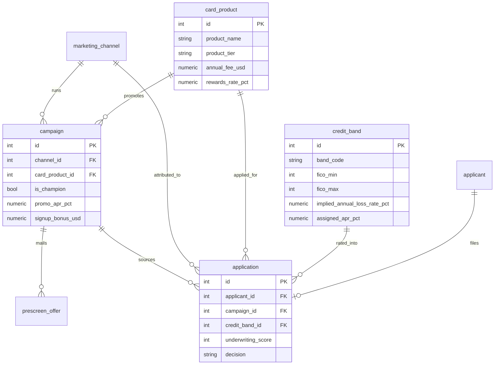
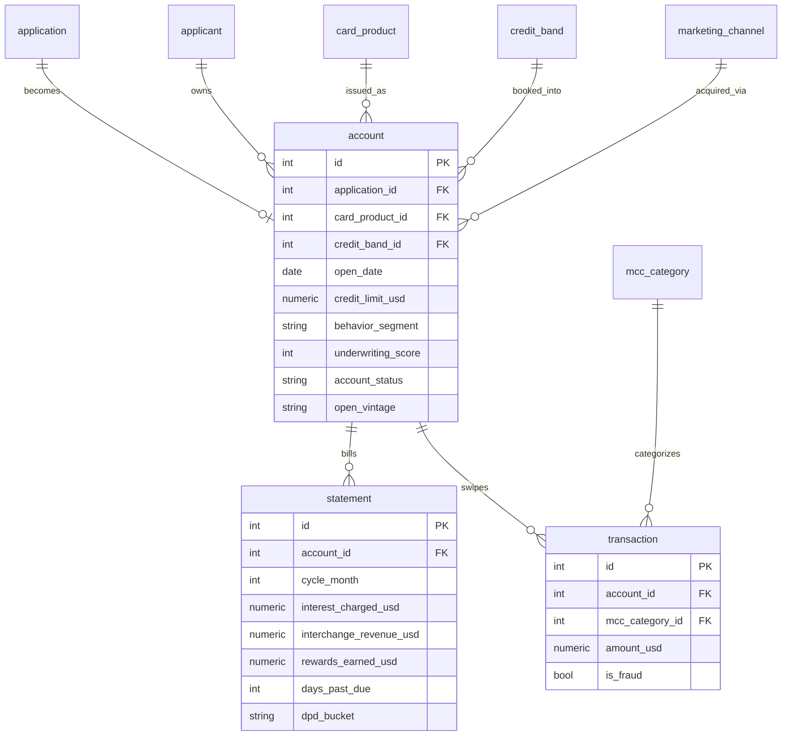
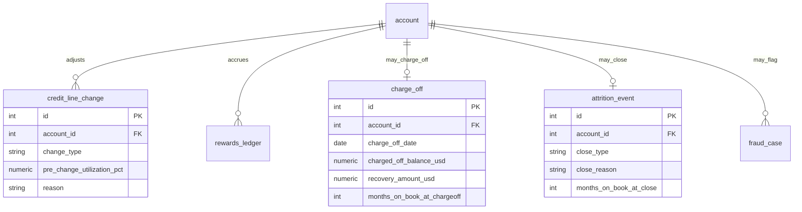

# Fintech Consumer Credit Card Full Lifecycle ER Document

> For business background, industry primer, and glossary, see `01-fintech_credit_card_lifecycle_high_business_context.md`. This document only describes the data.
>
> To understand what the 8 analyses in this dataset (underwriting score calibration, channel adverse selection, transactor profitability, promo cliff, CLI adverse selection, bonus churner, vintage deterioration, product P&L) are actually computing, read alongside `05-fintech_credit_card_lifecycle_high_analytics_primer.md`.

---

## 1. Dataset Metadata

This is synthetic data covering the full credit card lifecycle for Keystone Card Company, a consumer credit card issuer headquartered in Irvine, California. A card leaves a trail across the tables at every stage, from "marketed to" through "applied, underwritten, opened, swiped and paid monthly," all the way to charge-off or closure.

| Item | Value |
|------|-----|
| Complexity | High |
| Number of tables | 16 |
| Total rows | ~194,000 |
| Foreign key relationships | ~20 groups (including several scope constraints not enforced by DDL; see Section 5) |
| REFERENCE_DATE | `2026-06-30` |
| Observation window | ~24 months (earliest account open date 2024-07, through 2026-06-30) |
| Currency | USD (all) |
| Region | California, USA (all applicants are California residents) |

`REFERENCE_DATE = 2026-06-30` is the anchor point for the entire dataset. Any semantics involving "current snapshot," "months since," or "months_on_book" are computed relative to this date, consistently across the generator, the SQL queries, and this document, so results are reproducible.

Row-count distribution (order of magnitude): `statement` (monthly billing) is the largest time-series table at ~89,000 rows; `transaction` (sampled swipes) ~31,000; `prescreen_offer` (prescreen mailings) 20,000; `applicant` and `application` ~18,000 each; `account` ~8,900; the remaining event tables (rewards, CLI, charge_off, attrition, fraud) total ~8,000 combined; the 5 dimension/enum tables total a few dozen rows combined.

---

## 2. Data Model Overview

The 16 tables fall into three domains that follow a card's lifecycle from left to right.

The first domain is **marketing and underwriting**. Five dimension tables (`credit_band`, `card_product`, `marketing_channel`, `mcc_category`, `campaign`) define "what cards we sell, how we price them by risk, and which channels we use." `prescreen_offer` (prescreen mailings) then records marketing outreach, and `applicant` and `application` record who applies and how underwriting decides.

The second domain is **accounts and statement activity**. Approved and activated applications become `account` records (booked accounts), each account produces one `statement` row per month, and a sample of `transaction` rows is retained.

The third domain is **lifecycle events**. Over an account's life it can generate `credit_line_change` (increase/decrease), `rewards_ledger` (accrual/redemption), `charge_off`, `attrition_event` (closure), and `fraud_case` events. These are sparse, discrete events — not every account has one every month.

---

## 3. Mermaid ER Diagram

Because there are more than 12 tables, the diagram is split into three sub-diagrams, one per domain above.

### 3.1 Marketing and Underwriting Domain



### 3.2 Account and Billing Domain



### 3.3 Lifecycle Events Domain



---

## 4. Table-by-Table Detail

For each table we first explain what it represents in the business and who cares about it, then list the fields. The reading order is topological (dimension tables with no foreign-key dependencies come first).

### 1. credit_band

FICO scores are cut into 5 risk tiers (A Superprime through E Deep-Subprime). This table is the **underwriting price sheet**: each tier has an "annual loss rate assumed at pricing time" (`implied_annual_loss_rate_pct`) and an "APR assigned to that tier" (`assigned_apr_pct`). Risk officers and the underwriting team use it to translate "how risky is this person" into "how much interest we should charge them." It's also the grouping dimension data scientists use when calibrating the underwriting model (Trap 1).

| Field | Type | Constraint | Description |
|------|------|-----|------|
| id | INTEGER | PK | 1 to 5 |
| band_code | VARCHAR(2) | UNIQUE, NOT NULL | A/B/C/D/E |
| band_name | VARCHAR(40) | NOT NULL | Superprime / Prime / Near-Prime / Subprime / Deep-Subprime |
| fico_min | INTEGER | NOT NULL | Lower FICO bound for the tier |
| fico_max | INTEGER | NOT NULL | Upper FICO bound for the tier |
| implied_annual_loss_rate_pct | NUMERIC(5,2) | NOT NULL | Annual loss rate (%) assumed by the pricing model |
| assigned_apr_pct | NUMERIC(5,2) | NOT NULL | Baseline APR (%) for this tier |

Example (all 5 rows are a fixed enum):

| id | band_code | band_name | fico_min | fico_max | implied_annual_loss_rate_pct | assigned_apr_pct |
|----|-----------|-----------|----------|----------|------------------------------|------------------|
| 1 | A | Superprime | 780 | 850 | 1.50 | 14.99 |
| 3 | C | Near-Prime | 660 | 719 | 6.00 | 22.99 |
| 5 | E | Deep-Subprime | 300 | 599 | 15.00 | 29.99 |

### 2. card_product

Keystone's **product ladder**, from the entry-level secured card (for people with the weakest credit) up to Venture Premium (a high-end travel card for its best customers). Each card differs in annual fee (`annual_fee_usd`), base APR (`base_apr_pct`), and cashback rate (`rewards_rate_pct`). Product managers and finance use this table to analyze "which card is actually profitable" (Trap 8). Key point: the higher a card's rewards rate, the more it attracts transactors (customers who pay their balance in full every month and never pay interest) — and transactors can actually be a money-losing segment on high-rewards cards (Trap 3).

| Field | Type | Constraint | Description |
|------|------|-----|------|
| id | INTEGER | PK | 1 to 6 |
| product_name | VARCHAR(60) | UNIQUE, NOT NULL | Product name |
| product_tier | VARCHAR(20) | NOT NULL | secured / student / cashback / travel / premium |
| annual_fee_usd | NUMERIC(8,2) | NOT NULL | Annual fee |
| base_apr_pct | NUMERIC(5,2) | NOT NULL | Base purchase APR (%) |
| rewards_rate_pct | NUMERIC(5,3) | NOT NULL | Cashback/points rate (decimal, 0.020 = 2%) |
| rewards_type | VARCHAR(20) | NOT NULL | none / cashback / miles |
| target_band_code | VARCHAR(2) | NOT NULL | Target customer tier (for positioning only, not a hard constraint) |

Example (6 rows, fixed enum):

| id | product_name | product_tier | annual_fee_usd | base_apr_pct | rewards_rate_pct |
|----|--------------|--------------|----------------|--------------|------------------|
| 1 | Keystone Secured | secured | 0.00 | 26.99 | 0.000 |
| 3 | Keystone Cashback | cashback | 0.00 | 22.99 | 0.015 |
| 6 | Keystone Venture Premium | premium | 395.00 | 19.99 | 0.025 |

### 3. marketing_channel

Customer-acquisition **channels**. There are 6: two outbound mail channels (direct_mail, prescreen_mail), two digital channels (digital_display, social), one affiliate channel (affiliate_partner), and one branch referral channel (branch_referral). `cost_per_contact_usd` is "the cost to reach one person," the denominator for cost-per-acquisition (CPA) analysis. This table matters most to the CMO, because Trap 2 (channel adverse selection) is precisely this: affiliate outreach is cheap, but the accounts it brings in have the highest charge-off rate.

| Field | Type | Constraint | Description |
|------|------|-----|------|
| id | INTEGER | PK | 1 to 6 |
| channel_name | VARCHAR(40) | UNIQUE, NOT NULL | Channel name |
| channel_type | VARCHAR(20) | NOT NULL | outbound / digital / partner / branch |
| cost_per_contact_usd | NUMERIC(8,2) | NOT NULL | Cost per contact |

Example:

| id | channel_name | channel_type | cost_per_contact_usd |
|----|--------------|--------------|----------------------|
| 2 | prescreen_mail | outbound | 1.10 |
| 4 | affiliate_partner | partner | 2.00 |
| 6 | branch_referral | branch | 6.00 |

### 4. mcc_category

Merchant Category Code (MCC). Every swipe lands in some MCC (grocery, gas, restaurant, airline, hotel, etc.). Different MCCs carry different interchange rates (`interchange_rate_pct`), which is a core revenue stream for the issuer. Used for spend-mix analysis and interchange revenue breakdowns.

| Field | Type | Constraint | Description |
|------|------|-----|------|
| id | INTEGER | PK | 1 to 12 |
| mcc_code | VARCHAR(4) | UNIQUE, NOT NULL | 4-digit MCC code |
| category_name | VARCHAR(40) | NOT NULL | Category name |
| interchange_rate_pct | NUMERIC(6,4) | NOT NULL | Interchange rate for this category (decimal) |

Example:

| id | mcc_code | category_name | interchange_rate_pct |
|----|----------|---------------|----------------------|
| 1 | 5411 | Grocery Stores | 0.0155 |
| 3 | 5812 | Restaurants | 0.0195 |
| 7 | 4511 | Airlines | 0.0210 |

### 5. campaign

A specific **marketing push**. Each campaign is tied to one channel and one product, and has a start and end date. `is_champion` distinguishes a "steady-state flagship offer (champion)" from an "experimental offer (challenger)." Challenger campaigns include two special offer types: a large signup bonus (`signup_bonus_usd` up to 200-300, which triggers the Trap 6 bonus churner behavior) and a 0% balance-transfer promo (`promo_apr_pct = 0`, `promo_duration_months = 12`, which triggers the Trap 4 promo cliff). The marketing team uses this table for champion/challenger comparisons and campaign ROI analysis.

| Field | Type | Constraint | Description |
|------|------|-----|------|
| id | INTEGER | PK | |
| campaign_name | VARCHAR(80) | NOT NULL | Format like `2025Q2-Cashback-BonusBoost` |
| channel_id | INTEGER | FK, NOT NULL | Channel used |
| card_product_id | INTEGER | FK, NOT NULL | Featured product |
| start_date | DATE | NOT NULL | Start date |
| end_date | DATE | NOT NULL | End date |
| is_champion | BOOLEAN | NOT NULL | Whether it's a champion offer |
| offer_apr_pct | NUMERIC(5,2) | NOT NULL | Standard APR in the offer |
| promo_apr_pct | NUMERIC(5,2) | NULL | Promotional APR (0 = 0% BT promo); NULL = no promo |
| promo_duration_months | INTEGER | NULL | Promo duration (months); populated only for BT offers |
| signup_bonus_usd | NUMERIC(8,2) | NOT NULL | Signup bonus (0 = none) |
| min_spend_for_bonus_usd | NUMERIC(10,2) | NOT NULL | Minimum spend required to earn the bonus |
| budget_usd | NUMERIC(12,2) | NOT NULL | Campaign budget |

Example:

| id | campaign_name | is_champion | promo_apr_pct | signup_bonus_usd |
|----|---------------|-------------|---------------|------------------|
| 1 | 2024Q3-Secured-Champion | 1 | NULL | 150.00 |
| 2 | 2024Q3-Premium-BonusBoost | 0 | NULL | 200.00 |
| 3 | 2024Q3-Travel-0pct-BalanceTransfer | 0 | 0.00 | 0.00 |

### 6. prescreen_offer

**Prescreen mailings**. Keystone buys a pre-screened list from a credit bureau and mails each person a "you're pre-approved" letter. Each row is one letter mailed, including a response model score (`response_model_score`, 0 to 999, the model's prediction of whether this person will respond) and whether they actually responded (`responded`). This table is what data scientists use to build the **confusion matrix / ROC for the response model**: comparing predicted score against actual response to evaluate how accurate the marketing model is. Only campaigns on outbound channels (direct_mail, prescreen_mail) mail prescreen offers.

| Field | Type | Constraint | Description |
|------|------|-----|------|
| id | INTEGER | PK | |
| campaign_id | INTEGER | FK, NOT NULL | Owning campaign |
| first_name | VARCHAR(40) | NOT NULL | First name |
| last_name | VARCHAR(40) | NOT NULL | Last name |
| city | VARCHAR(40) | NOT NULL | California city |
| state | VARCHAR(2) | NOT NULL | Always CA |
| fico_estimate | INTEGER | NOT NULL | Estimated FICO from the credit bureau |
| response_model_score | INTEGER | NOT NULL | Response model score (0 to 999, higher = more likely to respond) |
| predicted_response_prob | NUMERIC(6,4) | NOT NULL | Model-predicted response probability |
| mailed_date | DATE | NOT NULL | Date mailed |
| responded | BOOLEAN | NOT NULL | Whether they responded (the actual outcome label) |

Example:

| id | campaign_id | fico_estimate | response_model_score | predicted_response_prob | responded |
|----|-------------|---------------|----------------------|-------------------------|-----------|
| 12 | 1 | 712 | 845 | 0.1050 | 1 |
| 34 | 2 | 690 | 305 | 0.0510 | 0 |

### 7. applicant

An **applicant** (a natural person). Includes the financial profile needed for underwriting: age, employment status, annual income. All applicants are California residents. In this dataset, one applicant maps to exactly one application (1:1), which simplifies away the complexity of a single person applying multiple times.

| Field | Type | Constraint | Description |
|------|------|-----|------|
| id | INTEGER | PK | |
| first_name | VARCHAR(40) | NOT NULL | First name |
| last_name | VARCHAR(40) | NOT NULL | Last name |
| email | VARCHAR(120) | NOT NULL | Email |
| city | VARCHAR(40) | NOT NULL | California city |
| state | VARCHAR(2) | NOT NULL | Always CA |
| zip_code | VARCHAR(10) | NOT NULL | California ZIP code |
| age | INTEGER | NOT NULL | Age (21 to 70) |
| employment_status | VARCHAR(20) | NOT NULL | employed / self_employed / retired / student |
| annual_income_usd | NUMERIC(12,2) | NOT NULL | Annual income |

### 8. application

The **credit card application**. This is where the underwriting decision lands: FICO (`fico_at_application`) determines which `credit_band` the applicant falls into; the underwriting engine produces an `underwriting_score` (0 to 999, higher = safer — this is the star of Trap 1); `decision` is APPROVED or DECLINED; if approved, the assigned APR and credit limit are recorded. The VP of Underwriting uses this table to calculate approval rates, approval leakage, and whether underwriting has loosened over time (Trap 7).

> **Scope note:** `underwriting_score` is a "model risk score" and is not the same thing as whether the application was approved (`decision`, which is mainly driven by the FICO cutoff). A person with a high FICO can still get a low underwriting_score, and vice versa. For DECLINED rows, `approved_apr_pct` and `approved_credit_limit_usd` are NULL and `decline_reason` is populated; for APPROVED rows it's the reverse. The DDL does not enforce this mutual exclusivity — filter on `decision` when analyzing.

| Field | Type | Constraint | Description |
|------|------|-----|------|
| id | INTEGER | PK | |
| applicant_id | INTEGER | FK, NOT NULL | Applicant (1:1) |
| campaign_id | INTEGER | FK, NULL | Attributed campaign; NULL = organic/branch traffic |
| card_product_id | INTEGER | FK, NOT NULL | Product applied for |
| channel_id | INTEGER | FK, NOT NULL | Attributed channel |
| application_date | DATE | NOT NULL | Application date |
| fico_at_application | INTEGER | NOT NULL | FICO at time of application (520 to 840) |
| requested_limit_usd | NUMERIC(10,2) | NOT NULL | Requested credit limit |
| credit_band_id | INTEGER | FK, NOT NULL | Risk tier mapped from FICO |
| underwriting_score | INTEGER | NOT NULL | Underwriting risk model score (0 to 999, higher = safer) |
| decision | VARCHAR(10) | NOT NULL | APPROVED / DECLINED |
| decline_reason | VARCHAR(60) | NULL | Decline reason; populated only for DECLINED |
| approved_apr_pct | NUMERIC(5,2) | NULL | Approved APR; populated only for APPROVED |
| approved_credit_limit_usd | NUMERIC(10,2) | NULL | Approved credit limit; populated only for APPROVED |
| decision_date | DATE | NOT NULL | Decision date (1 to 12 days after application) |

Example:

| id | fico_at_application | credit_band_id | underwriting_score | decision | approved_credit_limit_usd |
|----|---------------------|----------------|--------------------|----------|---------------------------|
| 2 | 735 | 2 | 556 | APPROVED | 11810.00 |
| 1 | 640 | 4 | 694 | DECLINED | NULL |

### 9. account

The **booked credit card account**. Once an approved application is activated (roughly 86% of approvals activate), it becomes an account. This is the parent table for domains two and three. Key fields: `behavior_segment` (TRANSACTOR — pays in full — vs. REVOLVER — carries a balance — which determines the profitability model), `underwriting_score` (inherited from the application, used directly by Trap 1), `open_vintage` (account-open quarter, used by the Trap 7 vintage analysis), `is_promo_apr` (whether it's a 0% BT account, used by Trap 4), `account_status` (ACTIVE / CLOSED / CHARGED_OFF), and `months_on_book` (account age, computed from REFERENCE_DATE or from the closure/charge-off date).

> **Scope note:** every account with `account_status = 'CHARGED_OFF'` has exactly one matching row in `charge_off`; every account with `account_status = 'CLOSED'` has exactly one matching row in `attrition_event`. `months_on_book` equals the account's age at the time of the event for charged-off/closed accounts, and the age as of REFERENCE_DATE for ACTIVE accounts.

| Field | Type | Constraint | Description |
|------|------|-----|------|
| id | INTEGER | PK | |
| application_id | INTEGER | FK, NOT NULL | Source application (1:1) |
| applicant_id | INTEGER | FK, NOT NULL | Cardholder |
| card_product_id | INTEGER | FK, NOT NULL | Product |
| credit_band_id | INTEGER | FK, NOT NULL | Risk tier at account opening |
| acquisition_channel_id | INTEGER | FK, NOT NULL | Acquisition channel |
| campaign_id | INTEGER | FK, NULL | Acquisition campaign |
| open_date | DATE | NOT NULL | Account open date |
| credit_limit_usd | NUMERIC(10,2) | NOT NULL | Initial credit limit |
| purchase_apr_pct | NUMERIC(5,2) | NOT NULL | Purchase APR |
| is_promo_apr | BOOLEAN | NOT NULL | Whether it carries a 0% promo |
| promo_apr_pct | NUMERIC(5,2) | NULL | Promo APR (0.0); NULL if not a promo account |
| promo_end_date | DATE | NULL | Promo expiration date; NULL if not a promo account |
| behavior_segment | VARCHAR(12) | NOT NULL | TRANSACTOR / REVOLVER |
| underwriting_score | INTEGER | NOT NULL | Underwriting risk score (inherited from application) |
| signup_bonus_usd | NUMERIC(8,2) | NOT NULL | Signup bonus actually paid (0 = none) |
| account_status | VARCHAR(14) | NOT NULL | ACTIVE / CLOSED / CHARGED_OFF |
| open_vintage | VARCHAR(6) | NOT NULL | Account-open quarter, format like `2025Q2` |
| closed_date | DATE | NULL | Closure date (charge-off or attrition); NULL if ACTIVE |
| months_on_book | INTEGER | NOT NULL | Account age (months) |

Example:

| id | card_product_id | credit_band_id | behavior_segment | underwriting_score | account_status | open_vintage | months_on_book |
|----|-----------------|----------------|------------------|--------------------|----------------|--------------|----------------|
| 1 | 3 | 2 | REVOLVER | 742 | ACTIVE | 2025Q1 | 16 |
| 2 | 1 | 3 | REVOLVER | 89 | ACTIVE | 2025Q1 | 15 |

### 10. statement

**Monthly statement**. One row per account per billing cycle — the most information-dense table in the dataset. Each row fully describes the economics of that month: statement balance, spend, payment, interest charged (`interest_charged_usd`), fees (`fees_charged_usd`), interchange revenue, rewards earned, utilization (`utilization_pct`), days past due (`days_past_due`), and DPD bucket (`dpd_bucket`). Per-account/product P&L (Traps 3, 8), the promo cliff (Trap 4), and early warning signals are all computed from this table.

> **Convention:** `cycle_month` is the ordinal billing cycle number for the account (1-based, equal to account age in months). Per-account P&L margin = SUM(`interest_charged_usd` + `interchange_revenue_usd` + `fees_charged_usd` - `rewards_earned_usd`). Note that a transactor (who pays in full) has `interest_charged_usd = 0` in normal payment months — interest only starts accruing once a transactor stops paying in full and drifts into delinquency toward charge-off (observed at roughly 600 rows in this delinquent-month state), and this is exactly the root cause of Trap 3.

| Field | Type | Constraint | Description |
|------|------|-----|------|
| id | INTEGER | PK | |
| account_id | INTEGER | FK, NOT NULL | Account |
| statement_date | DATE | NOT NULL | Statement date |
| cycle_month | INTEGER | NOT NULL | Ordinal billing cycle (= account age in months) |
| statement_balance_usd | NUMERIC(12,2) | NOT NULL | Statement balance |
| purchase_volume_usd | NUMERIC(12,2) | NOT NULL | Spend for the period |
| payment_amount_usd | NUMERIC(12,2) | NOT NULL | Payment for the period |
| interest_charged_usd | NUMERIC(10,2) | NOT NULL | Interest charged for the period (0 for transactors) |
| fees_charged_usd | NUMERIC(10,2) | NOT NULL | Fees for the period (annual fee + late fee) |
| interchange_revenue_usd | NUMERIC(10,2) | NOT NULL | Interchange revenue for the period |
| rewards_earned_usd | NUMERIC(10,2) | NOT NULL | Rewards earned for the period (a cost) |
| minimum_due_usd | NUMERIC(10,2) | NOT NULL | Minimum payment due |
| credit_limit_usd | NUMERIC(10,2) | NOT NULL | Credit limit for the period (changes after a CLI) |
| utilization_pct | NUMERIC(6,2) | NOT NULL | Utilization (%, can exceed 100 for over-limit accounts) |
| days_past_due | INTEGER | NOT NULL | Days past due (0/30/60/90/150) |
| dpd_bucket | VARCHAR(12) | NOT NULL | CURRENT / DPD30 / DPD60 / DPD90 / DPD120PLUS (CHARGEOFF is a reserved enum value: in this dataset the maximum delinquency of 150 days falls into DPD120PLUS, and charge-off is represented at the account level via `account_status='CHARGED_OFF'`, so the statement table never produces a CHARGEOFF bucket — do not filter with `WHERE dpd_bucket='CHARGEOFF'`) |
| is_promo_active | BOOLEAN | NOT NULL | Whether the 0% promo is active for this period |

Example:

| account_id | cycle_month | statement_balance_usd | interest_charged_usd | interchange_revenue_usd | rewards_earned_usd | dpd_bucket |
|------------|-------------|-----------------------|----------------------|-------------------------|--------------------|------------|
| 1 | 2 | 945.50 | 6.86 | 9.10 | 7.58 | CURRENT |
| 1 | 4 | 1856.40 | 29.38 | 18.19 | 15.16 | CURRENT |

### 11. transaction

**Sampled swipe transactions**. Not every real purchase is stored (that would be millions of rows) — only a sample of each account's spend is retained, used for MCC spend-mix and interchange detail analysis, plus occasional fraud flags (`is_fraud`). Each transaction is tied to one MCC category. Per-transaction interchange = `amount_usd` * that MCC's rate.

| Field | Type | Constraint | Description |
|------|------|-----|------|
| id | INTEGER | PK | |
| account_id | INTEGER | FK, NOT NULL | Account |
| mcc_category_id | INTEGER | FK, NOT NULL | Merchant category |
| transaction_date | DATE | NOT NULL | Transaction date |
| amount_usd | NUMERIC(10,2) | NOT NULL | Transaction amount |
| interchange_revenue_usd | NUMERIC(8,2) | NOT NULL | Interchange revenue for this transaction |
| is_fraud | BOOLEAN | NOT NULL | Whether this is a fraudulent transaction (~0.4%) |

### 12. rewards_ledger

**Rewards ledger (discrete events)**. Monthly accrued rewards already live in `statement.rewards_earned_usd`; this table only records one-off discrete actions: signup bonus posting (BONUS), redemption (REDEEMED), and clawback (CLAWBACK). Primarily used to verify signup bonus disbursement and as supporting evidence for the bonus churner analysis (Trap 6).

| Field | Type | Constraint | Description |
|------|------|-----|------|
| id | INTEGER | PK | |
| account_id | INTEGER | FK, NOT NULL | Account |
| entry_date | DATE | NOT NULL | Entry date |
| entry_type | VARCHAR(12) | NOT NULL | BONUS / REDEEMED / CLAWBACK |
| amount_usd | NUMERIC(10,2) | NOT NULL | Amount |
| description | VARCHAR(80) | NOT NULL | Text description |

### 13. credit_line_change

**Credit line adjustment event**. Either an increase (CLI, Credit Line Increase) or a decrease (CLD). The most important field is `pre_change_utilization_pct` (utilization right before the increase), because Trap 5 (CLI adverse selection) is exactly this: giving a credit line increase to "revolvers with pre-change utilization > 70%" actually drives up charge-offs. `reason` distinguishes `high_utilization_review` from `good_standing_review`.

| Field | Type | Constraint | Description |
|------|------|-----|------|
| id | INTEGER | PK | |
| account_id | INTEGER | FK, NOT NULL | Account |
| change_date | DATE | NOT NULL | Adjustment date |
| change_type | VARCHAR(4) | NOT NULL | CLI / CLD |
| old_limit_usd | NUMERIC(10,2) | NOT NULL | Limit before adjustment |
| new_limit_usd | NUMERIC(10,2) | NOT NULL | Limit after adjustment |
| pre_change_utilization_pct | NUMERIC(6,2) | NOT NULL | Utilization (%) before the adjustment |
| initiated_by | VARCHAR(10) | NOT NULL | bank / customer |
| reason | VARCHAR(60) | NOT NULL | Reason for the adjustment |

### 14. charge_off

**Charge-off record**. An account that stays delinquent for roughly 180 consecutive days is charged off (a formal accounting recognition of loss). Records the charged-off balance (`charged_off_balance_usd`), any subsequent recovery (`recovery_amount_usd`), and the account's age at charge-off (`months_on_book_at_chargeoff`). The Chief Risk Officer uses this table to compute loss rates, recovery rates, and vintage loss curves (Trap 7). Net loss = charged-off balance - recovery amount.

| Field | Type | Constraint | Description |
|------|------|-----|------|
| id | INTEGER | PK | |
| account_id | INTEGER | FK, NOT NULL | Account |
| charge_off_date | DATE | NOT NULL | Charge-off date |
| charged_off_balance_usd | NUMERIC(12,2) | NOT NULL | Charged-off balance (EAD) |
| recovery_amount_usd | NUMERIC(12,2) | NOT NULL | Recovered amount (0 = no recovery) |
| recovery_date | DATE | NULL | Recovery date; NULL if no recovery |
| months_on_book_at_chargeoff | INTEGER | NOT NULL | Account age at charge-off |

### 15. attrition_event

**Account closure record**. Two types: VOLUNTARY (customer-initiated closure, `close_reason` in bonus_churn / rate_shopping / inactivity / dissatisfaction / product_upgrade) and INVOLUNTARY (company-initiated closure, mainly charge-offs). Relationship managers and the retention team use this table to compute attrition rates and analyze bonus churners (Trap 6). Note: every CHARGED_OFF account also has a matching INVOLUNTARY record here with `close_reason = 'charge_off'`.

| Field | Type | Constraint | Description |
|------|------|-----|------|
| id | INTEGER | PK | |
| account_id | INTEGER | FK, NOT NULL | Account |
| close_date | DATE | NOT NULL | Closure date |
| close_type | VARCHAR(12) | NOT NULL | VOLUNTARY / INVOLUNTARY |
| close_reason | VARCHAR(20) | NOT NULL | bonus_churn / rate_shopping / inactivity / dissatisfaction / product_upgrade / charge_off |
| months_on_book_at_close | INTEGER | NOT NULL | Account age at closure |

### 16. fraud_case

**Fraud case (lightweight)**. The disposition record after a transaction is flagged as fraudulent. This dataset does not go deep on fraud (the project has a dedicated real-time fraud & AML dataset elsewhere) — this table is just a supplementary piece supporting edge-case queries like "net fraud loss." `net_loss_usd = 0` means the loss was recovered.

| Field | Type | Constraint | Description |
|------|------|-----|------|
| id | INTEGER | PK | |
| account_id | INTEGER | FK, NOT NULL | Account |
| reported_date | DATE | NOT NULL | Date reported |
| fraud_type | VARCHAR(30) | NOT NULL | card_not_present / lost_stolen / account_takeover / counterfeit |
| gross_loss_usd | NUMERIC(10,2) | NOT NULL | Gross loss |
| net_loss_usd | NUMERIC(10,2) | NOT NULL | Net loss (0 = recovered) |
| resolution | VARCHAR(20) | NOT NULL | recovered / written_off |

---

## 5. Data Generation Rules

This section is the formal contract for "what the generator produces." Both the Python generator and the SQL queries treat this section as authoritative.

### 5.1 Chronological Order

Every time-based chain strictly preserves ordering:

- `campaign.start_date` <= `prescreen_offer.mailed_date` (mailings happen within the campaign window).
- `application.application_date` < `application.decision_date` (decision comes 1 to 12 days after application).
- `application.decision_date` < `account.open_date` (account opens 3 to 20 days after approval).
- `account.open_date` < each `statement.statement_date` (statements come after account opening, incrementing monthly).
- All events (charge_off, attrition, credit_line_change, rewards, transaction) fall between `account.open_date` and REFERENCE_DATE.
- The earliest account open date is around 2024-07, and the latest statement never exceeds REFERENCE_DATE (2026-06-30).

### 5.2 Referential Integrity

- Foreign keys enforced by the DDL are shown in Section 3 and in the DDL itself. All are either 1:N (dimension to fact) or 1:1 (application to account).
- Scope constraints not enforced by the DDL but guaranteed by the generator:
  - Every account with `account_status = 'CHARGED_OFF'` has exactly one row in `charge_off`; every account with `'CLOSED'` has exactly one row in `attrition_event` (`close_type = 'VOLUNTARY'`). Every `CHARGED_OFF` account additionally has one row in `attrition_event` with `close_type = 'INVOLUNTARY', close_reason = 'charge_off'`.
  - When `application.decision = 'APPROVED'`, `approved_apr_pct` and `approved_credit_limit_usd` are populated and `decline_reason` is empty; the reverse holds for `'DECLINED'`.
  - Only accounts with `is_promo_apr = 1` have `promo_apr_pct` and `promo_end_date` populated.

### 5.3 Value Ranges and Distributions

- FICO: 520 to 840 at application, with the mean drifting from ~700 (2024) to ~680 (2026) by vintage (underwriting loosening).
- Approval rate: ~58% overall, gradually rising from ~55% to ~60% by vintage (half of Trap 7).
- Booked account tier distribution (approx.): A 10%, B 31%, C 39%, D 17%, E 2%. Near-prime (C) dominates, consistent with Keystone's market positioning.
- Behavior mix: TRANSACTOR ~48%, REVOLVER ~52%. Higher-end products skew more transactor (Venture Premium ~82%, Secured ~10%).
- Account status: ACTIVE ~83%, CHARGED_OFF ~6.5%, CLOSED ~10%.
- Promo (0% BT) accounts are ~22% of the total.
- Overall charge-off rate is ~6.5% (~580 charge-offs).
- Overall prescreen response rate is ~5%.

### 5.4 Computed Fields

- `statement.interchange_revenue_usd` = `purchase_volume_usd` * 0.018 (average statement-level interchange rate).
- `statement.rewards_earned_usd` = `purchase_volume_usd` * the product's `rewards_rate_pct`.
- `statement.interest_charged_usd`: 0 for transactors in non-delinquent months (once delinquent and no longer paying in full, interest accrues on the carried balance like a revolver); for revolvers = prior carried balance * (effective APR / 12), with effective APR = 0 during the promo period.
- `statement.utilization_pct` = `statement_balance_usd` / `credit_limit_usd` * 100.
- `transaction.interchange_revenue_usd` = `amount_usd` * that MCC's `interchange_rate_pct`.
- `charge_off` net loss = `charged_off_balance_usd` - `recovery_amount_usd`.
- Per-account P&L margin = SUM over statements of (`interest_charged_usd` + `interchange_revenue_usd` + `fees_charged_usd` - `rewards_earned_usd`).

### 5.5 Built-in Business Traps (with Expected Magnitudes)

This is the soul of the dataset. Each trap has a name, an expected magnitude, and a corresponding SQL query. The generator must produce these magnitudes, and the SQL must be able to surface them.

| Trap | Name | Expected magnitude (measured) | Corresponding query |
|------|------|-----------------|----------|
| 1 | Underwriting model miscalibration | Overall charge-off rate trends downward from ~9.7% (lowest decile) to ~3.2% (highest decile) as underwriting_score rises (deciles are noisy, an overall downward trend rather than strictly monotonic, with a few middle deciles ticking back up); but within band D, charge-off rate is essentially unrelated to score (individual deciles bounce around ~9% to 14% with no downward trend) | Q3, Q4 |
| 2 | Channel adverse selection | affiliate_partner charge-off rate is ~12.5%, about 3x the two cheapest channels (direct_mail / prescreen_mail, both ~4%) and the highest of any channel; yet affiliate contact cost (2.00) is lower than the digital channels (3.2 to 4.5). Net loss per booked account is ~$625 for affiliate vs. ~$165 for prescreen | Q6, Q7 |
| 3 | Transactors aren't profitable | Full per-account contribution (margin - signup bonus - net charge-off loss) is negative for transactors on cards with a rewards rate >= 1.5%: Cashback ~-223, Cashback Plus ~-426, Travel ~-168, and even the high-end Venture Premium transactor segment is ~-28 (barely breaking even thanks to the $395 annual fee). The revolver segment on the same products is positive in every case | Q11, Q12 |
| 4 | Promo APR cliff | 0% BT accounts run DPD30+ at roughly 2% to 5% during the promo period (cycle_month 6 to 11); once the promo expires (cycle_month 12 to 14), DPD30+ jumps to ~12%, while non-promo accounts over the same period actually drop to ~1% | Q13 |
| 5 | CLI adverse selection | Accounts with pre-increase utilization > 70% have a charge-off rate of ~10.6%, about 3.6x that of accounts with pre-increase utilization <= 70% (~3.0%) | Q9 |
| 6 | Bonus churner negative LTV | Accounts with `close_reason = 'bonus_churn'` average a lifetime contribution of ~-$280 (the only attrition type with a negative value); every other attrition type is above +$325 | Q15 |
| 7 | Vintage deterioration | Charge-off rate for months_on_book <= 6, viewed by account-open quarter, rises from ~0.7% in 2024Q3 to ~4.4% in 2025Q4 (early cohorts ~1.2% vs. recent cohorts ~3.4%); over the same period approval rate rises from ~55% to ~60%, and booked FICO slides from ~722 to ~694 | Q16, Q17 |
| 8 | Product ladder P&L | Full product P&L shows: Secured (~+$1.08M) and Venture Premium/Student (~+$220K to +$250K) are profitable on revolver interest; while the high-rewards Cashback Plus (~-$320K) and Travel (~-$80K) run an overall loss, and the lower-rewards base Cashback product is modestly profitable (~+$50K) | Q11, Q19 |

---

## 6. Faker Strategy

| Field pattern | Method | Notes |
|----------|------|------|
| first_name / last_name / email | `fake.first_name()` etc. | North American names |
| city | `random.choice(CA_CITIES)` | Restricted to 20 California cities |
| zip_code | `fake.zipcode_in_state("CA")` | California ZIP codes |
| fico_at_application | Gaussian sampling with vintage drift + truncation | Ensures approval distribution and vintage deterioration |
| credit_band | Hard-mapped from FICO range | Tier is derived from FICO, not sampled independently |
| underwriting_score | Non-D bands: encodes a latent safety signal; band D: independently random | Creates the Trap 1 discrepancy in rank-ordering power across segments |
| behavior_segment | Weighted sampling by product transactor rate, fine-tuned by tier | Higher-end cards skew more transactor |
| Whether/when a charge-off occurs | Bernoulli draw on a band baseline * channel * vintage * CLI multiplier, with timing from a triangular distribution | Injects Traps 1/2/5/7 |
| Monthly spend/payment/interest | Generated conditionally on behavior_segment | Transactors pay in full and accrue no interest |

---

## 7. File Manifest (Topological Order)

| # | File name | Table | Rows (approx.) | Dependencies |
|---|--------|-----|-----------|------|
| 01 | 01_credit_band.tsv | credit_band | 5 | None |
| 02 | 02_card_product.tsv | card_product | 6 | None |
| 03 | 03_marketing_channel.tsv | marketing_channel | 6 | None |
| 04 | 04_mcc_category.tsv | mcc_category | 12 | None |
| 05 | 05_campaign.tsv | campaign | 24 | marketing_channel, card_product |
| 06 | 06_prescreen_offer.tsv | prescreen_offer | 20,000 | campaign |
| 07 | 07_applicant.tsv | applicant | 18,000 | None |
| 08 | 08_application.tsv | application | 18,000 | applicant, campaign, card_product, marketing_channel, credit_band |
| 09 | 09_account.tsv | account | 8,900 | application, and the dimensions above |
| 10 | 10_statement.tsv | statement | 88,700 | account |
| 11 | 11_transaction.tsv | transaction | 30,900 | account, mcc_category |
| 12 | 12_rewards_ledger.tsv | rewards_ledger | 4,900 | account |
| 13 | 13_credit_line_change.tsv | credit_line_change | 2,500 | account |
| 14 | 14_charge_off.tsv | charge_off | 580 | account |
| 15 | 15_attrition_event.tsv | attrition_event | 1,470 | account |
| 16 | 16_fraud_case.tsv | fraud_case | 130 | account |

---

## 8. SQLite DDL

```sql
CREATE TABLE credit_band (
    id INTEGER NOT NULL PRIMARY KEY,
    band_code VARCHAR(2) NOT NULL UNIQUE,
    band_name VARCHAR(40) NOT NULL,
    fico_min INTEGER NOT NULL,
    fico_max INTEGER NOT NULL,
    implied_annual_loss_rate_pct NUMERIC(5, 2) NOT NULL,
    assigned_apr_pct NUMERIC(5, 2) NOT NULL
);

CREATE TABLE card_product (
    id INTEGER NOT NULL PRIMARY KEY,
    product_name VARCHAR(60) NOT NULL UNIQUE,
    product_tier VARCHAR(20) NOT NULL,
    annual_fee_usd NUMERIC(8, 2) NOT NULL,
    base_apr_pct NUMERIC(5, 2) NOT NULL,
    rewards_rate_pct NUMERIC(5, 3) NOT NULL,
    rewards_type VARCHAR(20) NOT NULL,
    target_band_code VARCHAR(2) NOT NULL
);

CREATE TABLE marketing_channel (
    id INTEGER NOT NULL PRIMARY KEY,
    channel_name VARCHAR(40) NOT NULL UNIQUE,
    channel_type VARCHAR(20) NOT NULL,
    cost_per_contact_usd NUMERIC(8, 2) NOT NULL
);

CREATE TABLE mcc_category (
    id INTEGER NOT NULL PRIMARY KEY,
    mcc_code VARCHAR(4) NOT NULL UNIQUE,
    category_name VARCHAR(40) NOT NULL,
    interchange_rate_pct NUMERIC(6, 4) NOT NULL
);

CREATE TABLE campaign (
    id INTEGER NOT NULL PRIMARY KEY,
    campaign_name VARCHAR(80) NOT NULL,
    channel_id INTEGER NOT NULL,
    card_product_id INTEGER NOT NULL,
    start_date DATE NOT NULL,
    end_date DATE NOT NULL,
    is_champion BOOLEAN NOT NULL,
    offer_apr_pct NUMERIC(5, 2) NOT NULL,
    promo_apr_pct NUMERIC(5, 2),
    promo_duration_months INTEGER,
    signup_bonus_usd NUMERIC(8, 2) NOT NULL,
    min_spend_for_bonus_usd NUMERIC(10, 2) NOT NULL,
    budget_usd NUMERIC(12, 2) NOT NULL,
    FOREIGN KEY(channel_id) REFERENCES marketing_channel (id),
    FOREIGN KEY(card_product_id) REFERENCES card_product (id)
);

CREATE TABLE prescreen_offer (
    id INTEGER NOT NULL PRIMARY KEY,
    campaign_id INTEGER NOT NULL,
    first_name VARCHAR(40) NOT NULL,
    last_name VARCHAR(40) NOT NULL,
    city VARCHAR(40) NOT NULL,
    state VARCHAR(2) NOT NULL,
    fico_estimate INTEGER NOT NULL,
    response_model_score INTEGER NOT NULL,
    predicted_response_prob NUMERIC(6, 4) NOT NULL,
    mailed_date DATE NOT NULL,
    responded BOOLEAN NOT NULL,
    FOREIGN KEY(campaign_id) REFERENCES campaign (id)
);

CREATE TABLE applicant (
    id INTEGER NOT NULL PRIMARY KEY,
    first_name VARCHAR(40) NOT NULL,
    last_name VARCHAR(40) NOT NULL,
    email VARCHAR(120) NOT NULL,
    city VARCHAR(40) NOT NULL,
    state VARCHAR(2) NOT NULL,
    zip_code VARCHAR(10) NOT NULL,
    age INTEGER NOT NULL,
    employment_status VARCHAR(20) NOT NULL,
    annual_income_usd NUMERIC(12, 2) NOT NULL
);

CREATE TABLE application (
    id INTEGER NOT NULL PRIMARY KEY,
    applicant_id INTEGER NOT NULL,
    campaign_id INTEGER,
    card_product_id INTEGER NOT NULL,
    channel_id INTEGER NOT NULL,
    application_date DATE NOT NULL,
    fico_at_application INTEGER NOT NULL,
    requested_limit_usd NUMERIC(10, 2) NOT NULL,
    credit_band_id INTEGER NOT NULL,
    underwriting_score INTEGER NOT NULL,
    decision VARCHAR(10) NOT NULL,
    decline_reason VARCHAR(60),
    approved_apr_pct NUMERIC(5, 2),
    approved_credit_limit_usd NUMERIC(10, 2),
    decision_date DATE NOT NULL,
    FOREIGN KEY(applicant_id) REFERENCES applicant (id),
    FOREIGN KEY(campaign_id) REFERENCES campaign (id),
    FOREIGN KEY(card_product_id) REFERENCES card_product (id),
    FOREIGN KEY(channel_id) REFERENCES marketing_channel (id),
    FOREIGN KEY(credit_band_id) REFERENCES credit_band (id)
);

CREATE TABLE account (
    id INTEGER NOT NULL PRIMARY KEY,
    application_id INTEGER NOT NULL,
    applicant_id INTEGER NOT NULL,
    card_product_id INTEGER NOT NULL,
    credit_band_id INTEGER NOT NULL,
    acquisition_channel_id INTEGER NOT NULL,
    campaign_id INTEGER,
    open_date DATE NOT NULL,
    credit_limit_usd NUMERIC(10, 2) NOT NULL,
    purchase_apr_pct NUMERIC(5, 2) NOT NULL,
    is_promo_apr BOOLEAN NOT NULL,
    promo_apr_pct NUMERIC(5, 2),
    promo_end_date DATE,
    behavior_segment VARCHAR(12) NOT NULL,
    underwriting_score INTEGER NOT NULL,
    signup_bonus_usd NUMERIC(8, 2) NOT NULL,
    account_status VARCHAR(14) NOT NULL,
    open_vintage VARCHAR(6) NOT NULL,
    closed_date DATE,
    months_on_book INTEGER NOT NULL,
    FOREIGN KEY(application_id) REFERENCES application (id),
    FOREIGN KEY(applicant_id) REFERENCES applicant (id),
    FOREIGN KEY(card_product_id) REFERENCES card_product (id),
    FOREIGN KEY(credit_band_id) REFERENCES credit_band (id),
    FOREIGN KEY(acquisition_channel_id) REFERENCES marketing_channel (id),
    FOREIGN KEY(campaign_id) REFERENCES campaign (id)
);

CREATE TABLE statement (
    id INTEGER NOT NULL PRIMARY KEY,
    account_id INTEGER NOT NULL,
    statement_date DATE NOT NULL,
    cycle_month INTEGER NOT NULL,
    statement_balance_usd NUMERIC(12, 2) NOT NULL,
    purchase_volume_usd NUMERIC(12, 2) NOT NULL,
    payment_amount_usd NUMERIC(12, 2) NOT NULL,
    interest_charged_usd NUMERIC(10, 2) NOT NULL,
    fees_charged_usd NUMERIC(10, 2) NOT NULL,
    interchange_revenue_usd NUMERIC(10, 2) NOT NULL,
    rewards_earned_usd NUMERIC(10, 2) NOT NULL,
    minimum_due_usd NUMERIC(10, 2) NOT NULL,
    credit_limit_usd NUMERIC(10, 2) NOT NULL,
    utilization_pct NUMERIC(6, 2) NOT NULL,
    days_past_due INTEGER NOT NULL,
    dpd_bucket VARCHAR(12) NOT NULL,
    is_promo_active BOOLEAN NOT NULL,
    FOREIGN KEY(account_id) REFERENCES account (id)
);

CREATE TABLE "transaction" (
    id INTEGER NOT NULL PRIMARY KEY,
    account_id INTEGER NOT NULL,
    mcc_category_id INTEGER NOT NULL,
    transaction_date DATE NOT NULL,
    amount_usd NUMERIC(10, 2) NOT NULL,
    interchange_revenue_usd NUMERIC(8, 2) NOT NULL,
    is_fraud BOOLEAN NOT NULL,
    FOREIGN KEY(account_id) REFERENCES account (id),
    FOREIGN KEY(mcc_category_id) REFERENCES mcc_category (id)
);

CREATE TABLE rewards_ledger (
    id INTEGER NOT NULL PRIMARY KEY,
    account_id INTEGER NOT NULL,
    entry_date DATE NOT NULL,
    entry_type VARCHAR(12) NOT NULL,
    amount_usd NUMERIC(10, 2) NOT NULL,
    description VARCHAR(80) NOT NULL,
    FOREIGN KEY(account_id) REFERENCES account (id)
);

CREATE TABLE credit_line_change (
    id INTEGER NOT NULL PRIMARY KEY,
    account_id INTEGER NOT NULL,
    change_date DATE NOT NULL,
    change_type VARCHAR(4) NOT NULL,
    old_limit_usd NUMERIC(10, 2) NOT NULL,
    new_limit_usd NUMERIC(10, 2) NOT NULL,
    pre_change_utilization_pct NUMERIC(6, 2) NOT NULL,
    initiated_by VARCHAR(10) NOT NULL,
    reason VARCHAR(60) NOT NULL,
    FOREIGN KEY(account_id) REFERENCES account (id)
);

CREATE TABLE charge_off (
    id INTEGER NOT NULL PRIMARY KEY,
    account_id INTEGER NOT NULL,
    charge_off_date DATE NOT NULL,
    charged_off_balance_usd NUMERIC(12, 2) NOT NULL,
    recovery_amount_usd NUMERIC(12, 2) NOT NULL,
    recovery_date DATE,
    months_on_book_at_chargeoff INTEGER NOT NULL,
    FOREIGN KEY(account_id) REFERENCES account (id)
);

CREATE TABLE attrition_event (
    id INTEGER NOT NULL PRIMARY KEY,
    account_id INTEGER NOT NULL,
    close_date DATE NOT NULL,
    close_type VARCHAR(12) NOT NULL,
    close_reason VARCHAR(20) NOT NULL,
    months_on_book_at_close INTEGER NOT NULL,
    FOREIGN KEY(account_id) REFERENCES account (id)
);

CREATE TABLE fraud_case (
    id INTEGER NOT NULL PRIMARY KEY,
    account_id INTEGER NOT NULL,
    reported_date DATE NOT NULL,
    fraud_type VARCHAR(30) NOT NULL,
    gross_loss_usd NUMERIC(10, 2) NOT NULL,
    net_loss_usd NUMERIC(10, 2) NOT NULL,
    resolution VARCHAR(20) NOT NULL,
    FOREIGN KEY(account_id) REFERENCES account (id)
);
```
