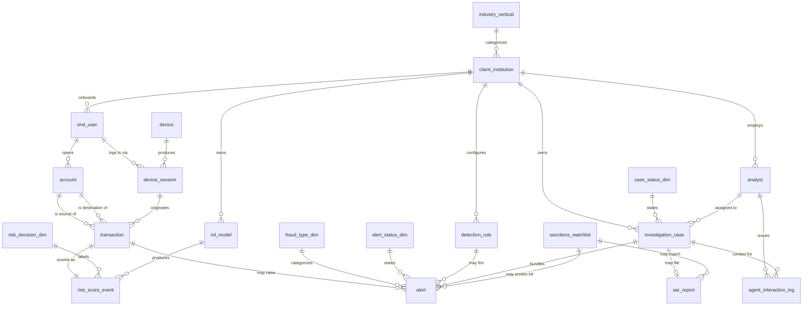

# 金融科技 — 实时反欺诈 & 反洗钱平台 (NovaRisk AI) — ER 文档

> 业务背景, 行业科普, 术语表请见 `01-fintech_real_time_fraud_aml_platform_high_business_context-cn.md`. 本文档只描述数据 (表结构, 字段, 关系, 生成规则, DDL).

---

## 1. 数据集元信息

- **复杂度等级:** High
- **总表数:** 20
- **总行数:** 全部表合计约 4,540 行
- **基准日 (REFERENCE_DATE):** `2026-06-05` — 所有"今天 / 当前快照"语义都锚定到这一天,与生成器 (`NOW`) 和 SQL 查询里的字面日期完全一致。
- **模拟时间窗口:** 截止 2026-06-05 的 90 天季度 (交易/告警/案件/SAR 落在窗口内;签约、开户等"出生时间"可更早)。
- **客户机构:** 12 家 (银行、信用合作社、fintech、BNPL、支付处理商)。
- **外键关系:** 5 张维度/枚举表 + 若干 1:N 链 + `transaction ↔ risk_score_event` 的 1:1 + `alert` 表上两个可空多对一 FK (`case_id`、`watchlist_match_id`)。
- **非 DDL 可表达的范围规则:** 多个跨表业务不变量 (冠军路由、分析师-案件同租户、打包告警共享客户等),由生成器强制,外键无法捕获 — 详见 §7.10。

## 2. 数据如何"一天天生长"

把这个数据集想象成一座森林,不是一张快照。每张表都由上游某个东西喂养:

```
client_institution     (签合同 → NovaRisk 官网加一个 logo)
       │
       ├─► end_user    (银行给客户做开户 → 跑 KYC)
       │       │
       │       └─► account   (客户开了一个支票账户 + 一张卡)
       │              │
       │              └─► transaction   (客户按下"发送" → event 发到 API)
       │
       ├─► device      (一台手机或电脑 → 可能被多个用户共用 — 这是红旗信号)
       │       │
       │       └─► device_session   (每次登录 → 也被该 session 的每笔交易引用)
       │
       ├─► ml_model    (NovaRisk 给每个客户部署一个冠军 + 一个挑战者)
       ├─► detection_rule  (每个客户 5 条规则)
       └─► analyst     (每个客户 3-4 个反欺诈分析师)

       transaction ──► risk_score_event   (每笔交易一个分数,<100ms 延迟)
                              │
                              └─► alert (仅当分数 ≥ 600 或规则触发时)
                                     │
                                     └─► investigation_case (分析师打包 1-4 个告警)
                                            │
                                            ├─► sar_report (仅当 case 状态 = SAR_FILED 时)
                                            └─► agent_interaction_log (Vera 在调查期间与分析师对话)
```

隐含的时间箭头从左到右:一笔交易的 `initiated_at` 必然在源账户的 `opened_at` 之后,后者必然在 end user 的 `onboarded_at` 之后,后者必然在客户机构的 `contract_start_date` 之后。数据生成器严格执行这个时序,因此数据**读起来像真实的历史,而不是一袋随机散落的行**。

---

## 3. 实体关系图



---

## 4. 参考 / 维度表定义

#### 1. industry_vertical
**说明:** NovaRisk 销售对象的行业类型目录。用于切分收入和定制模型。

| 字段 | 类型 | 约束 | 说明 |
|--------|------|-------------|-------------|
| id | INTEGER | PK | 主键 |
| code | VARCHAR(40) | UNIQUE, NOT NULL | 短码 (例如 `commercial_bank`) |
| description | VARCHAR(255) |  | 人类可读说明 |

**示例:**

| id | code | description |
|----|------|-------------|
| 1 | commercial_bank | 服务中小企业和大企业的商业银行 |
| 2 | credit_union | 会员所有的信用合作社 |
| 3 | digital_fintech | 云原生挑战者型 fintech |

---

#### 2. fraud_type_dim
**说明:** 欺诈/洗钱类型目录。`severity_weight` 在优先级计算里作为乘数。

| 字段 | 类型 | 约束 | 说明 |
|--------|------|-------------|-------------|
| id | INTEGER | PK | 主键 |
| code | VARCHAR(40) | UNIQUE, NOT NULL | 例如 `account_takeover`、`wire_fraud`、`deepfake_onboarding` |
| description | VARCHAR(255) |  | 大白话类型说明 |
| severity_weight | FLOAT | NOT NULL | 0.5 (低危害) – 1.2 (高危害) |

---

#### 3. risk_decision_dim
**说明:** 实时打分 API 的四种可能输出。决策根据分数阈值选择 (APPROVE < 400 ≤ STEP_UP < 600 ≤ REVIEW < 800 ≤ DECLINE)。

| 字段 | 类型 | 约束 | 说明 |
|--------|------|-------------|-------------|
| id | INTEGER | PK | 主键 |
| code | VARCHAR(20) | UNIQUE, NOT NULL | APPROVE / STEP_UP / REVIEW / DECLINE |
| description | VARCHAR(255) |  | 银行 UI 在该决策下要做什么 |

---

#### 4. alert_status_dim
**说明:** 告警生命周期状态。大多数告警从 `OPEN` 开始,被分流到 `IN_REVIEW`,然后关闭为误报或真欺诈 (或升级成一个案件)。

#### 5. case_status_dim
**说明:** 调查案件的生命周期状态,从 `OPEN` 到 `SAR_FILED` / `CLOSED_NO_ACTION`。

---

## 5. 核心实体表定义

#### 6. client_institution
**说明:** 一家银行、信用合作社、fintech、BNPL 借贷方或支付处理商,买了 NovaRisk 的平台。**这是 NovaRisk 的客户。** 本数据集里有 12 家。

| 字段 | 类型 | 约束 | 说明 |
|--------|------|-------------|-------------|
| id | INTEGER | PK | 主键 |
| legal_name | VARCHAR(120) | NOT NULL | 例如 "Pioneer Federal Credit Union" |
| industry_vertical_id | INTEGER | FK → industry_vertical.id | |
| headquarters_country | VARCHAR(60) |  | |
| headquarters_state | VARCHAR(60) |  | |
| contract_start_date | DATETIME | NOT NULL | 客户签约时间 (9 个月 – 3 年前) |
| annual_contract_value_usd | FLOAT | NOT NULL | 24 万 – 120 万美元 |
| is_active | BOOLEAN | NOT NULL | |

**示例:**

| id | legal_name | headquarters_country | annual_contract_value_usd |
|----|------------|----------------------|----------------------------|
| 1 | Pioneer Federal Credit Union | USA | 320,000 |
| 3 | Northwind Pay | USA | 880,000 |
| 4 | Skyline National Bank | USA | 1,200,000 |

---

#### 7. sanctions_watchlist
**说明:** 在 OFAC、欧盟、英国、Interpol 或内部 PEP 名单上被标记的姓名/实体。AML 流程会用它去筛查交易 — 一旦命中即构成 SAR 上报的理由。

| 字段 | 类型 | 约束 | 说明 |
|--------|------|-------------|-------------|
| id | INTEGER | PK |  |
| list_source | VARCHAR(40) | NOT NULL | OFAC_SDN / EU_SANCTIONS / UK_HMT / INTERNAL_PEP / INTERPOL |
| listed_name | VARCHAR(160) | NOT NULL | 个人或实体名 |
| listed_country | VARCHAR(60) |  |  |
| risk_tier | VARCHAR(20) | NOT NULL | HIGH / MEDIUM / LOW |
| added_on | DATETIME | NOT NULL |  |

---

#### 8. device
**说明:** 一个唯一的设备指纹 (浏览器版本、字体、屏幕大小、操作系统等的哈希)。行为生物识别让我们能发现同一台物理手机被十个号称"不相关"的账户共用 — 这是有组织欺诈团伙的典型特征。

| 字段 | 类型 | 约束 | 说明 |
|--------|------|-------------|-------------|
| id | INTEGER | PK |  |
| fingerprint_hash | VARCHAR(64) | UNIQUE, NOT NULL | 48 字符十六进制哈希 |
| device_type | VARCHAR(20) | NOT NULL | mobile / desktop / tablet |
| os_family | VARCHAR(20) | NOT NULL | iOS / Android / Windows / macOS / Linux |
| browser_family | VARCHAR(30) |  | Chrome / Safari / Firefox / Edge / Mobile App |
| first_seen_at | DATETIME | NOT NULL |  |
| is_emulator | BOOLEAN | NOT NULL | True ≈ 4% (红旗信号) |

---

#### 9. ml_model
**说明:** 给特定客户部署的某个版本打分模型。NovaRisk 的招牌是 **无监督聚类** — 不需要标注欺诈样本就能找异常的模型。每个客户有 2 个模型:一个 **冠军 (champion)** (在生产中跑) 和一个 **挑战者 (challenger)** (在 A/B 测试中)。

| 字段 | 类型 | 约束 | 说明 |
|--------|------|-------------|-------------|
| id | INTEGER | PK |  |
| client_institution_id | INTEGER | FK → client_institution.id |  |
| model_name | VARCHAR(80) | NOT NULL | 例如 `unsupervised_clustering_v2.3.7` |
| model_family | VARCHAR(40) | NOT NULL | unsupervised_clustering / supervised_gbdt / graph_anomaly / deep_sequence |
| version | VARCHAR(20) | NOT NULL | 语义版本号 |
| deployed_at | DATETIME | NOT NULL |  |
| is_champion | BOOLEAN | NOT NULL | 同一时刻每客户恰好一个 champion |

---

#### 10. detection_rule
**说明:** 每客户的人工编写规则。与 ML 分数并行运行 — 有时抓住 ML 漏掉的,有时作为兜底防线。

| 字段 | 类型 | 约束 | 说明 |
|--------|------|-------------|-------------|
| id | INTEGER | PK |  |
| client_institution_id | INTEGER | FK → client_institution.id |  |
| rule_code | VARCHAR(40) | NOT NULL | 例如 `STRUCTURING_PATTERN`、`KNOWN_MULE_DEVICE` |
| rule_description | VARCHAR(255) | NOT NULL | 大白话条件 |
| threshold_score | INTEGER | NOT NULL | 触发的最小分数 (640–880) |
| is_enabled | BOOLEAN | NOT NULL | ~8% 被禁用 (调优中) |

---

#### 11. analyst
**说明:** 客户机构的反欺诈或 AML 分析师。他们拥有告警和案件,也是在 `agent_interaction_log` 里与 Vera 对话的人。

| 字段 | 类型 | 约束 | 说明 |
|--------|------|-------------|-------------|
| id | INTEGER | PK |  |
| client_institution_id | INTEGER | FK → client_institution.id |  |
| full_name | VARCHAR(120) | NOT NULL |  |
| email | VARCHAR(255) | UNIQUE, NOT NULL |  |
| seniority | VARCHAR(20) | NOT NULL | junior / senior / lead |
| hired_on | DATETIME | NOT NULL |  |

---

#### 12. end_user
**说明:** 一个个人或企业消费者,是*银行的客户* (而不是 NovaRisk 的客户)。这是客户层级的底部:NovaRisk → client_institution → end_user。

| 字段 | 类型 | 约束 | 说明 |
|--------|------|-------------|-------------|
| id | INTEGER | PK |  |
| client_institution_id | INTEGER | FK → client_institution.id |  |
| full_name | VARCHAR(120) | NOT NULL |  |
| email_hash | VARCHAR(64) | NOT NULL | 哈希以保护隐私 — 原始邮箱永不存储 (对应 JD 里的 "tokenization and hashing to protect sensitive data") |
| country | VARCHAR(60) | NOT NULL |  |
| state | VARCHAR(60) | 可空 | 当 `country='USA'` 时填美国州 |
| onboarded_at | DATETIME | NOT NULL |  |
| kyc_status | VARCHAR(30) | NOT NULL | VERIFIED (88%) / PENDING (8%) / REJECTED (4%) |
| customer_risk_rating | VARCHAR(20) | NOT NULL | 来自 CDD 的 LOW / MEDIUM / HIGH |
| is_pep_match | BOOLEAN | NOT NULL | ~2%,政治敏感人物 |

---

#### 13. account
**说明:** 客户机构里的一个金融账户 (支票、储蓄、卡、钱包)。一个 end_user 可以有多个。

| 字段 | 类型 | 约束 | 说明 |
|--------|------|-------------|-------------|
| id | INTEGER | PK |  |
| end_user_id | INTEGER | FK → end_user.id |  |
| client_institution_id | INTEGER | FK → client_institution.id | 反范式化以加快 join |
| account_number_masked | VARCHAR(40) | NOT NULL | 仅末 4 位 |
| account_type | VARCHAR(30) | NOT NULL | checking / savings / credit_card / debit_card / wallet |
| opened_at | DATETIME | NOT NULL |  |
| is_closed | BOOLEAN | NOT NULL | ~5% 已关 |
| daily_limit_usd | FLOAT | NOT NULL | $3K (钱包) – $50K (储蓄) |

---

#### 14. device_session
**说明:** 一次把设备和 end user 配对的登录或 APP session。**本表中设备的跨用户共用就是协同攻击团伙信号** — 本数据集里约 8% 的设备服务于多个用户,模拟真实世界的欺诈团伙。

| 字段 | 类型 | 约束 | 说明 |
|--------|------|-------------|-------------|
| id | INTEGER | PK |  |
| device_id | INTEGER | FK → device.id |  |
| end_user_id | INTEGER | FK → end_user.id |  |
| session_started_at | DATETIME | NOT NULL |  |
| session_ended_at | DATETIME | NOT NULL |  |
| ip_address | VARCHAR(45) | NOT NULL | IPv4 |
| geo_country | VARCHAR(60) |  | 来自 IP 地理位置 |
| geo_city | VARCHAR(80) |  |  |
| is_vpn | BOOLEAN | NOT NULL | ~18% — 大多合法,部分对抗性 |

---

#### 15. transaction
**说明:** **头牌表。** 一笔提交到 NovaRisk 打分 API 的支付、转账、取现或充值 event。本表的每一行都会产生 `risk_score_event` 的一行。

| 字段 | 类型 | 约束 | 说明 |
|--------|------|-------------|-------------|
| id | INTEGER | PK |  |
| source_account_id | INTEGER | FK → account.id | 付钱方 |
| destination_account_id | INTEGER | FK → account.id, 可空 | 收钱方 (现金提现、外部钱包等情况下为 null) |
| device_session_id | INTEGER | FK → device_session.id | 发起该交易的 session |
| transaction_type | VARCHAR(30) | NOT NULL | wire / ach_push / ach_pull / card_purchase / p2p_transfer / atm_withdrawal / wallet_topup |
| channel | VARCHAR(30) | NOT NULL | mobile_app / web / branch / api / atm |
| amount_usd | FLOAT | NOT NULL | 归一化到美元 |
| currency | VARCHAR(3) | NOT NULL | ISO 4217 |
| counterparty_country | VARCHAR(60) |  | 钱去往哪里 |
| initiated_at | DATETIME | NOT NULL | 必须落在所属 `device_session` 窗口内 |
| settled_at | DATETIME | 可空 | ~85% 已结算;null = 仍 pending |
| is_high_risk_corridor | BOOLEAN | NOT NULL | 当且仅当 counterparty_country ∈ {Iran, NK, Syria, Belarus, Russia, Myanmar} 时为 True |

**示例:**

| id | source_account_id | amount_usd | counterparty_country | is_high_risk_corridor |
|----|-------------------|-----------|----------------------|------------------------|
| 1 | 254 | 82.93 | Australia | false |
| 2 | 766 | 67.43 | Myanmar | true |
| 3 | 210 | 764.27 | Belarus | true |

---

#### 16. risk_score_event
**说明:** NovaRisk 实时打分 API 对一笔交易的输出。与 `transaction` 1:1。`latency_ms` 中位数 ~100 — 平台的 SLA 承诺。

| 字段 | 类型 | 约束 | 说明 |
|--------|------|-------------|-------------|
| id | INTEGER | PK |  |
| transaction_id | INTEGER | UNIQUE, FK → transaction.id | 1:1 |
| ml_model_id | INTEGER | FK → ml_model.id | 打分时刻在生产中的冠军模型 |
| decision_id | INTEGER | FK → risk_decision_dim.id | 由分数段映射 |
| risk_score | INTEGER | NOT NULL | 0 (干净) – 999 (高风险) |
| scored_at | DATETIME | NOT NULL | initiated_at + 10–200 ms |
| latency_ms | INTEGER | NOT NULL | API 往返延迟 |
| top_feature | VARCHAR(80) | NOT NULL | 贡献最大的信号 — 可解释性输出 |

---

#### 17. alert
**说明:** 当一个 `risk_score_event` 满足 `risk_score >= 600` (统一告警阈值 — 见 §7.3) 或触发了某条检测规则时被生成。可能、也可能不会成为某个案件的一部分。同时也携带该交易的制裁名单筛查结果。

| 字段 | 类型 | 约束 | 说明 |
|--------|------|-------------|-------------|
| id | INTEGER | PK |  |
| transaction_id | INTEGER | FK → transaction.id |  |
| detection_rule_id | INTEGER | FK → detection_rule.id, 可空 | Null = 纯 ML 告警,没有规则触发 |
| fraud_type_id | INTEGER | FK → fraud_type_dim.id |  |
| status_id | INTEGER | FK → alert_status_dim.id |  |
| case_id | INTEGER | FK → investigation_case.id, 可空 | 仅当 status 为 `ESCALATED` 或 `CLOSED_CONFIRMED_FRAUD` 时设置 (见 §7.8) |
| watchlist_match_id | INTEGER | FK → sanctions_watchlist.id, 可空 | 当底层交易在 AML 筛查时命中 OFAC / PEP / 内部 PEP 时非空。底层 per-alert 命中概率为 **wire / 高风险走廊 18%**,**其他 4%**。在 90 天、~140 告警的快照里实测落在 **~10–25% / ~2–7%** 区间 — wire / 高风险走廊子桶只有 ~30 个告警,所以光靠二项采样噪声其实测值就可能落在任何窄带之外 (n=34、p=0.18 的 95% Wilson CI 大约是 [8%, 33%]) |
| raised_at | DATETIME | NOT NULL |  |
| is_true_positive | BOOLEAN | 可空 | 严格映射 (§7.9):`CLOSED_CONFIRMED_FRAUD`→True,`CLOSED_FALSE_POSITIVE`→False,其他状态→NULL |

---

#### 18. investigation_case
**说明:** 一组告警在一个分析师手下被打包成的调查。案件是分析师工作的方式 — 单个告警只是一声 ping,但 *一组* 落在同一个账户或设备上的告警才讲得出值得调查的故事。

| 字段 | 类型 | 约束 | 说明 |
|--------|------|-------------|-------------|
| id | INTEGER | PK |  |
| client_institution_id | INTEGER | FK → client_institution.id | 所有打包告警和负责分析师都属于这同一个客户 (不变量,见 §7.10) |
| assigned_analyst_id | INTEGER | FK → analyst.id | 始终来自与 `client_institution_id` 相同的客户 |
| case_status_id | INTEGER | FK → case_status_dim.id |  |
| opened_at | DATETIME | NOT NULL | **在打包告警中**最晚一条**的 `raised_at` 之后** — 分析师只能打包已经被生成的告警 |
| closed_at | DATETIME | 可空 | 打开期间为 Null。设置后:`closed_at > filed_at` (行政关闭发生在 SAR 提交之后) |
| total_exposure_usd | FLOAT | NOT NULL | 打包告警的 `transaction.amount_usd` 总和 ± 噪声 (双向,约 ±5%) |
| priority | VARCHAR(20) | NOT NULL | LOW / MEDIUM / HIGH / CRITICAL |

---

#### 19. sar_report
**说明:** 提交到 FinCEN 的 SAR (可疑活动报告)。仅在 `investigation_case.case_status_id` 映射到 `SAR_FILED` 时存在。`ai_drafted = TRUE` ≈ 80% — NovaRisk 的自动 SAR 提交产品写的叙述。

| 字段 | 类型 | 约束 | 说明 |
|--------|------|-------------|-------------|
| id | INTEGER | PK |  |
| case_id | INTEGER | UNIQUE, FK → investigation_case.id | 与 SAR_FILED 状态的 case 1:1 |
| watchlist_match_id | INTEGER | FK → sanctions_watchlist.id, 可空 | 如果 SAR 由 OFAC/PEP 命中触发 |
| filing_reference | VARCHAR(40) | UNIQUE, NOT NULL | `FINCEN-YYYYMMDD-NNNNN` |
| filed_at | DATETIME | NOT NULL |  |
| narrative_summary | TEXT | NOT NULL | 提交给 FinCEN 的大白话叙述 |
| total_reported_amount_usd | FLOAT | NOT NULL |  |
| ai_drafted | BOOLEAN | NOT NULL | True ≈ 80% |

**示例叙述:**
> "受调查人的设备指纹通过数据联盟此前已被另一家机构关联到确认欺诈。来自账户 ****8602 的 4 笔后续交易共计 $6,190 已被阻断或撤回。"

---

#### 20. agent_interaction_log
**说明:** Vera (对话式 AI 代理) 与分析师的交互记录。每一行是一个分析师问题被路由到四个 sub-agent (Detection 检测 / Optimization 优化 / Investigation 调查 / Reporting 报告) 之一,再调用某个工具。**本表是 AI agent 产品的审计追踪** — 用于合规审查和度量工具调用延迟/成本。

| 字段 | 类型 | 约束 | 说明 |
|--------|------|-------------|-------------|
| id | INTEGER | PK |  |
| analyst_id | INTEGER | FK → analyst.id | 谁问的 |
| case_id | INTEGER | FK → investigation_case.id, 可空 | 通常 (~85%) 绑到某个 case |
| agent_name | VARCHAR(40) | NOT NULL | Detection / Optimization / Investigation / Reporting |
| user_query | TEXT | NOT NULL | 分析师的自然语言问题 |
| tool_called | VARCHAR(60) | NOT NULL | agent 调用的工具 (function-calling) |
| tokens_used | INTEGER | NOT NULL | 消耗的 LLM token 数 |
| latency_ms | INTEGER | NOT NULL | 端到端响应时间 |
| human_approved | BOOLEAN | NOT NULL | True ≈ 92% — 分析师接受了 agent 的输出 |
| occurred_at | DATETIME | NOT NULL |  |

---

## 6. Faker 策略

下表把常见字段模式映射到生成器实际使用的 Faker 方法或采样策略 (`FAKER_LOCALE = "en_US"`,`RANDOM_SEED = 42`,因此每次运行结果可复现)。

| 字段模式 | 生成方法 | 说明 |
|----------|----------|------|
| `client_institution.legal_name` | 硬编码 12 家虚构机构清单 | 固定客户群,保证合同金额/总部分布稳定 |
| `analyst.full_name` / `end_user.full_name` | `fake.name()` | 北美人名 |
| `analyst.email` | `fake.unique.email()` | 唯一邮箱;生成后 `fake.unique.clear()` |
| `end_user.email_hash` | `sha256(fake.unique.email())[:32]` | 原始邮箱永不落库 (隐私要求,见 §7.7) |
| `device.fingerprint_hash` | `sha256(random + user_agent + ipv4)[:48]` | 设备指纹哈希,唯一 |
| `device_session.ip_address` | `fake.ipv4_public()` | 公网 IPv4 |
| `device_session.geo_city` | `fake.city()` | 来自 IP 地理位置 |
| `end_user.state` | `fake.state()` (仅 `country='USA'`) | 美国州名;非美国为 NULL |
| 各类时间戳 (`contract_start_date`、`onboarded_at`、`hired_on`、`deployed_at`、`added_on`、`first_seen_at`) | `fake.date_time_between(start, end)` | 锚点相对 `NOW`,严格满足时序 (见 §7.1) |
| `sanctions_watchlist.listed_name` | 70% `fake.name()` / 30% `fake.company()` | 个人或实体名混合 |
| `transaction.amount_usd` | `random.choices` 三档均匀分布加权 | 45% 小额 / 40% 中额 / 15% 大额 |
| `transaction.counterparty_country` / `end_user.country` | `random.choices(weights=...)` | ~95% 正常国家、~5% 高风险走廊 (见 §7.12) |
| `transaction.currency` | `random.choices(CURRENCIES, CURRENCY_WEIGHTS)` | ~85% USD,长尾多币种 |
| `risk_score_event.risk_score` | `random.choices` 三段加权 + boost | 65/25/10 底分分布再加 boost (见 §7.3) |
| `account.account_number_masked` | `f"****{random.randint(1000,9999)}"` | 仅末 4 位 |
| `ml_model.version` | `f"{randint}.{randint}.{randint}"` | 语义版本号 |
| `agent_interaction_log.tokens_used` / `latency_ms` | `random.randint(lo, hi)` 按 agent 成本档 | Reporting 最贵,Detection 最便宜 |
| `sar_report.narrative_summary` | 4 选 1 叙述模板 `.format(...)` | 含 structuring / wire / mule / consortium 四类口径 |
| `agent_interaction_log.user_query` | 10 选 1 自然语言查询模板 | 模拟分析师向 Vera 提问 |

---

## 7. 数据生成规则

### 7.1 时序排序 (始终强制)

1. `client_institution.contract_start_date` < `end_user.onboarded_at` < `account.opened_at` < `device_session.session_started_at` < `transaction.initiated_at` < `risk_score_event.scored_at` < `alert.raised_at` < `investigation_case.opened_at` < `sar_report.filed_at` < `investigation_case.closed_at`
2. `device_session.session_ended_at` > `session_started_at`
3. 一笔交易的 `initiated_at` 始终落在它所属 session 的 `[started, ended]` 窗口内。
4. 一个 device_session 的 `session_started_at` 必须在该用户**首个** `account.opened_at` 之后 (一个没账户的用户无法交易,我们只建模会导向交易的 session)。
5. `investigation_case.opened_at` 在所有打包告警的**最晚** `raised_at` 之后 (不是最早 — 分析师只能打包已经被生成的告警)。

### 7.2 分数到决策映射
- `risk_score >= 800` → `DECLINE`
- `600 ≤ risk_score < 800` → `REVIEW`
- `400 ≤ risk_score < 600` → `STEP_UP`
- `risk_score < 400` → `APPROVE`

### 7.3 分数分布 (boost 之前)
- 65% 的交易底分落在 50–350 (干净)
- 25% 落在 350–650 (可疑但不需操作)
- 10% 落在 650–999 (高风险尾部)
- 高风险走廊交易在底分上加 +80–180 boost
- $10K 以上的交易加 +40–120 boost

经 boost 后实际分布会略向上偏移 — 上述底分分布是**未加 boost 的原始**基线。告警阈值 (§7.3.1) 是 `600`,因此只要 boost 把最终分数推过 600,任何底分桶都可能产生告警 — 告警*不限于* 10% 的 pre-boost 尾部。

### 7.3.1 统一告警阈值

当 **`risk_score >= 600` (REVIEW 段起点)** 或某条启用的检测规则被触发时,产生告警。600 这个阈值是刻意的 — 决策引擎从 STEP_UP 切到 REVIEW 也是这个边界。

### 7.4 告警生命周期分布
| 状态 | 概率 |
|--------|-------------|
| OPEN | 10% |
| IN_REVIEW | 15% |
| ESCALATED | 25% |
| CLOSED_FALSE_POSITIVE | 30% |
| CLOSED_CONFIRMED_FRAUD | 20% |

### 7.5 案件生命周期分布
| 状态 | 概率 |
|--------|-------------|
| OPEN | 10% |
| INVESTIGATING | 30% |
| PENDING_SAR | 15% |
| SAR_FILED | 30% |
| CLOSED_NO_ACTION | 15% |

### 7.6 协同攻击团伙信号
~8% 的设备被刻意标记为"共享",会被跨多个 end-user 重复使用。经过自然 session 采样后,数据集里通常有 ~10 台设备被 5+ 个 distinct 用户使用 (团伙),还有一长尾的 2-4 用户设备 (家庭共用 / 弱信号)。`Detect Coordinated Attack Rings` 查询利用这一点。

### 7.7 隐私
End-user 邮箱是 SHA-256 哈希 (`email_hash`);原始邮箱永不存储 — 对应 JD 里 "tokenization and hashing to protect sensitive data" 的要求。

### 7.8 alert.case_id 赋值不变量

`alert.case_id` **仅对 status 为 `ESCALATED` 或 `CLOSED_CONFIRMED_FRAUD` 的告警非空**。处于 `OPEN`、`IN_REVIEW`、`CLOSED_FALSE_POSITIVE` 状态的告警从不被打包进案件 (它们要么还在分流,要么已被判为误报)。

### 7.9 is_true_positive ↔ alert_status 映射

| alert_status | is_true_positive |
|--------------|-------------------|
| OPEN | NULL |
| IN_REVIEW | NULL |
| ESCALATED | NULL |
| CLOSED_FALSE_POSITIVE | False |
| CLOSED_CONFIRMED_FRAUD | True |

严格强制 — 这两列永远不会不同步。

### 7.10 跨表业务不变量 (DDL 无法表达)

这些规则由生成器强制执行,但无法仅靠外键捕获:

1. **冠军路由**: `risk_score_event.ml_model_id` 所属模型的 `client_institution_id` 等于该交易源账户所属的客户。~85% 的事件用 **冠军**,~15% 用 **挑战者** (A/B 流量分流)。每客户同一时刻恰好一个冠军。
2. **分析师-案件归属**: `investigation_case.assigned_analyst_id.client_institution_id == investigation_case.client_institution_id`。分析师为单一银行工作。
3. **代理-案件归属**: 当 `agent_interaction_log.case_id` 被设置时,该行的 analyst 属于该案件所在的客户机构。
4. **账户-用户同租户 (反范式化)**: 对于关联用户,`account.client_institution_id == end_user.client_institution_id`。冗余 FK 是为了查询速度,由生成器保持同步。
5. **打包告警共享客户**: 同一个 `investigation_case` 内所有告警通过其源账户解析到同一个 `client_institution_id`。
6. **允许跨客户的目的账户**: `transaction.destination_account_id` 可以属于*不同*于源账户的 `client_institution` — 这建模了真实的跨行电汇 / ACH 转账,是行级跨租户边界的唯一情形。

### 7.11 `transaction.amount_usd` vs `transaction.currency`

`amount_usd` **始终**是交易时点的美元等值 — NovaRisk 平台为跨租户可比性归一化到美元。`currency` 是**原始**交易币种 (ISO 4217);可能是 USD、EUR、GBP 等。本数据集中约 85% 的交易以 USD 原币发起,因为客户群主要在美国。无论 `currency` 字段是什么,读 `amount_usd` 都是安全的。

### 7.12 高风险走廊国家列表

`is_high_risk_corridor = (counterparty_country ∈ {Iran, North Korea, Syria, Belarus, Russia, Myanmar})`。这是**演示简化**。真实 AML 系统里这些国家处于不同 OFAC 制裁分级 — Iran / NK / Syria 是全面制裁,Russia / Belarus 是部分制裁,Myanmar 处于中间 — 布尔标志会被替换成 3 或 4 级评级。本数据集中国家分布的目标是约 5% 的交易落在高风险走廊 (符合行业范围)。

---

### 7.13 业务陷阱声明 (observed magnitudes)

下面是生成器**刻意嵌入**的分布偏置与相关性 — 每一条都对应业务背景文档里的一个业务问题,并由某条 SQL 查询暴露。这些是数据里**实际产生**的量级 (受 90 天、样本量不大的统计噪声影响,允许小幅波动)。

| 陷阱 / 信号 | 期望量级 | 暴露查询 |
|---|---|---|
| **协同攻击团伙 (共享设备)** | ~8% 设备被标记为可共享;自然 session 采样后,通常有 ~10 台设备被 5+ 个 distinct 用户使用,外加一长尾 2–4 用户设备 | Q7 |
| **高风险走廊敞口** | ~5% 交易落在高风险走廊;走廊交易底分 +80~180 boost,告警占比偏高 | Q8 |
| **制裁名单命中率** | per-alert 命中:wire / 高风险走廊 ~18%,其他 ~4%;小样本下实测带较宽 | Q12 |
| **CDD 评级 vs 实际欺诈** | `customer_risk_rating` 权重 LOW/MED/HIGH = 0.70/0.22/0.08;每千笔交易确认欺诈数理想随评级单调上升 — Q11 用来检验是否真单调 | Q11 |
| **冠军 vs 挑战者漂移** | ~85/15 流量分流;两模型 decline 率 gap 通常较小 (±2pp 量级),`challenger_n` 样本偏小需谨慎解读 | Q14 |
| **收入集中度** | top-3 客户 (Skyline + Meridian + EquatorPay) 约占 ARR **41%** | Q19 |
| **规则误报率** | 告警状态分布 FP 30% / confirmed 20%;FP 率因规则而异,`VPN_PLUS_GEO_MISMATCH`、`CARD_TESTING_BURST` 通常最吵 | Q5 |
| **实时打分 SLA** | `latency_ms` 15–180 区间,p50 ≈ 100ms,p99 ≈ 175ms | Q1 |
| **SAR AI 起草率** | `ai_drafted ≈ 80%` — 自动起草产品的产能证据 | Q20 |
| **Vera 输出接受率** | `human_approved ≈ 92%`,全部子代理一致 | Q13 |
| **告警阈值** | 统一 `risk_score >= 600` 或启用规则触发 → 告警;告警生命周期分布 10/15/25/30/20 | Q3, Q9 |

> 注:这些是 observed magnitudes (生成器实际产出),不是事后人工调过的数字。SQL 查询的"期望结果"段引用的就是这些量级。

---

## 8. 文件清单

| # | 文件名 | 表 | 行数 | 依赖 |
|---|----------|-------|------|------------|
| 01 | 01_industry_vertical.tsv | industry_vertical | 5 | — |
| 02 | 02_fraud_type_dim.tsv | fraud_type_dim | 9 | — |
| 03 | 03_risk_decision_dim.tsv | risk_decision_dim | 4 | — |
| 04 | 04_alert_status_dim.tsv | alert_status_dim | 5 | — |
| 05 | 05_case_status_dim.tsv | case_status_dim | 5 | — |
| 06 | 06_client_institution.tsv | client_institution | 12 | industry_vertical |
| 07 | 07_sanctions_watchlist.tsv | sanctions_watchlist | 50 | — |
| 08 | 08_device.tsv | device | 400 | — |
| 09 | 09_ml_model.tsv | ml_model | 24 | client_institution |
| 10 | 10_detection_rule.tsv | detection_rule | 60 | client_institution |
| 11 | 11_analyst.tsv | analyst | 42 | client_institution |
| 12 | 12_end_user.tsv | end_user | 600 | client_institution |
| 13 | 13_account.tsv | account | 800 | end_user |
| 14 | 14_device_session.tsv | device_session | 600 | device, end_user |
| 15 | 15_transaction.tsv | transaction | 800 | account, device_session |
| 16 | 16_risk_score_event.tsv | risk_score_event | 800 | transaction, ml_model |
| 17 | 17_alert.tsv | alert | 143 | transaction, detection_rule, fraud_type, alert_status, investigation_case, sanctions_watchlist |
| 18 | 18_investigation_case.tsv | investigation_case | 32 | client_institution, analyst, case_status |
| 19 | 19_sar_report.tsv | sar_report | 9 | investigation_case, sanctions_watchlist |
| 20 | 20_agent_interaction_log.tsv | agent_interaction_log | 120 | analyst, investigation_case |

**总行数:** ~4,540

> 为什么案件 (32) 和 SAR (9) 比初版少? 在 **alert→case 打包不变量** (§7.8) 收紧到只接收 `ESCALATED` 和 `CLOSED_CONFIRMED_FRAUD` 状态的告警之后,合格告警池从"几乎全部告警"降到了约一半 (44%),因此每客户的案件数随之下降。这才是符合现实的形状 — 大多数告警永远不会变成案件。

---

## 9. 数据库 Schema (SQLite DDL 节选)

```sql
CREATE TABLE client_institution (
    id INTEGER PRIMARY KEY,
    legal_name VARCHAR(120) NOT NULL,
    industry_vertical_id INTEGER NOT NULL REFERENCES industry_vertical(id),
    headquarters_country VARCHAR(60),
    headquarters_state VARCHAR(60),
    contract_start_date DATETIME NOT NULL,
    annual_contract_value_usd FLOAT NOT NULL,
    is_active BOOLEAN NOT NULL
);

CREATE TABLE "transaction" (
    id INTEGER PRIMARY KEY,
    source_account_id INTEGER NOT NULL REFERENCES account(id),
    destination_account_id INTEGER REFERENCES account(id),
    device_session_id INTEGER NOT NULL REFERENCES device_session(id),
    transaction_type VARCHAR(30) NOT NULL,
    channel VARCHAR(30) NOT NULL,
    amount_usd FLOAT NOT NULL,
    currency VARCHAR(3) NOT NULL,
    counterparty_country VARCHAR(60),
    initiated_at DATETIME NOT NULL,
    settled_at DATETIME,
    is_high_risk_corridor BOOLEAN NOT NULL
);

CREATE TABLE risk_score_event (
    id INTEGER PRIMARY KEY,
    transaction_id INTEGER NOT NULL UNIQUE REFERENCES "transaction"(id),
    ml_model_id INTEGER NOT NULL REFERENCES ml_model(id),
    decision_id INTEGER NOT NULL REFERENCES risk_decision_dim(id),
    risk_score INTEGER NOT NULL,
    scored_at DATETIME NOT NULL,
    latency_ms INTEGER NOT NULL,
    top_feature VARCHAR(80) NOT NULL
);
-- ... 还有 17 张表 ...
```

> `transaction` 在 SQLite 里是保留字,所以查询里始终要加双引号写成 `"transaction"` (或用别名:`FROM "transaction" t`)。
