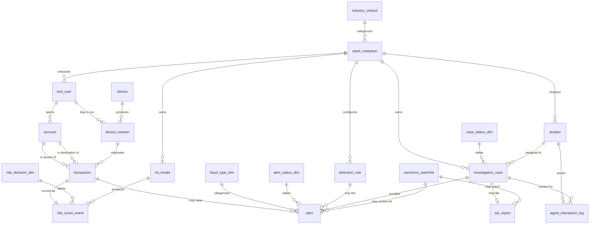

# Fintech — Real-Time Fraud & AML Platform (NovaRisk AI) — ER Document

> For business context, industry primer, and glossary, see `01-fintech_real_time_fraud_aml_platform_high_business_context.md`. This document only describes the data (table structure, fields, relationships, generation rules, DDL).

---

## 1. Dataset Metadata

- **Complexity level:** High
- **Total tables:** 20
- **Total rows:** about 4,540 across all tables
- **Reference date (REFERENCE_DATE):** `2026-06-05` — every "today / current snapshot" semantic anchors to this date, fully consistent with the generator (`NOW`) and the literal dates in the SQL queries.
- **Simulated time window:** a 90-day quarter ending on 2026-06-05 (transactions / alerts / cases / SARs fall inside the window; "birth times" like contract signing and account onboarding can be earlier).
- **Client institutions:** 12 (banks, credit unions, fintechs, BNPL, payment processors).
- **Foreign-key relationships:** 5 dimension / enum tables + several 1:N chains + a 1:1 between `transaction` and `risk_score_event` + two nullable many-to-one FKs on the `alert` table (`case_id`, `watchlist_match_id`).
- **Scope rules not expressible in DDL:** multiple cross-table business invariants (champion routing, analyst-case tenant alignment, bundled-alert-shared-customer, etc.) enforced by the generator and not capturable by foreign keys — see §7.10.

## 2. How the Data "Grows Day by Day"

Think of this dataset as a forest, not a single snapshot. Every table is fed by something upstream:

```
client_institution     (sign contract → add a logo to NovaRisk's website)
       │
       ├─► end_user    (bank onboards a customer → runs KYC)
       │       │
       │       └─► account   (the customer opens a checking account + a card)
       │              │
       │              └─► transaction   (the customer taps "Send" → event posted to the API)
       │
       ├─► device      (a phone or laptop → may be shared by multiple users — that's a red flag)
       │       │
       │       └─► device_session   (each login → also referenced by every transaction in that session)
       │
       ├─► ml_model    (NovaRisk deploys a champion + a challenger per client)
       ├─► detection_rule  (5 rules per client)
       └─► analyst     (3-4 fraud analysts per client)

       transaction ──► risk_score_event   (one score per transaction, <100ms latency)
                              │
                              └─► alert (only when the score ≥ 600 or a rule fires)
                                     │
                                     └─► investigation_case (analyst bundles 1-4 alerts)
                                            │
                                            ├─► sar_report (only when case status = SAR_FILED)
                                            └─► agent_interaction_log (Vera talks to the analyst throughout the investigation)
```

The implied time arrow runs left to right: a transaction's `initiated_at` must come after its source account's `opened_at`, which must come after the end user's `onboarded_at`, which must come after the client institution's `contract_start_date`. The data generator enforces this strictly, so the data **reads like real history, not a bag of randomly scattered rows**.

---

## 3. Entity Relationship Diagram



---

## 4. Reference / Dimension Table Definitions

#### 1. industry_vertical
**Description:** Catalog of the industry types NovaRisk sells into. Used to slice revenue and to customize models.

| Field | Type | Constraint | Description |
|--------|------|-------------|-------------|
| id | INTEGER | PK | Primary key |
| code | VARCHAR(40) | UNIQUE, NOT NULL | Short code (e.g. `commercial_bank`) |
| description | VARCHAR(255) |  | Human-readable description |

**Examples:**

| id | code | description |
|----|------|-------------|
| 1 | commercial_bank | Commercial bank serving SMBs and enterprises |
| 2 | credit_union | Member-owned credit union |
| 3 | digital_fintech | Cloud-native challenger fintech |

---

#### 2. fraud_type_dim
**Description:** Catalog of fraud / money-laundering types. `severity_weight` acts as a multiplier in priority calculations.

| Field | Type | Constraint | Description |
|--------|------|-------------|-------------|
| id | INTEGER | PK | Primary key |
| code | VARCHAR(40) | UNIQUE, NOT NULL | e.g. `account_takeover`, `wire_fraud`, `deepfake_onboarding` |
| description | VARCHAR(255) |  | Plain-English description of the type |
| severity_weight | FLOAT | NOT NULL | 0.5 (low harm) – 1.2 (high harm) |

---

#### 3. risk_decision_dim
**Description:** The four possible outputs of the real-time scoring API. The decision is picked from score thresholds (APPROVE < 400 ≤ STEP_UP < 600 ≤ REVIEW < 800 ≤ DECLINE).

| Field | Type | Constraint | Description |
|--------|------|-------------|-------------|
| id | INTEGER | PK | Primary key |
| code | VARCHAR(20) | UNIQUE, NOT NULL | APPROVE / STEP_UP / REVIEW / DECLINE |
| description | VARCHAR(255) |  | What the bank UI does on that decision |

---

#### 4. alert_status_dim
**Description:** The lifecycle states of an alert. Most alerts start in `OPEN`, get triaged to `IN_REVIEW`, and then close as either false positive or true fraud (or get escalated into a case).

#### 5. case_status_dim
**Description:** Lifecycle states of an investigation case, from `OPEN` to either `SAR_FILED` or `CLOSED_NO_ACTION`.

---

## 5. Core Entity Table Definitions

#### 6. client_institution
**Description:** A bank, credit union, fintech, BNPL lender, or payment processor that has bought the NovaRisk platform. **This is NovaRisk's customer.** There are 12 of them in this dataset.

| Field | Type | Constraint | Description |
|--------|------|-------------|-------------|
| id | INTEGER | PK | Primary key |
| legal_name | VARCHAR(120) | NOT NULL | e.g. "Pioneer Federal Credit Union" |
| industry_vertical_id | INTEGER | FK → industry_vertical.id | |
| headquarters_country | VARCHAR(60) |  | |
| headquarters_state | VARCHAR(60) |  | |
| contract_start_date | DATETIME | NOT NULL | When the customer signed (9 months – 3 years ago) |
| annual_contract_value_usd | FLOAT | NOT NULL | $240K – $1.2M |
| is_active | BOOLEAN | NOT NULL | |

**Examples:**

| id | legal_name | headquarters_country | annual_contract_value_usd |
|----|------------|----------------------|----------------------------|
| 1 | Pioneer Federal Credit Union | USA | 320,000 |
| 3 | Northwind Pay | USA | 880,000 |
| 4 | Skyline National Bank | USA | 1,200,000 |

---

#### 7. sanctions_watchlist
**Description:** Names / entities flagged on OFAC, EU, UK, Interpol, or an internal PEP list. The AML pipeline uses this list to screen transactions — any hit is grounds for a SAR filing.

| Field | Type | Constraint | Description |
|--------|------|-------------|-------------|
| id | INTEGER | PK |  |
| list_source | VARCHAR(40) | NOT NULL | OFAC_SDN / EU_SANCTIONS / UK_HMT / INTERNAL_PEP / INTERPOL |
| listed_name | VARCHAR(160) | NOT NULL | Person or entity name |
| listed_country | VARCHAR(60) |  |  |
| risk_tier | VARCHAR(20) | NOT NULL | HIGH / MEDIUM / LOW |
| added_on | DATETIME | NOT NULL |  |

---

#### 8. device
**Description:** A unique device fingerprint (a hash of browser version, fonts, screen size, OS, etc.). Behavioral biometrics let us spot the case where the same physical phone is being shared by ten supposedly "unrelated" accounts — a classic fingerprint of an organized fraud ring.

| Field | Type | Constraint | Description |
|--------|------|-------------|-------------|
| id | INTEGER | PK |  |
| fingerprint_hash | VARCHAR(64) | UNIQUE, NOT NULL | 48-character hex hash |
| device_type | VARCHAR(20) | NOT NULL | mobile / desktop / tablet |
| os_family | VARCHAR(20) | NOT NULL | iOS / Android / Windows / macOS / Linux |
| browser_family | VARCHAR(30) |  | Chrome / Safari / Firefox / Edge / Mobile App |
| first_seen_at | DATETIME | NOT NULL |  |
| is_emulator | BOOLEAN | NOT NULL | True ≈ 4% (red flag) |

---

#### 9. ml_model
**Description:** A specific versioned scoring model deployed for one customer. NovaRisk's calling card is **unsupervised clustering** — models that find anomalies without needing labeled fraud examples. Every customer has 2 models: a **champion** (in production) and a **challenger** (in A/B testing).

| Field | Type | Constraint | Description |
|--------|------|-------------|-------------|
| id | INTEGER | PK |  |
| client_institution_id | INTEGER | FK → client_institution.id |  |
| model_name | VARCHAR(80) | NOT NULL | e.g. `unsupervised_clustering_v2.3.7` |
| model_family | VARCHAR(40) | NOT NULL | unsupervised_clustering / supervised_gbdt / graph_anomaly / deep_sequence |
| version | VARCHAR(20) | NOT NULL | Semantic version |
| deployed_at | DATETIME | NOT NULL |  |
| is_champion | BOOLEAN | NOT NULL | Exactly one champion per customer at any moment |

---

#### 10. detection_rule
**Description:** Human-written rules owned by each customer. They run in parallel with the ML score — sometimes catching what ML misses, sometimes acting as a backstop.

| Field | Type | Constraint | Description |
|--------|------|-------------|-------------|
| id | INTEGER | PK |  |
| client_institution_id | INTEGER | FK → client_institution.id |  |
| rule_code | VARCHAR(40) | NOT NULL | e.g. `STRUCTURING_PATTERN`, `KNOWN_MULE_DEVICE` |
| rule_description | VARCHAR(255) | NOT NULL | Plain-English condition |
| threshold_score | INTEGER | NOT NULL | Minimum score that triggers it (640–880) |
| is_enabled | BOOLEAN | NOT NULL | ~8% are disabled (being tuned) |

---

#### 11. analyst
**Description:** A fraud or AML analyst employed by a client institution. They own alerts and cases, and they are also the people who chat with Vera in `agent_interaction_log`.

| Field | Type | Constraint | Description |
|--------|------|-------------|-------------|
| id | INTEGER | PK |  |
| client_institution_id | INTEGER | FK → client_institution.id |  |
| full_name | VARCHAR(120) | NOT NULL |  |
| email | VARCHAR(255) | UNIQUE, NOT NULL |  |
| seniority | VARCHAR(20) | NOT NULL | junior / senior / lead |
| hired_on | DATETIME | NOT NULL |  |

---

#### 12. end_user
**Description:** A person or business consumer, who is *the bank's customer* (not NovaRisk's customer). This is the bottom of the customer hierarchy: NovaRisk → client_institution → end_user.

| Field | Type | Constraint | Description |
|--------|------|-------------|-------------|
| id | INTEGER | PK |  |
| client_institution_id | INTEGER | FK → client_institution.id |  |
| full_name | VARCHAR(120) | NOT NULL |  |
| email_hash | VARCHAR(64) | NOT NULL | Hashed for privacy — the raw email is never stored (this corresponds to the JD's "tokenization and hashing to protect sensitive data") |
| country | VARCHAR(60) | NOT NULL |  |
| state | VARCHAR(60) | nullable | US state when `country='USA'` |
| onboarded_at | DATETIME | NOT NULL |  |
| kyc_status | VARCHAR(30) | NOT NULL | VERIFIED (88%) / PENDING (8%) / REJECTED (4%) |
| customer_risk_rating | VARCHAR(20) | NOT NULL | LOW / MEDIUM / HIGH from CDD |
| is_pep_match | BOOLEAN | NOT NULL | ~2%, politically exposed persons |

---

#### 13. account
**Description:** A financial account at a client institution (checking, savings, card, wallet). One end_user can have many.

| Field | Type | Constraint | Description |
|--------|------|-------------|-------------|
| id | INTEGER | PK |  |
| end_user_id | INTEGER | FK → end_user.id |  |
| client_institution_id | INTEGER | FK → client_institution.id | Denormalized to speed up joins |
| account_number_masked | VARCHAR(40) | NOT NULL | Last 4 digits only |
| account_type | VARCHAR(30) | NOT NULL | checking / savings / credit_card / debit_card / wallet |
| opened_at | DATETIME | NOT NULL |  |
| is_closed | BOOLEAN | NOT NULL | ~5% are closed |
| daily_limit_usd | FLOAT | NOT NULL | $3K (wallet) – $50K (savings) |

---

#### 14. device_session
**Description:** A login or app session that pairs a device with an end user. **Cross-user reuse of a device in this table is the signal of a coordinated attack ring** — in this dataset about 8% of devices serve more than one user, modeling real-world fraud rings.

| Field | Type | Constraint | Description |
|--------|------|-------------|-------------|
| id | INTEGER | PK |  |
| device_id | INTEGER | FK → device.id |  |
| end_user_id | INTEGER | FK → end_user.id |  |
| session_started_at | DATETIME | NOT NULL |  |
| session_ended_at | DATETIME | NOT NULL |  |
| ip_address | VARCHAR(45) | NOT NULL | IPv4 |
| geo_country | VARCHAR(60) |  | Derived from the IP geolocation |
| geo_city | VARCHAR(80) |  |  |
| is_vpn | BOOLEAN | NOT NULL | ~18% — most legitimate, some adversarial |

---

#### 15. transaction
**Description:** **The headline table.** A payment, transfer, withdrawal, or top-up event submitted to NovaRisk's scoring API. Every row in this table yields exactly one row in `risk_score_event`.

| Field | Type | Constraint | Description |
|--------|------|-------------|-------------|
| id | INTEGER | PK |  |
| source_account_id | INTEGER | FK → account.id | The payer |
| destination_account_id | INTEGER | FK → account.id, nullable | The payee (null for cash withdrawals, external wallets, etc.) |
| device_session_id | INTEGER | FK → device_session.id | The session that initiated the transaction |
| transaction_type | VARCHAR(30) | NOT NULL | wire / ach_push / ach_pull / card_purchase / p2p_transfer / atm_withdrawal / wallet_topup |
| channel | VARCHAR(30) | NOT NULL | mobile_app / web / branch / api / atm |
| amount_usd | FLOAT | NOT NULL | Normalized to USD |
| currency | VARCHAR(3) | NOT NULL | ISO 4217 |
| counterparty_country | VARCHAR(60) |  | Where the money is going |
| initiated_at | DATETIME | NOT NULL | Must fall inside the parent `device_session` window |
| settled_at | DATETIME | nullable | ~85% are settled; null = still pending |
| is_high_risk_corridor | BOOLEAN | NOT NULL | True iff counterparty_country ∈ {Iran, NK, Syria, Belarus, Russia, Myanmar} |

**Examples:**

| id | source_account_id | amount_usd | counterparty_country | is_high_risk_corridor |
|----|-------------------|-----------|----------------------|------------------------|
| 1 | 254 | 82.93 | Australia | false |
| 2 | 766 | 67.43 | Myanmar | true |
| 3 | 210 | 764.27 | Belarus | true |

---

#### 16. risk_score_event
**Description:** NovaRisk's real-time scoring-API output for a single transaction. 1:1 with `transaction`. Median `latency_ms` ≈ 100 — the platform's SLA promise.

| Field | Type | Constraint | Description |
|--------|------|-------------|-------------|
| id | INTEGER | PK |  |
| transaction_id | INTEGER | UNIQUE, FK → transaction.id | 1:1 |
| ml_model_id | INTEGER | FK → ml_model.id | The champion model in production at scoring time |
| decision_id | INTEGER | FK → risk_decision_dim.id | Mapped from the score band |
| risk_score | INTEGER | NOT NULL | 0 (clean) – 999 (high risk) |
| scored_at | DATETIME | NOT NULL | initiated_at + 10–200 ms |
| latency_ms | INTEGER | NOT NULL | API round-trip latency |
| top_feature | VARCHAR(80) | NOT NULL | The most influential signal — explainability output |

---

#### 17. alert
**Description:** Generated when a `risk_score_event` satisfies `risk_score >= 600` (the unified alert threshold — see §7.3) or triggers a detection rule. May or may not become part of a case. Also carries the sanctions-screening result for that transaction.

| Field | Type | Constraint | Description |
|--------|------|-------------|-------------|
| id | INTEGER | PK |  |
| transaction_id | INTEGER | FK → transaction.id |  |
| detection_rule_id | INTEGER | FK → detection_rule.id, nullable | Null = pure ML alert, no rule fired |
| fraud_type_id | INTEGER | FK → fraud_type_dim.id |  |
| status_id | INTEGER | FK → alert_status_dim.id |  |
| case_id | INTEGER | FK → investigation_case.id, nullable | Set only when status is `ESCALATED` or `CLOSED_CONFIRMED_FRAUD` (see §7.8) |
| watchlist_match_id | INTEGER | FK → sanctions_watchlist.id, nullable | Non-null when the underlying transaction hits an OFAC / PEP / internal-PEP match during AML screening. The base per-alert hit rate is **18% for wire / high-risk-corridor** and **4% otherwise**. In a 90-day snapshot with ~140 alerts, the observed rates typically land in the **~10–25% / ~2–7%** range — the wire / high-risk-corridor sub-bucket holds only about 30 alerts, so binomial sampling noise alone can push observed values outside any narrow band (the 95% Wilson CI for n=34, p=0.18 is roughly [8%, 33%]) |
| raised_at | DATETIME | NOT NULL |  |
| is_true_positive | BOOLEAN | nullable | Strict mapping (§7.9): `CLOSED_CONFIRMED_FRAUD`→True, `CLOSED_FALSE_POSITIVE`→False, all other states→NULL |

---

#### 18. investigation_case
**Description:** A bundle of alerts handed to one analyst as a single investigation. Cases are how analysts actually work — a single alert is just a ping, but *a group* of alerts hitting the same account or device tells a story worth investigating.

| Field | Type | Constraint | Description |
|--------|------|-------------|-------------|
| id | INTEGER | PK |  |
| client_institution_id | INTEGER | FK → client_institution.id | All bundled alerts and the assigned analyst belong to this same customer (invariant — see §7.10) |
| assigned_analyst_id | INTEGER | FK → analyst.id | Always belongs to the same customer as `client_institution_id` |
| case_status_id | INTEGER | FK → case_status_dim.id |  |
| opened_at | DATETIME | NOT NULL | **After the latest `raised_at` among the bundled alerts** — analysts can only bundle alerts that already exist |
| closed_at | DATETIME | nullable | Null while open. When set: `closed_at > filed_at` (administrative close happens after the SAR is filed) |
| total_exposure_usd | FLOAT | NOT NULL | Sum of bundled alerts' `transaction.amount_usd` ± noise (bidirectional, about ±5%) |
| priority | VARCHAR(20) | NOT NULL | LOW / MEDIUM / HIGH / CRITICAL |

---

#### 19. sar_report
**Description:** A SAR (Suspicious Activity Report) filed with FinCEN. Exists only when `investigation_case.case_status_id` maps to `SAR_FILED`. `ai_drafted = TRUE` ≈ 80% — the narrative is written by NovaRisk's auto-SAR product.

| Field | Type | Constraint | Description |
|--------|------|-------------|-------------|
| id | INTEGER | PK |  |
| case_id | INTEGER | UNIQUE, FK → investigation_case.id | 1:1 with a case in SAR_FILED state |
| watchlist_match_id | INTEGER | FK → sanctions_watchlist.id, nullable | Populated if the SAR was triggered by an OFAC/PEP hit |
| filing_reference | VARCHAR(40) | UNIQUE, NOT NULL | `FINCEN-YYYYMMDD-NNNNN` |
| filed_at | DATETIME | NOT NULL |  |
| narrative_summary | TEXT | NOT NULL | Plain-English narrative submitted to FinCEN |
| total_reported_amount_usd | FLOAT | NOT NULL |  |
| ai_drafted | BOOLEAN | NOT NULL | True ≈ 80% |

**Example narrative:**
> "The investigated party's device fingerprint had previously been linked to confirmed fraud at another institution via the Data Consortium. Four follow-on transactions from account ****8602, totaling $6,190, have been blocked or reversed."

---

#### 20. agent_interaction_log
**Description:** A record of each interaction between Vera (the conversational AI agent) and an analyst. Each row is one analyst question routed to one of the four sub-agents (Detection / Optimization / Investigation / Reporting), which then called a tool. **This table is the audit trail of the AI agent product** — used for compliance review and to measure tool-call latency and cost.

| Field | Type | Constraint | Description |
|--------|------|-------------|-------------|
| id | INTEGER | PK |  |
| analyst_id | INTEGER | FK → analyst.id | Who asked |
| case_id | INTEGER | FK → investigation_case.id, nullable | Usually (~85%) tied to a case |
| agent_name | VARCHAR(40) | NOT NULL | Detection / Optimization / Investigation / Reporting |
| user_query | TEXT | NOT NULL | The analyst's natural-language question |
| tool_called | VARCHAR(60) | NOT NULL | The tool the agent invoked (function-calling) |
| tokens_used | INTEGER | NOT NULL | LLM tokens consumed |
| latency_ms | INTEGER | NOT NULL | End-to-end response time |
| human_approved | BOOLEAN | NOT NULL | True ≈ 92% — the analyst accepted the agent's output |
| occurred_at | DATETIME | NOT NULL |  |

---

## 6. Faker Strategy

The table below maps common field patterns to the Faker method or sampling strategy the generator actually uses (`FAKER_LOCALE = "en_US"`, `RANDOM_SEED = 42`, so results are reproducible across runs).

| Field pattern | Generation method | Notes |
|----------|----------|------|
| `client_institution.legal_name` | Hard-coded list of 12 fictional institutions | A fixed customer roster keeps contract values / HQ distribution stable |
| `analyst.full_name` / `end_user.full_name` | `fake.name()` | North American personal names |
| `analyst.email` | `fake.unique.email()` | Unique email; `fake.unique.clear()` is called afterward |
| `end_user.email_hash` | `sha256(fake.unique.email())[:32]` | Raw email is never persisted (privacy requirement, see §7.7) |
| `device.fingerprint_hash` | `sha256(random + user_agent + ipv4)[:48]` | Device fingerprint hash, unique |
| `device_session.ip_address` | `fake.ipv4_public()` | Public IPv4 |
| `device_session.geo_city` | `fake.city()` | Derived from IP geolocation |
| `end_user.state` | `fake.state()` (only when `country='USA'`) | US state name; NULL for non-US |
| All timestamps (`contract_start_date`, `onboarded_at`, `hired_on`, `deployed_at`, `added_on`, `first_seen_at`) | `fake.date_time_between(start, end)` | Anchors are relative to `NOW`, strictly respecting the ordering (see §7.1) |
| `sanctions_watchlist.listed_name` | 70% `fake.name()` / 30% `fake.company()` | A mix of personal and entity names |
| `transaction.amount_usd` | `random.choices` over three weighted uniform bands | 45% small / 40% medium / 15% large |
| `transaction.counterparty_country` / `end_user.country` | `random.choices(weights=...)` | ~95% normal countries, ~5% high-risk corridor (see §7.12) |
| `transaction.currency` | `random.choices(CURRENCIES, CURRENCY_WEIGHTS)` | ~85% USD, with a long tail of other currencies |
| `risk_score_event.risk_score` | `random.choices` over three weighted bands + boost | 65/25/10 base distribution, then boosted (see §7.3) |
| `account.account_number_masked` | `f"****{random.randint(1000,9999)}"` | Last 4 digits only |
| `ml_model.version` | `f"{randint}.{randint}.{randint}"` | Semantic version string |
| `agent_interaction_log.tokens_used` / `latency_ms` | `random.randint(lo, hi)` per agent cost tier | Reporting is the most expensive, Detection the cheapest |
| `sar_report.narrative_summary` | One of 4 narrative templates with `.format(...)` | Covers structuring / wire / mule / consortium patterns |
| `agent_interaction_log.user_query` | One of 10 natural-language query templates | Simulates an analyst asking Vera a question |

---

## 7. Data Generation Rules

### 7.1 Time-Ordering (always enforced)

1. `client_institution.contract_start_date` < `end_user.onboarded_at` < `account.opened_at` < `device_session.session_started_at` < `transaction.initiated_at` < `risk_score_event.scored_at` < `alert.raised_at` < `investigation_case.opened_at` < `sar_report.filed_at` < `investigation_case.closed_at`
2. `device_session.session_ended_at` > `session_started_at`
3. A transaction's `initiated_at` always falls inside the parent session's `[started, ended]` window.
4. A device session's `session_started_at` must be after the user's **first** `account.opened_at` (a user without an account can't transact; we only model sessions that lead to transactions).
5. `investigation_case.opened_at` comes after the **latest** `raised_at` among the bundled alerts (not the earliest — analysts can only bundle alerts that have already been raised).

### 7.2 Score-to-Decision Mapping
- `risk_score >= 800` → `DECLINE`
- `600 ≤ risk_score < 800` → `REVIEW`
- `400 ≤ risk_score < 600` → `STEP_UP`
- `risk_score < 400` → `APPROVE`

### 7.3 Score Distribution (before boost)
- 65% of transactions land in the base range 50–350 (clean)
- 25% in 350–650 (suspicious but no action needed)
- 10% in 650–999 (high-risk tail)
- High-risk-corridor transactions get a +80–180 boost on top of the base
- Transactions over $10K get a +40–120 boost

The actual post-boost distribution skews slightly higher — the percentages above are the **raw pre-boost** baseline. The alert threshold (§7.3.1) is `600`, so any base bucket can produce an alert once the boost pushes the final score past 600 — alerts are *not* limited to the 10% pre-boost tail.

### 7.3.1 Unified Alert Threshold

An alert is created when **`risk_score >= 600` (the start of the REVIEW band)** or an enabled detection rule fires. The 600 threshold is deliberate — the same boundary at which the decision engine switches from STEP_UP to REVIEW.

### 7.4 Alert Lifecycle Distribution
| Status | Probability |
|--------|-------------|
| OPEN | 10% |
| IN_REVIEW | 15% |
| ESCALATED | 25% |
| CLOSED_FALSE_POSITIVE | 30% |
| CLOSED_CONFIRMED_FRAUD | 20% |

### 7.5 Case Lifecycle Distribution
| Status | Probability |
|--------|-------------|
| OPEN | 10% |
| INVESTIGATING | 30% |
| PENDING_SAR | 15% |
| SAR_FILED | 30% |
| CLOSED_NO_ACTION | 15% |

### 7.6 Coordinated Attack Ring Signal
~8% of devices are deliberately marked as "shareable" and get reused across multiple end users. After natural session sampling, the dataset typically contains ~10 devices used by 5+ distinct users (rings), plus a long tail of 2-4-user devices (household sharing / weak signals). The `Detect Coordinated Attack Rings` query exploits this.

### 7.7 Privacy
End-user emails are SHA-256 hashed (`email_hash`); the raw email is never stored — matching the JD requirement for "tokenization and hashing to protect sensitive data."

### 7.8 alert.case_id Assignment Invariant

`alert.case_id` **is non-null only for alerts in `ESCALATED` or `CLOSED_CONFIRMED_FRAUD` status**. Alerts in `OPEN`, `IN_REVIEW`, or `CLOSED_FALSE_POSITIVE` are never bundled into a case (they are either still being triaged, or have been adjudicated as false positives).

### 7.9 is_true_positive ↔ alert_status Mapping

| alert_status | is_true_positive |
|--------------|-------------------|
| OPEN | NULL |
| IN_REVIEW | NULL |
| ESCALATED | NULL |
| CLOSED_FALSE_POSITIVE | False |
| CLOSED_CONFIRMED_FRAUD | True |

Strictly enforced — these two columns can never drift out of sync.

### 7.10 Cross-Table Business Invariants (Not Expressible in DDL)

These rules are enforced by the generator, but cannot be captured by foreign keys alone:

1. **Champion routing**: the model behind `risk_score_event.ml_model_id` belongs to the same `client_institution_id` as the source account of the transaction. ~85% of events use the **champion**, ~15% use the **challenger** (the A/B traffic split). There is exactly one champion per customer at any time.
2. **Analyst-case tenancy**: `investigation_case.assigned_analyst_id.client_institution_id == investigation_case.client_institution_id`. Analysts work for a single bank.
3. **Agent-case tenancy**: when `agent_interaction_log.case_id` is set, that row's analyst belongs to the same client institution as the case.
4. **Account-user co-tenancy (denormalization)**: for related users, `account.client_institution_id == end_user.client_institution_id`. The redundant FK exists for query speed and is kept in sync by the generator.
5. **Bundled alerts share a customer**: all alerts inside the same `investigation_case` resolve, via their source accounts, to the same `client_institution_id`.
6. **Cross-customer destination accounts are allowed**: `transaction.destination_account_id` may belong to a `client_institution` *different* from the source's — this models real-world inter-bank wires / ACH transfers and is the only place where row-level cross-tenant boundaries are crossed.

### 7.11 `transaction.amount_usd` vs `transaction.currency`

`amount_usd` is **always** the USD equivalent at the time of the transaction — the NovaRisk platform normalizes to USD for cross-tenant comparability. `currency` is the **original** transaction currency (ISO 4217); it may be USD, EUR, GBP, etc. About 85% of transactions in this dataset are initiated in USD as the native currency because the customer base is mostly US-based. Reading `amount_usd` is safe regardless of what the `currency` field says.

### 7.12 High-Risk Corridor Country List

`is_high_risk_corridor = (counterparty_country ∈ {Iran, North Korea, Syria, Belarus, Russia, Myanmar})`. This is a **demo-grade simplification**. In real AML systems these countries sit at different OFAC sanctions tiers — Iran / NK / Syria are full sanctions, Russia / Belarus are partial sanctions, Myanmar sits somewhere in between — and the boolean would be replaced with a 3- or 4-tier rating. The target country distribution is for about 5% of transactions to fall in a high-risk corridor (in line with industry-typical ranges).

---

### 7.13 Business Trap Declarations (observed magnitudes)

Below are the distribution biases and correlations the generator **deliberately embeds** — each one corresponds to a business question in the business-context document and is surfaced by a specific SQL query. These are the magnitudes **actually produced** by the data (with small fluctuations allowed for 90-day, small-sample statistical noise).

| Trap / Signal | Expected magnitude | Surfacing query |
|---|---|---|
| **Coordinated attack rings (shared devices)** | ~8% of devices flagged as shareable; after natural session sampling, typically ~10 devices used by 5+ distinct users, plus a long tail of 2–4-user devices | Q7 |
| **High-risk-corridor exposure** | ~5% of transactions land in a high-risk corridor; corridor transactions get a +80–180 boost on the base score, leading to a higher alert share | Q8 |
| **Sanctions-list hit rate** | Per-alert hit rate: ~18% for wire / high-risk corridor, ~4% otherwise; observed band is wide for small samples | Q12 |
| **CDD rating vs actual fraud** | `customer_risk_rating` weights LOW/MED/HIGH = 0.70/0.22/0.08; confirmed-fraud per 1,000 transactions should ideally rise monotonically with rating — Q11 tests whether it actually does | Q11 |
| **Champion vs challenger drift** | ~85/15 traffic split; decline-rate gap between the two models is typically small (±2pp scale), and the `challenger_n` sample is small enough to require careful interpretation | Q14 |
| **Revenue concentration** | Top-3 customers (Skyline + Meridian + EquatorPay) account for roughly **41%** of ARR | Q19 |
| **Rule false-positive rate** | Alert-status distribution is FP 30% / confirmed 20%; FP rate varies by rule, with `VPN_PLUS_GEO_MISMATCH` and `CARD_TESTING_BURST` typically the noisiest | Q5 |
| **Real-time scoring SLA** | `latency_ms` in 15–180 range, p50 ≈ 100ms, p99 ≈ 175ms | Q1 |
| **SAR AI-drafted rate** | `ai_drafted ≈ 80%` — productivity evidence for the auto-drafting product | Q20 |
| **Vera output acceptance** | `human_approved ≈ 92%`, consistent across all sub-agents | Q13 |
| **Alert threshold** | Unified: `risk_score >= 600` or an enabled rule fires → alert; alert lifecycle distribution 10/15/25/30/20 | Q3, Q9 |

> Note: these are observed magnitudes (what the generator actually produces), not numbers tuned by hand after the fact. The "expected results" sections of the SQL queries reference exactly these magnitudes.

---

## 8. File Manifest

| # | File | Table | Rows | Depends on |
|---|----------|-------|------|------------|
| 01 | 01_industry_vertical.tsv | industry_vertical | 5 | — |
| 02 | 02_fraud_type_dim.tsv | fraud_type_dim | 9 | — |
| 03 | 03_risk_decision_dim.tsv | risk_decision_dim | 4 | — |
| 04 | 04_alert_status_dim.tsv | alert_status_dim | 5 | — |
| 05 | 05_case_status_dim.tsv | case_status_dim | 5 | — |
| 06 | 06_client_institution.tsv | client_institution | 12 | industry_vertical |
| 07 | 07_sanctions_watchlist.tsv | sanctions_watchlist | 50 | — |
| 08 | 08_device.tsv | device | 400 | — |
| 09 | 09_ml_model.tsv | ml_model | 24 | client_institution |
| 10 | 10_detection_rule.tsv | detection_rule | 60 | client_institution |
| 11 | 11_analyst.tsv | analyst | 42 | client_institution |
| 12 | 12_end_user.tsv | end_user | 600 | client_institution |
| 13 | 13_account.tsv | account | 800 | end_user |
| 14 | 14_device_session.tsv | device_session | 600 | device, end_user |
| 15 | 15_transaction.tsv | transaction | 800 | account, device_session |
| 16 | 16_risk_score_event.tsv | risk_score_event | 800 | transaction, ml_model |
| 17 | 17_alert.tsv | alert | 143 | transaction, detection_rule, fraud_type, alert_status, investigation_case, sanctions_watchlist |
| 18 | 18_investigation_case.tsv | investigation_case | 32 | client_institution, analyst, case_status |
| 19 | 19_sar_report.tsv | sar_report | 9 | investigation_case, sanctions_watchlist |
| 20 | 20_agent_interaction_log.tsv | agent_interaction_log | 120 | analyst, investigation_case |

**Total rows:** ~4,540

> Why are cases (32) and SARs (9) lower than in earlier versions? After the **alert→case bundling invariant** (§7.8) was tightened to accept only alerts in `ESCALATED` or `CLOSED_CONFIRMED_FRAUD` status, the eligible alert pool dropped from "almost every alert" to about half (44%), so the case count per customer dropped with it. That's the realistic shape — most alerts never become cases.

---

## 9. Database Schema (SQLite DDL excerpt)

```sql
CREATE TABLE client_institution (
    id INTEGER PRIMARY KEY,
    legal_name VARCHAR(120) NOT NULL,
    industry_vertical_id INTEGER NOT NULL REFERENCES industry_vertical(id),
    headquarters_country VARCHAR(60),
    headquarters_state VARCHAR(60),
    contract_start_date DATETIME NOT NULL,
    annual_contract_value_usd FLOAT NOT NULL,
    is_active BOOLEAN NOT NULL
);

CREATE TABLE "transaction" (
    id INTEGER PRIMARY KEY,
    source_account_id INTEGER NOT NULL REFERENCES account(id),
    destination_account_id INTEGER REFERENCES account(id),
    device_session_id INTEGER NOT NULL REFERENCES device_session(id),
    transaction_type VARCHAR(30) NOT NULL,
    channel VARCHAR(30) NOT NULL,
    amount_usd FLOAT NOT NULL,
    currency VARCHAR(3) NOT NULL,
    counterparty_country VARCHAR(60),
    initiated_at DATETIME NOT NULL,
    settled_at DATETIME,
    is_high_risk_corridor BOOLEAN NOT NULL
);

CREATE TABLE risk_score_event (
    id INTEGER PRIMARY KEY,
    transaction_id INTEGER NOT NULL UNIQUE REFERENCES "transaction"(id),
    ml_model_id INTEGER NOT NULL REFERENCES ml_model(id),
    decision_id INTEGER NOT NULL REFERENCES risk_decision_dim(id),
    risk_score INTEGER NOT NULL,
    scored_at DATETIME NOT NULL,
    latency_ms INTEGER NOT NULL,
    top_feature VARCHAR(80) NOT NULL
);
-- ... and 17 more tables ...
```

> `transaction` is a reserved word in SQLite, so queries must always quote it as `"transaction"` (or use an alias: `FROM "transaction" t`).
