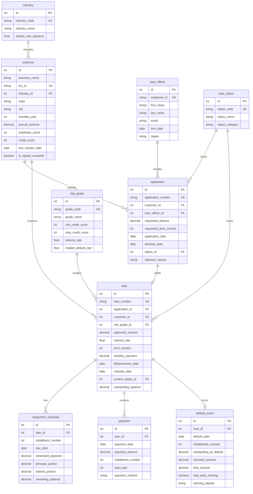

# 金融科技 — 中小企业贷款流水线 实体关系文档

> 业务背景, 行业科普, 术语表请见 `01-fintech_smb_lending_pipeline_medium_business_context-cn.md`. 本文档只描述数据.

## 数据集元数据

- **复杂度等级:** Medium
- **表数量:** 10 张表
- **总记录数:** 约 110,000 行
- **外键关系:** 12 个外键关系(9 个一对多,0 个多对多,另含 3 个枚举/查找表引用)
- **参考日(REFERENCE_DATE):** `2026-06-03` —— 数据集中所有"今天/当前快照"的语义都锚定到该日期,与生成器和 SQL 查询保持一致。生成器使用这个常量(而非系统当前时间)保证多次运行结果一致,且 payment 日期永远不会越过该日;SQL 查询里凡是需要"今天"的地方,都用字面量 `'2026-06-03'` 而非 `DATE('now')`,出于同一原因。

---

## 实体关系图



---

## 表定义

### 1. industry

**描述:** 借款企业的行业分类。每个行业都有一个历史基线违约率,用于组合风险评估和集中度分析。

| 列名 | 类型 | 约束 | 描述 |
|--------|------|-------------|-------------|
| id | INTEGER | PK, AUTO_INCREMENT | 主键 |
| industry_code | VARCHAR(20) | NOT NULL, UNIQUE | 行业代码缩写(如 REST、TECH) |
| industry_name | VARCHAR(100) | NOT NULL | 行业全称 |
| default_rate_baseline | FLOAT | NOT NULL | 行业历史违约率(百分比) |

**外键:** 无(查找表)

**示例数据:**

| id | industry_code | industry_name | default_rate_baseline |
|----|---------------|---------------|----------------------|
| 1 | REST | Restaurant | 9.5 |
| 2 | RETAIL | Retail | 8.2 |
| 3 | TECH | Technology Services | 4.1 |
| 11 | HOSPIT | Hospitality | 12.4 |

---

### 2. risk_grade

**描述:** 风险等级层级表(A 到 E),用于贷款定价和信用评估。每个等级有信用分区间、对应利率、以及定价模型中假设的违约率。这张表是 Q1 风险定价错配分析的核心。

> **简化说明:** 真实中小企业风险评级会综合 DSCR(偿债覆盖率)、经营年限、年收入、行业等多维度,与个人/担保人信用分共同构成。本数据集为教学清晰起见,简化为"每个等级一个信用分区间"。真实定价模型不会这么简化。

| 列名 | 类型 | 约束 | 描述 |
|--------|------|-------------|-------------|
| id | INTEGER | PK, AUTO_INCREMENT | 主键 |
| grade_code | VARCHAR(10) | NOT NULL, UNIQUE | 等级字母(A、B、C、D、E) |
| grade_name | VARCHAR(50) | NOT NULL | 等级名称(Prime、Near Prime 等) |
| min_credit_score | INTEGER | NOT NULL | 该等级最低信用分 |
| max_credit_score | INTEGER | NOT NULL | 该等级最高信用分 |
| interest_rate | FLOAT | NOT NULL | 年化利率(百分比) |
| implied_default_rate | FLOAT | NOT NULL | 定价模型假设的违约率 |

**外键:** 无(查找表)

**示例数据:**

| id | grade_code | grade_name | min_credit_score | max_credit_score | interest_rate | implied_default_rate |
|----|------------|------------|------------------|------------------|---------------|---------------------|
| 1 | A | Prime | 720 | 850 | 5.5 | 3.0 |
| 2 | B | Near Prime | 680 | 719 | 7.5 | 6.0 |
| 3 | C | Standard | 640 | 679 | 9.5 | 6.0 |

**注:** Grade C 被刻意定价错配(implied 默认率 6.0%,实际池级 ~10%),用以支撑 Q1 分析。A 和 B 等级与 implied 偏差约 1pp 以内;D 高于 implied 约 2pp;E 偏差约 1pp 以内。Grade C 是显著的异常 — 在组合中占比最大的层级上存在约 4pp 的定价不足缺口。

---

### 3. loan_status

**描述:** 申请和贷款的生命周期状态码。三大类别:Application(待审、已批、被拒)、Active(已放款、还款中)、Closed(违约、已结清)。

> **作用域约束(DDL 不强制 — 分析师需自行遵守):** `application.status_id` 列只能引用 `status_category='Application'` 的行(代码 1–4);`loan.current_status_id` 列只能引用 `status_category` 为 'Active' 或 'Closed' 的行(代码 5–8)。这张查找表被两个实体共用以保持 schema 紧凑,但代码按业务对象做了"领域分区"。

> **本数据集中实际出现的代码:** 生成器只产出 3 (APPROVED)、4 (REJECTED)、6 (CURRENT)、7 (DEFAULTED)、8 (PAID_OFF)。1 (PENDING)、2 (UNDER_REVIEW)、5 (DISBURSED) 在查找表中存在以保持完整性,但没有事实表行指向它们。

| 列名 | 类型 | 约束 | 描述 |
|--------|------|-------------|-------------|
| id | INTEGER | PK, AUTO_INCREMENT | 主键 |
| status_code | VARCHAR(20) | NOT NULL, UNIQUE | 状态代码标识 |
| status_name | VARCHAR(50) | NOT NULL | 显示名称 |
| status_category | VARCHAR(20) | NOT NULL | 类别:Application、Active 或 Closed |

**外键:** 无(查找表)

**示例数据:**

| id | status_code | status_name | status_category |
|----|-------------|-------------|-----------------|
| 3 | APPROVED | Approved | Application |
| 4 | REJECTED | Rejected | Application |
| 6 | CURRENT | Current | Active |
| 7 | DEFAULTED | Defaulted | Closed |

---

### 4. loan_officer

**描述:** 处理和管理贷款申请的信贷员。每个信贷员分配到一个加州区域,负责处理多笔申请。

| 列名 | 类型 | 约束 | 描述 |
|--------|------|-------------|-------------|
| id | INTEGER | PK, AUTO_INCREMENT | 主键 |
| employee_id | VARCHAR(20) | NOT NULL, UNIQUE | 员工编号(LO####) |
| first_name | VARCHAR(50) | NOT NULL | 信贷员名 |
| last_name | VARCHAR(50) | NOT NULL | 信贷员姓 |
| email | VARCHAR(100) | NOT NULL | 公司邮箱 |
| hire_date | DATE | NOT NULL | 入职日期 |
| region | VARCHAR(50) | NOT NULL | 负责区域(Northern CA、Southern CA 等) |

**外键:** 无

**示例数据:**

| id | employee_id | first_name | last_name | email | hire_date | region |
|----|-------------|------------|-----------|-------|-----------|--------|
| 1 | LO0001 | Sarah | Johnson | lo0001@pacificbridge.com | 2020-03-15 | Bay Area |
| 2 | LO0002 | Michael | Chen | lo0002@pacificbridge.com | 2019-08-22 | Southern CA |

---

### 5. customer

**描述:** 申请贷款的企业借款人。每个客户都是加州的中小企业,记录了年收入、员工数、信用分等财务画像。`is_repeat_customer` 标识"复购客户",是 Q5 全生命周期分析的关键。

| 列名 | 类型 | 约束 | 描述 |
|--------|------|-------------|-------------|
| id | INTEGER | PK, AUTO_INCREMENT | 主键 |
| business_name | VARCHAR(200) | NOT NULL | 企业法定名称 |
| tax_id | VARCHAR(20) | NOT NULL, UNIQUE | 联邦税号(EIN) |
| industry_id | INTEGER | FK → industry.id | 企业所属行业 |
| state | VARCHAR(2) | NOT NULL | 州代码(本数据集恒为 CA) |
| city | VARCHAR(100) | NOT NULL | 所在城市 |
| founded_year | INTEGER | NOT NULL | 企业成立年份 |
| annual_revenue | NUMERIC(12,2) | NOT NULL | 年收入(美元) |
| employee_count | INTEGER | NOT NULL | 员工数 |
| credit_score | INTEGER | NOT NULL | 主要负责人/个人担保人的 FICO 风格信用分(300–850;此规模的 SMB 贷款通常以法人个人信用做承保,而非 Paydex/Intelliscore 等商业信用) |
| first_contact_date | DATE | NOT NULL | 客户首次接触 Pacific Bridge 的日期;始终至少在该客户最早申请日前 ~60 天 |
| is_repeat_customer | BOOLEAN | DEFAULT FALSE | 客户入职时设置的"营销/忠诚度"层级标记(目标 ~15%)。被打上该标记的客户会获得信用分上调、稍多的申请数、以及大约一半的同等级违约率。**注:** 这是一个"层级标识",不是从贷款数派生的统计字段 — 在本数据集体量下大多数客户都有多笔贷款,所以该标记与"多笔贷款"*正相关*但不等同。 |

**外键:**
- `industry_id` → `industry.id` (ON DELETE RESTRICT)

**示例数据:**

| id | business_name | tax_id | industry_id | city | credit_score | is_repeat_customer |
|----|---------------|--------|-------------|------|--------------|-------------------|
| 1 | Golden Dragon Restaurant | 94-1234567 | 1 | San Francisco | 685 | false |
| 2 | TechVentures LLC | 94-7654321 | 3 | San Jose | 742 | true |

---

### 6. application

**描述:** 客户提交的贷款申请。每条记录跟踪申请金额、期限、处理周期、决策结果(批准或拒绝)。`rejection_reason` 字段为 Q3 审批漏失分析提供入口。

| 列名 | 类型 | 约束 | 描述 |
|--------|------|-------------|-------------|
| id | INTEGER | PK, AUTO_INCREMENT | 主键 |
| application_number | VARCHAR(50) | NOT NULL, UNIQUE | 申请编号(APP-######) |
| customer_id | INTEGER | FK → customer.id | 申请企业 |
| loan_officer_id | INTEGER | FK → loan_officer.id | 分配的信贷员 |
| requested_amount | NUMERIC(12,2) | NOT NULL | 申请金额(美元) |
| requested_term_months | INTEGER | NOT NULL | 申请期限(12、24、36、48、60) |
| application_date | DATE | NOT NULL | 申请提交日期 |
| decision_date | DATE | NULL | 审批/拒绝决策日期 |
| status_id | INTEGER | FK → loan_status.id | 当前申请状态 |
| rejection_reason | VARCHAR(200) | NULL | 拒绝原因(如适用) |

**外键:**
- `customer_id` → `customer.id` (ON DELETE RESTRICT)
- `loan_officer_id` → `loan_officer.id` (ON DELETE RESTRICT)
- `status_id` → `loan_status.id` (ON DELETE RESTRICT)

**示例数据:**

| id | application_number | customer_id | requested_amount | application_date | status_id | rejection_reason |
|----|-------------------|-------------|------------------|------------------|-----------|------------------|
| 1 | APP-000001 | 1 | 150000.00 | 2024-01-15 | 3 | NULL |
| 2 | APP-000002 | 45 | 250000.00 | 2024-01-16 | 4 | DTI ratio too high |

---

### 7. loan

**描述:** 已批准并放款的贷款。每笔贷款唯一关联一个 application,记录最终批准条款、风险等级、还款计划要点、当前还款状态。`outstanding_balance` 跟踪剩余本金。

| 列名 | 类型 | 约束 | 描述 |
|--------|------|-------------|-------------|
| id | INTEGER | PK, AUTO_INCREMENT | 主键 |
| loan_number | VARCHAR(50) | NOT NULL, UNIQUE | 贷款编号(LN-######) |
| application_id | INTEGER | FK → application.id, UNIQUE | 来源申请(1:1 关系) |
| customer_id | INTEGER | FK → customer.id | 借款人 |
| risk_grade_id | INTEGER | FK → risk_grade.id | 分配的风险等级 |
| approved_amount | NUMERIC(12,2) | NOT NULL | 放款金额 |
| interest_rate | FLOAT | NOT NULL | 年化利率(百分比) |
| term_months | INTEGER | NOT NULL | 贷款期限(月数) |
| monthly_payment | NUMERIC(10,2) | NOT NULL | 月供金额 |
| disbursement_date | DATE | NOT NULL | 放款日期 |
| maturity_date | DATE | NOT NULL | 预期最后还款日 |
| current_status_id | INTEGER | FK → loan_status.id | 当前贷款状态(本数据集中只会是 CURRENT / DEFAULTED / PAID_OFF) |
| outstanding_balance | NUMERIC(12,2) | NOT NULL | **截至 REFERENCE_DATE (2026-06-03)** 的剩余本金。直接用标准摊销公式计算"截至该快照已付期数"对应的剩余值。PAID_OFF 贷款为零。 |

**外键:**
- `application_id` → `application.id` (ON DELETE RESTRICT)
- `customer_id` → `customer.id` (ON DELETE RESTRICT)
- `risk_grade_id` → `risk_grade.id` (ON DELETE RESTRICT)
- `current_status_id` → `loan_status.id` (ON DELETE RESTRICT)

**示例数据:**

| id | loan_number | application_id | risk_grade_id | approved_amount | interest_rate | term_months | current_status_id |
|----|-------------|----------------|---------------|-----------------|---------------|-------------|------------------|
| 1 | LN-000001 | 1 | 2 | 145000.00 | 7.5 | 36 | 6 |
| 2 | LN-000002 | 5 | 1 | 225000.00 | 5.5 | 48 | 8 |

---

### 8. repayment_schedule

**描述:** 每笔贷款的预期月度还款计划。每行表示一期分摊,记录应付总额(已拆分为本金/利息部分)以及该期付清后的剩余本金。用于与实际还款行为对比。

| 列名 | 类型 | 约束 | 描述 |
|--------|------|-------------|-------------|
| id | INTEGER | PK, AUTO_INCREMENT | 主键 |
| loan_id | INTEGER | FK → loan.id | 所属贷款 |
| installment_number | INTEGER | NOT NULL | 期号(1 到 term_months) |
| due_date | DATE | NOT NULL | 应还日期 |
| scheduled_payment | NUMERIC(10,2) | NOT NULL | 该期应付总额 |
| principal_portion | NUMERIC(10,2) | NOT NULL | 本金部分 |
| interest_portion | NUMERIC(10,2) | NOT NULL | 利息部分 |
| remaining_balance | NUMERIC(12,2) | NOT NULL | 该期付清后的剩余本金 |

**外键:**
- `loan_id` → `loan.id` (ON DELETE CASCADE)

**示例数据:**

| id | loan_id | installment_number | due_date | scheduled_payment | principal_portion | interest_portion | remaining_balance |
|----|---------|-------------------|----------|-------------------|-------------------|------------------|-------------------|
| 1 | 1 | 1 | 2024-02-15 | 4488.20 | 3582.70 | 905.50 | 141417.30 |
| 2 | 1 | 2 | 2024-03-15 | 4488.20 | 3605.08 | 883.12 | 137812.22 |

---

### 9. payment

**描述:** 实际收到的借款人还款。每条记录到账日期、付款金额、对应期号、逾期天数。还款行为(准时/逾期/部分)为 Q4 早期预警分析提供原始信号。

| 列名 | 类型 | 约束 | 描述 |
|--------|------|-------------|-------------|
| id | INTEGER | PK, AUTO_INCREMENT | 主键 |
| loan_id | INTEGER | FK → loan.id | 所属贷款 |
| payment_date | DATE | NOT NULL | 收款日期 |
| payment_amount | NUMERIC(10,2) | NOT NULL | 实付金额 |
| installment_number | INTEGER | NOT NULL | 对应期号 |
| days_late | INTEGER | DEFAULT 0 | 逾期天数(0 = 准时) |
| payment_method | VARCHAR(50) | NOT NULL | ACH、Wire Transfer、Check、Credit Card |

**外键:**
- `loan_id` → `loan.id` (ON DELETE CASCADE)

**示例数据:**

| id | loan_id | payment_date | payment_amount | installment_number | days_late | payment_method |
|----|---------|--------------|----------------|-------------------|-----------|---------------|
| 1 | 1 | 2024-02-15 | 4488.20 | 1 | 0 | ACH |
| 2 | 1 | 2024-03-22 | 4488.20 | 2 | 7 | ACH |
| 3 | 5 | 2024-04-10 | 2800.00 | 3 | 25 | Check |

---

### 10. default_event

**描述:** 违约事件及其回收信息、早期预警判定。每笔违约贷款对应唯一一条违约事件记录。`had_early_warning` 标记与 `warning_signals` 字段记录了违约前最后 3 期的行为恶化(逾期/部分付款),支撑 Q4 的早期预警分析。

| 列名 | 类型 | 约束 | 描述 |
|--------|------|-------------|-------------|
| id | INTEGER | PK, AUTO_INCREMENT | 主键 |
| loan_id | INTEGER | FK → loan.id, UNIQUE | 违约贷款(1:1 关系) |
| default_date | DATE | NOT NULL | 宣告违约日期(首次漏付应还日 + 90 天,上限为 REFERENCE_DATE) |
| installments_missed | INTEGER | NOT NULL | 自借款人最后一次还款之后,已到期但未付的应还期数(上限为剩余贷款期数) |
| outstanding_at_default | NUMERIC(12,2) | NOT NULL | 违约时点的剩余本金 |
| recovery_amount | NUMERIC(12,2) | DEFAULT 0.00 | 通过催收回收的金额 |
| loss_amount | NUMERIC(12,2) | NOT NULL | 扣除回收后的净损失 |
| had_early_warning | BOOLEAN | DEFAULT FALSE | 违约前 3 期是否出现预警信号 |
| warning_signals | VARCHAR(500) | NULL | 观察到的预警信号描述 |

**外键:**
- `loan_id` → `loan.id` (ON DELETE RESTRICT)

**示例数据:**

| id | loan_id | default_date | outstanding_at_default | recovery_amount | had_early_warning | warning_signals |
|----|---------|--------------|------------------------|-----------------|-------------------|-----------------|
| 1 | 87 | 2025-06-15 | 125000.00 | 45000.00 | true | 2 late payments in last 3 months; 1 partial payments |
| 2 | 142 | 2025-08-22 | 88500.00 | 28000.00 | false | NULL |

---

## 数据生成规则

### 业务逻辑约束

1. **时序顺序:**
   - `customer.first_contact_date` < `application.application_date`(首次接触至少早于任何一次申请约 60 天)
   - `application.application_date` < `application.decision_date`
   - `application.decision_date` < `loan.disbursement_date`(对已批准申请)
   - `loan.disbursement_date` < `loan.maturity_date`
   - `repayment_schedule.due_date` 从 `loan.disbursement_date` 起按月度节奏推进
   - `payment.payment_date` >= `repayment_schedule.due_date`(可逾期最多约 30 天),且永远在 `REFERENCE_DATE` 或之前(允许小幅逾期溢出)

2. **引用完整性:**
   - 所有 application 必须引用存在的 customer、loan_officer、loan_status
   - 只有已批准的 application (status_id = 3) 才会派生 loan 记录
   - 每笔 loan 唯一对应一个 application(loan 表中 application_id 唯一)
   - 违约贷款 (current_status_id = 7) 必须对应一条 default_event 记录
   - payment.installment_number 必须匹配有效的 repayment_schedule 期号
   - `loan_status` 查找表按 `status_category` 做了"领域分区":代码 1–4 仅用于 `application.status_id`;代码 5–8 仅用于 `loan.current_status_id`。DDL 不强制此约束 — 它是文档化的分析师侧不变量。

3. **取值范围:**
   - 信用分:300–850(FICO 风格,个人担保人量纲)
   - 申请金额:$50,000 – $500,000(以 $1,000 为单位)
   - 贷款期限:仅 12、24、36、48、60 月
   - 利率:5.5% – 16.0%(每个风险等级一个固定利率 — 简化;真实承保会在等级利率上下浮动 ±50bp)
   - 逾期天数:0–30 天。行业标准的违约宣告口径为 90 DPD(days past due);本数据集在"首次漏付应还日 + 90 天"宣告违约。

4. **计算字段:**
   - `loan.monthly_payment` = 标准摊销公式计算
   - `repayment_schedule.principal_portion` + `interest_portion` = `scheduled_payment`
   - `default_event.loss_amount` = `outstanding_at_default` − `recovery_amount`
   - `loan.outstanding_balance` = 截至 `REFERENCE_DATE` 已付期数对应的摊销剩余本金(闭式公式,非递推)。PAID_OFF 贷款为零。

5. **分布规则(生成数据中实测):**
   - **申请结果:** ~74% 批准,~26% 拒绝(审批以信用分为闸,顶部刻意保留漏失)
   - **贷款生命周期状态:** ~9% 违约,~20% 已结清(到期或提前结清),~70% 还款中
   - **复购客户层级标记:** ~12% 客户(目标 15%,带随机抖动)
   - **违约贷款的早期预警率:** ~70% — 在每笔违约上预先决定(`WARNING_RATE = 0.72`),然后强制注入最后 3 期的还款行为
   - **整体还款时效:** ~70% 准时,~20% 逾期 1–15 天,~10% 逾期 16–30 天
   - **行业分布(申请维度):** Restaurants ~18%,Construction ~12%,Technology ~10%,Hospitality ~9%,其他 3–8%
   - **风险等级分布(loan 维度,审批通过后):** A ~20%,B ~25%,C ~28%,D ~18%,E ~9%
   - **放款时的等级漂移:** ~15% 的贷款被定级到比客户*当前*信用分应得等级更低的层(放款后信用分有改善) — 这些在 Q16 中作为重新定价候选浮现。

6. **业务陷阱嵌入(由生成后 SQL 验证):**
   - **Q1 风险定价:** Grade C 利率 9.5% 配 implied 违约率 6.0%;实际违约 ~10% — 在最大层级上存在约 4pp 的定价不足。A 和 B 在 implied ±1pp 内;D 低于 implied 约 2pp;E 在 ±1pp 内。
   - **Q2 组合集中度:** Restaurant 行业占申请 ~18%、占未偿余额 ~18%;叠加 Hospitality (~9%) 后,周期性"餐饮+酒店"集群占组合 ~27% — 实质集中度风险。
   - **Q3 审批漏失:** ~18-23% 的被拒申请落在已批客户的信用分带内(≥ 已批客户均值 − 30) — 承保漏斗中的"假阴性"。
   - **Q4 早期预警:** ~70% 的违约在最后 3 期表现出可测的还款恶化(平均逾期 ~12.5 天、应付实付比 ~90%,对比非违约群体的 ~4 天 / ~98.5%)。
   - **Q5 全生命周期价值:** 复购层客户违约率 ~5%,新客户 ~11% — 大致 2 倍性能差。
   - **Q10 回收强度:** 违约回收率按风险等级呈清晰梯度 — Grade A ~54%、B ~48%、C ~38%、D ~32%、E ~23% — CFO 的预期损失拨备拥有真实的等级差异化输入。

### Faker 策略

| 字段模式 | Faker 方法 | 说明 |
|---------------|--------------|-------|
| business_name | `fake.company()` | 公司名 |
| tax_id | `fake.bothify(text='##-#######')` | EIN 格式 |
| 人名 | `fake.first_name()`, `fake.last_name()` | 信贷员姓名 |
| email(企业邮箱) | f"lo{id:04d}@pacificbridge.com" | 标准化企业邮箱 |
| city | `random.choice(ca_cities)` | 仅加州城市 |
| phone | `fake.phone_number()` | 美国格式 |
| date(申请) | `fake.date_between(start_date='-2y', end_date='-30d')` | 近 2 年,排除最近 30 天 |
| hire_date | `fake.date_between(start_date='-5y', end_date='-6m')` | 稳定在职员工 |
| amounts | `random.randint(50, 500) * 1000` | 千元整数 |
| credit_score | 按目标 grade 权重抽样 + 区间内均匀 | FICO 风格区间;权重设计使审批后等级分布接近目标 |

---

## 文件清单

| # | 文件名 | 表 | 行数 | 依赖 |
|---|----------|-------|------|--------------|
| 01 | 01_industry.tsv | industry | 15 | 无 |
| 02 | 02_risk_grade.tsv | risk_grade | 5 | 无 |
| 03 | 03_loan_status.tsv | loan_status | 8 | 无 |
| 04 | 04_loan_officer.tsv | loan_officer | 20 | 无 |
| 05 | 05_customer.tsv | customer | 800 | industry |
| 06 | 06_application.tsv | application | 3000 | customer, loan_officer, loan_status |
| 07 | 07_loan.tsv | loan | ~2230 | application, customer, risk_grade, loan_status |
| 08 | 08_repayment_schedule.tsv | repayment_schedule | ~81000 | loan |
| 09 | 09_payment.tsv | payment | ~24000 | loan, repayment_schedule |
| 10 | 10_default_event.tsv | default_event | ~190 | loan |

**估计总行数:** 约 111,000 行

> 行数主要由 schedule 和 payment 主导:每笔贷款在其全期(平均约 36 个月)产生每期一条 schedule 行;截至 REFERENCE_DATE 已付的每期产生一条 payment 行。

---

## 数据库 Schema (SQLite DDL)

```sql
-- Lookup Tables

CREATE TABLE industry (
    id INTEGER PRIMARY KEY AUTOINCREMENT,
    industry_code VARCHAR(20) NOT NULL UNIQUE,
    industry_name VARCHAR(100) NOT NULL,
    default_rate_baseline REAL NOT NULL
);

CREATE TABLE risk_grade (
    id INTEGER PRIMARY KEY AUTOINCREMENT,
    grade_code VARCHAR(10) NOT NULL UNIQUE,
    grade_name VARCHAR(50) NOT NULL,
    min_credit_score INTEGER NOT NULL,
    max_credit_score INTEGER NOT NULL,
    interest_rate REAL NOT NULL,
    implied_default_rate REAL NOT NULL
);

CREATE TABLE loan_status (
    id INTEGER PRIMARY KEY AUTOINCREMENT,
    status_code VARCHAR(20) NOT NULL UNIQUE,
    status_name VARCHAR(50) NOT NULL,
    status_category VARCHAR(20) NOT NULL
);

-- Entities

CREATE TABLE loan_officer (
    id INTEGER PRIMARY KEY AUTOINCREMENT,
    employee_id VARCHAR(20) NOT NULL UNIQUE,
    first_name VARCHAR(50) NOT NULL,
    last_name VARCHAR(50) NOT NULL,
    email VARCHAR(100) NOT NULL,
    hire_date DATE NOT NULL,
    region VARCHAR(50) NOT NULL
);

CREATE TABLE customer (
    id INTEGER PRIMARY KEY AUTOINCREMENT,
    business_name VARCHAR(200) NOT NULL,
    tax_id VARCHAR(20) NOT NULL UNIQUE,
    industry_id INTEGER NOT NULL,
    state VARCHAR(2) NOT NULL,
    city VARCHAR(100) NOT NULL,
    founded_year INTEGER NOT NULL,
    annual_revenue NUMERIC(12,2) NOT NULL,
    employee_count INTEGER NOT NULL,
    credit_score INTEGER NOT NULL,
    first_contact_date DATE NOT NULL,
    is_repeat_customer BOOLEAN DEFAULT 0,
    FOREIGN KEY (industry_id) REFERENCES industry(id)
);

CREATE TABLE application (
    id INTEGER PRIMARY KEY AUTOINCREMENT,
    application_number VARCHAR(50) NOT NULL UNIQUE,
    customer_id INTEGER NOT NULL,
    loan_officer_id INTEGER NOT NULL,
    requested_amount NUMERIC(12,2) NOT NULL,
    requested_term_months INTEGER NOT NULL,
    application_date DATE NOT NULL,
    decision_date DATE,
    status_id INTEGER NOT NULL,
    rejection_reason VARCHAR(200),
    FOREIGN KEY (customer_id) REFERENCES customer(id),
    FOREIGN KEY (loan_officer_id) REFERENCES loan_officer(id),
    FOREIGN KEY (status_id) REFERENCES loan_status(id)
);

CREATE TABLE loan (
    id INTEGER PRIMARY KEY AUTOINCREMENT,
    loan_number VARCHAR(50) NOT NULL UNIQUE,
    application_id INTEGER NOT NULL UNIQUE,
    customer_id INTEGER NOT NULL,
    risk_grade_id INTEGER NOT NULL,
    approved_amount NUMERIC(12,2) NOT NULL,
    interest_rate REAL NOT NULL,
    term_months INTEGER NOT NULL,
    monthly_payment NUMERIC(10,2) NOT NULL,
    disbursement_date DATE NOT NULL,
    maturity_date DATE NOT NULL,
    current_status_id INTEGER NOT NULL,
    outstanding_balance NUMERIC(12,2) NOT NULL,
    FOREIGN KEY (application_id) REFERENCES application(id),
    FOREIGN KEY (customer_id) REFERENCES customer(id),
    FOREIGN KEY (risk_grade_id) REFERENCES risk_grade(id),
    FOREIGN KEY (current_status_id) REFERENCES loan_status(id)
);

CREATE TABLE repayment_schedule (
    id INTEGER PRIMARY KEY AUTOINCREMENT,
    loan_id INTEGER NOT NULL,
    installment_number INTEGER NOT NULL,
    due_date DATE NOT NULL,
    scheduled_payment NUMERIC(10,2) NOT NULL,
    principal_portion NUMERIC(10,2) NOT NULL,
    interest_portion NUMERIC(10,2) NOT NULL,
    remaining_balance NUMERIC(12,2) NOT NULL,
    FOREIGN KEY (loan_id) REFERENCES loan(id) ON DELETE CASCADE,
    UNIQUE (loan_id, installment_number)
);

CREATE TABLE payment (
    id INTEGER PRIMARY KEY AUTOINCREMENT,
    loan_id INTEGER NOT NULL,
    payment_date DATE NOT NULL,
    payment_amount NUMERIC(10,2) NOT NULL,
    installment_number INTEGER NOT NULL,
    days_late INTEGER DEFAULT 0,
    payment_method VARCHAR(50) NOT NULL,
    FOREIGN KEY (loan_id) REFERENCES loan(id) ON DELETE CASCADE
);

CREATE TABLE default_event (
    id INTEGER PRIMARY KEY AUTOINCREMENT,
    loan_id INTEGER NOT NULL UNIQUE,
    default_date DATE NOT NULL,
    installments_missed INTEGER NOT NULL,
    outstanding_at_default NUMERIC(12,2) NOT NULL,
    recovery_amount NUMERIC(12,2) DEFAULT 0.00,
    loss_amount NUMERIC(12,2) NOT NULL,
    had_early_warning BOOLEAN DEFAULT 0,
    warning_signals VARCHAR(500),
    FOREIGN KEY (loan_id) REFERENCES loan(id)
);

-- 推荐索引(查询性能优化)

CREATE INDEX idx_customer_industry ON customer(industry_id);
CREATE INDEX idx_customer_credit_score ON customer(credit_score);
CREATE INDEX idx_customer_repeat ON customer(is_repeat_customer);
CREATE INDEX idx_application_customer ON application(customer_id);
CREATE INDEX idx_application_status ON application(status_id);
CREATE INDEX idx_application_date ON application(application_date);
CREATE INDEX idx_loan_customer ON loan(customer_id);
CREATE INDEX idx_loan_risk_grade ON loan(risk_grade_id);
CREATE INDEX idx_loan_status ON loan(current_status_id);
CREATE INDEX idx_loan_disbursement_date ON loan(disbursement_date);
CREATE INDEX idx_repayment_schedule_loan ON repayment_schedule(loan_id);
CREATE INDEX idx_payment_loan ON payment(loan_id);
CREATE INDEX idx_payment_date ON payment(payment_date);
CREATE INDEX idx_default_loan ON default_event(loan_id);
```

---

## 配套文档

- 业务背景, 五大核心业务问题, 行业科普, 术语表, 指标公式: `01-fintech_smb_lending_pipeline_medium_business_context-cn.md`
- 面向业务的 SQL 查询(每个查询对应一个业务问题): `03-fintech_smb_lending_pipeline_medium_sql_queries-cn.md`
- 数据生成器(各分布与业务陷阱的实现): `04-fintech_smb_lending_pipeline_medium_data_generator-cn.py`

所有外键约束在 SQLite 数据库中强制执行,保证引用完整性;数据集可直接用于 SQL 分析、可视化与机器学习建模。
