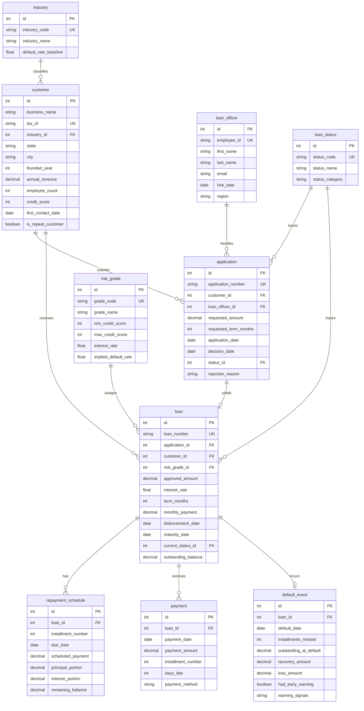

# Fintech — SMB Lending Pipeline Entity Relationship Document

> For business background, industry primer, and glossary, see `01-fintech_smb_lending_pipeline_medium_business_context.md`. This document describes the data only.

## Dataset Metadata

- **Complexity level:** Medium
- **Number of tables:** 10
- **Total records:** ~110,000 rows
- **Foreign key relationships:** 12 FK relationships (9 one-to-many, 0 many-to-many, plus 3 enum/lookup references)
- **Reference date (REFERENCE_DATE):** `2026-06-03` — every "today / current snapshot" notion in the dataset is anchored to this date, consistent with the generator and the SQL queries. The generator uses this constant (instead of the system clock) to guarantee that multiple runs produce identical results, and payment dates never exceed it. Wherever a SQL query needs "today," it uses the literal `'2026-06-03'` instead of `DATE('now')` for the same reason.

---

## Entity Relationship Diagram



---

## Table Definitions

### 1. industry

**Description:** Industry classification for borrowing businesses. Each industry carries a historical baseline default rate, used for portfolio risk assessment and concentration analysis.

| Column | Type | Constraints | Description |
|--------|------|-------------|-------------|
| id | INTEGER | PK, AUTO_INCREMENT | Primary key |
| industry_code | VARCHAR(20) | NOT NULL, UNIQUE | Industry code abbreviation (e.g., REST, TECH) |
| industry_name | VARCHAR(100) | NOT NULL | Full industry name |
| default_rate_baseline | FLOAT | NOT NULL | Historical industry default rate (percent) |

**Foreign keys:** none (lookup table)

**Sample data:**

| id | industry_code | industry_name | default_rate_baseline |
|----|---------------|---------------|----------------------|
| 1 | REST | Restaurant | 9.5 |
| 2 | RETAIL | Retail | 8.2 |
| 3 | TECH | Technology Services | 4.1 |
| 11 | HOSPIT | Hospitality | 12.4 |

---

### 2. risk_grade

**Description:** Risk grade tier table (A through E), used for loan pricing and credit assessment. Each grade has a credit-score range, an associated interest rate, and the implied default rate assumed by the pricing model. This table is central to the Q1 risk-pricing mismatch analysis.

> **Simplification note:** Real-world SMB risk grading typically combines DSCR (debt service coverage ratio), years in business, annual revenue, industry, and the personal/guarantor credit score across multiple dimensions. For teaching clarity, this dataset simplifies to "one credit-score band per grade." Real pricing models are not that simple.

| Column | Type | Constraints | Description |
|--------|------|-------------|-------------|
| id | INTEGER | PK, AUTO_INCREMENT | Primary key |
| grade_code | VARCHAR(10) | NOT NULL, UNIQUE | Grade letter (A, B, C, D, E) |
| grade_name | VARCHAR(50) | NOT NULL | Grade name (Prime, Near Prime, etc.) |
| min_credit_score | INTEGER | NOT NULL | Lowest credit score for this grade |
| max_credit_score | INTEGER | NOT NULL | Highest credit score for this grade |
| interest_rate | FLOAT | NOT NULL | Annualized interest rate (percent) |
| implied_default_rate | FLOAT | NOT NULL | Default rate assumed by the pricing model |

**Foreign keys:** none (lookup table)

**Sample data:**

| id | grade_code | grade_name | min_credit_score | max_credit_score | interest_rate | implied_default_rate |
|----|------------|------------|------------------|------------------|---------------|---------------------|
| 1 | A | Prime | 720 | 850 | 5.5 | 3.0 |
| 2 | B | Near Prime | 680 | 719 | 7.5 | 6.0 |
| 3 | C | Standard | 640 | 679 | 9.5 | 6.0 |

**Note:** Grade C is deliberately mispriced (implied default rate 6.0%, pool-level actual ~10%) to support the Q1 analysis. Grades A and B deviate from implied by within ~1pp; D is about 2pp above implied; E is within ~1pp. Grade C is the obvious outlier — a roughly 4pp underpricing gap on the largest tier in the portfolio.

---

### 3. loan_status

**Description:** Lifecycle status codes shared by applications and loans. Three categories: Application (pending, approved, rejected), Active (disbursed, repaying), and Closed (defaulted, paid off).

> **Scope constraint (not enforced by DDL — analyst must respect this):** the `application.status_id` column should only reference rows where `status_category='Application'` (codes 1–4). The `loan.current_status_id` column should only reference rows whose `status_category` is 'Active' or 'Closed' (codes 5–8). The lookup table is shared by two entities to keep the schema compact, but the codes are "domain-partitioned" by business object.

> **Codes actually appearing in this dataset:** the generator only emits 3 (APPROVED), 4 (REJECTED), 6 (CURRENT), 7 (DEFAULTED), and 8 (PAID_OFF). Codes 1 (PENDING), 2 (UNDER_REVIEW), and 5 (DISBURSED) exist in the lookup table for completeness but no fact-table row points to them.

| Column | Type | Constraints | Description |
|--------|------|-------------|-------------|
| id | INTEGER | PK, AUTO_INCREMENT | Primary key |
| status_code | VARCHAR(20) | NOT NULL, UNIQUE | Status code identifier |
| status_name | VARCHAR(50) | NOT NULL | Display name |
| status_category | VARCHAR(20) | NOT NULL | Category: Application, Active, or Closed |

**Foreign keys:** none (lookup table)

**Sample data:**

| id | status_code | status_name | status_category |
|----|-------------|-------------|-----------------|
| 3 | APPROVED | Approved | Application |
| 4 | REJECTED | Rejected | Application |
| 6 | CURRENT | Current | Active |
| 7 | DEFAULTED | Defaulted | Closed |

---

### 4. loan_officer

**Description:** Loan officers who handle and manage loan applications. Each officer is assigned to one California region and processes many applications.

| Column | Type | Constraints | Description |
|--------|------|-------------|-------------|
| id | INTEGER | PK, AUTO_INCREMENT | Primary key |
| employee_id | VARCHAR(20) | NOT NULL, UNIQUE | Employee ID (LO####) |
| first_name | VARCHAR(50) | NOT NULL | Officer's first name |
| last_name | VARCHAR(50) | NOT NULL | Officer's last name |
| email | VARCHAR(100) | NOT NULL | Corporate email |
| hire_date | DATE | NOT NULL | Hire date |
| region | VARCHAR(50) | NOT NULL | Assigned region (Northern CA, Southern CA, etc.) |

**Foreign keys:** none

**Sample data:**

| id | employee_id | first_name | last_name | email | hire_date | region |
|----|-------------|------------|-----------|-------|-----------|--------|
| 1 | LO0001 | Sarah | Johnson | lo0001@pacificbridge.com | 2020-03-15 | Bay Area |
| 2 | LO0002 | Michael | Chen | lo0002@pacificbridge.com | 2019-08-22 | Southern CA |

---

### 5. customer

**Description:** Business borrowers who apply for loans. Each customer is a California SMB, with financial profile recorded: annual revenue, employee count, credit score, etc. `is_repeat_customer` marks a "repeat customer" and is central to the Q5 lifecycle analysis.

| Column | Type | Constraints | Description |
|--------|------|-------------|-------------|
| id | INTEGER | PK, AUTO_INCREMENT | Primary key |
| business_name | VARCHAR(200) | NOT NULL | Legal business name |
| tax_id | VARCHAR(20) | NOT NULL, UNIQUE | Federal tax ID (EIN) |
| industry_id | INTEGER | FK → industry.id | Industry the business belongs to |
| state | VARCHAR(2) | NOT NULL | State code (always CA in this dataset) |
| city | VARCHAR(100) | NOT NULL | City |
| founded_year | INTEGER | NOT NULL | Year the business was founded |
| annual_revenue | NUMERIC(12,2) | NOT NULL | Annual revenue (USD) |
| employee_count | INTEGER | NOT NULL | Number of employees |
| credit_score | INTEGER | NOT NULL | FICO-style credit score of the principal / personal guarantor (300–850; SMB lending at this scale typically underwrites on the legal entity's personal credit rather than commercial credit such as Paydex/Intelliscore) |
| first_contact_date | DATE | NOT NULL | Date the customer first contacted Pacific Bridge; always at least ~60 days before this customer's earliest application |
| is_repeat_customer | BOOLEAN | DEFAULT FALSE | A "marketing / loyalty" tier flag set at onboarding (target ~15%). Customers carrying this flag get a credit-score uplift, slightly more applications, and roughly half the same-grade default rate. **Note:** this is a tier label, not a statistic derived from loan count — at this dataset size most customers have multiple loans, so the flag is *correlated with* having multiple loans but is not equivalent. |

**Foreign keys:**
- `industry_id` → `industry.id` (ON DELETE RESTRICT)

**Sample data:**

| id | business_name | tax_id | industry_id | city | credit_score | is_repeat_customer |
|----|---------------|--------|-------------|------|--------------|-------------------|
| 1 | Golden Dragon Restaurant | 94-1234567 | 1 | San Francisco | 685 | false |
| 2 | TechVentures LLC | 94-7654321 | 3 | San Jose | 742 | true |

---

### 6. application

**Description:** Loan applications submitted by customers. Each row tracks requested amount, term, processing cycle, and decision outcome (approved or rejected). The `rejection_reason` field is the entry point for Q3's approval-leakage analysis.

| Column | Type | Constraints | Description |
|--------|------|-------------|-------------|
| id | INTEGER | PK, AUTO_INCREMENT | Primary key |
| application_number | VARCHAR(50) | NOT NULL, UNIQUE | Application number (APP-######) |
| customer_id | INTEGER | FK → customer.id | Applying business |
| loan_officer_id | INTEGER | FK → loan_officer.id | Assigned loan officer |
| requested_amount | NUMERIC(12,2) | NOT NULL | Requested amount (USD) |
| requested_term_months | INTEGER | NOT NULL | Requested term (12, 24, 36, 48, 60) |
| application_date | DATE | NOT NULL | Date the application was submitted |
| decision_date | DATE | NULL | Date of approve/reject decision |
| status_id | INTEGER | FK → loan_status.id | Current application status |
| rejection_reason | VARCHAR(200) | NULL | Reason for rejection (if applicable) |

**Foreign keys:**
- `customer_id` → `customer.id` (ON DELETE RESTRICT)
- `loan_officer_id` → `loan_officer.id` (ON DELETE RESTRICT)
- `status_id` → `loan_status.id` (ON DELETE RESTRICT)

**Sample data:**

| id | application_number | customer_id | requested_amount | application_date | status_id | rejection_reason |
|----|-------------------|-------------|------------------|------------------|-----------|------------------|
| 1 | APP-000001 | 1 | 150000.00 | 2024-01-15 | 3 | NULL |
| 2 | APP-000002 | 45 | 250000.00 | 2024-01-16 | 4 | DTI ratio too high |

---

### 7. loan

**Description:** Approved and disbursed loans. Each loan is uniquely tied to one application, with the final approved terms, risk grade, key repayment schedule attributes, and current repayment status. `outstanding_balance` tracks remaining principal.

| Column | Type | Constraints | Description |
|--------|------|-------------|-------------|
| id | INTEGER | PK, AUTO_INCREMENT | Primary key |
| loan_number | VARCHAR(50) | NOT NULL, UNIQUE | Loan number (LN-######) |
| application_id | INTEGER | FK → application.id, UNIQUE | Source application (1:1 relationship) |
| customer_id | INTEGER | FK → customer.id | Borrower |
| risk_grade_id | INTEGER | FK → risk_grade.id | Assigned risk grade |
| approved_amount | NUMERIC(12,2) | NOT NULL | Funded amount |
| interest_rate | FLOAT | NOT NULL | Annualized interest rate (percent) |
| term_months | INTEGER | NOT NULL | Loan term in months |
| monthly_payment | NUMERIC(10,2) | NOT NULL | Monthly payment amount |
| disbursement_date | DATE | NOT NULL | Disbursement date |
| maturity_date | DATE | NOT NULL | Expected final payment date |
| current_status_id | INTEGER | FK → loan_status.id | Current loan status (in this dataset, only CURRENT / DEFAULTED / PAID_OFF) |
| outstanding_balance | NUMERIC(12,2) | NOT NULL | Remaining principal **as of REFERENCE_DATE (2026-06-03)**. Computed directly with the standard amortization formula at "number of installments paid as of this snapshot." Zero for PAID_OFF loans. |

**Foreign keys:**
- `application_id` → `application.id` (ON DELETE RESTRICT)
- `customer_id` → `customer.id` (ON DELETE RESTRICT)
- `risk_grade_id` → `risk_grade.id` (ON DELETE RESTRICT)
- `current_status_id` → `loan_status.id` (ON DELETE RESTRICT)

**Sample data:**

| id | loan_number | application_id | risk_grade_id | approved_amount | interest_rate | term_months | current_status_id |
|----|-------------|----------------|---------------|-----------------|---------------|-------------|------------------|
| 1 | LN-000001 | 1 | 2 | 145000.00 | 7.5 | 36 | 6 |
| 2 | LN-000002 | 5 | 1 | 225000.00 | 5.5 | 48 | 8 |

---

### 8. repayment_schedule

**Description:** The expected monthly repayment schedule for each loan. Each row represents one installment, recording the total amount due (split into principal/interest portions) and the remaining principal after that installment is paid. Used to compare against actual payment behavior.

| Column | Type | Constraints | Description |
|--------|------|-------------|-------------|
| id | INTEGER | PK, AUTO_INCREMENT | Primary key |
| loan_id | INTEGER | FK → loan.id | Owning loan |
| installment_number | INTEGER | NOT NULL | Installment number (1 to term_months) |
| due_date | DATE | NOT NULL | Due date |
| scheduled_payment | NUMERIC(10,2) | NOT NULL | Total amount due for this installment |
| principal_portion | NUMERIC(10,2) | NOT NULL | Principal portion |
| interest_portion | NUMERIC(10,2) | NOT NULL | Interest portion |
| remaining_balance | NUMERIC(12,2) | NOT NULL | Remaining principal after this installment is paid |

**Foreign keys:**
- `loan_id` → `loan.id` (ON DELETE CASCADE)

**Sample data:**

| id | loan_id | installment_number | due_date | scheduled_payment | principal_portion | interest_portion | remaining_balance |
|----|---------|-------------------|----------|-------------------|-------------------|------------------|-------------------|
| 1 | 1 | 1 | 2024-02-15 | 4488.20 | 3582.70 | 905.50 | 141417.30 |
| 2 | 1 | 2 | 2024-03-15 | 4488.20 | 3605.08 | 883.12 | 137812.22 |

---

### 9. payment

**Description:** Payments actually received from borrowers. Each row records the receipt date, payment amount, the installment it covers, and days late. Payment behavior (on-time / late / partial) provides raw signals for the Q4 early-warning analysis.

| Column | Type | Constraints | Description |
|--------|------|-------------|-------------|
| id | INTEGER | PK, AUTO_INCREMENT | Primary key |
| loan_id | INTEGER | FK → loan.id | Owning loan |
| payment_date | DATE | NOT NULL | Date the payment was received |
| payment_amount | NUMERIC(10,2) | NOT NULL | Amount paid |
| installment_number | INTEGER | NOT NULL | Installment this payment covers |
| days_late | INTEGER | DEFAULT 0 | Days late (0 = on time) |
| payment_method | VARCHAR(50) | NOT NULL | ACH, Wire Transfer, Check, Credit Card |

**Foreign keys:**
- `loan_id` → `loan.id` (ON DELETE CASCADE)

**Sample data:**

| id | loan_id | payment_date | payment_amount | installment_number | days_late | payment_method |
|----|---------|--------------|----------------|-------------------|-----------|---------------|
| 1 | 1 | 2024-02-15 | 4488.20 | 1 | 0 | ACH |
| 2 | 1 | 2024-03-22 | 4488.20 | 2 | 7 | ACH |
| 3 | 5 | 2024-04-10 | 2800.00 | 3 | 25 | Check |

---

### 10. default_event

**Description:** Default events along with recovery information and the early-warning verdict. Each defaulted loan has exactly one default-event row. The `had_early_warning` flag and `warning_signals` field capture behavioral deterioration (lateness, partial payment) over the last 3 installments prior to default — these support the Q4 early-warning analysis.

| Column | Type | Constraints | Description |
|--------|------|-------------|-------------|
| id | INTEGER | PK, AUTO_INCREMENT | Primary key |
| loan_id | INTEGER | FK → loan.id, UNIQUE | Defaulted loan (1:1 relationship) |
| default_date | DATE | NOT NULL | Date default was declared (first missed due date + 90 days, capped at REFERENCE_DATE) |
| installments_missed | INTEGER | NOT NULL | Number of installments due but unpaid since the borrower's last payment (capped at remaining loan term) |
| outstanding_at_default | NUMERIC(12,2) | NOT NULL | Remaining principal at the time of default |
| recovery_amount | NUMERIC(12,2) | DEFAULT 0.00 | Amount recovered via collections |
| loss_amount | NUMERIC(12,2) | NOT NULL | Net loss after recovery |
| had_early_warning | BOOLEAN | DEFAULT FALSE | Whether warning signals appeared in the 3 installments before default |
| warning_signals | VARCHAR(500) | NULL | Description of observed warning signals |

**Foreign keys:**
- `loan_id` → `loan.id` (ON DELETE RESTRICT)

**Sample data:**

| id | loan_id | default_date | outstanding_at_default | recovery_amount | had_early_warning | warning_signals |
|----|---------|--------------|------------------------|-----------------|-------------------|-----------------|
| 1 | 87 | 2025-06-15 | 125000.00 | 45000.00 | true | 2 late payments in last 3 months; 1 partial payments |
| 2 | 142 | 2025-08-22 | 88500.00 | 28000.00 | false | NULL |

---

## Data Generation Rules

### Business Logic Constraints

1. **Temporal ordering:**
   - `customer.first_contact_date` < `application.application_date` (first contact at least ~60 days before any application)
   - `application.application_date` < `application.decision_date`
   - `application.decision_date` < `loan.disbursement_date` (for approved applications)
   - `loan.disbursement_date` < `loan.maturity_date`
   - `repayment_schedule.due_date` runs forward in monthly cadence starting from `loan.disbursement_date`
   - `payment.payment_date` >= `repayment_schedule.due_date` (can be late by up to ~30 days), and is always on or before `REFERENCE_DATE` (with allowance for small lateness overflow)

2. **Referential integrity:**
   - Every application must reference an existing customer, loan_officer, and loan_status
   - Only approved applications (status_id = 3) produce loan records
   - Each loan corresponds to exactly one application (application_id is UNIQUE in the loan table)
   - Defaulted loans (current_status_id = 7) must have a default_event row
   - payment.installment_number must match a valid repayment_schedule installment
   - The `loan_status` lookup table is "domain-partitioned" by `status_category`: codes 1–4 are only used by `application.status_id`; codes 5–8 are only used by `loan.current_status_id`. The DDL does not enforce this — it is a documented analyst-side invariant.

3. **Value ranges:**
   - Credit score: 300–850 (FICO style, personal-guarantor scale)
   - Application amount: $50,000 – $500,000 (in $1,000 increments)
   - Loan term: only 12, 24, 36, 48, 60 months
   - Interest rate: 5.5% – 16.0% (one fixed rate per risk grade — simplified; real underwriting would float ±50bp around the grade rate)
   - Days late: 0–30 days. Industry-standard default declaration threshold is 90 DPD (days past due); this dataset declares default at "first missed due date + 90 days."

4. **Computed fields:**
   - `loan.monthly_payment` = standard amortization formula
   - `repayment_schedule.principal_portion` + `interest_portion` = `scheduled_payment`
   - `default_event.loss_amount` = `outstanding_at_default` − `recovery_amount`
   - `loan.outstanding_balance` = amortized remaining principal corresponding to the number of installments paid as of `REFERENCE_DATE` (closed-form formula, not recursive). Zero for PAID_OFF loans.

5. **Distribution rules (observed in the generated data):**
   - **Application outcomes:** ~74% approved, ~26% rejected (underwriting gates on credit score, with deliberate top-of-funnel leakage retained)
   - **Loan lifecycle status:** ~9% defaulted, ~20% paid off (matured or early payoff), ~70% currently repaying
   - **Repeat-customer tier flag:** ~12% of customers (target 15%, with random jitter)
   - **Early-warning rate on defaulted loans:** ~70% — pre-decided per default (`WARNING_RATE = 0.72`), then injected by forcing the behavior of the last 3 installments
   - **Overall payment timeliness:** ~70% on time, ~20% 1–15 days late, ~10% 16–30 days late
   - **Industry distribution (application side):** Restaurants ~18%, Construction ~12%, Technology ~10%, Hospitality ~9%, others 3–8%
   - **Risk grade distribution (loan side, post-approval):** A ~20%, B ~25%, C ~28%, D ~18%, E ~9%
   - **Grade drift at funding:** ~15% of loans are graded into a lower tier than the customer's *current* credit score would imply (credit score improved after funding) — these surface in Q16 as repricing candidates.

6. **Embedded business traps (verified via post-generation SQL):**
   - **Q1 Risk pricing:** Grade C is rate 9.5% with implied default rate 6.0%; actual default is ~10% — roughly 4pp underpricing on the largest tier. A and B are within ±1pp of implied; D is about 2pp below implied; E is within ±1pp.
   - **Q2 Portfolio concentration:** Restaurant industry is ~18% of applications and ~18% of outstanding balance; stacked with Hospitality (~9%), the cyclical "restaurants + hotels" cluster makes up ~27% of the portfolio — material concentration risk.
   - **Q3 Approval leakage:** ~18-23% of rejected applications fall inside the credit-score band of approved customers (≥ approved-customer mean − 30) — false negatives in the underwriting funnel.
   - **Q4 Early warning:** ~70% of defaults show measurable repayment deterioration over the final 3 installments (average lateness ~12.5 days, scheduled-vs-paid ratio ~90%, versus ~4 days / ~98.5% for non-defaults).
   - **Q5 Lifetime value:** repeat-tier customers default at ~5%, new customers at ~11% — roughly a 2x performance gap.
   - **Q10 Recovery strength:** post-default recovery rates form a clean gradient by risk grade — Grade A ~54%, B ~48%, C ~38%, D ~32%, E ~23% — giving the CFO's expected-loss provision a meaningful grade-differentiated input.

### Faker Strategy

| Field pattern | Faker method | Notes |
|---------------|--------------|-------|
| business_name | `fake.company()` | Company name |
| tax_id | `fake.bothify(text='##-#######')` | EIN format |
| Person names | `fake.first_name()`, `fake.last_name()` | Loan officer names |
| email (corporate) | f"lo{id:04d}@pacificbridge.com" | Standardized corporate email |
| city | `random.choice(ca_cities)` | California cities only |
| phone | `fake.phone_number()` | U.S. format |
| date (application) | `fake.date_between(start_date='-2y', end_date='-30d')` | Last 2 years, excluding the most recent 30 days |
| hire_date | `fake.date_between(start_date='-5y', end_date='-6m')` | Stable, tenured staff |
| amounts | `random.randint(50, 500) * 1000` | Thousand-dollar rounded |
| credit_score | Weighted draw by target grade + uniform within the band | FICO-style ranges; weights tuned so post-approval grade mix hits target |

---

## File Listing

| # | File name | Table | Rows | Dependencies |
|---|----------|-------|------|--------------|
| 01 | 01_industry.tsv | industry | 15 | none |
| 02 | 02_risk_grade.tsv | risk_grade | 5 | none |
| 03 | 03_loan_status.tsv | loan_status | 8 | none |
| 04 | 04_loan_officer.tsv | loan_officer | 20 | none |
| 05 | 05_customer.tsv | customer | 800 | industry |
| 06 | 06_application.tsv | application | 3000 | customer, loan_officer, loan_status |
| 07 | 07_loan.tsv | loan | ~2230 | application, customer, risk_grade, loan_status |
| 08 | 08_repayment_schedule.tsv | repayment_schedule | ~81000 | loan |
| 09 | 09_payment.tsv | payment | ~24000 | loan, repayment_schedule |
| 10 | 10_default_event.tsv | default_event | ~190 | loan |

**Estimated total row count:** ~111,000 rows

> Row counts are dominated by the schedule and payment tables: each loan emits one schedule row per installment across its full term (~36 months on average), and each installment paid as of REFERENCE_DATE emits one payment row.

---

## Database Schema (SQLite DDL)

```sql
-- Lookup Tables

CREATE TABLE industry (
    id INTEGER PRIMARY KEY AUTOINCREMENT,
    industry_code VARCHAR(20) NOT NULL UNIQUE,
    industry_name VARCHAR(100) NOT NULL,
    default_rate_baseline REAL NOT NULL
);

CREATE TABLE risk_grade (
    id INTEGER PRIMARY KEY AUTOINCREMENT,
    grade_code VARCHAR(10) NOT NULL UNIQUE,
    grade_name VARCHAR(50) NOT NULL,
    min_credit_score INTEGER NOT NULL,
    max_credit_score INTEGER NOT NULL,
    interest_rate REAL NOT NULL,
    implied_default_rate REAL NOT NULL
);

CREATE TABLE loan_status (
    id INTEGER PRIMARY KEY AUTOINCREMENT,
    status_code VARCHAR(20) NOT NULL UNIQUE,
    status_name VARCHAR(50) NOT NULL,
    status_category VARCHAR(20) NOT NULL
);

-- Entities

CREATE TABLE loan_officer (
    id INTEGER PRIMARY KEY AUTOINCREMENT,
    employee_id VARCHAR(20) NOT NULL UNIQUE,
    first_name VARCHAR(50) NOT NULL,
    last_name VARCHAR(50) NOT NULL,
    email VARCHAR(100) NOT NULL,
    hire_date DATE NOT NULL,
    region VARCHAR(50) NOT NULL
);

CREATE TABLE customer (
    id INTEGER PRIMARY KEY AUTOINCREMENT,
    business_name VARCHAR(200) NOT NULL,
    tax_id VARCHAR(20) NOT NULL UNIQUE,
    industry_id INTEGER NOT NULL,
    state VARCHAR(2) NOT NULL,
    city VARCHAR(100) NOT NULL,
    founded_year INTEGER NOT NULL,
    annual_revenue NUMERIC(12,2) NOT NULL,
    employee_count INTEGER NOT NULL,
    credit_score INTEGER NOT NULL,
    first_contact_date DATE NOT NULL,
    is_repeat_customer BOOLEAN DEFAULT 0,
    FOREIGN KEY (industry_id) REFERENCES industry(id)
);

CREATE TABLE application (
    id INTEGER PRIMARY KEY AUTOINCREMENT,
    application_number VARCHAR(50) NOT NULL UNIQUE,
    customer_id INTEGER NOT NULL,
    loan_officer_id INTEGER NOT NULL,
    requested_amount NUMERIC(12,2) NOT NULL,
    requested_term_months INTEGER NOT NULL,
    application_date DATE NOT NULL,
    decision_date DATE,
    status_id INTEGER NOT NULL,
    rejection_reason VARCHAR(200),
    FOREIGN KEY (customer_id) REFERENCES customer(id),
    FOREIGN KEY (loan_officer_id) REFERENCES loan_officer(id),
    FOREIGN KEY (status_id) REFERENCES loan_status(id)
);

CREATE TABLE loan (
    id INTEGER PRIMARY KEY AUTOINCREMENT,
    loan_number VARCHAR(50) NOT NULL UNIQUE,
    application_id INTEGER NOT NULL UNIQUE,
    customer_id INTEGER NOT NULL,
    risk_grade_id INTEGER NOT NULL,
    approved_amount NUMERIC(12,2) NOT NULL,
    interest_rate REAL NOT NULL,
    term_months INTEGER NOT NULL,
    monthly_payment NUMERIC(10,2) NOT NULL,
    disbursement_date DATE NOT NULL,
    maturity_date DATE NOT NULL,
    current_status_id INTEGER NOT NULL,
    outstanding_balance NUMERIC(12,2) NOT NULL,
    FOREIGN KEY (application_id) REFERENCES application(id),
    FOREIGN KEY (customer_id) REFERENCES customer(id),
    FOREIGN KEY (risk_grade_id) REFERENCES risk_grade(id),
    FOREIGN KEY (current_status_id) REFERENCES loan_status(id)
);

CREATE TABLE repayment_schedule (
    id INTEGER PRIMARY KEY AUTOINCREMENT,
    loan_id INTEGER NOT NULL,
    installment_number INTEGER NOT NULL,
    due_date DATE NOT NULL,
    scheduled_payment NUMERIC(10,2) NOT NULL,
    principal_portion NUMERIC(10,2) NOT NULL,
    interest_portion NUMERIC(10,2) NOT NULL,
    remaining_balance NUMERIC(12,2) NOT NULL,
    FOREIGN KEY (loan_id) REFERENCES loan(id) ON DELETE CASCADE,
    UNIQUE (loan_id, installment_number)
);

CREATE TABLE payment (
    id INTEGER PRIMARY KEY AUTOINCREMENT,
    loan_id INTEGER NOT NULL,
    payment_date DATE NOT NULL,
    payment_amount NUMERIC(10,2) NOT NULL,
    installment_number INTEGER NOT NULL,
    days_late INTEGER DEFAULT 0,
    payment_method VARCHAR(50) NOT NULL,
    FOREIGN KEY (loan_id) REFERENCES loan(id) ON DELETE CASCADE
);

CREATE TABLE default_event (
    id INTEGER PRIMARY KEY AUTOINCREMENT,
    loan_id INTEGER NOT NULL UNIQUE,
    default_date DATE NOT NULL,
    installments_missed INTEGER NOT NULL,
    outstanding_at_default NUMERIC(12,2) NOT NULL,
    recovery_amount NUMERIC(12,2) DEFAULT 0.00,
    loss_amount NUMERIC(12,2) NOT NULL,
    had_early_warning BOOLEAN DEFAULT 0,
    warning_signals VARCHAR(500),
    FOREIGN KEY (loan_id) REFERENCES loan(id)
);

-- Recommended indexes (query performance optimization)

CREATE INDEX idx_customer_industry ON customer(industry_id);
CREATE INDEX idx_customer_credit_score ON customer(credit_score);
CREATE INDEX idx_customer_repeat ON customer(is_repeat_customer);
CREATE INDEX idx_application_customer ON application(customer_id);
CREATE INDEX idx_application_status ON application(status_id);
CREATE INDEX idx_application_date ON application(application_date);
CREATE INDEX idx_loan_customer ON loan(customer_id);
CREATE INDEX idx_loan_risk_grade ON loan(risk_grade_id);
CREATE INDEX idx_loan_status ON loan(current_status_id);
CREATE INDEX idx_loan_disbursement_date ON loan(disbursement_date);
CREATE INDEX idx_repayment_schedule_loan ON repayment_schedule(loan_id);
CREATE INDEX idx_payment_loan ON payment(loan_id);
CREATE INDEX idx_payment_date ON payment(payment_date);
CREATE INDEX idx_default_loan ON default_event(loan_id);
```

---

## Companion Documents

- Business background, five core business questions, industry primer, glossary, metric formulas: `01-fintech_smb_lending_pipeline_medium_business_context.md`
- Business-facing SQL queries (one query per business question): `03-fintech_smb_lending_pipeline_medium_sql_queries.md`
- Data generator (implementation of distributions and embedded business traps): `04-fintech_smb_lending_pipeline_medium_data_generator.py`

All foreign key constraints are enforced in the SQLite database to guarantee referential integrity. The dataset is directly usable for SQL analysis, visualization, and machine learning modeling.
