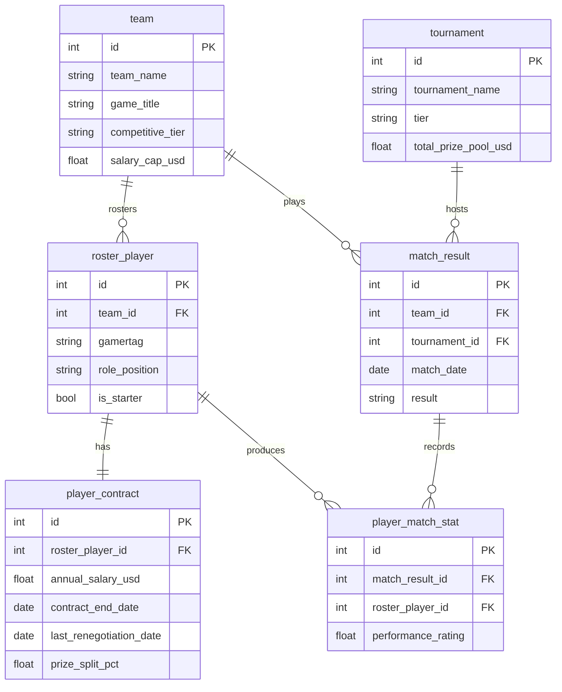
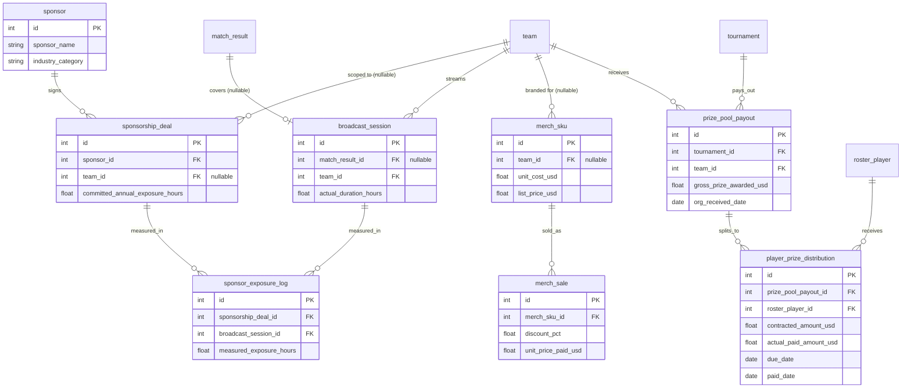

> 业务背景, 行业科普, 术语表请见 `01-gaming_esports_org_commercial_operations_medium_business_context-cn.md`. 本文档只描述数据.

# Vanguard Esports 商业运营健康度复盘: ER 文档

## 1. 数据集元信息

- **复杂度**: Medium
- **表数量**: 14 张
- **约总行数**: 约 15,000 行
- **外键关系数**: 18 条 FK, 另有 2 条 DDL 无法强制的跨表范围约束(见下方"参照完整性"一节)
- **REFERENCE_DATE**: `2026-06-30`(与 Python 生成器和 SQL 查询文档一致)

## 2. Mermaid ER 图

数据集按业务域拆成两张子图: "战队, 选手与赛事战绩" 和 "赞助/直播曝光, 周边与
奖金分成"。`team` 在两张图里都出现, 作为两个域之间的锚点。

### 2.1 战队, 选手与赛事战绩



### 2.2 赞助/直播曝光, 周边与奖金分成



## 3. 各表详情

### 1. sponsor

**业务含义**: 每一行是一家向 Vanguard Esports 支付赞助费的品牌方, 是赞助合同
(`sponsorship_deal`)的签约主体。Head of Partnerships 用这张表管理品牌关系。

| 列名 | 类型 | 约束 | 说明 |
|------|------|------|------|
| id | INTEGER | PK | 赞助商 ID |
| sponsor_name | VARCHAR(100) | NOT NULL, UNIQUE | 品牌方名称(虚构品牌) |
| industry_category | VARCHAR(50) | NOT NULL | 品牌所属行业, 如 energy_drink(能量饮料), pc_hardware(电脑硬件), fintech, apparel, telecom, mobility |
| relationship_start_date | DATE | NOT NULL | 与该品牌建立赞助关系的起始日期 |

**外键**: 无。

**示例数据**:

| id | sponsor_name | industry_category | relationship_start_date |
|----|--------------|--------------------|--------------------------|
| 1 | TitanEnergy Drink | energy_drink | 2023-03-01 |
| 4 | GridForge PC Hardware | pc_hardware | 2022-11-15 |
| 7 | NorthPeak Gaming Chairs | furniture | 2024-01-10 |

---

### 2. team

**业务含义**: 每一行是俱乐部旗下的一支分部战队。`competitive_tier` 区分一线队
(main_roster)和发展联赛/次级战队(academy_roster), `salary_cap_usd` 是该战队
所在联赛设定的年度选手薪资总支出上限, 是判断薪资合理性的参照系之一。

| 列名 | 类型 | 约束 | 说明 |
|------|------|------|------|
| id | INTEGER | PK | 战队 ID |
| team_name | VARCHAR(80) | NOT NULL, UNIQUE | 战队名称 |
| game_title | VARCHAR(30) | NOT NULL | 参赛游戏项目: Fracture Protocol / Aetherlane |
| competitive_tier | VARCHAR(20) | NOT NULL | main_roster(一线队) / academy_roster(发展联赛战队) |
| home_city | VARCHAR(60) | NOT NULL | 战队常驻训练基地城市 |
| founded_date | DATE | NOT NULL | 该分部战队成立日期 |
| salary_cap_usd | NUMERIC(10,2) | NOT NULL | 联赛规定的该战队年度选手薪资总支出上限 |

**外键**: 无。

> 数据集只有 3 支战队: Vanguard Fracture(Fracture Protocol 一线队), Vanguard Aetherlane
> (Aetherlane 一线队), Vanguard Academy(Fracture Protocol 发展联赛战队)。

**示例数据**:

| id | team_name | game_title | competitive_tier | salary_cap_usd |
|----|-----------|------------|-------------------|----------------|
| 1 | Vanguard Fracture | Fracture Protocol | main_roster | 3,200,000.00 |
| 2 | Vanguard Aetherlane | Aetherlane | main_roster | 3,600,000.00 |
| 3 | Vanguard Academy | Fracture Protocol | academy_roster | 600,000.00 |

---

### 3. roster_player

**业务含义**: 每一行是一位在册选手, 归属某支分部战队。`role_position` 是
项目内的场上角色(Fracture Protocol 的 Duelist/Controller/Initiator/Sentinel/IGL,
Aetherlane 的 Top/Jungle/Mid/ADC/Support), `is_starter` 区分主力
与替补。

| 列名 | 类型 | 约束 | 说明 |
|------|------|------|------|
| id | INTEGER | PK | 选手 ID |
| team_id | INTEGER | FK -> team.id, NOT NULL | 所属战队 |
| gamertag | VARCHAR(40) | NOT NULL, UNIQUE | 选手 ID/艺名(比赛记录和直播里使用的名字) |
| real_name | VARCHAR(80) | NOT NULL | 选手真实姓名 |
| nationality | VARCHAR(56) | NOT NULL | 国籍 |
| role_position | VARCHAR(30) | NOT NULL | 场上角色, 按 game_title 区分取值集合 |
| join_date | DATE | NOT NULL | 加入该战队日期 |
| is_starter | BOOLEAN | NOT NULL | 是否为主力(先发)选手 |
| is_active | BOOLEAN | NOT NULL | 是否仍在役(本数据集全部为 true, 预留字段供未来扩展转会/退役场景) |

**外键**: `team_id` -> `team.id`, 1:N, ON DELETE CASCADE。

> `role_position` 的取值范围按 `team.game_title` 限定: Fracture Protocol 战队只能取
> {Duelist, Controller, Initiator, Sentinel, IGL}; Aetherlane 战队只能
> 取 {Top, Jungle, Mid, ADC, Support}。DDL 不做强制, 分析师需自行留意。

**示例数据**:

| id | team_id | gamertag | role_position | is_starter |
|----|---------|----------|----------------|------------|
| 1 | 1 | Zenithrax | Duelist | true |
| 2 | 1 | Wraithcall | IGL | true |
| 8 | 3 | Novaspark | Sentinel | true |

---

### 4. player_contract

**业务含义**: 每一行是某位选手当前生效的合同, 记录年薪、合同起止日期、上一次
续约/重新定价日期, 以及该选手在战队赛事奖金中的分成比例。这是 Q2(薪资与战绩
脱节)分析的核心表。

| 列名 | 类型 | 约束 | 说明 |
|------|------|------|------|
| id | INTEGER | PK | 合同 ID |
| roster_player_id | INTEGER | FK -> roster_player.id, NOT NULL, UNIQUE | 对应选手(每位选手同一时间只有一份生效合同) |
| annual_salary_usd | NUMERIC(10,2) | NOT NULL | 年薪(不含签约奖金) |
| signing_bonus_usd | NUMERIC(10,2) | NULL | 一次性签约奖金, 部分合同没有 |
| contract_start_date | DATE | NOT NULL | 本份合同生效日期 |
| contract_end_date | DATE | NOT NULL | 本份合同到期日期 |
| last_renegotiation_date | DATE | NOT NULL | 上一次续约/重新定价的日期(等于 contract_start_date, 除非本表就是最初签约) |
| prize_split_pct | NUMERIC(5,2) | NOT NULL | 该选手可分得的战队赛事奖金比例(百分比), 直接作用于 `prize_pool_payout.gross_prize_awarded_usd`(每支战队全体选手比例之和 <= 85%, 剩余归俱乐部) |

**外键**: `roster_player_id` -> `roster_player.id`, 1:1, ON DELETE CASCADE。

**示例数据**:

| id | roster_player_id | annual_salary_usd | contract_end_date | last_renegotiation_date | prize_split_pct |
|----|-------------------|---------------------|---------------------|----------------------------|-------------------|
| 1 | 1 | 420,000.00 | 2028-06-30 | 2025-12-15 | 12.00 |
| 8 | 8 | 85,000.00 | 2027-03-01 | 2025-08-01 | 8.00 |

> 选手 1(Zenithrax)是 Q2 分析里的"高薪低产"典型: 2025-12-15 刚续约到 2028 年
> (剩余约 24 个月), 但近 6 个月表现评分显著低于续约前的历史高点(见"数据生成
> 规则"一节的具体数值)。

---

### 5. sponsorship_deal

**业务含义**: 每一行是一份赞助合同, 记录品牌方、赞助范围(整个俱乐部还是
特定战队)、年度赞助费和合同承诺的年度曝光小时数。这是 Q1(赞助曝光计费缺口)
分析的核心表。

| 列名 | 类型 | 约束 | 说明 |
|------|------|------|------|
| id | INTEGER | PK | 赞助合同 ID |
| sponsor_id | INTEGER | FK -> sponsor.id, NOT NULL | 签约品牌方 |
| team_id | INTEGER | FK -> team.id, NULL | 赞助范围限定的战队; NULL 代表俱乐部整体赞助(所有战队都会带该品牌曝光) |
| deal_name | VARCHAR(100) | NOT NULL | 合同名称 |
| annual_value_usd | NUMERIC(10,2) | NOT NULL | 年度赞助费 |
| contract_start_date | DATE | NOT NULL | 合同生效日期 |
| contract_end_date | DATE | NOT NULL | 合同到期日期 |
| committed_annual_exposure_hours | NUMERIC(8,2) | NOT NULL | 合同承诺的年度曝光小时数 |
| exposure_measurement_method | VARCHAR(40) | NOT NULL | 曝光核算方式, 如 stream_logo_overlay(直播画面 Logo 叠加), jersey_patch_estimate(球衣广告位估算) |

**外键**: `sponsor_id` -> `sponsor.id`, 1:N, ON DELETE CASCADE; `team_id` -> `team.id`, 1:N, ON DELETE CASCADE, 可为 NULL。

**示例数据**:

| id | sponsor_id | team_id | deal_name | annual_value_usd | committed_annual_exposure_hours |
|----|------------|---------|-----------|---------------------|-----------------------------------|
| 1 | 1 | NULL | TitanEnergy Global Partnership | 900,000.00 | 203.00 |
| 5 | 7 | 1 | NorthPeak Fracture Protocol Seating Partner | 180,000.00 | 47.00 |

---

### 6. tournament

**业务含义**: 每一行是一场赛事(联赛赛段、季后赛或第三方邀请赛), 记录级别、
所属项目和总奖金池。是 `match_result` 和 `prize_pool_payout` 的锚点。

| 列名 | 类型 | 约束 | 说明 |
|------|------|------|------|
| id | INTEGER | PK | 赛事 ID |
| tournament_name | VARCHAR(120) | NOT NULL, UNIQUE | 赛事名称 |
| game_title | VARCHAR(30) | NOT NULL | 所属游戏项目 |
| tier | VARCHAR(10) | NOT NULL | 赛事级别: S(联赛官方顶级赛事) / A(次级联赛或大型邀请赛) / B(小型公开赛) |
| region | VARCHAR(40) | NOT NULL | 赛区/举办地区 |
| start_date | DATE | NOT NULL | 赛事开始日期 |
| end_date | DATE | NOT NULL | 赛事结束日期 |
| total_prize_pool_usd | NUMERIC(12,2) | NOT NULL | 赛事总奖金池 |

**外键**: 无。

**示例数据**:

| id | tournament_name | game_title | tier | total_prize_pool_usd |
|----|-------------------|------------|------|-----------------------|
| 3 | FPCT Americas 2025 Split 2 Playoffs | Fracture Protocol | S | 1,000,000.00 |
| 14 | Fracture Protocol Ascendant Circuit NA 2025 Split 2 | Fracture Protocol | B | 50,000.00 |

---

### 7. match_result

**业务含义**: 每一行是 Vanguard 某支战队在某场赛事里的一场对局结果, 是选手
个人表现(`player_match_stat`)和直播场次(`broadcast_session`)的锚点。

| 列名 | 类型 | 约束 | 说明 |
|------|------|------|------|
| id | INTEGER | PK | 比赛 ID |
| team_id | INTEGER | FK -> team.id, NOT NULL | 参赛战队 |
| tournament_id | INTEGER | FK -> tournament.id, NOT NULL | 所属赛事 |
| match_date | DATE | NOT NULL | 比赛日期 |
| opponent_name | VARCHAR(80) | NOT NULL | 对手战队名称(虚构) |
| format | VARCHAR(10) | NOT NULL | 赛制: Bo1 / Bo3 / Bo5 |
| stage | VARCHAR(20) | NOT NULL | 赛事阶段: group_stage(小组赛) / playoffs(季后赛) / grand_final(总决赛) |
| result | VARCHAR(10) | NOT NULL | win / loss |
| team_score | INTEGER | NOT NULL | Vanguard 战队本场局分 |
| opponent_score | INTEGER | NOT NULL | 对手局分 |

**外键**: `team_id` -> `team.id`, 1:N; `tournament_id` -> `tournament.id`, 1:N, 均 ON DELETE CASCADE。

**示例数据**:

| id | team_id | tournament_id | match_date | opponent_name | result | team_score | opponent_score |
|----|---------|-----------------|-------------|-----------------|--------|------------|------------------|
| 101 | 1 | 3 | 2025-08-14 | Ironclad Syndicate | win | 2 | 0 |
| 102 | 1 | 3 | 2025-08-16 | Obsidian Vanguard Rivals | loss | 1 | 2 |

---

### 8. player_match_stat

**业务含义**: 每一行是某位选手在某场比赛里的个人数据, `performance_rating`
是融合击杀/死亡/助攻等信息的综合表现评分, 是 Q2 判断"战绩下滑"的核心依据。

| 列名 | 类型 | 约束 | 说明 |
|------|------|------|------|
| id | INTEGER | PK | 记录 ID |
| match_result_id | INTEGER | FK -> match_result.id, NOT NULL | 所属比赛 |
| roster_player_id | INTEGER | FK -> roster_player.id, NOT NULL | 选手 |
| kills | INTEGER | NOT NULL | 击杀数 |
| deaths | INTEGER | NOT NULL | 死亡数 |
| assists | INTEGER | NOT NULL | 助攻数 |
| performance_rating | NUMERIC(4,2) | NOT NULL | 综合表现评分, 围绕 1.00 浮动 |
| was_mvp | BOOLEAN | NOT NULL | 本场是否为 MVP |

**外键**: `match_result_id` -> `match_result.id`, 1:N; `roster_player_id` -> `roster_player.id`, 1:N, 均 ON DELETE CASCADE。

> 只有出场选手(通常是该战队 5 名先发, 偶尔替补顶替)才会有记录; 未出场的
> 替补选手在对应比赛里没有行。

**示例数据**:

| id | match_result_id | roster_player_id | kills | deaths | assists | performance_rating | was_mvp |
|----|-------------------|--------------------|-------|--------|---------|-----------------------|---------|
| 501 | 101 | 1 | 24 | 12 | 5 | 1.32 | true |
| 502 | 101 | 2 | 14 | 13 | 9 | 0.95 | false |

---

### 9. broadcast_session

**业务含义**: 每一行是一场直播场次, 既包括比赛直播, 也包括非比赛类内容直播
(如幕后花絮、选手互动直播)。是 `sponsor_exposure_log` 计算实际曝光小时数的
基础, 也是周边和赞助价值评估里"观赛热度"的来源。

| 列名 | 类型 | 约束 | 说明 |
|------|------|------|------|
| id | INTEGER | PK | 直播场次 ID |
| match_result_id | INTEGER | FK -> match_result.id, NULL | 关联的比赛; NULL 代表非比赛类内容直播 |
| team_id | INTEGER | FK -> team.id, NOT NULL | 该场直播所属战队频道 |
| platform | VARCHAR(20) | NOT NULL | 直播平台: Twitch / YouTube |
| broadcast_date | DATE | NOT NULL | 直播日期 |
| actual_duration_hours | NUMERIC(5,2) | NOT NULL | 实际直播时长(小时) |
| average_viewers | INTEGER | NOT NULL | 平均同时在线观众数 |
| peak_viewers | INTEGER | NOT NULL | 峰值同时在线观众数 |

**外键**: `match_result_id` -> `match_result.id`, 1:1(每场比赛至多一场直播), 可为 NULL, ON DELETE SET NULL; `team_id` -> `team.id`, 1:N, ON DELETE CASCADE。

**示例数据**:

| id | match_result_id | team_id | platform | actual_duration_hours | average_viewers |
|----|-------------------|---------|----------|--------------------------|--------------------|
| 201 | 101 | 1 | Twitch | 2.30 | 42,000 |
| 250 | NULL | 1 | Twitch | 1.10 | 8,500 |

---

### 10. sponsor_exposure_log

**业务含义**: 每一行是某场直播里, 某份赞助合同的品牌 Logo 被实测出现的时长。
把这张表按 `sponsorship_deal_id` 汇总并对比 `committed_annual_exposure_hours`,
就是 Q1 分析的核心计算。

| 列名 | 类型 | 约束 | 说明 |
|------|------|------|------|
| id | INTEGER | PK | 记录 ID |
| sponsorship_deal_id | INTEGER | FK -> sponsorship_deal.id, NOT NULL | 对应赞助合同 |
| broadcast_session_id | INTEGER | FK -> broadcast_session.id, NOT NULL | 对应直播场次 |
| measured_exposure_hours | NUMERIC(5,3) | NOT NULL | 本场直播里实测的该品牌曝光小时数 |
| log_date | DATE | NOT NULL | 测量记录日期(等于该直播的 broadcast_date) |

**外键**: `sponsorship_deal_id` -> `sponsorship_deal.id`, 1:N; `broadcast_session_id` -> `broadcast_session.id`, 1:N, 均 ON DELETE CASCADE。

> 范围规则(DDL 不强制): 一条 `sponsor_exposure_log` 只会关联"该赞助合同生效期内"
> 且"team_id 范围匹配"(全俱乐部赞助匹配任意战队直播; 战队限定赞助只匹配该
> 战队直播)的 `broadcast_session`。
>
> 数值不变式(DDL 不强制, 生成器负责兑现): 单条记录的 `measured_exposure_hours`
> **必然小于**其所属 `broadcast_session.actual_duration_hours` —— 品牌 Logo 的
> 曝光只是整场直播画面的一部分, 物理上不可能超过该场直播的总时长。生成器把单场
> 实测曝光建模为 `直播时长 × 该计费方式的可见占比(<= 0.60) × 噪声`, 从构造上
> 保证这条不变式恒成立。

**示例数据**:

| id | sponsorship_deal_id | broadcast_session_id | measured_exposure_hours |
|----|------------------------|--------------------------|------------------------------|
| 1001 | 1 | 201 | 1.380 |
| 1002 | 5 | 201 | 1.240 |

---

### 11. merch_sku

**业务含义**: 每一行是一款可购买的周边商品(球衣, 连帽衫, 配件等)。
`team_id` 为 NULL 代表俱乐部整体品牌周边, 非 NULL 代表某支战队专属周边
(如战队定制球衣)。

| 列名 | 类型 | 约束 | 说明 |
|------|------|------|------|
| id | INTEGER | PK | 商品 ID |
| team_id | INTEGER | FK -> team.id, NULL | 战队专属商品对应战队; NULL 为俱乐部整体品牌商品 |
| product_name | VARCHAR(100) | NOT NULL | 商品名称 |
| category | VARCHAR(30) | NOT NULL | 商品品类: jersey(球衣) / hoodie(连帽衫) / accessory(配件) / headwear(帽类) |
| unit_cost_usd | NUMERIC(8,2) | NOT NULL | 单件成本 |
| list_price_usd | NUMERIC(8,2) | NOT NULL | 官方标价 |

**外键**: `team_id` -> `team.id`, 1:N, 可为 NULL, ON DELETE CASCADE。

**示例数据**:

| id | team_id | product_name | category | unit_cost_usd | list_price_usd |
|----|---------|----------------|----------|------------------|--------------------|
| 1 | 1 | Vanguard Fracture 2026 Home Jersey | jersey | 22.50 | 79.99 |
| 20 | NULL | Vanguard Esports Logo Hoodie | hoodie | 18.00 | 59.99 |

---

### 12. merch_sale

**业务含义**: 每一行是一笔周边商品销售交易, 记录数量、折扣力度和实付单价。
是 Q3(周边毛利与战绩/观赛热度关系)分析的核心表。

| 列名 | 类型 | 约束 | 说明 |
|------|------|------|------|
| id | INTEGER | PK | 交易 ID |
| merch_sku_id | INTEGER | FK -> merch_sku.id, NOT NULL | 售出商品 |
| sale_date | DATE | NOT NULL | 销售日期 |
| quantity | INTEGER | NOT NULL | 售出件数 |
| discount_pct | NUMERIC(5,2) | NOT NULL | 折扣力度(百分比) |
| unit_price_paid_usd | NUMERIC(8,2) | NOT NULL | 实付单价(已扣除折扣) |
| channel | VARCHAR(20) | NOT NULL | 销售渠道: online_store(线上商店) / event_pop_up(线下赛事快闪摊位) |

**外键**: `merch_sku_id` -> `merch_sku.id`, 1:N, ON DELETE CASCADE。

**示例数据**:

| id | merch_sku_id | sale_date | quantity | discount_pct | unit_price_paid_usd |
|----|----------------|-------------|----------|------------------|---------------------------|
| 5001 | 1 | 2025-08-15 | 3 | 8.00 | 73.59 |
| 5002 | 1 | 2026-02-20 | 5 | 32.00 | 54.39 |

---

### 13. prize_pool_payout

**业务含义**: 每一行是 Vanguard 某支战队在某场赛事取得名次后, 赛事主办方向
俱乐部支付的奖金到账记录。`organizer_payout_date` 到 `org_received_date` 之间
的间隔反映赛事方打款速度; `org_received_date` 是奖金分成链条对选手计时的起点。

| 列名 | 类型 | 约束 | 说明 |
|------|------|------|------|
| id | INTEGER | PK | 记录 ID |
| tournament_id | INTEGER | FK -> tournament.id, NOT NULL | 对应赛事 |
| team_id | INTEGER | FK -> team.id, NOT NULL | 获得奖金的战队 |
| placement | INTEGER | NOT NULL | 该战队在赛事中的最终名次 |
| gross_prize_awarded_usd | NUMERIC(10,2) | NOT NULL | 赛事方判定的该战队奖金总额 |
| organizer_payout_date | DATE | NOT NULL | 赛事方发起打款日期 |
| org_received_date | DATE | NOT NULL | 俱乐部实际收到奖金日期 |

**外键**: `tournament_id` -> `tournament.id`, 1:N; `team_id` -> `team.id`, 1:N, 均 ON DELETE CASCADE。

**示例数据**:

| id | tournament_id | team_id | placement | gross_prize_awarded_usd | org_received_date |
|----|-----------------|---------|-----------|------------------------------|-------------------------|
| 1 | 3 | 1 | 2 | 200,000.00 | 2025-09-05 |

---

### 14. player_prize_distribution

**业务含义**: 每一行是某位选手从某笔奖金到账里应得和实得的分成明细。是
Q4(奖金分成支付合规性)分析的核心表, 把合同约定的比例/金额和实际支付的
金额/日期并排放在一起。

| 列名 | 类型 | 约束 | 说明 |
|------|------|------|------|
| id | INTEGER | PK | 记录 ID |
| prize_pool_payout_id | INTEGER | FK -> prize_pool_payout.id, NOT NULL | 对应奖金到账记录 |
| roster_player_id | INTEGER | FK -> roster_player.id, NOT NULL | 选手 |
| contracted_pct | NUMERIC(5,2) | NOT NULL | 该选手合同约定的分成比例(拷贝自 `player_contract.prize_split_pct`) |
| contracted_amount_usd | NUMERIC(10,2) | NOT NULL | 按合同比例计算的应得金额 |
| actual_paid_amount_usd | NUMERIC(10,2) | NOT NULL | 实际支付给选手的金额 |
| due_date | DATE | NOT NULL | 合同约定的付款截止日(= `org_received_date` + 30 天) |
| paid_date | DATE | NOT NULL | 实际付款日期 |
| payment_status | VARCHAR(20) | NOT NULL | on_time(按时足额) / late(逾期但足额) / underpaid(未逾期但短付) / late_and_underpaid(逾期且短付) |

**外键**: `prize_pool_payout_id` -> `prize_pool_payout.id`, 1:N; `roster_player_id` -> `roster_player.id`, 1:N, 均 ON DELETE CASCADE。

**示例数据**:

| id | prize_pool_payout_id | roster_player_id | contracted_amount_usd | actual_paid_amount_usd | due_date | paid_date | payment_status |
|----|--------------------------|--------------------|-----------------------------|------------------------------|-----------|-----------|-------------------|
| 1 | 1 | 1 | 24,000.00 | 24,000.00 | 2025-10-05 | 2025-09-28 | on_time |
| 12 | 3 | 15 | 6,400.00 | 5,760.00 | 2025-11-02 | 2025-12-20 | late_and_underpaid |

## 4. 数据生成规则

### 时间顺序

- `team.founded_date` 早于该战队任何 `roster_player.join_date`。
- `roster_player.join_date` 早于该选手 `player_contract.contract_start_date`。
- `player_contract.last_renegotiation_date` 等于或晚于 `contract_start_date`,
  且不晚于 `REFERENCE_DATE`。
- `sponsorship_deal.contract_start_date` 早于 `contract_end_date`; 所有
  `sponsor_exposure_log.log_date` 落在对应 `sponsorship_deal` 的合同有效期内。
- `tournament.start_date` 早于 `end_date`; `match_result.match_date` 落在
  对应赛事的 `[start_date, end_date]` 区间内。
- `broadcast_session.broadcast_date` 等于其关联 `match_result.match_date`
  (比赛类直播), 或独立分布在数据集时间窗口内(内容类直播)。
- `prize_pool_payout.organizer_payout_date` 早于或等于 `org_received_date`,
  间隔 3 到 21 天不等。`player_prize_distribution.due_date` = `org_received_date`
  + 30 天(合同标准约定期限)。

### 参照完整性

- 所有 FK 关系见各表"外键"小节。DDL 无法强制的范围规则:
  1. `sponsor_exposure_log` 只能关联"赞助合同范围内"的直播: 战队限定的赞助
     合同(`sponsorship_deal.team_id` 非空)只能匹配该战队的 `broadcast_session`;
     俱乐部整体赞助(`team_id` 为 NULL)可以匹配任意战队的直播。
  2. `player_match_stat.roster_player_id` 只能是该场 `match_result.team_id`
     名下的选手, 不能跨战队记录数据。

### 数值范围

- `performance_rating`: 围绕 1.00 浮动, 实测落在约 [0.41, 1.64]; 生成器把最终
  取值 clamp 在 [0.40, 1.90] 硬边界内(下滑期的 legacy star 触及低端, carry 全场
  的高光表现触及高端)。
- `annual_salary_usd`: 一线队主力 $220,000-$650,000, 一线队替补 $75,000-
  $150,000, Academy 战队 $45,000-$110,000。
- `prize_split_pct`: 主力选手 8%-14%, 替补选手 3%-6%(每支战队全体选手分成
  比例之和 <= 85%, 剩余部分归俱乐部运营/教练组, 未在本数据集建模)。
- `discount_pct`: [0, 45] 之间, 具体分布见下方"分布规律"。
- `committed_annual_exposure_hours`: 不硬编码, 而是由该合同"可触及直播样本的
  实测曝光总量"年化后除以目标交付率反算得到(见"内嵌业务陷阱"陷阱1), 因此数值
  取决于该合同覆盖的直播范围: 俱乐部整体合同(可触及全部战队直播)约 75-205 小时,
  战队专属合同(只覆盖单支战队直播)约 30-80 小时。

### 计算字段

- `player_prize_distribution.contracted_amount_usd` = `prize_pool_payout.
  gross_prize_awarded_usd` * `player_contract.prize_split_pct` / 100, 在生成时
  按当时生效合同的比例算好, 落地存储, 不需要重新聚合。
- `merch_sale.unit_price_paid_usd` = `merch_sku.list_price_usd` * (1 -
  `discount_pct` / 100), 四舍五入到分。
- `sponsor_exposure_log` 按 `sponsorship_deal_id` 汇总
  `measured_exposure_hours`, 除以该合同的有效年数(= `(MIN(contract_end_date,
  REFERENCE_DATE) - contract_start_date) / 365.25`), 即为"实际年化曝光
  小时数", 用来对比 `committed_annual_exposure_hours`; 与 Query 1/3 及业务
  背景文档的年化口径完全一致。

### 分布规律(观测到的实际生成结果)

- 全数据集选手表现评分总体均值约 1.00-1.05, 标准差约 0.18。
- 12 份赞助合同里, 3 份的年化实测曝光小时数相对承诺值缺口约 25%-35%
  (交付率约 65%-75%), 其余 9 份交付率约 93%-108%。
- 战队 60 天滚动胜率 >= 55% 的时间窗口里, 周边商品平均折扣力度约 8%-14%,
  毛利率约 48%-53%; 胜率 < 35% 的低谷窗口里, 平均折扣力度约 26%-34%, 毛利率
  约 32%-38%, 但销量因促销反而略有上升, 使总营收降幅远小于毛利率降幅。
- 24 场赛事里, 个别小组赛出局且胜率过低(< 25%)的参赛颗粒无收(未生成
  `prize_pool_payout` 行), 因此奖金到账记录数会比赛事总数略少几笔(在固定随机
  种子下约为 1 笔, 属数据依赖而非结构性保证); 其余赛事各产出一条奖金到账记录。
  全部约 115 条奖金分成记录里, 约 15% 为 late / underpaid / late_and_underpaid,
  其中约 80% 集中在 Vanguard Academy 战队的分成记录里。

### 内嵌业务陷阱

- **陷阱1(Q1 赞助曝光计费缺口)**: 12 份赞助合同中, `TitanEnergy Global
  Partnership`、`GridForge Fracture Protocol Hardware Deal`、`StreakBet Gaming
  Partnership` 三份合同的年化实测曝光相对承诺值存在系统性缺口, 交付率约
  68%-70%; 其余 9 份合同交付率均在 93% 以上, 形成明显断层。生成器的实现方式
  是: 单场实测曝光按"直播时长 × 可见占比 × 噪声"生成(恒 < 直播时长), 再把
  合同的 `committed_annual_exposure_hours`(承诺值)反算成"年化实测曝光 / 目标
  交付率", 从而让这三份合同的承诺值相对其真实交付被系统性抬高, 精确落在设计的
  缺口幅度上。SQL 查询 Q1 相关题目应逐份合同对比"承诺 vs 年化实测", 而不是只看
  整体均值(整体均值会被 9 份健康合同稀释)。
- **陷阱2(Q2 薪资与战绩脱节)**: 4 名选手(Vanguard Fracture 2 名, Vanguard
  Aetherlane 1 名, Vanguard Academy 1 名)近 6 个月表现评分均值相比其 12-18 个月前
  的历史高点下降约 30%-35%, 但均在下滑开始前后完成了续约(`last_renegotiation_
  date` 落在下滑期附近), 合同剩余 18 个月以上, 薪资未做任何下调。其余选手的
  薪资与近期表现评分基本保持正相关(相关系数约 0.55-0.65)。
- **陷阱3(Q3 周边毛利与战绩挂钩)**: 见上方"分布规律", 战队近 60 天胜率与
  同期周边毛利率呈明显正相关, 低谷期靠加大折扣维持销量, 总营收波动幅度远小于
  毛利率波动幅度, 财务报表若只看总营收趋势会完全错过这个信号。
- **陷阱4(Q4 奖金分成支付合规性)**: 约 15% 的奖金分成记录逾期(超过
  `org_received_date` + 30 天才付款)或短付(`actual_paid_amount_usd` 低于
  `contracted_amount_usd` 的 88%-95%), 其中约八成集中在 Vanguard Academy
  战队相关的分成记录里(Academy 战队自身的问题记录占比高达四成, 远高于两支
  一线队各自不到一成的水平), 指向该战队的奖金分成财务流程存在系统性问题,
  而不是随机个案。

## 5. Faker 策略

| 字段模式 | Faker 方法 | 说明 |
|----------|------------|------|
| real_name | `fake.name()` | 选手真实姓名 |
| gamertag | 自定义词根拼接 + 数字后缀 | 电竞选手 ID 风格的艺名, 保证唯一 |
| nationality | `random.choice(北美/欧洲/亚洲常见电竞选手国籍列表)` | 反映北美电竞选手的常见国籍分布 |
| sponsor_name | 自定义品牌词库拼接(行业词根 + 品牌后缀) | 避免使用真实品牌名称 |
| opponent_name | 自定义电竞战队名词库(形容词 + 名词组合) | 制造真实感的虚构对手战队名 |
| product_name | 战队名 + 品类词库拼接 | 周边商品命名贴合战队品牌 |

## 6. 文件清单(拓扑顺序)

| # | 文件名 | 表 | 行数 | 依赖 |
|---|--------|-----|------|------|
| 01 | 01_sponsor.tsv | sponsor | 10 | 无 |
| 02 | 02_team.tsv | team | 3 | 无 |
| 03 | 03_roster_player.tsv | roster_player | 21 | team |
| 04 | 04_player_contract.tsv | player_contract | 21 | roster_player |
| 05 | 05_sponsorship_deal.tsv | sponsorship_deal | 12 | sponsor, team |
| 06 | 06_tournament.tsv | tournament | 24 | 无 |
| 07 | 07_match_result.tsv | match_result | 约 475 | team, tournament |
| 08 | 08_player_match_stat.tsv | player_match_stat | 约 2,375 | match_result, roster_player |
| 09 | 09_broadcast_session.tsv | broadcast_session | 约 575 | match_result, team |
| 10 | 10_sponsor_exposure_log.tsv | sponsor_exposure_log | 约 2,525 | sponsorship_deal, broadcast_session |
| 11 | 11_merch_sku.tsv | merch_sku | 25 | team |
| 12 | 12_merch_sale.tsv | merch_sale | 约 9,000 | merch_sku |
| 13 | 13_prize_pool_payout.tsv | prize_pool_payout | 约 23 | tournament, team |
| 14 | 14_player_prize_distribution.tsv | player_prize_distribution | 约 115 | prize_pool_payout, roster_player |

## 7. SQLite DDL

```sql
CREATE TABLE sponsor (
    id INTEGER PRIMARY KEY AUTOINCREMENT,
    sponsor_name VARCHAR(100) NOT NULL UNIQUE,
    industry_category VARCHAR(50) NOT NULL,
    relationship_start_date DATE NOT NULL
);

CREATE TABLE team (
    id INTEGER PRIMARY KEY AUTOINCREMENT,
    team_name VARCHAR(80) NOT NULL UNIQUE,
    game_title VARCHAR(30) NOT NULL,
    competitive_tier VARCHAR(20) NOT NULL,
    home_city VARCHAR(60) NOT NULL,
    founded_date DATE NOT NULL,
    salary_cap_usd NUMERIC(10, 2) NOT NULL
);

CREATE TABLE roster_player (
    id INTEGER PRIMARY KEY AUTOINCREMENT,
    team_id INTEGER NOT NULL REFERENCES team(id) ON DELETE CASCADE,
    gamertag VARCHAR(40) NOT NULL UNIQUE,
    real_name VARCHAR(80) NOT NULL,
    nationality VARCHAR(56) NOT NULL,
    role_position VARCHAR(30) NOT NULL,
    join_date DATE NOT NULL,
    is_starter BOOLEAN NOT NULL,
    is_active BOOLEAN NOT NULL
);
CREATE INDEX idx_roster_player_team ON roster_player(team_id);

CREATE TABLE player_contract (
    id INTEGER PRIMARY KEY AUTOINCREMENT,
    roster_player_id INTEGER NOT NULL UNIQUE REFERENCES roster_player(id) ON DELETE CASCADE,
    annual_salary_usd NUMERIC(10, 2) NOT NULL,
    signing_bonus_usd NUMERIC(10, 2),
    contract_start_date DATE NOT NULL,
    contract_end_date DATE NOT NULL,
    last_renegotiation_date DATE NOT NULL,
    prize_split_pct NUMERIC(5, 2) NOT NULL
);

CREATE TABLE sponsorship_deal (
    id INTEGER PRIMARY KEY AUTOINCREMENT,
    sponsor_id INTEGER NOT NULL REFERENCES sponsor(id) ON DELETE CASCADE,
    team_id INTEGER REFERENCES team(id) ON DELETE CASCADE,
    deal_name VARCHAR(100) NOT NULL,
    annual_value_usd NUMERIC(10, 2) NOT NULL,
    contract_start_date DATE NOT NULL,
    contract_end_date DATE NOT NULL,
    committed_annual_exposure_hours NUMERIC(8, 2) NOT NULL,
    exposure_measurement_method VARCHAR(40) NOT NULL
);
CREATE INDEX idx_sponsorship_deal_sponsor ON sponsorship_deal(sponsor_id);
CREATE INDEX idx_sponsorship_deal_team ON sponsorship_deal(team_id);

CREATE TABLE tournament (
    id INTEGER PRIMARY KEY AUTOINCREMENT,
    tournament_name VARCHAR(120) NOT NULL UNIQUE,
    game_title VARCHAR(30) NOT NULL,
    tier VARCHAR(10) NOT NULL,
    region VARCHAR(40) NOT NULL,
    start_date DATE NOT NULL,
    end_date DATE NOT NULL,
    total_prize_pool_usd NUMERIC(12, 2) NOT NULL
);

CREATE TABLE match_result (
    id INTEGER PRIMARY KEY AUTOINCREMENT,
    team_id INTEGER NOT NULL REFERENCES team(id) ON DELETE CASCADE,
    tournament_id INTEGER NOT NULL REFERENCES tournament(id) ON DELETE CASCADE,
    match_date DATE NOT NULL,
    opponent_name VARCHAR(80) NOT NULL,
    format VARCHAR(10) NOT NULL,
    stage VARCHAR(20) NOT NULL,
    result VARCHAR(10) NOT NULL,
    team_score INTEGER NOT NULL,
    opponent_score INTEGER NOT NULL
);
CREATE INDEX idx_match_result_team ON match_result(team_id);
CREATE INDEX idx_match_result_tournament ON match_result(tournament_id);

CREATE TABLE player_match_stat (
    id INTEGER PRIMARY KEY AUTOINCREMENT,
    match_result_id INTEGER NOT NULL REFERENCES match_result(id) ON DELETE CASCADE,
    roster_player_id INTEGER NOT NULL REFERENCES roster_player(id) ON DELETE CASCADE,
    kills INTEGER NOT NULL,
    deaths INTEGER NOT NULL,
    assists INTEGER NOT NULL,
    performance_rating NUMERIC(4, 2) NOT NULL,
    was_mvp BOOLEAN NOT NULL
);
CREATE INDEX idx_player_match_stat_match ON player_match_stat(match_result_id);
CREATE INDEX idx_player_match_stat_player ON player_match_stat(roster_player_id);

CREATE TABLE broadcast_session (
    id INTEGER PRIMARY KEY AUTOINCREMENT,
    match_result_id INTEGER REFERENCES match_result(id) ON DELETE SET NULL,
    team_id INTEGER NOT NULL REFERENCES team(id) ON DELETE CASCADE,
    platform VARCHAR(20) NOT NULL,
    broadcast_date DATE NOT NULL,
    actual_duration_hours NUMERIC(5, 2) NOT NULL,
    average_viewers INTEGER NOT NULL,
    peak_viewers INTEGER NOT NULL
);
CREATE INDEX idx_broadcast_session_team ON broadcast_session(team_id);

CREATE TABLE sponsor_exposure_log (
    id INTEGER PRIMARY KEY AUTOINCREMENT,
    sponsorship_deal_id INTEGER NOT NULL REFERENCES sponsorship_deal(id) ON DELETE CASCADE,
    broadcast_session_id INTEGER NOT NULL REFERENCES broadcast_session(id) ON DELETE CASCADE,
    measured_exposure_hours NUMERIC(5, 3) NOT NULL,
    log_date DATE NOT NULL
);
CREATE INDEX idx_sponsor_exposure_log_deal ON sponsor_exposure_log(sponsorship_deal_id);
CREATE INDEX idx_sponsor_exposure_log_session ON sponsor_exposure_log(broadcast_session_id);

CREATE TABLE merch_sku (
    id INTEGER PRIMARY KEY AUTOINCREMENT,
    team_id INTEGER REFERENCES team(id) ON DELETE CASCADE,
    product_name VARCHAR(100) NOT NULL,
    category VARCHAR(30) NOT NULL,
    unit_cost_usd NUMERIC(8, 2) NOT NULL,
    list_price_usd NUMERIC(8, 2) NOT NULL
);

CREATE TABLE merch_sale (
    id INTEGER PRIMARY KEY AUTOINCREMENT,
    merch_sku_id INTEGER NOT NULL REFERENCES merch_sku(id) ON DELETE CASCADE,
    sale_date DATE NOT NULL,
    quantity INTEGER NOT NULL,
    discount_pct NUMERIC(5, 2) NOT NULL,
    unit_price_paid_usd NUMERIC(8, 2) NOT NULL,
    channel VARCHAR(20) NOT NULL
);
CREATE INDEX idx_merch_sale_sku ON merch_sale(merch_sku_id);

CREATE TABLE prize_pool_payout (
    id INTEGER PRIMARY KEY AUTOINCREMENT,
    tournament_id INTEGER NOT NULL REFERENCES tournament(id) ON DELETE CASCADE,
    team_id INTEGER NOT NULL REFERENCES team(id) ON DELETE CASCADE,
    placement INTEGER NOT NULL,
    gross_prize_awarded_usd NUMERIC(10, 2) NOT NULL,
    organizer_payout_date DATE NOT NULL,
    org_received_date DATE NOT NULL
);
CREATE INDEX idx_prize_pool_payout_tournament ON prize_pool_payout(tournament_id);
CREATE INDEX idx_prize_pool_payout_team ON prize_pool_payout(team_id);

CREATE TABLE player_prize_distribution (
    id INTEGER PRIMARY KEY AUTOINCREMENT,
    prize_pool_payout_id INTEGER NOT NULL REFERENCES prize_pool_payout(id) ON DELETE CASCADE,
    roster_player_id INTEGER NOT NULL REFERENCES roster_player(id) ON DELETE CASCADE,
    contracted_pct NUMERIC(5, 2) NOT NULL,
    contracted_amount_usd NUMERIC(10, 2) NOT NULL,
    actual_paid_amount_usd NUMERIC(10, 2) NOT NULL,
    due_date DATE NOT NULL,
    paid_date DATE NOT NULL,
    payment_status VARCHAR(20) NOT NULL
);
CREATE INDEX idx_player_prize_distribution_payout ON player_prize_distribution(prize_pool_payout_id);
CREATE INDEX idx_player_prize_distribution_player ON player_prize_distribution(roster_player_id);
```
