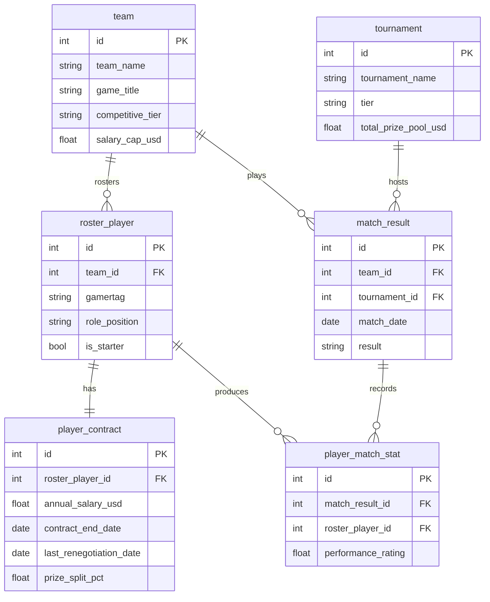
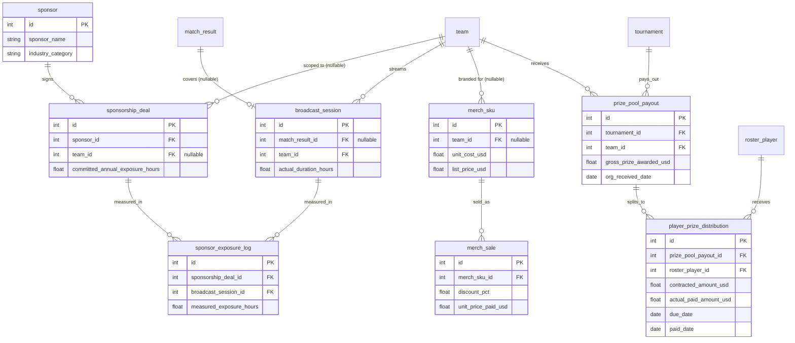

> For business background, industry primer, and glossary, see `01-gaming_esports_org_commercial_operations_medium_business_context.md`. This document covers the data only.

# Vanguard Esports Commercial Operations Health Review: ER Document

## 1. Dataset Metadata

- **Complexity**: Medium
- **Table count**: 14
- **Approximate total rows**: ~15,000
- **Foreign key count**: 18 FKs, plus 2 cross-table scope constraints that DDL cannot enforce (see "Referential Integrity" below)
- **REFERENCE_DATE**: `2026-06-30` (consistent with the Python generator and the SQL query document)

## 2. Mermaid ER Diagram

The dataset is split into two subgraphs by business domain: "Teams, Players, and Match Results" and
"Sponsorship/Broadcast Exposure, Merch, and Prize Distribution." `team` appears in both diagrams,
acting as the anchor between the two domains.

### 2.1 Teams, Players, and Match Results



### 2.2 Sponsorship/Broadcast Exposure, Merch, and Prize Distribution



## 3. Table Details

### 1. sponsor

**Business meaning**: Each row is a brand that pays Vanguard Esports a sponsorship fee — the
contracting party behind each `sponsorship_deal`. The Head of Partnerships uses this table to
manage brand relationships.

| Column | Type | Constraint | Description |
|------|------|------|------|
| id | INTEGER | PK | Sponsor ID |
| sponsor_name | VARCHAR(100) | NOT NULL, UNIQUE | Brand name (fictional brand) |
| industry_category | VARCHAR(50) | NOT NULL | Brand's industry, e.g. energy_drink, pc_hardware, fintech, apparel, telecom, mobility |
| relationship_start_date | DATE | NOT NULL | Date the sponsorship relationship with this brand began |

**Foreign keys**: None.

**Sample data**:

| id | sponsor_name | industry_category | relationship_start_date |
|----|--------------|--------------------|--------------------------|
| 1 | TitanEnergy Drink | energy_drink | 2023-03-01 |
| 4 | GridForge PC Hardware | pc_hardware | 2022-11-15 |
| 7 | NorthPeak Gaming Chairs | furniture | 2024-01-10 |

---

### 2. team

**Business meaning**: Each row is one sub-team under the club. `competitive_tier` distinguishes
the top-flight roster (main_roster) from the developmental/secondary roster (academy_roster), and
`salary_cap_usd` is the league-mandated annual player-salary ceiling for that team — one of the
reference points used to judge whether salaries are reasonable.

| Column | Type | Constraint | Description |
|------|------|------|------|
| id | INTEGER | PK | Team ID |
| team_name | VARCHAR(80) | NOT NULL, UNIQUE | Team name |
| game_title | VARCHAR(30) | NOT NULL | Game the team competes in: Fracture Protocol / Aetherlane |
| competitive_tier | VARCHAR(20) | NOT NULL | main_roster (top-flight team) / academy_roster (developmental-league team) |
| home_city | VARCHAR(60) | NOT NULL | City where the team's training facility is based |
| founded_date | DATE | NOT NULL | Date this sub-team was founded |
| salary_cap_usd | NUMERIC(10,2) | NOT NULL | League-mandated annual player-salary ceiling for this team |

**Foreign keys**: None.

> The dataset has only 3 teams: Vanguard Fracture (Fracture Protocol top-flight team), Vanguard
> Aetherlane (Aetherlane top-flight team), and Vanguard Academy (Fracture Protocol developmental
> team).

**Sample data**:

| id | team_name | game_title | competitive_tier | salary_cap_usd |
|----|-----------|------------|-------------------|----------------|
| 1 | Vanguard Fracture | Fracture Protocol | main_roster | 3,200,000.00 |
| 2 | Vanguard Aetherlane | Aetherlane | main_roster | 3,600,000.00 |
| 3 | Vanguard Academy | Fracture Protocol | academy_roster | 600,000.00 |

---

### 3. roster_player

**Business meaning**: Each row is one registered player, belonging to a single sub-team.
`role_position` is the in-game role (Duelist/Controller/Initiator/Sentinel/IGL for Fracture
Protocol, Top/Jungle/Mid/ADC/Support for Aetherlane), and `is_starter` distinguishes starters from
substitutes.

| Column | Type | Constraint | Description |
|------|------|------|------|
| id | INTEGER | PK | Player ID |
| team_id | INTEGER | FK -> team.id, NOT NULL | Team the player belongs to |
| gamertag | VARCHAR(40) | NOT NULL, UNIQUE | Player's competitive alias (the name used in match records and broadcasts) |
| real_name | VARCHAR(80) | NOT NULL | Player's real name |
| nationality | VARCHAR(56) | NOT NULL | Nationality |
| role_position | VARCHAR(30) | NOT NULL | In-game role; the valid value set depends on game_title |
| join_date | DATE | NOT NULL | Date the player joined this team |
| is_starter | BOOLEAN | NOT NULL | Whether the player is a starter |
| is_active | BOOLEAN | NOT NULL | Whether the player is still active (all rows are true in this dataset; reserved for future transfer/retirement scenarios) |

**Foreign keys**: `team_id` -> `team.id`, 1:N, ON DELETE CASCADE.

> The valid values for `role_position` are constrained by `team.game_title`: Fracture Protocol
> teams may only use {Duelist, Controller, Initiator, Sentinel, IGL}; Aetherlane teams may only use
> {Top, Jungle, Mid, ADC, Support}. This is not enforced by the DDL, so analysts should watch for
> it themselves.

**Sample data**:

| id | team_id | gamertag | role_position | is_starter |
|----|---------|----------|----------------|------------|
| 1 | 1 | Zenithrax | Duelist | true |
| 2 | 1 | Wraithcall | IGL | true |
| 8 | 3 | Novaspark | Sentinel | true |

---

### 4. player_contract

**Business meaning**: Each row is a player's currently active contract, recording annual salary,
contract start/end dates, the date of the last renegotiation/re-pricing, and the player's share of
the team's tournament prize money. This is the core table for the Q2 (salary-vs-performance
mismatch) analysis.

| Column | Type | Constraint | Description |
|------|------|------|------|
| id | INTEGER | PK | Contract ID |
| roster_player_id | INTEGER | FK -> roster_player.id, NOT NULL, UNIQUE | The player this contract belongs to (each player has exactly one active contract at a time) |
| annual_salary_usd | NUMERIC(10,2) | NOT NULL | Annual salary (excluding signing bonus) |
| signing_bonus_usd | NUMERIC(10,2) | NULL | One-time signing bonus; not present on every contract |
| contract_start_date | DATE | NOT NULL | Date this contract took effect |
| contract_end_date | DATE | NOT NULL | Date this contract expires |
| last_renegotiation_date | DATE | NOT NULL | Date of the last renewal/re-pricing (equal to contract_start_date unless this row is the player's original signing) |
| prize_split_pct | NUMERIC(5,2) | NOT NULL | This player's share of the team's tournament prize money (percentage), applied directly to `prize_pool_payout.gross_prize_awarded_usd` (the sum across all players on a team is <= 85%; the remainder goes to the club) |

**Foreign keys**: `roster_player_id` -> `roster_player.id`, 1:1, ON DELETE CASCADE.

**Sample data**:

| id | roster_player_id | annual_salary_usd | contract_end_date | last_renegotiation_date | prize_split_pct |
|----|-------------------|---------------------|---------------------|----------------------------|-------------------|
| 1 | 1 | 420,000.00 | 2028-06-30 | 2025-12-15 | 12.00 |
| 8 | 8 | 85,000.00 | 2027-03-01 | 2025-08-01 | 8.00 |

> Player 1 (Zenithrax) is the textbook "guaranteed contract / high-salary-low-output" case in the
> Q2 analysis: they renewed on 2025-12-15 through 2028 (roughly 24 months remaining), yet their
> performance rating over the trailing 6 months is markedly below their pre-renewal historical peak
> (see the "Data Generation Rules" section for exact figures).

---

### 5. sponsorship_deal

**Business meaning**: Each row is a sponsorship contract, recording the sponsoring brand, the
scope of the deal (club-wide or a specific team), the annual sponsorship fee, and the annual
exposure hours committed to in the contract. This is the core table for the Q1 (sponsorship
exposure billing gap) analysis.

| Column | Type | Constraint | Description |
|------|------|------|------|
| id | INTEGER | PK | Sponsorship deal ID |
| sponsor_id | INTEGER | FK -> sponsor.id, NOT NULL | Contracting brand |
| team_id | INTEGER | FK -> team.id, NULL | The team the sponsorship is scoped to; NULL means a club-wide sponsorship (every team's broadcasts carry the brand's exposure) |
| deal_name | VARCHAR(100) | NOT NULL | Deal name |
| annual_value_usd | NUMERIC(10,2) | NOT NULL | Annual sponsorship fee |
| contract_start_date | DATE | NOT NULL | Date the contract took effect |
| contract_end_date | DATE | NOT NULL | Date the contract expires |
| committed_annual_exposure_hours | NUMERIC(8,2) | NOT NULL | Annual exposure hours committed to in the contract |
| exposure_measurement_method | VARCHAR(40) | NOT NULL | How exposure is measured, e.g. stream_logo_overlay, jersey_patch_estimate |

**Foreign keys**: `sponsor_id` -> `sponsor.id`, 1:N, ON DELETE CASCADE; `team_id` -> `team.id`, 1:N, ON DELETE CASCADE, nullable.

**Sample data**:

| id | sponsor_id | team_id | deal_name | annual_value_usd | committed_annual_exposure_hours |
|----|------------|---------|-----------|---------------------|-----------------------------------|
| 1 | 1 | NULL | TitanEnergy Global Partnership | 900,000.00 | 203.00 |
| 5 | 7 | 1 | NorthPeak Fracture Protocol Seating Partner | 180,000.00 | 47.00 |

---

### 6. tournament

**Business meaning**: Each row is a tournament (a league split, a playoff, or a third-party
invitational), recording its tier, associated game, and total prize pool. It anchors both
`match_result` and `prize_pool_payout`.

| Column | Type | Constraint | Description |
|------|------|------|------|
| id | INTEGER | PK | Tournament ID |
| tournament_name | VARCHAR(120) | NOT NULL, UNIQUE | Tournament name |
| game_title | VARCHAR(30) | NOT NULL | Associated game |
| tier | VARCHAR(10) | NOT NULL | Tournament tier: S (official top-tier league event) / A (secondary league or major invitational) / B (small open tournament) |
| region | VARCHAR(40) | NOT NULL | Region/location hosting the event |
| start_date | DATE | NOT NULL | Tournament start date |
| end_date | DATE | NOT NULL | Tournament end date |
| total_prize_pool_usd | NUMERIC(12,2) | NOT NULL | Total prize pool for the tournament |

**Foreign keys**: None.

**Sample data**:

| id | tournament_name | game_title | tier | total_prize_pool_usd |
|----|-------------------|------------|------|-----------------------|
| 3 | FPCT Americas 2025 Split 2 Playoffs | Fracture Protocol | S | 1,000,000.00 |
| 14 | Fracture Protocol Ascendant Circuit NA 2025 Split 2 | Fracture Protocol | B | 50,000.00 |

---

### 7. match_result

**Business meaning**: Each row is the result of one match played by a Vanguard team at a given
tournament. It anchors individual player performance (`player_match_stat`) and broadcast sessions
(`broadcast_session`).

| Column | Type | Constraint | Description |
|------|------|------|------|
| id | INTEGER | PK | Match ID |
| team_id | INTEGER | FK -> team.id, NOT NULL | Competing team |
| tournament_id | INTEGER | FK -> tournament.id, NOT NULL | Associated tournament |
| match_date | DATE | NOT NULL | Match date |
| opponent_name | VARCHAR(80) | NOT NULL | Opposing team name (fictional) |
| format | VARCHAR(10) | NOT NULL | Match format: Bo1 / Bo3 / Bo5 |
| stage | VARCHAR(20) | NOT NULL | Tournament stage: group_stage / playoffs / grand_final |
| result | VARCHAR(10) | NOT NULL | win / loss |
| team_score | INTEGER | NOT NULL | Vanguard team's game score in this match |
| opponent_score | INTEGER | NOT NULL | Opponent's game score |

**Foreign keys**: `team_id` -> `team.id`, 1:N; `tournament_id` -> `tournament.id`, 1:N, both ON DELETE CASCADE.

**Sample data**:

| id | team_id | tournament_id | match_date | opponent_name | result | team_score | opponent_score |
|----|---------|-----------------|-------------|-----------------|--------|------------|------------------|
| 101 | 1 | 3 | 2025-08-14 | Ironclad Syndicate | win | 2 | 0 |
| 102 | 1 | 3 | 2025-08-16 | Obsidian Vanguard Rivals | loss | 1 | 2 |

---

### 8. player_match_stat

**Business meaning**: Each row is one player's individual stat line for one match.
`performance_rating` is a composite score combining kills/deaths/assists and other signals, and is
the core input for the Q2 "performance decline" determination.

| Column | Type | Constraint | Description |
|------|------|------|------|
| id | INTEGER | PK | Record ID |
| match_result_id | INTEGER | FK -> match_result.id, NOT NULL | Associated match |
| roster_player_id | INTEGER | FK -> roster_player.id, NOT NULL | Player |
| kills | INTEGER | NOT NULL | Kill count |
| deaths | INTEGER | NOT NULL | Death count |
| assists | INTEGER | NOT NULL | Assist count |
| performance_rating | NUMERIC(4,2) | NOT NULL | Composite performance rating, centered around 1.00 |
| was_mvp | BOOLEAN | NOT NULL | Whether the player was MVP of this match |

**Foreign keys**: `match_result_id` -> `match_result.id`, 1:N; `roster_player_id` -> `roster_player.id`, 1:N, both ON DELETE CASCADE.

> Only players who actually took part (typically the team's 5 starters, occasionally a substitute
> filling in) get a row; substitutes who didn't play have no row for that match.

**Sample data**:

| id | match_result_id | roster_player_id | kills | deaths | assists | performance_rating | was_mvp |
|----|-------------------|--------------------|-------|--------|---------|-----------------------|---------|
| 501 | 101 | 1 | 24 | 12 | 5 | 1.32 | true |
| 502 | 101 | 2 | 14 | 13 | 9 | 0.95 | false |

---

### 9. broadcast_session

**Business meaning**: Each row is a single broadcast session — either a match broadcast or a
non-match content stream (behind-the-scenes footage, player interaction streams, etc.). It's the
basis for computing actual exposure hours in `sponsor_exposure_log`, and also the source of "viewer
heat" used in evaluating merch and sponsorship value.

| Column | Type | Constraint | Description |
|------|------|------|------|
| id | INTEGER | PK | Broadcast session ID |
| match_result_id | INTEGER | FK -> match_result.id, NULL | Associated match; NULL means this is a non-match content stream |
| team_id | INTEGER | FK -> team.id, NOT NULL | Team channel this broadcast belongs to |
| platform | VARCHAR(20) | NOT NULL | Streaming platform: Twitch / YouTube |
| broadcast_date | DATE | NOT NULL | Broadcast date |
| actual_duration_hours | NUMERIC(5,2) | NOT NULL | Actual stream duration (hours) |
| average_viewers | INTEGER | NOT NULL | Average concurrent viewers |
| peak_viewers | INTEGER | NOT NULL | Peak concurrent viewers |

**Foreign keys**: `match_result_id` -> `match_result.id`, 1:1 (at most one broadcast per match), nullable, ON DELETE SET NULL; `team_id` -> `team.id`, 1:N, ON DELETE CASCADE.

**Sample data**:

| id | match_result_id | team_id | platform | actual_duration_hours | average_viewers |
|----|-------------------|---------|----------|--------------------------|--------------------|
| 201 | 101 | 1 | Twitch | 2.30 | 42,000 |
| 250 | NULL | 1 | Twitch | 1.10 | 8,500 |

---

### 10. sponsor_exposure_log

**Business meaning**: Each row is the measured duration that a given sponsorship deal's brand logo
actually appeared during a given broadcast session. Aggregating this table by
`sponsorship_deal_id` and comparing it against `committed_annual_exposure_hours` is the core
calculation behind the Q1 analysis.

| Column | Type | Constraint | Description |
|------|------|------|------|
| id | INTEGER | PK | Record ID |
| sponsorship_deal_id | INTEGER | FK -> sponsorship_deal.id, NOT NULL | Associated sponsorship deal |
| broadcast_session_id | INTEGER | FK -> broadcast_session.id, NOT NULL | Associated broadcast session |
| measured_exposure_hours | NUMERIC(5,3) | NOT NULL | Measured brand exposure hours during this broadcast |
| log_date | DATE | NOT NULL | Date of the measurement record (equal to that broadcast's broadcast_date) |

**Foreign keys**: `sponsorship_deal_id` -> `sponsorship_deal.id`, 1:N; `broadcast_session_id` -> `broadcast_session.id`, 1:N, both ON DELETE CASCADE.

> Scoping rule (not enforced by DDL): a `sponsor_exposure_log` row can only be linked to a
> `broadcast_session` that falls within that sponsorship deal's active contract period **and**
> matches the deal's `team_id` scope (a club-wide sponsorship can match any team's broadcast; a
> team-scoped sponsorship can only match that team's broadcasts).
>
> Numeric invariant (not enforced by DDL — the generator is responsible for upholding it): a single
> record's `measured_exposure_hours` **must always be less than** the
> `broadcast_session.actual_duration_hours` it belongs to — the brand logo's exposure is only part
> of the overall broadcast, so it's physically impossible for it to exceed the total stream
> duration. The generator models per-session measured exposure as `stream duration × visibility
> share for that measurement method (<= 0.60) × noise`, which guarantees this invariant by
> construction.

**Sample data**:

| id | sponsorship_deal_id | broadcast_session_id | measured_exposure_hours |
|----|------------------------|--------------------------|------------------------------|
| 1001 | 1 | 201 | 1.380 |
| 1002 | 5 | 201 | 1.240 |

---

### 11. merch_sku

**Business meaning**: Each row is one purchasable merch item (jerseys, hoodies, accessories,
etc.). `team_id` NULL denotes club-wide branded merch; non-NULL denotes merch exclusive to a
specific team (e.g. that team's custom jersey).

| Column | Type | Constraint | Description |
|------|------|------|------|
| id | INTEGER | PK | Product ID |
| team_id | INTEGER | FK -> team.id, NULL | Team this exclusive product belongs to; NULL means it's a club-wide branded product |
| product_name | VARCHAR(100) | NOT NULL | Product name |
| category | VARCHAR(30) | NOT NULL | Product category: jersey / hoodie / accessory / headwear |
| unit_cost_usd | NUMERIC(8,2) | NOT NULL | Per-unit cost |
| list_price_usd | NUMERIC(8,2) | NOT NULL | Official list price |

**Foreign keys**: `team_id` -> `team.id`, 1:N, nullable, ON DELETE CASCADE.

**Sample data**:

| id | team_id | product_name | category | unit_cost_usd | list_price_usd |
|----|---------|----------------|----------|------------------|--------------------|
| 1 | 1 | Vanguard Fracture 2026 Home Jersey | jersey | 22.50 | 79.99 |
| 20 | NULL | Vanguard Esports Logo Hoodie | hoodie | 18.00 | 59.99 |

---

### 12. merch_sale

**Business meaning**: Each row is one merch sales transaction, recording quantity, discount depth,
and the price actually paid. This is the core table for the Q3 (merch gross margin vs. team
performance/viewer heat) analysis.

| Column | Type | Constraint | Description |
|------|------|------|------|
| id | INTEGER | PK | Transaction ID |
| merch_sku_id | INTEGER | FK -> merch_sku.id, NOT NULL | Product sold |
| sale_date | DATE | NOT NULL | Sale date |
| quantity | INTEGER | NOT NULL | Units sold |
| discount_pct | NUMERIC(5,2) | NOT NULL | Discount depth (percentage) |
| unit_price_paid_usd | NUMERIC(8,2) | NOT NULL | Actual price paid per unit (after discount) |
| channel | VARCHAR(20) | NOT NULL | Sales channel: online_store / event_pop_up |

**Foreign keys**: `merch_sku_id` -> `merch_sku.id`, 1:N, ON DELETE CASCADE.

**Sample data**:

| id | merch_sku_id | sale_date | quantity | discount_pct | unit_price_paid_usd |
|----|----------------|-------------|----------|------------------|---------------------------|
| 5001 | 1 | 2025-08-15 | 3 | 8.00 | 73.59 |
| 5002 | 1 | 2026-02-20 | 5 | 32.00 | 54.39 |

---

### 13. prize_pool_payout

**Business meaning**: Each row is a prize-money payment made by a tournament organizer to the club
after a Vanguard team places in that tournament. The gap between `organizer_payout_date` and
`org_received_date` reflects the organizer's payment speed; `org_received_date` is the starting
point of the clock for the downstream prize-split chain to players.

| Column | Type | Constraint | Description |
|------|------|------|------|
| id | INTEGER | PK | Record ID |
| tournament_id | INTEGER | FK -> tournament.id, NOT NULL | Associated tournament |
| team_id | INTEGER | FK -> team.id, NOT NULL | Team receiving the prize money |
| placement | INTEGER | NOT NULL | Team's final placement in the tournament |
| gross_prize_awarded_usd | NUMERIC(10,2) | NOT NULL | Total prize amount the tournament awarded this team |
| organizer_payout_date | DATE | NOT NULL | Date the organizer initiated payment |
| org_received_date | DATE | NOT NULL | Date the club actually received the prize money |

**Foreign keys**: `tournament_id` -> `tournament.id`, 1:N; `team_id` -> `team.id`, 1:N, both ON DELETE CASCADE.

**Sample data**:

| id | tournament_id | team_id | placement | gross_prize_awarded_usd | org_received_date |
|----|-----------------|---------|-----------|------------------------------|-------------------------|
| 1 | 3 | 1 | 2 | 200,000.00 | 2025-09-05 |

---

### 14. player_prize_distribution

**Business meaning**: Each row is the breakdown of what a given player was owed and actually paid
out of a given prize-money receipt. This is the core table for the Q4 (prize-split payment
compliance) analysis, placing the contractually agreed percentage/amount side by side with the
actual paid amount and date.

| Column | Type | Constraint | Description |
|------|------|------|------|
| id | INTEGER | PK | Record ID |
| prize_pool_payout_id | INTEGER | FK -> prize_pool_payout.id, NOT NULL | Associated prize-money receipt |
| roster_player_id | INTEGER | FK -> roster_player.id, NOT NULL | Player |
| contracted_pct | NUMERIC(5,2) | NOT NULL | This player's contracted split percentage (copied from `player_contract.prize_split_pct`) |
| contracted_amount_usd | NUMERIC(10,2) | NOT NULL | Amount owed, computed from the contracted percentage |
| actual_paid_amount_usd | NUMERIC(10,2) | NOT NULL | Amount actually paid to the player |
| due_date | DATE | NOT NULL | Contractual payment deadline (= `org_received_date` + 30 days) |
| paid_date | DATE | NOT NULL | Date the payment was actually made |
| payment_status | VARCHAR(20) | NOT NULL | on_time / late / underpaid / late_and_underpaid |

**Foreign keys**: `prize_pool_payout_id` -> `prize_pool_payout.id`, 1:N; `roster_player_id` -> `roster_player.id`, 1:N, both ON DELETE CASCADE.

**Sample data**:

| id | prize_pool_payout_id | roster_player_id | contracted_amount_usd | actual_paid_amount_usd | due_date | paid_date | payment_status |
|----|--------------------------|--------------------|-----------------------------|------------------------------|-----------|-----------|-------------------|
| 1 | 1 | 1 | 24,000.00 | 24,000.00 | 2025-10-05 | 2025-09-28 | on_time |
| 12 | 3 | 15 | 6,400.00 | 5,760.00 | 2025-11-02 | 2025-12-20 | late_and_underpaid |

## 4. Data Generation Rules

### Chronological Ordering

- `team.founded_date` predates any `roster_player.join_date` for that team.
- `roster_player.join_date` predates that player's `player_contract.contract_start_date`.
- `player_contract.last_renegotiation_date` is on or after `contract_start_date`, and no later than
  `REFERENCE_DATE`.
- `sponsorship_deal.contract_start_date` precedes `contract_end_date`; every
  `sponsor_exposure_log.log_date` falls within that deal's active contract period.
- `tournament.start_date` precedes `end_date`; `match_result.match_date` falls within that
  tournament's `[start_date, end_date]` range.
- `broadcast_session.broadcast_date` equals the associated `match_result.match_date` (for match
  broadcasts), or is independently distributed across the dataset's time window (for content
  broadcasts).
- `prize_pool_payout.organizer_payout_date` is on or before `org_received_date`, with a gap of 3 to
  21 days. `player_prize_distribution.due_date` = `org_received_date` + 30 days (the standard
  contractual payment term).

### Referential Integrity

- All FK relationships are described in each table's "Foreign keys" subsection. Scope rules that
  DDL cannot enforce:
  1. `sponsor_exposure_log` can only reference broadcasts within its sponsorship deal's scope:
     team-scoped deals (`sponsorship_deal.team_id` not null) can only match that team's
     `broadcast_session` rows; club-wide deals (`team_id` NULL) can match any team's broadcasts.
  2. `player_match_stat.roster_player_id` must belong to the same team as that match's
     `match_result.team_id` — a player's stats can never be recorded against another team's match.

### Value Ranges

- `performance_rating`: centered around 1.00, observed to fall roughly within [0.41, 1.64]; the
  generator clamps the final value to a hard boundary of [0.40, 1.90] (declining legacy stars touch
  the low end, while a player carrying the game touches the high end).
- `annual_salary_usd`: top-flight starters $220,000-$650,000, top-flight substitutes
  $75,000-$150,000, Academy team $45,000-$110,000.
- `prize_split_pct`: starters 8%-14%, substitutes 3%-6% (the sum across all players on a given team
  is <= 85%, with the remainder going to club operations/coaching staff, which is not modeled in
  this dataset).
- `discount_pct`: ranges from 0 to 45; see "Observed Distribution Patterns" below for the specific
  shape.
- `committed_annual_exposure_hours`: not hard-coded — instead it's back-calculated by annualizing
  the deal's "measured exposure total across the broadcasts it can reach" and dividing by a target
  delivery rate (see business trap 1 below), so its value depends on which broadcasts the deal
  covers: club-wide deals (reaching every team's broadcasts) run roughly 75-205 hours, while
  team-scoped deals (covering only one team's broadcasts) run roughly 30-80 hours.

### Computed Fields

- `player_prize_distribution.contracted_amount_usd` = `prize_pool_payout.gross_prize_awarded_usd` *
  `player_contract.prize_split_pct` / 100, computed at generation time using the percentage in
  effect at that moment and stored as-is — no re-aggregation needed downstream.
- `merch_sale.unit_price_paid_usd` = `merch_sku.list_price_usd` * (1 - `discount_pct` / 100),
  rounded to the cent.
- `sponsor_exposure_log` is aggregated by `sponsorship_deal_id`, summing `measured_exposure_hours`
  and dividing by that deal's effective number of years (= `(MIN(contract_end_date,
  REFERENCE_DATE) - contract_start_date) / 365.25`), to produce the "actual annualized exposure
  hours" figure used to compare against `committed_annual_exposure_hours`; this matches the
  annualization convention used in Query 1/3 and the business context document exactly.

### Observed Distribution Patterns (as generated)

- Across the whole dataset, player performance ratings average roughly 1.00-1.05, with a standard
  deviation of about 0.18.
- Of the 12 sponsorship deals, 3 show an annualized measured-exposure shortfall of roughly 25%-35%
  versus their committed value (a delivery rate of roughly 65%-75%), while the other 9 deliver at
  roughly 93%-108%.
- During windows where a team's trailing 60-day win rate is >= 55%, average merch discount depth
  runs roughly 8%-14% with gross margin around 48%-53%; during slump windows with a win rate < 35%,
  average discount depth runs roughly 26%-34% with gross margin around 32%-38% — but unit sales
  actually tick up slightly thanks to the deeper discounting, so total revenue dips far less than
  the margin does.
- Across 24 tournaments, a handful of early group-stage exits combined with a very low win rate
  (< 25%) produce no prize money at all (no `prize_pool_payout` row generated), so the count of
  prize-receipt records will run a few short of the tournament total (about 1 short under the fixed
  random seed used here — a data-dependent outcome rather than a structural guarantee); every other
  tournament produces exactly one prize-receipt record. Across roughly 115 prize-split records,
  about 15% are late / underpaid / late_and_underpaid, and about 80% of those are concentrated in
  Vanguard Academy's prize-split records.

### Embedded Business Traps

- **Trap 1 (Q1 sponsorship exposure billing gap)**: Of the 12 sponsorship deals, `TitanEnergy
  Global Partnership`, `GridForge Fracture Protocol Hardware Deal`, and `StreakBet Gaming
  Partnership` show a systematic gap between annualized measured exposure and the committed value,
  delivering at roughly 68%-70%; the other 9 deals all deliver above 93%, creating a clear split.
  The generator implements this by first generating per-session measured exposure as "stream
  duration × visibility share × noise" (always < stream duration), then back-solving each deal's
  `committed_annual_exposure_hours` as "annualized measured exposure / target delivery rate" — so
  these three deals' committed values are systematically inflated relative to what they actually
  deliver, landing precisely at the designed gap. Any SQL query addressing Q1 should compare
  "committed vs. annualized measured" deal by deal, rather than looking only at the overall average
  (which gets diluted by the 9 healthy deals).
- **Trap 2 (Q2 salary-vs-performance mismatch)**: 4 players (2 on Vanguard Fracture, 1 on Vanguard
  Aetherlane, 1 on Vanguard Academy) show a trailing-6-month average performance rating roughly
  30%-35% below their historical peak from 12-18 months prior, yet all of them completed a contract
  renewal around the time the decline began (`last_renegotiation_date` falls near the start of the
  slump), have 18+ months remaining on their contract, and have had no salary adjustment
  whatsoever. Every other player's salary tracks their recent performance rating with a positive
  correlation (roughly 0.55-0.65).
- **Trap 3 (Q3 merch gross margin tied to team performance)**: See "Observed Distribution Patterns"
  above — a team's trailing-60-day win rate correlates clearly with merch gross margin over the
  same period, with deeper discounting propping up unit sales during slumps; total revenue swings
  far less than gross margin does, so a finance report that only looks at revenue trend would miss
  this signal entirely.
- **Trap 4 (Q4 prize-split payment compliance)**: Roughly 15% of prize-split records are either late
  (paid more than `org_received_date` + 30 days after the fact) or underpaid
  (`actual_paid_amount_usd` below 88%-95% of `contracted_amount_usd`), and roughly 80% of those are
  concentrated in Vanguard Academy's prize-split records (nearly 40% of Academy's own records have
  an issue, far above the under-10% rate on each of the two top-flight teams) — pointing to a
  systemic problem in that team's prize-payment process rather than random one-off cases.

## 5. Faker Strategy

| Field pattern | Faker method | Notes |
|----------|------------|------|
| real_name | `fake.name()` | Player's real name |
| gamertag | Custom root-word concatenation + numeric suffix | Esports-style competitive alias, guaranteed unique |
| nationality | `random.choice(common North American/European/Asian esports-player nationality list)` | Reflects the typical nationality mix of North American esports players |
| sponsor_name | Custom brand word-bank concatenation (industry root + brand suffix) | Avoids using real brand names |
| opponent_name | Custom esports team-name word bank (adjective + noun combinations) | Produces realistic-sounding fictional opponent team names |
| product_name | Team name + category word-bank concatenation | Merch naming aligned with team branding |

## 6. File Manifest (Topological Order)

| # | Filename | Table | Rows | Depends On |
|---|--------|-----|------|------|
| 01 | 01_sponsor.tsv | sponsor | 10 | none |
| 02 | 02_team.tsv | team | 3 | none |
| 03 | 03_roster_player.tsv | roster_player | 21 | team |
| 04 | 04_player_contract.tsv | player_contract | 21 | roster_player |
| 05 | 05_sponsorship_deal.tsv | sponsorship_deal | 12 | sponsor, team |
| 06 | 06_tournament.tsv | tournament | 24 | none |
| 07 | 07_match_result.tsv | match_result | ~475 | team, tournament |
| 08 | 08_player_match_stat.tsv | player_match_stat | ~2,375 | match_result, roster_player |
| 09 | 09_broadcast_session.tsv | broadcast_session | ~575 | match_result, team |
| 10 | 10_sponsor_exposure_log.tsv | sponsor_exposure_log | ~2,525 | sponsorship_deal, broadcast_session |
| 11 | 11_merch_sku.tsv | merch_sku | 25 | team |
| 12 | 12_merch_sale.tsv | merch_sale | ~9,000 | merch_sku |
| 13 | 13_prize_pool_payout.tsv | prize_pool_payout | ~23 | tournament, team |
| 14 | 14_player_prize_distribution.tsv | player_prize_distribution | ~115 | prize_pool_payout, roster_player |

## 7. SQLite DDL

```sql
CREATE TABLE sponsor (
    id INTEGER PRIMARY KEY AUTOINCREMENT,
    sponsor_name VARCHAR(100) NOT NULL UNIQUE,
    industry_category VARCHAR(50) NOT NULL,
    relationship_start_date DATE NOT NULL
);

CREATE TABLE team (
    id INTEGER PRIMARY KEY AUTOINCREMENT,
    team_name VARCHAR(80) NOT NULL UNIQUE,
    game_title VARCHAR(30) NOT NULL,
    competitive_tier VARCHAR(20) NOT NULL,
    home_city VARCHAR(60) NOT NULL,
    founded_date DATE NOT NULL,
    salary_cap_usd NUMERIC(10, 2) NOT NULL
);

CREATE TABLE roster_player (
    id INTEGER PRIMARY KEY AUTOINCREMENT,
    team_id INTEGER NOT NULL REFERENCES team(id) ON DELETE CASCADE,
    gamertag VARCHAR(40) NOT NULL UNIQUE,
    real_name VARCHAR(80) NOT NULL,
    nationality VARCHAR(56) NOT NULL,
    role_position VARCHAR(30) NOT NULL,
    join_date DATE NOT NULL,
    is_starter BOOLEAN NOT NULL,
    is_active BOOLEAN NOT NULL
);
CREATE INDEX idx_roster_player_team ON roster_player(team_id);

CREATE TABLE player_contract (
    id INTEGER PRIMARY KEY AUTOINCREMENT,
    roster_player_id INTEGER NOT NULL UNIQUE REFERENCES roster_player(id) ON DELETE CASCADE,
    annual_salary_usd NUMERIC(10, 2) NOT NULL,
    signing_bonus_usd NUMERIC(10, 2),
    contract_start_date DATE NOT NULL,
    contract_end_date DATE NOT NULL,
    last_renegotiation_date DATE NOT NULL,
    prize_split_pct NUMERIC(5, 2) NOT NULL
);

CREATE TABLE sponsorship_deal (
    id INTEGER PRIMARY KEY AUTOINCREMENT,
    sponsor_id INTEGER NOT NULL REFERENCES sponsor(id) ON DELETE CASCADE,
    team_id INTEGER REFERENCES team(id) ON DELETE CASCADE,
    deal_name VARCHAR(100) NOT NULL,
    annual_value_usd NUMERIC(10, 2) NOT NULL,
    contract_start_date DATE NOT NULL,
    contract_end_date DATE NOT NULL,
    committed_annual_exposure_hours NUMERIC(8, 2) NOT NULL,
    exposure_measurement_method VARCHAR(40) NOT NULL
);
CREATE INDEX idx_sponsorship_deal_sponsor ON sponsorship_deal(sponsor_id);
CREATE INDEX idx_sponsorship_deal_team ON sponsorship_deal(team_id);

CREATE TABLE tournament (
    id INTEGER PRIMARY KEY AUTOINCREMENT,
    tournament_name VARCHAR(120) NOT NULL UNIQUE,
    game_title VARCHAR(30) NOT NULL,
    tier VARCHAR(10) NOT NULL,
    region VARCHAR(40) NOT NULL,
    start_date DATE NOT NULL,
    end_date DATE NOT NULL,
    total_prize_pool_usd NUMERIC(12, 2) NOT NULL
);

CREATE TABLE match_result (
    id INTEGER PRIMARY KEY AUTOINCREMENT,
    team_id INTEGER NOT NULL REFERENCES team(id) ON DELETE CASCADE,
    tournament_id INTEGER NOT NULL REFERENCES tournament(id) ON DELETE CASCADE,
    match_date DATE NOT NULL,
    opponent_name VARCHAR(80) NOT NULL,
    format VARCHAR(10) NOT NULL,
    stage VARCHAR(20) NOT NULL,
    result VARCHAR(10) NOT NULL,
    team_score INTEGER NOT NULL,
    opponent_score INTEGER NOT NULL
);
CREATE INDEX idx_match_result_team ON match_result(team_id);
CREATE INDEX idx_match_result_tournament ON match_result(tournament_id);

CREATE TABLE player_match_stat (
    id INTEGER PRIMARY KEY AUTOINCREMENT,
    match_result_id INTEGER NOT NULL REFERENCES match_result(id) ON DELETE CASCADE,
    roster_player_id INTEGER NOT NULL REFERENCES roster_player(id) ON DELETE CASCADE,
    kills INTEGER NOT NULL,
    deaths INTEGER NOT NULL,
    assists INTEGER NOT NULL,
    performance_rating NUMERIC(4, 2) NOT NULL,
    was_mvp BOOLEAN NOT NULL
);
CREATE INDEX idx_player_match_stat_match ON player_match_stat(match_result_id);
CREATE INDEX idx_player_match_stat_player ON player_match_stat(roster_player_id);

CREATE TABLE broadcast_session (
    id INTEGER PRIMARY KEY AUTOINCREMENT,
    match_result_id INTEGER REFERENCES match_result(id) ON DELETE SET NULL,
    team_id INTEGER NOT NULL REFERENCES team(id) ON DELETE CASCADE,
    platform VARCHAR(20) NOT NULL,
    broadcast_date DATE NOT NULL,
    actual_duration_hours NUMERIC(5, 2) NOT NULL,
    average_viewers INTEGER NOT NULL,
    peak_viewers INTEGER NOT NULL
);
CREATE INDEX idx_broadcast_session_team ON broadcast_session(team_id);

CREATE TABLE sponsor_exposure_log (
    id INTEGER PRIMARY KEY AUTOINCREMENT,
    sponsorship_deal_id INTEGER NOT NULL REFERENCES sponsorship_deal(id) ON DELETE CASCADE,
    broadcast_session_id INTEGER NOT NULL REFERENCES broadcast_session(id) ON DELETE CASCADE,
    measured_exposure_hours NUMERIC(5, 3) NOT NULL,
    log_date DATE NOT NULL
);
CREATE INDEX idx_sponsor_exposure_log_deal ON sponsor_exposure_log(sponsorship_deal_id);
CREATE INDEX idx_sponsor_exposure_log_session ON sponsor_exposure_log(broadcast_session_id);

CREATE TABLE merch_sku (
    id INTEGER PRIMARY KEY AUTOINCREMENT,
    team_id INTEGER REFERENCES team(id) ON DELETE CASCADE,
    product_name VARCHAR(100) NOT NULL,
    category VARCHAR(30) NOT NULL,
    unit_cost_usd NUMERIC(8, 2) NOT NULL,
    list_price_usd NUMERIC(8, 2) NOT NULL
);

CREATE TABLE merch_sale (
    id INTEGER PRIMARY KEY AUTOINCREMENT,
    merch_sku_id INTEGER NOT NULL REFERENCES merch_sku(id) ON DELETE CASCADE,
    sale_date DATE NOT NULL,
    quantity INTEGER NOT NULL,
    discount_pct NUMERIC(5, 2) NOT NULL,
    unit_price_paid_usd NUMERIC(8, 2) NOT NULL,
    channel VARCHAR(20) NOT NULL
);
CREATE INDEX idx_merch_sale_sku ON merch_sale(merch_sku_id);

CREATE TABLE prize_pool_payout (
    id INTEGER PRIMARY KEY AUTOINCREMENT,
    tournament_id INTEGER NOT NULL REFERENCES tournament(id) ON DELETE CASCADE,
    team_id INTEGER NOT NULL REFERENCES team(id) ON DELETE CASCADE,
    placement INTEGER NOT NULL,
    gross_prize_awarded_usd NUMERIC(10, 2) NOT NULL,
    organizer_payout_date DATE NOT NULL,
    org_received_date DATE NOT NULL
);
CREATE INDEX idx_prize_pool_payout_tournament ON prize_pool_payout(tournament_id);
CREATE INDEX idx_prize_pool_payout_team ON prize_pool_payout(team_id);

CREATE TABLE player_prize_distribution (
    id INTEGER PRIMARY KEY AUTOINCREMENT,
    prize_pool_payout_id INTEGER NOT NULL REFERENCES prize_pool_payout(id) ON DELETE CASCADE,
    roster_player_id INTEGER NOT NULL REFERENCES roster_player(id) ON DELETE CASCADE,
    contracted_pct NUMERIC(5, 2) NOT NULL,
    contracted_amount_usd NUMERIC(10, 2) NOT NULL,
    actual_paid_amount_usd NUMERIC(10, 2) NOT NULL,
    due_date DATE NOT NULL,
    paid_date DATE NOT NULL,
    payment_status VARCHAR(20) NOT NULL
);
CREATE INDEX idx_player_prize_distribution_payout ON player_prize_distribution(prize_pool_payout_id);
CREATE INDEX idx_player_prize_distribution_player ON player_prize_distribution(roster_player_id);
```
