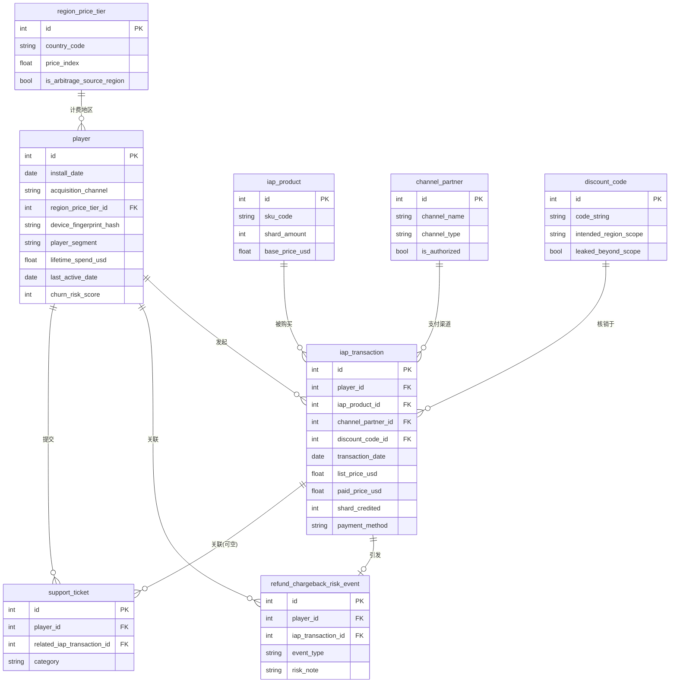
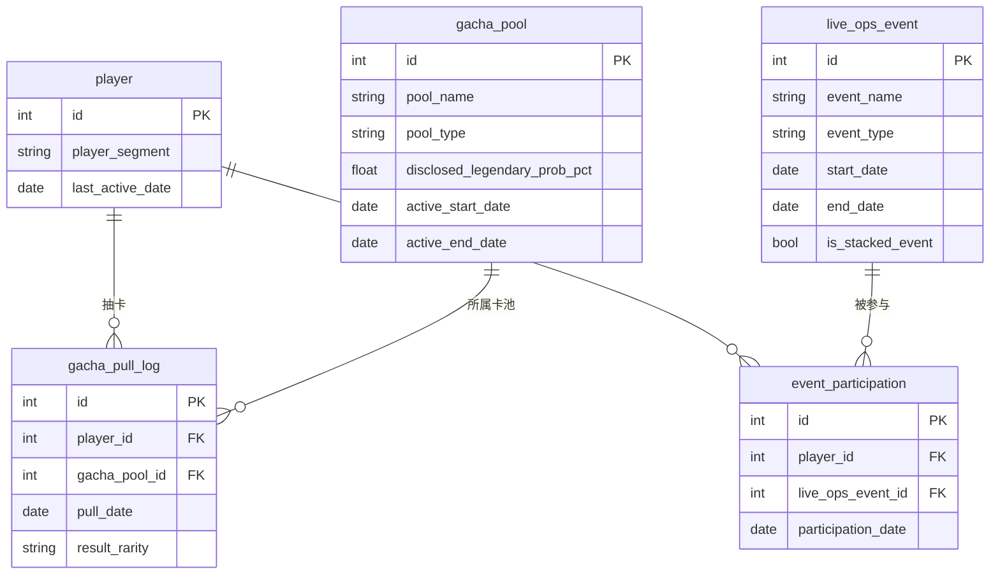

# Ember Realms Saga 玩家经济与代充渠道健康度分析: ER 文档

> 业务背景, 行业科普, 术语表请见 `01-gaming_f2p_whale_monetization_medium_business_context-cn.md`。
> 本文档只描述数据。

## 1. 数据集元信息

- **复杂度**: Medium
- **表数量**: 12 张
- **总行数**: 约 70,663 行(不含表头)
- **外键关系数**: 13 条声明式外键, 另有 3 条 DDL 无法表达的隐含范围约束(见第 5 节)
- **REFERENCE_DATE**: `2026-06-30`(与生成器、SQL 查询文档一致)

## 2. Mermaid ER 图

数据集按业务功能拆成两组关系图: 玩家/支付/商业化, 以及抽卡/Live-Ops 活动。
`player` 是两组共同的锚点, 在两张图里都出现。

### 2.1 玩家, 支付与商业化



### 2.2 抽卡与 Live-Ops 活动



## 3. 逐表说明

### 1. channel_partner

内购支付渠道维度表。每一行是玩家充值时实际走的支付通道: 2 个官方应用商店
(Apple / Google 的官方 IAP 计费), 1 个官方网页直购, 2 个"官方授权"的区域代收款
伙伴(常见于东南亚/拉美等官方支付渠道渗透率不高的市场, 由公司正式签约合作),
以及 5 个未经公司授权的第三方"代充"商。`is_authorized = false` 的 5 行正是
Q4(代充/优惠渠道套利)的分析对象。

**列**

| 列名 | 类型 | 约束 | 说明 |
|------|------|------|------|
| id | INTEGER | PK | 渠道 ID |
| channel_name | VARCHAR(80) | NOT NULL, UNIQUE | 渠道名称, 如 "Apple App Store (IAP)" |
| channel_type | VARCHAR(30) | NOT NULL | `official_app_store` / `official_web` / `third_party_agent` |
| is_authorized | BOOLEAN | NOT NULL | 是否公司官方授权; 5 个未授权代充商为 false |
| region_scope | VARCHAR(40) | NOT NULL | 服务的地理范围, 如 "Southeast Asia" / "Global" |
| commission_rate_pct | NUMERIC(5,2) | 可空 | 仅官方授权区域伙伴填写, 公司支付给对方的抽成比例 |
| onboarded_date | DATE | NOT NULL | 该渠道接入日期 |

**样例数据**

| id | channel_name | channel_type | is_authorized | region_scope |
|----|---------------|--------------|----------------|--------------|
| 1 | Apple App Store (IAP) | official_app_store | true | Global |
| 4 | SEA Regional Billing Partner | third_party_agent | true | Southeast Asia |
| 6 | Agent - SEA TopUp Hub | third_party_agent | false | Southeast Asia |

> **范围提示**: `channel_type = 'third_party_agent'` 里既有官方授权(`is_authorized
> = true`, 2 行)也有未授权(`is_authorized = false`, 5 行)。不能只按
> `channel_type` 分组分析代充问题, 必须同时看 `is_authorized`。

### 2. region_price_tier

玩家计费地区的定价系数维度表。`price_index` 是相对美国/加拿大官方标价的折算
系数(1.00 为基准), 反映各国官方定价差异。`is_arbitrage_source_region = true`
的 6 个地区(巴西, 土耳其, 阿根廷, 菲律宾, 印度, 印尼)官方定价明显低于美加,
是代充产业链低价买入的常见来源地。

**列**

| 列名 | 类型 | 约束 | 说明 |
|------|------|------|------|
| id | INTEGER | PK | 地区 ID |
| country_code | VARCHAR(2) | NOT NULL, UNIQUE | ISO 两位国家代码 |
| country_name | VARCHAR(60) | NOT NULL | 国家/地区全名 |
| currency_code | VARCHAR(3) | NOT NULL | 本币代码, 仅作展示用途 |
| price_index | NUMERIC(4,2) | NOT NULL | 相对美加基准(1.00)的官方定价折算系数 |
| is_arbitrage_source_region | BOOLEAN | NOT NULL | 是否常见的套利低价来源地区 |

**样例数据**: 美国(US, 1.00, false); 土耳其(TR, 0.55, true); 阿根廷(AR, 0.50, true)。

### 3. iap_product

内购商品目录维度表。从 0.99 美元的入门水晶包到 199.99 美元的巨鲸档礼包,
`shard_amount` 是购买后到账的水晶(Aether Shards, 内购货币)数量, 部分订阅制
商品(如 Battle Pass Premium)不直接发水晶, `shard_amount` 记为 0。

**列**

| 列名 | 类型 | 约束 | 说明 |
|------|------|------|------|
| id | INTEGER | PK | 商品 ID |
| sku_code | VARCHAR(30) | NOT NULL, UNIQUE | SKU 编码 |
| product_name | VARCHAR(80) | NOT NULL | 商品展示名称 |
| product_category | VARCHAR(20) | NOT NULL | `currency_pack` / `bundle` / `subscription` |
| shard_amount | INTEGER | 可空 | 到账水晶数量, 订阅类商品可能为 0 |
| base_price_usd | NUMERIC(8,2) | NOT NULL | 美国/加拿大官方标价(美元), 其他地区需乘 `region_price_tier.price_index` |

### 4. gacha_pool

抽卡卡池维度表。`pool_type = 'standard'` 是长期开放的常驻池, `'limited_rateup'`
是绑定新角色、只开放 2 周左右的限定池。`disclosed_*_prob_pct` 四列是官方对外
公示的概率(四项应加总为 100), 这是玩家能看到的"合同"。

> **陷阱2 的关键**: 本表只记录官方**公示**的概率。卡池的**实际**概率不在这张表里,
> 必须从 `gacha_pull_log` 的真实抽卡结果里按卡池分组统计还原, 再与本表的公示值
> 比对, 才能发现披露偏差。

**列**

| 列名 | 类型 | 约束 | 说明 |
|------|------|------|------|
| id | INTEGER | PK | 卡池 ID |
| pool_name | VARCHAR(80) | NOT NULL, UNIQUE | 卡池名称 |
| pool_type | VARCHAR(20) | NOT NULL | `standard` / `limited_rateup` |
| disclosed_common_prob_pct | NUMERIC(5,2) | NOT NULL | 官方公示的 Common 掉率(%) |
| disclosed_rare_prob_pct | NUMERIC(5,2) | NOT NULL | 官方公示的 Rare 掉率(%) |
| disclosed_epic_prob_pct | NUMERIC(5,2) | NOT NULL | 官方公示的 Epic 掉率(%) |
| disclosed_legendary_prob_pct | NUMERIC(5,2) | NOT NULL | 官方公示的 Legendary(最高稀有度)掉率(%) |
| active_start_date | DATE | NOT NULL | 卡池开放起始日 |
| active_end_date | DATE | 可空 | 卡池关闭日期; 常驻池为空表示长期开放 |

**样例数据**: 8 个卡池里, `Standard Summon Pool` / `Starter Newbie Pool` /
`Veteran Loyalty Pool` 是常驻池; `Ember Queen Rate-Up Banner` /
`Frostbound Knight Rate-Up Banner` / `Anniversary Celebration Banner` /
`Shadowfang Assassin Rate-Up Banner` / `Golden Phoenix Rate-Up Banner` 是
5 个限定池。

### 5. discount_code

优惠码维度表, 45 行。`source_channel` 区分官方生命周期营销邮件码
(`official_lifecycle_email`, 20 个)、达人合作码(`influencer_partnership`,
6 个)和区域专属促销码(`regional_promo`, 19 个)。区域专属促销码本应只在
`intended_region_scope` 指定的国家使用, 其中 4 个被标记 `leaked_beyond_scope
= true`, 代表已确认泄露到目标地区之外被套利使用。

**列**

| 列名 | 类型 | 约束 | 说明 |
|------|------|------|------|
| id | INTEGER | PK | 优惠码 ID |
| code_string | VARCHAR(20) | NOT NULL, UNIQUE | 优惠码字符串 |
| source_channel | VARCHAR(30) | NOT NULL | `official_lifecycle_email` / `influencer_partnership` / `regional_promo` |
| discount_pct | NUMERIC(5,2) | NOT NULL | 折扣百分比 |
| intended_region_scope | VARCHAR(40) | 可空 | 目标地区(国家名); 全球通用码为空 |
| leaked_beyond_scope | BOOLEAN | NOT NULL | 是否已确认泄露套利(仅 `regional_promo` 里 4 个为 true) |
| issued_date | DATE | NOT NULL | 发放日期 |
| max_redemptions | INTEGER | NOT NULL | 最大核销次数上限 |

> **范围提示**: `leaked_beyond_scope = true` 只会出现在 `source_channel =
> 'regional_promo'` 的行里; `intended_region_scope IS NULL` 的行(邮件营销码/
> 达人码)不适用"越界核销"的概念, 分析泄露问题时需先过滤
> `intended_region_scope IS NOT NULL`。

### 6. live_ops_event

Live-Ops 活动日历维度表, 30 场活动。`is_stacked_event = true` 标记"与上一场
活动结束日间隔小于 7 天"的高频扎堆活动, 这是 Q3(活动假繁荣)分析的核心分组
字段, 由生成器按活动日历显式计算得出。

**列**

| 列名 | 类型 | 约束 | 说明 |
|------|------|------|------|
| id | INTEGER | PK | 活动 ID |
| event_name | VARCHAR(80) | NOT NULL, UNIQUE | 活动名称 |
| event_type | VARCHAR(30) | NOT NULL | `login_bonus` / `double_drop_rate` / `flash_sale` / `rate_up_banner_tie_in` / `anniversary` |
| start_date | DATE | NOT NULL | 活动开始日 |
| end_date | DATE | NOT NULL | 活动结束日 |
| is_stacked_event | BOOLEAN | NOT NULL | 与上一场活动结束日间隔是否小于 7 天 |

### 7. player

玩家主档表, 5,000 行, 是全库的核心维度。`player_segment` 把玩家精确分成
whale(50人)/ dolphin(150人)/ minnow(300人)/ non_payer(4,500人)四档, 这是
Q1(巨鲸依赖)分析的分组字段。`device_fingerprint_hash` 里有 48 名玩家(10 组,
每组 4-5 人)共享同一个哈希值, 模拟同一台设备/环境批量注册的马甲号团伙,
是 Q5 分析的关键线索。`lifetime_spend_usd`、`last_active_date`、
`churn_risk_score` 三列是生成时已按下游行为表回填好的快照字段, 不需要重新聚合。

**列**

| 列名 | 类型 | 约束 | 说明 |
|------|------|------|------|
| id | INTEGER | PK | 玩家 ID |
| install_date | DATE | NOT NULL | 安装/注册日期 |
| acquisition_channel | VARCHAR(40) | NOT NULL | 获客渠道(自然量/各广告网络/达人合作), 与支付渠道 `channel_partner` 是两个独立维度 |
| region_price_tier_id | INTEGER | FK -> region_price_tier.id | 玩家计费所在地区 |
| device_fingerprint_hash | VARCHAR(64) | NOT NULL | 设备指纹哈希; 相同哈希代表疑似同一设备注册 |
| player_segment | VARCHAR(20) | NOT NULL | `whale` / `dolphin` / `minnow` / `non_payer` |
| lifetime_spend_usd | NUMERIC(10,2) | NOT NULL | 截至 REFERENCE_DATE 的生涯累计实付金额, 等于该玩家全部 `iap_transaction.paid_price_usd` 之和 |
| last_active_date | DATE | NOT NULL | 该玩家在任意行为表(交易/抽卡/活动参与/工单)中出现的最晚日期; 若从无行为记录则等于 install_date |
| churn_risk_score | INTEGER | NOT NULL | 0-100 的流失风险分, 越高代表离 REFERENCE_DATE 越久没有活跃, 计算方式见第 5 节 |

**外键**: `region_price_tier_id` -> `region_price_tier.id`(N:1)。

**样例数据**

| id | player_segment | region_price_tier_id | lifetime_spend_usd | last_active_date | churn_risk_score |
|----|-----------------|------------------------|----------------------|---------------------|---------------------|
| 58 | whale | 1 (US) | 6974.21 | 2026-06-30 | 0 |
| 1 | non_payer | 8 (PH) | 0.00 | 2025-10-16 | 100 |

### 8. iap_transaction

内购交易流水事实表, 约 17,673 行, 是全库最重要的收入事实表。每一行是一笔
真实发生的内购: 买了哪个 SKU、走了哪个支付渠道、核销没核销优惠码、牌价
(`list_price_usd`, 按玩家所在地区的定价系数折算)和实付价(`paid_price_usd`)
分别是多少。`list_price_usd` 与 `paid_price_usd` 的差距是 Q4 分析代充折价和
优惠码效果的核心。

**列**

| 列名 | 类型 | 约束 | 说明 |
|------|------|------|------|
| id | INTEGER | PK | 交易 ID |
| player_id | INTEGER | FK -> player.id | 购买玩家 |
| iap_product_id | INTEGER | FK -> iap_product.id | 购买的商品 |
| channel_partner_id | INTEGER | FK -> channel_partner.id | 支付走的渠道 |
| discount_code_id | INTEGER | FK -> discount_code.id, 可空 | 核销的优惠码, 未使用优惠码为空 |
| transaction_date | DATE | NOT NULL | 交易日期 |
| list_price_usd | NUMERIC(8,2) | NOT NULL | 按玩家所在地区官方牌价折算后的美元金额 |
| paid_price_usd | NUMERIC(8,2) | NOT NULL | 实际计入公司收入的美元金额 |
| shard_credited | INTEGER | NOT NULL | 到账水晶数量 |
| payment_method | VARCHAR(20) | NOT NULL | `apple_pay` / `google_pay` / `credit_card` / `gift_card` / `agent_transfer` |

**外键**: `player_id` -> `player.id`(N:1); `iap_product_id` -> `iap_product.id`(N:1);
`channel_partner_id` -> `channel_partner.id`(N:1); `discount_code_id` ->
`discount_code.id`(N:1, 可空)。

**样例数据**

| id | player_id | channel_partner_id | list_price_usd | paid_price_usd | payment_method |
|----|-----------|----------------------|-------------------|--------------------|-----------------|
| 1 | 11 | 1 (Apple App Store) | 4.99 | 4.93 | apple_pay |
| 3 | 11 | 3 (Official Web Store) | 4.99 | 5.02 | credit_card |

> 同一个玩家(id=11)的两笔交易走了不同支付渠道, 实付价格围绕牌价小幅波动
> (±3% 左右), 这是渠道日常的正常噪声。此外, 生成器会按约 12% 的概率, 把一部分
> 交易刻意锚定到“扎堆活动”窗口内, 并对这批被锚定的交易(无论走哪个支付渠道)的
> 实付价再乘以一个加价系数(见第 4 节“扎堆活动加价”), 这也是陷阱4里官方渠道均价
> 达到牌价 106%-110% 的来源。
> 未授权代充渠道(`channel_partner_id` 属于 `is_authorized=false` 的 5 个渠道)
> 的交易, `paid_price_usd` 在此之外仍会系统性明显低于 `list_price_usd`(见第
> 5 节陷阱4)。

### 9. gacha_pull_log

抽卡记录事实表, 约 39,672 行。每一行是玩家一次单抽或十连抽的结果。
`result_rarity` 是按卡池**实际**概率(而非 `gacha_pool` 表里的公示概率)抽样
生成的真实结果, 这张表是唯一能反推"实际概率"的数据来源。

**列**

| 列名 | 类型 | 约束 | 说明 |
|------|------|------|------|
| id | INTEGER | PK | 抽卡记录 ID |
| player_id | INTEGER | FK -> player.id | 抽卡玩家 |
| gacha_pool_id | INTEGER | FK -> gacha_pool.id | 所属卡池 |
| pull_date | DATE | NOT NULL | 抽卡日期 |
| pull_source | VARCHAR(10) | NOT NULL | `single`(单抽) / `ten_pull`(十连抽) |
| shard_cost | INTEGER | NOT NULL | 消耗水晶数量(单抽 150, 十连 1350) |
| result_rarity | VARCHAR(20) | NOT NULL | `Common` / `Rare` / `Epic` / `Legendary` |
| result_character_name | VARCHAR(60) | NOT NULL | 抽到的角色展示名称(仅作展示用途) |

**外键**: `player_id` -> `player.id`(N:1); `gacha_pool_id` -> `gacha_pool.id`(N:1)。

> **范围提示**: 一次 `pull_date` 只可能落在当时"存在且已开放"的卡池里——
> 限定池只在其 `active_start_date` 到 `active_end_date` 之间可选, DDL 不enforce
> 这条规则, 但生成器保证了它成立。

### 10. event_participation

玩家参与 Live-Ops 活动的记录事实表, 约 6,983 行。每一行是一名玩家参与某场
活动的记录, 用于衡量活动短期拉动(`shard_spent_during_event`)和后续留存的关系。

**列**

| 列名 | 类型 | 约束 | 说明 |
|------|------|------|------|
| id | INTEGER | PK | 参与记录 ID |
| player_id | INTEGER | FK -> player.id | 参与玩家 |
| live_ops_event_id | INTEGER | FK -> live_ops_event.id | 参与的活动 |
| participation_date | DATE | NOT NULL | 参与日期, 落在活动的 [start_date, end_date] 区间内 |
| shard_spent_during_event | INTEGER | 可空 | 活动期间的增量水晶消耗, 非付费玩家常为空 |
| completed_flag | BOOLEAN | NOT NULL | 是否完成了活动里程碑 |

**外键**: `player_id` -> `player.id`(N:1); `live_ops_event_id` -> `live_ops_event.id`(N:1)。

### 11. refund_chargeback_risk_event

退款/拒付/疑似代充团伙风险事件事实表, 500 行。每一行由某一笔 `iap_transaction`
触发(风险事件发生在该交易当天或之后, 绝大多数晚于交易 1-21 天, 封顶规则见 §4),
`risk_note` 标注了触发原因分类, 是 Q4 和 Q5 共同的核心证据表。

**列**

| 列名 | 类型 | 约束 | 说明 |
|------|------|------|------|
| id | INTEGER | PK | 风险事件 ID |
| player_id | INTEGER | FK -> player.id | 关联玩家 |
| iap_transaction_id | INTEGER | FK -> iap_transaction.id | 关联的具体交易 |
| event_type | VARCHAR(40) | NOT NULL | `refund_requested` / `chargeback_filed` / `account_flagged_reseller_activity` |
| event_date | DATE | NOT NULL | 事件发生日期(交易日后 1-21 天, 并对基准日 2026-06-30 封顶) |
| amount_usd | NUMERIC(8,2) | NOT NULL | 涉及金额(等于原交易的 paid_price_usd) |
| resolution_status | VARCHAR(20) | NOT NULL | `approved` / `denied` / `pending` |
| risk_note | VARCHAR(40) | NOT NULL | `genuine_dissatisfaction` / `agent_sourced_dispute` / `billing_error` / `multi_account_cluster` |

**外键**: `player_id` -> `player.id`(N:1); `iap_transaction_id` ->
`iap_transaction.id`(N:1, 每笔交易最多引发一条风险事件)。

### 12. support_ticket

客服工单事实表, 720 行。覆盖概率池投诉、账单纠纷、封号申诉、退款跟进、一般
bug 反馈等类别, `related_iap_transaction_id` 只在账单类工单里按约 70% 的概率
关联到具体交易。

**列**

| 列名 | 类型 | 约束 | 说明 |
|------|------|------|------|
| id | INTEGER | PK | 工单 ID |
| player_id | INTEGER | FK -> player.id | 提交玩家 |
| related_iap_transaction_id | INTEGER | FK -> iap_transaction.id, 可空 | 关联交易(仅账单类工单可能有) |
| ticket_date | DATE | NOT NULL | 工单提交日期 |
| category | VARCHAR(30) | NOT NULL | `gacha_odds_complaint` / `billing_dispute` / `account_banned_appeal` / `general_bug` / `refund_request_followup` |
| priority | VARCHAR(10) | NOT NULL | `low` / `medium` / `high` |
| resolution_time_hours | NUMERIC(6,1) | NOT NULL | 工单解决耗时(小时) |
| csat_score | INTEGER | 可空 | 客户满意度评分 1-5, 约 30% 工单未回评为空 |

**外键**: `player_id` -> `player.id`(N:1); `related_iap_transaction_id` ->
`iap_transaction.id`(N:1, 可空)。

## 4. 数据生成规则

### 时间顺序

- `player.install_date` 落在 `[2025-01-06, 2026-06-30]` 之间。
- 所有该玩家的行为记录(`iap_transaction.transaction_date` /
  `gacha_pull_log.pull_date` / `event_participation.participation_date` /
  `support_ticket.ticket_date`)都不早于其 `install_date`, 也不晚于该玩家的
  "最终活跃截止日"(生成器内部概念, 未落地为表列, 但决定了 `last_active_date`
  的上界)。
- `refund_chargeback_risk_event.event_date` 落在关联交易的 `transaction_date`
  之后 1 到 21 天, 但统一对基准日 `REFERENCE_DATE`(2026-06-30)封顶——分析口径是
  "截至基准日"的快照, 不应出现晚于快照日的风险事件。绝大多数事件仍严格晚于交易日;
  仅有极少数交易日恰好落在基准日当天(2026-06-30)的交易, 其风险事件会被封顶到基准日
  当天, 表现为 `event_date = transaction_date`(本数据集里这类交易约 3 笔)。
- `player.last_active_date` 等于该玩家在四张行为事实表里出现的最晚日期,
  不晚于 `2026-06-30`。

### 引用完整性(DDL 无法表达的范围约束)

- `gacha_pull_log.pull_date` 必须落在其 `gacha_pool_id` 对应卡池的开放区间内:
  常驻池要求 `pull_date >= active_start_date`; 限定池要求
  `active_start_date <= pull_date <= active_end_date`。
- `discount_code.leaked_beyond_scope = true` 只出现在
  `source_channel = 'regional_promo'` 的行里。
- `iap_transaction.discount_code_id` 非空时, 其 `paid_price_usd` 已经是
  应用折扣之后的金额, 不需要再手动打折。

### 数值区间

- `region_price_tier.price_index`: 0.50(阿根廷)到 1.00(美国/加拿大)。
- `iap_product.base_price_usd`: 0.99 到 199.99 美元。
- `gacha_pool.disclosed_legendary_prob_pct`: 2.0% 到 5.0%。
- `player.churn_risk_score`: 0-100, 整数。

### 计算字段

- **扎堆活动加价**: 生成器给每一笔交易约 12% 的概率, 把它刻意锚定到某一场
  `is_stacked_event = true` 活动的窗口内, 并对这批被锚定的交易(实际约占全部
  交易的 8%-9%)把 `paid_price_usd` 乘以加价系数
  `STACKED_EVENT_SPEND_MULTIPLIER = 1.8`——这是把“活动期玩家客单价/频次临时抬高”
  压缩成单笔加价系数的一种建模简化。加价不区分 `channel_partner.channel_type`
  或 `is_authorized`——未授权代充渠道的交易若被锚定, 也会先按代充折价、再叠加
  这个加价系数。这条规则是陷阱4里“官方渠道均价 106%-110%”的真正来源, 也是
  陷阱3(活动假繁荣)在收入侧的直接体现。
  这里要区分两个容易混淆的口径: “被锚定并加价”的交易只占约 8%-9%; 而“交易日期
  恰好落在任意扎堆窗口内”的交易(含大量未被加价、只是随机落进窗口的交易)约占
  22%——后者才是 Query 7 用 `EXISTS` 统计扎堆窗口 ARPPU 时的分组口径, 两个数字
  不是一回事。
- `player.lifetime_spend_usd` = `SUM(iap_transaction.paid_price_usd WHERE player_id = 该玩家)`。
- `player.last_active_date` = `MAX(该玩家在 iap_transaction/gacha_pull_log/event_participation/support_ticket 里的最晚日期)`, 无记录则等于 `install_date`。
- `player.churn_risk_score` = `MIN(100, ROUND(100 * (REFERENCE_DATE - last_active_date 天数) / segment 归一化基准))`, 基准按 `player_segment` 的典型留存天数设定, whale 基准最大(降分最慢), non_payer 基准最小(升分最快)。
- `iap_transaction.list_price_usd` = `iap_product.base_price_usd * region_price_tier.price_index`(四舍五入到分)。

### 分布规律(实际观测幅度)

- 玩家分层人数精确固定: whale 50 / dolphin 150 / minnow 300 / non_payer 4,500(占全部样本的 1% / 3% / 6% / 90%)。
- 支付渠道分布: 官方应用商店与网页合计约 96%; 官方授权区域代收款伙伴约 1.2%; 未授权代充商约 2.8%。
- 退款/拒付风险事件基线发生率: 官方渠道约 2.2%-2.7%; 官方授权代收款伙伴约 4.2%; 未授权代充商约 20.5%; 共享设备指纹的疑似欺诈团伙账号约 47.4%。

### 内嵌业务陷阱(与 SQL 查询的对应关系)

| 陷阱 | 幅度(实际生成数据观测值) | 对应 SQL 查询 |
|------|---------------------------|----------------|
| 陷阱1 巨鲸依赖 | 前 1% 玩家(whale, 50人)贡献约 65.8% 内购收入; dolphin(3%)约 28.4%; minnow(6%)约 5.7%; non_payer(90%)贡献 0% | Query 1, Query 2, Query 3, Query 20 |
| 陷阱2 概率池披露偏差 | 5 个限定池里, 3 个(Ember Queen / Frostbound Knight / Anniversary Celebration)实际 Legendary 掉率比公示低 1.6-2.3 个百分点; 另 2 个(Shadowfang Assassin / Golden Phoenix)及全部 3 个常驻池, 实际值与公示值偏差都在 ±0.5 个百分点以内 | Query 4, Query 5, Query 20 |
| 陷阱3 Live-Ops 活动假繁荣 | 在参与过至少 1 场扎堆活动的玩家里: 只参与过 1 场的对照组, 活动结束 30 天后仍有活跃记录的比例约 34.5%; 参与过 >= 2 场扎堆活动的玩家, 这一比例降到约 23.6%, 低约 11 个百分点 | Query 6, Query 7, Query 8, Query 17 |
| 陷阱4 代充/优惠渠道套利 | 未授权代充商交易实付价约为官方牌价的 71.4%(官方渠道约 106%-110%, 因活动期加价被推高); 未授权代充商交易的退款/拒付发生率约 20.5%(官方渠道约 2.2%-2.7%); 4 个泄露优惠码里约 72.1% 的核销发生在目标地区之外(正常区域码约 5.7%) | Query 9, Query 10, Query 11, Query 12, Query 19, Query 20 |
| 陷阱5 退款欺诈团伙(设备指纹) | 48 名共享设备指纹的玩家(10 组, 每组 4-5 人)退款/拒付发生率约 47.4%, 是其余玩家基线(约 2.5%)的近 19 倍 | Query 12, Query 13, Query 14, Query 20 |

## 5. Faker 策略

| 字段模式 | Faker 方法 / 抽样策略 | 说明 |
|----------|--------------------------|------|
| result_character_name | `fake.first_name()` + 拼接稀有度 | 仅作展示用途, 不影响任何业务逻辑 |
| device_fingerprint_hash | `hashlib.sha256` 摘要 | 48 名欺诈团伙成员按组共享同一摘要(10 组, 每组 4-5 人), 其余玩家各自唯一 |
| player_segment | 精确人数列表(50/150/300/4500)洗牌后顺序分配 | 保证"前 1%"等表述在样本里精确成立, 而非概率抽样 |
| acquisition_channel / country_code | `random.choices` 加权抽样 | 权重体现"55% 落在美加英德, 45% 落在套利高发地区"等业务分布 |
| result_rarity | 按卡池的实际概率(非公示概率)加权抽样 | 二者之差是陷阱2的核心 |

## 6. 文件清单(拓扑顺序)

| # | 文件名 | 表 | 行数 | 依赖 |
|---|--------|-----|------|------|
| 01 | 01_channel_partner.tsv | channel_partner | 10 | 无 |
| 02 | 02_region_price_tier.tsv | region_price_tier | 10 | 无 |
| 03 | 03_iap_product.tsv | iap_product | 12 | 无 |
| 04 | 04_gacha_pool.tsv | gacha_pool | 8 | 无 |
| 05 | 05_discount_code.tsv | discount_code | 45 | 无 |
| 06 | 06_live_ops_event.tsv | live_ops_event | 30 | 无 |
| 07 | 07_player.tsv | player | 5,000 | region_price_tier |
| 08 | 08_iap_transaction.tsv | iap_transaction | 17,673 | player, iap_product, channel_partner, discount_code |
| 09 | 09_gacha_pull_log.tsv | gacha_pull_log | 39,672 | player, gacha_pool |
| 10 | 10_event_participation.tsv | event_participation | 6,983 | player, live_ops_event |
| 11 | 11_refund_chargeback_risk_event.tsv | refund_chargeback_risk_event | 500 | player, iap_transaction |
| 12 | 12_support_ticket.tsv | support_ticket | 720 | player, iap_transaction |

## 7. SQLite DDL

```sql
CREATE TABLE channel_partner (
	id INTEGER NOT NULL,
	channel_name VARCHAR(80) NOT NULL,
	channel_type VARCHAR(30) NOT NULL,
	is_authorized BOOLEAN NOT NULL,
	region_scope VARCHAR(40) NOT NULL,
	commission_rate_pct NUMERIC(5, 2),
	onboarded_date DATE NOT NULL,
	PRIMARY KEY (id),
	UNIQUE (channel_name)
);

CREATE TABLE region_price_tier (
	id INTEGER NOT NULL,
	country_code VARCHAR(2) NOT NULL,
	country_name VARCHAR(60) NOT NULL,
	currency_code VARCHAR(3) NOT NULL,
	price_index NUMERIC(4, 2) NOT NULL,
	is_arbitrage_source_region BOOLEAN NOT NULL,
	PRIMARY KEY (id),
	UNIQUE (country_code)
);

CREATE TABLE iap_product (
	id INTEGER NOT NULL,
	sku_code VARCHAR(30) NOT NULL,
	product_name VARCHAR(80) NOT NULL,
	product_category VARCHAR(20) NOT NULL,
	shard_amount INTEGER,
	base_price_usd NUMERIC(8, 2) NOT NULL,
	PRIMARY KEY (id),
	UNIQUE (sku_code)
);

CREATE TABLE gacha_pool (
	id INTEGER NOT NULL,
	pool_name VARCHAR(80) NOT NULL,
	pool_type VARCHAR(20) NOT NULL,
	disclosed_common_prob_pct NUMERIC(5, 2) NOT NULL,
	disclosed_rare_prob_pct NUMERIC(5, 2) NOT NULL,
	disclosed_epic_prob_pct NUMERIC(5, 2) NOT NULL,
	disclosed_legendary_prob_pct NUMERIC(5, 2) NOT NULL,
	active_start_date DATE NOT NULL,
	active_end_date DATE,
	PRIMARY KEY (id),
	UNIQUE (pool_name)
);

CREATE TABLE discount_code (
	id INTEGER NOT NULL,
	code_string VARCHAR(20) NOT NULL,
	source_channel VARCHAR(30) NOT NULL,
	discount_pct NUMERIC(5, 2) NOT NULL,
	intended_region_scope VARCHAR(40),
	leaked_beyond_scope BOOLEAN NOT NULL,
	issued_date DATE NOT NULL,
	max_redemptions INTEGER NOT NULL,
	PRIMARY KEY (id),
	UNIQUE (code_string)
);

CREATE TABLE live_ops_event (
	id INTEGER NOT NULL,
	event_name VARCHAR(80) NOT NULL,
	event_type VARCHAR(30) NOT NULL,
	start_date DATE NOT NULL,
	end_date DATE NOT NULL,
	is_stacked_event BOOLEAN NOT NULL,
	PRIMARY KEY (id),
	UNIQUE (event_name)
);

CREATE TABLE player (
	id INTEGER NOT NULL,
	install_date DATE NOT NULL,
	acquisition_channel VARCHAR(40) NOT NULL,
	region_price_tier_id INTEGER NOT NULL,
	device_fingerprint_hash VARCHAR(64) NOT NULL,
	player_segment VARCHAR(20) NOT NULL,
	lifetime_spend_usd NUMERIC(10, 2) NOT NULL,
	last_active_date DATE NOT NULL,
	churn_risk_score INTEGER NOT NULL,
	PRIMARY KEY (id),
	FOREIGN KEY(region_price_tier_id) REFERENCES region_price_tier (id)
);

CREATE TABLE iap_transaction (
	id INTEGER NOT NULL,
	player_id INTEGER NOT NULL,
	iap_product_id INTEGER NOT NULL,
	channel_partner_id INTEGER NOT NULL,
	discount_code_id INTEGER,
	transaction_date DATE NOT NULL,
	list_price_usd NUMERIC(8, 2) NOT NULL,
	paid_price_usd NUMERIC(8, 2) NOT NULL,
	shard_credited INTEGER NOT NULL,
	payment_method VARCHAR(20) NOT NULL,
	PRIMARY KEY (id),
	FOREIGN KEY(player_id) REFERENCES player (id),
	FOREIGN KEY(iap_product_id) REFERENCES iap_product (id),
	FOREIGN KEY(channel_partner_id) REFERENCES channel_partner (id),
	FOREIGN KEY(discount_code_id) REFERENCES discount_code (id)
);

CREATE TABLE gacha_pull_log (
	id INTEGER NOT NULL,
	player_id INTEGER NOT NULL,
	gacha_pool_id INTEGER NOT NULL,
	pull_date DATE NOT NULL,
	pull_source VARCHAR(10) NOT NULL,
	shard_cost INTEGER NOT NULL,
	result_rarity VARCHAR(20) NOT NULL,
	result_character_name VARCHAR(60) NOT NULL,
	PRIMARY KEY (id),
	FOREIGN KEY(player_id) REFERENCES player (id),
	FOREIGN KEY(gacha_pool_id) REFERENCES gacha_pool (id)
);

CREATE TABLE event_participation (
	id INTEGER NOT NULL,
	player_id INTEGER NOT NULL,
	live_ops_event_id INTEGER NOT NULL,
	participation_date DATE NOT NULL,
	shard_spent_during_event INTEGER,
	completed_flag BOOLEAN NOT NULL,
	PRIMARY KEY (id),
	FOREIGN KEY(player_id) REFERENCES player (id),
	FOREIGN KEY(live_ops_event_id) REFERENCES live_ops_event (id)
);

CREATE TABLE refund_chargeback_risk_event (
	id INTEGER NOT NULL,
	player_id INTEGER NOT NULL,
	iap_transaction_id INTEGER NOT NULL,
	event_type VARCHAR(40) NOT NULL,
	event_date DATE NOT NULL,
	amount_usd NUMERIC(8, 2) NOT NULL,
	resolution_status VARCHAR(20) NOT NULL,
	risk_note VARCHAR(40) NOT NULL,
	PRIMARY KEY (id),
	FOREIGN KEY(player_id) REFERENCES player (id),
	FOREIGN KEY(iap_transaction_id) REFERENCES iap_transaction (id)
);

CREATE TABLE support_ticket (
	id INTEGER NOT NULL,
	player_id INTEGER NOT NULL,
	related_iap_transaction_id INTEGER,
	ticket_date DATE NOT NULL,
	category VARCHAR(30) NOT NULL,
	priority VARCHAR(10) NOT NULL,
	resolution_time_hours NUMERIC(6, 1) NOT NULL,
	csat_score INTEGER,
	PRIMARY KEY (id),
	FOREIGN KEY(player_id) REFERENCES player (id),
	FOREIGN KEY(related_iap_transaction_id) REFERENCES iap_transaction (id)
);
```
