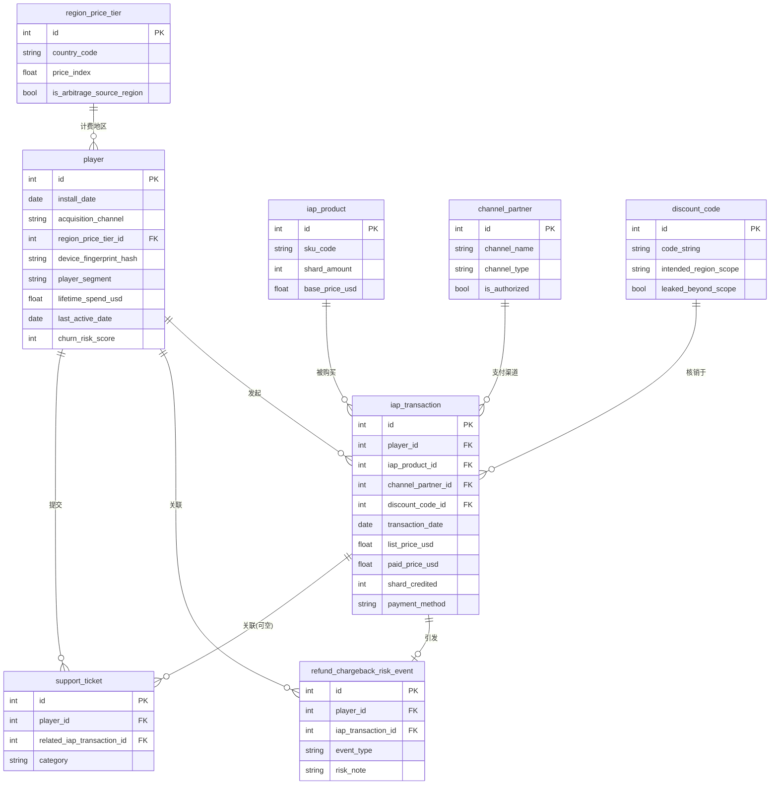
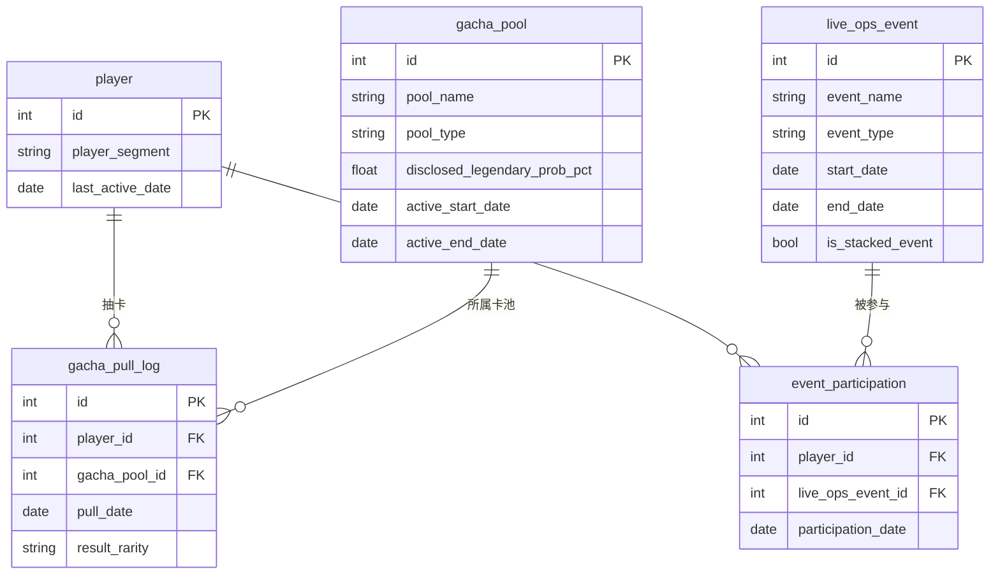

# Ember Realms Saga Player Economy & Third-Party Top-Up Channel Health Analysis: ER Document

> For business background, industry primer, and glossary, see
> `01-gaming_f2p_whale_monetization_medium_business_context.md`.
> This document covers data structure only.

## 1. Dataset Metadata

- **Complexity**: Medium
- **Table count**: 12
- **Total rows**: approximately 70,663 (excluding headers)
- **Foreign key relationships**: 13 declared foreign keys, plus 3 implicit range constraints that can't be expressed in DDL (see Section 5)
- **REFERENCE_DATE**: `2026-06-30` (consistent with the generator and SQL query documents)

## 2. Mermaid ER Diagram

The dataset splits into two relationship diagrams by business function: player/payment/monetization,
and gacha/Live-Ops events. `player` is the shared anchor and appears in both diagrams.

### 2.1 Players, Payments, and Monetization



### 2.2 Gacha and Live-Ops Events



## 3. Table-by-Table Description

### 1. channel_partner

Dimension table for in-app purchase payment channels. Each row is a payment channel that players
actually use when topping up: 2 official app stores (Apple's and Google's official IAP billing),
1 official web direct-purchase channel, 2 "officially authorized" regional billing partners
(common in markets like Southeast Asia and Latin America where official payment channel
penetration is low, formally contracted by the company), and 5 third-party "top-up agents" not
authorized by the company. The 5 rows with `is_authorized = false` are exactly the analytical
target of Q4 (third-party top-up / discount channel arbitrage).

**Columns**

| Column | Type | Constraint | Description |
|------|------|------|------|
| id | INTEGER | PK | Channel ID |
| channel_name | VARCHAR(80) | NOT NULL, UNIQUE | Channel name, e.g. "Apple App Store (IAP)" |
| channel_type | VARCHAR(30) | NOT NULL | `official_app_store` / `official_web` / `third_party_agent` |
| is_authorized | BOOLEAN | NOT NULL | Whether officially authorized by the company; the 5 unauthorized top-up agents are false |
| region_scope | VARCHAR(40) | NOT NULL | Geographic coverage served, e.g. "Southeast Asia" / "Global" |
| commission_rate_pct | NUMERIC(5,2) | Nullable | Only populated for official authorized regional partners; the commission rate the company pays them |
| onboarded_date | DATE | NOT NULL | Date this channel was onboarded |

**Sample data**

| id | channel_name | channel_type | is_authorized | region_scope |
|----|---------------|--------------|----------------|--------------|
| 1 | Apple App Store (IAP) | official_app_store | true | Global |
| 4 | SEA Regional Billing Partner | third_party_agent | true | Southeast Asia |
| 6 | Agent - SEA TopUp Hub | third_party_agent | false | Southeast Asia |

> **Scope note**: `channel_type = 'third_party_agent'` includes both officially authorized rows
> (`is_authorized = true`, 2 rows) and unauthorized rows (`is_authorized = false`, 5 rows). You
> cannot analyze the unauthorized top-up problem by grouping on `channel_type` alone — you must
> also check `is_authorized`.

### 2. region_price_tier

Dimension table for players' billing-region pricing coefficients. `price_index` is a conversion
factor relative to official US/Canada list prices (1.00 is the baseline), reflecting official
price differences across countries. The 6 regions with `is_arbitrage_source_region = true`
(Brazil, Turkey, Argentina, Philippines, India, Indonesia) have official prices notably lower than
the US/Canada, making them a common low-price sourcing origin for the top-up resale supply chain.

**Columns**

| Column | Type | Constraint | Description |
|------|------|------|------|
| id | INTEGER | PK | Region ID |
| country_code | VARCHAR(2) | NOT NULL, UNIQUE | ISO two-letter country code |
| country_name | VARCHAR(60) | NOT NULL | Full country/region name |
| currency_code | VARCHAR(3) | NOT NULL | Local currency code, for display purposes only |
| price_index | NUMERIC(4,2) | NOT NULL | Official price conversion factor relative to the US/Canada baseline (1.00) |
| is_arbitrage_source_region | BOOLEAN | NOT NULL | Whether this is a commonly known low-price arbitrage source region |

**Sample data**: United States (US, 1.00, false); Turkey (TR, 0.55, true); Argentina (AR, 0.50, true).

### 3. iap_product

Dimension table for the in-app purchase product catalog. From a $0.99 starter shard pack to a
$199.99 whale-tier bundle, `shard_amount` is the number of Aether Shards (the in-game currency)
credited upon purchase. Some subscription-type products (like Battle Pass Premium) don't directly
grant shards, so `shard_amount` is recorded as 0.

**Columns**

| Column | Type | Constraint | Description |
|------|------|------|------|
| id | INTEGER | PK | Product ID |
| sku_code | VARCHAR(30) | NOT NULL, UNIQUE | SKU code |
| product_name | VARCHAR(80) | NOT NULL | Product display name |
| product_category | VARCHAR(20) | NOT NULL | `currency_pack` / `bundle` / `subscription` |
| shard_amount | INTEGER | Nullable | Shards credited; subscription products may be 0 |
| base_price_usd | NUMERIC(8,2) | NOT NULL | Official US/Canada list price (USD); other regions must multiply by `region_price_tier.price_index` |

### 4. gacha_pool

Dimension table for gacha pools. `pool_type = 'standard'` denotes long-running, permanently open
pools, while `'limited_rateup'` denotes pools tied to a new character and open for only about 2
weeks. The four `disclosed_*_prob_pct` columns are the officially disclosed probabilities (the
four should sum to 100) — this is the "contract" that players see.

> **Key to Trap 2**: This table only records the officially **disclosed** probabilities. The
> pool's **actual** probability is not in this table — it must be reconstructed by grouping the
> real gacha pull results in `gacha_pull_log` by pool, then compared against the disclosed values
> in this table to surface the disclosure gap.

**Columns**

| Column | Type | Constraint | Description |
|------|------|------|------|
| id | INTEGER | PK | Pool ID |
| pool_name | VARCHAR(80) | NOT NULL, UNIQUE | Pool name |
| pool_type | VARCHAR(20) | NOT NULL | `standard` / `limited_rateup` |
| disclosed_common_prob_pct | NUMERIC(5,2) | NOT NULL | Officially disclosed Common drop rate (%) |
| disclosed_rare_prob_pct | NUMERIC(5,2) | NOT NULL | Officially disclosed Rare drop rate (%) |
| disclosed_epic_prob_pct | NUMERIC(5,2) | NOT NULL | Officially disclosed Epic drop rate (%) |
| disclosed_legendary_prob_pct | NUMERIC(5,2) | NOT NULL | Officially disclosed Legendary (highest rarity) drop rate (%) |
| active_start_date | DATE | NOT NULL | Pool opening date |
| active_end_date | DATE | Nullable | Pool closing date; null for permanent pools that stay open indefinitely |

**Sample data**: Of the 8 pools, `Standard Summon Pool`, `Starter Newbie Pool`, and
`Veteran Loyalty Pool` are permanent pools; `Ember Queen Rate-Up Banner`,
`Frostbound Knight Rate-Up Banner`, `Anniversary Celebration Banner`,
`Shadowfang Assassin Rate-Up Banner`, and `Golden Phoenix Rate-Up Banner` are the 5 limited pools.

### 5. discount_code

Dimension table for discount codes, 45 rows. `source_channel` distinguishes official
lifecycle-marketing email codes (`official_lifecycle_email`, 20 codes), influencer partnership
codes (`influencer_partnership`, 6 codes), and region-exclusive promo codes (`regional_promo`, 19
codes). Region-exclusive promo codes are meant to be used only in the countries specified by
`intended_region_scope`; 4 of them are flagged `leaked_beyond_scope = true`, representing
confirmed leakage and arbitrage use outside the target region.

**Columns**

| Column | Type | Constraint | Description |
|------|------|------|------|
| id | INTEGER | PK | Discount code ID |
| code_string | VARCHAR(20) | NOT NULL, UNIQUE | Discount code string |
| source_channel | VARCHAR(30) | NOT NULL | `official_lifecycle_email` / `influencer_partnership` / `regional_promo` |
| discount_pct | NUMERIC(5,2) | NOT NULL | Discount percentage |
| intended_region_scope | VARCHAR(40) | Nullable | Target region (country name); null for globally usable codes |
| leaked_beyond_scope | BOOLEAN | NOT NULL | Whether confirmed leaked for arbitrage (only 4 rows within `regional_promo` are true) |
| issued_date | DATE | NOT NULL | Issue date |
| max_redemptions | INTEGER | NOT NULL | Maximum redemption cap |

> **Scope note**: `leaked_beyond_scope = true` only ever appears on rows where
> `source_channel = 'regional_promo'`. Rows where `intended_region_scope IS NULL` (email marketing
> codes / influencer codes) don't fit the concept of "out-of-scope redemption" — when analyzing
> leakage, filter to `intended_region_scope IS NOT NULL` first.

### 6. live_ops_event

Dimension table for the Live-Ops event calendar, 30 events. `is_stacked_event = true` flags a
"back-to-back" event that starts less than 7 days after the previous event ended — this is the
core grouping field for the Q3 (artificial event engagement) analysis, computed explicitly by the
generator based on the event calendar.

**Columns**

| Column | Type | Constraint | Description |
|------|------|------|------|
| id | INTEGER | PK | Event ID |
| event_name | VARCHAR(80) | NOT NULL, UNIQUE | Event name |
| event_type | VARCHAR(30) | NOT NULL | `login_bonus` / `double_drop_rate` / `flash_sale` / `rate_up_banner_tie_in` / `anniversary` |
| start_date | DATE | NOT NULL | Event start date |
| end_date | DATE | NOT NULL | Event end date |
| is_stacked_event | BOOLEAN | NOT NULL | Whether the gap since the previous event's end date is less than 7 days |

### 7. player

Player master table, 5,000 rows, the core dimension of the whole database. `player_segment`
divides players precisely into four tiers: whale (50 players), dolphin (150), minnow (300), and
non_payer (4,500) — this is the grouping field for the Q1 (whale dependency) analysis. In
`device_fingerprint_hash`, 48 players (10 groups of 4-5 each) share the same hash value,
simulating groups of alt accounts registered in bulk from the same device/environment — a key
lead for the Q5 analysis. `lifetime_spend_usd`, `last_active_date`, and `churn_risk_score` are
snapshot fields that were already back-filled from the downstream behavioral tables at generation
time; they don't need to be re-aggregated.

**Columns**

| Column | Type | Constraint | Description |
|------|------|------|------|
| id | INTEGER | PK | Player ID |
| install_date | DATE | NOT NULL | Install/registration date |
| acquisition_channel | VARCHAR(40) | NOT NULL | Acquisition channel (organic / various ad networks / influencer partnership); a dimension independent from the payment channel `channel_partner` |
| region_price_tier_id | INTEGER | FK -> region_price_tier.id | Player's billing region |
| device_fingerprint_hash | VARCHAR(64) | NOT NULL | Device fingerprint hash; identical hashes indicate suspected registration from the same device |
| player_segment | VARCHAR(20) | NOT NULL | `whale` / `dolphin` / `minnow` / `non_payer` |
| lifetime_spend_usd | NUMERIC(10,2) | NOT NULL | Cumulative lifetime amount actually paid as of REFERENCE_DATE, equal to the sum of all this player's `iap_transaction.paid_price_usd` |
| last_active_date | DATE | NOT NULL | The latest date this player appears across any behavioral table (transactions/gacha pulls/event participation/support tickets); equals install_date if there is no behavioral record |
| churn_risk_score | INTEGER | NOT NULL | Churn risk score from 0-100; higher means longer since being active relative to REFERENCE_DATE, calculation method in Section 5 |

**Foreign key**: `region_price_tier_id` -> `region_price_tier.id` (N:1).

**Sample data**

| id | player_segment | region_price_tier_id | lifetime_spend_usd | last_active_date | churn_risk_score |
|----|-----------------|------------------------|----------------------|---------------------|---------------------|
| 58 | whale | 1 (US) | 6974.21 | 2026-06-30 | 0 |
| 1 | non_payer | 8 (PH) | 0.00 | 2025-10-16 | 100 |

### 8. iap_transaction

The in-app purchase transaction fact table, approximately 17,673 rows, the most important revenue
fact table in the database. Each row is one real in-app purchase: which SKU was bought, which
payment channel was used, whether a discount code was redeemed, and the list price
(`list_price_usd`, converted using the pricing coefficient of the player's region) versus the
actual price paid (`paid_price_usd`). The gap between `list_price_usd` and `paid_price_usd` is
central to the Q4 analysis of third-party top-up discounting and discount code effectiveness.

**Columns**

| Column | Type | Constraint | Description |
|------|------|------|------|
| id | INTEGER | PK | Transaction ID |
| player_id | INTEGER | FK -> player.id | Purchasing player |
| iap_product_id | INTEGER | FK -> iap_product.id | Product purchased |
| channel_partner_id | INTEGER | FK -> channel_partner.id | Payment channel used |
| discount_code_id | INTEGER | FK -> discount_code.id, nullable | Discount code redeemed; null if no code was used |
| transaction_date | DATE | NOT NULL | Transaction date |
| list_price_usd | NUMERIC(8,2) | NOT NULL | USD amount converted using the player's regional official list price |
| paid_price_usd | NUMERIC(8,2) | NOT NULL | USD amount actually recognized as company revenue |
| shard_credited | INTEGER | NOT NULL | Number of shards credited |
| payment_method | VARCHAR(20) | NOT NULL | `apple_pay` / `google_pay` / `credit_card` / `gift_card` / `agent_transfer` |

**Foreign keys**: `player_id` -> `player.id` (N:1); `iap_product_id` -> `iap_product.id` (N:1);
`channel_partner_id` -> `channel_partner.id` (N:1); `discount_code_id` ->
`discount_code.id` (N:1, nullable).

**Sample data**

| id | player_id | channel_partner_id | list_price_usd | paid_price_usd | payment_method |
|----|-----------|----------------------|-------------------|--------------------|-----------------|
| 1 | 11 | 1 (Apple App Store) | 4.99 | 4.93 | apple_pay |
| 3 | 11 | 3 (Official Web Store) | 4.99 | 5.02 | credit_card |

> The same player (id=11) made two transactions through different payment channels, with the paid
> price fluctuating slightly around the list price (roughly ±3%) — normal day-to-day noise across
> channels. In addition, the generator deliberately anchors about 12% of transactions to fall
> within a "stacked event" window, and for that anchored subset (regardless of payment channel),
> it multiplies the paid price by a markup factor (see Section 4, "Stacked-event markup") — this
> is also where Trap 4's finding of official-channel average price reaching 106%-110% of list
> price comes from. For transactions through unauthorized top-up channels
> (`channel_partner_id` belonging to one of the 5 `is_authorized=false` channels), `paid_price_usd`
> remains systematically and noticeably below `list_price_usd` on top of this (see Trap 4 in
> Section 5).

### 9. gacha_pull_log

The gacha pull log fact table, approximately 39,672 rows. Each row is the result of one single
pull or ten-pull by a player. `result_rarity` is a real outcome sampled according to each pool's
**actual** probability (not the disclosed probability in the `gacha_pool` table) — this table is
the only data source from which the "actual probability" can be reverse-engineered.

**Columns**

| Column | Type | Constraint | Description |
|------|------|------|------|
| id | INTEGER | PK | Pull record ID |
| player_id | INTEGER | FK -> player.id | Player who pulled |
| gacha_pool_id | INTEGER | FK -> gacha_pool.id | Pool the pull belongs to |
| pull_date | DATE | NOT NULL | Pull date |
| pull_source | VARCHAR(10) | NOT NULL | `single` (single pull) / `ten_pull` (ten-pull) |
| shard_cost | INTEGER | NOT NULL | Shards spent (150 for a single pull, 1,350 for a ten-pull) |
| result_rarity | VARCHAR(20) | NOT NULL | `Common` / `Rare` / `Epic` / `Legendary` |
| result_character_name | VARCHAR(60) | NOT NULL | Display name of the character pulled (for display purposes only) |

**Foreign keys**: `player_id` -> `player.id` (N:1); `gacha_pool_id` -> `gacha_pool.id` (N:1).

> **Scope note**: Any `pull_date` can only fall within a pool that "existed and was open" at that
> time — limited pools are only selectable between their `active_start_date` and
> `active_end_date`. The DDL doesn't enforce this rule, but the generator guarantees it holds.

### 10. event_participation

The Live-Ops event participation fact table, approximately 6,983 rows. Each row records one
player's participation in a given event, used to measure the relationship between short-term
event uplift (`shard_spent_during_event`) and subsequent retention.

**Columns**

| Column | Type | Constraint | Description |
|------|------|------|------|
| id | INTEGER | PK | Participation record ID |
| player_id | INTEGER | FK -> player.id | Participating player |
| live_ops_event_id | INTEGER | FK -> live_ops_event.id | Event participated in |
| participation_date | DATE | NOT NULL | Participation date, falling within the event's [start_date, end_date] range |
| shard_spent_during_event | INTEGER | Nullable | Incremental shard spend during the event; often null for non-paying players |
| completed_flag | BOOLEAN | NOT NULL | Whether the event milestone was completed |

**Foreign keys**: `player_id` -> `player.id` (N:1); `live_ops_event_id` -> `live_ops_event.id` (N:1).

### 11. refund_chargeback_risk_event

The refund/chargeback/suspected top-up ring risk event fact table, 500 rows. Each row is
triggered by a specific `iap_transaction` (the risk event occurs on or after the transaction date,
with the vast majority occurring 1-21 days later, capping rule in Section 4). `risk_note` labels
the triggering cause category, and this is the core evidence table shared by Q4 and Q5.

**Columns**

| Column | Type | Constraint | Description |
|------|------|------|------|
| id | INTEGER | PK | Risk event ID |
| player_id | INTEGER | FK -> player.id | Associated player |
| iap_transaction_id | INTEGER | FK -> iap_transaction.id | Associated specific transaction |
| event_type | VARCHAR(40) | NOT NULL | `refund_requested` / `chargeback_filed` / `account_flagged_reseller_activity` |
| event_date | DATE | NOT NULL | Event date (1-21 days after the transaction date, capped at the REFERENCE_DATE baseline of 2026-06-30) |
| amount_usd | NUMERIC(8,2) | NOT NULL | Amount involved (equal to the original transaction's paid_price_usd) |
| resolution_status | VARCHAR(20) | NOT NULL | `approved` / `denied` / `pending` |
| risk_note | VARCHAR(40) | NOT NULL | `genuine_dissatisfaction` / `agent_sourced_dispute` / `billing_error` / `multi_account_cluster` |

**Foreign keys**: `player_id` -> `player.id` (N:1); `iap_transaction_id` ->
`iap_transaction.id` (N:1, each transaction triggers at most one risk event).

### 12. support_ticket

The customer support ticket fact table, 720 rows. Covers categories including gacha odds
complaints, billing disputes, ban appeals, refund follow-ups, and general bug reports.
`related_iap_transaction_id` is linked to a specific transaction with roughly 70% probability, and
only for billing-related tickets.

**Columns**

| Column | Type | Constraint | Description |
|------|------|------|------|
| id | INTEGER | PK | Ticket ID |
| player_id | INTEGER | FK -> player.id | Submitting player |
| related_iap_transaction_id | INTEGER | FK -> iap_transaction.id, nullable | Related transaction (only possible for billing-related tickets) |
| ticket_date | DATE | NOT NULL | Ticket submission date |
| category | VARCHAR(30) | NOT NULL | `gacha_odds_complaint` / `billing_dispute` / `account_banned_appeal` / `general_bug` / `refund_request_followup` |
| priority | VARCHAR(10) | NOT NULL | `low` / `medium` / `high` |
| resolution_time_hours | NUMERIC(6,1) | NOT NULL | Ticket resolution time (hours) |
| csat_score | INTEGER | Nullable | CSAT score 1-5; about 30% of tickets receive no rating and are left null |

**Foreign keys**: `player_id` -> `player.id` (N:1); `related_iap_transaction_id` ->
`iap_transaction.id` (N:1, nullable).

## 4. Data Generation Rules

### Chronological order

- `player.install_date` falls between `[2025-01-06, 2026-06-30]`.
- All of a given player's behavioral records (`iap_transaction.transaction_date` /
  `gacha_pull_log.pull_date` / `event_participation.participation_date` /
  `support_ticket.ticket_date`) never precede that player's `install_date`, nor fall after that
  player's "final activity cutoff date" (an internal generator concept, not materialized as a
  table column, but which determines the upper bound of `last_active_date`).
- `refund_chargeback_risk_event.event_date` falls 1 to 21 days after the associated transaction's
  `transaction_date`, but is uniformly capped at the baseline date `REFERENCE_DATE` (2026-06-30) —
  the analytical framing is a snapshot "as of the baseline date," and no risk event should appear
  later than the snapshot date. The vast majority of events still strictly postdate the
  transaction date; only a very small number of transactions whose transaction date happens to
  fall exactly on the baseline date (2026-06-30) have their risk event capped to that same day,
  appearing as `event_date = transaction_date` (about 3 such transactions in this dataset).
- `player.last_active_date` equals the latest date this player appears across the four behavioral
  fact tables, never later than `2026-06-30`.

### Referential integrity (range constraints DDL can't express)

- `gacha_pull_log.pull_date` must fall within the open window of the pool referenced by its
  `gacha_pool_id`: permanent pools require `pull_date >= active_start_date`; limited pools
  require `active_start_date <= pull_date <= active_end_date`.
- `discount_code.leaked_beyond_scope = true` only appears on rows where
  `source_channel = 'regional_promo'`.
- When `iap_transaction.discount_code_id` is non-null, its `paid_price_usd` already reflects the
  discount applied — it should not be manually discounted again.

### Value ranges

- `region_price_tier.price_index`: 0.50 (Argentina) to 1.00 (US/Canada).
- `iap_product.base_price_usd`: $0.99 to $199.99.
- `gacha_pool.disclosed_legendary_prob_pct`: 2.0% to 5.0%.
- `player.churn_risk_score`: 0-100, integer.

### Computed fields

- **Stacked-event markup**: The generator gives each transaction roughly a 12% chance of being
  deliberately anchored to fall within the window of an `is_stacked_event = true` event, and for
  this anchored subset (actually about 8%-9% of all transactions), it multiplies `paid_price_usd`
  by the markup factor `STACKED_EVENT_SPEND_MULTIPLIER = 1.8` — a modeling simplification that
  compresses "temporarily elevated average spend/frequency during events" into a single per-
  transaction markup factor. The markup doesn't distinguish by `channel_partner.channel_type` or
  `is_authorized` — if a transaction through an unauthorized top-up channel gets anchored, it
  first receives the top-up discount, then this markup factor is layered on top. This rule is the
  true source of Trap 4's "official-channel average price of 106%-110%," and is also the direct
  revenue-side manifestation of Trap 3 (artificial event engagement).
  Two easily conflated figures should be kept distinct here: transactions that are "anchored and
  marked up" account for only about 8%-9%; transactions whose "transaction date simply happens to
  fall within any stacked window" (including a large number that are not marked up and simply
  landed in the window by chance) account for about 22% — the latter is the grouping basis Query 7
  uses with `EXISTS` when computing stacked-window ARPPU. The two figures are not the same thing.
- `player.lifetime_spend_usd` = `SUM(iap_transaction.paid_price_usd WHERE player_id = this player)`.
- `player.last_active_date` = `MAX(this player's latest date across iap_transaction/gacha_pull_log/event_participation/support_ticket)`, equal to `install_date` if there are no records.
- `player.churn_risk_score` = `MIN(100, ROUND(100 * (days between REFERENCE_DATE and last_active_date) / segment normalization baseline))`, where the baseline is set according to the typical retention window for each `player_segment` — whale has the largest baseline (score rises slowest), non_payer has the smallest baseline (score rises fastest).
- `iap_transaction.list_price_usd` = `iap_product.base_price_usd * region_price_tier.price_index` (rounded to the cent).

### Distribution patterns (observed magnitudes in the generated data)

- Player segment counts are exactly fixed: whale 50 / dolphin 150 / minnow 300 / non_payer 4,500 (1% / 3% / 6% / 90% of the total sample).
- Payment channel distribution: official app stores and web combined account for about 96%; officially authorized regional billing partners about 1.2%; unauthorized top-up agents about 2.8%.
- Baseline refund/chargeback risk event rates: about 2.2%-2.7% for official channels; about 4.2% for officially authorized billing partners; about 20.5% for unauthorized top-up agents; about 47.4% for accounts belonging to suspected fraud rings sharing a device fingerprint.

### Embedded business traps (mapping to SQL queries)

| Trap | Magnitude (observed in the generated data) | Corresponding SQL queries |
|------|---------------------------|----------------|
| Trap 1: Whale dependency | The top 1% of players (whale, 50 players) contribute about 65.8% of IAP revenue; dolphin (3%) about 28.4%; minnow (6%) about 5.7%; non_payer (90%) contributes 0% | Query 1, Query 2, Query 3, Query 20 |
| Trap 2: Gacha probability disclosure gap | Among the 5 limited pools, 3 (Ember Queen / Frostbound Knight / Anniversary Celebration) have actual Legendary drop rates 1.6-2.3 percentage points lower than disclosed; the other 2 (Shadowfang Assassin / Golden Phoenix) and all 3 permanent pools have actual-vs-disclosed deviations within ±0.5 percentage points | Query 4, Query 5, Query 20 |
| Trap 3: Live-Ops artificial event engagement | Among players who participated in at least 1 stacked event: for the control group who participated in only 1 stacked event, about 34.5% still show activity 30 days after the event ends; for players who participated in >= 2 stacked events, that share drops to about 23.6%, roughly 11 percentage points lower | Query 6, Query 7, Query 8, Query 17 |
| Trap 4: Top-up/discount channel arbitrage | Transactions through unauthorized top-up agents pay about 71.4% of the official list price (official channels run about 106%-110%, pushed up by the event-window markup); the refund/chargeback rate for unauthorized top-up agent transactions is about 20.5% (versus about 2.2%-2.7% for official channels); of the 4 leaked discount codes, about 72.1% of redemptions occur outside the target region (versus about 5.7% for normal regional codes) | Query 9, Query 10, Query 11, Query 12, Query 19, Query 20 |
| Trap 5: Refund fraud rings (device fingerprint) | The 48 players sharing a device fingerprint (10 groups of 4-5 each) have a refund/chargeback rate of about 47.4%, nearly 19x the baseline for other players (about 2.5%) | Query 12, Query 13, Query 14, Query 20 |

## 5. Faker Strategy

| Field pattern | Faker method / sampling strategy | Notes |
|----------|--------------------------|------|
| result_character_name | `fake.first_name()` concatenated with the rarity | Display purposes only, doesn't affect any business logic |
| device_fingerprint_hash | `hashlib.sha256` digest | The 48 fraud ring members share the same digest by group (10 groups of 4-5 each); all other players get a unique one |
| player_segment | Exact headcount list (50/150/300/4500) shuffled and assigned in order | Ensures statements like "top 1%" hold exactly in the sample, rather than relying on probabilistic sampling |
| acquisition_channel / country_code | `random.choices` weighted sampling | Weights reflect business distributions such as "55% falling in the US/Canada/UK/Germany, 45% in high-arbitrage regions" |
| result_rarity | Weighted sampling by each pool's actual probability (not the disclosed probability) | The gap between the two is the core of Trap 2 |

## 6. File Manifest (Topological Order)

| # | Filename | Table | Rows | Dependencies |
|---|--------|-----|------|------|
| 01 | 01_channel_partner.tsv | channel_partner | 10 | None |
| 02 | 02_region_price_tier.tsv | region_price_tier | 10 | None |
| 03 | 03_iap_product.tsv | iap_product | 12 | None |
| 04 | 04_gacha_pool.tsv | gacha_pool | 8 | None |
| 05 | 05_discount_code.tsv | discount_code | 45 | None |
| 06 | 06_live_ops_event.tsv | live_ops_event | 30 | None |
| 07 | 07_player.tsv | player | 5,000 | region_price_tier |
| 08 | 08_iap_transaction.tsv | iap_transaction | 17,673 | player, iap_product, channel_partner, discount_code |
| 09 | 09_gacha_pull_log.tsv | gacha_pull_log | 39,672 | player, gacha_pool |
| 10 | 10_event_participation.tsv | event_participation | 6,983 | player, live_ops_event |
| 11 | 11_refund_chargeback_risk_event.tsv | refund_chargeback_risk_event | 500 | player, iap_transaction |
| 12 | 12_support_ticket.tsv | support_ticket | 720 | player, iap_transaction |

## 7. SQLite DDL

```sql
CREATE TABLE channel_partner (
	id INTEGER NOT NULL,
	channel_name VARCHAR(80) NOT NULL,
	channel_type VARCHAR(30) NOT NULL,
	is_authorized BOOLEAN NOT NULL,
	region_scope VARCHAR(40) NOT NULL,
	commission_rate_pct NUMERIC(5, 2),
	onboarded_date DATE NOT NULL,
	PRIMARY KEY (id),
	UNIQUE (channel_name)
);

CREATE TABLE region_price_tier (
	id INTEGER NOT NULL,
	country_code VARCHAR(2) NOT NULL,
	country_name VARCHAR(60) NOT NULL,
	currency_code VARCHAR(3) NOT NULL,
	price_index NUMERIC(4, 2) NOT NULL,
	is_arbitrage_source_region BOOLEAN NOT NULL,
	PRIMARY KEY (id),
	UNIQUE (country_code)
);

CREATE TABLE iap_product (
	id INTEGER NOT NULL,
	sku_code VARCHAR(30) NOT NULL,
	product_name VARCHAR(80) NOT NULL,
	product_category VARCHAR(20) NOT NULL,
	shard_amount INTEGER,
	base_price_usd NUMERIC(8, 2) NOT NULL,
	PRIMARY KEY (id),
	UNIQUE (sku_code)
);

CREATE TABLE gacha_pool (
	id INTEGER NOT NULL,
	pool_name VARCHAR(80) NOT NULL,
	pool_type VARCHAR(20) NOT NULL,
	disclosed_common_prob_pct NUMERIC(5, 2) NOT NULL,
	disclosed_rare_prob_pct NUMERIC(5, 2) NOT NULL,
	disclosed_epic_prob_pct NUMERIC(5, 2) NOT NULL,
	disclosed_legendary_prob_pct NUMERIC(5, 2) NOT NULL,
	active_start_date DATE NOT NULL,
	active_end_date DATE,
	PRIMARY KEY (id),
	UNIQUE (pool_name)
);

CREATE TABLE discount_code (
	id INTEGER NOT NULL,
	code_string VARCHAR(20) NOT NULL,
	source_channel VARCHAR(30) NOT NULL,
	discount_pct NUMERIC(5, 2) NOT NULL,
	intended_region_scope VARCHAR(40),
	leaked_beyond_scope BOOLEAN NOT NULL,
	issued_date DATE NOT NULL,
	max_redemptions INTEGER NOT NULL,
	PRIMARY KEY (id),
	UNIQUE (code_string)
);

CREATE TABLE live_ops_event (
	id INTEGER NOT NULL,
	event_name VARCHAR(80) NOT NULL,
	event_type VARCHAR(30) NOT NULL,
	start_date DATE NOT NULL,
	end_date DATE NOT NULL,
	is_stacked_event BOOLEAN NOT NULL,
	PRIMARY KEY (id),
	UNIQUE (event_name)
);

CREATE TABLE player (
	id INTEGER NOT NULL,
	install_date DATE NOT NULL,
	acquisition_channel VARCHAR(40) NOT NULL,
	region_price_tier_id INTEGER NOT NULL,
	device_fingerprint_hash VARCHAR(64) NOT NULL,
	player_segment VARCHAR(20) NOT NULL,
	lifetime_spend_usd NUMERIC(10, 2) NOT NULL,
	last_active_date DATE NOT NULL,
	churn_risk_score INTEGER NOT NULL,
	PRIMARY KEY (id),
	FOREIGN KEY(region_price_tier_id) REFERENCES region_price_tier (id)
);

CREATE TABLE iap_transaction (
	id INTEGER NOT NULL,
	player_id INTEGER NOT NULL,
	iap_product_id INTEGER NOT NULL,
	channel_partner_id INTEGER NOT NULL,
	discount_code_id INTEGER,
	transaction_date DATE NOT NULL,
	list_price_usd NUMERIC(8, 2) NOT NULL,
	paid_price_usd NUMERIC(8, 2) NOT NULL,
	shard_credited INTEGER NOT NULL,
	payment_method VARCHAR(20) NOT NULL,
	PRIMARY KEY (id),
	FOREIGN KEY(player_id) REFERENCES player (id),
	FOREIGN KEY(iap_product_id) REFERENCES iap_product (id),
	FOREIGN KEY(channel_partner_id) REFERENCES channel_partner (id),
	FOREIGN KEY(discount_code_id) REFERENCES discount_code (id)
);

CREATE TABLE gacha_pull_log (
	id INTEGER NOT NULL,
	player_id INTEGER NOT NULL,
	gacha_pool_id INTEGER NOT NULL,
	pull_date DATE NOT NULL,
	pull_source VARCHAR(10) NOT NULL,
	shard_cost INTEGER NOT NULL,
	result_rarity VARCHAR(20) NOT NULL,
	result_character_name VARCHAR(60) NOT NULL,
	PRIMARY KEY (id),
	FOREIGN KEY(player_id) REFERENCES player (id),
	FOREIGN KEY(gacha_pool_id) REFERENCES gacha_pool (id)
);

CREATE TABLE event_participation (
	id INTEGER NOT NULL,
	player_id INTEGER NOT NULL,
	live_ops_event_id INTEGER NOT NULL,
	participation_date DATE NOT NULL,
	shard_spent_during_event INTEGER,
	completed_flag BOOLEAN NOT NULL,
	PRIMARY KEY (id),
	FOREIGN KEY(player_id) REFERENCES player (id),
	FOREIGN KEY(live_ops_event_id) REFERENCES live_ops_event (id)
);

CREATE TABLE refund_chargeback_risk_event (
	id INTEGER NOT NULL,
	player_id INTEGER NOT NULL,
	iap_transaction_id INTEGER NOT NULL,
	event_type VARCHAR(40) NOT NULL,
	event_date DATE NOT NULL,
	amount_usd NUMERIC(8, 2) NOT NULL,
	resolution_status VARCHAR(20) NOT NULL,
	risk_note VARCHAR(40) NOT NULL,
	PRIMARY KEY (id),
	FOREIGN KEY(player_id) REFERENCES player (id),
	FOREIGN KEY(iap_transaction_id) REFERENCES iap_transaction (id)
);

CREATE TABLE support_ticket (
	id INTEGER NOT NULL,
	player_id INTEGER NOT NULL,
	related_iap_transaction_id INTEGER,
	ticket_date DATE NOT NULL,
	category VARCHAR(30) NOT NULL,
	priority VARCHAR(10) NOT NULL,
	resolution_time_hours NUMERIC(6, 1) NOT NULL,
	csat_score INTEGER,
	PRIMARY KEY (id),
	FOREIGN KEY(player_id) REFERENCES player (id),
	FOREIGN KEY(related_iap_transaction_id) REFERENCES iap_transaction (id)
);
```
