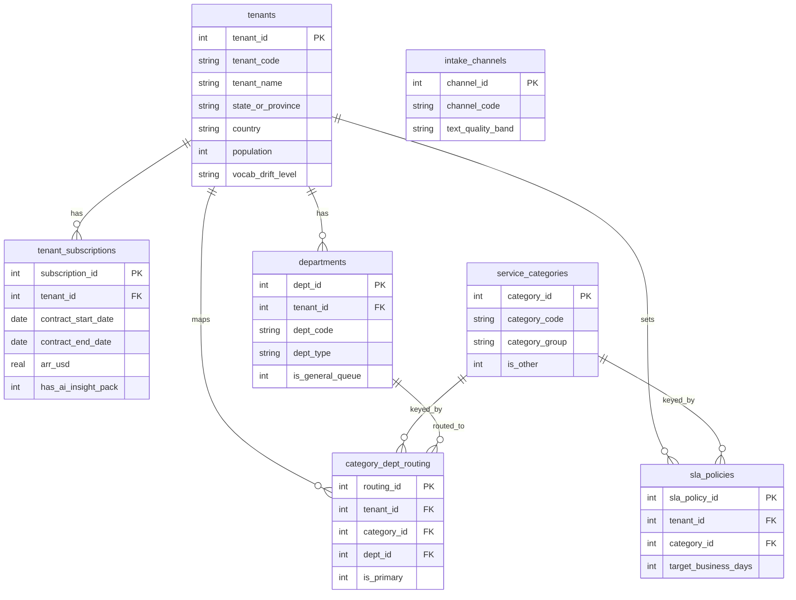
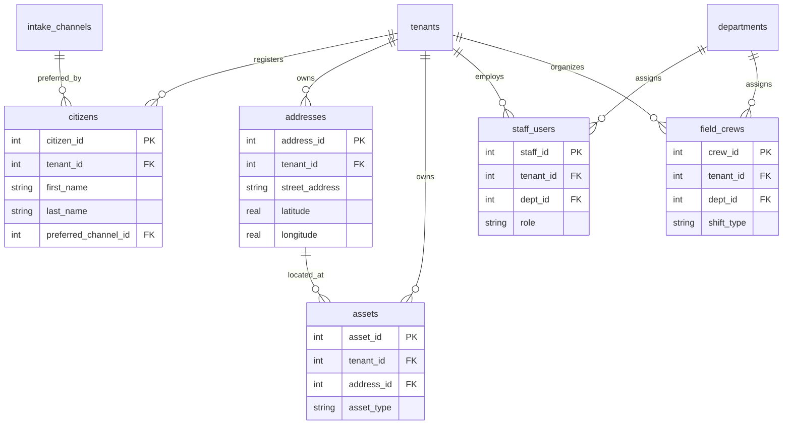
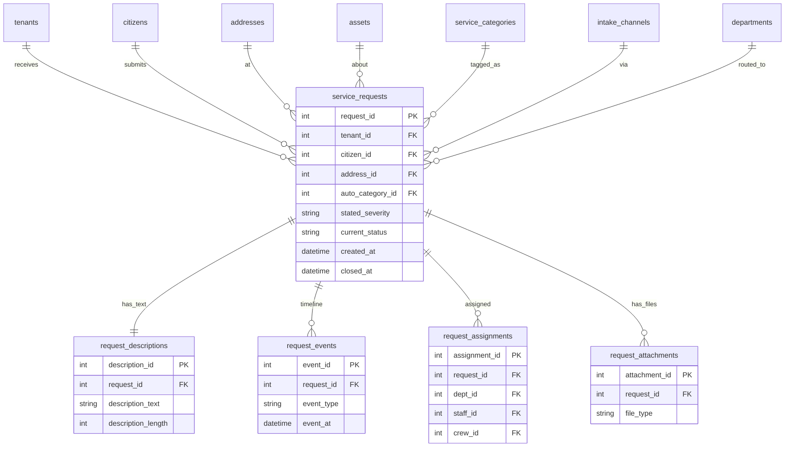
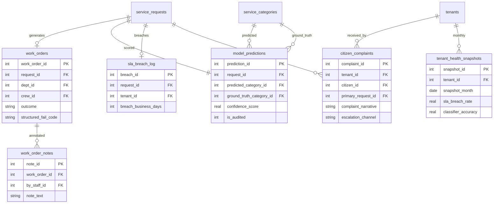

# CityPulse 311 数据集 ER 文档

业务背景, 行业科普, 术语表请见 `govtech_saas_service_request_intelligence_large_business_context-cn.md`。本文档只描述数据结构, 字段含义, 生成规则, 以及内嵌的业务陷阱契约。

---

## 1. 数据集元信息

复杂度等级是 Large。表数量 23 张, 总行数大约 1000 万。FK 关系大约 38 条, 其中 3 条是非 DDL 强制的"业务级约束" (会在表的 scope notes 里点出, 由 generator 在采样时遵守)。

`REFERENCE_DATE = 2026-06-01`, 也就是说所有"今天", "本月", "上季度", "trailing 12 months"在 SQL 中都按这个字面值计算, 不用 `DATE('now')`。数据时间窗口是 2023-06-01 到 2026-06-01, 共 36 个月。

23 张表按业务域分成 4 个 cluster, 后面的 Mermaid 图也分 4 张画:

- 租户与配置 cluster (7 张): `intake_channels`, `service_categories`, `tenants`, `tenant_subscriptions`, `departments`, `sla_policies`, `category_dept_routing`
- 居民, 地址, 人员 cluster (5 张): `citizens`, `addresses`, `assets`, `staff_users`, `field_crews`
- 服务请求核心 cluster (5 张): `service_requests`, `request_descriptions`, `request_events`, `request_assignments`, `request_attachments`
- 工单与下游产物 cluster (6 张): `work_orders`, `work_order_notes`, `model_predictions`, `sla_breach_log`, `citizen_complaints`, `tenant_health_snapshots`

---

## 2. Mermaid ER 图 (按 cluster 分块)

### 2.1 租户与配置 cluster



### 2.2 居民, 地址, 人员 cluster



### 2.3 服务请求核心 cluster



### 2.4 工单与下游产物 cluster



---

## 3. 表逐张说明

### 3.1 intake_channels

CityPulse 平台支持的 6 个居民提交渠道枚举表。每条记录代表一个提交渠道, 同时记录该渠道天然的"文本质量带", 用于后续分析中解释为什么 IVR 渠道的分类准确率天然低 (语音转文字损失加上短文本)。这张表的内容跨租户共享, 不按租户隔离。

| 列名 | 类型 | 约束 | 说明 |
|------|------|------|------|
| channel_id | INTEGER | PK | 自增主键 |
| channel_code | TEXT | UNIQUE NOT NULL | 短代码: web, mobile_app, ivr, social, email, walk_in |
| channel_name | TEXT | NOT NULL | 友好名称 |
| text_quality_band | TEXT | NOT NULL | 文本质量: high, medium, low |
| typical_severity_accuracy | REAL | NOT NULL | 该渠道居民勾选严重度与文本暗示的一致率 (0 到 1), 仅参考 |

样例行:

| channel_id | channel_code | channel_name | text_quality_band | typical_severity_accuracy |
|------------|--------------|--------------|---------------------|----------------------------|
| 1 | web | Web Portal | high | 0.88 |
| 2 | mobile_app | Mobile App | high | 0.86 |
| 3 | ivr | Phone IVR | low | 0.72 |

### 3.2 service_categories

平台共用的请求类别字典, 67 行。每条记录是一个细分类别 (pothole, streetlight_out, illegal_dumping, abandoned_vehicle, noise_complaint, ...), 并且归属到一个 category_group (Streets, Sanitation, Parks, Code, Utilities, Animal, Noise, Other)。其中恰好 1 条记录 `category_code = 'other_uncategorized'` 是兜底类, `is_other = 1`, 平台在模型置信度低于阈值时把请求落到这条上, category_id = 80 (序号留位预留扩展, 不连续)。

> 注意: 业务上"Other 类"恰好且只有 1 行, 由 `is_other = 1` 标识。这是 trap 1 ("Other 分类漂移") 的入口标签。

| 列名 | 类型 | 约束 | 说明 |
|------|------|------|------|
| category_id | INTEGER | PK | |
| category_code | TEXT | UNIQUE NOT NULL | 短代码 |
| category_name | TEXT | NOT NULL | 友好名称 |
| category_group | TEXT | NOT NULL | 大类: Streets, Sanitation, Parks, Code, Utilities, Animal, Noise, Other |
| default_priority | TEXT | NOT NULL | low, medium, high, emergency |
| is_other | INTEGER | NOT NULL DEFAULT 0 | 1 表示这是兜底 Other 类 |

样例行:

| category_id | category_code | category_name | category_group | default_priority | is_other |
|-------------|------------------|------------------|----------------|-----------------|----------|
| 1 | pothole | Pothole | Streets | medium | 0 |
| 4 | streetlight_out | Streetlight Out | Utilities | medium | 0 |
| 80 | other_uncategorized | Other / Uncategorized | Other | low | 1 |

### 3.3 tenants

CityPulse 的客户城市或县, 120 行。每条记录是一个签了合同的市政机构。`vocab_drift_level` 字段用来标注该城市的"语言特殊性", 取值 low/medium/high; high 的城市 (大约 10 个) 是 trap 5 ("租户级模型精度差异") 的标的, 包括 Quebec 法语城市 (Montreal, Quebec City, Laval, Sherbrooke), 以及深南方俚语较重的城市 (New Orleans, Mobile, Birmingham, Jackson)。

| 列名 | 类型 | 约束 | 说明 |
|------|------|------|------|
| tenant_id | INTEGER | PK | |
| tenant_code | TEXT | UNIQUE NOT NULL | 短 slug, 例: austin_tx |
| tenant_name | TEXT | NOT NULL | City of Austin |
| state_or_province | TEXT | NOT NULL | TX, ON, QC, CA, ... |
| country | TEXT | NOT NULL | US 或 CA |
| population | INTEGER | NOT NULL | 实际人口 (5 万到 80 万) |
| size_tier | TEXT | NOT NULL | small (5w to 15w), medium (15w to 40w), large (>=40w, 不封顶; 旗舰大城如 Austin 约 98w) |
| timezone | TEXT | NOT NULL | America/Chicago 等 |
| vocab_drift_level | TEXT | NOT NULL | low, medium, high |
| has_french_vocab | INTEGER | NOT NULL DEFAULT 0 | 1 表示 Quebec 城市, 触发法语混杂 |
| launched_on | DATE | NOT NULL | CityPulse 在该城市上线日期 |

样例行:

| tenant_id | tenant_code | tenant_name | state | country | population | size_tier | vocab_drift_level | has_french_vocab |
|-----------|----------------|-------------------------|-------|---------|------------|------------|--------------------|-------------------|
| 12 | austin_tx | City of Austin | TX | US | 980000 | large | low | 0 |
| 47 | quebec_qc | Ville de Québec | QC | CA | 540000 | large | high | 1 |
| 88 | burlington_vt | City of Burlington | VT | US | 44000 | small | low | 0 |

### 3.4 tenant_subscriptions

每个 tenant 的当期合同记录, 120 行 (假设每个 tenant 只有一条 active 合同, 不展开多条续约历史以控制行数)。这张表里的 `has_ai_insight_pack` 标志是 trap 1 和 trap 5 故事的商业根, 因为只有装了这个模块的客户才用 NLP 分类器。

> 业务级约束 (DDL 不强制): 每个 tenant 在任何时点至少有一条 `is_active = 1` 的订阅。Generator 保证这点。

| 列名 | 类型 | 约束 | 说明 |
|------|------|------|------|
| subscription_id | INTEGER | PK | |
| tenant_id | INTEGER | FK tenants(tenant_id) NOT NULL | |
| contract_start_date | DATE | NOT NULL | |
| contract_end_date | DATE | NOT NULL | |
| arr_usd | REAL | NOT NULL | 年度合同金额 |
| has_ai_insight_pack | INTEGER | NOT NULL | 1 = 启用了 NLP 模块 |
| has_field_mobile_pack | INTEGER | NOT NULL | |
| has_analytics_pack | INTEGER | NOT NULL | |
| is_active | INTEGER | NOT NULL | 1 = 当前 active |

样例行:

| subscription_id | tenant_id | contract_start_date | contract_end_date | arr_usd | has_ai_insight_pack | is_active |
|------|------|----------|----------|---------|------|-----|
| 12 | 12 | 2024-07-01 | 2027-06-30 | 720000.0 | 1 | 1 |
| 47 | 47 | 2025-01-15 | 2026-01-14 | 410000.0 | 1 | 1 |
| 88 | 88 | 2025-03-01 | 2026-02-28 | 132000.0 | 0 | 1 |

### 3.5 departments

各个 tenant 的内部部门, 约 1500 行 (每个 tenant 平均 12 个部门)。`dept_type` 是 11 种主流市政部门枚举之一, 其中恰好有一条 `is_general_queue = 1` 的部门 (通常叫 "General Inquiries" 或 "311 Central"), 用于接收所有 auto_category = Other 的请求。

> 业务级约束 (DDL 不强制): 每个 tenant 恰好有 1 个 `is_general_queue = 1` 的部门。Generator 保证这点。Trap 1 的"Other 路由到通用队列"行为基于这条假设。

| 列名 | 类型 | 约束 | 说明 |
|------|------|------|------|
| dept_id | INTEGER | PK | |
| tenant_id | INTEGER | FK tenants(tenant_id) NOT NULL | |
| dept_code | TEXT | NOT NULL | 短代码, 在 tenant 内唯一 |
| dept_name | TEXT | NOT NULL | |
| dept_type | TEXT | NOT NULL | streets, sanitation, parks, code_enforcement, utilities, animal_services, noise_control, transportation, water, general_queue, other |
| is_general_queue | INTEGER | NOT NULL DEFAULT 0 | 1 = 兜底队列 |

样例行:

| dept_id | tenant_id | dept_code | dept_name | dept_type | is_general_queue |
|------|------|---------|---------------------|---------------|------|
| 134 | 12 | STREETS_ATX | Austin Public Works Streets | streets | 0 |
| 142 | 12 | GEN_311_ATX | Austin 311 Central Queue | general_queue | 1 |
| 511 | 47 | VOIRIE_QC | Voirie de Québec | streets | 0 |

### 3.6 sla_policies

每个 (tenant, category) 组合的 SLA 政策, 共 8040 行 (120 tenant × 67 category)。`target_business_days` 是承诺时间, `escalation_business_days` 是超出该天数后会触发 critical breach 提醒的阈值。

| 列名 | 类型 | 约束 | 说明 |
|------|------|------|------|
| sla_policy_id | INTEGER | PK | |
| tenant_id | INTEGER | FK tenants(tenant_id) NOT NULL | |
| category_id | INTEGER | FK service_categories(category_id) NOT NULL | |
| target_business_days | INTEGER | NOT NULL | SLA 承诺工作日 |
| escalation_business_days | INTEGER | NOT NULL | 触发 critical 的阈值 |
| effective_from | DATE | NOT NULL | |

样例行:

| sla_policy_id | tenant_id | category_id | target_business_days | escalation_business_days |
|------|------|------|------|------|
| 1001 | 12 | 1 | 2 | 5 |
| 1002 | 12 | 4 | 5 | 10 |
| 9580 | 12 | 80 | 5 | 12 |

### 3.7 category_dept_routing

每个 (tenant, category) 组合对应的部门映射, 共 8040 行 (120 tenant × 67 category)。该表回答"在 City of Austin, pothole 请求路由到哪个部门"。Auto_category = Other 的请求统一路由到 `is_general_queue = 1` 的部门, 这是 trap 1 影响 SLA 的链路根。

| 列名 | 类型 | 约束 | 说明 |
|------|------|------|------|
| routing_id | INTEGER | PK | |
| tenant_id | INTEGER | FK tenants(tenant_id) NOT NULL | |
| category_id | INTEGER | FK service_categories(category_id) NOT NULL | |
| dept_id | INTEGER | FK departments(dept_id) NOT NULL | |
| is_primary | INTEGER | NOT NULL DEFAULT 1 | 1 = 默认主路由 |
| effective_from | DATE | NOT NULL | |

样例行:

| routing_id | tenant_id | category_id | dept_id | is_primary |
|------|------|------|------|------|
| 2001 | 12 | 1 | 134 | 1 |
| 2002 | 12 | 80 | 142 | 1 |
| 6500 | 47 | 1 | 511 | 1 |

### 3.8 citizens

注册居民账户, 约 50 万行 (每个 tenant 平均 4000 居民; 大城市更多)。注意一个居民可能用任何渠道提交, `preferred_channel_id` 只是统计偏好。

| 列名 | 类型 | 约束 | 说明 |
|------|------|------|------|
| citizen_id | INTEGER | PK | |
| tenant_id | INTEGER | FK tenants(tenant_id) NOT NULL | |
| citizen_external_id | TEXT | NOT NULL | tenant 内的居民 ID |
| first_name | TEXT | NOT NULL | |
| last_name | TEXT | NOT NULL | |
| email | TEXT | | |
| phone | TEXT | | |
| registered_on | DATE | NOT NULL | |
| preferred_channel_id | INTEGER | FK intake_channels(channel_id) | |

样例行:

| citizen_id | tenant_id | first_name | last_name | email | preferred_channel_id |
|------|------|---------|---------|-------------------------|------|
| 12001 | 12 | Maria | Gonzalez | maria.g@example.com | 2 |
| 47221 | 47 | Jean | Tremblay | jean.tremblay@example.fr | 1 |

### 3.9 addresses

已知地址清单, 约 15 万行。一个地址可能对应多次请求 (这是 trap 3 检测"同址 30 天复发"的载体)。

| 列名 | 类型 | 约束 | 说明 |
|------|------|------|------|
| address_id | INTEGER | PK | |
| tenant_id | INTEGER | FK tenants(tenant_id) NOT NULL | |
| street_address | TEXT | NOT NULL | 例: 815 Brazos St |
| city | TEXT | NOT NULL | |
| state_or_province | TEXT | NOT NULL | |
| postal_code | TEXT | NOT NULL | |
| latitude | REAL | NOT NULL | |
| longitude | REAL | NOT NULL | |
| neighborhood | TEXT | | |

样例行:

| address_id | tenant_id | street_address | city | postal_code |
|------|------|----------------------|--------|----------|
| 9001 | 12 | 815 Brazos St | Austin | 78701 |
| 9002 | 12 | 2200 E Riverside Dr | Austin | 78741 |
| 25001 | 47 | 1037 rue Saint Jean | Québec | G1R 1R9 |

### 3.10 assets

平台跟踪的实体资产, 约 8 万行 (路灯, 消防栓, 路口编号, 垃圾桶等)。请求可以选择性地引用一个 asset (例如某盏路灯不亮), 但大多数请求不引用。

| 列名 | 类型 | 约束 | 说明 |
|------|------|------|------|
| asset_id | INTEGER | PK | |
| tenant_id | INTEGER | FK tenants(tenant_id) NOT NULL | |
| address_id | INTEGER | FK addresses(address_id) | 可空 |
| asset_type | TEXT | NOT NULL | streetlight, hydrant, intersection, trash_can, sign, bench |
| asset_external_id | TEXT | NOT NULL | tenant 内业务编号 |
| installed_on | DATE | | |

样例行:

| asset_id | tenant_id | address_id | asset_type | asset_external_id |
|------|------|------|--------------|---------|
| 3001 | 12 | 9001 | streetlight | SL-ATX-08152 |
| 3002 | 12 | 9002 | hydrant | HYD-ATX-22113 |

### 3.11 staff_users

各 tenant 的市政员工账户, 约 2.5 万行 (每个 tenant 平均 200 个员工)。`role` 是岗位类别枚举。Call_taker 是 311 中心接电话的人, supervisor 给请求做人工 override, inspector 和 crew_lead 出现场。

| 列名 | 类型 | 约束 | 说明 |
|------|------|------|------|
| staff_id | INTEGER | PK | |
| tenant_id | INTEGER | FK tenants(tenant_id) NOT NULL | |
| dept_id | INTEGER | FK departments(dept_id) NOT NULL | |
| staff_name | TEXT | NOT NULL | |
| role | TEXT | NOT NULL | call_taker, supervisor, inspector, manager, director, crew_lead |
| email | TEXT | | |
| hired_on | DATE | | |
| is_active | INTEGER | NOT NULL DEFAULT 1 | |

样例行:

| staff_id | tenant_id | dept_id | staff_name | role |
|------|------|------|---------------|--------------|
| 5001 | 12 | 134 | Brian Walsh | supervisor |
| 5002 | 12 | 142 | Tina Ford | call_taker |
| 5500 | 47 | 511 | Pierre Côté | crew_lead |

### 3.12 field_crews

现场作业班组, 约 2500 行。每个 crew 隶属于一个部门, 由 0 到多个 staff_users 组成 (本数据集不展开 crew_member 关系表, 把 crew 当作派单粒度)。

| 列名 | 类型 | 约束 | 说明 |
|------|------|------|------|
| crew_id | INTEGER | PK | |
| tenant_id | INTEGER | FK tenants(tenant_id) NOT NULL | |
| dept_id | INTEGER | FK departments(dept_id) NOT NULL | |
| crew_code | TEXT | NOT NULL | tenant + dept 内唯一 |
| crew_size | INTEGER | NOT NULL | 2 到 6 |
| shift_type | TEXT | NOT NULL | day, night, swing |

样例行:

| crew_id | tenant_id | dept_id | crew_code | crew_size | shift_type |
|------|------|------|--------------|-----|------|
| 701 | 12 | 134 | STR-ATX-D1 | 4 | day |
| 702 | 12 | 134 | STR-ATX-N1 | 3 | night |

### 3.13 service_requests

平台核心事实表, 约 100 万行。每行是一条居民提交的服务请求。`auto_category_id` 是系统落库使用的类别 (可能是模型预测, 也可能被 call_taker 或 supervisor 人工 override), 而 NLP 模型 raw 预测在 `model_predictions` 表里。`routed_dept_id` 是落库时根据 category_dept_routing 算出的目标部门。

> 业务级约束: (a) 当 `auto_category_id` 对应的 service_categories.is_other = 1 时, `routed_dept_id` 必须是该 tenant 下 `is_general_queue = 1` 的部门。(b) `is_duplicate = 1` 时, `duplicate_of_request_id` 不能为空且必须指向同 tenant 下另一条请求。(c) `closed_at` 必须大于等于 `created_at`。

| 列名 | 类型 | 约束 | 说明 |
|------|------|------|------|
| request_id | INTEGER | PK | |
| tenant_id | INTEGER | FK tenants(tenant_id) NOT NULL | |
| citizen_id | INTEGER | FK citizens(citizen_id) | 可空 (匿名提交) |
| address_id | INTEGER | FK addresses(address_id) | 可空 |
| asset_id | INTEGER | FK assets(asset_id) | 可空 |
| auto_category_id | INTEGER | FK service_categories(category_id) NOT NULL | 系统落库类别 |
| channel_id | INTEGER | FK intake_channels(channel_id) NOT NULL | |
| routed_dept_id | INTEGER | FK departments(dept_id) | 可空 (尚未路由) |
| stated_severity | TEXT | NOT NULL | low, medium, high, emergency |
| current_status | TEXT | NOT NULL | open, classified, assigned, in_progress, on_hold, closed, reopened |
| created_at | DATETIME | NOT NULL | |
| closed_at | DATETIME | | 可空 (未关闭) |
| is_duplicate | INTEGER | NOT NULL DEFAULT 0 | |
| duplicate_of_request_id | INTEGER | FK service_requests(request_id) | 可空 |

索引: `(tenant_id, created_at)`, `(address_id, created_at)`, `(auto_category_id)`, `(current_status)`。

样例行:

| request_id | tenant_id | citizen_id | address_id | auto_category_id | channel_id | stated_severity | current_status | created_at | closed_at |
|------|------|------|------|------|------|----------|----------|---------------------|---------------------|
| 100001 | 12 | 12001 | 9001 | 1 | 2 | medium | closed | 2026-03-04 09:12:00 | 2026-03-05 14:30:00 |
| 100002 | 12 | 12001 | 9002 | 80 | 3 | medium | closed | 2026-03-04 09:25:00 | 2026-03-12 16:00:00 |
| 100003 | 47 | 47221 | 25001 | 4 | 1 | high | in_progress | 2026-05-29 18:40:00 | NULL |

### 3.14 request_descriptions

服务请求的居民提交描述文本, 与 `service_requests` 一对一, 约 100 万行。这张表是数据集最关键的非结构化字段载体。`description_text` 用模板组合生成, 模板按 ground truth 标签 (真实类别, 是否含紧急关键词, 是否含升级语) 分桶选择。trap 1, 2, 4 的 SQL 都从这张表的文本里抽信号。

| 列名 | 类型 | 约束 | 说明 |
|------|------|------|------|
| description_id | INTEGER | PK | |
| request_id | INTEGER | FK service_requests(request_id) UNIQUE NOT NULL | |
| description_text | TEXT | NOT NULL | 居民提交的原始描述 |
| description_length | INTEGER | NOT NULL | 字符数, generator 写入 |
| submitted_via_text_field | INTEGER | NOT NULL | 1 = 真实键入, 0 = IVR 转写 |

样例行 (注意 IVR 转写文本短而碎; web/mobile 文本结构较好; 含升级语和紧急词的示例):

| description_id | request_id | description_text (节选) | submitted_via_text_field |
|------|------|--------------------------------------------------|------|
| 100001 | 100001 | "Large pothole on Brazos Street near 8th. Hit my tire this morning, almost lost control." | 1 |
| 100002 | 100002 | "uh yeah there's, you know, garbage piled up at riverside drive, smells really bad, also kinda looks dangerous" | 0 |
| 100003 | 100003 | "Streetlight in front of 1037 rue Saint Jean is out. Third time this month, fed up with this. I will contact my councilman if not fixed by Friday." | 1 |

### 3.15 request_events

服务请求的生命周期事件流, 约 400 万行 (平均每条请求 4 个事件: created, classified, assigned, closed)。事件按 `event_at` 排序, 反映状态机转移。Trap 3 的"24 小时速关"判定用 closed event 的 event_at 减 created event 的 event_at。

| 列名 | 类型 | 约束 | 说明 |
|------|------|------|------|
| event_id | INTEGER | PK | |
| request_id | INTEGER | FK service_requests(request_id) NOT NULL | |
| event_type | TEXT | NOT NULL | created, classified, assigned, in_progress, on_hold, closed, reopened |
| event_at | DATETIME | NOT NULL | |
| by_staff_id | INTEGER | FK staff_users(staff_id) | 可空 (系统自动事件) |
| event_note | TEXT | | 短结构化备注, 非自由文本 |

索引: `(request_id, event_at)`。

样例行:

| event_id | request_id | event_type | event_at | by_staff_id |
|------|------|-----------|---------------------|------|
| 1 | 100001 | created | 2026-03-04 09:12:00 | NULL |
| 2 | 100001 | classified | 2026-03-04 09:12:30 | NULL |
| 3 | 100001 | assigned | 2026-03-04 10:05:00 | 5001 |
| 4 | 100001 | closed | 2026-03-05 14:30:00 | 5001 |

### 3.16 request_assignments

请求被指派给部门/员工/班组的当前及历史记录, 约 120 万行。一条请求平均 1.2 个 assignment (大多数 1 个; reopen 后会重新 assign 产生第 2 个)。

| 列名 | 类型 | 约束 | 说明 |
|------|------|------|------|
| assignment_id | INTEGER | PK | |
| request_id | INTEGER | FK service_requests(request_id) NOT NULL | |
| dept_id | INTEGER | FK departments(dept_id) NOT NULL | |
| staff_id | INTEGER | FK staff_users(staff_id) | 可空 |
| crew_id | INTEGER | FK field_crews(crew_id) | 可空 |
| assigned_at | DATETIME | NOT NULL | |
| unassigned_at | DATETIME | | 可空 (仍 active) |
| is_current | INTEGER | NOT NULL DEFAULT 1 | |

样例行:

| assignment_id | request_id | dept_id | staff_id | crew_id | assigned_at | is_current |
|------|------|------|------|------|---------------------|------|
| 1 | 100001 | 134 | 5001 | 701 | 2026-03-04 10:05:00 | 1 |

### 3.17 request_attachments

请求附件元数据 (不存 blob), 约 40 万行 (约 40% 请求有附件, 主要是 mobile_app 提交的照片)。

| 列名 | 类型 | 约束 | 说明 |
|------|------|------|------|
| attachment_id | INTEGER | PK | |
| request_id | INTEGER | FK service_requests(request_id) NOT NULL | |
| file_type | TEXT | NOT NULL | image, video, document |
| file_name | TEXT | NOT NULL | |
| uploaded_at | DATETIME | NOT NULL | |

样例行:

| attachment_id | request_id | file_type | file_name | uploaded_at |
|------|------|--------|-------------------------|---------------------|
| 7001 | 100001 | image | pothole_brazos_west.jpg | 2026-03-04 09:13:00 |

### 3.18 work_orders

派给现场 crew 的工单, 约 60 万行 (大约 60% 请求会生成 WO; 仅信息咨询类不生成)。`structured_fail_code` 是 crew 在关闭工单时选的失败原因下拉, 取值少 (10 个枚举); 真实失败原因常常藏在 `work_order_notes.note_text` 里, 这是 trap 3 ("假闭环") 的辅助证据。

| 列名 | 类型 | 约束 | 说明 |
|------|------|------|------|
| work_order_id | INTEGER | PK | |
| request_id | INTEGER | FK service_requests(request_id) NOT NULL | |
| dept_id | INTEGER | FK departments(dept_id) NOT NULL | |
| crew_id | INTEGER | FK field_crews(crew_id) | 可空 |
| supervisor_staff_id | INTEGER | FK staff_users(staff_id) | 可空 |
| opened_at | DATETIME | NOT NULL | |
| closed_at | DATETIME | | 可空 |
| outcome | TEXT | | resolved, deferred, no_action, unable_to_locate |
| structured_fail_code | TEXT | | unable_to_access, materials_missing, weather, deferred_to_capital, no_issue_found, NULL |

样例行:

| work_order_id | request_id | dept_id | crew_id | opened_at | closed_at | outcome |
|------|------|------|------|---------------------|---------------------|---------|
| 50001 | 100001 | 134 | 701 | 2026-03-04 10:30:00 | 2026-03-05 14:00:00 | resolved |

### 3.19 work_order_notes

现场 crew 写的工单备注, 约 100 万行 (每个 WO 平均 1.7 条备注)。这是第二个非结构化字段。`note_type` 区分了"状态更新", "失败原因", "居民跟进", "内部备注"四类, 但实际真正能解释失败原因的内容常常出现在 `status_update` 或 `internal` 类型里 (而不是 `fail_reason`), 这正是结构化字段失真的根。

| 列名 | 类型 | 约束 | 说明 |
|------|------|------|------|
| note_id | INTEGER | PK | |
| work_order_id | INTEGER | FK work_orders(work_order_id) NOT NULL | |
| by_staff_id | INTEGER | FK staff_users(staff_id) NOT NULL | |
| note_at | DATETIME | NOT NULL | |
| note_text | TEXT | NOT NULL | 自由文本 |
| note_type | TEXT | NOT NULL | status_update, fail_reason, citizen_followup, internal |

样例行:

| note_id | work_order_id | by_staff_id | note_at | note_text (节选) | note_type |
|------|------|------|---------------------|---------------------------------------|------|
| 1 | 50001 | 5001 | 2026-03-04 12:00:00 | "Patched temporarily, full repair scheduled next week" | status_update |
| 2 | 50001 | 5001 | 2026-03-05 14:00:00 | "Closed for KPI window. Long term fix still pending." | internal |

### 3.20 model_predictions

NLP 分类模型的原始预测记录, 与 service_requests 一对一, 约 100 万行。`predicted_category_id` 是模型 top 1 (raw, 未经人工 override) 类别, `confidence_score` 是 softmax 概率。`ground_truth_category_id` 仅在 `is_audited = 1` 的子集 (约 20%) 上有值; 这是 trap 1 和 trap 5 的对比基础。

> 业务级约束: `predicted_category_id` 在 confidence_score < 0.45 时必须是 Other 类的 category_id, 这是模型 fallback 逻辑。Generator 保证这点。

| 列名 | 类型 | 约束 | 说明 |
|------|------|------|------|
| prediction_id | INTEGER | PK | |
| request_id | INTEGER | FK service_requests(request_id) UNIQUE NOT NULL | |
| predicted_category_id | INTEGER | FK service_categories(category_id) NOT NULL | 模型 raw 预测 |
| confidence_score | REAL | NOT NULL | 0 到 1 |
| predicted_at | DATETIME | NOT NULL | |
| ground_truth_category_id | INTEGER | FK service_categories(category_id) | 可空 |
| is_audited | INTEGER | NOT NULL DEFAULT 0 | |
| model_version | TEXT | NOT NULL | 例: v3.2.1 |

样例行:

| prediction_id | request_id | predicted_category_id | confidence_score | ground_truth_category_id | is_audited |
|------|------|------|------|------|------|
| 100001 | 100001 | 1 | 0.92 | 1 | 1 |
| 100002 | 100002 | 80 | 0.31 | 2 | 1 |

### 3.21 sla_breach_log

仅记录 SLA 超时的请求, 约 21 万行 (closed 请求的 breach rate 约 22%)。`breach_business_days` 是超时的工作日数 (= actual_business_days - target_business_days, 恒 ≥ 1)。

| 列名 | 类型 | 约束 | 说明 |
|------|------|------|------|
| breach_id | INTEGER | PK | |
| request_id | INTEGER | FK service_requests(request_id) UNIQUE NOT NULL | |
| tenant_id | INTEGER | FK tenants(tenant_id) NOT NULL | |
| breached_at | DATETIME | NOT NULL | 实际关闭时的 SLA 超时记录时间 |
| target_business_days | INTEGER | NOT NULL | 该 (tenant, category) 的 SLA target |
| actual_business_days | INTEGER | NOT NULL | 实际从 created 到 closed 的工作日 |
| breach_business_days | INTEGER | NOT NULL | actual minus target |
| breach_severity | TEXT | NOT NULL | minor, major, critical |

样例行:

| breach_id | request_id | tenant_id | target_business_days | actual_business_days | breach_business_days | breach_severity |
|------|------|------|------|------|------|---------|
| 1 | 100002 | 12 | 5 | 8 | 3 | minor |

### 3.22 citizen_complaints

居民越过 311 升级到 city council 或外部渠道的正式投诉记录, 约 5000 行 (占请求总量 0.5%)。`complaint_narrative` 是第三个非结构化字段, 通常 1 到 3 段话, 由居民或议员办公室文员代写。`primary_request_id` 链回引发投诉的源 service_request。

| 列名 | 类型 | 约束 | 说明 |
|------|------|------|------|
| complaint_id | INTEGER | PK | |
| tenant_id | INTEGER | FK tenants(tenant_id) NOT NULL | |
| citizen_id | INTEGER | FK citizens(citizen_id) NOT NULL | |
| primary_request_id | INTEGER | FK service_requests(request_id) NOT NULL | |
| filed_at | DATE | NOT NULL | |
| escalation_channel | TEXT | NOT NULL | council_letter, news_media, lawyer_letter, social_viral |
| complaint_narrative | TEXT | NOT NULL | 居民/议员办文员撰写的叙述 |
| council_member_name | TEXT | | 收件议员名字 |
| resolved_at | DATE | | 可空 |
| resolution_type | TEXT | | apology, repair_completed, policy_change, no_action |

样例行:

| complaint_id | tenant_id | citizen_id | primary_request_id | filed_at | escalation_channel | complaint_narrative (节选) |
|------|------|------|------|------------|-----------------|---------------------------------------|
| 1 | 12 | 12001 | 100002 | 2026-03-15 | council_letter | "I have reported the trash piled at 2200 E Riverside three times since January. Last response was a closed ticket that said resolved, but nothing changed. I am asking Council Member Johnson to intervene." |

### 3.23 tenant_health_snapshots

每月一次的租户级运营健康度快照, 约 4000 行 (120 tenants × 36 months)。这张表是 generator 在所有事实表生成完后做的聚合产物, 写入数据以便 SQL 直接查询"trailing 12 months"或者"季度均值"而不必每次重算。

| 列名 | 类型 | 约束 | 说明 |
|------|------|------|------|
| snapshot_id | INTEGER | PK | |
| tenant_id | INTEGER | FK tenants(tenant_id) NOT NULL | |
| snapshot_month | DATE | NOT NULL | 月份首日 |
| request_count | INTEGER | NOT NULL | 当月新建请求数 |
| sla_breach_rate | REAL | NOT NULL | 当月 closed 中 breach 占比 |
| reopen_rate | REAL | NOT NULL | |
| repeat_at_address_rate | REAL | NOT NULL | |
| classifier_accuracy | REAL | | 可空 (无 AI Insight Pack 的 tenant 为 NULL) |
| council_escalation_rate | REAL | NOT NULL | |
| nps_score | INTEGER | NOT NULL | 范围 -100 到 +100, 由 4 个 rate 加权反推 |
| churn_risk_band | TEXT | NOT NULL | low, medium, high |

样例行:

| snapshot_id | tenant_id | snapshot_month | request_count | sla_breach_rate | classifier_accuracy | churn_risk_band |
|------|------|------------|------|------|------|------|
| 1 | 12 | 2026-05-01 | 8420 | 0.18 | 0.89 | low |
| 12 | 47 | 2026-05-01 | 6180 | 0.31 | 0.72 | high |

---

## 4. 数据生成规则

下面这些规则是 generator 与 SQL queries 之间的契约。Generator 必须实现它们, SQL queries 文档里的"预期结果"和这里的数字对得上。

### 4.1 时间顺序

每个 service_request 内部的事件顺序: `created_at <= classified event_at <= assigned event_at <= (in_progress/on_hold transitions) <= closed_at`。每条 `request_events` 的 `event_at` 都落在 `[created_at, closed_at + 30 days]` 之内。

`work_orders.opened_at >= service_requests.created_at`, 通常滞后 30 分钟到 8 小时。`work_orders.closed_at >= opened_at`, 等于或早于 `service_requests.closed_at`。

`work_order_notes.note_at >= work_orders.opened_at` 且 `<= work_orders.closed_at + 14 days` (允许迟到的备注)。

`citizen_complaints.filed_at >= primary_request.created_at + 1 day` 且 `<= primary_request.created_at + 90 days`。Trap 4 关注其中"60 天内"的子集。

`tenant_health_snapshots.snapshot_month` 落在 `[2023-06-01, 2026-05-01]` 之间, 每个 tenant 每月一行。

### 4.2 引用完整性

所有 FK 在 DDL 上强制。三条 DDL 不强制但 generator 必须遵守:

第一, `service_requests` 当 `auto_category_id` 指向 `is_other = 1` 时, `routed_dept_id` 必须是同 tenant 下 `is_general_queue = 1` 的部门。这是 trap 1 的链路根。

第二, `service_requests.is_duplicate = 1` 时 `duplicate_of_request_id` 不能为空, 且必须是同 tenant 下早于本条 created_at 的另一条请求。

第三, `model_predictions.confidence_score < 0.45` 时, `predicted_category_id` 必须是 Other 类的 category_id (fallback 逻辑)。

### 4.3 取值范围

`stated_severity` 分布: Low 35%, Medium 40%, High 20%, Emergency 5% (跨 tenant 加权)。

`current_status` 在 REFERENCE_DATE 时的分布: 绝大多数请求已经走完生命周期, 因此 closed 占约 98% 到 99%, 其余约 1% 到 2% 是 in_progress / assigned / on_hold / classified / open (新建尚未推进或仍在处理的)。注意 `reopened` 是一种**生命周期事件** (记录在 `request_events.event_type = 'reopened'`), 不是长期驻留在 `current_status` 的状态: 请求 reopen 后会重新 in_progress 再 closed, 因此快照口径里几乎看不到 `current_status = 'reopened'`。需要分析"重开"请稳定地查 `request_events`, 而不是查 `service_requests.current_status`。

`category_group` 的请求分布: Streets 25%, Sanitation 22%, Utilities 18%, Parks 10%, Code 8%, Animal 5%, Noise 4%, Other 8%。Other 的 8% 是关键 (见 trap 1)。

`channel_id` 分布: web 30%, mobile_app 28%, ivr 22%, social 10%, email 7%, walk_in 3%。

`is_duplicate` 分布: 约 1.5% 的请求被标记为重复 (模拟重复检测漏标后人工补标的少量样本), 这些行的 `duplicate_of_request_id` 指向同 tenant 内 created_at 更早的另一条请求; 其余约 98.5% 为 0。注意"假闭环"(问题三) 用的是"同址多请求"信号 (不同 request_id、非 duplicate), 与本字段是两回事, 因此 Q3 / Q12 会显式 `WHERE is_duplicate = 0` 把这少量重复排除。

`SLA target_business_days` 按 category 的典型值: emergency_default category 1 天, 大多数普通 category 3 到 5 天, Other 类 5 天, code_enforcement 7 到 14 天。

`size_tier` 由真实人口经阈值判定 (population ≥ 40 万为 large, ≥ 15 万为 medium, 其余 small), 不由固定配额驱动。按当前 TENANT_SEED 的实际人口, 落点约为 small 29 个, medium 74 个, large 17 个 (注意: 不少 18 万到 21 万人口的城市按定义落在 medium, 所以 medium 偏多)。这是数据集的权威口径, SQL 文档 Q10 也以此为准。

`vocab_drift_level` 分布: low 约 90 个 tenants, medium 约 20 个, high 10 个 (实测 90 / 20 / 10)。

`tenant_subscriptions.has_ai_insight_pack = 1` 按 size_tier 分层渗透: large 约 95% (实测 17/17 全启用, 大城样本小), medium 约 80% (实测 62/74), small 约 60% (实测 17/29), 合计约 96 个 tenants 启用 (用 NLP 的客户), 其余约 24 个 tenants 不启用。注意这是"渗透率"不是"个数": 大城几乎都买, 小城渗透低, 支撑 Q10 的 CRO 叙事。即便不启用的 tenant, `model_predictions` 仍会有数据 (模拟"在 sandbox 跑模型但没在生产路由器使用"), 因此 Q5/Q11/Q17 按 raw predictions 算 accuracy 时覆盖全部 120 个 tenant; 只有 `tenant_health_snapshots.classifier_accuracy` 对未启用 AI Pack 的 tenant 为 NULL。

### 4.4 计算字段

`request_descriptions.description_length` = `LENGTH(description_text)`, generator 在写入前算好。

`sla_breach_log.actual_business_days` = 该请求实际处理花费的工作日数 (近似为 `closed_at - created_at` 跳过周六周日, 不扣除节假日)。本表只收录真正超时的请求, 因此对每一行恒有 `actual_business_days > target_business_days`。

`sla_breach_log.breach_business_days` = `actual_business_days - target_business_days`, 恒 ≥ 1 (本表只在 actual > target 时才落一行)。`is_breach` 由"实际工作日 > SLA target"派生, 而不是独立随机抽样, 因此本表不会出现"标了 breach 但 actual ≤ target"的自相矛盾行。

`sla_breach_log.breach_severity` 按 breach_business_days 分层: 1 到 2 天为 minor, 3 到 5 天为 major, 6 天及以上为 critical。由于 breach 超时天数服从有长尾的分布, 三档都会真实出现 (minor 占大头, critical 约个位数百分比)。

`tenant_health_snapshots` 的每个 rate 字段都由 generator 在生成完事实表后**真正聚合**写入: `sla_breach_rate` = 当月 closed 中 breach 占比; `reopen_rate` = 当月 closed 中"有 reopened 事件"占比 (聚合自 `request_events`); `repeat_at_address_rate` = 当月 closed 且有地址的请求中"同址 30 天内出现下一条新请求"占比 (聚合自 `service_requests` 自身的同址窗口); `classifier_accuracy` = 当月 audited 子集上 predicted = ground_truth 占比 (无 AI Pack 的 tenant 为 NULL); `council_escalation_rate` = 当月 complaint 数 / 当月请求数。因此 Q20 展示的 reopen / repeat 两列可以用 Q14 / Q19 / Q3 在事实表上复算出来, 不是 sla 的合成函数。`nps_score` 由 generator 用加权反推: `nps_score = 130 - 450 * sla_breach_rate - 250 * council_escalation_rate - 80 * reopen_rate`, 然后裁剪到 [-100, 100]。`churn_risk_band` 按 `nps_score` 阈值: nps < 0 为 high, [0, 30) 为 medium, ≥ 30 为 low。该标定以 sla_breach_rate 为主导: 月度 sla 低于约 0.21 的偏 low, 0.21 到 0.275 偏 medium, 高于约 0.275 偏 high, 因此健康低 drift 城 (如 Austin) 偏 low, 高 drift 城 (如 Quebec) 偏 high, 三档在平台内都有真实分布。注意最后一个月 (REFERENCE_DATE 所在月的前一月) 的 sla 会因为"长耗时 breach 尚未在锚点前关闭"而偏低, 这是真实运营仪表板都有的近因偏差, 因此 Q20 这类"当前快照"题取的是上一个已结算完整月份而非最新月。

### 4.5 分布规则 (观察到的实际幅度)

整体 SLA breach rate (在 closed 请求上, 12 个月窗口) 约 22%。在 `auto_category_id = Other` 的子集里, breach rate 约 29%, 显著高于非 Other 的约 21% (因为兜底队列 SLA 较慢)。注意这个观测值略低于"全周期理论 23%/32%", 是因为锚点附近那些长耗时 breach 还没在锚点前关闭 (近因偏差), 这部分被排除在 closed 集合外。

整体 reopen rate 约 6% 到 7%。在"描述含紧急关键词但 stated_severity 为 low/medium"的子集里, reopen rate 约 24% (generator 把该子集的 reopen 概率设到 0.25; 去掉普通模板里的 'leaking' 污染后, 紧急词命中集是纯注入子集, 实测约 0.24, 见 trap 2)。

整体"24 小时内关闭"占比约 40% (call_taker 信息类答复 + 现场快速处置)。在这 40% 的子集里, 同址 30 天内有另一条请求的占比约 28%; 非速关子集约 20%。绝对水平较高因为 36 个月时间窗口 + 15 万地址 = 平均每地址约 7 条请求, 随机簇集本身贡献了相当部分基线 (见 trap 3)。Trap 的关键是速关子集仍比基线高约 8pp。

整体 council escalation rate (60 天内生成 citizen_complaints) 约 0.5%。在"描述含升级语"的子集里, escalation rate 约 8% (见 trap 4)。基线 (无升级语) 约 0.3%。

分类器全局准确率 (audited 子集上) 约 86%。`vocab_drift_level = 'high'` 的 10 个 tenants 准确率约 72% (见 trap 5)。

### 4.6 内嵌业务陷阱 (5 条契约)

**Trap 1: "Other" 分类漂移 (对应业务问题 1, SQL Q1, Q6, Q16)**

`auto_category_id = Other` 的请求约占总量 8%, 即约 80000 条 (实测 79771)。其中约 12% (约 9600 条, 实测全量约 12%) 的 `description_text` 含 6 个强关键词之一 (pothole, streetlight, graffiti, dumping, noise, tree)。Other 子集的 SLA breach rate 约 29%, 显著高于非 Other 请求的约 21% (差约 8pp)。SQL 用 LIKE 检索关键词即可暴露。

**Trap 2: 严重度文本暗示与勾选不一致 (对应业务问题 2, SQL Q2, Q9)**

`stated_severity in ('low', 'medium')` 的请求约 75% (Low 35% + Medium 40%)。其中约 10% (即全部请求的约 7.5%) 的 `description_text` 含紧急关键词 (gas leak, live wire, fire, smoke, child injured, leaking)。这一子集的 reopen rate 约 24% vs 基线约 5% (lift 约 5 倍)。注意: 普通描述模板里已不再含 "leaking" (原 Utilities "water main ... leaking" 模板已改写), 因此紧急词命中集就是注入的那 7.5%, 不会被普通模板稀释, lift 也因此从被稀释的 ~4 倍恢复到约 5 倍。SQL 用 LIKE 检索紧急词。

**Trap 3: 首单速关掩盖重复 (对应业务问题 3, SQL Q3, Q12)**

`closed_at - created_at <= 24 hours` 且 `is_breach = 0` 的请求约占总量 27%。其中约 28% 在同 address_id 上 30 天内有另一条不同 request_id 的请求 (非 duplicate)。非速关 on-time 子集的同址 30 天复发约 20% (受 1M 请求集中在 15 万地址上的随机簇集影响)。速关与非速关的相对差 ~8pp 即 trap 的可观察信号。SQL 用窗口函数 `LAG/LEAD` 或自连接检测。

**Trap 4: 升级语预测投诉 (对应业务问题 4, SQL Q4, Q13)**

约 3% 的请求 `description_text` 含升级词 (third time, fed up, contact my councilman, lawyer, going to the news)。这一子集 60 天内生成 `citizen_complaints` 记录的概率约 8%, 而无升级语的请求约 0.3%。SQL 用 LIKE + EXISTS 子查询暴露。

**Trap 5: 租户级模型精度差异 (对应业务问题 5, SQL Q5, Q11, Q17)**

`vocab_drift_level = 'high'` 的 10 个 tenants 的 classifier accuracy (audited 子集) 约 72%, 中位数 tenant 约 88%。这 10 个 tenants 的 SLA breach rate 平均高出约 8pp (月度 sla 稳定在约 0.28 到 0.31), 因此在 churn_risk_band 上可靠落入 high。SQL 按 tenant 聚合 `predicted = ground_truth` 占比即可。

---

## 5. Faker 与采样策略

| 字段模式 | 采样方法 | 说明 |
|----------|-----------|------|
| tenant_name | 手写北美中型城市列表 | 避免与真实 Tyler/Granicus 客户重叠的尴尬, 但城市本身真实 |
| city, state_or_province | 与 tenant 绑定的字面值 | 一致性高于多样性 |
| first_name, last_name | `fake.first_name()`, `fake.last_name()` | Quebec 城市用 `Faker("fr_CA")` 子 instance 偏多 |
| email | `f"{first}.{last}@example.com"` | 不调 `fake.email()` 避免冲突 |
| street_address | `fake.street_address()` | |
| latitude, longitude | 在 tenant city 中心 +/- 0.05 度均匀分布 | 保持地理聚集 |
| description_text | 模板组合, 按 ground truth 标签 (true_category, has_emergency_kw, has_escalation_kw) 分桶选词 | 是 trap 1, 2, 4 的数据载体 |
| note_text | 模板组合, 按 WO outcome 和"真实失败原因"标签分桶 | 是 trap 3 的辅助证据 |
| complaint_narrative | 模板组合, 引用源请求的关键词 + 议员投诉口吻 | 短叙述, 3 到 5 句 |
| stated_severity | 按 channel 加权后离散采样, 与 ground truth 故意脱钩 (trap 2) | |
| category_id (auto) | 由 ground truth + tenant vocab_drift 噪声推出 | |
| created_at | 三年区间内, 按月分布加 weekday 加 hour 模式 (周一周二高, 凌晨低) | |
| closed_at | created_at 加 服从分类 + tenant 调节的"处理时长"分布 | |

### 5.1 描述文本模板生成的细节

每条 service_request 在生成时先决定 5 个 ground truth 标签:

1. `true_category_id` 从 66 个**非 Other** 普通类别按权重抽样 (大类分布见 4.3 节)。Other 不是真实类别, 只是模型置信度不足时的兜底桶, 因此真实类别永远不会是 Other。
2. `has_emergency_keyword` (布尔, 在 stated_severity in {low, medium} 时按 10% 概率为真; 这是 trap 2 的种子)
3. `has_escalation_keyword` (布尔, 总体 3% 为真; 这是 trap 4 的种子)
4. `will_quick_close_within_24h` (布尔, 总体 40% 为真; 这是 trap 3 的种子, 真值时同址 30 天内复发概率提到 15%)
5. `will_be_other_in_auto_category` (布尔, 总体 8% 为真, 这 8% 就是 `auto_category = Other` 的全部来源, 因此 Other 恰好占约 8%, 不会叠加抽样泄漏)。其中约 88% 是**真正无法归类**的请求 (true_category 即 Other, 描述用泛化模板, 不含强关键词, 模型兜底到 Other 是正确的); 约 12% 是**模型漏标**的请求 (true_category 是 6 个强类别之一, 描述强制命中对应强关键词), 这 12% 就是 trap 1 的核心"可挽救池"。

然后 `description_text` 由以下结构拼接:

```
{opening_phrase} + {core_description with true_category keyword unless ¬will_be_other_visible} 
  + {optional_emergency_phrase if has_emergency_keyword}
  + {optional_escalation_phrase if has_escalation_keyword}
  + {closing_phrase}
```

每个 slot 有 20 到 80 个候选短语, 通过 `random.choice` 抽取。IVR 渠道额外加一层"转写噪声"处理: 把句子拆成短语, 插入 "uh", "you know", "uhm" 之类的口语停顿, 再把首字母小写, 这样从文本表征上就和 web/mobile 提交可区分。

---

## 6. 文件清单

按拓扑顺序的 TSV 文件清单, 与 generator 的 `load_order` 一一对应。

| # | 文件名 | 表 | 大致行数 | 依赖 |
|----|--------|------|----------|------|
| 01 | 01_intake_channels.tsv | intake_channels | 6 | 无 |
| 02 | 02_service_categories.tsv | service_categories | 67 | 无 |
| 03 | 03_tenants.tsv | tenants | 120 | 无 |
| 04 | 04_tenant_subscriptions.tsv | tenant_subscriptions | 120 | tenants |
| 05 | 05_departments.tsv | departments | 1500 | tenants |
| 06 | 06_sla_policies.tsv | sla_policies | 8040 | tenants, service_categories |
| 07 | 07_category_dept_routing.tsv | category_dept_routing | 8040 | tenants, service_categories, departments |
| 08 | 08_citizens.tsv | citizens | 500000 | tenants, intake_channels |
| 09 | 09_addresses.tsv | addresses | 150000 | tenants |
| 10 | 10_assets.tsv | assets | 80000 | tenants, addresses |
| 11 | 11_staff_users.tsv | staff_users | 25000 | tenants, departments |
| 12 | 12_field_crews.tsv | field_crews | 2500 | tenants, departments |
| 13 | 13_service_requests.tsv | service_requests | 1000000 | tenants, citizens, addresses, assets, service_categories, intake_channels, departments |
| 14 | 14_request_descriptions.tsv | request_descriptions | 1000000 | service_requests |
| 15 | 15_request_events.tsv | request_events | 4000000 | service_requests, staff_users |
| 16 | 16_request_assignments.tsv | request_assignments | 1200000 | service_requests, departments, staff_users, field_crews |
| 17 | 17_request_attachments.tsv | request_attachments | 400000 | service_requests |
| 18 | 18_work_orders.tsv | work_orders | 600000 | service_requests, departments, field_crews, staff_users |
| 19 | 19_work_order_notes.tsv | work_order_notes | 1000000 | work_orders, staff_users |
| 20 | 20_model_predictions.tsv | model_predictions | 1000000 | service_requests, service_categories |
| 21 | 21_sla_breach_log.tsv | sla_breach_log | 250000 | service_requests, tenants |
| 22 | 22_citizen_complaints.tsv | citizen_complaints | 5000 | service_requests, citizens, tenants |
| 23 | 23_tenant_health_snapshots.tsv | tenant_health_snapshots | 4320 | tenants (聚合自事实表) |

---

## 7. SQLite DDL

下面是所有 23 张表的 `CREATE TABLE` 语句, 顺序与 load_order 一致。索引列在主要事实表上单独建。

```sql
CREATE TABLE intake_channels (
    channel_id INTEGER PRIMARY KEY,
    channel_code TEXT NOT NULL UNIQUE,
    channel_name TEXT NOT NULL,
    text_quality_band TEXT NOT NULL,
    typical_severity_accuracy REAL NOT NULL
);

CREATE TABLE service_categories (
    category_id INTEGER PRIMARY KEY,
    category_code TEXT NOT NULL UNIQUE,
    category_name TEXT NOT NULL,
    category_group TEXT NOT NULL,
    default_priority TEXT NOT NULL,
    is_other INTEGER NOT NULL DEFAULT 0
);

CREATE TABLE tenants (
    tenant_id INTEGER PRIMARY KEY,
    tenant_code TEXT NOT NULL UNIQUE,
    tenant_name TEXT NOT NULL,
    state_or_province TEXT NOT NULL,
    country TEXT NOT NULL,
    population INTEGER NOT NULL,
    size_tier TEXT NOT NULL,
    timezone TEXT NOT NULL,
    vocab_drift_level TEXT NOT NULL,
    has_french_vocab INTEGER NOT NULL DEFAULT 0,
    launched_on DATE NOT NULL
);

CREATE TABLE tenant_subscriptions (
    subscription_id INTEGER PRIMARY KEY,
    tenant_id INTEGER NOT NULL REFERENCES tenants(tenant_id),
    contract_start_date DATE NOT NULL,
    contract_end_date DATE NOT NULL,
    arr_usd REAL NOT NULL,
    has_ai_insight_pack INTEGER NOT NULL,
    has_field_mobile_pack INTEGER NOT NULL,
    has_analytics_pack INTEGER NOT NULL,
    is_active INTEGER NOT NULL
);

CREATE TABLE departments (
    dept_id INTEGER PRIMARY KEY,
    tenant_id INTEGER NOT NULL REFERENCES tenants(tenant_id),
    dept_code TEXT NOT NULL,
    dept_name TEXT NOT NULL,
    dept_type TEXT NOT NULL,
    is_general_queue INTEGER NOT NULL DEFAULT 0
);

CREATE TABLE sla_policies (
    sla_policy_id INTEGER PRIMARY KEY,
    tenant_id INTEGER NOT NULL REFERENCES tenants(tenant_id),
    category_id INTEGER NOT NULL REFERENCES service_categories(category_id),
    target_business_days INTEGER NOT NULL,
    escalation_business_days INTEGER NOT NULL,
    effective_from DATE NOT NULL
);

CREATE TABLE category_dept_routing (
    routing_id INTEGER PRIMARY KEY,
    tenant_id INTEGER NOT NULL REFERENCES tenants(tenant_id),
    category_id INTEGER NOT NULL REFERENCES service_categories(category_id),
    dept_id INTEGER NOT NULL REFERENCES departments(dept_id),
    is_primary INTEGER NOT NULL DEFAULT 1,
    effective_from DATE NOT NULL
);

CREATE TABLE citizens (
    citizen_id INTEGER PRIMARY KEY,
    tenant_id INTEGER NOT NULL REFERENCES tenants(tenant_id),
    citizen_external_id TEXT NOT NULL,
    first_name TEXT NOT NULL,
    last_name TEXT NOT NULL,
    email TEXT,
    phone TEXT,
    registered_on DATE NOT NULL,
    preferred_channel_id INTEGER REFERENCES intake_channels(channel_id)
);

CREATE TABLE addresses (
    address_id INTEGER PRIMARY KEY,
    tenant_id INTEGER NOT NULL REFERENCES tenants(tenant_id),
    street_address TEXT NOT NULL,
    city TEXT NOT NULL,
    state_or_province TEXT NOT NULL,
    postal_code TEXT NOT NULL,
    latitude REAL NOT NULL,
    longitude REAL NOT NULL,
    neighborhood TEXT
);

CREATE TABLE assets (
    asset_id INTEGER PRIMARY KEY,
    tenant_id INTEGER NOT NULL REFERENCES tenants(tenant_id),
    address_id INTEGER REFERENCES addresses(address_id),
    asset_type TEXT NOT NULL,
    asset_external_id TEXT NOT NULL,
    installed_on DATE
);

CREATE TABLE staff_users (
    staff_id INTEGER PRIMARY KEY,
    tenant_id INTEGER NOT NULL REFERENCES tenants(tenant_id),
    dept_id INTEGER NOT NULL REFERENCES departments(dept_id),
    staff_name TEXT NOT NULL,
    role TEXT NOT NULL,
    email TEXT,
    hired_on DATE,
    is_active INTEGER NOT NULL DEFAULT 1
);

CREATE TABLE field_crews (
    crew_id INTEGER PRIMARY KEY,
    tenant_id INTEGER NOT NULL REFERENCES tenants(tenant_id),
    dept_id INTEGER NOT NULL REFERENCES departments(dept_id),
    crew_code TEXT NOT NULL,
    crew_size INTEGER NOT NULL,
    shift_type TEXT NOT NULL
);

CREATE TABLE service_requests (
    request_id INTEGER PRIMARY KEY,
    tenant_id INTEGER NOT NULL REFERENCES tenants(tenant_id),
    citizen_id INTEGER REFERENCES citizens(citizen_id),
    address_id INTEGER REFERENCES addresses(address_id),
    asset_id INTEGER REFERENCES assets(asset_id),
    auto_category_id INTEGER NOT NULL REFERENCES service_categories(category_id),
    channel_id INTEGER NOT NULL REFERENCES intake_channels(channel_id),
    routed_dept_id INTEGER REFERENCES departments(dept_id),
    stated_severity TEXT NOT NULL,
    current_status TEXT NOT NULL,
    created_at DATETIME NOT NULL,
    closed_at DATETIME,
    is_duplicate INTEGER NOT NULL DEFAULT 0,
    duplicate_of_request_id INTEGER REFERENCES service_requests(request_id)
);

CREATE INDEX idx_sr_tenant_created ON service_requests(tenant_id, created_at);
CREATE INDEX idx_sr_address_created ON service_requests(address_id, created_at);
CREATE INDEX idx_sr_auto_category ON service_requests(auto_category_id);
CREATE INDEX idx_sr_current_status ON service_requests(current_status);

CREATE TABLE request_descriptions (
    description_id INTEGER PRIMARY KEY,
    request_id INTEGER NOT NULL UNIQUE REFERENCES service_requests(request_id),
    description_text TEXT NOT NULL,
    description_length INTEGER NOT NULL,
    submitted_via_text_field INTEGER NOT NULL
);

CREATE TABLE request_events (
    event_id INTEGER PRIMARY KEY,
    request_id INTEGER NOT NULL REFERENCES service_requests(request_id),
    event_type TEXT NOT NULL,
    event_at DATETIME NOT NULL,
    by_staff_id INTEGER REFERENCES staff_users(staff_id),
    event_note TEXT
);

CREATE INDEX idx_re_request_at ON request_events(request_id, event_at);

CREATE TABLE request_assignments (
    assignment_id INTEGER PRIMARY KEY,
    request_id INTEGER NOT NULL REFERENCES service_requests(request_id),
    dept_id INTEGER NOT NULL REFERENCES departments(dept_id),
    staff_id INTEGER REFERENCES staff_users(staff_id),
    crew_id INTEGER REFERENCES field_crews(crew_id),
    assigned_at DATETIME NOT NULL,
    unassigned_at DATETIME,
    is_current INTEGER NOT NULL DEFAULT 1
);

CREATE TABLE request_attachments (
    attachment_id INTEGER PRIMARY KEY,
    request_id INTEGER NOT NULL REFERENCES service_requests(request_id),
    file_type TEXT NOT NULL,
    file_name TEXT NOT NULL,
    uploaded_at DATETIME NOT NULL
);

CREATE TABLE work_orders (
    work_order_id INTEGER PRIMARY KEY,
    request_id INTEGER NOT NULL REFERENCES service_requests(request_id),
    dept_id INTEGER NOT NULL REFERENCES departments(dept_id),
    crew_id INTEGER REFERENCES field_crews(crew_id),
    supervisor_staff_id INTEGER REFERENCES staff_users(staff_id),
    opened_at DATETIME NOT NULL,
    closed_at DATETIME,
    outcome TEXT,
    structured_fail_code TEXT
);

CREATE INDEX idx_wo_request ON work_orders(request_id);

CREATE TABLE work_order_notes (
    note_id INTEGER PRIMARY KEY,
    work_order_id INTEGER NOT NULL REFERENCES work_orders(work_order_id),
    by_staff_id INTEGER NOT NULL REFERENCES staff_users(staff_id),
    note_at DATETIME NOT NULL,
    note_text TEXT NOT NULL,
    note_type TEXT NOT NULL
);

CREATE TABLE model_predictions (
    prediction_id INTEGER PRIMARY KEY,
    request_id INTEGER NOT NULL UNIQUE REFERENCES service_requests(request_id),
    predicted_category_id INTEGER NOT NULL REFERENCES service_categories(category_id),
    confidence_score REAL NOT NULL,
    predicted_at DATETIME NOT NULL,
    ground_truth_category_id INTEGER REFERENCES service_categories(category_id),
    is_audited INTEGER NOT NULL DEFAULT 0,
    model_version TEXT NOT NULL
);

CREATE TABLE sla_breach_log (
    breach_id INTEGER PRIMARY KEY,
    request_id INTEGER NOT NULL UNIQUE REFERENCES service_requests(request_id),
    tenant_id INTEGER NOT NULL REFERENCES tenants(tenant_id),
    breached_at DATETIME NOT NULL,
    target_business_days INTEGER NOT NULL,
    actual_business_days INTEGER NOT NULL,
    breach_business_days INTEGER NOT NULL,
    breach_severity TEXT NOT NULL
);

CREATE TABLE citizen_complaints (
    complaint_id INTEGER PRIMARY KEY,
    tenant_id INTEGER NOT NULL REFERENCES tenants(tenant_id),
    citizen_id INTEGER NOT NULL REFERENCES citizens(citizen_id),
    primary_request_id INTEGER NOT NULL REFERENCES service_requests(request_id),
    filed_at DATE NOT NULL,
    escalation_channel TEXT NOT NULL,
    complaint_narrative TEXT NOT NULL,
    council_member_name TEXT,
    resolved_at DATE,
    resolution_type TEXT
);

CREATE TABLE tenant_health_snapshots (
    snapshot_id INTEGER PRIMARY KEY,
    tenant_id INTEGER NOT NULL REFERENCES tenants(tenant_id),
    snapshot_month DATE NOT NULL,
    request_count INTEGER NOT NULL,
    sla_breach_rate REAL NOT NULL,
    reopen_rate REAL NOT NULL,
    repeat_at_address_rate REAL NOT NULL,
    classifier_accuracy REAL,
    council_escalation_rate REAL NOT NULL,
    nps_score INTEGER NOT NULL,
    churn_risk_band TEXT NOT NULL
);
```
