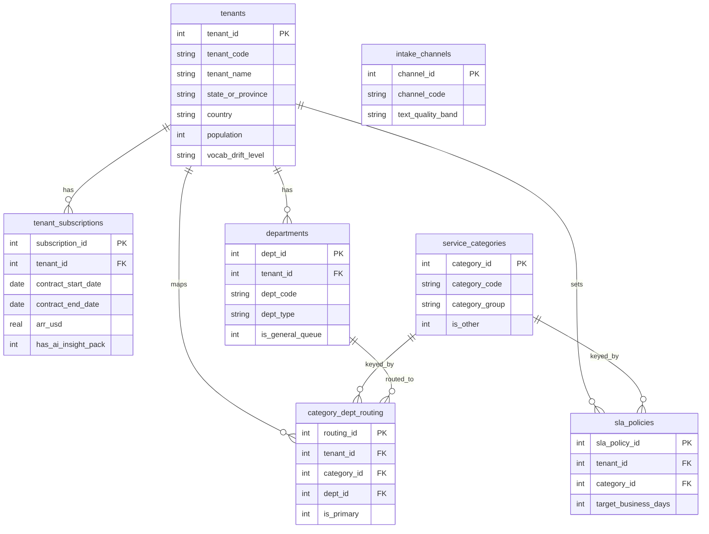
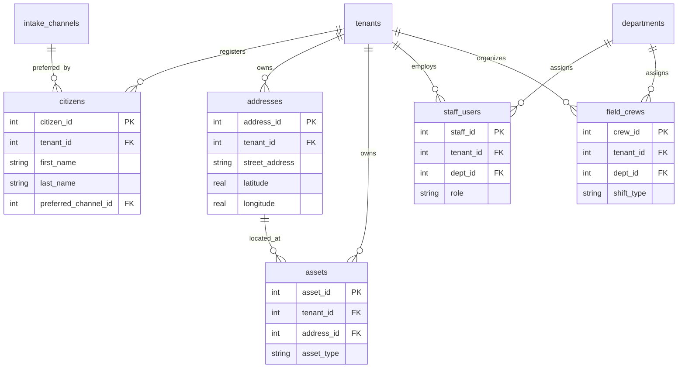
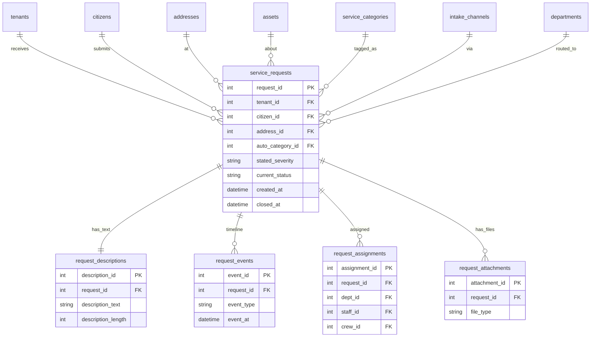
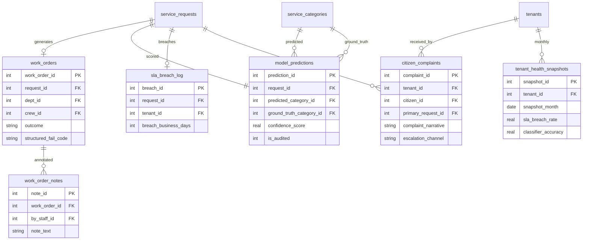

# CityPulse 311 Dataset ER Document

Business background, industry primer, and glossary are in `govtech_saas_service_request_intelligence_large_business_context.md`. This document only describes the data structures, field meanings, generation rules, and the embedded business trap contracts.

---

## 1. Dataset Metadata

Complexity tier is Large. There are 23 tables and roughly 10M rows total. There are about 38 FK relationships, of which 3 are non-DDL-enforced "business-level constraints" (called out in each table's scope notes; the generator honors them at sampling time).

`REFERENCE_DATE = 2026-06-01`, meaning every "today," "this month," "last quarter," and "trailing 12 months" expression in SQL is computed against this literal date - never `DATE('now')`. The data time window is 2023-06-01 through 2026-06-01, 36 months total.

The 23 tables fall into 4 clusters by business domain, and the Mermaid diagrams below are split into 4 accordingly:

- Tenants & Configuration cluster (7 tables): `intake_channels`, `service_categories`, `tenants`, `tenant_subscriptions`, `departments`, `sla_policies`, `category_dept_routing`
- Citizens, Addresses & Staff cluster (5 tables): `citizens`, `addresses`, `assets`, `staff_users`, `field_crews`
- Service Request Core cluster (5 tables): `service_requests`, `request_descriptions`, `request_events`, `request_assignments`, `request_attachments`
- Work Orders & Downstream Artifacts cluster (6 tables): `work_orders`, `work_order_notes`, `model_predictions`, `sla_breach_log`, `citizen_complaints`, `tenant_health_snapshots`

---

## 2. Mermaid ER Diagrams (by cluster)

### 2.1 Tenants & Configuration cluster



### 2.2 Citizens, Addresses & Staff cluster



### 2.3 Service Request Core cluster



### 2.4 Work Orders & Downstream Artifacts cluster



---

## 3. Table-by-Table Description

### 3.1 intake_channels

The enum table for the 6 submission channels the CityPulse platform supports. Each row represents a submission channel, plus the channel's inherent "text quality band" - used in downstream analysis to explain why IVR has naturally lower classification accuracy (speech-to-text loss compounded by short text). This table's contents are shared across tenants, not tenant-isolated.

| Column | Type | Constraint | Description |
|--------|------|------------|-------------|
| channel_id | INTEGER | PK | Auto-increment primary key |
| channel_code | TEXT | UNIQUE NOT NULL | Short code: web, mobile_app, ivr, social, email, walk_in |
| channel_name | TEXT | NOT NULL | Friendly name |
| text_quality_band | TEXT | NOT NULL | Text quality: high, medium, low |
| typical_severity_accuracy | REAL | NOT NULL | Agreement rate between resident-stated severity and text-implied severity on this channel (0 to 1); reference only |

Sample rows:

| channel_id | channel_code | channel_name | text_quality_band | typical_severity_accuracy |
|------------|--------------|--------------|---------------------|----------------------------|
| 1 | web | Web Portal | high | 0.88 |
| 2 | mobile_app | Mobile App | high | 0.86 |
| 3 | ivr | Phone IVR | low | 0.72 |

### 3.2 service_categories

The shared request category dictionary - 67 rows. Each row is a fine-grained category (pothole, streetlight_out, illegal_dumping, abandoned_vehicle, noise_complaint, etc.) and belongs to a category_group (Streets, Sanitation, Parks, Code, Utilities, Animal, Noise, Other). Exactly 1 row has `category_code = 'other_uncategorized'` and `is_other = 1`. This is the catch-all bucket that the platform falls back to when model confidence is below threshold; category_id = 80 (number reserved for future expansion, hence not contiguous).

> Note: by business rule, the "Other" category is exactly 1 row, identified by `is_other = 1`. This is the entry label for trap 1 ("Other classification drift").

| Column | Type | Constraint | Description |
|--------|------|------------|-------------|
| category_id | INTEGER | PK | |
| category_code | TEXT | UNIQUE NOT NULL | Short code |
| category_name | TEXT | NOT NULL | Friendly name |
| category_group | TEXT | NOT NULL | Top-level group: Streets, Sanitation, Parks, Code, Utilities, Animal, Noise, Other |
| default_priority | TEXT | NOT NULL | low, medium, high, emergency |
| is_other | INTEGER | NOT NULL DEFAULT 0 | 1 indicates this is the catch-all Other category |

Sample rows:

| category_id | category_code | category_name | category_group | default_priority | is_other |
|-------------|------------------|------------------|----------------|-----------------|----------|
| 1 | pothole | Pothole | Streets | medium | 0 |
| 4 | streetlight_out | Streetlight Out | Utilities | medium | 0 |
| 80 | other_uncategorized | Other / Uncategorized | Other | low | 1 |

### 3.3 tenants

CityPulse's customer cities or counties - 120 rows. Each row is a municipal entity that has signed a contract. The `vocab_drift_level` field tags the city's "linguistic distinctiveness," taking values low/medium/high; the high tenants (about 10) are the targets of trap 5 ("tenant-level model accuracy variance"), including the Quebec French-speaking cities (Montreal, Quebec City, Laval, Sherbrooke) and Deep South cities with heavy regional slang (New Orleans, Mobile, Birmingham, Jackson).

| Column | Type | Constraint | Description |
|--------|------|------------|-------------|
| tenant_id | INTEGER | PK | |
| tenant_code | TEXT | UNIQUE NOT NULL | Short slug, e.g. austin_tx |
| tenant_name | TEXT | NOT NULL | City of Austin |
| state_or_province | TEXT | NOT NULL | TX, ON, QC, CA, ... |
| country | TEXT | NOT NULL | US or CA |
| population | INTEGER | NOT NULL | Actual population (50K to 800K) |
| size_tier | TEXT | NOT NULL | small (50K-150K), medium (150K-400K), large (>=400K, no cap; flagship large cities like Austin around 980K) |
| timezone | TEXT | NOT NULL | America/Chicago, etc. |
| vocab_drift_level | TEXT | NOT NULL | low, medium, high |
| has_french_vocab | INTEGER | NOT NULL DEFAULT 0 | 1 indicates Quebec city, triggers French mixing |
| launched_on | DATE | NOT NULL | The date CityPulse went live in this city |

Sample rows:

| tenant_id | tenant_code | tenant_name | state | country | population | size_tier | vocab_drift_level | has_french_vocab |
|-----------|----------------|-------------------------|-------|---------|------------|------------|--------------------|-------------------|
| 12 | austin_tx | City of Austin | TX | US | 980000 | large | low | 0 |
| 47 | quebec_qc | Ville de Québec | QC | CA | 540000 | large | high | 1 |
| 88 | burlington_vt | City of Burlington | VT | US | 44000 | small | low | 0 |

### 3.4 tenant_subscriptions

Current contract record for each tenant - 120 rows (assuming one active contract per tenant; multi-renewal history is not expanded, to keep row counts manageable). The `has_ai_insight_pack` flag is the commercial root of both trap 1 and trap 5, since only customers with this module use the NLP classifier.

> Business-level constraint (not DDL-enforced): every tenant has at least one `is_active = 1` subscription at any point in time. The generator guarantees this.

| Column | Type | Constraint | Description |
|--------|------|------------|-------------|
| subscription_id | INTEGER | PK | |
| tenant_id | INTEGER | FK tenants(tenant_id) NOT NULL | |
| contract_start_date | DATE | NOT NULL | |
| contract_end_date | DATE | NOT NULL | |
| arr_usd | REAL | NOT NULL | Annual contract amount |
| has_ai_insight_pack | INTEGER | NOT NULL | 1 = NLP module enabled |
| has_field_mobile_pack | INTEGER | NOT NULL | |
| has_analytics_pack | INTEGER | NOT NULL | |
| is_active | INTEGER | NOT NULL | 1 = currently active |

Sample rows:

| subscription_id | tenant_id | contract_start_date | contract_end_date | arr_usd | has_ai_insight_pack | is_active |
|------|------|----------|----------|---------|------|-----|
| 12 | 12 | 2024-07-01 | 2027-06-30 | 720000.0 | 1 | 1 |
| 47 | 47 | 2025-01-15 | 2026-01-14 | 410000.0 | 1 | 1 |
| 88 | 88 | 2025-03-01 | 2026-02-28 | 132000.0 | 0 | 1 |

### 3.5 departments

Internal departments per tenant - roughly 1500 rows (averaging 12 departments per tenant). `dept_type` is one of 11 standard municipal-department enums; exactly one row per tenant has `is_general_queue = 1` (typically called "General Inquiries" or "311 Central"), used to receive all auto_category = Other requests.

> Business-level constraint (not DDL-enforced): every tenant has exactly 1 department with `is_general_queue = 1`. The generator guarantees this. The "Other routes to general queue" behavior in trap 1 depends on this assumption.

| Column | Type | Constraint | Description |
|--------|------|------------|-------------|
| dept_id | INTEGER | PK | |
| tenant_id | INTEGER | FK tenants(tenant_id) NOT NULL | |
| dept_code | TEXT | NOT NULL | Short code, unique within the tenant |
| dept_name | TEXT | NOT NULL | |
| dept_type | TEXT | NOT NULL | streets, sanitation, parks, code_enforcement, utilities, animal_services, noise_control, transportation, water, general_queue, other |
| is_general_queue | INTEGER | NOT NULL DEFAULT 0 | 1 = catch-all queue |

Sample rows:

| dept_id | tenant_id | dept_code | dept_name | dept_type | is_general_queue |
|------|------|---------|---------------------|---------------|------|
| 134 | 12 | STREETS_ATX | Austin Public Works Streets | streets | 0 |
| 142 | 12 | GEN_311_ATX | Austin 311 Central Queue | general_queue | 1 |
| 511 | 47 | VOIRIE_QC | Voirie de Québec | streets | 0 |

### 3.6 sla_policies

The SLA policy per (tenant, category) combination - 8040 rows total (120 tenants × 67 categories). `target_business_days` is the commitment, and `escalation_business_days` is the threshold beyond which a critical breach alert fires.

| Column | Type | Constraint | Description |
|--------|------|------------|-------------|
| sla_policy_id | INTEGER | PK | |
| tenant_id | INTEGER | FK tenants(tenant_id) NOT NULL | |
| category_id | INTEGER | FK service_categories(category_id) NOT NULL | |
| target_business_days | INTEGER | NOT NULL | SLA committed business days |
| escalation_business_days | INTEGER | NOT NULL | Threshold to trigger critical |
| effective_from | DATE | NOT NULL | |

Sample rows:

| sla_policy_id | tenant_id | category_id | target_business_days | escalation_business_days |
|------|------|------|------|------|
| 1001 | 12 | 1 | 2 | 5 |
| 1002 | 12 | 4 | 5 | 10 |
| 9580 | 12 | 80 | 5 | 12 |

### 3.7 category_dept_routing

The department mapping per (tenant, category) combination - 8040 rows (120 tenants × 67 categories). This table answers "in City of Austin, which department do pothole requests get routed to?" Requests with auto_category = Other are uniformly routed to the department where `is_general_queue = 1`, which is the chain root of trap 1's impact on SLA.

| Column | Type | Constraint | Description |
|--------|------|------------|-------------|
| routing_id | INTEGER | PK | |
| tenant_id | INTEGER | FK tenants(tenant_id) NOT NULL | |
| category_id | INTEGER | FK service_categories(category_id) NOT NULL | |
| dept_id | INTEGER | FK departments(dept_id) NOT NULL | |
| is_primary | INTEGER | NOT NULL DEFAULT 1 | 1 = default primary route |
| effective_from | DATE | NOT NULL | |

Sample rows:

| routing_id | tenant_id | category_id | dept_id | is_primary |
|------|------|------|------|------|
| 2001 | 12 | 1 | 134 | 1 |
| 2002 | 12 | 80 | 142 | 1 |
| 6500 | 47 | 1 | 511 | 1 |

### 3.8 citizens

Registered resident accounts - about 500K rows (averaging 4000 residents per tenant; larger cities have more). Note a resident can submit through any channel; `preferred_channel_id` is just statistical preference.

| Column | Type | Constraint | Description |
|--------|------|------------|-------------|
| citizen_id | INTEGER | PK | |
| tenant_id | INTEGER | FK tenants(tenant_id) NOT NULL | |
| citizen_external_id | TEXT | NOT NULL | Resident ID within the tenant |
| first_name | TEXT | NOT NULL | |
| last_name | TEXT | NOT NULL | |
| email | TEXT | | |
| phone | TEXT | | |
| registered_on | DATE | NOT NULL | |
| preferred_channel_id | INTEGER | FK intake_channels(channel_id) | |

Sample rows:

| citizen_id | tenant_id | first_name | last_name | email | preferred_channel_id |
|------|------|---------|---------|-------------------------|------|
| 12001 | 12 | Maria | Gonzalez | maria.g@example.com | 2 |
| 47221 | 47 | Jean | Tremblay | jean.tremblay@example.fr | 1 |

### 3.9 addresses

Known address list - about 150K rows. One address can correspond to many requests (this is the carrier for trap 3's "same address 30-day recurrence" detection).

| Column | Type | Constraint | Description |
|--------|------|------------|-------------|
| address_id | INTEGER | PK | |
| tenant_id | INTEGER | FK tenants(tenant_id) NOT NULL | |
| street_address | TEXT | NOT NULL | e.g. 815 Brazos St |
| city | TEXT | NOT NULL | |
| state_or_province | TEXT | NOT NULL | |
| postal_code | TEXT | NOT NULL | |
| latitude | REAL | NOT NULL | |
| longitude | REAL | NOT NULL | |
| neighborhood | TEXT | | |

Sample rows:

| address_id | tenant_id | street_address | city | postal_code |
|------|------|----------------------|--------|----------|
| 9001 | 12 | 815 Brazos St | Austin | 78701 |
| 9002 | 12 | 2200 E Riverside Dr | Austin | 78741 |
| 25001 | 47 | 1037 rue Saint Jean | Québec | G1R 1R9 |

### 3.10 assets

Physical assets tracked by the platform - about 80K rows (streetlights, fire hydrants, intersection IDs, trash cans, etc.). A request can optionally reference an asset (e.g. a specific streetlight that's out), but most requests don't.

| Column | Type | Constraint | Description |
|--------|------|------------|-------------|
| asset_id | INTEGER | PK | |
| tenant_id | INTEGER | FK tenants(tenant_id) NOT NULL | |
| address_id | INTEGER | FK addresses(address_id) | Nullable |
| asset_type | TEXT | NOT NULL | streetlight, hydrant, intersection, trash_can, sign, bench |
| asset_external_id | TEXT | NOT NULL | Business ID within the tenant |
| installed_on | DATE | | |

Sample rows:

| asset_id | tenant_id | address_id | asset_type | asset_external_id |
|------|------|------|--------------|---------|
| 3001 | 12 | 9001 | streetlight | SL-ATX-08152 |
| 3002 | 12 | 9002 | hydrant | HYD-ATX-22113 |

### 3.11 staff_users

Municipal staff accounts per tenant - about 25K rows (averaging 200 staff per tenant). `role` is the role-category enum. Call_taker is the person taking calls at the 311 center, supervisor is the one doing manual category overrides on requests, and inspector and crew_lead go out to the site.

| Column | Type | Constraint | Description |
|--------|------|------------|-------------|
| staff_id | INTEGER | PK | |
| tenant_id | INTEGER | FK tenants(tenant_id) NOT NULL | |
| dept_id | INTEGER | FK departments(dept_id) NOT NULL | |
| staff_name | TEXT | NOT NULL | |
| role | TEXT | NOT NULL | call_taker, supervisor, inspector, manager, director, crew_lead |
| email | TEXT | | |
| hired_on | DATE | | |
| is_active | INTEGER | NOT NULL DEFAULT 1 | |

Sample rows:

| staff_id | tenant_id | dept_id | staff_name | role |
|------|------|------|---------------|--------------|
| 5001 | 12 | 134 | Brian Walsh | supervisor |
| 5002 | 12 | 142 | Tina Ford | call_taker |
| 5500 | 47 | 511 | Pierre Côté | crew_lead |

### 3.12 field_crews

Field work crews - about 2500 rows. Each crew belongs to one department and is made up of 0 to many staff_users (this dataset doesn't expand a crew_member relation table; crew is the dispatch granularity).

| Column | Type | Constraint | Description |
|--------|------|------------|-------------|
| crew_id | INTEGER | PK | |
| tenant_id | INTEGER | FK tenants(tenant_id) NOT NULL | |
| dept_id | INTEGER | FK departments(dept_id) NOT NULL | |
| crew_code | TEXT | NOT NULL | Unique within tenant + dept |
| crew_size | INTEGER | NOT NULL | 2 to 6 |
| shift_type | TEXT | NOT NULL | day, night, swing |

Sample rows:

| crew_id | tenant_id | dept_id | crew_code | crew_size | shift_type |
|------|------|------|--------------|-----|------|
| 701 | 12 | 134 | STR-ATX-D1 | 4 | day |
| 702 | 12 | 134 | STR-ATX-N1 | 3 | night |

### 3.13 service_requests

The platform's core fact table - about 1M rows. Each row is a service request submitted by a resident. `auto_category_id` is the category the system actually writes to the record (could be the model prediction or a human override by a call_taker or supervisor), while the NLP model's raw prediction lives in the `model_predictions` table. `routed_dept_id` is the target department computed from category_dept_routing at write time.

> Business-level constraints: (a) when the service_categories row pointed to by `auto_category_id` has is_other = 1, `routed_dept_id` must be the department with `is_general_queue = 1` for that tenant. (b) When `is_duplicate = 1`, `duplicate_of_request_id` must be non-null and point to another request under the same tenant. (c) `closed_at` must be >= `created_at`.

| Column | Type | Constraint | Description |
|--------|------|------------|-------------|
| request_id | INTEGER | PK | |
| tenant_id | INTEGER | FK tenants(tenant_id) NOT NULL | |
| citizen_id | INTEGER | FK citizens(citizen_id) | Nullable (anonymous submission) |
| address_id | INTEGER | FK addresses(address_id) | Nullable |
| asset_id | INTEGER | FK assets(asset_id) | Nullable |
| auto_category_id | INTEGER | FK service_categories(category_id) NOT NULL | System-recorded category |
| channel_id | INTEGER | FK intake_channels(channel_id) NOT NULL | |
| routed_dept_id | INTEGER | FK departments(dept_id) | Nullable (not yet routed) |
| stated_severity | TEXT | NOT NULL | low, medium, high, emergency |
| current_status | TEXT | NOT NULL | open, classified, assigned, in_progress, on_hold, closed, reopened |
| created_at | DATETIME | NOT NULL | |
| closed_at | DATETIME | | Nullable (not closed) |
| is_duplicate | INTEGER | NOT NULL DEFAULT 0 | |
| duplicate_of_request_id | INTEGER | FK service_requests(request_id) | Nullable |

Indexes: `(tenant_id, created_at)`, `(address_id, created_at)`, `(auto_category_id)`, `(current_status)`.

Sample rows:

| request_id | tenant_id | citizen_id | address_id | auto_category_id | channel_id | stated_severity | current_status | created_at | closed_at |
|------|------|------|------|------|------|----------|----------|---------------------|---------------------|
| 100001 | 12 | 12001 | 9001 | 1 | 2 | medium | closed | 2026-03-04 09:12:00 | 2026-03-05 14:30:00 |
| 100002 | 12 | 12001 | 9002 | 80 | 3 | medium | closed | 2026-03-04 09:25:00 | 2026-03-12 16:00:00 |
| 100003 | 47 | 47221 | 25001 | 4 | 1 | high | in_progress | 2026-05-29 18:40:00 | NULL |

### 3.14 request_descriptions

The resident-submitted description text for each service request - one-to-one with `service_requests`, about 1M rows. This table is the most important carrier of unstructured fields in the dataset. `description_text` is generated by template assembly, with templates bucketed by ground truth labels (true category, whether it contains emergency keywords, whether it contains escalation language). The SQL for traps 1, 2, and 4 all pull signal from this table's text.

| Column | Type | Constraint | Description |
|--------|------|------------|-------------|
| description_id | INTEGER | PK | |
| request_id | INTEGER | FK service_requests(request_id) UNIQUE NOT NULL | |
| description_text | TEXT | NOT NULL | Original description submitted by the resident |
| description_length | INTEGER | NOT NULL | Character count, written by the generator |
| submitted_via_text_field | INTEGER | NOT NULL | 1 = actually typed, 0 = IVR transcription |

Sample rows (note IVR transcribed text is short and fragmented; web/mobile text has better structure; examples include escalation language and emergency keywords):

| description_id | request_id | description_text (excerpt) | submitted_via_text_field |
|------|------|--------------------------------------------------|------|
| 100001 | 100001 | "Large pothole on Brazos Street near 8th. Hit my tire this morning, almost lost control." | 1 |
| 100002 | 100002 | "uh yeah there's, you know, garbage piled up at riverside drive, smells really bad, also kinda looks dangerous" | 0 |
| 100003 | 100003 | "Streetlight in front of 1037 rue Saint Jean is out. Third time this month, fed up with this. I will contact my councilman if not fixed by Friday." | 1 |

### 3.15 request_events

The service request lifecycle event stream - about 4M rows (averaging 4 events per request: created, classified, assigned, closed). Events are ordered by `event_at` and reflect state machine transitions. Trap 3's "24-hour quick close" check uses the closed event's `event_at` minus the created event's `event_at`.

| Column | Type | Constraint | Description |
|--------|------|------------|-------------|
| event_id | INTEGER | PK | |
| request_id | INTEGER | FK service_requests(request_id) NOT NULL | |
| event_type | TEXT | NOT NULL | created, classified, assigned, in_progress, on_hold, closed, reopened |
| event_at | DATETIME | NOT NULL | |
| by_staff_id | INTEGER | FK staff_users(staff_id) | Nullable (system-generated event) |
| event_note | TEXT | | Short structured note, not free text |

Index: `(request_id, event_at)`.

Sample rows:

| event_id | request_id | event_type | event_at | by_staff_id |
|------|------|-----------|---------------------|------|
| 1 | 100001 | created | 2026-03-04 09:12:00 | NULL |
| 2 | 100001 | classified | 2026-03-04 09:12:30 | NULL |
| 3 | 100001 | assigned | 2026-03-04 10:05:00 | 5001 |
| 4 | 100001 | closed | 2026-03-05 14:30:00 | 5001 |

### 3.16 request_assignments

Current and historical records of requests assigned to departments/staff/crews - about 1.2M rows. Each request averages 1.2 assignments (most have 1; reopens generate a second one).

| Column | Type | Constraint | Description |
|--------|------|------------|-------------|
| assignment_id | INTEGER | PK | |
| request_id | INTEGER | FK service_requests(request_id) NOT NULL | |
| dept_id | INTEGER | FK departments(dept_id) NOT NULL | |
| staff_id | INTEGER | FK staff_users(staff_id) | Nullable |
| crew_id | INTEGER | FK field_crews(crew_id) | Nullable |
| assigned_at | DATETIME | NOT NULL | |
| unassigned_at | DATETIME | | Nullable (still active) |
| is_current | INTEGER | NOT NULL DEFAULT 1 | |

Sample rows:

| assignment_id | request_id | dept_id | staff_id | crew_id | assigned_at | is_current |
|------|------|------|------|------|---------------------|------|
| 1 | 100001 | 134 | 5001 | 701 | 2026-03-04 10:05:00 | 1 |

### 3.17 request_attachments

Request attachment metadata (no blob storage) - about 400K rows (around 40% of requests have attachments, mostly photos submitted via mobile_app).

| Column | Type | Constraint | Description |
|--------|------|------------|-------------|
| attachment_id | INTEGER | PK | |
| request_id | INTEGER | FK service_requests(request_id) NOT NULL | |
| file_type | TEXT | NOT NULL | image, video, document |
| file_name | TEXT | NOT NULL | |
| uploaded_at | DATETIME | NOT NULL | |

Sample rows:

| attachment_id | request_id | file_type | file_name | uploaded_at |
|------|------|--------|-------------------------|---------------------|
| 7001 | 100001 | image | pothole_brazos_west.jpg | 2026-03-04 09:13:00 |

### 3.18 work_orders

The work orders dispatched to field crews - about 600K rows (roughly 60% of requests generate a WO; pure information inquiries don't). `structured_fail_code` is the failure-reason dropdown the crew selects when closing the work order, with only 10 enum values; the real failure reason is often hidden inside `work_order_notes.note_text`, which is the supporting evidence for trap 3 ("fake closures").

| Column | Type | Constraint | Description |
|--------|------|------------|-------------|
| work_order_id | INTEGER | PK | |
| request_id | INTEGER | FK service_requests(request_id) NOT NULL | |
| dept_id | INTEGER | FK departments(dept_id) NOT NULL | |
| crew_id | INTEGER | FK field_crews(crew_id) | Nullable |
| supervisor_staff_id | INTEGER | FK staff_users(staff_id) | Nullable |
| opened_at | DATETIME | NOT NULL | |
| closed_at | DATETIME | | Nullable |
| outcome | TEXT | | resolved, deferred, no_action, unable_to_locate |
| structured_fail_code | TEXT | | unable_to_access, materials_missing, weather, deferred_to_capital, no_issue_found, NULL |

Sample rows:

| work_order_id | request_id | dept_id | crew_id | opened_at | closed_at | outcome |
|------|------|------|------|---------------------|---------------------|---------|
| 50001 | 100001 | 134 | 701 | 2026-03-04 10:30:00 | 2026-03-05 14:00:00 | resolved |

### 3.19 work_order_notes

Field crew notes on work orders - about 1M rows (averaging 1.7 notes per WO). This is the second unstructured field. `note_type` distinguishes four types: status update, fail reason, citizen followup, internal. But in practice, the content that really explains failure reasons often appears in `status_update` or `internal` notes (not `fail_reason`) - that's exactly where the structured field loses signal.

| Column | Type | Constraint | Description |
|--------|------|------------|-------------|
| note_id | INTEGER | PK | |
| work_order_id | INTEGER | FK work_orders(work_order_id) NOT NULL | |
| by_staff_id | INTEGER | FK staff_users(staff_id) NOT NULL | |
| note_at | DATETIME | NOT NULL | |
| note_text | TEXT | NOT NULL | Free text |
| note_type | TEXT | NOT NULL | status_update, fail_reason, citizen_followup, internal |

Sample rows:

| note_id | work_order_id | by_staff_id | note_at | note_text (excerpt) | note_type |
|------|------|------|---------------------|---------------------------------------|------|
| 1 | 50001 | 5001 | 2026-03-04 12:00:00 | "Patched temporarily, full repair scheduled next week" | status_update |
| 2 | 50001 | 5001 | 2026-03-05 14:00:00 | "Closed for KPI window. Long term fix still pending." | internal |

### 3.20 model_predictions

Raw NLP classification model predictions - one-to-one with service_requests, about 1M rows. `predicted_category_id` is the model's top-1 (raw, before any human override) class, and `confidence_score` is the softmax probability. `ground_truth_category_id` is only populated on the subset where `is_audited = 1` (about 20%); this is the comparison basis for traps 1 and 5.

> Business-level constraint: when `confidence_score < 0.45`, `predicted_category_id` must be the Other category's category_id (the model fallback logic). The generator guarantees this.

| Column | Type | Constraint | Description |
|--------|------|------------|-------------|
| prediction_id | INTEGER | PK | |
| request_id | INTEGER | FK service_requests(request_id) UNIQUE NOT NULL | |
| predicted_category_id | INTEGER | FK service_categories(category_id) NOT NULL | Model raw prediction |
| confidence_score | REAL | NOT NULL | 0 to 1 |
| predicted_at | DATETIME | NOT NULL | |
| ground_truth_category_id | INTEGER | FK service_categories(category_id) | Nullable |
| is_audited | INTEGER | NOT NULL DEFAULT 0 | |
| model_version | TEXT | NOT NULL | e.g. v3.2.1 |

Sample rows:

| prediction_id | request_id | predicted_category_id | confidence_score | ground_truth_category_id | is_audited |
|------|------|------|------|------|------|
| 100001 | 100001 | 1 | 0.92 | 1 | 1 |
| 100002 | 100002 | 80 | 0.31 | 2 | 1 |

### 3.21 sla_breach_log

Records only requests that breached SLA - about 210K rows (about 22% breach rate on closed requests). `breach_business_days` is the number of business days the breach exceeded the target (= actual_business_days - target_business_days, always ≥ 1).

| Column | Type | Constraint | Description |
|--------|------|------------|-------------|
| breach_id | INTEGER | PK | |
| request_id | INTEGER | FK service_requests(request_id) UNIQUE NOT NULL | |
| tenant_id | INTEGER | FK tenants(tenant_id) NOT NULL | |
| breached_at | DATETIME | NOT NULL | Time when the SLA breach was logged at actual closure |
| target_business_days | INTEGER | NOT NULL | The SLA target for this (tenant, category) |
| actual_business_days | INTEGER | NOT NULL | Actual business days from created to closed |
| breach_business_days | INTEGER | NOT NULL | actual minus target |
| breach_severity | TEXT | NOT NULL | minor, major, critical |

Sample rows:

| breach_id | request_id | tenant_id | target_business_days | actual_business_days | breach_business_days | breach_severity |
|------|------|------|------|------|------|---------|
| 1 | 100002 | 12 | 5 | 8 | 3 | minor |

### 3.22 citizen_complaints

Formal complaints from residents who bypass 311 and escalate to city council or external channels - about 5000 rows (0.5% of total request volume). `complaint_narrative` is the third unstructured field, typically 1 to 3 paragraphs, written by the resident or a council member's office staffer on their behalf. `primary_request_id` links back to the source service_request that triggered the complaint.

| Column | Type | Constraint | Description |
|--------|------|------------|-------------|
| complaint_id | INTEGER | PK | |
| tenant_id | INTEGER | FK tenants(tenant_id) NOT NULL | |
| citizen_id | INTEGER | FK citizens(citizen_id) NOT NULL | |
| primary_request_id | INTEGER | FK service_requests(request_id) NOT NULL | |
| filed_at | DATE | NOT NULL | |
| escalation_channel | TEXT | NOT NULL | council_letter, news_media, lawyer_letter, social_viral |
| complaint_narrative | TEXT | NOT NULL | Narrative written by resident or council member's staffer |
| council_member_name | TEXT | | Recipient council member's name |
| resolved_at | DATE | | Nullable |
| resolution_type | TEXT | | apology, repair_completed, policy_change, no_action |

Sample rows:

| complaint_id | tenant_id | citizen_id | primary_request_id | filed_at | escalation_channel | complaint_narrative (excerpt) |
|------|------|------|------|------------|-----------------|---------------------------------------|
| 1 | 12 | 12001 | 100002 | 2026-03-15 | council_letter | "I have reported the trash piled at 2200 E Riverside three times since January. Last response was a closed ticket that said resolved, but nothing changed. I am asking Council Member Johnson to intervene." |

### 3.23 tenant_health_snapshots

Monthly tenant-level operational health snapshots - about 4000 rows (120 tenants × 36 months). This table is an aggregate artifact the generator computes after all fact tables are produced, written so SQL can directly query "trailing 12 months" or "quarterly mean" without recomputing every time.

| Column | Type | Constraint | Description |
|--------|------|------------|-------------|
| snapshot_id | INTEGER | PK | |
| tenant_id | INTEGER | FK tenants(tenant_id) NOT NULL | |
| snapshot_month | DATE | NOT NULL | First day of the month |
| request_count | INTEGER | NOT NULL | New requests created that month |
| sla_breach_rate | REAL | NOT NULL | Breach share among that month's closed requests |
| reopen_rate | REAL | NOT NULL | |
| repeat_at_address_rate | REAL | NOT NULL | |
| classifier_accuracy | REAL | | Nullable (NULL for tenants without AI Insight Pack) |
| council_escalation_rate | REAL | NOT NULL | |
| nps_score | INTEGER | NOT NULL | Range -100 to +100, reverse-derived from a weighted blend of 4 rates |
| churn_risk_band | TEXT | NOT NULL | low, medium, high |

Sample rows:

| snapshot_id | tenant_id | snapshot_month | request_count | sla_breach_rate | classifier_accuracy | churn_risk_band |
|------|------|------------|------|------|------|------|
| 1 | 12 | 2026-05-01 | 8420 | 0.18 | 0.89 | low |
| 12 | 47 | 2026-05-01 | 6180 | 0.31 | 0.72 | high |

---

## 4. Data Generation Rules

The rules below are the contract between the generator and the SQL queries. The generator must implement them so that the "expected results" in the SQL queries document line up with the numbers stated here.

### 4.1 Time Order

Within a single service_request, the event order is: `created_at <= classified event_at <= assigned event_at <= (in_progress/on_hold transitions) <= closed_at`. Every `request_events.event_at` falls within `[created_at, closed_at + 30 days]`.

`work_orders.opened_at >= service_requests.created_at`, typically lagging by 30 minutes to 8 hours. `work_orders.closed_at >= opened_at`, and equal to or earlier than `service_requests.closed_at`.

`work_order_notes.note_at >= work_orders.opened_at` and `<= work_orders.closed_at + 14 days` (late notes allowed).

`citizen_complaints.filed_at >= primary_request.created_at + 1 day` and `<= primary_request.created_at + 90 days`. Trap 4 focuses on the "within 60 days" subset.

`tenant_health_snapshots.snapshot_month` falls in `[2023-06-01, 2026-05-01]`, with one row per tenant per month.

### 4.2 Referential Integrity

All FKs are enforced at the DDL level. Three are not DDL-enforced but the generator must obey them:

First, when `service_requests.auto_category_id` points to a row where `is_other = 1`, `routed_dept_id` must be the department with `is_general_queue = 1` for the same tenant. This is the chain root for trap 1.

Second, when `service_requests.is_duplicate = 1`, `duplicate_of_request_id` must not be null, and must point to another request under the same tenant whose created_at is earlier than this one.

Third, when `model_predictions.confidence_score < 0.45`, `predicted_category_id` must be the Other category's category_id (fallback logic).

### 4.3 Value Ranges

`stated_severity` distribution: Low 35%, Medium 40%, High 20%, Emergency 5% (weighted across tenants).

`current_status` distribution at REFERENCE_DATE: the vast majority of requests have already finished their lifecycle, so closed makes up about 98% to 99%, with the remaining 1% to 2% being in_progress / assigned / on_hold / classified / open (new or still in-flight). Note that `reopened` is a **lifecycle event** (recorded in `request_events.event_type = 'reopened'`), not a long-lived state in `current_status`: after reopen, the request goes back to in_progress and then to closed, so you almost never see `current_status = 'reopened'` in a snapshot view. To analyze reopens reliably, query `request_events` rather than `service_requests.current_status`.

`category_group` request distribution: Streets 25%, Sanitation 22%, Utilities 18%, Parks 10%, Code 8%, Animal 5%, Noise 4%, Other 8%. The 8% Other is critical (see trap 1).

`channel_id` distribution: web 30%, mobile_app 28%, ivr 22%, social 10%, email 7%, walk_in 3%.

`is_duplicate` distribution: about 1.5% of requests are flagged as duplicates (simulating the small sample where duplicate detection misses and a human later labels them), with `duplicate_of_request_id` pointing to another request under the same tenant with an earlier created_at; the remaining ~98.5% are 0. Note that "fake closures" (Question 3) use the "multiple requests at the same address" signal (different request_id, not duplicate), which is a different thing from this field, so Q3/Q12 explicitly add `WHERE is_duplicate = 0` to exclude this small duplicate set.

`SLA target_business_days` typical values by category: emergency_default category 1 day, most normal categories 3 to 5 days, Other category 5 days, code_enforcement 7 to 14 days.

`size_tier` is determined by real population against thresholds (population ≥ 400K is large, ≥ 150K is medium, the rest are small), not driven by fixed quotas. Under the current TENANT_SEED's actual populations, the distribution lands approximately at small 29, medium 74, large 17 (note: many cities in the 180K to 210K population range fall into medium by definition, so medium is over-represented). This is the dataset's authoritative ground truth; SQL document Q10 also uses it.

`vocab_drift_level` distribution: about 90 tenants low, about 20 medium, 10 high (measured 90 / 20 / 10).

`tenant_subscriptions.has_ai_insight_pack = 1` penetration is stratified by size_tier: large around 95% (measured 17/17, all enabled; large city sample is small), medium around 80% (measured 62/74), small around 60% (measured 17/29), totaling about 96 tenants enabled (the customers using NLP) and about 24 tenants not enabled. Note this is "penetration rate" not "count": almost every large city buys it, while small-city penetration is low - supporting the CRO narrative in Q10. Even for tenants where it's not enabled, `model_predictions` still has data (simulating "the model runs in a sandbox but isn't wired into the production router"), so when Q5/Q11/Q17 compute accuracy on raw predictions, they cover all 120 tenants; only `tenant_health_snapshots.classifier_accuracy` is NULL for tenants without the AI Pack.

### 4.4 Computed Fields

`request_descriptions.description_length` = `LENGTH(description_text)`, computed by the generator before write.

`sla_breach_log.actual_business_days` = the number of business days actually spent processing the request (approximated as `closed_at - created_at` skipping Saturday and Sunday, with no holiday deduction). This table only contains requests that genuinely breached, so every row has `actual_business_days > target_business_days` by construction.

`sla_breach_log.breach_business_days` = `actual_business_days - target_business_days`, always ≥ 1 (a row is only written when actual > target). `is_breach` is derived from "actual business days > SLA target," not sampled independently, so this table never contains a self-contradictory row marked as breach but with actual ≤ target.

`sla_breach_log.breach_severity` is bucketed by breach_business_days: 1 to 2 days = minor, 3 to 5 days = major, 6 days and above = critical. Since breach overrun follows a long-tailed distribution, all three buckets appear naturally (minor dominates, critical is in the low single-digit percent).

Every rate field in `tenant_health_snapshots` is actually aggregated by the generator after the fact tables are generated: `sla_breach_rate` = breach share among that month's closed requests; `reopen_rate` = share of that month's closed requests that have a reopened event (aggregated from `request_events`); `repeat_at_address_rate` = share of that month's closed requests with an address where the same address has another new request within 30 days (aggregated from `service_requests` self-windowing); `classifier_accuracy` = share of audited subset that month where predicted = ground_truth (NULL for tenants without AI Pack); `council_escalation_rate` = that month's complaint count / that month's request count. So Q20's reopen / repeat columns can be re-derived against the fact tables using Q14 / Q19 / Q3, and aren't a synthetic function of sla. `nps_score` is reverse-derived by the generator using a weighted formula: `nps_score = 130 - 450 * sla_breach_rate - 250 * council_escalation_rate - 80 * reopen_rate`, then clipped to [-100, 100]. `churn_risk_band` is determined by `nps_score` thresholds: nps < 0 is high, [0, 30) is medium, ≥ 30 is low. The calibration is dominated by sla_breach_rate: monthly sla below about 0.21 leans low, 0.21 to 0.275 leans medium, above about 0.275 leans high. So low-drift healthy cities (like Austin) lean low, high-drift cities (like Quebec) lean high, and all three bands have real distribution on the platform. Note that the most recent month (the month before the one containing REFERENCE_DATE) has artificially low sla because "long-duration breaches haven't closed yet by the anchor date" - this is a real recency bias that every operational dashboard has, so a "current snapshot" question like Q20 takes the previous fully-settled month rather than the most recent month.

### 4.5 Distribution Rules (observed actual magnitudes)

Overall SLA breach rate (on closed requests, 12-month window) is about 22%. In the `auto_category_id = Other` subset, breach rate is about 29%, materially higher than the ~21% on non-Other (because the catch-all queue has slower SLA). Note this observed value is slightly below the "full-cycle theoretical 23%/32%" because long-duration breaches near the anchor have not yet closed before the anchor (recency bias), and those are excluded from the closed set.

Overall reopen rate is about 6% to 7%. In the subset where the description contains emergency keywords but stated_severity is low/medium, reopen rate is about 24% (the generator sets that subset's reopen probability to 0.25; after removing the 'leaking' pollution from normal templates, the emergency-keyword hits are a clean injected subset, measured at about 0.24 - see trap 2).

Overall "closed within 24 hours" is about 40% (call_taker information answers + fast field resolutions). Within that 40%, the share with another request at the same address within 30 days is about 28%; the non-quick-close subset is about 20%. The absolute level is high because the 36-month window + 150K addresses = about 7 requests per address on average, and random clustering alone contributes a meaningful baseline (see trap 3). The trap's key signal is that the quick-close subset is still about 8pp above baseline.

Overall council escalation rate (citizen_complaints generated within 60 days) is about 0.5%. In the subset where the description contains escalation language, escalation rate is about 8% (see trap 4). The baseline (no escalation language) is about 0.3%.

Overall classifier accuracy (on the audited subset) is about 86%. The 10 tenants with `vocab_drift_level = 'high'` have accuracy around 72% (see trap 5).

### 4.6 Embedded Business Traps (5 contracts)

**Trap 1: "Other" classification drift (maps to business question 1, SQL Q1, Q6, Q16)**

Requests with `auto_category_id = Other` are about 8% of the total, or about 80,000 (measured 79,771). Among those, about 12% (around 9,600, measured roughly 12% across the full set) of `description_text` values contain one of 6 strong keywords (pothole, streetlight, graffiti, dumping, noise, tree). The Other subset's SLA breach rate is about 29%, materially higher than the ~21% for non-Other requests (about 8pp gap). SQL exposes this with LIKE-based keyword search.

**Trap 2: Stated severity vs. text-implied severity divergence (maps to business question 2, SQL Q2, Q9)**

Requests with `stated_severity in ('low', 'medium')` are about 75% (Low 35% + Medium 40%). Among those, about 10% (i.e. about 7.5% of all requests) of `description_text` values contain an emergency keyword (gas leak, live wire, fire, smoke, child injured, leaking). This subset has reopen rate around 24% vs. baseline around 5% (lift of about 5x). Note: the normal description templates no longer contain "leaking" (the original Utilities "water main ... leaking" template was rewritten), so the emergency-keyword hits are exactly the injected 7.5% and aren't diluted by normal templates; the lift therefore recovers from the diluted ~4x back to about 5x. SQL uses LIKE-based emergency keyword search.

**Trap 3: First-touch quick close masks recurrence (maps to business question 3, SQL Q3, Q12)**

Requests with `closed_at - created_at <= 24 hours` and `is_breach = 0` make up about 27% of total volume. Among those, about 28% have another request at the same address_id within 30 days (different request_id, non-duplicate). The non-quick-close on-time subset's same-address 30-day recurrence is about 20% (driven by random clustering from 1M requests concentrated on 150K addresses). The relative gap between quick-close and non-quick-close of ~8pp is the trap's observable signal. SQL detects this with `LAG/LEAD` window functions or a self-join.

**Trap 4: Escalation language predicts complaints (maps to business question 4, SQL Q4, Q13)**

About 3% of requests have `description_text` containing escalation words (third time, fed up, contact my councilman, lawyer, going to the news). This subset has about an 8% probability of generating a `citizen_complaints` record within 60 days, versus about 0.3% for requests without escalation language. SQL exposes this with LIKE + EXISTS subquery.

**Trap 5: Tenant-level model accuracy variance (maps to business question 5, SQL Q5, Q11, Q17)**

The 10 tenants with `vocab_drift_level = 'high'` have classifier accuracy (audited subset) of about 72%, while the median tenant is about 88%. These 10 tenants average about 8pp higher SLA breach rate (monthly sla stable around 0.28 to 0.31), so they reliably fall into the high churn_risk_band. SQL just aggregates `predicted = ground_truth` share by tenant.

---

## 5. Faker and Sampling Strategy

| Field Pattern | Sampling Method | Notes |
|----------|-----------|------|
| tenant_name | Hand-written North American mid-sized city list | Avoids the awkwardness of overlapping with real Tyler/Granicus customers, but the cities themselves are real |
| city, state_or_province | Literal values bound to the tenant | Consistency over diversity |
| first_name, last_name | `fake.first_name()`, `fake.last_name()` | Quebec cities use a `Faker("fr_CA")` sub-instance more often |
| email | `f"{first}.{last}@example.com"` | Don't call `fake.email()` to avoid collisions |
| street_address | `fake.street_address()` | |
| latitude, longitude | Uniformly distributed +/- 0.05 degrees around the tenant city center | Keeps geographic clustering |
| description_text | Template assembly, with templates bucketed by ground truth labels (true_category, has_emergency_kw, has_escalation_kw) | The data carrier for traps 1, 2, 4 |
| note_text | Template assembly, bucketed by WO outcome and "real failure reason" label | Supporting evidence for trap 3 |
| complaint_narrative | Template assembly, referencing keywords from the source request + council complaint tone | Short narrative, 3 to 5 sentences |
| stated_severity | Discrete sample weighted by channel, intentionally decoupled from ground truth (trap 2) | |
| category_id (auto) | Derived from ground truth + tenant vocab_drift noise | |
| created_at | Within the three-year window, monthly distribution overlaid with weekday and hour patterns (high on Mon/Tue, low in early morning) | |
| closed_at | created_at plus a "processing duration" distribution tuned by category and tenant | |

### 5.1 Description-Text Template Generation Details

For each service_request, the generator first decides 5 ground truth labels:

1. `true_category_id` sampled by weight from the 66 non-Other regular categories (top-level distribution see section 4.3). Other isn't a real category - it's just the catch-all bucket for low-confidence model output, so the true category is never Other.
2. `has_emergency_keyword` (boolean, true with 10% probability when stated_severity is in {low, medium}; this is the seed for trap 2)
3. `has_escalation_keyword` (boolean, true 3% overall; this is the seed for trap 4)
4. `will_quick_close_within_24h` (boolean, true 40% overall; this is the seed for trap 3, when true the same-address 30-day recurrence probability is raised to 15%)
5. `will_be_other_in_auto_category` (boolean, true 8% overall - this 8% is the entire source of `auto_category = Other`, so Other is exactly ~8% and there's no overlapping leakage). About 88% of those are **truly unclassifiable** requests (true_category is also Other, description uses generic templates with no strong keywords, model fallback to Other is correct); about 12% are **model misses** (true_category is one of the 6 strong categories, description is forced to contain the matching strong keyword) - and that 12% is exactly trap 1's core "rescuable pool."

Then `description_text` is assembled by:

```
{opening_phrase} + {core_description with true_category keyword unless ¬will_be_other_visible} 
  + {optional_emergency_phrase if has_emergency_keyword}
  + {optional_escalation_phrase if has_escalation_keyword}
  + {closing_phrase}
```

Each slot has 20 to 80 candidate phrases drawn via `random.choice`. The IVR channel adds a layer of "transcription noise" processing: break sentences into phrases, insert spoken pauses like "uh", "you know", "uhm", and lowercase the first letter, so the text representation is distinguishable from web/mobile submissions.

---

## 6. File Manifest

The TSV file list in topological order, matching the generator's `load_order` one-to-one.

| # | File Name | Table | Approximate Rows | Dependencies |
|----|--------|------|----------|------|
| 01 | 01_intake_channels.tsv | intake_channels | 6 | None |
| 02 | 02_service_categories.tsv | service_categories | 67 | None |
| 03 | 03_tenants.tsv | tenants | 120 | None |
| 04 | 04_tenant_subscriptions.tsv | tenant_subscriptions | 120 | tenants |
| 05 | 05_departments.tsv | departments | 1500 | tenants |
| 06 | 06_sla_policies.tsv | sla_policies | 8040 | tenants, service_categories |
| 07 | 07_category_dept_routing.tsv | category_dept_routing | 8040 | tenants, service_categories, departments |
| 08 | 08_citizens.tsv | citizens | 500000 | tenants, intake_channels |
| 09 | 09_addresses.tsv | addresses | 150000 | tenants |
| 10 | 10_assets.tsv | assets | 80000 | tenants, addresses |
| 11 | 11_staff_users.tsv | staff_users | 25000 | tenants, departments |
| 12 | 12_field_crews.tsv | field_crews | 2500 | tenants, departments |
| 13 | 13_service_requests.tsv | service_requests | 1000000 | tenants, citizens, addresses, assets, service_categories, intake_channels, departments |
| 14 | 14_request_descriptions.tsv | request_descriptions | 1000000 | service_requests |
| 15 | 15_request_events.tsv | request_events | 4000000 | service_requests, staff_users |
| 16 | 16_request_assignments.tsv | request_assignments | 1200000 | service_requests, departments, staff_users, field_crews |
| 17 | 17_request_attachments.tsv | request_attachments | 400000 | service_requests |
| 18 | 18_work_orders.tsv | work_orders | 600000 | service_requests, departments, field_crews, staff_users |
| 19 | 19_work_order_notes.tsv | work_order_notes | 1000000 | work_orders, staff_users |
| 20 | 20_model_predictions.tsv | model_predictions | 1000000 | service_requests, service_categories |
| 21 | 21_sla_breach_log.tsv | sla_breach_log | 250000 | service_requests, tenants |
| 22 | 22_citizen_complaints.tsv | citizen_complaints | 5000 | service_requests, citizens, tenants |
| 23 | 23_tenant_health_snapshots.tsv | tenant_health_snapshots | 4320 | tenants (aggregated from fact tables) |

---

## 7. SQLite DDL

Below are the `CREATE TABLE` statements for all 23 tables, in the same order as load_order. Indexes for major fact tables are created separately.

```sql
CREATE TABLE intake_channels (
    channel_id INTEGER PRIMARY KEY,
    channel_code TEXT NOT NULL UNIQUE,
    channel_name TEXT NOT NULL,
    text_quality_band TEXT NOT NULL,
    typical_severity_accuracy REAL NOT NULL
);

CREATE TABLE service_categories (
    category_id INTEGER PRIMARY KEY,
    category_code TEXT NOT NULL UNIQUE,
    category_name TEXT NOT NULL,
    category_group TEXT NOT NULL,
    default_priority TEXT NOT NULL,
    is_other INTEGER NOT NULL DEFAULT 0
);

CREATE TABLE tenants (
    tenant_id INTEGER PRIMARY KEY,
    tenant_code TEXT NOT NULL UNIQUE,
    tenant_name TEXT NOT NULL,
    state_or_province TEXT NOT NULL,
    country TEXT NOT NULL,
    population INTEGER NOT NULL,
    size_tier TEXT NOT NULL,
    timezone TEXT NOT NULL,
    vocab_drift_level TEXT NOT NULL,
    has_french_vocab INTEGER NOT NULL DEFAULT 0,
    launched_on DATE NOT NULL
);

CREATE TABLE tenant_subscriptions (
    subscription_id INTEGER PRIMARY KEY,
    tenant_id INTEGER NOT NULL REFERENCES tenants(tenant_id),
    contract_start_date DATE NOT NULL,
    contract_end_date DATE NOT NULL,
    arr_usd REAL NOT NULL,
    has_ai_insight_pack INTEGER NOT NULL,
    has_field_mobile_pack INTEGER NOT NULL,
    has_analytics_pack INTEGER NOT NULL,
    is_active INTEGER NOT NULL
);

CREATE TABLE departments (
    dept_id INTEGER PRIMARY KEY,
    tenant_id INTEGER NOT NULL REFERENCES tenants(tenant_id),
    dept_code TEXT NOT NULL,
    dept_name TEXT NOT NULL,
    dept_type TEXT NOT NULL,
    is_general_queue INTEGER NOT NULL DEFAULT 0
);

CREATE TABLE sla_policies (
    sla_policy_id INTEGER PRIMARY KEY,
    tenant_id INTEGER NOT NULL REFERENCES tenants(tenant_id),
    category_id INTEGER NOT NULL REFERENCES service_categories(category_id),
    target_business_days INTEGER NOT NULL,
    escalation_business_days INTEGER NOT NULL,
    effective_from DATE NOT NULL
);

CREATE TABLE category_dept_routing (
    routing_id INTEGER PRIMARY KEY,
    tenant_id INTEGER NOT NULL REFERENCES tenants(tenant_id),
    category_id INTEGER NOT NULL REFERENCES service_categories(category_id),
    dept_id INTEGER NOT NULL REFERENCES departments(dept_id),
    is_primary INTEGER NOT NULL DEFAULT 1,
    effective_from DATE NOT NULL
);

CREATE TABLE citizens (
    citizen_id INTEGER PRIMARY KEY,
    tenant_id INTEGER NOT NULL REFERENCES tenants(tenant_id),
    citizen_external_id TEXT NOT NULL,
    first_name TEXT NOT NULL,
    last_name TEXT NOT NULL,
    email TEXT,
    phone TEXT,
    registered_on DATE NOT NULL,
    preferred_channel_id INTEGER REFERENCES intake_channels(channel_id)
);

CREATE TABLE addresses (
    address_id INTEGER PRIMARY KEY,
    tenant_id INTEGER NOT NULL REFERENCES tenants(tenant_id),
    street_address TEXT NOT NULL,
    city TEXT NOT NULL,
    state_or_province TEXT NOT NULL,
    postal_code TEXT NOT NULL,
    latitude REAL NOT NULL,
    longitude REAL NOT NULL,
    neighborhood TEXT
);

CREATE TABLE assets (
    asset_id INTEGER PRIMARY KEY,
    tenant_id INTEGER NOT NULL REFERENCES tenants(tenant_id),
    address_id INTEGER REFERENCES addresses(address_id),
    asset_type TEXT NOT NULL,
    asset_external_id TEXT NOT NULL,
    installed_on DATE
);

CREATE TABLE staff_users (
    staff_id INTEGER PRIMARY KEY,
    tenant_id INTEGER NOT NULL REFERENCES tenants(tenant_id),
    dept_id INTEGER NOT NULL REFERENCES departments(dept_id),
    staff_name TEXT NOT NULL,
    role TEXT NOT NULL,
    email TEXT,
    hired_on DATE,
    is_active INTEGER NOT NULL DEFAULT 1
);

CREATE TABLE field_crews (
    crew_id INTEGER PRIMARY KEY,
    tenant_id INTEGER NOT NULL REFERENCES tenants(tenant_id),
    dept_id INTEGER NOT NULL REFERENCES departments(dept_id),
    crew_code TEXT NOT NULL,
    crew_size INTEGER NOT NULL,
    shift_type TEXT NOT NULL
);

CREATE TABLE service_requests (
    request_id INTEGER PRIMARY KEY,
    tenant_id INTEGER NOT NULL REFERENCES tenants(tenant_id),
    citizen_id INTEGER REFERENCES citizens(citizen_id),
    address_id INTEGER REFERENCES addresses(address_id),
    asset_id INTEGER REFERENCES assets(asset_id),
    auto_category_id INTEGER NOT NULL REFERENCES service_categories(category_id),
    channel_id INTEGER NOT NULL REFERENCES intake_channels(channel_id),
    routed_dept_id INTEGER REFERENCES departments(dept_id),
    stated_severity TEXT NOT NULL,
    current_status TEXT NOT NULL,
    created_at DATETIME NOT NULL,
    closed_at DATETIME,
    is_duplicate INTEGER NOT NULL DEFAULT 0,
    duplicate_of_request_id INTEGER REFERENCES service_requests(request_id)
);

CREATE INDEX idx_sr_tenant_created ON service_requests(tenant_id, created_at);
CREATE INDEX idx_sr_address_created ON service_requests(address_id, created_at);
CREATE INDEX idx_sr_auto_category ON service_requests(auto_category_id);
CREATE INDEX idx_sr_current_status ON service_requests(current_status);

CREATE TABLE request_descriptions (
    description_id INTEGER PRIMARY KEY,
    request_id INTEGER NOT NULL UNIQUE REFERENCES service_requests(request_id),
    description_text TEXT NOT NULL,
    description_length INTEGER NOT NULL,
    submitted_via_text_field INTEGER NOT NULL
);

CREATE TABLE request_events (
    event_id INTEGER PRIMARY KEY,
    request_id INTEGER NOT NULL REFERENCES service_requests(request_id),
    event_type TEXT NOT NULL,
    event_at DATETIME NOT NULL,
    by_staff_id INTEGER REFERENCES staff_users(staff_id),
    event_note TEXT
);

CREATE INDEX idx_re_request_at ON request_events(request_id, event_at);

CREATE TABLE request_assignments (
    assignment_id INTEGER PRIMARY KEY,
    request_id INTEGER NOT NULL REFERENCES service_requests(request_id),
    dept_id INTEGER NOT NULL REFERENCES departments(dept_id),
    staff_id INTEGER REFERENCES staff_users(staff_id),
    crew_id INTEGER REFERENCES field_crews(crew_id),
    assigned_at DATETIME NOT NULL,
    unassigned_at DATETIME,
    is_current INTEGER NOT NULL DEFAULT 1
);

CREATE TABLE request_attachments (
    attachment_id INTEGER PRIMARY KEY,
    request_id INTEGER NOT NULL REFERENCES service_requests(request_id),
    file_type TEXT NOT NULL,
    file_name TEXT NOT NULL,
    uploaded_at DATETIME NOT NULL
);

CREATE TABLE work_orders (
    work_order_id INTEGER PRIMARY KEY,
    request_id INTEGER NOT NULL REFERENCES service_requests(request_id),
    dept_id INTEGER NOT NULL REFERENCES departments(dept_id),
    crew_id INTEGER REFERENCES field_crews(crew_id),
    supervisor_staff_id INTEGER REFERENCES staff_users(staff_id),
    opened_at DATETIME NOT NULL,
    closed_at DATETIME,
    outcome TEXT,
    structured_fail_code TEXT
);

CREATE INDEX idx_wo_request ON work_orders(request_id);

CREATE TABLE work_order_notes (
    note_id INTEGER PRIMARY KEY,
    work_order_id INTEGER NOT NULL REFERENCES work_orders(work_order_id),
    by_staff_id INTEGER NOT NULL REFERENCES staff_users(staff_id),
    note_at DATETIME NOT NULL,
    note_text TEXT NOT NULL,
    note_type TEXT NOT NULL
);

CREATE TABLE model_predictions (
    prediction_id INTEGER PRIMARY KEY,
    request_id INTEGER NOT NULL UNIQUE REFERENCES service_requests(request_id),
    predicted_category_id INTEGER NOT NULL REFERENCES service_categories(category_id),
    confidence_score REAL NOT NULL,
    predicted_at DATETIME NOT NULL,
    ground_truth_category_id INTEGER REFERENCES service_categories(category_id),
    is_audited INTEGER NOT NULL DEFAULT 0,
    model_version TEXT NOT NULL
);

CREATE TABLE sla_breach_log (
    breach_id INTEGER PRIMARY KEY,
    request_id INTEGER NOT NULL UNIQUE REFERENCES service_requests(request_id),
    tenant_id INTEGER NOT NULL REFERENCES tenants(tenant_id),
    breached_at DATETIME NOT NULL,
    target_business_days INTEGER NOT NULL,
    actual_business_days INTEGER NOT NULL,
    breach_business_days INTEGER NOT NULL,
    breach_severity TEXT NOT NULL
);

CREATE TABLE citizen_complaints (
    complaint_id INTEGER PRIMARY KEY,
    tenant_id INTEGER NOT NULL REFERENCES tenants(tenant_id),
    citizen_id INTEGER NOT NULL REFERENCES citizens(citizen_id),
    primary_request_id INTEGER NOT NULL REFERENCES service_requests(request_id),
    filed_at DATE NOT NULL,
    escalation_channel TEXT NOT NULL,
    complaint_narrative TEXT NOT NULL,
    council_member_name TEXT,
    resolved_at DATE,
    resolution_type TEXT
);

CREATE TABLE tenant_health_snapshots (
    snapshot_id INTEGER PRIMARY KEY,
    tenant_id INTEGER NOT NULL REFERENCES tenants(tenant_id),
    snapshot_month DATE NOT NULL,
    request_count INTEGER NOT NULL,
    sla_breach_rate REAL NOT NULL,
    reopen_rate REAL NOT NULL,
    repeat_at_address_rate REAL NOT NULL,
    classifier_accuracy REAL,
    council_escalation_rate REAL NOT NULL,
    nps_score INTEGER NOT NULL,
    churn_risk_band TEXT NOT NULL
);
```
