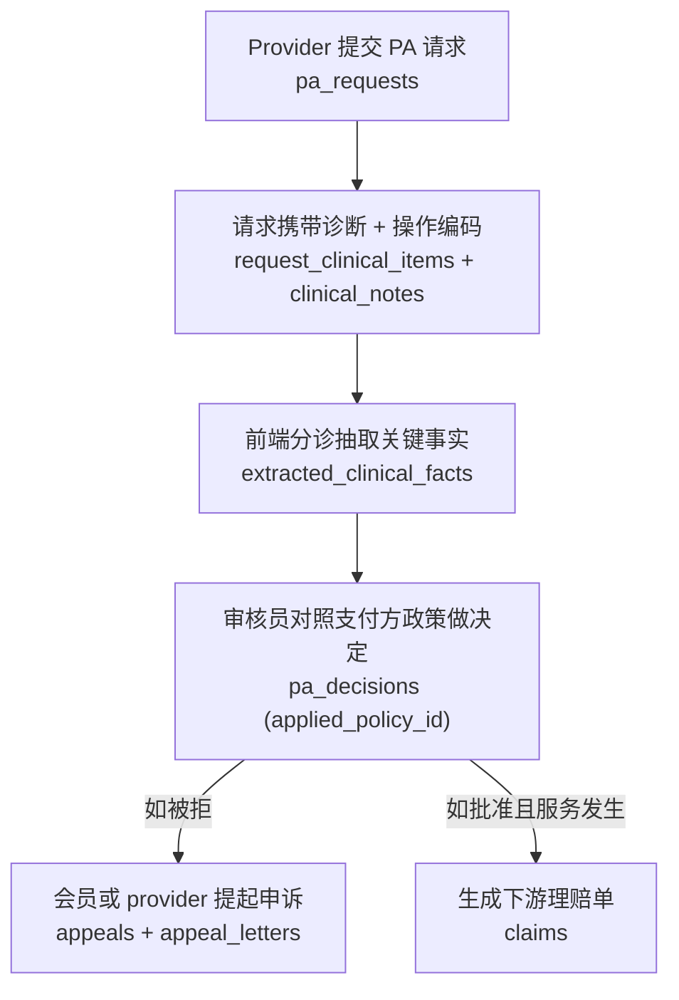
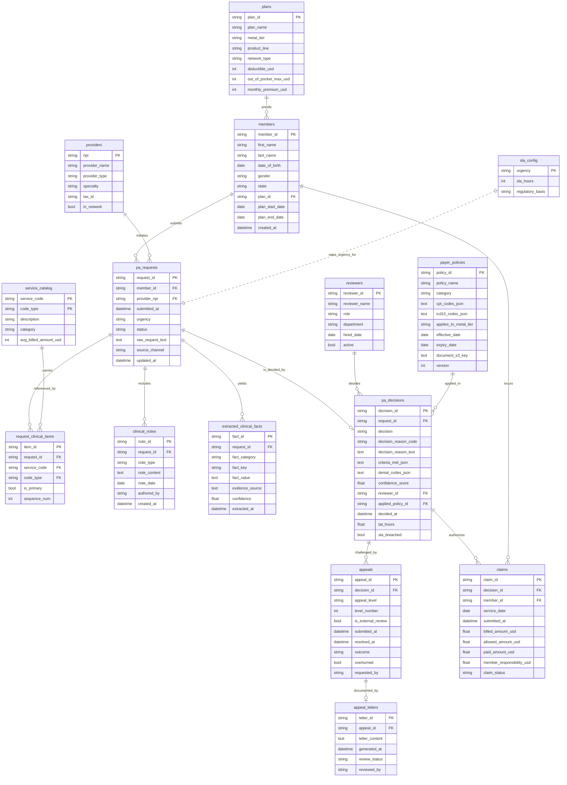

# 事前授权运营实体关系文档

> 业务背景, 行业科普, 术语表请见 `01-health_insurance_prior_authorization_high_business_context-cn.md`. 本文档只描述数据.

---

## 1. 数据集元信息

| 项目 | 值 |
|---|---|
| 数据集 | `health_insurance_prior_authorization_high` |
| 行业 | 健康保险 (3.3.2) |
| 业务场景 | 事前授权 (Prior Authorization, PA) 运营 |
| 复杂度 | 高 (High) |
| 表数量 | 15 |
| 近似总行数 | ~8,200 |
| FK 关系数 | 16 个外键关系 (含一个非 DDL 强制的政策匹配作用域规则) |
| 参考日期 (TODAY) | 生成时通过 `date.today()` 解析。生成器把所有时间戳锚定到运行当天,所以 `DATE('now', '-N days')` 滚动窗口查询永远能拿到当天附近的数据 |
| 历史窗口 | 截至 TODAY 的 12 个月 |

非 DDL 强制的作用域规则:`pa_decisions.applied_policy_id` 只有在请求的某个 CPT/HCPCS 码命中政策的 `cpt_codes_json`、政策在 `decided_at` 当天生效、且政策的层级限定与会员所在 plan 的层级匹配时才会填充。DDL 无法表达这条约束,查询时需自行尊重。

数据生成流程可以概括为下面六步,后面的表定义按这个流程展开。



---

## 2. 实体关系图



---

## 3. 表定义

### 参考维度表

#### 1. `plans`
保险计划目录。每个计划通过金属层级、产品线、网络类型加上 ACA 风格的标准费用结构来标识。

| 字段 | 类型 | 约束 | 说明 |
|---|---|---|---|
| plan_id | VARCHAR(20) | PRIMARY KEY | 例如 `PLAN-GOL-PPO-007` |
| plan_name | VARCHAR(120) | NOT NULL | 可读名称 |
| metal_tier | VARCHAR(20) | NOT NULL | `Bronze` / `Silver` / `Gold` / `Platinum` |
| product_line | VARCHAR(10) | NOT NULL | `HMO` / `PPO` / `EPO` |
| network_type | VARCHAR(20) | NOT NULL | `Closed` / `Open` / `Restricted` |
| deductible_usd | INTEGER | NOT NULL | 年度自付门槛 |
| out_of_pocket_max_usd | INTEGER | NOT NULL | 年度自付上限 |
| monthly_premium_usd | INTEGER | NOT NULL | 会员月保费 |

#### 2. `providers`
提交 PA 请求的医疗服务提供方(医生、医院、手术中心、诊所)。

| 字段 | 类型 | 约束 | 说明 |
|---|---|---|---|
| npi | VARCHAR(10) | PRIMARY KEY | 国家提供方标识符 |
| provider_name | VARCHAR(200) | NOT NULL | 提供方或机构名 |
| provider_type | VARCHAR(50) | | Physician / Hospital / Specialist / Clinic / Surgical Center |
| specialty | VARCHAR(50) | | 受控列表(10 个专科) |
| tax_id | VARCHAR(20) | | 税务识别号 |
| in_network | BOOLEAN | | ~85% 为网络内 |

#### 3. `reviewers`
被授权对 PA 请求做决定的内部员工(或自动化规则引擎)。`role` 枚举支撑自动化率、医疗主任升级率等 BI 维度。

| 字段 | 类型 | 约束 | 说明 |
|---|---|---|---|
| reviewer_id | VARCHAR(20) | PRIMARY KEY | 例如 `REV-0017` |
| reviewer_name | VARCHAR(200) | NOT NULL | 人名,或类似 `AUTO_RULE_ENGINE_v3.2` 的标识 |
| role | VARCHAR(30) | NOT NULL | `auto_rule` / `clinical_reviewer` / `medical_director` / `external_reviewer` |
| department | VARCHAR(60) | | Medical / Pharmacy / Behavioral / Specialty / Appeals / Automation |
| hired_date | DATE | | 入职日期 |
| active | BOOLEAN | | ~92% 在职 |

#### 4. `service_catalog`
PA 业务用到的 CPT / ICD-10 / HCPCS 编码主数据。复合主键 `(service_code, code_type)`。

| 字段 | 类型 | 约束 | 说明 |
|---|---|---|---|
| service_code | VARCHAR(20) | PRIMARY KEY (第 1 部分) | 例如 `27447`、`M17.11`、`J1745` |
| code_type | VARCHAR(10) | PRIMARY KEY (第 2 部分) | `CPT` / `ICD10` / `HCPCS` |
| description | TEXT | NOT NULL | 临床描述 |
| category | VARCHAR(40) | NOT NULL | `orthopedic` / `oncology` / `cardiac` / `behavioral_health` / `imaging` / `pharmacy` / `general_surgery` / `gastroenterology` / `pain_management` |
| avg_billed_amount_usd | INTEGER | | 典型计费金额(ICD-10 诊断码为 0) |

#### 5. `sla_config`
按紧急度划分的处理时限静态字典。

| 字段 | 类型 | 约束 | 说明 |
|---|---|---|---|
| urgency | VARCHAR(20) | PRIMARY KEY | `routine` / `urgent` / `emergent` |
| sla_hours | INTEGER | NOT NULL | 336 / 72 / 2 |
| regulatory_basis | VARCHAR(120) | | CMS 监管依据文本 |

#### 6. `payer_policies`
驱动决定的覆盖政策。每条政策列出其适用的操作编码(CPT 和 HCPCS — 药品 / DME 的 J 类码与 CPT 共存于同一 JSON 数组中)及适用的 ICD-10 编码,并可按金属层级限定。

| 字段 | 类型 | 约束 | 说明 |
|---|---|---|---|
| policy_id | VARCHAR(50) | PRIMARY KEY | 例如 `POL-CAR-0014` |
| policy_name | TEXT | NOT NULL | 可读标题 |
| category | VARCHAR(40) | NOT NULL | 取自 `service_catalog.category`(orthopedic、oncology...)— 显式存列,查询无需再解析 `policy_id` |
| cpt_codes_json | TEXT | | 政策覆盖的操作编码 JSON 数组(CPT **和** HCPCS),用 `json_each` 展开 |
| icd10_codes_json | TEXT | | ICD-10 编码 JSON 数组 |
| applies_to_metal_tier | VARCHAR(20) | | NULL 表示所有层级通用 |
| effective_date | DATE | | 政策生效日 |
| expiry_date | DATE | | 政策失效日 |
| document_s3_key | TEXT | | 政策 PDF 在 S3 的路径 |
| version | INTEGER | | 政策版本号(1–5) |

---

### 会员侧实体

#### 7. `members`
保险会员。保障期对齐使得 ~95% 的会员在 TODAY 仍处于有效投保状态。

| 字段 | 类型 | 约束 | 说明 |
|---|---|---|---|
| member_id | VARCHAR(20) | PRIMARY KEY | 例如 `MEM000123` |
| first_name | VARCHAR(100) | NOT NULL | |
| last_name | VARCHAR(100) | NOT NULL | |
| date_of_birth | DATE | NOT NULL | |
| gender | VARCHAR(1) | | `M` / `F` / `U`,分布 49 / 49 / 2 |
| state | VARCHAR(2) | NOT NULL | 居住州 — Meridian 在 5 个州销售(TX 70%、OK 8%、LA 8%、AR 7%、NM 7%) |
| plan_id | VARCHAR(20) | FK → plans.plan_id | |
| plan_start_date | DATE | | |
| plan_end_date | DATE | | 在职会员 > TODAY |
| created_at | TIMESTAMP | | 与 plan_start_date 00:00 一致 |

---

### PA 运营表

#### 8. `pa_requests`
主要的授权请求表。`status` 与 `pa_decisions` 行的存在性(及取值)保持一致(见下方 *业务逻辑约束*)。

| 字段 | 类型 | 约束 | 说明 |
|---|---|---|---|
| request_id | VARCHAR(36) | PRIMARY KEY | UUID 以 TEXT 存储(SQLite 无原生 UUID 类型) |
| member_id | VARCHAR(20) | FK → members.member_id | |
| provider_npi | VARCHAR(10) | FK → providers.npi | |
| submitted_at | TIMESTAMP | NOT NULL | 落在会员保障期内 |
| urgency | VARCHAR(20) | NOT NULL | `routine` (70%) / `urgent` (25%) / `emergent` (5%) |
| status | VARCHAR(30) | NOT NULL | `pending` / `in_review` / `approved` / `denied` / `pended` / `appealed` / `withdrawn` |
| raw_request_text | TEXT | | 自由文本请求负载 |
| source_channel | VARCHAR(20) | | `portal` (45%) / `ehr_api` (30%) / `fax` (20%) / `phone` (5%) |
| updated_at | TIMESTAMP | | 最近更新时间 |

#### 9. `request_clinical_items`
挂载在请求上的 ICD-10、CPT、HCPCS 行项。通过复合 `(service_code, code_type)` 引用 `service_catalog`。

| 字段 | 类型 | 约束 | 说明 |
|---|---|---|---|
| item_id | VARCHAR(36) | PRIMARY KEY | |
| request_id | VARCHAR(36) | FK → pa_requests.request_id | |
| service_code | VARCHAR(20) | FK → service_catalog.service_code | |
| code_type | VARCHAR(10) | FK → service_catalog.code_type | |
| is_primary | BOOLEAN | DEFAULT FALSE | 首条 ICD-10 + 首条 CPT/HCPCS |
| sequence_num | INTEGER | | 从 1 开始的顺序号 |

#### 10. `clinical_notes`
非结构化的医师文档。强制 `note_date <= submitted_at`。

| 字段 | 类型 | 约束 | 说明 |
|---|---|---|---|
| note_id | VARCHAR(36) | PRIMARY KEY | |
| request_id | VARCHAR(36) | FK → pa_requests.request_id | |
| note_type | VARCHAR(50) | | `physician_letter` / `lab_results` / `imaging_report` / `treatment_history` / `referral` |
| note_content | TEXT | NOT NULL | 真实感的模板化内容 |
| note_date | DATE | | ≤ submitted_at,且在提交前 180 天内 |
| authored_by | VARCHAR(200) | | 医师姓名 |
| created_at | TIMESTAMP | | |

#### 11. `extracted_clinical_facts`
由前端分诊环节从非结构化笔记中抽取的结构化键值事实。仅为有(或将有)决定的请求生成(即 status 不在 `pending` / `in_review` / `withdrawn` 之列)。抽取在提交后 4 小时内完成。

| 字段 | 类型 | 约束 | 说明 |
|---|---|---|---|
| fact_id | VARCHAR(36) | PRIMARY KEY | |
| request_id | VARCHAR(36) | FK → pa_requests.request_id | |
| fact_category | VARCHAR(50) | NOT NULL | `prior_treatment` / `diagnosis_confirmed` / `functional_status` / `lab_result` / `contraindication` / `duration_of_condition` / `medication_history` |
| fact_key | VARCHAR(200) | NOT NULL | 例如 `conservative_treatment_duration` |
| fact_value | TEXT | NOT NULL | |
| evidence_source | TEXT | | 支撑该事实的笔记摘录 |
| confidence | FLOAT | | 0.70 – 0.99 |
| extracted_at | TIMESTAMP | | 距 `submitted_at` 5–240 分钟,不超过 TODAY |

#### 12. `pa_decisions`
**每个请求恰好一个决定**(1:1,由 `UNIQUE(request_id)` 约束保证)。仅当请求达到终态或近终态时才存在该行。

| 字段 | 类型 | 约束 | 说明 |
|---|---|---|---|
| decision_id | VARCHAR(36) | PRIMARY KEY | |
| request_id | VARCHAR(36) | FK → pa_requests.request_id, UNIQUE | |
| decision | VARCHAR(20) | NOT NULL | `approved` / `denied` / `pended` / `partial_approved` / `escalated` |
| decision_reason_code | VARCHAR(50) | | 主导拒绝码(CARC)或 `PARTIAL` |
| decision_reason_text | TEXT | NOT NULL | 短可读标签(≤ 1 句) |
| criteria_met_json | TEXT | | JSON 对象:3–6 个准则键映射到 true / false |
| denial_codes_json | TEXT | | CARC/RARC 码 JSON 数组(非拒绝时为 NULL) |
| confidence_score | FLOAT | | 0.55 – 0.99,`pended` / `escalated` 偏低 |
| reviewer_id | VARCHAR(20) | FK → reviewers.reviewer_id | |
| applied_policy_id | VARCHAR(50) | FK → payer_policies.policy_id | 未匹配任何政策时为 NULL |
| decided_at | TIMESTAMP | NOT NULL | ≥ submitted_at,≤ TODAY |
| tat_hours | FLOAT | NOT NULL | 物化处理时长(decided_at − submitted_at,单位小时)。SLA 查询无需再算 JULIANDAY。 |
| sla_breached | BOOLEAN | NOT NULL | 当 `tat_hours > sla_config.sla_hours`(按请求紧急度)时为 TRUE。物化字段。 |

#### 13. `appeals`
针对拒绝决定发起的申诉 **流程**。一个拒绝可能对应该表的最多三行,代表三个申诉层级。

| 字段 | 类型 | 约束 | 说明 |
|---|---|---|---|
| appeal_id | VARCHAR(36) | PRIMARY KEY | |
| decision_id | VARCHAR(36) | FK → pa_decisions.decision_id | 永远引用一个拒绝 |
| appeal_level | VARCHAR(20) | NOT NULL | 可读标签:`1` / `2` / `external` |
| level_number | INTEGER | NOT NULL | `1`(第一次内审)/ `2`(第二次内审)/ `3`(外部审查),可排序 |
| is_external_review | BOOLEAN | NOT NULL | `level_number = 3`(独立审查机构 IRO)时为 TRUE |
| submitted_at | TIMESTAMP | NOT NULL | 上一步解决后 3–30 天 |
| resolved_at | TIMESTAMP | | 未结案时为 NULL |
| outcome | VARCHAR(20) | NOT NULL | `upheld`(维持)/ `overturned`(推翻)/ `pending`(待定) |
| overturned | BOOLEAN | | `outcome = 'overturned'` 的便捷布尔 |
| requested_by | VARCHAR(30) | | `member`(~30%)/ `provider`(~70%) |

#### 14. `appeal_letters`
生成的申诉信件 — 每条 appeal 对应一封信。

| 字段 | 类型 | 约束 | 说明 |
|---|---|---|---|
| letter_id | VARCHAR(36) | PRIMARY KEY | |
| appeal_id | VARCHAR(36) | FK → appeals.appeal_id | |
| letter_content | TEXT | NOT NULL | |
| generated_at | TIMESTAMP | | |
| review_status | VARCHAR(20) | | `draft` / `sent` / `accepted` / `rejected` |
| reviewed_by | VARCHAR(200) | | 终审定稿的审核员 |

#### 15. `claims`
服务实际开展后的下游保险理赔单。批准(或部分批准)决定中 ~60% 转化为 claim。

| 字段 | 类型 | 约束 | 说明 |
|---|---|---|---|
| claim_id | VARCHAR(36) | PRIMARY KEY | |
| decision_id | VARCHAR(36) | FK → pa_decisions.decision_id | |
| member_id | VARCHAR(20) | FK → members.member_id | |
| service_date | DATE | | 介于决定日期与 TODAY-1 之间 |
| submitted_at | TIMESTAMP | | service_date 之后 0–14 天 |
| billed_amount_usd | FLOAT | | CPT 级别平均计费 × 抖动后求和 |
| allowed_amount_usd | FLOAT | | 计划允许金额(计费金额的 55–92%) |
| paid_amount_usd | FLOAT | | 允许金额 − 会员自付 |
| member_responsibility_usd | FLOAT | | 共付 + 自付 + 共保 |
| claim_status | VARCHAR(20) | | `paid`(85%)/ `pending`(10%)/ `denied`(5%) |

---

## 4. 数据生成规则

### 业务逻辑约束(强制)

1. **时间一致性**
   - `members.plan_end_date > members.plan_start_date`。
   - `pa_requests.submitted_at` 落在 `[plan_start_date, plan_end_date)` 内。
   - `clinical_notes.note_date <= DATE(pa_requests.submitted_at)`。
   - `pa_decisions.decided_at >= pa_requests.submitted_at`,90% 命中 SLA 窗口,10% 是 breach 长尾。
   - `claims.service_date >= pa_decisions.decided_at`。
   - `appeals.submitted_at >= pa_decisions.decided_at`。

2. **引用完整性**
   - 每个外键都能解析到有效父行。
   - `pa_decisions.request_id` 是 **UNIQUE**(与请求 1:1)。
   - `appeals` 只引用 `decision = 'denied'` 的 `pa_decisions` 行。
   - `claims` 只引用 `decision IN ('approved', 'partial_approved')` 的 `pa_decisions` 行。
   - `pa_decisions.applied_policy_id` 仅在以下条件全部满足时填充:请求至少有一个 CPT 码出现在政策的 `cpt_codes_json` 中、政策在 `decided_at` 当日处于生效期、政策的层级限定(若有)与会员所在 plan 的层级匹配。

3. **状态 ↔ 决定一致性**
   | pa_requests.status | 是否有 decision 行? | pa_decisions.decision |
   |---|---|---|
   | `pending`     | 否  | — |
   | `in_review`   | 否  | — |
   | `withdrawn`   | 否  | — |
   | `approved`    | 是 | `approved`(90%)或 `partial_approved`(10%) |
   | `denied`      | 是 | `denied` |
   | `pended`      | 是 | `pended`(75%)或 `escalated`(25%) |
   | `appealed`    | 是 | `denied`(原始决定) |

4. **真实分布(实际生成数据上观测到的)**
   - `pa_requests.status` 构成:approved ~55%、denied ~20%、pended ~6%、pending ~6%、in_review ~5%、appealed ~5%、withdrawn ~4%。状态权重按层级倾斜(Bronze 偏拒、Platinum 偏批);生成器额外预留约 70 条 `pending` / `in_review` 状态的"在途请求"(50 routine + 15 urgent + 5 emergent),让开放队列指标有可观测的样本量。
   - `pa_decisions.decision` 构成(按已决定请求计):approved ~59%、denied ~27%、partial_approved ~6%、pended ~5%、escalated ~2%。
   - 按金属层级的批准率:Bronze ~50%、Silver ~61%、Gold ~68%、Platinum ~84%。
   - 会员自付占比(% of allowed):Bronze ~30%、Silver ~24%、Gold ~17%、Platinum ~13%。
   - 85% 的 provider 为网络内。
   - 92% 的 reviewer 在职。
   - 性别:49% M / 49% F / 2% U。
   - 紧急度:70% routine / 25% urgent / 5% emergent。
   - 会员和 provider 的请求量服从 3 桶 Pareto 分布:顶部 10% 的会员承担约 25% 的请求;顶部 10% 的 provider 同样约 25%。

5. **申诉流程**
   - 约 60% 的拒绝决定会触发至少一次申诉(`status = 'appealed'` 的请求强制触发,另外 50% 的未打标拒绝随机进入申诉漏斗)。
   - **有效升级率**(经过被推翻、待定等链路短路扣减后):约 25-30% 的 L1 申诉抵达 L2,约 25-35% 的 L2 抵达外部审查(独立审查机构 IRO,在数据里以 `level_number = 3` 且 `is_external_review = TRUE` 表示)。内部升级闸门以 50/50 概率触发,但约 35% 的 L1 案被推翻、5-10% 仍在 pending — 两者都会在抵达 L2 前结束链路(L2 至 external 同理)。
   - 各层级推翻率:L1 ~35%、L2 ~25%、外部 ~25%。

6. **理赔转化**
   - 批准(或部分批准)决定中 ~60% 会转化为 claim(其余即"漏损")。
   - **建模简化**:本数据集每条已转化的授权只生成 1 条 claim。真实业务中一条"PT 12 周"之类的长期治疗授权会产生多条 claim;为了让 BI 表面简洁,这里把 1:N 折叠成 1:1。
   - Provider 类型影响计费金额:Hospital ×1.5、Surgical Center ×1.8、Clinic ×0.7、Physician ×1.0、Specialist ×1.1。
   - Claim 状态:paid 85% / pending 10% / denied 5%。

7. **SLA 配置**
   - Routine:336 小时(14 天,CMS 标准)。
   - Urgent:72 小时(CMS 加急)。
   - Emergent:2 小时(内部 SLA)。

### 业务陷阱声明(刻意注入的偏置)

下面这些偏置是生成器刻意注入的,对应业务背景文档里的业务问题。SQL 查询文档里有对应查询把它们暴露出来。这些不是数据 bug,而是要被分析发现的业务现象。

| 陷阱 | 注入的量级 | 对应业务问题 | 暴露它的查询 |
|---|---|---|---|
| 批准率随金属层级倾斜 | Bronze ~50%、Silver ~61%、Gold ~68%、Platinum ~84% | 问题二:批准是否公平 | Query 2 |
| 会员自付随层级倾斜 | Bronze ~30%、Silver ~24%、Gold ~17%、Platinum ~13% (占 allowed) | 问题二 / 精算核对 | Query 27 |
| 拒绝码 Pareto 集中 | N-130 与 CO-50 合占拒绝码提及的 ~50%,头 4 个码累计 ~80% | 问题三:拒绝原因集中度 | Query 30、Query 3 |
| 授权到理赔漏损 | 批准决定中仅 ~60% 转化为 claim,~40% 漏损 | 问题四:漏损 | Query 9 |
| 申诉漏斗与推翻率 | 拒绝中 ~60% 提 L1 申诉;推翻率 L1 ~35%、L2 ~25%、外部 ~25% | 问题五:申诉与首审质量 | Query 11、Query 12、Query 28 |
| 自动化份额 | auto_rule 承担 ~30-40% 的决定且偏批准 | 问题六:自动化效果 | Query 23、Query 4 |
| SLA 违约长尾 | 各紧急度注入 ~10% 的 breach 长尾 | 问题一:处理时限 | Query 6、Query 5 |
| 会员 / provider 请求量幂律 | 顶部 10% 的会员 / provider 各承担约 25% 的请求 | 慢性病 cohort / 高量 provider | Query 19、Query 26 |
| 开放队列与滞留请求 | 预留 ~70 条在途请求,其中 ~10% 超 SLA 滞留 | 问题一:开放队列 | Query 18、Query 29 |

### 存储约定(SQLite 专属)

SQLite 没有原生 ARRAY、JSONB 或 UUID 类型。生成器约定:

- **UUID** 以 `VARCHAR(36)`(规范带连字符形式)存储。
- **JSON 数组 / 对象**(`denial_codes_json`、`criteria_met_json`、`cpt_codes_json`、`icd10_codes_json`)以 `TEXT` 存储紧凑 JSON 文档。需要展开时用 `json_each(column)`:

  ```sql
  SELECT je.value AS cpt_code, COUNT(*) AS n
  FROM payer_policies pp, json_each(pp.cpt_codes_json) je
  GROUP BY je.value;
  ```

- **布尔值**由 SQLAlchemy `Boolean` 类型映射为 `INTEGER`(0 / 1)。

### 确定性

所有生成器都设了种子(`Faker.seed(42)`、`random.seed(42)`)。同一天内重新生成可产出字节一致的 TSV 文件。

---

## 5. Faker 策略

生成器用 `Faker(en_US)` 加种子 42。下表把常见字段模式映射到对应的 Faker 方法或抽样策略,并给一句缘由。

| 字段模式 | Faker 方法 / 策略 | 说明 |
|---|---|---|
| member first_name / last_name | `fake.first_name()` / `fake.last_name()` | 北美人名 |
| date_of_birth | `fake.date_of_birth(18, 85)` | 成年会员年龄区间 |
| member state | 按权重抽样 `MEMBER_STATE_WEIGHTS` | 限定在 Meridian 销售的 5 个州 (TX 主导) |
| provider_name (机构) | `fake.company()` 或 `{姓} + 类型后缀` | Hospital / Clinic / Surgical Center 用机构名 |
| provider_name (个人) | `Dr. {fake.name()}` | Physician / Specialist 用医生名 |
| npi | `1000000000 + i` 顺序生成 | 10 位国家提供方标识符 |
| tax_id | `random.randint` 拼 `NN-NNNNNNN` | 税号格式 |
| in_network | `random.random() < 0.85` | ~85% 网络内 |
| reviewer role | 按权重抽样 `REVIEWER_ROLES` | auto_rule / clinical_reviewer / medical_director / external_reviewer |
| service_code / icd / cpt | 取自 `SERVICE_CATALOG_SEED` 真实编码表 | CPT / ICD-10 / HCPCS 均为真实标识符 |
| urgency | 按权重抽样 `URGENCY_WEIGHTS` | routine 70% / urgent 25% / emergent 5% |
| status | 按层级权重抽样 `TIER_STATUS_WEIGHTS` | 倾斜出层级批准率差 |
| denial code | 按 Pareto 权重抽样 `DENIAL_CODES` | 制造拒绝码集中度 |
| raw_request_text / note_content | `fake.paragraph()` + 模板填空 | 真实感的临床文本 |
| member / provider 抽样 | 三桶 Pareto 权重 `bucketed_pareto_weights` | 制造高量会员 / provider 幂律 |
| 各类时间戳 | `rand_dt_between` + `clamp_to_today` | 锚定到 TODAY,保证时序一致 |
| 金额 (billed/allowed/paid) | `avg_billed_amount_usd` × 抖动 × 类型乘子 | 层级与 provider 类型影响金额 |

---

## 6. 文件清单

生成的文件位于 `dataset/health_insurance_prior_authorization_high/`:

### 数据文件 (TSV)

| # | 文件名 | 表 | 行数 | 依赖 |
|---|---|---|---|---|
| 01 | `01_plans.tsv` | plans | 12 | — |
| 02 | `02_providers.tsv` | providers | 150 | — |
| 03 | `03_reviewers.tsv` | reviewers | 30 | — |
| 04 | `04_service_catalog.tsv` | service_catalog | 100 | — |
| 05 | `05_sla_config.tsv` | sla_config | 3 | — |
| 06 | `06_payer_policies.tsv` | payer_policies | 50 | service_catalog |
| 07 | `07_members.tsv` | members | 400 | plans |
| 08 | `08_pa_requests.tsv` | pa_requests | 700 | members, providers |
| 09 | `09_request_clinical_items.tsv` | request_clinical_items | ~2,300 | pa_requests, service_catalog, providers |
| 10 | `10_clinical_notes.tsv` | clinical_notes | ~1,380 | pa_requests |
| 11 | `11_extracted_clinical_facts.tsv` | extracted_clinical_facts | ~1,980 | pa_requests |
| 12 | `12_pa_decisions.tsv` | pa_decisions | ~670 | pa_requests, reviewers, payer_policies |
| 13 | `13_appeals.tsv` | appeals | ~85 | pa_decisions |
| 14 | `14_appeal_letters.tsv` | appeal_letters | ~85 | appeals |
| 15 | `15_claims.tsv` | claims | ~255 | pa_decisions, members, providers |

**总行数(近似):** ~8,200

### 其他文件

- `01-health_insurance_prior_authorization_high_business_context-cn.md` 业务背景文档 (中文版)
- `02-health_insurance_prior_authorization_high_er_document-cn.md` 本文档 (中文版)
- `03-health_insurance_prior_authorization_high_sql_queries-cn.md` 30 个业务 SQL 查询 (中文版)
- `04-health_insurance_prior_authorization_high_data_generator-cn.py` 生成器脚本 (中文注释版)
- `health_insurance_prior_authorization_high.sqlite` SQLite 数据库 (运行生成器后产生)

英文版四份文件由 translate-to-en 流程在后续生成,这里不列出。

---

## 7. SQLite DDL

下面是 15 张表的 `CREATE TABLE` 语句,按拓扑顺序排列 (父表在前),可直接粘贴到 SQLite shell 运行。类型与 `04-...-data_generator-cn.py` 里的 SQLAlchemy 模型一一对应 (Boolean 在 SQLite 里实际以 INTEGER 0/1 存储)。

```sql
CREATE TABLE plans (
    plan_id               VARCHAR(20)  PRIMARY KEY,
    plan_name             VARCHAR(120) NOT NULL,
    metal_tier            VARCHAR(20)  NOT NULL,
    product_line          VARCHAR(10)  NOT NULL,
    network_type          VARCHAR(20)  NOT NULL,
    deductible_usd        INTEGER      NOT NULL,
    out_of_pocket_max_usd INTEGER      NOT NULL,
    monthly_premium_usd   INTEGER      NOT NULL
);

CREATE TABLE providers (
    npi           VARCHAR(10)  PRIMARY KEY,
    provider_name VARCHAR(200) NOT NULL,
    provider_type VARCHAR(50),
    specialty     VARCHAR(50),
    tax_id        VARCHAR(20),
    in_network    BOOLEAN
);

CREATE TABLE reviewers (
    reviewer_id   VARCHAR(20)  PRIMARY KEY,
    reviewer_name VARCHAR(200) NOT NULL,
    role          VARCHAR(30)  NOT NULL,
    department    VARCHAR(60),
    hired_date    DATE,
    active        BOOLEAN
);

CREATE TABLE service_catalog (
    service_code          VARCHAR(20) NOT NULL,
    code_type             VARCHAR(10) NOT NULL,
    description           TEXT        NOT NULL,
    category              VARCHAR(40) NOT NULL,
    avg_billed_amount_usd INTEGER,
    PRIMARY KEY (service_code, code_type)
);

CREATE TABLE sla_config (
    urgency          VARCHAR(20)  PRIMARY KEY,
    sla_hours        INTEGER      NOT NULL,
    regulatory_basis VARCHAR(120)
);

CREATE TABLE payer_policies (
    policy_id             VARCHAR(50) PRIMARY KEY,
    policy_name           TEXT        NOT NULL,
    category              VARCHAR(40) NOT NULL,
    cpt_codes_json        TEXT,
    icd10_codes_json      TEXT,
    applies_to_metal_tier VARCHAR(20),
    effective_date        DATE,
    expiry_date           DATE,
    document_s3_key       TEXT,
    version               INTEGER     DEFAULT 1
);

CREATE TABLE members (
    member_id       VARCHAR(20)  PRIMARY KEY,
    first_name      VARCHAR(100) NOT NULL,
    last_name       VARCHAR(100) NOT NULL,
    date_of_birth   DATE         NOT NULL,
    gender          VARCHAR(1),
    state           VARCHAR(2)   NOT NULL,
    plan_id         VARCHAR(20)  REFERENCES plans(plan_id),
    plan_start_date DATE,
    plan_end_date   DATE,
    created_at      DATETIME
);

CREATE TABLE pa_requests (
    request_id       VARCHAR(36) PRIMARY KEY,
    member_id        VARCHAR(20) REFERENCES members(member_id),
    provider_npi     VARCHAR(10) REFERENCES providers(npi),
    submitted_at     DATETIME    NOT NULL,
    urgency          VARCHAR(20) NOT NULL,
    status           VARCHAR(30) NOT NULL,
    raw_request_text TEXT,
    source_channel   VARCHAR(20),
    updated_at       DATETIME
);

CREATE TABLE request_clinical_items (
    item_id      VARCHAR(36) PRIMARY KEY,
    request_id   VARCHAR(36) REFERENCES pa_requests(request_id),
    service_code VARCHAR(20),
    code_type    VARCHAR(10),
    is_primary   BOOLEAN     DEFAULT 0,
    sequence_num INTEGER
);

CREATE TABLE clinical_notes (
    note_id      VARCHAR(36) PRIMARY KEY,
    request_id   VARCHAR(36) REFERENCES pa_requests(request_id),
    note_type    VARCHAR(50),
    note_content TEXT        NOT NULL,
    note_date    DATE,
    authored_by  VARCHAR(200),
    created_at   DATETIME
);

CREATE TABLE extracted_clinical_facts (
    fact_id         VARCHAR(36)  PRIMARY KEY,
    request_id      VARCHAR(36)  REFERENCES pa_requests(request_id),
    fact_category   VARCHAR(50)  NOT NULL,
    fact_key        VARCHAR(200) NOT NULL,
    fact_value      TEXT         NOT NULL,
    evidence_source TEXT,
    confidence      FLOAT,
    extracted_at    DATETIME
);

CREATE TABLE pa_decisions (
    decision_id          VARCHAR(36) PRIMARY KEY,
    request_id           VARCHAR(36) NOT NULL UNIQUE REFERENCES pa_requests(request_id),
    decision             VARCHAR(20) NOT NULL,
    decision_reason_code VARCHAR(50),
    decision_reason_text TEXT        NOT NULL,
    criteria_met_json    TEXT,
    denial_codes_json    TEXT,
    confidence_score     FLOAT,
    reviewer_id          VARCHAR(20) REFERENCES reviewers(reviewer_id),
    applied_policy_id    VARCHAR(50) REFERENCES payer_policies(policy_id),
    decided_at           DATETIME    NOT NULL,
    tat_hours            FLOAT       NOT NULL,
    sla_breached         BOOLEAN     NOT NULL
);

CREATE TABLE appeals (
    appeal_id          VARCHAR(36) PRIMARY KEY,
    decision_id        VARCHAR(36) REFERENCES pa_decisions(decision_id),
    appeal_level       VARCHAR(20) NOT NULL,
    level_number       INTEGER     NOT NULL,
    is_external_review BOOLEAN     NOT NULL,
    submitted_at       DATETIME    NOT NULL,
    resolved_at        DATETIME,
    outcome            VARCHAR(20) NOT NULL,
    overturned         BOOLEAN     DEFAULT 0,
    requested_by       VARCHAR(30)
);

CREATE TABLE appeal_letters (
    letter_id      VARCHAR(36) PRIMARY KEY,
    appeal_id      VARCHAR(36) REFERENCES appeals(appeal_id),
    letter_content TEXT        NOT NULL,
    generated_at   DATETIME,
    review_status  VARCHAR(20),
    reviewed_by    VARCHAR(200)
);

CREATE TABLE claims (
    claim_id                  VARCHAR(36) PRIMARY KEY,
    decision_id               VARCHAR(36) REFERENCES pa_decisions(decision_id),
    member_id                 VARCHAR(20) REFERENCES members(member_id),
    service_date              DATE,
    submitted_at              DATETIME,
    billed_amount_usd         FLOAT,
    allowed_amount_usd        FLOAT,
    paid_amount_usd           FLOAT,
    member_responsibility_usd FLOAT,
    claim_status              VARCHAR(20)
);
```

---

## 8. 使用示例

### 加载数据库

```python
from sqlalchemy import create_engine
from sqlalchemy.orm import Session

engine = create_engine("sqlite:///health_insurance_prior_authorization_high.sqlite")
```

### 按金属层级看批准率

```sql
SELECT pl.metal_tier,
       COUNT(*)                                                          AS total_decisions,
       SUM(CASE WHEN d.decision = 'approved' THEN 1 ELSE 0 END)          AS approved,
       ROUND(100.0 * SUM(CASE WHEN d.decision = 'approved' THEN 1 ELSE 0 END)
                  / COUNT(*), 2)                                         AS approval_rate_pct
FROM pa_decisions d
JOIN pa_requests r ON d.request_id = r.request_id
JOIN members     m ON r.member_id  = m.member_id
JOIN plans       pl ON m.plan_id   = pl.plan_id
GROUP BY pl.metal_tier
ORDER BY approval_rate_pct DESC;
```

### 高频拒绝码(结构化)

```sql
SELECT je.value AS denial_code, COUNT(*) AS occurrences
FROM pa_decisions d, json_each(d.denial_codes_json) je
WHERE d.denial_codes_json IS NOT NULL
GROUP BY je.value
ORDER BY occurrences DESC;
```

### 申诉推翻率

```sql
SELECT appeal_level,
       COUNT(*)                                       AS total_resolved,
       SUM(CASE WHEN overturned THEN 1 ELSE 0 END)    AS overturned,
       ROUND(100.0 * SUM(CASE WHEN overturned THEN 1 ELSE 0 END)
                  / COUNT(*), 1)                      AS overturn_rate_pct
FROM appeals
WHERE outcome <> 'pending'
GROUP BY appeal_level;
```

---

## 9. 数据质量说明

- **可复现性** — `faker` 与 `random` 均使用种子 42。同一天内重新生成产出的 TSV 字节一致;跨天重生成因 TODAY 移动,各行的具体内容会变,但行数和分布保持在同一档位。
- **时间锚点** — 所有时间戳锚定到生成时刻的 `date.today()`。使用 `DATE('now', '-N days')` 的 SQL 查询永远能拿到数据,因为每次重生成都会把数据重新对准当天。
- **真实感** — 临床编码(CPT、ICD-10、HCPCS)与拒绝码(CO-97、N-130 等)均为真实世界标识符。
- **完整性** — 必填列无 NULL;可空列在表定义里逐列说明。
- **内部一致性** — 文档声明的每一项不变量在生成后都做了校验;参见 `_sql_queries.md` 中的合规性检查类查询。

---

**ER 文档完**
