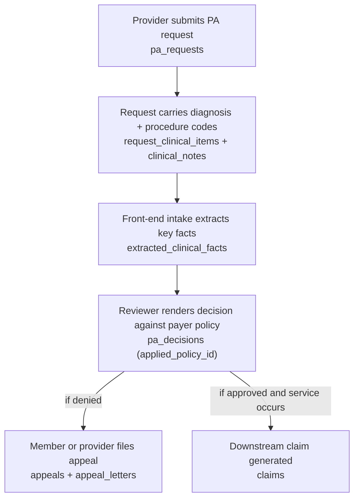
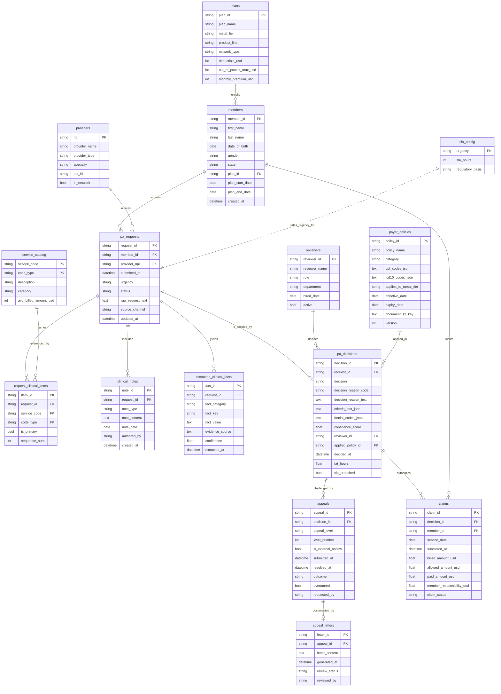

# Prior Authorization Operations Entity Relationship Document

> For business background, industry primer, and glossary, see `01-health_insurance_prior_authorization_high_business_context.md`. This document only describes the data.

---

## 1. Dataset Metadata

| Item | Value |
|---|---|
| Dataset | `health_insurance_prior_authorization_high` |
| Industry | Health Insurance (3.3.2) |
| Business scenario | Prior Authorization (PA) operations |
| Complexity | High |
| Table count | 15 |
| Approximate total rows | ~8,200 |
| FK relationships | 16 foreign key relationships (including one non-DDL-enforced policy match scoping rule) |
| Reference date (TODAY) | Resolved at generation time via `date.today()`. The generator anchors all timestamps to the run day, so `DATE('now', '-N days')` rolling-window queries always return data near the current day |
| History window | 12 months ending at TODAY |

Non-DDL-enforced scoping rule: `pa_decisions.applied_policy_id` is only populated when one of the request's CPT/HCPCS codes appears in the policy's `cpt_codes_json`, the policy is active on `decided_at`, and the policy's tier restriction matches the metal tier of the member's plan. DDL cannot express this constraint; queries need to respect it themselves.

The data generation flow can be summarized in the six steps below; the table definitions later in the document follow this flow.



---

## 2. Entity Relationship Diagram



---

## 3. Table Definitions

### Reference Dimension Tables

#### 1. `plans`
Insurance plan catalog. Each plan is identified by metal tier, product line, network type, and an ACA-style standard cost structure.

| Field | Type | Constraint | Notes |
|---|---|---|---|
| plan_id | VARCHAR(20) | PRIMARY KEY | e.g., `PLAN-GOL-PPO-007` |
| plan_name | VARCHAR(120) | NOT NULL | Human-readable name |
| metal_tier | VARCHAR(20) | NOT NULL | `Bronze` / `Silver` / `Gold` / `Platinum` |
| product_line | VARCHAR(10) | NOT NULL | `HMO` / `PPO` / `EPO` |
| network_type | VARCHAR(20) | NOT NULL | `Closed` / `Open` / `Restricted` |
| deductible_usd | INTEGER | NOT NULL | Annual out-of-pocket threshold |
| out_of_pocket_max_usd | INTEGER | NOT NULL | Annual out-of-pocket cap |
| monthly_premium_usd | INTEGER | NOT NULL | Monthly member premium |

#### 2. `providers`
Healthcare providers (physicians, hospitals, surgical centers, clinics) who submit PA requests.

| Field | Type | Constraint | Notes |
|---|---|---|---|
| npi | VARCHAR(10) | PRIMARY KEY | National Provider Identifier |
| provider_name | VARCHAR(200) | NOT NULL | Provider or facility name |
| provider_type | VARCHAR(50) | | Physician / Hospital / Specialist / Clinic / Surgical Center |
| specialty | VARCHAR(50) | | Controlled list (10 specialties) |
| tax_id | VARCHAR(20) | | Tax identification number |
| in_network | BOOLEAN | | ~85% in-network |

#### 3. `reviewers`
Internal staff (or the automated rules engine) authorized to render PA decisions. The `role` enum supports BI dimensions like automation rate and medical director escalation rate.

| Field | Type | Constraint | Notes |
|---|---|---|---|
| reviewer_id | VARCHAR(20) | PRIMARY KEY | e.g., `REV-0017` |
| reviewer_name | VARCHAR(200) | NOT NULL | Person name, or an identifier like `AUTO_RULE_ENGINE_v3.2` |
| role | VARCHAR(30) | NOT NULL | `auto_rule` / `clinical_reviewer` / `medical_director` / `external_reviewer` |
| department | VARCHAR(60) | | Medical / Pharmacy / Behavioral / Specialty / Appeals / Automation |
| hired_date | DATE | | Hire date |
| active | BOOLEAN | | ~92% active |

#### 4. `service_catalog`
Master data for CPT / ICD-10 / HCPCS codes used by the PA business. Composite primary key `(service_code, code_type)`.

| Field | Type | Constraint | Notes |
|---|---|---|---|
| service_code | VARCHAR(20) | PRIMARY KEY (part 1) | e.g., `27447`, `M17.11`, `J1745` |
| code_type | VARCHAR(10) | PRIMARY KEY (part 2) | `CPT` / `ICD10` / `HCPCS` |
| description | TEXT | NOT NULL | Clinical description |
| category | VARCHAR(40) | NOT NULL | `orthopedic` / `oncology` / `cardiac` / `behavioral_health` / `imaging` / `pharmacy` / `general_surgery` / `gastroenterology` / `pain_management` |
| avg_billed_amount_usd | INTEGER | | Typical billed amount (0 for ICD-10 diagnosis codes) |

#### 5. `sla_config`
Static dictionary of turnaround times by urgency.

| Field | Type | Constraint | Notes |
|---|---|---|---|
| urgency | VARCHAR(20) | PRIMARY KEY | `routine` / `urgent` / `emergent` |
| sla_hours | INTEGER | NOT NULL | 336 / 72 / 2 |
| regulatory_basis | VARCHAR(120) | | CMS regulatory citation text |

#### 6. `payer_policies`
Coverage policies that drive decisions. Each policy lists the procedure codes it covers (CPT and HCPCS - drug/DME J-codes coexist with CPT in the same JSON array) and the applicable ICD-10 codes, and may be restricted by metal tier.

| Field | Type | Constraint | Notes |
|---|---|---|---|
| policy_id | VARCHAR(50) | PRIMARY KEY | e.g., `POL-CAR-0014` |
| policy_name | TEXT | NOT NULL | Human-readable title |
| category | VARCHAR(40) | NOT NULL | Taken from `service_catalog.category` (orthopedic, oncology...) - stored explicitly so queries do not need to parse `policy_id` |
| cpt_codes_json | TEXT | | JSON array of procedure codes the policy covers (CPT **and** HCPCS); unpack with `json_each` |
| icd10_codes_json | TEXT | | JSON array of ICD-10 codes |
| applies_to_metal_tier | VARCHAR(20) | | NULL means applies to all tiers |
| effective_date | DATE | | Policy effective date |
| expiry_date | DATE | | Policy expiry date |
| document_s3_key | TEXT | | S3 path to the policy PDF |
| version | INTEGER | | Policy version number (1-5) |

---

### Member-Side Entities

#### 7. `members`
Insurance members. Coverage-period alignment is such that ~95% of members are still actively enrolled at TODAY.

| Field | Type | Constraint | Notes |
|---|---|---|---|
| member_id | VARCHAR(20) | PRIMARY KEY | e.g., `MEM000123` |
| first_name | VARCHAR(100) | NOT NULL | |
| last_name | VARCHAR(100) | NOT NULL | |
| date_of_birth | DATE | NOT NULL | |
| gender | VARCHAR(1) | | `M` / `F` / `U`, distributed 49 / 49 / 2 |
| state | VARCHAR(2) | NOT NULL | State of residence - Meridian sells in 5 states (TX 70%, OK 8%, LA 8%, AR 7%, NM 7%) |
| plan_id | VARCHAR(20) | FK -> plans.plan_id | |
| plan_start_date | DATE | | |
| plan_end_date | DATE | | > TODAY for active members |
| created_at | TIMESTAMP | | Aligned with plan_start_date 00:00 |

---

### PA Operations Tables

#### 8. `pa_requests`
The main authorization request table. `status` stays consistent with the existence (and value) of the corresponding `pa_decisions` row (see *Business logic constraints* below).

| Field | Type | Constraint | Notes |
|---|---|---|---|
| request_id | VARCHAR(36) | PRIMARY KEY | UUID stored as TEXT (SQLite has no native UUID type) |
| member_id | VARCHAR(20) | FK -> members.member_id | |
| provider_npi | VARCHAR(10) | FK -> providers.npi | |
| submitted_at | TIMESTAMP | NOT NULL | Falls within the member's coverage period |
| urgency | VARCHAR(20) | NOT NULL | `routine` (70%) / `urgent` (25%) / `emergent` (5%) |
| status | VARCHAR(30) | NOT NULL | `pending` / `in_review` / `approved` / `denied` / `pended` / `appealed` / `withdrawn` |
| raw_request_text | TEXT | | Free-text request payload |
| source_channel | VARCHAR(20) | | `portal` (45%) / `ehr_api` (30%) / `fax` (20%) / `phone` (5%) |
| updated_at | TIMESTAMP | | Last update timestamp |

#### 9. `request_clinical_items`
ICD-10, CPT, and HCPCS line items attached to a request. References `service_catalog` via the composite `(service_code, code_type)`.

| Field | Type | Constraint | Notes |
|---|---|---|---|
| item_id | VARCHAR(36) | PRIMARY KEY | |
| request_id | VARCHAR(36) | FK -> pa_requests.request_id | |
| service_code | VARCHAR(20) | FK -> service_catalog.service_code | |
| code_type | VARCHAR(10) | FK -> service_catalog.code_type | |
| is_primary | BOOLEAN | DEFAULT FALSE | First ICD-10 + first CPT/HCPCS |
| sequence_num | INTEGER | | 1-based sequence number |

#### 10. `clinical_notes`
Unstructured physician documentation. Enforced `note_date <= submitted_at`.

| Field | Type | Constraint | Notes |
|---|---|---|---|
| note_id | VARCHAR(36) | PRIMARY KEY | |
| request_id | VARCHAR(36) | FK -> pa_requests.request_id | |
| note_type | VARCHAR(50) | | `physician_letter` / `lab_results` / `imaging_report` / `treatment_history` / `referral` |
| note_content | TEXT | NOT NULL | Realistic templated content |
| note_date | DATE | | <= submitted_at, and within 180 days before submission |
| authored_by | VARCHAR(200) | | Physician name |
| created_at | TIMESTAMP | | |

#### 11. `extracted_clinical_facts`
Structured key-value facts extracted from unstructured notes by the front-end intake step. Generated only for requests that have (or will have) a decision (i.e., status is not in `pending` / `in_review` / `withdrawn`). Extraction completes within 4 hours of submission.

| Field | Type | Constraint | Notes |
|---|---|---|---|
| fact_id | VARCHAR(36) | PRIMARY KEY | |
| request_id | VARCHAR(36) | FK -> pa_requests.request_id | |
| fact_category | VARCHAR(50) | NOT NULL | `prior_treatment` / `diagnosis_confirmed` / `functional_status` / `lab_result` / `contraindication` / `duration_of_condition` / `medication_history` |
| fact_key | VARCHAR(200) | NOT NULL | e.g., `conservative_treatment_duration` |
| fact_value | TEXT | NOT NULL | |
| evidence_source | TEXT | | Note excerpt supporting the fact |
| confidence | FLOAT | | 0.70 - 0.99 |
| extracted_at | TIMESTAMP | | 5-240 minutes after `submitted_at`, not exceeding TODAY |

#### 12. `pa_decisions`
**Exactly one decision per request** (1:1, enforced by `UNIQUE(request_id)`). A row exists only when the request reaches a terminal or near-terminal state.

| Field | Type | Constraint | Notes |
|---|---|---|---|
| decision_id | VARCHAR(36) | PRIMARY KEY | |
| request_id | VARCHAR(36) | FK -> pa_requests.request_id, UNIQUE | |
| decision | VARCHAR(20) | NOT NULL | `approved` / `denied` / `pended` / `partial_approved` / `escalated` |
| decision_reason_code | VARCHAR(50) | | Primary denial code (CARC) or `PARTIAL` |
| decision_reason_text | TEXT | NOT NULL | Short readable label (<= 1 sentence) |
| criteria_met_json | TEXT | | JSON object: 3-6 criterion keys mapped to true / false |
| denial_codes_json | TEXT | | JSON array of CARC/RARC codes (NULL when not a denial) |
| confidence_score | FLOAT | | 0.55 - 0.99, lower for `pended` / `escalated` |
| reviewer_id | VARCHAR(20) | FK -> reviewers.reviewer_id | |
| applied_policy_id | VARCHAR(50) | FK -> payer_policies.policy_id | NULL when no policy matched |
| decided_at | TIMESTAMP | NOT NULL | >= submitted_at, <= TODAY |
| tat_hours | FLOAT | NOT NULL | Materialized turnaround (decided_at - submitted_at, in hours). SLA queries can use this directly without computing JULIANDAY. |
| sla_breached | BOOLEAN | NOT NULL | TRUE when `tat_hours > sla_config.sla_hours` (by request urgency). Materialized field. |

#### 13. `appeals`
The appeal **process** initiated against denial decisions. A single denial may produce up to three rows in this table, one per appeal level.

| Field | Type | Constraint | Notes |
|---|---|---|---|
| appeal_id | VARCHAR(36) | PRIMARY KEY | |
| decision_id | VARCHAR(36) | FK -> pa_decisions.decision_id | Always references a denial |
| appeal_level | VARCHAR(20) | NOT NULL | Readable label: `1` / `2` / `external` |
| level_number | INTEGER | NOT NULL | `1` (first internal review) / `2` (second internal review) / `3` (external review), sortable |
| is_external_review | BOOLEAN | NOT NULL | TRUE when `level_number = 3` (Independent Review Organization, IRO) |
| submitted_at | TIMESTAMP | NOT NULL | 3-30 days after the previous step was resolved |
| resolved_at | TIMESTAMP | | NULL when not yet resolved |
| outcome | VARCHAR(20) | NOT NULL | `upheld` / `overturned` / `pending` |
| overturned | BOOLEAN | | Convenience boolean for `outcome = 'overturned'` |
| requested_by | VARCHAR(30) | | `member` (~30%) / `provider` (~70%) |

#### 14. `appeal_letters`
Generated appeal letters - one letter per appeal.

| Field | Type | Constraint | Notes |
|---|---|---|---|
| letter_id | VARCHAR(36) | PRIMARY KEY | |
| appeal_id | VARCHAR(36) | FK -> appeals.appeal_id | |
| letter_content | TEXT | NOT NULL | |
| generated_at | TIMESTAMP | | |
| review_status | VARCHAR(20) | | `draft` / `sent` / `accepted` / `rejected` |
| reviewed_by | VARCHAR(200) | | The reviewer who finalized the letter |

#### 15. `claims`
Downstream insurance claims after services actually take place. ~60% of approved (or partial-approved) decisions convert to a claim.

| Field | Type | Constraint | Notes |
|---|---|---|---|
| claim_id | VARCHAR(36) | PRIMARY KEY | |
| decision_id | VARCHAR(36) | FK -> pa_decisions.decision_id | |
| member_id | VARCHAR(20) | FK -> members.member_id | |
| service_date | DATE | | Between the decision date and TODAY-1 |
| submitted_at | TIMESTAMP | | 0-14 days after service_date |
| billed_amount_usd | FLOAT | | Sum of CPT-level average billed amounts with jitter |
| allowed_amount_usd | FLOAT | | Plan-allowed amount (55-92% of billed) |
| paid_amount_usd | FLOAT | | Allowed amount minus member responsibility |
| member_responsibility_usd | FLOAT | | Copay + deductible + coinsurance |
| claim_status | VARCHAR(20) | | `paid` (85%) / `pending` (10%) / `denied` (5%) |

---

## 4. Data Generation Rules

### Business Logic Constraints (Enforced)

1. **Temporal consistency**
   - `members.plan_end_date > members.plan_start_date`.
   - `pa_requests.submitted_at` falls within `[plan_start_date, plan_end_date)`.
   - `clinical_notes.note_date <= DATE(pa_requests.submitted_at)`.
   - `pa_decisions.decided_at >= pa_requests.submitted_at`, 90% inside the SLA window, 10% in the breach long tail.
   - `claims.service_date >= pa_decisions.decided_at`.
   - `appeals.submitted_at >= pa_decisions.decided_at`.

2. **Referential integrity**
   - Every foreign key resolves to a valid parent row.
   - `pa_decisions.request_id` is **UNIQUE** (1:1 with request).
   - `appeals` only references `pa_decisions` rows where `decision = 'denied'`.
   - `claims` only references `pa_decisions` rows where `decision IN ('approved', 'partial_approved')`.
   - `pa_decisions.applied_policy_id` is populated only when all of the following hold: at least one of the request's CPT codes appears in the policy's `cpt_codes_json`, the policy is within its effective period on `decided_at`, and the policy's tier restriction (if any) matches the metal tier of the member's plan.

3. **Status <-> decision consistency**
   | pa_requests.status | Has a decision row? | pa_decisions.decision |
   |---|---|---|
   | `pending`     | No  | - |
   | `in_review`   | No  | - |
   | `withdrawn`   | No  | - |
   | `approved`    | Yes | `approved` (90%) or `partial_approved` (10%) |
   | `denied`      | Yes | `denied` |
   | `pended`      | Yes | `pended` (75%) or `escalated` (25%) |
   | `appealed`    | Yes | `denied` (original decision) |

4. **Actual distributions (observed in generated data)**
   - `pa_requests.status` mix: approved ~55%, denied ~20%, pended ~6%, pending ~6%, in_review ~5%, appealed ~5%, withdrawn ~4%. Status weights tilt by tier (Bronze skews denial, Platinum skews approval); the generator additionally reserves about 70 "in-flight" requests in `pending` / `in_review` (50 routine + 15 urgent + 5 emergent) to give open-queue metrics an observable sample size.
   - `pa_decisions.decision` mix (over decided requests): approved ~59%, denied ~27%, partial_approved ~6%, pended ~5%, escalated ~2%.
   - Approval rate by metal tier: Bronze ~50%, Silver ~61%, Gold ~68%, Platinum ~84%.
   - Member share (% of allowed): Bronze ~30%, Silver ~24%, Gold ~17%, Platinum ~13%.
   - 85% of providers are in-network.
   - 92% of reviewers are active.
   - Gender: 49% M / 49% F / 2% U.
   - Urgency: 70% routine / 25% urgent / 5% emergent.
   - Per-member and per-provider request volume follows a 3-bucket Pareto distribution: the top 10% of members carry roughly 25% of requests; the top 10% of providers likewise about 25%.

5. **Appeals workflow**
   - About 60% of denial decisions trigger at least one appeal (`status = 'appealed'` requests trigger one mandatorily; another 50% of un-flagged denials enter the appeals funnel randomly).
   - **Effective escalation rate** (after short-circuiting via overturns, pending status, etc.): about 25-30% of L1 appeals reach L2, and about 25-35% of L2 reach external review (Independent Review Organization, IRO, represented in the data as `level_number = 3` and `is_external_review = TRUE`). The internal escalation gate fires with 50/50 probability, but about 35% of L1 cases are overturned and 5-10% remain pending - both end the chain before reaching L2 (and similarly from L2 to external).
   - Overturn rate by level: L1 ~35%, L2 ~25%, external ~25%.

6. **Claim conversion**
   - About 60% of approved (or partial-approved) decisions convert into a claim (the rest is "leakage").
   - **Modeling simplification**: this dataset generates only 1 claim per converted authorization. In real life, a long-term-therapy authorization such as "12 weeks of PT" would generate multiple claims; to keep the BI surface clean, the 1:N relationship is collapsed to 1:1 here.
   - Provider type affects billed amount: Hospital x1.5, Surgical Center x1.8, Clinic x0.7, Physician x1.0, Specialist x1.1.
   - Claim status: paid 85% / pending 10% / denied 5%.

7. **SLA configuration**
   - Routine: 336 hours (14 days, CMS standard).
   - Urgent: 72 hours (CMS urgent standard).
   - Emergent: 2 hours (internal SLA).

### Business Trap Statements (Intentionally Injected Biases)

The biases below are intentionally injected by the generator and correspond to the business questions in the business context document. The SQL queries document has matching queries that expose them. These are not data bugs but business phenomena meant to be discovered by analysis.

| Trap | Injected magnitude | Corresponding business question | Query that exposes it |
|---|---|---|---|
| Approval rate skews by metal tier | Bronze ~50%, Silver ~61%, Gold ~68%, Platinum ~84% | Question 2: approval fairness | Query 2 |
| Member share skews by tier | Bronze ~30%, Silver ~24%, Gold ~17%, Platinum ~13% (of allowed) | Question 2 / actuarial reconciliation | Query 27 |
| Pareto concentration of denial codes | N-130 and CO-50 together account for ~50% of denial-code mentions; the top 4 codes cumulatively ~80% | Question 3: denial reason concentration | Query 30, Query 3 |
| Authorization-to-claim leakage | Only ~60% of approved decisions convert into a claim; ~40% leakage | Question 4: leakage | Query 9 |
| Appeals funnel and overturn rates | ~60% of denials file an L1 appeal; overturn rates L1 ~35%, L2 ~25%, external ~25% | Question 5: appeals and first-pass quality | Query 11, Query 12, Query 28 |
| Automation share | auto_rule handles ~30-40% of decisions and skews approval | Question 6: automation effectiveness | Query 23, Query 4 |
| SLA breach long tail | ~10% breach long tail injected per urgency | Question 1: turnaround time | Query 6, Query 5 |
| Power-law of member / provider request volume | Top 10% of members / providers each carry about 25% of requests | Chronic-disease cohort / high-volume provider | Query 19, Query 26 |
| Open queue and stalled requests | About 70 in-flight requests reserved, of which ~10% sit past SLA | Question 1: open queue | Query 18, Query 29 |

### Storage Conventions (SQLite-specific)

SQLite has no native ARRAY, JSONB, or UUID type. Generator conventions:

- **UUIDs** are stored as `VARCHAR(36)` (canonical hyphenated form).
- **JSON arrays / objects** (`denial_codes_json`, `criteria_met_json`, `cpt_codes_json`, `icd10_codes_json`) are stored as `TEXT` holding compact JSON documents. Unpack with `json_each(column)` when needed:

  ```sql
  SELECT je.value AS cpt_code, COUNT(*) AS n
  FROM payer_policies pp, json_each(pp.cpt_codes_json) je
  GROUP BY je.value;
  ```

- **Booleans** are mapped by the SQLAlchemy `Boolean` type to `INTEGER` (0 / 1).

### Determinism

All generators are seeded (`Faker.seed(42)`, `random.seed(42)`). Regenerating on the same day produces byte-identical TSV files.

---

## 5. Faker Strategy

The generator uses `Faker(en_US)` with seed 42. The table below maps common field patterns to the Faker method or sampling strategy, with a one-line rationale.

| Field pattern | Faker method / strategy | Notes |
|---|---|---|
| member first_name / last_name | `fake.first_name()` / `fake.last_name()` | North American names |
| date_of_birth | `fake.date_of_birth(18, 85)` | Adult member age range |
| member state | Weighted sample from `MEMBER_STATE_WEIGHTS` | Restricted to the 5 states Meridian sells in (TX dominant) |
| provider_name (facility) | `fake.company()` or `{LastName} + type suffix` | Hospital / Clinic / Surgical Center use facility names |
| provider_name (individual) | `Dr. {fake.name()}` | Physician / Specialist use physician names |
| npi | `1000000000 + i` sequential | 10-digit National Provider Identifier |
| tax_id | `random.randint` formatted as `NN-NNNNNNN` | Tax ID format |
| in_network | `random.random() < 0.85` | ~85% in-network |
| reviewer role | Weighted sample from `REVIEWER_ROLES` | auto_rule / clinical_reviewer / medical_director / external_reviewer |
| service_code / icd / cpt | Taken from `SERVICE_CATALOG_SEED` real code table | CPT / ICD-10 / HCPCS are all real-world identifiers |
| urgency | Weighted sample from `URGENCY_WEIGHTS` | routine 70% / urgent 25% / emergent 5% |
| status | Tier-weighted sample from `TIER_STATUS_WEIGHTS` | Skews the tier-by-tier approval rate gap |
| denial code | Pareto-weighted sample from `DENIAL_CODES` | Creates the denial code concentration |
| raw_request_text / note_content | `fake.paragraph()` + template fills | Realistic clinical text |
| member / provider sampling | 3-bucket Pareto weights `bucketed_pareto_weights` | Creates the high-volume member / provider power law |
| Various timestamps | `rand_dt_between` + `clamp_to_today` | Anchored to TODAY, preserving temporal consistency |
| Amounts (billed/allowed/paid) | `avg_billed_amount_usd` x jitter x type multiplier | Tier and provider type both affect amounts |

---

## 6. File Inventory

Generated files live under `dataset/health_insurance_prior_authorization_high/`:

### Data files (TSV)

| # | Filename | Table | Rows | Dependencies |
|---|---|---|---|---|
| 01 | `01_plans.tsv` | plans | 12 | - |
| 02 | `02_providers.tsv` | providers | 150 | - |
| 03 | `03_reviewers.tsv` | reviewers | 30 | - |
| 04 | `04_service_catalog.tsv` | service_catalog | 100 | - |
| 05 | `05_sla_config.tsv` | sla_config | 3 | - |
| 06 | `06_payer_policies.tsv` | payer_policies | 50 | service_catalog |
| 07 | `07_members.tsv` | members | 400 | plans |
| 08 | `08_pa_requests.tsv` | pa_requests | 700 | members, providers |
| 09 | `09_request_clinical_items.tsv` | request_clinical_items | ~2,300 | pa_requests, service_catalog, providers |
| 10 | `10_clinical_notes.tsv` | clinical_notes | ~1,380 | pa_requests |
| 11 | `11_extracted_clinical_facts.tsv` | extracted_clinical_facts | ~1,980 | pa_requests |
| 12 | `12_pa_decisions.tsv` | pa_decisions | ~670 | pa_requests, reviewers, payer_policies |
| 13 | `13_appeals.tsv` | appeals | ~85 | pa_decisions |
| 14 | `14_appeal_letters.tsv` | appeal_letters | ~85 | appeals |
| 15 | `15_claims.tsv` | claims | ~255 | pa_decisions, members, providers |

**Total rows (approximate):** ~8,200

### Other files

- `01-health_insurance_prior_authorization_high_business_context-cn.md` Business context document (Chinese version)
- `02-health_insurance_prior_authorization_high_er_document-cn.md` This document (Chinese version)
- `03-health_insurance_prior_authorization_high_sql_queries-cn.md` 30 business SQL queries (Chinese version)
- `04-health_insurance_prior_authorization_high_data_generator-cn.py` Generator script (Chinese-commented version)
- `health_insurance_prior_authorization_high.sqlite` SQLite database (produced after running the generator)

The four English-version files are produced later by the translate-to-en workflow and are not listed here.

---

## 7. SQLite DDL

Below are the `CREATE TABLE` statements for the 15 tables, arranged in topological order (parents before children), ready to paste into the SQLite shell. Types map one-to-one to the SQLAlchemy models in `04-...-data_generator-cn.py` (Boolean is stored as INTEGER 0/1 in SQLite).

```sql
CREATE TABLE plans (
    plan_id               VARCHAR(20)  PRIMARY KEY,
    plan_name             VARCHAR(120) NOT NULL,
    metal_tier            VARCHAR(20)  NOT NULL,
    product_line          VARCHAR(10)  NOT NULL,
    network_type          VARCHAR(20)  NOT NULL,
    deductible_usd        INTEGER      NOT NULL,
    out_of_pocket_max_usd INTEGER      NOT NULL,
    monthly_premium_usd   INTEGER      NOT NULL
);

CREATE TABLE providers (
    npi           VARCHAR(10)  PRIMARY KEY,
    provider_name VARCHAR(200) NOT NULL,
    provider_type VARCHAR(50),
    specialty     VARCHAR(50),
    tax_id        VARCHAR(20),
    in_network    BOOLEAN
);

CREATE TABLE reviewers (
    reviewer_id   VARCHAR(20)  PRIMARY KEY,
    reviewer_name VARCHAR(200) NOT NULL,
    role          VARCHAR(30)  NOT NULL,
    department    VARCHAR(60),
    hired_date    DATE,
    active        BOOLEAN
);

CREATE TABLE service_catalog (
    service_code          VARCHAR(20) NOT NULL,
    code_type             VARCHAR(10) NOT NULL,
    description           TEXT        NOT NULL,
    category              VARCHAR(40) NOT NULL,
    avg_billed_amount_usd INTEGER,
    PRIMARY KEY (service_code, code_type)
);

CREATE TABLE sla_config (
    urgency          VARCHAR(20)  PRIMARY KEY,
    sla_hours        INTEGER      NOT NULL,
    regulatory_basis VARCHAR(120)
);

CREATE TABLE payer_policies (
    policy_id             VARCHAR(50) PRIMARY KEY,
    policy_name           TEXT        NOT NULL,
    category              VARCHAR(40) NOT NULL,
    cpt_codes_json        TEXT,
    icd10_codes_json      TEXT,
    applies_to_metal_tier VARCHAR(20),
    effective_date        DATE,
    expiry_date           DATE,
    document_s3_key       TEXT,
    version               INTEGER     DEFAULT 1
);

CREATE TABLE members (
    member_id       VARCHAR(20)  PRIMARY KEY,
    first_name      VARCHAR(100) NOT NULL,
    last_name       VARCHAR(100) NOT NULL,
    date_of_birth   DATE         NOT NULL,
    gender          VARCHAR(1),
    state           VARCHAR(2)   NOT NULL,
    plan_id         VARCHAR(20)  REFERENCES plans(plan_id),
    plan_start_date DATE,
    plan_end_date   DATE,
    created_at      DATETIME
);

CREATE TABLE pa_requests (
    request_id       VARCHAR(36) PRIMARY KEY,
    member_id        VARCHAR(20) REFERENCES members(member_id),
    provider_npi     VARCHAR(10) REFERENCES providers(npi),
    submitted_at     DATETIME    NOT NULL,
    urgency          VARCHAR(20) NOT NULL,
    status           VARCHAR(30) NOT NULL,
    raw_request_text TEXT,
    source_channel   VARCHAR(20),
    updated_at       DATETIME
);

CREATE TABLE request_clinical_items (
    item_id      VARCHAR(36) PRIMARY KEY,
    request_id   VARCHAR(36) REFERENCES pa_requests(request_id),
    service_code VARCHAR(20),
    code_type    VARCHAR(10),
    is_primary   BOOLEAN     DEFAULT 0,
    sequence_num INTEGER
);

CREATE TABLE clinical_notes (
    note_id      VARCHAR(36) PRIMARY KEY,
    request_id   VARCHAR(36) REFERENCES pa_requests(request_id),
    note_type    VARCHAR(50),
    note_content TEXT        NOT NULL,
    note_date    DATE,
    authored_by  VARCHAR(200),
    created_at   DATETIME
);

CREATE TABLE extracted_clinical_facts (
    fact_id         VARCHAR(36)  PRIMARY KEY,
    request_id      VARCHAR(36)  REFERENCES pa_requests(request_id),
    fact_category   VARCHAR(50)  NOT NULL,
    fact_key        VARCHAR(200) NOT NULL,
    fact_value      TEXT         NOT NULL,
    evidence_source TEXT,
    confidence      FLOAT,
    extracted_at    DATETIME
);

CREATE TABLE pa_decisions (
    decision_id          VARCHAR(36) PRIMARY KEY,
    request_id           VARCHAR(36) NOT NULL UNIQUE REFERENCES pa_requests(request_id),
    decision             VARCHAR(20) NOT NULL,
    decision_reason_code VARCHAR(50),
    decision_reason_text TEXT        NOT NULL,
    criteria_met_json    TEXT,
    denial_codes_json    TEXT,
    confidence_score     FLOAT,
    reviewer_id          VARCHAR(20) REFERENCES reviewers(reviewer_id),
    applied_policy_id    VARCHAR(50) REFERENCES payer_policies(policy_id),
    decided_at           DATETIME    NOT NULL,
    tat_hours            FLOAT       NOT NULL,
    sla_breached         BOOLEAN     NOT NULL
);

CREATE TABLE appeals (
    appeal_id          VARCHAR(36) PRIMARY KEY,
    decision_id        VARCHAR(36) REFERENCES pa_decisions(decision_id),
    appeal_level       VARCHAR(20) NOT NULL,
    level_number       INTEGER     NOT NULL,
    is_external_review BOOLEAN     NOT NULL,
    submitted_at       DATETIME    NOT NULL,
    resolved_at        DATETIME,
    outcome            VARCHAR(20) NOT NULL,
    overturned         BOOLEAN     DEFAULT 0,
    requested_by       VARCHAR(30)
);

CREATE TABLE appeal_letters (
    letter_id      VARCHAR(36) PRIMARY KEY,
    appeal_id      VARCHAR(36) REFERENCES appeals(appeal_id),
    letter_content TEXT        NOT NULL,
    generated_at   DATETIME,
    review_status  VARCHAR(20),
    reviewed_by    VARCHAR(200)
);

CREATE TABLE claims (
    claim_id                  VARCHAR(36) PRIMARY KEY,
    decision_id               VARCHAR(36) REFERENCES pa_decisions(decision_id),
    member_id                 VARCHAR(20) REFERENCES members(member_id),
    service_date              DATE,
    submitted_at              DATETIME,
    billed_amount_usd         FLOAT,
    allowed_amount_usd        FLOAT,
    paid_amount_usd           FLOAT,
    member_responsibility_usd FLOAT,
    claim_status              VARCHAR(20)
);
```

---

## 8. Usage Examples

### Load the database

```python
from sqlalchemy import create_engine
from sqlalchemy.orm import Session

engine = create_engine("sqlite:///health_insurance_prior_authorization_high.sqlite")
```

### Approval rate by metal tier

```sql
SELECT pl.metal_tier,
       COUNT(*)                                                          AS total_decisions,
       SUM(CASE WHEN d.decision = 'approved' THEN 1 ELSE 0 END)          AS approved,
       ROUND(100.0 * SUM(CASE WHEN d.decision = 'approved' THEN 1 ELSE 0 END)
                  / COUNT(*), 2)                                         AS approval_rate_pct
FROM pa_decisions d
JOIN pa_requests r ON d.request_id = r.request_id
JOIN members     m ON r.member_id  = m.member_id
JOIN plans       pl ON m.plan_id   = pl.plan_id
GROUP BY pl.metal_tier
ORDER BY approval_rate_pct DESC;
```

### High-frequency denial codes (structured)

```sql
SELECT je.value AS denial_code, COUNT(*) AS occurrences
FROM pa_decisions d, json_each(d.denial_codes_json) je
WHERE d.denial_codes_json IS NOT NULL
GROUP BY je.value
ORDER BY occurrences DESC;
```

### Appeal overturn rate

```sql
SELECT appeal_level,
       COUNT(*)                                       AS total_resolved,
       SUM(CASE WHEN overturned THEN 1 ELSE 0 END)    AS overturned,
       ROUND(100.0 * SUM(CASE WHEN overturned THEN 1 ELSE 0 END)
                  / COUNT(*), 1)                      AS overturn_rate_pct
FROM appeals
WHERE outcome <> 'pending'
GROUP BY appeal_level;
```

---

## 9. Data Quality Notes

- **Reproducibility** - Both `faker` and `random` use seed 42. Same-day regenerations produce byte-identical TSV files; cross-day regenerations shift with TODAY, so specific row content changes, but row counts and distributions stay within the same bands.
- **Time anchor** - All timestamps anchor to `date.today()` at generation time. SQL queries using `DATE('now', '-N days')` always return data because each regeneration re-aligns the data to the current day.
- **Realism** - Clinical codes (CPT, ICD-10, HCPCS) and denial codes (CO-97, N-130, etc.) are real-world identifiers.
- **Completeness** - Required columns are never NULL; nullable columns are called out column by column in the table definitions.
- **Internal consistency** - Every invariant stated in the document is verified after generation; see the compliance check queries in `_sql_queries.md`.

---

**End of ER document**
