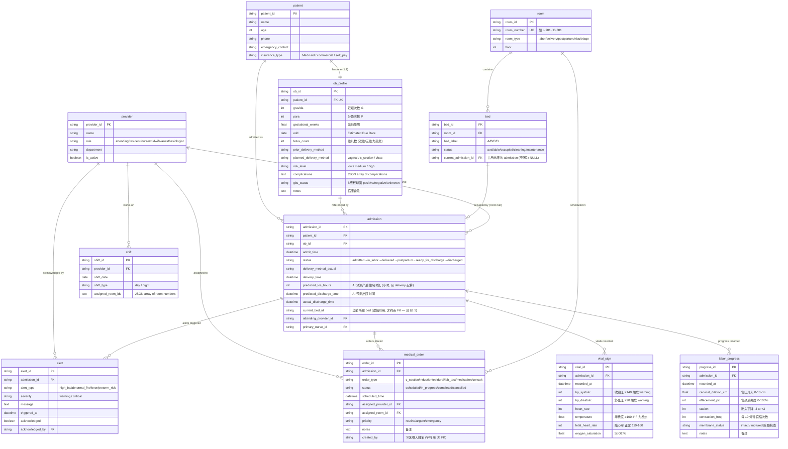

# Healthcare - 妇产科病房调度 (Obstetrics Ward Scheduling)

> **业务背景, 行业科普, 术语表请见 `01-healthcare_obstetrics_ward_scheduling_medium_business_context-cn.md`. 本文档只描述数据.**
>
> **数据集:** `healthcare_obstetrics_ward_scheduling_medium`
> **复杂度:** 中等 (11 张表, ~500 行)
> **生成方:** Fake Data Generator Agent
> **参考当前日期 (REFERENCE_DATE):** `2026-02-13 08:00 (Demo 开始时间)`
> **项目类型:** POC (Proof of Concept) / 教学演示

---

## 目录

> 业务背景 / 公司画像 / 行业科普 / 术语表已迁至 `01-..._business_context-cn.md`. 本文档专注数据, 章节编号保留原序 (从 §2 起)。

2. [数据集概览](#2-数据集概览)
3. [实体关系图](#3-实体关系图)
4. [表定义](#4-表定义)
5. [外键目录](#5-外键目录)
6. [数据生成规则](#6-数据生成规则)
7. [文件清单](#7-文件清单)
8. [SQLite DDL](#8-sqlite-ddl)

---

## 2. 数据集概览

| 指标 | 值 |
|------|---|
| 表总数 | 11 |
| 总记录数 | ~500 行 |
| 外键关系总数 | 15 |
| 1:1 关系 | 1 (`patient` ↔ `ob_profile`) |
| 1:N 关系 | 9 |
| 自指/循环引用 | 1 (`bed.current_admission_id` ↔ `admission.current_bed_id` — 见 §3.1) |
| 时序事件表 | 2 (`labor_progress`, `vital_sign`) |
| 枚举字段总数 | ~15 (以字符串编码,无独立 lookup 表 — 见 §6.1) |
| Reference Date | 2026-02-13 08:00 (Demo 开始) |
| SQLite 文件大小 | < 100 KB |

### 2.1 各表行数与角色

| # | 表 | 行数 | 角色 | 在 POC 中的作用 |
|---|----|-----|------|---------------|
| 01 | `patient` | 50 | 核心维度 | 产妇基本信息 (人口学) |
| 02 | `ob_profile` | 50 | 核心维度 (1:1 with patient) | 孕产临床档案 — POC 风险判断的源头 |
| 03 | `room` | 20 | 物理资源 | 病房物理布局 |
| 04 | `provider` | 15 | 人员维度 | 医护人员 |
| 05 | `shift` | 39 | 排班事件 | 每天 day/night 两班的医护排班 (day 7 人 + night 6 人) × 3 天 |
| 06 | `admission` | 16 | **核心事实表** | 一次住院的完整生命周期 (POC 中心) — 15 active + 1 discharged |
| 07 | `bed` | 32 | 物理资源 (粒度细于 room) | 床位实时占用状态 |
| 08 | `labor_progress` | ~63 | 时序事件 | 产程进展 (用于"什么时候要生了"),上界为 delivery_time |
| 09 | `vital_sign` | ~45 | 时序事件 | 生命体征 (用于"BP 是不是在涨"),delivered 后不再采集 |
| 10 | `medical_order` | ~20 | 计划事件 | 医嘱与待执行手术 (lab_test + epidural + 明日 c_section/induction) |
| 11 | `alert` | 3 | 系统派生事件 | 自动告警 (POC 的输出之一) |

### 2.2 五个 Demo 场景与数据钩子

| Demo 场景 | 数据中的"剧情埋点" |
|----------|------------------|
| 1️⃣ Shift Handover | `admission.status` 跨越全部 6 个阶段 (15 active 覆盖 admitted→ready_for_discharge,另有 1 条 discharged),演示交班时各阶段都有产妇 |
| 2️⃣ Room Availability | `bed.status` 中混入 `cleaning` (2 张, 其中 1 张在 labor 房) + `maintenance` (1 张),不能简单按 `occupied/available` 二分 |
| 3️⃣ LOS Prediction | 已分娩 admission 有 `delivery_method_actual` + `predicted_los_hours` (**产后**时长),顺产 24-48h、剖宫产 72-96h |
| 4️⃣ High-Risk Alert | 2 例 high-risk admission 的 `vital_sign.bp_systolic` 呈连续上升趋势 (~125 → 131 → 137 → 143),各触发 1 条未确认 high_bp 告警 |
| 5️⃣ Order Scheduling | `medical_order` 包含明天 9:00 的 `c_section`,assigned_room 必须是 `delivery` 类型 |

---

## 3. 实体关系图



### 3.1 关于 `bed` ↔ `admission` 的双向引用

注意 `bed.current_admission_id` 与 `admission.current_bed_id` 是**互指的**:

- `admission.current_bed_id` 表达"这个住院**当前**在哪张床"
- `bed.current_admission_id` 表达"这张床**当前**被谁占用"

两者应保持一致 (reconciled invariant): 若 `admission.X.current_bed_id = B`,则 `bed.B.current_admission_id = X`。
SQLite 不能用 FK 约束直接表达"双向一致",在 generator 中由代码维护;真实生产系统通常会用 trigger 或 application-layer 事务确保一致。

POC 中保留这种冗余是**故意的** —— 它对应两种最常见查询路径:
- 从产妇出发: "Emily 在哪张床?" → 看 `admission.current_bed_id`
- 从床出发: "L-201 的 A 床现在是谁?" → 看 `bed.current_admission_id`

**两个方向的约束强度并不对称**(为打破循环外键而有意为之):
- `bed.current_admission_id` 是**真实外键** (DDL 中 `REFERENCES admission(admission_id)`,见 §5 #3)。
- `admission.current_bed_id` 是**逻辑引用 / 非约束 FK** —— 它**不在** §5 外键目录中,DDL 也**没有** `REFERENCES bed(...)`,一致性完全由 generator 代码维护。Mermaid 图与表定义因此**不**把它标为 `FK`。

---

## 4. 表定义

### 4.1 `patient`

**描述:** 产妇 (mother) 的基本身份信息。**只放人口学/联系方式**,不放任何孕产临床信息 (那些都在 `ob_profile`)。这种拆分模仿了真实 EMR 中"人 (Person) vs 病例 (Encounter)"的解耦。

| 列 | 类型 | 约束 | 描述 |
|----|------|------|------|
| `patient_id` | VARCHAR(36) | PK | UUID 主键 |
| `name` | VARCHAR(100) | NOT NULL | 产妇姓名 (美式英文名,见 §6.2) |
| `age` | INTEGER | NOT NULL | 年龄 (周岁); ≥35 在 OB 临床称 AMA (Advanced Maternal Age) |
| `phone` | VARCHAR(20) | | 联系电话 (美式格式) |
| `emergency_contact` | VARCHAR(200) | | 紧急联系人姓名 + 电话 (拼接字符串) |
| `insurance_type` | VARCHAR(20) | | `commercial` / `Medicaid` / `self_pay` |

**外键:** 无

**分布约束 (POC 设定):**
- 年龄: 18-24 占 ~20%, 25-34 占 ~60%, 35-42 占 ~20%
- 保险: commercial ~55%, Medicaid ~35%, self_pay ~10% (反映美国育龄人群保险结构)

> ⚠️ **大小写约定:** `insurance_type` 取值为 `commercial` / `Medicaid` / `self_pay`,其中 **`Medicaid` 首字母大写**(美国政府项目专有名词),其余小写。SQL 过滤时需大小写一致 (写 `'medicaid'` 会漏数据)。

**示例行:**

| patient_id | name | age | insurance_type |
|-----------|------|-----|----------------|
| a1b2c3… | Emily Johnson | 28 | commercial |
| e5f6g7… | Sarah Williams | 35 | Medicaid |

---

### 4.2 `ob_profile` (Obstetric Profile)

**描述:** 产妇的**孕产临床档案**。POC 中所有"风险判断"、"分娩方式预测"、"LOS 估算"的**源头数据**。与 `patient` 严格 1:1 (UNIQUE FK)。

| 列 | 类型 | 约束 | 描述 |
|----|------|------|------|
| `ob_id` | VARCHAR(36) | PK | UUID 主键 |
| `patient_id` | VARCHAR(36) | FK, **UNIQUE**, NOT NULL | → `patient.patient_id` (1:1) |
| `gravida` | INTEGER | NOT NULL | **G**: 妊娠总次数 (本次妊娠也计入) |
| `para` | INTEGER | NOT NULL | **P**: 既往分娩次数 (≥20 周) |
| `gestational_weeks` | FLOAT | NOT NULL | 当前**孕周** (e.g., 38.4 = 38 周 +2.8 天) |
| `edd` | DATE | NOT NULL | **Estimated Due Date** 预产期 |
| `fetus_count` | INTEGER | NOT NULL, DEFAULT 1 | 胎儿数 (1=单胎, 2=双胎, 3=三胎; 多胎自动高危) |
| `prior_delivery_method` | VARCHAR(20) | | `none` / `vaginal` / `c_section` (上一胎方式) |
| `planned_delivery_method` | VARCHAR(20) | NOT NULL | `vaginal` / `c_section` / `vbac` (本次计划) |
| `risk_level` | VARCHAR(10) | NOT NULL | `low` / `medium` / `high` (派生字段, 见下) |
| `complications` | TEXT | | JSON 数组形式的并发症列表 |
| `gbs_status` | VARCHAR(10) | | `positive` / `negative` / `unknown` (B族链球菌筛查) |
| `notes` | TEXT | | 临床备注 |

**外键:**
- `patient_id` → `patient.patient_id` (UNIQUE 强制 1:1)

**`risk_level` 派生规则 (POC 算法):**

| risk_factors 计数 | risk_level |
|------------------|-----------|
| 0 | `low` |
| 1-2 | `medium` |
| ≥3 | `high` |

`risk_factors` 由以下累加:
- 年龄 ≥35: +1 (AMA)
- 多胎 (`fetus_count > 1`): +2
- 早产 (`gestational_weeks < 37`): +1
- 既往剖宫产 + 计划 VBAC: +1
- 每条 complication: +1

**`planned_delivery_method` = VBAC 是什么?**

VBAC = **Vaginal Birth After Cesarean** (剖宫产后阴道分娩)。在妇产临床上是一个独立的高关注类别,因为有子宫破裂风险,必须在 OR-ready 的医院进行,本数据集会把它单列。

**复合并发症列表 (`complications`):** Gestational diabetes / Gestational hypertension / Preeclampsia / Placenta previa / Oligohydramnios / Polyhydramnios / Intrauterine growth restriction / Previous cesarean section / Advanced maternal age / Anemia

**示例行:**

| ob_id | patient_id | G/P | 孕周 | edd | fetus | planned | risk | complications |
|-------|-----------|-----|------|-----|-------|---------|------|---------------|
| x1y2… | a1b2c3… | G2/P1 | 38.4 | 2026-02-20 | 1 | vaginal | low | null |
| p4q5… | e5f6g7… | G1/P0 | 34.2 | 2026-03-15 | 2 | c_section | high | ["Gestational diabetes"] |

---

### 4.3 `room`

**描述:** 妇产科病房 (ward) 的物理房间。一个 ward 通常被划分为 5 种功能区:

| `room_type` | 中文 | 用途 | 单/多床 |
|-------------|------|------|---------|
| `labor` | 待产室 | 自然分娩的产程观察期 | 单 (1 张床) |
| `delivery` | 分娩间 / OR | 剖宫产或复杂分娩的手术室 | 单 |
| `postpartum` | 产后恢复室 | 产后 24-72 小时观察 | 多 (2 张床) |
| `nicu` | 新生儿重症室 NICU | 早产儿 / 危重新生儿 | 多 (4 张床) |
| `triage` | 预检分诊 | 入院前评估 | 单 |

| 列 | 类型 | 约束 | 描述 |
|----|------|------|------|
| `room_id` | VARCHAR(36) | PK | UUID 主键 |
| `room_number` | VARCHAR(20) | UNIQUE, NOT NULL | 房间号 (e.g., `L-201` `D-301` `P-401` `NICU-501` `T-101`) |
| `room_type` | VARCHAR(20) | NOT NULL | 见上表 |
| `floor` | INTEGER | NOT NULL | 楼层 |

**外键:** 无

**房间号命名规则 (POC 约定):**
- 首字母对应类型: **L**abor / **D**elivery / **P**ostpartum / **NICU** / **T**riage
- 百位 = 楼层: 2 楼 labor, 3 楼 delivery, 4 楼 postpartum, 5 楼 NICU, 1 楼 triage
- 末两位 = 同楼层内编号

总计 20 间房,分布: 7 labor / 3 delivery / 6 postpartum / 2 NICU / 2 triage。

---

### 4.4 `bed`

**描述:** 床位 — 比 `room` 粒度更细。一间 `postpartum` 房可以有 2 张床,一间 NICU 房可以有 4 张床。床位 `status` 是**房间余量查询的核心字段** (Demo 场景 2)。

| 列 | 类型 | 约束 | 描述 |
|----|------|------|------|
| `bed_id` | VARCHAR(36) | PK | UUID 主键 |
| `room_id` | VARCHAR(36) | FK, NOT NULL | → `room.room_id` |
| `bed_label` | VARCHAR(10) | NOT NULL | 房间内编号 `A` / `B` / `C` / `D` |
| `status` | VARCHAR(20) | NOT NULL | `available` / `occupied` / `cleaning` / `maintenance` |
| `current_admission_id` | VARCHAR(36) | FK (nullable) | → `admission.admission_id`,空床时为 NULL |

**外键:**
- `room_id` → `room.room_id`
- `current_admission_id` → `admission.admission_id` (反向引用)

**`status` 四态语义:**
- `available`: 可立即收住下一位产妇
- `occupied`: 当前有产妇,`current_admission_id` 非空
- `cleaning`: 上一位产妇刚离开,清洁中 (~30-60 min) — **不是空床, 不能马上分配**
- `maintenance`: 设备维护或停用

**为什么 POC 必须有 `cleaning` / `maintenance` 状态?**
这是甲方一线护士特别提出的痛点: 旧 CMS 简单地用 boolean `is_occupied` 标记,常常导致清洁未完就被告知"空着",造成调度冲突。POC 必须证明 AI 能正确解析这 4 个状态。Generator 故意保留了 2 张 `cleaning` + 1 张 `maintenance` 的床。

---

### 4.5 `provider`

**描述:** 妇产科病房的所有医护人员,共 15 名。

| 列 | 类型 | 约束 | 描述 |
|----|------|------|------|
| `provider_id` | VARCHAR(36) | PK | UUID 主键 |
| `name` | VARCHAR(100) | NOT NULL | 带头衔 (`Dr.` / `RN` / `CNM`) |
| `role` | VARCHAR(30) | NOT NULL | 见下表 |
| `department` | VARCHAR(50) | | `Obstetrics & Gynecology` / `Anesthesiology` |
| `is_active` | BOOLEAN | NOT NULL, DEFAULT true | 是否在岗 |

**`role` 五种角色与配比 (POC 设定):**

| `role` | 中文 | 头衔前缀 | 人数 |
|--------|------|---------|------|
| `attending` | 主治医师 | `Dr.` | 4 |
| `resident` | 住院医师 | `Dr.` | 2 |
| `nurse` | 注册护士 (RN) | `RN` | 5 |
| `midwife` | 助产士 (CNM) | `CNM` | 2 |
| `anesthesiologist` | 麻醉医师 | `Dr.` | 2 |

**外键:** 无

**为什么麻醉医师 (anesthesiologist) 单独列?**
Demo 场景 5 (Order Scheduling) 涉及剖宫产 / epidural 安排,**必须有麻醉师在岗才能排**。POC 验证 AI 能识别这类资源依赖。麻醉师 department 标 `Anesthesiology`,其余皆为 `Obstetrics & Gynecology`。

---

### 4.6 `shift`

**描述:** 医护人员的**排班记录**。妇产科病房 24/7 运行,分 `day` (07:00-19:00) 和 `night` (19:00-07:00) 两班,本数据集覆盖 demo 当天 + 前 2 天共 3 天。

| 列 | 类型 | 约束 | 描述 |
|----|------|------|------|
| `shift_id` | VARCHAR(36) | PK | UUID 主键 |
| `provider_id` | VARCHAR(36) | FK, NOT NULL | → `provider.provider_id` |
| `shift_date` | DATE | NOT NULL | 班次日期 |
| `shift_type` | VARCHAR(10) | NOT NULL | `day` / `night` |
| `assigned_room_ids` | TEXT | nullable | JSON 数组,该班次主管的 room 列表 (主要给 attending / resident 用) |

**外键:**
- `provider_id` → `provider.provider_id`

**单班配置 (POC 约定):**
- attending: 1 人/班
- resident: 1 人/班
- nurse: day 班 3 人, night 班 2 人
- midwife: 1 人/班
- anesthesiologist: 1 人/班

总记录数 = (day 班 7 人 + night 班 6 人) × 3 天 = **39 条**(day = 1 attending + 1 resident + 3 nurse + 1 midwife + 1 anesthesiologist = 7;night 护士只 2 人 ⇒ 6 人)。

---

### 4.7 `admission` (**核心事实表**)

**描述:** 一次完整住院的生命周期记录,**整个 POC 的中心事实表**。所有时序事件 (`labor_progress`, `vital_sign`, `medical_order`, `alert`) 都挂在 `admission` 下。

| 列 | 类型 | 约束 | 描述 |
|----|------|------|------|
| `admission_id` | VARCHAR(36) | PK | UUID 主键 |
| `patient_id` | VARCHAR(36) | FK, NOT NULL | → `patient.patient_id` |
| `ob_id` | VARCHAR(36) | FK, NOT NULL | → `ob_profile.ob_id` |
| `admit_time` | DATETIME | NOT NULL | 入院时间 |
| `status` | VARCHAR(30) | NOT NULL | 状态机 (见下) |
| `delivery_method_actual` | VARCHAR(20) | nullable | 实际分娩方式 (分娩后填) |
| `delivery_time` | DATETIME | nullable | 实际分娩时间 |
| `predicted_los_hours` | INTEGER | nullable | **AI 预测产后住院时长** (小时, **从 `delivery_time` 起算**) — POC 核心 KPI。顺产 24-48h、剖宫产 72-96h |
| `predicted_discharge_time` | DATETIME | nullable | = `delivery_time + predicted_los_hours` |
| `actual_discharge_time` | DATETIME | nullable | 实际出院时间 (仅 `discharged` 才有;本数据集含 1 条) |
| `current_bed_id` | VARCHAR(36) | nullable | 当前床位 (与 `bed.current_admission_id` 互指) |
| `attending_provider_id` | VARCHAR(36) | FK | 主治医师 |
| `primary_nurse_id` | VARCHAR(36) | FK | 主管护士 |

**外键:**
- `patient_id` → `patient.patient_id`
- `ob_id` → `ob_profile.ob_id`
- `attending_provider_id` → `provider.provider_id`
- `primary_nurse_id` → `provider.provider_id`

**Status 状态机 (有向、有时序约束):**

```
admitted → in_labor → delivered → postpartum → ready_for_discharge → discharged
   ↑          ↑           ↑             ↑                    ↑              ↑
入院         进入产程     分娩完成      产后恢复中           准备出院         已出院
```

每一状态的临床含义:

| status | 中文 | 床位类型 | 是否计入 active census |
|--------|------|---------|----------------------|
| `admitted` | 已入院,未临产 | triage / labor | ✅ |
| `in_labor` | 产程中 (宫口已开) | labor | ✅ |
| `delivered` | 刚分娩 (≤2h) | delivery / labor | ✅ |
| `postpartum` | 产后恢复 | postpartum | ✅ |
| `ready_for_discharge` | 待出院 (医嘱已下) | postpartum | ✅ |
| `discharged` | 已出院 | NULL | ❌ |

**当前住院结构 (16 条 admission = 15 active + 1 discharged, 为 demo 精心设计):**

按 `status` 分布(generator 中以**确定性场景表**驱动,见 `gen_admissions`):

| status | 数量 | 备注 |
|--------|------|------|
| `in_labor` | 4 | idx0 宫口 8cm 已破膜 (Q5 排第一);idx2 高危+血压上升;idx4 双胎早产高危 |
| `admitted` | 4 | idx3 高危+血压上升;idx11 排明日引产;idx13 排明日剖宫产;idx12 新入院 |
| `delivered` | 2 | 刚分娩 ≤2h,在 delivery 房 |
| `postpartum` | 3 | 产后恢复 |
| `ready_for_discharge` | 2 | 待出院 |
| `discharged` | 1 | 4h 前已出院(LOS 准确度基线 + 覆盖第 6 阶段) |
| **合计** | **16** | 15 active + 1 discharged |

**关键剧情埋点(均由场景标志位确定性生成,不靠随机撞):**

| 埋点 | 落在哪条 | 实现 |
|------|---------|------|
| 2 条未确认 `high_bp` alert | idx2 (in_labor)、idx3 (admitted) | `rising_bp` 标志 ⇒ `bp_systolic` 沿 125→131→137→143→… 上升越过 140 |
| 1 条已确认 `preterm_risk` alert | idx4 | `twin_preterm` 标志 ⇒ `fetus_count=2` + `gestational_weeks=34.2` + `risk_level=high` |
| 高危 (risk_level=high) | idx2 / idx3 / idx4 (≥3 例) | `force_high_risk` / `twin_preterm` 标志 |
| 明日 09:00 `c_section` (delivery 房) | idx13 | `scheduled_csection` 标志 ⇒ `medical_order` |
| labor 房 cleaning (30min 后腾出) | 空闲 labor 床 | 床位按房型分配后,1 张空闲 labor 床置 `cleaning` |

---

### 4.8 `labor_progress`

**描述:** 产程进展记录,典型**时序事件表**。一次住院从入院到分娩,会有 ~6-10 条记录 (临床通常每 1-4 小时一次内诊)。本表是 demo 场景 3 (LOS 预测) 与场景 1 (交班) 的关键支撑。

| 列 | 类型 | 约束 | 描述 |
|----|------|------|------|
| `progress_id` | VARCHAR(36) | PK | UUID 主键 |
| `admission_id` | VARCHAR(36) | FK, NOT NULL | → `admission.admission_id` |
| `recorded_at` | DATETIME | NOT NULL | 内诊时间 |
| `cervical_dilation_cm` | FLOAT | NOT NULL | **宫口开大** 0-10 cm (10 = 开全) |
| `effacement_pct` | INTEGER | nullable | **宫颈消失度** 0-100% |
| `station` | INTEGER | nullable | **胎头下降** -3 至 +3 (-3 在坐骨棘上方, +3 在坐骨棘下方 = 即将娩出) |
| `contraction_freq` | INTEGER | nullable | 宫缩频率 (每 10 分钟次数) |
| `membrane_status` | VARCHAR(20) | NOT NULL | `intact` (未破) / `ruptured` (已破) |
| `notes` | TEXT | nullable | |

**外键:**
- `admission_id` → `admission.admission_id`

**临床基础概念 (供数据库工程师理解):**

| 名词 | 含义 | 关键阈值 |
|------|------|---------|
| 宫口 (Cervical dilation) | 子宫颈口张开程度 | 10 cm = 开全,可进入第二产程 |
| 宫颈消失度 (Effacement) | 子宫颈变薄程度 | 100% = 完全消失 |
| 胎头位置 (Station) | 胎头相对坐骨棘的位置 | +3 ≈ 即将娩出 |
| 胎膜 (Membrane) | 包绕胎儿的羊膜囊 | ruptured = 通常 24h 内会分娩 |

**Demo 用法:** `MAX(cervical_dilation_cm)` 排序就能找出"最接近分娩"的产妇 — 这是 Demo 场景 2 (Room Availability) 的预测前提。

---

### 4.9 `vital_sign`

**描述:** 生命体征监测,**典型时序表**。每位 active admission 每 ~4 小时一次,1-12 条不等。本表是 demo 场景 4 (High-Risk Alert) 的直接数据源。

| 列 | 类型 | 约束 | 描述 |
|----|------|------|------|
| `vital_id` | VARCHAR(36) | PK | UUID 主键 |
| `admission_id` | VARCHAR(36) | FK, NOT NULL | → `admission.admission_id` |
| `recorded_at` | DATETIME | NOT NULL | 采集时间 |
| `bp_systolic` | INTEGER | NOT NULL | 收缩压 mmHg |
| `bp_diastolic` | INTEGER | NOT NULL | 舒张压 mmHg |
| `heart_rate` | INTEGER | NOT NULL | 母体心率 bpm |
| `temperature` | FLOAT | NOT NULL | 体温 (**华氏度 °F**) |
| `fetal_heart_rate` | INTEGER | NOT NULL | 胎心率 bpm (正常 110-160) |
| `oxygen_saturation` | FLOAT | NOT NULL | SpO2 % |

**外键:**
- `admission_id` → `admission.admission_id`

**告警阈值 (POC 约定, 与 `alert` 表关联):**

| 指标 | warning | critical |
|------|---------|----------|
| `bp_systolic` | ≥ 140 | ≥ 160 |
| `bp_diastolic` | ≥ 90 | ≥ 110 |
| `fetal_heart_rate` | <110 或 >160 | <100 或 >180 |
| `temperature` (°F) | ≥ 100.4 | ≥ 101.5 |

> **关于体温阈值:** 100.4°F (38.0°C) 是产科**母体发热**的临床公认界值 (与 Q16 的 `FEVER` 判定一致)。98.6°F 为正常,日间生理波动可达 99°F+,故 99.0 **不是**发热 —— 本数据集 `temperature` 生成区间为 97.6-99.4°F,**全部低于 warning 阈值**,与"未埋发热告警"的设定自洽,不存在"正常带却被算 warning"的矛盾。

**埋点 (Demo 场景 4):** **2 例** high-risk admission (idx2 / idx3) 的 `bp_systolic` 在时间序列上呈**确定性连续上升趋势** (`125 → 131 → 137 → 143 → …`),越过 140 warning 阈值,各触发一条未确认 `high_bp` 告警。用于演示 AI 识别趋势性高血压的能力 — 这是单点阈值法所识别不了的。

> **仅这两类 alert 被埋点:** 本快照只播种 `high_bp` (2 条未确认) + `preterm_risk` (1 条已确认) 共 3 条。`fever` / `abnormal_fhr` 两类**枚举与查询 (Q16) 已支持**,但本数据集**未刻意埋异常值** (temperature 控制在 97.6-99.4°F 正常带、fetal_heart_rate 在 125-155 正常带),故不会产生这两类告警 —— 这是设计取舍,不是缺陷。

---

### 4.10 `medical_order`

**描述:** 医嘱与计划操作。包括**已计划但未执行**的手术 (Demo 场景 5 的核心),以及已完成的检查 / 麻醉。

| 列 | 类型 | 约束 | 描述 |
|----|------|------|------|
| `order_id` | VARCHAR(36) | PK | UUID 主键 |
| `admission_id` | VARCHAR(36) | FK, NOT NULL | → `admission.admission_id` |
| `order_type` | VARCHAR(30) | NOT NULL | 见下表 |
| `status` | VARCHAR(20) | NOT NULL | `scheduled` / `in_progress` / `completed` / `cancelled` |
| `scheduled_time` | DATETIME | NOT NULL | 计划执行时间 |
| `assigned_provider_id` | VARCHAR(36) | FK, NOT NULL | 负责人 |
| `assigned_room_id` | VARCHAR(36) | FK, nullable | 关联房间 (仅手术类需要) |
| `priority` | VARCHAR(15) | NOT NULL, DEFAULT 'routine' | `routine` / `urgent` / `emergency` |
| `notes` | TEXT | nullable | |
| `created_by` | VARCHAR(50) | NOT NULL | 下医嘱人姓名 (字符串,**不是** FK) |

**外键:**
- `admission_id` → `admission.admission_id`
- `assigned_provider_id` → `provider.provider_id`
- `assigned_room_id` → `room.room_id`

**`order_type` 六种类型:**

| 类型 | 中文 | 需要的资源 |
|------|------|-----------|
| `c_section` | 剖宫产 | OR (delivery room) + attending + anesthesiologist |
| `induction` | 引产 | labor room + attending |
| `epidural` | 硬膜外麻醉 | anesthesiologist (床边操作,无需 OR) |
| `lab_test` | 实验室检查 | 无 |
| `medication` | 用药 | 护士执行 |
| `consult` | 会诊 | 其他科室医师 |

**Demo 场景 5 埋点:** 至少 1 条明天 09:00 的 `c_section` (scheduled, room = delivery),POC 需要演示 AI 能查出资源冲突 (`scheduled_time` 那个时间点麻醉师是否在班、delivery room 是否冲突)。

---

### 4.11 `alert`

**描述:** **AI 自动生成**的临床告警 — POC 的**输出**之一。当 `vital_sign` 或 `labor_progress` 触发预设规则时,系统派生一条 alert。

| 列 | 类型 | 约束 | 描述 |
|----|------|------|------|
| `alert_id` | VARCHAR(36) | PK | UUID 主键 |
| `admission_id` | VARCHAR(36) | FK, NOT NULL | → `admission.admission_id` |
| `alert_type` | VARCHAR(30) | NOT NULL | `high_bp` / `abnormal_fhr` / `fever` / `preterm_risk` |
| `severity` | VARCHAR(15) | NOT NULL | `warning` / `critical` |
| `message` | TEXT | NOT NULL | 人类可读的告警描述 |
| `triggered_at` | DATETIME | NOT NULL | 触发时间 |
| `acknowledged` | BOOLEAN | NOT NULL, DEFAULT false | 是否已被医护人员看到 |
| `acknowledged_by` | VARCHAR(36) | FK, nullable | → `provider.provider_id` (看到的人) |

**外键:**
- `admission_id` → `admission.admission_id`
- `acknowledged_by` → `provider.provider_id`

**当前数据 (POC 埋点):**
- 2 条 `high_bp` warning 未被确认 (`acknowledged = false`) → 交班场景的"未结清告警"
- 1 条 `preterm_risk` warning 已被护士确认 → 演示完整告警生命周期

---

## 5. 外键目录

| # | 子表.外键列 | 父表.被引列 | 业务含义 |
|---|------------|------------|---------|
| 1 | `ob_profile.patient_id` | `patient.patient_id` | 1:1, 孕产档案归属 |
| 2 | `bed.room_id` | `room.room_id` | 床归属于房间 |
| 3 | `bed.current_admission_id` | `admission.admission_id` | 床当前被谁占用 (反向) |
| 4 | `shift.provider_id` | `provider.provider_id` | 排班归属人员 |
| 5 | `admission.patient_id` | `patient.patient_id` | 住院归属产妇 |
| 6 | `admission.ob_id` | `ob_profile.ob_id` | 住院引用孕产档案 |
| 7 | `admission.attending_provider_id` | `provider.provider_id` | 主治医师 |
| 8 | `admission.primary_nurse_id` | `provider.provider_id` | 主管护士 |
| 9 | `labor_progress.admission_id` | `admission.admission_id` | 产程进展归属住院 |
| 10 | `vital_sign.admission_id` | `admission.admission_id` | 生命体征归属住院 |
| 11 | `medical_order.admission_id` | `admission.admission_id` | 医嘱归属住院 |
| 12 | `medical_order.assigned_provider_id` | `provider.provider_id` | 医嘱负责人 |
| 13 | `medical_order.assigned_room_id` | `room.room_id` | 医嘱关联房间 |
| 14 | `alert.admission_id` | `admission.admission_id` | 告警归属住院 |
| 15 | `alert.acknowledged_by` | `provider.provider_id` | 确认告警的人员 |

---

## 6. 数据生成规则

### 6.1 为什么没有独立的 lookup 表?

按 medium 复杂度,**所有枚举字段都用字符串直接存储**,而**不是**建立 `room_type_enum`、`status_enum` 这样的 lookup 表。原因:

- POC 强调**简洁直观**,枚举值数量少 (4-6 种),业务方一眼能懂
- SQLite 没有原生 ENUM 类型,字符串足够清晰
- 后续扩到生产时再考虑改为 lookup 表 (那时就要管 i18n、deprecated 状态等)

### 6.2 业务逻辑约束 (Reconciled Invariants)

1. **时间顺序约束:**
   - `admission.admit_time` < `delivery_time` < `actual_discharge_time`
   - `labor_progress.recorded_at` ∈ [`admit_time`, `delivery_time`] 且单调递增
   - `vital_sign.recorded_at` ≥ `admit_time`, 约每 4h 一条
   - `medical_order.scheduled_time` (scheduled 状态) > `REFERENCE_DATE`

2. **状态机一致性:**
   - `admission.status = 'in_labor'` ⇒ 至少 1 条 `labor_progress`, `cervical_dilation_cm` > 0
   - `admission.status ∈ {delivered, postpartum, ready_for_discharge, discharged}` ⇒ `delivery_time IS NOT NULL` 且 `delivery_method_actual IS NOT NULL`
   - `admission.status = 'discharged'` ⇒ `actual_discharge_time IS NOT NULL` (本数据集含 **1 条** discharged 记录,作 LOS 准确度基线并覆盖第 6 阶段)
   - `labor_progress` / `vital_sign` 的 `recorded_at` **上界为 `delivery_time`**(已分娩者),即分娩后不再有内诊与胎心记录;`fetal_heart_rate` 因此恒为产前(in-utero)读数

3. **床位双向一致性:**
   - 若 `admission.X.current_bed_id = B`, 则 `bed.B.current_admission_id = X` 且 `bed.B.status = 'occupied'`
   - 若 `bed.B.status ∈ {available, cleaning, maintenance}`, 则 `bed.B.current_admission_id IS NULL`

4. **临床取值范围:**

| 字段 | 取值范围 | 备注 |
|------|---------|------|
| `cervical_dilation_cm` | 0.0 – 10.0 | 10 = 开全 |
| `effacement_pct` | 0 – 100 | |
| `station` | -3 – +3 | |
| `gestational_weeks` | 32.0 – 42.0 | <37 早产, >42 过期 |
| `bp_systolic` | 90 – 180 | |
| `bp_diastolic` | 55 – 110 | |
| `fetal_heart_rate` | 90 – 200 | |
| `temperature` (°F) | 97.5 – 100.5 | |
| `oxygen_saturation` | 95.0 – 100.0 | |
| `age` | 18 – 42 | |

5. **派生字段:**
   - `risk_level` 由年龄 + 多胎 + 早产 + VBAC + complications 数量派生 (见 §4.2)
   - `predicted_los_hours` 是**产后住院时长**(从 `delivery_time` 起算,**不含**产前在院时间);与 `delivery_method_actual` 匹配: c_section ∈ [72, 96], vaginal ∈ [24, 48]
   - `predicted_discharge_time` = `delivery_time` + `predicted_los_hours`
   - 已出院者**实际产后 LOS** = `actual_discharge_time − delivery_time`,与 `predicted_los_hours` **同口径**可比 (Q9 / Q17 据此对标)

6. **分布约定:**
   - 妊娠次数 G/P 与年龄相关 (年龄越大,G/P 中位数越高)
   - 胎数: 单胎 ~96%, 双胎 ~3.5%, 三胎 ~0.5%
   - 计划分娩方式: vaginal ~70%, c_section ~25%, vbac ~5%
   - GBS: positive ~25%, negative ~65%, unknown ~10%
   - 任何时刻未确认 alert 数: 2 条 (反映真实病房的 backlog)

### 6.3 Faker 策略

| 字段模式 | Generator | 备注 |
|---------|-----------|------|
| 产妇姓名 | 自定义 list (50 个美式女性名) | 见 `AMERICAN_FEMALE_NAMES` |
| 医护姓名 | 自定义 list (含头衔) | 见 `PROVIDER_NAMES` |
| 电话号 | `fake.phone_number()` | 美式格式 |
| UUID | `uuid.uuid4()` | 字符串 |
| 日期/时间 | 基于 `REFERENCE_DATE = 2026-02-13 08:00` 计算 | 确保 demo 一致性 |
| 孕周 | 加权随机 | 集中在 37-41 周 |
| 生命体征 | 正态分布 + demo 埋点的异常值 | high-risk admission 有上升趋势 |

### 6.4 随机种子

`RANDOM_SEED = 42` (硬编码于 generator)。每次运行生成完全相同的数据,便于 POC 阶段反复演示 / 调试。

---

## 7. 文件清单

| # | 文件名 | 表 | 行数 | 依赖 |
|---|--------|----|------|------|
| 01 | `01_patient.tsv` | `patient` | 50 | 无 |
| 02 | `02_ob_profile.tsv` | `ob_profile` | 50 | patient |
| 03 | `03_room.tsv` | `room` | 20 | 无 |
| 04 | `04_provider.tsv` | `provider` | 15 | 无 |
| 05 | `05_shift.tsv` | `shift` | 39 | provider |
| 06 | `06_admission.tsv` | `admission` | 16 | patient, ob_profile, provider |
| 07 | `07_bed.tsv` | `bed` | 32 | room, admission |
| 08 | `08_labor_progress.tsv` | `labor_progress` | ~63 | admission |
| 09 | `09_vital_sign.tsv` | `vital_sign` | ~45 | admission |
| 10 | `10_medical_order.tsv` | `medical_order` | ~20 | admission, provider, room |
| 11 | `11_alert.tsv` | `alert` | 3 | admission, provider |

加载顺序遵守 topological sort。SQLite 文件 `healthcare_obstetrics_ward_scheduling_medium.sqlite` 由 generator 一次性构建,幂等可重跑。

---

## 8. SQLite DDL

```sql
-- ============================================================
-- Generated DDL for healthcare_obstetrics_ward_scheduling_medium
-- ============================================================

CREATE TABLE patient (
    patient_id VARCHAR(36) PRIMARY KEY,
    name VARCHAR(100) NOT NULL,
    age INTEGER NOT NULL,
    phone VARCHAR(20),
    emergency_contact VARCHAR(200),
    insurance_type VARCHAR(20)
);

CREATE TABLE ob_profile (
    ob_id VARCHAR(36) PRIMARY KEY,
    patient_id VARCHAR(36) NOT NULL UNIQUE REFERENCES patient(patient_id),
    gravida INTEGER NOT NULL,
    para INTEGER NOT NULL,
    gestational_weeks FLOAT NOT NULL,
    edd DATE NOT NULL,
    fetus_count INTEGER NOT NULL DEFAULT 1,
    prior_delivery_method VARCHAR(20),
    planned_delivery_method VARCHAR(20) NOT NULL,
    risk_level VARCHAR(10) NOT NULL,
    complications TEXT,
    gbs_status VARCHAR(10),
    notes TEXT
);

CREATE TABLE room (
    room_id VARCHAR(36) PRIMARY KEY,
    room_number VARCHAR(20) NOT NULL UNIQUE,
    room_type VARCHAR(20) NOT NULL,
    floor INTEGER NOT NULL
);

CREATE TABLE bed (
    bed_id VARCHAR(36) PRIMARY KEY,
    room_id VARCHAR(36) NOT NULL REFERENCES room(room_id),
    bed_label VARCHAR(10) NOT NULL,
    status VARCHAR(20) NOT NULL DEFAULT 'available',
    current_admission_id VARCHAR(36) REFERENCES admission(admission_id)
);

CREATE TABLE provider (
    provider_id VARCHAR(36) PRIMARY KEY,
    name VARCHAR(100) NOT NULL,
    role VARCHAR(30) NOT NULL,
    department VARCHAR(50),
    is_active BOOLEAN NOT NULL DEFAULT 1
);

CREATE TABLE shift (
    shift_id VARCHAR(36) PRIMARY KEY,
    provider_id VARCHAR(36) NOT NULL REFERENCES provider(provider_id),
    shift_date DATE NOT NULL,
    shift_type VARCHAR(10) NOT NULL,
    assigned_room_ids TEXT
);

CREATE TABLE admission (
    admission_id VARCHAR(36) PRIMARY KEY,
    patient_id VARCHAR(36) NOT NULL REFERENCES patient(patient_id),
    ob_id VARCHAR(36) NOT NULL REFERENCES ob_profile(ob_id),
    admit_time DATETIME NOT NULL,
    status VARCHAR(30) NOT NULL,
    delivery_method_actual VARCHAR(20),
    delivery_time DATETIME,
    predicted_los_hours INTEGER,
    predicted_discharge_time DATETIME,
    actual_discharge_time DATETIME,
    current_bed_id VARCHAR(36),
    attending_provider_id VARCHAR(36) REFERENCES provider(provider_id),
    primary_nurse_id VARCHAR(36) REFERENCES provider(provider_id)
);

CREATE TABLE labor_progress (
    progress_id VARCHAR(36) PRIMARY KEY,
    admission_id VARCHAR(36) NOT NULL REFERENCES admission(admission_id),
    recorded_at DATETIME NOT NULL,
    cervical_dilation_cm FLOAT NOT NULL,
    effacement_pct INTEGER,
    station INTEGER,
    contraction_freq INTEGER,
    membrane_status VARCHAR(20) NOT NULL,
    notes TEXT
);

CREATE TABLE vital_sign (
    vital_id VARCHAR(36) PRIMARY KEY,
    admission_id VARCHAR(36) NOT NULL REFERENCES admission(admission_id),
    recorded_at DATETIME NOT NULL,
    bp_systolic INTEGER NOT NULL,
    bp_diastolic INTEGER NOT NULL,
    heart_rate INTEGER NOT NULL,
    temperature FLOAT NOT NULL,
    fetal_heart_rate INTEGER NOT NULL,
    oxygen_saturation FLOAT NOT NULL
);

CREATE TABLE medical_order (
    order_id VARCHAR(36) PRIMARY KEY,
    admission_id VARCHAR(36) NOT NULL REFERENCES admission(admission_id),
    order_type VARCHAR(30) NOT NULL,
    status VARCHAR(20) NOT NULL,
    scheduled_time DATETIME NOT NULL,
    assigned_provider_id VARCHAR(36) NOT NULL REFERENCES provider(provider_id),
    assigned_room_id VARCHAR(36) REFERENCES room(room_id),
    priority VARCHAR(15) NOT NULL DEFAULT 'routine',
    notes TEXT,
    created_by VARCHAR(50) NOT NULL
);

CREATE TABLE alert (
    alert_id VARCHAR(36) PRIMARY KEY,
    admission_id VARCHAR(36) NOT NULL REFERENCES admission(admission_id),
    alert_type VARCHAR(30) NOT NULL,
    severity VARCHAR(15) NOT NULL,
    message TEXT NOT NULL,
    triggered_at DATETIME NOT NULL,
    acknowledged BOOLEAN NOT NULL DEFAULT 0,
    acknowledged_by VARCHAR(36) REFERENCES provider(provider_id)
);
```

---

## 附录 A: 术语表已迁出

完整的术语表 (英文 jargon + 中文 layman 解释, 覆盖本文档出现的全部临床 / 医护 / IT 术语) 见 `01-healthcare_obstetrics_ward_scheduling_medium_business_context-cn.md` 的「Beat 8 术语表」。
