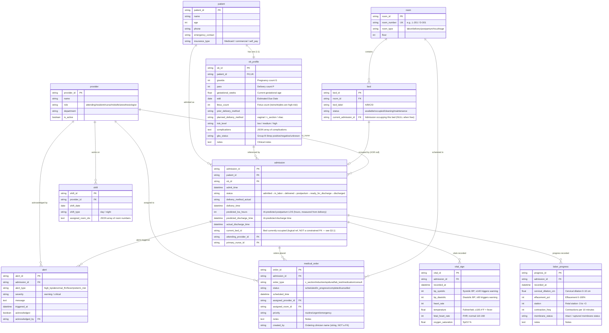

# Healthcare - Obstetrics Ward Scheduling

> **For business context, industry primer, and glossary, see `01-healthcare_obstetrics_ward_scheduling_medium_business_context.md`. This document only describes the data.**
>
> **Dataset:** `healthcare_obstetrics_ward_scheduling_medium`
> **Complexity:** Medium (11 tables, ~500 rows)
> **Generated by:** Fake Data Generator Agent
> **Reference date (REFERENCE_DATE):** `2026-02-13 08:00 (Demo anchor)`
> **Project type:** POC (Proof of Concept) / teaching demo

---

## Table of Contents

> Business context / company profile / industry primer / glossary have been moved to `01-..._business_context.md`. This document focuses on data; section numbering preserves the original order (starts at §2).

2. [Dataset Overview](#2-dataset-overview)
3. [Entity-Relationship Diagram](#3-entity-relationship-diagram)
4. [Table Definitions](#4-table-definitions)
5. [Foreign Key Catalog](#5-foreign-key-catalog)
6. [Data Generation Rules](#6-data-generation-rules)
7. [File Manifest](#7-file-manifest)
8. [SQLite DDL](#8-sqlite-ddl)

---

## 2. Dataset Overview

| Metric | Value |
|------|---|
| Total tables | 11 |
| Total records | ~500 rows |
| Total foreign-key relationships | 15 |
| 1:1 relationships | 1 (`patient` ↔ `ob_profile`) |
| 1:N relationships | 9 |
| Self-/cyclic references | 1 (`bed.current_admission_id` ↔ `admission.current_bed_id` — see §3.1) |
| Time-series event tables | 2 (`labor_progress`, `vital_sign`) |
| Total enum fields | ~15 (encoded as strings, no separate lookup tables — see §6.1) |
| Reference Date | 2026-02-13 08:00 (Demo anchor) |
| SQLite file size | < 100 KB |

### 2.1 Table Row Counts and Roles

| # | Table | Rows | Role | POC purpose |
|---|----|-----|------|---------------|
| 01 | `patient` | 50 | Core dimension | Patient (mother) demographics |
| 02 | `ob_profile` | 50 | Core dimension (1:1 with patient) | Obstetric clinical profile — source of POC risk determination |
| 03 | `room` | 20 | Physical resource | Ward physical layout |
| 04 | `provider` | 15 | People dimension | Clinical staff |
| 05 | `shift` | 39 | Schedule events | Day/night shifts for the staff (day 7 + night 6) × 3 days |
| 06 | `admission` | 16 | **Core fact table** | Full lifecycle of one inpatient stay (the POC's center) — 15 active + 1 discharged |
| 07 | `bed` | 32 | Physical resource (finer-grained than room) | Real-time bed occupancy status |
| 08 | `labor_progress` | ~63 | Time-series events | Labor progression ("when will she deliver?"), upper-bounded by delivery_time |
| 09 | `vital_sign` | ~45 | Time-series events | Vital signs ("Is the BP trending up?"); no readings after delivered |
| 10 | `medical_order` | ~20 | Planned events | Orders and upcoming procedures (lab_test + epidural + tomorrow's c_section/induction) |
| 11 | `alert` | 3 | System-derived events | Auto alerts (one of the POC's outputs) |

### 2.2 Five Demo Scenarios and Their Data Hooks

| Demo scenario | Plant in the data |
|----------|------------------|
| 1️⃣ Shift Handover | `admission.status` covers all 6 stages (15 actives cover admitted → ready_for_discharge, plus 1 discharged), so handoff has a patient in each stage |
| 2️⃣ Room Availability | `bed.status` includes `cleaning` (2 beds, 1 of them in a labor room) + `maintenance` (1 bed) — simple occupied/available binary will not work |
| 3️⃣ LOS Prediction | Delivered admissions have `delivery_method_actual` + `predicted_los_hours` (**postpartum** length of stay); vaginal 24–48h, C-section 72–96h |
| 4️⃣ High-Risk Alert | For 2 high-risk admissions, `vital_sign.bp_systolic` trends up (~125 → 131 → 137 → 143), each triggering 1 unacknowledged high_bp alert |
| 5️⃣ Order Scheduling | `medical_order` includes a `c_section` for tomorrow 9 AM, with assigned_room of type `delivery` |

---

## 3. Entity-Relationship Diagram



### 3.1 About the Bi-directional `bed` ↔ `admission` Reference

Note that `bed.current_admission_id` and `admission.current_bed_id` **point at each other**:

- `admission.current_bed_id` expresses "which bed is this admission **currently** in?"
- `bed.current_admission_id` expresses "who **currently** occupies this bed?"

The two must stay consistent (a reconciled invariant): if `admission.X.current_bed_id = B`, then `bed.B.current_admission_id = X`.
SQLite cannot directly express "bi-directional consistency" via FK constraints, so it's maintained by code in the generator; real production systems typically enforce it with triggers or application-layer transactions.

The POC keeps this redundancy on purpose — it matches the two most common query paths:
- From the patient: "Which bed is Emily in?" → look at `admission.current_bed_id`
- From the bed: "Who's in bed A of L-201 right now?" → look at `bed.current_admission_id`

**The constraint strength of the two directions is intentionally asymmetric** (to break the circular FK):
- `bed.current_admission_id` is a **real foreign key** (DDL: `REFERENCES admission(admission_id)`, see §5 #3).
- `admission.current_bed_id` is a **logical reference / non-constrained FK** — it is **not** in the §5 FK catalog and the DDL has **no** `REFERENCES bed(...)`. Consistency is enforced purely by generator code. The Mermaid diagram and table definitions therefore **do not** mark it as `FK`.

---

## 4. Table Definitions

### 4.1 `patient`

**Description:** Basic identity information of the mother. **Demographics / contact info only** — no obstetric clinical info (which all lives in `ob_profile`). This split mirrors the real-EMR decoupling of "Person vs Encounter."

| Column | Type | Constraint | Description |
|----|------|------|------|
| `patient_id` | VARCHAR(36) | PK | UUID primary key |
| `name` | VARCHAR(100) | NOT NULL | Mother's name (US English names, see §6.2) |
| `age` | INTEGER | NOT NULL | Age in years; ≥35 is classified clinically as AMA (Advanced Maternal Age) |
| `phone` | VARCHAR(20) | | Contact phone (US format) |
| `emergency_contact` | VARCHAR(200) | | Emergency contact name + phone (concatenated string) |
| `insurance_type` | VARCHAR(20) | | `commercial` / `Medicaid` / `self_pay` |

**Foreign keys:** None

**Distribution constraints (POC settings):**
- Age: 18–24 ~20%, 25–34 ~60%, 35–42 ~20%
- Insurance: commercial ~55%, Medicaid ~35%, self_pay ~10% (matches US childbearing-age insurance distribution)

> ⚠️ **Case convention:** `insurance_type` values are `commercial` / `Medicaid` / `self_pay`, where **`Medicaid` is capitalized** (proper noun, US government program); the others are lowercase. SQL filters must match case (writing `'medicaid'` will miss rows).

**Example rows:**

| patient_id | name | age | insurance_type |
|-----------|------|-----|----------------|
| a1b2c3… | Emily Johnson | 28 | commercial |
| e5f6g7… | Sarah Williams | 35 | Medicaid |

---

### 4.2 `ob_profile` (Obstetric Profile)

**Description:** The mother's **obstetric clinical profile**. The **source data** for all "risk determination," "delivery mode prediction," and "LOS estimation" in the POC. Strictly 1:1 with `patient` (UNIQUE FK).

| Column | Type | Constraint | Description |
|----|------|------|------|
| `ob_id` | VARCHAR(36) | PK | UUID primary key |
| `patient_id` | VARCHAR(36) | FK, **UNIQUE**, NOT NULL | → `patient.patient_id` (1:1) |
| `gravida` | INTEGER | NOT NULL | **G**: total number of pregnancies (including this one) |
| `para` | INTEGER | NOT NULL | **P**: prior deliveries (≥20 weeks) |
| `gestational_weeks` | FLOAT | NOT NULL | Current **gestational age** (e.g., 38.4 = 38 weeks + 2.8 days) |
| `edd` | DATE | NOT NULL | **Estimated Due Date** |
| `fetus_count` | INTEGER | NOT NULL, DEFAULT 1 | Number of fetuses (1=singleton, 2=twins, 3=triplets; multiples are automatically high-risk) |
| `prior_delivery_method` | VARCHAR(20) | | `none` / `vaginal` / `c_section` (previous delivery method) |
| `planned_delivery_method` | VARCHAR(20) | NOT NULL | `vaginal` / `c_section` / `vbac` (this pregnancy's plan) |
| `risk_level` | VARCHAR(10) | NOT NULL | `low` / `medium` / `high` (derived field, see below) |
| `complications` | TEXT | | JSON array of complications |
| `gbs_status` | VARCHAR(10) | | `positive` / `negative` / `unknown` (Group B Strep screen) |
| `notes` | TEXT | | Clinical notes |

**Foreign keys:**
- `patient_id` → `patient.patient_id` (UNIQUE enforces 1:1)

**`risk_level` derivation rules (POC algorithm):**

| risk_factors count | risk_level |
|------------------|-----------|
| 0 | `low` |
| 1–2 | `medium` |
| ≥3 | `high` |

`risk_factors` accumulates from:
- Age ≥35: +1 (AMA)
- Multiples (`fetus_count > 1`): +2
- Preterm (`gestational_weeks < 37`): +1
- Prior C-section + planned VBAC: +1
- Each complication: +1

**What is `planned_delivery_method` = VBAC?**

VBAC = **Vaginal Birth After Cesarean**. In OB clinical practice it's a standalone high-attention category because of uterine rupture risk; it must be performed at an OR-ready hospital. This dataset breaks it out as a separate value.

**Composite complications list (`complications`):** Gestational diabetes / Gestational hypertension / Preeclampsia / Placenta previa / Oligohydramnios / Polyhydramnios / Intrauterine growth restriction / Previous cesarean section / Advanced maternal age / Anemia

**Example rows:**

| ob_id | patient_id | G/P | weeks | edd | fetus | planned | risk | complications |
|-------|-----------|-----|------|-----|-------|---------|------|---------------|
| x1y2… | a1b2c3… | G2/P1 | 38.4 | 2026-02-20 | 1 | vaginal | low | null |
| p4q5… | e5f6g7… | G1/P0 | 34.2 | 2026-03-15 | 2 | c_section | high | ["Gestational diabetes"] |

---

### 4.3 `room`

**Description:** Physical rooms in the OB ward. A ward is typically divided into 5 functional areas:

| `room_type` | Name | Use | Single/multi-bed |
|-------------|------|------|---------|
| `labor` | Labor room | Labor progress monitoring for vaginal delivery | Single (1 bed) |
| `delivery` | Delivery room / OR | Surgical room for C-sections or complex deliveries | Single |
| `postpartum` | Postpartum recovery | 24–72h postpartum observation | Multi (2 beds) |
| `nicu` | NICU (Neonatal ICU) | Preterm / critical newborns | Multi (4 beds) |
| `triage` | Triage | Pre-admission evaluation | Single |

| Column | Type | Constraint | Description |
|----|------|------|------|
| `room_id` | VARCHAR(36) | PK | UUID primary key |
| `room_number` | VARCHAR(20) | UNIQUE, NOT NULL | Room number (e.g., `L-201`, `D-301`, `P-401`, `NICU-501`, `T-101`) |
| `room_type` | VARCHAR(20) | NOT NULL | See table above |
| `floor` | INTEGER | NOT NULL | Floor |

**Foreign keys:** None

**Room number convention (POC):**
- Leading letter corresponds to type: **L**abor / **D**elivery / **P**ostpartum / **NICU** / **T**riage
- Hundreds digit = floor: floor 2 labor, 3 delivery, 4 postpartum, 5 NICU, 1 triage
- Last two digits = within-floor sequence

Total 20 rooms, broken down as: 7 labor / 3 delivery / 6 postpartum / 2 NICU / 2 triage.

---

### 4.4 `bed`

**Description:** Beds — a finer grain than `room`. A `postpartum` room can have 2 beds; a NICU room can have 4. The bed `status` is **the central field for room availability queries** (Demo scenario 2).

| Column | Type | Constraint | Description |
|----|------|------|------|
| `bed_id` | VARCHAR(36) | PK | UUID primary key |
| `room_id` | VARCHAR(36) | FK, NOT NULL | → `room.room_id` |
| `bed_label` | VARCHAR(10) | NOT NULL | Within-room label `A` / `B` / `C` / `D` |
| `status` | VARCHAR(20) | NOT NULL | `available` / `occupied` / `cleaning` / `maintenance` |
| `current_admission_id` | VARCHAR(36) | FK (nullable) | → `admission.admission_id`; NULL when bed is free |

**Foreign keys:**
- `room_id` → `room.room_id`
- `current_admission_id` → `admission.admission_id` (reverse reference)

**Semantics of the 4 statuses:**
- `available`: ready to accept the next patient immediately
- `occupied`: currently holding a patient, `current_admission_id` non-null
- `cleaning`: previous patient just left, being cleaned (~30–60 min) — **not free, cannot be assigned yet**
- `maintenance`: out of service for equipment work

**Why must the POC have `cleaning` / `maintenance` statuses?**
This is a pain point the client's front-line nurses called out specifically: the legacy CMS marks beds with a simple boolean `is_occupied`, so it often reports beds as "free" while they're still being cleaned, causing scheduling conflicts. The POC must prove the AI can correctly parse all 4 statuses. The generator deliberately keeps 2 beds in `cleaning` + 1 in `maintenance`.

---

### 4.5 `provider`

**Description:** All clinical staff in the OB ward — 15 people total.

| Column | Type | Constraint | Description |
|----|------|------|------|
| `provider_id` | VARCHAR(36) | PK | UUID primary key |
| `name` | VARCHAR(100) | NOT NULL | With title prefix (`Dr.` / `RN` / `CNM`) |
| `role` | VARCHAR(30) | NOT NULL | See table below |
| `department` | VARCHAR(50) | | `Obstetrics & Gynecology` / `Anesthesiology` |
| `is_active` | BOOLEAN | NOT NULL, DEFAULT true | Whether on staff |

**The 5 `role` values and headcount (POC settings):**

| `role` | English | Title prefix | Headcount |
|--------|------|---------|------|
| `attending` | Attending physician | `Dr.` | 4 |
| `resident` | Resident physician | `Dr.` | 2 |
| `nurse` | Registered nurse (RN) | `RN` | 5 |
| `midwife` | Certified nurse-midwife (CNM) | `CNM` | 2 |
| `anesthesiologist` | Anesthesiologist | `Dr.` | 2 |

**Foreign keys:** None

**Why is anesthesiologist a separate role?**
Demo scenario 5 (Order Scheduling) involves scheduling C-sections / epidurals, which **can only be scheduled when an anesthesiologist is on duty**. The POC validates that the AI recognizes this resource dependency. Anesthesiologists' department is `Anesthesiology`; everyone else is `Obstetrics & Gynecology`.

---

### 4.6 `shift`

**Description:** Clinical staff **shift assignments**. The OB ward runs 24/7, split into `day` (07:00–19:00) and `night` (19:00–07:00) shifts. The dataset covers demo day + the prior 2 days = 3 days total.

| Column | Type | Constraint | Description |
|----|------|------|------|
| `shift_id` | VARCHAR(36) | PK | UUID primary key |
| `provider_id` | VARCHAR(36) | FK, NOT NULL | → `provider.provider_id` |
| `shift_date` | DATE | NOT NULL | Shift date |
| `shift_type` | VARCHAR(10) | NOT NULL | `day` / `night` |
| `assigned_room_ids` | TEXT | nullable | JSON array of rooms this person covers (mainly used for attending / resident) |

**Foreign keys:**
- `provider_id` → `provider.provider_id`

**Per-shift composition (POC convention):**
- attending: 1 per shift
- resident: 1 per shift
- nurse: 3 on day shift, 2 on night
- midwife: 1 per shift
- anesthesiologist: 1 per shift

Total rows = (day 7 + night 6) × 3 days = **39** (day = 1 attending + 1 resident + 3 nurse + 1 midwife + 1 anesthesiologist = 7; night has only 2 nurses ⇒ 6).

---

### 4.7 `admission` (**Core Fact Table**)

**Description:** Full lifecycle of one inpatient stay — **the central fact table for the entire POC**. All time-series events (`labor_progress`, `vital_sign`, `medical_order`, `alert`) hang off `admission`.

| Column | Type | Constraint | Description |
|----|------|------|------|
| `admission_id` | VARCHAR(36) | PK | UUID primary key |
| `patient_id` | VARCHAR(36) | FK, NOT NULL | → `patient.patient_id` |
| `ob_id` | VARCHAR(36) | FK, NOT NULL | → `ob_profile.ob_id` |
| `admit_time` | DATETIME | NOT NULL | Admission timestamp |
| `status` | VARCHAR(30) | NOT NULL | State machine (see below) |
| `delivery_method_actual` | VARCHAR(20) | nullable | Actual delivery method (filled after delivery) |
| `delivery_time` | DATETIME | nullable | Actual delivery timestamp |
| `predicted_los_hours` | INTEGER | nullable | **AI-predicted postpartum length of stay** (hours, **measured from `delivery_time`**) — POC headline KPI. vaginal 24–48h, c_section 72–96h |
| `predicted_discharge_time` | DATETIME | nullable | = `delivery_time + predicted_los_hours` |
| `actual_discharge_time` | DATETIME | nullable | Actual discharge time (only for `discharged`; this dataset has 1 such row) |
| `current_bed_id` | VARCHAR(36) | nullable | Current bed (mutual reference with `bed.current_admission_id`) |
| `attending_provider_id` | VARCHAR(36) | FK | Attending physician |
| `primary_nurse_id` | VARCHAR(36) | FK | Primary nurse |

**Foreign keys:**
- `patient_id` → `patient.patient_id`
- `ob_id` → `ob_profile.ob_id`
- `attending_provider_id` → `provider.provider_id`
- `primary_nurse_id` → `provider.provider_id`

**Status state machine (directed, with time-ordering constraints):**

```
admitted → in_labor → delivered → postpartum → ready_for_discharge → discharged
   ↑          ↑           ↑             ↑                    ↑              ↑
admitted   in labor   delivered     recovering        ready to discharge   discharged
```

Clinical meaning per status:

| status | English | Bed type | Counted in active census? |
|--------|------|---------|----------------------|
| `admitted` | Admitted, not in active labor | triage / labor | ✅ |
| `in_labor` | In labor (cervix opening) | labor | ✅ |
| `delivered` | Just delivered (≤2h) | delivery / labor | ✅ |
| `postpartum` | Postpartum recovery | postpartum | ✅ |
| `ready_for_discharge` | Discharge order written, awaiting actual discharge | postpartum | ✅ |
| `discharged` | Already discharged | NULL | ❌ |

**Current census composition (16 admissions = 15 active + 1 discharged, designed for the demo):**

By `status` distribution (driven in the generator by a **deterministic scenario table**, see `gen_admissions`):

| status | Count | Notes |
|--------|------|------|
| `in_labor` | 4 | idx0: cervix 8 cm with membranes ruptured (top of Q5); idx2: high-risk + rising BP; idx4: twin preterm high-risk |
| `admitted` | 4 | idx3: high-risk + rising BP; idx11: scheduled induction tomorrow; idx13: scheduled C-section tomorrow; idx12: brand-new admission |
| `delivered` | 2 | Just delivered ≤2h, in delivery room |
| `postpartum` | 3 | Postpartum recovery |
| `ready_for_discharge` | 2 | Awaiting actual discharge |
| `discharged` | 1 | Discharged 4h ago (LOS-accuracy baseline + covers the 6th stage) |
| **Total** | **16** | 15 active + 1 discharged |

**Key plot points (all deterministically generated from scenario flags, not random):**

| Plant | Lives on | Mechanism |
|------|---------|------|
| 2 unacknowledged `high_bp` alerts | idx2 (in_labor), idx3 (admitted) | `rising_bp` flag ⇒ `bp_systolic` follows 125→131→137→143→… crossing 140 |
| 1 acknowledged `preterm_risk` alert | idx4 | `twin_preterm` flag ⇒ `fetus_count=2` + `gestational_weeks=34.2` + `risk_level=high` |
| High-risk (risk_level=high) | idx2 / idx3 / idx4 (≥3 cases) | `force_high_risk` / `twin_preterm` flags |
| Tomorrow 09:00 `c_section` (delivery room) | idx13 | `scheduled_csection` flag ⇒ `medical_order` |
| labor-room bed in cleaning (freeing up in ~30min) | A free labor bed | After beds are allocated by room type, 1 free labor bed is set to `cleaning` |

---

### 4.8 `labor_progress`

**Description:** Labor progression records — a typical **time-series event table**. From admission to delivery, one admission accrues ~6–10 records (clinically, cervical exams are done every 1–4 hours). This table is the key support for demo scenario 3 (LOS prediction) and scenario 1 (handoff).

| Column | Type | Constraint | Description |
|----|------|------|------|
| `progress_id` | VARCHAR(36) | PK | UUID primary key |
| `admission_id` | VARCHAR(36) | FK, NOT NULL | → `admission.admission_id` |
| `recorded_at` | DATETIME | NOT NULL | Cervical exam timestamp |
| `cervical_dilation_cm` | FLOAT | NOT NULL | **Cervical dilation** 0–10 cm (10 = fully dilated) |
| `effacement_pct` | INTEGER | nullable | **Cervical effacement** 0–100% |
| `station` | INTEGER | nullable | **Fetal station** -3 to +3 (-3 above the ischial spines, +3 below = about to deliver) |
| `contraction_freq` | INTEGER | nullable | Contraction frequency (count per 10 minutes) |
| `membrane_status` | VARCHAR(20) | NOT NULL | `intact` (unruptured) / `ruptured` (water broken) |
| `notes` | TEXT | nullable | |

**Foreign keys:**
- `admission_id` → `admission.admission_id`

**Clinical concepts (for database engineers):**

| Term | Meaning | Key threshold |
|------|------|---------|
| Cervical dilation | How wide the cervix is open | 10 cm = fully dilated, enters second stage |
| Effacement | How thin the cervix has become | 100% = fully effaced |
| Station | Fetal head position relative to the ischial spines | +3 ≈ about to deliver |
| Membrane | The amniotic sac surrounding the fetus | ruptured = typically delivers within 24h |

**Demo usage:** sorting by `MAX(cervical_dilation_cm)` finds the patient "closest to delivering" — the predictive premise for Demo scenario 2 (Room Availability).

---

### 4.9 `vital_sign`

**Description:** Vital signs monitoring — a **typical time-series table**. For each active admission, ~1 reading every 4 hours, with 1–12 records each. This table is the direct data source for demo scenario 4 (High-Risk Alert).

| Column | Type | Constraint | Description |
|----|------|------|------|
| `vital_id` | VARCHAR(36) | PK | UUID primary key |
| `admission_id` | VARCHAR(36) | FK, NOT NULL | → `admission.admission_id` |
| `recorded_at` | DATETIME | NOT NULL | Capture timestamp |
| `bp_systolic` | INTEGER | NOT NULL | Systolic BP mmHg |
| `bp_diastolic` | INTEGER | NOT NULL | Diastolic BP mmHg |
| `heart_rate` | INTEGER | NOT NULL | Maternal heart rate bpm |
| `temperature` | FLOAT | NOT NULL | Temperature (**Fahrenheit °F**) |
| `fetal_heart_rate` | INTEGER | NOT NULL | Fetal heart rate bpm (normal 110–160) |
| `oxygen_saturation` | FLOAT | NOT NULL | SpO2 % |

**Foreign keys:**
- `admission_id` → `admission.admission_id`

**Alert thresholds (POC conventions, mapped to the `alert` table):**

| Indicator | warning | critical |
|------|---------|----------|
| `bp_systolic` | ≥ 140 | ≥ 160 |
| `bp_diastolic` | ≥ 90 | ≥ 110 |
| `fetal_heart_rate` | <110 or >160 | <100 or >180 |
| `temperature` (°F) | ≥ 100.4 | ≥ 101.5 |

> **About the temperature threshold:** 100.4°F (38.0°C) is the clinically accepted threshold for **maternal fever** in OB (matches Q16's `FEVER` rule). 98.6°F is normal, and diurnal physiologic variation can reach 99°F+, so 99.0 is **not** a fever — this dataset generates `temperature` in 97.6–99.4°F, **all below the warning threshold**, consistent with "no fever alerts planted." There is no "normal range incorrectly flagged" issue.

**Plants (Demo scenario 4):** **2** high-risk admissions (idx2 / idx3) have `bp_systolic` rising on a **deterministic continuous upward trajectory** (`125 → 131 → 137 → 143 → …`), crossing the 140 warning threshold, each triggering one unacknowledged `high_bp` alert. This is used to demonstrate the AI's ability to detect trending hypertension — something a single-threshold approach cannot.

> **Only these two alert classes are planted:** this snapshot seeds 3 alerts total: `high_bp` (2 unacknowledged) + `preterm_risk` (1 acknowledged). The two classes `fever` / `abnormal_fhr` **are supported by the enum and the queries (Q16)** but the dataset **does not deliberately plant abnormal values** (temperature kept in 97.6–99.4°F normal range, fetal_heart_rate in 125–155 normal range), so no alerts of these types are produced — this is a design choice, not a defect.

---

### 4.10 `medical_order`

**Description:** Medical orders and planned procedures. Includes **scheduled-but-not-yet-executed** procedures (the heart of demo scenario 5) along with completed exams / anesthesia.

| Column | Type | Constraint | Description |
|----|------|------|------|
| `order_id` | VARCHAR(36) | PK | UUID primary key |
| `admission_id` | VARCHAR(36) | FK, NOT NULL | → `admission.admission_id` |
| `order_type` | VARCHAR(30) | NOT NULL | See table below |
| `status` | VARCHAR(20) | NOT NULL | `scheduled` / `in_progress` / `completed` / `cancelled` |
| `scheduled_time` | DATETIME | NOT NULL | Planned execution time |
| `assigned_provider_id` | VARCHAR(36) | FK, NOT NULL | Owner |
| `assigned_room_id` | VARCHAR(36) | FK, nullable | Linked room (only for procedural orders) |
| `priority` | VARCHAR(15) | NOT NULL, DEFAULT 'routine' | `routine` / `urgent` / `emergency` |
| `notes` | TEXT | nullable | |
| `created_by` | VARCHAR(50) | NOT NULL | Ordering clinician name (string, **NOT** a FK) |

**Foreign keys:**
- `admission_id` → `admission.admission_id`
- `assigned_provider_id` → `provider.provider_id`
- `assigned_room_id` → `room.room_id`

**Six `order_type` values:**

| Type | English | Required resources |
|------|------|-----------|
| `c_section` | C-section | OR (delivery room) + attending + anesthesiologist |
| `induction` | Induction of labor | labor room + attending |
| `epidural` | Epidural anesthesia | anesthesiologist (bedside, no OR needed) |
| `lab_test` | Lab test | none |
| `medication` | Medication | nurse-administered |
| `consult` | Consult | physician from another specialty |

**Demo scenario 5 plant:** at least one `c_section` for tomorrow 09:00 (scheduled, room = delivery); the POC needs to demonstrate that the AI can detect resource conflicts (is an anesthesiologist scheduled at that time, does the delivery room conflict).

---

### 4.11 `alert`

**Description:** **AI-generated** clinical alerts — one of the POC's **outputs**. When `vital_sign` or `labor_progress` triggers a preset rule, the system derives an alert.

| Column | Type | Constraint | Description |
|----|------|------|------|
| `alert_id` | VARCHAR(36) | PK | UUID primary key |
| `admission_id` | VARCHAR(36) | FK, NOT NULL | → `admission.admission_id` |
| `alert_type` | VARCHAR(30) | NOT NULL | `high_bp` / `abnormal_fhr` / `fever` / `preterm_risk` |
| `severity` | VARCHAR(15) | NOT NULL | `warning` / `critical` |
| `message` | TEXT | NOT NULL | Human-readable alert description |
| `triggered_at` | DATETIME | NOT NULL | Trigger time |
| `acknowledged` | BOOLEAN | NOT NULL, DEFAULT false | Whether a clinician has seen it |
| `acknowledged_by` | VARCHAR(36) | FK, nullable | → `provider.provider_id` (the person who acknowledged it) |

**Foreign keys:**
- `admission_id` → `admission.admission_id`
- `acknowledged_by` → `provider.provider_id`

**Current data (POC plants):**
- 2 `high_bp` warning alerts unacknowledged (`acknowledged = false`) → "open alerts" for the handoff scenario
- 1 `preterm_risk` warning acknowledged by a nurse → demonstrates the full alert lifecycle

---

## 5. Foreign Key Catalog

| # | Child table.FK column | Parent table.referenced column | Business meaning |
|---|------------|------------|---------|
| 1 | `ob_profile.patient_id` | `patient.patient_id` | 1:1, OB profile ownership |
| 2 | `bed.room_id` | `room.room_id` | Bed belongs to room |
| 3 | `bed.current_admission_id` | `admission.admission_id` | Who currently occupies the bed (reverse) |
| 4 | `shift.provider_id` | `provider.provider_id` | Shift belongs to provider |
| 5 | `admission.patient_id` | `patient.patient_id` | Admission belongs to patient |
| 6 | `admission.ob_id` | `ob_profile.ob_id` | Admission references OB profile |
| 7 | `admission.attending_provider_id` | `provider.provider_id` | Attending physician |
| 8 | `admission.primary_nurse_id` | `provider.provider_id` | Primary nurse |
| 9 | `labor_progress.admission_id` | `admission.admission_id` | Labor progress belongs to admission |
| 10 | `vital_sign.admission_id` | `admission.admission_id` | Vitals belong to admission |
| 11 | `medical_order.admission_id` | `admission.admission_id` | Order belongs to admission |
| 12 | `medical_order.assigned_provider_id` | `provider.provider_id` | Order owner |
| 13 | `medical_order.assigned_room_id` | `room.room_id` | Order's linked room |
| 14 | `alert.admission_id` | `admission.admission_id` | Alert belongs to admission |
| 15 | `alert.acknowledged_by` | `provider.provider_id` | Provider who acknowledged the alert |

---

## 6. Data Generation Rules

### 6.1 Why No Separate Lookup Tables?

At medium complexity, **all enum fields are stored as plain strings** instead of building `room_type_enum`, `status_enum`, etc. lookup tables. Reasons:

- A POC favors **simplicity and clarity** — there are few enum values (4–6) and a business user can read them at a glance
- SQLite has no native ENUM type; strings are clear enough
- When extended to production later, switching to lookup tables can be considered then (along with i18n, deprecated statuses, etc.)

### 6.2 Business Logic Constraints (Reconciled Invariants)

1. **Time-ordering constraints:**
   - `admission.admit_time` < `delivery_time` < `actual_discharge_time`
   - `labor_progress.recorded_at` ∈ [`admit_time`, `delivery_time`] and monotonically increasing
   - `vital_sign.recorded_at` ≥ `admit_time`, approximately one reading every 4h
   - `medical_order.scheduled_time` (when status is `scheduled`) > `REFERENCE_DATE`

2. **State-machine consistency:**
   - `admission.status = 'in_labor'` ⇒ at least 1 `labor_progress` row, `cervical_dilation_cm` > 0
   - `admission.status ∈ {delivered, postpartum, ready_for_discharge, discharged}` ⇒ `delivery_time IS NOT NULL` and `delivery_method_actual IS NOT NULL`
   - `admission.status = 'discharged'` ⇒ `actual_discharge_time IS NOT NULL` (this dataset has **1** discharged record, used as the LOS accuracy baseline and to cover the 6th stage)
   - `labor_progress` / `vital_sign` `recorded_at` is **upper-bounded by `delivery_time`** (for delivered patients): no cervical exams or FHR readings after delivery. `fetal_heart_rate` is therefore always a prenatal (in-utero) reading.

3. **Bed bi-directional consistency:**
   - If `admission.X.current_bed_id = B`, then `bed.B.current_admission_id = X` and `bed.B.status = 'occupied'`
   - If `bed.B.status ∈ {available, cleaning, maintenance}`, then `bed.B.current_admission_id IS NULL`

4. **Clinical value ranges:**

| Field | Range | Notes |
|------|---------|------|
| `cervical_dilation_cm` | 0.0 – 10.0 | 10 = fully dilated |
| `effacement_pct` | 0 – 100 | |
| `station` | -3 – +3 | |
| `gestational_weeks` | 32.0 – 42.0 | <37 preterm, >42 post-term |
| `bp_systolic` | 90 – 180 | |
| `bp_diastolic` | 55 – 110 | |
| `fetal_heart_rate` | 90 – 200 | |
| `temperature` (°F) | 97.5 – 100.5 | |
| `oxygen_saturation` | 95.0 – 100.0 | |
| `age` | 18 – 42 | |

5. **Derived fields:**
   - `risk_level` is derived from age + multiples + preterm + VBAC + complications count (see §4.2)
   - `predicted_los_hours` is **postpartum length of stay** (measured from `delivery_time`, **excludes** pre-delivery in-house time); matched to `delivery_method_actual`: c_section ∈ [72, 96], vaginal ∈ [24, 48]
   - `predicted_discharge_time` = `delivery_time` + `predicted_los_hours`
   - For discharged patients, **actual postpartum LOS** = `actual_discharge_time − delivery_time`, **same convention** as `predicted_los_hours`, directly comparable (Q9 / Q17 leverage this)

6. **Distribution conventions:**
   - Gravida/Para correlates with age (older mothers have a higher G/P median)
   - Fetus count: singleton ~96%, twins ~3.5%, triplets ~0.5%
   - Planned delivery: vaginal ~70%, c_section ~25%, vbac ~5%
   - GBS: positive ~25%, negative ~65%, unknown ~10%
   - Unacknowledged alerts at any moment: 2 rows (reflects real-ward backlog)

### 6.3 Faker Strategy

| Field pattern | Generator | Notes |
|---------|-----------|------|
| Patient name | Custom list (50 US female names) | See `AMERICAN_FEMALE_NAMES` |
| Provider name | Custom list (with titles) | See `PROVIDER_NAMES` |
| Phone | `fake.phone_number()` | US format |
| UUID | `uuid.uuid4()` | String |
| Date / time | Computed from `REFERENCE_DATE = 2026-02-13 08:00` | Ensures demo consistency |
| Gestational weeks | Weighted random | Concentrated in 37–41 weeks |
| Vitals | Normal distribution + planted abnormal values for the demo | High-risk admissions have upward trends |

### 6.4 Random Seed

`RANDOM_SEED = 42` (hard-coded in the generator). Each run produces identical data, so the POC can be re-demoed and debugged reproducibly.

---

## 7. File Manifest

| # | Filename | Table | Rows | Depends on |
|---|--------|----|------|------|
| 01 | `01_patient.tsv` | `patient` | 50 | none |
| 02 | `02_ob_profile.tsv` | `ob_profile` | 50 | patient |
| 03 | `03_room.tsv` | `room` | 20 | none |
| 04 | `04_provider.tsv` | `provider` | 15 | none |
| 05 | `05_shift.tsv` | `shift` | 39 | provider |
| 06 | `06_admission.tsv` | `admission` | 16 | patient, ob_profile, provider |
| 07 | `07_bed.tsv` | `bed` | 32 | room, admission |
| 08 | `08_labor_progress.tsv` | `labor_progress` | ~63 | admission |
| 09 | `09_vital_sign.tsv` | `vital_sign` | ~45 | admission |
| 10 | `10_medical_order.tsv` | `medical_order` | ~20 | admission, provider, room |
| 11 | `11_alert.tsv` | `alert` | 3 | admission, provider |

Load order respects the topological sort. The SQLite file `healthcare_obstetrics_ward_scheduling_medium.sqlite` is built in one shot by the generator and is idempotent / re-runnable.

---

## 8. SQLite DDL

```sql
-- ============================================================
-- Generated DDL for healthcare_obstetrics_ward_scheduling_medium
-- ============================================================

CREATE TABLE patient (
    patient_id VARCHAR(36) PRIMARY KEY,
    name VARCHAR(100) NOT NULL,
    age INTEGER NOT NULL,
    phone VARCHAR(20),
    emergency_contact VARCHAR(200),
    insurance_type VARCHAR(20)
);

CREATE TABLE ob_profile (
    ob_id VARCHAR(36) PRIMARY KEY,
    patient_id VARCHAR(36) NOT NULL UNIQUE REFERENCES patient(patient_id),
    gravida INTEGER NOT NULL,
    para INTEGER NOT NULL,
    gestational_weeks FLOAT NOT NULL,
    edd DATE NOT NULL,
    fetus_count INTEGER NOT NULL DEFAULT 1,
    prior_delivery_method VARCHAR(20),
    planned_delivery_method VARCHAR(20) NOT NULL,
    risk_level VARCHAR(10) NOT NULL,
    complications TEXT,
    gbs_status VARCHAR(10),
    notes TEXT
);

CREATE TABLE room (
    room_id VARCHAR(36) PRIMARY KEY,
    room_number VARCHAR(20) NOT NULL UNIQUE,
    room_type VARCHAR(20) NOT NULL,
    floor INTEGER NOT NULL
);

CREATE TABLE bed (
    bed_id VARCHAR(36) PRIMARY KEY,
    room_id VARCHAR(36) NOT NULL REFERENCES room(room_id),
    bed_label VARCHAR(10) NOT NULL,
    status VARCHAR(20) NOT NULL DEFAULT 'available',
    current_admission_id VARCHAR(36) REFERENCES admission(admission_id)
);

CREATE TABLE provider (
    provider_id VARCHAR(36) PRIMARY KEY,
    name VARCHAR(100) NOT NULL,
    role VARCHAR(30) NOT NULL,
    department VARCHAR(50),
    is_active BOOLEAN NOT NULL DEFAULT 1
);

CREATE TABLE shift (
    shift_id VARCHAR(36) PRIMARY KEY,
    provider_id VARCHAR(36) NOT NULL REFERENCES provider(provider_id),
    shift_date DATE NOT NULL,
    shift_type VARCHAR(10) NOT NULL,
    assigned_room_ids TEXT
);

CREATE TABLE admission (
    admission_id VARCHAR(36) PRIMARY KEY,
    patient_id VARCHAR(36) NOT NULL REFERENCES patient(patient_id),
    ob_id VARCHAR(36) NOT NULL REFERENCES ob_profile(ob_id),
    admit_time DATETIME NOT NULL,
    status VARCHAR(30) NOT NULL,
    delivery_method_actual VARCHAR(20),
    delivery_time DATETIME,
    predicted_los_hours INTEGER,
    predicted_discharge_time DATETIME,
    actual_discharge_time DATETIME,
    current_bed_id VARCHAR(36),
    attending_provider_id VARCHAR(36) REFERENCES provider(provider_id),
    primary_nurse_id VARCHAR(36) REFERENCES provider(provider_id)
);

CREATE TABLE labor_progress (
    progress_id VARCHAR(36) PRIMARY KEY,
    admission_id VARCHAR(36) NOT NULL REFERENCES admission(admission_id),
    recorded_at DATETIME NOT NULL,
    cervical_dilation_cm FLOAT NOT NULL,
    effacement_pct INTEGER,
    station INTEGER,
    contraction_freq INTEGER,
    membrane_status VARCHAR(20) NOT NULL,
    notes TEXT
);

CREATE TABLE vital_sign (
    vital_id VARCHAR(36) PRIMARY KEY,
    admission_id VARCHAR(36) NOT NULL REFERENCES admission(admission_id),
    recorded_at DATETIME NOT NULL,
    bp_systolic INTEGER NOT NULL,
    bp_diastolic INTEGER NOT NULL,
    heart_rate INTEGER NOT NULL,
    temperature FLOAT NOT NULL,
    fetal_heart_rate INTEGER NOT NULL,
    oxygen_saturation FLOAT NOT NULL
);

CREATE TABLE medical_order (
    order_id VARCHAR(36) PRIMARY KEY,
    admission_id VARCHAR(36) NOT NULL REFERENCES admission(admission_id),
    order_type VARCHAR(30) NOT NULL,
    status VARCHAR(20) NOT NULL,
    scheduled_time DATETIME NOT NULL,
    assigned_provider_id VARCHAR(36) NOT NULL REFERENCES provider(provider_id),
    assigned_room_id VARCHAR(36) REFERENCES room(room_id),
    priority VARCHAR(15) NOT NULL DEFAULT 'routine',
    notes TEXT,
    created_by VARCHAR(50) NOT NULL
);

CREATE TABLE alert (
    alert_id VARCHAR(36) PRIMARY KEY,
    admission_id VARCHAR(36) NOT NULL REFERENCES admission(admission_id),
    alert_type VARCHAR(30) NOT NULL,
    severity VARCHAR(15) NOT NULL,
    message TEXT NOT NULL,
    triggered_at DATETIME NOT NULL,
    acknowledged BOOLEAN NOT NULL DEFAULT 0,
    acknowledged_by VARCHAR(36) REFERENCES provider(provider_id)
);
```

---

## Appendix A: Glossary Moved Out

The full glossary (English jargon + plain-language explanations, covering every clinical / staff / IT term used in this document) lives in `01-healthcare_obstetrics_ward_scheduling_medium_business_context.md` under "Beat 8 Glossary."
