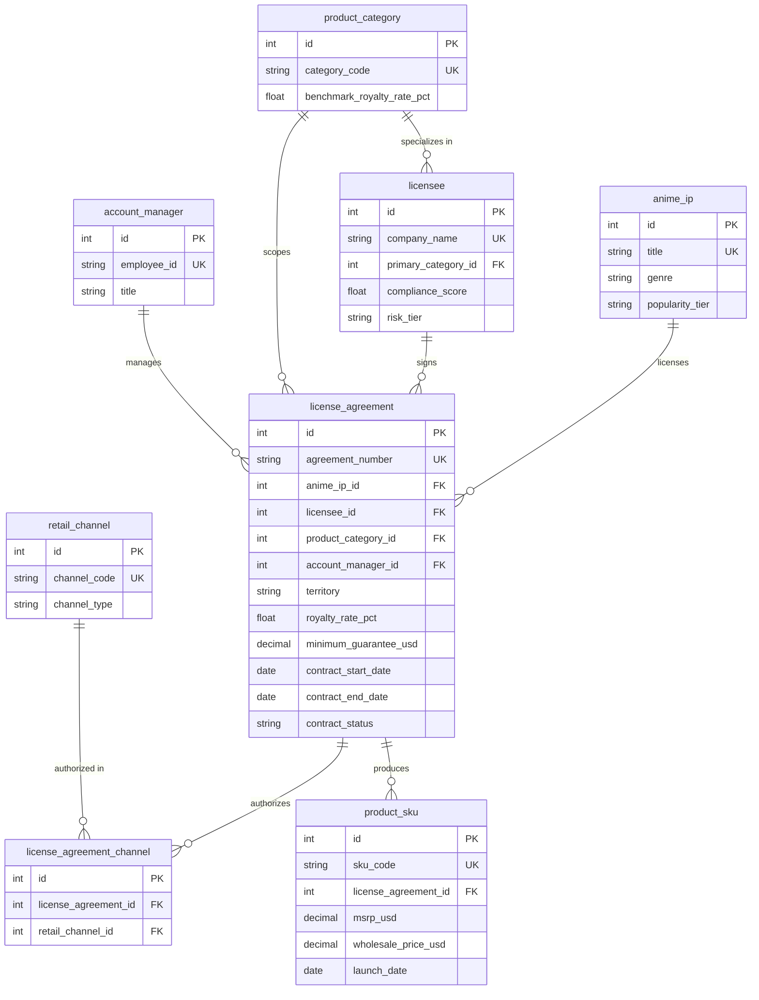
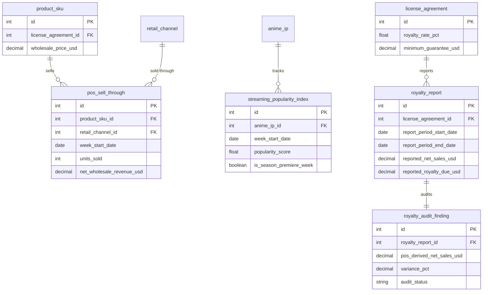

# 媒体娱乐 — 动画 IP 衍生品授权与零售动销分析 实体关系文档

> 业务背景, 行业科普, 术语表请见 `01-media_anime_ip_licensing_retail_medium_business_context-cn.md`. 本文档只描述数据.

## 数据集元数据

- **复杂度等级:** Medium
- **表数量:** 12 张表
- **总记录数:** 约 50,600 行
- **外键关系:** 13 个外键关系(11 个一对多, 2 个属于 `license_agreement_channel` 桥接表, 共同构成 1 个多对多关系)
- **参考日(REFERENCE_DATE):** `2026-06-30` —— 数据集中所有"今天/当前快照"的语义(合同是否活跃、保底金额分期折算进度)都锚定到该日期,与生成器和 SQL 查询保持一致。生成器使用这个常量(而非系统当前时间)保证多次运行结果一致;SQL 查询里凡是需要"今天"的地方,都用字面量 `'2026-06-30'` 而非 `DATE('now')`,出于同一原因。

---

## 实体关系图

数据集分两条主线:**"授权与目录"**(IP、被授权商、合同、SKU)和 **"动销、热度与版税"**(POS 销售、流媒体热度、版税自报与稽核),下面拆成两张子图。

### 子图 1: 授权与目录 (IP, Licensee, Agreement, SKU)



### 子图 2: 动销、热度与版税 (POS, Popularity, Royalty)



---

## 表定义

### 1. product_category

**描述:** 衍生品品类查找表,覆盖玩具、服饰、收藏卡牌、家居用品、文具、配饰六大类。`benchmark_royalty_rate_pct` 是该品类在消费品授权行业的惯例版税率参考值,`license_agreement.royalty_rate_pct` 会围绕这个基准上下浮动。

| 列名 | 类型 | 约束 | 描述 |
|--------|------|-------------|-------------|
| id | INTEGER | PK, AUTO_INCREMENT | 主键 |
| category_code | VARCHAR(30) | NOT NULL, UNIQUE | 品类代码(snake_case) |
| category_name | VARCHAR(100) | NOT NULL | 品类显示名称 |
| benchmark_royalty_rate_pct | NUMERIC(5,2) | NOT NULL | 行业惯例版税率基准(百分比) |

**外键:** 无(查找表)

**示例数据:**

| id | category_code | category_name | benchmark_royalty_rate_pct |
|----|----------------|----------------|------------------------------|
| 1 | toys_action_figures | Toys & Action Figures | 10.00 |
| 3 | collectible_trading_cards | Collectible Trading Cards | 12.00 |
| 5 | stationery_office | Stationery & Office | 7.00 |

---

### 2. retail_channel

**描述:** 零售渠道查找表。每份授权合同只能在其 `license_agreement_channel` 桥接表列出的渠道里销售——这是 Q4 越权铺货合规分析的基准。

| 列名 | 类型 | 约束 | 描述 |
|--------|------|-------------|-------------|
| id | INTEGER | PK, AUTO_INCREMENT | 主键 |
| channel_code | VARCHAR(30) | NOT NULL, UNIQUE | 渠道代码(snake_case) |
| channel_name | VARCHAR(100) | NOT NULL | 渠道显示名称 |
| channel_type | VARCHAR(20) | NOT NULL | `offline` 或 `online` |

**外键:** 无(查找表)

**示例数据:**

| id | channel_code | channel_name | channel_type |
|----|----------------|----------------|----------------|
| 1 | big_box_retail | Big Box Retail Chains | offline |
| 3 | ecommerce_marketplace | E-commerce Marketplace | online |
| 5 | convention_pop_up | Convention & Pop-up Retail | offline |

> **陷阱 4 相关提示:** `ecommerce_marketplace` (id=3) 是越权铺货最常见的"泄漏渠道"——电商平台准入门槛低、追踪难,合规较差的被授权商倾向于在这里额外铺货,即便合同没有授权。

---

### 3. anime_ip

**描述:** Ember & Ash 代理的动画 IP 维度表。`popularity_tier` 决定了这部 IP 能吸引多少授权合同、动销速度基准、以及是否会在追踪窗口内出现"新季首播"热度峰值——是 Q1 续约优先级和 Q3 热度滞后分析的核心维度。

| 列名 | 类型 | 约束 | 描述 |
|--------|------|-------------|-------------|
| id | INTEGER | PK, AUTO_INCREMENT | 主键 |
| title | VARCHAR(150) | NOT NULL, UNIQUE | 动画标题(虚构) |
| genre | VARCHAR(30) | NOT NULL | 题材(如 shonen_action、isekai_fantasy) |
| target_demographic | VARCHAR(20) | NOT NULL | 目标受众(kids/teen/young_adult/mature) |
| home_streaming_platform | VARCHAR(100) | NOT NULL | 首播流媒体平台(虚构) |
| season_count | INTEGER | NOT NULL | 已播季数 |
| debut_year | INTEGER | NOT NULL | 首播年份 |
| popularity_tier | VARCHAR(20) | NOT NULL | 热度层级:breakout(全网爆款)/ mainstream(稳定主流)/ niche(长尾小众) |

**外键:** 无

**示例数据:**

| id | title | genre | target_demographic | popularity_tier |
|----|-------|-------|---------------------|-------------------|
| 1 | Starlit Ronin | mecha | mature | mainstream |
| 3 | Nebula Drift | isekai_fantasy | young_adult | niche |
| 22 | Petalfall | comedy | kids | breakout |

**本数据集中的层级构成:** 24 部 IP 中 breakout 5 部、mainstream 13 部、niche 6 部。

---

### 4. licensee

**描述:** 被授权商维度表——实际生产/分销衍生品的北美制造企业。`compliance_score` 是本数据集里最重要的隐藏驱动变量:低于 66 分的被授权商被标记为 `risk_tier = 'risk'`,这一群体同时驱动陷阱 2(版税低报)和陷阱 4(越权铺货)。

| 列名 | 类型 | 约束 | 描述 |
|--------|------|-------------|-------------|
| id | INTEGER | PK, AUTO_INCREMENT | 主键 |
| company_name | VARCHAR(200) | NOT NULL, UNIQUE | 企业名称(虚构) |
| hq_city | VARCHAR(100) | NOT NULL | 总部城市 |
| hq_state | VARCHAR(2) | NOT NULL | 州/省代码(美国州或加拿大省) |
| founded_year | INTEGER | NOT NULL | 成立年份 |
| primary_category_id | INTEGER | FK → product_category.id | 主营品类 |
| compliance_score | NUMERIC(5,2) | NOT NULL | 合规评分(0-100)。clean 群体 70-98 分,risk 群体 35-65 分 |
| risk_tier | VARCHAR(10) | NOT NULL | `clean` 或 `risk`,按 compliance_score < 66 判定,供查询直接筛选使用 |

**外键:**
- `primary_category_id` → `product_category.id` (ON DELETE RESTRICT)

**示例数据:**

| id | company_name | hq_city | compliance_score | risk_tier |
|----|---------------|---------|---------------------|-----------|
| 1 | Rodriguez, Figueroa and Sanchez Apparel Co. | Los Angeles | 76.41 | clean |
| 2 | Doyle Ltd Home Goods | Portland | 42.14 | risk |
| 3 | Mcclain, Miller and Henderson Merch Studio | Denver | 38.97 | risk |

**本数据集中的群体构成:** 32 家被授权商中 24 家 clean(约 75%)、8 家 risk(约 25%)。

---

### 5. account_manager

**描述:** Ember & Ash 内部的授权经理团队,负责被授权商关系维护与合同谈判。每份 `license_agreement` 分配一位授权经理,支撑组合负荷和关系管理分析。

| 列名 | 类型 | 约束 | 描述 |
|--------|------|-------------|-------------|
| id | INTEGER | PK, AUTO_INCREMENT | 主键 |
| employee_id | VARCHAR(20) | NOT NULL, UNIQUE | 员工编号(AM###) |
| first_name | VARCHAR(50) | NOT NULL | 名 |
| last_name | VARCHAR(50) | NOT NULL | 姓 |
| title | VARCHAR(50) | NOT NULL | 职级:Licensing Manager / Senior Licensing Manager / Director of Licensing |
| region_focus | VARCHAR(50) | NOT NULL | 负责区域(West Coast、East Coast、Central、Canada、National) |
| hire_date | DATE | NOT NULL | 入职日期 |

**外键:** 无

**示例数据:**

| id | employee_id | first_name | last_name | title | region_focus |
|----|-------------|------------|-----------|-----------------------|--------------|
| 1 | AM001 | Caitlin | Mcdonald | Licensing Manager | West Coast |
| 3 | AM003 | Danny | Dyer | Licensing Manager | Canada |

---

### 6. license_agreement

**描述:** 一份授权合同的核心记录——一个 IP x 一个被授权商 x 一个品类的授权条款,是整个数据集的"关系枢纽"。`minimum_guarantee_usd` 与 `royalty_rate_pct` 是 Q1、Q5 分析的核心输入。

> **作用域约束(DDL 不强制 — 分析师需自行遵守):** 同一 `anime_ip_id` 下不会出现完全相同的 `(licensee_id, product_category_id)` 组合——生成器保证了这一点,但没有对应的表级唯一约束。

| 列名 | 类型 | 约束 | 描述 |
|--------|------|-------------|-------------|
| id | INTEGER | PK, AUTO_INCREMENT | 主键 |
| agreement_number | VARCHAR(50) | NOT NULL, UNIQUE | 合同编号(LA-#####) |
| anime_ip_id | INTEGER | FK → anime_ip.id | 授权的动画 IP |
| licensee_id | INTEGER | FK → licensee.id | 被授权商 |
| product_category_id | INTEGER | FK → product_category.id | 授权品类范围(单一品类) |
| account_manager_id | INTEGER | FK → account_manager.id | 负责该合同的授权经理 |
| territory | VARCHAR(12) | NOT NULL | 地域范围:`US` / `CANADA` / `US_CANADA` |
| royalty_rate_pct | NUMERIC(5,2) | NOT NULL | 版税率(百分比),围绕品类基准 ±1.5pp 浮动 |
| minimum_guarantee_usd | NUMERIC(12,2) | NOT NULL | 保底金额(合同期总额,非年度) |
| signed_date | DATE | NOT NULL | 签约日期 |
| contract_start_date | DATE | NOT NULL | 合同生效日(签约后 30-75 天) |
| contract_end_date | DATE | NOT NULL | 合同到期日 |
| contract_status | VARCHAR(20) | NOT NULL | `active` / `expired` / `terminated`,按 contract_end_date 与 REFERENCE_DATE 的关系派生 |

**外键:**
- `anime_ip_id` → `anime_ip.id` (ON DELETE RESTRICT)
- `licensee_id` → `licensee.id` (ON DELETE RESTRICT)
- `product_category_id` → `product_category.id` (ON DELETE RESTRICT)
- `account_manager_id` → `account_manager.id` (ON DELETE RESTRICT)

**示例数据:**

| id | agreement_number | anime_ip_id | territory | royalty_rate_pct | minimum_guarantee_usd | contract_status |
|----|-------------------|-------------|-----------|---------------------|---------------------------|-------------------|
| 1 | LA-00001 | 1 | US | 6.73 | 12,790.58 | active |
| 3 | LA-00003 | 1 | US_CANADA | 9.15 | 15,101.22 | active |

**本数据集中的合同状态构成:** 117 份合同中 99 份 active、15 份 expired、3 份 terminated。

---

### 7. license_agreement_channel

**描述:** 合同授权渠道桥接表(M:N)。一份合同可以授权 1 到 3 个零售渠道;`pos_sell_through` 里出现在这张表之外的渠道销售记录,就是越权铺货(陷阱 4)。

| 列名 | 类型 | 约束 | 描述 |
|--------|------|-------------|-------------|
| id | INTEGER | PK, AUTO_INCREMENT | 主键 |
| license_agreement_id | INTEGER | FK → license_agreement.id | 所属合同 |
| retail_channel_id | INTEGER | FK → retail_channel.id | 授权的渠道 |

**外键:**
- `license_agreement_id` → `license_agreement.id` (ON DELETE CASCADE)
- `retail_channel_id` → `retail_channel.id` (ON DELETE RESTRICT)
- UNIQUE(`license_agreement_id`, `retail_channel_id`)

**示例数据:**

| id | license_agreement_id | retail_channel_id |
|----|------------------------|----------------------|
| 1 | 1 | 5 (convention_pop_up) |
| 3 | 3 | 3 (ecommerce_marketplace) |
| 4 | 3 | 2 (specialty_retail) |

---

### 8. product_sku

**描述:** 衍生品 SKU(最小库存单元),隶属于某一份授权合同。`wholesale_price_usd` 遵循消费品行业的 "keystone" 加价惯例(约为 MSRP 的 50%),是版税计算的真正基数。

| 列名 | 类型 | 约束 | 描述 |
|--------|------|-------------|-------------|
| id | INTEGER | PK, AUTO_INCREMENT | 主键 |
| sku_code | VARCHAR(50) | NOT NULL, UNIQUE | SKU 编码(SKU-######) |
| license_agreement_id | INTEGER | FK → license_agreement.id | 所属合同 |
| sku_name | VARCHAR(200) | NOT NULL | 产品名称 |
| msrp_usd | NUMERIC(8,2) | NOT NULL | 建议零售价(美元) |
| wholesale_price_usd | NUMERIC(8,2) | NOT NULL | 批发价(美元),约为 MSRP 的 45%-55% |
| launch_date | DATE | NOT NULL | 上市日期(合同生效日 + 60-120 天的产品开发周期) |
| discontinued_date | DATE | NULL | 下架日期;NULL 表示仍在售或随合同到期自然下架 |

**外键:**
- `license_agreement_id` → `license_agreement.id` (ON DELETE CASCADE)

**示例数据:**

| id | sku_code | sku_name | msrp_usd | wholesale_price_usd | launch_date |
|----|----------|-----------------------|----------|------------------------|-------------|
| 1 | SKU-000001 | Cap Series 5 | 33.17 | 16.13 | 2025-08-06 |
| 2 | SKU-000002 | Graphic Tee Series 2 | 38.64 | 18.47 | 2025-07-29 |

**本数据集中的 SKU 数量:** 约 750 个,平均每份合同约 6.4 个 SKU。

---

### 9. streaming_popularity_index

**描述:** 动画 IP 在流媒体端的周度热度指数(0-100 量表,类比搜索热度/观看时长综合指数)。追踪窗口比授权合同数据更长(2 年),因为 Ember & Ash 需要在授权决策之前就观察热度走势。`is_season_premiere_week` 标记热度峰值事件,是 Q3 滞后分析的锚点。

> **重要提示:** 只有 breakout(2 次)和 mainstream(1 次)层级的 IP 在追踪窗口内出现首播峰值;niche 层级 IP **没有**首播事件(`PREMIERE_COUNT_BY_TIER["niche"] = 0`),热度全程在低位波动。这意味着 Q3 的"热度-动销滞后"信号只在 breakout/mainstream 级 IP 上可靠观测——这是数据生成规则的明确约定,不是随机巧合。

| 列名 | 类型 | 约束 | 描述 |
|--------|------|-------------|-------------|
| id | INTEGER | PK, AUTO_INCREMENT | 主键 |
| anime_ip_id | INTEGER | FK → anime_ip.id | 所属 IP |
| week_start_date | DATE | NOT NULL | 该周周一日期 |
| popularity_score | NUMERIC(5,2) | NOT NULL | 热度评分(0-100) |
| is_season_premiere_week | BOOLEAN | NOT NULL, DEFAULT 0 | 是否为新一季首播周 |

**外键:**
- `anime_ip_id` → `anime_ip.id` (ON DELETE RESTRICT)

**示例数据:**

| id | anime_ip_id | week_start_date | popularity_score | is_season_premiere_week |
|----|-------------|-------------------|----------------------|----------------------------|
| 47 | 1 | 2025-05-20 | 96.31 | true |
| 450 | 5 | 2025-01-21 | 94.37 | true |

---

### 10. pos_sell_through

**描述:** 零售终端周度动销事实表(POS: point of sale),数据集中最大的表。每行代表一个 SKU 在一个渠道、一周内的实际销量。`net_wholesale_revenue_usd = units_sold × wholesale_price_usd`,是版税稽核和动销分析的原始事实来源。

| 列名 | 类型 | 约束 | 描述 |
|--------|------|-------------|-------------|
| id | INTEGER | PK, AUTO_INCREMENT | 主键 |
| product_sku_id | INTEGER | FK → product_sku.id | 所属 SKU |
| retail_channel_id | INTEGER | FK → retail_channel.id | 销售渠道(**不保证在该 SKU 所属合同的授权渠道范围内 — 这正是陷阱 4**) |
| week_start_date | DATE | NOT NULL | 该周周一日期 |
| units_sold | INTEGER | NOT NULL | 该周该渠道售出件数 |
| net_wholesale_revenue_usd | NUMERIC(12,2) | NOT NULL | 批发净销售额 = units_sold × wholesale_price_usd |
| ending_inventory_units | INTEGER | NOT NULL | 该周末库存件数(参考字段,未在 SQL 查询文档中使用) |

**外键:**
- `product_sku_id` → `product_sku.id` (ON DELETE CASCADE)
- `retail_channel_id` → `retail_channel.id` (ON DELETE RESTRICT)

**示例数据:**

| id | product_sku_id | retail_channel_id | week_start_date | units_sold | net_wholesale_revenue_usd |
|----|-------------------|------------------------|--------------------|---------------|-------------------------------|
| 1 | 1 | 5 | 2025-08-04 | 0 | 0.00 |
| 3 | 1 | 5 | 2025-08-18 | 19 | 306.47 |

**本数据集中的行数:** 约 46,180 行,覆盖 2024-12 到 2026-06 之间的周度记录。

---

### 11. royalty_report

**描述:** 被授权商按"合同季度"(从 contract_start_date 起每 91 天一期,非自然日历季度)自报的版税流水。`reported_net_sales_usd` 在 risk 群体被授权商身上系统性低于真实值(陷阱 2)。

| 列名 | 类型 | 约束 | 描述 |
|--------|------|-------------|-------------|
| id | INTEGER | PK, AUTO_INCREMENT | 主键 |
| license_agreement_id | INTEGER | FK → license_agreement.id | 所属合同 |
| report_period_start_date | DATE | NOT NULL | 报告期起始日 |
| report_period_end_date | DATE | NOT NULL | 报告期结束日(起始日 + 91 天) |
| reported_net_sales_usd | NUMERIC(12,2) | NOT NULL | 被授权商自报的批发净销售额 |
| reported_royalty_due_usd | NUMERIC(12,2) | NOT NULL | 自报应付版税 = reported_net_sales_usd × royalty_rate_pct / 100 |
| report_submitted_date | DATE | NOT NULL | 实际提交日期(报告期结束后 15-45 天) |

**外键:**
- `license_agreement_id` → `license_agreement.id` (ON DELETE CASCADE)

**示例数据:**

| id | license_agreement_id | report_period_start_date | report_period_end_date | reported_net_sales_usd | reported_royalty_due_usd |
|----|------------------------|------------------------------|------------------------------|------------------------------|-------------------------------|
| 2 | 1 | 2025-08-01 | 2025-10-31 | 24,479.52 | 1,647.47 |
| 3 | 1 | 2025-10-31 | 2026-01-30 | 25,473.70 | 1,714.38 |

**本数据集中的行数:** 369 份报告,平均每份提交过报告的合同约 3.3 期(369 份报告来自 112 份提交过报告的合同,369/112 ≈ 3.29)。注意分母不是"活跃合同"数——只要 `report_submitted_date <= REFERENCE_DATE` 就会生成报告,与合同当前状态(active / expired / terminated)无关,所以已到期或已终止的合同也会贡献历史报告。

> **口径提示:** 同一合同相邻两期的 `report_period_end_date` 与下一期的 `report_period_start_date` 是同一天(每 91 天步进,端点相接)。业务口径按半开区间 `[start, end)` 处理(见业务背景文档第 9 节的 `pos_derived_net_sales` 公式),不会重复计数;但如果你自己写按报告期聚合 POS 的查询,别用包含两端的 `BETWEEN start AND end`,否则边界那一天会被相邻两期各算一次。

---

### 12. royalty_audit_finding

**描述:** 版税稽核结果——用 `pos_sell_through` 独立反推的"真实"版税,和 `royalty_report` 的自报数字对比。每份 `royalty_report` 对应唯一一条稽核记录(1:1)。这是陷阱 2 的最终呈现表。

| 列名 | 类型 | 约束 | 描述 |
|--------|------|-------------|-------------|
| id | INTEGER | PK, AUTO_INCREMENT | 主键 |
| royalty_report_id | INTEGER | FK → royalty_report.id, UNIQUE | 对应的自报记录(1:1 关系) |
| pos_derived_net_sales_usd | NUMERIC(12,2) | NOT NULL | 用 POS 数据反推的净销售额(该合同、该报告期内, 跨所有渠道) |
| pos_derived_royalty_usd | NUMERIC(12,2) | NOT NULL | POS 推算应付版税 = pos_derived_net_sales_usd × royalty_rate_pct / 100 |
| variance_usd | NUMERIC(12,2) | NOT NULL | 差异金额 = pos_derived_royalty_usd − reported_royalty_due_usd(正值 = 疑似低报) |
| variance_pct | NUMERIC(6,2) | NOT NULL | 差异百分比 = variance_usd / pos_derived_royalty_usd × 100 |
| audit_status | VARCHAR(30) | NOT NULL | `within_tolerance`(<5%)/ `flagged_for_review`(5%-12%)/ `confirmed_underreport`(≥12%) |

**外键:**
- `royalty_report_id` → `royalty_report.id` (ON DELETE CASCADE), UNIQUE

**示例数据:**

| id | royalty_report_id | pos_derived_royalty_usd | variance_usd | variance_pct | audit_status |
|----|----------------------|------------------------------|-------------------|-------------------|-----------------------|
| 5 | 5 | 116.29 | 16.71 | 14.37 | confirmed_underreport |
| 6 | 6 | 6,192.44 | 1,013.73 | 16.37 | confirmed_underreport |

**本数据集中的稽核结论分布:** `within_tolerance` 266 (72.1%)、`flagged_for_review` 37 (10.0%)、`confirmed_underreport` 66 (17.9%)。

---

## 数据生成规则

### 业务逻辑约束

1. **时序顺序:**
   - `licensee.founded_year` < 合同 `signed_date` 所在年份(生成器未显式强制,但取值区间保证了这一点成立)
   - `license_agreement.signed_date` < `contract_start_date`(签约后 30-75 天生效)
   - `license_agreement.contract_start_date` < `contract_end_date`
   - `product_sku.launch_date` = `contract_start_date` + 60-120 天(产品开发周期)
   - `product_sku.discontinued_date`(如非 NULL)> `launch_date`
   - `pos_sell_through.week_start_date` 落在 `[launch_date 所在周, min(discontinued_date, contract_end_date, REFERENCE_DATE) 所在周]` 区间内
   - `royalty_report.report_period_start_date` 从 `contract_start_date` 起按 91 天步进;只有 `report_submitted_date <= REFERENCE_DATE` 的期次才会生成报告(未到提交时限的期次不生成——即"尚未到期的账不能提前报")
   - `streaming_popularity_index.week_start_date` 覆盖 REFERENCE_DATE 往前 104 周窗口的完整周度序列(含起止两端,每个 IP 共 105 个不同的周起点),独立于合同时间线

2. **引用完整性:**
   - 所有 `license_agreement` 必须引用存在的 `anime_ip`、`licensee`、`product_category`、`account_manager`
   - `pos_sell_through.retail_channel_id` **不要求**出现在该 SKU 所属合同的 `license_agreement_channel` 里——这是陷阱 4 的数据结构基础,DDL 不强制、也不应该强制这条约束
   - `royalty_audit_finding` 与 `royalty_report` 严格 1:1,每份提交的报告都会被稽核

3. **取值范围:**
   - 合规评分:0-100,clean 群体 70-98,risk 群体 35-65
   - 版税率:品类基准 ±1.5pp(代码设有 4% 保护下限,但六个品类基准 7.0%-12.0% 的实际取值区间使这个下限从未被触及);理论可达范围 5.5%-13.5%,本数据集实测范围 **5.58%-13.36%**
   - 合同期限:仅 12、18、24、36 月(权重 15/25/35/25)
   - MSRP:按品类 $5-$70 不等;批发价 = MSRP × 45%-55%("keystone" 加价惯例)
   - 热度评分:0-100;首播周峰值 85-100,niche 层级基线仅 10-28

4. **计算字段:**
   - `pos_sell_through.net_wholesale_revenue_usd` = `units_sold × wholesale_price_usd`
   - `royalty_report.reported_royalty_due_usd` = `reported_net_sales_usd × royalty_rate_pct / 100`
   - `royalty_audit_finding.pos_derived_royalty_usd` = `pos_derived_net_sales_usd × royalty_rate_pct / 100`
   - `royalty_audit_finding.variance_usd` = `pos_derived_royalty_usd − reported_royalty_due_usd`
   - `license_agreement.contract_status` 由 `contract_end_date` 与 `REFERENCE_DATE` 的关系,以及是否提前终止共同派生

5. **分布规则(生成后 SQL 验证的实测值):**
   - **IP 热度层级构成:** breakout 5 部 (20.8%)、mainstream 13 部 (54.2%)、niche 6 部 (25.0%)
   - **被授权商风险群体构成:** clean 24 家 (75.0%)、risk 8 家 (25.0%)
   - **合同状态:** active 99 份 (84.6%)、expired 15 份 (12.8%)、terminated 3 份 (2.6%)
   - **地域范围分布:** US_CANADA 74 份 (63.2%)、US 32 份 (27.4%)、CANADA 11 份 (9.4%)
   - **越权渠道泄漏:** risk 群体的 pos_sell_through 行中约 6.85%(revenue 占比约 6.6%)落在未授权渠道;clean 群体约 0.59%(revenue 占比约 0.6%)

6. **业务陷阱嵌入(由生成后 SQL 验证):**
   - **陷阱/信号 1 / Q1 内容动销与续约优先级:** IP 热度层级 (`popularity_tier`) 驱动 `pos_sell_through` 单行(SKU x 渠道 x 周)平均销量呈清晰梯度——breakout 级约 **50.15 件**、mainstream 级约 **32.05 件**、niche 级约 **11.75 件**,breakout 约是 niche 的 **4.3 倍**。这个差距来自生成器 `POPULARITY_TIER_SELLTHROUGH_MULTIPLIER`(breakout 1.8x、mainstream 1.0x、niche 0.45x)叠加品类基础动销速度共同驱动,不是随机噪音。对应 SQL 查询 Q1。
   - **陷阱 2 / Q2 版税低报:** risk 群体被授权商的稽核平均差异 `variance_pct` ≈ **13.05%**,其中 64.1% 的报告被判定为 `confirmed_underreport`;clean 群体平均差异 ≈ **0.1%**,0% 被判定为低报。组合层面看,全部 369 份报告中 confirmed_underreport 17.9%、flagged_for_review 10.0%、within_tolerance 72.1%;portfolio 总差距约 4.32%(POS 推算总版税 $1,443,655 vs 自报总版税 $1,381,232)。对应 SQL 查询 Q2。
   - **陷阱 3 / Q3 热度-动销滞后:** 用"首播事件对齐法"(以首播周为 0 点,按相对周数聚合 breakout/mainstream 级 IP 已上市 SKU 的平均周销量)可以清楚看到:首播前后 (-3 到 +5 周) 平均销量维持在约 33-40 件/周的基线,随后从第 6 周开始爬升,在第 **8-10 周**达到峰值约 **55-60 件/周**(相对基线提升约 50%-75%),此后回落。这与生成器里 `POPULARITY_TO_SALES_LAG_WEEKS = (6, 10)` 的设计滞后一致。niche 层级 IP 没有首播事件,不适用此分析。对应 SQL 查询 Q3。
   - **陷阱 4 / Q4 越权铺货:** risk 群体被授权商约 6.85% 的 POS 行(约 6.6% 的收入)出现在授权范围外的渠道(几乎全部落在**线上渠道**——约四分之三是 `ecommerce_marketplace` 电商平台,其余约四分之一退化为 `direct_to_consumer_online` 官网直营;当合同已授权电商时,泄漏渠道就落到官网直营);clean 群体这一比例仅约 0.6%,属正常噪音。对应 SQL 查询 Q4。
   - **陷阱/信号 5 / Q5 保底金额达成:** 117 份合同中 99 份 `active`,其中 94 份已至少提交过一份版税报告(其余 5 份刚签约,还没到第一个 91 天报告周期,不适用此分析)。这 94 份里,有 **21 份(约 22.3%)** 按合同起始日到 REFERENCE_DATE 的时间比例折算后,累计版税进度不足保底金额目标的 40%——这些合同在下一轮续约谈判前需要重新评估条款或考虑不再续约。**注意:** 计算 `pacing_ratio` 时必须把"还没提交过报告"的合同排除在外,而不是用 `COALESCE(..., 0)` 垫成 0 参与比较——否则会把"合同太新"和"真正落后于进度"混为一谈。对应 SQL 查询 Q5。

### Faker 策略

| 字段模式 | Faker 方法 | 说明 |
|---------------|--------------|-------|
| company_name(被授权商) | `fake.company()` + 品类风格后缀 | 如 "... Toys"、"... Apparel Co." |
| first_name / last_name(授权经理) | `fake.first_name()`, `fake.last_name()` | 内部员工姓名 |
| hq_city / hq_state | `random.choice(北美城市列表)` | 覆盖美加主要城市 |
| anime_ip.title | 预置的虚构标题列表 | 避免任何真实动画 IP 名称 |
| popularity_tier | 目标计数直接分配 + `random.shuffle` | 保证层级构成完全确定 |
| compliance_score | 按 clean/risk 目标比例分配 + 区间内均匀抽样 | 保证风险群体占比精确可控 |
| units_sold | `random.gauss(mean, mean*0.35)` 并截断非负 | mean 由品类基础速度 x 热度乘数 x 生命周期曲线 x 滞后拉动乘数共同决定 |
| date(合同签约) | `fake.date_between(start_date=..., end_date=...)` | 22 个月窗口内均匀分布 |

---

## 文件清单

| # | 文件名 | 表 | 行数 | 依赖 |
|---|--------|-----|------|------|
| 01 | 01_product_category.tsv | product_category | 6 | 无 |
| 02 | 02_retail_channel.tsv | retail_channel | 5 | 无 |
| 03 | 03_anime_ip.tsv | anime_ip | 24 | 无 |
| 04 | 04_licensee.tsv | licensee | 32 | product_category |
| 05 | 05_account_manager.tsv | account_manager | 8 | 无 |
| 06 | 06_license_agreement.tsv | license_agreement | 117 | anime_ip, licensee, product_category, account_manager |
| 07 | 07_license_agreement_channel.tsv | license_agreement_channel | 205 | license_agreement, retail_channel |
| 08 | 08_product_sku.tsv | product_sku | 748 | license_agreement |
| 09 | 09_streaming_popularity_index.tsv | streaming_popularity_index | 2,520 | anime_ip |
| 10 | 10_pos_sell_through.tsv | pos_sell_through | 46,180 | product_sku, retail_channel |
| 11 | 11_royalty_report.tsv | royalty_report | 369 | license_agreement |
| 12 | 12_royalty_audit_finding.tsv | royalty_audit_finding | 369 | royalty_report |

**估计总行数:** 约 50,583 行

> 行数主要由 `pos_sell_through` 主导:约 750 个 SKU,平均每个 SKU 在约 1.3-1.5 个渠道、持续约 40 周的动销窗口内,每周产生一行。

---

## 数据库 Schema (SQLite DDL)

```sql
-- 查找表

CREATE TABLE product_category (
    id INTEGER PRIMARY KEY AUTOINCREMENT,
    category_code VARCHAR(30) NOT NULL UNIQUE,
    category_name VARCHAR(100) NOT NULL,
    benchmark_royalty_rate_pct NUMERIC(5,2) NOT NULL
);

CREATE TABLE retail_channel (
    id INTEGER PRIMARY KEY AUTOINCREMENT,
    channel_code VARCHAR(30) NOT NULL UNIQUE,
    channel_name VARCHAR(100) NOT NULL,
    channel_type VARCHAR(20) NOT NULL
);

-- 维度表

CREATE TABLE anime_ip (
    id INTEGER PRIMARY KEY AUTOINCREMENT,
    title VARCHAR(150) NOT NULL UNIQUE,
    genre VARCHAR(30) NOT NULL,
    target_demographic VARCHAR(20) NOT NULL,
    home_streaming_platform VARCHAR(100) NOT NULL,
    season_count INTEGER NOT NULL,
    debut_year INTEGER NOT NULL,
    popularity_tier VARCHAR(20) NOT NULL
);

CREATE TABLE account_manager (
    id INTEGER PRIMARY KEY AUTOINCREMENT,
    employee_id VARCHAR(20) NOT NULL UNIQUE,
    first_name VARCHAR(50) NOT NULL,
    last_name VARCHAR(50) NOT NULL,
    title VARCHAR(50) NOT NULL,
    region_focus VARCHAR(50) NOT NULL,
    hire_date DATE NOT NULL
);

CREATE TABLE licensee (
    id INTEGER PRIMARY KEY AUTOINCREMENT,
    company_name VARCHAR(200) NOT NULL UNIQUE,
    hq_city VARCHAR(100) NOT NULL,
    hq_state VARCHAR(2) NOT NULL,
    founded_year INTEGER NOT NULL,
    primary_category_id INTEGER NOT NULL,
    compliance_score NUMERIC(5,2) NOT NULL,
    risk_tier VARCHAR(10) NOT NULL,
    FOREIGN KEY (primary_category_id) REFERENCES product_category(id)
);

-- 授权合同域

CREATE TABLE license_agreement (
    id INTEGER PRIMARY KEY AUTOINCREMENT,
    agreement_number VARCHAR(50) NOT NULL UNIQUE,
    anime_ip_id INTEGER NOT NULL,
    licensee_id INTEGER NOT NULL,
    product_category_id INTEGER NOT NULL,
    account_manager_id INTEGER NOT NULL,
    territory VARCHAR(12) NOT NULL,
    royalty_rate_pct NUMERIC(5,2) NOT NULL,
    minimum_guarantee_usd NUMERIC(12,2) NOT NULL,
    signed_date DATE NOT NULL,
    contract_start_date DATE NOT NULL,
    contract_end_date DATE NOT NULL,
    contract_status VARCHAR(20) NOT NULL,
    FOREIGN KEY (anime_ip_id) REFERENCES anime_ip(id),
    FOREIGN KEY (licensee_id) REFERENCES licensee(id),
    FOREIGN KEY (product_category_id) REFERENCES product_category(id),
    FOREIGN KEY (account_manager_id) REFERENCES account_manager(id)
);

CREATE TABLE license_agreement_channel (
    id INTEGER PRIMARY KEY AUTOINCREMENT,
    license_agreement_id INTEGER NOT NULL,
    retail_channel_id INTEGER NOT NULL,
    FOREIGN KEY (license_agreement_id) REFERENCES license_agreement(id) ON DELETE CASCADE,
    FOREIGN KEY (retail_channel_id) REFERENCES retail_channel(id),
    UNIQUE (license_agreement_id, retail_channel_id)
);

CREATE TABLE product_sku (
    id INTEGER PRIMARY KEY AUTOINCREMENT,
    sku_code VARCHAR(50) NOT NULL UNIQUE,
    license_agreement_id INTEGER NOT NULL,
    sku_name VARCHAR(200) NOT NULL,
    msrp_usd NUMERIC(8,2) NOT NULL,
    wholesale_price_usd NUMERIC(8,2) NOT NULL,
    launch_date DATE NOT NULL,
    discontinued_date DATE,
    FOREIGN KEY (license_agreement_id) REFERENCES license_agreement(id) ON DELETE CASCADE
);

-- 动销与热度域

CREATE TABLE streaming_popularity_index (
    id INTEGER PRIMARY KEY AUTOINCREMENT,
    anime_ip_id INTEGER NOT NULL,
    week_start_date DATE NOT NULL,
    popularity_score NUMERIC(5,2) NOT NULL,
    is_season_premiere_week BOOLEAN NOT NULL DEFAULT 0,
    FOREIGN KEY (anime_ip_id) REFERENCES anime_ip(id)
);

CREATE TABLE pos_sell_through (
    id INTEGER PRIMARY KEY AUTOINCREMENT,
    product_sku_id INTEGER NOT NULL,
    retail_channel_id INTEGER NOT NULL,
    week_start_date DATE NOT NULL,
    units_sold INTEGER NOT NULL,
    net_wholesale_revenue_usd NUMERIC(12,2) NOT NULL,
    ending_inventory_units INTEGER NOT NULL,
    FOREIGN KEY (product_sku_id) REFERENCES product_sku(id) ON DELETE CASCADE,
    FOREIGN KEY (retail_channel_id) REFERENCES retail_channel(id)
);

-- 版税域

CREATE TABLE royalty_report (
    id INTEGER PRIMARY KEY AUTOINCREMENT,
    license_agreement_id INTEGER NOT NULL,
    report_period_start_date DATE NOT NULL,
    report_period_end_date DATE NOT NULL,
    reported_net_sales_usd NUMERIC(12,2) NOT NULL,
    reported_royalty_due_usd NUMERIC(12,2) NOT NULL,
    report_submitted_date DATE NOT NULL,
    FOREIGN KEY (license_agreement_id) REFERENCES license_agreement(id) ON DELETE CASCADE
);

CREATE TABLE royalty_audit_finding (
    id INTEGER PRIMARY KEY AUTOINCREMENT,
    royalty_report_id INTEGER NOT NULL UNIQUE,
    pos_derived_net_sales_usd NUMERIC(12,2) NOT NULL,
    pos_derived_royalty_usd NUMERIC(12,2) NOT NULL,
    variance_usd NUMERIC(12,2) NOT NULL,
    variance_pct NUMERIC(6,2) NOT NULL,
    audit_status VARCHAR(30) NOT NULL,
    FOREIGN KEY (royalty_report_id) REFERENCES royalty_report(id) ON DELETE CASCADE
);

-- 推荐索引(查询性能优化)

CREATE INDEX idx_licensee_risk_tier ON licensee(risk_tier);
CREATE INDEX idx_agreement_anime_ip ON license_agreement(anime_ip_id);
CREATE INDEX idx_agreement_licensee ON license_agreement(licensee_id);
CREATE INDEX idx_agreement_status ON license_agreement(contract_status);
CREATE INDEX idx_agreement_channel_agreement ON license_agreement_channel(license_agreement_id);
CREATE INDEX idx_sku_agreement ON product_sku(license_agreement_id);
CREATE INDEX idx_popularity_ip ON streaming_popularity_index(anime_ip_id);
CREATE INDEX idx_popularity_week ON streaming_popularity_index(week_start_date);
CREATE INDEX idx_pos_sku ON pos_sell_through(product_sku_id);
CREATE INDEX idx_pos_channel ON pos_sell_through(retail_channel_id);
CREATE INDEX idx_pos_week ON pos_sell_through(week_start_date);
CREATE INDEX idx_royalty_report_agreement ON royalty_report(license_agreement_id);
CREATE INDEX idx_audit_finding_report ON royalty_audit_finding(royalty_report_id);
```

---

## 配套文档

- 业务背景, 五大核心业务问题, 行业科普, 术语表, 指标公式: `01-media_anime_ip_licensing_retail_medium_business_context-cn.md`
- 面向业务的 SQL 查询(每个查询对应一个业务问题): `03-media_anime_ip_licensing_retail_medium_sql_queries-cn.md`
- 数据生成器(各分布与业务陷阱的实现): `04-media_anime_ip_licensing_retail_medium_data_generator-cn.py`

数据在生成时即保证引用完整性——所有外键都可回溯到存在的父表记录,实测 0 孤儿(生成器未额外开启 SQLite 的 `PRAGMA foreign_keys = ON`,引用完整性由生成逻辑而非数据库引擎强制,但结果等价:数据本身干净);数据集可直接用于 SQL 分析、可视化与机器学习建模。
