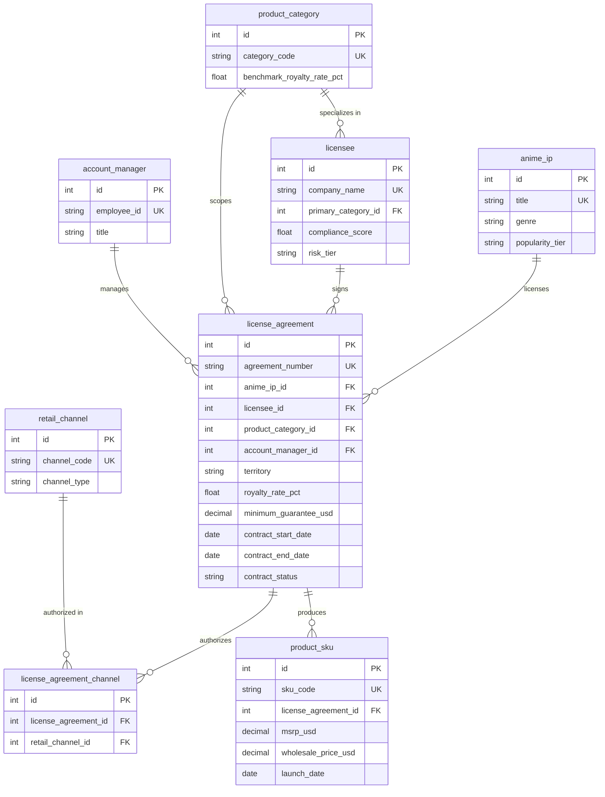
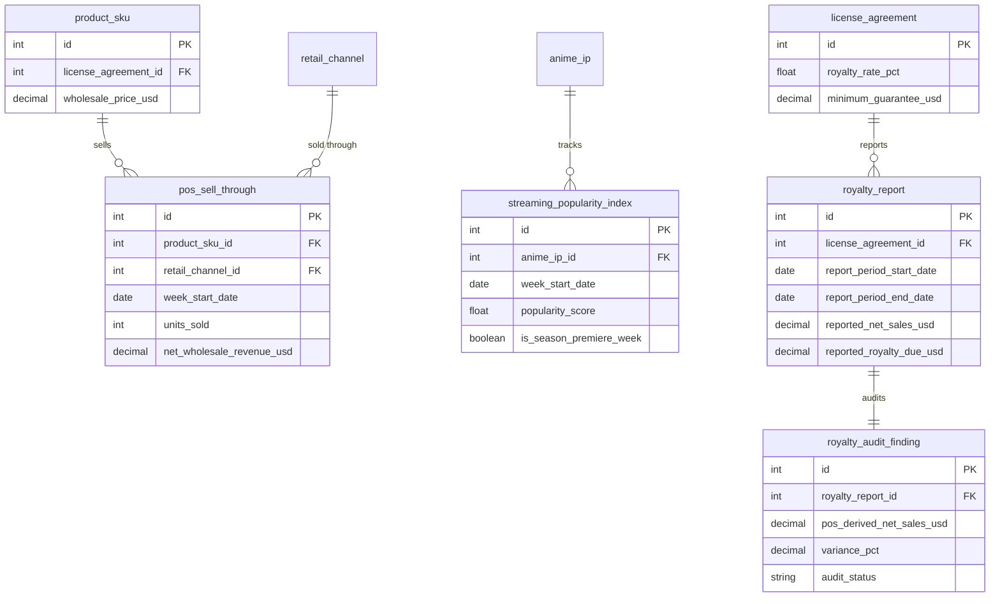

# Media & Entertainment — Anime IP Merchandise Licensing & Retail Sell-Through Analysis: Entity Relationship Document

> For business context, industry primer, and glossary, see `01-media_anime_ip_licensing_retail_medium_business_context.md`. This document describes the data only.

## Dataset Metadata

- **Complexity tier:** Medium
- **Table count:** 12 tables
- **Total records:** approximately 50,600 rows
- **Foreign key relationships:** 13 foreign key relationships (11 one-to-many, plus 2 belonging to the `license_agreement_channel` bridge table that together form 1 many-to-many relationship)
- **Reference date (REFERENCE_DATE):** `2026-06-30` — every "today / current snapshot" concept in the dataset (whether a contract is active, how far along the minimum-guarantee proration is) is anchored to this date, consistent across the generator and the SQL queries. The generator uses this constant instead of the system's current time so that repeated runs produce identical results; anywhere a SQL query needs "today," it uses the literal `'2026-06-30'` rather than `DATE('now')`, for the same reason.

---

## Entity Relationship Diagram

The dataset splits into two storylines: **"licensing and catalog"** (IP, licensees, agreements, SKUs) and **"sell-through, popularity, and royalties"** (POS sales, streaming popularity, royalty self-reporting and audits). These are broken out into two sub-diagrams below.

### Sub-diagram 1: Licensing and Catalog (IP, Licensee, Agreement, SKU)



### Sub-diagram 2: Sell-Through, Popularity, and Royalties (POS, Popularity, Royalty)



---

## Table Definitions

### 1. product_category

**Description:** A lookup table of merchandise categories, covering six major groups: toys, apparel, collectible trading cards, home goods, stationery, and accessories. `benchmark_royalty_rate_pct` is the conventional industry-benchmark royalty rate for that category in the consumer products licensing business; `license_agreement.royalty_rate_pct` floats up or down around this benchmark.

| Column | Type | Constraints | Description |
|--------|------|-------------|-------------|
| id | INTEGER | PK, AUTO_INCREMENT | Primary key |
| category_code | VARCHAR(30) | NOT NULL, UNIQUE | Category code (snake_case) |
| category_name | VARCHAR(100) | NOT NULL | Category display name |
| benchmark_royalty_rate_pct | NUMERIC(5,2) | NOT NULL | Industry-benchmark royalty rate (percentage) |

**Foreign keys:** None (lookup table)

**Sample data:**

| id | category_code | category_name | benchmark_royalty_rate_pct |
|----|----------------|----------------|------------------------------|
| 1 | toys_action_figures | Toys & Action Figures | 10.00 |
| 3 | collectible_trading_cards | Collectible Trading Cards | 12.00 |
| 5 | stationery_office | Stationery & Office | 7.00 |

---

### 2. retail_channel

**Description:** A lookup table of retail channels. Each license agreement may only sell through the channels listed for it in the `license_agreement_channel` bridge table — this is the baseline for the Q4 unauthorized-channel compliance analysis.

| Column | Type | Constraints | Description |
|--------|------|-------------|-------------|
| id | INTEGER | PK, AUTO_INCREMENT | Primary key |
| channel_code | VARCHAR(30) | NOT NULL, UNIQUE | Channel code (snake_case) |
| channel_name | VARCHAR(100) | NOT NULL | Channel display name |
| channel_type | VARCHAR(20) | NOT NULL | `offline` or `online` |

**Foreign keys:** None (lookup table)

**Sample data:**

| id | channel_code | channel_name | channel_type |
|----|----------------|----------------|----------------|
| 1 | big_box_retail | Big Box Retail Chains | offline |
| 3 | ecommerce_marketplace | E-commerce Marketplace | online |
| 5 | convention_pop_up | Convention & Pop-up Retail | offline |

> **Note related to trap 4:** `ecommerce_marketplace` (id=3) is the most common "leakage channel" for unauthorized distribution — online marketplaces have low barriers to entry and are hard to police, so lower-compliance licensees tend to stock extra inventory there even when their contract doesn't authorize it.

---

### 3. anime_ip

**Description:** The dimension table of anime IP titles that Ember & Ash represents. `popularity_tier` determines how many license agreements a title can attract, its baseline sell-through velocity, and whether it shows a "new season premiere" popularity spike within the tracking window — making it the core dimension behind the Q1 renewal-priority analysis and the Q3 popularity-lag analysis.

| Column | Type | Constraints | Description |
|--------|------|-------------|-------------|
| id | INTEGER | PK, AUTO_INCREMENT | Primary key |
| title | VARCHAR(150) | NOT NULL, UNIQUE | Anime title (fictional) |
| genre | VARCHAR(30) | NOT NULL | Genre (e.g., shonen_action, isekai_fantasy) |
| target_demographic | VARCHAR(20) | NOT NULL | Target audience (kids/teen/young_adult/mature) |
| home_streaming_platform | VARCHAR(100) | NOT NULL | Original streaming platform (fictional) |
| season_count | INTEGER | NOT NULL | Number of seasons aired |
| debut_year | INTEGER | NOT NULL | Debut year |
| popularity_tier | VARCHAR(20) | NOT NULL | Popularity tier: breakout (viral hit) / mainstream (steady mainstream) / niche (long-tail cult following) |

**Foreign keys:** None

**Sample data:**

| id | title | genre | target_demographic | popularity_tier |
|----|-------|-------|---------------------|-------------------|
| 1 | Starlit Ronin | mecha | mature | mainstream |
| 3 | Nebula Drift | isekai_fantasy | young_adult | niche |
| 22 | Petalfall | comedy | kids | breakout |

**Tier composition in this dataset:** of 24 IPs, 5 are breakout, 13 are mainstream, and 6 are niche.

---

### 4. licensee

**Description:** The dimension table of licensees — the North American manufacturing companies that actually produce and distribute the merchandise. `compliance_score` is the most important hidden driver variable in this dataset: licensees scoring below 66 are flagged as `risk_tier = 'risk'`, and this group drives both trap 2 (royalty underreporting) and trap 4 (unauthorized-channel distribution).

| Column | Type | Constraints | Description |
|--------|------|-------------|-------------|
| id | INTEGER | PK, AUTO_INCREMENT | Primary key |
| company_name | VARCHAR(200) | NOT NULL, UNIQUE | Company name (fictional) |
| hq_city | VARCHAR(100) | NOT NULL | Headquarters city |
| hq_state | VARCHAR(2) | NOT NULL | State/province code (U.S. state or Canadian province) |
| founded_year | INTEGER | NOT NULL | Year founded |
| primary_category_id | INTEGER | FK → product_category.id | Primary category |
| compliance_score | NUMERIC(5,2) | NOT NULL | Compliance score (0-100). Clean group scores 70-98, risk group scores 35-65 |
| risk_tier | VARCHAR(10) | NOT NULL | `clean` or `risk`, determined by compliance_score < 66, provided for direct filtering in queries |

**Foreign keys:**
- `primary_category_id` → `product_category.id` (ON DELETE RESTRICT)

**Sample data:**

| id | company_name | hq_city | compliance_score | risk_tier |
|----|---------------|---------|---------------------|-----------|
| 1 | Rodriguez, Figueroa and Sanchez Apparel Co. | Los Angeles | 76.41 | clean |
| 2 | Doyle Ltd Home Goods | Portland | 42.14 | risk |
| 3 | Mcclain, Miller and Henderson Merch Studio | Denver | 38.97 | risk |

**Group composition in this dataset:** of 32 licensees, 24 are clean (about 75%) and 8 are risk (about 25%).

---

### 5. account_manager

**Description:** Ember & Ash's internal licensing management team, responsible for maintaining licensee relationships and negotiating contracts. Each `license_agreement` is assigned one account manager, supporting portfolio-load and relationship-management analysis.

| Column | Type | Constraints | Description |
|--------|------|-------------|-------------|
| id | INTEGER | PK, AUTO_INCREMENT | Primary key |
| employee_id | VARCHAR(20) | NOT NULL, UNIQUE | Employee ID (AM###) |
| first_name | VARCHAR(50) | NOT NULL | First name |
| last_name | VARCHAR(50) | NOT NULL | Last name |
| title | VARCHAR(50) | NOT NULL | Job title: Licensing Manager / Senior Licensing Manager / Director of Licensing |
| region_focus | VARCHAR(50) | NOT NULL | Region of responsibility (West Coast, East Coast, Central, Canada, National) |
| hire_date | DATE | NOT NULL | Hire date |

**Foreign keys:** None

**Sample data:**

| id | employee_id | first_name | last_name | title | region_focus |
|----|-------------|------------|-----------|-----------------------|--------------|
| 1 | AM001 | Caitlin | Mcdonald | Licensing Manager | West Coast |
| 3 | AM003 | Danny | Dyer | Licensing Manager | Canada |

---

### 6. license_agreement

**Description:** The core record of a licensing contract — the terms governing one IP x one licensee x one category, and the "relationship hub" of the whole dataset. `minimum_guarantee_usd` and `royalty_rate_pct` are the core inputs for the Q1 and Q5 analyses.

> **Scope constraint (not enforced at the DDL level — analysts must respect it themselves):** the same `anime_ip_id` never has two agreements with an identical `(licensee_id, product_category_id)` combination — the generator guarantees this, but there is no corresponding table-level unique constraint.

| Column | Type | Constraints | Description |
|--------|------|-------------|-------------|
| id | INTEGER | PK, AUTO_INCREMENT | Primary key |
| agreement_number | VARCHAR(50) | NOT NULL, UNIQUE | Agreement number (LA-#####) |
| anime_ip_id | INTEGER | FK → anime_ip.id | Licensed anime IP |
| licensee_id | INTEGER | FK → licensee.id | Licensee |
| product_category_id | INTEGER | FK → product_category.id | Licensed category scope (single category) |
| account_manager_id | INTEGER | FK → account_manager.id | Account manager responsible for this contract |
| territory | VARCHAR(12) | NOT NULL | Territory scope: `US` / `CANADA` / `US_CANADA` |
| royalty_rate_pct | NUMERIC(5,2) | NOT NULL | Royalty rate (percentage), floats ±1.5pp around the category benchmark |
| minimum_guarantee_usd | NUMERIC(12,2) | NOT NULL | Minimum guarantee (total for the contract life, not annual) |
| signed_date | DATE | NOT NULL | Date signed |
| contract_start_date | DATE | NOT NULL | Contract effective date (30-75 days after signing) |
| contract_end_date | DATE | NOT NULL | Contract expiration date |
| contract_status | VARCHAR(20) | NOT NULL | `active` / `expired` / `terminated`, derived from the relationship between contract_end_date and REFERENCE_DATE |

**Foreign keys:**
- `anime_ip_id` → `anime_ip.id` (ON DELETE RESTRICT)
- `licensee_id` → `licensee.id` (ON DELETE RESTRICT)
- `product_category_id` → `product_category.id` (ON DELETE RESTRICT)
- `account_manager_id` → `account_manager.id` (ON DELETE RESTRICT)

**Sample data:**

| id | agreement_number | anime_ip_id | territory | royalty_rate_pct | minimum_guarantee_usd | contract_status |
|----|-------------------|-------------|-----------|---------------------|---------------------------|-------------------|
| 1 | LA-00001 | 1 | US | 6.73 | 12,790.58 | active |
| 3 | LA-00003 | 1 | US_CANADA | 9.15 | 15,101.22 | active |

**Contract status composition in this dataset:** of 117 agreements, 99 are active, 15 are expired, and 3 are terminated.

---

### 7. license_agreement_channel

**Description:** The bridge table (M:N) of authorized channels per contract. A contract may authorize 1 to 3 retail channels; any `pos_sell_through` sales record for a channel outside this table represents unauthorized distribution (trap 4).

| Column | Type | Constraints | Description |
|--------|------|-------------|-------------|
| id | INTEGER | PK, AUTO_INCREMENT | Primary key |
| license_agreement_id | INTEGER | FK → license_agreement.id | Parent contract |
| retail_channel_id | INTEGER | FK → retail_channel.id | Authorized channel |

**Foreign keys:**
- `license_agreement_id` → `license_agreement.id` (ON DELETE CASCADE)
- `retail_channel_id` → `retail_channel.id` (ON DELETE RESTRICT)
- UNIQUE(`license_agreement_id`, `retail_channel_id`)

**Sample data:**

| id | license_agreement_id | retail_channel_id |
|----|------------------------|----------------------|
| 1 | 1 | 5 (convention_pop_up) |
| 3 | 3 | 3 (ecommerce_marketplace) |
| 4 | 3 | 2 (specialty_retail) |

---

### 8. product_sku

**Description:** Merchandise SKUs (smallest stock-keeping unit), each belonging to a single license agreement. `wholesale_price_usd` follows the consumer products industry's "keystone" markup convention (roughly 50% of MSRP), and is the true base for royalty calculations.

| Column | Type | Constraints | Description |
|--------|------|-------------|-------------|
| id | INTEGER | PK, AUTO_INCREMENT | Primary key |
| sku_code | VARCHAR(50) | NOT NULL, UNIQUE | SKU code (SKU-######) |
| license_agreement_id | INTEGER | FK → license_agreement.id | Parent contract |
| sku_name | VARCHAR(200) | NOT NULL | Product name |
| msrp_usd | NUMERIC(8,2) | NOT NULL | Manufacturer's suggested retail price (USD) |
| wholesale_price_usd | NUMERIC(8,2) | NOT NULL | Wholesale price (USD), roughly 45%-55% of MSRP |
| launch_date | DATE | NOT NULL | Launch date (contract_start_date + a 60-120 day product development cycle) |
| discontinued_date | DATE | NULL | Discontinuation date; NULL means still on sale or naturally retired when the contract expires |

**Foreign keys:**
- `license_agreement_id` → `license_agreement.id` (ON DELETE CASCADE)

**Sample data:**

| id | sku_code | sku_name | msrp_usd | wholesale_price_usd | launch_date |
|----|----------|-----------------------|----------|------------------------|-------------|
| 1 | SKU-000001 | Cap Series 5 | 33.17 | 16.13 | 2025-08-06 |
| 2 | SKU-000002 | Graphic Tee Series 2 | 38.64 | 18.47 | 2025-07-29 |

**SKU count in this dataset:** approximately 750, averaging about 6.4 SKUs per contract.

---

### 9. streaming_popularity_index

**Description:** A weekly streaming popularity index for each anime IP (0-100 scale, analogous to a composite index of search interest and watch time). The tracking window is longer than the licensing agreement data (2 years), because Ember & Ash needs to observe popularity trends before making licensing decisions. `is_season_premiere_week` flags popularity-spike events, and anchors the Q3 lag analysis.

> **Important note:** only breakout (2 occurrences) and mainstream (1 occurrence) tier IPs have premiere spikes within the tracking window; niche-tier IPs have **no** premiere events at all (`PREMIERE_COUNT_BY_TIER["niche"] = 0`), and their popularity fluctuates at a low level throughout. This means the Q3 "popularity-to-sell-through lag" signal is only reliably observable on breakout/mainstream-tier IPs — this is a deliberate rule in the data generation logic, not random chance.

| Column | Type | Constraints | Description |
|--------|------|-------------|-------------|
| id | INTEGER | PK, AUTO_INCREMENT | Primary key |
| anime_ip_id | INTEGER | FK → anime_ip.id | Parent IP |
| week_start_date | DATE | NOT NULL | Monday date of that week |
| popularity_score | NUMERIC(5,2) | NOT NULL | Popularity score (0-100) |
| is_season_premiere_week | BOOLEAN | NOT NULL, DEFAULT 0 | Whether this is a new-season premiere week |

**Foreign keys:**
- `anime_ip_id` → `anime_ip.id` (ON DELETE RESTRICT)

**Sample data:**

| id | anime_ip_id | week_start_date | popularity_score | is_season_premiere_week |
|----|-------------|-------------------|----------------------|----------------------------|
| 47 | 1 | 2025-05-20 | 96.31 | true |
| 450 | 5 | 2025-01-21 | 94.37 | true |

---

### 10. pos_sell_through

**Description:** The weekly retail sell-through fact table (POS: point of sale), the largest table in the dataset. Each row represents actual sales of one SKU, in one channel, for one week. `net_wholesale_revenue_usd = units_sold × wholesale_price_usd`, and this table is the raw factual source for royalty auditing and sell-through analysis.

| Column | Type | Constraints | Description |
|--------|------|-------------|-------------|
| id | INTEGER | PK, AUTO_INCREMENT | Primary key |
| product_sku_id | INTEGER | FK → product_sku.id | Parent SKU |
| retail_channel_id | INTEGER | FK → retail_channel.id | Sales channel (**not guaranteed to fall within the authorized channel scope of the SKU's parent contract — this is exactly trap 4**) |
| week_start_date | DATE | NOT NULL | Monday date of that week |
| units_sold | INTEGER | NOT NULL | Units sold in that channel that week |
| net_wholesale_revenue_usd | NUMERIC(12,2) | NOT NULL | Net wholesale revenue = units_sold × wholesale_price_usd |
| ending_inventory_units | INTEGER | NOT NULL | End-of-week inventory units (reference field, not used in the SQL query document) |

**Foreign keys:**
- `product_sku_id` → `product_sku.id` (ON DELETE CASCADE)
- `retail_channel_id` → `retail_channel.id` (ON DELETE RESTRICT)

**Sample data:**

| id | product_sku_id | retail_channel_id | week_start_date | units_sold | net_wholesale_revenue_usd |
|----|-------------------|------------------------|--------------------|---------------|-------------------------------|
| 1 | 1 | 5 | 2025-08-04 | 0 | 0.00 |
| 3 | 1 | 5 | 2025-08-18 | 19 | 306.47 |

**Row count in this dataset:** approximately 46,180 rows, covering weekly records from 2024-12 to 2026-06.

---

### 11. royalty_report

**Description:** Royalty statements self-reported by licensees on a "contract quarter" basis (a 91-day period counted from contract_start_date, not a calendar quarter). `reported_net_sales_usd` is systematically understated relative to the true value for risk-group licensees (trap 2).

| Column | Type | Constraints | Description |
|--------|------|-------------|-------------|
| id | INTEGER | PK, AUTO_INCREMENT | Primary key |
| license_agreement_id | INTEGER | FK → license_agreement.id | Parent contract |
| report_period_start_date | DATE | NOT NULL | Reporting period start date |
| report_period_end_date | DATE | NOT NULL | Reporting period end date (start date + 91 days) |
| reported_net_sales_usd | NUMERIC(12,2) | NOT NULL | Net wholesale sales self-reported by the licensee |
| reported_royalty_due_usd | NUMERIC(12,2) | NOT NULL | Self-reported royalty due = reported_net_sales_usd × royalty_rate_pct / 100 |
| report_submitted_date | DATE | NOT NULL | Actual submission date (15-45 days after the reporting period ends) |

**Foreign keys:**
- `license_agreement_id` → `license_agreement.id` (ON DELETE CASCADE)

**Sample data:**

| id | license_agreement_id | report_period_start_date | report_period_end_date | reported_net_sales_usd | reported_royalty_due_usd |
|----|------------------------|------------------------------|------------------------------|------------------------------|-------------------------------|
| 2 | 1 | 2025-08-01 | 2025-10-31 | 24,479.52 | 1,647.47 |
| 3 | 1 | 2025-10-31 | 2026-01-30 | 25,473.70 | 1,714.38 |

**Row count in this dataset:** 369 reports, averaging about 3.3 periods per contract that has submitted at least one report (369 reports come from 112 contracts that have submitted reports, 369/112 ≈ 3.29). Note that the denominator is not the count of "active" contracts — a report is generated as long as `report_submitted_date <= REFERENCE_DATE`, regardless of the contract's current status (active / expired / terminated), so expired or terminated contracts still contribute historical reports.

> **Convention note:** for the same contract, the `report_period_end_date` of one period and the `report_period_start_date` of the next period fall on the same day (each period steps forward 91 days, with adjoining endpoints). The business convention treats this as a half-open interval `[start, end)` (see the `pos_derived_net_sales` formula in section 9 of the business context document), so there's no double counting; but if you write your own query that aggregates POS by reporting period, don't use an inclusive `BETWEEN start AND end`, or the boundary day will be counted once in each of the two adjoining periods.

---

### 12. royalty_audit_finding

**Description:** Royalty audit results — the "true" royalty independently reconstructed from `pos_sell_through`, compared against the self-reported figures in `royalty_report`. Each `royalty_report` corresponds to exactly one audit record (1:1). This is the final presentation table for trap 2.

| Column | Type | Constraints | Description |
|--------|------|-------------|-------------|
| id | INTEGER | PK, AUTO_INCREMENT | Primary key |
| royalty_report_id | INTEGER | FK → royalty_report.id, UNIQUE | Corresponding self-reported record (1:1 relationship) |
| pos_derived_net_sales_usd | NUMERIC(12,2) | NOT NULL | Net sales reconstructed from POS data (for that contract, within that reporting period, across all channels) |
| pos_derived_royalty_usd | NUMERIC(12,2) | NOT NULL | Royalty due as calculated from POS data = pos_derived_net_sales_usd × royalty_rate_pct / 100 |
| variance_usd | NUMERIC(12,2) | NOT NULL | Variance amount = pos_derived_royalty_usd − reported_royalty_due_usd (positive = suspected underreport) |
| variance_pct | NUMERIC(6,2) | NOT NULL | Variance percentage = variance_usd / pos_derived_royalty_usd × 100 |
| audit_status | VARCHAR(30) | NOT NULL | `within_tolerance` (<5%) / `flagged_for_review` (5%-12%) / `confirmed_underreport` (≥12%) |

**Foreign keys:**
- `royalty_report_id` → `royalty_report.id` (ON DELETE CASCADE), UNIQUE

**Sample data:**

| id | royalty_report_id | pos_derived_royalty_usd | variance_usd | variance_pct | audit_status |
|----|----------------------|------------------------------|-------------------|-------------------|-----------------------|
| 5 | 5 | 116.29 | 16.71 | 14.37 | confirmed_underreport |
| 6 | 6 | 6,192.44 | 1,013.73 | 16.37 | confirmed_underreport |

**Distribution of audit conclusions in this dataset:** `within_tolerance` 266 (72.1%), `flagged_for_review` 37 (10.0%), `confirmed_underreport` 66 (17.9%).

---

## Data Generation Rules

### Business Logic Constraints

1. **Temporal ordering:**
   - `licensee.founded_year` < the year of the contract's `signed_date` (not explicitly enforced by the generator, but guaranteed by the chosen value ranges)
   - `license_agreement.signed_date` < `contract_start_date` (contract becomes effective 30-75 days after signing)
   - `license_agreement.contract_start_date` < `contract_end_date`
   - `product_sku.launch_date` = `contract_start_date` + 60-120 days (product development cycle)
   - `product_sku.discontinued_date` (if not NULL) > `launch_date`
   - `pos_sell_through.week_start_date` falls within `[the week of launch_date, the week of min(discontinued_date, contract_end_date, REFERENCE_DATE)]`
   - `royalty_report.report_period_start_date` steps forward in 91-day increments from `contract_start_date`; a report is only generated for a period whose `report_submitted_date <= REFERENCE_DATE` (periods that haven't reached their submission deadline don't generate a report — i.e., "you can't report a bill before it's due")
   - `streaming_popularity_index.week_start_date` covers a complete weekly series spanning the 104 weeks before REFERENCE_DATE (inclusive of both endpoints, 105 distinct week-start dates per IP), independent of the contract timeline

2. **Referential integrity:**
   - Every `license_agreement` must reference an existing `anime_ip`, `licensee`, `product_category`, and `account_manager`
   - `pos_sell_through.retail_channel_id` is **not required** to appear in the `license_agreement_channel` entries for that SKU's parent contract — this is the data-structure foundation for trap 4, and this constraint is neither enforced nor should be enforced at the DDL level
   - `royalty_audit_finding` and `royalty_report` are strictly 1:1; every submitted report is audited

3. **Value ranges:**
   - Compliance score: 0-100, clean group 70-98, risk group 35-65
   - Royalty rate: category benchmark ±1.5pp (the code has a 4% floor built in, but the six category benchmarks of 7.0%-12.0% mean this floor is never actually reached); theoretical possible range 5.5%-13.5%, observed range in this dataset is **5.58%-13.36%**
   - Contract term: only 12, 18, 24, or 36 months (weighted 15/25/35/25)
   - MSRP: $5-$70 depending on category; wholesale price = MSRP × 45%-55% (the "keystone" markup convention)
   - Popularity score: 0-100; premiere-week peaks of 85-100, niche-tier baseline of only 10-28

4. **Calculated fields:**
   - `pos_sell_through.net_wholesale_revenue_usd` = `units_sold × wholesale_price_usd`
   - `royalty_report.reported_royalty_due_usd` = `reported_net_sales_usd × royalty_rate_pct / 100`
   - `royalty_audit_finding.pos_derived_royalty_usd` = `pos_derived_net_sales_usd × royalty_rate_pct / 100`
   - `royalty_audit_finding.variance_usd` = `pos_derived_royalty_usd − reported_royalty_due_usd`
   - `license_agreement.contract_status` is derived jointly from the relationship between `contract_end_date` and `REFERENCE_DATE`, and whether the contract was terminated early

5. **Distribution rules (measured values, validated post-generation by SQL):**
   - **IP popularity tier composition:** breakout 5 titles (20.8%), mainstream 13 titles (54.2%), niche 6 titles (25.0%)
   - **Licensee risk group composition:** clean 24 companies (75.0%), risk 8 companies (25.0%)
   - **Contract status:** active 99 agreements (84.6%), expired 15 agreements (12.8%), terminated 3 agreements (2.6%)
   - **Territory distribution:** US_CANADA 74 agreements (63.2%), US 32 agreements (27.4%), CANADA 11 agreements (9.4%)
   - **Unauthorized channel leakage:** about 6.85% of pos_sell_through rows (about 6.6% of revenue) for the risk group fall in unauthorized channels; about 0.59% of rows (about 0.6% of revenue) for the clean group

6. **Embedded business traps (validated post-generation by SQL):**
   - **Trap/signal 1 / Q1 content sell-through and renewal priority:** IP popularity tier (`popularity_tier`) drives a clear gradient in average per-row (SKU x channel x week) sales in `pos_sell_through` — approximately **50.15 units** at the breakout tier, **32.05 units** at mainstream, and **11.75 units** at niche, meaning breakout sells roughly **4.3 times** the volume of niche. This gap comes from the generator's `POPULARITY_TIER_SELLTHROUGH_MULTIPLIER` (breakout 1.8x, mainstream 1.0x, niche 0.45x) combined with category-level base sell-through velocity — it is not random noise. Corresponds to SQL query Q1.
   - **Trap 2 / Q2 royalty underreporting:** the average audit variance (`variance_pct`) for risk-group licensees is approximately **13.05%**, with 64.1% of their reports classified as `confirmed_underreport`; the clean group's average variance is approximately **0.1%**, with 0% classified as underreporting. At the portfolio level, across all 369 reports, confirmed_underreport accounts for 17.9%, flagged_for_review 10.0%, and within_tolerance 72.1%; the total portfolio gap is about 4.32% (total POS-derived royalty of $1,443,655 vs. total self-reported royalty of $1,381,232). Corresponds to SQL query Q2.
   - **Trap 3 / Q3 popularity-to-sell-through lag:** using an "event-time alignment" method (aligning the premiere week to time zero and aggregating average weekly sales of already-launched SKUs for breakout/mainstream-tier IPs by relative week number), a clear pattern emerges: average sales hold at a baseline of roughly 33-40 units/week in the weeks around the premiere (-3 to +5 weeks), then begin climbing from week 6 onward, reaching a peak of roughly **55-60 units/week** at **weeks 8-10** (about 50%-75% above baseline), before tapering off. This is consistent with the generator's designed lag of `POPULARITY_TO_SALES_LAG_WEEKS = (6, 10)`. Niche-tier IPs have no premiere events, so this analysis doesn't apply to them. Corresponds to SQL query Q3.
   - **Trap 4 / Q4 unauthorized channel distribution:** about 6.85% of POS rows (about 6.6% of revenue) for risk-group licensees appear in channels outside their authorized scope (almost entirely in **online channels** — roughly three-quarters land in the `ecommerce_marketplace` online marketplace, with the remaining quarter falling back to `direct_to_consumer_online` brand-website sales; when a contract already authorizes the marketplace channel, the leakage instead lands on the brand website). The clean group's rate is only about 0.6%, consistent with normal noise. Corresponds to SQL query Q4.
   - **Trap/signal 5 / Q5 minimum guarantee attainment:** of 117 contracts, 99 are `active`, and of those, 94 have submitted at least one royalty report (the remaining 5 were just signed and haven't reached their first 91-day reporting period yet, so this analysis doesn't apply to them). Of these 94, **21 (about 22.3%)** have cumulative royalty pacing — after prorating by the elapsed time from contract_start_date to REFERENCE_DATE — that falls short of 40% of the minimum guarantee target. These contracts need their terms re-evaluated, or a non-renewal decision considered, before the next renewal negotiation. **Note:** when calculating `pacing_ratio`, contracts that haven't submitted any report yet must be excluded from the comparison, rather than padded to 0 with `COALESCE(..., 0)` — otherwise "the contract is too new" gets conflated with "genuinely behind pace." Corresponds to SQL query Q5.

### Faker Strategy

| Field pattern | Faker method | Notes |
|---------------|--------------|-------|
| company_name (licensee) | `fake.company()` + category-style suffix | e.g. "... Toys", "... Apparel Co." |
| first_name / last_name (account manager) | `fake.first_name()`, `fake.last_name()` | Internal employee names |
| hq_city / hq_state | `random.choice(North American city list)` | Covers major U.S. and Canadian cities |
| anime_ip.title | Pre-built list of fictional titles | Avoids any real anime IP names |
| popularity_tier | Direct target-count allocation + `random.shuffle` | Guarantees exact, fully deterministic tier composition |
| compliance_score | Allocated by target clean/risk ratio + uniform sampling within range | Guarantees precise, controllable risk-group proportions |
| units_sold | `random.gauss(mean, mean*0.35)`, truncated to non-negative | mean is jointly determined by category base velocity x popularity multiplier x lifecycle curve x lag-boost multiplier |
| date (contract signing) | `fake.date_between(start_date=..., end_date=...)` | Uniformly distributed over a 22-month window |

---

## File Manifest

| # | Filename | Table | Rows | Dependencies |
|---|--------|-----|------|------|
| 01 | 01_product_category.tsv | product_category | 6 | None |
| 02 | 02_retail_channel.tsv | retail_channel | 5 | None |
| 03 | 03_anime_ip.tsv | anime_ip | 24 | None |
| 04 | 04_licensee.tsv | licensee | 32 | product_category |
| 05 | 05_account_manager.tsv | account_manager | 8 | None |
| 06 | 06_license_agreement.tsv | license_agreement | 117 | anime_ip, licensee, product_category, account_manager |
| 07 | 07_license_agreement_channel.tsv | license_agreement_channel | 205 | license_agreement, retail_channel |
| 08 | 08_product_sku.tsv | product_sku | 748 | license_agreement |
| 09 | 09_streaming_popularity_index.tsv | streaming_popularity_index | 2,520 | anime_ip |
| 10 | 10_pos_sell_through.tsv | pos_sell_through | 46,180 | product_sku, retail_channel |
| 11 | 11_royalty_report.tsv | royalty_report | 369 | license_agreement |
| 12 | 12_royalty_audit_finding.tsv | royalty_audit_finding | 369 | royalty_report |

**Estimated total rows:** approximately 50,583

> Row count is dominated by `pos_sell_through`: about 750 SKUs, each averaging roughly 1.3-1.5 channels and about a 40-week sell-through window, producing one row per week.

---

## Database Schema (SQLite DDL)

```sql
-- Lookup tables

CREATE TABLE product_category (
    id INTEGER PRIMARY KEY AUTOINCREMENT,
    category_code VARCHAR(30) NOT NULL UNIQUE,
    category_name VARCHAR(100) NOT NULL,
    benchmark_royalty_rate_pct NUMERIC(5,2) NOT NULL
);

CREATE TABLE retail_channel (
    id INTEGER PRIMARY KEY AUTOINCREMENT,
    channel_code VARCHAR(30) NOT NULL UNIQUE,
    channel_name VARCHAR(100) NOT NULL,
    channel_type VARCHAR(20) NOT NULL
);

-- Dimension tables

CREATE TABLE anime_ip (
    id INTEGER PRIMARY KEY AUTOINCREMENT,
    title VARCHAR(150) NOT NULL UNIQUE,
    genre VARCHAR(30) NOT NULL,
    target_demographic VARCHAR(20) NOT NULL,
    home_streaming_platform VARCHAR(100) NOT NULL,
    season_count INTEGER NOT NULL,
    debut_year INTEGER NOT NULL,
    popularity_tier VARCHAR(20) NOT NULL
);

CREATE TABLE account_manager (
    id INTEGER PRIMARY KEY AUTOINCREMENT,
    employee_id VARCHAR(20) NOT NULL UNIQUE,
    first_name VARCHAR(50) NOT NULL,
    last_name VARCHAR(50) NOT NULL,
    title VARCHAR(50) NOT NULL,
    region_focus VARCHAR(50) NOT NULL,
    hire_date DATE NOT NULL
);

CREATE TABLE licensee (
    id INTEGER PRIMARY KEY AUTOINCREMENT,
    company_name VARCHAR(200) NOT NULL UNIQUE,
    hq_city VARCHAR(100) NOT NULL,
    hq_state VARCHAR(2) NOT NULL,
    founded_year INTEGER NOT NULL,
    primary_category_id INTEGER NOT NULL,
    compliance_score NUMERIC(5,2) NOT NULL,
    risk_tier VARCHAR(10) NOT NULL,
    FOREIGN KEY (primary_category_id) REFERENCES product_category(id)
);

-- Licensing agreement domain

CREATE TABLE license_agreement (
    id INTEGER PRIMARY KEY AUTOINCREMENT,
    agreement_number VARCHAR(50) NOT NULL UNIQUE,
    anime_ip_id INTEGER NOT NULL,
    licensee_id INTEGER NOT NULL,
    product_category_id INTEGER NOT NULL,
    account_manager_id INTEGER NOT NULL,
    territory VARCHAR(12) NOT NULL,
    royalty_rate_pct NUMERIC(5,2) NOT NULL,
    minimum_guarantee_usd NUMERIC(12,2) NOT NULL,
    signed_date DATE NOT NULL,
    contract_start_date DATE NOT NULL,
    contract_end_date DATE NOT NULL,
    contract_status VARCHAR(20) NOT NULL,
    FOREIGN KEY (anime_ip_id) REFERENCES anime_ip(id),
    FOREIGN KEY (licensee_id) REFERENCES licensee(id),
    FOREIGN KEY (product_category_id) REFERENCES product_category(id),
    FOREIGN KEY (account_manager_id) REFERENCES account_manager(id)
);

CREATE TABLE license_agreement_channel (
    id INTEGER PRIMARY KEY AUTOINCREMENT,
    license_agreement_id INTEGER NOT NULL,
    retail_channel_id INTEGER NOT NULL,
    FOREIGN KEY (license_agreement_id) REFERENCES license_agreement(id) ON DELETE CASCADE,
    FOREIGN KEY (retail_channel_id) REFERENCES retail_channel(id),
    UNIQUE (license_agreement_id, retail_channel_id)
);

CREATE TABLE product_sku (
    id INTEGER PRIMARY KEY AUTOINCREMENT,
    sku_code VARCHAR(50) NOT NULL UNIQUE,
    license_agreement_id INTEGER NOT NULL,
    sku_name VARCHAR(200) NOT NULL,
    msrp_usd NUMERIC(8,2) NOT NULL,
    wholesale_price_usd NUMERIC(8,2) NOT NULL,
    launch_date DATE NOT NULL,
    discontinued_date DATE,
    FOREIGN KEY (license_agreement_id) REFERENCES license_agreement(id) ON DELETE CASCADE
);

-- Sell-through and popularity domain

CREATE TABLE streaming_popularity_index (
    id INTEGER PRIMARY KEY AUTOINCREMENT,
    anime_ip_id INTEGER NOT NULL,
    week_start_date DATE NOT NULL,
    popularity_score NUMERIC(5,2) NOT NULL,
    is_season_premiere_week BOOLEAN NOT NULL DEFAULT 0,
    FOREIGN KEY (anime_ip_id) REFERENCES anime_ip(id)
);

CREATE TABLE pos_sell_through (
    id INTEGER PRIMARY KEY AUTOINCREMENT,
    product_sku_id INTEGER NOT NULL,
    retail_channel_id INTEGER NOT NULL,
    week_start_date DATE NOT NULL,
    units_sold INTEGER NOT NULL,
    net_wholesale_revenue_usd NUMERIC(12,2) NOT NULL,
    ending_inventory_units INTEGER NOT NULL,
    FOREIGN KEY (product_sku_id) REFERENCES product_sku(id) ON DELETE CASCADE,
    FOREIGN KEY (retail_channel_id) REFERENCES retail_channel(id)
);

-- Royalty domain

CREATE TABLE royalty_report (
    id INTEGER PRIMARY KEY AUTOINCREMENT,
    license_agreement_id INTEGER NOT NULL,
    report_period_start_date DATE NOT NULL,
    report_period_end_date DATE NOT NULL,
    reported_net_sales_usd NUMERIC(12,2) NOT NULL,
    reported_royalty_due_usd NUMERIC(12,2) NOT NULL,
    report_submitted_date DATE NOT NULL,
    FOREIGN KEY (license_agreement_id) REFERENCES license_agreement(id) ON DELETE CASCADE
);

CREATE TABLE royalty_audit_finding (
    id INTEGER PRIMARY KEY AUTOINCREMENT,
    royalty_report_id INTEGER NOT NULL UNIQUE,
    pos_derived_net_sales_usd NUMERIC(12,2) NOT NULL,
    pos_derived_royalty_usd NUMERIC(12,2) NOT NULL,
    variance_usd NUMERIC(12,2) NOT NULL,
    variance_pct NUMERIC(6,2) NOT NULL,
    audit_status VARCHAR(30) NOT NULL,
    FOREIGN KEY (royalty_report_id) REFERENCES royalty_report(id) ON DELETE CASCADE
);

-- Recommended indexes (query performance optimization)

CREATE INDEX idx_licensee_risk_tier ON licensee(risk_tier);
CREATE INDEX idx_agreement_anime_ip ON license_agreement(anime_ip_id);
CREATE INDEX idx_agreement_licensee ON license_agreement(licensee_id);
CREATE INDEX idx_agreement_status ON license_agreement(contract_status);
CREATE INDEX idx_agreement_channel_agreement ON license_agreement_channel(license_agreement_id);
CREATE INDEX idx_sku_agreement ON product_sku(license_agreement_id);
CREATE INDEX idx_popularity_ip ON streaming_popularity_index(anime_ip_id);
CREATE INDEX idx_popularity_week ON streaming_popularity_index(week_start_date);
CREATE INDEX idx_pos_sku ON pos_sell_through(product_sku_id);
CREATE INDEX idx_pos_channel ON pos_sell_through(retail_channel_id);
CREATE INDEX idx_pos_week ON pos_sell_through(week_start_date);
CREATE INDEX idx_royalty_report_agreement ON royalty_report(license_agreement_id);
CREATE INDEX idx_audit_finding_report ON royalty_audit_finding(royalty_report_id);
```

---

## Companion Documents

- Business context, the five core business questions, industry primer, glossary, metric formulas: `01-media_anime_ip_licensing_retail_medium_business_context.md`
- Business-facing SQL queries (one query per business question): `03-media_anime_ip_licensing_retail_medium_sql_queries.md`
- Data generator (implementation of the distributions and business traps): `04-media_anime_ip_licensing_retail_medium_data_generator.py`

Referential integrity is guaranteed at generation time — every foreign key resolves to an existing parent-table record, with 0 orphans observed (the generator does not additionally enable SQLite's `PRAGMA foreign_keys = ON`; referential integrity is enforced by the generation logic rather than the database engine, but the result is equivalent: the data itself is clean). The dataset is ready for direct use in SQL analysis, visualization, and machine learning modeling.
