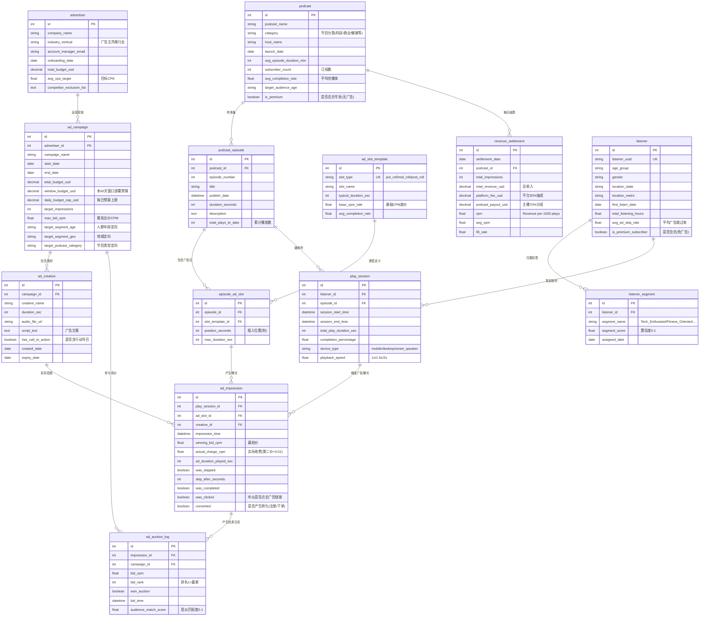

# 媒体行业 - 播客广告经济学 ER 文档

> **业务背景、行业科普、术语表、指标公式请见 `01-media_podcast_ad_economics_high_business_context-cn.md`。本文档只描述数据。**

> **数据集:** `media_podcast_ad_economics_high`
> **配套:** SQL 查询见 `03-media_podcast_ad_economics_high_sql_queries-cn.md`

---

## 1. 数据集元信息

| 项 | 值 |
|----|-----|
| 复杂度 | 高 (High) |
| 表总数 | 13 |
| 总行数 | 约 138,000 |
| 外键关系 | 14 (均由 DDL 强制;另有若干 DDL 无法强制的业务作用域规则,见第 4 节) |
| 参考"今天" (`REFERENCE_DATE`) | `2026-06-21` (与 generator 和 SQL 查询一致) |
| 数据窗口 | 最近 60 天 (约 2026-04-22 ~ 2026-06-21) |
| 数据库文件 | `media_podcast_ad_economics_high.sqlite` |
| SQL 方言 | SQLite 3.x |

### 各表行数 (按拓扑顺序)

| # | 表 | 行数 | 类型 | 作用 |
|---|----|------|------|------|
| 01 | `podcast` | 50 | 主数据 | 播客节目元信息 |
| 02 | `podcast_episode` | ~201 | 主数据 | 单集元信息 |
| 03 | `ad_slot_template` | 3 | 字典表 | pre/mid/post-roll 三种广告位模板 |
| 04 | `episode_ad_slot` | ~584 | 关系 | 每集的具体广告位实例 |
| 05 | `advertiser` | 40 | 主数据 | 广告主公司 |
| 06 | `ad_campaign` | ~98 | 主数据 | 广告投放活动 |
| 07 | `ad_creative` | ~244 | 主数据 | 广告音频素材 (每 campaign 2-3 个) |
| 08 | `listener` | 5,000 | 主数据 | 匿名听众画像 |
| 09 | `listener_segment` | ~10,082 | 关系 | 听众兴趣 / 行为标签 |
| 10 | `play_session` | 15,000 | 事件 | 一次收听会话 |
| 11 | `ad_impression` | ~18,381 | 事件 | **核心变现表** — 每次广告曝光 |
| 12 | `ad_auction_log` | ~86,913 | 事件 | 拍卖日志 (每次曝光对应 2-6 条出价) |
| 13 | `revenue_settlement` | ~1,786 | 汇总 | 每天每节目的收入结算 |

**核心事件级表 (写 SQL 最易出错也最有价值):**

- `play_session`:每次收听。
- `ad_impression`:每次广告曝光 (= 一次收入入账)。
- `ad_auction_log`:每次出价 (一次曝光对应多条出价,只有一个赢家)。

---

## 2. 实体关系图



---

## 3. 表定义

按业务语义把 13 张表分成 4 组:**内容侧 / 广告主侧 / 听众侧 / 财务侧**。

### 3.A 内容侧 (Content Supply) — 节目与广告位

#### 3.1 `podcast` — 播客节目

**业务定位:** 平台上的内容资产清单。一档节目 = 一个"出版物",有固定主持人、固定调性。会员专享节目 (`is_premium=true`) 不产生广告收入。

| 列 | 类型 | 约束 | 业务说明 |
|----|------|------|---------|
| id | INTEGER | PK | 主键 |
| podcast_name | VARCHAR(150) | NOT NULL | 节目名称 |
| category | VARCHAR(50) | NOT NULL | 内容分类 (Technology/Business/Health & Wellness/True Crime 等) |
| host_name | VARCHAR(100) | NOT NULL | 主持人 |
| launch_date | DATE | NOT NULL | 节目首播日期 |
| avg_episode_duration_min | INTEGER | NOT NULL | 平均每集时长 (分钟) |
| subscriber_count | INTEGER | NOT NULL | 订阅数,粗略反映节目体量 |
| avg_completion_rate | FLOAT | NOT NULL | 平均完播率 (听众听完整集的比例) |
| target_audience_age | VARCHAR(20) | NOT NULL | 目标年龄段 (18-24, 25-34...) |
| is_premium | BOOLEAN | NOT NULL | 是否会员专享 (true = 无广告,不产生 ad_impression) |

> **作用域规则:** `is_premium=true` 的节目占 ~15%,**不会出现在 `ad_impression` / `revenue_settlement` 里**。DDL 不强制,分析时要记得。

#### 3.2 `podcast_episode` — 单集节目

**业务定位:** 每一集就是一个独立的"广告位载体"。单集时长决定能塞几个广告位。

| 列 | 类型 | 约束 | 业务说明 |
|----|------|------|---------|
| id | INTEGER | PK | |
| podcast_id | INTEGER | NOT NULL, FK→podcast | 所属节目 |
| episode_number | INTEGER | NOT NULL | 集号 |
| title | VARCHAR(200) | NOT NULL | 标题 |
| publish_date | DATETIME | NOT NULL | 发布时间 |
| duration_seconds | INTEGER | NOT NULL | 时长 (秒) |
| description | TEXT | NULL | 简介 |
| total_plays_to_date | INTEGER | NOT NULL | 累计播放数 (反映长尾价值) |

> **作用域规则:** 单集时长 > 20 分钟 (1200 秒) 才会有 **mid-roll** 广告位;< 20 分钟只有 pre + post-roll。

#### 3.3 `ad_slot_template` — 广告位模板 (字典表)

**业务定位:** 整个平台只有 3 种标准化广告位类型,定义了每种位置的底价和行业完播率。mid-roll 底价最高、最值钱 (详见业务背景文档)。

| 列 | 类型 | 约束 | 业务说明 |
|----|------|------|---------|
| id | INTEGER | PK | |
| slot_type | VARCHAR(20) | UNIQUE, NOT NULL | pre_roll / mid_roll / post_roll |
| slot_name | VARCHAR(50) | NOT NULL | 展示名 |
| typical_duration_sec | INTEGER | NOT NULL | 典型时长 (30/60/30) |
| base_cpm_rate | FLOAT | NOT NULL | 基础 CPM 底价 (15/25/8) |
| avg_completion_rate | FLOAT | NOT NULL | 行业完播率 (0.88/0.95/0.42) |

#### 3.4 `episode_ad_slot` — 单集广告位实例

**业务定位:** 把"广告位模板"应用到具体某一集,生成实际可竞价的库存单元。

| 列 | 类型 | 约束 | 业务说明 |
|----|------|------|---------|
| id | INTEGER | PK | |
| episode_id | INTEGER | NOT NULL, FK→podcast_episode | 所属单集 |
| slot_template_id | INTEGER | NOT NULL, FK→ad_slot_template | 引用广告位模板 |
| position_seconds | INTEGER | NOT NULL | 插入位置 (从单集开头算的秒数) |
| max_duration_sec | INTEGER | NOT NULL | 该位置最长允许多久的广告 |

> **作用域规则:** pre_roll 永远 `position_seconds=0`;mid_roll 位于单集时长中点;post_roll 在结尾前 30 秒。

### 3.B 广告主侧 (Demand Side) — 广告主 / 活动 / 素材

#### 3.5 `advertiser` — 广告主

**业务定位:** 在平台开户的品牌方 (Nike、Coca-Cola、SquareSpace 这类公司)。

| 列 | 类型 | 约束 | 业务说明 |
|----|------|------|---------|
| id | INTEGER | PK | |
| company_name | VARCHAR(150) | NOT NULL | 公司名 |
| industry_vertical | VARCHAR(50) | NOT NULL | 所属行业 (E-commerce/FinTech/SaaS/CPG/Automotive 等) |
| account_manager_email | VARCHAR(100) | NOT NULL | StreamCast 内部对应的客户经理 (AE) |
| onboarding_date | DATE | NOT NULL | 入驻日期 |
| total_budget_usd | NUMERIC(12,2) | NOT NULL | 在平台的总预算承诺 (广告主级、量级大) |
| avg_cpa_target | FLOAT | NULL | 广告主自设的目标 CPA (~30% 为 NULL) |
| competitor_exclusion_list | TEXT | NULL | 竞品屏蔽名单 (逗号分隔的广告主 id,如 Coca-Cola↔Pepsi↔Dr Pepper) |

#### 3.6 `ad_campaign` — 广告活动 (核心)

**业务定位:** 广告主发起的一次具体投放,有目标人群、预算、时间窗口。

| 列 | 类型 | 约束 | 业务说明 |
|----|------|------|---------|
| id | INTEGER | PK | |
| advertiser_id | INTEGER | NOT NULL, FK→advertiser | 所属广告主 |
| campaign_name | VARCHAR(150) | NOT NULL | 活动名 (如 "Nike - Running Shoes Spring Launch") |
| start_date | DATE | NOT NULL | 投放开始 |
| end_date | DATE | NOT NULL | 投放结束 |
| total_budget_usd | NUMERIC(10,2) | NOT NULL | 活动总预算 (lifetime/headline 量级) |
| window_budget_usd | NUMERIC(10,2) | NULL | **本 60 天窗口实际部署的预算** (与真实交付同量级)。预算消耗/pacing 查询 (Q5/Q7/Q23) 用这个,**不用** total_budget_usd |
| daily_budget_cap_usd | NUMERIC(8,2) | NULL | 每日花费上限 |
| target_impressions | INTEGER | NULL | 目标曝光数 |
| max_bid_cpm | FLOAT | NOT NULL | 最高出价 (拍卖不会出超过这个数) |
| target_segment_age | VARCHAR(50) | NULL | 年龄定向 (如 "25-34,35-44") |
| target_segment_geo | VARCHAR(100) | NULL | 地域定向 (如 "US-CA,US-NY") |
| target_podcast_category | VARCHAR(100) | NULL | 节目类型定向 |

> **作用域规则 (关键):** `total_budget_usd` 是广告主级大额承诺;在 60 天采样下单 campaign 实际只交付几~几十美元,直接拿它算消耗率会恒≈0%。所以所有 pacing/消耗类查询都用 **`window_budget_usd`** (= 实际花费 / 一个真实利用率,见第 4 节生成规则)。

#### 3.7 `ad_creative` — 广告素材

**业务定位:** 实际播给听众的音频文件 (15/30/60 秒)。一个 campaign 通常有 2-3 个素材做 A/B 测试。

| 列 | 类型 | 约束 | 业务说明 |
|----|------|------|---------|
| id | INTEGER | PK | |
| campaign_id | INTEGER | NOT NULL, FK→ad_campaign | 所属活动 |
| creative_name | VARCHAR(150) | NOT NULL | 素材名 (如 "Creative 1 - 30s") |
| duration_sec | INTEGER | NOT NULL | 15 / 30 / 60 秒 |
| audio_file_url | VARCHAR(300) | NOT NULL | CDN 音频地址 |
| script_text | TEXT | NULL | 文案 |
| has_call_to_action | BOOLEAN | NOT NULL | 是否含 CTA (~80% 为 true) |
| created_date | DATE | NOT NULL | 制作日期 (= campaign.start_date 前 7-30 天) |
| expiry_date | DATE | NULL | 失效日期 (= campaign.end_date) |

### 3.C 听众侧 (Supply Side) — 听众 / 标签 / 收听会话

#### 3.8 `listener` — 听众画像

**业务定位:** 匿名化的听众档案。出于 CCPA 合规,只能用 UUID 标识,不能用真实身份。会员听众 (`is_premium_subscriber=true`) 不投广告。

| 列 | 类型 | 约束 | 业务说明 |
|----|------|------|---------|
| id | INTEGER | PK | |
| listener_uuid | VARCHAR(36) | UNIQUE, NOT NULL | 匿名 UUID |
| age_group | VARCHAR(20) | NOT NULL | 年龄段 |
| gender | VARCHAR(10) | NULL | 性别 (可空) |
| location_state | VARCHAR(2) | NOT NULL | 美国州代码 (CA/NY/TX/FL/IL/PA/OH/GA/NC/MI) |
| location_metro | VARCHAR(50) | NULL | 大都市区 (~30% 为 NULL) |
| first_listen_date | DATE | NOT NULL | 首次收听日期 |
| total_listening_hours | FLOAT | NOT NULL | 累计收听小时 (反映粘性) |
| avg_ad_skip_rate | FLOAT | NOT NULL | 该听众的"广告耐受度" 0.1-0.7,越高越爱跳广告 |
| is_premium_subscriber | BOOLEAN | NOT NULL | 会员 = 不投广告 (~10%) |

> **作用域规则 (不变式):** `is_premium_subscriber=true` 的听众的所有收听**完全不产生 ad_impression**。

#### 3.9 `listener_segment` — 听众兴趣标签

**业务定位:** 实现**人群定向广告**的核心。一个听众可同时归属 1-3 个标签。

| 列 | 类型 | 约束 | 业务说明 |
|----|------|------|---------|
| id | INTEGER | PK | |
| listener_id | INTEGER | NOT NULL, FK→listener | 所属听众 |
| segment_name | VARCHAR(50) | NOT NULL | 标签名 (Tech_Enthusiast/Finance_Savvy/Fitness_Oriented...) |
| segment_score | FLOAT | NOT NULL | 置信度 0.5-1.0 |
| assigned_date | DATE | NOT NULL | 打标日期 (= listener.first_listen_date) |

#### 3.10 `play_session` — 收听会话

**业务定位:** **核心事件表 1** — 每一次听众点开播放都生成一行。听众没听完整集 → 后面的 mid/post-roll 没机会播 → 不产生对应曝光。

| 列 | 类型 | 约束 | 业务说明 |
|----|------|------|---------|
| id | INTEGER | PK | |
| listener_id | INTEGER | NOT NULL, FK→listener | 谁听的 |
| episode_id | INTEGER | NOT NULL, FK→podcast_episode | 听的哪一集 |
| session_start_time | DATETIME | NOT NULL | 会话开始 |
| session_end_time | DATETIME | NULL | 会话结束 |
| total_play_duration_sec | INTEGER | NOT NULL | 实际播放秒数 (可能 < 单集时长) |
| completion_percentage | FLOAT | NOT NULL | 完播百分比 |
| device_type | VARCHAR(20) | NOT NULL | mobile / desktop / smart_speaker |
| playback_speed | FLOAT | NOT NULL | 1.0 / 1.5 / 2.0 倍速 |

### 3.D 财务侧 (Monetization) — 曝光 / 拍卖 / 结算

#### 3.11 `ad_impression` — 广告曝光 (核心收入表)

**业务定位:** **整个数据集最重要的表**。每一行 = 一次广告播给一个听众 = 一笔收入入账。

| 列 | 类型 | 约束 | 业务说明 |
|----|------|------|---------|
| id | INTEGER | PK | |
| play_session_id | INTEGER | NOT NULL, FK→play_session | 所属收听会话 |
| ad_slot_id | INTEGER | NOT NULL, FK→episode_ad_slot | 哪个广告位 |
| creative_id | INTEGER | NOT NULL, FK→ad_creative | 播了哪条素材 |
| impression_time | DATETIME | NOT NULL | 何时播的 (= session_start + slot.position_seconds) |
| winning_bid_cpm | FLOAT | NOT NULL | 赢拍出价 (第一名) |
| actual_charge_cpm | FLOAT | NOT NULL | 实际收费 (= 第二名 + $0.01,封顶不超过赢拍价) |
| ad_duration_played_sec | INTEGER | NOT NULL | 听众听了几秒 |
| was_skipped | BOOLEAN | NOT NULL | 有没有快进掉 |
| skip_after_seconds | INTEGER | NULL | 第几秒被跳的 (未跳为 NULL) |
| was_completed | BOOLEAN | NOT NULL | 有没有完整听完 |
| was_clicked | BOOLEAN | NOT NULL | 是否点击广告链接 (仅完播可点击) |
| converted | BOOLEAN | NOT NULL | 点击后是否转化 (约 15% 的点击转化) |

> **不变式:** 会员听众与会员专享节目**都不产生任何 ad_impression**;只为听众**实际触达到**的广告位 (`total_play_duration_sec ≥ position_seconds`) 生成曝光。
> **收入:** 单笔收入 USD = `actual_charge_cpm / 1000`。

#### 3.12 `ad_auction_log` — 拍卖日志

**业务定位:** 每次曝光背后**所有参与竞价的出价记录** (一次曝光 2-6 条,只有 1 条 `won_auction=true`)。

| 列 | 类型 | 约束 | 业务说明 |
|----|------|------|---------|
| id | INTEGER | PK | |
| impression_id | INTEGER | NOT NULL, FK→ad_impression | 关联到曝光 |
| campaign_id | INTEGER | NOT NULL, FK→ad_campaign | 出价的广告活动 |
| bid_cpm | FLOAT | NOT NULL | 出价金额 |
| bid_rank | INTEGER | NOT NULL | 排名 (1 = 赢家) |
| won_auction | BOOLEAN | NOT NULL | 是否赢 |
| bid_time | DATETIME | NOT NULL | 出价时间 (= impression_time) |
| audience_match_score | FLOAT | NULL | 听众与该 campaign 定向的匹配度 (0-1) |

#### 3.13 `revenue_settlement` — 收入结算

**业务定位:** 把 `ad_impression` 按 "节目 × 日期" 聚合,生成每天每节目的结算单。是付主播分成、平台日财报的依据。

| 列 | 类型 | 约束 | 业务说明 |
|----|------|------|---------|
| id | INTEGER | PK | |
| settlement_date | DATE | NOT NULL | 结算日期 |
| podcast_id | INTEGER | NOT NULL, FK→podcast | 节目 |
| total_impressions | INTEGER | NOT NULL | 当日该节目总曝光 |
| total_revenue_usd | NUMERIC(10,2) | NOT NULL | 总收入 (= SUM(actual_charge_cpm)/1000) |
| platform_fee_usd | NUMERIC(10,2) | NOT NULL | 平台 30% 抽成 |
| podcast_payout_usd | NUMERIC(10,2) | NOT NULL | 主播 70% 分成 |
| rpm | FLOAT | NOT NULL | 当日 RPM = (主播净收入 / 当日播放数) × 1000 |
| avg_cpm | FLOAT | NOT NULL | 当日曝光加权 eCPM = total_revenue/total_impressions × 1000 |
| fill_rate | FLOAT | NOT NULL | 当日填充率 = 已成交 / 可触达广告位 (恒 ≤ 1.0) |

> **作用域规则:** 本表是 `ad_impression` 的真实聚合 (非独立随机);会员专享节目永不出现;只有当天产生过曝光的"节目×日期"才有结算行。
> ⚠️ **两套 fill_rate 口径:** 本表分母是"听众**实际触达到**的广告位",而 Query 2/4 现算的分母是"**全部会话-广告位对**" (含听众没听到的位)。两者都 ≤100% 但口径不同、数值会不一样,跨查询对比务必说明用的是哪套。

### 3.E 关键 JOIN 路径速查

```text
ad_impression → play_session → podcast_episode → podcast        -- 取节目分类 category
ad_impression → ad_creative → ad_campaign → advertiser          -- 取广告主行业 industry_vertical
ad_impression → play_session → listener → listener_segment      -- 取听众标签 segment_name
ad_impression → ad_auction_log (impression_id)                  -- 取一次曝光的所有出价
```

**端到端变现链路:** listener 打开 → 创建 `play_session` → 播放到 `episode_ad_slot` → 触发 `ad_auction_log` (2-6 条出价) → 选赢家 (bid_rank=1) → 生成 `ad_impression` (收第二价+0.01) → 当日按 podcast 聚合进 `revenue_settlement` → 平台 30% / 主播 70%。

---

## 4. 数据生成规则 (Data Generation Rules)

下面是 generator 实际产出的规则,每条都可被 SQL 验证。`RANDOM_SEED = 42`、`Faker.seed(42)`,因此数据完全可复现。

### 4.1 时间顺序 (Temporal ordering)

| 链路 | 规则 |
|------|------|
| `podcast.launch_date` | ∈ [REFERENCE_DATE − 3 年, REFERENCE_DATE − 182 天] |
| `podcast_episode.publish_date` | ∈ [WINDOW_START, WINDOW_START + 60 天] |
| `advertiser.onboarding_date` | ∈ [REFERENCE_DATE − 2 年, REFERENCE_DATE − 30 天] |
| `ad_campaign` (curated 品牌) | start ∈ [WINDOW_START, +10 天],end = start + [45,60] 天 |
| `ad_campaign` (其他) | start ∈ [WINDOW_START, +30 天],end = start + [14,60] 天 |
| `ad_creative.created_date` | = campaign.start_date − [7,30] 天;`expiry_date` = campaign.end_date |
| `listener.first_listen_date` | ∈ [REFERENCE_DATE − 1 年, REFERENCE_DATE − 7 天] |
| `play_session.session_start_time` | ≥ max(episode.publish_date, WINDOW_START, listener.first_listen_date) 且 < REFERENCE_DATE;`session_end_time` = start + 实际播放秒数 |
| `ad_impression.impression_time` | = session_start_time + slot.position_seconds |
| `ad_auction_log.bid_time` | = 对应曝光的 impression_time |

### 4.2 引用完整性与作用域 (DDL 无法强制的部分)

- `ad_impression` 仅当 **听众非会员 且 节目非会员专享** 时产生。
- `ad_impression` 仅为听众**实际触达到**的广告位生成 (`total_play_duration_sec ≥ position_seconds`)。
- `ad_auction_log` 的出价者 = 在会话当日**活跃** (start ≤ 日期 ≤ end) **且** `max_bid_cpm ≥ 该广告位底价` 的 campaign。
- `revenue_settlement` 仅对当天有 ≥1 次曝光的"节目×日期"生成;会员专享节目永不出现。

### 4.3 取值范围 (Value ranges)

| 列 | 范围 |
|----|------|
| `ad_slot_template.base_cpm_rate` | pre 15 / mid 25 / post 8 |
| `podcast.subscriber_count` | 1,000 – 500,000 |
| `podcast.avg_completion_rate` | 0.55 – 0.92 |
| `podcast.avg_episode_duration_min` | {20,30,45,60,90} (curated 节目固定 45) |
| 每档节目集数 | 3 – 5 |
| `podcast_episode.duration_seconds` | avg_min×60 ± 300,下限 600 |
| `podcast_episode.total_plays_to_date` | 100 – 50,000 |
| `advertiser.total_budget_usd` | 10,000 – 500,000 |
| `advertiser.avg_cpa_target` | 5 – 50 (约 30% 为 NULL) |
| `ad_campaign.max_bid_cpm` | curated 20 – 40,其他 8 – 40 |
| `ad_creative.duration_sec` | {15,30,60};`has_call_to_action` ~80% true |
| 每 campaign 素材数 | 2 – 3 |
| `listener.total_listening_hours` | 5 – 500 |
| `listener.avg_ad_skip_rate` | 0.1 – 0.7 |
| 每听众标签数 | 1 – 3;`segment_score` 0.5 – 1.0 |
| `play_session.completion_percentage` | 15% – 100% (25% 概率落在 85% – 100% 高粘性区) |
| `play_session.device_type` | mobile / desktop / smart_speaker |
| `play_session.playback_speed` | {1.0×4, 1.5×2, 2.0} 加权 (偏向 1.0×) |
| 单场拍卖出价者数 | pre (2,6) / mid (4,8) / post (2,4),不超过合格 campaign 数 |

### 4.4 计算字段 (Computed fields)

```text
出价 bid_cpm        = clamp( base_cpm,  min( campaign.max_bid_cpm,
                       base_cpm × demand_mult × (1 + 0.6×match_score)
                       × listener_value_mult × U(0.92,1.12) ) )
                      demand_mult: pre 1.0 / mid 1.15 / post 0.9
                      listener_value_mult 取听众最值钱标签的乘数 (见 4.5 陷阱 3)

actual_charge_cpm   = min( winning_bid, max( base_cpm, second_bid + 0.01 ) )
                      单人拍卖无第二价时 second_bid = winning_bid × 0.9

skip 概率           = listener.avg_ad_skip_rate × (1 − 0.35 × match_score)
                      跳过则 ad_duration_played = skip_after_seconds, was_completed=false
ctr                = 0.005 + 0.012×match_score (+0.004 若含 CTA);仅完播可点击
converted          = 点击后以 15% 概率转化

revenue_settlement.total_revenue = SUM(actual_charge_cpm)/1000
                    platform_fee   = total_revenue × 0.30
                    podcast_payout = total_revenue × 0.70
                    rpm            = (podcast_payout / 当日播放数) × 1000
                    avg_cpm        = total_revenue / total_impressions × 1000
                    fill_rate      = min(已成交 / 可触达广告位, 1.0)

ad_campaign.window_budget_usd = max( spent / utilization, spent )
                    utilization 三档混合: 25% 取 0.90–0.99 (接近耗尽),
                    50% 取 0.45–0.85 (健康), 25% 取 0.15–0.45 (烧得慢)
                    daily_budget_cap_usd = window_budget_usd / 投放天数
```

### 4.5 业务陷阱声明 (Embedded Business Traps)

每条陷阱标注 **名称 + 实测量级 + 对应 SQL 查询**。量级来自当前 seed=42 的真实数据。

| # | 陷阱名称 | 实测量级 | 对应查询 |
|---|---------|---------|---------|
| 1 | **mid-roll 被低估、有提价空间** | mid-roll eCPM **$33.96** vs 底价 $25 (+36%);pre $19.40 vs $15;post $9.35 vs $8 | Q1, Q6 |
| 2 | **库存填充随播放进度衰减** | 触达极不均:pre-roll 11,084 次曝光,mid-roll 6,902,post-roll 仅 **395** (大量听众没听到结尾) | Q2, Q4 |
| 3 | **高价值人群溢价** | Finance_Savvy eCPM **$26.87**、Tech_Enthusiast $26.80,vs Foodie/Fitness ~$24.77;定向匹配最高 +60% 出价、降 35% 跳过 | Q3, Q9 |
| 4 | **拍卖竞争按 slot 分层** | mid-roll 出价者最多 (4-8);全局平均 **4.73** 个出价者/场 | Q21 |
| 5 | **二价机制执行正确** | 多人拍卖平均超收 ≈ **$0.01** (= 第二价 + 0.01,无 bug 超收) | Q22 |
| 6 | **会员零广告 (不变式)** | 会员节目 **16%** / 会员听众 **10%**,均不产生曝光 | (跨表不变式) |
| 7 | **预算 pacing 多样性** | window_budget 利用率三档混合 → 既有接近耗尽 (Q5 告警) 也有烧得慢 (Q23 标记) | Q5, Q7, Q23 |
| 8 | **播客 CTR/转化低基数** | CTR 0.5-1.5% (+CTA 加成),约 15% 点击转化 → CPA/转化类查询有信号但绝对数小 | Q7, (转化口径) |

> **curated 锚点:** generator 固定植入若干真实品牌 (Nike、SquareSpace、HelloFresh、Adobe、Robinhood、Coca-Cola、Pepsi、Dr Pepper、Olipop、Geico、Ford) 和两档节目 (Tech Explained、Business Breakdown),并强制了 `Nike - Running Shoes Spring Launch`、`SquareSpace - Website Builder Promotion` 等 campaign 名,让按精确名称过滤的示例查询 (Q7/Q8/Q11/Q12/Q14/Q15/Q24) 一定能返回行。

---

## 5. Faker 策略表

| 字段模式 | Faker / 采样策略 | 说明 |
|----------|------------------|------|
| `host_name` | `fake.name()` | 北美人名 |
| `podcast_name` (非 curated) | `fake.catch_phrase() + " Podcast"` | 拟真节目名 |
| `episode.title` / `description` | `fake.catch_phrase()` / `fake.text(200)` | 标题与简介 |
| `company_name` (非 curated) | `fake.company()` | 北美公司名 |
| `account_manager_email` | `fake.company_email()` | AE 邮箱 |
| `listener_uuid` | `fake.uuid4()` | 匿名标识 (UNIQUE) |
| `location_state` | `random.choice(10 个美国州代码)` | 限定美国 |
| `location_metro` | `random.choice(北美大都市)`,~30% 置 NULL | 部分听众无都市信息 |
| 各类 `*_date` | `fake.date_between_dates(...)` 锚定 REFERENCE_DATE | 不调用 `datetime.now()`,保证可复现 |
| `audio_file_url` | f-string `https://cdn.streamcast.media/ads/{id}.mp3` | 拼接式 CDN 地址 |
| 数值/权重/概率 | `random.uniform/randint/choice/sample/random()` | 业务校准常量驱动 (见 generator) |
| `category` / `segment_name` / `device_type` | `random.choice/sample(固定枚举池)` | 受控枚举 |

---

## 6. 文件清单

| # | 文件 | 表 | 行数 | 依赖 |
|---|------|-----|------|------|
| 01 | `data/01_podcast.tsv` | podcast | 50 | 无 |
| 02 | `data/02_podcast_episode.tsv` | podcast_episode | ~201 | podcast |
| 03 | `data/03_ad_slot_template.tsv` | ad_slot_template | 3 | 无 |
| 04 | `data/04_episode_ad_slot.tsv` | episode_ad_slot | ~584 | podcast_episode, ad_slot_template |
| 05 | `data/05_advertiser.tsv` | advertiser | 40 | 无 |
| 06 | `data/06_ad_campaign.tsv` | ad_campaign | ~98 | advertiser |
| 07 | `data/07_ad_creative.tsv` | ad_creative | ~244 | ad_campaign |
| 08 | `data/08_listener.tsv` | listener | 5,000 | 无 |
| 09 | `data/09_listener_segment.tsv` | listener_segment | ~10,082 | listener |
| 10 | `data/10_play_session.tsv` | play_session | 15,000 | listener, podcast_episode |
| 11 | `data/11_ad_impression.tsv` | ad_impression | ~18,381 | play_session, episode_ad_slot, ad_creative |
| 12 | `data/12_ad_auction_log.tsv` | ad_auction_log | ~86,913 | ad_impression, ad_campaign |
| 13 | `data/13_revenue_settlement.tsv` | revenue_settlement | ~1,786 | podcast (聚合自 ad_impression) |

> 其他文件:`04-media_podcast_ad_economics_high_data_generator-cn.py` (生成脚本)、`media_podcast_ad_economics_high.sqlite` (数据库)。

---

## 7. 样例数据

`ad_slot_template` (全 3 行):

| id | slot_type | typical_duration_sec | base_cpm_rate | avg_completion_rate |
|----|-----------|----------------------|---------------|---------------------|
| 1 | pre_roll | 30 | 15.0 | 0.88 |
| 2 | mid_roll | 60 | 25.0 | 0.95 |
| 3 | post_roll | 30 | 8.0 | 0.42 |

`podcast` (含 1 个会员专享节目):

| id | podcast_name | category | subscriber_count | avg_completion_rate | is_premium |
|----|--------------|----------|------------------|---------------------|------------|
| 1 | Tech Explained | Technology | 336243 | 0.59 | 0 |
| 2 | Business Breakdown | Business | 129393 | 0.63 | 0 |
| 3 | Optimized 5thgeneration algorithm Podcast | Finance | 222208 | 0.56 | 1 |

`ad_impression` (一条被跳过 + 一条完播且点击):

| id | play_session_id | ad_slot_id | creative_id | winning_bid_cpm | actual_charge_cpm | was_skipped | was_completed | was_clicked | converted |
|----|-----------------|------------|-------------|-----------------|-------------------|-------------|---------------|-------------|-----------|
| 1 | 1 | 497 | 232 | 19.77 | 16.80 | 1 | 0 | 0 | 0 |
| 93 | 71 | 176 | 56 | 39.26 | 34.66 | 0 | 1 | 1 | 0 |

`ad_auction_log` (同一次曝光的 4 条出价,bid_rank=1 为赢家):

| impression_id | campaign_id | bid_cpm | bid_rank | won_auction | audience_match_score |
|---------------|-------------|---------|----------|-------------|----------------------|
| 2 | 7 | 37.05 | 1 | 1 | 0.25 |
| 2 | 8 | 32.35 | 2 | 0 | 0.25 |
| 2 | 92 | 29.64 | 3 | 0 | 0.33 |
| 2 | 38 | 26.84 | 4 | 0 | 0.00 |

> 注意 `impression_id=2` 的实付 ≈ 第二价 $32.35 + $0.01,印证二价机制。

`revenue_settlement` (按当日收入排序前 3):

| settlement_date | podcast_id | total_impressions | total_revenue_usd | platform_fee_usd | podcast_payout_usd | rpm | avg_cpm | fill_rate |
|-----------------|------------|-------------------|-------------------|------------------|--------------------|------|---------|-----------|
| 2026-06-20 | 10 | 170 | 4.20 | 1.26 | 2.94 | 27.20 | 24.69 | 1.0 |
| 2026-06-20 | 15 | 168 | 4.08 | 1.22 | 2.86 | 25.73 | 24.29 | 1.0 |
| 2026-06-20 | 4 | 161 | 3.98 | 1.19 | 2.79 | 26.54 | 24.72 | 1.0 |

`ad_campaign` (window_budget 远小于 total_budget,符合 60 天采样口径):

| id | campaign_name | total_budget_usd | window_budget_usd | daily_budget_cap_usd |
|----|---------------|------------------|-------------------|----------------------|
| 1 | Nike - Running Shoes Spring Launch | 160151.10 | 8.73 | 0.15 |
| 2 | Nike - Orchestrate Mission-Critical E-Tailers | 160151.10 | 39.29 | 0.76 |

---

## 8. SQLite DDL

```sql
CREATE TABLE podcast (
    id INTEGER PRIMARY KEY AUTOINCREMENT,
    podcast_name VARCHAR(150) NOT NULL,
    category VARCHAR(50) NOT NULL,
    host_name VARCHAR(100) NOT NULL,
    launch_date DATE NOT NULL,
    avg_episode_duration_min INTEGER NOT NULL,
    subscriber_count INTEGER NOT NULL,
    avg_completion_rate FLOAT NOT NULL,
    target_audience_age VARCHAR(20) NOT NULL,
    is_premium BOOLEAN NOT NULL
);

CREATE TABLE podcast_episode (
    id INTEGER PRIMARY KEY AUTOINCREMENT,
    podcast_id INTEGER NOT NULL REFERENCES podcast(id),
    episode_number INTEGER NOT NULL,
    title VARCHAR(200) NOT NULL,
    publish_date DATETIME NOT NULL,
    duration_seconds INTEGER NOT NULL,
    description TEXT,
    total_plays_to_date INTEGER NOT NULL
);

CREATE TABLE ad_slot_template (
    id INTEGER PRIMARY KEY AUTOINCREMENT,
    slot_type VARCHAR(20) NOT NULL UNIQUE,
    slot_name VARCHAR(50) NOT NULL,
    typical_duration_sec INTEGER NOT NULL,
    base_cpm_rate FLOAT NOT NULL,
    avg_completion_rate FLOAT NOT NULL
);

CREATE TABLE episode_ad_slot (
    id INTEGER PRIMARY KEY AUTOINCREMENT,
    episode_id INTEGER NOT NULL REFERENCES podcast_episode(id),
    slot_template_id INTEGER NOT NULL REFERENCES ad_slot_template(id),
    position_seconds INTEGER NOT NULL,
    max_duration_sec INTEGER NOT NULL
);

CREATE TABLE advertiser (
    id INTEGER PRIMARY KEY AUTOINCREMENT,
    company_name VARCHAR(150) NOT NULL,
    industry_vertical VARCHAR(50) NOT NULL,
    account_manager_email VARCHAR(100) NOT NULL,
    onboarding_date DATE NOT NULL,
    total_budget_usd NUMERIC(12, 2) NOT NULL,
    avg_cpa_target FLOAT,
    competitor_exclusion_list TEXT
);

CREATE TABLE ad_campaign (
    id INTEGER PRIMARY KEY AUTOINCREMENT,
    advertiser_id INTEGER NOT NULL REFERENCES advertiser(id),
    campaign_name VARCHAR(150) NOT NULL,
    start_date DATE NOT NULL,
    end_date DATE NOT NULL,
    total_budget_usd NUMERIC(10, 2) NOT NULL,
    window_budget_usd NUMERIC(10, 2),
    daily_budget_cap_usd NUMERIC(8, 2),
    target_impressions INTEGER,
    max_bid_cpm FLOAT NOT NULL,
    target_segment_age VARCHAR(50),
    target_segment_geo VARCHAR(100),
    target_podcast_category VARCHAR(100)
);

CREATE TABLE ad_creative (
    id INTEGER PRIMARY KEY AUTOINCREMENT,
    campaign_id INTEGER NOT NULL REFERENCES ad_campaign(id),
    creative_name VARCHAR(150) NOT NULL,
    duration_sec INTEGER NOT NULL,
    audio_file_url VARCHAR(300) NOT NULL,
    script_text TEXT,
    has_call_to_action BOOLEAN NOT NULL,
    created_date DATE NOT NULL,
    expiry_date DATE
);

CREATE TABLE listener (
    id INTEGER PRIMARY KEY AUTOINCREMENT,
    listener_uuid VARCHAR(36) NOT NULL UNIQUE,
    age_group VARCHAR(20) NOT NULL,
    gender VARCHAR(10),
    location_state VARCHAR(2) NOT NULL,
    location_metro VARCHAR(50),
    first_listen_date DATE NOT NULL,
    total_listening_hours FLOAT NOT NULL,
    avg_ad_skip_rate FLOAT NOT NULL,
    is_premium_subscriber BOOLEAN NOT NULL
);

CREATE TABLE listener_segment (
    id INTEGER PRIMARY KEY AUTOINCREMENT,
    listener_id INTEGER NOT NULL REFERENCES listener(id),
    segment_name VARCHAR(50) NOT NULL,
    segment_score FLOAT NOT NULL,
    assigned_date DATE NOT NULL
);

CREATE TABLE play_session (
    id INTEGER PRIMARY KEY AUTOINCREMENT,
    listener_id INTEGER NOT NULL REFERENCES listener(id),
    episode_id INTEGER NOT NULL REFERENCES podcast_episode(id),
    session_start_time DATETIME NOT NULL,
    session_end_time DATETIME,
    total_play_duration_sec INTEGER NOT NULL,
    completion_percentage FLOAT NOT NULL,
    device_type VARCHAR(20) NOT NULL,
    playback_speed FLOAT NOT NULL
);

CREATE TABLE ad_impression (
    id INTEGER PRIMARY KEY AUTOINCREMENT,
    play_session_id INTEGER NOT NULL REFERENCES play_session(id),
    ad_slot_id INTEGER NOT NULL REFERENCES episode_ad_slot(id),
    creative_id INTEGER NOT NULL REFERENCES ad_creative(id),
    impression_time DATETIME NOT NULL,
    winning_bid_cpm FLOAT NOT NULL,
    actual_charge_cpm FLOAT NOT NULL,
    ad_duration_played_sec INTEGER NOT NULL,
    was_skipped BOOLEAN NOT NULL,
    skip_after_seconds INTEGER,
    was_completed BOOLEAN NOT NULL,
    was_clicked BOOLEAN NOT NULL,
    converted BOOLEAN NOT NULL
);

CREATE TABLE ad_auction_log (
    id INTEGER PRIMARY KEY AUTOINCREMENT,
    impression_id INTEGER NOT NULL REFERENCES ad_impression(id),
    campaign_id INTEGER NOT NULL REFERENCES ad_campaign(id),
    bid_cpm FLOAT NOT NULL,
    bid_rank INTEGER NOT NULL,
    won_auction BOOLEAN NOT NULL,
    bid_time DATETIME NOT NULL,
    audience_match_score FLOAT
);

CREATE TABLE revenue_settlement (
    id INTEGER PRIMARY KEY AUTOINCREMENT,
    settlement_date DATE NOT NULL,
    podcast_id INTEGER NOT NULL REFERENCES podcast(id),
    total_impressions INTEGER NOT NULL,
    total_revenue_usd NUMERIC(10, 2) NOT NULL,
    platform_fee_usd NUMERIC(10, 2) NOT NULL,
    podcast_payout_usd NUMERIC(10, 2) NOT NULL,
    rpm FLOAT NOT NULL,
    avg_cpm FLOAT NOT NULL,
    fill_rate FLOAT NOT NULL
);
```

> 本数据集未声明非主键索引;`ad_slot_template.slot_type` 与 `listener.listener_uuid` 上的 UNIQUE 约束会隐式建唯一索引。

---

**版本:** v2.0 (0.2.1 spec)
**最后更新:** 2026-06-21
