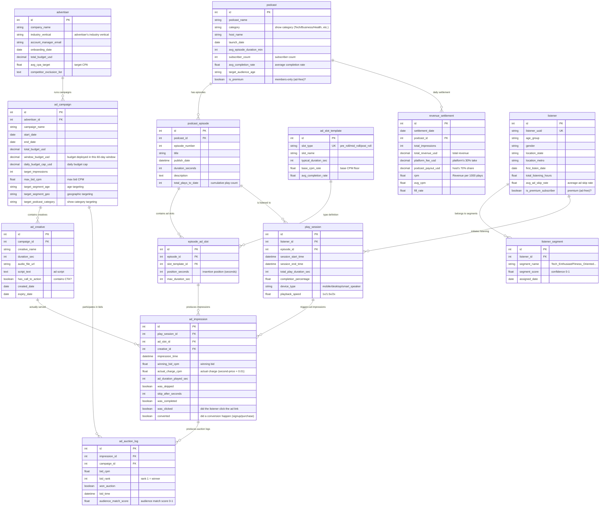

# Media Industry - Podcast Ad Economics ER Document

> **For business context, industry primer, glossary, and metric formulas, see `01-media_podcast_ad_economics_high_business_context.md`. This document only describes the data.**

> **Dataset:** `media_podcast_ad_economics_high`
> **Companion:** SQL queries in `03-media_podcast_ad_economics_high_sql_queries.md`

---

## 1. Dataset Metadata

| Item | Value |
|----|-----|
| Complexity | High |
| Total tables | 13 |
| Total rows | ~138,000 |
| Foreign key relationships | 14 (all enforced by DDL; plus several business-scope rules that DDL cannot enforce, see Section 4) |
| Reference "Today" (`REFERENCE_DATE`) | `2026-06-21` (consistent with the generator and the SQL queries) |
| Data window | Most recent 60 days (roughly 2026-04-22 ~ 2026-06-21) |
| Database file | `media_podcast_ad_economics_high.sqlite` |
| SQL dialect | SQLite 3.x |

### Row counts per table (in topological order)

| # | Table | Row count | Type | Role |
|---|----|------|------|------|
| 01 | `podcast` | 50 | Master data | Podcast show metadata |
| 02 | `podcast_episode` | ~201 | Master data | Single episode metadata |
| 03 | `ad_slot_template` | 3 | Dictionary table | Three ad slot templates: pre/mid/post-roll |
| 04 | `episode_ad_slot` | ~584 | Relational | Concrete ad slot instances on each episode |
| 05 | `advertiser` | 40 | Master data | Advertiser companies |
| 06 | `ad_campaign` | ~98 | Master data | Ad campaigns |
| 07 | `ad_creative` | ~244 | Master data | Ad audio creatives (2-3 per campaign) |
| 08 | `listener` | 5,000 | Master data | Anonymized listener profiles |
| 09 | `listener_segment` | ~10,082 | Relational | Listener interest / behavior tags |
| 10 | `play_session` | 15,000 | Event | One listening session |
| 11 | `ad_impression` | ~18,381 | Event | **Core monetization table** — each ad impression |
| 12 | `ad_auction_log` | ~86,913 | Event | Auction log (2-6 bids per impression) |
| 13 | `revenue_settlement` | ~1,786 | Aggregate | Daily revenue settlement per show |

**Core event-level tables (the easiest places to get SQL wrong, and also the highest-value):**

- `play_session`: each listening session.
- `ad_impression`: each ad impression (= one revenue entry).
- `ad_auction_log`: each bid (one impression has many bids; only one winner).

---

## 2. Entity Relationship Diagram



---

## 3. Table Definitions

The 13 tables are grouped by business semantics into 4 clusters: **content side / advertiser side / listener side / financial side**.

### 3.A Content Supply Side — Shows and Ad Slots

#### 3.1 `podcast` — Podcast show

**Business role:** The catalog of content assets on the platform. One show = one "publication" with a fixed host and a fixed tone. Members-only shows (`is_premium=true`) generate no ad revenue.

| Column | Type | Constraint | Business notes |
|----|------|------|---------|
| id | INTEGER | PK | Primary key |
| podcast_name | VARCHAR(150) | NOT NULL | Show name |
| category | VARCHAR(50) | NOT NULL | Content category (Technology/Business/Health & Wellness/True Crime, etc.) |
| host_name | VARCHAR(100) | NOT NULL | Host |
| launch_date | DATE | NOT NULL | Show launch date |
| avg_episode_duration_min | INTEGER | NOT NULL | Average episode length (minutes) |
| subscriber_count | INTEGER | NOT NULL | Subscribers; rough indicator of show size |
| avg_completion_rate | FLOAT | NOT NULL | Average completion rate (share of listeners who finish a full episode) |
| target_audience_age | VARCHAR(20) | NOT NULL | Target age range (18-24, 25-34, ...) |
| is_premium | BOOLEAN | NOT NULL | Members-only (true = ad-free, generates no ad_impression) |

> **Scope rule:** ~15% of shows have `is_premium=true`; they **never appear in `ad_impression` / `revenue_settlement`**. DDL doesn't enforce this — keep it in mind when analyzing.

#### 3.2 `podcast_episode` — Single episode

**Business role:** Each episode is an independent "ad slot carrier." Episode length determines how many ad slots can fit in.

| Column | Type | Constraint | Business notes |
|----|------|------|---------|
| id | INTEGER | PK | |
| podcast_id | INTEGER | NOT NULL, FK→podcast | The show it belongs to |
| episode_number | INTEGER | NOT NULL | Episode number |
| title | VARCHAR(200) | NOT NULL | Title |
| publish_date | DATETIME | NOT NULL | Publish time |
| duration_seconds | INTEGER | NOT NULL | Length (seconds) |
| description | TEXT | NULL | Description |
| total_plays_to_date | INTEGER | NOT NULL | Cumulative play count (reflects long-tail value) |

> **Scope rule:** Only episodes longer than 20 minutes (1200 seconds) get a **mid-roll** slot; shorter episodes have only pre + post-roll.

#### 3.3 `ad_slot_template` — Ad slot template (dictionary table)

**Business role:** The whole platform has just 3 standardized ad slot types, defining each position's floor price and industry-standard completion rate. Mid-roll has the highest floor and is the most valuable (see the business context document).

| Column | Type | Constraint | Business notes |
|----|------|------|---------|
| id | INTEGER | PK | |
| slot_type | VARCHAR(20) | UNIQUE, NOT NULL | pre_roll / mid_roll / post_roll |
| slot_name | VARCHAR(50) | NOT NULL | Display name |
| typical_duration_sec | INTEGER | NOT NULL | Typical length (30/60/30) |
| base_cpm_rate | FLOAT | NOT NULL | Base CPM floor (15/25/8) |
| avg_completion_rate | FLOAT | NOT NULL | Industry completion rate (0.88/0.95/0.42) |

#### 3.4 `episode_ad_slot` — Per-episode ad slot instances

**Business role:** Applies an "ad slot template" to a specific episode, producing a concrete biddable inventory unit.

| Column | Type | Constraint | Business notes |
|----|------|------|---------|
| id | INTEGER | PK | |
| episode_id | INTEGER | NOT NULL, FK→podcast_episode | Episode it belongs to |
| slot_template_id | INTEGER | NOT NULL, FK→ad_slot_template | Reference to the ad slot template |
| position_seconds | INTEGER | NOT NULL | Insertion position (seconds from the start of the episode) |
| max_duration_sec | INTEGER | NOT NULL | Longest ad allowed at this position |

> **Scope rule:** pre_roll is always `position_seconds=0`; mid_roll sits at the episode's midpoint; post_roll is 30 seconds before the end.

### 3.B Demand Side — Advertisers / Campaigns / Creatives

#### 3.5 `advertiser` — Advertiser

**Business role:** The brand-side accounts on the platform (companies like Nike, Coca-Cola, SquareSpace).

| Column | Type | Constraint | Business notes |
|----|------|------|---------|
| id | INTEGER | PK | |
| company_name | VARCHAR(150) | NOT NULL | Company name |
| industry_vertical | VARCHAR(50) | NOT NULL | Industry (E-commerce/FinTech/SaaS/CPG/Automotive, etc.) |
| account_manager_email | VARCHAR(100) | NOT NULL | The internal AE assigned at StreamCast |
| onboarding_date | DATE | NOT NULL | Onboarding date |
| total_budget_usd | NUMERIC(12,2) | NOT NULL | Total budget committed to the platform (advertiser-level, large magnitude) |
| avg_cpa_target | FLOAT | NULL | The advertiser's self-set target CPA (~30% NULL) |
| competitor_exclusion_list | TEXT | NULL | Competitor block list (comma-separated advertiser ids, e.g., Coca-Cola↔Pepsi↔Dr Pepper) |

#### 3.6 `ad_campaign` — Ad campaign (core)

**Business role:** A specific campaign run by an advertiser, with target audience, budget, and time window.

| Column | Type | Constraint | Business notes |
|----|------|------|---------|
| id | INTEGER | PK | |
| advertiser_id | INTEGER | NOT NULL, FK→advertiser | Owning advertiser |
| campaign_name | VARCHAR(150) | NOT NULL | Campaign name (e.g., "Nike - Running Shoes Spring Launch") |
| start_date | DATE | NOT NULL | Campaign start |
| end_date | DATE | NOT NULL | Campaign end |
| total_budget_usd | NUMERIC(10,2) | NOT NULL | Total campaign budget (lifetime/headline magnitude) |
| window_budget_usd | NUMERIC(10,2) | NULL | **Budget actually deployed in this 60-day window** (same magnitude as real delivery). Budget-burn / pacing queries (Q5/Q7/Q23) use this — **not** total_budget_usd |
| daily_budget_cap_usd | NUMERIC(8,2) | NULL | Daily spend cap |
| target_impressions | INTEGER | NULL | Target impression count |
| max_bid_cpm | FLOAT | NOT NULL | Max bid (auction will never exceed this) |
| target_segment_age | VARCHAR(50) | NULL | Age targeting (e.g., "25-34,35-44") |
| target_segment_geo | VARCHAR(100) | NULL | Geo targeting (e.g., "US-CA,US-NY") |
| target_podcast_category | VARCHAR(100) | NULL | Show category targeting |

> **Scope rule (critical):** `total_budget_usd` is an advertiser-level large commitment; under a 60-day sample, a single campaign only delivers a few to a few dozen dollars in actual spend. Using `total_budget_usd` to compute utilization will give you ~0% across the board. So all pacing / utilization queries use **`window_budget_usd`** (= actual spend / a real utilization rate; see generation rules in Section 4).

#### 3.7 `ad_creative` — Ad creative

**Business role:** The audio files (15/30/60 seconds) that actually get played to listeners. A campaign usually has 2-3 creatives for A/B testing.

| Column | Type | Constraint | Business notes |
|----|------|------|---------|
| id | INTEGER | PK | |
| campaign_id | INTEGER | NOT NULL, FK→ad_campaign | Owning campaign |
| creative_name | VARCHAR(150) | NOT NULL | Creative name (e.g., "Creative 1 - 30s") |
| duration_sec | INTEGER | NOT NULL | 15 / 30 / 60 seconds |
| audio_file_url | VARCHAR(300) | NOT NULL | CDN audio URL |
| script_text | TEXT | NULL | Script |
| has_call_to_action | BOOLEAN | NOT NULL | Whether it contains a CTA (~80% true) |
| created_date | DATE | NOT NULL | Production date (= campaign.start_date − 7 to 30 days) |
| expiry_date | DATE | NULL | Expiry date (= campaign.end_date) |

### 3.C Supply Side — Listeners / Segments / Sessions

#### 3.8 `listener` — Listener profile

**Business role:** Anonymized listener records. For CCPA compliance, only a UUID is stored — no real identity. Premium listeners (`is_premium_subscriber=true`) don't get ads.

| Column | Type | Constraint | Business notes |
|----|------|------|---------|
| id | INTEGER | PK | |
| listener_uuid | VARCHAR(36) | UNIQUE, NOT NULL | Anonymized UUID |
| age_group | VARCHAR(20) | NOT NULL | Age range |
| gender | VARCHAR(10) | NULL | Gender (nullable) |
| location_state | VARCHAR(2) | NOT NULL | US state code (CA/NY/TX/FL/IL/PA/OH/GA/NC/MI) |
| location_metro | VARCHAR(50) | NULL | Metro area (~30% NULL) |
| first_listen_date | DATE | NOT NULL | First listening date |
| total_listening_hours | FLOAT | NOT NULL | Cumulative listening hours (proxies stickiness) |
| avg_ad_skip_rate | FLOAT | NOT NULL | This listener's "ad tolerance" 0.1-0.7; higher = more likely to skip ads |
| is_premium_subscriber | BOOLEAN | NOT NULL | Premium = no ads (~10%) |

> **Scope rule (invariant):** All listening by listeners with `is_premium_subscriber=true` **generates no ad_impressions whatsoever**.

#### 3.9 `listener_segment` — Listener interest tags

**Business role:** The core enabler of **audience-targeted advertising**. One listener can belong to 1-3 segments simultaneously.

| Column | Type | Constraint | Business notes |
|----|------|------|---------|
| id | INTEGER | PK | |
| listener_id | INTEGER | NOT NULL, FK→listener | Owning listener |
| segment_name | VARCHAR(50) | NOT NULL | Segment name (Tech_Enthusiast/Finance_Savvy/Fitness_Oriented...) |
| segment_score | FLOAT | NOT NULL | Confidence 0.5-1.0 |
| assigned_date | DATE | NOT NULL | Tag assignment date (= listener.first_listen_date) |

#### 3.10 `play_session` — Listening session

**Business role:** **Core event table 1** — every time a listener hits play, a row is created. If the listener doesn't finish the episode → the subsequent mid/post-roll slots don't get a chance to play → no corresponding impressions are generated.

| Column | Type | Constraint | Business notes |
|----|------|------|---------|
| id | INTEGER | PK | |
| listener_id | INTEGER | NOT NULL, FK→listener | Who listened |
| episode_id | INTEGER | NOT NULL, FK→podcast_episode | Which episode |
| session_start_time | DATETIME | NOT NULL | Session start |
| session_end_time | DATETIME | NULL | Session end |
| total_play_duration_sec | INTEGER | NOT NULL | Actual seconds played (may be < episode length) |
| completion_percentage | FLOAT | NOT NULL | Completion percentage |
| device_type | VARCHAR(20) | NOT NULL | mobile / desktop / smart_speaker |
| playback_speed | FLOAT | NOT NULL | 1.0 / 1.5 / 2.0× |

### 3.D Monetization Side — Impressions / Auctions / Settlements

#### 3.11 `ad_impression` — Ad impression (core revenue table)

**Business role:** **The most important table in the whole dataset.** Each row = one ad played to one listener = one entry of revenue.

| Column | Type | Constraint | Business notes |
|----|------|------|---------|
| id | INTEGER | PK | |
| play_session_id | INTEGER | NOT NULL, FK→play_session | Owning session |
| ad_slot_id | INTEGER | NOT NULL, FK→episode_ad_slot | Which slot |
| creative_id | INTEGER | NOT NULL, FK→ad_creative | Which creative was played |
| impression_time | DATETIME | NOT NULL | When it played (= session_start + slot.position_seconds) |
| winning_bid_cpm | FLOAT | NOT NULL | Winning bid (first place) |
| actual_charge_cpm | FLOAT | NOT NULL | Actual charge (= second place + $0.01; capped at the winning bid) |
| ad_duration_played_sec | INTEGER | NOT NULL | Seconds the listener actually listened to |
| was_skipped | BOOLEAN | NOT NULL | Whether skipped |
| skip_after_seconds | INTEGER | NULL | Seconds into the ad at which it was skipped (NULL if not skipped) |
| was_completed | BOOLEAN | NOT NULL | Whether played all the way through |
| was_clicked | BOOLEAN | NOT NULL | Whether the ad link was clicked (only completed plays can be clicked) |
| converted | BOOLEAN | NOT NULL | Whether the click converted (~15% of clicks convert) |

> **Invariants:** Premium listeners and members-only shows **never generate any ad_impressions**; impressions are only generated for ad slots **actually reached** by the listener (`total_play_duration_sec ≥ position_seconds`).
> **Revenue:** Per-impression revenue (USD) = `actual_charge_cpm / 1000`.

#### 3.12 `ad_auction_log` — Auction log

**Business role:** Behind each impression, the **full set of bid records that participated in the auction** (2-6 bids per impression, only one with `won_auction=true`).

| Column | Type | Constraint | Business notes |
|----|------|------|---------|
| id | INTEGER | PK | |
| impression_id | INTEGER | NOT NULL, FK→ad_impression | Link to the impression |
| campaign_id | INTEGER | NOT NULL, FK→ad_campaign | The bidding campaign |
| bid_cpm | FLOAT | NOT NULL | Bid amount |
| bid_rank | INTEGER | NOT NULL | Rank (1 = winner) |
| won_auction | BOOLEAN | NOT NULL | Did it win |
| bid_time | DATETIME | NOT NULL | Bid time (= impression_time) |
| audience_match_score | FLOAT | NULL | How well the listener matches the campaign's targeting (0-1) |

#### 3.13 `revenue_settlement` — Revenue settlement

**Business role:** Aggregates `ad_impression` by "show × date" to produce a daily settlement statement per show. This is the basis for paying out host shares and producing the platform's daily financial report.

| Column | Type | Constraint | Business notes |
|----|------|------|---------|
| id | INTEGER | PK | |
| settlement_date | DATE | NOT NULL | Settlement date |
| podcast_id | INTEGER | NOT NULL, FK→podcast | Show |
| total_impressions | INTEGER | NOT NULL | Total impressions for this show on this day |
| total_revenue_usd | NUMERIC(10,2) | NOT NULL | Total revenue (= SUM(actual_charge_cpm)/1000) |
| platform_fee_usd | NUMERIC(10,2) | NOT NULL | Platform's 30% take |
| podcast_payout_usd | NUMERIC(10,2) | NOT NULL | Host's 70% share |
| rpm | FLOAT | NOT NULL | Daily RPM = (host net / day's play count) × 1000 |
| avg_cpm | FLOAT | NOT NULL | Day's impression-weighted eCPM = total_revenue/total_impressions × 1000 |
| fill_rate | FLOAT | NOT NULL | Daily fill rate = filled / reachable slots (always ≤ 1.0) |

> **Scope rule:** This table is a true aggregation of `ad_impression` (not an independent random source); members-only shows never appear; only "show × date" combinations with at least one impression that day get a settlement row.
> ⚠️ **Two fill_rate conventions:** This table's denominator is "ad slots the listener **actually reached**", while Query 2/4's on-the-fly denominator is "**all session-slot pairs**" (including slots the listener didn't reach). Both are ≤ 100% but use different conventions; their values will differ. When comparing across queries, you must declare which convention you're using.

### 3.E Quick Reference: Key JOIN Paths

```text
ad_impression → play_session → podcast_episode → podcast        -- get show category
ad_impression → ad_creative → ad_campaign → advertiser          -- get advertiser industry_vertical
ad_impression → play_session → listener → listener_segment      -- get listener segment_name
ad_impression → ad_auction_log (impression_id)                  -- get all bids for one impression
```

**End-to-end monetization flow:** listener opens app → creates `play_session` → reaches `episode_ad_slot` → triggers `ad_auction_log` (2-6 bids) → picks the winner (bid_rank=1) → produces an `ad_impression` (charges second-price + 0.01) → aggregated by podcast that day into `revenue_settlement` → platform takes 30% / host takes 70%.

---

## 4. Data Generation Rules

Below are the rules the generator actually emits; each one can be verified with SQL. `RANDOM_SEED = 42`, `Faker.seed(42)`, so the data is fully reproducible.

### 4.1 Temporal ordering

| Chain | Rule |
|------|------|
| `podcast.launch_date` | ∈ [REFERENCE_DATE − 3 years, REFERENCE_DATE − 182 days] |
| `podcast_episode.publish_date` | ∈ [WINDOW_START, WINDOW_START + 60 days] |
| `advertiser.onboarding_date` | ∈ [REFERENCE_DATE − 2 years, REFERENCE_DATE − 30 days] |
| `ad_campaign` (curated brands) | start ∈ [WINDOW_START, +10 days], end = start + [45,60] days |
| `ad_campaign` (others) | start ∈ [WINDOW_START, +30 days], end = start + [14,60] days |
| `ad_creative.created_date` | = campaign.start_date − [7,30] days; `expiry_date` = campaign.end_date |
| `listener.first_listen_date` | ∈ [REFERENCE_DATE − 1 year, REFERENCE_DATE − 7 days] |
| `play_session.session_start_time` | ≥ max(episode.publish_date, WINDOW_START, listener.first_listen_date) and < REFERENCE_DATE; `session_end_time` = start + actual play seconds |
| `ad_impression.impression_time` | = session_start_time + slot.position_seconds |
| `ad_auction_log.bid_time` | = the impression's impression_time |

### 4.2 Referential integrity and scope (the parts DDL cannot enforce)

- `ad_impression` is generated only when the **listener is non-premium AND the show is not members-only**.
- `ad_impression` is generated only for ad slots **actually reached** by the listener (`total_play_duration_sec ≥ position_seconds`).
- Bidders in `ad_auction_log` = campaigns that are **active on the session's date** (start ≤ date ≤ end) **AND** have `max_bid_cpm ≥ that slot's floor`.
- `revenue_settlement` is generated only for "show × date" pairs with ≥ 1 impression that day; members-only shows never appear.

### 4.3 Value ranges

| Column | Range |
|----|------|
| `ad_slot_template.base_cpm_rate` | pre 15 / mid 25 / post 8 |
| `podcast.subscriber_count` | 1,000 – 500,000 |
| `podcast.avg_completion_rate` | 0.55 – 0.92 |
| `podcast.avg_episode_duration_min` | {20,30,45,60,90} (curated shows fixed at 45) |
| Episodes per show | 3 – 5 |
| `podcast_episode.duration_seconds` | avg_min×60 ± 300, lower bound 600 |
| `podcast_episode.total_plays_to_date` | 100 – 50,000 |
| `advertiser.total_budget_usd` | 10,000 – 500,000 |
| `advertiser.avg_cpa_target` | 5 – 50 (~30% NULL) |
| `ad_campaign.max_bid_cpm` | curated 20 – 40, others 8 – 40 |
| `ad_creative.duration_sec` | {15,30,60}; `has_call_to_action` ~80% true |
| Creatives per campaign | 2 – 3 |
| `listener.total_listening_hours` | 5 – 500 |
| `listener.avg_ad_skip_rate` | 0.1 – 0.7 |
| Segments per listener | 1 – 3; `segment_score` 0.5 – 1.0 |
| `play_session.completion_percentage` | 15% – 100% (25% chance of falling in the high-stickiness 85% – 100% band) |
| `play_session.device_type` | mobile / desktop / smart_speaker |
| `play_session.playback_speed` | {1.0×4, 1.5×2, 2.0} weighted (skewed toward 1.0×) |
| Bidders per single auction | pre (2,6) / mid (4,8) / post (2,4), capped at the count of eligible campaigns |

### 4.4 Computed fields

```text
bid bid_cpm         = clamp( base_cpm,  min( campaign.max_bid_cpm,
                       base_cpm × demand_mult × (1 + 0.6×match_score)
                       × listener_value_mult × U(0.92,1.12) ) )
                      demand_mult: pre 1.0 / mid 1.15 / post 0.9
                      listener_value_mult uses the multiplier of the listener's most valuable segment (see trap 3 in 4.5)

actual_charge_cpm   = min( winning_bid, max( base_cpm, second_bid + 0.01 ) )
                      For single-bidder auctions with no second price, second_bid = winning_bid × 0.9

skip probability    = listener.avg_ad_skip_rate × (1 − 0.35 × match_score)
                      If skipped, ad_duration_played = skip_after_seconds, was_completed=false
ctr                 = 0.005 + 0.012×match_score (+0.004 if it has a CTA); only completed plays can be clicked
converted           = 15% conversion probability after a click

revenue_settlement.total_revenue = SUM(actual_charge_cpm)/1000
                    platform_fee   = total_revenue × 0.30
                    podcast_payout = total_revenue × 0.70
                    rpm            = (podcast_payout / day's play count) × 1000
                    avg_cpm        = total_revenue / total_impressions × 1000
                    fill_rate      = min(filled / reachable slots, 1.0)

ad_campaign.window_budget_usd = max( spent / utilization, spent )
                    utilization is a 3-bucket mix: 25% draw from 0.90–0.99 (nearly exhausted),
                    50% draw from 0.45–0.85 (healthy), 25% draw from 0.15–0.45 (slow burn)
                    daily_budget_cap_usd = window_budget_usd / number of days running
```

### 4.5 Embedded Business Traps

Each trap is annotated with **name + measured magnitude + corresponding SQL query**. Magnitudes come from real data at the current seed=42.

| # | Trap name | Measured magnitude | Related queries |
|---|---------|---------|---------|
| 1 | **Mid-roll is underpriced; pricing headroom available** | mid-roll eCPM **$33.96** vs $25 floor (+36%); pre $19.40 vs $15; post $9.35 vs $8 | Q1, Q6 |
| 2 | **Inventory fill decays with play progress** | Reach is very uneven: pre-roll 11,084 impressions, mid-roll 6,902, post-roll only **395** (many listeners never reach the end) | Q2, Q4 |
| 3 | **High-value audience premiums** | Finance_Savvy eCPM **$26.87**, Tech_Enthusiast $26.80, vs Foodie/Fitness ~$24.77; max targeting match bumps bids +60% and cuts skips by 35% | Q3, Q9 |
| 4 | **Auction competition stratified by slot** | mid-roll has the most bidders (4-8); global mean **4.73** bidders/auction | Q21 |
| 5 | **Second-price mechanism is correctly executed** | Multi-bidder auctions average ~**$0.01** overcharge (= second price + 0.01, no buggy overcharge) | Q22 |
| 6 | **Members generate zero ads (invariant)** | Members-only shows **16%** / premium listeners **10%**, neither generates impressions | (cross-table invariant) |
| 7 | **Budget pacing diversity** | The 3-bucket window_budget utilization mix → produces both near-exhausted (Q5 alerts) and slow-burn (Q23 flags) campaigns | Q5, Q7, Q23 |
| 8 | **Low CTR/conversion base in podcasts** | CTR 0.5-1.5% (+CTA bump), ~15% click-to-conversion → CPA / conversion queries have signal but small absolute numbers | Q7, (conversion convention) |

> **Curated anchors:** the generator hard-codes a number of real brands (Nike, SquareSpace, HelloFresh, Adobe, Robinhood, Coca-Cola, Pepsi, Dr Pepper, Olipop, Geico, Ford) and two shows (Tech Explained, Business Breakdown), and enforces specific campaign names like `Nike - Running Shoes Spring Launch` and `SquareSpace - Website Builder Promotion`, so example queries that filter by exact name (Q7/Q8/Q11/Q12/Q14/Q15/Q24) are guaranteed to return rows.

---

## 5. Faker Strategy Table

| Field pattern | Faker / sampling strategy | Notes |
|----------|------------------|------|
| `host_name` | `fake.name()` | North American name |
| `podcast_name` (non-curated) | `fake.catch_phrase() + " Podcast"` | Plausible show name |
| `episode.title` / `description` | `fake.catch_phrase()` / `fake.text(200)` | Title and description |
| `company_name` (non-curated) | `fake.company()` | North American company name |
| `account_manager_email` | `fake.company_email()` | AE email |
| `listener_uuid` | `fake.uuid4()` | Anonymized identifier (UNIQUE) |
| `location_state` | `random.choice(10 US state codes)` | US only |
| `location_metro` | `random.choice(North American metros)`, ~30% set to NULL | Some listeners have no metro info |
| All `*_date` fields | `fake.date_between_dates(...)` anchored to REFERENCE_DATE | Never calls `datetime.now()`, ensuring reproducibility |
| `audio_file_url` | f-string `https://cdn.streamcast.media/ads/{id}.mp3` | Stitched-together CDN URL |
| Numeric / weights / probabilities | `random.uniform/randint/choice/sample/random()` | Driven by business-calibrated constants (see generator) |
| `category` / `segment_name` / `device_type` | `random.choice/sample(fixed enum pool)` | Controlled enums |

---

## 6. File List

| # | File | Table | Row count | Dependencies |
|---|------|-----|------|------|
| 01 | `data/01_podcast.tsv` | podcast | 50 | None |
| 02 | `data/02_podcast_episode.tsv` | podcast_episode | ~201 | podcast |
| 03 | `data/03_ad_slot_template.tsv` | ad_slot_template | 3 | None |
| 04 | `data/04_episode_ad_slot.tsv` | episode_ad_slot | ~584 | podcast_episode, ad_slot_template |
| 05 | `data/05_advertiser.tsv` | advertiser | 40 | None |
| 06 | `data/06_ad_campaign.tsv` | ad_campaign | ~98 | advertiser |
| 07 | `data/07_ad_creative.tsv` | ad_creative | ~244 | ad_campaign |
| 08 | `data/08_listener.tsv` | listener | 5,000 | None |
| 09 | `data/09_listener_segment.tsv` | listener_segment | ~10,082 | listener |
| 10 | `data/10_play_session.tsv` | play_session | 15,000 | listener, podcast_episode |
| 11 | `data/11_ad_impression.tsv` | ad_impression | ~18,381 | play_session, episode_ad_slot, ad_creative |
| 12 | `data/12_ad_auction_log.tsv` | ad_auction_log | ~86,913 | ad_impression, ad_campaign |
| 13 | `data/13_revenue_settlement.tsv` | revenue_settlement | ~1,786 | podcast (aggregated from ad_impression) |

> Other files: `04-media_podcast_ad_economics_high_data_generator.py` (the generator script), `media_podcast_ad_economics_high.sqlite` (the database).

---

## 7. Sample Data

`ad_slot_template` (all 3 rows):

| id | slot_type | typical_duration_sec | base_cpm_rate | avg_completion_rate |
|----|-----------|----------------------|---------------|---------------------|
| 1 | pre_roll | 30 | 15.0 | 0.88 |
| 2 | mid_roll | 60 | 25.0 | 0.95 |
| 3 | post_roll | 30 | 8.0 | 0.42 |

`podcast` (including 1 members-only show):

| id | podcast_name | category | subscriber_count | avg_completion_rate | is_premium |
|----|--------------|----------|------------------|---------------------|------------|
| 1 | Tech Explained | Technology | 336243 | 0.59 | 0 |
| 2 | Business Breakdown | Business | 129393 | 0.63 | 0 |
| 3 | Optimized 5thgeneration algorithm Podcast | Finance | 222208 | 0.56 | 1 |

`ad_impression` (one skipped + one completed and clicked):

| id | play_session_id | ad_slot_id | creative_id | winning_bid_cpm | actual_charge_cpm | was_skipped | was_completed | was_clicked | converted |
|----|-----------------|------------|-------------|-----------------|-------------------|-------------|---------------|-------------|-----------|
| 1 | 1 | 497 | 232 | 19.77 | 16.80 | 1 | 0 | 0 | 0 |
| 93 | 71 | 176 | 56 | 39.26 | 34.66 | 0 | 1 | 1 | 0 |

`ad_auction_log` (4 bids for the same impression; bid_rank=1 is the winner):

| impression_id | campaign_id | bid_cpm | bid_rank | won_auction | audience_match_score |
|---------------|-------------|---------|----------|-------------|----------------------|
| 2 | 7 | 37.05 | 1 | 1 | 0.25 |
| 2 | 8 | 32.35 | 2 | 0 | 0.25 |
| 2 | 92 | 29.64 | 3 | 0 | 0.33 |
| 2 | 38 | 26.84 | 4 | 0 | 0.00 |

> Note: actual charge for `impression_id=2` ≈ second price $32.35 + $0.01, confirming the second-price mechanism.

`revenue_settlement` (top 3 by day's revenue):

| settlement_date | podcast_id | total_impressions | total_revenue_usd | platform_fee_usd | podcast_payout_usd | rpm | avg_cpm | fill_rate |
|-----------------|------------|-------------------|-------------------|------------------|--------------------|------|---------|-----------|
| 2026-06-20 | 10 | 170 | 4.20 | 1.26 | 2.94 | 27.20 | 24.69 | 1.0 |
| 2026-06-20 | 15 | 168 | 4.08 | 1.22 | 2.86 | 25.73 | 24.29 | 1.0 |
| 2026-06-20 | 4 | 161 | 3.98 | 1.19 | 2.79 | 26.54 | 24.72 | 1.0 |

`ad_campaign` (window_budget is much smaller than total_budget, matching the 60-day sample convention):

| id | campaign_name | total_budget_usd | window_budget_usd | daily_budget_cap_usd |
|----|---------------|------------------|-------------------|----------------------|
| 1 | Nike - Running Shoes Spring Launch | 160151.10 | 8.73 | 0.15 |
| 2 | Nike - Orchestrate Mission-Critical E-Tailers | 160151.10 | 39.29 | 0.76 |

---

## 8. SQLite DDL

```sql
CREATE TABLE podcast (
    id INTEGER PRIMARY KEY AUTOINCREMENT,
    podcast_name VARCHAR(150) NOT NULL,
    category VARCHAR(50) NOT NULL,
    host_name VARCHAR(100) NOT NULL,
    launch_date DATE NOT NULL,
    avg_episode_duration_min INTEGER NOT NULL,
    subscriber_count INTEGER NOT NULL,
    avg_completion_rate FLOAT NOT NULL,
    target_audience_age VARCHAR(20) NOT NULL,
    is_premium BOOLEAN NOT NULL
);

CREATE TABLE podcast_episode (
    id INTEGER PRIMARY KEY AUTOINCREMENT,
    podcast_id INTEGER NOT NULL REFERENCES podcast(id),
    episode_number INTEGER NOT NULL,
    title VARCHAR(200) NOT NULL,
    publish_date DATETIME NOT NULL,
    duration_seconds INTEGER NOT NULL,
    description TEXT,
    total_plays_to_date INTEGER NOT NULL
);

CREATE TABLE ad_slot_template (
    id INTEGER PRIMARY KEY AUTOINCREMENT,
    slot_type VARCHAR(20) NOT NULL UNIQUE,
    slot_name VARCHAR(50) NOT NULL,
    typical_duration_sec INTEGER NOT NULL,
    base_cpm_rate FLOAT NOT NULL,
    avg_completion_rate FLOAT NOT NULL
);

CREATE TABLE episode_ad_slot (
    id INTEGER PRIMARY KEY AUTOINCREMENT,
    episode_id INTEGER NOT NULL REFERENCES podcast_episode(id),
    slot_template_id INTEGER NOT NULL REFERENCES ad_slot_template(id),
    position_seconds INTEGER NOT NULL,
    max_duration_sec INTEGER NOT NULL
);

CREATE TABLE advertiser (
    id INTEGER PRIMARY KEY AUTOINCREMENT,
    company_name VARCHAR(150) NOT NULL,
    industry_vertical VARCHAR(50) NOT NULL,
    account_manager_email VARCHAR(100) NOT NULL,
    onboarding_date DATE NOT NULL,
    total_budget_usd NUMERIC(12, 2) NOT NULL,
    avg_cpa_target FLOAT,
    competitor_exclusion_list TEXT
);

CREATE TABLE ad_campaign (
    id INTEGER PRIMARY KEY AUTOINCREMENT,
    advertiser_id INTEGER NOT NULL REFERENCES advertiser(id),
    campaign_name VARCHAR(150) NOT NULL,
    start_date DATE NOT NULL,
    end_date DATE NOT NULL,
    total_budget_usd NUMERIC(10, 2) NOT NULL,
    window_budget_usd NUMERIC(10, 2),
    daily_budget_cap_usd NUMERIC(8, 2),
    target_impressions INTEGER,
    max_bid_cpm FLOAT NOT NULL,
    target_segment_age VARCHAR(50),
    target_segment_geo VARCHAR(100),
    target_podcast_category VARCHAR(100)
);

CREATE TABLE ad_creative (
    id INTEGER PRIMARY KEY AUTOINCREMENT,
    campaign_id INTEGER NOT NULL REFERENCES ad_campaign(id),
    creative_name VARCHAR(150) NOT NULL,
    duration_sec INTEGER NOT NULL,
    audio_file_url VARCHAR(300) NOT NULL,
    script_text TEXT,
    has_call_to_action BOOLEAN NOT NULL,
    created_date DATE NOT NULL,
    expiry_date DATE
);

CREATE TABLE listener (
    id INTEGER PRIMARY KEY AUTOINCREMENT,
    listener_uuid VARCHAR(36) NOT NULL UNIQUE,
    age_group VARCHAR(20) NOT NULL,
    gender VARCHAR(10),
    location_state VARCHAR(2) NOT NULL,
    location_metro VARCHAR(50),
    first_listen_date DATE NOT NULL,
    total_listening_hours FLOAT NOT NULL,
    avg_ad_skip_rate FLOAT NOT NULL,
    is_premium_subscriber BOOLEAN NOT NULL
);

CREATE TABLE listener_segment (
    id INTEGER PRIMARY KEY AUTOINCREMENT,
    listener_id INTEGER NOT NULL REFERENCES listener(id),
    segment_name VARCHAR(50) NOT NULL,
    segment_score FLOAT NOT NULL,
    assigned_date DATE NOT NULL
);

CREATE TABLE play_session (
    id INTEGER PRIMARY KEY AUTOINCREMENT,
    listener_id INTEGER NOT NULL REFERENCES listener(id),
    episode_id INTEGER NOT NULL REFERENCES podcast_episode(id),
    session_start_time DATETIME NOT NULL,
    session_end_time DATETIME,
    total_play_duration_sec INTEGER NOT NULL,
    completion_percentage FLOAT NOT NULL,
    device_type VARCHAR(20) NOT NULL,
    playback_speed FLOAT NOT NULL
);

CREATE TABLE ad_impression (
    id INTEGER PRIMARY KEY AUTOINCREMENT,
    play_session_id INTEGER NOT NULL REFERENCES play_session(id),
    ad_slot_id INTEGER NOT NULL REFERENCES episode_ad_slot(id),
    creative_id INTEGER NOT NULL REFERENCES ad_creative(id),
    impression_time DATETIME NOT NULL,
    winning_bid_cpm FLOAT NOT NULL,
    actual_charge_cpm FLOAT NOT NULL,
    ad_duration_played_sec INTEGER NOT NULL,
    was_skipped BOOLEAN NOT NULL,
    skip_after_seconds INTEGER,
    was_completed BOOLEAN NOT NULL,
    was_clicked BOOLEAN NOT NULL,
    converted BOOLEAN NOT NULL
);

CREATE TABLE ad_auction_log (
    id INTEGER PRIMARY KEY AUTOINCREMENT,
    impression_id INTEGER NOT NULL REFERENCES ad_impression(id),
    campaign_id INTEGER NOT NULL REFERENCES ad_campaign(id),
    bid_cpm FLOAT NOT NULL,
    bid_rank INTEGER NOT NULL,
    won_auction BOOLEAN NOT NULL,
    bid_time DATETIME NOT NULL,
    audience_match_score FLOAT
);

CREATE TABLE revenue_settlement (
    id INTEGER PRIMARY KEY AUTOINCREMENT,
    settlement_date DATE NOT NULL,
    podcast_id INTEGER NOT NULL REFERENCES podcast(id),
    total_impressions INTEGER NOT NULL,
    total_revenue_usd NUMERIC(10, 2) NOT NULL,
    platform_fee_usd NUMERIC(10, 2) NOT NULL,
    podcast_payout_usd NUMERIC(10, 2) NOT NULL,
    rpm FLOAT NOT NULL,
    avg_cpm FLOAT NOT NULL,
    fill_rate FLOAT NOT NULL
);
```

> This dataset declares no non-primary-key indexes; the UNIQUE constraints on `ad_slot_template.slot_type` and `listener.listener_uuid` implicitly create unique indexes.

---

**Version:** v2.0 (0.2.1 spec)
**Last updated:** 2026-06-21
