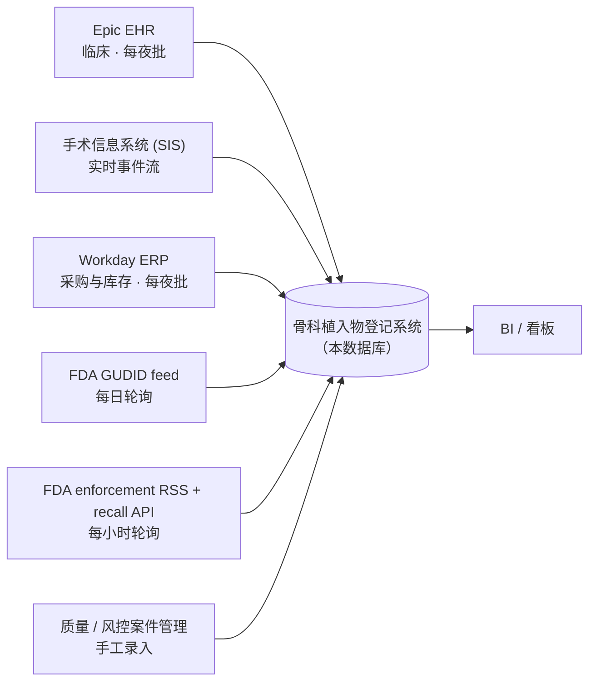
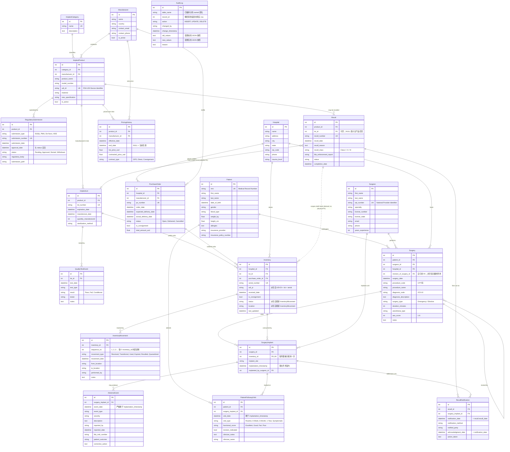

# 医疗器械: 骨科植入物追踪 ER 文档

> 业务背景, 行业科普, 术语表请见 `01-medical_devices_orthopedic_implant_tracking_high_business_context-cn.md`. 本文档只描述数据.

---

## 1. 数据集元信息

- **数据所属系统:** MAOHN (米德大西洋骨科医疗网络) 运营的骨科植入物中央登记系统 (implant registry), 医院侧视角的下游分析数据集市.
- **复杂度等级:** High (企业级分析数据集市)
- **表数:** 20
- **总行数:** 约 14,000 行
- **关系:** 24 个一对多, 1 个多对多 (`surgery` 与 `inventory`, 借由 `surgery_implant`), 1 个自引用 (`surgery.revision_of_surgery_id`), 1 个多态引用 (`audit_log` 指向任何表)
- **REFERENCE_DATE:** `2026-06-01` (生成器里的 `NOW` 常量; SQL 查询文档里所有时点都与它对齐)
- **读者:** SQL 学习者, BI 工程师, 数据建模讲师, 医疗分析团队.

---

## 2. 数据来源与架构

这套数据库是下游的分析数据集市 (analytical mart), 不是交易系统. 每晚由 5 个上游系统统一汇入. 公司画像, 商业模式, 项目目标见 `01` 号业务背景文档; 本节只讲数据从哪来, 归谁管, 分几层.

### 数据流与上游系统

这套数据库是 **下游的分析数据集市（analytical mart）**，不是交易系统。每晚由 5 个上游系统统一汇入：



| 上游系统 | 提供下面几张表的数据 | 抓取节奏 | 滞后 |
|---|---|---|---|
| Epic EHR | `patient`、`surgery`、`patient_followup_visit`、`adverse_event`（临床录入） | 每夜批 | T+1 天 |
| 手术信息系统 SIS | `surgery_implant`（哪个序列号在手术台上植入哪个患者）、`surgery.duration_minutes` | 实时事件流 | < 5 分钟 |
| Workday ERP | `purchase_order`、`inventory`、`inventory_movement`、`pricing_history` | 每夜批 | T+1 天 |
| FDA GUDID feed | `manufacturer`、`implant_product`、`implant_category`、`regulatory_submission` | 每日轮询 | T+1 天 |
| FDA enforcement RSS + 制造商通知 | `recall`、`recall_notification`（召回首次记录） | 每小时轮询，后续追踪手工录入 | < 1 小时 |
| 质量 / 风控案件系统 | `adverse_event`（出院后事件）、`quality_test_event` | 每日手工录入 | T+1 ~ T+30 天 |

### 谁拥有哪张表

MAOHN 内部对每张表都有明确 owner（数据 steward）。Owner 负责审批 schema 变更、对数据质量签字、在监管审计时直接面对评审人。

| 域 | Steward | 拥有的表 |
|---|---|---|
| **参考数据**（来自 GUDID/FDA，仅做本地缓存，不是 owner） | 监管事务部（Regulatory Affairs） | `manufacturer`、`implant_category`、`implant_product`、`regulatory_submission` |
| **临床** | 外科服务 VP | `patient`、`surgeon`、`hospital`、`surgery`、`surgery_implant`、`adverse_event`、`patient_followup_visit` |
| **供应链** | 供应链 VP | `implant_lot`、`inventory`、`inventory_movement`、`purchase_order`、`pricing_history`、`quality_test_event` |
| **监管 / 风控** | 首席合规官（CCO） | `recall`、`recall_notification`、`audit_log` |

### 数据分层 (raw, silver, gold)

整套数据集刻意做成三层结构，方便学习者既能练习 **从原始事件查询**，也能练习 **直接读派生好的当前态**：

| 分层 | 用途 | 包含的表 / 视图 |
|---|---|---|
| **Raw（原始 / 铜层）** — append-only 事件流，唯一可信源 | 重放历史、重构任意时刻的状态 | `inventory_movement`、`quality_test_event`、`pricing_history`、`patient_followup_visit`、`audit_log` |
| **Silver（银层）** — 当前态缓存、维度对齐 | 快速查询 "现在是什么状态" | `inventory.status`、`inventory.location`（均派生自 `inventory_movement`）、`patient`、`surgeon`、`hospital`、`implant_product`、`implant_lot`、`surgery`、`surgery_implant`、`adverse_event`、`recall`、`recall_notification`、`purchase_order` |
| **Gold（金层）** — 预聚合的分析视图 | 看板 / 高管报表 | 在 SQL queries 文档中以 `CREATE VIEW` 形式定义：`v_hospital_monthly_implant_cost`、`v_recall_response_sla`、`v_lot_quality_status`、`v_product_current_price` |

**当 silver 与 raw 不一致时，以 raw 事件流为准。** 生成器是先建原始事件、再从中派生 silver 列，所以两层在结构上无法漂移。

> 各业务岗位会提哪些问题, 以及每个问题对应哪条 SQL 查询, 见 `01` 号业务背景文档第 5 节, 以及 `03` 号 SQL 查询文档的查询索引.

---

## 3. 实体关系图



---

## 4. 表定义

按拓扑依赖顺序列出。

### 4.1 `implant_category`

**说明：** 骨科植入物的大类划分（骨板、骨钉、关节假体、脊柱器械等）。纯参考数据，来自 GUDID feed。
**Owner：** 监管事务部。
**层：** Silver（标准化维度）。

| 字段 | 类型 | 约束 | 说明 |
|---|---|---|---|
| `id` | INTEGER | PK, AUTO_INCREMENT | 主键 |
| `name` | VARCHAR(100) | NOT NULL, UNIQUE | 大类名称 |
| `description` | TEXT | | 详细描述 |

**样本：**

| id | name | description |
|---|---|---|
| 1 | Bone Plate | 骨折内固定用钢板 |
| 4 | Hip Replacement | 全髋 / 半髋假体 |

---

### 4.2 `manufacturer`

**说明：** 医疗器械制造商。**这是从 GUDID feed 同步过来的本地缓存，并不是权威源** —— 医院并不维护制造商主数据。原 `fda_establishment_id` 字段已故意删除，因为医院侧根本接触不到这个字段。
**Owner：** 监管事务部。
**层：** Silver（标准化维度；本地缓存）。

| 字段 | 类型 | 约束 | 说明 |
|---|---|---|---|
| `id` | INTEGER | PK, AUTO_INCREMENT | 主键 |
| `name` | VARCHAR(200) | NOT NULL | 制造商公司名 |
| `country` | VARCHAR(100) | | 生产国 |
| `contact_email` | VARCHAR(255) | | 主联系邮箱 |
| `contact_phone` | VARCHAR(20) | | 主联系电话 |
| `is_active` | BOOLEAN | DEFAULT TRUE | 当前是否仍向 MAOHN 供货 |

**样本：**

| id | name | country | is_active |
|---|---|---|---|
| 1 | Stryker Corporation | USA | TRUE |
| 2 | Zimmer Biomet | USA | TRUE |
| 3 | DePuy Synthes (J&J) | USA | TRUE |

---

### 4.3 `implant_product`

**说明：** 产品目录，带 FDA UDI-DI。**也是 GUDID 同步的参考数据**。注意：`unit_cost` 没有出现在本表 —— 价格是合同驱动且随时间变化的，因此独立放在 `pricing_history` 里。FDA 审批元数据也没有放这里 —— 它的权威源是 `regulatory_submission`。
**Owner：** 监管事务部。
**层：** Silver（标准化维度；GUDID 缓存）。

| 字段 | 类型 | 约束 | 说明 |
|---|---|---|---|
| `id` | INTEGER | PK, AUTO_INCREMENT | 主键 |
| `category_id` | INTEGER | FK → `implant_category.id` | |
| `manufacturer_id` | INTEGER | FK → `manufacturer.id` | |
| `product_name` | VARCHAR(200) | NOT NULL | 商品名 |
| `model_number` | VARCHAR(100) | | 制造商目录号 |
| `udi_di` | VARCHAR(100) | UNIQUE, NOT NULL | FDA UDI Device Identifier（GS1 AI 01 格式，14 位） |
| `material` | VARCHAR(100) | | 材质 |
| `size_specification` | VARCHAR(100) | NULLABLE | 规格 |
| `is_active` | BOOLEAN | DEFAULT TRUE | 是否在售 |

**样本：**

| id | product_name | udi_di | material |
|---|---|---|---|
| 1 | Triathlon Knee System | 00382000123456 | 钴铬合金 |
| 2 | Stryker Accolade II Hip | 00382000234567 | 钛合金 |

---

### 4.4 `hospital`

**说明：** MAOHN 旗下 12 家急性病医院。
**Owner：** 临床（外科服务 VP）。
**层：** Silver（标准化维度）。

| 字段 | 类型 | 约束 | 说明 |
|---|---|---|---|
| `id` | INTEGER | PK, AUTO_INCREMENT | |
| `name` | VARCHAR(200) | NOT NULL | |
| `address` | VARCHAR(255) | | |
| `city` | VARCHAR(100) | | |
| `state` | VARCHAR(2) | | 两位州缩写 |
| `zip_code` | VARCHAR(10) | | |
| `phone` | VARCHAR(20) | | |
| `trauma_level` | VARCHAR(20) | NULLABLE | 创伤中心等级，I / II / III 或空 |

---

### 4.5 `surgeon`

**说明：** 在 MAOHN 持有手术资质的骨科医生。NPI 是美国医疗体系的全国统一医生标识。
**Owner：** 临床。
**层：** Silver（标准化维度）。

| 字段 | 类型 | 约束 | 说明 |
|---|---|---|---|
| `id` | INTEGER | PK, AUTO_INCREMENT | |
| `first_name` | VARCHAR(100) | | |
| `last_name` | VARCHAR(100) | | |
| `npi_number` | VARCHAR(10) | UNIQUE, NOT NULL | 10 位 NPI |
| `specialty` | VARCHAR(100) | | 亚专科 |
| `license_number` | VARCHAR(50) | | 执业证号 |
| `license_state` | VARCHAR(2) | | 执业州 |
| `email` | VARCHAR(255) | | |
| `phone` | VARCHAR(20) | | |
| `years_experience` | INTEGER | NULLABLE | |

---

### 4.6 `patient`

**说明：** 至少接受过一次骨科植入手术的 MAOHN 患者。MRN 是本院范围内的唯一编号，跨医院不通用。
**Owner：** 临床（每夜从 Epic EHR 同步）。
**层：** Silver。

| 字段 | 类型 | 约束 | 说明 |
|---|---|---|---|
| `id` | INTEGER | PK, AUTO_INCREMENT | |
| `mrn` | VARCHAR(50) | UNIQUE, NOT NULL | 病历号 |
| `first_name` | VARCHAR(100) | | |
| `last_name` | VARCHAR(100) | | |
| `date_of_birth` | DATETIME | | |
| `gender` | VARCHAR(10) | | |
| `blood_type` | VARCHAR(10) | NULLABLE | |
| `weight_kg` | FLOAT | NULLABLE | |
| `height_cm` | FLOAT | NULLABLE | |
| `allergies` | TEXT | NULLABLE | 自由文本 —— 已知短板；规范化的 allergy / comorbidity 表在路线图里 |
| `insurance_provider` | VARCHAR(100) | NULLABLE | |
| `insurance_policy_number` | VARCHAR(50) | NULLABLE | |

---

### 4.7 `implant_lot`

**说明：** 制造批次（lot / batch）。原 `quality_test_passed` 布尔字段已**移出**本表 —— 质检结果改放到 `quality_test_event` 这一原始事件表里，"批次是否通过质检" 是派生量（最新一次定论性 Pass/Fail 决定）。
**Owner：** 供应链（来源 ERP）。
**层：** Silver。

| 字段 | 类型 | 约束 | 说明 |
|---|---|---|---|
| `id` | INTEGER | PK, AUTO_INCREMENT | |
| `product_id` | INTEGER | FK → `implant_product.id` | |
| `lot_number` | VARCHAR(50) | UNIQUE, NOT NULL | 制造商批号 |
| `expiration_date` | DATETIME | | |
| `manufacture_date` | DATETIME | | |
| `quantity_manufactured` | INTEGER | | 50–500 |
| `sterilization_method` | VARCHAR(100) | NULLABLE | Gamma、EtO、电子束 |

---

### 4.8 `quality_test_event` *（新增 — raw 层）*

**说明：** Append-only 的 QC 事件日志。真实 QC 是多阶段的（来料检验、灭菌验证、机械负荷、条件放行），所以一个批次会有 1–4 条事件。"批次当前是否通过质检" 是查询时算出来的，而不是一个固定布尔。
**Owner：** 供应链。
**层：** Raw（铜层）。

| 字段 | 类型 | 约束 | 说明 |
|---|---|---|---|
| `id` | INTEGER | PK, AUTO_INCREMENT | |
| `lot_id` | INTEGER | FK → `implant_lot.id` | |
| `test_date` | DATETIME | NOT NULL | 必须 ≥ 该 lot 的 `manufacture_date`，且 ≤ 今天 |
| `test_type` | VARCHAR(50) | NOT NULL | Incoming Inspection、Sterility、Mechanical Load、Visual |
| `result` | VARCHAR(20) | NOT NULL | Pass / Fail / Conditional |
| `tester` | VARCHAR(200) | | QC 工程师姓名 |
| `notes` | TEXT | NULLABLE | |

**派生规则：** 一个 lot 当且仅当满足以下两个条件，才视为 "已通过质检"：(a) 至少有一条事件，(b) 最近一条非 Conditional 的事件（即 Pass 或 Fail）是 Pass。

---

### 4.9 `pricing_history` *（新增 — raw 层）*

**说明：** Append-only 的 SCD2 价格日志。每一行表示某产品来自某制造商在某个时间区间内的成交价。`end_date IS NULL` 表示 "当前仍生效"。这是回答 **"在 Y 日收货的 X 单元，当时是按什么价钱买的？"** 的唯一可信源。
**Owner：** 供应链（来源 ERP 合同管理）。
**层：** Raw（铜层）。

| 字段 | 类型 | 约束 | 说明 |
|---|---|---|---|
| `id` | INTEGER | PK, AUTO_INCREMENT | |
| `product_id` | INTEGER | FK → `implant_product.id` | |
| `manufacturer_id` | INTEGER | FK → `manufacturer.id` | |
| `effective_date` | DATETIME | NOT NULL | 包含 |
| `end_date` | DATETIME | NULLABLE | 不包含；NULL = 仍生效 |
| `list_price_usd` | FLOAT | | 制造商 MSRP（目录价） |
| `contracted_price_usd` | FLOAT | | MAOHN 实际支付价 |
| `contract_type` | VARCHAR(30) | | GPO / Direct / Consignment |

**不变式：** 对于给定的 `(product_id, manufacturer_id)`，区间是连续的且不重叠。

---

### 4.10 `purchase_order` *（新增 — 商务层）*

**说明：** 医院开给制造商的采购订单。在骨科里 **约 60% 的高价值植入物走寄售（consignment）模式**（制造商保留所有权直到实际使用），因此本表和 `inventory` 都带 `is_consignment` 字段。这是把制造商和医院打通的上游商务层，也是应付账款（AP）核对的关键。
**Owner：** 供应链。
**层：** Silver（来自 ERP）。

| 字段 | 类型 | 约束 | 说明 |
|---|---|---|---|
| `id` | INTEGER | PK, AUTO_INCREMENT | |
| `hospital_id` | INTEGER | FK → `hospital.id` | |
| `manufacturer_id` | INTEGER | FK → `manufacturer.id` | |
| `po_number` | VARCHAR(50) | UNIQUE, NOT NULL | |
| `order_date` | DATETIME | | |
| `expected_delivery_date` | DATETIME | | |
| `actual_delivery_date` | DATETIME | NULLABLE | 未交付时为空 |
| `status` | VARCHAR(20) | | Open / Delivered / Cancelled |
| `is_consignment` | BOOLEAN | | TRUE 表示供应商保留所有权，使用时才结算 |
| `total_amount_usd` | FLOAT | | 合同价 × 订货数量的合计（粗估） |

---

### 4.11 `inventory`

**说明：** 一个实物单元（unit）。每行对应一件物理上独立的器械，序列号唯一。`status` 和 `location` 是 **silver 层的 "当前态缓存"**，由 `inventory_movement` 派生 —— 生成器先建 movements，再用最新的 movement 倒推这两个字段。
**Owner：** 供应链。
**层：** Silver（来自 raw `inventory_movement`）。

| 字段 | 类型 | 约束 | 说明 |
|---|---|---|---|
| `id` | INTEGER | PK, AUTO_INCREMENT | |
| `hospital_id` | INTEGER | FK → `hospital.id` | |
| `lot_id` | INTEGER | FK → `implant_lot.id` | |
| `purchase_order_id` | INTEGER | FK → `purchase_order.id` | |
| `serial_number` | VARCHAR(50) | UNIQUE, NOT NULL | |
| `udi_pi` | VARCHAR(100) | NOT NULL | **派生量** —— `(01){product.udi_di}(10){lot.lot_number}(21){serial_number}`，遵循 GS1 应用标识符 |
| `received_date` | DATETIME | NOT NULL | 必须 ≥ 所属 lot 的 `manufacture_date` |
| `is_consignment` | BOOLEAN | | 继承自所属 PO |
| `status` | VARCHAR(20) | | **派生量。** 取值：`Available`、`Used`、`Expired`、`Recalled`、`Quarantined` |
| `location` | VARCHAR(100) | NULLABLE | **派生量**，来自最新 movement |
| `last_updated` | DATETIME | | 最近一次 `inventory_movement` 的时间戳 |

---

### 4.12 `inventory_movement`

**说明：** Append-only 的物理动作日志。**这是库存状态的唯一可信源** —— 每个单元 Received → (可选若干 Transferred) → 终态 (Used/Expired/Recalled/Quarantined) 的完整时间线都能从本表重建。
**Owner：** 供应链。
**层：** Raw（铜层）。

| 字段 | 类型 | 约束 | 说明 |
|---|---|---|---|
| `id` | INTEGER | PK, AUTO_INCREMENT | |
| `inventory_id` | INTEGER | FK → `inventory.id` | |
| `sequence_no` | INTEGER | NOT NULL | 同一个 `inventory_id` 内递增（1, 2, 3, ...） |
| `movement_type` | VARCHAR(20) | NOT NULL | Received / Transferred / Used / Expired / Recalled / Inspected / Quarantined |
| `movement_date` | DATETIME | NOT NULL | 在每个 `inventory_id` 内单调递增 |
| `from_location` | VARCHAR(100) | NULLABLE | Received 为空 |
| `to_location` | VARCHAR(100) | NULLABLE | 终态事件（Used / Expired / Recalled）为空 |
| `performed_by` | VARCHAR(200) | | |
| `notes` | TEXT | NULLABLE | |

**生命周期不变式：** 每个单元第一条 movement 必然是 `Received`；终态事件一定是最后一条，之后不再有任何 movement。

---

### 4.13 `surgery`

**说明：** 在 MAOHN 任一医院开展的手术。`revision_of_surgery_id` 是自引用 FK —— 翻修手术（revision）通过它指向原始 primary surgery。骨科植入物经常会被翻修，加这个字段让翻修事件浮现出来。
**Owner：** 临床（Epic + SIS）。
**层：** Silver。

| 字段 | 类型 | 约束 | 说明 |
|---|---|---|---|
| `id` | INTEGER | PK, AUTO_INCREMENT | |
| `patient_id` | INTEGER | FK → `patient.id` | |
| `surgeon_id` | INTEGER | FK → `surgeon.id` | 主刀 |
| `hospital_id` | INTEGER | FK → `hospital.id` | |
| `revision_of_surgery_id` | INTEGER | FK → `surgery.id`, NULLABLE | 非空表示这是一次翻修 |
| `surgery_date` | DATETIME | NOT NULL | 必须晚于本次使用的任何 inventory 单元的 `received_date` |
| `procedure_code` | VARCHAR(20) | | CPT 操作码 |
| `procedure_name` | VARCHAR(200) | | |
| `diagnosis_code` | VARCHAR(20) | | ICD-10 |
| `diagnosis_description` | TEXT | | |
| `surgery_type` | VARCHAR(20) | | Emergency / Elective |
| `duration_minutes` | INTEGER | NULLABLE | 60–360 |
| `anesthesia_type` | VARCHAR(50) | NULLABLE | 全麻 / 椎管内 / 区域阻滞 |
| `asa_score` | INTEGER | NULLABLE | ASA 评分 1–6 |
| `notes` | TEXT | NULLABLE | |

---

### 4.14 `surgery_implant`

**说明：** 关联表：哪个 inventory 单元在哪台手术里被植入。`UNIQUE(inventory_id)` 保证了 "每个序列号只能植入一次" 这一物理事实。
**Owner：** 临床（SIS）。
**层：** Silver。

| 字段 | 类型 | 约束 | 说明 |
|---|---|---|---|
| `id` | INTEGER | PK, AUTO_INCREMENT | |
| `surgery_id` | INTEGER | FK → `surgery.id` | |
| `inventory_id` | INTEGER | FK → `inventory.id`, **UNIQUE** | |
| `implant_site` | VARCHAR(100) | NULLABLE | 解剖部位 |
| `implantation_timestamp` | DATETIME | NOT NULL | **必须 ∈ `[surgery_date, surgery_date + duration_minutes]`** |
| `implanted_by_surgeon_id` | INTEGER | FK → `surgeon.id` | 植入操作的执行医生 —— 多数情况下就是主刀，少数情况下是一助 |

---

### 4.15 `adverse_event`

**说明：** 与某个已植入单元相关的不良事件，FDA MDR 申报的依据。事件日期严格晚于植入时间。
**Owner：** 临床 + 质量风控。
**层：** Silver。

| 字段 | 类型 | 约束 | 说明 |
|---|---|---|---|
| `id` | INTEGER | PK, AUTO_INCREMENT | |
| `surgery_implant_id` | INTEGER | FK → `surgery_implant.id` | |
| `event_date` | DATETIME | NOT NULL | **严格 > `implantation_timestamp`** |
| `event_type` | VARCHAR(100) | | 感染、松动、断裂等 |
| `severity` | VARCHAR(30) | | Minor / Moderate / Severe / Life-threatening |
| `description` | TEXT | | |
| `reported_by` | VARCHAR(200) | | |
| `reported_date` | DATETIME | NOT NULL | **≥ `event_date`** |
| `fda_mdr_number` | VARCHAR(50) | NULLABLE | 还未上报 MDR 时为空 |
| `patient_outcome` | VARCHAR(100) | NULLABLE | |
| `corrective_action` | TEXT | NULLABLE | |

---

### 4.16 `patient_followup_visit` *（新增 — raw / 纵向层）*

**说明：** Append-only 的术后随访日志。真实临床结局是从纵向观察来的，不是事件发生那一刻给一个值。标准术后节奏是 6 周、6 个月、1 年，之后每年；症状性随访穿插其间。
**Owner：** 临床（Epic EHR）。
**层：** Raw（铜层）。

| 字段 | 类型 | 约束 | 说明 |
|---|---|---|---|
| `id` | INTEGER | PK, AUTO_INCREMENT | |
| `patient_id` | INTEGER | FK → `patient.id` | |
| `surgery_implant_id` | INTEGER | FK → `surgery_implant.id` | |
| `visit_date` | DATETIME | NOT NULL | **> `implantation_timestamp`** |
| `visit_type` | VARCHAR(30) | | Routine / 6-Week / 6-Month / 1-Year / Symptomatic |
| `functional_score` | VARCHAR(20) | NULLABLE | Excellent / Good / Fair / Poor |
| `revision_indicated` | BOOLEAN | DEFAULT FALSE | TRUE 通常预示后续会出现一条 `surgery.revision_of_surgery_id` 链接 |
| `clinician_notes` | TEXT | NULLABLE | |
| `clinician_name` | VARCHAR(200) | | |

---

### 4.17 `recall`

**说明：** 由制造商或 FDA 发布的器械召回记录。`lot_id` 非空表示批次级召回（lot-scoped），`lot_id IS NULL` 表示全产品召回。`status` 与 `completion_date` 保持自洽：`Completed`/`Terminated` 必有完成日期，`Active` 必无。
**Owner：** 监管 / 风控。
**层：** Silver（来自 FDA enforcement RSS + 制造商通知）。

| 字段 | 类型 | 约束 | 说明 |
|---|---|---|---|
| `id` | INTEGER | PK, AUTO_INCREMENT | |
| `product_id` | INTEGER | FK → `implant_product.id` | |
| `lot_id` | INTEGER | FK → `implant_lot.id`, NULLABLE | NULL = 全产品召回 |
| `recall_number` | VARCHAR(50) | UNIQUE | FDA 编号（如 `Z-1234-2024`） |
| `recall_date` | DATETIME | NOT NULL | |
| `recall_reason` | TEXT | | |
| `recall_class` | VARCHAR(20) | | Class I / II / III |
| `fda_enforcement_report` | VARCHAR(100) | NULLABLE | |
| `status` | VARCHAR(20) | | Active / Completed / Terminated |
| `completion_date` | DATETIME | NULLABLE | `status ∈ {Completed, Terminated}` 时必填，否则必空 |

---

### 4.18 `recall_notification`

**说明：** 每件 "受召回影响的已植入单元" 对应的通知记录，从 `recall` 一对多扇出。**严格作用域规则：** 每条通知的 `surgery_implant_id` 必须指向其 `lot_id`（批次级召回时）或 `product_id`（全产品召回时）匹配的单元。生成器在抽样时强制执行这条规则，不会挑无关单元。
**Owner：** 监管 / 风控。
**层：** Silver。

| 字段 | 类型 | 约束 | 说明 |
|---|---|---|---|
| `id` | INTEGER | PK, AUTO_INCREMENT | |
| `recall_id` | INTEGER | FK → `recall.id` | |
| `surgery_implant_id` | INTEGER | FK → `surgery_implant.id` | 必须在召回的产品 / 批次范围内 |
| `notification_date` | DATETIME | NOT NULL | **> `recall.recall_date`** |
| `notification_method` | VARCHAR(30) | | Email / Phone / Mail / Patient Portal |
| `notified_party` | VARCHAR(50) | | Patient / Hospital / Surgeon |
| `acknowledgment_date` | DATETIME | NULLABLE | 已确认时 **> `notification_date`** |
| `action_taken` | TEXT | NULLABLE | |

---

### 4.19 `regulatory_submission`

**说明：** 产品的 FDA 上市申报记录。**是 FDA 审批日期与申报号的权威源** —— `implant_product` 上原有的 `fda_approval_date` 和 `fda_510k_number` 已经删除。
**Owner：** 监管事务部。
**层：** Silver（来自 GUDID + FDA 510(k) 数据库）。

| 字段 | 类型 | 约束 | 说明 |
|---|---|---|---|
| `id` | INTEGER | PK, AUTO_INCREMENT | |
| `product_id` | INTEGER | FK → `implant_product.id` | |
| `submission_type` | VARCHAR(20) | | 510(k) / PMA / De Novo / HDE |
| `submission_number` | VARCHAR(50) | UNIQUE | |
| `submission_date` | DATETIME | NOT NULL | |
| `approval_date` | DATETIME | NULLABLE | `status = Approved` 时必填，否则空 |
| `status` | VARCHAR(20) | | Pending / Approved / Denied / Withdrawn |
| `regulatory_body` | VARCHAR(50) | | FDA / EMA / Health Canada |
| `submission_path` | VARCHAR(255) | NULLABLE | 文档路径 |

---

### 4.20 `audit_log`

**说明：** 系统审计日志。**每行的 `(table_name, record_id)` 都解析到本数据库中真实存在的行** —— 生成器是从已生成的 ID 池里抽样，不是凭空造编号。这是 FDA 21 CFR Part 11 审计场景下能站住脚的基本盘。
**Owner：** 合规部。
**层：** Raw（铜层）。

| 字段 | 类型 | 约束 | 说明 |
|---|---|---|---|
| `id` | INTEGER | PK, AUTO_INCREMENT | |
| `table_name` | VARCHAR(50) | NOT NULL | 被审计的 owned 表名 |
| `record_id` | INTEGER | NOT NULL | 在 `table_name` 中的真实行 ID |
| `action` | VARCHAR(10) | NOT NULL | INSERT / UPDATE / DELETE |
| `changed_by` | VARCHAR(200) | NOT NULL | 操作人 |
| `change_timestamp` | DATETIME | NOT NULL | |
| `old_values` | TEXT | NULLABLE | 变更前的 JSON 快照 |
| `new_values` | TEXT | NULLABLE | 变更后的 JSON 快照 |
| `reason` | TEXT | NULLABLE | |

**多态引用：** `record_id` 不带强制 FK（按 `table_name` 分发），但每行都解析到对应表里真实的 ID。

---

## 5. 数据生成规则

下面所有规则都由生成器在 generate 阶段强制执行；任何 `SELECT` query 依赖的规则都列在这里，方便评审人正向反向都能对上。

### 5.1 时间序不变式

| 规则 | 在哪强制 |
|---|---|
| `implant_lot.manufacture_date` < `implant_lot.expiration_date` | `gen_implant_lots` |
| `inventory.received_date` ≥ `implant_lot.manufacture_date` | `gen_inventory_and_movements` |
| `quality_test_event.test_date` ≥ `implant_lot.manufacture_date` 且 ≤ 今天 | `gen_quality_test_events` |
| `purchase_order.expected_delivery_date` > `purchase_order.order_date` | `gen_purchase_orders` |
| `purchase_order.actual_delivery_date` > `purchase_order.order_date`（已交付时） | `gen_purchase_orders` |
| `inventory.received_date` ≥ 所属 PO 的 `actual_delivery_date` | `gen_inventory` |
| 每个被使用的单元，其 `surgery.surgery_date` > 该单元的 `inventory.received_date` | `gen_surgeries`（手术日期采样时保证至少一件单元已到货） |
| `surgery_implant.implantation_timestamp` ∈ `[surgery.surgery_date, surgery.surgery_date + duration_minutes]` | `gen_surgery_implants` |
| `adverse_event.event_date` > `surgery_implant.implantation_timestamp` | `gen_adverse_events` |
| `adverse_event.reported_date` ≥ `adverse_event.event_date` | `gen_adverse_events` |
| `patient_followup_visit.visit_date` > `surgery_implant.implantation_timestamp` | `gen_patient_followup_visits` |
| `recall_notification.notification_date` > `recall.recall_date` | `gen_recall_notifications` |
| `recall_notification.acknowledgment_date` > `recall_notification.notification_date`（已确认时） | `gen_recall_notifications` |
| `sequence_no = 1` 的 `inventory_movement.movement_date` ≥ `inventory.received_date` | `gen_inventory_movements` |
| `inventory_movement.movement_date` 在每个 `inventory_id` 内单调递增 | `gen_inventory_movements` |
| `pricing_history` 区间对每个 `(product_id, manufacturer_id)` 连续且不重叠 | `gen_pricing_history` |
| `regulatory_submission.approval_date` > `submission_date`（已批准时） | `gen_regulatory_submissions` |
| `surgery.revision_of_surgery_id` 指向同一患者的更早一次手术 | `gen_surgeries` |

### 5.2 引用与作用域完整性

| 规则 | 在哪强制 |
|---|---|
| 所有 FK 都能解析 | 所有 `gen_*` 都从已生成的 ID 列表里抽样 |
| `surgery_implant.inventory_id` 唯一 | `gen_surgery_implants` 用 set 跟踪已用 ID |
| **`recall_notification.surgery_implant_id`** 必须落在召回的 lot/product 作用域内 | `gen_recall_notifications` 先按召回 scope 过滤候选再抽样 |
| `adverse_event.surgery_implant_id` 只引用真正被使用过的单元 | `gen_adverse_events` 从 `surgery_implant.id` 里抽样 |
| `surgery_implant.implanted_by_surgeon_id` 80% 等于主刀，20% 等于另一位有资质医生 | `gen_surgery_implants` |
| `audit_log.(table_name, record_id)` 都解析到真实行 | `gen_audit_log` 从已生成 DataFrame 抽样真实 ID |

### 5.3 派生不变式（silver 来自 raw）

| Silver 值 | 派生自 | 生成顺序 |
|---|---|---|
| `inventory.status` | 最新一条 `inventory_movement.movement_type` | 先生成 movements，再从最新 movement 推 status |
| `inventory.location` | 最新一条 `inventory_movement.to_location` | 同上 |
| `inventory.last_updated` | 最新一条 `inventory_movement.movement_date` | 同上 |
| `inventory.udi_pi` | `(01){product.udi_di}(10){lot.lot_number}(21){serial_number}`（GS1 应用标识符规范） | 行构造时直接计算 |
| 批次的 "质检通过" 状态（SQL 里用） | 该批次最近一次定论性 `quality_test_event.result` | 查询时派生，不存储 |
| 产品的当前价格（SQL 里用） | `pricing_history` 中 `effective_date ≤ now < COALESCE(end_date, +∞)` 的那一行 | 查询时派生 |
| `recall.status` | 先抽 status；只有 status ≠ `Active` 时才赋 `completion_date` | 构造时即自洽 |
| `regulatory_submission.approval_date` | `status ∈ {Pending, Withdrawn}` 必空；`status ∈ {Approved, Denied}` 必非空 | 构造时即自洽 |

### 5.4 取值范围与分布

训练集刻意做得比真实登记系统小，所以 `inventory.status` 分布反映 demo 规模（2,500 库存里约 1,500 单元已 Used → 约 53% Used），而不是真实系统稳态的 ~88% Available。**面向评审人的承诺是 "Used 数量 == surgery_implant 行数"，而不是一个固定百分比。**

| 字段 | 范围 / 分布 | 来源依据 |
|---|---|---|
| `asa_score` | 1–6，偏向 1–3 | ASA Physical Status Classification |
| `duration_minutes` | 60–360 | 真实 OR 数据 |
| `quantity_manufactured` | 每批次 50–500 | |
| `years_experience` | 5–35 | |
| `surgery.surgery_type` | 80% Elective、20% Emergency | MAOHN 历史 |
| `inventory.status`（派生） | Used 行数 == `surgery_implant` 行数；剩余中约 96% Available、约 4% Quarantined，少量 Expired（要求批次已过期）和 Recalled（要求 lot 或 product 在召回 scope 内） | 两阶段生成器输出 |
| `quality_test_event.result` | 92% Pass、5% Conditional、3% Fail | MAOHN QC 历史 |
| `adverse_event.severity` | 70% Minor、20% Moderate、8% Severe、2% Life-threatening | 对齐 FDA MAUDE |
| `recall.recall_class` | 10% Class I、60% Class II、30% Class III | FDA enforcement 历史 |
| `regulatory_submission.status` | 70% Approved、15% Pending、10% Denied、5% Withdrawn | FDA 历史 |
| `recall` 数量 | 约 5% 的产品至少有一条召回 | |
| 不良事件 | 约 10% 的手术产生至少一条不良事件 | |
| `pricing_history.contracted_price_usd` | GPO/Direct 折扣 10–30%；Consignment 0%（合约保留所有权直到使用） | 行业惯例 |
| `purchase_order.is_consignment` | 按制造商高价值品类占比线性插值：0.20（全部低价）→ 0.60（全部高价）。混合品类（典型情况）落在 ~0.35–0.50 | 行业惯例 |

### 5.5 Faker / 随机策略

| 字段模式 | 策略 |
|---|---|
| 人名 | `fake.first_name()` / `fake.last_name()` |
| 公司名 | `fake.company()` |
| 邮箱 / 电话 | `fake.email()`、`fake.phone_number()` |
| 地址 | `fake.street_address()`、`fake.city()`、`fake.state_abbr()`、`fake.zipcode()` |
| `mrn` | `fake.unique.random_int(min=100000, max=9999999)` 加 `MRN` 前缀（强制唯一） |
| `npi_number` | `fake.unique.random_int(min=1000000000, max=9999999999)`（强制唯一） |
| `serial_number` | `fake.unique.bothify('SN????##########')` |
| `lot_number` | `fake.unique.bothify('LOT????####')` |
| `udi_di`（GS1 AI 01，14 位） | `fake.unique.numerify('00382000######')` |
| `udi_pi` | 派生 —— 见 §5.3 |
| `po_number` | `f"PO-{year}-{fake.unique.random_int(min=10000, max=99999)}"` |

---

## 6. 文件清单

表按拓扑顺序输出为 TSV 文件，再统一加载到 SQLite。**注意 `recall` 排在 `inventory` 之前** —— 这是因为 inventory 生命周期 Phase B 需要根据召回 scope 决定哪些单元变成 `Recalled`。文件编号反映真实的生成依赖，不是字母序。

| # | 文件名 | 表 | 行数 | 层 | Steward |
|---|---|---|---|---|---|
| 01 | `01_implant_category.tsv` | `implant_category` | 8 | Silver | 监管 |
| 02 | `02_manufacturer.tsv` | `manufacturer` | 15 | Silver | 监管 |
| 03 | `03_hospital.tsv` | `hospital` | 12 | Silver | 临床 |
| 04 | `04_surgeon.tsv` | `surgeon` | 100 | Silver | 临床 |
| 05 | `05_patient.tsv` | `patient` | 500 | Silver | 临床 |
| 06 | `06_implant_product.tsv` | `implant_product` | 200 | Silver | 监管 |
| 07 | `07_regulatory_submission.tsv` | `regulatory_submission` | 250 | Silver | 监管 |
| 08 | `08_pricing_history.tsv` | `pricing_history` | ~440 | Raw | 供应链 |
| 09 | `09_implant_lot.tsv` | `implant_lot` | 400 | Silver | 供应链 |
| 10 | `10_quality_test_event.tsv` | `quality_test_event` | ~800 | Raw | 供应链 |
| 11 | `11_purchase_order.tsv` | `purchase_order` | 300 | Silver | 供应链 |
| 12 | `12_recall.tsv` | `recall` | 12 | Silver | 监管 |
| 13 | `13_inventory.tsv` | `inventory` | 2,500 | Silver（派生） | 供应链 |
| 14 | `14_inventory_movement.tsv` | `inventory_movement` | ~5,800 | Raw | 供应链 |
| 15 | `15_surgery.tsv` | `surgery` | 800 | Silver | 临床 |
| 16 | `16_surgery_implant.tsv` | `surgery_implant` | ~1,400 | Silver | 临床 |
| 17 | `17_adverse_event.tsv` | `adverse_event` | ~80 | Silver | 临床 / 风控 |
| 18 | `18_patient_followup_visit.tsv` | `patient_followup_visit` | ~1,500 | Raw | 临床 |
| 19 | `19_recall_notification.tsv` | `recall_notification` | ~125 | Silver | 监管 |
| 20 | `20_audit_log.tsv` | `audit_log` | 800 | Raw | 合规 |

**合计：** 约 14,000 行，20 张表。

---

## 7. SQLite DDL

下面是 20 张表的完整 `CREATE TABLE` 语句，按拓扑依赖顺序排列，可直接拷进 SQLite shell 执行。这些 DDL 与生成器里的 SQLAlchemy 模型逐字对应；生成器实际是用 `Base.metadata.create_all` 建表，本节是它的等价产物。

```sql
CREATE TABLE implant_category (
	id INTEGER NOT NULL,
	name VARCHAR(100) NOT NULL,
	description TEXT NOT NULL,
	PRIMARY KEY (id),
	UNIQUE (name)
);

CREATE TABLE manufacturer (
	id INTEGER NOT NULL,
	name VARCHAR(200) NOT NULL,
	country VARCHAR(100) NOT NULL,
	contact_email VARCHAR(255) NOT NULL,
	contact_phone VARCHAR(20) NOT NULL,
	is_active BOOLEAN NOT NULL,
	PRIMARY KEY (id)
);

CREATE TABLE hospital (
	id INTEGER NOT NULL,
	name VARCHAR(200) NOT NULL,
	address VARCHAR(255) NOT NULL,
	city VARCHAR(100) NOT NULL,
	state VARCHAR(2) NOT NULL,
	zip_code VARCHAR(10) NOT NULL,
	phone VARCHAR(20) NOT NULL,
	trauma_level VARCHAR(20),
	PRIMARY KEY (id)
);

CREATE TABLE surgeon (
	id INTEGER NOT NULL,
	first_name VARCHAR(100) NOT NULL,
	last_name VARCHAR(100) NOT NULL,
	npi_number VARCHAR(10) NOT NULL,
	specialty VARCHAR(100) NOT NULL,
	license_number VARCHAR(50) NOT NULL,
	license_state VARCHAR(2) NOT NULL,
	email VARCHAR(255) NOT NULL,
	phone VARCHAR(20) NOT NULL,
	years_experience INTEGER,
	PRIMARY KEY (id),
	UNIQUE (npi_number)
);

CREATE TABLE patient (
	id INTEGER NOT NULL,
	mrn VARCHAR(50) NOT NULL,
	first_name VARCHAR(100) NOT NULL,
	last_name VARCHAR(100) NOT NULL,
	date_of_birth DATETIME NOT NULL,
	gender VARCHAR(10) NOT NULL,
	blood_type VARCHAR(10),
	weight_kg FLOAT,
	height_cm FLOAT,
	allergies TEXT,
	insurance_provider VARCHAR(100),
	insurance_policy_number VARCHAR(50),
	PRIMARY KEY (id),
	UNIQUE (mrn)
);

CREATE TABLE implant_product (
	id INTEGER NOT NULL,
	category_id INTEGER NOT NULL,
	manufacturer_id INTEGER NOT NULL,
	product_name VARCHAR(200) NOT NULL,
	model_number VARCHAR(100) NOT NULL,
	udi_di VARCHAR(100) NOT NULL,
	material VARCHAR(100) NOT NULL,
	size_specification VARCHAR(100),
	is_active BOOLEAN NOT NULL,
	PRIMARY KEY (id),
	FOREIGN KEY(category_id) REFERENCES implant_category (id),
	FOREIGN KEY(manufacturer_id) REFERENCES manufacturer (id),
	UNIQUE (udi_di)
);

CREATE TABLE regulatory_submission (
	id INTEGER NOT NULL,
	product_id INTEGER NOT NULL,
	submission_type VARCHAR(20) NOT NULL,
	submission_number VARCHAR(50) NOT NULL,
	submission_date DATETIME NOT NULL,
	approval_date DATETIME,
	status VARCHAR(20) NOT NULL,
	regulatory_body VARCHAR(50) NOT NULL,
	submission_path VARCHAR(255),
	PRIMARY KEY (id),
	FOREIGN KEY(product_id) REFERENCES implant_product (id),
	UNIQUE (submission_number)
);

CREATE TABLE pricing_history (
	id INTEGER NOT NULL,
	product_id INTEGER NOT NULL,
	manufacturer_id INTEGER NOT NULL,
	effective_date DATETIME NOT NULL,
	end_date DATETIME,
	list_price_usd FLOAT NOT NULL,
	contracted_price_usd FLOAT NOT NULL,
	contract_type VARCHAR(30) NOT NULL,
	PRIMARY KEY (id),
	FOREIGN KEY(product_id) REFERENCES implant_product (id),
	FOREIGN KEY(manufacturer_id) REFERENCES manufacturer (id)
);

CREATE TABLE implant_lot (
	id INTEGER NOT NULL,
	product_id INTEGER NOT NULL,
	lot_number VARCHAR(50) NOT NULL,
	expiration_date DATETIME NOT NULL,
	manufacture_date DATETIME NOT NULL,
	quantity_manufactured INTEGER NOT NULL,
	sterilization_method VARCHAR(100),
	PRIMARY KEY (id),
	FOREIGN KEY(product_id) REFERENCES implant_product (id),
	UNIQUE (lot_number)
);

CREATE TABLE quality_test_event (
	id INTEGER NOT NULL,
	lot_id INTEGER NOT NULL,
	test_date DATETIME NOT NULL,
	test_type VARCHAR(50) NOT NULL,
	result VARCHAR(20) NOT NULL,
	tester VARCHAR(200) NOT NULL,
	notes TEXT,
	PRIMARY KEY (id),
	FOREIGN KEY(lot_id) REFERENCES implant_lot (id)
);

CREATE TABLE purchase_order (
	id INTEGER NOT NULL,
	hospital_id INTEGER NOT NULL,
	manufacturer_id INTEGER NOT NULL,
	po_number VARCHAR(50) NOT NULL,
	order_date DATETIME NOT NULL,
	expected_delivery_date DATETIME NOT NULL,
	actual_delivery_date DATETIME,
	status VARCHAR(20) NOT NULL,
	is_consignment BOOLEAN NOT NULL,
	total_amount_usd FLOAT NOT NULL,
	PRIMARY KEY (id),
	FOREIGN KEY(hospital_id) REFERENCES hospital (id),
	FOREIGN KEY(manufacturer_id) REFERENCES manufacturer (id),
	UNIQUE (po_number)
);

CREATE TABLE recall (
	id INTEGER NOT NULL,
	product_id INTEGER NOT NULL,
	lot_id INTEGER,
	recall_number VARCHAR(50) NOT NULL,
	recall_date DATETIME NOT NULL,
	recall_reason TEXT NOT NULL,
	recall_class VARCHAR(20) NOT NULL,
	fda_enforcement_report VARCHAR(100),
	status VARCHAR(20) NOT NULL,
	completion_date DATETIME,
	PRIMARY KEY (id),
	FOREIGN KEY(product_id) REFERENCES implant_product (id),
	FOREIGN KEY(lot_id) REFERENCES implant_lot (id),
	UNIQUE (recall_number)
);

CREATE TABLE inventory (
	id INTEGER NOT NULL,
	hospital_id INTEGER NOT NULL,
	lot_id INTEGER NOT NULL,
	purchase_order_id INTEGER NOT NULL,
	serial_number VARCHAR(50) NOT NULL,
	udi_pi VARCHAR(100) NOT NULL,
	received_date DATETIME NOT NULL,
	is_consignment BOOLEAN NOT NULL,
	status VARCHAR(20) NOT NULL,
	location VARCHAR(100),
	last_updated DATETIME NOT NULL,
	PRIMARY KEY (id),
	FOREIGN KEY(hospital_id) REFERENCES hospital (id),
	FOREIGN KEY(lot_id) REFERENCES implant_lot (id),
	FOREIGN KEY(purchase_order_id) REFERENCES purchase_order (id),
	UNIQUE (serial_number)
);

CREATE TABLE inventory_movement (
	id INTEGER NOT NULL,
	inventory_id INTEGER NOT NULL,
	sequence_no INTEGER NOT NULL,
	movement_type VARCHAR(20) NOT NULL,
	movement_date DATETIME NOT NULL,
	from_location VARCHAR(100),
	to_location VARCHAR(100),
	performed_by VARCHAR(200) NOT NULL,
	notes TEXT,
	PRIMARY KEY (id),
	FOREIGN KEY(inventory_id) REFERENCES inventory (id)
);

CREATE TABLE surgery (
	id INTEGER NOT NULL,
	patient_id INTEGER NOT NULL,
	surgeon_id INTEGER NOT NULL,
	hospital_id INTEGER NOT NULL,
	revision_of_surgery_id INTEGER,
	surgery_date DATETIME NOT NULL,
	procedure_code VARCHAR(20) NOT NULL,
	procedure_name VARCHAR(200) NOT NULL,
	diagnosis_code VARCHAR(20) NOT NULL,
	diagnosis_description TEXT NOT NULL,
	surgery_type VARCHAR(20) NOT NULL,
	duration_minutes INTEGER,
	anesthesia_type VARCHAR(50),
	asa_score INTEGER,
	notes TEXT,
	PRIMARY KEY (id),
	FOREIGN KEY(patient_id) REFERENCES patient (id),
	FOREIGN KEY(surgeon_id) REFERENCES surgeon (id),
	FOREIGN KEY(hospital_id) REFERENCES hospital (id),
	FOREIGN KEY(revision_of_surgery_id) REFERENCES surgery (id)
);

CREATE TABLE surgery_implant (
	id INTEGER NOT NULL,
	surgery_id INTEGER NOT NULL,
	inventory_id INTEGER NOT NULL,
	implant_site VARCHAR(100),
	implantation_timestamp DATETIME NOT NULL,
	implanted_by_surgeon_id INTEGER NOT NULL,
	PRIMARY KEY (id),
	FOREIGN KEY(surgery_id) REFERENCES surgery (id),
	UNIQUE (inventory_id),
	FOREIGN KEY(inventory_id) REFERENCES inventory (id),
	FOREIGN KEY(implanted_by_surgeon_id) REFERENCES surgeon (id)
);

CREATE TABLE adverse_event (
	id INTEGER NOT NULL,
	surgery_implant_id INTEGER NOT NULL,
	event_date DATETIME NOT NULL,
	event_type VARCHAR(100) NOT NULL,
	severity VARCHAR(30) NOT NULL,
	description TEXT NOT NULL,
	reported_by VARCHAR(200) NOT NULL,
	reported_date DATETIME NOT NULL,
	fda_mdr_number VARCHAR(50),
	patient_outcome VARCHAR(100),
	corrective_action TEXT,
	PRIMARY KEY (id),
	FOREIGN KEY(surgery_implant_id) REFERENCES surgery_implant (id)
);

CREATE TABLE patient_followup_visit (
	id INTEGER NOT NULL,
	patient_id INTEGER NOT NULL,
	surgery_implant_id INTEGER NOT NULL,
	visit_date DATETIME NOT NULL,
	visit_type VARCHAR(30) NOT NULL,
	functional_score VARCHAR(20),
	revision_indicated BOOLEAN NOT NULL,
	clinician_notes TEXT,
	clinician_name VARCHAR(200) NOT NULL,
	PRIMARY KEY (id),
	FOREIGN KEY(patient_id) REFERENCES patient (id),
	FOREIGN KEY(surgery_implant_id) REFERENCES surgery_implant (id)
);

CREATE TABLE recall_notification (
	id INTEGER NOT NULL,
	recall_id INTEGER NOT NULL,
	surgery_implant_id INTEGER NOT NULL,
	notification_date DATETIME NOT NULL,
	notification_method VARCHAR(30) NOT NULL,
	notified_party VARCHAR(50) NOT NULL,
	acknowledgment_date DATETIME,
	action_taken TEXT,
	PRIMARY KEY (id),
	FOREIGN KEY(recall_id) REFERENCES recall (id),
	FOREIGN KEY(surgery_implant_id) REFERENCES surgery_implant (id)
);

CREATE TABLE audit_log (
	id INTEGER NOT NULL,
	table_name VARCHAR(50) NOT NULL,
	record_id INTEGER NOT NULL,
	action VARCHAR(10) NOT NULL,
	changed_by VARCHAR(200) NOT NULL,
	change_timestamp DATETIME NOT NULL,
	old_values TEXT,
	new_values TEXT,
	reason TEXT,
	PRIMARY KEY (id)
);
```

> 注意: `audit_log.record_id` 是多态引用, DDL 层面不带物理外键 (因为它按 `table_name` 指向不同的表); 但生成器保证每行都解析到真实存在的 `(table_name, record_id)`. 同理, `inventory` 的 `status` 和 `location`, 以及 "批次质检状态", "产品当前价格" 等都是派生量, DDL 里看不出来, 派生规则见第 5 节.

---

## 8. 已知限制

下面这些一个资深医疗数据评审人都会立刻问到 —— 它们是有意做的范围裁剪，不是疏忽：

- **没有 HIPAA consent / `patient_data_use_agreement` 实体。** 这是合成训练数据，把同意书建模进来反而会盖住要展示的 SQL 模式。真实的 MAOHN 系统会有这一块。
- **`patient.allergies` 是自由文本。** 生产 schema 会把它拆成 `patient_allergy` 和 `patient_comorbidity`。本档次（high）也未做。
- **`audit_log` 是示例性的，不是完整审计跟踪。** 每一行都引用真实的 `(table, id)` 且 `change_timestamp ≥ 该 row 的 anchor`，但真实 Part 11 审计日志应该每一次 DML 对应一行，并保留事务级总序。本表的 800 行是 "够用来演示 Part 11 查询模式" 的代表样本，不是完整跟踪。
- **`purchase_order.total_amount_usd` 是粗估。** 取 `[$5,000, $250,000]` 内的随机值，**不** 约束为 `Σ(单价 × 该 PO 下交付的单元数)`。如果用 AP 对账场景的 query 把 PO 总额对单元级价格汇总，是对不平的；demo 数据下接受。
- **`pricing_history` 区间对每个 `(product, manufacturer)` 不重叠**，但 "同一产品在多家分销商之间的价格重叠" 没有建模 —— 本 schema 里每个 product 只有一个 manufacturer。
- **没有建模 GPO 合同分级 / chargeback。** 价格层只有 `contract_type ∈ {GPO, Direct, Consignment}`；再往下（具体 GPO 主合同、阶梯量价、供应商回款）应该是单独一个商务数据集。
- **没有 OR 内厂家代表 / 销售陪台日志。** 真实手术中常有制造商代表在场（合规和利益冲突话题），本档次未做。
- **手术日期均匀分布**，没有月度 / 季节性 pattern（实际择期手术 12 月会下降）。
- **生成器固定 `NOW = 2026-06-01`，SQLite 查询里用的是系统时钟 `DATE('now')`。** 数据集 "新鲜度" 会随时间衰减；要重用就重新跑生成器。
