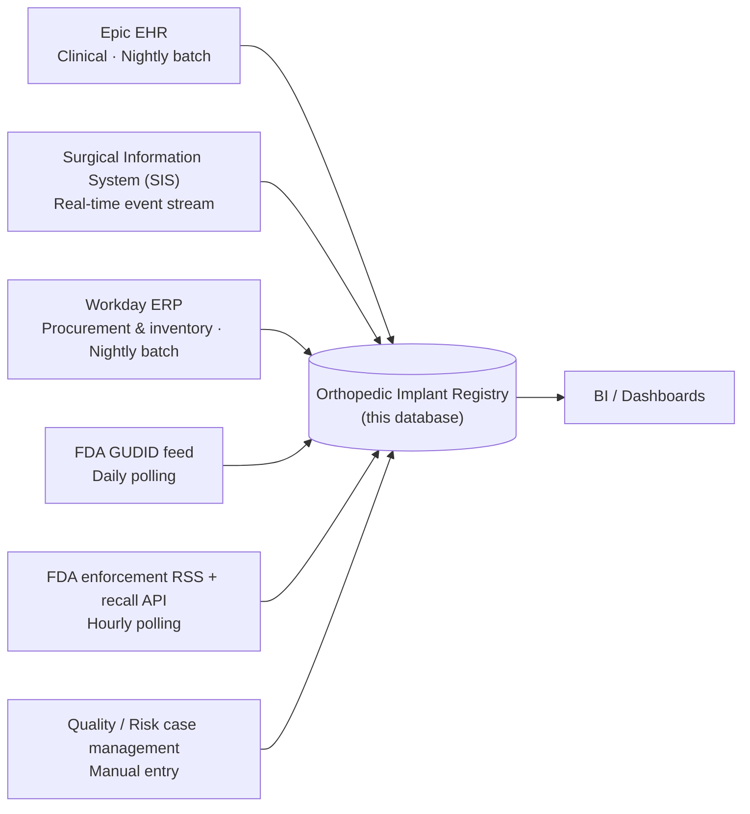
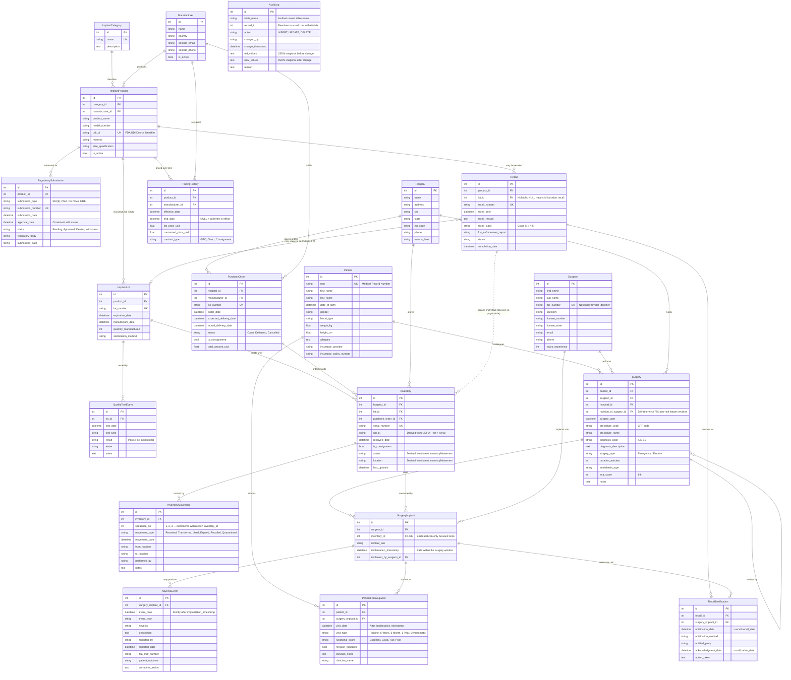

# Medical Devices: Orthopedic Implant Tracking ER Document

> For business context, industry primer, and glossary, see `01-medical_devices_orthopedic_implant_tracking_high_business_context.md`. This document describes the data only.

---

## 1. Dataset Metadata

- **Owning system:** MAOHN (MidAtlantic Orthopedic Health Network) central orthopedic implant registry, an analytical downstream data mart viewed from the hospital side.
- **Complexity tier:** High (enterprise-grade analytical mart)
- **Tables:** 20
- **Total rows:** ~14,000
- **Relationships:** 24 one-to-many, 1 many-to-many (`surgery` to `inventory` via `surgery_implant`), 1 self-reference (`surgery.revision_of_surgery_id`), 1 polymorphic reference (`audit_log` pointing at any table)
- **REFERENCE_DATE:** `2026-06-01` (the `NOW` constant in the generator; every point-in-time clause in the SQL document is aligned to it)
- **Audience:** SQL learners, BI engineers, data modeling instructors, healthcare analytics teams.

---

## 2. Data Sources and Architecture

This database is a downstream analytical mart, not a transactional system. It is refreshed nightly from five upstream systems. For the company snapshot, business model, and project goals, see business context document `01`; this section only covers where the data comes from, who owns it, and how it is tiered.

### Data flow and upstream systems

This database is a **downstream analytical mart**, not a transactional system. It's refreshed nightly from five upstream systems:



| Upstream system | Tables it feeds | Cadence | Latency |
|---|---|---|---|
| Epic EHR | `patient`, `surgery`, `patient_followup_visit`, `adverse_event` (clinical entry) | Nightly batch | T+1 day |
| Surgical Information System (SIS) | `surgery_implant` (which serial number was implanted in which patient on the OR table), `surgery.duration_minutes` | Real-time event stream | < 5 minutes |
| Workday ERP | `purchase_order`, `inventory`, `inventory_movement`, `pricing_history` | Nightly batch | T+1 day |
| FDA GUDID feed | `manufacturer`, `implant_product`, `implant_category`, `regulatory_submission` | Daily polling | T+1 day |
| FDA enforcement RSS + manufacturer notifications | `recall`, `recall_notification` (initial recall capture) | Hourly polling; follow-up tracked manually | < 1 hour |
| Quality / Risk case system | `adverse_event` (post-discharge events), `quality_test_event` | Daily manual entry | T+1 to T+30 days |

### Who owns which table

MAOHN has a clearly named owner (the data steward) for every table. The steward approves schema changes, signs off on data quality, and is the face of the data in front of regulatory auditors.

| Domain | Steward | Tables owned |
|---|---|---|
| **Reference data** (from GUDID/FDA, kept as a local cache; the steward is not the source of truth) | Regulatory Affairs | `manufacturer`, `implant_category`, `implant_product`, `regulatory_submission` |
| **Clinical** | VP of Surgical Services | `patient`, `surgeon`, `hospital`, `surgery`, `surgery_implant`, `adverse_event`, `patient_followup_visit` |
| **Supply chain** | VP of Supply Chain | `implant_lot`, `inventory`, `inventory_movement`, `purchase_order`, `pricing_history`, `quality_test_event` |
| **Regulatory / Risk** | Chief Compliance Officer (CCO) | `recall`, `recall_notification`, `audit_log` |

### Data tiers (raw, silver, gold)

The dataset is deliberately built as a three-tier structure so learners can practice both **querying raw events** and **reading the precomputed current state**:

| Tier | Purpose | Tables / views included |
|---|---|---|
| **Raw (bronze)** — append-only event streams, the single source of truth | Replay history; reconstruct state at any moment | `inventory_movement`, `quality_test_event`, `pricing_history`, `patient_followup_visit`, `audit_log` |
| **Silver** — current-state caches and aligned dimensions | Quickly query "what is the state right now" | `inventory.status`, `inventory.location` (both derived from `inventory_movement`), `patient`, `surgeon`, `hospital`, `implant_product`, `implant_lot`, `surgery`, `surgery_implant`, `adverse_event`, `recall`, `recall_notification`, `purchase_order` |
| **Gold** — pre-aggregated analytical views | Dashboards / executive reports | Defined as `CREATE VIEW` in the SQL queries document: `v_hospital_monthly_implant_cost`, `v_recall_response_sla`, `v_lot_quality_status`, `v_product_current_price` |

**When silver and raw disagree, raw wins.** The generator builds raw events first and derives the silver columns from them, so the two tiers cannot drift apart structurally.

> For which business roles raise which questions, and which SQL query maps to each one, see Section 5 of business context document `01` and the query index in SQL queries document `03`.

---

## 3. Entity Relationship Diagram



---

## 4. Table Definitions

Listed in topological dependency order.

### 4.1 `implant_category`

**Description:** High-level categorization of orthopedic implants (bone plates, bone screws, joint prostheses, spinal hardware, and so on). Pure reference data, sourced from the GUDID feed.
**Owner:** Regulatory Affairs.
**Tier:** Silver (standardized dimension).

| Field | Type | Constraints | Description |
|---|---|---|---|
| `id` | INTEGER | PK, AUTO_INCREMENT | Primary key |
| `name` | VARCHAR(100) | NOT NULL, UNIQUE | Category name |
| `description` | TEXT | | Detailed description |

**Sample:**

| id | name | description |
|---|---|---|
| 1 | Bone Plate | Plates used for internal fracture fixation |
| 4 | Hip Replacement | Total / partial hip prosthesis |

---

### 4.2 `manufacturer`

**Description:** Medical device manufacturer. **This is a local cache synced from the GUDID feed; it is not the authoritative source.** The hospital does not maintain manufacturer master data. The original `fda_establishment_id` field was deliberately dropped, since the hospital side never touches that field.
**Owner:** Regulatory Affairs.
**Tier:** Silver (standardized dimension; local cache).

| Field | Type | Constraints | Description |
|---|---|---|---|
| `id` | INTEGER | PK, AUTO_INCREMENT | Primary key |
| `name` | VARCHAR(200) | NOT NULL | Manufacturer company name |
| `country` | VARCHAR(100) | | Country of manufacture |
| `contact_email` | VARCHAR(255) | | Primary contact email |
| `contact_phone` | VARCHAR(20) | | Primary contact phone |
| `is_active` | BOOLEAN | DEFAULT TRUE | Whether still supplying MAOHN |

**Sample:**

| id | name | country | is_active |
|---|---|---|---|
| 1 | Stryker Corporation | USA | TRUE |
| 2 | Zimmer Biomet | USA | TRUE |
| 3 | DePuy Synthes (J&J) | USA | TRUE |

---

### 4.3 `implant_product`

**Description:** Product catalog with FDA UDI-DI. **Also GUDID-sourced reference data.** Note: `unit_cost` does not appear here; pricing is contract-driven and time-varying, so it lives separately in `pricing_history`. FDA approval metadata also does not live here; the authoritative source for it is `regulatory_submission`.
**Owner:** Regulatory Affairs.
**Tier:** Silver (standardized dimension; GUDID cache).

| Field | Type | Constraints | Description |
|---|---|---|---|
| `id` | INTEGER | PK, AUTO_INCREMENT | Primary key |
| `category_id` | INTEGER | FK → `implant_category.id` | |
| `manufacturer_id` | INTEGER | FK → `manufacturer.id` | |
| `product_name` | VARCHAR(200) | NOT NULL | Trade name |
| `model_number` | VARCHAR(100) | | Manufacturer catalog number |
| `udi_di` | VARCHAR(100) | UNIQUE, NOT NULL | FDA UDI Device Identifier (GS1 AI 01 format, 14 digits) |
| `material` | VARCHAR(100) | | Material |
| `size_specification` | VARCHAR(100) | NULLABLE | Size specification |
| `is_active` | BOOLEAN | DEFAULT TRUE | Whether currently in catalog |

**Sample:**

| id | product_name | udi_di | material |
|---|---|---|---|
| 1 | Triathlon Knee System | 00382000123456 | Cobalt chrome alloy |
| 2 | Stryker Accolade II Hip | 00382000234567 | Titanium alloy |

---

### 4.4 `hospital`

**Description:** The 12 acute care hospitals in MAOHN.
**Owner:** Clinical (VP of Surgical Services).
**Tier:** Silver (standardized dimension).

| Field | Type | Constraints | Description |
|---|---|---|---|
| `id` | INTEGER | PK, AUTO_INCREMENT | |
| `name` | VARCHAR(200) | NOT NULL | |
| `address` | VARCHAR(255) | | |
| `city` | VARCHAR(100) | | |
| `state` | VARCHAR(2) | | Two-letter state abbreviation |
| `zip_code` | VARCHAR(10) | | |
| `phone` | VARCHAR(20) | | |
| `trauma_level` | VARCHAR(20) | NULLABLE | Trauma center level: I / II / III or blank |

---

### 4.5 `surgeon`

**Description:** Orthopedic surgeons credentialed at MAOHN. The NPI is the U.S. healthcare system's national provider identifier.
**Owner:** Clinical.
**Tier:** Silver (standardized dimension).

| Field | Type | Constraints | Description |
|---|---|---|---|
| `id` | INTEGER | PK, AUTO_INCREMENT | |
| `first_name` | VARCHAR(100) | | |
| `last_name` | VARCHAR(100) | | |
| `npi_number` | VARCHAR(10) | UNIQUE, NOT NULL | 10-digit NPI |
| `specialty` | VARCHAR(100) | | Subspecialty |
| `license_number` | VARCHAR(50) | | License number |
| `license_state` | VARCHAR(2) | | License state |
| `email` | VARCHAR(255) | | |
| `phone` | VARCHAR(20) | | |
| `years_experience` | INTEGER | NULLABLE | |

---

### 4.6 `patient`

**Description:** MAOHN patients who have undergone at least one orthopedic implant procedure. The MRN is unique within a single hospital and is not portable across hospitals.
**Owner:** Clinical (synced nightly from Epic EHR).
**Tier:** Silver.

| Field | Type | Constraints | Description |
|---|---|---|---|
| `id` | INTEGER | PK, AUTO_INCREMENT | |
| `mrn` | VARCHAR(50) | UNIQUE, NOT NULL | Medical record number |
| `first_name` | VARCHAR(100) | | |
| `last_name` | VARCHAR(100) | | |
| `date_of_birth` | DATETIME | | |
| `gender` | VARCHAR(10) | | |
| `blood_type` | VARCHAR(10) | NULLABLE | |
| `weight_kg` | FLOAT | NULLABLE | |
| `height_cm` | FLOAT | NULLABLE | |
| `allergies` | TEXT | NULLABLE | Free text — known shortcoming; normalized allergy / comorbidity tables are on the roadmap |
| `insurance_provider` | VARCHAR(100) | NULLABLE | |
| `insurance_policy_number` | VARCHAR(50) | NULLABLE | |

---

### 4.7 `implant_lot`

**Description:** Manufacturing lot / batch. The original `quality_test_passed` boolean column has been **moved out** of this table; QC results now live in the `quality_test_event` raw event table, and "did this lot pass QC" is a derived quantity (set by the latest conclusive Pass/Fail event).
**Owner:** Supply chain (ERP-sourced).
**Tier:** Silver.

| Field | Type | Constraints | Description |
|---|---|---|---|
| `id` | INTEGER | PK, AUTO_INCREMENT | |
| `product_id` | INTEGER | FK → `implant_product.id` | |
| `lot_number` | VARCHAR(50) | UNIQUE, NOT NULL | Manufacturer lot number |
| `expiration_date` | DATETIME | | |
| `manufacture_date` | DATETIME | | |
| `quantity_manufactured` | INTEGER | | 50–500 |
| `sterilization_method` | VARCHAR(100) | NULLABLE | Gamma, EtO, electron beam |

---

### 4.8 `quality_test_event` *(new — raw tier)*

**Description:** Append-only QC event log. Real-world QC is multi-stage (incoming inspection, sterility validation, mechanical load, conditional release), so a lot can have 1 to 4 events. "Does this lot currently pass QC" is computed at query time, not stored as a fixed boolean.
**Owner:** Supply chain.
**Tier:** Raw (bronze).

| Field | Type | Constraints | Description |
|---|---|---|---|
| `id` | INTEGER | PK, AUTO_INCREMENT | |
| `lot_id` | INTEGER | FK → `implant_lot.id` | |
| `test_date` | DATETIME | NOT NULL | Must be ≥ the lot's `manufacture_date`, and ≤ today |
| `test_type` | VARCHAR(50) | NOT NULL | Incoming Inspection, Sterility, Mechanical Load, Visual |
| `result` | VARCHAR(20) | NOT NULL | Pass / Fail / Conditional |
| `tester` | VARCHAR(200) | | QC engineer name |
| `notes` | TEXT | NULLABLE | |

**Derivation rule:** A lot is considered "QC passed" if and only if (a) it has at least one event, and (b) its most recent non-Conditional event (i.e., Pass or Fail) is Pass.

---

### 4.9 `pricing_history` *(new — raw tier)*

**Description:** Append-only SCD2 price log. Each row represents the negotiated price for a given product from a given manufacturer during a given date range. `end_date IS NULL` means "still in effect." This is the single source of truth for answering **"what price did we pay for the X unit that was received on day Y?"**
**Owner:** Supply chain (sourced from ERP contract management).
**Tier:** Raw (bronze).

| Field | Type | Constraints | Description |
|---|---|---|---|
| `id` | INTEGER | PK, AUTO_INCREMENT | |
| `product_id` | INTEGER | FK → `implant_product.id` | |
| `manufacturer_id` | INTEGER | FK → `manufacturer.id` | |
| `effective_date` | DATETIME | NOT NULL | Inclusive |
| `end_date` | DATETIME | NULLABLE | Exclusive; NULL = still in effect |
| `list_price_usd` | FLOAT | | Manufacturer MSRP (list price) |
| `contracted_price_usd` | FLOAT | | Price MAOHN actually pays |
| `contract_type` | VARCHAR(30) | | GPO / Direct / Consignment |

**Invariant:** For each `(product_id, manufacturer_id)`, the date ranges are contiguous and non-overlapping.

---

### 4.10 `purchase_order` *(new — commercial tier)*

**Description:** Purchase orders the hospital opens with manufacturers. In orthopedics, **about 60% of high-value implants run on consignment** (the manufacturer retains title until the device is actually used), which is why both this table and `inventory` carry an `is_consignment` field. This is the commercial layer that connects the manufacturer to the hospital, and it's the key to AP (accounts payable) reconciliation.
**Owner:** Supply chain.
**Tier:** Silver (from ERP).

| Field | Type | Constraints | Description |
|---|---|---|---|
| `id` | INTEGER | PK, AUTO_INCREMENT | |
| `hospital_id` | INTEGER | FK → `hospital.id` | |
| `manufacturer_id` | INTEGER | FK → `manufacturer.id` | |
| `po_number` | VARCHAR(50) | UNIQUE, NOT NULL | |
| `order_date` | DATETIME | | |
| `expected_delivery_date` | DATETIME | | |
| `actual_delivery_date` | DATETIME | NULLABLE | Null if not delivered |
| `status` | VARCHAR(20) | | Open / Delivered / Cancelled |
| `is_consignment` | BOOLEAN | | TRUE means the supplier retains title and only invoices on use |
| `total_amount_usd` | FLOAT | | Contract price × order quantity, total (rough estimate) |

---

### 4.11 `inventory`

**Description:** One physical unit. Each row corresponds to one physically distinct device with a unique serial number. `status` and `location` are **silver-tier "current state caches"** derived from `inventory_movement`; the generator builds movements first, then reads the latest movement back to fill in these two fields.
**Owner:** Supply chain.
**Tier:** Silver (derived from raw `inventory_movement`).

| Field | Type | Constraints | Description |
|---|---|---|---|
| `id` | INTEGER | PK, AUTO_INCREMENT | |
| `hospital_id` | INTEGER | FK → `hospital.id` | |
| `lot_id` | INTEGER | FK → `implant_lot.id` | |
| `purchase_order_id` | INTEGER | FK → `purchase_order.id` | |
| `serial_number` | VARCHAR(50) | UNIQUE, NOT NULL | |
| `udi_pi` | VARCHAR(100) | NOT NULL | **Derived** — `(01){product.udi_di}(10){lot.lot_number}(21){serial_number}`, following the GS1 application identifiers |
| `received_date` | DATETIME | NOT NULL | Must be ≥ the owning lot's `manufacture_date` |
| `is_consignment` | BOOLEAN | | Inherited from the owning PO |
| `status` | VARCHAR(20) | | **Derived.** Values: `Available`, `Used`, `Expired`, `Recalled`, `Quarantined` |
| `location` | VARCHAR(100) | NULLABLE | **Derived** from the latest movement |
| `last_updated` | DATETIME | | Timestamp of the latest `inventory_movement` |

---

### 4.12 `inventory_movement`

**Description:** Append-only log of physical actions. **This is the single source of truth for inventory state** — the full timeline of every unit's Received → (optional Transferred steps) → terminal state (Used/Expired/Recalled/Quarantined) can be reconstructed from this table.
**Owner:** Supply chain.
**Tier:** Raw (bronze).

| Field | Type | Constraints | Description |
|---|---|---|---|
| `id` | INTEGER | PK, AUTO_INCREMENT | |
| `inventory_id` | INTEGER | FK → `inventory.id` | |
| `sequence_no` | INTEGER | NOT NULL | Increments within each `inventory_id` (1, 2, 3, ...) |
| `movement_type` | VARCHAR(20) | NOT NULL | Received / Transferred / Used / Expired / Recalled / Inspected / Quarantined |
| `movement_date` | DATETIME | NOT NULL | Monotonically increases within each `inventory_id` |
| `from_location` | VARCHAR(100) | NULLABLE | Null for Received |
| `to_location` | VARCHAR(100) | NULLABLE | Null for terminal events (Used / Expired / Recalled) |
| `performed_by` | VARCHAR(200) | | |
| `notes` | TEXT | NULLABLE | |

**Lifecycle invariant:** Each unit's first movement is always `Received`; a terminal event is always the last movement, with nothing after it.

---

### 4.13 `surgery`

**Description:** A surgery performed at any MAOHN hospital. `revision_of_surgery_id` is a self-referencing FK — a revision surgery points back at the original primary surgery through it. Orthopedic implants are revised often enough that this column was added to surface revision events.
**Owner:** Clinical (Epic + SIS).
**Tier:** Silver.

| Field | Type | Constraints | Description |
|---|---|---|---|
| `id` | INTEGER | PK, AUTO_INCREMENT | |
| `patient_id` | INTEGER | FK → `patient.id` | |
| `surgeon_id` | INTEGER | FK → `surgeon.id` | Lead surgeon |
| `hospital_id` | INTEGER | FK → `hospital.id` | |
| `revision_of_surgery_id` | INTEGER | FK → `surgery.id`, NULLABLE | Non-null means this is a revision |
| `surgery_date` | DATETIME | NOT NULL | Must be later than the `received_date` of every inventory unit used in this surgery |
| `procedure_code` | VARCHAR(20) | | CPT procedure code |
| `procedure_name` | VARCHAR(200) | | |
| `diagnosis_code` | VARCHAR(20) | | ICD-10 |
| `diagnosis_description` | TEXT | | |
| `surgery_type` | VARCHAR(20) | | Emergency / Elective |
| `duration_minutes` | INTEGER | NULLABLE | 60–360 |
| `anesthesia_type` | VARCHAR(50) | NULLABLE | General / neuraxial / regional block |
| `asa_score` | INTEGER | NULLABLE | ASA score 1–6 |
| `notes` | TEXT | NULLABLE | |

---

### 4.14 `surgery_implant`

**Description:** Bridge table: which inventory unit was implanted in which surgery. The `UNIQUE(inventory_id)` constraint guarantees the physical fact that "each serial number can only be implanted once."
**Owner:** Clinical (SIS).
**Tier:** Silver.

| Field | Type | Constraints | Description |
|---|---|---|---|
| `id` | INTEGER | PK, AUTO_INCREMENT | |
| `surgery_id` | INTEGER | FK → `surgery.id` | |
| `inventory_id` | INTEGER | FK → `inventory.id`, **UNIQUE** | |
| `implant_site` | VARCHAR(100) | NULLABLE | Anatomical site |
| `implantation_timestamp` | DATETIME | NOT NULL | **Must be in `[surgery_date, surgery_date + duration_minutes]`** |
| `implanted_by_surgeon_id` | INTEGER | FK → `surgeon.id` | The surgeon who performed the implantation step — usually the lead surgeon, occasionally the first assist |

---

### 4.15 `adverse_event`

**Description:** Adverse events tied to a specific implanted unit, the source material for FDA MDR filings. The event date is strictly after the implantation time.
**Owner:** Clinical + Quality / Risk.
**Tier:** Silver.

| Field | Type | Constraints | Description |
|---|---|---|---|
| `id` | INTEGER | PK, AUTO_INCREMENT | |
| `surgery_implant_id` | INTEGER | FK → `surgery_implant.id` | |
| `event_date` | DATETIME | NOT NULL | **Strictly > `implantation_timestamp`** |
| `event_type` | VARCHAR(100) | | Infection, loosening, fracture, etc. |
| `severity` | VARCHAR(30) | | Minor / Moderate / Severe / Life-threatening |
| `description` | TEXT | | |
| `reported_by` | VARCHAR(200) | | |
| `reported_date` | DATETIME | NOT NULL | **≥ `event_date`** |
| `fda_mdr_number` | VARCHAR(50) | NULLABLE | Null when MDR has not yet been filed |
| `patient_outcome` | VARCHAR(100) | NULLABLE | |
| `corrective_action` | TEXT | NULLABLE | |

---

### 4.16 `patient_followup_visit` *(new — raw / longitudinal tier)*

**Description:** Append-only post-op follow-up log. Real clinical outcomes are observed longitudinally, not as a single value at the moment of the event. The standard post-op cadence is 6 weeks, 6 months, 1 year, then annually; symptomatic visits show up in between.
**Owner:** Clinical (Epic EHR).
**Tier:** Raw (bronze).

| Field | Type | Constraints | Description |
|---|---|---|---|
| `id` | INTEGER | PK, AUTO_INCREMENT | |
| `patient_id` | INTEGER | FK → `patient.id` | |
| `surgery_implant_id` | INTEGER | FK → `surgery_implant.id` | |
| `visit_date` | DATETIME | NOT NULL | **> `implantation_timestamp`** |
| `visit_type` | VARCHAR(30) | | Routine / 6-Week / 6-Month / 1-Year / Symptomatic |
| `functional_score` | VARCHAR(20) | NULLABLE | Excellent / Good / Fair / Poor |
| `revision_indicated` | BOOLEAN | DEFAULT FALSE | TRUE typically foreshadows a later `surgery.revision_of_surgery_id` link |
| `clinician_notes` | TEXT | NULLABLE | |
| `clinician_name` | VARCHAR(200) | | |

---

### 4.17 `recall`

**Description:** Recall records issued by manufacturers or the FDA. A non-null `lot_id` means lot-scoped recall, `lot_id IS NULL` means full-product recall. `status` and `completion_date` stay self-consistent: `Completed` / `Terminated` must have a completion date, `Active` must not.
**Owner:** Regulatory / Risk.
**Tier:** Silver (from FDA enforcement RSS + manufacturer notifications).

| Field | Type | Constraints | Description |
|---|---|---|---|
| `id` | INTEGER | PK, AUTO_INCREMENT | |
| `product_id` | INTEGER | FK → `implant_product.id` | |
| `lot_id` | INTEGER | FK → `implant_lot.id`, NULLABLE | NULL = full-product recall |
| `recall_number` | VARCHAR(50) | UNIQUE | FDA number (e.g., `Z-1234-2024`) |
| `recall_date` | DATETIME | NOT NULL | |
| `recall_reason` | TEXT | | |
| `recall_class` | VARCHAR(20) | | Class I / II / III |
| `fda_enforcement_report` | VARCHAR(100) | NULLABLE | |
| `status` | VARCHAR(20) | | Active / Completed / Terminated |
| `completion_date` | DATETIME | NULLABLE | Required when `status ∈ {Completed, Terminated}`, otherwise must be null |

---

### 4.18 `recall_notification`

**Description:** A notification record for each "implanted unit affected by the recall," fanned out one-to-many from `recall`. **Strict scope rule:** Each notification's `surgery_implant_id` must point at a unit matching the recall's `lot_id` (for lot-level recalls) or `product_id` (for full-product recalls). The generator enforces this rule when sampling, so it will never pick unrelated units.
**Owner:** Regulatory / Risk.
**Tier:** Silver.

| Field | Type | Constraints | Description |
|---|---|---|---|
| `id` | INTEGER | PK, AUTO_INCREMENT | |
| `recall_id` | INTEGER | FK → `recall.id` | |
| `surgery_implant_id` | INTEGER | FK → `surgery_implant.id` | Must fall within the recall's product / lot scope |
| `notification_date` | DATETIME | NOT NULL | **> `recall.recall_date`** |
| `notification_method` | VARCHAR(30) | | Email / Phone / Mail / Patient Portal |
| `notified_party` | VARCHAR(50) | | Patient / Hospital / Surgeon |
| `acknowledgment_date` | DATETIME | NULLABLE | When acknowledged, **> `notification_date`** |
| `action_taken` | TEXT | NULLABLE | |

---

### 4.19 `regulatory_submission`

**Description:** FDA marketing authorization records for a product. **The authoritative source for FDA approval dates and submission numbers** — the previously denormalized `fda_approval_date` and `fda_510k_number` on `implant_product` have been removed.
**Owner:** Regulatory Affairs.
**Tier:** Silver (from GUDID + FDA 510(k) database).

| Field | Type | Constraints | Description |
|---|---|---|---|
| `id` | INTEGER | PK, AUTO_INCREMENT | |
| `product_id` | INTEGER | FK → `implant_product.id` | |
| `submission_type` | VARCHAR(20) | | 510(k) / PMA / De Novo / HDE |
| `submission_number` | VARCHAR(50) | UNIQUE | |
| `submission_date` | DATETIME | NOT NULL | |
| `approval_date` | DATETIME | NULLABLE | Required when `status = Approved`, otherwise null |
| `status` | VARCHAR(20) | | Pending / Approved / Denied / Withdrawn |
| `regulatory_body` | VARCHAR(50) | | FDA / EMA / Health Canada |
| `submission_path` | VARCHAR(255) | NULLABLE | Document path |

---

### 4.20 `audit_log`

**Description:** System audit log. **Every row's `(table_name, record_id)` resolves to a real row in this database.** The generator samples from the actually generated ID pool rather than fabricating IDs. This is the baseline needed for the FDA 21 CFR Part 11 audit scenario to hold up.
**Owner:** Compliance.
**Tier:** Raw (bronze).

| Field | Type | Constraints | Description |
|---|---|---|---|
| `id` | INTEGER | PK, AUTO_INCREMENT | |
| `table_name` | VARCHAR(50) | NOT NULL | Name of the audited owned table |
| `record_id` | INTEGER | NOT NULL | A real row ID in `table_name` |
| `action` | VARCHAR(10) | NOT NULL | INSERT / UPDATE / DELETE |
| `changed_by` | VARCHAR(200) | NOT NULL | The operator |
| `change_timestamp` | DATETIME | NOT NULL | |
| `old_values` | TEXT | NULLABLE | JSON snapshot before the change |
| `new_values` | TEXT | NULLABLE | JSON snapshot after the change |
| `reason` | TEXT | NULLABLE | |

**Polymorphic reference:** `record_id` has no enforced FK (it's dispatched by `table_name`), but every row still resolves to a real ID in its target table.

---

## 5. Data Generation Rules

The generator enforces all of the rules below during generation. Any rule that a `SELECT` query depends on is listed here, so a reviewer can match the two directions cleanly.

### 5.1 Temporal invariants

| Rule | Where enforced |
|---|---|
| `implant_lot.manufacture_date` < `implant_lot.expiration_date` | `gen_implant_lots` |
| `inventory.received_date` ≥ `implant_lot.manufacture_date` | `gen_inventory_and_movements` |
| `quality_test_event.test_date` ≥ `implant_lot.manufacture_date` and ≤ today | `gen_quality_test_events` |
| `purchase_order.expected_delivery_date` > `purchase_order.order_date` | `gen_purchase_orders` |
| `purchase_order.actual_delivery_date` > `purchase_order.order_date` (when delivered) | `gen_purchase_orders` |
| `inventory.received_date` ≥ the owning PO's `actual_delivery_date` | `gen_inventory` |
| For each used unit, the `surgery.surgery_date` > that unit's `inventory.received_date` | `gen_surgeries` (the surgery date sampler ensures at least one unit has arrived) |
| `surgery_implant.implantation_timestamp` ∈ `[surgery.surgery_date, surgery.surgery_date + duration_minutes]` | `gen_surgery_implants` |
| `adverse_event.event_date` > `surgery_implant.implantation_timestamp` | `gen_adverse_events` |
| `adverse_event.reported_date` ≥ `adverse_event.event_date` | `gen_adverse_events` |
| `patient_followup_visit.visit_date` > `surgery_implant.implantation_timestamp` | `gen_patient_followup_visits` |
| `recall_notification.notification_date` > `recall.recall_date` | `gen_recall_notifications` |
| `recall_notification.acknowledgment_date` > `recall_notification.notification_date` (when acknowledged) | `gen_recall_notifications` |
| The `inventory_movement.movement_date` with `sequence_no = 1` ≥ `inventory.received_date` | `gen_inventory_movements` |
| `inventory_movement.movement_date` is monotonically increasing within each `inventory_id` | `gen_inventory_movements` |
| `pricing_history` ranges per `(product_id, manufacturer_id)` are contiguous and non-overlapping | `gen_pricing_history` |
| `regulatory_submission.approval_date` > `submission_date` (when approved) | `gen_regulatory_submissions` |
| `surgery.revision_of_surgery_id` points at an earlier surgery for the same patient | `gen_surgeries` |

### 5.2 Reference and scope integrity

| Rule | Where enforced |
|---|---|
| All FKs resolve | Every `gen_*` samples from the already-generated ID list |
| `surgery_implant.inventory_id` is unique | `gen_surgery_implants` tracks used IDs in a set |
| **`recall_notification.surgery_implant_id`** must fall within the recall's lot / product scope | `gen_recall_notifications` filters candidates by recall scope before sampling |
| `adverse_event.surgery_implant_id` only references units that were actually used | `gen_adverse_events` samples from `surgery_implant.id` |
| `surgery_implant.implanted_by_surgeon_id` matches the lead surgeon 80% of the time, and another credentialed surgeon 20% of the time | `gen_surgery_implants` |
| `audit_log.(table_name, record_id)` resolves to a real row | `gen_audit_log` samples real IDs from the already-generated DataFrames |

### 5.3 Derivation invariants (silver from raw)

| Silver value | Derived from | Generation order |
|---|---|---|
| `inventory.status` | Latest `inventory_movement.movement_type` | Generate movements first, then read status from the latest movement |
| `inventory.location` | Latest `inventory_movement.to_location` | Same as above |
| `inventory.last_updated` | Latest `inventory_movement.movement_date` | Same as above |
| `inventory.udi_pi` | `(01){product.udi_di}(10){lot.lot_number}(21){serial_number}` (GS1 application identifier spec) | Computed directly at row construction time |
| A lot's "QC passed" status (used in SQL) | The lot's most recent conclusive `quality_test_event.result` | Derived at query time, not stored |
| A product's current price (used in SQL) | The `pricing_history` row whose `effective_date ≤ now < COALESCE(end_date, +∞)` | Derived at query time |
| `recall.status` | Status is sampled first; `completion_date` is filled only when status ≠ `Active` | Self-consistent at construction time |
| `regulatory_submission.approval_date` | Must be null when `status ∈ {Pending, Withdrawn}`, must be non-null when `status ∈ {Approved, Denied}` | Self-consistent at construction time |

### 5.4 Value ranges and distributions

The training dataset is intentionally smaller than a real registry, so the `inventory.status` distribution reflects demo scale (out of 2,500 inventory units, about 1,500 are Used → about 53% Used) rather than the ~88% Available steady state of a real system. **The contract to the reviewer is "Used count == surgery_implant row count," not a fixed percentage.**

| Field | Range / distribution | Source basis |
|---|---|---|
| `asa_score` | 1–6, skewed toward 1–3 | ASA Physical Status Classification |
| `duration_minutes` | 60–360 | Real OR data |
| `quantity_manufactured` | 50–500 per lot | |
| `years_experience` | 5–35 | |
| `surgery.surgery_type` | 80% Elective, 20% Emergency | MAOHN history |
| `inventory.status` (derived) | Used rows == `surgery_implant` rows; of the remainder, ~96% Available, ~4% Quarantined, plus small amounts of Expired (requires that the lot has expired) and Recalled (requires that the lot or product is in a recall scope) | Two-phase generator output |
| `quality_test_event.result` | 92% Pass, 5% Conditional, 3% Fail | MAOHN QC history |
| `adverse_event.severity` | 70% Minor, 20% Moderate, 8% Severe, 2% Life-threatening | Aligned with FDA MAUDE |
| `recall.recall_class` | 10% Class I, 60% Class II, 30% Class III | FDA enforcement history |
| `regulatory_submission.status` | 70% Approved, 15% Pending, 10% Denied, 5% Withdrawn | FDA history |
| `recall` count | ~5% of products have at least one recall | |
| Adverse events | ~10% of surgeries produce at least one adverse event | |
| `pricing_history.contracted_price_usd` | GPO/Direct discount 10–30%; Consignment 0% (contract retains title until use) | Industry norm |
| `purchase_order.is_consignment` | Linearly interpolated by manufacturer's share of high-value categories: 0.20 (all low value) → 0.60 (all high value). Mixed-category manufacturers (the typical case) land at ~0.35–0.50 | Industry norm |

### 5.5 Faker / randomization strategy

| Field pattern | Strategy |
|---|---|
| Person names | `fake.first_name()` / `fake.last_name()` |
| Company names | `fake.company()` |
| Email / phone | `fake.email()`, `fake.phone_number()` |
| Address | `fake.street_address()`, `fake.city()`, `fake.state_abbr()`, `fake.zipcode()` |
| `mrn` | `fake.unique.random_int(min=100000, max=9999999)` prefixed with `MRN` (uniqueness enforced) |
| `npi_number` | `fake.unique.random_int(min=1000000000, max=9999999999)` (uniqueness enforced) |
| `serial_number` | `fake.unique.bothify('SN????##########')` |
| `lot_number` | `fake.unique.bothify('LOT????####')` |
| `udi_di` (GS1 AI 01, 14 digits) | `fake.unique.numerify('00382000######')` |
| `udi_pi` | Derived — see §5.3 |
| `po_number` | `f"PO-{year}-{fake.unique.random_int(min=10000, max=99999)}"` |

---

## 6. File Manifest

Tables are emitted in topological order as TSV files, then loaded into SQLite. **Note that `recall` is placed before `inventory`** — this is because Phase B of the inventory lifecycle needs to know the recall scope to decide which units become `Recalled`. The file numbering reflects the real generation dependency, not alphabetical order.

| # | Filename | Table | Rows | Tier | Steward |
|---|---|---|---|---|---|
| 01 | `01_implant_category.tsv` | `implant_category` | 8 | Silver | Regulatory |
| 02 | `02_manufacturer.tsv` | `manufacturer` | 15 | Silver | Regulatory |
| 03 | `03_hospital.tsv` | `hospital` | 12 | Silver | Clinical |
| 04 | `04_surgeon.tsv` | `surgeon` | 100 | Silver | Clinical |
| 05 | `05_patient.tsv` | `patient` | 500 | Silver | Clinical |
| 06 | `06_implant_product.tsv` | `implant_product` | 200 | Silver | Regulatory |
| 07 | `07_regulatory_submission.tsv` | `regulatory_submission` | 250 | Silver | Regulatory |
| 08 | `08_pricing_history.tsv` | `pricing_history` | ~440 | Raw | Supply chain |
| 09 | `09_implant_lot.tsv` | `implant_lot` | 400 | Silver | Supply chain |
| 10 | `10_quality_test_event.tsv` | `quality_test_event` | ~800 | Raw | Supply chain |
| 11 | `11_purchase_order.tsv` | `purchase_order` | 300 | Silver | Supply chain |
| 12 | `12_recall.tsv` | `recall` | 12 | Silver | Regulatory |
| 13 | `13_inventory.tsv` | `inventory` | 2,500 | Silver (derived) | Supply chain |
| 14 | `14_inventory_movement.tsv` | `inventory_movement` | ~5,800 | Raw | Supply chain |
| 15 | `15_surgery.tsv` | `surgery` | 800 | Silver | Clinical |
| 16 | `16_surgery_implant.tsv` | `surgery_implant` | ~1,400 | Silver | Clinical |
| 17 | `17_adverse_event.tsv` | `adverse_event` | ~80 | Silver | Clinical / Risk |
| 18 | `18_patient_followup_visit.tsv` | `patient_followup_visit` | ~1,500 | Raw | Clinical |
| 19 | `19_recall_notification.tsv` | `recall_notification` | ~125 | Silver | Regulatory |
| 20 | `20_audit_log.tsv` | `audit_log` | 800 | Raw | Compliance |

**Total:** ~14,000 rows across 20 tables.

---

## 7. SQLite DDL

Below are the complete `CREATE TABLE` statements for all 20 tables, listed in topological dependency order; they can be pasted directly into the SQLite shell. These DDL statements correspond literally to the SQLAlchemy models in the generator; the generator actually creates the tables using `Base.metadata.create_all`, and this section is its equivalent output.

```sql
CREATE TABLE implant_category (
	id INTEGER NOT NULL,
	name VARCHAR(100) NOT NULL,
	description TEXT NOT NULL,
	PRIMARY KEY (id),
	UNIQUE (name)
);

CREATE TABLE manufacturer (
	id INTEGER NOT NULL,
	name VARCHAR(200) NOT NULL,
	country VARCHAR(100) NOT NULL,
	contact_email VARCHAR(255) NOT NULL,
	contact_phone VARCHAR(20) NOT NULL,
	is_active BOOLEAN NOT NULL,
	PRIMARY KEY (id)
);

CREATE TABLE hospital (
	id INTEGER NOT NULL,
	name VARCHAR(200) NOT NULL,
	address VARCHAR(255) NOT NULL,
	city VARCHAR(100) NOT NULL,
	state VARCHAR(2) NOT NULL,
	zip_code VARCHAR(10) NOT NULL,
	phone VARCHAR(20) NOT NULL,
	trauma_level VARCHAR(20),
	PRIMARY KEY (id)
);

CREATE TABLE surgeon (
	id INTEGER NOT NULL,
	first_name VARCHAR(100) NOT NULL,
	last_name VARCHAR(100) NOT NULL,
	npi_number VARCHAR(10) NOT NULL,
	specialty VARCHAR(100) NOT NULL,
	license_number VARCHAR(50) NOT NULL,
	license_state VARCHAR(2) NOT NULL,
	email VARCHAR(255) NOT NULL,
	phone VARCHAR(20) NOT NULL,
	years_experience INTEGER,
	PRIMARY KEY (id),
	UNIQUE (npi_number)
);

CREATE TABLE patient (
	id INTEGER NOT NULL,
	mrn VARCHAR(50) NOT NULL,
	first_name VARCHAR(100) NOT NULL,
	last_name VARCHAR(100) NOT NULL,
	date_of_birth DATETIME NOT NULL,
	gender VARCHAR(10) NOT NULL,
	blood_type VARCHAR(10),
	weight_kg FLOAT,
	height_cm FLOAT,
	allergies TEXT,
	insurance_provider VARCHAR(100),
	insurance_policy_number VARCHAR(50),
	PRIMARY KEY (id),
	UNIQUE (mrn)
);

CREATE TABLE implant_product (
	id INTEGER NOT NULL,
	category_id INTEGER NOT NULL,
	manufacturer_id INTEGER NOT NULL,
	product_name VARCHAR(200) NOT NULL,
	model_number VARCHAR(100) NOT NULL,
	udi_di VARCHAR(100) NOT NULL,
	material VARCHAR(100) NOT NULL,
	size_specification VARCHAR(100),
	is_active BOOLEAN NOT NULL,
	PRIMARY KEY (id),
	FOREIGN KEY(category_id) REFERENCES implant_category (id),
	FOREIGN KEY(manufacturer_id) REFERENCES manufacturer (id),
	UNIQUE (udi_di)
);

CREATE TABLE regulatory_submission (
	id INTEGER NOT NULL,
	product_id INTEGER NOT NULL,
	submission_type VARCHAR(20) NOT NULL,
	submission_number VARCHAR(50) NOT NULL,
	submission_date DATETIME NOT NULL,
	approval_date DATETIME,
	status VARCHAR(20) NOT NULL,
	regulatory_body VARCHAR(50) NOT NULL,
	submission_path VARCHAR(255),
	PRIMARY KEY (id),
	FOREIGN KEY(product_id) REFERENCES implant_product (id),
	UNIQUE (submission_number)
);

CREATE TABLE pricing_history (
	id INTEGER NOT NULL,
	product_id INTEGER NOT NULL,
	manufacturer_id INTEGER NOT NULL,
	effective_date DATETIME NOT NULL,
	end_date DATETIME,
	list_price_usd FLOAT NOT NULL,
	contracted_price_usd FLOAT NOT NULL,
	contract_type VARCHAR(30) NOT NULL,
	PRIMARY KEY (id),
	FOREIGN KEY(product_id) REFERENCES implant_product (id),
	FOREIGN KEY(manufacturer_id) REFERENCES manufacturer (id)
);

CREATE TABLE implant_lot (
	id INTEGER NOT NULL,
	product_id INTEGER NOT NULL,
	lot_number VARCHAR(50) NOT NULL,
	expiration_date DATETIME NOT NULL,
	manufacture_date DATETIME NOT NULL,
	quantity_manufactured INTEGER NOT NULL,
	sterilization_method VARCHAR(100),
	PRIMARY KEY (id),
	FOREIGN KEY(product_id) REFERENCES implant_product (id),
	UNIQUE (lot_number)
);

CREATE TABLE quality_test_event (
	id INTEGER NOT NULL,
	lot_id INTEGER NOT NULL,
	test_date DATETIME NOT NULL,
	test_type VARCHAR(50) NOT NULL,
	result VARCHAR(20) NOT NULL,
	tester VARCHAR(200) NOT NULL,
	notes TEXT,
	PRIMARY KEY (id),
	FOREIGN KEY(lot_id) REFERENCES implant_lot (id)
);

CREATE TABLE purchase_order (
	id INTEGER NOT NULL,
	hospital_id INTEGER NOT NULL,
	manufacturer_id INTEGER NOT NULL,
	po_number VARCHAR(50) NOT NULL,
	order_date DATETIME NOT NULL,
	expected_delivery_date DATETIME NOT NULL,
	actual_delivery_date DATETIME,
	status VARCHAR(20) NOT NULL,
	is_consignment BOOLEAN NOT NULL,
	total_amount_usd FLOAT NOT NULL,
	PRIMARY KEY (id),
	FOREIGN KEY(hospital_id) REFERENCES hospital (id),
	FOREIGN KEY(manufacturer_id) REFERENCES manufacturer (id),
	UNIQUE (po_number)
);

CREATE TABLE recall (
	id INTEGER NOT NULL,
	product_id INTEGER NOT NULL,
	lot_id INTEGER,
	recall_number VARCHAR(50) NOT NULL,
	recall_date DATETIME NOT NULL,
	recall_reason TEXT NOT NULL,
	recall_class VARCHAR(20) NOT NULL,
	fda_enforcement_report VARCHAR(100),
	status VARCHAR(20) NOT NULL,
	completion_date DATETIME,
	PRIMARY KEY (id),
	FOREIGN KEY(product_id) REFERENCES implant_product (id),
	FOREIGN KEY(lot_id) REFERENCES implant_lot (id),
	UNIQUE (recall_number)
);

CREATE TABLE inventory (
	id INTEGER NOT NULL,
	hospital_id INTEGER NOT NULL,
	lot_id INTEGER NOT NULL,
	purchase_order_id INTEGER NOT NULL,
	serial_number VARCHAR(50) NOT NULL,
	udi_pi VARCHAR(100) NOT NULL,
	received_date DATETIME NOT NULL,
	is_consignment BOOLEAN NOT NULL,
	status VARCHAR(20) NOT NULL,
	location VARCHAR(100),
	last_updated DATETIME NOT NULL,
	PRIMARY KEY (id),
	FOREIGN KEY(hospital_id) REFERENCES hospital (id),
	FOREIGN KEY(lot_id) REFERENCES implant_lot (id),
	FOREIGN KEY(purchase_order_id) REFERENCES purchase_order (id),
	UNIQUE (serial_number)
);

CREATE TABLE inventory_movement (
	id INTEGER NOT NULL,
	inventory_id INTEGER NOT NULL,
	sequence_no INTEGER NOT NULL,
	movement_type VARCHAR(20) NOT NULL,
	movement_date DATETIME NOT NULL,
	from_location VARCHAR(100),
	to_location VARCHAR(100),
	performed_by VARCHAR(200) NOT NULL,
	notes TEXT,
	PRIMARY KEY (id),
	FOREIGN KEY(inventory_id) REFERENCES inventory (id)
);

CREATE TABLE surgery (
	id INTEGER NOT NULL,
	patient_id INTEGER NOT NULL,
	surgeon_id INTEGER NOT NULL,
	hospital_id INTEGER NOT NULL,
	revision_of_surgery_id INTEGER,
	surgery_date DATETIME NOT NULL,
	procedure_code VARCHAR(20) NOT NULL,
	procedure_name VARCHAR(200) NOT NULL,
	diagnosis_code VARCHAR(20) NOT NULL,
	diagnosis_description TEXT NOT NULL,
	surgery_type VARCHAR(20) NOT NULL,
	duration_minutes INTEGER,
	anesthesia_type VARCHAR(50),
	asa_score INTEGER,
	notes TEXT,
	PRIMARY KEY (id),
	FOREIGN KEY(patient_id) REFERENCES patient (id),
	FOREIGN KEY(surgeon_id) REFERENCES surgeon (id),
	FOREIGN KEY(hospital_id) REFERENCES hospital (id),
	FOREIGN KEY(revision_of_surgery_id) REFERENCES surgery (id)
);

CREATE TABLE surgery_implant (
	id INTEGER NOT NULL,
	surgery_id INTEGER NOT NULL,
	inventory_id INTEGER NOT NULL,
	implant_site VARCHAR(100),
	implantation_timestamp DATETIME NOT NULL,
	implanted_by_surgeon_id INTEGER NOT NULL,
	PRIMARY KEY (id),
	FOREIGN KEY(surgery_id) REFERENCES surgery (id),
	UNIQUE (inventory_id),
	FOREIGN KEY(inventory_id) REFERENCES inventory (id),
	FOREIGN KEY(implanted_by_surgeon_id) REFERENCES surgeon (id)
);

CREATE TABLE adverse_event (
	id INTEGER NOT NULL,
	surgery_implant_id INTEGER NOT NULL,
	event_date DATETIME NOT NULL,
	event_type VARCHAR(100) NOT NULL,
	severity VARCHAR(30) NOT NULL,
	description TEXT NOT NULL,
	reported_by VARCHAR(200) NOT NULL,
	reported_date DATETIME NOT NULL,
	fda_mdr_number VARCHAR(50),
	patient_outcome VARCHAR(100),
	corrective_action TEXT,
	PRIMARY KEY (id),
	FOREIGN KEY(surgery_implant_id) REFERENCES surgery_implant (id)
);

CREATE TABLE patient_followup_visit (
	id INTEGER NOT NULL,
	patient_id INTEGER NOT NULL,
	surgery_implant_id INTEGER NOT NULL,
	visit_date DATETIME NOT NULL,
	visit_type VARCHAR(30) NOT NULL,
	functional_score VARCHAR(20),
	revision_indicated BOOLEAN NOT NULL,
	clinician_notes TEXT,
	clinician_name VARCHAR(200) NOT NULL,
	PRIMARY KEY (id),
	FOREIGN KEY(patient_id) REFERENCES patient (id),
	FOREIGN KEY(surgery_implant_id) REFERENCES surgery_implant (id)
);

CREATE TABLE recall_notification (
	id INTEGER NOT NULL,
	recall_id INTEGER NOT NULL,
	surgery_implant_id INTEGER NOT NULL,
	notification_date DATETIME NOT NULL,
	notification_method VARCHAR(30) NOT NULL,
	notified_party VARCHAR(50) NOT NULL,
	acknowledgment_date DATETIME,
	action_taken TEXT,
	PRIMARY KEY (id),
	FOREIGN KEY(recall_id) REFERENCES recall (id),
	FOREIGN KEY(surgery_implant_id) REFERENCES surgery_implant (id)
);

CREATE TABLE audit_log (
	id INTEGER NOT NULL,
	table_name VARCHAR(50) NOT NULL,
	record_id INTEGER NOT NULL,
	action VARCHAR(10) NOT NULL,
	changed_by VARCHAR(200) NOT NULL,
	change_timestamp DATETIME NOT NULL,
	old_values TEXT,
	new_values TEXT,
	reason TEXT,
	PRIMARY KEY (id)
);
```

> Note: `audit_log.record_id` is a polymorphic reference and has no physical FK at the DDL level (it points at different tables depending on `table_name`), but the generator guarantees that every row resolves to a real existing `(table_name, record_id)`. Similarly, `inventory.status` and `location`, as well as "lot QC status" and "product current price," are all derived quantities not visible from DDL alone. The derivation rules live in Section 5.

---

## 8. Known Limitations

The following are questions a seasoned healthcare data reviewer will ask immediately — they are deliberate scope cuts, not oversights:

- **No HIPAA consent or `patient_data_use_agreement` entity.** This is synthetic training data; modeling consent forms would only obscure the SQL patterns we want to showcase. The real MAOHN system has this layer.
- **`patient.allergies` is free text.** A production schema would normalize it into `patient_allergy` and `patient_comorbidity`. This tier (high) does not.
- **`audit_log` is illustrative, not a complete audit trail.** Every row does reference a real `(table, id)` and `change_timestamp ≥ the row's anchor`, but a true Part 11 audit log should have one row per DML operation and preserve transaction-level total ordering. The 800 rows in this table are a representative sample "sufficient to demonstrate Part 11 query patterns," not a full trace.
- **`purchase_order.total_amount_usd` is a rough estimate.** It's a random value in `[$5,000, $250,000]` and is **not** constrained to `Σ(unit price × units delivered under this PO)`. An AP-reconciliation query that rolls unit-level prices up against the PO total will not balance; that's accepted for demo data.
- **`pricing_history` ranges are non-overlapping per `(product, manufacturer)`**, but "price overlap across distributors for the same product" is not modeled — every product has exactly one manufacturer in this schema.
- **No GPO contract tiering / chargeback modeling.** The pricing layer only carries `contract_type ∈ {GPO, Direct, Consignment}`; deeper structure (specific GPO master contracts, tiered volume pricing, supplier rebates) belongs in its own commercial dataset.
- **No in-OR manufacturer rep / sales-rep log.** Manufacturer representatives are often present in real orthopedic surgeries (a compliance and conflict-of-interest topic in its own right), but this tier does not model them.
- **Surgery dates are uniformly distributed**, with no monthly / seasonal pattern (in reality, elective volume drops in December).
- **The generator pins `NOW = 2026-06-01`, while SQLite queries use the system clock `DATE('now')`.** The dataset's "freshness" will decay over time; to reuse it, regenerate.
