# 财产 & 责任险 — 商业承保 (Commercial Underwriting):ER 数据文档

> **业务背景, 行业科普, 术语表请见 `01-property_casualty_commercial_underwriting_high_business_context-cn.md`. 本文档只描述数据 (表结构 / 字段 / 外键 / 业务陷阱 / 生成规则 / DDL).**

> **数据集:** `property_casualty_commercial_underwriting_high`
> **复杂度:** 高 (24 张表, ~116,000 行)
> **参考"今天" (REFERENCE_DATE):** 2026-06-21 (数据覆盖最近 24 个月的业务运营)
> **外键关系:** 27 个 (含 1 个自引用 `underwriter.manager_id`, 1 组 XOR 互斥)

---

## 目录

> 本文档承接业务背景文档,章节编号 **从 7 起**(第 1-6 节的公司画像 / 商业模式 / 行业科普 / 指标科普 / 角色分工 / AI Agent 框架已迁移至业务背景文档)。原有编号予以保留,以维持与 SQL 查询文档、数据生成器中交叉引用(如 "ER 15.2"、"KPI 字典 16.3"、"附录 17.8")的一致性。

7. [数据集概览](#7-数据集概览)
8. [实体关系图](#8-实体关系图)
9. [表定义](#9-表定义)
10. [外键目录与 XOR 约束](#10-外键目录与-xor-约束)
11. [对账不变式 (Reconciled Invariants)](#11-对账不变式-reconciled-invariants)
12. [数据生成规则](#12-数据生成规则)
13. [文件清单](#13-文件清单)
14. [SQLite DDL](#14-sqlite-ddl)
15. [BI 主题域与仪表盘蓝图](#15-bi-主题域与仪表盘蓝图)
16. [KPI 字典](#16-kpi-字典)
17. [附录:常见查询模式与 AI Agent 工作流](#17-附录常见查询模式与-ai-agent-工作流)

---

## 7. 数据集概览

| 指标 | 值 |
|------|---|
| 表总数 | 24 |
| 总行数 | ~116,000 |
| 外键关系总数 | 27 |
| XOR (互斥) 外键约束 | 1 (`claim_communication.author_underwriter_id` XOR `author_adjuster_id`) |
| 自引用外键 | 1 (`underwriter.manager_id`) |
| 事件级表 | 5 (claim_event, claim_communication, claim_reserve, policy_premium_history, payment) |
| 对账不变式 (Reconciled invariants) | 5 |
| SQLite 数据库大小 | ~14 MB |

### 各表行数 (实际生成值)

| # | 表 | 行数 | 类型 |
|---|----|------|------|
| 01 | underwriter | 40 | 核心 (自引用 FK) |
| 02 | broker | 60 | 核心 |
| 03 | claim_adjuster | 25 | 核心 |
| 04 | industry_benchmark | 60 | 查找表 |
| 05 | company | 1,000 | 核心 |
| 06 | company_financial | 3,991 | 历史 |
| 07 | company_location | 2,511 | 核心 |
| 08 | subcontractor | 866 | 核心 |
| 09 | policy | 3,126 | 核心 |
| 10 | policy_coverage | 7,725 | 1:N 明细 |
| 11 | policy_endorsement | 3,434 | 事件 |
| 12 | policy_premium_history | 6,560 | 事件 (快照) |
| 13 | renewal_decision | 1,185 | 决策 |
| 14 | claim | 3,361 | 核心 |
| 15 | claim_event | 21,710 | 事件 |
| 16 | claim_communication | 18,464 | 事件 (RAG 主源) |
| 17 | claim_reserve | 7,143 | 事件 |
| 18 | invoice | 10,451 | 财务 |
| 19 | payment | 9,415 | 财务事件 |
| 20 | risk_assessment | 6,284 | 评估 |
| 21 | site_inspection | 1,718 | 现场 |
| 22 | loss_run | 2,931 | 汇总 (承保年度 2024-2026) |
| 23 | regulatory_filing | 878 | 外部 |
| 24 | third_party_report | 3,001 | 外部 |
| **合计** | | **115,939** | |

### 业务规模实际值

| 指标 | 实际值 | 业务解读 |
|------|--------|---------|
| 保单中有效保单占比 | ~44% (~1,400 张) | 续保季的"工作量"基线 |
| 保单出险率 (有 claim 占比) | ~55% | 与设计目标一致 |
| 平均每张保单理赔数 | 1.4 件 | 合理,符合商业险特征 |
| claim 已结案占比 | ~45% | 多数案件已闭环 |
| claim_communication 各 signal_tag 占比 | 见下表 | RAG 训练样本均衡 |

### claim_communication 信号标签分布

| signal_tag | 占比 | 业务含义 |
|------------|------|---------|
| `normal_cooperative` | ~40% | 正常合作,无异常 |
| `investigation_note` | ~20% | 调查取证过程笔记 |
| `dispute_escalation` | ~12% | 争议升级 |
| `fraud_signal` | ~12% | 欺诈风险信号 (核心训练目标) |
| `settlement_negotiation` | ~10% | 和解谈判过程 |
| `attorney_involvement` | ~6% | 律师介入 (高风险) |

---

## 8. 实体关系图

```mermaid
erDiagram
    %% 域 1: 主体与组织 (含自引用 FK)
    underwriter      ||--o{ underwriter        : "manager_id (自引用)"
    underwriter      ||--o{ policy             : "policy.underwriter_id"
    underwriter      ||--o{ renewal_decision   : "renewal_decision.underwriter_id"
    underwriter      ||--o{ risk_assessment    : "risk_assessment.underwriter_id"
    underwriter      ||--o{ claim_communication : "author_underwriter_id (XOR adjuster)"
    broker           ||--o{ policy             : "policy.broker_id (nullable)"
    claim_adjuster   ||--o{ claim              : "claim.adjuster_id"
    claim_adjuster   ||--o{ claim_communication : "author_adjuster_id (XOR underwriter)"

    %% 域 1: 企业相关
    company          ||--o{ company_financial  : "company_financial.company_id"
    company          ||--o{ company_location   : "company_location.company_id"
    company          ||--o{ subcontractor      : "subcontractor.company_id"
    company          ||--o{ policy             : "policy.company_id"
    company          ||--o{ loss_run           : "loss_run.company_id"
    company          ||--o{ regulatory_filing  : "regulatory_filing.company_id"
    company          ||--o{ third_party_report : "third_party_report.company_id"

    %% 域 2: 保单
    policy           ||--o{ policy_coverage          : "policy_coverage.policy_id"
    policy           ||--o{ policy_endorsement       : "policy_endorsement.policy_id"
    policy           ||--o{ policy_premium_history   : "policy_premium_history.policy_id"
    policy           ||--o{ renewal_decision         : "renewal_decision.policy_id"
    policy           ||--o{ risk_assessment          : "risk_assessment.policy_id"
    policy           ||--o{ invoice                  : "invoice.policy_id"

    %% 域 3: 理赔
    policy           ||--o{ claim              : "claim.policy_id"
    claim            ||--o{ claim_event        : "claim_event.claim_id"
    claim            ||--o{ claim_communication : "claim_communication.claim_id"
    claim            ||--o{ claim_reserve      : "claim_reserve.claim_id"

    %% 域 4: 财务
    invoice          ||--o{ payment            : "payment.invoice_id"

    %% 域 5: 现场
    company_location ||--o{ site_inspection    : "site_inspection.location_id"

    %% 关键字段注解 (受 Mermaid 节点数量限制, 只标注核心表)
    company {
        int company_id PK
        string company_name
        string unified_social_credit_code UK
        string industry
        string risk_tier
        decimal total_active_premium_cny "对账字段"
        decimal total_paid_claims_cny "对账字段"
    }
    policy {
        int policy_id PK
        int company_id FK
        int underwriter_id FK
        int broker_id FK "nullable, 15% 直销"
        decimal current_annual_premium_cny "对账字段"
        string status
    }
    claim {
        int claim_id PK
        int policy_id FK
        int adjuster_id FK
        decimal loss_amount_cny
        decimal paid_amount_cny
        string status
    }
    claim_communication {
        int comm_id PK
        int claim_id FK
        int author_underwriter_id FK "XOR adjuster"
        int author_adjuster_id FK "XOR underwriter"
        string signal_tag "RAG 标签"
        string sub_tag
        text content
    }
    policy_premium_history {
        int premium_history_id PK
        int policy_id FK
        string change_event_type "初承/批改/续保"
        datetime changed_at
        decimal previous_premium_cny
        decimal new_premium_cny
    }
```



---

## 9. 表定义

### 域 1: 主体与组织

#### 9.1 `underwriter` (核保员)

**描述:** 核保员档案表。`manager_id` 是 **自引用 FK**,编码"经理 → 下属"关系。`monthly_quota_policies` 按角色编码每月处理保单数配额。

| 列 | 类型 | 约束 | 描述 |
|----|------|------|------|
| underwriter_id | INTEGER | PK | 代理主键 |
| full_name | VARCHAR(50) | NOT NULL | 姓名 |
| email | VARCHAR(100) | UNIQUE, NOT NULL | @dingan-insurance.com |
| role | VARCHAR(30) | NOT NULL | 核保经理/高级核保员/核保员/初级核保员 |
| specialty_industry | VARCHAR(40) | NOT NULL | 主攻行业 |
| years_of_experience | INTEGER | NOT NULL | 从业年限 |
| region | VARCHAR(20) | NOT NULL | 华北/华东/华南/华西/华中 |
| manager_id | INTEGER | FK → underwriter.underwriter_id, NULL | **自引用 FK**。经理为 NULL |
| monthly_quota_policies | INTEGER | NOT NULL | 月配额。经理 0、高级 8、普通 5、初级 3 |
| hire_date | DATE | NOT NULL | 入职日期 |
| is_active | BOOLEAN | NOT NULL | ~5% 非活跃 |

**分布 (共 40 名):**

| 角色 | 人数 | 月配额 |
|------|------|--------|
| 核保经理 | 5 | 0 (管理岗) |
| 高级核保员 | 8 | 8 |
| 核保员 | 20 | 5 |
| 初级核保员 | 7 | 3 |

**被引用于:** `policy.underwriter_id`, `renewal_decision.underwriter_id`, `risk_assessment.underwriter_id`, `claim_communication.author_underwriter_id`

---

#### 9.2 `broker` (保险经纪人)

**描述:** 保险中介机构联系人。约 80% 商业保险通过 broker 渠道达成。tier 编码合作深度,影响后续业务分配优先级。

| 列 | 类型 | 约束 | 描述 |
|----|------|------|------|
| broker_id | INTEGER | PK | 代理主键 |
| broker_firm | VARCHAR(80) | NOT NULL | 经纪机构名称 |
| contact_name | VARCHAR(40) | NOT NULL | 联系人姓名 |
| contact_email | VARCHAR(100) | UNIQUE, NOT NULL | 联系邮箱 |
| license_number | VARCHAR(40) | UNIQUE, NOT NULL | 经纪人执照编号 |
| commission_rate | FLOAT | NOT NULL | 佣金比例 0.05-0.20 |
| tier | VARCHAR(20) | NOT NULL | 战略合作 (~8%) / 重要合作 (~33%) / 一般合作 (~58%) |
| onboarded_date | DATE | NOT NULL | 合作开始日期 |
| is_active | BOOLEAN | NOT NULL | ~5% 非活跃 |

**被引用于:** `policy.broker_id` (可空,~15% 直销保单)

---

#### 9.3 `claim_adjuster` (理赔员)

**描述:** 理赔员 / 公估师档案。按 specialty_claim_type 细分专长 (财产损失 / 人身伤害 / 营业中断 / 工程损失 / 复杂理赔)。case_load_capacity 表示同时可处理的案件数上限。

| 列 | 类型 | 约束 | 描述 |
|----|------|------|------|
| adjuster_id | INTEGER | PK | 代理主键 |
| full_name | VARCHAR(50) | NOT NULL | 姓名 |
| email | VARCHAR(100) | UNIQUE, NOT NULL | |
| specialty_claim_type | VARCHAR(40) | NOT NULL | 专长理赔类型 |
| years_of_experience | INTEGER | NOT NULL | 从业年限 |
| region | VARCHAR(20) | NOT NULL | |
| case_load_capacity | INTEGER | NOT NULL | 案件容量 15-35 |
| hire_date | DATE | NOT NULL | |

**被引用于:** `claim.adjuster_id`, `claim_communication.author_adjuster_id`

---

#### 9.4 `industry_benchmark` (行业基准)

**描述:** 行业层面的赔付率、出险频度、保费区间基准。**这是行业平台数据的本地缓存**,用于和单个公司的实际值对比。无 FK。

| 列 | 类型 | 约束 | 描述 |
|----|------|------|------|
| benchmark_id | INTEGER | PK | |
| industry | VARCHAR(40) | NOT NULL | 行业 (建筑/制造/...) |
| year | INTEGER | NOT NULL | 年份 |
| avg_loss_ratio | FLOAT | NOT NULL | 行业平均赔付率 |
| avg_claim_frequency | FLOAT | NOT NULL | 行业平均出险频度 |
| avg_premium_range_low_cny | NUMERIC(12,2) | NOT NULL | 典型保费下限 |
| avg_premium_range_high_cny | NUMERIC(12,2) | NOT NULL | 典型保费上限 |

**业务规则:** 化工 / 建筑施工 等行业的 `avg_loss_ratio` 在 0.75-0.85;金融服务 / 信息科技 在 0.40-0.50 (代码中由 `INDUSTRY_BASE_LOSS_RATIO` 控制)。

---

#### 9.5 `company` (投保企业)

**描述:** 投保企业主档。`unified_social_credit_code` 是国内法定的 18 位"统一社会信用代码"(类比美国 EIN),所有合规身份核验都靠它。`risk_tier` 是公司层面的粗分类,影响保费基础费率乘数。

| 列 | 类型 | 约束 | 描述 |
|----|------|------|------|
| company_id | INTEGER | PK | |
| company_name | VARCHAR(200) | NOT NULL | 企业名称 |
| unified_social_credit_code | VARCHAR(18) | UNIQUE, NOT NULL | 统一社会信用代码 |
| industry | VARCHAR(40) | NOT NULL | 行业,见 10 大类 |
| founded_year | INTEGER | NOT NULL | 成立年份 1985-2022 |
| employee_count | INTEGER | NOT NULL | 员工数 20-8000 |
| business_type | VARCHAR(40) | NOT NULL | 业务模式 (总承包商/制造商/...) |
| risk_tier | VARCHAR(20) | NOT NULL | 低 (35%) / 中 (40%) / 高 (20%) / 极高 (5%) |
| total_active_premium_cny | NUMERIC(14,2) | NOT NULL | **对账**: SUM(有效 policy.current_annual_premium_cny) |
| total_paid_claims_cny | NUMERIC(14,2) | NOT NULL | **对账**: SUM(claim.paid_amount_cny via policies) |
| created_at | DATETIME | NOT NULL | 客户建档时间 |

**风险等级保费乘数 (生成逻辑):**

| risk_tier | 保费乘数 |
|-----------|---------|
| 低风险 | 0.8x |
| 中风险 | 1.0x |
| 高风险 | 1.4x |
| 极高风险 | 1.9x |

---

#### 9.6 `company_financial` (企业财务)

**描述:** 企业历年财务数据 (3-5 年)。资产负债率、净利润率用于评估企业财务健康度,关联付款行为和理赔风险。

| 列 | 类型 | 约束 | 描述 |
|----|------|------|------|
| financial_id | INTEGER | PK | |
| company_id | INTEGER | FK → company | |
| fiscal_year | INTEGER | NOT NULL | 财务年度 |
| revenue_cny | NUMERIC(15,2) | NOT NULL | 营收 |
| total_assets_cny | NUMERIC(15,2) | NOT NULL | 资产 |
| total_liabilities_cny | NUMERIC(15,2) | NOT NULL | 负债 |
| debt_to_equity_ratio | FLOAT | NOT NULL | 资产负债比 |
| net_profit_cny | NUMERIC(15,2) | NOT NULL | 净利润 (可负) |
| reported_at | DATETIME | NOT NULL | 报送日 (财年结束后 3-5 月) |

---

#### 9.7 `company_location` (经营场所)

**描述:** 企业的物理经营场所 (办公楼/厂房/仓库等)。这是 **财产险标的的核心**:一张财产险通常按 location 评估投保金额。

| 列 | 类型 | 约束 | 描述 |
|----|------|------|------|
| location_id | INTEGER | PK | |
| company_id | INTEGER | FK → company | |
| location_name | VARCHAR(100) | NOT NULL | "上海厂房" 等 |
| address | VARCHAR(255) | NOT NULL | 详细地址 |
| city | VARCHAR(40) | NOT NULL | 城市 (20 个一二线城市) |
| province | VARCHAR(40) | NOT NULL | 省/直辖市 |
| postal_code | VARCHAR(10) | NOT NULL | |
| property_value_cny | NUMERIC(14,2) | NOT NULL | 财产价值 100 万-8000 万 |
| location_risk_level | VARCHAR(20) | NOT NULL | 低 (50%) / 中 (35%) / 高 (15%) |
| is_primary | BOOLEAN | NOT NULL | 是否总部/主营地 |

**被引用于:** `site_inspection.location_id`

---

#### 9.8 `subcontractor` (分包商)

**描述:** 总承包商使用的分包商 (建筑工程险特别重要)。**第三方分包商造成的事故,通常由总承包商的保单承担**,因此分包商的安全记录是重要风险信号。30% 的企业有分包商记录。

| 列 | 类型 | 约束 | 描述 |
|----|------|------|------|
| subcontractor_id | INTEGER | PK | |
| company_id | INTEGER | FK → company | 雇用此分包商的总承包商 |
| subcontractor_name | VARCHAR(200) | NOT NULL | 分包商名 |
| specialty | VARCHAR(40) | NOT NULL | 电气/管道/暖通/屋面/混凝土/钢结构/拆除/幕墙/防水/装饰装修 |
| has_claims_history | BOOLEAN | NOT NULL | 是否有历史理赔 (~30%) |
| safety_score | INTEGER | NOT NULL | 安全评分 40-100 |

---

### 域 2: 保单与承保

#### 9.9 `policy` (保单)

**描述:** 保单主档,核心营收实体。一张保单的生命周期是 1 年,到期后由 underwriter 决策是否续保。`current_annual_premium_cny` 是**对账字段**,等于 `policy_premium_history` 表中按 `changed_at` 排序的最新 `new_premium_cny`,可能与 `initial_annual_premium_cny` 不同 (经过批改 endorsement 后)。

| 列 | 类型 | 约束 | 描述 |
|----|------|------|------|
| policy_id | INTEGER | PK | |
| company_id | INTEGER | FK → company | 投保企业 |
| underwriter_id | INTEGER | FK → underwriter | 核保员 |
| broker_id | INTEGER | FK → broker, NULL | 经纪人 (~15% 直销 NULL) |
| policy_number | VARCHAR(40) | UNIQUE, NOT NULL | 如 DA-2024-000123 |
| policy_type | VARCHAR(40) | NOT NULL | 8 大险种 (见下) |
| effective_date | DATE | NOT NULL | 生效日 |
| expiration_date | DATE | NOT NULL | 到期日 (= effective + 365) |
| initial_annual_premium_cny | NUMERIC(12,2) | NOT NULL | 初承保费 |
| current_annual_premium_cny | NUMERIC(12,2) | NOT NULL | **对账**: 最新保费 |
| status | VARCHAR(20) | NOT NULL | 有效 (~44%) / 已到期 (~45%) / 已注销 (~11%) |
| bound_at | DATETIME | NOT NULL | 签发时间 (= effective_date - 7~30 天) |

**8 大险种:**
- 商业财产险、公众责任险、雇主责任险、产品责任险
- 建筑工程一切险、董事责任险、营业中断险、货物运输险

**被引用于:** `policy_coverage`, `policy_endorsement`, `policy_premium_history`, `renewal_decision`, `claim`, `invoice`, `risk_assessment`

---

#### 9.10 `policy_coverage` (承保项目)

**描述:** 一张保单内的多项承保范围。例如一张商业财产险可能同时承保 "财产损失" + "营业中断" + "环境污染" 三项,每项有独立的保额和免赔额。

| 列 | 类型 | 约束 | 描述 |
|----|------|------|------|
| coverage_id | INTEGER | PK | |
| policy_id | INTEGER | FK → policy | |
| coverage_type | VARCHAR(40) | NOT NULL | 财产损失/人身伤害/第三者责任/专业责任/设备故障/营业中断/环境污染/网络安全/诉讼费用/雇员忠诚 |
| coverage_limit_cny | NUMERIC(14,2) | NOT NULL | 保额 50 万-5000 万 |
| deductible_cny | NUMERIC(12,2) | NOT NULL | 免赔额 5000-20 万 |

---

#### 9.11 `policy_endorsement` (保单批改)

**描述:** 保单中途的修改记录。**频繁批改是风险信号**:可能客户业务在变、可能初承时风险评估不准。每次批改会同时在 `policy_premium_history` 生成一行 "批改" 类型的快照。

| 列 | 类型 | 约束 | 描述 |
|----|------|------|------|
| endorsement_id | INTEGER | PK | |
| policy_id | INTEGER | FK → policy | |
| endorsement_date | DATE | NOT NULL | 批改日 |
| reason | VARCHAR(50) | NOT NULL | 承保范围扩展/保费调整/标的地址变更/增加除外责任/免赔额调整/受益人变更 |
| change_description | TEXT | NOT NULL | 变更详细描述 |
| premium_adjustment_cny | NUMERIC(12,2) | NOT NULL | 保费调整额 (可负) |

**业务规则:** ~55% 保单至少有 1 次批改。

---

#### 9.12 `policy_premium_history` (保费历史快照) ⭐ 新表

**描述:** 保费变化的时间快照表。**每次保费调整 (初承 / 批改 / 续保) 生成一行**,记录调整前后的保费和原因。这是本数据集设计的关键**事件级表**,类比 B2B SaaS 数据集中的 `stage_transition`,用于:

- 识别"保费滑动"(短期内多次调价的保单 = 高风险)
- 追溯一张保单的完整定价历史
- 支持 underwriter "为什么这张保单去年涨了 30%" 的复盘查询

| 列 | 类型 | 约束 | 描述 |
|----|------|------|------|
| premium_history_id | INTEGER | PK | |
| policy_id | INTEGER | FK → policy | |
| change_event_type | VARCHAR(30) | NOT NULL | 初承 / 批改 (本数据集以"续保=新建保单"建模, 故不含"续保"行) |
| changed_at | DATETIME | NOT NULL | 调整时间 |
| previous_premium_cny | NUMERIC(12,2) | NOT NULL | 调整前 (初承时为 0) |
| new_premium_cny | NUMERIC(12,2) | NOT NULL | 调整后 |
| change_amount_cny | NUMERIC(12,2) | NOT NULL | 调整金额 (= new - previous) |
| change_pct | FLOAT | NOT NULL | 调整百分比 |
| change_reason | VARCHAR(100) | NOT NULL | 原因描述 |

**对账约束:** `policy.current_annual_premium_cny` = 该保单按 `changed_at` DESC 排序第一行的 `new_premium_cny`。

---

#### 9.13 `renewal_decision` (续保决策)

**描述:** 历史续保决策。**只有已到期的保单才会有 renewal_decision 记录**。Underwriter 的笔记是宝贵的训练语料 (反映人类决策思路)。

| 列 | 类型 | 约束 | 描述 |
|----|------|------|------|
| decision_id | INTEGER | PK | |
| policy_id | INTEGER | FK → policy | |
| underwriter_id | INTEGER | FK → underwriter | 决策者 |
| decision_date | DATE | NOT NULL | 决策日 |
| decision | VARCHAR(30) | NOT NULL | 续保 (~65%) / 有条件续保 (~25%) / 拒保 (~10%) |
| premium_change_pct | FLOAT | NOT NULL | 续保保费变化 % (-15 ~ +35) |
| underwriter_notes | TEXT | NULL | 决策理由 (80% 有,20% NULL) |

---

### 域 3: 理赔

#### 9.14 `claim` (理赔)

**描述:** 理赔主档。一张保单可能产生 0-4 个理赔。`loss_amount_cny` 是投保人申报的损失,`paid_amount_cny` 是经定损后实际赔付的金额,**两者可能相差很多** (典型 paid / loss = 60-98%,因为有免赔额、定损核减、部分拒赔等)。

| 列 | 类型 | 约束 | 描述 |
|----|------|------|------|
| claim_id | INTEGER | PK | |
| policy_id | INTEGER | FK → policy | |
| adjuster_id | INTEGER | FK → claim_adjuster | 处理此案的理赔员 |
| claim_number | VARCHAR(40) | UNIQUE, NOT NULL | 如 CL20240000123 |
| incident_date | DATE | NOT NULL | 出险日 |
| reported_date | DATE | NOT NULL | 报案日 (≥ incident_date) |
| claim_type | VARCHAR(40) | NOT NULL | 9 种类型 (财产损失/人身伤害/...) |
| loss_amount_cny | NUMERIC(13,2) | NOT NULL | 申报损失, 与保费/风险标定 (≈ 年保费 × 目标赔付率 × 放大系数), 截断区间 2 万–500 万 |
| paid_amount_cny | NUMERIC(13,2) | NOT NULL | 实际赔付 (拒赔/未结案为 0) |
| status | VARCHAR(20) | NOT NULL | 6 种状态,见下 |

**status 分布:**

| status | 占比 | 含义 |
|--------|------|------|
| 已结案 | ~45% | 全流程完成,已归档 |
| 已支付 | ~20% | 钱已到账,待结案手续 |
| 调查中 | ~10% | 仍在事实调查 |
| 已拒赔 | ~10% | 不属于保险责任 |
| 定损中 | ~10% | 事实清楚,在算赔多少 |
| 已立案 | ~5% | 刚报案,尚未实质处理 |

---

#### 9.15 `claim_event` (理赔事件时间线)

**描述:** 每个理赔的状态推进日志。从立案到结案,典型每个 claim 有 6-8 个事件。这是**严格按时间排序的事件流**,可用于计算理赔处理周期、识别延误案件。

| 列 | 类型 | 约束 | 描述 |
|----|------|------|------|
| event_id | INTEGER | PK | |
| claim_id | INTEGER | FK → claim | |
| event_date | DATETIME | NOT NULL | 事件时间 |
| event_type | VARCHAR(30) | NOT NULL | 立案受理→现场勘查→调查取证→定损评估→理算复核→审批通过→赔款支付→结案归档 |
| event_description | TEXT | NULL | 事件描述 |

**事件序列模板:**
- 已结案: 全 8 步
- 已支付: 前 7 步
- 已拒赔: 立案 → 现场 → 调查 → 争议讨论 → 拒赔决定 → 通知投保人
- 进行中: 仅完成前 2-4 步

---

#### 9.16 `claim_communication` (理赔通讯) ⭐ RAG 主源

**描述:** 理赔过程的非结构化通讯文本 (邮件/电话纪要/调查笔记/现场报告)。**这是 InsightUnderwriter RAG 的主要数据源**,从中识别欺诈、争议、律师介入等高风险信号。

**XOR 约束:** `author_underwriter_id` 与 `author_adjuster_id` **必须恰好一个非空** (一条通讯要么是核保员写的,要么是理赔员写的,不可能同时是两者也不可能两者都不是)。

| 列 | 类型 | 约束 | 描述 |
|----|------|------|------|
| comm_id | INTEGER | PK | |
| claim_id | INTEGER | FK → claim | |
| author_underwriter_id | INTEGER | FK → underwriter, NULL | **XOR adjuster** |
| author_adjuster_id | INTEGER | FK → claim_adjuster, NULL | **XOR underwriter** |
| comm_date | DATETIME | NOT NULL | 通讯发生时间 |
| communication_type | VARCHAR(30) | NOT NULL | 邮件/电话纪要/调查笔记/现场报告 |
| signal_tag | VARCHAR(40) | NOT NULL | 6 个类别,见下 |
| sub_tag | VARCHAR(60) | NOT NULL | 子类别 (38 个模板分布) |
| content | TEXT | NOT NULL | 中文通讯内容 (38 个模板生成) |

**signal_tag 类别 (RAG 训练标签):**

| signal_tag | 占比 (设计) | 实际 | RAG 用途 |
|------------|------------|------|---------|
| `normal_cooperative` | 45% | ~40% | 负样本 (基线) |
| `investigation_note` | 20% | ~20% | 标记调查取证过程 |
| `fraud_signal` | 10% | ~12% | **核心训练目标:欺诈识别** |
| `dispute_escalation` | 10% | ~12% | 争议预警 |
| `attorney_involvement` | 5% | ~6% | **高优:律师介入** |
| `settlement_negotiation` | 10% | ~10% | 和解谈判跟踪 |

**作者偏置规则 (生成逻辑):**
- 律师介入 / 争议升级类: ~65% 由 underwriter 起草 (合规复核)
- 其他类: ~80% 由 adjuster 起草 (调查现场)

**单条样本 (fraud_signal):**
> 投保人在不同时间对事故经过的陈述存在多处矛盾: 首次报案时称凌晨 2 点发现火情,但监控显示报警时间为凌晨 4:30。事故起因从最初的'电气故障'改为'外部纵火'。建议加强调查。

---

#### 9.17 `claim_reserve` (理赔准备金)

**描述:** 准备金 (reserve) 设定与调整历史。一个理赔可能有 1-4 次准备金调整。**反复上调 reserve 是危险信号**,意味着事态在恶化。

| 列 | 类型 | 约束 | 描述 |
|----|------|------|------|
| reserve_id | INTEGER | PK | |
| claim_id | INTEGER | FK → claim | |
| reserve_date | DATE | NOT NULL | 调整日 |
| reserve_amount_cny | NUMERIC(13,2) | NOT NULL | 当前准备金 |
| adjustment_reason | TEXT | NULL | 调整原因 (首次为"首次定损依据初步估算") |

---

### 域 4: 账单与付款

#### 9.18 `invoice` (保费账单)

**描述:** 保费分期账单。**每张保单按季度生成 4 期账单**。status 反映是否按时付款。

| 列 | 类型 | 约束 | 描述 |
|----|------|------|------|
| invoice_id | INTEGER | PK | |
| policy_id | INTEGER | FK → policy | |
| invoice_number | VARCHAR(40) | UNIQUE, NOT NULL | 如 INV-2024-0001234 |
| invoice_date | DATE | NOT NULL | 出账日 |
| due_date | DATE | NOT NULL | 应付日 (出账后 30 天) |
| amount_due_cny | NUMERIC(12,2) | NOT NULL | 应付金额 (= 年保费 / 4) |
| status | VARCHAR(20) | NOT NULL | 已支付 / 逾期 / 待支付 |

---

#### 9.19 `payment` (付款)

**描述:** 实际付款记录。`days_late` < 0 表示提前付款,= 0 准时,> 0 逾期。**逾期天数 > 30 是付款行为不良的红线**。

| 列 | 类型 | 约束 | 描述 |
|----|------|------|------|
| payment_id | INTEGER | PK | |
| invoice_id | INTEGER | FK → invoice | |
| payment_date | DATE | NOT NULL | 实际付款日 |
| amount_paid_cny | NUMERIC(12,2) | NOT NULL | 实付金额 (可能少于 amount_due) |
| days_late | INTEGER | NOT NULL | 逾期天数,= payment_date - due_date |

**对账约束:** `payment.days_late` = `payment_date - invoice.due_date` (按日)。

---

### 域 5: 风险评估

#### 9.20 `risk_assessment` (风险评分)

**描述:** Underwriter 对保单的风险打分 (0-100)。**评分越高越危险**。同一张保单可能有 1-3 次评估 (初承时一次,中途事件触发时复评)。

| 列 | 类型 | 约束 | 描述 |
|----|------|------|------|
| assessment_id | INTEGER | PK | |
| policy_id | INTEGER | FK → policy | |
| underwriter_id | INTEGER | FK → underwriter | 评估者 |
| assessment_date | DATE | NOT NULL | 评估日 |
| risk_score | INTEGER | NOT NULL | 0-100 (20-95 实际范围) |
| underwriter_notes | TEXT | NULL | 评估理由 (75% 有) |

---

#### 9.21 `site_inspection` (现场检查)

**描述:** 现场实地安全检查记录。**hazards_identified 是 RAG 的次要数据源** (主要数据源是 claim_communication)。约 45% 的场所至少检查过一次。

| 列 | 类型 | 约束 | 描述 |
|----|------|------|------|
| inspection_id | INTEGER | PK | |
| location_id | INTEGER | FK → company_location | |
| inspection_date | DATE | NOT NULL | |
| inspector_name | VARCHAR(50) | NOT NULL | 检查员姓名 (未独立成表) |
| hazards_identified | TEXT | NULL | 隐患描述 (NULL = 无隐患) |
| remediation_status | VARCHAR(20) | NOT NULL | 已完成 / 进行中 / 未开始 / 无需整改 |

---

#### 9.22 `loss_run` (赔付率汇总)

**描述:** **核保员最重要的查询表之一**。按 (公司 × **承保年度** × 险种) 汇总赔付率统计,直接支持续保决策。

> **口径说明 (重要):** 本表采用 **承保年度 (underwriting-year)** 口径,而非事故年度 (accident-year):
> - `year` = `policy.effective_date` 所在年;**每张保单的全部理赔 (含跨自然年的理赔) 都计入其承保年度**。
> - `total_premium_cny` = 该桶内各保单 `current_annual_premium_cny` 之和,**每张保单只计一次** (不跨年重复)。
> - `total_losses_cny` = 该桶内全部理赔的 **已付赔款 `paid_amount_cny`** 之和 (已拒赔 / 在办自然为 0),与 `company.total_paid_claims_cny`、D3/B12、附录 17.4 同口径。
> - 数据覆盖承保年度 **2024 / 2025 / 2026** 三年。

| 列 | 类型 | 约束 | 描述 |
|----|------|------|------|
| loss_run_id | INTEGER | PK | |
| company_id | INTEGER | FK → company | |
| year | INTEGER | NOT NULL | 承保年度 (= effective_date 所在年) |
| policy_type | VARCHAR(40) | NOT NULL | |
| total_premium_cny | NUMERIC(13,2) | NOT NULL | 该承保年度该险种总保费 (每保单单计) |
| total_losses_cny | NUMERIC(13,2) | NOT NULL | 该承保年度该险种总已付赔款 (纯 paid 口径) |
| loss_ratio | FLOAT | NOT NULL | **对账**: total_losses / total_premium |
| claim_frequency | INTEGER | NOT NULL | 理赔**件数** (绝对计数)。注: 与 `industry_benchmark.avg_claim_frequency` (每保单**比率**) 单位不同, 不可直接比较 |

---

### 域 6: 外部参考

#### 9.23 `regulatory_filing` (监管处罚)

**描述:** 来自 **外部监管部门** 的违规处罚记录 (在生产环境会通过 API 接入)。**多次同类监管处罚 = 经营管理有问题 = 出险概率高**。约 35% 的企业至少有 1 条监管记录。

| 列 | 类型 | 约束 | 描述 |
|----|------|------|------|
| filing_id | INTEGER | PK | |
| company_id | INTEGER | FK → company | |
| filing_date | DATE | NOT NULL | |
| agency | VARCHAR(40) | NOT NULL | 应急管理部 / 生态环境部 / 国家市场监督管理总局 / 国家消防救援局 等 7 个 |
| violation_type | VARCHAR(100) | NOT NULL | 详细违规类型 |
| fine_amount_cny | NUMERIC(12,2) | NOT NULL | 罚款金额 5000-50 万 |
| resolution_status | VARCHAR(20) | NOT NULL | 已结案 (~65%) / 进行中 / 申诉中 |

---

#### 9.24 `third_party_report` (第三方信用报告)

**描述:** 来自 **第三方评级机构** 的信用报告。**rating_change 是关键信号:连续下调表明财务恶化**。

| 列 | 类型 | 约束 | 描述 |
|----|------|------|------|
| report_id | INTEGER | PK | |
| company_id | INTEGER | FK → company | |
| report_date | DATE | NOT NULL | |
| credit_rating | VARCHAR(10) | NOT NULL | AAA / AA+ / AA / AA- / A+ / A / A- / BBB / BB / B / CCC |
| rating_change | VARCHAR(20) | NOT NULL | 上调 (~20%) / 下调 (~20%) / 维持 (~60%) |
| report_source | VARCHAR(40) | NOT NULL | 中诚信国际 / 大公国际 / 联合资信 / 东方金诚 |

---

## 10. 外键目录与 XOR 约束

### 10.1 外键清单 (共 27 个)

| FK 源 | → 引用 | 可空? | 备注 |
|-------|--------|-------|------|
| `underwriter.manager_id` | `underwriter.underwriter_id` | YES | **自引用 FK。** 经理为 NULL |
| `company_financial.company_id` | `company.company_id` | NO | |
| `company_location.company_id` | `company.company_id` | NO | |
| `subcontractor.company_id` | `company.company_id` | NO | |
| `policy.company_id` | `company.company_id` | NO | |
| `policy.underwriter_id` | `underwriter.underwriter_id` | NO | |
| `policy.broker_id` | `broker.broker_id` | YES | ~15% 直销 NULL |
| `policy_coverage.policy_id` | `policy.policy_id` | NO | |
| `policy_endorsement.policy_id` | `policy.policy_id` | NO | |
| `policy_premium_history.policy_id` | `policy.policy_id` | NO | |
| `renewal_decision.policy_id` | `policy.policy_id` | NO | |
| `renewal_decision.underwriter_id` | `underwriter.underwriter_id` | NO | |
| `claim.policy_id` | `policy.policy_id` | NO | |
| `claim.adjuster_id` | `claim_adjuster.adjuster_id` | NO | |
| `claim_event.claim_id` | `claim.claim_id` | NO | |
| `claim_communication.claim_id` | `claim.claim_id` | NO | |
| `claim_communication.author_underwriter_id` | `underwriter.underwriter_id` | YES | **XOR adjuster** |
| `claim_communication.author_adjuster_id` | `claim_adjuster.adjuster_id` | YES | **XOR underwriter** |
| `claim_reserve.claim_id` | `claim.claim_id` | NO | |
| `invoice.policy_id` | `policy.policy_id` | NO | |
| `payment.invoice_id` | `invoice.invoice_id` | NO | |
| `risk_assessment.policy_id` | `policy.policy_id` | NO | |
| `risk_assessment.underwriter_id` | `underwriter.underwriter_id` | NO | |
| `site_inspection.location_id` | `company_location.location_id` | NO | |
| `loss_run.company_id` | `company.company_id` | NO | |
| `regulatory_filing.company_id` | `company.company_id` | NO | |
| `third_party_report.company_id` | `company.company_id` | NO | |

### 10.2 XOR (互斥) 约束

| 表 | 字段对 | 语义 |
|----|-------|------|
| `claim_communication` | `author_underwriter_id` XOR `author_adjuster_id` | 一条通讯要么是 underwriter 写的、要么是 adjuster 写的,**不能两者皆是,也不能两者皆否** |

**对 SQL 的含义:**

```sql
-- 统计每个 claim 的不同作者数量 — 必须用前缀区分两个 id 空间
SELECT claim_id,
       COUNT(DISTINCT
         CASE WHEN author_underwriter_id IS NOT NULL THEN 'U' || author_underwriter_id
              ELSE 'A' || author_adjuster_id END
       ) AS unique_authors
FROM claim_communication
GROUP BY claim_id;
```

> **应避免的反模式:** `COUNT(DISTINCT COALESCE(author_underwriter_id, author_adjuster_id + 1000))`。
> `+N` 偏移技巧在任一 id 超过 N 时就会冲突。坚持用 `'U'||id` / `'A'||id` 字符串前缀写法。

---

## 11. 对账不变式 (Reconciled Invariants)

**对账 (Reconciliation)** = 在所有行生成完毕后,父字段根据子行确定性地计算得出。在生成的数据集中,这些不变式始终成立。

| # | 父字段 | 对账规则 | 校验结果 |
|---|-------|---------|---------|
| 1 | `policy.current_annual_premium_cny` | = 该 policy 按 `changed_at` DESC 排序的第一行 `policy_premium_history.new_premium_cny` | 0 违例 |
| 2 | `company.total_active_premium_cny` | = SUM(`policy.current_annual_premium_cny` WHERE `policy.status='有效'` 且 `policy.company_id` = 此公司) | 0 违例 |
| 3 | `company.total_paid_claims_cny` | = SUM(`claim.paid_amount_cny` via `policy.company_id`) | 0 违例 |
| 4 | `loss_run.loss_ratio` | = `total_losses_cny / total_premium_cny` (生成时确定性计算) | 0 违例 |
| 5 | `payment.days_late` | = `payment_date - invoice.due_date` (天数) | 0 违例 |

### XOR 约束保证

| 表 | 校验结果 |
|----|---------|
| `claim_communication` | 0 违例 (每行恰好有一个 author_*_id 非空) |

---

## 12. 数据生成规则

### 12.1 时序顺序规则

1. `claim.reported_date` ≥ `claim.incident_date` (报案不早于出险)
2. `claim_event.event_date` 同一 claim 内单调递增
3. `claim_communication.comm_date` ≥ `claim.reported_date`
4. `policy.expiration_date` = `policy.effective_date` + 365 天
5. `policy.bound_at` = `policy.effective_date` - 7 至 30 天 (承保流程提前签发)
6. `invoice.due_date` = `invoice.invoice_date` + 30 天
7. `payment.payment_date` ≥ `invoice.invoice_date` (实付不早于出账)
8. `policy_premium_history.changed_at` 同一 policy 内单调递增 (初承 → 各批改 → 续保)
9. `renewal_decision.decision_date` 在 `policy.expiration_date` ± 30 天 (续保窗口)
10. `company_financial.reported_at` 在 `fiscal_year + 1` 年的 3-5 月 (年报披露窗口)

### 12.2 分布规则

1. **公司风险等级:** 低 35% / 中 40% / 高 20% / 极高 5%
2. **保单状态:** 有效 ~44% / 已到期 ~45% / 已注销 ~11% (由保单是否已过期 + 注销概率决定, 实测占比)
3. **每公司保单数:** 1 (10%) / 2 (20%) / 3 (30%) / 4 (25%) / 5 (15%)
4. **保单出险率:** 55% 保单有理赔
5. **每张保单理赔数:** 1 (40%) / 2 (32%) / 3 (20%) / 4 (8%)
6. **理赔状态:** 已结案 45% / 已支付 20% / 调查中 10% / 已拒赔 10% / 定损中 10% / 已立案 5%
7. **续保决策:** 续保 65% / 有条件续保 25% / 拒保 10%
8. **付款及时性:** 提前/准时 50% / 略晚 (1-15 天) 36% / 中度逾期 (16-45 天) 10% / 严重逾期 (>45 天) 4%
9. **企业有监管处罚:** 35%
10. **企业有分包商:** 30%
11. **场所做过现场检查:** 45%
12. **保单有批改:** 55%

### 12.3 通讯类别分布 (状态感知)

正常状态下:

| signal_tag | 概率 |
|-----------|------|
| normal_cooperative | 45% |
| investigation_note | 20% |
| fraud_signal | 10% |
| dispute_escalation | 10% |
| attorney_involvement | 5% |
| settlement_negotiation | 10% |

当 claim 状态为 "已拒赔" 或 "调查中" 时,各类争议信号概率提升:

| signal_tag | 概率 (异常状态) |
|-----------|----------------|
| normal_cooperative | 20% |
| investigation_note | 20% |
| fraud_signal | 20% |
| dispute_escalation | 20% |
| attorney_involvement | 10% |
| settlement_negotiation | 10% |

### 12.4 配置常量

```python
RANDOM_SEED = 42
TODAY = date(2026, 6, 21)
HISTORY_START = TODAY - timedelta(days=730)   # 24 个月
N_COMPANIES = 1000
N_UNDERWRITERS = 40
N_BROKERS = 60
N_ADJUSTERS = 25
FAKER_LOCALE = "zh_CN"
```

使用相同 seed 重新运行生成器会产生稳定一致的输出。

---

## 13. 文件清单

| # | 文件名 | 表 | 行数 | 依赖 |
|---|-------|----|------|------|
| 01 | 01_underwriter.tsv | underwriter | 40 | underwriter (自引用) |
| 02 | 02_broker.tsv | broker | 60 | — |
| 03 | 03_claim_adjuster.tsv | claim_adjuster | 25 | — |
| 04 | 04_industry_benchmark.tsv | industry_benchmark | 60 | — |
| 05 | 05_company.tsv | company | 1,000 | (对账后写出) |
| 06 | 06_company_financial.tsv | company_financial | 3,991 | company |
| 07 | 07_company_location.tsv | company_location | 2,511 | company |
| 08 | 08_subcontractor.tsv | subcontractor | 866 | company |
| 09 | 09_policy.tsv | policy | 3,126 | company, underwriter, broker (对账后写出) |
| 10 | 10_policy_coverage.tsv | policy_coverage | 7,725 | policy |
| 11 | 11_policy_endorsement.tsv | policy_endorsement | 3,434 | policy |
| 12 | 12_policy_premium_history.tsv | policy_premium_history | 6,560 | policy, endorsement |
| 13 | 13_renewal_decision.tsv | renewal_decision | 1,185 | policy, underwriter |
| 14 | 14_claim.tsv | claim | 3,361 | policy, claim_adjuster |
| 15 | 15_claim_event.tsv | claim_event | 21,710 | claim |
| 16 | 16_claim_communication.tsv | claim_communication | 18,464 | claim, underwriter, claim_adjuster |
| 17 | 17_claim_reserve.tsv | claim_reserve | 7,143 | claim |
| 18 | 18_invoice.tsv | invoice | 10,451 | policy |
| 19 | 19_payment.tsv | payment | 9,415 | invoice |
| 20 | 20_risk_assessment.tsv | risk_assessment | 6,284 | policy, underwriter |
| 21 | 21_site_inspection.tsv | site_inspection | 1,718 | company_location |
| 22 | 22_loss_run.tsv | loss_run | 2,931 | company, policy, claim |
| 23 | 23_regulatory_filing.tsv | regulatory_filing | 878 | company |
| 24 | 24_third_party_report.tsv | third_party_report | 3,001 | company |
| **合计** | | | **115,939** | |

**加载顺序即上述拓扑顺序。** 无 FK 依赖的查找表先加载;事件表与汇总表后加载。

---

## 14. SQLite DDL

```sql
-- 01 underwriter (自引用 FK)
CREATE TABLE underwriter (
    underwriter_id INTEGER PRIMARY KEY,
    full_name VARCHAR(50) NOT NULL,
    email VARCHAR(100) NOT NULL UNIQUE,
    role VARCHAR(30) NOT NULL,
    specialty_industry VARCHAR(40) NOT NULL,
    years_of_experience INTEGER NOT NULL,
    region VARCHAR(20) NOT NULL,
    manager_id INTEGER REFERENCES underwriter(underwriter_id),
    monthly_quota_policies INTEGER NOT NULL,
    hire_date DATE NOT NULL,
    is_active BOOLEAN NOT NULL DEFAULT 1
);

-- 02 broker
CREATE TABLE broker (
    broker_id INTEGER PRIMARY KEY,
    broker_firm VARCHAR(80) NOT NULL,
    contact_name VARCHAR(40) NOT NULL,
    contact_email VARCHAR(100) NOT NULL UNIQUE,
    license_number VARCHAR(40) NOT NULL UNIQUE,
    commission_rate FLOAT NOT NULL,
    tier VARCHAR(20) NOT NULL,
    onboarded_date DATE NOT NULL,
    is_active BOOLEAN NOT NULL DEFAULT 1
);

-- 03 claim_adjuster
CREATE TABLE claim_adjuster (
    adjuster_id INTEGER PRIMARY KEY,
    full_name VARCHAR(50) NOT NULL,
    email VARCHAR(100) NOT NULL UNIQUE,
    specialty_claim_type VARCHAR(40) NOT NULL,
    years_of_experience INTEGER NOT NULL,
    region VARCHAR(20) NOT NULL,
    case_load_capacity INTEGER NOT NULL,
    hire_date DATE NOT NULL
);

-- 04 industry_benchmark
CREATE TABLE industry_benchmark (
    benchmark_id INTEGER PRIMARY KEY,
    industry VARCHAR(40) NOT NULL,
    year INTEGER NOT NULL,
    avg_loss_ratio FLOAT NOT NULL,
    avg_claim_frequency FLOAT NOT NULL,
    avg_premium_range_low_cny NUMERIC(12,2) NOT NULL,
    avg_premium_range_high_cny NUMERIC(12,2) NOT NULL
);

-- 05 company (含 2 个对账字段)
CREATE TABLE company (
    company_id INTEGER PRIMARY KEY,
    company_name VARCHAR(200) NOT NULL,
    unified_social_credit_code VARCHAR(18) NOT NULL UNIQUE,
    industry VARCHAR(40) NOT NULL,
    founded_year INTEGER NOT NULL,
    employee_count INTEGER NOT NULL,
    business_type VARCHAR(40) NOT NULL,
    risk_tier VARCHAR(20) NOT NULL,
    total_active_premium_cny NUMERIC(14,2) NOT NULL DEFAULT 0.0,
    total_paid_claims_cny NUMERIC(14,2) NOT NULL DEFAULT 0.0,
    created_at DATETIME NOT NULL
);

-- 06 company_financial
CREATE TABLE company_financial (
    financial_id INTEGER PRIMARY KEY,
    company_id INTEGER NOT NULL REFERENCES company(company_id),
    fiscal_year INTEGER NOT NULL,
    revenue_cny NUMERIC(15,2) NOT NULL,
    total_assets_cny NUMERIC(15,2) NOT NULL,
    total_liabilities_cny NUMERIC(15,2) NOT NULL,
    debt_to_equity_ratio FLOAT NOT NULL,
    net_profit_cny NUMERIC(15,2) NOT NULL,
    reported_at DATETIME NOT NULL
);

-- 07 company_location
CREATE TABLE company_location (
    location_id INTEGER PRIMARY KEY,
    company_id INTEGER NOT NULL REFERENCES company(company_id),
    location_name VARCHAR(100) NOT NULL,
    address VARCHAR(255) NOT NULL,
    city VARCHAR(40) NOT NULL,
    province VARCHAR(40) NOT NULL,
    postal_code VARCHAR(10) NOT NULL,
    property_value_cny NUMERIC(14,2) NOT NULL,
    location_risk_level VARCHAR(20) NOT NULL,
    is_primary BOOLEAN NOT NULL DEFAULT 0
);

-- 08 subcontractor
CREATE TABLE subcontractor (
    subcontractor_id INTEGER PRIMARY KEY,
    company_id INTEGER NOT NULL REFERENCES company(company_id),
    subcontractor_name VARCHAR(200) NOT NULL,
    specialty VARCHAR(40) NOT NULL,
    has_claims_history BOOLEAN NOT NULL DEFAULT 0,
    safety_score INTEGER NOT NULL
);

-- 09 policy (含对账字段 current_annual_premium_cny)
CREATE TABLE policy (
    policy_id INTEGER PRIMARY KEY,
    company_id INTEGER NOT NULL REFERENCES company(company_id),
    underwriter_id INTEGER NOT NULL REFERENCES underwriter(underwriter_id),
    broker_id INTEGER REFERENCES broker(broker_id),
    policy_number VARCHAR(40) NOT NULL UNIQUE,
    policy_type VARCHAR(40) NOT NULL,
    effective_date DATE NOT NULL,
    expiration_date DATE NOT NULL,
    initial_annual_premium_cny NUMERIC(12,2) NOT NULL,
    current_annual_premium_cny NUMERIC(12,2) NOT NULL,
    status VARCHAR(20) NOT NULL,
    bound_at DATETIME NOT NULL
);

-- 10 policy_coverage
CREATE TABLE policy_coverage (
    coverage_id INTEGER PRIMARY KEY,
    policy_id INTEGER NOT NULL REFERENCES policy(policy_id),
    coverage_type VARCHAR(40) NOT NULL,
    coverage_limit_cny NUMERIC(14,2) NOT NULL,
    deductible_cny NUMERIC(12,2) NOT NULL
);

-- 11 policy_endorsement
CREATE TABLE policy_endorsement (
    endorsement_id INTEGER PRIMARY KEY,
    policy_id INTEGER NOT NULL REFERENCES policy(policy_id),
    endorsement_date DATE NOT NULL,
    reason VARCHAR(50) NOT NULL,
    change_description TEXT NOT NULL,
    premium_adjustment_cny NUMERIC(12,2) NOT NULL
);

-- 12 policy_premium_history (核心新表 - 类似 stage_transition)
CREATE TABLE policy_premium_history (
    premium_history_id INTEGER PRIMARY KEY,
    policy_id INTEGER NOT NULL REFERENCES policy(policy_id),
    change_event_type VARCHAR(30) NOT NULL,
    changed_at DATETIME NOT NULL,
    previous_premium_cny NUMERIC(12,2) NOT NULL,
    new_premium_cny NUMERIC(12,2) NOT NULL,
    change_amount_cny NUMERIC(12,2) NOT NULL,
    change_pct FLOAT NOT NULL,
    change_reason VARCHAR(100) NOT NULL
);

-- 13 renewal_decision
CREATE TABLE renewal_decision (
    decision_id INTEGER PRIMARY KEY,
    policy_id INTEGER NOT NULL REFERENCES policy(policy_id),
    underwriter_id INTEGER NOT NULL REFERENCES underwriter(underwriter_id),
    decision_date DATE NOT NULL,
    decision VARCHAR(30) NOT NULL,
    premium_change_pct FLOAT NOT NULL,
    underwriter_notes TEXT
);

-- 14 claim
CREATE TABLE claim (
    claim_id INTEGER PRIMARY KEY,
    policy_id INTEGER NOT NULL REFERENCES policy(policy_id),
    adjuster_id INTEGER NOT NULL REFERENCES claim_adjuster(adjuster_id),
    claim_number VARCHAR(40) NOT NULL UNIQUE,
    incident_date DATE NOT NULL,
    reported_date DATE NOT NULL,
    claim_type VARCHAR(40) NOT NULL,
    loss_amount_cny NUMERIC(13,2) NOT NULL,
    paid_amount_cny NUMERIC(13,2) NOT NULL,
    status VARCHAR(20) NOT NULL
);

-- 15 claim_event
CREATE TABLE claim_event (
    event_id INTEGER PRIMARY KEY,
    claim_id INTEGER NOT NULL REFERENCES claim(claim_id),
    event_date DATETIME NOT NULL,
    event_type VARCHAR(30) NOT NULL,
    event_description TEXT
);

-- 16 claim_communication (XOR 约束)
CREATE TABLE claim_communication (
    comm_id INTEGER PRIMARY KEY,
    claim_id INTEGER NOT NULL REFERENCES claim(claim_id),
    author_underwriter_id INTEGER REFERENCES underwriter(underwriter_id),
    author_adjuster_id INTEGER REFERENCES claim_adjuster(adjuster_id),
    comm_date DATETIME NOT NULL,
    communication_type VARCHAR(30) NOT NULL,
    signal_tag VARCHAR(40) NOT NULL,
    sub_tag VARCHAR(60) NOT NULL,
    content TEXT NOT NULL,
    CHECK ((author_underwriter_id IS NULL) <> (author_adjuster_id IS NULL))
);

-- 17 claim_reserve
CREATE TABLE claim_reserve (
    reserve_id INTEGER PRIMARY KEY,
    claim_id INTEGER NOT NULL REFERENCES claim(claim_id),
    reserve_date DATE NOT NULL,
    reserve_amount_cny NUMERIC(13,2) NOT NULL,
    adjustment_reason TEXT
);

-- 18 invoice
CREATE TABLE invoice (
    invoice_id INTEGER PRIMARY KEY,
    policy_id INTEGER NOT NULL REFERENCES policy(policy_id),
    invoice_number VARCHAR(40) NOT NULL UNIQUE,
    invoice_date DATE NOT NULL,
    due_date DATE NOT NULL,
    amount_due_cny NUMERIC(12,2) NOT NULL,
    status VARCHAR(20) NOT NULL
);

-- 19 payment
CREATE TABLE payment (
    payment_id INTEGER PRIMARY KEY,
    invoice_id INTEGER NOT NULL REFERENCES invoice(invoice_id),
    payment_date DATE NOT NULL,
    amount_paid_cny NUMERIC(12,2) NOT NULL,
    days_late INTEGER NOT NULL
);

-- 20 risk_assessment
CREATE TABLE risk_assessment (
    assessment_id INTEGER PRIMARY KEY,
    policy_id INTEGER NOT NULL REFERENCES policy(policy_id),
    underwriter_id INTEGER NOT NULL REFERENCES underwriter(underwriter_id),
    assessment_date DATE NOT NULL,
    risk_score INTEGER NOT NULL,
    underwriter_notes TEXT
);

-- 21 site_inspection
CREATE TABLE site_inspection (
    inspection_id INTEGER PRIMARY KEY,
    location_id INTEGER NOT NULL REFERENCES company_location(location_id),
    inspection_date DATE NOT NULL,
    inspector_name VARCHAR(50) NOT NULL,
    hazards_identified TEXT,
    remediation_status VARCHAR(20) NOT NULL
);

-- 22 loss_run
CREATE TABLE loss_run (
    loss_run_id INTEGER PRIMARY KEY,
    company_id INTEGER NOT NULL REFERENCES company(company_id),
    year INTEGER NOT NULL,
    policy_type VARCHAR(40) NOT NULL,
    total_premium_cny NUMERIC(13,2) NOT NULL,
    total_losses_cny NUMERIC(13,2) NOT NULL,
    loss_ratio FLOAT NOT NULL,
    claim_frequency INTEGER NOT NULL
);

-- 23 regulatory_filing
CREATE TABLE regulatory_filing (
    filing_id INTEGER PRIMARY KEY,
    company_id INTEGER NOT NULL REFERENCES company(company_id),
    filing_date DATE NOT NULL,
    agency VARCHAR(40) NOT NULL,
    violation_type VARCHAR(100) NOT NULL,
    fine_amount_cny NUMERIC(12,2) NOT NULL,
    resolution_status VARCHAR(20) NOT NULL
);

-- 24 third_party_report
CREATE TABLE third_party_report (
    report_id INTEGER PRIMARY KEY,
    company_id INTEGER NOT NULL REFERENCES company(company_id),
    report_date DATE NOT NULL,
    credit_rating VARCHAR(10) NOT NULL,
    rating_change VARCHAR(20) NOT NULL,
    report_source VARCHAR(40) NOT NULL
);

-- 推荐索引 (查询性能优化)
CREATE INDEX idx_policy_company ON policy(company_id);
CREATE INDEX idx_policy_underwriter ON policy(underwriter_id);
CREATE INDEX idx_policy_status ON policy(status);
CREATE INDEX idx_claim_policy ON claim(policy_id);
CREATE INDEX idx_claim_status ON claim(status);
CREATE INDEX idx_claim_incident_date ON claim(incident_date);
CREATE INDEX idx_comm_claim ON claim_communication(claim_id);
CREATE INDEX idx_comm_signal_tag ON claim_communication(signal_tag);
CREATE INDEX idx_premium_history_policy ON policy_premium_history(policy_id);
CREATE INDEX idx_premium_history_changed ON policy_premium_history(changed_at);
CREATE INDEX idx_invoice_policy ON invoice(policy_id);
CREATE INDEX idx_payment_invoice ON payment(invoice_id);
CREATE INDEX idx_loss_run_company_year ON loss_run(company_id, year);
```

---

## 15. BI 主题域与仪表盘蓝图

这 24 张表的 schema 自然分解为 **6 个 BI 主题域**,由 **10 个标准化仪表盘** 在 3 个层级 (战略 / 运营 / 分析) 上服务。

### 15.1 六个 BI 主题域

| # | 主题域 | 核心问题 | 主要表 | KPI 示例 |
|---|--------|---------|--------|---------|
| **A** | **客户画像与财务健康** | "这家企业是谁,财务怎样?" | company, company_financial, company_location, third_party_report | 资产负债率, 信用评级趋势 |
| **B** | **保单与承保活动** | "我们承保了什么,定价对不对?" | policy, policy_coverage, policy_endorsement, policy_premium_history, renewal_decision | 保费规模, 续保率, 保费滑动率 |
| **C** | **理赔与赔付率** | "钱赔出去多少,赔得对不对?" | claim, claim_event, claim_reserve, loss_run, industry_benchmark | Loss Ratio, 出险频度, 准备金充足度 |
| **D** | **非结构化信号 (RAG)** | "通讯中是否有欺诈/争议/律师介入?" | claim_communication, site_inspection | 欺诈信号频率, 争议升级率, 隐患整改完成率 |
| **E** | **付款行为与回款** | "客户付得快不快?有无信用风险?" | invoice, payment | 准时付款率, 平均逾期天数, 严重逾期客户名单 |
| **F** | **外部风险与合规** | "外部数据有什么风险信号?" | regulatory_filing, third_party_report, industry_benchmark | 监管处罚密度, 评级下调企业数 |

### 15.2 10 个仪表盘

#### L3 战略层 (3 个仪表盘, 月度刷新)

| ID | 仪表盘 | 受众 | 关键控件 (对应 SQL #) |
|----|-------|------|---------------------|
| **D1** | 公司层 Loss Ratio 与 Combined Ratio | CFO / CEO | 全公司 Loss Ratio 月度趋势 (SQL D1) |
| **D2** | 续保留存与流失分析 | 承保副总 | 续保率、有条件续保率、拒保率 (SQL D2) |
| **D3** | Broker 渠道贡献 | 渠道总监 | 各 broker 在保保费、出险率、利润贡献 (SQL D3) |

#### L2 运营层 (5 个仪表盘, 日刷新)

| ID | 仪表盘 | 受众 | 告警阈值 | 关键控件 |
|----|-------|------|---------|---------|
| **D4** | 续保到期日历 | 核保经理 | 未处理 > 7 天 | 未来 60 天到期保单 (SQL D4) |
| **D5** | 高风险理赔预警 | 理赔经理 | reserve 调整 ≥ 3 次 (含首次定损, 即至少 2 次上调) | 准备金反复上调的 claim 列表 (SQL D5) |
| **D6** | Underwriter 工作量监控 | 核保经理 | 月配额完成率 < 80% | 各核保员当月已处理 / 配额 (SQL D6) |
| **D7** | 付款逾期预警 | 财务经理 | 逾期 > 30 天 | 客户付款行为差名单 (SQL D7) |
| **D8** | 现场检查整改追踪 | 风控经理 | 未开始 > 90 天 | 隐患未整改清单 (SQL D8) |

#### L1 分析层 (2 个仪表盘, 按需)

| ID | 仪表盘 | 受众 | 关键控件 |
|----|-------|------|---------|
| **D9** | 欺诈信号热力图 | 反欺诈分析师 | 各企业的 fraud_signal 通讯数 + 金额 (SQL D9) |
| **D10** | 综合续保决策助手 | 核保员 | 单家企业的完整 360° 视图,生成续保推荐 (SQL D10) |

具体每个仪表盘对应的 SQL,详见 `03-property_casualty_commercial_underwriting_high_sql_queries-cn.md` 中的 D1–D10 查询。

### 15.3 35 个业务问题 (L1 分析)

除仪表盘外,L1 分析层回答 35 个一次性业务问题 (B1–B35),按主题域组织:

| 主题域 | 业务问题数 | 查询 ID |
|-------|----------|---------|
| A. 客户画像与财务 | 5 | B1–B5 |
| B. 保单与承保 | 7 | B6–B12 |
| C. 理赔与赔付率 | 8 | B13–B20 |
| D. 非结构化信号 | 5 | B21–B25 |
| E. 付款行为 | 4 | B26–B29 |
| F. 外部风险 | 6 | B30–B35 |

---

## 16. KPI 字典

数据集中可计算的所有核心指标的规范定义。每个 KPI 包括公式、数据源和主题域。

### 16.1 客户与财务 KPI (主题域 A)

| KPI | 定义 | 公式 | 来源 |
|-----|------|------|------|
| 客户在保保费总额 | 单家企业所有有效保单年保费之和 | `SUM(p.current_annual_premium_cny WHERE p.status='有效')` | policy |
| 客户累计赔付总额 | 单家企业历史已赔金额 | `SUM(claim.paid_amount_cny via policy.company_id)` | claim |
| 负债权益比 (产权比率) | 负债 / 净资产 | `total_liabilities / (total_assets - total_liabilities)` | company_financial |
| 信用评级 | 第三方最新评级 | `(SELECT credit_rating ORDER BY report_date DESC LIMIT 1)` | third_party_report |
| 评级变化次数 | 历史评级调整次数 | `COUNT(*) WHERE rating_change <> '维持'` | third_party_report |

### 16.2 保单与承保 KPI (主题域 B)

| KPI | 定义 | 公式 | 来源 |
|-----|------|------|------|
| 有效保单数 | 有效状态保单数量 | `COUNT(policy) WHERE status='有效'` | policy |
| 保费规模 | 当年新签保费总额 | `SUM(initial_annual_premium_cny WHERE bound_at IN year)` | policy |
| 续保率 | 续保决策中续保占比 | `COUNT(WHERE decision='续保') / COUNT(*)` | renewal_decision |
| 拒保率 | 续保决策中拒保占比 | `COUNT(WHERE decision='拒保') / COUNT(*)` | renewal_decision |
| 平均续保保费变化 | 续保时保费调整幅度均值 | `AVG(premium_change_pct WHERE decision IN ('续保','有条件续保'))` | renewal_decision |
| 保费滑动率 | 一张保单的批改次数 | `COUNT(policy_premium_history WHERE change_event_type='批改') PER policy_id` | policy_premium_history |
| Underwriter 配额完成率 | 当月实际处理 / 配额 | `COUNT(policy WHERE bound_at IN month) / monthly_quota_policies` | policy + underwriter |

### 16.3 理赔与赔付率 KPI (主题域 C)

| KPI | 定义 | 公式 | 来源 |
|-----|------|------|------|
| **Loss Ratio** | 赔款 / 保费 | `SUM(loss) / SUM(premium)` | claim + policy 或 loss_run |
| **Claim Frequency** | 出险件数 / 保单数 (比率) | `COUNT(claim) / COUNT(policy)` | claim。注: 此为**比率**口径, 与 `industry_benchmark.avg_claim_frequency` 对齐; 而 `loss_run.claim_frequency` 是**件数 (绝对计数)**, 两者勿混用 |
| **Severity** | 平均单笔损失 | `AVG(loss_amount_cny)` | claim |
| Open Claim Count | 未结案 / 在办件数 | `COUNT(claim) WHERE status IN ('已立案','调查中','定损中')` (统一定义: 已支付≈待结案不计, 已结案/已拒赔已闭环不计; D5/D15/B18 一致) | claim |
| 开案准备金总额 | 所有未结案件最新 reserve 之和 | 见 SQL D5 | claim_reserve |
| 平均结案天数 | 从立案到结案天数 | `AVG(MAX(event_date WHERE type='结案归档') - reported_date)` | claim_event |
| **行业基准偏离度** | 实际 Loss Ratio - 行业平均 | `loss_run.loss_ratio - industry_benchmark.avg_loss_ratio` | loss_run + industry_benchmark |

### 16.4 RAG 信号 KPI (主题域 D)

| KPI | 定义 | 公式 | 来源 |
|-----|------|------|------|
| 欺诈信号率 | 欺诈类通讯占总通讯比 | `COUNT(WHERE signal_tag='fraud_signal') / COUNT(*)` | claim_communication |
| 律师介入率 | 律师介入类通讯占比 | `COUNT(WHERE signal_tag='attorney_involvement') / COUNT(*)` | claim_communication |
| 高风险 claim 数 | 至少含一条 fraud 或 attorney 通讯的 claim 数 | `COUNT(DISTINCT claim_id WHERE signal_tag IN ('fraud_signal','attorney_involvement'))` | claim_communication |
| 隐患整改率 | 已完成整改 / 总隐患 | `COUNT(WHERE remediation_status='已完成') / COUNT(WHERE hazards_identified IS NOT NULL)` | site_inspection |

### 16.5 付款 KPI (主题域 E)

| KPI | 定义 | 公式 | 来源 |
|-----|------|------|------|
| 准时付款率 | days_late ≤ 0 占比 | `COUNT(WHERE days_late<=0) / COUNT(*)` | payment |
| 平均逾期天数 | 逾期账单的平均逾期天数 | `AVG(days_late WHERE days_late>0)` | payment |
| 严重逾期客户数 | 至少一次逾期 > 30 天的客户数 | 见 SQL D7 | payment + invoice + policy |
| 应收账款总额 | 未支付的发票总额 | `SUM(amount_due_cny WHERE status IN ('待支付','逾期'))` | invoice |

### 16.6 外部风险 KPI (主题域 F)

| KPI | 定义 | 公式 | 来源 |
|-----|------|------|------|
| 监管处罚次数 | 近 N 年累计处罚 | `COUNT(regulatory_filing WHERE filing_date >= TODAY - N years)` | regulatory_filing |
| 累计罚款总额 | 累计罚款 | `SUM(fine_amount_cny)` | regulatory_filing |
| 评级下调次数 | 近 N 年评级下调 | `COUNT(WHERE rating_change='下调')` | third_party_report |
| 投资级以下企业数 | credit_rating < 'BBB' 的企业 | `COUNT(DISTINCT company_id WHERE credit_rating IN ('BB','B','CCC'))` | third_party_report |

---

## 17. 附录:常见查询模式与 AI Agent 工作流

### 17.1 XOR 关联 → 统一作者 ID

```sql
-- 一条通讯要么是 underwriter 要么是 adjuster 写的, 统计每个 claim 的不同作者数:
SELECT claim_id,
       COUNT(DISTINCT
         CASE WHEN author_underwriter_id IS NOT NULL THEN 'U' || author_underwriter_id
              ELSE 'A' || author_adjuster_id END
       ) AS unique_authors
FROM claim_communication
GROUP BY claim_id;
```

### 17.2 一张保单的最新保费 (窗口模式)

```sql
WITH latest AS (
  SELECT policy_id, new_premium_cny, changed_at,
         ROW_NUMBER() OVER (PARTITION BY policy_id
                            ORDER BY changed_at DESC) AS rn
  FROM policy_premium_history
)
SELECT * FROM latest WHERE rn = 1;
```

> 注: `policy.current_annual_premium_cny` 已对账匹配,直接查 `policy` 表也可以。仅在 "此保单在某日处于什么保费?" 时才需要窗口写法。

### 17.3 自引用 FK 经理团队汇总

```sql
-- 每位核保经理的直接下属:
SELECT m.underwriter_id AS manager_id,
       m.full_name AS manager,
       COUNT(u.underwriter_id) AS direct_report_count,
       SUM(u.monthly_quota_policies) AS team_total_quota
FROM underwriter m
LEFT JOIN underwriter u ON u.manager_id = m.underwriter_id
WHERE m.role = '核保经理'
GROUP BY m.underwriter_id;
```

### 17.4 公司层赔付率汇总 (Loss Ratio)

```sql
SELECT c.company_id, c.company_name, c.industry,
       SUM(p.current_annual_premium_cny) AS total_premium,
       SUM(cl.paid_amount_cny)            AS total_paid,
       ROUND(SUM(cl.paid_amount_cny) * 1.0
             / NULLIF(SUM(p.current_annual_premium_cny), 0), 3) AS loss_ratio
FROM company c
LEFT JOIN policy p ON p.company_id = c.company_id
LEFT JOIN claim cl ON cl.policy_id = p.policy_id
GROUP BY c.company_id;
```

### 17.5 RAG 风险信号过滤

```sql
-- 一家公司近 1 年的所有 "欺诈" 或 "律师" 信号通讯, 按时间排序:
SELECT cc.comm_date, cc.signal_tag, cc.sub_tag, cc.content
FROM claim_communication cc
JOIN claim cl ON cl.claim_id = cc.claim_id
JOIN policy p ON p.policy_id = cl.policy_id
WHERE p.company_id = ?
  AND cc.signal_tag IN ('fraud_signal', 'attorney_involvement')
  AND cc.comm_date >= DATE('now', '-1 year')
ORDER BY cc.comm_date DESC;
```

### 17.6 行业基准对比模式

```sql
-- 单家公司 vs 行业平均赔付率, 按年度:
SELECT lr.year, lr.policy_type,
       lr.loss_ratio AS company_lr,
       ib.avg_loss_ratio AS industry_avg_lr,
       ROUND((lr.loss_ratio - ib.avg_loss_ratio) * 100, 2) AS variance_pct
FROM loss_run lr
JOIN company c ON c.company_id = lr.company_id
LEFT JOIN industry_benchmark ib
  ON ib.year = lr.year AND ib.industry = c.industry
WHERE lr.company_id = ?
ORDER BY lr.year DESC;
```

### 17.7 续保决策综合查询 (CTE)

```sql
-- 单家公司的完整续保决策视图 (类似 InsightUnderwriter Step 4 的输入)
WITH company_profile AS (
  SELECT company_id, company_name, industry, risk_tier,
         total_active_premium_cny, total_paid_claims_cny
  FROM company WHERE company_id = ?
),
loss_summary AS (
  SELECT company_id,
         SUM(total_premium_cny) AS prem_3y,
         SUM(total_losses_cny)  AS loss_3y,
         ROUND(SUM(total_losses_cny) / SUM(total_premium_cny), 3) AS lr_3y
  FROM loss_run WHERE year >= 2023 GROUP BY company_id
),
risk_signals AS (
  SELECT p.company_id,
         COUNT(DISTINCT cl.claim_id) FILTER (WHERE cl.status = '已拒赔') AS rejected_count,
         COUNT(DISTINCT cc.comm_id)  FILTER (WHERE cc.signal_tag IN ('fraud_signal','attorney_involvement')) AS hi_risk_signals
  FROM policy p
  LEFT JOIN claim cl ON cl.policy_id = p.policy_id
  LEFT JOIN claim_communication cc ON cc.claim_id = cl.claim_id
  GROUP BY p.company_id
),
payment_behavior AS (
  SELECT p.company_id,
         ROUND(AVG(pm.days_late), 1) AS avg_days_late,
         SUM(CASE WHEN pm.days_late > 30 THEN 1 ELSE 0 END) AS severe_late_count
  FROM policy p
  JOIN invoice i ON i.policy_id = p.policy_id
  JOIN payment pm ON pm.invoice_id = i.invoice_id
  GROUP BY p.company_id
)
SELECT cp.*, ls.lr_3y, rs.rejected_count, rs.hi_risk_signals,
       pb.avg_days_late, pb.severe_late_count,
       CASE
         WHEN ls.lr_3y > 1.0 OR rs.hi_risk_signals > 5 THEN '建议拒保'
         WHEN ls.lr_3y > 0.85 OR pb.severe_late_count > 2 THEN '建议有条件续保'
         WHEN ls.lr_3y > 0.70 THEN '建议续保 + 涨价 15-25%'
         ELSE '建议续保 + 维持价格'
       END AS recommendation
FROM company_profile cp
LEFT JOIN loss_summary ls ON ls.company_id = cp.company_id
LEFT JOIN risk_signals rs ON rs.company_id = cp.company_id
LEFT JOIN payment_behavior pb ON pb.company_id = cp.company_id;
```

### 17.8 AI Agent 工作流示例

**用户问句:** "鼎安商业保险的 C-78 号客户,要不要续保?"

```
[1] Text2SQL Agent
    → SELECT company_name FROM company WHERE company_id = 78
    → SELECT lr_3y FROM loss_summary WHERE company_id = 78  (调用 17.7)
    → SELECT recommendation FROM ...

[2] RAG Agent
    → 检索 17.5: 近 1 年欺诈/律师介入信号
    → 命中: 2 条 attorney_involvement 通讯, 已升级诉讼

[3] External Data Agent
    → SELECT * FROM regulatory_filing WHERE company_id = 78
    → 命中: 应急管理部 2 次安全生产违规
    → SELECT credit_rating FROM third_party_report WHERE company_id = 78 ORDER BY report_date DESC LIMIT 1
    → 命中: BB (近 6 个月连续下调 2 次)

[4] Decision Synthesis Agent
    综合输入:
      - Loss Ratio 3Y: 92%  (高)
      - 律师介入: 2 起  (高)
      - 监管处罚: 2 起安全生产
      - 信用评级: BB (投资级以下) 且下调

    输出推荐:
      ── 建议: 拒保 ──
      理由:
        1. 三年赔付率 92%,已远超盈亏平衡 (70%)
        2. 存在尚未结案的诉讼,潜在赔付不可控
        3. 信用评级 BB 且下调,财务恶化
        4. 安全生产违规反映管理问题持续

      数据出处:
        - loss_run #L12345
        - claim_communication #cc7890, #cc7891
        - regulatory_filing #rf456, #rf457
        - third_party_report #tpr2345
```

---

**ER 文档结束。**

对应的 50 条业务 SQL 查询示例,详见 `03-property_casualty_commercial_underwriting_high_sql_queries-cn.md`。
