# Property & Casualty — Commercial Underwriting: ER Data Document

> **For business background, industry primer, and glossary, see `01-property_casualty_commercial_underwriting_high_business_context.md`. This document only describes the data (schemas / fields / foreign keys / business traps / generation rules / DDL).**

> **Dataset:** `property_casualty_commercial_underwriting_high`
> **Complexity:** High (24 tables, ~116,000 rows)
> **Reference "today" (REFERENCE_DATE):** 2026-06-21 (data covers the most recent 24 months of business operations)
> **Foreign key relationships:** 27 (including 1 self-reference `underwriter.manager_id`, and 1 XOR mutual-exclusion pair)

---

## Table of Contents

> This document picks up from the business context document, with section numbering **starting at 7** (sections 1–6 — company profile / business model / industry primer / metric primer / role split / AI agent framing — have been moved to the business context document). The original numbering is preserved to keep cross-references consistent with the SQL queries document and the data generator (e.g., "ER 15.2", "KPI dictionary 16.3", "Appendix 17.8").

7. [Dataset Overview](#7-dataset-overview)
8. [Entity Relationship Diagram](#8-entity-relationship-diagram)
9. [Table Definitions](#9-table-definitions)
10. [Foreign Key Catalog and XOR Constraints](#10-foreign-key-catalog-and-xor-constraints)
11. [Reconciled Invariants](#11-reconciled-invariants)
12. [Data Generation Rules](#12-data-generation-rules)
13. [File Manifest](#13-file-manifest)
14. [SQLite DDL](#14-sqlite-ddl)
15. [BI Subject Areas and Dashboard Blueprint](#15-bi-subject-areas-and-dashboard-blueprint)
16. [KPI Dictionary](#16-kpi-dictionary)
17. [Appendix: Common Query Patterns and AI Agent Workflow](#17-appendix-common-query-patterns-and-ai-agent-workflow)

---

## 7. Dataset Overview

| Metric | Value |
|--------|-------|
| Total tables | 24 |
| Total rows | ~116,000 |
| Total foreign key relationships | 27 |
| XOR (mutually exclusive) FK constraints | 1 (`claim_communication.author_underwriter_id` XOR `author_adjuster_id`) |
| Self-referencing foreign keys | 1 (`underwriter.manager_id`) |
| Event-level tables | 5 (claim_event, claim_communication, claim_reserve, policy_premium_history, payment) |
| Reconciled invariants | 5 |
| SQLite database size | ~14 MB |

### Row Counts per Table (Actual Generated Values)

| # | Table | Rows | Type |
|---|-------|------|------|
| 01 | underwriter | 40 | Core (self-referencing FK) |
| 02 | broker | 60 | Core |
| 03 | claim_adjuster | 25 | Core |
| 04 | industry_benchmark | 60 | Lookup |
| 05 | company | 1,000 | Core |
| 06 | company_financial | 3,991 | History |
| 07 | company_location | 2,511 | Core |
| 08 | subcontractor | 866 | Core |
| 09 | policy | 3,126 | Core |
| 10 | policy_coverage | 7,725 | 1:N detail |
| 11 | policy_endorsement | 3,434 | Event |
| 12 | policy_premium_history | 6,560 | Event (snapshot) |
| 13 | renewal_decision | 1,185 | Decision |
| 14 | claim | 3,361 | Core |
| 15 | claim_event | 21,710 | Event |
| 16 | claim_communication | 18,464 | Event (main RAG source) |
| 17 | claim_reserve | 7,143 | Event |
| 18 | invoice | 10,451 | Financial |
| 19 | payment | 9,415 | Financial event |
| 20 | risk_assessment | 6,284 | Assessment |
| 21 | site_inspection | 1,718 | On-site |
| 22 | loss_run | 2,931 | Rollup (underwriting years 2024–2026) |
| 23 | regulatory_filing | 878 | External |
| 24 | third_party_report | 3,001 | External |
| **Total** | | **115,939** | |

### Actual Business Scale

| Metric | Actual Value | Business Interpretation |
|--------|--------------|-------------------------|
| Share of policies that are in-force | ~44% (~1,400 policies) | Workload baseline for renewal season |
| Policy loss rate (share with at least one claim) | ~55% | In line with design target |
| Average claims per policy | 1.4 | Reasonable, consistent with commercial lines |
| Share of claims closed | ~45% | Most cases are wrapped up |
| Distribution of `claim_communication.signal_tag` | See table below | RAG training samples are balanced |

### claim_communication Signal Tag Distribution

| signal_tag | Share | Business Meaning |
|------------|-------|------------------|
| `normal_cooperative` | ~40% | Routine cooperation, nothing unusual |
| `investigation_note` | ~20% | Notes from investigation/evidence-gathering |
| `dispute_escalation` | ~12% | Dispute escalation |
| `fraud_signal` | ~12% | Fraud risk signal (main training target) |
| `settlement_negotiation` | ~10% | Settlement negotiation in progress |
| `attorney_involvement` | ~6% | Attorney involvement (high risk) |

---

## 8. Entity Relationship Diagram

```mermaid
erDiagram
    %% Domain 1: Entities and Organization (including self-referencing FK)
    underwriter      ||--o{ underwriter        : "manager_id (self-reference)"
    underwriter      ||--o{ policy             : "policy.underwriter_id"
    underwriter      ||--o{ renewal_decision   : "renewal_decision.underwriter_id"
    underwriter      ||--o{ risk_assessment    : "risk_assessment.underwriter_id"
    underwriter      ||--o{ claim_communication : "author_underwriter_id (XOR adjuster)"
    broker           ||--o{ policy             : "policy.broker_id (nullable)"
    claim_adjuster   ||--o{ claim              : "claim.adjuster_id"
    claim_adjuster   ||--o{ claim_communication : "author_adjuster_id (XOR underwriter)"

    %% Domain 1: Company-related
    company          ||--o{ company_financial  : "company_financial.company_id"
    company          ||--o{ company_location   : "company_location.company_id"
    company          ||--o{ subcontractor      : "subcontractor.company_id"
    company          ||--o{ policy             : "policy.company_id"
    company          ||--o{ loss_run           : "loss_run.company_id"
    company          ||--o{ regulatory_filing  : "regulatory_filing.company_id"
    company          ||--o{ third_party_report : "third_party_report.company_id"

    %% Domain 2: Policy
    policy           ||--o{ policy_coverage          : "policy_coverage.policy_id"
    policy           ||--o{ policy_endorsement       : "policy_endorsement.policy_id"
    policy           ||--o{ policy_premium_history   : "policy_premium_history.policy_id"
    policy           ||--o{ renewal_decision         : "renewal_decision.policy_id"
    policy           ||--o{ risk_assessment          : "risk_assessment.policy_id"
    policy           ||--o{ invoice                  : "invoice.policy_id"

    %% Domain 3: Claims
    policy           ||--o{ claim              : "claim.policy_id"
    claim            ||--o{ claim_event        : "claim_event.claim_id"
    claim            ||--o{ claim_communication : "claim_communication.claim_id"
    claim            ||--o{ claim_reserve      : "claim_reserve.claim_id"

    %% Domain 4: Finance
    invoice          ||--o{ payment            : "payment.invoice_id"

    %% Domain 5: On-site
    company_location ||--o{ site_inspection    : "site_inspection.location_id"

    %% Key field annotations (limited by Mermaid node count, only core tables annotated)
    company {
        int company_id PK
        string company_name
        string unified_social_credit_code UK
        string industry
        string risk_tier
        decimal total_active_premium_cny "reconciled field"
        decimal total_paid_claims_cny "reconciled field"
    }
    policy {
        int policy_id PK
        int company_id FK
        int underwriter_id FK
        int broker_id FK "nullable, 15% direct"
        decimal current_annual_premium_cny "reconciled field"
        string status
    }
    claim {
        int claim_id PK
        int policy_id FK
        int adjuster_id FK
        decimal loss_amount_cny
        decimal paid_amount_cny
        string status
    }
    claim_communication {
        int comm_id PK
        int claim_id FK
        int author_underwriter_id FK "XOR adjuster"
        int author_adjuster_id FK "XOR underwriter"
        string signal_tag "RAG label"
        string sub_tag
        text content
    }
    policy_premium_history {
        int premium_history_id PK
        int policy_id FK
        string change_event_type "Initial Bind/Endorsement/Renewal"
        datetime changed_at
        decimal previous_premium_cny
        decimal new_premium_cny
    }
```



---

## 9. Table Definitions

### Domain 1: Entities and Organization

#### 9.1 `underwriter`

**Description:** Underwriter profile table. `manager_id` is a **self-referencing FK** that encodes the "manager → direct report" relationship. `monthly_quota_policies` encodes a monthly policy-handling quota by role.

| Column | Type | Constraint | Description |
|--------|------|------------|-------------|
| underwriter_id | INTEGER | PK | Surrogate primary key |
| full_name | VARCHAR(50) | NOT NULL | Full name |
| email | VARCHAR(100) | UNIQUE, NOT NULL | @dingan-insurance.com |
| role | VARCHAR(30) | NOT NULL | Underwriting Manager / Senior Underwriter / Underwriter / Junior Underwriter |
| specialty_industry | VARCHAR(40) | NOT NULL | Specialty industry |
| years_of_experience | INTEGER | NOT NULL | Years in the field |
| region | VARCHAR(20) | NOT NULL | North / East / South / West / Central China |
| manager_id | INTEGER | FK → underwriter.underwriter_id, NULL | **Self-referencing FK.** NULL for managers |
| monthly_quota_policies | INTEGER | NOT NULL | Monthly quota: 0 for managers, 8 for senior, 5 for regular, 3 for junior |
| hire_date | DATE | NOT NULL | Hire date |
| is_active | BOOLEAN | NOT NULL | ~5% inactive |

**Distribution (40 total):**

| Role | Count | Monthly Quota |
|------|-------|---------------|
| Underwriting Manager | 5 | 0 (management role) |
| Senior Underwriter | 8 | 8 |
| Underwriter | 20 | 5 |
| Junior Underwriter | 7 | 3 |

**Referenced by:** `policy.underwriter_id`, `renewal_decision.underwriter_id`, `risk_assessment.underwriter_id`, `claim_communication.author_underwriter_id`

---

#### 9.2 `broker`

**Description:** Insurance brokerage contacts. About 80% of commercial business flows through the broker channel. `tier` encodes partnership depth and influences allocation priority.

| Column | Type | Constraint | Description |
|--------|------|------------|-------------|
| broker_id | INTEGER | PK | Surrogate primary key |
| broker_firm | VARCHAR(80) | NOT NULL | Brokerage firm name |
| contact_name | VARCHAR(40) | NOT NULL | Contact name |
| contact_email | VARCHAR(100) | UNIQUE, NOT NULL | Contact email |
| license_number | VARCHAR(40) | UNIQUE, NOT NULL | Broker license number |
| commission_rate | FLOAT | NOT NULL | Commission rate 0.05–0.20 |
| tier | VARCHAR(20) | NOT NULL | Strategic Partner (~8%) / Important Partner (~33%) / General Partner (~58%) |
| onboarded_date | DATE | NOT NULL | Partnership start date |
| is_active | BOOLEAN | NOT NULL | ~5% inactive |

**Referenced by:** `policy.broker_id` (nullable, ~15% are direct without a broker)

---

#### 9.3 `claim_adjuster`

**Description:** Claim adjuster / loss assessor profile. Specialty broken out by `specialty_claim_type` (Property Damage / Bodily Injury / Business Interruption / Engineering Loss / Complex Claims). `case_load_capacity` is the max number of cases the adjuster can handle in parallel.

| Column | Type | Constraint | Description |
|--------|------|------------|-------------|
| adjuster_id | INTEGER | PK | Surrogate primary key |
| full_name | VARCHAR(50) | NOT NULL | Full name |
| email | VARCHAR(100) | UNIQUE, NOT NULL | |
| specialty_claim_type | VARCHAR(40) | NOT NULL | Specialty claim type |
| years_of_experience | INTEGER | NOT NULL | Years in the field |
| region | VARCHAR(20) | NOT NULL | |
| case_load_capacity | INTEGER | NOT NULL | Case capacity 15–35 |
| hire_date | DATE | NOT NULL | |

**Referenced by:** `claim.adjuster_id`, `claim_communication.author_adjuster_id`

---

#### 9.4 `industry_benchmark`

**Description:** Industry-level benchmarks for loss ratio, claim frequency, and premium range. **This is a local cache of industry platform data**, used to compare against any individual company's actual values. No FK.

| Column | Type | Constraint | Description |
|--------|------|------------|-------------|
| benchmark_id | INTEGER | PK | |
| industry | VARCHAR(40) | NOT NULL | Industry (Construction / Manufacturing / ...) |
| year | INTEGER | NOT NULL | Year |
| avg_loss_ratio | FLOAT | NOT NULL | Industry average loss ratio |
| avg_claim_frequency | FLOAT | NOT NULL | Industry average claim frequency |
| avg_premium_range_low_cny | NUMERIC(12,2) | NOT NULL | Typical premium lower bound |
| avg_premium_range_high_cny | NUMERIC(12,2) | NOT NULL | Typical premium upper bound |

**Business rule:** `avg_loss_ratio` for industries like Chemical and Construction sits in 0.75–0.85; Financial Services and IT sit in 0.40–0.50 (controlled in code by `INDUSTRY_BASE_LOSS_RATIO`).

---

#### 9.5 `company` (Insured Companies)

**Description:** Insured company master. `unified_social_credit_code` is the legally mandated 18-digit "Unified Social Credit Code" (analogous to a US EIN), used for every compliance identity check. `risk_tier` is a company-level coarse classification that drives the base premium-rate multiplier.

| Column | Type | Constraint | Description |
|--------|------|------------|-------------|
| company_id | INTEGER | PK | |
| company_name | VARCHAR(200) | NOT NULL | Company name |
| unified_social_credit_code | VARCHAR(18) | UNIQUE, NOT NULL | Unified Social Credit Code |
| industry | VARCHAR(40) | NOT NULL | Industry, see the 10 categories |
| founded_year | INTEGER | NOT NULL | Founded year 1985–2022 |
| employee_count | INTEGER | NOT NULL | Employee count 20–8000 |
| business_type | VARCHAR(40) | NOT NULL | Business model (General Contractor / Manufacturer / ...) |
| risk_tier | VARCHAR(20) | NOT NULL | Low (35%) / Medium (40%) / High (20%) / Very High (5%) |
| total_active_premium_cny | NUMERIC(14,2) | NOT NULL | **Reconciled:** SUM(in-force policy.current_annual_premium_cny) |
| total_paid_claims_cny | NUMERIC(14,2) | NOT NULL | **Reconciled:** SUM(claim.paid_amount_cny via policies) |
| created_at | DATETIME | NOT NULL | Client onboarding timestamp |

**Risk Tier Premium Multiplier (generation logic):**

| risk_tier | Premium Multiplier |
|-----------|-------------------|
| Low | 0.8x |
| Medium | 1.0x |
| High | 1.4x |
| Very High | 1.9x |

---

#### 9.6 `company_financial`

**Description:** Company historical financials (3–5 years). Debt-to-equity ratio and net profit margin are used to assess financial health, and tie to payment behavior and claim risk.

| Column | Type | Constraint | Description |
|--------|------|------------|-------------|
| financial_id | INTEGER | PK | |
| company_id | INTEGER | FK → company | |
| fiscal_year | INTEGER | NOT NULL | Fiscal year |
| revenue_cny | NUMERIC(15,2) | NOT NULL | Revenue |
| total_assets_cny | NUMERIC(15,2) | NOT NULL | Total assets |
| total_liabilities_cny | NUMERIC(15,2) | NOT NULL | Total liabilities |
| debt_to_equity_ratio | FLOAT | NOT NULL | Debt-to-equity ratio |
| net_profit_cny | NUMERIC(15,2) | NOT NULL | Net profit (can be negative) |
| reported_at | DATETIME | NOT NULL | Report filed (3–5 months after fiscal year end) |

---

#### 9.7 `company_location`

**Description:** A company's physical operating locations (office, factory, warehouse, etc.). This is the **core subject of property insurance**: a property policy is typically rated location by location.

| Column | Type | Constraint | Description |
|--------|------|------------|-------------|
| location_id | INTEGER | PK | |
| company_id | INTEGER | FK → company | |
| location_name | VARCHAR(100) | NOT NULL | "Shanghai Factory", etc. |
| address | VARCHAR(255) | NOT NULL | Detailed address |
| city | VARCHAR(40) | NOT NULL | City (20 Tier-1 / Tier-2 cities) |
| province | VARCHAR(40) | NOT NULL | Province / municipality |
| postal_code | VARCHAR(10) | NOT NULL | |
| property_value_cny | NUMERIC(14,2) | NOT NULL | Property value CNY 1M–80M |
| location_risk_level | VARCHAR(20) | NOT NULL | Low (50%) / Medium (35%) / High (15%) |
| is_primary | BOOLEAN | NOT NULL | Whether it's the HQ / primary location |

**Referenced by:** `site_inspection.location_id`

---

#### 9.8 `subcontractor`

**Description:** Subcontractors used by general contractors (particularly important for Construction All-Risk insurance). **An accident caused by a third-party subcontractor is typically paid out under the general contractor's policy**, so subcontractor safety records are an important risk signal. 30% of companies have subcontractor records.

| Column | Type | Constraint | Description |
|--------|------|------------|-------------|
| subcontractor_id | INTEGER | PK | |
| company_id | INTEGER | FK → company | The general contractor that hires this subcontractor |
| subcontractor_name | VARCHAR(200) | NOT NULL | Subcontractor name |
| specialty | VARCHAR(40) | NOT NULL | Electrical / Plumbing / HVAC / Roofing / Concrete / Steel Structure / Demolition / Curtain Wall / Waterproofing / Finishes |
| has_claims_history | BOOLEAN | NOT NULL | Whether they have prior claims (~30%) |
| safety_score | INTEGER | NOT NULL | Safety score 40–100 |

---

### Domain 2: Policy and Underwriting

#### 9.9 `policy`

**Description:** Policy master, the core revenue entity. A policy's life cycle is 1 year; at expiry the underwriter decides whether to renew. `current_annual_premium_cny` is a **reconciled field** equal to the latest `new_premium_cny` in `policy_premium_history` ordered by `changed_at`; it may differ from `initial_annual_premium_cny` (after endorsements).

| Column | Type | Constraint | Description |
|--------|------|------------|-------------|
| policy_id | INTEGER | PK | |
| company_id | INTEGER | FK → company | Insured company |
| underwriter_id | INTEGER | FK → underwriter | Underwriter |
| broker_id | INTEGER | FK → broker, NULL | Broker (~15% direct → NULL) |
| policy_number | VARCHAR(40) | UNIQUE, NOT NULL | E.g. DA-2024-000123 |
| policy_type | VARCHAR(40) | NOT NULL | 8 lines (see below) |
| effective_date | DATE | NOT NULL | Effective date |
| expiration_date | DATE | NOT NULL | Expiry (= effective + 365) |
| initial_annual_premium_cny | NUMERIC(12,2) | NOT NULL | Initial premium |
| current_annual_premium_cny | NUMERIC(12,2) | NOT NULL | **Reconciled:** latest premium |
| status | VARCHAR(20) | NOT NULL | In-force (~44%) / Expired (~45%) / Cancelled (~11%) |
| bound_at | DATETIME | NOT NULL | Bound timestamp (= effective_date − 7~30 days) |

**8 lines of business:**
- Commercial Property, General Liability, Workers' Compensation, Product Liability
- Construction All-Risk, Directors & Officers, Business Interruption, Marine Cargo

**Referenced by:** `policy_coverage`, `policy_endorsement`, `policy_premium_history`, `renewal_decision`, `claim`, `invoice`, `risk_assessment`

---

#### 9.10 `policy_coverage`

**Description:** The coverages within a single policy. For instance, a single Commercial Property policy might cover "Property Damage" + "Business Interruption" + "Environmental Pollution" all at once, each with its own limit and deductible.

| Column | Type | Constraint | Description |
|--------|------|------------|-------------|
| coverage_id | INTEGER | PK | |
| policy_id | INTEGER | FK → policy | |
| coverage_type | VARCHAR(40) | NOT NULL | Property Damage / Bodily Injury / Third-Party Liability / Professional Liability / Equipment Breakdown / Business Interruption / Environmental Pollution / Cyber / Legal Defense / Employee Dishonesty |
| coverage_limit_cny | NUMERIC(14,2) | NOT NULL | Limit CNY 500K–50M |
| deductible_cny | NUMERIC(12,2) | NOT NULL | Deductible CNY 5K–200K |

---

#### 9.11 `policy_endorsement`

**Description:** Mid-term policy modifications. **Frequent endorsements are a risk signal**: either the client's business is shifting, or the initial assessment was off. Every endorsement also writes a row of type "Endorsement" into `policy_premium_history`.

| Column | Type | Constraint | Description |
|--------|------|------------|-------------|
| endorsement_id | INTEGER | PK | |
| policy_id | INTEGER | FK → policy | |
| endorsement_date | DATE | NOT NULL | Endorsement date |
| reason | VARCHAR(50) | NOT NULL | Coverage Extension / Premium Adjustment / Property Address Change / Add Exclusion / Deductible Adjustment / Beneficiary Change |
| change_description | TEXT | NOT NULL | Detailed change description |
| premium_adjustment_cny | NUMERIC(12,2) | NOT NULL | Premium adjustment (can be negative) |

**Business rule:** ~55% of policies have at least 1 endorsement.

---

#### 9.12 `policy_premium_history` (Premium History Snapshot) ⭐ New Table

**Description:** Time-snapshot table of premium changes. **Every premium adjustment (initial bind / endorsement / renewal) writes a row**, recording the before-and-after premium and the reason. This is a key **event-level table** designed into the dataset, analogous to `stage_transition` in B2B SaaS datasets. Used to:

- Identify "premium slippage" (policies repriced multiple times in a short window = high risk)
- Trace a policy's complete pricing history
- Support underwriter "why did this policy go up 30% last year" retro queries

| Column | Type | Constraint | Description |
|--------|------|------------|-------------|
| premium_history_id | INTEGER | PK | |
| policy_id | INTEGER | FK → policy | |
| change_event_type | VARCHAR(30) | NOT NULL | Initial Bind / Endorsement (this dataset models "renewal = new policy", so there are no "Renewal" rows here) |
| changed_at | DATETIME | NOT NULL | Time of change |
| previous_premium_cny | NUMERIC(12,2) | NOT NULL | Before change (0 for initial bind) |
| new_premium_cny | NUMERIC(12,2) | NOT NULL | After change |
| change_amount_cny | NUMERIC(12,2) | NOT NULL | Change amount (= new − previous) |
| change_pct | FLOAT | NOT NULL | Change percentage |
| change_reason | VARCHAR(100) | NOT NULL | Reason description |

**Reconciliation constraint:** `policy.current_annual_premium_cny` = the `new_premium_cny` of the row with the latest `changed_at` for that policy.

---

#### 9.13 `renewal_decision`

**Description:** Historical renewal decisions. **Only expired policies have a renewal_decision record**. The underwriter notes are valuable training corpus (they reflect human decision-making logic).

| Column | Type | Constraint | Description |
|--------|------|------------|-------------|
| decision_id | INTEGER | PK | |
| policy_id | INTEGER | FK → policy | |
| underwriter_id | INTEGER | FK → underwriter | Decision-maker |
| decision_date | DATE | NOT NULL | Decision date |
| decision | VARCHAR(30) | NOT NULL | Renew (~65%) / Conditional Renew (~25%) / Decline (~10%) |
| premium_change_pct | FLOAT | NOT NULL | Renewal premium change % (−15 ~ +35) |
| underwriter_notes | TEXT | NULL | Decision rationale (80% present, 20% NULL) |

---

### Domain 3: Claims

#### 9.14 `claim`

**Description:** Claim master. A single policy can produce 0–4 claims. `loss_amount_cny` is what the insured reports as their loss; `paid_amount_cny` is what's actually paid after adjustment. **The two can differ considerably** (typically paid / loss = 60–98%, due to deductibles, adjustment cuts, partial denials, etc.).

| Column | Type | Constraint | Description |
|--------|------|------------|-------------|
| claim_id | INTEGER | PK | |
| policy_id | INTEGER | FK → policy | |
| adjuster_id | INTEGER | FK → claim_adjuster | The adjuster handling this case |
| claim_number | VARCHAR(40) | UNIQUE, NOT NULL | E.g. CL20240000123 |
| incident_date | DATE | NOT NULL | Date of loss |
| reported_date | DATE | NOT NULL | Date reported (≥ incident_date) |
| claim_type | VARCHAR(40) | NOT NULL | 9 types (Property Damage / Bodily Injury / ...) |
| loss_amount_cny | NUMERIC(13,2) | NOT NULL | Reported loss, calibrated against premium/risk (≈ annual premium × target loss ratio × amplification factor), truncated to CNY 20K–5M |
| paid_amount_cny | NUMERIC(13,2) | NOT NULL | Actual payment (0 for declined / not yet closed) |
| status | VARCHAR(20) | NOT NULL | 6 statuses, see below |

**status distribution:**

| status | Share | Meaning |
|--------|-------|---------|
| Closed | ~45% | Full process done, archived |
| Paid | ~20% | Funds disbursed, closing paperwork pending |
| Investigating | ~10% | Fact-finding still in progress |
| Declined | ~10% | Not covered |
| Adjusting | ~10% | Facts clear, calculating payment |
| Filed | ~5% | Just reported, no substantive work yet |

---

#### 9.15 `claim_event` (Claim Event Timeline)

**Description:** Status-progression log for each claim. From filing to close, a typical claim has 6–8 events. This is a **strictly time-ordered event stream**, used to calculate claim cycle time and identify delayed cases.

| Column | Type | Constraint | Description |
|--------|------|------------|-------------|
| event_id | INTEGER | PK | |
| claim_id | INTEGER | FK → claim | |
| event_date | DATETIME | NOT NULL | Event time |
| event_type | VARCHAR(30) | NOT NULL | Filed → On-site Inspection → Investigation → Loss Assessment → Audit → Approval → Payment → Closed/Archived |
| event_description | TEXT | NULL | Event description |

**Event sequence templates:**
- Closed: all 8 steps
- Paid: first 7 steps
- Declined: Filed → On-site → Investigation → Dispute Discussion → Decline Decision → Notify Insured
- In Progress: only the first 2–4 steps completed

---

#### 9.16 `claim_communication` (Claim Communications) ⭐ Main RAG Source

**Description:** Unstructured communication text generated during the claims process (emails / phone-call notes / investigation notes / on-site reports). **This is the main data source for the InsightUnderwriter RAG**, used to identify fraud, dispute, and attorney-involvement signals.

**XOR constraint:** Exactly one of `author_underwriter_id` and `author_adjuster_id` **must be non-null** (a communication is either written by an underwriter or by an adjuster, never both and never neither).

| Column | Type | Constraint | Description |
|--------|------|------------|-------------|
| comm_id | INTEGER | PK | |
| claim_id | INTEGER | FK → claim | |
| author_underwriter_id | INTEGER | FK → underwriter, NULL | **XOR adjuster** |
| author_adjuster_id | INTEGER | FK → claim_adjuster, NULL | **XOR underwriter** |
| comm_date | DATETIME | NOT NULL | When the communication occurred |
| communication_type | VARCHAR(30) | NOT NULL | Email / Phone Notes / Investigation Notes / On-site Report |
| signal_tag | VARCHAR(40) | NOT NULL | 6 categories, see below |
| sub_tag | VARCHAR(60) | NOT NULL | Sub-category (38 template distributions) |
| content | TEXT | NOT NULL | Chinese communication content (generated from 38 templates) |

**signal_tag categories (RAG training labels):**

| signal_tag | Share (designed) | Actual | RAG use |
|------------|------------------|--------|---------|
| `normal_cooperative` | 45% | ~40% | Negative samples (baseline) |
| `investigation_note` | 20% | ~20% | Mark investigation activity |
| `fraud_signal` | 10% | ~12% | **Core training target: fraud detection** |
| `dispute_escalation` | 10% | ~12% | Dispute early warning |
| `attorney_involvement` | 5% | ~6% | **High priority: attorney involvement** |
| `settlement_negotiation` | 10% | ~10% | Track settlement negotiations |

**Author bias rules (generation logic):**
- Attorney involvement / dispute escalation: ~65% drafted by the underwriter (compliance review)
- Other categories: ~80% drafted by the adjuster (on the ground)

**Sample record (fraud_signal):**
> The insured's account of the incident has multiple inconsistencies across statements: the initial report said the fire was discovered at 2 AM, but surveillance footage shows the alarm fired at 4:30 AM. The cause changed from "electrical fault" in the initial report to "external arson". Recommend enhanced investigation.

---

#### 9.17 `claim_reserve` (Claim Reserves)

**Description:** Reserve set-up and adjustment history. A claim can have 1–4 reserve adjustments. **Repeated upward revisions are a danger sign**, indicating the situation is deteriorating.

| Column | Type | Constraint | Description |
|--------|------|------------|-------------|
| reserve_id | INTEGER | PK | |
| claim_id | INTEGER | FK → claim | |
| reserve_date | DATE | NOT NULL | Adjustment date |
| reserve_amount_cny | NUMERIC(13,2) | NOT NULL | Current reserve |
| adjustment_reason | TEXT | NULL | Adjustment reason (first one is "Initial reserve based on preliminary estimate") |

---

### Domain 4: Invoices and Payments

#### 9.18 `invoice` (Premium Invoices)

**Description:** Premium installment invoices. **Each policy generates 4 quarterly invoices**. The status reflects whether the invoice was paid on time.

| Column | Type | Constraint | Description |
|--------|------|------------|-------------|
| invoice_id | INTEGER | PK | |
| policy_id | INTEGER | FK → policy | |
| invoice_number | VARCHAR(40) | UNIQUE, NOT NULL | E.g. INV-2024-0001234 |
| invoice_date | DATE | NOT NULL | Invoice date |
| due_date | DATE | NOT NULL | Due date (invoice date + 30 days) |
| amount_due_cny | NUMERIC(12,2) | NOT NULL | Amount due (= annual premium / 4) |
| status | VARCHAR(20) | NOT NULL | Paid / Overdue / Pending |

---

#### 9.19 `payment` (Payments)

**Description:** Actual payment records. `days_late` < 0 means early, = 0 means on time, > 0 means late. **A days_late > 30 is the red line for bad payment behavior**.

| Column | Type | Constraint | Description |
|--------|------|------------|-------------|
| payment_id | INTEGER | PK | |
| invoice_id | INTEGER | FK → invoice | |
| payment_date | DATE | NOT NULL | Actual payment date |
| amount_paid_cny | NUMERIC(12,2) | NOT NULL | Amount actually paid (may be less than amount_due) |
| days_late | INTEGER | NOT NULL | Days late, = payment_date − due_date |

**Reconciliation constraint:** `payment.days_late` = `payment_date − invoice.due_date` (in days).

---

### Domain 5: Risk Assessment

#### 9.20 `risk_assessment`

**Description:** Underwriter risk score for a policy (0–100). **Higher score = riskier**. A policy can have 1–3 assessments (one at initial bind, additional ones triggered by mid-term events).

| Column | Type | Constraint | Description |
|--------|------|------------|-------------|
| assessment_id | INTEGER | PK | |
| policy_id | INTEGER | FK → policy | |
| underwriter_id | INTEGER | FK → underwriter | Assessor |
| assessment_date | DATE | NOT NULL | Assessment date |
| risk_score | INTEGER | NOT NULL | 0–100 (actual range 20–95) |
| underwriter_notes | TEXT | NULL | Assessment rationale (75% present) |

---

#### 9.21 `site_inspection`

**Description:** On-site safety inspection records. **`hazards_identified` is a secondary RAG data source** (the primary source is claim_communication). About 45% of locations have been inspected at least once.

| Column | Type | Constraint | Description |
|--------|------|------------|-------------|
| inspection_id | INTEGER | PK | |
| location_id | INTEGER | FK → company_location | |
| inspection_date | DATE | NOT NULL | |
| inspector_name | VARCHAR(50) | NOT NULL | Inspector name (not modeled as its own table) |
| hazards_identified | TEXT | NULL | Hazard description (NULL = no hazards) |
| remediation_status | VARCHAR(20) | NOT NULL | Completed / In Progress / Not Started / No Remediation Needed |

---

#### 9.22 `loss_run` (Loss Ratio Rollup)

**Description:** **One of the underwriter's most important query tables.** Aggregates loss-ratio statistics by (company × **underwriting year** × line of business), directly supporting renewal decisions.

> **Convention (important):** This table uses the **underwriting-year** convention, not accident-year:
> - `year` = the year of `policy.effective_date`; **every claim on a policy (even claims that cross calendar years) is credited to that policy's underwriting year**.
> - `total_premium_cny` = sum of `current_annual_premium_cny` for policies in the bucket; **each policy counts only once** (not double-counted across years).
> - `total_losses_cny` = sum of **paid claim amounts `paid_amount_cny`** for all claims in the bucket (declined/open claims contribute 0), consistent with `company.total_paid_claims_cny`, D3/B12, and Appendix 17.4.
> - Data covers underwriting years **2024 / 2025 / 2026**.

| Column | Type | Constraint | Description |
|--------|------|------------|-------------|
| loss_run_id | INTEGER | PK | |
| company_id | INTEGER | FK → company | |
| year | INTEGER | NOT NULL | Underwriting year (= year of effective_date) |
| policy_type | VARCHAR(40) | NOT NULL | |
| total_premium_cny | NUMERIC(13,2) | NOT NULL | Total premium for that line in that underwriting year (each policy counted once) |
| total_losses_cny | NUMERIC(13,2) | NOT NULL | Total paid losses for that line in that underwriting year (pure paid convention) |
| loss_ratio | FLOAT | NOT NULL | **Reconciled:** total_losses / total_premium |
| claim_frequency | INTEGER | NOT NULL | Claim **count** (absolute integer). Note: different unit from `industry_benchmark.avg_claim_frequency` (which is a per-policy **rate**), so the two cannot be directly compared. |

---

### Domain 6: External References

#### 9.23 `regulatory_filing` (Regulatory Penalties)

**Description:** Violation/penalty records from **external regulatory agencies** (in production, ingested via API). **Repeated penalties of the same kind = management problem = higher loss probability.** About 35% of companies have at least 1 regulatory record.

| Column | Type | Constraint | Description |
|--------|------|------------|-------------|
| filing_id | INTEGER | PK | |
| company_id | INTEGER | FK → company | |
| filing_date | DATE | NOT NULL | |
| agency | VARCHAR(40) | NOT NULL | Ministry of Emergency Management / Ministry of Ecology and Environment / State Administration for Market Regulation / National Fire and Rescue Administration, etc. (7 total) |
| violation_type | VARCHAR(100) | NOT NULL | Detailed violation type |
| fine_amount_cny | NUMERIC(12,2) | NOT NULL | Fine CNY 5K–500K |
| resolution_status | VARCHAR(20) | NOT NULL | Closed (~65%) / In Progress / Under Appeal |

---

#### 9.24 `third_party_report` (Third-Party Credit Report)

**Description:** Credit reports from **third-party rating agencies**. **`rating_change` is the key signal: successive downgrades indicate financial deterioration.**

| Column | Type | Constraint | Description |
|--------|------|------------|-------------|
| report_id | INTEGER | PK | |
| company_id | INTEGER | FK → company | |
| report_date | DATE | NOT NULL | |
| credit_rating | VARCHAR(10) | NOT NULL | AAA / AA+ / AA / AA− / A+ / A / A− / BBB / BB / B / CCC |
| rating_change | VARCHAR(20) | NOT NULL | Upgrade (~20%) / Downgrade (~20%) / Affirm (~60%) |
| report_source | VARCHAR(40) | NOT NULL | China Chengxin International / Dagong Global / China Lianhe / Golden Credit Rating |

---

## 10. Foreign Key Catalog and XOR Constraints

### 10.1 Foreign Key List (27 total)

| FK Source | → References | Nullable? | Notes |
|-----------|--------------|-----------|-------|
| `underwriter.manager_id` | `underwriter.underwriter_id` | YES | **Self-referencing FK.** NULL for managers |
| `company_financial.company_id` | `company.company_id` | NO | |
| `company_location.company_id` | `company.company_id` | NO | |
| `subcontractor.company_id` | `company.company_id` | NO | |
| `policy.company_id` | `company.company_id` | NO | |
| `policy.underwriter_id` | `underwriter.underwriter_id` | NO | |
| `policy.broker_id` | `broker.broker_id` | YES | ~15% direct → NULL |
| `policy_coverage.policy_id` | `policy.policy_id` | NO | |
| `policy_endorsement.policy_id` | `policy.policy_id` | NO | |
| `policy_premium_history.policy_id` | `policy.policy_id` | NO | |
| `renewal_decision.policy_id` | `policy.policy_id` | NO | |
| `renewal_decision.underwriter_id` | `underwriter.underwriter_id` | NO | |
| `claim.policy_id` | `policy.policy_id` | NO | |
| `claim.adjuster_id` | `claim_adjuster.adjuster_id` | NO | |
| `claim_event.claim_id` | `claim.claim_id` | NO | |
| `claim_communication.claim_id` | `claim.claim_id` | NO | |
| `claim_communication.author_underwriter_id` | `underwriter.underwriter_id` | YES | **XOR adjuster** |
| `claim_communication.author_adjuster_id` | `claim_adjuster.adjuster_id` | YES | **XOR underwriter** |
| `claim_reserve.claim_id` | `claim.claim_id` | NO | |
| `invoice.policy_id` | `policy.policy_id` | NO | |
| `payment.invoice_id` | `invoice.invoice_id` | NO | |
| `risk_assessment.policy_id` | `policy.policy_id` | NO | |
| `risk_assessment.underwriter_id` | `underwriter.underwriter_id` | NO | |
| `site_inspection.location_id` | `company_location.location_id` | NO | |
| `loss_run.company_id` | `company.company_id` | NO | |
| `regulatory_filing.company_id` | `company.company_id` | NO | |
| `third_party_report.company_id` | `company.company_id` | NO | |

### 10.2 XOR (Mutual Exclusion) Constraints

| Table | Field Pair | Semantics |
|-------|------------|-----------|
| `claim_communication` | `author_underwriter_id` XOR `author_adjuster_id` | A communication is either written by an underwriter or by an adjuster — **never both, never neither** |

**Implication for SQL:**

```sql
-- Count distinct authors per claim — must prefix to separate the two ID spaces
SELECT claim_id,
       COUNT(DISTINCT
         CASE WHEN author_underwriter_id IS NOT NULL THEN 'U' || author_underwriter_id
              ELSE 'A' || author_adjuster_id END
       ) AS unique_authors
FROM claim_communication
GROUP BY claim_id;
```

> **Anti-pattern to avoid:** `COUNT(DISTINCT COALESCE(author_underwriter_id, author_adjuster_id + 1000))`.
> The `+N` offset trick collides as soon as either ID exceeds N. Stick to the `'U'||id` / `'A'||id` string-prefix form.

---

## 11. Reconciled Invariants

**Reconciliation** = after all rows are generated, the parent field is deterministically computed from child rows. In the generated dataset, these invariants always hold.

| # | Parent Field | Reconciliation Rule | Verification |
|---|--------------|---------------------|--------------|
| 1 | `policy.current_annual_premium_cny` | = the `new_premium_cny` of this policy's first row when `policy_premium_history` is sorted by `changed_at` DESC | 0 violations |
| 2 | `company.total_active_premium_cny` | = SUM(`policy.current_annual_premium_cny` WHERE `policy.status='In-force'` AND `policy.company_id` = this company) | 0 violations |
| 3 | `company.total_paid_claims_cny` | = SUM(`claim.paid_amount_cny` via `policy.company_id`) | 0 violations |
| 4 | `loss_run.loss_ratio` | = `total_losses_cny / total_premium_cny` (deterministically computed at generation) | 0 violations |
| 5 | `payment.days_late` | = `payment_date − invoice.due_date` (in days) | 0 violations |

### XOR Constraint Guarantee

| Table | Verification |
|-------|--------------|
| `claim_communication` | 0 violations (every row has exactly one non-null author_*_id) |

---

## 12. Data Generation Rules

### 12.1 Temporal Ordering Rules

1. `claim.reported_date` ≥ `claim.incident_date` (report no earlier than incident)
2. `claim_event.event_date` strictly increasing within the same claim
3. `claim_communication.comm_date` ≥ `claim.reported_date`
4. `policy.expiration_date` = `policy.effective_date` + 365 days
5. `policy.bound_at` = `policy.effective_date` − 7 to 30 days (binding before effective date)
6. `invoice.due_date` = `invoice.invoice_date` + 30 days
7. `payment.payment_date` ≥ `invoice.invoice_date` (payment no earlier than invoice)
8. `policy_premium_history.changed_at` strictly increasing within the same policy (initial bind → endorsements → renewal)
9. `renewal_decision.decision_date` within `policy.expiration_date` ± 30 days (renewal window)
10. `company_financial.reported_at` within months 3–5 of the year `fiscal_year + 1` (annual reporting window)

### 12.2 Distribution Rules

1. **Company risk tier:** Low 35% / Medium 40% / High 20% / Very High 5%
2. **Policy status:** In-force ~44% / Expired ~45% / Cancelled ~11% (driven by expiry + cancellation probability, measured shares)
3. **Policies per company:** 1 (10%) / 2 (20%) / 3 (30%) / 4 (25%) / 5 (15%)
4. **Policy loss rate:** 55% of policies have claims
5. **Claims per policy:** 1 (40%) / 2 (32%) / 3 (20%) / 4 (8%)
6. **Claim status:** Closed 45% / Paid 20% / Investigating 10% / Declined 10% / Adjusting 10% / Filed 5%
7. **Renewal decision:** Renew 65% / Conditional Renew 25% / Decline 10%
8. **Payment timeliness:** Early/On-time 50% / Slightly late (1–15 days) 36% / Moderately late (16–45 days) 10% / Severely late (>45 days) 4%
9. **Companies with regulatory penalties:** 35%
10. **Companies with subcontractors:** 30%
11. **Locations that have been inspected:** 45%
12. **Policies with endorsements:** 55%

### 12.3 Communication Category Distribution (Status-Aware)

Normal status:

| signal_tag | Probability |
|------------|-------------|
| normal_cooperative | 45% |
| investigation_note | 20% |
| fraud_signal | 10% |
| dispute_escalation | 10% |
| attorney_involvement | 5% |
| settlement_negotiation | 10% |

When claim status is "Declined" or "Investigating", probabilities for dispute signals are elevated:

| signal_tag | Probability (anomaly status) |
|------------|------------------------------|
| normal_cooperative | 20% |
| investigation_note | 20% |
| fraud_signal | 20% |
| dispute_escalation | 20% |
| attorney_involvement | 10% |
| settlement_negotiation | 10% |

### 12.4 Configuration Constants

```python
RANDOM_SEED = 42
TODAY = date(2026, 6, 21)
HISTORY_START = TODAY - timedelta(days=730)   # 24 months
N_COMPANIES = 1000
N_UNDERWRITERS = 40
N_BROKERS = 60
N_ADJUSTERS = 25
FAKER_LOCALE = "zh_CN"
```

Re-running the generator with the same seed produces a stable, identical output.

---

## 13. File Manifest

| # | Filename | Table | Rows | Dependencies |
|---|----------|-------|------|--------------|
| 01 | 01_underwriter.tsv | underwriter | 40 | underwriter (self-ref) |
| 02 | 02_broker.tsv | broker | 60 | — |
| 03 | 03_claim_adjuster.tsv | claim_adjuster | 25 | — |
| 04 | 04_industry_benchmark.tsv | industry_benchmark | 60 | — |
| 05 | 05_company.tsv | company | 1,000 | (written after reconciliation) |
| 06 | 06_company_financial.tsv | company_financial | 3,991 | company |
| 07 | 07_company_location.tsv | company_location | 2,511 | company |
| 08 | 08_subcontractor.tsv | subcontractor | 866 | company |
| 09 | 09_policy.tsv | policy | 3,126 | company, underwriter, broker (written after reconciliation) |
| 10 | 10_policy_coverage.tsv | policy_coverage | 7,725 | policy |
| 11 | 11_policy_endorsement.tsv | policy_endorsement | 3,434 | policy |
| 12 | 12_policy_premium_history.tsv | policy_premium_history | 6,560 | policy, endorsement |
| 13 | 13_renewal_decision.tsv | renewal_decision | 1,185 | policy, underwriter |
| 14 | 14_claim.tsv | claim | 3,361 | policy, claim_adjuster |
| 15 | 15_claim_event.tsv | claim_event | 21,710 | claim |
| 16 | 16_claim_communication.tsv | claim_communication | 18,464 | claim, underwriter, claim_adjuster |
| 17 | 17_claim_reserve.tsv | claim_reserve | 7,143 | claim |
| 18 | 18_invoice.tsv | invoice | 10,451 | policy |
| 19 | 19_payment.tsv | payment | 9,415 | invoice |
| 20 | 20_risk_assessment.tsv | risk_assessment | 6,284 | policy, underwriter |
| 21 | 21_site_inspection.tsv | site_inspection | 1,718 | company_location |
| 22 | 22_loss_run.tsv | loss_run | 2,931 | company, policy, claim |
| 23 | 23_regulatory_filing.tsv | regulatory_filing | 878 | company |
| 24 | 24_third_party_report.tsv | third_party_report | 3,001 | company |
| **Total** | | | **115,939** | |

**Load order is the topological order above.** Lookup tables with no FK dependencies are loaded first; event and rollup tables are loaded last.

---

## 14. SQLite DDL

```sql
-- 01 underwriter (self-referencing FK)
CREATE TABLE underwriter (
    underwriter_id INTEGER PRIMARY KEY,
    full_name VARCHAR(50) NOT NULL,
    email VARCHAR(100) NOT NULL UNIQUE,
    role VARCHAR(30) NOT NULL,
    specialty_industry VARCHAR(40) NOT NULL,
    years_of_experience INTEGER NOT NULL,
    region VARCHAR(20) NOT NULL,
    manager_id INTEGER REFERENCES underwriter(underwriter_id),
    monthly_quota_policies INTEGER NOT NULL,
    hire_date DATE NOT NULL,
    is_active BOOLEAN NOT NULL DEFAULT 1
);

-- 02 broker
CREATE TABLE broker (
    broker_id INTEGER PRIMARY KEY,
    broker_firm VARCHAR(80) NOT NULL,
    contact_name VARCHAR(40) NOT NULL,
    contact_email VARCHAR(100) NOT NULL UNIQUE,
    license_number VARCHAR(40) NOT NULL UNIQUE,
    commission_rate FLOAT NOT NULL,
    tier VARCHAR(20) NOT NULL,
    onboarded_date DATE NOT NULL,
    is_active BOOLEAN NOT NULL DEFAULT 1
);

-- 03 claim_adjuster
CREATE TABLE claim_adjuster (
    adjuster_id INTEGER PRIMARY KEY,
    full_name VARCHAR(50) NOT NULL,
    email VARCHAR(100) NOT NULL UNIQUE,
    specialty_claim_type VARCHAR(40) NOT NULL,
    years_of_experience INTEGER NOT NULL,
    region VARCHAR(20) NOT NULL,
    case_load_capacity INTEGER NOT NULL,
    hire_date DATE NOT NULL
);

-- 04 industry_benchmark
CREATE TABLE industry_benchmark (
    benchmark_id INTEGER PRIMARY KEY,
    industry VARCHAR(40) NOT NULL,
    year INTEGER NOT NULL,
    avg_loss_ratio FLOAT NOT NULL,
    avg_claim_frequency FLOAT NOT NULL,
    avg_premium_range_low_cny NUMERIC(12,2) NOT NULL,
    avg_premium_range_high_cny NUMERIC(12,2) NOT NULL
);

-- 05 company (with 2 reconciled fields)
CREATE TABLE company (
    company_id INTEGER PRIMARY KEY,
    company_name VARCHAR(200) NOT NULL,
    unified_social_credit_code VARCHAR(18) NOT NULL UNIQUE,
    industry VARCHAR(40) NOT NULL,
    founded_year INTEGER NOT NULL,
    employee_count INTEGER NOT NULL,
    business_type VARCHAR(40) NOT NULL,
    risk_tier VARCHAR(20) NOT NULL,
    total_active_premium_cny NUMERIC(14,2) NOT NULL DEFAULT 0.0,
    total_paid_claims_cny NUMERIC(14,2) NOT NULL DEFAULT 0.0,
    created_at DATETIME NOT NULL
);

-- 06 company_financial
CREATE TABLE company_financial (
    financial_id INTEGER PRIMARY KEY,
    company_id INTEGER NOT NULL REFERENCES company(company_id),
    fiscal_year INTEGER NOT NULL,
    revenue_cny NUMERIC(15,2) NOT NULL,
    total_assets_cny NUMERIC(15,2) NOT NULL,
    total_liabilities_cny NUMERIC(15,2) NOT NULL,
    debt_to_equity_ratio FLOAT NOT NULL,
    net_profit_cny NUMERIC(15,2) NOT NULL,
    reported_at DATETIME NOT NULL
);

-- 07 company_location
CREATE TABLE company_location (
    location_id INTEGER PRIMARY KEY,
    company_id INTEGER NOT NULL REFERENCES company(company_id),
    location_name VARCHAR(100) NOT NULL,
    address VARCHAR(255) NOT NULL,
    city VARCHAR(40) NOT NULL,
    province VARCHAR(40) NOT NULL,
    postal_code VARCHAR(10) NOT NULL,
    property_value_cny NUMERIC(14,2) NOT NULL,
    location_risk_level VARCHAR(20) NOT NULL,
    is_primary BOOLEAN NOT NULL DEFAULT 0
);

-- 08 subcontractor
CREATE TABLE subcontractor (
    subcontractor_id INTEGER PRIMARY KEY,
    company_id INTEGER NOT NULL REFERENCES company(company_id),
    subcontractor_name VARCHAR(200) NOT NULL,
    specialty VARCHAR(40) NOT NULL,
    has_claims_history BOOLEAN NOT NULL DEFAULT 0,
    safety_score INTEGER NOT NULL
);

-- 09 policy (with reconciled field current_annual_premium_cny)
CREATE TABLE policy (
    policy_id INTEGER PRIMARY KEY,
    company_id INTEGER NOT NULL REFERENCES company(company_id),
    underwriter_id INTEGER NOT NULL REFERENCES underwriter(underwriter_id),
    broker_id INTEGER REFERENCES broker(broker_id),
    policy_number VARCHAR(40) NOT NULL UNIQUE,
    policy_type VARCHAR(40) NOT NULL,
    effective_date DATE NOT NULL,
    expiration_date DATE NOT NULL,
    initial_annual_premium_cny NUMERIC(12,2) NOT NULL,
    current_annual_premium_cny NUMERIC(12,2) NOT NULL,
    status VARCHAR(20) NOT NULL,
    bound_at DATETIME NOT NULL
);

-- 10 policy_coverage
CREATE TABLE policy_coverage (
    coverage_id INTEGER PRIMARY KEY,
    policy_id INTEGER NOT NULL REFERENCES policy(policy_id),
    coverage_type VARCHAR(40) NOT NULL,
    coverage_limit_cny NUMERIC(14,2) NOT NULL,
    deductible_cny NUMERIC(12,2) NOT NULL
);

-- 11 policy_endorsement
CREATE TABLE policy_endorsement (
    endorsement_id INTEGER PRIMARY KEY,
    policy_id INTEGER NOT NULL REFERENCES policy(policy_id),
    endorsement_date DATE NOT NULL,
    reason VARCHAR(50) NOT NULL,
    change_description TEXT NOT NULL,
    premium_adjustment_cny NUMERIC(12,2) NOT NULL
);

-- 12 policy_premium_history (key new table — analogous to stage_transition)
CREATE TABLE policy_premium_history (
    premium_history_id INTEGER PRIMARY KEY,
    policy_id INTEGER NOT NULL REFERENCES policy(policy_id),
    change_event_type VARCHAR(30) NOT NULL,
    changed_at DATETIME NOT NULL,
    previous_premium_cny NUMERIC(12,2) NOT NULL,
    new_premium_cny NUMERIC(12,2) NOT NULL,
    change_amount_cny NUMERIC(12,2) NOT NULL,
    change_pct FLOAT NOT NULL,
    change_reason VARCHAR(100) NOT NULL
);

-- 13 renewal_decision
CREATE TABLE renewal_decision (
    decision_id INTEGER PRIMARY KEY,
    policy_id INTEGER NOT NULL REFERENCES policy(policy_id),
    underwriter_id INTEGER NOT NULL REFERENCES underwriter(underwriter_id),
    decision_date DATE NOT NULL,
    decision VARCHAR(30) NOT NULL,
    premium_change_pct FLOAT NOT NULL,
    underwriter_notes TEXT
);

-- 14 claim
CREATE TABLE claim (
    claim_id INTEGER PRIMARY KEY,
    policy_id INTEGER NOT NULL REFERENCES policy(policy_id),
    adjuster_id INTEGER NOT NULL REFERENCES claim_adjuster(adjuster_id),
    claim_number VARCHAR(40) NOT NULL UNIQUE,
    incident_date DATE NOT NULL,
    reported_date DATE NOT NULL,
    claim_type VARCHAR(40) NOT NULL,
    loss_amount_cny NUMERIC(13,2) NOT NULL,
    paid_amount_cny NUMERIC(13,2) NOT NULL,
    status VARCHAR(20) NOT NULL
);

-- 15 claim_event
CREATE TABLE claim_event (
    event_id INTEGER PRIMARY KEY,
    claim_id INTEGER NOT NULL REFERENCES claim(claim_id),
    event_date DATETIME NOT NULL,
    event_type VARCHAR(30) NOT NULL,
    event_description TEXT
);

-- 16 claim_communication (XOR constraint)
CREATE TABLE claim_communication (
    comm_id INTEGER PRIMARY KEY,
    claim_id INTEGER NOT NULL REFERENCES claim(claim_id),
    author_underwriter_id INTEGER REFERENCES underwriter(underwriter_id),
    author_adjuster_id INTEGER REFERENCES claim_adjuster(adjuster_id),
    comm_date DATETIME NOT NULL,
    communication_type VARCHAR(30) NOT NULL,
    signal_tag VARCHAR(40) NOT NULL,
    sub_tag VARCHAR(60) NOT NULL,
    content TEXT NOT NULL,
    CHECK ((author_underwriter_id IS NULL) <> (author_adjuster_id IS NULL))
);

-- 17 claim_reserve
CREATE TABLE claim_reserve (
    reserve_id INTEGER PRIMARY KEY,
    claim_id INTEGER NOT NULL REFERENCES claim(claim_id),
    reserve_date DATE NOT NULL,
    reserve_amount_cny NUMERIC(13,2) NOT NULL,
    adjustment_reason TEXT
);

-- 18 invoice
CREATE TABLE invoice (
    invoice_id INTEGER PRIMARY KEY,
    policy_id INTEGER NOT NULL REFERENCES policy(policy_id),
    invoice_number VARCHAR(40) NOT NULL UNIQUE,
    invoice_date DATE NOT NULL,
    due_date DATE NOT NULL,
    amount_due_cny NUMERIC(12,2) NOT NULL,
    status VARCHAR(20) NOT NULL
);

-- 19 payment
CREATE TABLE payment (
    payment_id INTEGER PRIMARY KEY,
    invoice_id INTEGER NOT NULL REFERENCES invoice(invoice_id),
    payment_date DATE NOT NULL,
    amount_paid_cny NUMERIC(12,2) NOT NULL,
    days_late INTEGER NOT NULL
);

-- 20 risk_assessment
CREATE TABLE risk_assessment (
    assessment_id INTEGER PRIMARY KEY,
    policy_id INTEGER NOT NULL REFERENCES policy(policy_id),
    underwriter_id INTEGER NOT NULL REFERENCES underwriter(underwriter_id),
    assessment_date DATE NOT NULL,
    risk_score INTEGER NOT NULL,
    underwriter_notes TEXT
);

-- 21 site_inspection
CREATE TABLE site_inspection (
    inspection_id INTEGER PRIMARY KEY,
    location_id INTEGER NOT NULL REFERENCES company_location(location_id),
    inspection_date DATE NOT NULL,
    inspector_name VARCHAR(50) NOT NULL,
    hazards_identified TEXT,
    remediation_status VARCHAR(20) NOT NULL
);

-- 22 loss_run
CREATE TABLE loss_run (
    loss_run_id INTEGER PRIMARY KEY,
    company_id INTEGER NOT NULL REFERENCES company(company_id),
    year INTEGER NOT NULL,
    policy_type VARCHAR(40) NOT NULL,
    total_premium_cny NUMERIC(13,2) NOT NULL,
    total_losses_cny NUMERIC(13,2) NOT NULL,
    loss_ratio FLOAT NOT NULL,
    claim_frequency INTEGER NOT NULL
);

-- 23 regulatory_filing
CREATE TABLE regulatory_filing (
    filing_id INTEGER PRIMARY KEY,
    company_id INTEGER NOT NULL REFERENCES company(company_id),
    filing_date DATE NOT NULL,
    agency VARCHAR(40) NOT NULL,
    violation_type VARCHAR(100) NOT NULL,
    fine_amount_cny NUMERIC(12,2) NOT NULL,
    resolution_status VARCHAR(20) NOT NULL
);

-- 24 third_party_report
CREATE TABLE third_party_report (
    report_id INTEGER PRIMARY KEY,
    company_id INTEGER NOT NULL REFERENCES company(company_id),
    report_date DATE NOT NULL,
    credit_rating VARCHAR(10) NOT NULL,
    rating_change VARCHAR(20) NOT NULL,
    report_source VARCHAR(40) NOT NULL
);

-- Recommended indexes (for query performance)
CREATE INDEX idx_policy_company ON policy(company_id);
CREATE INDEX idx_policy_underwriter ON policy(underwriter_id);
CREATE INDEX idx_policy_status ON policy(status);
CREATE INDEX idx_claim_policy ON claim(policy_id);
CREATE INDEX idx_claim_status ON claim(status);
CREATE INDEX idx_claim_incident_date ON claim(incident_date);
CREATE INDEX idx_comm_claim ON claim_communication(claim_id);
CREATE INDEX idx_comm_signal_tag ON claim_communication(signal_tag);
CREATE INDEX idx_premium_history_policy ON policy_premium_history(policy_id);
CREATE INDEX idx_premium_history_changed ON policy_premium_history(changed_at);
CREATE INDEX idx_invoice_policy ON invoice(policy_id);
CREATE INDEX idx_payment_invoice ON payment(invoice_id);
CREATE INDEX idx_loss_run_company_year ON loss_run(company_id, year);
```

---

## 15. BI Subject Areas and Dashboard Blueprint

The schema across these 24 tables naturally decomposes into **6 BI subject areas**, served by **10 standardized dashboards** across 3 tiers (Strategic / Operational / Analytical).

### 15.1 Six BI Subject Areas

| # | Subject Area | Core Question | Main Tables | KPI Examples |
|---|--------------|---------------|-------------|--------------|
| **A** | **Customer Profile & Financial Health** | "Who is this company, what does their finance look like?" | company, company_financial, company_location, third_party_report | Debt-to-equity ratio, credit rating trend |
| **B** | **Policy & Underwriting Activity** | "What did we write, and is the pricing right?" | policy, policy_coverage, policy_endorsement, policy_premium_history, renewal_decision | Premium volume, renewal rate, premium slippage rate |
| **C** | **Claims & Loss Ratio** | "How much did we pay out, was it appropriate?" | claim, claim_event, claim_reserve, loss_run, industry_benchmark | Loss Ratio, Claim Frequency, reserve adequacy |
| **D** | **Unstructured Signals (RAG)** | "Are there fraud / dispute / attorney signals in communications?" | claim_communication, site_inspection | Fraud signal rate, dispute escalation rate, hazard remediation completion rate |
| **E** | **Payment Behavior & Collection** | "How quickly do clients pay? Any credit risk?" | invoice, payment | On-time payment rate, average days late, list of severely late clients |
| **F** | **External Risk & Compliance** | "What signals are in external data?" | regulatory_filing, third_party_report, industry_benchmark | Regulatory penalty density, count of downgraded companies |

### 15.2 The 10 Dashboards

#### L3 Strategic Tier (3 dashboards, monthly refresh)

| ID | Dashboard | Audience | Key Controls (corresponding SQL #) |
|----|-----------|----------|-------------------------------------|
| **D1** | Company-level Loss Ratio and Combined Ratio | CFO / CEO | Company-wide Loss Ratio monthly trend (SQL D1) |
| **D2** | Renewal Retention and Churn Analysis | VP of Underwriting | Renewal rate, conditional renewal rate, decline rate (SQL D2) |
| **D3** | Broker Channel Contribution | Director of Distribution | In-force premium, loss rate, profit contribution per broker (SQL D3) |

#### L2 Operational Tier (5 dashboards, daily refresh)

| ID | Dashboard | Audience | Alert Threshold | Key Controls |
|----|-----------|----------|-----------------|--------------|
| **D4** | Renewal Expiry Calendar | Underwriting Manager | Untouched > 7 days | Policies expiring in the next 60 days (SQL D4) |
| **D5** | High-Risk Claim Early Warning | Claims Manager | Reserve adjustments ≥ 3 (including initial set-up, i.e. at least 2 upward revisions) | List of claims with repeated reserve increases (SQL D5) |
| **D6** | Underwriter Workload Monitor | Underwriting Manager | Monthly quota attainment < 80% | Each underwriter's handled-this-month / quota (SQL D6) |
| **D7** | Payment Delinquency Warning | Finance Manager | > 30 days late | List of clients with bad payment behavior (SQL D7) |
| **D8** | Site Inspection Remediation Tracking | Risk Control Manager | Not Started > 90 days | List of unremediated hazards (SQL D8) |

#### L1 Analytical Tier (2 dashboards, on demand)

| ID | Dashboard | Audience | Key Controls |
|----|-----------|----------|--------------|
| **D9** | Fraud Signal Heat Map | Anti-Fraud Analyst | fraud_signal communication count + amount per company (SQL D9) |
| **D10** | Composite Renewal Decision Assistant | Underwriter | Full 360° view of a single company, generating a renewal recommendation (SQL D10) |

For the specific SQL behind each dashboard, see queries D1–D10 in `03-property_casualty_commercial_underwriting_high_sql_queries.md`.

### 15.3 The 35 Business Questions (L1 Analytical)

In addition to dashboards, the L1 analytical tier answers 35 one-off business questions (B1–B35), organized by subject area:

| Subject Area | Question Count | Query IDs |
|--------------|----------------|-----------|
| A. Customer Profile & Financial | 5 | B1–B5 |
| B. Policy & Underwriting | 7 | B6–B12 |
| C. Claims & Loss Ratio | 8 | B13–B20 |
| D. Unstructured Signals | 5 | B21–B25 |
| E. Payment Behavior | 4 | B26–B29 |
| F. External Risk | 6 | B30–B35 |

---

## 16. KPI Dictionary

Canonical definitions for every core metric computable from the dataset. Each KPI includes formula, data source, and subject area.

### 16.1 Customer & Financial KPIs (Subject Area A)

| KPI | Definition | Formula | Source |
|-----|------------|---------|--------|
| Client total in-force premium | Sum of all in-force annual premium for one company | `SUM(p.current_annual_premium_cny WHERE p.status='In-force')` | policy |
| Client cumulative paid claims | Lifetime paid amount for one company | `SUM(claim.paid_amount_cny via policy.company_id)` | claim |
| Debt-to-equity ratio | Liabilities / equity | `total_liabilities / (total_assets - total_liabilities)` | company_financial |
| Credit rating | Latest third-party rating | `(SELECT credit_rating ORDER BY report_date DESC LIMIT 1)` | third_party_report |
| Rating change count | Historical rating adjustment count | `COUNT(*) WHERE rating_change <> 'Affirm'` | third_party_report |

### 16.2 Policy & Underwriting KPIs (Subject Area B)

| KPI | Definition | Formula | Source |
|-----|------------|---------|--------|
| In-force policy count | Number of policies in In-force status | `COUNT(policy) WHERE status='In-force'` | policy |
| Premium volume | Total new-business premium written in the year | `SUM(initial_annual_premium_cny WHERE bound_at IN year)` | policy |
| Renewal rate | Share of renewal decisions that are Renew | `COUNT(WHERE decision='Renew') / COUNT(*)` | renewal_decision |
| Decline rate | Share of renewal decisions that are Decline | `COUNT(WHERE decision='Decline') / COUNT(*)` | renewal_decision |
| Avg. renewal premium change | Average premium adjustment on renewals | `AVG(premium_change_pct WHERE decision IN ('Renew','Conditional Renew'))` | renewal_decision |
| Premium slippage rate | Endorsement count for a policy | `COUNT(policy_premium_history WHERE change_event_type='Endorsement') PER policy_id` | policy_premium_history |
| Underwriter quota attainment | Handled-this-month / quota | `COUNT(policy WHERE bound_at IN month) / monthly_quota_policies` | policy + underwriter |

### 16.3 Claims & Loss Ratio KPIs (Subject Area C)

| KPI | Definition | Formula | Source |
|-----|------------|---------|--------|
| **Loss Ratio** | Losses / premium | `SUM(loss) / SUM(premium)` | claim + policy or loss_run |
| **Claim Frequency** | Claim count / policy count (rate) | `COUNT(claim) / COUNT(policy)` | claim. Note: this is a **rate** convention, aligned with `industry_benchmark.avg_claim_frequency`; whereas `loss_run.claim_frequency` is an **absolute count**, so don't mix them up |
| **Severity** | Average single-claim loss | `AVG(loss_amount_cny)` | claim |
| Open Claim Count | Unclosed / active count | `COUNT(claim) WHERE status IN ('Filed','Investigating','Adjusting')` (uniform definition: Paid ≈ awaiting close, not counted; Closed/Declined wrapped up, not counted; D5/D15/B18 consistent) | claim |
| Total open reserves | Sum of latest reserves across all open cases | See SQL D5 | claim_reserve |
| Average close days | Days from filing to close | `AVG(MAX(event_date WHERE type='Closed/Archived') - reported_date)` | claim_event |
| **Industry benchmark deviation** | Actual Loss Ratio − industry average | `loss_run.loss_ratio - industry_benchmark.avg_loss_ratio` | loss_run + industry_benchmark |

### 16.4 RAG Signal KPIs (Subject Area D)

| KPI | Definition | Formula | Source |
|-----|------------|---------|--------|
| Fraud signal rate | Fraud comms over total comms | `COUNT(WHERE signal_tag='fraud_signal') / COUNT(*)` | claim_communication |
| Attorney involvement rate | Attorney comms over total | `COUNT(WHERE signal_tag='attorney_involvement') / COUNT(*)` | claim_communication |
| High-risk claim count | Claims containing at least one fraud or attorney comm | `COUNT(DISTINCT claim_id WHERE signal_tag IN ('fraud_signal','attorney_involvement'))` | claim_communication |
| Hazard remediation rate | Completed / total hazards | `COUNT(WHERE remediation_status='Completed') / COUNT(WHERE hazards_identified IS NOT NULL)` | site_inspection |

### 16.5 Payment KPIs (Subject Area E)

| KPI | Definition | Formula | Source |
|-----|------------|---------|--------|
| On-time payment rate | Share with days_late ≤ 0 | `COUNT(WHERE days_late<=0) / COUNT(*)` | payment |
| Average days late | Average for late invoices | `AVG(days_late WHERE days_late>0)` | payment |
| Severely late client count | Clients with at least one >30-day late payment | See SQL D7 | payment + invoice + policy |
| Total receivables | Sum of unpaid invoice amounts | `SUM(amount_due_cny WHERE status IN ('Pending','Overdue'))` | invoice |

### 16.6 External Risk KPIs (Subject Area F)

| KPI | Definition | Formula | Source |
|-----|------------|---------|--------|
| Regulatory penalty count | Penalties in the last N years | `COUNT(regulatory_filing WHERE filing_date >= TODAY - N years)` | regulatory_filing |
| Total cumulative fines | Cumulative fine amount | `SUM(fine_amount_cny)` | regulatory_filing |
| Rating downgrade count | Downgrades in the last N years | `COUNT(WHERE rating_change='Downgrade')` | third_party_report |
| Below-investment-grade count | Companies with credit_rating < 'BBB' | `COUNT(DISTINCT company_id WHERE credit_rating IN ('BB','B','CCC'))` | third_party_report |

---

## 17. Appendix: Common Query Patterns and AI Agent Workflow

### 17.1 XOR Join → Unified Author ID

```sql
-- A communication is either by an underwriter or an adjuster; count distinct authors per claim:
SELECT claim_id,
       COUNT(DISTINCT
         CASE WHEN author_underwriter_id IS NOT NULL THEN 'U' || author_underwriter_id
              ELSE 'A' || author_adjuster_id END
       ) AS unique_authors
FROM claim_communication
GROUP BY claim_id;
```

### 17.2 A Policy's Latest Premium (Window Pattern)

```sql
WITH latest AS (
  SELECT policy_id, new_premium_cny, changed_at,
         ROW_NUMBER() OVER (PARTITION BY policy_id
                            ORDER BY changed_at DESC) AS rn
  FROM policy_premium_history
)
SELECT * FROM latest WHERE rn = 1;
```

> Note: `policy.current_annual_premium_cny` is already reconciled to match — you can also query `policy` directly. The window pattern is only needed when answering "what was this policy's premium on a given date?"

### 17.3 Self-Referencing FK Manager Team Rollup

```sql
-- Each underwriting manager's direct reports:
SELECT m.underwriter_id AS manager_id,
       m.full_name AS manager,
       COUNT(u.underwriter_id) AS direct_report_count,
       SUM(u.monthly_quota_policies) AS team_total_quota
FROM underwriter m
LEFT JOIN underwriter u ON u.manager_id = m.underwriter_id
WHERE m.role = 'Underwriting Manager'
GROUP BY m.underwriter_id;
```

### 17.4 Company-level Loss Ratio Rollup

```sql
SELECT c.company_id, c.company_name, c.industry,
       SUM(p.current_annual_premium_cny) AS total_premium,
       SUM(cl.paid_amount_cny)            AS total_paid,
       ROUND(SUM(cl.paid_amount_cny) * 1.0
             / NULLIF(SUM(p.current_annual_premium_cny), 0), 3) AS loss_ratio
FROM company c
LEFT JOIN policy p ON p.company_id = c.company_id
LEFT JOIN claim cl ON cl.policy_id = p.policy_id
GROUP BY c.company_id;
```

### 17.5 RAG Risk Signal Filtering

```sql
-- All "fraud" or "attorney" signal comms for one company in the past year, time-ordered:
SELECT cc.comm_date, cc.signal_tag, cc.sub_tag, cc.content
FROM claim_communication cc
JOIN claim cl ON cl.claim_id = cc.claim_id
JOIN policy p ON p.policy_id = cl.policy_id
WHERE p.company_id = ?
  AND cc.signal_tag IN ('fraud_signal', 'attorney_involvement')
  AND cc.comm_date >= DATE('now', '-1 year')
ORDER BY cc.comm_date DESC;
```

### 17.6 Industry Benchmark Comparison Pattern

```sql
-- One company vs. industry-average loss ratio by year:
SELECT lr.year, lr.policy_type,
       lr.loss_ratio AS company_lr,
       ib.avg_loss_ratio AS industry_avg_lr,
       ROUND((lr.loss_ratio - ib.avg_loss_ratio) * 100, 2) AS variance_pct
FROM loss_run lr
JOIN company c ON c.company_id = lr.company_id
LEFT JOIN industry_benchmark ib
  ON ib.year = lr.year AND ib.industry = c.industry
WHERE lr.company_id = ?
ORDER BY lr.year DESC;
```

### 17.7 Composite Renewal Decision Query (CTE)

```sql
-- Full renewal-decision view for one company (like the input to InsightUnderwriter Step 4)
WITH company_profile AS (
  SELECT company_id, company_name, industry, risk_tier,
         total_active_premium_cny, total_paid_claims_cny
  FROM company WHERE company_id = ?
),
loss_summary AS (
  SELECT company_id,
         SUM(total_premium_cny) AS prem_3y,
         SUM(total_losses_cny)  AS loss_3y,
         ROUND(SUM(total_losses_cny) / SUM(total_premium_cny), 3) AS lr_3y
  FROM loss_run WHERE year >= 2023 GROUP BY company_id
),
risk_signals AS (
  SELECT p.company_id,
         COUNT(DISTINCT cl.claim_id) FILTER (WHERE cl.status = 'Declined') AS rejected_count,
         COUNT(DISTINCT cc.comm_id)  FILTER (WHERE cc.signal_tag IN ('fraud_signal','attorney_involvement')) AS hi_risk_signals
  FROM policy p
  LEFT JOIN claim cl ON cl.policy_id = p.policy_id
  LEFT JOIN claim_communication cc ON cc.claim_id = cl.claim_id
  GROUP BY p.company_id
),
payment_behavior AS (
  SELECT p.company_id,
         ROUND(AVG(pm.days_late), 1) AS avg_days_late,
         SUM(CASE WHEN pm.days_late > 30 THEN 1 ELSE 0 END) AS severe_late_count
  FROM policy p
  JOIN invoice i ON i.policy_id = p.policy_id
  JOIN payment pm ON pm.invoice_id = i.invoice_id
  GROUP BY p.company_id
)
SELECT cp.*, ls.lr_3y, rs.rejected_count, rs.hi_risk_signals,
       pb.avg_days_late, pb.severe_late_count,
       CASE
         WHEN ls.lr_3y > 1.0 OR rs.hi_risk_signals > 5 THEN 'Recommend Decline'
         WHEN ls.lr_3y > 0.85 OR pb.severe_late_count > 2 THEN 'Recommend Conditional Renew'
         WHEN ls.lr_3y > 0.70 THEN 'Recommend Renew + 15-25% Increase'
         ELSE 'Recommend Renew + Hold Price'
       END AS recommendation
FROM company_profile cp
LEFT JOIN loss_summary ls ON ls.company_id = cp.company_id
LEFT JOIN risk_signals rs ON rs.company_id = cp.company_id
LEFT JOIN payment_behavior pb ON pb.company_id = cp.company_id;
```

### 17.8 AI Agent Workflow Example

**User question:** "For DingAn Commercial Insurance's client C-78, should we renew?"

```
[1] Text2SQL Agent
    → SELECT company_name FROM company WHERE company_id = 78
    → SELECT lr_3y FROM loss_summary WHERE company_id = 78  (invokes 17.7)
    → SELECT recommendation FROM ...

[2] RAG Agent
    → Run 17.5 retrieval: fraud / attorney-involvement signals over the past year
    → Hits: 2 attorney_involvement comms, already escalated to litigation

[3] External Data Agent
    → SELECT * FROM regulatory_filing WHERE company_id = 78
    → Hits: 2 workplace-safety violations from Ministry of Emergency Management
    → SELECT credit_rating FROM third_party_report WHERE company_id = 78 ORDER BY report_date DESC LIMIT 1
    → Hits: BB (downgraded twice in the past 6 months)

[4] Decision Synthesis Agent
    Composite inputs:
      - Loss Ratio 3Y: 92%  (high)
      - Attorney involvement: 2 cases  (high)
      - Regulatory penalties: 2 workplace-safety
      - Credit rating: BB (below investment grade) and downgraded

    Output recommendation:
      ── Recommendation: Decline ──
      Rationale:
        1. 3-year loss ratio 92%, far above breakeven (70%)
        2. Open litigation, future payouts uncontrollable
        3. Credit rating BB and downgrading, financial deterioration
        4. Workplace-safety violations indicate ongoing management issues

      Data citations:
        - loss_run #L12345
        - claim_communication #cc7890, #cc7891
        - regulatory_filing #rf456, #rf457
        - third_party_report #tpr2345
```

---

**End of ER document.**

For the corresponding 50 business SQL query samples, see `03-property_casualty_commercial_underwriting_high_sql_queries.md`.
