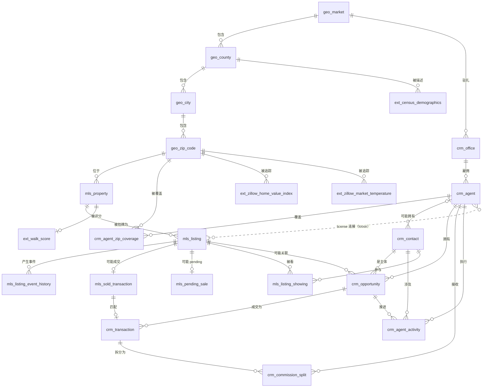

# Crestline 房地产经纪 — 市场情报原始数据 ER 文档

> 业务背景, 行业科普, 术语表请见 `01-real_estate_brokerage_market_intelligence_raw_data_high_business_context-cn.md`. 本文档只描述数据 (表, 字段, 约束, 生成规则, 业务陷阱, DDL).

## 数据集元数据

| 项 | 值 |
|----|----|
| 复杂度等级 | **High** |
| 表数 | 23 |
| 总记录数 | ~328,000 行 |
| FK 关系 | 19 个硬 FK + 6 个 nullable FK（`crm_contact.Owner_Agent_Id__c`、`crm_opportunity.Listing_Id__c`、`crm_transaction.Sold_Id__c`、`crm_agent_activity.Contact_Id__c`、`crm_agent_activity.Opportunity_Id__c`、`mls_listing_showing.Contact_Id__c`），外加 MLS↔CRM 之间不由 DDL 强制的松散 license/brokerage 连接 |
| REFERENCE_DATE（有效当前日期） | **2026-06-05**（与 generator 和 SQL 查询一致） |
| 时间窗口 | 2023-01-01 → 2026-06-05（约 3.4 年 / 42 月） |

> 设计依据全文与修订日志见 `real_estate_brokerage_market_intelligence_raw_data_high_design_decisions-cn.md`。

## 数据是如何"生长"出来的：从现实事件到数据库行

下面的 schema 不是随便定的 — 每张表都对应一个真实世界的事件或实体。这是贯穿表定义的因果链：

### MLS 域 — 公开市场记录

| 现实事件 | 产生的数据库行 |
|---|---|
| Palo Alto 123 Main St 这栋房子存在 | `mls_property`（一行，持久） |
| 房主 6 月 1 日决定挂牌 | `mls_listing`（新一行，状态=ACT） |
| Agent 把挂牌录入 MLS | `mls_listing_event_history`（event_type=STATUS_CHANGE，new_status=ACT） |
| 7 天后没 offer — agent 降价 5 万 | `mls_listing_event_history`（event_type=PRICE_CHANGE） |
| 一个买方 agent 带客户看房 | `mls_listing_showing`（每次看房一行） |
| 20 天后买家 offer 被接受 | `mls_listing` 状态翻 PND；`mls_listing_event_history` 记录翻转；`mls_pending_sale` 出现 |
| 35 天后 escrow 关闭 | `mls_listing` 状态翻 SLD；`mls_pending_sale` 行消失；`mls_sold_transaction` 出现 |
| 3 年后同一栋房子再次挂牌 | **新的** `mls_listing` 行，但 `mls_property` 还是同一行 |

MLS 域是**房地产市场的公开日记** — 每次状态变化、价格调整、看房，所有人都能看到。

### CRM 域 — Crestline 的私人工作空间

| 现实事件 | 产生的数据库行 |
|---|---|
| 陌生人走进 Crestline open house，留下邮箱 | `crm_contact`（Contact_Type=Lead） |
| Agent 第二天打电话跟进 | `crm_agent_activity`（Activity_Type=CALL） |
| 他说自己在买房，想要 94040 三居 180 万以下 | `crm_contact` 更新 `Preferred_*` 字段 |
| Agent 建立一条销售机会跟踪这个 lead | `crm_opportunity`（StageName=Lead, Type=Buyer） |
| Agent 发邮件推 4 套 listing | 4× `crm_agent_activity`（Activity_Type=EMAIL） |
| 客户看了其中 2 套 | 2× `crm_agent_activity`（Activity_Type=SHOWING），如果是 Crestline 自有 listing，同时产生 `mls_listing_showing` 行 |
| 客户喜欢一套，出 offer | `crm_opportunity` 推进到 StageName=Offer，然后 Under Contract |
| Offer 被接受，45 天后成交 | `crm_opportunity` → Closed Won；创建 `crm_transaction`；`crm_commission_split` 行 — agent 拿 3 万，公司拿 6 千 |
| 或者：贷款下不来 | `crm_opportunity` → Closed Lost；`Lost_Reason__c="Financing fell through"` |

CRM 域是**公司内部的漏斗** — 每个 contact、每次对话、每分 payout 都被追踪，agent 一个个的生产力故事都从这里浮现。

### 外部域 — 来自外部世界的 context

| 现实事件 | 产生的数据库行 |
|---|---|
| 每个月 Zillow 重新计算每个 zip 的 ZHVI | `ext_zillow_home_value_index` 每月每 zip 一行 |
| 每周 Freddie Mac 发布 PMMS 调查 | `ext_freddie_mac_mortgage_rate` 每周一行 |
| 每年 Census 更新 county 人口统计 | `ext_census_demographics` 每县每年一行 |
| 当 Crestline 录入新 property 时，抓一次 Walk Score | `ext_walk_score` 每个 property 一行 |

外部数据**变化得比 MLS/CRM 慢** — 月度、周度、年度 — 但它提供了让其他两个域能被解读的**分母和 context**。

### 三个域如何互锁

```
                  ┌──────────────────────────────┐
                  │  MLS（公开，全市场）          │
                  │  "城里每家经纪公司都在干什么？" │
                  └──────────────┬───────────────┘
                                 │ 共享 agent license + property ID
                                 ▼
   ┌─────────────────────────────────────────────────────┐
   │  CRM（私有，仅 Crestline）                            │
   │  "我们公司内部在干什么 —                              │
   │   谁在跟谁对接，哪些在成交？"                          │
   └─────────────────────┬───────────────────────────────┘
                         │ 按 zip + close 月份 + listing 关联
                         ▼
   ┌─────────────────────────────────────────────────────┐
   │  External（公开，宏观 context）                       │
   │  "以上所有事情发生时，                                │
   │   市场和宏观环境是怎样的？"                          │
   └─────────────────────────────────────────────────────┘
```

把三个域拉到一起，就把"原始运营数据"变成了**市场情报**。

---

## 范围和快照

- **地理**：3 个 market（Bay Area、SoCal、PNW），共 60 个 zip code（每个 market 约 20 个）。Zip code 预先打上温度标签（HOT / STABLE / COOL），驱动 days-on-market 和 sale-to-list ratio 的真实差异。
- **时间窗口**：2023-01-01 到 2026-06-05（3.4 年历史）。
- **有效"当前日期"**：2026-06-05。Schema 里所有"今天"/"当前 active"的语义都锚定到这一天。
- **Crestline 在这个范围里的份额**：60-zip 范围内所有 MLS listing 中 ~30% 是 Crestline 品牌的。其他 ~70% 是 8 家竞争对手。

---

## 数据集统计

- **表数**：23
- **总记录数**：~328,000 行
- **关系**：19 个硬 FK + 6 个 nullable FK（`crm_contact.Owner_Agent_Id__c`、`crm_opportunity.Listing_Id__c`、`crm_transaction.Sold_Id__c`、`crm_agent_activity.Contact_Id__c`、`crm_agent_activity.Opportunity_Id__c`、`mls_listing_showing.Contact_Id__c`）— 外加 MLS 和 CRM 之间的松散 license/brokerage 连接
- **特色**：通过 license 号码做 MLS↔CRM 耦合（Crestline 用不相交的 `DRE00001-200` 段，竞争对手用 `DRE9*`）；5 种 Crestline 经纪公司名拼写变体（让 dbt staging 有 fuzzy matching 工作）；通过 `mls_listing_showing` 提供买方需求信号

> 数据集刻意保持 **source-faithful**：MLS 风格字段命名（`LIST_PRICE`、`STATUS_CD`、`DOM`）、Salesforce 风格 custom field 后缀（`__c`、`LastModifiedDate`）、源系统状态 enum（`ACT` / `PND` / `SLD`），以及少量刻意制造的脏数据（ZIP+4 格式、近似重复 contact、经纪公司名拼写错）。目的是让下游清洗 / 标准化层有真实的脏活可干。

完整的设计依据和修订日志见 `..._design_decisions-cn.md`。

---

## ER 图



虚线 "license 连接" 表示**软 FK**：`mls_listing.LISTING_AGENT_LICENSE` 仅当 listing 是 Crestline 自有时（~30%）才能匹配 `crm_agent.License_Number__c`。非 Crestline listing 使用不相交的 `DRE9*` license 段，永远不会匹配到 Crestline agent。

---

## 表定义

### 地理参考维度

#### 1. `geo_market` — 顶层市场划分

| 字段 | 类型 | 约束 | 说明 |
|--------|------|-------------|-------------|
| market_id | INTEGER | PK | 代理键 |
| market_code | VARCHAR(10) | NOT NULL, UNIQUE | 短码（BAY、SOCAL、PNW） |
| market_name | VARCHAR(100) | NOT NULL | 全名 |
| state | VARCHAR(2) | NOT NULL | 主要 state |

**行数**：3

#### 2. `geo_county`

| 字段 | 类型 | 约束 | 说明 |
|--------|------|-------------|-------------|
| county_id | INTEGER | PK | 代理键 |
| county_name | VARCHAR(100) | NOT NULL | County 名 |
| state | VARCHAR(2) | NOT NULL | State |
| market_id | INTEGER | FK → geo_market | 所属 market |

**行数**：12

#### 3. `geo_city`

| 字段 | 类型 | 约束 | 说明 |
|--------|------|-------------|-------------|
| city_id | INTEGER | PK | 代理键 |
| city_name | VARCHAR(100) | NOT NULL | 城市名 |
| county_id | INTEGER | FK → geo_county | 所属 county |

**行数**：30

#### 4. `geo_zip_code`

| 字段 | 类型 | 约束 | 说明 |
|--------|------|-------------|-------------|
| zip_id | INTEGER | PK | 代理键 |
| zip5 | VARCHAR(5) | NOT NULL, UNIQUE | 5 位 ZIP |
| city_id | INTEGER | FK → geo_city | 所属城市 |
| temperature | VARCHAR(10) | NOT NULL | HOT、STABLE、COOL — 驱动 DOM/SLR 分布 |
| price_multiplier | FLOAT | NOT NULL | 本地价格水平相对 market 中位数 |

**行数**：60（每 market 20 个）。温度分布：18 HOT / 30 STABLE / 12 COOL。

---

### MLS 域（全市场源数据）

#### 5. `mls_property` — 物理房产实体

地址本身，跨多次挂牌持久存在。

| 字段 | 类型 | 约束 | 说明 |
|--------|------|-------------|-------------|
| PROPERTY_ID | INTEGER | PK | 源代理键 |
| STREET_NUM | VARCHAR(20) | NOT NULL | 门牌号 |
| STREET_NAME | VARCHAR(200) | NOT NULL | 街道名（~5% 有空白/大小写问题） |
| UNIT_NUM | VARCHAR(20) | NULL | 公寓单元号 |
| CITY | VARCHAR(100) | NOT NULL | 城市 |
| STATE | VARCHAR(2) | NOT NULL | State |
| ZIP | VARCHAR(10) | NOT NULL | ZIP（~5% ZIP+4 格式） |
| zip_id | INTEGER | FK → geo_zip_code | 解析后的 zip |
| PROPERTY_TYPE | VARCHAR(20) | NOT NULL | SFR、CONDO、TOWNHOUSE、MULTI_FAMILY |
| BED_COUNT | INTEGER | NOT NULL | 卧室数 |
| BATH_COUNT | FLOAT | NOT NULL | 浴室数（半浴室 = 0.5） |
| SQFT | INTEGER | NULL (~8%) | 居住面积 |
| LOT_SQFT | INTEGER | NULL（CONDO） | 占地面积 |
| YEAR_BUILT | INTEGER | NULL (~10%) | 建造年份 |
| HOA_FEE | FLOAT | NULL（SFR） | 月度 HOA 费（仅 CONDO/TOWNHOUSE） |
| GARAGE_SPACES | INTEGER | NULL (~5%) | 车位数 |
| CREATED_DT | DATETIME | NOT NULL | MLS 记录创建时间 |

**行数**：25,000

#### 6. `mls_listing` — 挂牌事件

| 字段 | 类型 | 约束 | 说明 |
|--------|------|-------------|-------------|
| LISTING_ID | INTEGER | PK | 代理键 |
| MLS_NUMBER | VARCHAR(20) | NOT NULL, UNIQUE | MLS 标识符 |
| PROPERTY_ID | INTEGER | FK → mls_property | 父 property |
| LIST_PRICE | FLOAT | NOT NULL | 初始挂牌价 |
| LIST_DT | DATE | NOT NULL | 挂牌日 |
| STATUS_CD | VARCHAR(5) | NOT NULL | ACT、PND、SLD、EXP、WTH |
| STATUS_DT | DATE | NOT NULL | 当前状态变更日 |
| DOM | INTEGER | NULL | 市场天数 |
| LISTING_AGENT_LICENSE | VARCHAR(20) | NOT NULL | DRE license。Crestline listing：`DRE{1-200:05d}`（匹配 `crm_agent.License_Number__c`）；竞争对手：`DRE9{nnnnn}`（不相交） |
| LISTING_OFFICE_NAME | VARCHAR(200) | NOT NULL | 经纪公司名。Crestline 变体：`Crestline Realty`、`Crestline Realty Inc`、`Crestline Realty LLC`、`CRESTLINE REALTY`、`Crestline  Realty`（5 种形态，~5% 拼写变化） |
| IS_CRESTLINE_LISTING | BOOLEAN | NOT NULL | 从 OFFICE_NAME 生成时派生出来的便利布尔字段（生产 dbt staging 会自己算这个） |
| PUBLIC_REMARKS | TEXT | NULL (~5%) | 公开描述 |

**行数**：40,000。~30%（12,118）是 Crestline；~70%（27,882）是竞争对手。

#### 7. `mls_listing_event_history` — 挂牌事件日志

记录价格变更 + 状态变更。

| 字段 | 类型 | 约束 | 说明 |
|--------|------|-------------|-------------|
| HISTORY_ID | INTEGER | PK | 代理键 |
| LISTING_ID | INTEGER | FK → mls_listing | 父 listing |
| EVENT_DT | DATE | NOT NULL | 事件日 |
| EVENT_TYPE | VARCHAR(20) | NOT NULL | PRICE_CHANGE 或 STATUS_CHANGE |
| OLD_PRICE | FLOAT | NULL | 前价 |
| NEW_PRICE | FLOAT | NULL | 新价 |
| OLD_STATUS | VARCHAR(5) | NULL | 前状态 |
| NEW_STATUS | VARCHAR(5) | NULL | 新状态 |

**行数**：65,000

#### 8. `mls_sold_transaction` — 已成交记录

包含 Crestline 和竞争对手的所有成交。

| 字段 | 类型 | 约束 | 说明 |
|--------|------|-------------|-------------|
| SOLD_ID | INTEGER | PK | 代理键 |
| LISTING_ID | INTEGER | FK → mls_listing | 成交的 listing |
| SALE_PRICE | FLOAT | NOT NULL | 最终成交价 |
| CLOSE_DT | DATE | NOT NULL | Escrow 关闭日 |
| LIST_TO_SALE_RATIO | FLOAT | NOT NULL | SALE / LIST。HOT zip ~1.04，COOL ~0.96 |
| BUYER_AGENT_LICENSE | VARCHAR(20) | NOT NULL | 买方 license（Crestline ~30%，竞争对手 ~70%） |
| LISTING_AGENT_LICENSE | VARCHAR(20) | NOT NULL | 卖方 license |
| FINANCING_TYPE | VARCHAR(20) | NOT NULL | CASH、CONVENTIONAL、FHA、VA、JUMBO |

**行数**：~24,800

#### 9. `mls_pending_sale` — 待过户房源快照

| 字段 | 类型 | 约束 | 说明 |
|--------|------|-------------|-------------|
| PENDING_ID | INTEGER | PK | 代理键 |
| LISTING_ID | INTEGER | FK → mls_listing | Pending listing |
| CONTRACT_DT | DATE | NOT NULL | 合同签订日 |
| EXPECTED_CLOSE_DT | DATE | NOT NULL | 预期关闭日 |
| CONTRACT_PRICE | FLOAT | NOT NULL | 协议价 |
| CONTINGENCIES | VARCHAR(200) | NULL | 分号分隔的 contingencies |

**行数**：~250（当前快照 — 合同在 2026-06-05 前 60 天内）

#### 10. `mls_listing_showing` — 每 listing 的看房事件

支持 Module 4 的买方需求信号聚合。

| 字段 | 类型 | 约束 | 说明 |
|--------|------|-------------|-------------|
| SHOWING_ID | INTEGER | PK | 代理键 |
| LISTING_ID | INTEGER | FK → mls_listing | 被看的 listing |
| Agent_License__c | VARCHAR(20) | NOT NULL | 看房 agent 的 license（对 Crestline 是松匹配） |
| Contact_Id__c | VARCHAR(20) | FK → crm_contact（nullable） | 参与人 — 仅当已知 Crestline contact 时设置 |
| SHOWING_DT | DATE | NOT NULL | 看房日 |
| Showing_Type__c | VARCHAR(20) | NOT NULL | PRIVATE、OPEN_HOUSE、VIRTUAL |
| Resulted_In_Offer__c | BOOLEAN | NOT NULL | 参与者是否出 offer |
| Notes__c | TEXT | NULL (~40%) | 看房 agent 笔记 |

**行数**：~72,000。HOT zip 平均每 listing 2.5 次看房，STABLE 1.5，COOL 0.6。

---

### CRM 域（仅 Crestline）

#### 11. `crm_office` — Crestline 办公地点

| 字段 | 类型 | 约束 | 说明 |
|--------|------|-------------|-------------|
| Id | VARCHAR(20) | PK | Salesforce 风格 Id |
| Name | VARCHAR(200) | NOT NULL | 办公室显示名 |
| Market_Id__c | INTEGER | FK → geo_market | 所属 market |
| Street__c, City__c, State__c, Zip__c | 各 | NOT NULL | 地址 |
| Opened_Date__c | DATE | NOT NULL | 开张日期 |

**行数**：8

#### 12. `crm_agent` — Crestline 持牌经纪人

| 字段 | 类型 | 约束 | 说明 |
|--------|------|-------------|-------------|
| Id | VARCHAR(20) | PK | Salesforce Id（`AGT00001`...） |
| License_Number__c | VARCHAR(20) | NOT NULL, UNIQUE | DRE license — **跨域 join key 到 `mls_listing.LISTING_AGENT_LICENSE`**（范围 `DRE00001`..`DRE00200`） |
| First_Name__c, Last_Name__c | VARCHAR(50) | NOT NULL | 姓名 |
| Email__c | VARCHAR(200) | NOT NULL | 工作邮箱 |
| Phone__c | VARCHAR(30) | NULL | 手机（格式不一） |
| Office_Id__c | VARCHAR(20) | FK → crm_office | 所属办公室 |
| Hire_Date__c | DATE | NOT NULL | 入职日 |
| Termination_Date__c | DATE | NULL | 离职日（inactive 时填） |
| Commission_Split_Pct__c | FLOAT | NOT NULL | Agent 分成（JUNIOR 0.65-0.72，MID 0.72-0.80，SENIOR 0.80-0.88） |
| Tier__c | VARCHAR(20) | NOT NULL | JUNIOR、MID、SENIOR |
| IsActive__c | BOOLEAN | NOT NULL | 当前是否 active |
| LastModifiedDate | DATETIME | NOT NULL | Salesforce 风格审计时间戳 |

**行数**：200

#### 13. `crm_agent_zip_coverage` — Agent 覆盖的 zip code

多对多 — 每个 agent 把哪些 zip 作为主要/次要 territory。

| 字段 | 类型 | 约束 | 说明 |
|--------|------|-------------|-------------|
| Id | VARCHAR(20) | PK | 关联 Id |
| Agent_Id__c | VARCHAR(20) | FK → crm_agent | Agent |
| Zip_Id__c | INTEGER | FK → geo_zip_code | 覆盖的 zip |
| Is_Primary__c | BOOLEAN | NOT NULL | 是否主要 territory |

**行数**：~500（平均每 agent 2.5 个 zip）

#### 14. `crm_contact` — Salesforce Contact 记录

买家、卖家、leads。包含直接挂在 Contact 上的买方偏好字段（Salesforce 标准做法）。

| 字段 | 类型 | 约束 | 说明 |
|--------|------|-------------|-------------|
| Id | VARCHAR(20) | PK | Salesforce Id |
| FirstName, LastName | VARCHAR(50) | NOT NULL | 姓名（~4% 有空白/大小写问题） |
| Email | VARCHAR(200) | NULL (~10%) | 邮箱（域名多样） |
| Phone | VARCHAR(30) | NULL (~5%) | 电话（格式多样） |
| Mailing_Street/City/State/Zip__c | 各 | NULL | 邮寄地址 |
| Contact_Type__c | VARCHAR(20) | NOT NULL | Buyer、Seller、Both、Lead |
| Lead_Source__c | VARCHAR(50) | NULL | Web、Referral、Open House、Cold Call、Repeat Client |
| **Preferred_Min_Price__c** | FLOAT | NULL | 最低预算（仅 Buyer/Both） |
| **Preferred_Max_Price__c** | FLOAT | NULL | 最高预算 |
| **Preferred_Bed_Count__c** | INTEGER | NULL | 偏好卧室数 |
| **Preferred_Zip__c** | VARCHAR(10) | NULL | 单一偏好 zip（~70%）或 NULL（开放） |
| **Preferred_Property_Type__c** | VARCHAR(20) | NULL | SFR、CONDO、TOWNHOUSE、MULTI_FAMILY、ANY |
| Owner_Agent_Id__c | VARCHAR(20) | FK → crm_agent（nullable ~5%） | 拥有 agent |
| CreatedDate | DATETIME | NOT NULL | 记录创建 |

**行数**：5,000。~3% 是近似重复（同 email、姓名不同拼写）。

#### 15. `crm_opportunity` — 销售管道机会

| 字段 | 类型 | 约束 | 说明 |
|--------|------|-------------|-------------|
| Id | VARCHAR(20) | PK | Salesforce Id |
| Name | VARCHAR(200) | NOT NULL | 机会名 |
| Contact_Id__c | VARCHAR(20) | FK → crm_contact | 客户 contact |
| Owner_Agent_Id__c | VARCHAR(20) | FK → crm_agent | 负责 agent |
| Opportunity_Type__c | VARCHAR(20) | NOT NULL | Buyer 或 Seller |
| StageName | VARCHAR(50) | NOT NULL | Lead、Qualified、Showing、Offer、Under Contract、**Closed Won、Closed Lost** |
| Amount | FLOAT | NULL | 预估金额 |
| CloseDate | DATE | NULL | 关闭日（Won/Lost 时设置） |
| Listing_Id__c | INTEGER | FK → mls_listing（nullable） | 关联的 Crestline 自有 listing |
| Lost_Reason__c | VARCHAR(100) | NULL | Closed Lost 时填 |
| CreatedDate | DATETIME | NOT NULL | 创建时间 |

**行数**：10,000。Stage 分布大致：Lead 10%、Qualified 15%、Showing 15%、Offer 10%、Under Contract 10%、Closed Won 25%、Closed Lost 15%。

#### 16. `crm_transaction` — Crestline 视角的成交

| 字段 | 类型 | 约束 | 说明 |
|--------|------|-------------|-------------|
| Id | VARCHAR(20) | PK | Salesforce Id |
| Opportunity_Id__c | VARCHAR(20) | FK → crm_opportunity | 源机会（Closed Won） |
| Sold_Id__c | INTEGER | FK → mls_sold_transaction（nullable） | 匹配的 MLS sold（仅 Crestline-listed） |
| Side__c | VARCHAR(10) | NOT NULL | BUYER 或 SELLER |
| Sale_Price__c | FLOAT | NOT NULL | 最终成交价 |
| Gross_Commission__c | FLOAT | NOT NULL | SALE × rate |
| Commission_Rate_Pct__c | FLOAT | NOT NULL | 2.5%-3.0% per side |
| Contract_Date__c, Close_Date__c | DATE | NOT NULL | 合同 / 关闭 |
| Earnest_Money__c | FLOAT | NULL | Earnest 定金 |
| CreatedDate | DATETIME | NOT NULL | 创建时间 |

**行数**：~2,500

#### 17. `crm_commission_split` — 佣金分配

| 字段 | 类型 | 约束 | 说明 |
|--------|------|-------------|-------------|
| Id | VARCHAR(20) | PK | 代理键 |
| Transaction_Id__c | VARCHAR(20) | FK → crm_transaction | 父交易 |
| Agent_Id__c | VARCHAR(20) | FK → crm_agent | 接收 agent |
| Split_Pct__c | FLOAT | NOT NULL | Agent 分成比例 |
| Agent_Take__c | FLOAT | NOT NULL | Agent 拿到的金额 |
| Company_Take__c | FLOAT | NOT NULL | 公司拿到的金额 |
| Payout_Date__c | DATE | NULL | Payout 日 |

**行数**：~2,700（每 txn 1 行 + ~10% co-list）

#### 18. `crm_agent_activity` — Agent 活动日志

| 字段 | 类型 | 约束 | 说明 |
|--------|------|-------------|-------------|
| Id | VARCHAR(20) | PK | 代理键 |
| Agent_Id__c | VARCHAR(20) | FK → crm_agent | 执行 agent |
| Contact_Id__c | VARCHAR(20) | FK → crm_contact（nullable ~10%） | 相关 contact |
| Opportunity_Id__c | VARCHAR(20) | FK → crm_opportunity（nullable ~40%） | 相关机会 |
| Activity_Type__c | VARCHAR(20) | NOT NULL | CALL、EMAIL、SHOWING、OPEN_HOUSE、MEETING、TEXT |
| Activity_Date__c | DATETIME | NOT NULL | 时间戳 |
| Duration_Minutes__c | INTEGER | NULL | 时长 |
| Notes__c | TEXT | NULL (~30%) | 笔记 |
| Outcome__c | VARCHAR(50) | NULL | 结果标签 |

**行数**：50,000。注：~10% 非空 `Opportunity_Id__c` 引用指向 Closed-Lost opp（按决策 2 — 软陈旧信号）。

---

### 外部数据域

#### 19. `ext_zillow_home_value_index` — 每月每 zip ZHVI

| 字段 | 类型 | 约束 | 说明 |
|--------|------|-------------|-------------|
| id | INTEGER | PK, AUTO | 代理键 |
| RegionName | VARCHAR(10) | NOT NULL | ZIP（Zillow 的列名） |
| zip_id | INTEGER | FK → geo_zip_code | 解析后 zip |
| Date | DATE | NOT NULL | 月初日 |
| ZHVI | FLOAT | NOT NULL | Home Value Index（$） |
| ZHVI_MoM_Pct | FLOAT | NULL（首月） | 月度环比 % |
| ZHVI_YoY_Pct | FLOAT | NULL（首年） | 同比 % |

**行数**：2,520（60 zip × 42 月）

#### 20. `ext_zillow_market_temperature` — 每月市场温度

派生指标 — Zillow 没有公开 API。

| 字段 | 类型 | 约束 | 说明 |
|--------|------|-------------|-------------|
| id | INTEGER | PK, AUTO | 代理键 |
| RegionName | VARCHAR(10) | NOT NULL | ZIP |
| zip_id | INTEGER | FK → geo_zip_code | 解析后 zip |
| Date | DATE | NOT NULL | 月初日 |
| Market_Temperature | VARCHAR(20) | NOT NULL | Very Hot、Hot、Warm、Neutral、Cool、Cold |
| Sale_to_List_Ratio | FLOAT | NOT NULL | 月度平均 SLR |
| Median_DOM | INTEGER | NOT NULL | 月度中位 DOM |

**行数**：2,520

#### 21. `ext_freddie_mac_mortgage_rate` — 每周 PMMS 利率

匹配真实 Freddie Mac 历史。

| 字段 | 类型 | 约束 | 说明 |
|--------|------|-------------|-------------|
| id | INTEGER | PK, AUTO | 代理键 |
| Week_End_Date | DATE | NOT NULL, UNIQUE | 周结束日 |
| Rate_30Y_Fixed | FLOAT | NOT NULL | 30 年利率 (%) — 2023-Jan 6.48 → 2023-Oct 峰值 7.79 → 2024+ ~6.5-6.95 |
| Rate_15Y_Fixed | FLOAT | NOT NULL | 15 年利率 (%) |
| Points_30Y | FLOAT | NOT NULL | 平均 points |

**行数**：179

#### 22. `ext_census_demographics` — 每年 county 数据

| 字段 | 类型 | 约束 | 说明 |
|--------|------|-------------|-------------|
| id | INTEGER | PK, AUTO | 代理键 |
| county_id | INTEGER | FK → geo_county | County |
| Year | INTEGER | NOT NULL | 公历年 |
| Population | INTEGER | NOT NULL | 人口估计 |
| Median_Household_Income | INTEGER | NOT NULL | 中位家庭收入（$） |
| Employment_Rate | FLOAT | NOT NULL | 就业率 |

**行数**：48（12 county × 4 年）

#### 23. `ext_walk_score`

| 字段 | 类型 | 约束 | 说明 |
|--------|------|-------------|-------------|
| id | INTEGER | PK, AUTO | 代理键 |
| PROPERTY_ID | INTEGER | FK → mls_property | 主体 property |
| Walk_Score, Transit_Score, Bike_Score | INTEGER | NOT NULL | 0-100 评分 |
| Score_Date | DATE | NOT NULL | 抓取日 |

**行数**：25,000

---

## 数据生成规则

### 业务逻辑约束

1. **时间顺序**：`LIST_DT ≤ EVENT_DT (所有 listing 事件) ≤ STATUS_DT`；`CONTRACT_DT ≤ CLOSE_DT`。
2. **引用完整性**：所有硬 FK 引用存在的 parent。Nullable FK（`Owner_Agent_Id__c`、activity 上的 `Contact_Id__c`、opportunity 上的 `Listing_Id__c`、transaction 上的 `Sold_Id__c`）反映真实 Salesforce 行为。
3. **按温度分层的 Sale-to-list ratio**：
   - HOT：N(1.04, σ=0.04)，截断 [0.80, 1.30]
   - STABLE：N(1.00, σ=0.03)
   - COOL：N(0.96, σ=0.04)
4. **DOM 分布**：LogNormal — 中位数 ~12（HOT）、~33（STABLE）、~67（COOL）天。
5. **Pareto 生产力**（对交易按 tenure 关联）：
   - 活动：`paretovariate(alpha=0.8)`，随机分配 — 顶部 quintile ~86% 的活动（强长尾，反映真实外联强度差异）
   - 机会/交易：`paretovariate(alpha=2.5)`，**按 tenure 加权**（`tenure_weighted_pareto`：tenure 最长 → 权重最高，15% rank-swap 噪声）— 顶部 quintile ~45% GCI，让 SENIOR agent 可靠出现在 Query 3 top 10
6. **宏观趋势**（匹配项目叙事）：
   - 2024 年成交量比 2023 下降 ~22%（利率冲击 + lock-in 效应）
   - 2025 部分复苏（+14% YoY）
   - 2026 H1 稳定
   - Mortgage 利率轨迹匹配真实 Freddie Mac PMMS 历史
7. **价格分层**：Bay Area > SoCal > PNW 中位成交价。
8. **佣金计算**：`Gross_Commission = Sale_Price × Commission_Rate_Pct / 100`；`Agent_Take = Gross_Commission × Split_Pct`。
9. **MLS-CRM 耦合**：
   - ~30% 的 MLS listing 在 `LISTING_OFFICE_NAME` 中带 Crestline 经纪公司变体
   - Crestline listing：`LISTING_AGENT_LICENSE` ∈ `crm_agent.License_Number__c`（`DRE00001`..`DRE00200`，Pareto 加权偏向 senior）
   - 竞争对手 listing：`LISTING_AGENT_LICENSE` ∈ 不相交段 `DRE9{nnnnn}` — 永远不会与 Crestline 碰撞
   - `crm_opportunity.Listing_Id__c` 和 `crm_transaction.Sold_Id__c` 只引用 Crestline 自有 listing/sales
10. **看房密度**：HOT zip ~2.5 次看房/listing，STABLE 1.5，COOL 0.6。

### 刻意脏数据

| 模式 | 比例 | 位置 |
|---------|------|----------|
| ZIP+4 格式 | ~5% | `mls_property.ZIP`、`crm_contact.Mailing_Zip__c` |
| NULL `Email` | ~10% | `crm_contact.Email` |
| NULL `Phone` | ~5% | `crm_contact.Phone` |
| 电话格式混杂 | 非空中 ~50% | `crm_contact.Phone`、`crm_agent.Phone__c` |
| NULL `SQFT` | ~8% | `mls_property.SQFT` |
| NULL `YEAR_BUILT` | ~10% | `mls_property.YEAR_BUILT` |
| 近似重复 contact | ~3% | `crm_contact` |
| 空白/大小写异常 | ~4-5% | `mls_property.STREET_NAME`、`crm_contact.FirstName` |
| Crestline 经纪公司名拼写变体 | ~5%（在 Crestline listing 中）— 4 种拼写变体：`Crestline Realty Inc`、`Crestline Realty LLC`、`CRESTLINE REALTY`、`Crestline  Realty`（双空格） | `mls_listing.LISTING_OFFICE_NAME` |
| NULL `PUBLIC_REMARKS` | ~5% | `mls_listing.PUBLIC_REMARKS` |
| Activity → Lost opp（软陈旧） | 非空中 ~10% | `crm_agent_activity.Opportunity_Id__c` |

### Faker 策略

| 字段模式 | Faker 方法 |
|---------------|--------------|
| 人名 | `fake.first_name()`、`fake.last_name()` |
| 街道名 | `fake.street_name()` |
| 邮箱 | 组合 `{first}.{last}{n}@{domain}` |
| 电话 | `fake.phone_number()` + 重格式化 |
| 日期 | `fake.date_between(start, end)` |
| 句子 | `fake.sentence(nb_words=...)` |
| Mortgage 利率 | 分段线性锚点 + N(0, 0.04) 噪声 |
| DOM | `random.lognormvariate(mu, sigma)` per temperature |
| Pareto（活动） | `random.paretovariate(alpha=0.8)` — 重尾，随机分配 |
| Pareto（机会/交易） | `random.paretovariate(alpha=2.5)` — 中等，**按 tenure 加权**（最长入职日得最高 Pareto rank，15% rank-swap 噪声） |

---

## 文件清单

| # | 文件名 | 表 | 行数 |
|---|----------|-------|------|
| 01 | 01_geo_market.tsv | geo_market | 3 |
| 02 | 02_geo_county.tsv | geo_county | 12 |
| 03 | 03_geo_city.tsv | geo_city | 30 |
| 04 | 04_geo_zip_code.tsv | geo_zip_code | 60 |
| 05 | 05_crm_office.tsv | crm_office | 8 |
| 06 | 06_crm_agent.tsv | crm_agent | 200 |
| 07 | 07_crm_agent_zip_coverage.tsv | crm_agent_zip_coverage | ~500 |
| 08 | 08_crm_contact.tsv | crm_contact | 5,000 |
| 09 | 09_mls_property.tsv | mls_property | 25,000 |
| 10 | 10_mls_listing.tsv | mls_listing | 40,000 |
| 11 | 11_mls_listing_event_history.tsv | mls_listing_event_history | 65,000 |
| 12 | 12_mls_sold_transaction.tsv | mls_sold_transaction | ~24,800 |
| 13 | 13_mls_pending_sale.tsv | mls_pending_sale | ~250 |
| 14 | 14_mls_listing_showing.tsv | mls_listing_showing | ~72,000 |
| 15 | 15_crm_opportunity.tsv | crm_opportunity | 10,000 |
| 16 | 16_crm_transaction.tsv | crm_transaction | ~2,500 |
| 17 | 17_crm_commission_split.tsv | crm_commission_split | ~2,700 |
| 18 | 18_crm_agent_activity.tsv | crm_agent_activity | 50,000 |
| 19 | 19_ext_zillow_home_value_index.tsv | ext_zillow_home_value_index | 2,520 |
| 20 | 20_ext_zillow_market_temperature.tsv | ext_zillow_market_temperature | 2,520 |
| 21 | 21_ext_freddie_mac_mortgage_rate.tsv | ext_freddie_mac_mortgage_rate | 179 |
| 22 | 22_ext_census_demographics.tsv | ext_census_demographics | 48 |
| 23 | 23_ext_walk_score.tsv | ext_walk_score | 25,000 |
| | | **总计** | **~328,000** |

---

## SQLite DDL

下面是 23 张表按拓扑顺序（FK 依赖在前）的 `CREATE TABLE` 语句，可直接粘进 SQLite shell 运行。由 generator 的 SQLAlchemy ORM 模型派生，字段、类型、约束与上面的表定义一一对应。松散的 license/brokerage 跨域连接**不**在 DDL 里强制（见数据生成规则）。

```sql
CREATE TABLE geo_market (
    market_id INTEGER PRIMARY KEY,
    market_code VARCHAR(10) NOT NULL UNIQUE,
    market_name VARCHAR(100) NOT NULL,
    state VARCHAR(2) NOT NULL
);

CREATE TABLE geo_county (
    county_id INTEGER PRIMARY KEY,
    county_name VARCHAR(100) NOT NULL,
    state VARCHAR(2) NOT NULL,
    market_id INTEGER NOT NULL REFERENCES geo_market(market_id)
);

CREATE TABLE geo_city (
    city_id INTEGER PRIMARY KEY,
    city_name VARCHAR(100) NOT NULL,
    county_id INTEGER NOT NULL REFERENCES geo_county(county_id)
);

CREATE TABLE geo_zip_code (
    zip_id INTEGER PRIMARY KEY,
    zip5 VARCHAR(5) NOT NULL UNIQUE,
    city_id INTEGER NOT NULL REFERENCES geo_city(city_id),
    temperature VARCHAR(10) NOT NULL,
    price_multiplier FLOAT NOT NULL
);

CREATE TABLE crm_office (
    Id VARCHAR(20) PRIMARY KEY,
    Name VARCHAR(200) NOT NULL,
    Market_Id__c INTEGER NOT NULL REFERENCES geo_market(market_id),
    Street__c VARCHAR(200) NOT NULL,
    City__c VARCHAR(100) NOT NULL,
    State__c VARCHAR(2) NOT NULL,
    Zip__c VARCHAR(10) NOT NULL,
    Opened_Date__c DATE NOT NULL
);

CREATE TABLE crm_agent (
    Id VARCHAR(20) PRIMARY KEY,
    License_Number__c VARCHAR(20) NOT NULL UNIQUE,
    First_Name__c VARCHAR(50) NOT NULL,
    Last_Name__c VARCHAR(50) NOT NULL,
    Email__c VARCHAR(200) NOT NULL,
    Phone__c VARCHAR(30),
    Office_Id__c VARCHAR(20) NOT NULL REFERENCES crm_office(Id),
    Hire_Date__c DATE NOT NULL,
    Termination_Date__c DATE,
    Commission_Split_Pct__c FLOAT NOT NULL,
    Tier__c VARCHAR(20) NOT NULL,
    IsActive__c BOOLEAN NOT NULL,
    LastModifiedDate DATETIME NOT NULL
);

CREATE TABLE crm_agent_zip_coverage (
    Id VARCHAR(20) PRIMARY KEY,
    Agent_Id__c VARCHAR(20) NOT NULL REFERENCES crm_agent(Id),
    Zip_Id__c INTEGER NOT NULL REFERENCES geo_zip_code(zip_id),
    Is_Primary__c BOOLEAN NOT NULL
);

CREATE TABLE crm_contact (
    Id VARCHAR(20) PRIMARY KEY,
    FirstName VARCHAR(50) NOT NULL,
    LastName VARCHAR(50) NOT NULL,
    Email VARCHAR(200),
    Phone VARCHAR(30),
    Mailing_Street__c VARCHAR(200),
    Mailing_City__c VARCHAR(100),
    Mailing_State__c VARCHAR(2),
    Mailing_Zip__c VARCHAR(10),
    Contact_Type__c VARCHAR(20) NOT NULL,
    Lead_Source__c VARCHAR(50),
    Preferred_Min_Price__c FLOAT,
    Preferred_Max_Price__c FLOAT,
    Preferred_Bed_Count__c INTEGER,
    Preferred_Zip__c VARCHAR(10),
    Preferred_Property_Type__c VARCHAR(20),
    Owner_Agent_Id__c VARCHAR(20) REFERENCES crm_agent(Id),
    CreatedDate DATETIME NOT NULL
);

CREATE TABLE mls_property (
    PROPERTY_ID INTEGER PRIMARY KEY,
    STREET_NUM VARCHAR(20) NOT NULL,
    STREET_NAME VARCHAR(200) NOT NULL,
    UNIT_NUM VARCHAR(20),
    CITY VARCHAR(100) NOT NULL,
    STATE VARCHAR(2) NOT NULL,
    ZIP VARCHAR(10) NOT NULL,
    zip_id INTEGER NOT NULL REFERENCES geo_zip_code(zip_id),
    PROPERTY_TYPE VARCHAR(20) NOT NULL,
    BED_COUNT INTEGER NOT NULL,
    BATH_COUNT FLOAT NOT NULL,
    SQFT INTEGER,
    LOT_SQFT INTEGER,
    YEAR_BUILT INTEGER,
    HOA_FEE FLOAT,
    GARAGE_SPACES INTEGER,
    CREATED_DT DATETIME NOT NULL
);

CREATE TABLE mls_listing (
    LISTING_ID INTEGER PRIMARY KEY,
    MLS_NUMBER VARCHAR(20) NOT NULL UNIQUE,
    PROPERTY_ID INTEGER NOT NULL REFERENCES mls_property(PROPERTY_ID),
    LIST_PRICE FLOAT NOT NULL,
    LIST_DT DATE NOT NULL,
    STATUS_CD VARCHAR(5) NOT NULL,
    STATUS_DT DATE NOT NULL,
    DOM INTEGER,
    LISTING_AGENT_LICENSE VARCHAR(20) NOT NULL,
    LISTING_OFFICE_NAME VARCHAR(200) NOT NULL,
    IS_CRESTLINE_LISTING BOOLEAN NOT NULL,
    PUBLIC_REMARKS TEXT
);

CREATE TABLE mls_listing_event_history (
    HISTORY_ID INTEGER PRIMARY KEY,
    LISTING_ID INTEGER NOT NULL REFERENCES mls_listing(LISTING_ID),
    EVENT_DT DATE NOT NULL,
    EVENT_TYPE VARCHAR(20) NOT NULL,
    OLD_PRICE FLOAT,
    NEW_PRICE FLOAT,
    OLD_STATUS VARCHAR(5),
    NEW_STATUS VARCHAR(5)
);

CREATE TABLE mls_sold_transaction (
    SOLD_ID INTEGER PRIMARY KEY,
    LISTING_ID INTEGER NOT NULL REFERENCES mls_listing(LISTING_ID),
    SALE_PRICE FLOAT NOT NULL,
    CLOSE_DT DATE NOT NULL,
    LIST_TO_SALE_RATIO FLOAT NOT NULL,
    BUYER_AGENT_LICENSE VARCHAR(20) NOT NULL,
    LISTING_AGENT_LICENSE VARCHAR(20) NOT NULL,
    FINANCING_TYPE VARCHAR(20) NOT NULL
);

CREATE TABLE mls_pending_sale (
    PENDING_ID INTEGER PRIMARY KEY,
    LISTING_ID INTEGER NOT NULL REFERENCES mls_listing(LISTING_ID),
    CONTRACT_DT DATE NOT NULL,
    EXPECTED_CLOSE_DT DATE NOT NULL,
    CONTRACT_PRICE FLOAT NOT NULL,
    CONTINGENCIES VARCHAR(200)
);

CREATE TABLE mls_listing_showing (
    SHOWING_ID INTEGER PRIMARY KEY,
    LISTING_ID INTEGER NOT NULL REFERENCES mls_listing(LISTING_ID),
    Agent_License__c VARCHAR(20) NOT NULL,
    Contact_Id__c VARCHAR(20) REFERENCES crm_contact(Id),
    SHOWING_DT DATE NOT NULL,
    Showing_Type__c VARCHAR(20) NOT NULL,
    Resulted_In_Offer__c BOOLEAN NOT NULL,
    Notes__c TEXT
);

CREATE TABLE crm_opportunity (
    Id VARCHAR(20) PRIMARY KEY,
    Name VARCHAR(200) NOT NULL,
    Contact_Id__c VARCHAR(20) NOT NULL REFERENCES crm_contact(Id),
    Owner_Agent_Id__c VARCHAR(20) NOT NULL REFERENCES crm_agent(Id),
    Opportunity_Type__c VARCHAR(20) NOT NULL,
    StageName VARCHAR(50) NOT NULL,
    Amount FLOAT,
    CloseDate DATE,
    Listing_Id__c INTEGER REFERENCES mls_listing(LISTING_ID),
    Lost_Reason__c VARCHAR(100),
    CreatedDate DATETIME NOT NULL
);

CREATE TABLE crm_transaction (
    Id VARCHAR(20) PRIMARY KEY,
    Opportunity_Id__c VARCHAR(20) NOT NULL REFERENCES crm_opportunity(Id),
    Sold_Id__c INTEGER REFERENCES mls_sold_transaction(SOLD_ID),
    Side__c VARCHAR(10) NOT NULL,
    Sale_Price__c FLOAT NOT NULL,
    Gross_Commission__c FLOAT NOT NULL,
    Commission_Rate_Pct__c FLOAT NOT NULL,
    Contract_Date__c DATE NOT NULL,
    Close_Date__c DATE NOT NULL,
    Earnest_Money__c FLOAT,
    CreatedDate DATETIME NOT NULL
);

CREATE TABLE crm_commission_split (
    Id VARCHAR(20) PRIMARY KEY,
    Transaction_Id__c VARCHAR(20) NOT NULL REFERENCES crm_transaction(Id),
    Agent_Id__c VARCHAR(20) NOT NULL REFERENCES crm_agent(Id),
    Split_Pct__c FLOAT NOT NULL,
    Agent_Take__c FLOAT NOT NULL,
    Company_Take__c FLOAT NOT NULL,
    Payout_Date__c DATE
);

CREATE TABLE crm_agent_activity (
    Id VARCHAR(20) PRIMARY KEY,
    Agent_Id__c VARCHAR(20) NOT NULL REFERENCES crm_agent(Id),
    Contact_Id__c VARCHAR(20) REFERENCES crm_contact(Id),
    Opportunity_Id__c VARCHAR(20) REFERENCES crm_opportunity(Id),
    Activity_Type__c VARCHAR(20) NOT NULL,
    Activity_Date__c DATETIME NOT NULL,
    Duration_Minutes__c INTEGER,
    Notes__c TEXT,
    Outcome__c VARCHAR(50)
);

CREATE TABLE ext_zillow_home_value_index (
    id INTEGER PRIMARY KEY AUTOINCREMENT,
    RegionName VARCHAR(10) NOT NULL,
    zip_id INTEGER NOT NULL REFERENCES geo_zip_code(zip_id),
    Date DATE NOT NULL,
    ZHVI FLOAT NOT NULL,
    ZHVI_MoM_Pct FLOAT,
    ZHVI_YoY_Pct FLOAT
);

CREATE TABLE ext_zillow_market_temperature (
    id INTEGER PRIMARY KEY AUTOINCREMENT,
    RegionName VARCHAR(10) NOT NULL,
    zip_id INTEGER NOT NULL REFERENCES geo_zip_code(zip_id),
    Date DATE NOT NULL,
    Market_Temperature VARCHAR(20) NOT NULL,
    Sale_to_List_Ratio FLOAT NOT NULL,
    Median_DOM INTEGER NOT NULL
);

CREATE TABLE ext_freddie_mac_mortgage_rate (
    id INTEGER PRIMARY KEY AUTOINCREMENT,
    Week_End_Date DATE NOT NULL UNIQUE,
    Rate_30Y_Fixed FLOAT NOT NULL,
    Rate_15Y_Fixed FLOAT NOT NULL,
    Points_30Y FLOAT NOT NULL
);

CREATE TABLE ext_census_demographics (
    id INTEGER PRIMARY KEY AUTOINCREMENT,
    county_id INTEGER NOT NULL REFERENCES geo_county(county_id),
    Year INTEGER NOT NULL,
    Population INTEGER NOT NULL,
    Median_Household_Income INTEGER NOT NULL,
    Employment_Rate FLOAT NOT NULL
);

CREATE TABLE ext_walk_score (
    id INTEGER PRIMARY KEY AUTOINCREMENT,
    PROPERTY_ID INTEGER NOT NULL REFERENCES mls_property(PROPERTY_ID),
    Walk_Score INTEGER NOT NULL,
    Transit_Score INTEGER NOT NULL,
    Bike_Score INTEGER NOT NULL,
    Score_Date DATE NOT NULL
);
```
