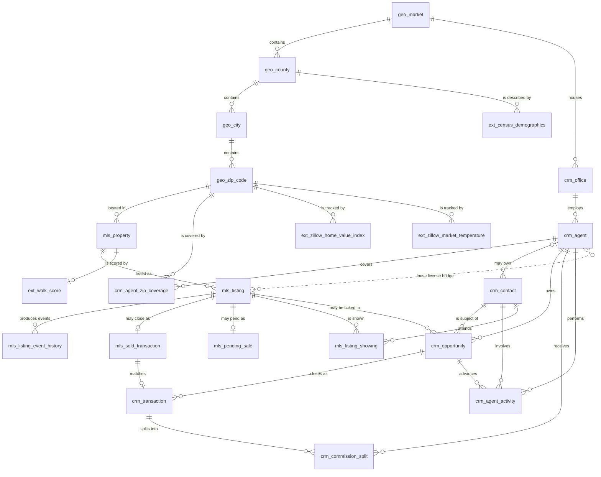

# Crestline Realty — Market Intelligence Raw Data: ER Document

> For business context, industry primer, and glossary, see `01-real_estate_brokerage_market_intelligence_raw_data_high_business_context.md`. This document focuses only on the data itself (tables, fields, constraints, generation rules, business traps, DDL).

## Dataset Metadata

| Item | Value |
|------|-------|
| Complexity tier | **High** |
| Number of tables | 23 |
| Total record count | ~328,000 rows |
| FK relationships | 19 hard FKs + 6 nullable FKs (`crm_contact.Owner_Agent_Id__c`, `crm_opportunity.Listing_Id__c`, `crm_transaction.Sold_Id__c`, `crm_agent_activity.Contact_Id__c`, `crm_agent_activity.Opportunity_Id__c`, `mls_listing_showing.Contact_Id__c`), plus a loose license/brokerage bridge between MLS and CRM that is **not** enforced in DDL |
| REFERENCE_DATE (the effective "today") | **2026-06-05** (matches the generator and the SQL queries) |
| Time window | 2023-01-01 → 2026-06-05 (about 3.4 years / 42 months) |

> The full design rationale and revision log live in `real_estate_brokerage_market_intelligence_raw_data_high_design_decisions-cn.md`.

## How the Data "Grows": From Real-World Events to Database Rows

The schema below is not arbitrary — every table corresponds to a real-world event or entity. This is the causal chain that runs through the table definitions:

### MLS domain — public market records

| Real-world event | Database row(s) it produces |
|---|---|
| The house at 123 Main St, Palo Alto exists | `mls_property` (one row, persistent) |
| Homeowner decides on June 1 to put it on the market | `mls_listing` (new row, status=ACT) |
| Agent enters the listing into the MLS | `mls_listing_event_history` (event_type=STATUS_CHANGE, new_status=ACT) |
| 7 days pass with no offer — agent cuts the price by $50K | `mls_listing_event_history` (event_type=PRICE_CHANGE) |
| A buyer agent brings a client to see the home | `mls_listing_showing` (one row per showing) |
| 20 days in, the buyer's offer is accepted | `mls_listing` status flips to PND; `mls_listing_event_history` logs the flip; `mls_pending_sale` row appears |
| 35 days later, escrow closes | `mls_listing` status flips to SLD; `mls_pending_sale` row disappears; `mls_sold_transaction` row appears |
| 3 years later, the same home gets relisted | A **new** `mls_listing` row, but the same `mls_property` row |

The MLS domain is **the public diary of the real estate market** — every status change, every price adjustment, every showing is visible to everyone.

### CRM domain — Crestline's private workspace

| Real-world event | Database row(s) it produces |
|---|---|
| A stranger walks into a Crestline open house and leaves their email | `crm_contact` (Contact_Type=Lead) |
| Agent calls them back the next day | `crm_agent_activity` (Activity_Type=CALL) |
| They mention they're buying — looking for a 3BR in 94040 under $1.8M | `crm_contact` updated with `Preferred_*` fields |
| Agent opens a sales opportunity to track this lead | `crm_opportunity` (StageName=Lead, Type=Buyer) |
| Agent emails 4 listings to the client | 4× `crm_agent_activity` (Activity_Type=EMAIL) |
| Client tours 2 of them | 2× `crm_agent_activity` (Activity_Type=SHOWING); if those are Crestline-owned listings, this also produces an `mls_listing_showing` row |
| Client likes one and makes an offer | `crm_opportunity` advances to StageName=Offer, then Under Contract |
| Offer accepted, closes 45 days later | `crm_opportunity` → Closed Won; `crm_transaction` created; `crm_commission_split` rows — agent keeps $30K, company keeps $6K |
| Or: financing falls through | `crm_opportunity` → Closed Lost; `Lost_Reason__c="Financing fell through"` |

The CRM domain is **the company's internal funnel** — every contact, every conversation, every payout dollar is tracked. The story of each agent's productivity emerges from this domain.

### External domain — context from the outside world

| Real-world event | Database row(s) it produces |
|---|---|
| Each month Zillow recomputes ZHVI for every zip | `ext_zillow_home_value_index` — one row per zip per month |
| Each week Freddie Mac publishes the PMMS survey | `ext_freddie_mac_mortgage_rate` — one row per week |
| Each year the Census updates county-level demographics | `ext_census_demographics` — one row per county per year |
| When Crestline first registers a new property, the Walk Score is fetched | `ext_walk_score` — one row per property |

External data **changes more slowly than MLS/CRM** — monthly, weekly, yearly — but it provides the **denominator and context** that allow the other two domains to be interpreted.

### How the three domains interlock

```
                  ┌──────────────────────────────┐
                  │  MLS (public, market-wide)    │
                  │  "What is every brokerage     │
                  │   in town doing?"             │
                  └──────────────┬───────────────┘
                                 │ Shared agent license + property ID
                                 ▼
   ┌─────────────────────────────────────────────────────┐
   │  CRM (private, Crestline-only)                       │
   │  "What is happening inside our company —             │
   │   who is talking to whom, what is closing?"          │
   └─────────────────────┬───────────────────────────────┘
                         │ Joined on zip + close month + listing
                         ▼
   ┌─────────────────────────────────────────────────────┐
   │  External (public, macro context)                    │
   │  "While all of the above was happening,              │
   │   what did the market and macro look like?"          │
   └─────────────────────────────────────────────────────┘
```

Bringing all three domains together turns "raw operational data" into **market intelligence**.

---

## Scope and Snapshot

- **Geography**: 3 markets (Bay Area, SoCal, PNW), 60 zip codes total (~20 per market). Each zip is pre-tagged with a temperature (HOT / STABLE / COOL), which drives realistic differences in days-on-market and sale-to-list ratio.
- **Time window**: 2023-01-01 to 2026-06-05 (3.4 years of history).
- **Effective "today"**: 2026-06-05. Every "today" / "currently active" semantic in the schema is anchored to this date.
- **Crestline's share within this scope**: of all MLS listings in the 60-zip footprint, ~30% are Crestline-branded. The remaining ~70% are from 8 competitors.

---

## Dataset Statistics

- **Number of tables**: 23
- **Total record count**: ~328,000 rows
- **Relationships**: 19 hard FKs + 6 nullable FKs (`crm_contact.Owner_Agent_Id__c`, `crm_opportunity.Listing_Id__c`, `crm_transaction.Sold_Id__c`, `crm_agent_activity.Contact_Id__c`, `crm_agent_activity.Opportunity_Id__c`, `mls_listing_showing.Contact_Id__c`) — plus a loose license/brokerage bridge between MLS and CRM
- **Highlights**: MLS↔CRM coupling via license number (Crestline uses the disjoint `DRE00001-200` range, competitors use `DRE9*`); 5 spelling variants of the Crestline brokerage name (so dbt staging has real fuzzy-matching work to do); buyer-demand signal exposed via `mls_listing_showing`

> The dataset is deliberately **source-faithful**: MLS-style field names (`LIST_PRICE`, `STATUS_CD`, `DOM`), Salesforce-style custom field suffixes (`__c`, `LastModifiedDate`), source-system status enums (`ACT` / `PND` / `SLD`), and a small amount of deliberately injected dirty data (ZIP+4 formatting, near-duplicate contacts, brokerage-name misspellings). The point is to give the downstream cleaning / standardization layer real work to do.

The full design rationale and revision log live in `..._design_decisions-cn.md`.

---

## ER Diagram



The dashed "license bridge" represents a **soft FK**: `mls_listing.LISTING_AGENT_LICENSE` only joins to `crm_agent.License_Number__c` when the listing is Crestline-owned (~30%). Non-Crestline listings use the disjoint `DRE9*` range and will never match a Crestline agent.

---

## Table Definitions

### Geographic reference dimensions

#### 1. `geo_market` — top-level market division

| Field | Type | Constraint | Description |
|--------|------|-------------|-------------|
| market_id | INTEGER | PK | Surrogate key |
| market_code | VARCHAR(10) | NOT NULL, UNIQUE | Short code (BAY, SOCAL, PNW) |
| market_name | VARCHAR(100) | NOT NULL | Full name |
| state | VARCHAR(2) | NOT NULL | Primary state |

**Rows**: 3

#### 2. `geo_county`

| Field | Type | Constraint | Description |
|--------|------|-------------|-------------|
| county_id | INTEGER | PK | Surrogate key |
| county_name | VARCHAR(100) | NOT NULL | County name |
| state | VARCHAR(2) | NOT NULL | State |
| market_id | INTEGER | FK → geo_market | Owning market |

**Rows**: 12

#### 3. `geo_city`

| Field | Type | Constraint | Description |
|--------|------|-------------|-------------|
| city_id | INTEGER | PK | Surrogate key |
| city_name | VARCHAR(100) | NOT NULL | City name |
| county_id | INTEGER | FK → geo_county | Owning county |

**Rows**: 30

#### 4. `geo_zip_code`

| Field | Type | Constraint | Description |
|--------|------|-------------|-------------|
| zip_id | INTEGER | PK | Surrogate key |
| zip5 | VARCHAR(5) | NOT NULL, UNIQUE | 5-digit ZIP |
| city_id | INTEGER | FK → geo_city | Owning city |
| temperature | VARCHAR(10) | NOT NULL | HOT, STABLE, COOL — drives DOM/SLR distributions |
| price_multiplier | FLOAT | NOT NULL | Local price level relative to the market median |

**Rows**: 60 (20 per market). Temperature distribution: 18 HOT / 30 STABLE / 12 COOL.

---

### MLS domain (market-wide source data)

#### 5. `mls_property` — physical property entity

The address itself, persistent across multiple listings.

| Field | Type | Constraint | Description |
|--------|------|-------------|-------------|
| PROPERTY_ID | INTEGER | PK | Source surrogate key |
| STREET_NUM | VARCHAR(20) | NOT NULL | House number |
| STREET_NAME | VARCHAR(200) | NOT NULL | Street name (~5% with whitespace/casing issues) |
| UNIT_NUM | VARCHAR(20) | NULL | Unit number |
| CITY | VARCHAR(100) | NOT NULL | City |
| STATE | VARCHAR(2) | NOT NULL | State |
| ZIP | VARCHAR(10) | NOT NULL | ZIP (~5% in ZIP+4 format) |
| zip_id | INTEGER | FK → geo_zip_code | Resolved zip |
| PROPERTY_TYPE | VARCHAR(20) | NOT NULL | SFR, CONDO, TOWNHOUSE, MULTI_FAMILY |
| BED_COUNT | INTEGER | NOT NULL | Number of bedrooms |
| BATH_COUNT | FLOAT | NOT NULL | Number of bathrooms (half bath = 0.5) |
| SQFT | INTEGER | NULL (~8%) | Living square footage |
| LOT_SQFT | INTEGER | NULL (CONDO) | Lot size |
| YEAR_BUILT | INTEGER | NULL (~10%) | Year built |
| HOA_FEE | FLOAT | NULL (SFR) | Monthly HOA fee (CONDO/TOWNHOUSE only) |
| GARAGE_SPACES | INTEGER | NULL (~5%) | Garage spaces |
| CREATED_DT | DATETIME | NOT NULL | When the MLS record was created |

**Rows**: 25,000

#### 6. `mls_listing` — listing events

| Field | Type | Constraint | Description |
|--------|------|-------------|-------------|
| LISTING_ID | INTEGER | PK | Surrogate key |
| MLS_NUMBER | VARCHAR(20) | NOT NULL, UNIQUE | MLS identifier |
| PROPERTY_ID | INTEGER | FK → mls_property | Parent property |
| LIST_PRICE | FLOAT | NOT NULL | Initial list price |
| LIST_DT | DATE | NOT NULL | Listing date |
| STATUS_CD | VARCHAR(5) | NOT NULL | ACT, PND, SLD, EXP, WTH |
| STATUS_DT | DATE | NOT NULL | Date of the current status change |
| DOM | INTEGER | NULL | Days on market |
| LISTING_AGENT_LICENSE | VARCHAR(20) | NOT NULL | DRE license. Crestline listings: `DRE{1-200:05d}` (matches `crm_agent.License_Number__c`); competitors: `DRE9{nnnnn}` (disjoint) |
| LISTING_OFFICE_NAME | VARCHAR(200) | NOT NULL | Brokerage name. Crestline variants: `Crestline Realty`, `Crestline Realty Inc`, `Crestline Realty LLC`, `CRESTLINE REALTY`, `Crestline  Realty` (5 forms, ~5% spelling variation) |
| IS_CRESTLINE_LISTING | BOOLEAN | NOT NULL | Convenience boolean derived from OFFICE_NAME during generation (production dbt staging will recompute this itself) |
| PUBLIC_REMARKS | TEXT | NULL (~5%) | Public description |

**Rows**: 40,000. ~30% (12,118) are Crestline; ~70% (27,882) are competitors.

#### 7. `mls_listing_event_history` — listing event log

Records both price changes and status changes.

| Field | Type | Constraint | Description |
|--------|------|-------------|-------------|
| HISTORY_ID | INTEGER | PK | Surrogate key |
| LISTING_ID | INTEGER | FK → mls_listing | Parent listing |
| EVENT_DT | DATE | NOT NULL | Event date |
| EVENT_TYPE | VARCHAR(20) | NOT NULL | PRICE_CHANGE or STATUS_CHANGE |
| OLD_PRICE | FLOAT | NULL | Previous price |
| NEW_PRICE | FLOAT | NULL | New price |
| OLD_STATUS | VARCHAR(5) | NULL | Previous status |
| NEW_STATUS | VARCHAR(5) | NULL | New status |

**Rows**: 65,000

#### 8. `mls_sold_transaction` — closed sales

Includes closes from both Crestline and competitors.

| Field | Type | Constraint | Description |
|--------|------|-------------|-------------|
| SOLD_ID | INTEGER | PK | Surrogate key |
| LISTING_ID | INTEGER | FK → mls_listing | The closed listing |
| SALE_PRICE | FLOAT | NOT NULL | Final sale price |
| CLOSE_DT | DATE | NOT NULL | Escrow close date |
| LIST_TO_SALE_RATIO | FLOAT | NOT NULL | SALE / LIST. HOT zip ~1.04, COOL ~0.96 |
| BUYER_AGENT_LICENSE | VARCHAR(20) | NOT NULL | Buyer license (Crestline ~30%, competitor ~70%) |
| LISTING_AGENT_LICENSE | VARCHAR(20) | NOT NULL | Listing license |
| FINANCING_TYPE | VARCHAR(20) | NOT NULL | CASH, CONVENTIONAL, FHA, VA, JUMBO |

**Rows**: ~24,800

#### 9. `mls_pending_sale` — pending-sale snapshot

| Field | Type | Constraint | Description |
|--------|------|-------------|-------------|
| PENDING_ID | INTEGER | PK | Surrogate key |
| LISTING_ID | INTEGER | FK → mls_listing | Pending listing |
| CONTRACT_DT | DATE | NOT NULL | Contract signed date |
| EXPECTED_CLOSE_DT | DATE | NOT NULL | Expected close date |
| CONTRACT_PRICE | FLOAT | NOT NULL | Contract price |
| CONTINGENCIES | VARCHAR(200) | NULL | Semicolon-separated list of contingencies |

**Rows**: ~250 (current snapshot — contracts signed within 60 days before 2026-06-05)

#### 10. `mls_listing_showing` — per-listing showing events

Supports the buyer-demand signal aggregation used by Module 4.

| Field | Type | Constraint | Description |
|--------|------|-------------|-------------|
| SHOWING_ID | INTEGER | PK | Surrogate key |
| LISTING_ID | INTEGER | FK → mls_listing | Shown listing |
| Agent_License__c | VARCHAR(20) | NOT NULL | License of the showing agent (loose match for Crestline) |
| Contact_Id__c | VARCHAR(20) | FK → crm_contact (nullable) | Attendee — only set when the attendee is a known Crestline contact |
| SHOWING_DT | DATE | NOT NULL | Showing date |
| Showing_Type__c | VARCHAR(20) | NOT NULL | PRIVATE, OPEN_HOUSE, VIRTUAL |
| Resulted_In_Offer__c | BOOLEAN | NOT NULL | Whether the attendee made an offer |
| Notes__c | TEXT | NULL (~40%) | Showing-agent notes |

**Rows**: ~72,000. HOT zip averages 2.5 showings per listing, STABLE 1.5, COOL 0.6.

---

### CRM domain (Crestline only)

#### 11. `crm_office` — Crestline office locations

| Field | Type | Constraint | Description |
|--------|------|-------------|-------------|
| Id | VARCHAR(20) | PK | Salesforce-style Id |
| Name | VARCHAR(200) | NOT NULL | Office display name |
| Market_Id__c | INTEGER | FK → geo_market | Owning market |
| Street__c, City__c, State__c, Zip__c | various | NOT NULL | Address |
| Opened_Date__c | DATE | NOT NULL | Date the office opened |

**Rows**: 8

#### 12. `crm_agent` — Crestline licensed agents

| Field | Type | Constraint | Description |
|--------|------|-------------|-------------|
| Id | VARCHAR(20) | PK | Salesforce Id (`AGT00001`...) |
| License_Number__c | VARCHAR(20) | NOT NULL, UNIQUE | DRE license — **cross-domain join key to `mls_listing.LISTING_AGENT_LICENSE`** (range `DRE00001`..`DRE00200`) |
| First_Name__c, Last_Name__c | VARCHAR(50) | NOT NULL | Name |
| Email__c | VARCHAR(200) | NOT NULL | Work email |
| Phone__c | VARCHAR(30) | NULL | Mobile (mixed formats) |
| Office_Id__c | VARCHAR(20) | FK → crm_office | Home office |
| Hire_Date__c | DATE | NOT NULL | Hire date |
| Termination_Date__c | DATE | NULL | Termination date (set when inactive) |
| Commission_Split_Pct__c | FLOAT | NOT NULL | Agent split (JUNIOR 0.65-0.72, MID 0.72-0.80, SENIOR 0.80-0.88) |
| Tier__c | VARCHAR(20) | NOT NULL | JUNIOR, MID, SENIOR |
| IsActive__c | BOOLEAN | NOT NULL | Whether the agent is currently active |
| LastModifiedDate | DATETIME | NOT NULL | Salesforce-style audit timestamp |

**Rows**: 200

#### 13. `crm_agent_zip_coverage` — zip codes each agent covers

Many-to-many — which zips each agent treats as primary/secondary territory.

| Field | Type | Constraint | Description |
|--------|------|-------------|-------------|
| Id | VARCHAR(20) | PK | Junction Id |
| Agent_Id__c | VARCHAR(20) | FK → crm_agent | Agent |
| Zip_Id__c | INTEGER | FK → geo_zip_code | Covered zip |
| Is_Primary__c | BOOLEAN | NOT NULL | Whether this is the primary territory |

**Rows**: ~500 (average 2.5 zips per agent)

#### 14. `crm_contact` — Salesforce Contact records

Buyers, sellers, and leads. Includes buyer-preference fields hung directly on Contact (the standard Salesforce pattern).

| Field | Type | Constraint | Description |
|--------|------|-------------|-------------|
| Id | VARCHAR(20) | PK | Salesforce Id |
| FirstName, LastName | VARCHAR(50) | NOT NULL | Name (~4% with whitespace/casing issues) |
| Email | VARCHAR(200) | NULL (~10%) | Email (diverse domains) |
| Phone | VARCHAR(30) | NULL (~5%) | Phone (diverse formats) |
| Mailing_Street/City/State/Zip__c | various | NULL | Mailing address |
| Contact_Type__c | VARCHAR(20) | NOT NULL | Buyer, Seller, Both, Lead |
| Lead_Source__c | VARCHAR(50) | NULL | Web, Referral, Open House, Cold Call, Repeat Client |
| **Preferred_Min_Price__c** | FLOAT | NULL | Min budget (Buyer/Both only) |
| **Preferred_Max_Price__c** | FLOAT | NULL | Max budget |
| **Preferred_Bed_Count__c** | INTEGER | NULL | Preferred bedroom count |
| **Preferred_Zip__c** | VARCHAR(10) | NULL | Single preferred zip (~70%) or NULL (open) |
| **Preferred_Property_Type__c** | VARCHAR(20) | NULL | SFR, CONDO, TOWNHOUSE, MULTI_FAMILY, ANY |
| Owner_Agent_Id__c | VARCHAR(20) | FK → crm_agent (nullable ~5%) | Owning agent |
| CreatedDate | DATETIME | NOT NULL | Record creation |

**Rows**: 5,000. ~3% are near-duplicates (same email, different spellings of the name).

#### 15. `crm_opportunity` — sales pipeline opportunity

| Field | Type | Constraint | Description |
|--------|------|-------------|-------------|
| Id | VARCHAR(20) | PK | Salesforce Id |
| Name | VARCHAR(200) | NOT NULL | Opportunity name |
| Contact_Id__c | VARCHAR(20) | FK → crm_contact | Customer contact |
| Owner_Agent_Id__c | VARCHAR(20) | FK → crm_agent | Owning agent |
| Opportunity_Type__c | VARCHAR(20) | NOT NULL | Buyer or Seller |
| StageName | VARCHAR(50) | NOT NULL | Lead, Qualified, Showing, Offer, Under Contract, **Closed Won, Closed Lost** |
| Amount | FLOAT | NULL | Estimated amount |
| CloseDate | DATE | NULL | Close date (set on Won/Lost) |
| Listing_Id__c | INTEGER | FK → mls_listing (nullable) | Linked Crestline-owned listing |
| Lost_Reason__c | VARCHAR(100) | NULL | Set when Closed Lost |
| CreatedDate | DATETIME | NOT NULL | Creation timestamp |

**Rows**: 10,000. Stage distribution is roughly: Lead 10%, Qualified 15%, Showing 15%, Offer 10%, Under Contract 10%, Closed Won 25%, Closed Lost 15%.

#### 16. `crm_transaction` — closed deal from Crestline's perspective

| Field | Type | Constraint | Description |
|--------|------|-------------|-------------|
| Id | VARCHAR(20) | PK | Salesforce Id |
| Opportunity_Id__c | VARCHAR(20) | FK → crm_opportunity | Source opportunity (Closed Won) |
| Sold_Id__c | INTEGER | FK → mls_sold_transaction (nullable) | Matched MLS sold (Crestline-listed only) |
| Side__c | VARCHAR(10) | NOT NULL | BUYER or SELLER |
| Sale_Price__c | FLOAT | NOT NULL | Final sale price |
| Gross_Commission__c | FLOAT | NOT NULL | SALE × rate |
| Commission_Rate_Pct__c | FLOAT | NOT NULL | 2.5%-3.0% per side |
| Contract_Date__c, Close_Date__c | DATE | NOT NULL | Contract / close |
| Earnest_Money__c | FLOAT | NULL | Earnest money deposit |
| CreatedDate | DATETIME | NOT NULL | Creation timestamp |

**Rows**: ~2,500

#### 17. `crm_commission_split` — commission allocation

| Field | Type | Constraint | Description |
|--------|------|-------------|-------------|
| Id | VARCHAR(20) | PK | Surrogate key |
| Transaction_Id__c | VARCHAR(20) | FK → crm_transaction | Parent transaction |
| Agent_Id__c | VARCHAR(20) | FK → crm_agent | Receiving agent |
| Split_Pct__c | FLOAT | NOT NULL | Agent's split percentage |
| Agent_Take__c | FLOAT | NOT NULL | Amount the agent keeps |
| Company_Take__c | FLOAT | NOT NULL | Amount the company keeps |
| Payout_Date__c | DATE | NULL | Payout date |

**Rows**: ~2,700 (1 row per txn + ~10% co-list)

#### 18. `crm_agent_activity` — agent activity log

| Field | Type | Constraint | Description |
|--------|------|-------------|-------------|
| Id | VARCHAR(20) | PK | Surrogate key |
| Agent_Id__c | VARCHAR(20) | FK → crm_agent | Performing agent |
| Contact_Id__c | VARCHAR(20) | FK → crm_contact (nullable ~10%) | Related contact |
| Opportunity_Id__c | VARCHAR(20) | FK → crm_opportunity (nullable ~40%) | Related opportunity |
| Activity_Type__c | VARCHAR(20) | NOT NULL | CALL, EMAIL, SHOWING, OPEN_HOUSE, MEETING, TEXT |
| Activity_Date__c | DATETIME | NOT NULL | Timestamp |
| Duration_Minutes__c | INTEGER | NULL | Duration |
| Notes__c | TEXT | NULL (~30%) | Notes |
| Outcome__c | VARCHAR(50) | NULL | Outcome tag |

**Rows**: 50,000. Note: ~10% of non-null `Opportunity_Id__c` references point to Closed-Lost opportunities (per design decision 2 — a soft staleness signal).

---

### External data domain

#### 19. `ext_zillow_home_value_index` — monthly per-zip ZHVI

| Field | Type | Constraint | Description |
|--------|------|-------------|-------------|
| id | INTEGER | PK, AUTO | Surrogate key |
| RegionName | VARCHAR(10) | NOT NULL | ZIP (Zillow's column name) |
| zip_id | INTEGER | FK → geo_zip_code | Resolved zip |
| Date | DATE | NOT NULL | First day of the month |
| ZHVI | FLOAT | NOT NULL | Home Value Index ($) |
| ZHVI_MoM_Pct | FLOAT | NULL (first month) | Month-over-month % |
| ZHVI_YoY_Pct | FLOAT | NULL (first year) | Year-over-year % |

**Rows**: 2,520 (60 zip × 42 months)

#### 20. `ext_zillow_market_temperature` — monthly market temperature

Derived metric — Zillow has no public API for this.

| Field | Type | Constraint | Description |
|--------|------|-------------|-------------|
| id | INTEGER | PK, AUTO | Surrogate key |
| RegionName | VARCHAR(10) | NOT NULL | ZIP |
| zip_id | INTEGER | FK → geo_zip_code | Resolved zip |
| Date | DATE | NOT NULL | First day of the month |
| Market_Temperature | VARCHAR(20) | NOT NULL | Very Hot, Hot, Warm, Neutral, Cool, Cold |
| Sale_to_List_Ratio | FLOAT | NOT NULL | Monthly average SLR |
| Median_DOM | INTEGER | NOT NULL | Monthly median DOM |

**Rows**: 2,520

#### 21. `ext_freddie_mac_mortgage_rate` — weekly PMMS rate

Matches real Freddie Mac history.

| Field | Type | Constraint | Description |
|--------|------|-------------|-------------|
| id | INTEGER | PK, AUTO | Surrogate key |
| Week_End_Date | DATE | NOT NULL, UNIQUE | Week-ending date |
| Rate_30Y_Fixed | FLOAT | NOT NULL | 30-year rate (%) — 2023-Jan 6.48 → 2023-Oct peak 7.79 → 2024+ ~6.5-6.95 |
| Rate_15Y_Fixed | FLOAT | NOT NULL | 15-year rate (%) |
| Points_30Y | FLOAT | NOT NULL | Average points |

**Rows**: 179

#### 22. `ext_census_demographics` — yearly county data

| Field | Type | Constraint | Description |
|--------|------|-------------|-------------|
| id | INTEGER | PK, AUTO | Surrogate key |
| county_id | INTEGER | FK → geo_county | County |
| Year | INTEGER | NOT NULL | Calendar year |
| Population | INTEGER | NOT NULL | Population estimate |
| Median_Household_Income | INTEGER | NOT NULL | Median household income ($) |
| Employment_Rate | FLOAT | NOT NULL | Employment rate |

**Rows**: 48 (12 counties × 4 years)

#### 23. `ext_walk_score`

| Field | Type | Constraint | Description |
|--------|------|-------------|-------------|
| id | INTEGER | PK, AUTO | Surrogate key |
| PROPERTY_ID | INTEGER | FK → mls_property | Subject property |
| Walk_Score, Transit_Score, Bike_Score | INTEGER | NOT NULL | 0-100 scores |
| Score_Date | DATE | NOT NULL | Fetch date |

**Rows**: 25,000

---

## Data Generation Rules

### Business-logic constraints

1. **Temporal ordering**: `LIST_DT ≤ EVENT_DT (all listing events) ≤ STATUS_DT`; `CONTRACT_DT ≤ CLOSE_DT`.
2. **Referential integrity**: all hard FKs reference an existing parent. Nullable FKs (`Owner_Agent_Id__c`, `Contact_Id__c` on activity, `Listing_Id__c` on opportunity, `Sold_Id__c` on transaction) reflect real Salesforce behavior.
3. **Temperature-stratified sale-to-list ratio**:
   - HOT: N(1.04, σ=0.04), clipped to [0.80, 1.30]
   - STABLE: N(1.00, σ=0.03)
   - COOL: N(0.96, σ=0.04)
4. **DOM distribution**: LogNormal — median ~12 (HOT), ~33 (STABLE), ~67 (COOL) days.
5. **Pareto productivity** (correlated with tenure for transactions):
   - Activities: `paretovariate(alpha=0.8)`, randomly assigned — top quintile ~86% of activities (a strong long tail reflecting real differences in outreach intensity)
   - Opportunities/transactions: `paretovariate(alpha=2.5)`, **tenure-weighted** (`tenure_weighted_pareto`: longest tenure → highest weight, 15% rank-swap noise) — top quintile ~45% of GCI, so SENIOR agents reliably show up in the Query 3 top 10
6. **Macro trends** (matching the project narrative):
   - 2024 deal volume drops ~22% vs 2023 (rate shock + lock-in effect)
   - 2025 partial recovery (+14% YoY)
   - 2026 H1 stable
   - Mortgage rate trajectory matches real Freddie Mac PMMS history
7. **Price tiering**: Bay Area > SoCal > PNW median sale price.
8. **Commission calculation**: `Gross_Commission = Sale_Price × Commission_Rate_Pct / 100`; `Agent_Take = Gross_Commission × Split_Pct`.
9. **MLS-CRM coupling**:
   - ~30% of MLS listings carry a Crestline brokerage variant in `LISTING_OFFICE_NAME`
   - Crestline listings: `LISTING_AGENT_LICENSE` ∈ `crm_agent.License_Number__c` (`DRE00001`..`DRE00200`, Pareto-weighted toward seniors)
   - Competitor listings: `LISTING_AGENT_LICENSE` ∈ disjoint range `DRE9{nnnnn}` — never collide with Crestline
   - `crm_opportunity.Listing_Id__c` and `crm_transaction.Sold_Id__c` only reference Crestline-owned listings/sales
10. **Showing density**: HOT zip ~2.5 showings/listing, STABLE 1.5, COOL 0.6.

### Deliberate dirty data

| Pattern | Rate | Location |
|---------|------|----------|
| ZIP+4 format | ~5% | `mls_property.ZIP`, `crm_contact.Mailing_Zip__c` |
| NULL `Email` | ~10% | `crm_contact.Email` |
| NULL `Phone` | ~5% | `crm_contact.Phone` |
| Mixed phone formats | ~50% of non-null values | `crm_contact.Phone`, `crm_agent.Phone__c` |
| NULL `SQFT` | ~8% | `mls_property.SQFT` |
| NULL `YEAR_BUILT` | ~10% | `mls_property.YEAR_BUILT` |
| Near-duplicate contacts | ~3% | `crm_contact` |
| Whitespace/casing anomalies | ~4-5% | `mls_property.STREET_NAME`, `crm_contact.FirstName` |
| Crestline brokerage spelling variants | ~5% (of Crestline listings) — 4 variants: `Crestline Realty Inc`, `Crestline Realty LLC`, `CRESTLINE REALTY`, `Crestline  Realty` (double space) | `mls_listing.LISTING_OFFICE_NAME` |
| NULL `PUBLIC_REMARKS` | ~5% | `mls_listing.PUBLIC_REMARKS` |
| Activity → Lost opp (soft staleness) | ~10% of non-null | `crm_agent_activity.Opportunity_Id__c` |

### Faker strategy

| Field pattern | Faker method |
|---------------|--------------|
| Person names | `fake.first_name()`, `fake.last_name()` |
| Street names | `fake.street_name()` |
| Email | Composed as `{first}.{last}{n}@{domain}` |
| Phone | `fake.phone_number()` + reformatting |
| Dates | `fake.date_between(start, end)` |
| Sentences | `fake.sentence(nb_words=...)` |
| Mortgage rate | Piecewise-linear anchors + N(0, 0.04) noise |
| DOM | `random.lognormvariate(mu, sigma)` per temperature |
| Pareto (activities) | `random.paretovariate(alpha=0.8)` — heavy tail, randomly assigned |
| Pareto (opportunities/transactions) | `random.paretovariate(alpha=2.5)` — moderate, **tenure-weighted** (longest tenure gets highest Pareto rank, 15% rank-swap noise) |

---

## File Manifest

| # | Filename | Table | Row count |
|---|----------|-------|-----------|
| 01 | 01_geo_market.tsv | geo_market | 3 |
| 02 | 02_geo_county.tsv | geo_county | 12 |
| 03 | 03_geo_city.tsv | geo_city | 30 |
| 04 | 04_geo_zip_code.tsv | geo_zip_code | 60 |
| 05 | 05_crm_office.tsv | crm_office | 8 |
| 06 | 06_crm_agent.tsv | crm_agent | 200 |
| 07 | 07_crm_agent_zip_coverage.tsv | crm_agent_zip_coverage | ~500 |
| 08 | 08_crm_contact.tsv | crm_contact | 5,000 |
| 09 | 09_mls_property.tsv | mls_property | 25,000 |
| 10 | 10_mls_listing.tsv | mls_listing | 40,000 |
| 11 | 11_mls_listing_event_history.tsv | mls_listing_event_history | 65,000 |
| 12 | 12_mls_sold_transaction.tsv | mls_sold_transaction | ~24,800 |
| 13 | 13_mls_pending_sale.tsv | mls_pending_sale | ~250 |
| 14 | 14_mls_listing_showing.tsv | mls_listing_showing | ~72,000 |
| 15 | 15_crm_opportunity.tsv | crm_opportunity | 10,000 |
| 16 | 16_crm_transaction.tsv | crm_transaction | ~2,500 |
| 17 | 17_crm_commission_split.tsv | crm_commission_split | ~2,700 |
| 18 | 18_crm_agent_activity.tsv | crm_agent_activity | 50,000 |
| 19 | 19_ext_zillow_home_value_index.tsv | ext_zillow_home_value_index | 2,520 |
| 20 | 20_ext_zillow_market_temperature.tsv | ext_zillow_market_temperature | 2,520 |
| 21 | 21_ext_freddie_mac_mortgage_rate.tsv | ext_freddie_mac_mortgage_rate | 179 |
| 22 | 22_ext_census_demographics.tsv | ext_census_demographics | 48 |
| 23 | 23_ext_walk_score.tsv | ext_walk_score | 25,000 |
| | | **Total** | **~328,000** |

---

## SQLite DDL

Below are the `CREATE TABLE` statements for the 23 tables in topological order (FK dependencies first), ready to paste into the SQLite shell. They are derived from the generator's SQLAlchemy ORM model, so fields, types, and constraints correspond one-to-one with the table definitions above. The loose license/brokerage cross-domain bridge is **not** enforced in DDL (see Data Generation Rules).

```sql
CREATE TABLE geo_market (
    market_id INTEGER PRIMARY KEY,
    market_code VARCHAR(10) NOT NULL UNIQUE,
    market_name VARCHAR(100) NOT NULL,
    state VARCHAR(2) NOT NULL
);

CREATE TABLE geo_county (
    county_id INTEGER PRIMARY KEY,
    county_name VARCHAR(100) NOT NULL,
    state VARCHAR(2) NOT NULL,
    market_id INTEGER NOT NULL REFERENCES geo_market(market_id)
);

CREATE TABLE geo_city (
    city_id INTEGER PRIMARY KEY,
    city_name VARCHAR(100) NOT NULL,
    county_id INTEGER NOT NULL REFERENCES geo_county(county_id)
);

CREATE TABLE geo_zip_code (
    zip_id INTEGER PRIMARY KEY,
    zip5 VARCHAR(5) NOT NULL UNIQUE,
    city_id INTEGER NOT NULL REFERENCES geo_city(city_id),
    temperature VARCHAR(10) NOT NULL,
    price_multiplier FLOAT NOT NULL
);

CREATE TABLE crm_office (
    Id VARCHAR(20) PRIMARY KEY,
    Name VARCHAR(200) NOT NULL,
    Market_Id__c INTEGER NOT NULL REFERENCES geo_market(market_id),
    Street__c VARCHAR(200) NOT NULL,
    City__c VARCHAR(100) NOT NULL,
    State__c VARCHAR(2) NOT NULL,
    Zip__c VARCHAR(10) NOT NULL,
    Opened_Date__c DATE NOT NULL
);

CREATE TABLE crm_agent (
    Id VARCHAR(20) PRIMARY KEY,
    License_Number__c VARCHAR(20) NOT NULL UNIQUE,
    First_Name__c VARCHAR(50) NOT NULL,
    Last_Name__c VARCHAR(50) NOT NULL,
    Email__c VARCHAR(200) NOT NULL,
    Phone__c VARCHAR(30),
    Office_Id__c VARCHAR(20) NOT NULL REFERENCES crm_office(Id),
    Hire_Date__c DATE NOT NULL,
    Termination_Date__c DATE,
    Commission_Split_Pct__c FLOAT NOT NULL,
    Tier__c VARCHAR(20) NOT NULL,
    IsActive__c BOOLEAN NOT NULL,
    LastModifiedDate DATETIME NOT NULL
);

CREATE TABLE crm_agent_zip_coverage (
    Id VARCHAR(20) PRIMARY KEY,
    Agent_Id__c VARCHAR(20) NOT NULL REFERENCES crm_agent(Id),
    Zip_Id__c INTEGER NOT NULL REFERENCES geo_zip_code(zip_id),
    Is_Primary__c BOOLEAN NOT NULL
);

CREATE TABLE crm_contact (
    Id VARCHAR(20) PRIMARY KEY,
    FirstName VARCHAR(50) NOT NULL,
    LastName VARCHAR(50) NOT NULL,
    Email VARCHAR(200),
    Phone VARCHAR(30),
    Mailing_Street__c VARCHAR(200),
    Mailing_City__c VARCHAR(100),
    Mailing_State__c VARCHAR(2),
    Mailing_Zip__c VARCHAR(10),
    Contact_Type__c VARCHAR(20) NOT NULL,
    Lead_Source__c VARCHAR(50),
    Preferred_Min_Price__c FLOAT,
    Preferred_Max_Price__c FLOAT,
    Preferred_Bed_Count__c INTEGER,
    Preferred_Zip__c VARCHAR(10),
    Preferred_Property_Type__c VARCHAR(20),
    Owner_Agent_Id__c VARCHAR(20) REFERENCES crm_agent(Id),
    CreatedDate DATETIME NOT NULL
);

CREATE TABLE mls_property (
    PROPERTY_ID INTEGER PRIMARY KEY,
    STREET_NUM VARCHAR(20) NOT NULL,
    STREET_NAME VARCHAR(200) NOT NULL,
    UNIT_NUM VARCHAR(20),
    CITY VARCHAR(100) NOT NULL,
    STATE VARCHAR(2) NOT NULL,
    ZIP VARCHAR(10) NOT NULL,
    zip_id INTEGER NOT NULL REFERENCES geo_zip_code(zip_id),
    PROPERTY_TYPE VARCHAR(20) NOT NULL,
    BED_COUNT INTEGER NOT NULL,
    BATH_COUNT FLOAT NOT NULL,
    SQFT INTEGER,
    LOT_SQFT INTEGER,
    YEAR_BUILT INTEGER,
    HOA_FEE FLOAT,
    GARAGE_SPACES INTEGER,
    CREATED_DT DATETIME NOT NULL
);

CREATE TABLE mls_listing (
    LISTING_ID INTEGER PRIMARY KEY,
    MLS_NUMBER VARCHAR(20) NOT NULL UNIQUE,
    PROPERTY_ID INTEGER NOT NULL REFERENCES mls_property(PROPERTY_ID),
    LIST_PRICE FLOAT NOT NULL,
    LIST_DT DATE NOT NULL,
    STATUS_CD VARCHAR(5) NOT NULL,
    STATUS_DT DATE NOT NULL,
    DOM INTEGER,
    LISTING_AGENT_LICENSE VARCHAR(20) NOT NULL,
    LISTING_OFFICE_NAME VARCHAR(200) NOT NULL,
    IS_CRESTLINE_LISTING BOOLEAN NOT NULL,
    PUBLIC_REMARKS TEXT
);

CREATE TABLE mls_listing_event_history (
    HISTORY_ID INTEGER PRIMARY KEY,
    LISTING_ID INTEGER NOT NULL REFERENCES mls_listing(LISTING_ID),
    EVENT_DT DATE NOT NULL,
    EVENT_TYPE VARCHAR(20) NOT NULL,
    OLD_PRICE FLOAT,
    NEW_PRICE FLOAT,
    OLD_STATUS VARCHAR(5),
    NEW_STATUS VARCHAR(5)
);

CREATE TABLE mls_sold_transaction (
    SOLD_ID INTEGER PRIMARY KEY,
    LISTING_ID INTEGER NOT NULL REFERENCES mls_listing(LISTING_ID),
    SALE_PRICE FLOAT NOT NULL,
    CLOSE_DT DATE NOT NULL,
    LIST_TO_SALE_RATIO FLOAT NOT NULL,
    BUYER_AGENT_LICENSE VARCHAR(20) NOT NULL,
    LISTING_AGENT_LICENSE VARCHAR(20) NOT NULL,
    FINANCING_TYPE VARCHAR(20) NOT NULL
);

CREATE TABLE mls_pending_sale (
    PENDING_ID INTEGER PRIMARY KEY,
    LISTING_ID INTEGER NOT NULL REFERENCES mls_listing(LISTING_ID),
    CONTRACT_DT DATE NOT NULL,
    EXPECTED_CLOSE_DT DATE NOT NULL,
    CONTRACT_PRICE FLOAT NOT NULL,
    CONTINGENCIES VARCHAR(200)
);

CREATE TABLE mls_listing_showing (
    SHOWING_ID INTEGER PRIMARY KEY,
    LISTING_ID INTEGER NOT NULL REFERENCES mls_listing(LISTING_ID),
    Agent_License__c VARCHAR(20) NOT NULL,
    Contact_Id__c VARCHAR(20) REFERENCES crm_contact(Id),
    SHOWING_DT DATE NOT NULL,
    Showing_Type__c VARCHAR(20) NOT NULL,
    Resulted_In_Offer__c BOOLEAN NOT NULL,
    Notes__c TEXT
);

CREATE TABLE crm_opportunity (
    Id VARCHAR(20) PRIMARY KEY,
    Name VARCHAR(200) NOT NULL,
    Contact_Id__c VARCHAR(20) NOT NULL REFERENCES crm_contact(Id),
    Owner_Agent_Id__c VARCHAR(20) NOT NULL REFERENCES crm_agent(Id),
    Opportunity_Type__c VARCHAR(20) NOT NULL,
    StageName VARCHAR(50) NOT NULL,
    Amount FLOAT,
    CloseDate DATE,
    Listing_Id__c INTEGER REFERENCES mls_listing(LISTING_ID),
    Lost_Reason__c VARCHAR(100),
    CreatedDate DATETIME NOT NULL
);

CREATE TABLE crm_transaction (
    Id VARCHAR(20) PRIMARY KEY,
    Opportunity_Id__c VARCHAR(20) NOT NULL REFERENCES crm_opportunity(Id),
    Sold_Id__c INTEGER REFERENCES mls_sold_transaction(SOLD_ID),
    Side__c VARCHAR(10) NOT NULL,
    Sale_Price__c FLOAT NOT NULL,
    Gross_Commission__c FLOAT NOT NULL,
    Commission_Rate_Pct__c FLOAT NOT NULL,
    Contract_Date__c DATE NOT NULL,
    Close_Date__c DATE NOT NULL,
    Earnest_Money__c FLOAT,
    CreatedDate DATETIME NOT NULL
);

CREATE TABLE crm_commission_split (
    Id VARCHAR(20) PRIMARY KEY,
    Transaction_Id__c VARCHAR(20) NOT NULL REFERENCES crm_transaction(Id),
    Agent_Id__c VARCHAR(20) NOT NULL REFERENCES crm_agent(Id),
    Split_Pct__c FLOAT NOT NULL,
    Agent_Take__c FLOAT NOT NULL,
    Company_Take__c FLOAT NOT NULL,
    Payout_Date__c DATE
);

CREATE TABLE crm_agent_activity (
    Id VARCHAR(20) PRIMARY KEY,
    Agent_Id__c VARCHAR(20) NOT NULL REFERENCES crm_agent(Id),
    Contact_Id__c VARCHAR(20) REFERENCES crm_contact(Id),
    Opportunity_Id__c VARCHAR(20) REFERENCES crm_opportunity(Id),
    Activity_Type__c VARCHAR(20) NOT NULL,
    Activity_Date__c DATETIME NOT NULL,
    Duration_Minutes__c INTEGER,
    Notes__c TEXT,
    Outcome__c VARCHAR(50)
);

CREATE TABLE ext_zillow_home_value_index (
    id INTEGER PRIMARY KEY AUTOINCREMENT,
    RegionName VARCHAR(10) NOT NULL,
    zip_id INTEGER NOT NULL REFERENCES geo_zip_code(zip_id),
    Date DATE NOT NULL,
    ZHVI FLOAT NOT NULL,
    ZHVI_MoM_Pct FLOAT,
    ZHVI_YoY_Pct FLOAT
);

CREATE TABLE ext_zillow_market_temperature (
    id INTEGER PRIMARY KEY AUTOINCREMENT,
    RegionName VARCHAR(10) NOT NULL,
    zip_id INTEGER NOT NULL REFERENCES geo_zip_code(zip_id),
    Date DATE NOT NULL,
    Market_Temperature VARCHAR(20) NOT NULL,
    Sale_to_List_Ratio FLOAT NOT NULL,
    Median_DOM INTEGER NOT NULL
);

CREATE TABLE ext_freddie_mac_mortgage_rate (
    id INTEGER PRIMARY KEY AUTOINCREMENT,
    Week_End_Date DATE NOT NULL UNIQUE,
    Rate_30Y_Fixed FLOAT NOT NULL,
    Rate_15Y_Fixed FLOAT NOT NULL,
    Points_30Y FLOAT NOT NULL
);

CREATE TABLE ext_census_demographics (
    id INTEGER PRIMARY KEY AUTOINCREMENT,
    county_id INTEGER NOT NULL REFERENCES geo_county(county_id),
    Year INTEGER NOT NULL,
    Population INTEGER NOT NULL,
    Median_Household_Income INTEGER NOT NULL,
    Employment_Rate FLOAT NOT NULL
);

CREATE TABLE ext_walk_score (
    id INTEGER PRIMARY KEY AUTOINCREMENT,
    PROPERTY_ID INTEGER NOT NULL REFERENCES mls_property(PROPERTY_ID),
    Walk_Score INTEGER NOT NULL,
    Transit_Score INTEGER NOT NULL,
    Bike_Score INTEGER NOT NULL,
    Score_Date DATE NOT NULL
);
```
