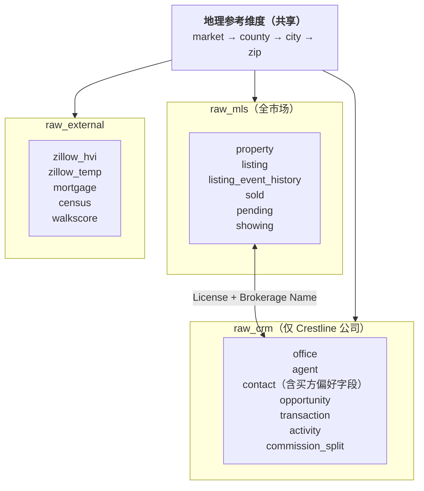

# 设计决策 — Crestline 房地产经纪市场情报原始数据

> 本文档记录数据集的设计理念和取舍。
> 经过四轮外部评审迭代后定稿（R0 → R3）。最终决策的依据已合并进各章节，旧版本的修改痕迹记录在末尾的"修订日志"。

---

## 1. 用途

本数据集是 Crestline Realty 市场情报平台项目的**原始数据层（Raw Data Layer）**，对应 Redshift 数仓中的三个 raw schema：

- `raw_mls` — MLS 房源 / 成交 / 待过户 / 看房数据
- `raw_crm` — Salesforce CRM 数据（Crestline 公司自有的 agent、客户、机会、成交、活动）
- `raw_external` — 外部市场数据（Zillow、Freddie Mac、Census、Walk Score）

数据集刻意保持 **source-faithful**（保留源系统原貌）而不是 analytics-ready：保留源字段命名风格和数据怪癖，让下游的 dbt staging → intermediate → mart 模型有真实的清洗、连接和业务逻辑加工工作可做。

数据集需要支撑：

- dbt 模型开发和测试（Module 1）
- BI dashboard 原型（Module 2）
- 自动化每周市场报告 pipeline（Module 2）
- 自然语言 SQL 查询系统（Module 3）
- 房源-客户 embedding 匹配（Module 3）
- 每日 12 步竞争力定位 AI 分析（Module 4）

---

## 2. 行业与用例分类

| 项 | 值 |
|------|-------|
| 行业（L3） | `9.2.1 房地产经纪 Real Estate Brokerage` |
| 行业前缀 | `real_estate_brokerage` |
| 业务场景 | `market_intelligence_raw_data` |
| 复杂度 | `high` |
| **数据集名称** | `real_estate_brokerage_market_intelligence_raw_data_high` |

---

## 3. 架构概览

**规模总览**：23 张表，约 328,000 行。详见 Section 6。

---

## 4. 数据域划分

### A. MLS 数据域（`mls_*`）— 全市场数据源

代表已有的 AWS Lambda 拉取的 MLS feed，落入 Redshift `raw_mls` schema。**同时包含 Crestline 和竞争对手的 listings**（行业惯例：MLS 是共享的）。

| 表 | 描述 |
|-------|-------------|
| `mls_property` | 物理房产实体（地址 + 物理属性：BED_COUNT、BATH_COUNT、SQFT、LOT_SQFT、YEAR_BUILT、HOA_FEE、GARAGE_SPACES、PROPERTY_TYPE）。跨多次挂牌持久存在。 |
| `mls_listing` | 挂牌事件（同一房产可能被多次挂牌）。携带 `LISTING_OFFICE_NAME`（经纪公司）和 `LISTING_AGENT_LICENSE`（DRE 牌照号），后者是连接 `crm_agent.License_Number__c` 的 join key。 |
| `mls_listing_event_history` | 每个 listing 的事件日志：PRICE_CHANGE 和 STATUS_CHANGE 事件 |
| `mls_sold_transaction` | 已成交记录（MLS 视角） |
| `mls_pending_sale` | 当前待过户房源快照（已签合同、等待 escrow 关闭） |
| `mls_listing_showing` | 每个 listing 的看房事件（平均每 listing 1-3 次）。支持 Module 4 的"买方需求信号"分析。 |

### B. CRM 数据域（`crm_*`）— 仅 Crestline

代表 AWS Glue 同步的 Salesforce CRM 数据，落入 Redshift `raw_crm` schema。

| 表 | 描述 |
|-------|-------------|
| `crm_office` | 办公室 / region 组织架构 |
| `crm_agent` | ~200 名持牌 agent，含入职日期、资历层级（JUNIOR/MID/SENIOR）、佣金分成比例。`License_Number__c` 是连接 `mls_listing.LISTING_AGENT_LICENSE` 的 join key。 |
| `crm_agent_zip_coverage` | 多对多 — 每个 agent 覆盖哪些 **zip code**（主要/次要territory） |
| `crm_contact` | 买方/卖方/lead 档案。买方偏好字段直接放在 Contact 上（Salesforce 标准做法）：`Preferred_Min_Price__c`、`Preferred_Max_Price__c`、`Preferred_Bed_Count__c`、`Preferred_Zip__c`、`Preferred_Property_Type__c`。**不**单独建偏好表。 |
| `crm_opportunity` | 销售管道机会，stages：Lead、Qualified、Showing、Offer、Under Contract、Closed Won、**Closed Lost** |
| `crm_transaction` | 已成交记录（每个 Closed Won opp 对应 1 笔）。当 MLS 中存在匹配的 sold 记录时（Crestline-listed 房源），FK 到 `mls_sold_transaction`。 |
| `crm_agent_activity` | 电话、邮件、看房、open house、会议、短信 |
| `crm_commission_split` | 每笔成交的 agent 佣金明细（通常 1 笔/成交，co-list 情况下 2 笔） |

### C. 外部数据域（`ext_*`）

代表新增的 Lambda 拉取的外部数据 feed，落入 `raw_external` schema。

| 表 | 描述 |
|-------|-------------|
| `ext_zillow_home_value_index` | 每月每 zip 的 ZHVI（来源：Zillow Research 下载数据，**不是**公开 API） |
| `ext_zillow_market_temperature` | 每月每 zip 的市场温度。**派生指标** — Zillow 没有公开 market-temperature API，本字段是对 Zillow Heat Index 方法论的近似。 |
| `ext_freddie_mac_mortgage_rate` | 每周 PMMS 调查 — 30 年和 15 年固定利率 |
| `ext_census_demographics` | 每年 county 级别人口、收入、就业 |
| `ext_walk_score` | 每个地址的步行/通勤/骑行评分（静态） |

### D. 地理参考维度（`geo_*`）

被三个域共享的地理维度。

| 表 | 描述 |
|-------|-------------|
| `geo_market` | 3 个核心 market：Bay Area、SoCal、Pacific Northwest |
| `geo_county` | 3 个 market 覆盖的 ~10 个 county |
| `geo_city` | ~30 个城市 |
| `geo_zip_code` | **60 个 zip code**（每个 market 20 个）— 最细的地理粒度 |

**总计：23 张表**

---

## 5. 设计决策

### 决策 1 — 保留 "Raw" 字段命名

数据集保留源系统的字段命名风格，不做规范化。

- **MLS 表**：使用 MLS 实际的字段命名约定（`LIST_PRICE`、`BED_COUNT`、`DOM`、`STATUS_CD`、`LIST_DT`）
- **CRM 表**：使用 Salesforce 风格命名（`Account__c`、`IsActive__c`、`LastModifiedDate`）
- **外部表**：使用每个数据源的真实字段名（Zillow 用 `RegionName`、`ZHVI`）
- **状态字段**：保留源系统的 enum（`ACT`/`PND`/`SLD` 而不是 `Active`/`Pending`/`Sold`）

**理由**：让 dbt staging 层有真实的清洗工作要做，匹配项目里"dbt 负责重命名和标准化"的真实场景。

### 决策 2 — 注入合理的"数据脏污"

数据集刻意包含少量数据质量问题，让 dbt tests 真的有作用。

| 模式 | 出现位置 | 频率 |
|---------|-------|-----------|
| ZIP+4 格式（`94102-1234`） | `mls_property.ZIP`、`crm_contact.Mailing_Zip__c` | ~5% |
| NULL 可选字段 | `mls_property.YEAR_BUILT`、`crm_contact.Email` | ~8-10% |
| 近似重复的 contact（同 email、姓名拼写微差） | `crm_contact` | ~3% |
| 电话格式不一致 | `crm_contact.Phone` | 非空中 ~50% |
| 空白/大小写不一致 | `mls_property.STREET_NAME`、`crm_contact.FirstName` | ~4-5% |
| Crestline 经纪公司名拼写变体 | `mls_listing.LISTING_OFFICE_NAME`（仅 Crestline 部分） | ~5%（`Crestline Realty`、`Crestline Realty Inc`、`CRESTLINE REALTY`、双空格变体） |

**软引用（不是 FK 孤儿）**：不是引入字面意义的破坏 FK 约束的孤儿，而是：
- `crm_opportunity` 可能处于 `Closed Lost` stage（语义上"死"但行还存在）
- `crm_agent_activity.Opportunity_Id__c` 可以是 NULL（~40%）或引用 Lost opp（~10%）— 两种都是 dbt 清洗的真实挑战，不是 FK 违反

**硬规则** — 不注入以下问题（会破坏引用完整性）：
- 不允许真正的孤儿 FK（每个 listing 都有有效的 property）
- 不允许无效的 enum 值
- 不允许未来日期的**交易**（即 `Close_Date__c`、`CLOSE_DT`、`Contract_Date__c` 都 ≤ CURRENT_DATE）
  - **例外**：`crm_commission_split.Payout_Date__c` 可以比 CURRENT_DATE 早 ~2 周（在未来），因为它代表已成交订单的*预计 payout 排程*（close + 5-15 天）。这是前瞻性预测，不是未记录的活动。Query 18（佣金 payout 预测）依赖此行为。
- 不允许负价格

**理由**：让数据集成为项目 `dbt test` 数据质量要求（REQ-05）的真实测试床。完全干净的 raw layer 会让 dbt tests 形同虚设。

### 决策 3 — 地理与时间范围

**地理：**
- 3 个 market（Bay Area、SoCal、PNW）
- **每个 market 20 个 zip code = 共 60 个 zip code**
- 房产按现实密度分布在这 60 个 zip 中（城市核心区比郊区密集）
- 每个 market 有 3-4 个 county、6-9 个 city

**为什么是 60（不是 15 或 150）：**
- REQ-06 明确说 dashboard 必须覆盖 ~150 个 zip code — 原始 15 zip 的计划在物理上让 REQ-06 不可能实现
- 150 zip 会让生成量推到 ~100 万行、~10 分钟运行时间 — 对一个 fake-data foundation 来说不合理
- 60 是分析甜区：足够 zip 数量演示 zip 级别的 dashboard，又能让总行数控制在 30 万以下，生成时间 30 秒以内

**时间：**
- **2023-01-01 到 2026-06-05**（~42 月 / 3.4 年）
- 数据集的"当前日期" = `2026-06-05`（与 CLAUDE.md 的 `currentDate` 对齐）
- 此窗口匹配项目的 mart 3 年保留要求

**Zip 温度标签（集中定义 — 被决策 4.2 和 4.3 共同引用）：**
- HOT：~30% 的 zip（18 个）— 高端城市核心 / 优质郊区（如 94301 Palo Alto、90210 Beverly Hills、98004 Bellevue）
- STABLE：~50% 的 zip（30 个）— 中等大众市场
- COOL：~20% 的 zip（12 个）— 次级市场、过渡区域

**Market 价格分层（保证真实感）：**
- Bay Area：中位成交价 ~$1.2M，per-zip 倍数 0.65–1.45
- SoCal：中位成交价 ~$900K，per-zip 倍数 0.70–1.60
- PNW：中位成交价 ~$700K，per-zip 倍数 0.65–1.35

### 决策 4 — 业务逻辑约束

数据生成器必须强制以下不变量：

1. **时间链条**：
   `LIST_DT ≤ 价格变更事件 ≤ STATUS_DT ≤ pending_contract_dt ≤ close_dt`

2. **Sale-to-list ratio**（按 zip 温度分层）：
   - HOT zip：`slr ~ N(1.04, σ=0.04)` — bidding-war 模式
   - STABLE zip：`slr ~ N(1.00, σ=0.03)`
   - COOL zip：`slr ~ N(0.96, σ=0.04)` — concession 模式
   - 截断到 [0.80, 1.30]

3. **DOM 分布**（LogNormal，按温度变化）：
   - HOT zip：`LogNormal(μ=2.5, σ=0.5)` → 中位数 ~12 天
   - STABLE zip：`LogNormal(μ=3.5, σ=0.7)` → 中位数 ~33 天
   - COOL zip：`LogNormal(μ=4.2, σ=0.8)` → 中位数 ~67 天

4. **Agent 生产力符合 Pareto**（对交易使用 tenure-weighted）：
   - **活动**：`paretovariate(alpha=0.8)`，与 tenure **无关** — 顶部 20% 的 agent 贡献 ~86% 活动（强长尾，反映真实的外联强度差异）
   - **机会/交易**：`paretovariate(alpha=2.5)`，**按 `Hire_Date__c` rank 排序**（tenure 越长权重越高，15% rank-swap 噪声）— 顶部 20% 贡献 ~45% GCI。配合 tier 分阶的 Split_Pct__c，让 Query 3（Top GCI）可靠地把 SENIOR agent 排在前面，让 Query 15（Tenure vs Earnings）展现真实的 monotonic 增长。

5. **佣金计算**：
   - 佣金率：每边 2.5%–3%
   - Agent 分成：0.65-0.72（JUNIOR）、0.72-0.80（MID）、0.80-0.88（SENIOR）
   - `Agent_Take__c = Gross_Commission__c × Split_Pct__c`

6. **外部数据时间对齐**：
   - 每个 `mls_sold_transaction.CLOSE_DT` 月份必须在 `ext_zillow_home_value_index` 中有匹配行
   - 每个 `mls_sold_transaction.CLOSE_DT` 周必须在 `ext_freddie_mac_mortgage_rate` 中有匹配行
   - Census 数据按 `county_id` + `Year` 关联

7. **宏观叙事一致性**：

   **真实 Freddie Mac PMMS 历史（我们现在匹配它）：**
   - 2023-Jan：~6.48%
   - 2023-Oct：峰值 ~7.79%
   - 2024-Jan：~6.69%
   - 2024-Jul：~6.95%
   - 2024-Dec：~6.60%
   - 2025：震荡 6.3–6.9%
   - 2026：稳定 6.3–6.8%

   **其他宏观信号：**
   - 2024 年成交量比 2023 下降 22–28%（匹配项目叙事）
   - 2025 部分复苏（~+15% YoY），2026 H1 继续复苏
   - ZHVI 每年涨 ~4% 尽管成交量下滑（lock-in 效应）

8. **房产-挂牌关系**：
   - 同一 property 可以有多次 listing（2023 卖了，2026 再上）
   - 平均 ~1.7 次 listing/property over 3.4 年

### 决策 5 — MLS ↔ CRM 耦合

**为什么重要**：没有 MLS 记录和 CRM 记录之间的确定性关系，Module 1 就无法构建 `agent_performance` mart（REQ-02），Module 4 也无法识别 Crestline 自家的 active listings 做定价评估（REQ-13）。

**实现：**

1. **`mls_listing.LISTING_OFFICE_NAME` 的经纪公司分配：**
   - ~30% Crestline（5% 拼写变体：`Crestline Realty`、`Crestline Realty Inc`、`Crestline Realty LLC`、`CRESTLINE REALTY`、`Crestline  Realty`（双空格））
   - ~70% 竞争对手（Compass、Coldwell Banker、Keller Williams、Berkshire Hathaway、Redfin、Sotheby's、Side Inc、RE/MAX）

2. **License 号码耦合：**
   - 当 `LISTING_OFFICE_NAME` 是 Crestline 变体时：`LISTING_AGENT_LICENSE` 从 `crm_agent.License_Number__c` 抽取（Pareto 加权，偏向资深 agent）
   - 当 `LISTING_OFFICE_NAME` 是竞争对手时：`LISTING_AGENT_LICENSE` 来自不相交的段（竞争对手用 `DRE9{nnnnn}`，Crestline 用 `DRE{nnnnn}`）
   - 买方 license 同理独立随机分配

3. **CRM 到 MLS 的关联：**
   - `crm_opportunity.Listing_Id__c`（nullable FK）只引用 Crestline 自有的 listing（或 NULL）
   - `crm_transaction.Sold_Id__c`（nullable FK）只引用 sold 记录中 listing 是 Crestline 自有的
   - `crm_transaction` 数量 = Closed-Won opportunity 数量（~2,500）

4. **MLS sold 中的 buyer-side / seller-side 识别：**
   - Crestline 的买方代理成交 = sold 记录中 `BUYER_AGENT_LICENSE` 在 `crm_agent.License_Number__c` 内
   - Crestline 的卖方代理成交 = sold 记录中 `LISTING_AGENT_LICENSE` 在 `crm_agent.License_Number__c` 内
   - 双边（~3% 罕见）= 两边都匹配

**dbt staging 意义**：`int_crestline_listings.sql` 会过滤 `mls_listing` by `regexp_match(lower(LISTING_OFFICE_NAME), 'crestline')` AND/OR `LISTING_AGENT_LICENSE IN (SELECT License_Number__c FROM crm_agent)` — 锻炼 fuzzy matching 和 join 逻辑。

### 决策 6 — 买方偏好建模

**决策**：买方偏好作为 Salesforce custom field 放在 `crm_contact` 上，**不**单独建 `crm_buyer_preference` 表。

**为什么拒绝评审建议的拆分：**
- 真实的 Salesforce org 几乎都把轻量级偏好字段放 Contact（或仅在复杂多偏好场景才建关联 Custom Object）
- 拆分会让 dbt 每次客户查询都要 LEFT JOIN — 增加摩擦但没有分析收益
- 字段概念上与 contact 1:1（一个买家 = 一个偏好画像，不是历史）

**`crm_contact` 上的字段**（除 Buyer/Both 类型外都可空）：
- `Preferred_Min_Price__c`（FLOAT）
- `Preferred_Max_Price__c`（FLOAT）
- `Preferred_Bed_Count__c`（INTEGER）
- `Preferred_Property_Type__c`（VARCHAR）— SFR、CONDO、TOWNHOUSE、MULTI_FAMILY、ANY
- `Preferred_Zip__c`（VARCHAR）— 单一偏好 zip（~70%）或 NULL 表示对所有 zip 开放（~30%）

如果未来需要多 zip 偏好，可以新增 `crm_contact_preferred_zip` 关联表而不破坏现有逻辑。

### 决策 7 — 买方需求信号

**问题**：Module 4 第 6-8 步需要每个 listing 的买方需求信号（offers、showings、qualified buyers）。原来的 `crm_agent_activity` 是 per-agent 的，不是 per-listing — 所以无法按 listing 聚合需求。

**决策**：新增 `mls_listing_showing` 表。

**Schema：**
- `SHOWING_ID` PK
- `LISTING_ID` FK → `mls_listing`（NOT NULL，驱动 per-listing 聚合）
- `Agent_License__c`（看房 agent 的 license — 可能匹配 / 不匹配 `crm_agent`）
- `Contact_Id__c`（看房参与人 — nullable，仅当已知 Crestline contact 时设置）
- `SHOWING_DT` DATE
- `Showing_Type__c`（`PRIVATE`、`OPEN_HOUSE`、`VIRTUAL`）
- `Resulted_In_Offer__c` BOOLEAN
- `Notes__c` TEXT（nullable）

**体量**：~72,000 行看房记录。HOT zips 平均每 listing 2.5 次，STABLE 1.5，COOL 0.6。

**为什么新建表（而不是扩展 agent_activity）：**
- Showings 的粒度不同（per-listing）、消费者不同（Module 4 的需求模型）
- 真实的 MLS feed 通过 Supra eKey / Sentrilock API 确实包含看房数据 — 这张表镜像了这个数据源
- 保持 `crm_agent_activity` 作为 CRM-only 表（仅 Crestline agent）；`mls_listing_showing` 包含所有市场 agent

---

## 6. 数据量策略

### 60 zip 下的密度检查

更新的 cell 数：60 zip × 42 月 × 4 property type = **10,080 cells**。

| 总 sold | 平均每 cell | 评价 |
|------------|--------------|---------|
| 10K | 1.0 | 噪声 |
| 25K | 2.5 | 勉强可用 |
| 35K | 3.5 | zip 级别中位数可信；zip×type 级别勉强 |
| 60K+ | 6+ | 可靠 |

我们 target **25K sold**（平均 2.5/cell）— 足以做 zip 级别分析，zip×property-type 级别勉强。数据集目的是结构性支撑，不是极致统计深度。

### 最终体量计划（~328K 总行数）

| 表 | 行数 | 理由 |
|-------|------|-----------|
| `geo_market` | 3 | 真实数 |
| `geo_county` | 12 | 3 个 market 的 county |
| `geo_city` | 30 | 每个主要区一个 |
| `geo_zip_code` | 60 | 每个 market 20 个（rebalanced 到 18 HOT / 30 STABLE / 12 COOL） |
| `mls_property` | 25,000 | 60-zip 密度的库存基础 |
| `mls_listing` | 40,000 | 平均每 property 1.6 次 listing |
| `mls_listing_event_history` | 65,000 | 平均每 listing 1.6 个事件 |
| `mls_sold_transaction` | ~24,800 | ~62% 卖出率 |
| `mls_pending_sale` | ~250 | 当前快照（过去 60 天） |
| `mls_listing_showing` | ~72,000 | 密度 2.5/1.5/0.6 by HOT/STABLE/COOL |
| `crm_office` | 8 | 每个主要 market 区一个 |
| `crm_agent` | 200 | 项目设定的 agent 数 |
| `crm_agent_zip_coverage` | ~500 | 多对多 — 平均每 agent 2.5 个 zip |
| `crm_contact` | 5,000 | 买家 + 卖家 + leads（仅 Crestline） |
| `crm_opportunity` | 10,000 | 含 Closed Lost（~15%） |
| `crm_transaction` | ~2,500 | 每个 Closed Won opp 1 笔（Side 来自 opp type，Sold_Id 与 opp.Listing_Id 对齐） |
| `crm_commission_split` | ~2,750 | 每 txn 1 行（agent = opp owner，tenure-weighted）+ ~10% co-list |
| `crm_agent_activity` | 50,000 | 200 agent × ~250 活动/3.4 年（受 agent tenure 约束） |
| `ext_zillow_home_value_index` | 2,520 | 60 zip × 42 月 |
| `ext_zillow_market_temperature` | 2,520 | 60 zip × 42 月 |
| `ext_freddie_mac_mortgage_rate` | 179 | 3.4 年 × 52 周 |
| `ext_census_demographics` | 48 | 12 county × 4 年 |
| `ext_walk_score` | 25,000 | 每 property 1 行 |
| **总计** | **~328,300** | |

### 成本权衡

- 生成时间：~10–20 秒
- SQLite 文件大小：~350 MB
- TSV 文件总和：~500 MB
- 峰值内存：~2 GB

全部可接受。SQLite 和 TSV 文件应该 `.gitignore` 掉（是可重生的产物）。

---

## 7. 跨域 Join 键

| 从 → 到 | Join Key | 基数 | 备注 |
|-----------|----------|-------------|-------|
| `mls_property` → `geo_zip_code` | `zip_id` | N:1 | 硬 FK |
| `mls_listing` → `mls_property` | `PROPERTY_ID` | N:1 | 硬 FK |
| `mls_listing` → `crm_agent` | `LISTING_AGENT_LICENSE` = `License_Number__c` | N:1（loose） | 仅 Crestline-owned listing 能匹配；竞争对手用不相交的 `DRE9{nnnnn}` 段 |
| `mls_sold_transaction` → `mls_listing` | `LISTING_ID` | 1:1 | 硬 FK |
| `mls_sold_transaction` → `crm_agent`（卖方） | `LISTING_AGENT_LICENSE` = `License_Number__c` | N:1（loose） | 仅 Crestline-listed sales |
| `mls_sold_transaction` → `crm_agent`（买方） | `BUYER_AGENT_LICENSE` = `License_Number__c` | N:1（loose） | 仅 Crestline 代理买方的成交 |
| `mls_listing_showing` → `mls_listing` | `LISTING_ID` | N:1 | 硬 FK |
| `mls_listing_showing` → `crm_contact` | `Contact_Id__c` | N:1（nullable） | 仅 Crestline contact 参与时设置 |
| `crm_opportunity` → `mls_listing` | `Listing_Id__c`（nullable FK） | N:1 | 仅指向 Crestline-owned listing |
| `crm_transaction` → `mls_sold_transaction` | `Sold_Id__c`（nullable FK） | 1:1 | 仅当 MLS sold 是 Crestline-listed |
| `crm_transaction` → `crm_opportunity` | `Opportunity_Id__c` | N:1 | 硬 FK |
| `crm_commission_split` → `crm_transaction` | `Transaction_Id__c` | N:1 | 硬 FK；每笔 1-2 splits |
| `crm_commission_split` → `crm_agent` | `Agent_Id__c` | N:1 | 硬 FK |
| `crm_agent_activity` → `crm_agent` | `Agent_Id__c` | N:1 | 硬 FK |
| `crm_agent_activity` → `crm_contact` | `Contact_Id__c`（nullable） | N:1 | nullable ~10% |
| `crm_agent_activity` → `crm_opportunity` | `Opportunity_Id__c`（nullable） | N:1 | nullable ~40% |
| `crm_agent_zip_coverage` → `crm_agent` × `geo_zip_code` | 复合 | M:N | 关联表 |
| `crm_contact.Preferred_Zip__c` → `geo_zip_code.zip5` | 字符串匹配 | N:1（loose） | nullable；匹配算法使用 |
| `ext_zillow_*` → `geo_zip_code` | `zip_id`（或 `RegionName` = `zip5`） | N:1 | 硬 FK |
| `ext_census_demographics` → `geo_county` | `county_id` | N:1 | 硬 FK |
| `ext_walk_score` → `mls_property` | `PROPERTY_ID` | 1:1 | 硬 FK |

**关键 "loose" 连接**（数据库不强制 FK；dbt 必须通过 WHERE EXISTS 处理）：
- `mls_*.{LISTING|BUYER}_AGENT_LICENSE` ↔ `crm_agent.License_Number__c` — 跨域分析最重要的 join key
- `mls_listing.LISTING_OFFICE_NAME` ↔ `'Crestline'` regex 匹配 — Crestline 与竞争对手过滤

---

## 8. 每张表的数据窗口

| 表 | 窗口 | 快照还是历史？ |
|-------|--------|----------------------|
| `geo_*` | 静态 | 快照 |
| `mls_property` | `CREATED_DT` ∈ 2023-01 到 2026-06 | 历史 |
| `mls_listing` | `LIST_DT` ∈ 2023-01 到 2026-06 | 历史 |
| `mls_listing_event_history` | `EVENT_DT` ∈ 2023-01 到 2026-06 | 历史 |
| `mls_sold_transaction` | `CLOSE_DT` ∈ 2023-01 到 2026-06 | 历史 |
| `mls_pending_sale` | 仅 2026-06-05 当前 pending | 快照 |
| `mls_listing_showing` | `SHOWING_DT` ∈ 2023-01 到 2026-06 | 历史 |
| `crm_*`（transactional） | `CreatedDate` / `Activity_Date__c` ∈ 2023-01 到 2026-06 | 历史 |
| `crm_agent` | `Hire_Date__c` ∈ 2018-01 到 2025-12；部分 inactive（~10%） | agent 名册 + tenure 快照 |
| `crm_office` | `Opened_Date__c` ∈ 2017-01 到 2017-12（早于最早 agent hire） | 快照 |
| `ext_zillow_*` | 月度，2023-01 到 2026-06（42 月） | 历史 |
| `ext_freddie_mac_mortgage_rate` | 周度，2023-01 到 2026-06（179 周） | 历史 |
| `ext_census_demographics` | 年度，2022 到 2025（4 年） | 历史 |
| `ext_walk_score` | 每 property 单一时点评分 | 快照 |

---

## 9. Out of Scope

明确**不**建模的内容：

- MLS 拉取过程的重试 / 错误日志（基础设施层，不是业务数据）
- dbt 模型本身（那是项目交付物，不是 raw data）
- QuickSight dashboard 配置
- Streamlit app session 数据
- LLM 调用日志 / AI agent 运行历史
- Step Functions 执行记录
- IAM / Secrets Manager 配置
- 房源照片 / 媒体文件（只有 metadata 计数）
- 多币种或国际市场（仅美国 / USD）
- 商业地产（仅住宅）
- 抵押贷款申请 / 贷款级数据（只有宏观利率）
- 产权 / escrow 交易细节

---

## 10. 未来考虑

- 如果租赁房产进入范围：加 `mls_rental_listing` 表
- 如果买方需要多 zip 偏好：加 `crm_contact_preferred_zip` 关联表
- 如果 MLS feed 增加 offer 级数据（contract 前收到的 offers）：扩展 `mls_listing_showing` 或加 `mls_listing_offer`
- 如果 dbt incremental-model 压测需要生产规模量：通过 dbt seed 乘倍（UNION ALL × N）而不是膨胀这个 raw layer

---

## 修订日志

- **R0**（初始）：15 zip，36 月 Zillow 窗口，2026-06-30 currentDate，mortgage 利率趋势反了，无 MLS-CRM 耦合，无买方偏好，无看房表，无跨域 join 章节
- **R1**：第一轮外部评审。修改：60 zip、currentDate 2026-06-05、Zillow 42 月、mortgage 趋势纠正、MLS-CRM 耦合升级为 Decision 5、买方偏好字段、新增 `mls_listing_showing`、SLR 温度分层、Cross-Domain Join Keys 和 Data Window 章节
- **R2**：第二轮评审找到 cross-table 语义 bug 和文档不一致。修改：commission_split 用 opp owner、txn.Side 来自 opp、Sold_Id 与 opp.Listing_Id 对齐、SQL 全部锚定 2026-06-05、zip 温度 18/30/12、Crestline 拼写 5%、opportunity Pareto alpha 调整、showing 密度修复、pending snapshot 过滤、opp/activity 时间窗强约束、office 开张早于 agent 入职、总行数对齐 328K
- **R3**：第三轮评审 8 项 stale doc 同步 + 1 项 P2 语义改进。Tenure-weighted Pareto 用于 opportunity 所有权（Q3 Top-GCI 可靠 SENIOR；Q15 Tenure→Earnings monotonic 0-1yr avg $174K → 6+yr avg $626K，max $3.79M）。所有文档同步到 R3 实际状态。
