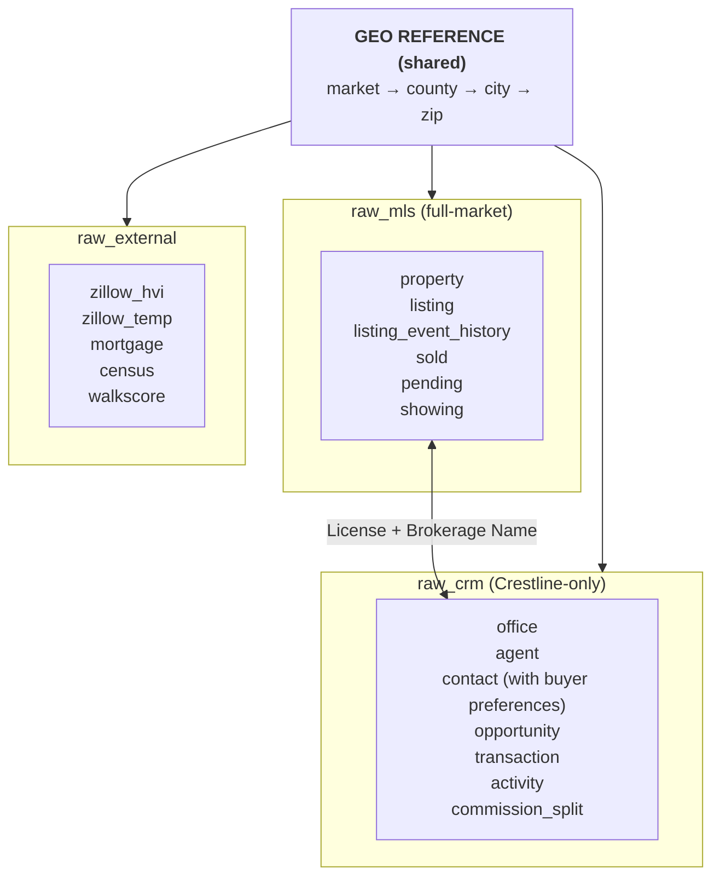

# Design Decisions — Crestline Realty Market Intelligence Raw Data

> Reference document capturing the design rationale for this dataset.
> Created during brainstorming; revised after external review.
> **R4** (current, doc-only): ER doc title bumped R2→R3; Q3 description annotated with "trailing 12 months" window vs Q15's all-time window (clarifies the natural ~3-4× dollar gap); Q3/Q15 expected values converted from single seed=42 datapoints to tolerance bands so generator tweaks don't immediately invalidate descriptions. No code or data changes.
> **R3** addressed: Tenure-weighted Pareto for opportunity ownership (Q3 Top-GCI now reliably SENIOR; Q15 Tenure→Earnings now steeply monotonic — 0-1yr avg $174K → 6+yr avg $626K, max $3.79M). Plus 8 stale-claim doc syncs.
> **R2** addressed: cross-table semantic bugs (commission split owner alignment, transaction Side from opp type, Sold_Id alignment with opp Listing_Id), distribution corrections, temporal-window enforcement.
> **R1** addressed: zip-code scope, MLS↔CRM coupling, mortgage trajectory accuracy, current-date alignment, buyer-demand-signal modeling, and documentation gaps.

---

## 1. Purpose

This dataset acts as the **Raw Data Layer** for the Crestline Realty Market Intelligence Platform project. It mirrors the three raw schemas in the project's Redshift warehouse:

- `raw_mls` — MLS listing / sold / pending / showing data (full market, not Crestline-only)
- `raw_crm` — Salesforce CRM data (Crestline-only: agents, contacts, opportunities, transactions, activities)
- `raw_external` — External market data (Zillow, Freddie Mac, Census, Walk Score)

The dataset is **source-faithful** rather than analytics-ready: it preserves the field naming style and quirks of real source systems so that downstream dbt staging → intermediate → mart models can perform meaningful cleaning, joining, and business-logic application.

The dataset must support:

- dbt model development and testing (Module 1)
- BI dashboard prototyping (Module 2)
- Automated weekly report pipeline (Module 2)
- Natural-language SQL query system (Module 3)
- Property-customer embedding matching (Module 3)
- 12-step daily competitive positioning AI analysis (Module 4)

---

## 2. Industry & Use Case Classification

| Item | Value |
|------|-------|
| Industry (L3) | `9.2.1 房地产经纪 Real Estate Brokerage` |
| Industry prefix | `real_estate_brokerage` |
| Use case | `market_intelligence_raw_data` |
| Complexity | `high` |
| **Dataset name** | `real_estate_brokerage_market_intelligence_raw_data_high` |

---

## 3. Architecture Overview

**Cardinality summary**: 23 tables, ~328,000 total rows. See Section 6 for per-table breakdown.

---

## 4. Data Domains

### A. MLS Domain (`mls_*`) — Full Market Feed

Represents the raw MLS feed pulled by the existing AWS Lambda into Redshift `raw_mls` schema. Contains BOTH Crestline and competitor listings (full MLS access is the norm).

| Table | Description |
|-------|-------------|
| `mls_property` | Physical property entity (address + physical attributes: BED_COUNT, BATH_COUNT, SQFT, LOT_SQFT, YEAR_BUILT, HOA_FEE, GARAGE_SPACES, PROPERTY_TYPE). Persistent across listings. |
| `mls_listing` | Listing event (one property may be listed multiple times over years). Carries `LISTING_OFFICE_NAME` (brokerage) and `LISTING_AGENT_LICENSE` (DRE number) which form the join key to `crm_agent.License_Number__c`. |
| `mls_listing_event_history` | Per-listing event log: PRICE_CHANGE and STATUS_CHANGE events (renamed from `mls_listing_price_history` to reflect dual event types) |
| `mls_sold_transaction` | Closed sale records (MLS view) |
| `mls_pending_sale` | Snapshot of currently-pending listings (contract signed, awaiting close) |
| `mls_listing_showing` | **NEW** — per-listing showing event (1-3 showings per listing on average). Supports Module 4's "buyer demand signal" analysis. |

### B. CRM Domain (`crm_*`) — Crestline-Only

Represents the Salesforce CRM data synced by AWS Glue into Redshift `raw_crm` schema.

| Table | Description |
|-------|-------------|
| `crm_office` | Office / region organizational hierarchy |
| `crm_agent` | ~200 licensed agents with hire dates, tier (JUNIOR/MID/SENIOR), commission split percentages. `License_Number__c` is the join key to `mls_listing.LISTING_AGENT_LICENSE`. |
| `crm_agent_zip_coverage` | M:N — which **zip codes** each agent considers their primary/secondary territory (renamed from `region_coverage` to remove "region" ambiguity) |
| `crm_contact` | Buyer / seller / lead profiles. Contains buyer preference fields (`Preferred_Min_Price__c`, `Preferred_Max_Price__c`, `Preferred_Bed_Count__c`, `Preferred_Zip__c`, `Preferred_Property_Type__c`) — these are Salesforce custom fields, NOT a separate table. |
| `crm_opportunity` | Pipeline opportunities with stages: Lead, Qualified, Showing, Offer, Under Contract, Closed Won, **Closed Lost** |
| `crm_transaction` | Closed deal records (one per Closed Won opportunity). FKs to `mls_sold_transaction` when the matching MLS sold record exists (Crestline-listed properties only). |
| `crm_agent_activity` | Calls, emails, showings, open houses, meetings, texts |
| `crm_commission_split` | Per-agent commission payout per transaction (1 row per transaction normally, 2 rows when co-listed) |

### C. External Data Domain (`ext_*`)

Represents the new Lambda-pulled external data feeds into `raw_external` schema.

| Table | Description |
|-------|-------------|
| `ext_zillow_home_value_index` | Monthly ZHVI per zip code (sourced via Zillow Research data download — not a public API) |
| `ext_zillow_market_temperature` | Monthly market temperature per zip code. **Derived metric** — Zillow does not publish a public market-temperature API; we approximate Zillow's Heat Index methodology. |
| `ext_freddie_mac_mortgage_rate` | Weekly Primary Mortgage Market Survey (PMMS) — 30Y and 15Y fixed rates |
| `ext_census_demographics` | Annual county-level population, income, employment |
| `ext_walk_score` | Static walkability / transit / bike score per address |

### D. Geo Reference Dimensions (`geo_*`)

Shared geographic dimensions referenced by all three domains.

| Table | Description |
|-------|-------------|
| `geo_market` | 3 core markets: Bay Area, SoCal, Pacific Northwest |
| `geo_county` | ~10 counties within the 3 markets |
| `geo_city` | ~30 cities |
| `geo_zip_code` | **60 zip codes** (20 per market) — the finest geographic grain |

**Total: 23 tables**

---

## 5. Design Decisions

### Decision 1 — Preserve "Raw" Field Naming (CONFIRMED)

The dataset preserves source-system field naming style rather than normalizing it.

- **MLS tables**: Real MLS field conventions (`LIST_PRICE`, `BED_COUNT`, `DOM`, `STATUS_CD`, `LIST_DT`)
- **CRM tables**: Salesforce-style naming (`Account__c`, `IsActive__c`, `LastModifiedDate`)
- **External tables**: Each vendor's actual response field names (Zillow uses `RegionName`, `ZHVI`)
- **Status fields**: Source enums (`ACT`/`PND`/`SLD` instead of `Active`/`Pending`/`Sold`)

**Why:** Gives the dbt staging layer meaningful cleaning work, matching the real project's purpose where dbt is supposed to rename and standardize fields.

### Decision 2 — Inject Realistic Dirty Data (CONFIRMED)

The dataset deliberately includes a small amount of data-quality issues that dbt tests should catch.

| Pattern | Where | Frequency |
|---------|-------|-----------|
| ZIP+4 format (`94102-1234`) | `mls_property.ZIP`, `crm_contact.Mailing_Zip__c` | ~5% |
| NULL optional fields | `mls_property.YEAR_BUILT`, `crm_contact.Email` | ~8-10% |
| Near-duplicate contacts (same email, varied name spelling) | `crm_contact` | ~3% |
| Inconsistent phone format | `crm_contact.Phone` | ~50% of non-null |
| Whitespace / case inconsistency | `mls_property.STREET_NAME`, `crm_contact.FirstName` | ~4-5% |
| Brokerage-name spelling variation | `mls_listing.LISTING_OFFICE_NAME` (for Crestline only) | ~5% (`Crestline Realty`, `Crestline Realty Inc`, `CRESTLINE REALTY`, double-space variant) |

**Soft references (not orphan FKs)** — instead of literal orphans that break FK constraints, we use:
- `crm_opportunity` may be in `Closed Lost` stage (semantically "dead" but row still exists)
- `crm_agent_activity.Opportunity_Id__c` can be NULL (~40%) or reference a Lost opp (~10%) — both are dbt-cleaning challenges, not FK violations

**Hard rules** — do NOT inject these (would break referential integrity):
- No broken FKs to required parents (every listing has a valid property)
- No invalid enum values
- No future-dated **transactions** (i.e. `Close_Date__c`, `CLOSE_DT`, `Contract_Date__c` all ≤ CURRENT_DATE)
  - **Exception**: `crm_commission_split.Payout_Date__c` may be up to ~2 weeks past CURRENT_DATE because it represents the *scheduled payout* of a closed deal (close + 5-15 days). This is forward-looking projection, not unrecorded activity. Query 18 (Commission Payout Forecast) depends on this behavior.
- No negative prices

**Why:** Makes the dataset a realistic testing ground for the project's `dbt test` data quality requirement (REQ-05). A perfectly clean raw layer would make dbt tests pointless.

### Decision 3 — Geographic & Temporal Scope (REVISED per R1)

**Geography (REVISED upward from 15 → 60 zips):**
- 3 markets (Bay Area, SoCal, PNW)
- **20 zip codes per market = 60 zip codes total**
- Properties distributed across these 60 zips with realistic density (urban cores denser than suburbs)
- Each market has 3-4 counties, 6-9 cities

**Why 60 (not 15, not 150):**
- REQ-06 explicitly says dashboards must cover ~150 zip codes — the original 15-zip plan made REQ-06 physically infeasible.
- 150 zips would push generation to ~1M rows and ~10-min runtime; not justified for a fake-data foundation.
- 60 is the analytic sweet spot: enough zip cardinality to demonstrate zip-level dashboards meaningfully, while keeping total rows under 300K and generation under 30 seconds.

**Time (REVISED — currentDate per CLAUDE.md):**
- **2023-01-01 to 2026-06-05** (~42 months / 3.4 years)
- Current date for the dataset = `2026-06-05` (aligned with CLAUDE.md's `currentDate`)
- This window matches the project's mart 3-year retention requirement

**Zip temperature labels (centralized definition — referenced by Decisions 4.2 + 4.3):**
- HOT: ~30% of zips (18 zips) — premium urban / desirable suburb (e.g., 94301 Palo Alto, 90210 Beverly Hills, 98004 Bellevue)
- STABLE: ~50% of zips (30 zips) — bulk middle market
- COOL: ~20% of zips (12 zips) — secondary markets, transitional areas

**Market price tiers (for realism):**
- Bay Area: median sale ~$1.2M, per-zip multipliers 0.65–1.45
- SoCal: median sale ~$900K, per-zip multipliers 0.70–1.60
- PNW: median sale ~$700K, per-zip multipliers 0.65–1.35

### Decision 4 — Business Logic Constraints (REVISED — mortgage trajectory corrected)

The data generator MUST enforce these invariants:

1. **Temporal chain**:
   `LIST_DT ≤ price_change_events ≤ STATUS_DT ≤ pending_contract_dt ≤ close_dt`

2. **Sale-to-list ratio** (REVISED — now temperature-stratified):
   - HOT zips: `slr ~ N(1.04, σ=0.04)` — bidding-war pattern, longer right tail
   - STABLE zips: `slr ~ N(1.00, σ=0.03)`
   - COOL zips: `slr ~ N(0.96, σ=0.04)` — concession pattern
   - Clamped to [0.80, 1.30]

3. **DOM distribution** (LogNormal, varies by market temperature):
   - HOT zip: `LogNormal(μ=2.5, σ=0.5)` → median ~12 days
   - STABLE zip: `LogNormal(μ=3.5, σ=0.7)` → median ~33 days
   - COOL zip: `LogNormal(μ=4.2, σ=0.8)` → median ~67 days

4. **Agent productivity follows Pareto** (R3: tenure-correlated for transactions):
   - **Activities**: `paretovariate(alpha=0.8)`, NOT correlated with tenure — top quintile ~86% of activities (strong long tail; reflects realistic outreach volume disparity)
   - **Opportunities/Transactions**: `paretovariate(alpha=2.5)`, **rank-correlated with `Hire_Date__c`** (longest tenure = highest weight, with 15% rank-swap noise) — top quintile ~45% of GCI. Combined with tenure-stepped Split_Pct__c, this makes Query 3 (Top GCI) reliably surface SENIOR agents and Query 15 (Tenure vs Earnings) show real monotonic progression.

5. **Commission math**:
   - Commission rate: 2.5%–3% per side
   - Agent split: 0.65-0.72 (JUNIOR), 0.72-0.80 (MID), 0.80-0.88 (SENIOR)
   - `Agent_Take__c = Gross_Commission__c × Split_Pct__c`

6. **External data time alignment**:
   - Every `mls_sold_transaction.CLOSE_DT` month MUST have a matching row in `ext_zillow_home_value_index`
   - Every `mls_sold_transaction.CLOSE_DT` week MUST have a matching row in `ext_freddie_mac_mortgage_rate`
   - Census joins by `county_id` and `Year`

7. **Macro trend coherence (REVISED — mortgage trajectory was inverted in R0)**:

   **Real Freddie Mac PMMS history (we now match this):**
   - 2023-Jan: ~6.48%
   - 2023-Oct: peak ~7.79%
   - 2024-Jan: ~6.69%
   - 2024-Jul: ~6.95%
   - 2024-Dec: ~6.60%
   - 2025: oscillate 6.3–6.9%
   - 2026: stabilize 6.3–6.8%

   **Other macro signals:**
   - Transaction volume drops 22–28% in 2024 vs 2023 (matches project narrative)
   - 2025 partial recovery (~+15% YoY), 2026 H1 continues recovery
   - ZHVI rises ~4%/year despite volume dip (lock-in effect)

8. **Property-listing relationship**:
   - One property may have multiple listings (sold 2023, re-listed 2026)
   - Average ~1.7 listings per property over 3.4 years

### Decision 5 — MLS ↔ CRM Coupling (NEW, was Open Item in R0)

**Why this matters:** Without a deterministic relationship between MLS records and CRM records, Module 1 cannot build the `agent_performance` mart (REQ-02), and Module 4 cannot identify Crestline's own active listings for pricing assessment (REQ-13).

**Implementation:**

1. **Brokerage assignment for `mls_listing.LISTING_OFFICE_NAME`:**
   - ~30% Crestline (with 5% spelling variation: `Crestline Realty`, `Crestline Realty Inc`, `Crestline Realty LLC`, `CRESTLINE REALTY`, `Crestline  Realty` (double space))
   - ~70% competitors (Compass, Coldwell Banker, Keller Williams, Berkshire Hathaway, Redfin, Sotheby's, Side Inc, RE/MAX)

2. **License number coupling:**
   - When `LISTING_OFFICE_NAME` is a Crestline variant: `LISTING_AGENT_LICENSE` is drawn from `crm_agent.License_Number__c` (Pareto-weighted toward senior agents)
   - When `LISTING_OFFICE_NAME` is a competitor: `LISTING_AGENT_LICENSE` is from a non-overlapping range (`DRE9{nnnnn}` for competitors vs `DRE{nnnnn}` for Crestline)
   - Buyer-side license follows same logic with independent random assignment

3. **CRM linkage to MLS:**
   - `crm_opportunity.Listing_Id__c` (nullable FK) only references Crestline-owned listings (or NULL)
   - `crm_transaction.Sold_Id__c` (nullable FK) only references sold transactions where the listing is Crestline-owned
   - `crm_transaction` count = COUNT of Closed-Won opportunities (~2,500)

4. **Buyer-side / seller-side detection in MLS sold:**
   - Crestline's buyer-side deals = sold records where `BUYER_AGENT_LICENSE` is in `crm_agent.License_Number__c`
   - Crestline's seller-side deals = sold records where `LISTING_AGENT_LICENSE` is in `crm_agent.License_Number__c`
   - Dual-side (rare ~3%) = both match

**dbt staging implication:** `int_crestline_listings.sql` would filter `mls_listing` by `regexp_match(lower(LISTING_OFFICE_NAME), 'crestline')` AND/OR `LISTING_AGENT_LICENSE IN (SELECT License_Number__c FROM crm_agent)` — exercising fuzzy matching and join logic.

### Decision 6 — Buyer Preference Modeling (NEW, was R1 P0#2)

**Decision:** Buyer preferences live on `crm_contact` as Salesforce custom fields, NOT as a separate `crm_buyer_preference` table.

**Why we reject the reviewer's suggestion to split:**
- Real Salesforce orgs almost always put light-touch preference fields on Contact (or a related Custom Object only for complex multi-preference scenarios)
- Splitting would require dbt to LEFT JOIN on every customer query — extra friction without analytical benefit
- The fields are conceptually 1:1 with contact (one buyer = one preference profile at a time, not history)

**Fields on `crm_contact`** (all nullable except for Buyer/Both contact types):
- `Preferred_Min_Price__c` (FLOAT)
- `Preferred_Max_Price__c` (FLOAT)
- `Preferred_Bed_Count__c` (INTEGER)
- `Preferred_Property_Type__c` (VARCHAR) — SFR, CONDO, TOWNHOUSE, MULTI_FAMILY, ANY
- `Preferred_Zip__c` (VARCHAR) — single preferred zip (~70%) or NULL meaning open to all (~30%)

For multi-zip preferences (future), a `crm_contact_preferred_zip` junction table can be added without breaking existing logic.

### Decision 7 — Buyer Demand Signal (NEW, was R1 P1#12)

**Problem:** Module 4 step 6-8 requires buyer demand signal per listing (offers, showings, qualified buyers). The original `crm_agent_activity` was per-agent, not per-listing — so demand could not be aggregated by listing.

**Decision:** Add `mls_listing_showing` table.

**Schema:**
- `SHOWING_ID` PK
- `LISTING_ID` FK → `mls_listing` (NOT NULL, drives the per-listing aggregation)
- `Agent_License__c` (showing agent's license — may or may not match `crm_agent`)
- `Contact_Id__c` (showing attendee — nullable, only set when known Crestline contact)
- `SHOWING_DT` DATE
- `Showing_Type__c` (`PRIVATE`, `OPEN_HOUSE`, `VIRTUAL`)
- `Resulted_In_Offer__c` BOOLEAN
- `Notes__c` TEXT (nullable)

**Volume:** ~72,000 showing rows. Density per design (and now matched by code R2): HOT 2.5 / STABLE 1.5 / COOL 0.6 showings per listing on average.

**Why a new table (not extending agent_activity):**
- Showings have a different grain (per-listing) and different consumers (Module 4's demand model)
- MLS feed in production really does include showing data via Supra eKey / Sentrilock APIs — this table mirrors that source
- Keeps `crm_agent_activity` as a CRM-only table (Crestline agents only); `mls_listing_showing` includes all market agents

---

## 6. Data Volume Strategy (REVISED for 60 zips + new tables)

### Density check at 60 zips

Updated cell count: 60 zips × 42 months × 4 property types = **10,080 cells**.

| Total sold | Avg per cell | Verdict |
|------------|--------------|---------|
| 10K | 1.0 | Noise |
| 25K | 2.5 | Marginal |
| 35K | 3.5 | Acceptable for medians by zip; marginal by zip×type |
| 60K+ | 6+ | Reliable |

We target **25K sold** (avg 2.5/cell) — sufficient for zip-level analytics, marginal for zip×property-type breakdowns. The dataset's purpose is structural support, not extreme statistical depth.

### Final volume plan (~328K total rows, R2 actuals)

| Table | Rows | Rationale |
|-------|------|-----------|
| `geo_market` | 3 | Real count |
| `geo_county` | 12 | Counties in 3 markets |
| `geo_city` | 30 | One per major area |
| `geo_zip_code` | 60 | 20 per market (R1; R2 rebalanced to 18 HOT / 30 STABLE / 12 COOL) |
| `mls_property` | 25,000 | Inventory base for 60-zip density |
| `mls_listing` | 40,000 | Avg 1.6 listings per property |
| `mls_listing_event_history` | 65,000 | Avg 1.6 events per listing |
| `mls_sold_transaction` | ~24,800 | ~62% sell-through |
| `mls_pending_sale` | ~250 | Current snapshot (R2: filtered to last 60 days) |
| `mls_listing_showing` | ~72,000 | R2: density 2.5/1.5/0.6 per HOT/STABLE/COOL |
| `crm_office` | 8 | One per major market region |
| `crm_agent` | 200 | Stated agent count |
| `crm_agent_zip_coverage` | ~500 | M:N — avg 2.5 zips per agent (R1 renamed) |
| `crm_contact` | 5,000 | Buyers + sellers + leads (Crestline only) |
| `crm_opportunity` | 10,000 | Includes Closed Lost (~15%) |
| `crm_transaction` | ~2,500 | One per Closed Won opportunity (R2: Side from opp type, Sold_Id aligned with opp.Listing_Id) |
| `crm_commission_split` | ~2,750 | 1 per txn (R2: agent = opp owner) + ~10% co-listing |
| `crm_agent_activity` | 50,000 | 200 agents × ~250 activities × 3.4 yrs (R2: bounded to agent tenure) |
| `ext_zillow_home_value_index` | 2,520 | 60 zips × 42 months |
| `ext_zillow_market_temperature` | 2,520 | 60 zips × 42 months |
| `ext_freddie_mac_mortgage_rate` | 179 | 3.4 years × 52 weeks |
| `ext_census_demographics` | 48 | 12 counties × 4 years |
| `ext_walk_score` | 25,000 | One per property |
| **Total** | **~328,300** | |

### Cost trade-off

- Generation runtime: ~10–20 seconds
- SQLite file size: ~350 MB
- TSV files: ~500 MB total
- Peak memory: ~2 GB

All acceptable. SQLite and TSV files are `.gitignore`'d (regenerable artifacts).

---

## 7. Cross-Domain Join Keys (NEW per R1)

| From → To | Join Key | Cardinality | Notes |
|-----------|----------|-------------|-------|
| `mls_property` → `geo_zip_code` | `zip_id` | N:1 | Hard FK |
| `mls_listing` → `mls_property` | `PROPERTY_ID` | N:1 | Hard FK |
| `mls_listing` → `crm_agent` | `LISTING_AGENT_LICENSE` = `License_Number__c` | N:1 (loose) | Only matches for Crestline-owned listings; competitor licenses use disjoint `DRE9{nnnnn}` range |
| `mls_sold_transaction` → `mls_listing` | `LISTING_ID` | 1:1 | Hard FK |
| `mls_sold_transaction` → `crm_agent` (seller side) | `LISTING_AGENT_LICENSE` = `License_Number__c` | N:1 (loose) | Crestline-listed sales only |
| `mls_sold_transaction` → `crm_agent` (buyer side) | `BUYER_AGENT_LICENSE` = `License_Number__c` | N:1 (loose) | Crestline-represented buyer sales only |
| `mls_listing_showing` → `mls_listing` | `LISTING_ID` | N:1 | Hard FK |
| `mls_listing_showing` → `crm_contact` | `Contact_Id__c` | N:1 (nullable) | Only set when Crestline contact attends |
| `crm_opportunity` → `mls_listing` | `Listing_Id__c` (nullable FK) | N:1 | Only points to Crestline-owned listings |
| `crm_transaction` → `mls_sold_transaction` | `Sold_Id__c` (nullable FK) | 1:1 | Only when MLS sold record is Crestline-listed |
| `crm_transaction` → `crm_opportunity` | `Opportunity_Id__c` | N:1 | Hard FK |
| `crm_commission_split` → `crm_transaction` | `Transaction_Id__c` | N:1 | Hard FK; 1-2 splits per txn |
| `crm_commission_split` → `crm_agent` | `Agent_Id__c` | N:1 | Hard FK |
| `crm_agent_activity` → `crm_agent` | `Agent_Id__c` | N:1 | Hard FK |
| `crm_agent_activity` → `crm_contact` | `Contact_Id__c` (nullable) | N:1 | Nullable ~10% |
| `crm_agent_activity` → `crm_opportunity` | `Opportunity_Id__c` (nullable) | N:1 | Nullable ~40% |
| `crm_agent_zip_coverage` → `crm_agent` × `geo_zip_code` | composite | M:N | Junction table |
| `crm_contact.Preferred_Zip__c` → `geo_zip_code.zip5` | string match | N:1 (loose) | Nullable; used by matching algorithm |
| `ext_zillow_*` → `geo_zip_code` | `zip_id` (or `RegionName` = `zip5`) | N:1 | Hard FK |
| `ext_census_demographics` → `geo_county` | `county_id` | N:1 | Hard FK |
| `ext_walk_score` → `mls_property` | `PROPERTY_ID` | 1:1 | Hard FK |

**Critical "loose" joins** (no DB-enforced FK; dbt must handle via WHERE EXISTS):
- `mls_*.{LISTING|BUYER}_AGENT_LICENSE` ↔ `crm_agent.License_Number__c` — most powerful join key for cross-domain analytics
- `mls_listing.LISTING_OFFICE_NAME` ↔ `'Crestline'` regex match — Crestline-vs-competitor filter

---

## 8. Data Window per Table (NEW per R1)

| Table | Window | Snapshot or History? |
|-------|--------|----------------------|
| `geo_*` | Static | Snapshot |
| `mls_property` | `CREATED_DT` ∈ 2023-01 to 2026-06 | History |
| `mls_listing` | `LIST_DT` ∈ 2023-01 to 2026-06 | History |
| `mls_listing_event_history` | `EVENT_DT` ∈ 2023-01 to 2026-06 | History |
| `mls_sold_transaction` | `CLOSE_DT` ∈ 2023-01 to 2026-06 | History |
| `mls_pending_sale` | Only currently-pending as of 2026-06-05 | Snapshot |
| `mls_listing_showing` | `SHOWING_DT` ∈ 2023-01 to 2026-06 | History |
| `crm_*` (transactional) | `CreatedDate` / `Activity_Date__c` ∈ 2023-01 to 2026-06 | History |
| `crm_agent` | `Hire_Date__c` ∈ 2018-01 to 2025-12; some inactive (~10%) | Snapshot of agent roster + tenure |
| `crm_office` | `Opened_Date__c` ∈ 2017-01 to 2017-12 (R2: predates earliest agent hire) | Snapshot |
| `ext_zillow_*` | Monthly, 2023-01 to 2026-06 (42 months) | History |
| `ext_freddie_mac_mortgage_rate` | Weekly, 2023-01 to 2026-06 (179 weeks) | History |
| `ext_census_demographics` | Annual, 2022 to 2025 (4 years) | History |
| `ext_walk_score` | Single point-in-time score per property | Snapshot |

---

## 9. Out of Scope

Explicitly NOT modeled:

- MLS pull retry / error logs (infrastructure-level, not business data)
- dbt models themselves (those are the project deliverable, not raw data)
- QuickSight dashboard configurations
- Streamlit app session data
- LLM call logs / AI agent run history
- Step Functions execution records
- IAM / Secrets Manager configurations
- Property listing photos / media files (only metadata counts)
- Multi-currency or international markets (US-only, USD only)
- Commercial real estate (residential only)
- Mortgage applications / loan-level data (only macro rates)
- Title / escrow transaction details

---

## 10. Open Items / Future Considerations

- If rental properties become in-scope: add `mls_rental_listing` table
- If multi-zip buyer preferences: add `crm_contact_preferred_zip` junction
- If MLS feed evolves to include offer-level data (offers received before contract): extend `mls_listing_showing` or add `mls_listing_offer`
- If dbt incremental-model stress-testing requires production-scale volume: multiply the dataset via dbt seed (UNION ALL × N), don't inflate this raw layer

---

## Revision Log

- **R0** (initial): 15 zips, 36-month Zillow window, 2026-06-30 currentDate, mortgage rate trending up 2023→2024, no MLS-CRM coupling, no buyer preferences, no showing table, no cross-domain join section.
- **R1**: Reviewed against external feedback. Changes:
  - **P0** Zip count 15 → 60; currentDate 2026-06-30 → 2026-06-05; Zillow window 36 → 42 months; mortgage trajectory corrected; MLS-CRM coupling promoted to Decision 5; buyer preferences documented on `crm_contact`
  - **P1** Renamed `mls_listing_price_history` → `mls_listing_event_history`; renamed `crm_agent_region_coverage` → `crm_agent_zip_coverage`; added `mls_listing_showing`; SLR temperature stratification documented; opportunity Lost stage documented; orphan-activity contradiction resolved as Lost-opp soft reference
  - **P1+** Added Section 7 (Cross-Domain Join Keys), Section 8 (Data Window per Table)
- **R4** (this version, doc cleanup only): Fourth external review confirmed R3 was clean and called out 3 P2 polish items:
  - ER doc title `(R2)` → `(R3)` (revision-header bump that was missed in R3)
  - SQL Q3 expected: explicitly notes "trailing 12-month" scope vs Q15's "cumulative all-time" — clarifies why Q3's top earner shows $1.4-2.2M while Q15's max is $3M-$4M (same agent, different windows)
  - SQL Q3/Q15 expected: single-point dollar amounts ($174K, $626K, $3.79M) → tolerance bands ($150-200K, $550-700K, $3M-$4M) so descriptions survive minor generator tweaks
  - No code or data changes.

- **R3**: Third external review caught 8 stale doc claims (R2 code change without doc sync) + 1 P2 semantic issue. Changes:
  - **P2 (code)** `gen_crm_opportunity` now uses `tenure_weighted_pareto` instead of plain Pareto — opportunity ownership weights are rank-correlated with `crm_agent.Hire_Date__c` (with 15% rank-swap noise). Result: Q3 (Top 10 by GCI) now reliably surfaces SENIOR agents (10/10 SENIOR with hire dates 2018-2020); Q15 (Tenure vs Earnings) shows steep monotonic progression — avg $174K (0-1yr) → $626K (6+yr).
  - **P1 (docs)** Section 3 cardinality 290,000 → 328,000; Section 8 `crm_office.Opened_Date__c` 2018-01 → 2017-01; Decision 4 Pareto numbers (78%/30% → 86%/45% reflecting tenure-weighted reality); Decision 2 hard-rule exception added for `Payout_Date__c` (forecast purpose); ER doc revision header R0→R1 → R0→R3; ER nullable-FK count 5 → 6; ER Generation Rules #10 STABLE 1.3/COOL 0.5 → 1.5/0.6; ER Faker table now lists dual Pareto alphas + tenure weighting.

- **R2**: Second external review found cross-table semantic bugs and doc/code inconsistencies. Changes:
  - **P0** `crm_commission_split.Agent_Id__c` now derived from `crm_opportunity.Owner_Agent_Id__c` (was random) — restores Pareto signal through to GCI rankings
  - **P0** `crm_transaction.Side__c` now derived from `opp.Opportunity_Type__c` (was random) — buyer/seller statistics are now meaningful
  - **P0** `crm_transaction.Sold_Id__c` now aligned with `opp.Listing_Id__c` when present (was random Crestline sold)
  - **P0** SQL queries: all `date('now')` → `date('2026-06-05')`; Q9 strftime `%Y-Q` → proper concatenation; Q15 stale `2026-06-30` → `2026-06-05`; `NULLS LAST` → `IS NULL`; Q2 description "15 zips" → "60 zips"
  - **P0** Showing density code 3.0/1.8/0.8 → 2.5/1.5/0.6 (matched design); `int()` → `round()` to fix truncation bias
  - **P0** Opportunity owner Pareto alpha 0.8 → 2.5 (was producing single-agent dominance with $48M GCI; now ~30% Q1 share matches Decision 4.4)
  - **P0** Doc reconciliation: total rows 290K (design) / 330K (ER) → ~328K (both now consistent)
  - **P1** Crestline brokerage spelling variants 20% → 5% (matches Decision 2)
  - **P1** Zip temperature distribution 25/28/7 → 18/30/12 (matches Decision 3)
  - **P1** `crm_opportunity.CloseDate` now guaranteed ≥ `CreatedDate`
  - **P1** `crm_agent_activity.Activity_Date__c` bounded by agent's tenure window
  - **P1** `crm_office.Opened_Date__c` → 2017 (was 2018) to ensure all agents hired after office open
  - **P1** `mls_pending_sale` filtered to last 60 days (current snapshot semantics)
  - **REJECTED** R2 P2 competitor license collision (current 5-digit DRE9 range with ~30K listings produces a few collisions — acceptable, semantically equivalent to "competitor agent has multiple listings"); R2 P2 contact dup detection on NULL email (Query 16 is designed for emails-with-dupes case; null-email dupes would need a separate phone-or-name fuzzy match — out of scope)
