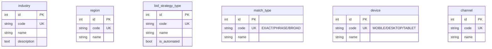
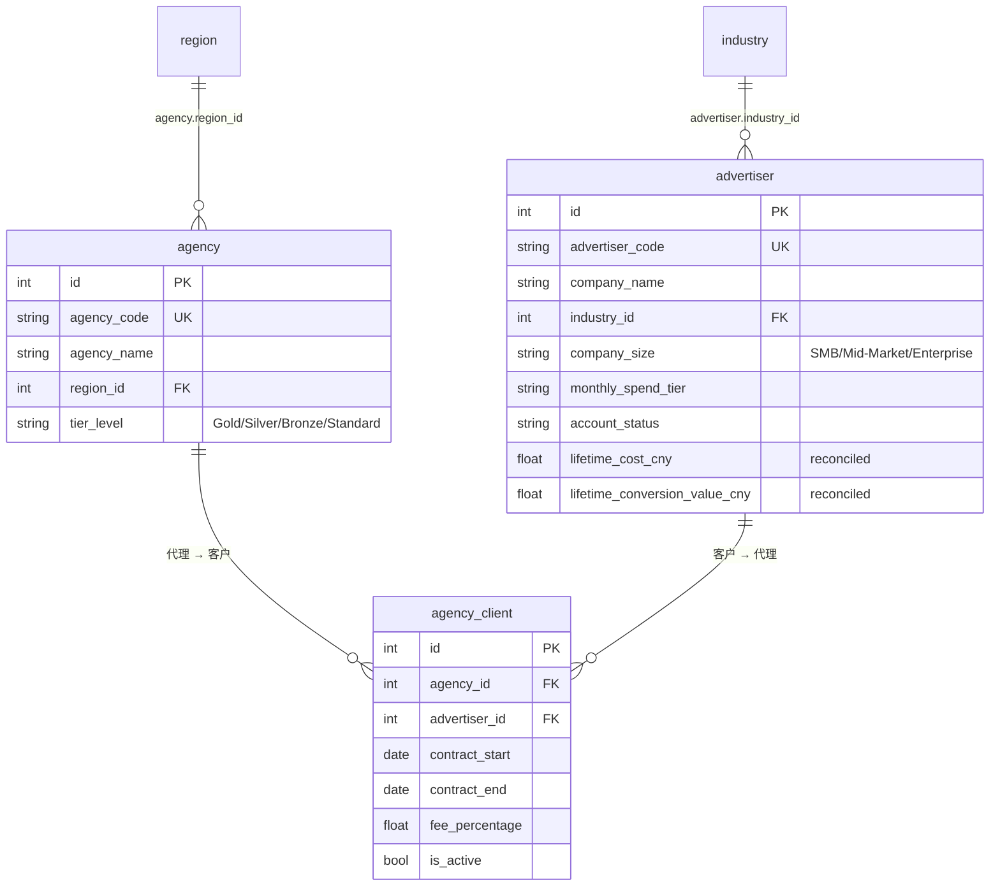
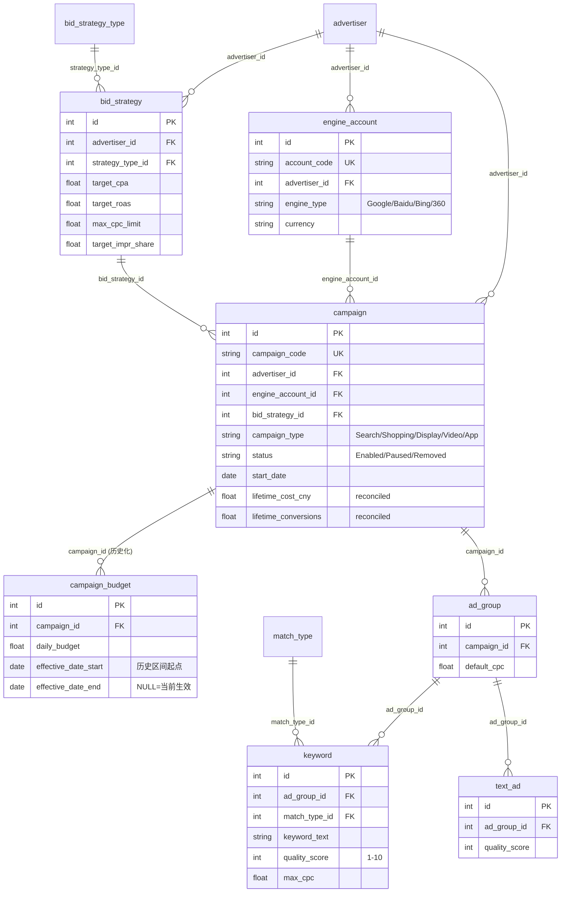
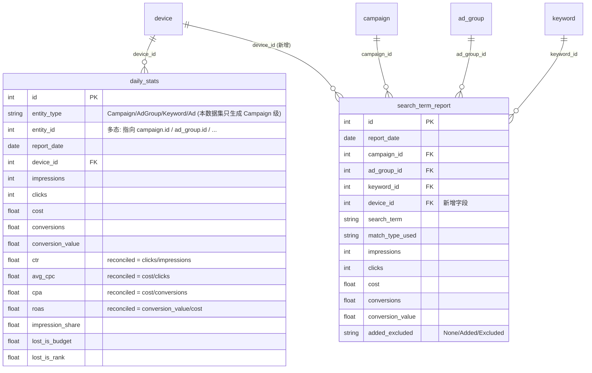
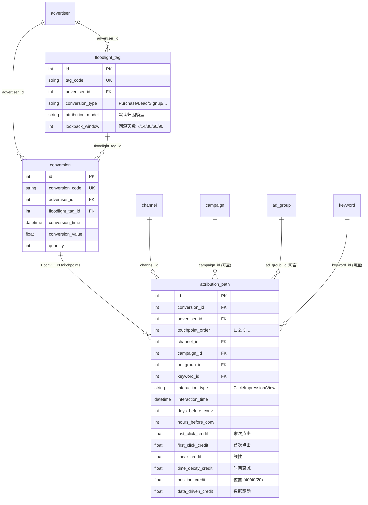
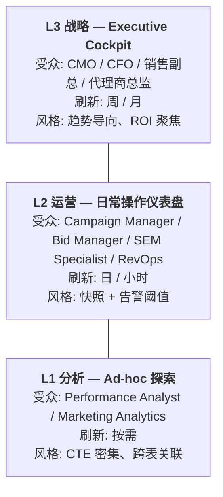
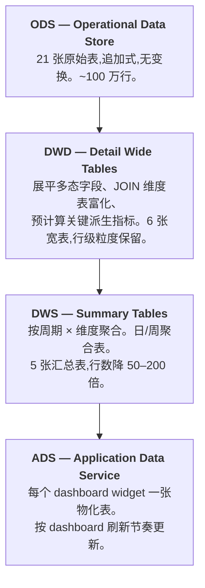
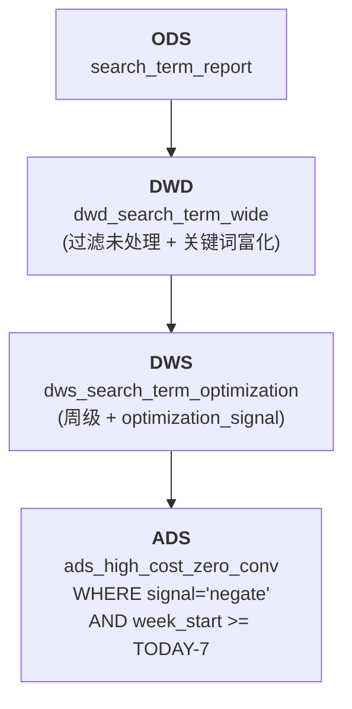

# Search Ads 360 智能分析 Agent - 数据模型文档

> **数据集:** `search_ads_360_agent_large`
> **复杂度:** Large (21 张表, ~1,000,000 行)
> **生成方:** Fake Data Generator Agent
> **参考当前日期 (REFERENCE_DATE):** `2026-06-01`

> 业务背景, 行业科普, 术语表, 指标公式请见 `01-search_ads_360_agent_large_business_context-cn.md`. 本文档只描述数据 (表结构, 关系, 约束, 生成规则, DDL).

---

## 目录

2. [数据集概览](#2-数据集概览)
3. [实体关系图](#3-实体关系图)
4. [表定义](#4-表定义)
5. [外键目录](#5-外键目录)
6. [对账不变式 (Reconciled Invariants)](#6-对账不变式-reconciled-invariants)
7. [数据生成规则](#7-数据生成规则)
8. [文件清单](#8-文件清单)
9. [SQLite DDL](#9-sqlite-ddl)
10. [BI 主题域与仪表盘蓝图](#10-bi-主题域与仪表盘蓝图)
11. [KPI 字典](#11-kpi-字典)
12. [数据分层 (DWD / DWS / ADS)](#12-数据分层-dwd--dws--ads)
13. [Human-Analyst 探索 → Agent 落地的双层架构](#13-human-analyst-探索--agent-落地的双层架构)
14. [附录: 常见查询模式](#14-附录-常见查询模式)

---

## 2. 数据集概览

### 2.1 关键数字

| 指标 | 值 |
|------|---|
| 表总数 | 21 |
| 总行数 | ~1,000,000 |
| 外键关系数 | 29 (不含 `daily_stats.entity_id` 多态字段) |
| 多对多关联表 | 1 (`agency_client`) |
| 多态字段表 | 1 (`daily_stats.entity_type/entity_id`) |
| 历史化字段表 | 1 (`campaign_budget.effective_date_start/end`) |
| 对账不变式 (reconciled) | 12 |
| SQLite 数据库大小 | ~120 MB |
| Faker locale | `zh_CN` (中文公司名、关键词、地区) |

### 2.2 各表行数

| # | 表 | 行数 | 类型 |
|---|-----|------|------|
| 01 | industry | 10 | 维度表 |
| 02 | region | 7 | 维度表 |
| 03 | bid_strategy_type | 8 | 维度表 (含 is_automated 标志) |
| 04 | match_type | 3 | 维度表 |
| 05 | device | 3 | 维度表 |
| 06 | channel | 6 | 维度表 |
| 07 | agency | 25 | 组织 |
| 08 | advertiser | 150 | 组织 (核心) |
| 09 | agency_client | ~120 | M:N 关联 |
| 10 | engine_account | ~300 | 账户结构 |
| 11 | bid_strategy | ~500 | 账户结构 |
| 12 | campaign | ~1,550 | 账户结构 (核心) |
| 13 | campaign_budget | ~2,500 | **历史化**: 每 campaign 1–3 条带 effective_date 区间 |
| 14 | ad_group | ~8,000 | 账户结构 |
| 15 | keyword | ~80,000 | 账户结构 (大表) |
| 16 | text_ad | ~24,000 | 账户结构 |
| 17 | floodlight_tag | ~500 | 转化 |
| 18 | daily_stats | ~395,000 | 效果 (最大表): 1,550 campaigns × ≤120 days × 3 devices,report_date 受 campaign 生效区间裁剪 (满窗上限 ~558K) |
| 19 | conversion | 25,000 | 转化事件 |
| 20 | attribution_path | ~100,000 | 归因: 25,000 conversions × ~4 touchpoints (randint 2–6) |
| 21 | search_term_report | ~180,000 | 搜索词 (新增 device_id);配额均摊到全部启用关键词 |

### 2.3 实际业务指标 (生成数据的真实分布)

| 指标 | 实际值 | 行业典型 |
|------|--------|---------|
| **CTR** (Campaign 级) | ~3.5% | 3–5% (搜索广告) |
| **平均 CPC** (CNY) | ~¥4.5 | 行业差异大,2–15 |
| **整体 CPA** (CNY) | ~¥165 | 50–500 |
| **整体 ROAS** | ~3.3x | 2–6x 算健康 |
| **Mobile 占比** (impressions) | ~55% | 50–65% |
| **Quality Score 平均** | 6.5 | 6–8 算健康 |
| **预算损失展示份额** (lost_is_budget 平均) | ~10% | <15% 健康 (但 ~15% 受限 campaign 可达 40–70%) |
| **质量损失展示份额** (lost_is_rank 平均) | ~33% | 偏高: impression_share 均值仅 ~57%, 剩余份额多由排名/质量损失承担, 是主要优化杠杆 |
| **Conversion → Attribution 平均路径长度** | ~4 触点 | 3–7 |

---

## 3. 实体关系图

数据集分为 5 个逻辑子图。所有表通过外键串联,以下 Mermaid 图按主题域拆分以提升可读性。

### 3.1 维度表 (Lookup Tables)



### 3.2 组织结构 (Organization)



### 3.3 广告账户层级 (Campaign Hierarchy)



### 3.4 效果数据 (Performance Data)



> **注意 `daily_stats` 的多态设计**: 表里 `entity_type` 区分 Campaign/AdGroup/Keyword/Ad 四种实体,`entity_id` 指向对应实体的 id。**当前数据集只生成 Campaign 级数据** (`entity_type = 'Campaign'`),保留 AdGroup/Keyword/Ad 层级以便未来扩展。所有针对 daily_stats 的 JOIN 都需要带 `AND entity_type = 'Campaign'` 谓词。

### 3.5 转化与归因 (Conversion & Attribution)



> **归因模型权重对账**: 对每个 `conversion`,各归因模型的 credit 之和 ≈ 1.0 (除浮点误差外严格成立)。详见 §6。

---

## 4. 表定义

### 4.1 `industry` (行业分类)

**描述:** 广告主的行业分类。10 个中国市场主流广告投放行业。用于按行业切片分析效果。

| 列 | 类型 | 约束 | 描述 |
|----|------|------|------|
| id | INTEGER | PK | 代理主键 |
| code | VARCHAR(30) | UNIQUE, NOT NULL | 行业代码 `IND_01` … |
| name | VARCHAR(50) | NOT NULL | 中文行业名 |
| description | TEXT | NULL | 行业简述 |

**全部 10 行:** 电商零售 / 教育培训 / 金融服务 / 旅游出行 / 本地生活 / 游戏娱乐 / 医疗健康 / 房产家居 / 汽车交通 / B2B企业服务

**被引用于:** `advertiser.industry_id`

---

### 4.2 `region` (地区)

**描述:** 代理商所在地区 (中国大区)。

| 列 | 类型 | 约束 | 描述 |
|----|------|------|------|
| id | INTEGER | PK | |
| code | VARCHAR(20) | UNIQUE | |
| name | VARCHAR(50) | NOT NULL | 华东/华北/华南/华中/西南/西北/东北 |

**被引用于:** `agency.region_id`

---

### 4.3 `bid_strategy_type` (出价策略类型)

**描述:** 8 种标准出价策略 (与 Google Ads 一致),`is_automated` 区分手动 vs 自动出价。

| 列 | 类型 | 约束 | 描述 |
|----|------|------|------|
| id | INTEGER | PK | |
| code | VARCHAR(30) | UNIQUE | 如 `TARGET_CPA` |
| name | VARCHAR(100) | NOT NULL | 中文策略名 |
| description | TEXT | NULL | 策略说明 |
| is_automated | BOOLEAN | NOT NULL | True = 自动出价 |

**全部 8 行:**

| id | code | name | is_automated |
|----|------|------|--------------|
| 1 | MANUAL_CPC | Manual CPC | false |
| 2 | ENHANCED_CPC | Enhanced CPC | true |
| 3 | TARGET_CPA | Target CPA | true |
| 4 | TARGET_ROAS | Target ROAS | true |
| 5 | MAXIMIZE_CONVERSIONS | Maximize Conversions | true |
| 6 | MAXIMIZE_CONVERSION_VALUE | Maximize Conversion Value | true |
| 7 | MAXIMIZE_CLICKS | Maximize Clicks | true |
| 8 | TARGET_IMPRESSION_SHARE | Target Impression Share | true |

**被引用于:** `bid_strategy.strategy_type_id`

---

### 4.4 `match_type` (关键词匹配类型)

**全部 3 行:**

| id | code | name |
|----|------|------|
| 1 | EXACT | 完全匹配 |
| 2 | PHRASE | 短语匹配 |
| 3 | BROAD | 广泛匹配 |

**被引用于:** `keyword.match_type_id`, `search_term_report.match_type_used` (字符串非 FK,记录实际触发的匹配类型)

---

### 4.5 `device` (设备类型)

**全部 3 行:**

| id | code | name |
|----|------|------|
| 1 | MOBILE | 移动设备 |
| 2 | DESKTOP | 桌面设备 |
| 3 | TABLET | 平板设备 |

**被引用于:** `daily_stats.device_id`, `search_term_report.device_id` (**新增**)

---

### 4.6 `channel` (流量渠道)

**描述:** 归因路径中的渠道维度。6 种典型流量来源。

| id | code | name |
|----|------|------|
| 1 | PAID_SEARCH | 付费搜索 |
| 2 | DISPLAY | 展示广告 |
| 3 | SOCIAL | 社交媒体 |
| 4 | EMAIL | 电子邮件 |
| 5 | DIRECT | 直接访问 |
| 6 | ORGANIC_SEARCH | 自然搜索 |

**被引用于:** `attribution_path.channel_id`

---

### 4.7 `agency` (代理商)

**描述:** 服务广告主的第三方代理商,通常按地区运营,有等级分层 (Gold > Silver > Bronze > Standard)。

| 列 | 类型 | 约束 | 描述 |
|----|------|------|------|
| id | INTEGER | PK | |
| agency_code | VARCHAR(20) | UNIQUE | `AGY_001` |
| agency_name | VARCHAR(100) | NOT NULL | "{中文公司名}广告" |
| region_id | INTEGER | FK → region.id | |
| tier_level | VARCHAR(20) | NOT NULL | Gold (10%) / Silver (30%) / Bronze (40%) / Standard (20%) |
| account_manager | VARCHAR(50) | NULL | 代理商内部负责人 |
| contact_email | VARCHAR(100) | NULL | |
| contact_phone | VARCHAR(20) | NULL | |
| created_at | DATETIME | NOT NULL | 接入 Lumenly Ads 时间 (-3y ~ -1y) |

**示例行:**

| id | agency_name | region | tier_level |
|----|-------------|--------|-----------|
| 1 | 华联科技广告 | 华东 | Silver |
| 2 | 中通达广告 | 华北 | Gold |

**被引用于:** `agency_client.agency_id`

---

### 4.8 `advertiser` (广告主)

**描述:** Lumenly Ads 的核心业务实体 —— 直接客户。决定 campaign 数量、预算量级与服务模式。带两个对账字段总结其全生命周期的业绩。

| 列 | 类型 | 约束 | 描述 |
|----|------|------|------|
| id | INTEGER | PK | |
| advertiser_code | VARCHAR(20) | UNIQUE | `ADV_001` |
| company_name | VARCHAR(100) | NOT NULL | 中文公司名 |
| industry_id | INTEGER | FK → industry.id | |
| sub_industry | VARCHAR(50) | NULL | 细分行业 (本数据集均为 NULL) |
| company_size | VARCHAR(20) | NOT NULL | SMB (50%) / Mid-Market (35%) / Enterprise (15%) |
| monthly_spend_tier | VARCHAR(20) | NOT NULL | `<10K` / `10K-50K` / `50K-200K` / `>200K` (CNY) |
| primary_goal | VARCHAR(50) | NOT NULL | 品牌曝光 / 获客引流 / 销售转化 / App下载 |
| website_url | VARCHAR(200) | NULL | |
| created_at | DATETIME | NOT NULL | 接入 Lumenly Ads 时间 (-2y ~ -6m) |
| account_status | VARCHAR(20) | NOT NULL | Active (85%) / Paused (12%) / Suspended (3%) |
| **lifetime_cost_cny** | FLOAT | NOT NULL | **对账** = SUM(daily_stats.cost) 通过 campaign 关联 |
| **lifetime_conversion_value_cny** | FLOAT | NOT NULL | **对账** = SUM(daily_stats.conversion_value) 通过 campaign 关联 |

**层级分布与消费分布关联:**

| company_size | <10K | 10K-50K | 50K-200K | >200K |
|--------------|------|---------|----------|-------|
| SMB | 40% | 40% | 15% | 5% |
| Mid-Market | 10% | 40% | 40% | 10% |
| Enterprise | 5% | 15% | 40% | 40% |

**示例行:**

| id | company_name | industry | company_size | monthly_spend_tier | account_status |
|----|--------------|----------|--------------|---------------------|----------------|
| 1 | 华联科技 | 电商零售 | Mid-Market | 50K-200K | Active |
| 2 | 金信信用 | 金融服务 | Enterprise | >200K | Active |

**被引用于:** `agency_client.advertiser_id`, `engine_account.advertiser_id`, `bid_strategy.advertiser_id`, `campaign.advertiser_id`, `floodlight_tag.advertiser_id`, `conversion.advertiser_id`, `attribution_path.advertiser_id`

---

### 4.9 `agency_client` (代理-客户合同)

**描述:** 多对多关联表。约 80% 的广告主由代理商管理 (Agency-managed),其余 20% 是直客 (Direct)。记录合同期与服务费比例。

| 列 | 类型 | 约束 | 描述 |
|----|------|------|------|
| id | INTEGER | PK | |
| agency_id | INTEGER | FK → agency.id | |
| advertiser_id | INTEGER | FK → advertiser.id | |
| contract_start | DATE | NOT NULL | |
| contract_end | DATE | NULL | NULL = 长期/未结束 |
| fee_percentage | FLOAT | NOT NULL | 8.0 – 20.0 (服务费比例) |
| is_active | BOOLEAN | NOT NULL | contract_end IS NULL OR contract_end > today |

**业务规则:** 一个广告主同一时间只与一家代理商绑定 (本数据集生成时每个被管理的 advertiser 只对应一条 agency_client 记录)。

---

### 4.10 `engine_account` (搜索引擎账户)

**描述:** 广告主在不同搜索引擎下开设的账户 (一个广告主可在多个引擎同时投放)。

| 列 | 类型 | 约束 | 描述 |
|----|------|------|------|
| id | INTEGER | PK | |
| account_code | VARCHAR(20) | UNIQUE | `ENG_0001` |
| advertiser_id | INTEGER | FK → advertiser.id | |
| engine_type | VARCHAR(30) | NOT NULL | Google (35%) / Baidu (40%) / Bing (15%) / 360 (10%) |
| account_name | VARCHAR(100) | NOT NULL | |
| currency | VARCHAR(10) | NOT NULL | CNY |
| timezone | VARCHAR(50) | NOT NULL | Asia/Shanghai |
| status | VARCHAR(20) | NOT NULL | Active (90%) / Paused (10%) |
| created_at | DATETIME | NOT NULL | |

**每个 advertiser 1–3 个 engine_account。** 平均 ~2 个。

---

### 4.11 `bid_strategy` (出价策略实例)

**描述:** 广告主层级的出价策略实例 (与 strategy_type 是 N:1)。每个 campaign 可关联到一个 bid_strategy。策略参数根据 type 不同填充不同字段:

- Manual CPC / Enhanced CPC → `max_cpc_limit`
- Target CPA → `target_cpa`
- Target ROAS → `target_roas`
- Target Impression Share → `target_impr_share` + `impr_share_location`
- Maximize* → 不需要额外参数

| 列 | 类型 | 约束 | 描述 |
|----|------|------|------|
| id | INTEGER | PK | |
| strategy_code | VARCHAR(20) | UNIQUE | |
| advertiser_id | INTEGER | FK → advertiser.id | |
| strategy_name | VARCHAR(100) | NOT NULL | |
| strategy_type_id | INTEGER | FK → bid_strategy_type.id | |
| target_cpa | FLOAT | NULL | 仅 type=3 |
| target_roas | FLOAT | NULL | 仅 type=4 (2.0–8.0) |
| max_cpc_limit | FLOAT | NULL | 仅 type=1,2 (1–20 CNY) |
| target_impr_share | FLOAT | NULL | 仅 type=8 (50–95) |
| impr_share_location | VARCHAR(30) | NULL | Anywhere/Top of page/Absolute top |
| status | VARCHAR(20) | NOT NULL | Active (80%) / Paused (20%) |
| created_at | DATETIME | NOT NULL | |
| last_modified | DATETIME | NULL | |

**每个 advertiser 2–5 个策略。**

---

### 4.12 `campaign` (广告系列)

**描述:** 广告投放最重要的单位 —— 关联到一个 engine_account、一个 bid_strategy,下挂多个 ad_group。带两个对账字段统计全生命周期成本与转化。

| 列 | 类型 | 约束 | 描述 |
|----|------|------|------|
| id | INTEGER | PK | |
| campaign_code | VARCHAR(20) | UNIQUE | `CMP_00001` |
| advertiser_id | INTEGER | FK → advertiser.id | |
| engine_account_id | INTEGER | FK → engine_account.id | |
| campaign_name | VARCHAR(200) | NOT NULL | 如 "电商零售_品牌词_PC端_42" |
| campaign_type | VARCHAR(30) | NOT NULL | Search (50%) / Shopping (20%) / Display (15%) / Video (10%) / App (5%) |
| campaign_subtype | VARCHAR(30) | NULL | Standard / Smart / Performance Max (仅 Search) |
| bid_strategy_id | INTEGER | FK → bid_strategy.id (NULL) | 大多数 campaign 有策略 |
| status | VARCHAR(20) | NOT NULL | Enabled (70%) / Paused (25%) / Removed (5%) |
| start_date | DATE | NOT NULL | |
| end_date | DATE | NULL | 70% campaign 无结束日期 (持续运行) |
| targeting_location | VARCHAR(100) | NULL | 全国 / 华东地区 / 一线城市 / ... |
| targeting_language | VARCHAR(50) | NULL | 中文 |
| targeting_device | VARCHAR(50) | NULL | All / Mobile / Desktop |
| created_at | DATETIME | NOT NULL | = combine(start_date, 00:00) |
| **lifetime_cost_cny** | FLOAT | NOT NULL | **对账** = SUM(daily_stats.cost) WHERE entity_type='Campaign' AND entity_id=this.id |
| **lifetime_conversions** | FLOAT | NOT NULL | **对账** = SUM(daily_stats.conversions) WHERE ... |

**每个 advertiser 5–15 个 campaign。**

**被引用于:** `campaign_budget.campaign_id`, `ad_group.campaign_id`, `attribution_path.campaign_id`, `search_term_report.campaign_id`

---

### 4.13 `campaign_budget` (广告系列预算 — 历史化)

**描述:** **历史化表 (slowly changing dimension type 2)**。每个 campaign 有 1–3 条预算记录,记录预算调整历史。在任一日期,**恰好一条** budget 记录 (effective_date_start ≤ 日期 < effective_date_end) 生效;最新一条的 `effective_date_end` = NULL 表示当前生效。

| 列 | 类型 | 约束 | 描述 |
|----|------|------|------|
| id | INTEGER | PK | |
| campaign_id | INTEGER | FK → campaign.id | |
| daily_budget | FLOAT | NOT NULL | **锚定到该 campaign 实际日均花费**: 普通 campaign 花费为预算的 55–95% (使用率 <100%), 预算受限 campaign 花费 ≥ 预算 (使用率 >100%) |
| monthly_budget | FLOAT | NULL | = daily_budget × 30 |
| budget_delivery | VARCHAR(30) | NOT NULL | Standard (80%) / Accelerated (20%) |
| **effective_date_start** | DATE | NOT NULL | 此预算生效起始日 |
| **effective_date_end** | DATE | NULL | 此预算失效日 (开区间);**NULL = 至今仍生效** |
| created_at | DATETIME | NOT NULL | |

**业务规则:**

- 每 campaign 的所有 budget 记录,按 `effective_date_start` 排序后,前一条的 `effective_date_end` = 后一条的 `effective_date_start`
- 每 campaign 最新一条记录的 `effective_date_end` = NULL (仍在投放) 或 = campaign.end_date (已结束)
- `daily_budget` 先按"该 campaign 日均花费 / 目标使用率"锚定一个基准值, 各历史段在基准值 ±10% 内小幅波动 (体现预算调整, 但量级稳定, 使预算使用率口径合理)

**典型查询模式 — 取某日生效的预算:**

```sql
SELECT * FROM campaign_budget
WHERE campaign_id = ?
  AND effective_date_start <= '2026-05-15'
  AND (effective_date_end IS NULL OR effective_date_end > '2026-05-15');
```

---

### 4.14 `ad_group` (广告组)

**描述:** Campaign 下一级分组,关键词与广告挂在 ad_group 下。

| 列 | 类型 | 约束 | 描述 |
|----|------|------|------|
| id | INTEGER | PK | |
| ad_group_code | VARCHAR(20) | UNIQUE | |
| campaign_id | INTEGER | FK → campaign.id | |
| ad_group_name | VARCHAR(200) | NOT NULL | 如 "网上购物_广告组" |
| default_cpc | FLOAT | NULL | 0.5 – 15 CNY |
| status | VARCHAR(20) | NOT NULL | Enabled (75%) / Paused (20%) / Removed (5%) |
| created_at | DATETIME | NOT NULL | |

**每个 campaign 3–8 个 ad_group。**

---

### 4.15 `keyword` (关键词)

**描述:** 最细粒度的投放单位。带质量得分 (Quality Score 1–10) 与三个子维度评分。

| 列 | 类型 | 约束 | 描述 |
|----|------|------|------|
| id | INTEGER | PK | |
| keyword_code | VARCHAR(20) | UNIQUE | |
| ad_group_id | INTEGER | FK → ad_group.id | |
| keyword_text | VARCHAR(300) | NOT NULL | 中文关键词 (按行业分库) |
| match_type_id | INTEGER | FK → match_type.id | |
| status | VARCHAR(20) | NOT NULL | Enabled (80%) / Paused (15%) / Removed (5%) |
| max_cpc | FLOAT | NULL | 0.5 – 20 CNY |
| quality_score | INTEGER | NULL | 1 – 10 (实际生成范围 3–10) |
| expected_ctr | VARCHAR(20) | NULL | Below Average / Average / Above Average |
| ad_relevance | VARCHAR(20) | NULL | 同上 |
| landing_page_exp | VARCHAR(20) | NULL | 同上 |
| first_page_cpc | FLOAT | NULL | = max_cpc × 0.6 |
| top_of_page_cpc | FLOAT | NULL | = max_cpc × 1.2 |
| created_at | DATETIME | NOT NULL | |

**每个 ad_group 5–15 个关键词。共 ~80,000 行。**

**Quality Score 与 Expected CTR / Ad Relevance / Landing Page Exp 的关系**: 三个子维度均为 "Above Average" 时 QS 通常 8–10;均为 "Below Average" 时 QS 通常 3–5。但本数据集为简化,三者独立采样,实际可能不完全自洽 (这本身是一种 *分析师的练习题*: "找出三个子维度都高但 QS 反而低的关键词")。

---

### 4.16 `text_ad` (文字广告)

**描述:** 一组 headline + description 的广告文案。

| 列 | 类型 | 约束 | 描述 |
|----|------|------|------|
| id | INTEGER | PK | |
| ad_code | VARCHAR(20) | UNIQUE | |
| ad_group_id | INTEGER | FK → ad_group.id | |
| headline_1 | VARCHAR(100) | NOT NULL | |
| headline_2 | VARCHAR(100) | NULL | |
| headline_3 | VARCHAR(100) | NULL | 70% 有 |
| description_1 | VARCHAR(200) | NOT NULL | |
| description_2 | VARCHAR(200) | NULL | 60% 有 |
| final_url | VARCHAR(500) | NOT NULL | |
| display_url | VARCHAR(200) | NULL | |
| status | VARCHAR(20) | NOT NULL | |
| quality_score | INTEGER | NULL | 4 – 10 |
| created_at | DATETIME | NOT NULL | |

**每个 ad_group 2–4 个 text_ad。**

---

### 4.17 `floodlight_tag` (Floodlight 转化跟踪代码)

**描述:** Search Ads 360 概念 —— 类似像素 (pixel) 的转化跟踪标签。一个广告主可创建多个 floodlight tag 跟踪不同类型的转化 (Purchase / Lead / Signup / AddToCart 等)。

| 列 | 类型 | 约束 | 描述 |
|----|------|------|------|
| id | INTEGER | PK | |
| tag_code | VARCHAR(30) | UNIQUE | |
| advertiser_id | INTEGER | FK → advertiser.id | |
| tag_name | VARCHAR(100) | NOT NULL | "{conv_type}_转化跟踪" |
| conversion_type | VARCHAR(50) | NOT NULL | Purchase / Lead / Signup / PageView / AddToCart / AppInstall |
| counting_method | VARCHAR(30) | NOT NULL | Standard / Unique |
| attribution_model | VARCHAR(30) | NOT NULL | Last Click / First Click / Linear / Time Decay / Position Based / Data Driven |
| lookback_window | INTEGER | NOT NULL | 7 / 14 / 30 / 60 / 90 (天) |
| status | VARCHAR(20) | NOT NULL | Active |
| created_at | DATETIME | NOT NULL | |

**每个 advertiser 2–5 个 floodlight_tag。**

---

### 4.18 `daily_stats` (每日效果数据 — 最大表)

**描述:** **数据集的核心事实表**。每日每 Campaign 每 Device 一行,带核心效果指标、衍生指标、竞争指标 (展示份额)。**当前数据集只生成 Campaign 级 (entity_type='Campaign')**,共 ~395,000 行 (1,550 campaigns × ≤120 days × 3 devices;每个 campaign 的 report_date 被裁剪到其生效区间内,故低于满窗上限)。

| 列 | 类型 | 约束 | 描述 |
|----|------|------|------|
| id | INTEGER | PK | |
| entity_type | VARCHAR(20) | NOT NULL | 'Campaign' (当前唯一值) |
| entity_id | INTEGER | NOT NULL | 多态 → campaign.id (无 FK 约束) |
| report_date | DATE | NOT NULL | 2026-02-01 ~ 2026-06-01,且 ≥ campaign.start_date、≤ min(campaign.end_date, 2026-06-01) |
| device_id | INTEGER | FK → device.id | |
| **核心指标** | | | |
| impressions | INTEGER | NOT NULL | 100 – 50,000 |
| clicks | INTEGER | NOT NULL | = impressions × CTR |
| cost | FLOAT | NOT NULL | = clicks × avg_cpc |
| conversions | FLOAT | NOT NULL | = clicks × conv_rate |
| conversion_value | FLOAT | NOT NULL | = conversions × avg_conv_value |
| **衍生指标 (reconciled)** | | | |
| ctr | FLOAT | NULL | **对账** = clicks / impressions |
| avg_cpc | FLOAT | NULL | **对账** = cost / clicks |
| cpa | FLOAT | NULL | **对账** = cost / conversions (NULL if conversions=0) |
| roas | FLOAT | NULL | **对账** = conversion_value / cost |
| **竞争指标 (展示份额)** | | | |
| impression_share | FLOAT | NULL | 20 – 95 (%) |
| search_impr_share | FLOAT | NULL | = impression_share |
| lost_is_budget | FLOAT | NULL | 0 – ~70 (%) — 因预算损失 = 剩余份额 ×比例;~15% 预算受限 campaign 占剩余的 40–85%,可超过 20%/30% |
| lost_is_rank | FLOAT | NULL | = 100 - impression_share - lost_is_budget (≥ 0) |
| search_abs_top_is | FLOAT | NULL | 绝对页首份额,≤ search_top_is |
| search_top_is | FLOAT | NULL | 页首份额,≤ impression_share |

**展示份额关系:** `impression_share + lost_is_budget + lost_is_rank = 100`,这三者把所有可能的展示机会划分为 (你拿到 / 因预算丢失 / 因质量&出价丢失)。

**典型查询的反模式:** 忘记 `entity_type='Campaign'` 过滤。所有针对 `daily_stats` 的 JOIN 必须显式带这个谓词,即使现在只有一种值。

**索引建议:** `(entity_type, entity_id, report_date)`, `(report_date, device_id)`.

---

### 4.19 `conversion` (转化事件)

**描述:** 每条记录代表一次完整的转化事件 (购买/留资/注册等)。每个 conversion 会有一条对应的 `attribution_path` 记录链。

| 列 | 类型 | 约束 | 描述 |
|----|------|------|------|
| id | INTEGER | PK | |
| conversion_code | VARCHAR(30) | UNIQUE | `CONV_000001` |
| advertiser_id | INTEGER | FK → advertiser.id | |
| floodlight_tag_id | INTEGER | FK → floodlight_tag.id | 决定 conversion_type |
| conversion_time | DATETIME | NOT NULL | 最近 90 天内 |
| conversion_value | FLOAT | NOT NULL | 50 – 2,000 CNY (购买类) / 1 – 50 CNY (留资类) |
| currency | VARCHAR(10) | NOT NULL | CNY |
| quantity | INTEGER | NOT NULL | 1 – 5 |

**共 25,000 行。**

---

### 4.20 `attribution_path` (归因路径)

**描述:** **多归因模型的核心**。每个 conversion 对应 2–6 个 touchpoint (转化前的渠道触点),每个 touchpoint 在 6 种归因模型下都有对应的 credit (功劳权重)。

| 列 | 类型 | 约束 | 描述 |
|----|------|------|------|
| id | INTEGER | PK | |
| conversion_id | INTEGER | FK → conversion.id | |
| advertiser_id | INTEGER | FK → advertiser.id | 冗余 (从 conversion 派生) |
| touchpoint_order | INTEGER | NOT NULL | 1, 2, 3, ... (1 = 最早, MAX = 最末/转化前最后一个) |
| channel_id | INTEGER | FK → channel.id | |
| campaign_id | INTEGER | FK → campaign.id (NULL) | 80% 触点有 campaign |
| ad_group_id | INTEGER | FK → ad_group.id (NULL) | 56% (= 80%×70%) 触点有 ad_group |
| keyword_id | INTEGER | FK → keyword.id (NULL) | 34% (= 56%×60%) 触点有 keyword |
| interaction_type | VARCHAR(20) | NOT NULL | Click (70%) / Impression (25%) / View (5%) |
| interaction_time | DATETIME | NOT NULL | conversion_time - hours_before_conv hours |
| days_before_conv | INTEGER | NOT NULL | = hours_before_conv // 24 |
| hours_before_conv | INTEGER | NOT NULL | 1 – 720 (30 天内) |
| **6 个归因模型权重 (reconciled)** | | | |
| last_click_credit | FLOAT | NOT NULL | 末次触点 = 1.0, 其余 = 0.0 |
| first_click_credit | FLOAT | NOT NULL | 首次触点 = 1.0, 其余 = 0.0 |
| linear_credit | FLOAT | NOT NULL | 平均分配 = 1.0 / N |
| time_decay_credit | FLOAT | NOT NULL | 几何级数: 2^i / SUM(2^j),越靠近转化权重越大 |
| position_credit | FLOAT | NOT NULL | N≥3 首末各 40%、中间均分 20%;N=2 各 50%;N=1 为 100% (各情形之和恒 = 1.0) |
| data_driven_credit | FLOAT | NOT NULL | 模拟数据驱动归因 (归一化的随机权重) |

**对账保证:** 对每个 conversion_id,每个归因模型下的 credit 之和 = 1.0。

---

### 4.21 `search_term_report` (搜索词报告)

**描述:** **搜索词挖掘的核心数据**。每条记录代表"某天某 keyword 触发了某 search_term 一次"。带 `added_excluded` 标记记录优化动作 (是否已加为关键词 / 否定关键词)。**新增 `device_id` 支持设备维度分析**。

| 列 | 类型 | 约束 | 描述 |
|----|------|------|------|
| id | INTEGER | PK | |
| report_date | DATE | NOT NULL | 最近 30 天 |
| campaign_id | INTEGER | FK → campaign.id | |
| ad_group_id | INTEGER | FK → ad_group.id | |
| keyword_id | INTEGER | FK → keyword.id | 触发该搜索词的"种子"关键词 |
| **device_id** | INTEGER | FK → device.id | **新增字段** |
| search_term | VARCHAR(500) | NOT NULL | 用户实际搜索词: 30% = 种子 keyword_text 本身 (头部词), 70% = 地名(可选) + 种子词 + 1–3 个修饰词 拼成的长尾词 (全库 distinct ≈ 95,000+) |
| match_type_used | VARCHAR(20) | NOT NULL | EXACT / PHRASE / BROAD (实际触发的匹配类型) |
| impressions | INTEGER | NOT NULL | 1 – 500 |
| clicks | INTEGER | NOT NULL | |
| cost | FLOAT | NOT NULL | |
| conversions | FLOAT | NOT NULL | 仅 ~30% 有点击的搜索词产生转化, 其余 = 0 (真实长尾: 多数词有点击无转化) |
| conversion_value | FLOAT | NOT NULL | conversions=0 时为 0 |
| added_excluded | VARCHAR(20) | NULL (实测始终有值) | `'None'` (80%) / `'Added'` (15%) / `'Excluded'` (5%) — 已加为关键词/已加为否定词。**注意: 'None' 是字面量字符串 (非 SQL NULL), 过滤"未处理"用 `= 'None'` 而非 `IS NULL`** |

**共 ~180,000 行** (动态配额: ~90% 上限均摊到全部启用关键词,实际约 181,000)。

**业务含义 `added_excluded`:**
- `None` = 还没人处理过 (等待分析师挖掘)
- `Added` = 这个搜索词表现好,已经加为正式关键词
- `Excluded` = 这个搜索词表现差,已经加为否定关键词

→ **典型练习题**: "找出 `added_excluded='None'` 但花费高、零转化的搜索词,推荐为否定关键词候选。"

---

## 5. 外键目录

共 29 个外键关系 (不含 `daily_stats.entity_id` 多态字段,它按设计无 FK 约束)。

| FK 源 | → 引用 | 是否可空 | 备注 |
|-------|--------|---------|------|
| `agency.region_id` | `region.id` | NO | |
| `advertiser.industry_id` | `industry.id` | NO | |
| `agency_client.agency_id` | `agency.id` | NO | |
| `agency_client.advertiser_id` | `advertiser.id` | NO | |
| `engine_account.advertiser_id` | `advertiser.id` | NO | |
| `bid_strategy.advertiser_id` | `advertiser.id` | NO | |
| `bid_strategy.strategy_type_id` | `bid_strategy_type.id` | NO | |
| `campaign.advertiser_id` | `advertiser.id` | NO | |
| `campaign.engine_account_id` | `engine_account.id` | NO | |
| `campaign.bid_strategy_id` | `bid_strategy.id` | YES | 少数 campaign 无策略 |
| `campaign_budget.campaign_id` | `campaign.id` | NO | |
| `ad_group.campaign_id` | `campaign.id` | NO | |
| `keyword.ad_group_id` | `ad_group.id` | NO | |
| `keyword.match_type_id` | `match_type.id` | NO | |
| `text_ad.ad_group_id` | `ad_group.id` | NO | |
| `floodlight_tag.advertiser_id` | `advertiser.id` | NO | |
| `daily_stats.device_id` | `device.id` | NO | |
| `daily_stats.entity_id` | (polymorphic, 无 FK) | NO | 当前只指向 campaign.id |
| `conversion.advertiser_id` | `advertiser.id` | NO | |
| `conversion.floodlight_tag_id` | `floodlight_tag.id` | NO | |
| `attribution_path.conversion_id` | `conversion.id` | NO | |
| `attribution_path.advertiser_id` | `advertiser.id` | NO | 冗余 |
| `attribution_path.channel_id` | `channel.id` | NO | |
| `attribution_path.campaign_id` | `campaign.id` | YES | ~80% 有 |
| `attribution_path.ad_group_id` | `ad_group.id` | YES | ~56% 有 |
| `attribution_path.keyword_id` | `keyword.id` | YES | ~34% 有 |
| `search_term_report.campaign_id` | `campaign.id` | NO | |
| `search_term_report.ad_group_id` | `ad_group.id` | NO | |
| `search_term_report.keyword_id` | `keyword.id` | NO | |
| `search_term_report.device_id` | `device.id` | NO | **新增** |

### 多态关系说明 (daily_stats)

`daily_stats.entity_type/entity_id` 是 **多态关联** (polymorphic association)。`entity_type` 取值集合 `{Campaign, AdGroup, Keyword, Ad}`,`entity_id` 指向对应表的 PK。当前数据集只生成 `entity_type='Campaign'` 一种,但 schema 保留扩展能力。

**对 SQL 的含义:** 所有 JOIN 必须显式带 `AND ds.entity_type = 'Campaign'`,例如:

```sql
SELECT *
FROM daily_stats ds
JOIN campaign c ON ds.entity_id = c.id AND ds.entity_type = 'Campaign'
WHERE ds.report_date >= DATE('2026-05-01');
```

---

## 6. 对账不变式 (Reconciled Invariants)

**对账 (Reconciliation)** = 在所有行生成完毕后,父字段根据子行确定性地计算得出。下列不变式在生成的数据集中始终成立。

| # | 父字段 | 对账规则 | 校验方式 |
|---|--------|---------|---------|
| 1 | `daily_stats.ctr` | = clicks / impressions (per row) | `ABS(ctr - clicks*1.0/impressions) < 0.001` |
| 2 | `daily_stats.avg_cpc` | = cost / clicks (per row, NULL if clicks=0) | |
| 3 | `daily_stats.cpa` | = cost / conversions (NULL if conversions=0) | |
| 4 | `daily_stats.roas` | = conversion_value / cost (per row) | |
| 5 | `daily_stats.impression_share + lost_is_budget + lost_is_rank` | ≈ 100 (per row, 浮点误差 < 0.5) | |
| 6 | `attribution_path` per-model credit sum | = 1.0 per conversion (6 个模型独立) | `SUM(last_click_credit) GROUP BY conversion_id = 1.0` |
| 7 | `advertiser.lifetime_cost_cny` | = SUM(daily_stats.cost) 通过 campaign 关联 | `0` 违例 |
| 8 | `advertiser.lifetime_conversion_value_cny` | = SUM(daily_stats.conversion_value) 通过 campaign 关联 | `0` 违例 |
| 9 | `campaign.lifetime_cost_cny` / `lifetime_conversions` | = SUM 同上,但限定到此 campaign | `0` 违例 |
| 10 | `campaign_budget` 时间区间 | 同 campaign_id 下所有 budget 按 start 排序,前一条的 end = 后一条的 start;最后一条 end=NULL (campaign 仍在投放) 或 = campaign.end_date (campaign 已结束) | `0` 违例 |
| 11 | `search_term_report.conversions` ≤ `clicks` | 转化次数不能超过点击数 | `0` 违例 |
| 12 | `attribution_path` 触点编号 | per conversion: MAX(touchpoint_order) = COUNT(*) (1..N 连续) | `0` 违例 |

### 不变式 #5 业务含义 (展示份额对账)

`impression_share` (你拿到的展示份额) + `lost_is_budget` (因预算丢失) + `lost_is_rank` (因排名/质量丢失) = 100%。这三者把"所有可能展示给目标用户的机会"做了完整划分。如果 `lost_is_budget > 20%` (全文统一阈值,见 §11.2),说明预算严重不足,加预算可以直接拿到这部分展示。

### 不变式 #10 业务含义 (预算历史化)

`campaign_budget` 是一个 **slowly changing dimension type 2** 实现。任一日期查询某 campaign 当时的生效预算,使用模式:

```sql
SELECT daily_budget FROM campaign_budget
WHERE campaign_id = ?
  AND effective_date_start <= :query_date
  AND (effective_date_end IS NULL OR effective_date_end > :query_date);
```

---

## 7. 数据生成规则

### 7.1 时序顺序规则

1. `agency.created_at` < `agency_client.contract_start` < (所有相关业务时间)
2. `advertiser.created_at` < `engine_account.created_at` < `campaign.start_date` < `campaign_budget.effective_date_start`
3. `campaign.start_date` ≤ `ad_group.created_at` ≤ `keyword.created_at` / `text_ad.created_at`
4. `daily_stats.report_date` ≥ `campaign.start_date`
5. `conversion.conversion_time` 在最近 90 天内
6. `attribution_path.interaction_time` ≤ `conversion.conversion_time`
7. `attribution_path.touchpoint_order=1` 是最早的触点;MAX 是最末的
8. `search_term_report.report_date` 在最近 30 天内

### 7.2 分布规则

| 字段 | 分布 |
|------|------|
| `advertiser.company_size` | SMB 50% / Mid-Market 35% / Enterprise 15% |
| `advertiser.monthly_spend_tier` | 与 company_size 相关 (见 §4.8) |
| `advertiser.account_status` | Active 85% / Paused 12% / Suspended 3% |
| `agency.tier_level` | Gold 10% / Silver 30% / Bronze 40% / Standard 20% |
| `engine_account.engine_type` | Google 35% / Baidu 40% / Bing 15% / 360 10% |
| `campaign.campaign_type` | Search 50% / Shopping 20% / Display 15% / Video 10% / App 5% |
| `campaign.status` | Enabled 70% / Paused 25% / Removed 5% |
| `daily_stats.impressions` | uniform(100, 50000) × device 乘子 (Mobile 1.1 / Desktop 0.7 / Tablet 0.2) |
| `daily_stats.ctr` | uniform(0.012, 0.055) × campaign quality(0.7–1.4),实际平均 ~3.5% |
| `daily_stats.cost = clicks × cpc`,`cpc = uniform(0.5, 8.5)` | 实际平均 ~¥4.5 |
| `daily_stats.conv_rate` | uniform(0.005, 0.045) × campaign quality → CPA = cpc/conv_rate ≈ ¥165 |
| `daily_stats.conversion_value = conversions × avg_conv_value`,`avg_conv_value = uniform(100, 1000)` | → ROAS ≈ 3.3x |
| `daily_stats.lost_is_budget` | = (100 - impression_share) × 比例;普通 campaign 0–30%,~15% 预算受限 campaign 占剩余的 40–85% (平均 ~10%) |
| `campaign_budget.daily_budget` | **锚定到该 campaign 日均花费**: base = 日均花费 / 目标使用率 (普通 0.55–0.95, 受限 1.0–1.45), 各段在 base ±10% 波动 |
| `conversion.conversion_value` | 购买类 (Purchase/AddToCart/AppInstall) uniform(50, 2000);留资类 (Lead/Signup/PageView) uniform(1, 50) CNY |
| `attribution_path` touchpoint 数 | randint(2, 6) per conversion (平均 ~4) |
| `search_term_report.search_term` | 30% 种子词原词;70% = 地名(可选)+ 种子词 + random.sample(修饰词, 1–3) 长尾 |
| `search_term_report.conversions` | 仅 ~30% 有点击的搜索词转化, 其余 = 0 |

### 7.3 Faker 策略

| 字段类型 | Faker 方法 / 自定义 | 备注 |
|---------|---------------------|------|
| 中文公司名 | 自定义: `prefix + middle + suffix` 组合 | 16 × 16 × 10 个组合 |
| advertiser company_name | 同上 + 行业后缀 | |
| email / phone | `fake.email()`, `fake.phone_number()` (zh_CN) | |
| website_url | `https://www.{fake.domain_name()}` | |
| date / datetime | `fake.date_between()`, `fake.date_time_between()` | 范围根据上下文设定 |
| 关键词 keyword_text | 自定义 `KEYWORDS_BY_INDUSTRY` 字典 (10 行业 × 13-16 词) | |
| campaign_name | 模板化: "{行业}_{品牌/竞品/通用/...}_{设备}_{id}" | |
| 搜索词长尾 | 种子 keyword_text + `SEARCH_TERM_GEO` (30 地名) + `SEARCH_TERM_QUALIFIERS` (40 修饰词) 自由拼接 | 30% 原词, 70% 长尾 (地名可选 + 1–3 修饰词);全库 distinct ≈ 95,000+,绝大多数低频/唯一,支撑"否定词挖掘"等长尾查询 |

### 7.4 配置常量

```python
RANDOM_SEED = 42
TODAY = date(2026, 6, 1)
HISTORY_START = TODAY - timedelta(days=540)   # 18 months back
DAILY_STATS_DAYS = 120                         # daily_stats 覆盖天数
SEARCH_TERM_DAYS = 30                          # search_term_report 覆盖天数
CONVERSION_LOOKBACK_DAYS = 90                  # conversion 时间窗
FAKER_LOCALE = "zh_CN"
```

使用相同种子重新运行生成器会产生字节一致的输出 (除平台相关 Faker locale 数据差异外)。

---

## 8. 文件清单

| # | 文件名 | 表 | 行数 | 依赖 |
|---|--------|-----|------|------|
| 01 | 01_industry.tsv | industry | 10 | — |
| 02 | 02_region.tsv | region | 7 | — |
| 03 | 03_bid_strategy_type.tsv | bid_strategy_type | 8 | — |
| 04 | 04_match_type.tsv | match_type | 3 | — |
| 05 | 05_device.tsv | device | 3 | — |
| 06 | 06_channel.tsv | channel | 6 | — |
| 07 | 07_agency.tsv | agency | 25 | region |
| 08 | 08_advertiser.tsv | advertiser | 150 | industry |
| 09 | 09_agency_client.tsv | agency_client | ~120 | agency, advertiser |
| 10 | 10_engine_account.tsv | engine_account | ~300 | advertiser |
| 11 | 11_bid_strategy.tsv | bid_strategy | ~500 | advertiser, bid_strategy_type |
| 12 | 12_campaign.tsv | campaign | ~1,500 | advertiser, engine_account, bid_strategy |
| 13 | 13_campaign_budget.tsv | campaign_budget | ~3,000 | campaign |
| 14 | 14_ad_group.tsv | ad_group | ~8,000 | campaign |
| 15 | 15_keyword.tsv | keyword | ~80,000 | ad_group, match_type |
| 16 | 16_text_ad.tsv | text_ad | ~24,000 | ad_group |
| 17 | 17_floodlight_tag.tsv | floodlight_tag | ~500 | advertiser |
| 18 | 18_daily_stats.tsv | daily_stats | ~540,000 | campaign, device |
| 19 | 19_conversion.tsv | conversion | 25,000 | advertiser, floodlight_tag |
| 20 | 20_attribution_path.tsv | attribution_path | ~120,000 | conversion, channel, campaign, ad_group, keyword |
| 21 | 21_search_term_report.tsv | search_term_report | ~200,000 | campaign, ad_group, keyword, device |

**加载顺序即上述拓扑顺序。** 无 FK 依赖的表先加载;最大的事件表 (daily_stats, search_term_report, attribution_path) 最后加载。

---

## 9. SQLite DDL

```sql
-- 01 industry
CREATE TABLE industry (
    id INTEGER PRIMARY KEY,
    code VARCHAR(30) NOT NULL UNIQUE,
    name VARCHAR(50) NOT NULL,
    description TEXT
);

-- 02 region
CREATE TABLE region (
    id INTEGER PRIMARY KEY,
    code VARCHAR(20) NOT NULL UNIQUE,
    name VARCHAR(50) NOT NULL
);

-- 03 bid_strategy_type
CREATE TABLE bid_strategy_type (
    id INTEGER PRIMARY KEY,
    code VARCHAR(30) NOT NULL UNIQUE,
    name VARCHAR(100) NOT NULL,
    description TEXT,
    is_automated BOOLEAN NOT NULL DEFAULT 0
);

-- 04 match_type
CREATE TABLE match_type (
    id INTEGER PRIMARY KEY,
    code VARCHAR(20) NOT NULL UNIQUE,
    name VARCHAR(50) NOT NULL
);

-- 05 device
CREATE TABLE device (
    id INTEGER PRIMARY KEY,
    code VARCHAR(20) NOT NULL UNIQUE,
    name VARCHAR(50) NOT NULL
);

-- 06 channel
CREATE TABLE channel (
    id INTEGER PRIMARY KEY,
    code VARCHAR(30) NOT NULL UNIQUE,
    name VARCHAR(50) NOT NULL
);

-- 07 agency
CREATE TABLE agency (
    id INTEGER PRIMARY KEY,
    agency_code VARCHAR(20) NOT NULL UNIQUE,
    agency_name VARCHAR(100) NOT NULL,
    region_id INTEGER NOT NULL REFERENCES region(id),
    tier_level VARCHAR(20) NOT NULL,
    account_manager VARCHAR(50),
    contact_email VARCHAR(100),
    contact_phone VARCHAR(20),
    created_at DATETIME NOT NULL
);

-- 08 advertiser (with 2 reconciled fields)
CREATE TABLE advertiser (
    id INTEGER PRIMARY KEY,
    advertiser_code VARCHAR(20) NOT NULL UNIQUE,
    company_name VARCHAR(100) NOT NULL,
    industry_id INTEGER NOT NULL REFERENCES industry(id),
    sub_industry VARCHAR(50),
    company_size VARCHAR(20) NOT NULL,
    monthly_spend_tier VARCHAR(20) NOT NULL,
    primary_goal VARCHAR(50) NOT NULL,
    website_url VARCHAR(200),
    created_at DATETIME NOT NULL,
    account_status VARCHAR(20) NOT NULL,
    lifetime_cost_cny FLOAT NOT NULL DEFAULT 0.0,
    lifetime_conversion_value_cny FLOAT NOT NULL DEFAULT 0.0
);

-- 09 agency_client
CREATE TABLE agency_client (
    id INTEGER PRIMARY KEY,
    agency_id INTEGER NOT NULL REFERENCES agency(id),
    advertiser_id INTEGER NOT NULL REFERENCES advertiser(id),
    contract_start DATE NOT NULL,
    contract_end DATE,
    fee_percentage FLOAT NOT NULL,
    is_active BOOLEAN NOT NULL DEFAULT 1
);

-- 10 engine_account
CREATE TABLE engine_account (
    id INTEGER PRIMARY KEY,
    account_code VARCHAR(20) NOT NULL UNIQUE,
    advertiser_id INTEGER NOT NULL REFERENCES advertiser(id),
    engine_type VARCHAR(30) NOT NULL,
    account_name VARCHAR(100) NOT NULL,
    currency VARCHAR(10) NOT NULL,
    timezone VARCHAR(50) NOT NULL,
    status VARCHAR(20) NOT NULL,
    created_at DATETIME NOT NULL
);

-- 11 bid_strategy
CREATE TABLE bid_strategy (
    id INTEGER PRIMARY KEY,
    strategy_code VARCHAR(20) NOT NULL UNIQUE,
    advertiser_id INTEGER NOT NULL REFERENCES advertiser(id),
    strategy_name VARCHAR(100) NOT NULL,
    strategy_type_id INTEGER NOT NULL REFERENCES bid_strategy_type(id),
    target_cpa FLOAT,
    target_roas FLOAT,
    max_cpc_limit FLOAT,
    target_impr_share FLOAT,
    impr_share_location VARCHAR(30),
    status VARCHAR(20) NOT NULL,
    created_at DATETIME NOT NULL,
    last_modified DATETIME
);

-- 12 campaign (with 2 reconciled fields)
CREATE TABLE campaign (
    id INTEGER PRIMARY KEY,
    campaign_code VARCHAR(20) NOT NULL UNIQUE,
    advertiser_id INTEGER NOT NULL REFERENCES advertiser(id),
    engine_account_id INTEGER NOT NULL REFERENCES engine_account(id),
    campaign_name VARCHAR(200) NOT NULL,
    campaign_type VARCHAR(30) NOT NULL,
    campaign_subtype VARCHAR(30),
    bid_strategy_id INTEGER REFERENCES bid_strategy(id),
    status VARCHAR(20) NOT NULL,
    start_date DATE NOT NULL,
    end_date DATE,
    targeting_location VARCHAR(100),
    targeting_language VARCHAR(50),
    targeting_device VARCHAR(50),
    created_at DATETIME NOT NULL,
    lifetime_cost_cny FLOAT NOT NULL DEFAULT 0.0,
    lifetime_conversions FLOAT NOT NULL DEFAULT 0.0
);

-- 13 campaign_budget (HISTORIZED - has effective_date_start/end)
CREATE TABLE campaign_budget (
    id INTEGER PRIMARY KEY,
    campaign_id INTEGER NOT NULL REFERENCES campaign(id),
    daily_budget FLOAT NOT NULL,
    monthly_budget FLOAT,
    budget_delivery VARCHAR(30) NOT NULL,
    effective_date_start DATE NOT NULL,
    effective_date_end DATE,
    created_at DATETIME NOT NULL
);

-- 14 ad_group
CREATE TABLE ad_group (
    id INTEGER PRIMARY KEY,
    ad_group_code VARCHAR(20) NOT NULL UNIQUE,
    campaign_id INTEGER NOT NULL REFERENCES campaign(id),
    ad_group_name VARCHAR(200) NOT NULL,
    default_cpc FLOAT,
    status VARCHAR(20) NOT NULL,
    created_at DATETIME NOT NULL
);

-- 15 keyword
CREATE TABLE keyword (
    id INTEGER PRIMARY KEY,
    keyword_code VARCHAR(20) NOT NULL UNIQUE,
    ad_group_id INTEGER NOT NULL REFERENCES ad_group(id),
    keyword_text VARCHAR(300) NOT NULL,
    match_type_id INTEGER NOT NULL REFERENCES match_type(id),
    status VARCHAR(20) NOT NULL,
    max_cpc FLOAT,
    quality_score INTEGER,
    expected_ctr VARCHAR(20),
    ad_relevance VARCHAR(20),
    landing_page_exp VARCHAR(20),
    first_page_cpc FLOAT,
    top_of_page_cpc FLOAT,
    created_at DATETIME NOT NULL
);

-- 16 text_ad
CREATE TABLE text_ad (
    id INTEGER PRIMARY KEY,
    ad_code VARCHAR(20) NOT NULL UNIQUE,
    ad_group_id INTEGER NOT NULL REFERENCES ad_group(id),
    headline_1 VARCHAR(100) NOT NULL,
    headline_2 VARCHAR(100),
    headline_3 VARCHAR(100),
    description_1 VARCHAR(200) NOT NULL,
    description_2 VARCHAR(200),
    final_url VARCHAR(500) NOT NULL,
    display_url VARCHAR(200),
    status VARCHAR(20) NOT NULL,
    quality_score INTEGER,
    created_at DATETIME NOT NULL
);

-- 17 floodlight_tag
CREATE TABLE floodlight_tag (
    id INTEGER PRIMARY KEY,
    tag_code VARCHAR(30) NOT NULL UNIQUE,
    advertiser_id INTEGER NOT NULL REFERENCES advertiser(id),
    tag_name VARCHAR(100) NOT NULL,
    conversion_type VARCHAR(50) NOT NULL,
    counting_method VARCHAR(30) NOT NULL,
    attribution_model VARCHAR(30) NOT NULL,
    lookback_window INTEGER NOT NULL,
    status VARCHAR(20) NOT NULL,
    created_at DATETIME NOT NULL
);

-- 18 daily_stats (largest table, polymorphic entity_type)
CREATE TABLE daily_stats (
    id INTEGER PRIMARY KEY,
    entity_type VARCHAR(20) NOT NULL,
    entity_id INTEGER NOT NULL,
    report_date DATE NOT NULL,
    device_id INTEGER NOT NULL REFERENCES device(id),
    impressions INTEGER NOT NULL,
    clicks INTEGER NOT NULL,
    cost FLOAT NOT NULL,
    conversions FLOAT NOT NULL,
    conversion_value FLOAT NOT NULL,
    ctr FLOAT,
    avg_cpc FLOAT,
    cpa FLOAT,
    roas FLOAT,
    impression_share FLOAT,
    search_impr_share FLOAT,
    lost_is_budget FLOAT,
    lost_is_rank FLOAT,
    search_abs_top_is FLOAT,
    search_top_is FLOAT
);

-- 19 conversion
CREATE TABLE conversion (
    id INTEGER PRIMARY KEY,
    conversion_code VARCHAR(30) NOT NULL UNIQUE,
    advertiser_id INTEGER NOT NULL REFERENCES advertiser(id),
    floodlight_tag_id INTEGER NOT NULL REFERENCES floodlight_tag(id),
    conversion_time DATETIME NOT NULL,
    conversion_value FLOAT NOT NULL,
    currency VARCHAR(10) NOT NULL,
    quantity INTEGER NOT NULL
);

-- 20 attribution_path
CREATE TABLE attribution_path (
    id INTEGER PRIMARY KEY,
    conversion_id INTEGER NOT NULL REFERENCES conversion(id),
    advertiser_id INTEGER NOT NULL REFERENCES advertiser(id),
    touchpoint_order INTEGER NOT NULL,
    channel_id INTEGER NOT NULL REFERENCES channel(id),
    campaign_id INTEGER REFERENCES campaign(id),
    ad_group_id INTEGER REFERENCES ad_group(id),
    keyword_id INTEGER REFERENCES keyword(id),
    interaction_type VARCHAR(20) NOT NULL,
    interaction_time DATETIME NOT NULL,
    days_before_conv INTEGER NOT NULL,
    hours_before_conv INTEGER NOT NULL,
    last_click_credit FLOAT NOT NULL,
    first_click_credit FLOAT NOT NULL,
    linear_credit FLOAT NOT NULL,
    time_decay_credit FLOAT NOT NULL,
    position_credit FLOAT NOT NULL,
    data_driven_credit FLOAT NOT NULL
);

-- 21 search_term_report (with new device_id)
CREATE TABLE search_term_report (
    id INTEGER PRIMARY KEY,
    report_date DATE NOT NULL,
    campaign_id INTEGER NOT NULL REFERENCES campaign(id),
    ad_group_id INTEGER NOT NULL REFERENCES ad_group(id),
    keyword_id INTEGER NOT NULL REFERENCES keyword(id),
    device_id INTEGER NOT NULL REFERENCES device(id),
    search_term VARCHAR(500) NOT NULL,
    match_type_used VARCHAR(20) NOT NULL,
    impressions INTEGER NOT NULL,
    clicks INTEGER NOT NULL,
    cost FLOAT NOT NULL,
    conversions FLOAT NOT NULL,
    conversion_value FLOAT NOT NULL,
    added_excluded VARCHAR(20)
);

-- Recommended indexes for query performance
CREATE INDEX idx_daily_stats_entity ON daily_stats(entity_type, entity_id, report_date);
CREATE INDEX idx_daily_stats_date_device ON daily_stats(report_date, device_id);
CREATE INDEX idx_campaign_advertiser ON campaign(advertiser_id);
CREATE INDEX idx_campaign_status ON campaign(status);
CREATE INDEX idx_ad_group_campaign ON ad_group(campaign_id);
CREATE INDEX idx_keyword_ad_group ON keyword(ad_group_id);
CREATE INDEX idx_keyword_quality ON keyword(quality_score);
CREATE INDEX idx_search_term_date ON search_term_report(report_date);
CREATE INDEX idx_search_term_keyword ON search_term_report(keyword_id);
CREATE INDEX idx_attr_conversion ON attribution_path(conversion_id);
CREATE INDEX idx_attr_channel ON attribution_path(channel_id);
CREATE INDEX idx_conversion_advertiser_time ON conversion(advertiser_id, conversion_time);
CREATE INDEX idx_budget_campaign_date ON campaign_budget(campaign_id, effective_date_start);
```

---

## 10. BI 主题域与仪表盘蓝图

21 张表的 schema 自然分解为 **6 个 BI 主题域 (数据集市)**,由 **15 个标准化仪表盘** 在 3 个层级 (战略 / 运营 / 分析) 上服务。

### 10.1 三层 BI 架构



### 10.2 六个 BI 主题域

| # | 主题域 | 核心问题 | 主要表 | KPI 示例 |
|---|--------|---------|-------|---------|
| **A** | **账户与广告主健康** | "我们的客户组合健康吗?哪些续约风险?" | advertiser, agency, agency_client, daily_stats | 月活客户数, 客户消费集中度, 代理服务费收入 |
| **B** | **Campaign 表现** | "哪些 campaign 在赚钱?哪些在烧钱?" | campaign, daily_stats, bid_strategy | CTR, CPC, CPA, ROAS, 花费排名 |
| **C** | **关键词与质量得分** | "我的关键词质量得分如何?哪些拖后腿?" | keyword, daily_stats, search_term_report | QS 分布, 高花费低 QS 词, CPC vs 首页/页首出价 |
| **D** | **搜索词挖掘** | "用户实际在搜什么?哪些该加词/否定?" | search_term_report, keyword, match_type | 高转化新词, 高花费零转化词, 匹配类型效果 |
| **E** | **出价与预算** | "出价策略 + 预算分配是否最优?" | bid_strategy, campaign_budget, daily_stats | Target CPA 达成率, 预算消耗率, lost_is_budget |
| **F** | **归因与转化** | "钱花在哪儿,真正带来转化?" | conversion, attribution_path, channel, floodlight_tag | 各模型渠道价值, 转化路径长度, 跨设备转化 |

### 10.3 15 个仪表盘

> **引用口径:** 下表各行末尾的 `(SQL #Dx)` 是本 ER 文档内部的**概念蓝图编号**,不是 `sql_queries-cn.md` 里的查询标签。该 SQL 文档按业务主题分节组织 (见 §10.5 说明),请按"关键控件"描述对照到 SQL 文档相应小节取用代表性实现,**不要**按 `#Dx` 在 SQL 文档检索。

#### L3 战略 (5 个)

| ID | 仪表盘 | 受众 | 刷新 | 关键控件 |
|----|--------|------|------|---------|
| **D1** | CMO 月度营销 P&L | CMO / Marketing Director | 月 | 各引擎 ROAS 柱图、行业花费分布、Top 5 广告主贡献 (SQL #D1) |
| **D2** | 客户组合健康看板 | 代理商总监 / CSM Lead | 周 | 各 tier 客户消费走势、合同到期 30/60/90 天、活跃率 (SQL #D2) |
| **D3** | 季度品类表现 | CMO | 季度 | 各 industry 季度花费 vs 转化价值、ROAS 排名 (SQL #D3) |
| **D4** | 归因模型对比 | Marketing Analytics Lead | 月 | 6 个归因模型下各 channel 的价值对比 (SQL #D4) |
| **D5** | 12 个月 ROAS 趋势 | Executive | 月 | 滚动 90 天 ROAS 折线、与去年同期叠加 (SQL #D5) |

#### L2 运营 (10 个)

| ID | 仪表盘 | 受众 | 告警阈值 | 关键控件 |
|----|--------|------|---------|---------|
| **D6** | 每日效果快照 | Performance Manager | ROAS <2 | 昨日 vs 7日均值的 impr/clicks/cost/conv/CPA/ROAS (SQL #D6) |
| **D7** | Campaign 实时监控 | Campaign Manager | CPA >目标 20% | 各 campaign 7 日效果排名、状态、预算消耗 (SQL #D7) |
| **D8** | 出价策略效果看板 | Bid Manager | Target 达成率 <80% | 各 strategy_type 下的 CPA/ROAS 达成率分布 (SQL #D8) |
| **D9** | 预算消耗与缺口 | Media Planner | lost_is_budget >20% | 各 campaign 实际消耗 vs 当前生效预算、预算缺口排名 (SQL #D9) |
| **D10** | 质量得分分布 | Search Specialist | QS <6 占比 >30% | 全部启用关键词 QS 分布直方图、各广告主 QS 平均 (SQL #D10) |
| **D11** | 高花费无转化告警 | SEM Specialist | — | 7 日 cost>50 且 conv=0 的搜索词列表 (SQL #D11) |
| **D12** | 否定关键词候选 | SEM Specialist | — | 14 日累计 cost>100 零转化且未处理的搜索词 (SQL #D12) |
| **D13** | 设备表现对比 | Performance Analyst | mobile CTR <desktop 50% | Mobile/Desktop/Tablet 三端 CPA/ROAS 横向对比 (SQL #D13) |
| **D14** | 高价值搜索词 | SEM Specialist | — | 7 日 conv>0 且未加为关键词的搜索词 (SQL #D14) |
| **D15** | 异常 CPA 监测 | Campaign Manager | CPA 周环比 +20% | CPA 周环比上涨 Top 20 campaign (SQL #D15) |

### 10.4 主题域 × 仪表盘覆盖矩阵

| 主题域 | L3 仪表盘 | L2 仪表盘 |
|--------|----------|----------|
| A. 账户与广告主健康 | D2 | — |
| B. Campaign 表现 | D1, D3, D5 | D6, D7, D15 |
| C. 关键词与质量得分 | — | D10 |
| D. 搜索词挖掘 | — | D11, D12, D14 |
| E. 出价与预算 | — | D8, D9 |
| F. 归因与转化 | D4 | D13 |

### 10.5 35 个业务问题 (L1 分析层)

除标准化仪表盘外,L1 分析层回答 **不适合固定控件的多样化一次性业务问题**。下表的 B1–B35 是本 ER 文档内部的**概念蓝图编号**,用于按主题域归类业务问题。

> **说明 (引用口径):** 配套的 `search_ads_360_agent_large_sql_queries-cn.md` 采用按业务主题分节 (§1 基础 / §2 效果 / §3 出价 / §4 展示份额 / §5 关键词 / §6 搜索词 / §7 归因 / §8 预算 / §9 综合诊断 / §10 Agent 场景) 的组织方式,提供这些业务问题与仪表盘的**代表性 SQL 实现**;它并不逐条标注 D1–D15 / B1–B35 编号。本节及 §10.3 中出现的 D/B 编号仅为 ER 文档内部的概念索引,按主题域对照到 SQL 文档的相应小节即可,**不要**在 SQL 文档里按这些编号检索。

| 主题域 | 业务问题数 | 查询 ID |
|--------|----------|---------|
| A. 账户与广告主健康 | 5 | B1–B5 |
| B. Campaign 表现 | 7 | B6–B12 |
| C. 关键词与质量得分 | 5 | B13–B17 |
| D. 搜索词挖掘 | 5 | B18–B22 |
| E. 出价与预算 | 6 | B23–B28 |
| F. 归因与转化 | 7 | B29–B35 |

---

## 11. KPI 字典

数据集中可计算的所有核心指标的规范定义。

### 11.1 效果 KPI (主题域 B)

| KPI | 定义 | 公式 | 来源 |
|-----|------|------|------|
| **Impressions** | 展示次数 | `SUM(impressions)` | daily_stats |
| **Clicks** | 点击次数 | `SUM(clicks)` | daily_stats |
| **CTR** | 点击率 | `SUM(clicks) / SUM(impressions)` | daily_stats |
| **Cost** | 花费 (CNY) | `SUM(cost)` | daily_stats |
| **Avg CPC** | 平均点击成本 | `SUM(cost) / SUM(clicks)` | daily_stats |
| **Conversions** | 转化次数 | `SUM(conversions)` | daily_stats |
| **Conv Rate** | 转化率 | `SUM(conversions) / SUM(clicks)` | daily_stats |
| **CPA** | 单次转化成本 | `SUM(cost) / SUM(conversions)` | daily_stats |
| **Conversion Value** | 转化价值 | `SUM(conversion_value)` | daily_stats |
| **ROAS** | 广告支出回报率 | `SUM(conversion_value) / SUM(cost)` | daily_stats |

### 11.2 展示份额 KPI (主题域 B/E)

| KPI | 定义 | 公式 | 业务含义 |
|-----|------|------|---------|
| **Impression Share (IS)** | 实际展示 / 可能展示 | `AVG(impression_share)` | 越高 = 你拿到的展示越多 |
| **Lost IS Budget** | 因预算损失的展示份额 | `AVG(lost_is_budget)` | >20% = 严重预算不足,加预算可见效 |
| **Lost IS Rank** | 因排名/质量损失的展示份额 | `AVG(lost_is_rank)` | >20% = 质量得分或出价不够,要么提价要么改素材 |
| **Search Abs Top IS** | 搜索结果绝对页首位置份额 | `AVG(search_abs_top_is)` | 品牌词需要保高,通用词不必 |
| **Search Top IS** | 搜索结果页首份额 | `AVG(search_top_is)` | |

### 11.3 关键词 KPI (主题域 C)

| KPI | 定义 | 公式 |
|-----|------|------|
| **Quality Score** | 综合质量得分 (1–10) | `keyword.quality_score` |
| **Avg Quality Score** | 平均质量得分 | `AVG(quality_score) WHERE status='Enabled'` |
| **Low QS Keyword Pct** | 低质量关键词占比 | `COUNT WHERE quality_score < 6 / COUNT(*)` |
| **First Page CPC** | 进入首页的最低 CPC 估计 | `keyword.first_page_cpc` |
| **Top of Page CPC** | 进入页首的最低 CPC 估计 | `keyword.top_of_page_cpc` |
| **CPC Gap to Top** | 当前 max_cpc 与页首 CPC 差距 | `keyword.max_cpc - keyword.top_of_page_cpc` |

### 11.4 搜索词 KPI (主题域 D)

| KPI | 定义 | 公式 |
|-----|------|------|
| **Search Term Conv Rate** | 搜索词转化率 | `SUM(conversions) / SUM(clicks) GROUP BY search_term` |
| **Search Term Cost per Conv** | 搜索词单转化成本 | `SUM(cost) / SUM(conversions) GROUP BY search_term` |
| **Negative Keyword Candidate** | 否定关键词候选 | `cost > 50 AND conversions = 0 AND added_excluded='None'` |
| **High Value Term Candidate** | 加词候选 | `conversions > 1 AND added_excluded='None'` |

### 11.5 出价与预算 KPI (主题域 E)

| KPI | 定义 | 公式 |
|-----|------|------|
| **Target CPA Attainment** | Target CPA 达成率 | `actual_cpa / target_cpa - 1` (负值 = 优于目标) |
| **Target ROAS Attainment** | Target ROAS 达成率 | `actual_roas / target_roas - 1` |
| **Budget Utilization** | 预算消耗率 | `daily_spend / daily_budget` |
| **Automated Bid Pct** | 自动出价 campaign 占比 | `COUNT WHERE bst.is_automated=1 / COUNT(*)` |
| **Budget Change Frequency** | 预算变更频率 | `COUNT(campaign_budget) / COUNT(campaign)` |

### 11.6 归因 KPI (主题域 F)

| KPI | 定义 | 公式 |
|-----|------|------|
| **First Touch Value** | 首次触点归因价值 | `SUM(first_click_credit × conv.conversion_value) GROUP BY ?` |
| **Last Touch Value** | 末次触点归因价值 | `SUM(last_click_credit × conv.conversion_value)` |
| **Linear Touch Value** | 线性归因价值 | `SUM(linear_credit × conv.conversion_value)` |
| **Data Driven Value** | 数据驱动归因价值 | `SUM(data_driven_credit × conv.conversion_value)` |
| **Avg Path Length** | 平均触点数 | `AVG(MAX(touchpoint_order) GROUP BY conversion_id)` |
| **Time to Conversion (hrs)** | 首次触点到转化时长 | `AVG(hours_before_conv) WHERE touchpoint_order=1` |
| **Assisted Conv Count** | 辅助转化数 (非末次但有功劳) | `COUNT WHERE touchpoint_order < MAX AND linear_credit > 0` |

### 11.7 账户健康 KPI (主题域 A)

| KPI | 定义 | 公式 |
|-----|------|------|
| **Active Advertiser Count** | 活跃广告主数 | `COUNT WHERE account_status='Active'` |
| **MoM Spend Growth** | 月环比花费增长 | `(this_month_spend - last_month_spend) / last_month_spend` |
| **Customer Concentration** | 客户集中度 (Top 10 占比) | `SUM(top_10_spend) / SUM(total_spend)` |
| **Agency Fee Revenue** | 代理服务费收入 | `SUM(advertiser_spend × agency_client.fee_percentage / 100)` |
| **Contract Expiring 30d** | 30 天内到期合同数 | `COUNT WHERE contract_end BETWEEN TODAY AND TODAY+30` |

---

## 12. 数据分层 (DWD / DWS / ADS)

生产级 BI 部署通常将 21 表 schema 通过三层转换: **DWD → DWS → ADS**。

### 12.1 分层概览



### 12.2 推荐 DWD 表

#### DWD-01: `dwd_daily_stats_wide` (Campaign 级日表 + 维度富化)

**粒度:** 每 (campaign × date × device) 一行,带 advertiser/industry/engine 富化。

**用途:** 几乎所有 Campaign 与 ROAS 分析的源表。

| 列 | 来源 | 备注 |
|----|------|------|
| campaign_id | daily_stats.entity_id | 已过滤 entity_type='Campaign' |
| report_date | daily_stats | |
| device_code | device.code | 去范式化 |
| campaign_name | campaign | |
| campaign_type | campaign | |
| campaign_status | campaign | |
| advertiser_id | campaign | |
| advertiser_name | advertiser.company_name | |
| advertiser_tier | advertiser.company_size | |
| industry_name | industry | 通过 advertiser |
| engine_type | engine_account | |
| current_daily_budget | campaign_budget | 当日生效的预算 (区间匹配) |
| bid_strategy_name | bid_strategy_type | 通过 bid_strategy |
| is_automated_bidding | bid_strategy_type.is_automated | |
| impressions, clicks, cost, conversions, conversion_value | daily_stats | |
| ctr, avg_cpc, cpa, roas | daily_stats | 已对账 |
| impression_share, lost_is_budget, lost_is_rank | daily_stats | |
| target_cpa, target_roas | bid_strategy | 用于 attainment 计算 |

#### DWD-02: `dwd_search_term_wide`

**粒度:** 每 (search_term × keyword × date × device) 一行。

**用途:** 所有搜索词挖掘分析。

| 列 | 来源 |
|----|------|
| search_term, match_type_used, device_code | search_term_report |
| keyword_text, keyword_quality_score, match_type | keyword |
| ad_group_name, campaign_name, campaign_type | ad_group / campaign |
| advertiser_name, industry_name | advertiser / industry |
| impressions, clicks, cost, conversions | search_term_report |
| conv_rate, cost_per_conv | derived |
| is_negative_candidate | `cost > 50 AND conversions = 0` |
| added_excluded | search_term_report |

#### DWD-03: `dwd_conversion_journey_wide`

**粒度:** 每 (conversion × touchpoint) 一行。

**用途:** 多归因模型分析的源宽表。

| 列 | 来源 |
|----|------|
| conversion_id | conversion |
| advertiser_id, advertiser_name | conversion / advertiser |
| floodlight_tag_name, conversion_type | floodlight_tag |
| conversion_value | conversion |
| touchpoint_order, total_touchpoints | attribution_path + window |
| is_first_touch, is_last_touch | derived |
| channel_name | channel |
| campaign_name, campaign_type | campaign (可空) |
| interaction_type, hours_before_conv | attribution_path |
| {model}_credit (×6 列) | attribution_path |
| {model}_credit_value (×6 列) | `credit × conversion_value` |

#### DWD-04: `dwd_keyword_quality_wide`

**粒度:** 每 keyword 一行。

| 列 | 来源 |
|----|------|
| keyword_id, keyword_text, match_type | keyword |
| quality_score, expected_ctr, ad_relevance, landing_page_exp | keyword (4 字段) |
| max_cpc, first_page_cpc, top_of_page_cpc | keyword |
| cpc_gap_to_top | `max_cpc - top_of_page_cpc` |
| qs_tier | `CASE WHEN qs >= 8 THEN 'High' WHEN qs >= 6 THEN 'Med' ELSE 'Low' END` |
| ad_group_name, campaign_name, campaign_type | join chain |
| advertiser_name, industry_name | join chain |

#### DWD-05: `dwd_budget_history`

**粒度:** 每 (campaign × budget effective period) 一行,扩展为按日填充。

**用途:** 预算变更对效果影响的因果分析。

| 列 | 来源 |
|----|------|
| campaign_id, calendar_date | cross join |
| daily_budget | campaign_budget (按 effective_date 区间匹配) |
| budget_delivery | campaign_budget |
| is_budget_change_day | `calendar_date = effective_date_start` |
| previous_daily_budget | LAG(daily_budget) OVER (PARTITION BY campaign_id ORDER BY effective_date_start) |
| budget_change_pct | derived |

#### DWD-06: `dwd_account_snapshot`

**粒度:** 每 (advertiser × snapshot_month) 一行。

| 列 | 来源 |
|----|------|
| advertiser_id, snapshot_month | aggregation |
| monthly_cost, monthly_conversions, monthly_roas | sum over daily_stats |
| active_campaign_count | from campaign |
| current_agency_name, current_fee_pct | from agency_client (active in this month) |
| account_status_at_month_end | snapshot |

### 12.3 推荐 DWS 表

#### DWS-01: `dws_campaign_daily`

**粒度:** 日 × campaign × device

**刷新:** 按日

**使用场景:** D6, D7, D8, D15, B6, B7, B12

| 列 | 类型 |
|----|------|
| dt | DATE |
| campaign_id | INT |
| device_id | INT |
| impressions, clicks, cost, conversions, conv_value | aggregated |
| ctr, cpc, cpa, roas | derived |
| budget_at_dt | from campaign_budget history |

#### DWS-02: `dws_keyword_weekly`

**粒度:** 周 × keyword (聚合 search_term_report)

| 列 | 类型 |
|----|------|
| week_start | DATE |
| keyword_id | INT |
| search_term_count | INT (独立搜索词数) |
| top_term_count | INT (Top 5 词集中度) |
| total_impressions, clicks, cost, conv | aggregated |

#### DWS-03: `dws_attribution_summary`

**粒度:** 月 × channel

| 列 | 类型 |
|----|------|
| month | DATE |
| channel_id | INT |
| conversion_count | COUNT(DISTINCT conversion_id) |
| first_touch_value, last_touch_value, linear_value, time_decay_value, position_value, data_driven_value | per model |

#### DWS-04: `dws_advertiser_monthly`

**粒度:** 月 × advertiser

**使用场景:** D2, D3, B1, B3

| 列 | 类型 |
|----|------|
| month | DATE |
| advertiser_id | INT |
| monthly_cost, monthly_conv, monthly_roas | aggregated |
| active_campaign_count | INT |
| avg_quality_score | FLOAT |
| agency_id (当月所属) | INT |

#### DWS-05: `dws_search_term_optimization`

**粒度:** 周 × search_term × campaign

**使用场景:** D11, D12, D14

| 列 | 类型 |
|----|------|
| week_start | DATE |
| campaign_id | INT |
| search_term | VARCHAR |
| impressions, clicks, cost, conversions | aggregated |
| optimization_signal | VARCHAR ('add', 'negate', 'monitor') |

### 12.4 ADS 层映射

| 仪表盘 | ADS 表 (建议命名) |
|--------|------------------|
| D1 CMO P&L | `ads_cmo_monthly_pnl`, `ads_cmo_engine_roi` |
| D2 客户健康 | `ads_csm_portfolio_snapshot` |
| D3 季度品类 | `ads_quarterly_industry_perf` |
| D4 归因对比 | `ads_attribution_channel_compare` |
| D5 ROAS 趋势 | `ads_rolling_90d_roas` |
| D6 每日快照 | `ads_daily_perf_snapshot` |
| D7 Campaign 监控 | `ads_campaign_realtime_board` |
| D8 出价策略 | `ads_bid_strategy_attainment` |
| D9 预算缺口 | `ads_budget_gap_alert` |
| D10 QS 分布 | `ads_keyword_qs_distribution` |
| D11 高花费零转化 | `ads_high_cost_zero_conv` |
| D12 否定候选 | `ads_negative_kw_candidate` |
| D13 设备对比 | `ads_device_perf_compare` |
| D14 高价值搜索词 | `ads_high_value_search_term` |
| D15 异常 CPA | `ads_cpa_anomaly_alert` |

### 12.5 血缘示例: D11 高花费无转化告警



---

## 13. Human-Analyst 探索 → Agent 落地的双层架构

> 本数据集服务两个用户群体,设计上做了刻意的双层支撑:

### 13.1 第一层: Human Analyst 训练环境

数据分析师 / BI 分析师 / 业务分析师在这个数据集上 **手工探索**,产生:

- 业务洞察 (e.g. "Mobile 端 CPA 比 Desktop 高 30%,但转化价值更低")
- 优化规则 (e.g. "Quality Score < 5 且 7 日 cost > 100 的关键词应暂停")
- 异常模式 (e.g. "周末 Search campaign 的 ROAS 比工作日低 25%")
- 仪表盘需求 (e.g. "需要一个 view 同时展示 6 个归因模型的渠道价值")

### 13.2 第二层: Agent 自动化执行

人类分析师产出的规则与洞察,最终交给 LLM Agent 在 **生产环境** 自动化执行:

| Human 产出 | Agent 落地 |
|-----------|-----------|
| "Quality Score < 5 且高花费的关键词应该暂停" | Agent 每天扫描数据,自动生成暂停建议 + 调用 Ads API 暂停 |
| "高花费零转化的搜索词应加为否定" | Agent 每周生成否定关键词列表 + 自动 push 到 campaign |
| "CPA 周环比 +30% 是异常" | Agent 实时监控,触发企业微信告警 + 自动根因分析 |
| "归因模型对比图" | Agent 接收"上月各渠道贡献"自然语言请求,生成对应 SQL + 可视化 |

### 13.3 数据集对 Agent 友好的设计点

| 设计 | Agent 价值 |
|------|----------|
| **对账不变式** (§6) | Agent 可以校验自己生成的聚合 SQL 是否一致 (e.g. `SUM(advertiser.lifetime_cost_cny)` 应等于 `SUM(daily_stats.cost)`) |
| **预算历史化** (§4.13) | Agent 可以做"调预算后效果如何变"的因果分析 |
| **多归因模型同表** (§4.20) | Agent 可以一次 query 取出 6 个模型对比,不用切换数据源 |
| **`added_excluded` 标记** (§4.21) | Agent 知道哪些搜索词已经处理过,避免重复推荐 |
| **设备维度全覆盖** (daily_stats + search_term_report 都有 device_id) | Agent 可以做跨设备一致性分析 |
| **多态 `daily_stats.entity_type`** (§4.18) | Agent 可以学习"层级聚合"模式,以后扩展到 AdGroup/Keyword 级时不用改 schema |

### 13.4 推荐 Agent 任务路径

1. **Daily Health Check Agent**: 每天 9:00 自动跑 D6/D9/D11/D15,异常推送给负责人
2. **Weekly Optimization Agent**: 每周一自动跑 D12/D14,生成 "本周加 X 个否定词 + 推荐 Y 个新关键词" 报告
3. **Monthly Strategy Agent**: 每月初基于 D1/D3/D4 自动生成 "上月营销 P&L + 下月预算建议"
4. **Text-to-SQL Agent**: 接收"上周哪些 campaign 的 ROAS 低于 2 且花费 > 5000?" 自然语言请求,直接返回结果

---

## 14. 附录: 常见查询模式

### 14.1 多态 `daily_stats` JOIN

```sql
-- 永远显式带 entity_type='Campaign'
SELECT c.campaign_name, SUM(ds.cost) AS cost
FROM daily_stats ds
JOIN campaign c
  ON ds.entity_id = c.id
  AND ds.entity_type = 'Campaign'    -- 必须!
WHERE ds.report_date >= DATE('2026-05-01')
GROUP BY c.id, c.campaign_name;
```

### 14.2 取某日生效的预算 (历史化)

```sql
-- 用 effective_date_start <= dt < effective_date_end 区间匹配
SELECT cb.daily_budget
FROM campaign_budget cb
WHERE cb.campaign_id = ?
  AND cb.effective_date_start <= '2026-05-15'
  AND (cb.effective_date_end IS NULL OR cb.effective_date_end > '2026-05-15');
```

### 14.3 归因模型对比

```sql
-- 同一份 attribution_path 一次取出 6 个模型的价值
SELECT
  ch.name AS channel,
  ROUND(SUM(ap.first_click_credit * c.conversion_value), 2) AS first_touch,
  ROUND(SUM(ap.last_click_credit * c.conversion_value), 2) AS last_touch,
  ROUND(SUM(ap.linear_credit * c.conversion_value), 2) AS linear,
  ROUND(SUM(ap.time_decay_credit * c.conversion_value), 2) AS time_decay,
  ROUND(SUM(ap.position_credit * c.conversion_value), 2) AS position,
  ROUND(SUM(ap.data_driven_credit * c.conversion_value), 2) AS data_driven
FROM attribution_path ap
JOIN conversion c ON ap.conversion_id = c.id
JOIN channel ch ON ap.channel_id = ch.id
GROUP BY ch.id, ch.name
ORDER BY data_driven DESC;
```

### 14.4 转化路径长度分布

```sql
SELECT
  total_touchpoints,
  COUNT(*) AS conv_count,
  ROUND(COUNT(*) * 100.0 / SUM(COUNT(*)) OVER (), 2) AS pct
FROM (
  SELECT conversion_id, MAX(touchpoint_order) AS total_touchpoints
  FROM attribution_path
  GROUP BY conversion_id
)
GROUP BY total_touchpoints
ORDER BY total_touchpoints;
```

### 14.5 设备维度 CPA 对比

```sql
SELECT
  d.name AS device,
  ROUND(SUM(ds.cost), 0) AS cost,
  ROUND(SUM(ds.conversions), 1) AS conversions,
  ROUND(SUM(ds.cost) / NULLIF(SUM(ds.conversions), 0), 2) AS cpa,
  ROUND(SUM(ds.conversion_value) / NULLIF(SUM(ds.cost), 0), 2) AS roas
FROM daily_stats ds
JOIN device d ON ds.device_id = d.id
WHERE ds.entity_type = 'Campaign'
  AND ds.report_date >= DATE('2026-05-01')
GROUP BY d.id, d.name
ORDER BY cost DESC;
```

### 14.6 高花费零转化搜索词 (否定候选)

```sql
SELECT
  str.search_term,
  k.keyword_text AS triggered_by,
  d.name AS device,
  SUM(str.impressions) AS impr,
  SUM(str.clicks) AS clicks,
  ROUND(SUM(str.cost), 2) AS cost
FROM search_term_report str
JOIN keyword k ON str.keyword_id = k.id
JOIN device d ON str.device_id = d.id
WHERE str.report_date >= DATE('2026-05-15')
  AND str.added_excluded = 'None'
GROUP BY str.search_term, k.keyword_text, d.name
HAVING SUM(str.conversions) = 0
   AND SUM(str.cost) > 50
ORDER BY cost DESC;
```

### 14.7 展示份额三件套

```sql
-- 任一行: impression_share + lost_is_budget + lost_is_rank ≈ 100
SELECT
  c.campaign_name,
  ROUND(AVG(ds.impression_share), 1) AS got_pct,
  ROUND(AVG(ds.lost_is_budget), 1) AS lost_budget_pct,
  ROUND(AVG(ds.lost_is_rank), 1) AS lost_rank_pct,
  CASE
    WHEN AVG(ds.lost_is_budget) > 20 THEN '加预算'
    WHEN AVG(ds.lost_is_rank) > 30 THEN '提质量/出价'
    ELSE '健康'
  END AS recommendation
FROM daily_stats ds
JOIN campaign c ON ds.entity_id = c.id AND ds.entity_type = 'Campaign'
WHERE ds.report_date >= DATE('2026-05-25')
GROUP BY c.id, c.campaign_name
ORDER BY lost_budget_pct DESC
LIMIT 20;
```

---

**ER 文档结束。**

对应的 50 条业务问题与完整 SQL 示例,详见 `search_ads_360_agent_large_sql_queries-cn.md`。
