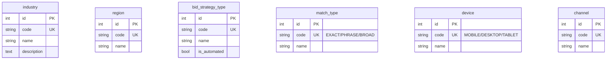
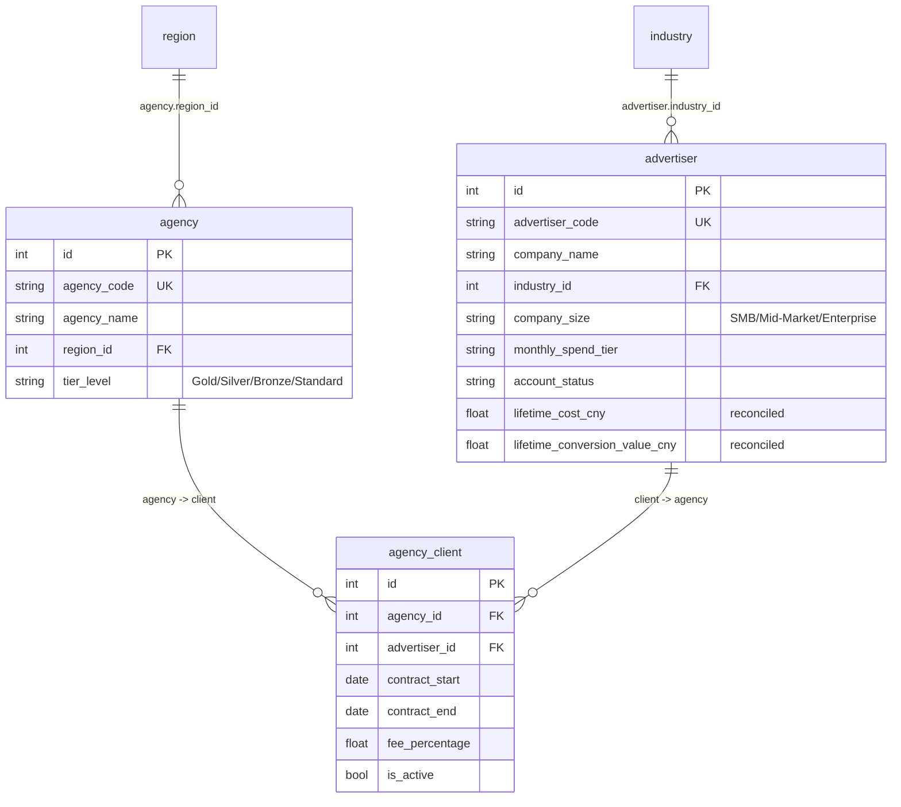
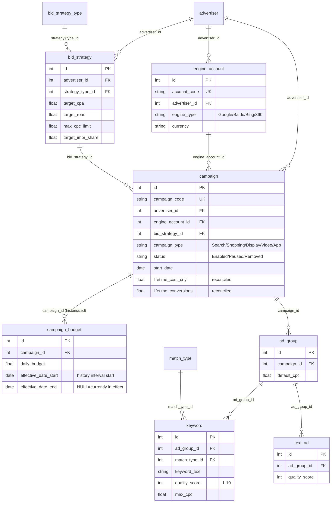
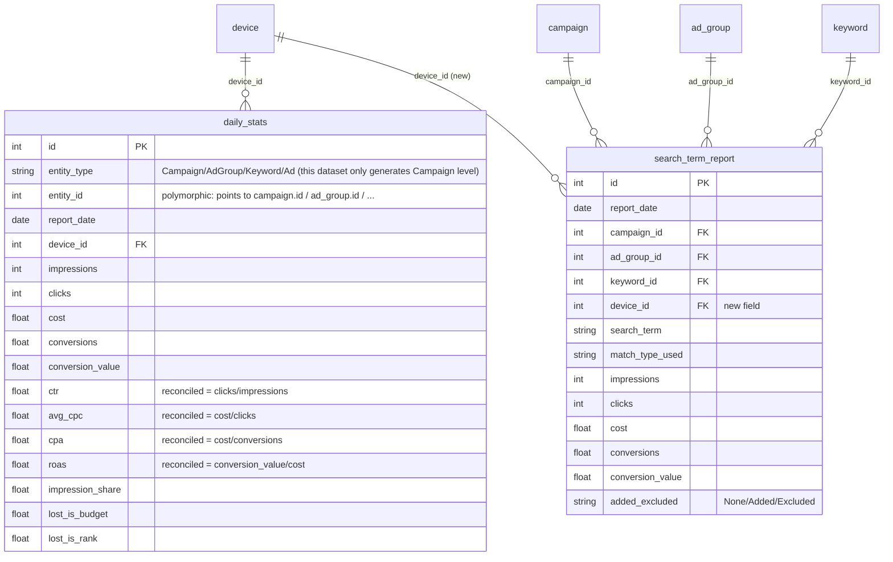
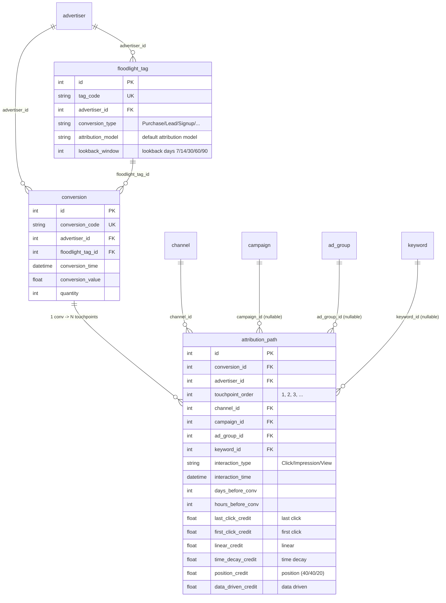
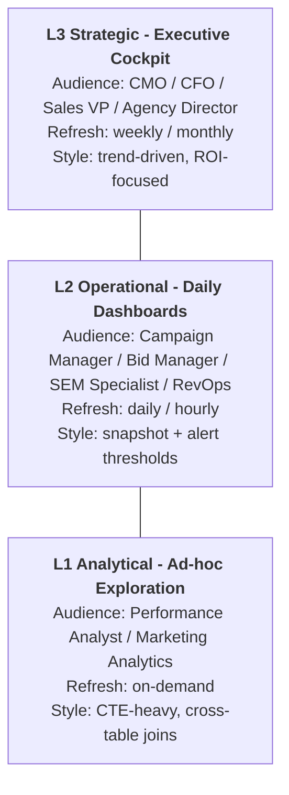
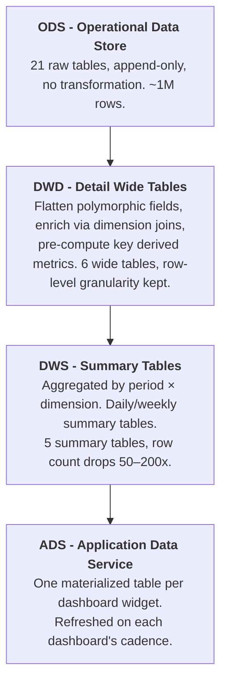
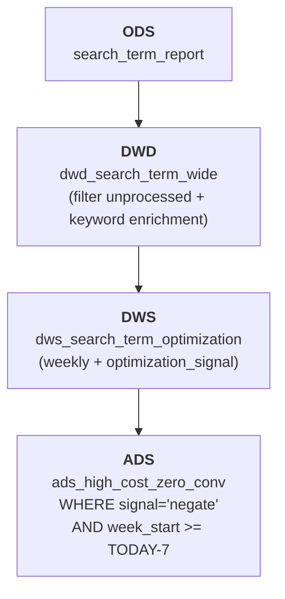

# Search Ads 360 Intelligent Analytics Agent - Data Model Documentation

> **Dataset:** `search_ads_360_agent_large`
> **Complexity:** Large (21 tables, ~1,000,000 rows)
> **Generated by:** Fake Data Generator Agent
> **Reference Date (REFERENCE_DATE):** `2026-06-01`

> For business context, industry primer, glossary, and metric formulas, see `01-search_ads_360_agent_large_business_context.md`. This document only covers the data (table structure, relationships, constraints, generation rules, DDL).

---

## Table of Contents

2. [Dataset Overview](#2-dataset-overview)
3. [Entity Relationship Diagram](#3-entity-relationship-diagram)
4. [Table Definitions](#4-table-definitions)
5. [Foreign Key Inventory](#5-foreign-key-inventory)
6. [Reconciled Invariants](#6-reconciled-invariants)
7. [Data Generation Rules](#7-data-generation-rules)
8. [File Inventory](#8-file-inventory)
9. [SQLite DDL](#9-sqlite-ddl)
10. [BI Subject Areas and Dashboard Blueprint](#10-bi-subject-areas-and-dashboard-blueprint)
11. [KPI Dictionary](#11-kpi-dictionary)
12. [Data Layering (DWD / DWS / ADS)](#12-data-layering-dwd--dws--ads)
13. [Human-Analyst Exploration -> Agent Deployment Two-Layer Architecture](#13-human-analyst-exploration--agent-deployment-two-layer-architecture)
14. [Appendix: Common Query Patterns](#14-appendix-common-query-patterns)

---

## 2. Dataset Overview

### 2.1 Key Numbers

| Metric | Value |
|--------|-------|
| Total tables | 21 |
| Total rows | ~1,000,000 |
| Foreign key relationships | 29 (excluding the polymorphic `daily_stats.entity_id` field) |
| Many-to-many association tables | 1 (`agency_client`) |
| Tables with polymorphic fields | 1 (`daily_stats.entity_type/entity_id`) |
| Tables with historicized fields | 1 (`campaign_budget.effective_date_start/end`) |
| Reconciled invariants | 12 |
| SQLite database size | ~120 MB |
| Faker locale | `zh_CN` (Chinese company names, keywords, regions) |

### 2.2 Row Counts per Table

| # | Table | Rows | Type |
|---|-------|------|------|
| 01 | industry | 10 | Dimension |
| 02 | region | 7 | Dimension |
| 03 | bid_strategy_type | 8 | Dimension (with is_automated flag) |
| 04 | match_type | 3 | Dimension |
| 05 | device | 3 | Dimension |
| 06 | channel | 6 | Dimension |
| 07 | agency | 25 | Organization |
| 08 | advertiser | 150 | Organization (core) |
| 09 | agency_client | ~120 | M:N association |
| 10 | engine_account | ~300 | Account structure |
| 11 | bid_strategy | ~500 | Account structure |
| 12 | campaign | ~1,550 | Account structure (core) |
| 13 | campaign_budget | ~2,500 | **Historicized**: 1–3 rows per campaign with effective_date ranges |
| 14 | ad_group | ~8,000 | Account structure |
| 15 | keyword | ~80,000 | Account structure (large table) |
| 16 | text_ad | ~24,000 | Account structure |
| 17 | floodlight_tag | ~500 | Conversion |
| 18 | daily_stats | ~395,000 | Performance (largest table): 1,550 campaigns × ≤120 days × 3 devices, report_date clipped by campaign active window (full-window upper bound ~558K) |
| 19 | conversion | 25,000 | Conversion events |
| 20 | attribution_path | ~100,000 | Attribution: 25,000 conversions × ~4 touchpoints (randint 2–6) |
| 21 | search_term_report | ~180,000 | Search terms (with new device_id); quota evenly distributed across all enabled keywords |

### 2.3 Real Business Metrics (Actual Distributions in Generated Data)

| Metric | Actual Value | Industry Typical |
|--------|--------------|------------------|
| **CTR** (Campaign level) | ~3.5% | 3–5% (search ads) |
| **Avg CPC** (CNY) | ~¥4.5 | Varies widely by industry, 2–15 |
| **Overall CPA** (CNY) | ~¥165 | 50–500 |
| **Overall ROAS** | ~3.3x | 2–6x is healthy |
| **Mobile share** (impressions) | ~55% | 50–65% |
| **Avg Quality Score** | 6.5 | 6–8 is healthy |
| **Lost IS Budget** (avg) | ~10% | <15% healthy (but ~15% constrained campaigns can hit 40–70%) |
| **Lost IS Rank** (avg) | ~33% | On the high side: impression_share avg is only ~57%, leaving most of the loss on rank/quality — the main optimization lever |
| **Avg conversion path length** | ~4 touchpoints | 3–7 |

---

## 3. Entity Relationship Diagram

The dataset breaks into 5 logical subgraphs. All tables link via foreign keys; the Mermaid diagrams below are split by subject area for readability.

### 3.1 Dimension Tables (Lookup Tables)



### 3.2 Organization Structure



### 3.3 Campaign Hierarchy



### 3.4 Performance Data



> **Note on the polymorphic design of `daily_stats`**: the `entity_type` field distinguishes four entity types — Campaign/AdGroup/Keyword/Ad — and `entity_id` points to the id of the matching entity. **The current dataset only generates Campaign-level data** (`entity_type = 'Campaign'`), keeping the AdGroup/Keyword/Ad levels reserved for future expansion. All JOINs against daily_stats need the `AND entity_type = 'Campaign'` predicate.

### 3.5 Conversion and Attribution



> **Attribution model weight reconciliation**: for each `conversion`, the credit sums of each attribution model are ≈ 1.0 (strictly, modulo floating-point error). See §6 for details.

---

## 4. Table Definitions

### 4.1 `industry`

**Description:** Advertiser industry classifications. 10 mainstream industries that advertise in this market. Used for industry-sliced performance analysis.

| Column | Type | Constraints | Description |
|--------|------|-------------|-------------|
| id | INTEGER | PK | Surrogate primary key |
| code | VARCHAR(30) | UNIQUE, NOT NULL | Industry code `IND_01` … |
| name | VARCHAR(50) | NOT NULL | Industry name (Chinese in data) |
| description | TEXT | NULL | Brief industry description |

**All 10 rows:** E-commerce Retail / Education and Training / Financial Services / Travel / Local Services / Gaming and Entertainment / Healthcare / Real Estate and Home Goods / Automotive / B2B Enterprise Services

**Referenced by:** `advertiser.industry_id`

---

### 4.2 `region`

**Description:** Geographic regions the agencies operate in (Chinese macro regions).

| Column | Type | Constraints | Description |
|--------|------|-------------|-------------|
| id | INTEGER | PK | |
| code | VARCHAR(20) | UNIQUE | |
| name | VARCHAR(50) | NOT NULL | East China / North China / South China / Central China / Southwest / Northwest / Northeast |

**Referenced by:** `agency.region_id`

---

### 4.3 `bid_strategy_type`

**Description:** 8 standard bidding strategies (matching Google Ads); `is_automated` distinguishes manual from automated bidding.

| Column | Type | Constraints | Description |
|--------|------|-------------|-------------|
| id | INTEGER | PK | |
| code | VARCHAR(30) | UNIQUE | e.g. `TARGET_CPA` |
| name | VARCHAR(100) | NOT NULL | Strategy name |
| description | TEXT | NULL | Strategy description |
| is_automated | BOOLEAN | NOT NULL | True = automated bidding |

**All 8 rows:**

| id | code | name | is_automated |
|----|------|------|--------------|
| 1 | MANUAL_CPC | Manual CPC | false |
| 2 | ENHANCED_CPC | Enhanced CPC | true |
| 3 | TARGET_CPA | Target CPA | true |
| 4 | TARGET_ROAS | Target ROAS | true |
| 5 | MAXIMIZE_CONVERSIONS | Maximize Conversions | true |
| 6 | MAXIMIZE_CONVERSION_VALUE | Maximize Conversion Value | true |
| 7 | MAXIMIZE_CLICKS | Maximize Clicks | true |
| 8 | TARGET_IMPRESSION_SHARE | Target Impression Share | true |

**Referenced by:** `bid_strategy.strategy_type_id`

---

### 4.4 `match_type` (Keyword Match Types)

**All 3 rows:**

| id | code | name |
|----|------|------|
| 1 | EXACT | Exact Match |
| 2 | PHRASE | Phrase Match |
| 3 | BROAD | Broad Match |

**Referenced by:** `keyword.match_type_id`, `search_term_report.match_type_used` (a string column, not an FK; records the actually triggered match type)

---

### 4.5 `device`

**All 3 rows:**

| id | code | name |
|----|------|------|
| 1 | MOBILE | Mobile |
| 2 | DESKTOP | Desktop |
| 3 | TABLET | Tablet |

**Referenced by:** `daily_stats.device_id`, `search_term_report.device_id` (**new**)

---

### 4.6 `channel` (Traffic Channels)

**Description:** The channel dimension in attribution paths. 6 typical traffic sources.

| id | code | name |
|----|------|------|
| 1 | PAID_SEARCH | Paid Search |
| 2 | DISPLAY | Display Ads |
| 3 | SOCIAL | Social Media |
| 4 | EMAIL | Email |
| 5 | DIRECT | Direct |
| 6 | ORGANIC_SEARCH | Organic Search |

**Referenced by:** `attribution_path.channel_id`

---

### 4.7 `agency`

**Description:** Third-party agencies serving advertisers, generally regional, with tiering (Gold > Silver > Bronze > Standard).

| Column | Type | Constraints | Description |
|--------|------|-------------|-------------|
| id | INTEGER | PK | |
| agency_code | VARCHAR(20) | UNIQUE | `AGY_001` |
| agency_name | VARCHAR(100) | NOT NULL | "{Chinese company name} Ads" |
| region_id | INTEGER | FK -> region.id | |
| tier_level | VARCHAR(20) | NOT NULL | Gold (10%) / Silver (30%) / Bronze (40%) / Standard (20%) |
| account_manager | VARCHAR(50) | NULL | The agency's internal account lead |
| contact_email | VARCHAR(100) | NULL | |
| contact_phone | VARCHAR(20) | NULL | |
| created_at | DATETIME | NOT NULL | Onboarded to Lumenly Ads (-3y ~ -1y) |

**Sample rows:**

| id | agency_name | region | tier_level |
|----|-------------|--------|-----------|
| 1 | 华联科技广告 | East China | Silver |
| 2 | 中通达广告 | North China | Gold |

**Referenced by:** `agency_client.agency_id`

---

### 4.8 `advertiser`

**Description:** Lumenly Ads' core business entity — direct customer. Determines campaign count, budget scale, and service model. Carries two reconciled fields summarizing its lifetime performance.

| Column | Type | Constraints | Description |
|--------|------|-------------|-------------|
| id | INTEGER | PK | |
| advertiser_code | VARCHAR(20) | UNIQUE | `ADV_001` |
| company_name | VARCHAR(100) | NOT NULL | Chinese company name |
| industry_id | INTEGER | FK -> industry.id | |
| sub_industry | VARCHAR(50) | NULL | Sub-industry (all NULL in this dataset) |
| company_size | VARCHAR(20) | NOT NULL | SMB (50%) / Mid-Market (35%) / Enterprise (15%) |
| monthly_spend_tier | VARCHAR(20) | NOT NULL | `<10K` / `10K-50K` / `50K-200K` / `>200K` (CNY) |
| primary_goal | VARCHAR(50) | NOT NULL | Brand Awareness / Lead Generation / Sales Conversion / App Download |
| website_url | VARCHAR(200) | NULL | |
| created_at | DATETIME | NOT NULL | Onboarded to Lumenly Ads (-2y ~ -6m) |
| account_status | VARCHAR(20) | NOT NULL | Active (85%) / Paused (12%) / Suspended (3%) |
| **lifetime_cost_cny** | FLOAT | NOT NULL | **Reconciled** = SUM(daily_stats.cost) via campaign join |
| **lifetime_conversion_value_cny** | FLOAT | NOT NULL | **Reconciled** = SUM(daily_stats.conversion_value) via campaign join |

**Tier vs spend distribution:**

| company_size | <10K | 10K-50K | 50K-200K | >200K |
|--------------|------|---------|----------|-------|
| SMB | 40% | 40% | 15% | 5% |
| Mid-Market | 10% | 40% | 40% | 10% |
| Enterprise | 5% | 15% | 40% | 40% |

**Sample rows:**

| id | company_name | industry | company_size | monthly_spend_tier | account_status |
|----|--------------|----------|--------------|---------------------|----------------|
| 1 | 华联科技 | E-commerce Retail | Mid-Market | 50K-200K | Active |
| 2 | 金信信用 | Financial Services | Enterprise | >200K | Active |

**Referenced by:** `agency_client.advertiser_id`, `engine_account.advertiser_id`, `bid_strategy.advertiser_id`, `campaign.advertiser_id`, `floodlight_tag.advertiser_id`, `conversion.advertiser_id`, `attribution_path.advertiser_id`

---

### 4.9 `agency_client` (Agency-Client Contract)

**Description:** A many-to-many association table. About 80% of advertisers are agency-managed; the other 20% are direct. Records contract period and service fee percentage.

| Column | Type | Constraints | Description |
|--------|------|-------------|-------------|
| id | INTEGER | PK | |
| agency_id | INTEGER | FK -> agency.id | |
| advertiser_id | INTEGER | FK -> advertiser.id | |
| contract_start | DATE | NOT NULL | |
| contract_end | DATE | NULL | NULL = open-ended/not yet ended |
| fee_percentage | FLOAT | NOT NULL | 8.0 – 20.0 (service fee percentage) |
| is_active | BOOLEAN | NOT NULL | contract_end IS NULL OR contract_end > today |

**Business rule:** an advertiser is bound to only one agency at a time (when this dataset is generated, each managed advertiser maps to a single agency_client record).

---

### 4.10 `engine_account`

**Description:** Accounts an advertiser opens with different search engines (an advertiser can run on multiple engines simultaneously).

| Column | Type | Constraints | Description |
|--------|------|-------------|-------------|
| id | INTEGER | PK | |
| account_code | VARCHAR(20) | UNIQUE | `ENG_0001` |
| advertiser_id | INTEGER | FK -> advertiser.id | |
| engine_type | VARCHAR(30) | NOT NULL | Google (35%) / Baidu (40%) / Bing (15%) / 360 (10%) |
| account_name | VARCHAR(100) | NOT NULL | |
| currency | VARCHAR(10) | NOT NULL | CNY |
| timezone | VARCHAR(50) | NOT NULL | Asia/Shanghai |
| status | VARCHAR(20) | NOT NULL | Active (90%) / Paused (10%) |
| created_at | DATETIME | NOT NULL | |

**1–3 engine_accounts per advertiser, ~2 on average.**

---

### 4.11 `bid_strategy` (Bid Strategy Instance)

**Description:** Advertiser-level bid strategy instances (N:1 with strategy_type). Each campaign can link to one bid_strategy. Strategy parameters fill different fields depending on type:

- Manual CPC / Enhanced CPC -> `max_cpc_limit`
- Target CPA -> `target_cpa`
- Target ROAS -> `target_roas`
- Target Impression Share -> `target_impr_share` + `impr_share_location`
- Maximize* -> no extra parameters needed

| Column | Type | Constraints | Description |
|--------|------|-------------|-------------|
| id | INTEGER | PK | |
| strategy_code | VARCHAR(20) | UNIQUE | |
| advertiser_id | INTEGER | FK -> advertiser.id | |
| strategy_name | VARCHAR(100) | NOT NULL | |
| strategy_type_id | INTEGER | FK -> bid_strategy_type.id | |
| target_cpa | FLOAT | NULL | only when type=3 |
| target_roas | FLOAT | NULL | only when type=4 (2.0–8.0) |
| max_cpc_limit | FLOAT | NULL | only when type=1,2 (1–20 CNY) |
| target_impr_share | FLOAT | NULL | only when type=8 (50–95) |
| impr_share_location | VARCHAR(30) | NULL | Anywhere/Top of page/Absolute top |
| status | VARCHAR(20) | NOT NULL | Active (80%) / Paused (20%) |
| created_at | DATETIME | NOT NULL | |
| last_modified | DATETIME | NULL | |

**2–5 strategies per advertiser.**

---

### 4.12 `campaign`

**Description:** The most important investment unit — tied to one engine_account and one bid_strategy, with multiple ad_groups beneath it. Carries two reconciled fields summarizing lifetime cost and conversions.

| Column | Type | Constraints | Description |
|--------|------|-------------|-------------|
| id | INTEGER | PK | |
| campaign_code | VARCHAR(20) | UNIQUE | `CMP_00001` |
| advertiser_id | INTEGER | FK -> advertiser.id | |
| engine_account_id | INTEGER | FK -> engine_account.id | |
| campaign_name | VARCHAR(200) | NOT NULL | e.g. "电商零售_品牌词_PC端_42" |
| campaign_type | VARCHAR(30) | NOT NULL | Search (50%) / Shopping (20%) / Display (15%) / Video (10%) / App (5%) |
| campaign_subtype | VARCHAR(30) | NULL | Standard / Smart / Performance Max (Search only) |
| bid_strategy_id | INTEGER | FK -> bid_strategy.id (NULL) | Most campaigns have a strategy |
| status | VARCHAR(20) | NOT NULL | Enabled (70%) / Paused (25%) / Removed (5%) |
| start_date | DATE | NOT NULL | |
| end_date | DATE | NULL | 70% of campaigns have no end date (still running) |
| targeting_location | VARCHAR(100) | NULL | Nationwide / East China / Tier-1 cities / ... |
| targeting_language | VARCHAR(50) | NULL | Chinese |
| targeting_device | VARCHAR(50) | NULL | All / Mobile / Desktop |
| created_at | DATETIME | NOT NULL | = combine(start_date, 00:00) |
| **lifetime_cost_cny** | FLOAT | NOT NULL | **Reconciled** = SUM(daily_stats.cost) WHERE entity_type='Campaign' AND entity_id=this.id |
| **lifetime_conversions** | FLOAT | NOT NULL | **Reconciled** = SUM(daily_stats.conversions) WHERE ... |

**5–15 campaigns per advertiser.**

**Referenced by:** `campaign_budget.campaign_id`, `ad_group.campaign_id`, `attribution_path.campaign_id`, `search_term_report.campaign_id`

---

### 4.13 `campaign_budget` (Campaign Budget — Historicized)

**Description:** **A historicized table (slowly changing dimension type 2)**. Each campaign has 1–3 budget records that log budget changes. On any given date, **exactly one** budget record (effective_date_start ≤ date < effective_date_end) is in effect; the latest row has `effective_date_end` = NULL meaning currently in effect.

| Column | Type | Constraints | Description |
|--------|------|-------------|-------------|
| id | INTEGER | PK | |
| campaign_id | INTEGER | FK -> campaign.id | |
| daily_budget | FLOAT | NOT NULL | **Anchored to the campaign's actual avg daily spend**: normal campaigns spend 55–95% of budget (utilization <100%), budget-constrained campaigns spend ≥ budget (utilization >100%) |
| monthly_budget | FLOAT | NULL | = daily_budget × 30 |
| budget_delivery | VARCHAR(30) | NOT NULL | Standard (80%) / Accelerated (20%) |
| **effective_date_start** | DATE | NOT NULL | Date this budget becomes effective |
| **effective_date_end** | DATE | NULL | Date this budget stops being effective (open interval); **NULL = still in effect** |
| created_at | DATETIME | NOT NULL | |

**Business rules:**

- For all budget records of the same campaign, after sorting by `effective_date_start`, each row's `effective_date_end` = the next row's `effective_date_start`
- Each campaign's final row has `effective_date_end` = NULL (still running) or = campaign.end_date (already ended)
- `daily_budget` is first anchored against "the campaign's avg daily spend / target utilization" to a base value; each historical period then fluctuates within ±10% of that base (capturing budget tweaks but keeping the magnitude stable, so budget utilization stays well-defined)

**Typical query pattern — get the budget in effect on a given day:**

```sql
SELECT * FROM campaign_budget
WHERE campaign_id = ?
  AND effective_date_start <= '2026-05-15'
  AND (effective_date_end IS NULL OR effective_date_end > '2026-05-15');
```

---

### 4.14 `ad_group`

**Description:** The level below a campaign. Keywords and ads live under an ad_group.

| Column | Type | Constraints | Description |
|--------|------|-------------|-------------|
| id | INTEGER | PK | |
| ad_group_code | VARCHAR(20) | UNIQUE | |
| campaign_id | INTEGER | FK -> campaign.id | |
| ad_group_name | VARCHAR(200) | NOT NULL | e.g. "网上购物_广告组" |
| default_cpc | FLOAT | NULL | 0.5 – 15 CNY |
| status | VARCHAR(20) | NOT NULL | Enabled (75%) / Paused (20%) / Removed (5%) |
| created_at | DATETIME | NOT NULL | |

**3–8 ad_groups per campaign.**

---

### 4.15 `keyword`

**Description:** The finest investment unit. Carries a Quality Score (1–10) and three sub-dimension ratings.

| Column | Type | Constraints | Description |
|--------|------|-------------|-------------|
| id | INTEGER | PK | |
| keyword_code | VARCHAR(20) | UNIQUE | |
| ad_group_id | INTEGER | FK -> ad_group.id | |
| keyword_text | VARCHAR(300) | NOT NULL | Chinese keywords (drawn from per-industry pools) |
| match_type_id | INTEGER | FK -> match_type.id | |
| status | VARCHAR(20) | NOT NULL | Enabled (80%) / Paused (15%) / Removed (5%) |
| max_cpc | FLOAT | NULL | 0.5 – 20 CNY |
| quality_score | INTEGER | NULL | 1 – 10 (actual generated range 3–10) |
| expected_ctr | VARCHAR(20) | NULL | Below Average / Average / Above Average |
| ad_relevance | VARCHAR(20) | NULL | Same scale |
| landing_page_exp | VARCHAR(20) | NULL | Same scale |
| first_page_cpc | FLOAT | NULL | = max_cpc × 0.6 |
| top_of_page_cpc | FLOAT | NULL | = max_cpc × 1.2 |
| created_at | DATETIME | NOT NULL | |

**5–15 keywords per ad_group. ~80,000 rows total.**

**Relationship between Quality Score and Expected CTR / Ad Relevance / Landing Page Exp**: when all three sub-dimensions are "Above Average," QS is usually 8–10; when all three are "Below Average," QS is usually 3–5. To keep this dataset simple, the three sub-dimensions and QS are sampled independently, so they may not be fully consistent (this is itself an *analyst exercise*: "find keywords where all three sub-dimensions are high but QS is low").

---

### 4.16 `text_ad`

**Description:** A pair of headline + description ad copy.

| Column | Type | Constraints | Description |
|--------|------|-------------|-------------|
| id | INTEGER | PK | |
| ad_code | VARCHAR(20) | UNIQUE | |
| ad_group_id | INTEGER | FK -> ad_group.id | |
| headline_1 | VARCHAR(100) | NOT NULL | |
| headline_2 | VARCHAR(100) | NULL | |
| headline_3 | VARCHAR(100) | NULL | 70% present |
| description_1 | VARCHAR(200) | NOT NULL | |
| description_2 | VARCHAR(200) | NULL | 60% present |
| final_url | VARCHAR(500) | NOT NULL | |
| display_url | VARCHAR(200) | NULL | |
| status | VARCHAR(20) | NOT NULL | |
| quality_score | INTEGER | NULL | 4 – 10 |
| created_at | DATETIME | NOT NULL | |

**2–4 text_ads per ad_group.**

---

### 4.17 `floodlight_tag` (Floodlight Conversion Tracking Tag)

**Description:** A Search Ads 360 concept — a pixel-like conversion tracking tag. An advertiser can create multiple floodlight tags to track different conversion types (Purchase / Lead / Signup / AddToCart, etc.).

| Column | Type | Constraints | Description |
|--------|------|-------------|-------------|
| id | INTEGER | PK | |
| tag_code | VARCHAR(30) | UNIQUE | |
| advertiser_id | INTEGER | FK -> advertiser.id | |
| tag_name | VARCHAR(100) | NOT NULL | "{conv_type}_转化跟踪" |
| conversion_type | VARCHAR(50) | NOT NULL | Purchase / Lead / Signup / PageView / AddToCart / AppInstall |
| counting_method | VARCHAR(30) | NOT NULL | Standard / Unique |
| attribution_model | VARCHAR(30) | NOT NULL | Last Click / First Click / Linear / Time Decay / Position Based / Data Driven |
| lookback_window | INTEGER | NOT NULL | 7 / 14 / 30 / 60 / 90 (days) |
| status | VARCHAR(20) | NOT NULL | Active |
| created_at | DATETIME | NOT NULL | |

**2–5 floodlight_tags per advertiser.**

---

### 4.18 `daily_stats` (Daily Performance Data — Largest Table)

**Description:** **The dataset's core fact table**. One row per Campaign × Device × Day, carrying core performance metrics, derived metrics, and competitive metrics (impression share). **The current dataset only generates Campaign level (entity_type='Campaign')**, ~395,000 rows total (1,550 campaigns × ≤120 days × 3 devices; each campaign's report_date is clipped to its active window, so it lands below the full-window upper bound).

| Column | Type | Constraints | Description |
|--------|------|-------------|-------------|
| id | INTEGER | PK | |
| entity_type | VARCHAR(20) | NOT NULL | 'Campaign' (currently the only value) |
| entity_id | INTEGER | NOT NULL | Polymorphic -> campaign.id (no FK constraint) |
| report_date | DATE | NOT NULL | 2026-02-01 ~ 2026-06-01, and ≥ campaign.start_date, ≤ min(campaign.end_date, 2026-06-01) |
| device_id | INTEGER | FK -> device.id | |
| **Core metrics** | | | |
| impressions | INTEGER | NOT NULL | 100 – 50,000 |
| clicks | INTEGER | NOT NULL | = impressions × CTR |
| cost | FLOAT | NOT NULL | = clicks × avg_cpc |
| conversions | FLOAT | NOT NULL | = clicks × conv_rate |
| conversion_value | FLOAT | NOT NULL | = conversions × avg_conv_value |
| **Derived metrics (reconciled)** | | | |
| ctr | FLOAT | NULL | **Reconciled** = clicks / impressions |
| avg_cpc | FLOAT | NULL | **Reconciled** = cost / clicks |
| cpa | FLOAT | NULL | **Reconciled** = cost / conversions (NULL if conversions=0) |
| roas | FLOAT | NULL | **Reconciled** = conversion_value / cost |
| **Competitive metrics (impression share)** | | | |
| impression_share | FLOAT | NULL | 20 – 95 (%) |
| search_impr_share | FLOAT | NULL | = impression_share |
| lost_is_budget | FLOAT | NULL | 0 – ~70 (%) — lost to budget = remaining share × proportion; ~15% budget-constrained campaigns take 40–85% of remaining, can exceed 20%/30% |
| lost_is_rank | FLOAT | NULL | = 100 - impression_share - lost_is_budget (≥ 0) |
| search_abs_top_is | FLOAT | NULL | Absolute top of page share, ≤ search_top_is |
| search_top_is | FLOAT | NULL | Top of page share, ≤ impression_share |

**Impression share relationship:** `impression_share + lost_is_budget + lost_is_rank = 100`, partitioning all possible impression opportunities into (won / lost to budget / lost to quality & bid).

**Common anti-pattern:** forgetting the `entity_type='Campaign'` filter. All JOINs against `daily_stats` must include this predicate explicitly, even when only one value currently exists.

**Suggested indexes:** `(entity_type, entity_id, report_date)`, `(report_date, device_id)`.

---

### 4.19 `conversion`

**Description:** Each row represents a single completed conversion event (purchase, lead, signup, etc.). Each conversion has a corresponding chain of `attribution_path` records.

| Column | Type | Constraints | Description |
|--------|------|-------------|-------------|
| id | INTEGER | PK | |
| conversion_code | VARCHAR(30) | UNIQUE | `CONV_000001` |
| advertiser_id | INTEGER | FK -> advertiser.id | |
| floodlight_tag_id | INTEGER | FK -> floodlight_tag.id | Determines conversion_type |
| conversion_time | DATETIME | NOT NULL | Within the last 90 days |
| conversion_value | FLOAT | NOT NULL | 50 – 2,000 CNY (purchase-type) / 1 – 50 CNY (lead-type) |
| currency | VARCHAR(10) | NOT NULL | CNY |
| quantity | INTEGER | NOT NULL | 1 – 5 |

**25,000 rows total.**

---

### 4.20 `attribution_path`

**Description:** **The heart of multi-model attribution**. Each conversion has 2–6 touchpoints (channel contacts before the conversion), and each touchpoint carries a credit (weight) under all 6 attribution models.

| Column | Type | Constraints | Description |
|--------|------|-------------|-------------|
| id | INTEGER | PK | |
| conversion_id | INTEGER | FK -> conversion.id | |
| advertiser_id | INTEGER | FK -> advertiser.id | Redundant (derived from conversion) |
| touchpoint_order | INTEGER | NOT NULL | 1, 2, 3, ... (1 = earliest, MAX = latest / last before conversion) |
| channel_id | INTEGER | FK -> channel.id | |
| campaign_id | INTEGER | FK -> campaign.id (NULL) | 80% of touchpoints have a campaign |
| ad_group_id | INTEGER | FK -> ad_group.id (NULL) | 56% (= 80%×70%) of touchpoints have an ad_group |
| keyword_id | INTEGER | FK -> keyword.id (NULL) | 34% (= 56%×60%) of touchpoints have a keyword |
| interaction_type | VARCHAR(20) | NOT NULL | Click (70%) / Impression (25%) / View (5%) |
| interaction_time | DATETIME | NOT NULL | conversion_time - hours_before_conv hours |
| days_before_conv | INTEGER | NOT NULL | = hours_before_conv // 24 |
| hours_before_conv | INTEGER | NOT NULL | 1 – 720 (within 30 days) |
| **6 attribution model credits (reconciled)** | | | |
| last_click_credit | FLOAT | NOT NULL | Last touchpoint = 1.0, others = 0.0 |
| first_click_credit | FLOAT | NOT NULL | First touchpoint = 1.0, others = 0.0 |
| linear_credit | FLOAT | NOT NULL | Equal split = 1.0 / N |
| time_decay_credit | FLOAT | NOT NULL | Geometric: 2^i / SUM(2^j), higher weight closer to conversion |
| position_credit | FLOAT | NOT NULL | N≥3: 40% first, 40% last, 20% middle split evenly; N=2: 50% each; N=1: 100% (sum always = 1.0) |
| data_driven_credit | FLOAT | NOT NULL | Simulated data-driven attribution (normalized random weights) |

**Reconciliation guarantee:** for each conversion_id, the credit sum under each attribution model = 1.0.

---

### 4.21 `search_term_report`

**Description:** **The core data for search term mining**. Each row represents "on a given day, a given keyword triggered a given search_term once." Carries an `added_excluded` flag recording the optimization action (already added as keyword / negative keyword). **A new `device_id` field supports device-dimension analysis**.

| Column | Type | Constraints | Description |
|--------|------|-------------|-------------|
| id | INTEGER | PK | |
| report_date | DATE | NOT NULL | Within the last 30 days |
| campaign_id | INTEGER | FK -> campaign.id | |
| ad_group_id | INTEGER | FK -> ad_group.id | |
| keyword_id | INTEGER | FK -> keyword.id | The "seed" keyword that triggered this search term |
| **device_id** | INTEGER | FK -> device.id | **New field** |
| search_term | VARCHAR(500) | NOT NULL | The user's actual search term: 30% = the seed keyword_text itself (head term), 70% = location (optional) + seed term + 1–3 qualifiers concatenated into a long-tail term (full-corpus distinct ≈ 95,000+) |
| match_type_used | VARCHAR(20) | NOT NULL | EXACT / PHRASE / BROAD (the match type actually triggered) |
| impressions | INTEGER | NOT NULL | 1 – 500 |
| clicks | INTEGER | NOT NULL | |
| cost | FLOAT | NOT NULL | |
| conversions | FLOAT | NOT NULL | Only ~30% of clicked search terms convert; the rest = 0 (true long-tail: most terms have clicks but no conversions) |
| conversion_value | FLOAT | NOT NULL | 0 when conversions=0 |
| added_excluded | VARCHAR(20) | NULL (always has a value in practice) | `'None'` (80%) / `'Added'` (15%) / `'Excluded'` (5%) — already added as a keyword / already added as a negative. **Note: 'None' is a literal string (not SQL NULL); filter "unprocessed" with `= 'None'`, not `IS NULL`** |

**~180,000 rows total** (dynamic quota: ~90% cap spread across all enabled keywords, ~181,000 in practice).

**Business meaning of `added_excluded`:**
- `None` = nobody has processed it yet (waiting for analysts to mine)
- `Added` = this search term performs well; already added as a formal keyword
- `Excluded` = this search term performs badly; already added as a negative keyword

→ **Typical exercise**: "Find search terms with `added_excluded='None'`, high cost, and zero conversions, and recommend them as negative-keyword candidates."

---

## 5. Foreign Key Inventory

29 foreign key relationships total (excluding the polymorphic `daily_stats.entity_id` field, which intentionally has no FK constraint).

| FK Source | -> References | Nullable | Notes |
|-----------|---------------|----------|-------|
| `agency.region_id` | `region.id` | NO | |
| `advertiser.industry_id` | `industry.id` | NO | |
| `agency_client.agency_id` | `agency.id` | NO | |
| `agency_client.advertiser_id` | `advertiser.id` | NO | |
| `engine_account.advertiser_id` | `advertiser.id` | NO | |
| `bid_strategy.advertiser_id` | `advertiser.id` | NO | |
| `bid_strategy.strategy_type_id` | `bid_strategy_type.id` | NO | |
| `campaign.advertiser_id` | `advertiser.id` | NO | |
| `campaign.engine_account_id` | `engine_account.id` | NO | |
| `campaign.bid_strategy_id` | `bid_strategy.id` | YES | A few campaigns have no strategy |
| `campaign_budget.campaign_id` | `campaign.id` | NO | |
| `ad_group.campaign_id` | `campaign.id` | NO | |
| `keyword.ad_group_id` | `ad_group.id` | NO | |
| `keyword.match_type_id` | `match_type.id` | NO | |
| `text_ad.ad_group_id` | `ad_group.id` | NO | |
| `floodlight_tag.advertiser_id` | `advertiser.id` | NO | |
| `daily_stats.device_id` | `device.id` | NO | |
| `daily_stats.entity_id` | (polymorphic, no FK) | NO | Currently only points to campaign.id |
| `conversion.advertiser_id` | `advertiser.id` | NO | |
| `conversion.floodlight_tag_id` | `floodlight_tag.id` | NO | |
| `attribution_path.conversion_id` | `conversion.id` | NO | |
| `attribution_path.advertiser_id` | `advertiser.id` | NO | Redundant |
| `attribution_path.channel_id` | `channel.id` | NO | |
| `attribution_path.campaign_id` | `campaign.id` | YES | ~80% present |
| `attribution_path.ad_group_id` | `ad_group.id` | YES | ~56% present |
| `attribution_path.keyword_id` | `keyword.id` | YES | ~34% present |
| `search_term_report.campaign_id` | `campaign.id` | NO | |
| `search_term_report.ad_group_id` | `ad_group.id` | NO | |
| `search_term_report.keyword_id` | `keyword.id` | NO | |
| `search_term_report.device_id` | `device.id` | NO | **New** |

### Polymorphic Relationship (daily_stats)

`daily_stats.entity_type/entity_id` is a **polymorphic association**. The `entity_type` value set is `{Campaign, AdGroup, Keyword, Ad}`, and `entity_id` points at the PK of the corresponding table. The current dataset only generates `entity_type='Campaign'`, but the schema preserves the ability to expand later.

**Implication for SQL:** every JOIN must explicitly include `AND ds.entity_type = 'Campaign'`, e.g.:

```sql
SELECT *
FROM daily_stats ds
JOIN campaign c ON ds.entity_id = c.id AND ds.entity_type = 'Campaign'
WHERE ds.report_date >= DATE('2026-05-01');
```

---

## 6. Reconciled Invariants

**Reconciliation** = after all rows are generated, parent fields are deterministically computed from child rows. The following invariants always hold in the generated dataset.

| # | Parent Field | Reconciliation Rule | Verification |
|---|--------------|---------------------|--------------|
| 1 | `daily_stats.ctr` | = clicks / impressions (per row) | `ABS(ctr - clicks*1.0/impressions) < 0.001` |
| 2 | `daily_stats.avg_cpc` | = cost / clicks (per row, NULL if clicks=0) | |
| 3 | `daily_stats.cpa` | = cost / conversions (NULL if conversions=0) | |
| 4 | `daily_stats.roas` | = conversion_value / cost (per row) | |
| 5 | `daily_stats.impression_share + lost_is_budget + lost_is_rank` | ≈ 100 (per row, floating-point error < 0.5) | |
| 6 | `attribution_path` per-model credit sum | = 1.0 per conversion (6 models independent) | `SUM(last_click_credit) GROUP BY conversion_id = 1.0` |
| 7 | `advertiser.lifetime_cost_cny` | = SUM(daily_stats.cost) via campaign join | `0` violations |
| 8 | `advertiser.lifetime_conversion_value_cny` | = SUM(daily_stats.conversion_value) via campaign join | `0` violations |
| 9 | `campaign.lifetime_cost_cny` / `lifetime_conversions` | = SUM as above, but scoped to this campaign | `0` violations |
| 10 | `campaign_budget` time intervals | For all budgets sharing a campaign_id, sorted by start, the previous row's end = next row's start; the final row's end = NULL (campaign still running) or = campaign.end_date (campaign already ended) | `0` violations |
| 11 | `search_term_report.conversions` ≤ `clicks` | Conversion count can't exceed click count | `0` violations |
| 12 | `attribution_path` touchpoint numbering | Per conversion: MAX(touchpoint_order) = COUNT(*) (continuous 1..N) | `0` violations |

### Business Meaning of Invariant #5 (Impression Share Reconciliation)

`impression_share` (the share you won) + `lost_is_budget` (lost to budget) + `lost_is_rank` (lost to rank/quality) = 100%. These three partition "every possible opportunity to be shown to a targeted user." If `lost_is_budget > 20%` (unified threshold across docs, see §11.2), budget is critically short and adding more buys you those impressions directly.

### Business Meaning of Invariant #10 (Budget Historicization)

`campaign_budget` is a **slowly changing dimension type 2** implementation. To query the budget in effect for a campaign on any date, use this pattern:

```sql
SELECT daily_budget FROM campaign_budget
WHERE campaign_id = ?
  AND effective_date_start <= :query_date
  AND (effective_date_end IS NULL OR effective_date_end > :query_date);
```

---

## 7. Data Generation Rules

### 7.1 Temporal Ordering Rules

1. `agency.created_at` < `agency_client.contract_start` < (all related business timestamps)
2. `advertiser.created_at` < `engine_account.created_at` < `campaign.start_date` < `campaign_budget.effective_date_start`
3. `campaign.start_date` ≤ `ad_group.created_at` ≤ `keyword.created_at` / `text_ad.created_at`
4. `daily_stats.report_date` ≥ `campaign.start_date`
5. `conversion.conversion_time` within the last 90 days
6. `attribution_path.interaction_time` ≤ `conversion.conversion_time`
7. `attribution_path.touchpoint_order=1` is the earliest touchpoint; MAX is the latest
8. `search_term_report.report_date` within the last 30 days

### 7.2 Distribution Rules

| Field | Distribution |
|-------|--------------|
| `advertiser.company_size` | SMB 50% / Mid-Market 35% / Enterprise 15% |
| `advertiser.monthly_spend_tier` | Correlated with company_size (see §4.8) |
| `advertiser.account_status` | Active 85% / Paused 12% / Suspended 3% |
| `agency.tier_level` | Gold 10% / Silver 30% / Bronze 40% / Standard 20% |
| `engine_account.engine_type` | Google 35% / Baidu 40% / Bing 15% / 360 10% |
| `campaign.campaign_type` | Search 50% / Shopping 20% / Display 15% / Video 10% / App 5% |
| `campaign.status` | Enabled 70% / Paused 25% / Removed 5% |
| `daily_stats.impressions` | uniform(100, 50000) × device multiplier (Mobile 1.1 / Desktop 0.7 / Tablet 0.2) |
| `daily_stats.ctr` | uniform(0.012, 0.055) × campaign quality(0.7–1.4), actual avg ~3.5% |
| `daily_stats.cost = clicks × cpc`, `cpc = uniform(0.5, 8.5)` | Actual avg ~¥4.5 |
| `daily_stats.conv_rate` | uniform(0.005, 0.045) × campaign quality -> CPA = cpc/conv_rate ≈ ¥165 |
| `daily_stats.conversion_value = conversions × avg_conv_value`, `avg_conv_value = uniform(100, 1000)` | -> ROAS ≈ 3.3x |
| `daily_stats.lost_is_budget` | = (100 - impression_share) × proportion; normal campaigns 0–30%, ~15% budget-constrained campaigns take 40–85% of remaining (avg ~10%) |
| `campaign_budget.daily_budget` | **Anchored to campaign's avg daily spend**: base = avg daily spend / target utilization (normal 0.55–0.95, constrained 1.0–1.45), each period fluctuates within ±10% of base |
| `conversion.conversion_value` | Purchase-type (Purchase/AddToCart/AppInstall) uniform(50, 2000); lead-type (Lead/Signup/PageView) uniform(1, 50) CNY |
| `attribution_path` touchpoint count | randint(2, 6) per conversion (avg ~4) |
| `search_term_report.search_term` | 30% seed term as-is; 70% = location (optional) + seed term + random.sample(qualifiers, 1–3) long-tail |
| `search_term_report.conversions` | Only ~30% of clicked search terms convert; the rest = 0 |

### 7.3 Faker Strategy

| Field Type | Faker Method / Custom | Notes |
|------------|------------------------|-------|
| Chinese company names | Custom: `prefix + middle + suffix` combination | 16 × 16 × 10 combinations |
| advertiser company_name | Same + industry suffix | |
| email / phone | `fake.email()`, `fake.phone_number()` (zh_CN) | |
| website_url | `https://www.{fake.domain_name()}` | |
| date / datetime | `fake.date_between()`, `fake.date_time_between()` | Range set per context |
| keyword keyword_text | Custom `KEYWORDS_BY_INDUSTRY` dictionary (10 industries × 13-16 words) | |
| campaign_name | Templated: "{industry}_{brand/competitor/generic/...}_{device}_{id}" | |
| Long-tail search terms | Seed keyword_text + `SEARCH_TERM_GEO` (30 locations) + `SEARCH_TERM_QUALIFIERS` (40 qualifiers) freely combined | 30% original term, 70% long-tail (optional location + 1–3 qualifiers); full-corpus distinct ≈ 95,000+, mostly low-frequency/unique, supporting "negative term mining" and other long-tail queries |

### 7.4 Configuration Constants

```python
RANDOM_SEED = 42
TODAY = date(2026, 6, 1)
HISTORY_START = TODAY - timedelta(days=540)   # 18 months back
DAILY_STATS_DAYS = 120                         # daily_stats coverage days
SEARCH_TERM_DAYS = 30                          # search_term_report coverage days
CONVERSION_LOOKBACK_DAYS = 90                  # conversion time window
FAKER_LOCALE = "zh_CN"
```

Rerunning the generator with the same seed produces byte-identical output (modulo platform-related Faker locale data differences).

---

## 8. File Inventory

| # | File | Table | Rows | Dependencies |
|---|------|-------|------|--------------|
| 01 | 01_industry.tsv | industry | 10 | — |
| 02 | 02_region.tsv | region | 7 | — |
| 03 | 03_bid_strategy_type.tsv | bid_strategy_type | 8 | — |
| 04 | 04_match_type.tsv | match_type | 3 | — |
| 05 | 05_device.tsv | device | 3 | — |
| 06 | 06_channel.tsv | channel | 6 | — |
| 07 | 07_agency.tsv | agency | 25 | region |
| 08 | 08_advertiser.tsv | advertiser | 150 | industry |
| 09 | 09_agency_client.tsv | agency_client | ~120 | agency, advertiser |
| 10 | 10_engine_account.tsv | engine_account | ~300 | advertiser |
| 11 | 11_bid_strategy.tsv | bid_strategy | ~500 | advertiser, bid_strategy_type |
| 12 | 12_campaign.tsv | campaign | ~1,500 | advertiser, engine_account, bid_strategy |
| 13 | 13_campaign_budget.tsv | campaign_budget | ~3,000 | campaign |
| 14 | 14_ad_group.tsv | ad_group | ~8,000 | campaign |
| 15 | 15_keyword.tsv | keyword | ~80,000 | ad_group, match_type |
| 16 | 16_text_ad.tsv | text_ad | ~24,000 | ad_group |
| 17 | 17_floodlight_tag.tsv | floodlight_tag | ~500 | advertiser |
| 18 | 18_daily_stats.tsv | daily_stats | ~540,000 | campaign, device |
| 19 | 19_conversion.tsv | conversion | 25,000 | advertiser, floodlight_tag |
| 20 | 20_attribution_path.tsv | attribution_path | ~120,000 | conversion, channel, campaign, ad_group, keyword |
| 21 | 21_search_term_report.tsv | search_term_report | ~200,000 | campaign, ad_group, keyword, device |

**The load order is the above topological order.** Tables without FK dependencies load first; the largest event tables (daily_stats, search_term_report, attribution_path) load last.

---

## 9. SQLite DDL

```sql
-- 01 industry
CREATE TABLE industry (
    id INTEGER PRIMARY KEY,
    code VARCHAR(30) NOT NULL UNIQUE,
    name VARCHAR(50) NOT NULL,
    description TEXT
);

-- 02 region
CREATE TABLE region (
    id INTEGER PRIMARY KEY,
    code VARCHAR(20) NOT NULL UNIQUE,
    name VARCHAR(50) NOT NULL
);

-- 03 bid_strategy_type
CREATE TABLE bid_strategy_type (
    id INTEGER PRIMARY KEY,
    code VARCHAR(30) NOT NULL UNIQUE,
    name VARCHAR(100) NOT NULL,
    description TEXT,
    is_automated BOOLEAN NOT NULL DEFAULT 0
);

-- 04 match_type
CREATE TABLE match_type (
    id INTEGER PRIMARY KEY,
    code VARCHAR(20) NOT NULL UNIQUE,
    name VARCHAR(50) NOT NULL
);

-- 05 device
CREATE TABLE device (
    id INTEGER PRIMARY KEY,
    code VARCHAR(20) NOT NULL UNIQUE,
    name VARCHAR(50) NOT NULL
);

-- 06 channel
CREATE TABLE channel (
    id INTEGER PRIMARY KEY,
    code VARCHAR(30) NOT NULL UNIQUE,
    name VARCHAR(50) NOT NULL
);

-- 07 agency
CREATE TABLE agency (
    id INTEGER PRIMARY KEY,
    agency_code VARCHAR(20) NOT NULL UNIQUE,
    agency_name VARCHAR(100) NOT NULL,
    region_id INTEGER NOT NULL REFERENCES region(id),
    tier_level VARCHAR(20) NOT NULL,
    account_manager VARCHAR(50),
    contact_email VARCHAR(100),
    contact_phone VARCHAR(20),
    created_at DATETIME NOT NULL
);

-- 08 advertiser (with 2 reconciled fields)
CREATE TABLE advertiser (
    id INTEGER PRIMARY KEY,
    advertiser_code VARCHAR(20) NOT NULL UNIQUE,
    company_name VARCHAR(100) NOT NULL,
    industry_id INTEGER NOT NULL REFERENCES industry(id),
    sub_industry VARCHAR(50),
    company_size VARCHAR(20) NOT NULL,
    monthly_spend_tier VARCHAR(20) NOT NULL,
    primary_goal VARCHAR(50) NOT NULL,
    website_url VARCHAR(200),
    created_at DATETIME NOT NULL,
    account_status VARCHAR(20) NOT NULL,
    lifetime_cost_cny FLOAT NOT NULL DEFAULT 0.0,
    lifetime_conversion_value_cny FLOAT NOT NULL DEFAULT 0.0
);

-- 09 agency_client
CREATE TABLE agency_client (
    id INTEGER PRIMARY KEY,
    agency_id INTEGER NOT NULL REFERENCES agency(id),
    advertiser_id INTEGER NOT NULL REFERENCES advertiser(id),
    contract_start DATE NOT NULL,
    contract_end DATE,
    fee_percentage FLOAT NOT NULL,
    is_active BOOLEAN NOT NULL DEFAULT 1
);

-- 10 engine_account
CREATE TABLE engine_account (
    id INTEGER PRIMARY KEY,
    account_code VARCHAR(20) NOT NULL UNIQUE,
    advertiser_id INTEGER NOT NULL REFERENCES advertiser(id),
    engine_type VARCHAR(30) NOT NULL,
    account_name VARCHAR(100) NOT NULL,
    currency VARCHAR(10) NOT NULL,
    timezone VARCHAR(50) NOT NULL,
    status VARCHAR(20) NOT NULL,
    created_at DATETIME NOT NULL
);

-- 11 bid_strategy
CREATE TABLE bid_strategy (
    id INTEGER PRIMARY KEY,
    strategy_code VARCHAR(20) NOT NULL UNIQUE,
    advertiser_id INTEGER NOT NULL REFERENCES advertiser(id),
    strategy_name VARCHAR(100) NOT NULL,
    strategy_type_id INTEGER NOT NULL REFERENCES bid_strategy_type(id),
    target_cpa FLOAT,
    target_roas FLOAT,
    max_cpc_limit FLOAT,
    target_impr_share FLOAT,
    impr_share_location VARCHAR(30),
    status VARCHAR(20) NOT NULL,
    created_at DATETIME NOT NULL,
    last_modified DATETIME
);

-- 12 campaign (with 2 reconciled fields)
CREATE TABLE campaign (
    id INTEGER PRIMARY KEY,
    campaign_code VARCHAR(20) NOT NULL UNIQUE,
    advertiser_id INTEGER NOT NULL REFERENCES advertiser(id),
    engine_account_id INTEGER NOT NULL REFERENCES engine_account(id),
    campaign_name VARCHAR(200) NOT NULL,
    campaign_type VARCHAR(30) NOT NULL,
    campaign_subtype VARCHAR(30),
    bid_strategy_id INTEGER REFERENCES bid_strategy(id),
    status VARCHAR(20) NOT NULL,
    start_date DATE NOT NULL,
    end_date DATE,
    targeting_location VARCHAR(100),
    targeting_language VARCHAR(50),
    targeting_device VARCHAR(50),
    created_at DATETIME NOT NULL,
    lifetime_cost_cny FLOAT NOT NULL DEFAULT 0.0,
    lifetime_conversions FLOAT NOT NULL DEFAULT 0.0
);

-- 13 campaign_budget (HISTORIZED - has effective_date_start/end)
CREATE TABLE campaign_budget (
    id INTEGER PRIMARY KEY,
    campaign_id INTEGER NOT NULL REFERENCES campaign(id),
    daily_budget FLOAT NOT NULL,
    monthly_budget FLOAT,
    budget_delivery VARCHAR(30) NOT NULL,
    effective_date_start DATE NOT NULL,
    effective_date_end DATE,
    created_at DATETIME NOT NULL
);

-- 14 ad_group
CREATE TABLE ad_group (
    id INTEGER PRIMARY KEY,
    ad_group_code VARCHAR(20) NOT NULL UNIQUE,
    campaign_id INTEGER NOT NULL REFERENCES campaign(id),
    ad_group_name VARCHAR(200) NOT NULL,
    default_cpc FLOAT,
    status VARCHAR(20) NOT NULL,
    created_at DATETIME NOT NULL
);

-- 15 keyword
CREATE TABLE keyword (
    id INTEGER PRIMARY KEY,
    keyword_code VARCHAR(20) NOT NULL UNIQUE,
    ad_group_id INTEGER NOT NULL REFERENCES ad_group(id),
    keyword_text VARCHAR(300) NOT NULL,
    match_type_id INTEGER NOT NULL REFERENCES match_type(id),
    status VARCHAR(20) NOT NULL,
    max_cpc FLOAT,
    quality_score INTEGER,
    expected_ctr VARCHAR(20),
    ad_relevance VARCHAR(20),
    landing_page_exp VARCHAR(20),
    first_page_cpc FLOAT,
    top_of_page_cpc FLOAT,
    created_at DATETIME NOT NULL
);

-- 16 text_ad
CREATE TABLE text_ad (
    id INTEGER PRIMARY KEY,
    ad_code VARCHAR(20) NOT NULL UNIQUE,
    ad_group_id INTEGER NOT NULL REFERENCES ad_group(id),
    headline_1 VARCHAR(100) NOT NULL,
    headline_2 VARCHAR(100),
    headline_3 VARCHAR(100),
    description_1 VARCHAR(200) NOT NULL,
    description_2 VARCHAR(200),
    final_url VARCHAR(500) NOT NULL,
    display_url VARCHAR(200),
    status VARCHAR(20) NOT NULL,
    quality_score INTEGER,
    created_at DATETIME NOT NULL
);

-- 17 floodlight_tag
CREATE TABLE floodlight_tag (
    id INTEGER PRIMARY KEY,
    tag_code VARCHAR(30) NOT NULL UNIQUE,
    advertiser_id INTEGER NOT NULL REFERENCES advertiser(id),
    tag_name VARCHAR(100) NOT NULL,
    conversion_type VARCHAR(50) NOT NULL,
    counting_method VARCHAR(30) NOT NULL,
    attribution_model VARCHAR(30) NOT NULL,
    lookback_window INTEGER NOT NULL,
    status VARCHAR(20) NOT NULL,
    created_at DATETIME NOT NULL
);

-- 18 daily_stats (largest table, polymorphic entity_type)
CREATE TABLE daily_stats (
    id INTEGER PRIMARY KEY,
    entity_type VARCHAR(20) NOT NULL,
    entity_id INTEGER NOT NULL,
    report_date DATE NOT NULL,
    device_id INTEGER NOT NULL REFERENCES device(id),
    impressions INTEGER NOT NULL,
    clicks INTEGER NOT NULL,
    cost FLOAT NOT NULL,
    conversions FLOAT NOT NULL,
    conversion_value FLOAT NOT NULL,
    ctr FLOAT,
    avg_cpc FLOAT,
    cpa FLOAT,
    roas FLOAT,
    impression_share FLOAT,
    search_impr_share FLOAT,
    lost_is_budget FLOAT,
    lost_is_rank FLOAT,
    search_abs_top_is FLOAT,
    search_top_is FLOAT
);

-- 19 conversion
CREATE TABLE conversion (
    id INTEGER PRIMARY KEY,
    conversion_code VARCHAR(30) NOT NULL UNIQUE,
    advertiser_id INTEGER NOT NULL REFERENCES advertiser(id),
    floodlight_tag_id INTEGER NOT NULL REFERENCES floodlight_tag(id),
    conversion_time DATETIME NOT NULL,
    conversion_value FLOAT NOT NULL,
    currency VARCHAR(10) NOT NULL,
    quantity INTEGER NOT NULL
);

-- 20 attribution_path
CREATE TABLE attribution_path (
    id INTEGER PRIMARY KEY,
    conversion_id INTEGER NOT NULL REFERENCES conversion(id),
    advertiser_id INTEGER NOT NULL REFERENCES advertiser(id),
    touchpoint_order INTEGER NOT NULL,
    channel_id INTEGER NOT NULL REFERENCES channel(id),
    campaign_id INTEGER REFERENCES campaign(id),
    ad_group_id INTEGER REFERENCES ad_group(id),
    keyword_id INTEGER REFERENCES keyword(id),
    interaction_type VARCHAR(20) NOT NULL,
    interaction_time DATETIME NOT NULL,
    days_before_conv INTEGER NOT NULL,
    hours_before_conv INTEGER NOT NULL,
    last_click_credit FLOAT NOT NULL,
    first_click_credit FLOAT NOT NULL,
    linear_credit FLOAT NOT NULL,
    time_decay_credit FLOAT NOT NULL,
    position_credit FLOAT NOT NULL,
    data_driven_credit FLOAT NOT NULL
);

-- 21 search_term_report (with new device_id)
CREATE TABLE search_term_report (
    id INTEGER PRIMARY KEY,
    report_date DATE NOT NULL,
    campaign_id INTEGER NOT NULL REFERENCES campaign(id),
    ad_group_id INTEGER NOT NULL REFERENCES ad_group(id),
    keyword_id INTEGER NOT NULL REFERENCES keyword(id),
    device_id INTEGER NOT NULL REFERENCES device(id),
    search_term VARCHAR(500) NOT NULL,
    match_type_used VARCHAR(20) NOT NULL,
    impressions INTEGER NOT NULL,
    clicks INTEGER NOT NULL,
    cost FLOAT NOT NULL,
    conversions FLOAT NOT NULL,
    conversion_value FLOAT NOT NULL,
    added_excluded VARCHAR(20)
);

-- Recommended indexes for query performance
CREATE INDEX idx_daily_stats_entity ON daily_stats(entity_type, entity_id, report_date);
CREATE INDEX idx_daily_stats_date_device ON daily_stats(report_date, device_id);
CREATE INDEX idx_campaign_advertiser ON campaign(advertiser_id);
CREATE INDEX idx_campaign_status ON campaign(status);
CREATE INDEX idx_ad_group_campaign ON ad_group(campaign_id);
CREATE INDEX idx_keyword_ad_group ON keyword(ad_group_id);
CREATE INDEX idx_keyword_quality ON keyword(quality_score);
CREATE INDEX idx_search_term_date ON search_term_report(report_date);
CREATE INDEX idx_search_term_keyword ON search_term_report(keyword_id);
CREATE INDEX idx_attr_conversion ON attribution_path(conversion_id);
CREATE INDEX idx_attr_channel ON attribution_path(channel_id);
CREATE INDEX idx_conversion_advertiser_time ON conversion(advertiser_id, conversion_time);
CREATE INDEX idx_budget_campaign_date ON campaign_budget(campaign_id, effective_date_start);
```

---

## 10. BI Subject Areas and Dashboard Blueprint

The 21-table schema decomposes naturally into **6 BI subject areas (data marts)**, served by **15 standardized dashboards** at 3 tiers (Strategic / Operational / Analytical).

### 10.1 Three-Tier BI Architecture



### 10.2 Six BI Subject Areas

| # | Subject Area | Core Question | Primary Tables | Example KPIs |
|---|--------------|---------------|----------------|--------------|
| **A** | **Account & Advertiser Health** | "Is our customer portfolio healthy? Who is a renewal risk?" | advertiser, agency, agency_client, daily_stats | MAU customer count, customer spend concentration, agency fee revenue |
| **B** | **Campaign Performance** | "Which campaigns make money? Which burn money?" | campaign, daily_stats, bid_strategy | CTR, CPC, CPA, ROAS, spend ranking |
| **C** | **Keywords & Quality Score** | "How is my keyword quality? Which ones are dragging?" | keyword, daily_stats, search_term_report | QS distribution, high-cost low-QS terms, CPC vs first-page / top-of-page bids |
| **D** | **Search Term Mining** | "What are users actually searching for? What to add or negate?" | search_term_report, keyword, match_type | High-conversion new terms, high-cost zero-conversion terms, match type performance |
| **E** | **Bidding & Budget** | "Are bid strategy + budget allocation optimal?" | bid_strategy, campaign_budget, daily_stats | Target CPA attainment, budget utilization, lost_is_budget |
| **F** | **Attribution & Conversion** | "Where is the money going and what actually converts?" | conversion, attribution_path, channel, floodlight_tag | Per-model channel value, conversion path length, cross-device conversion |

### 10.3 15 Dashboards

> **Referencing convention:** the `(SQL #Dx)` markers at the end of each row are **conceptual blueprint IDs internal to this ER document**, not query labels in `sql_queries.md`. That SQL document is organized by business theme (see §10.5); look up the representative implementation in the matching SQL section by description, **don't** search for `#Dx` IDs in the SQL document.

#### L3 Strategic (5)

| ID | Dashboard | Audience | Refresh | Key Controls |
|----|-----------|----------|---------|--------------|
| **D1** | CMO Monthly Marketing P&L | CMO / Marketing Director | Monthly | Per-engine ROAS bars, industry spend distribution, top 5 advertiser contribution (SQL #D1) |
| **D2** | Customer Portfolio Health | Agency Director / CSM Lead | Weekly | Spend trend by tier, contracts expiring in 30/60/90 days, active rate (SQL #D2) |
| **D3** | Quarterly Category Performance | CMO | Quarterly | Per-industry quarterly spend vs conversion value, ROAS ranking (SQL #D3) |
| **D4** | Attribution Model Comparison | Marketing Analytics Lead | Monthly | Per-channel value across 6 attribution models (SQL #D4) |
| **D5** | 12-Month ROAS Trend | Executive | Monthly | Rolling 90-day ROAS line, overlaid with YoY (SQL #D5) |

#### L2 Operational (10)

| ID | Dashboard | Audience | Alert Threshold | Key Controls |
|----|-----------|----------|-----------------|--------------|
| **D6** | Daily Performance Snapshot | Performance Manager | ROAS <2 | Yesterday vs 7-day avg impr/clicks/cost/conv/CPA/ROAS (SQL #D6) |
| **D7** | Campaign Real-time Monitoring | Campaign Manager | CPA > target +20% | Per-campaign 7-day performance ranking, status, budget burn (SQL #D7) |
| **D8** | Bid Strategy Effectiveness | Bid Manager | Target attainment <80% | CPA/ROAS attainment distribution per strategy_type (SQL #D8) |
| **D9** | Budget Burn and Gap | Media Planner | lost_is_budget >20% | Per-campaign actual spend vs currently effective budget, budget gap ranking (SQL #D9) |
| **D10** | Quality Score Distribution | Search Specialist | QS<6 share >30% | QS histogram across all enabled keywords, per-advertiser avg QS (SQL #D10) |
| **D11** | High-Cost No-Conversion Alert | SEM Specialist | — | 7-day cost>50 and conv=0 search term list (SQL #D11) |
| **D12** | Negative Keyword Candidates | SEM Specialist | — | 14-day cumulative cost>100 zero-conversion unprocessed search terms (SQL #D12) |
| **D13** | Device Performance Comparison | Performance Analyst | Mobile CTR < Desktop 50% | Mobile/Desktop/Tablet CPA/ROAS side-by-side (SQL #D13) |
| **D14** | High-Value Search Terms | SEM Specialist | — | 7-day conv>0 search terms not yet added as keywords (SQL #D14) |
| **D15** | CPA Anomaly Detection | Campaign Manager | CPA WoW +20% | Top 20 campaigns with CPA WoW increase (SQL #D15) |

### 10.4 Subject Area × Dashboard Coverage Matrix

| Subject Area | L3 Dashboards | L2 Dashboards |
|--------------|---------------|---------------|
| A. Account & Advertiser Health | D2 | — |
| B. Campaign Performance | D1, D3, D5 | D6, D7, D15 |
| C. Keywords & Quality Score | — | D10 |
| D. Search Term Mining | — | D11, D12, D14 |
| E. Bidding & Budget | — | D8, D9 |
| F. Attribution & Conversion | D4 | D13 |

### 10.5 35 Business Questions (L1 Analytical Layer)

Beyond the standardized dashboards, the L1 analytical layer answers **varied one-off business questions that don't fit fixed controls**. B1–B35 below are **conceptual blueprint IDs internal to this ER document**, used to classify business questions by subject area.

> **Referencing convention:** the companion `search_ads_360_agent_large_sql_queries.md` is organized by business theme (§1 Basics / §2 Performance / §3 Bidding / §4 Impression Share / §5 Keywords / §6 Search Terms / §7 Attribution / §8 Budget / §9 Composite Diagnostics / §10 Agent Scenarios), providing **representative SQL implementations** of these business questions and dashboards; it does not annotate every query with a D1–D15 / B1–B35 ID. The D/B IDs in this section and §10.3 are only conceptual indexes inside this ER document; look up the matching SQL section by subject area, **don't** search the SQL document by these IDs.

| Subject Area | # Business Questions | Query IDs |
|--------------|---------------------|-----------|
| A. Account & Advertiser Health | 5 | B1–B5 |
| B. Campaign Performance | 7 | B6–B12 |
| C. Keywords & Quality Score | 5 | B13–B17 |
| D. Search Term Mining | 5 | B18–B22 |
| E. Bidding & Budget | 6 | B23–B28 |
| F. Attribution & Conversion | 7 | B29–B35 |

---

## 11. KPI Dictionary

The canonical definitions for every core metric computable from the dataset.

### 11.1 Performance KPIs (Subject Area B)

| KPI | Definition | Formula | Source |
|-----|-----------|---------|--------|
| **Impressions** | Impression count | `SUM(impressions)` | daily_stats |
| **Clicks** | Click count | `SUM(clicks)` | daily_stats |
| **CTR** | Click-through rate | `SUM(clicks) / SUM(impressions)` | daily_stats |
| **Cost** | Spend (CNY) | `SUM(cost)` | daily_stats |
| **Avg CPC** | Average cost per click | `SUM(cost) / SUM(clicks)` | daily_stats |
| **Conversions** | Conversion count | `SUM(conversions)` | daily_stats |
| **Conv Rate** | Conversion rate | `SUM(conversions) / SUM(clicks)` | daily_stats |
| **CPA** | Cost per acquisition | `SUM(cost) / SUM(conversions)` | daily_stats |
| **Conversion Value** | Conversion value | `SUM(conversion_value)` | daily_stats |
| **ROAS** | Return on ad spend | `SUM(conversion_value) / SUM(cost)` | daily_stats |

### 11.2 Impression Share KPIs (Subject Areas B/E)

| KPI | Definition | Formula | Business Meaning |
|-----|-----------|---------|------------------|
| **Impression Share (IS)** | Actual impressions / possible impressions | `AVG(impression_share)` | Higher = more impressions won |
| **Lost IS Budget** | Impression share lost to budget | `AVG(lost_is_budget)` | >20% = severe budget shortage; adding budget pays off |
| **Lost IS Rank** | Impression share lost to rank/quality | `AVG(lost_is_rank)` | >20% = QS or bid too low; bid up or improve creative |
| **Search Abs Top IS** | Absolute top of search results share | `AVG(search_abs_top_is)` | Keep high for brand terms, less critical for generic terms |
| **Search Top IS** | Top of search results share | `AVG(search_top_is)` | |

### 11.3 Keyword KPIs (Subject Area C)

| KPI | Definition | Formula |
|-----|-----------|---------|
| **Quality Score** | Composite quality score (1–10) | `keyword.quality_score` |
| **Avg Quality Score** | Average quality score | `AVG(quality_score) WHERE status='Enabled'` |
| **Low QS Keyword Pct** | Low-quality keyword share | `COUNT WHERE quality_score < 6 / COUNT(*)` |
| **First Page CPC** | Estimated minimum CPC to make the first page | `keyword.first_page_cpc` |
| **Top of Page CPC** | Estimated minimum CPC to reach top of page | `keyword.top_of_page_cpc` |
| **CPC Gap to Top** | Gap between current max_cpc and top-of-page CPC | `keyword.max_cpc - keyword.top_of_page_cpc` |

### 11.4 Search Term KPIs (Subject Area D)

| KPI | Definition | Formula |
|-----|-----------|---------|
| **Search Term Conv Rate** | Search term conversion rate | `SUM(conversions) / SUM(clicks) GROUP BY search_term` |
| **Search Term Cost per Conv** | Per-conversion cost for the search term | `SUM(cost) / SUM(conversions) GROUP BY search_term` |
| **Negative Keyword Candidate** | Negative keyword candidate | `cost > 50 AND conversions = 0 AND added_excluded='None'` |
| **High Value Term Candidate** | Add-keyword candidate | `conversions > 1 AND added_excluded='None'` |

### 11.5 Bid and Budget KPIs (Subject Area E)

| KPI | Definition | Formula |
|-----|-----------|---------|
| **Target CPA Attainment** | Target CPA attainment | `actual_cpa / target_cpa - 1` (negative = better than target) |
| **Target ROAS Attainment** | Target ROAS attainment | `actual_roas / target_roas - 1` |
| **Budget Utilization** | Budget burn rate | `daily_spend / daily_budget` |
| **Automated Bid Pct** | Automated bid campaign share | `COUNT WHERE bst.is_automated=1 / COUNT(*)` |
| **Budget Change Frequency** | Budget change frequency | `COUNT(campaign_budget) / COUNT(campaign)` |

### 11.6 Attribution KPIs (Subject Area F)

| KPI | Definition | Formula |
|-----|-----------|---------|
| **First Touch Value** | First-touch attributed value | `SUM(first_click_credit × conv.conversion_value) GROUP BY ?` |
| **Last Touch Value** | Last-touch attributed value | `SUM(last_click_credit × conv.conversion_value)` |
| **Linear Touch Value** | Linear attributed value | `SUM(linear_credit × conv.conversion_value)` |
| **Data Driven Value** | Data-driven attributed value | `SUM(data_driven_credit × conv.conversion_value)` |
| **Avg Path Length** | Average touchpoint count | `AVG(MAX(touchpoint_order) GROUP BY conversion_id)` |
| **Time to Conversion (hrs)** | First-touch to conversion duration | `AVG(hours_before_conv) WHERE touchpoint_order=1` |
| **Assisted Conv Count** | Assisted conversion count (not last but had credit) | `COUNT WHERE touchpoint_order < MAX AND linear_credit > 0` |

### 11.7 Account Health KPIs (Subject Area A)

| KPI | Definition | Formula |
|-----|-----------|---------|
| **Active Advertiser Count** | Active advertiser count | `COUNT WHERE account_status='Active'` |
| **MoM Spend Growth** | Month-over-month spend growth | `(this_month_spend - last_month_spend) / last_month_spend` |
| **Customer Concentration** | Customer concentration (top 10 share) | `SUM(top_10_spend) / SUM(total_spend)` |
| **Agency Fee Revenue** | Agency service fee revenue | `SUM(advertiser_spend × agency_client.fee_percentage / 100)` |
| **Contract Expiring 30d** | Contracts expiring within 30 days | `COUNT WHERE contract_end BETWEEN TODAY AND TODAY+30` |

---

## 12. Data Layering (DWD / DWS / ADS)

A production BI deployment typically transforms the 21-table schema through three layers: **DWD -> DWS -> ADS**.

### 12.1 Layer Overview



### 12.2 Recommended DWD Tables

#### DWD-01: `dwd_daily_stats_wide` (Campaign-level daily table + dimension enrichment)

**Grain:** one row per (campaign × date × device), with advertiser/industry/engine enrichment.

**Use:** the source table for almost all Campaign and ROAS analysis.

| Column | Source | Notes |
|--------|--------|-------|
| campaign_id | daily_stats.entity_id | Filtered to entity_type='Campaign' |
| report_date | daily_stats | |
| device_code | device.code | Denormalized |
| campaign_name | campaign | |
| campaign_type | campaign | |
| campaign_status | campaign | |
| advertiser_id | campaign | |
| advertiser_name | advertiser.company_name | |
| advertiser_tier | advertiser.company_size | |
| industry_name | industry | via advertiser |
| engine_type | engine_account | |
| current_daily_budget | campaign_budget | Budget in effect on the day (interval match) |
| bid_strategy_name | bid_strategy_type | via bid_strategy |
| is_automated_bidding | bid_strategy_type.is_automated | |
| impressions, clicks, cost, conversions, conversion_value | daily_stats | |
| ctr, avg_cpc, cpa, roas | daily_stats | Already reconciled |
| impression_share, lost_is_budget, lost_is_rank | daily_stats | |
| target_cpa, target_roas | bid_strategy | For attainment calculations |

#### DWD-02: `dwd_search_term_wide`

**Grain:** one row per (search_term × keyword × date × device).

**Use:** all search term mining analyses.

| Column | Source |
|--------|--------|
| search_term, match_type_used, device_code | search_term_report |
| keyword_text, keyword_quality_score, match_type | keyword |
| ad_group_name, campaign_name, campaign_type | ad_group / campaign |
| advertiser_name, industry_name | advertiser / industry |
| impressions, clicks, cost, conversions | search_term_report |
| conv_rate, cost_per_conv | derived |
| is_negative_candidate | `cost > 50 AND conversions = 0` |
| added_excluded | search_term_report |

#### DWD-03: `dwd_conversion_journey_wide`

**Grain:** one row per (conversion × touchpoint).

**Use:** source wide table for multi-model attribution analysis.

| Column | Source |
|--------|--------|
| conversion_id | conversion |
| advertiser_id, advertiser_name | conversion / advertiser |
| floodlight_tag_name, conversion_type | floodlight_tag |
| conversion_value | conversion |
| touchpoint_order, total_touchpoints | attribution_path + window |
| is_first_touch, is_last_touch | derived |
| channel_name | channel |
| campaign_name, campaign_type | campaign (nullable) |
| interaction_type, hours_before_conv | attribution_path |
| {model}_credit (×6 columns) | attribution_path |
| {model}_credit_value (×6 columns) | `credit × conversion_value` |

#### DWD-04: `dwd_keyword_quality_wide`

**Grain:** one row per keyword.

| Column | Source |
|--------|--------|
| keyword_id, keyword_text, match_type | keyword |
| quality_score, expected_ctr, ad_relevance, landing_page_exp | keyword (4 fields) |
| max_cpc, first_page_cpc, top_of_page_cpc | keyword |
| cpc_gap_to_top | `max_cpc - top_of_page_cpc` |
| qs_tier | `CASE WHEN qs >= 8 THEN 'High' WHEN qs >= 6 THEN 'Med' ELSE 'Low' END` |
| ad_group_name, campaign_name, campaign_type | join chain |
| advertiser_name, industry_name | join chain |

#### DWD-05: `dwd_budget_history`

**Grain:** one row per (campaign × budget effective period), expanded to daily fill.

**Use:** causal analysis of how budget changes affected performance.

| Column | Source |
|--------|--------|
| campaign_id, calendar_date | cross join |
| daily_budget | campaign_budget (effective_date range match) |
| budget_delivery | campaign_budget |
| is_budget_change_day | `calendar_date = effective_date_start` |
| previous_daily_budget | LAG(daily_budget) OVER (PARTITION BY campaign_id ORDER BY effective_date_start) |
| budget_change_pct | derived |

#### DWD-06: `dwd_account_snapshot`

**Grain:** one row per (advertiser × snapshot_month).

| Column | Source |
|--------|--------|
| advertiser_id, snapshot_month | aggregation |
| monthly_cost, monthly_conversions, monthly_roas | sum over daily_stats |
| active_campaign_count | from campaign |
| current_agency_name, current_fee_pct | from agency_client (active in this month) |
| account_status_at_month_end | snapshot |

### 12.3 Recommended DWS Tables

#### DWS-01: `dws_campaign_daily`

**Grain:** day × campaign × device

**Refresh:** daily

**Use cases:** D6, D7, D8, D15, B6, B7, B12

| Column | Type |
|--------|------|
| dt | DATE |
| campaign_id | INT |
| device_id | INT |
| impressions, clicks, cost, conversions, conv_value | aggregated |
| ctr, cpc, cpa, roas | derived |
| budget_at_dt | from campaign_budget history |

#### DWS-02: `dws_keyword_weekly`

**Grain:** week × keyword (aggregating search_term_report)

| Column | Type |
|--------|------|
| week_start | DATE |
| keyword_id | INT |
| search_term_count | INT (distinct search term count) |
| top_term_count | INT (Top 5 term concentration) |
| total_impressions, clicks, cost, conv | aggregated |

#### DWS-03: `dws_attribution_summary`

**Grain:** month × channel

| Column | Type |
|--------|------|
| month | DATE |
| channel_id | INT |
| conversion_count | COUNT(DISTINCT conversion_id) |
| first_touch_value, last_touch_value, linear_value, time_decay_value, position_value, data_driven_value | per model |

#### DWS-04: `dws_advertiser_monthly`

**Grain:** month × advertiser

**Use cases:** D2, D3, B1, B3

| Column | Type |
|--------|------|
| month | DATE |
| advertiser_id | INT |
| monthly_cost, monthly_conv, monthly_roas | aggregated |
| active_campaign_count | INT |
| avg_quality_score | FLOAT |
| agency_id (this month) | INT |

#### DWS-05: `dws_search_term_optimization`

**Grain:** week × search_term × campaign

**Use cases:** D11, D12, D14

| Column | Type |
|--------|------|
| week_start | DATE |
| campaign_id | INT |
| search_term | VARCHAR |
| impressions, clicks, cost, conversions | aggregated |
| optimization_signal | VARCHAR ('add', 'negate', 'monitor') |

### 12.4 ADS Layer Mapping

| Dashboard | ADS Table (suggested name) |
|-----------|----------------------------|
| D1 CMO P&L | `ads_cmo_monthly_pnl`, `ads_cmo_engine_roi` |
| D2 Customer Health | `ads_csm_portfolio_snapshot` |
| D3 Quarterly Category | `ads_quarterly_industry_perf` |
| D4 Attribution Comparison | `ads_attribution_channel_compare` |
| D5 ROAS Trend | `ads_rolling_90d_roas` |
| D6 Daily Snapshot | `ads_daily_perf_snapshot` |
| D7 Campaign Monitoring | `ads_campaign_realtime_board` |
| D8 Bid Strategy | `ads_bid_strategy_attainment` |
| D9 Budget Gap | `ads_budget_gap_alert` |
| D10 QS Distribution | `ads_keyword_qs_distribution` |
| D11 High-Cost No-Conversion | `ads_high_cost_zero_conv` |
| D12 Negative Candidates | `ads_negative_kw_candidate` |
| D13 Device Comparison | `ads_device_perf_compare` |
| D14 High-Value Search Terms | `ads_high_value_search_term` |
| D15 CPA Anomaly | `ads_cpa_anomaly_alert` |

### 12.5 Lineage Example: D11 High-Cost No-Conversion Alert



---

## 13. Human-Analyst Exploration -> Agent Deployment Two-Layer Architecture

> This dataset serves two user groups, and the design intentionally supports both layers:

### 13.1 Layer One: Human Analyst Training Environment

Data analysts / BI analysts / business analysts **manually explore** this dataset and produce:

- Business insights (e.g. "Mobile CPA is 30% higher than Desktop, but conversion value is lower")
- Optimization rules (e.g. "Keywords with Quality Score < 5 and 7-day cost > 100 should be paused")
- Anomaly patterns (e.g. "Search campaign ROAS on weekends is 25% lower than weekdays")
- Dashboard requirements (e.g. "Need a view that shows all 6 attribution models' per-channel value simultaneously")

### 13.2 Layer Two: Agent Automation Execution

The rules and insights produced by human analysts ultimately get handed to LLM Agents to execute automatically in **production**:

| Human Output | Agent Deployment |
|--------------|------------------|
| "High-spend keywords with Quality Score < 5 should be paused" | Agent scans data daily, automatically generates pause recommendations + calls Ads API to pause |
| "High-cost zero-conversion search terms should be added as negatives" | Agent generates negative-keyword lists weekly + auto-pushes to campaigns |
| "CPA +30% week-over-week is anomalous" | Agent monitors in real time, fires Slack/Teams alerts + auto root-cause analysis |
| "Attribution model comparison chart" | Agent receives natural-language requests like "last month's per-channel contribution" and generates the SQL + visualization |

### 13.3 Agent-Friendly Design Points in the Dataset

| Design | Agent Value |
|--------|-------------|
| **Reconciled invariants** (§6) | Agent can verify its generated aggregate SQL is consistent (e.g. `SUM(advertiser.lifetime_cost_cny)` should equal `SUM(daily_stats.cost)`) |
| **Historicized budget** (§4.13) | Agent can do causal analysis: "what happened to performance after the budget was adjusted" |
| **All attribution models in one table** (§4.20) | Agent can query all 6 models in one go without switching data sources |
| **`added_excluded` flag** (§4.21) | Agent knows which search terms have been processed, avoiding duplicate recommendations |
| **Full device-dimension coverage** (both daily_stats and search_term_report have device_id) | Agent can do cross-device consistency analysis |
| **Polymorphic `daily_stats.entity_type`** (§4.18) | Agent can learn the "hierarchical aggregation" pattern; later expansion to AdGroup/Keyword level needs no schema change |

### 13.4 Recommended Agent Task Paths

1. **Daily Health Check Agent**: runs D6/D9/D11/D15 automatically at 9:00 daily, pushes anomalies to owners
2. **Weekly Optimization Agent**: runs D12/D14 automatically every Monday, produces "add X negatives + recommend Y new keywords this week" report
3. **Monthly Strategy Agent**: at the start of each month, automatically generates "last month's marketing P&L + next month's budget recommendation" from D1/D3/D4
4. **Text-to-SQL Agent**: takes natural-language requests like "which campaigns last week had ROAS < 2 and spend > 5000?" and returns results directly

---

## 14. Appendix: Common Query Patterns

### 14.1 Polymorphic `daily_stats` JOIN

```sql
-- Always include entity_type='Campaign' explicitly
SELECT c.campaign_name, SUM(ds.cost) AS cost
FROM daily_stats ds
JOIN campaign c
  ON ds.entity_id = c.id
  AND ds.entity_type = 'Campaign'    -- required!
WHERE ds.report_date >= DATE('2026-05-01')
GROUP BY c.id, c.campaign_name;
```

### 14.2 Get the Budget in Effect on a Given Day (Historicized)

```sql
-- Use effective_date_start <= dt < effective_date_end interval match
SELECT cb.daily_budget
FROM campaign_budget cb
WHERE cb.campaign_id = ?
  AND cb.effective_date_start <= '2026-05-15'
  AND (cb.effective_date_end IS NULL OR cb.effective_date_end > '2026-05-15');
```

### 14.3 Attribution Model Comparison

```sql
-- Get the value across all 6 models from the same attribution_path in one shot
SELECT
  ch.name AS channel,
  ROUND(SUM(ap.first_click_credit * c.conversion_value), 2) AS first_touch,
  ROUND(SUM(ap.last_click_credit * c.conversion_value), 2) AS last_touch,
  ROUND(SUM(ap.linear_credit * c.conversion_value), 2) AS linear,
  ROUND(SUM(ap.time_decay_credit * c.conversion_value), 2) AS time_decay,
  ROUND(SUM(ap.position_credit * c.conversion_value), 2) AS position,
  ROUND(SUM(ap.data_driven_credit * c.conversion_value), 2) AS data_driven
FROM attribution_path ap
JOIN conversion c ON ap.conversion_id = c.id
JOIN channel ch ON ap.channel_id = ch.id
GROUP BY ch.id, ch.name
ORDER BY data_driven DESC;
```

### 14.4 Conversion Path Length Distribution

```sql
SELECT
  total_touchpoints,
  COUNT(*) AS conv_count,
  ROUND(COUNT(*) * 100.0 / SUM(COUNT(*)) OVER (), 2) AS pct
FROM (
  SELECT conversion_id, MAX(touchpoint_order) AS total_touchpoints
  FROM attribution_path
  GROUP BY conversion_id
)
GROUP BY total_touchpoints
ORDER BY total_touchpoints;
```

### 14.5 Device-Dimension CPA Comparison

```sql
SELECT
  d.name AS device,
  ROUND(SUM(ds.cost), 0) AS cost,
  ROUND(SUM(ds.conversions), 1) AS conversions,
  ROUND(SUM(ds.cost) / NULLIF(SUM(ds.conversions), 0), 2) AS cpa,
  ROUND(SUM(ds.conversion_value) / NULLIF(SUM(ds.cost), 0), 2) AS roas
FROM daily_stats ds
JOIN device d ON ds.device_id = d.id
WHERE ds.entity_type = 'Campaign'
  AND ds.report_date >= DATE('2026-05-01')
GROUP BY d.id, d.name
ORDER BY cost DESC;
```

### 14.6 High-Cost Zero-Conversion Search Terms (Negative Candidates)

```sql
SELECT
  str.search_term,
  k.keyword_text AS triggered_by,
  d.name AS device,
  SUM(str.impressions) AS impr,
  SUM(str.clicks) AS clicks,
  ROUND(SUM(str.cost), 2) AS cost
FROM search_term_report str
JOIN keyword k ON str.keyword_id = k.id
JOIN device d ON str.device_id = d.id
WHERE str.report_date >= DATE('2026-05-15')
  AND str.added_excluded = 'None'
GROUP BY str.search_term, k.keyword_text, d.name
HAVING SUM(str.conversions) = 0
   AND SUM(str.cost) > 50
ORDER BY cost DESC;
```

### 14.7 Impression Share Triplet

```sql
-- For any row: impression_share + lost_is_budget + lost_is_rank ≈ 100
SELECT
  c.campaign_name,
  ROUND(AVG(ds.impression_share), 1) AS got_pct,
  ROUND(AVG(ds.lost_is_budget), 1) AS lost_budget_pct,
  ROUND(AVG(ds.lost_is_rank), 1) AS lost_rank_pct,
  CASE
    WHEN AVG(ds.lost_is_budget) > 20 THEN 'add budget'
    WHEN AVG(ds.lost_is_rank) > 30 THEN 'improve quality / bid up'
    ELSE 'healthy'
  END AS recommendation
FROM daily_stats ds
JOIN campaign c ON ds.entity_id = c.id AND ds.entity_type = 'Campaign'
WHERE ds.report_date >= DATE('2026-05-25')
GROUP BY c.id, c.campaign_name
ORDER BY lost_budget_pct DESC
LIMIT 20;
```

---

**End of ER document.**

For the 50 corresponding business questions and full SQL examples, see `search_ads_360_agent_large_sql_queries.md`.
