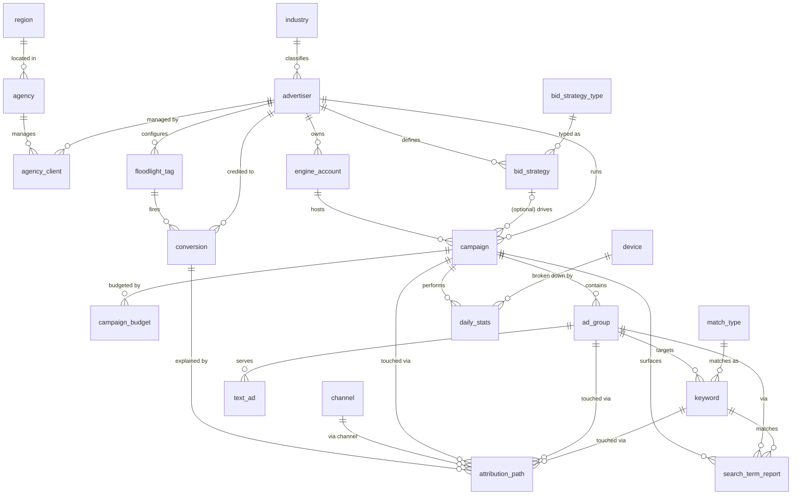

# 搜索广告归因分析 Agent 数据集: ER 文档

> 业务背景, 行业科普, 术语表请见 `01-search_advertising_attribution_agent_large_business_context-cn.md`. 本文档只描述数据.

## 1. 数据集说明

本数据集模拟一家北美媒介代理控股集团 (Lumina Reach Media Group) 在 Search Ads 360 (SA360) 上汇总的投放组合数据层, 覆盖 80 家美国广告主、10 个 IAB 风格行业, 在 Google Ads (约 75% 花费) 和 Microsoft Advertising (约 25%) 两家搜索引擎上的付费搜索投放。数据形态专为 Text-to-SQL 与 Agent 风格分析设计, 分布带真实锚点而非均匀噪声。公司画像、商业模式、行业科普、账户树、归因模型科普和术语表都在业务背景文档里, 本文档只讲表、列、约束、样例和数据生成规则。

### 1.1 数据集元信息

- **复杂度等级:** Large
- **表数:** 21 张 (6 维度表、3 组织表、8 账户结构表、1 转化跟踪表、3 事实表)
- **总记录数:** 约 57 万行
- **FK 关系:** 约 29 个外键关系。其中一组关键作用域规则 DDL 无法强制, 由生成器构造保证 (见 §5.1.A): `attribution_path` 的每个触点必须落在转化所属广告主的账户子树内; `campaign` 的 `engine_account_id` / `bid_strategy_id` 必须与 campaign 的广告主一致; `conversion.floodlight_tag_id` 必须属于同一广告主。
- **参考日期 (`REFERENCE_DATE`):** 由 SQL 视图 `v_reference_date` 暴露, 取 `MAX(daily_stats.report_date)`。所有时间窗口查询都从它往回算, 不用 `DATE('now')` (见 §5.2)。`daily_stats` 取参考日期前 90 天, `search_term_report` 取前 30 天。
- **单货币 / 单时区:** 全部 USD, 全部 `America/Los_Angeles`。

### 1.2 业务流程到表的映射

8 个日常业务流程产生或消费本数据集里的表：

| # | 业务流程 | 谁在做 | 涉及的表 |
|---|---|---|---|
| 1 | **投放搭建与维护** —— 搭建账户树、设置定向、暂停/启用 | 投放经理 | `campaign`, `ad_group`, `keyword`, `text_ad`, `match_type` |
| 2 | **出价策略配置** —— 选 Target CPA / Target ROAS / Manual CPC 并设定目标值 | 高级分析师 | `bid_strategy`, `bid_strategy_type`, `campaign.bid_strategy_id` |
| 3 | **预算规划与节奏控制** —— 设置日 / 月预算，月中根据进度调整 | 客户经理 | `campaign_budget` |
| 4 | **日常表现报表** —— 昨天的花费、点击、转化；跨设备 CPA；引擎对比 | 分析师 / 高管 | `daily_stats`, `device`, `engine_account` |
| 5 | **展示份额诊断** —— 我损失的展示是因为出价不够（`lost_is_rank`）还是预算不够（`lost_is_budget`）？ | 经理 | `daily_stats.lost_is_*`, `campaign_budget` |
| 6 | **搜索词挖掘** —— 用户实际搜了什么、哪些查询有转化、哪些该排除 | 运营 | `search_term_report`, `keyword`, `match_type` |
| 7 | **转化跟踪** —— 用户在广告主网站完成购买 / 注册等时触发 Floodlight 标签 | 营销运营 | `floodlight_tag`, `conversion` |
| 8 | **多触点归因** —— 每个转化，沿途接触了哪些渠道和投放；不同归因模型下信用如何分配 | 高级分析师 / 高管 | `attribution_path`, `channel`, `conversion` |

`03-search_advertising_attribution_agent_large_sql_queries-cn.md` 里的 20 个
SQL 查询覆盖了这 8 个流程。

### 1.3 数据生命周期

21 张表按生命周期分为 4 类，决定了行数规模以及在真实系统里每张表多久
被重写一次：

| 类别 | 是什么 | 真实世界节奏 | 本数据集 |
|---|---|---|---|
| **参考 / 维度** | 不属于任何单个广告主的全局分类法 | Google 可能一年更新一次 | `industry`, `region`, `bid_strategy_type`, `match_type`, `device`, `channel`（共 ~37 行） |
| **组织结构** | 广告主-代理-引擎的商业关系 | 在合同事件上变化（月级 / 年级） | `agency`, `advertiser`, `agency_client`, `engine_account`（~320 行） |
| **账户结构** | 投放树 —— 在投什么、出多少价、用什么预算 | 每周编辑：新增 / 暂停 campaign、调预算 | `bid_strategy`, `campaign`, `campaign_budget`, `ad_group`, `keyword`, `text_ad`, `floodlight_tag`（~60,000 行 —— keyword 占大头） |
| **事实 / 事件** | 实际发生了什么，日复一日 | 引擎按日写入；事件持续到达 | `daily_stats`, `conversion`, `attribution_path`, `search_term_report`（~480,000 行） |

这就是为什么生产环境里一个广告主只有 ~10 行 campaign 但每天产生 ~2,000+
行 `daily_stats`：账户结构数据慢、事实数据高频。本数据集保持同样的比例。

每张表的生成器（`*_data_generator.py`）实现了特定的生产规则 —— 比如
`daily_stats` 按 (campaign × 日 × device) 生成，且仅在 campaign 活跃窗口内；
当 `cost / daily_budget` 接近上限时 `lost_is_budget` 被向上偏置。完整规则
见 §5（"数据生成规则"）。

## 2. 复杂度等级：Large

- **表数：** 21 张（6 维度表、3 组织表、8 账户结构表、1 转化跟踪表、3 事实表）
- **总记录数：** ~570k 行
- **参考窗口：** `daily_stats` 取过去 90 天，`search_term_report` 取过去 30 天
- **单货币**（USD）、**单时区**（America/Los_Angeles）

> **关于复杂度标签的说明。** Skill 规范定义了三档复杂度 —
> `low` / `medium` / `high`（分别 4–6 / 8–12 / 15–20 张表）。本数据集
> 用 `large` 作为 `high` 之上的有意延伸：21 张表 + ~570k 行才能端到端
> 建模 SA360 的归因 + 出价 + 预算业务面。功能上应当被理解为
> "扩展版 high"。

| 表 | 行数 | 用途 |
|---|---:|---|
| industry | 10 | IAB 风格行业分类 |
| region | 7 | 美国人口普查风格地区代码 |
| bid_strategy_type | 8 | Google Ads 出价策略分类 |
| match_type | 3 | Exact / Phrase / Broad |
| device | 3 | Mobile / Desktop / Tablet |
| channel | 6 | 归因渠道分类 |
| agency | 15 | 媒介代理实体 |
| advertiser | 80 | 广告主品牌 |
| agency_client | 64 | ~80% 广告主由代理管理 |
| engine_account | ~120 | 每广告主的各引擎账户（Google 主，Microsoft 辅） |
| bid_strategy | ~270 | 出价策略实例 |
| campaign | ~800 | 投放系列 |
| campaign_budget | ~1,500 | 历史预算变更 |
| ad_group | ~4,200 | 广告组 |
| keyword | ~42,000 | 关键词 |
| text_ad | ~12,500 | 文字广告 |
| floodlight_tag | ~285 | 转化跟踪标签 |
| daily_stats | ~165,000 | 每日投放表现 |
| conversion | 5,000 | 转化事件 |
| attribution_path | ~15,400 | 每触点的归因信用（平均每转化 ~3.1 个触点；几何路径长度分布期望 3.08） |
| search_term_report | ~318,000 | 搜索词表现，按 keyword 分层采样 |

---

## 3. 实体关系图



图示故意收敛到关系层；完整列定义见下方各表。

---

## 4. 表结构定义

### 维度表

#### 1. industry
广告主行业分类（IAB 风格）。

| 列 | 类型 | 约束 | 说明 |
|---|---|---|---|
| id | INTEGER | 主键 | |
| code | VARCHAR(30) | UNIQUE, NOT NULL | 短代码（如 `RETAIL`） |
| name | VARCHAR(50) | NOT NULL | 显示名 |
| description | TEXT | 可空 | 一句话范围 |

示例：`(1, 'RETAIL', 'Retail & E-commerce', 'Online and brick-and-mortar consumer goods')`

#### 2. region
代理公司所在地区，使用美国人口普查风格代码。

| 列 | 类型 | 约束 | 说明 |
|---|---|---|---|
| id | INTEGER | 主键 | |
| code | VARCHAR(20) | UNIQUE, NOT NULL | NE / MW / SO / SE / WE / PAC / MT |
| name | VARCHAR(50) | NOT NULL | Northeast, Midwest, … |

#### 3. bid_strategy_type
Google Ads 8 种出价策略原型。`is_automated=1` 标识 Smart Bidding 策略。

| 列 | 类型 | 约束 | 说明 |
|---|---|---|---|
| id | INTEGER | 主键 | |
| code | VARCHAR(30) | UNIQUE, NOT NULL | `MANUAL_CPC`, `TARGET_CPA`, `MAX_CONV`, … |
| name | VARCHAR(100) | NOT NULL | 显示名 |
| description | TEXT | 可空 | 一句话语义 |
| is_automated | BOOLEAN | NOT NULL | SQLite 中以 `0`/`1` 存储 |

#### 4. match_type
关键词的 Exact / Phrase / Broad 匹配类型。

| 列 | 类型 | 约束 | 说明 |
|---|---|---|---|
| id | INTEGER | 主键 | |
| code | VARCHAR(20) | UNIQUE | `EXACT` / `PHRASE` / `BROAD` |
| name | VARCHAR(50) | NOT NULL | 显示名 |

#### 5. device
Mobile / Desktop / Tablet —— `daily_stats` 的设备拆分主轴。

#### 6. channel
归因渠道分类：Paid Search、Display、Paid Social、Email、Direct、
Organic Search。只被 `attribution_path` 使用。

### 组织结构表

#### 7. agency
媒介代理，撮合广告主关系。

| 列 | 类型 | 约束 | 说明 |
|---|---|---|---|
| id | INTEGER | 主键 | |
| agency_code | VARCHAR(20) | UNIQUE | `AGY_001`, … |
| agency_name | VARCHAR(100) | NOT NULL | en_US Faker 公司名 + " Media" |
| region_id | INTEGER | FK → region.id | |
| tier_level | VARCHAR(20) | NOT NULL | Platinum / Gold / Silver / Standard |
| account_manager | VARCHAR(50) | NOT NULL | 人名 |
| contact_email | VARCHAR(100) | NOT NULL | |
| contact_phone | VARCHAR(30) | NOT NULL | |
| created_at | DATETIME | NOT NULL | |

#### 8. advertiser
广告主品牌。行业分布跟随 `industry` 的 IAB 风格分类。

| 列 | 类型 | 约束 | 说明 |
|---|---|---|---|
| id | INTEGER | 主键 | |
| advertiser_code | VARCHAR(20) | UNIQUE | `ADV_001`, … |
| company_name | VARCHAR(100) | NOT NULL | en_US Faker 公司名 |
| industry_id | INTEGER | FK → industry.id | |
| sub_industry | VARCHAR(50) | 可空 | 本数据集未填充 |
| company_size | VARCHAR(20) | NOT NULL | SMB / Mid-Market / Enterprise |
| monthly_spend_tier | VARCHAR(20) | NOT NULL | `<10K`, `10K-50K`, `50K-200K`, `>200K` |
| primary_goal | VARCHAR(50) | NOT NULL | Brand Awareness / Lead Generation / Sales Conversion / App Installs |
| website_url | VARCHAR(200) | NOT NULL | |
| created_at | DATETIME | NOT NULL | |
| account_status | VARCHAR(20) | NOT NULL | Active / Paused / Suspended（~85/12/3） |

#### 9. agency_client
agency 和 advertiser 之间支持 M:N 的桥接表。约 80% 的广告主由代理
管理，另外 20% 直签。

> **当前实际为 1:N 使用。** Schema 允许一个广告主关联多个代理
> （并发的子渠道合同、迁移代理时的历史合同等），但当前生成器为
> **每个广告主最多产生 1 行**（每个被管理的广告主在 `random.sample`
> 中只被抽中一次）。所以这 64 行行为上是一个 "当前主代理" 1:N 查找表。
> 保留 M:N schema 是为了未来扩展（多代理组合历史、子代理汇总）不需要
> 表结构迁移。`UNIQUE(agency_id, advertiser_id)` 在数据库层强制。

> **不变量。** `(agency_id, advertiser_id)` 在本表内唯一。一个广告主
> 永远不会被同一家代理双重管理。（否则 `agency_client` join 到事实表
> 会因为重复桥行而扇出。）
>
> **`is_active` 分布。** 约 60% 行 `contract_end IS NULL`（开放式合同，
> `is_active=1`），约 20% `contract_end` 在过去（`is_active=0`），
> 约 20% `contract_end` 在未来（`is_active=1`）。净效果：约 80% 活跃 /
> 20% 已过期。这个 0/1 分布让 `is_active = 1` 过滤真的起作用。
>
> **tier ↔ 公司规模相关性。** 给广告主分配代理时，代理的 `tier_level`
> 按广告主的 `company_size` 加权：Platinum 代理偏向 Enterprise /
> Mid-Market；Standard 代理只服务 SMB。

| 列 | 类型 | 约束 | 说明 |
|---|---|---|---|
| id | INTEGER | 主键 | |
| agency_id | INTEGER | FK → agency.id | 参与 `UNIQUE(agency_id, advertiser_id)` |
| advertiser_id | INTEGER | FK → advertiser.id | 参与 `UNIQUE(agency_id, advertiser_id)` |
| contract_start | DATE | NOT NULL | |
| contract_end | DATE | 可空 | NULL = 开放式 |
| fee_percentage | FLOAT | NOT NULL | 8-20% |
| is_active | BOOLEAN | NOT NULL | 以 `0`/`1` 存储 |

### 账户结构表

#### 10. engine_account
广告主下的引擎账户。每个广告主都有一个 Google Ads 账户（NA 市场主导
引擎），~50% 还额外有一个 Microsoft Advertising 账户。结合 campaign
级别的引擎选择，最终组合中 ~75% 的 campaign / 花费在 Google Ads 上、
~25% 在 Microsoft Advertising 上。之前作为第三家引擎的 Yahoo Japan
已删除：它是日本市场专用 SA360 合作伙伴，不服务美国广告主。

| 列 | 类型 | 约束 | 说明 |
|---|---|---|---|
| id | INTEGER | 主键 | |
| account_code | VARCHAR(20) | UNIQUE | `ENG_0001`, … |
| advertiser_id | INTEGER | FK → advertiser.id | |
| engine_type | VARCHAR(30) | NOT NULL | Google Ads / Microsoft Advertising |
| account_name | VARCHAR(100) | NOT NULL | |
| currency | VARCHAR(10) | NOT NULL | 本数据集恒为 `USD` |
| timezone | VARCHAR(50) | NOT NULL | 恒为 `America/Los_Angeles` |
| status | VARCHAR(20) | NOT NULL | Active / Paused（~90/10） |
| created_at | DATETIME | NOT NULL | |

#### 11. bid_strategy
每个广告主的出价策略配置。每广告主 2–5 个。

| 列 | 类型 | 约束 | 说明 |
|---|---|---|---|
| id | INTEGER | 主键 | |
| strategy_code | VARCHAR(20) | UNIQUE | `BID_0001`, … |
| advertiser_id | INTEGER | FK → advertiser.id | |
| strategy_name | VARCHAR(100) | NOT NULL | |
| strategy_type_id | INTEGER | FK → bid_strategy_type.id | |
| target_cpa | FLOAT | 可空 | 只在 Target CPA 时设置 |
| target_roas | FLOAT | 可空 | 只在 Target ROAS 时设置 |
| max_cpc_limit | FLOAT | 可空 | 只在 Manual / Enhanced CPC 时设置 |
| target_impr_share | FLOAT | 可空 | 只在 Target Impression Share 时设置 |
| impr_share_location | VARCHAR(30) | 可空 | Anywhere / Top of page / Absolute top |
| status | VARCHAR(20) | NOT NULL | Active / Paused |
| created_at | DATETIME | NOT NULL | |
| last_modified | DATETIME | NOT NULL | |

#### 12. campaign
投放系列实体。每广告主 5–15 个。命名规范沿用 Google Ads 习惯：
`{Brand}_{Product}_{MatchType}_{Geo}_{Device}_C{id}`。

| 列 | 类型 | 约束 | 说明 |
|---|---|---|---|
| id | INTEGER | 主键 | |
| campaign_code | VARCHAR(20) | UNIQUE | `CMP_00001`, … |
| advertiser_id | INTEGER | FK → advertiser.id | |
| engine_account_id | INTEGER | FK → engine_account.id | |
| campaign_name | VARCHAR(200) | NOT NULL | |
| campaign_type | VARCHAR(30) | NOT NULL | Search / Shopping / Display / Video / Performance Max |
| campaign_subtype | VARCHAR(30) | 可空 | Search 时为 Standard / Smart / Dynamic；其他为 NULL |
| bid_strategy_id | INTEGER | FK, 可空 | |
| status | VARCHAR(20) | NOT NULL | Enabled / Paused / Removed（~70/25/5） |
| start_date | DATE | NOT NULL | 最早 18 个月前 |
| end_date | DATE | 可空 | 30% 的 campaign 有 end_date |
| targeting_location | VARCHAR(100) | NOT NULL | 单一美国州、都会区或 "United States"（单值 VARCHAR —— 不像 `targeting_language` 那样是 pipe-list）。真实 SA360 支持多地域定向；这是已知 demo 简化。 |
| targeting_language | VARCHAR(50) | NOT NULL | English / Spanish / English; Spanish |
| targeting_device | VARCHAR(50) | NOT NULL | All / Mobile only / Desktop + Tablet / Mobile + Tablet |
| created_at | DATETIME | NOT NULL | |

> **说明：** `targeting_location` / `targeting_language` / `targeting_device`
> 都是 scalar VARCHAR，存单值或短 pipe-list。真实 SA360 支持多值定向；
> 这是已知 demo 简化。

#### 13. campaign_budget
预算行按 `effective_date` 版本化。要解析日期 D 当时生效的预算，调用方
取 `MAX(effective_date) WHERE effective_date <= D`。没有 `is_current`
标志、没有 `end_date`；下一行的 `effective_date` 隐式关闭上一版。

> **不变量。** `(campaign_id, effective_date)` 唯一 —— 在数据库层通过
> `UNIQUE` 约束强制。生成器对同一 campaign 的相邻 `effective_date` 至少
> 间隔 20 天（累加偏移），所以每个 campaign 内的严格单调性成立。
> `daily_budget` 从随父广告主 `monthly_spend_tier` 缩放的范围里采样
> （SMB 广告主预算 $50–$500，Enterprise 档预算 $3,000–$30,000）。

| 列 | 类型 | 约束 | 说明 |
|---|---|---|---|
| id | INTEGER | 主键 | |
| campaign_id | INTEGER | FK → campaign.id | |
| daily_budget | FLOAT | NOT NULL | USD |
| monthly_budget | FLOAT | NOT NULL | **派生：恒等于 `daily_budget × 30`。** 落在行上是为了查询方便；查任一列结果应相等（除舍入外）。 |
| budget_delivery | VARCHAR(30) | NOT NULL | Standard / Accelerated |
| effective_date | DATE | NOT NULL | 预算生效日 |
| created_at | DATETIME | NOT NULL | |

#### 14. ad_group
每 campaign 3–8 个。名称从该 campaign 所属行业的关键词词库播种
（如 `"medicare supplement plans - AdGroup"`）。

| 列 | 类型 | 约束 | 说明 |
|---|---|---|---|
| id | INTEGER | 主键 | |
| ad_group_code | VARCHAR(20) | UNIQUE | `AGP_00001`, … |
| campaign_id | INTEGER | FK → campaign.id | |
| ad_group_name | VARCHAR(200) | NOT NULL | |
| default_cpc | FLOAT | NOT NULL | |
| status | VARCHAR(20) | NOT NULL | Enabled / Paused / Removed |
| created_at | DATETIME | NOT NULL | |

#### 15. keyword
每 ad group 5–15 个，从行业专属英文关键词词库里抽取。Quality Score 偏
6–8（钟形分布），不是均匀的。

| 列 | 类型 | 约束 | 说明 |
|---|---|---|---|
| id | INTEGER | 主键 | |
| keyword_code | VARCHAR(20) | UNIQUE | `KW_000001`, … |
| ad_group_id | INTEGER | FK → ad_group.id | |
| keyword_text | VARCHAR(300) | NOT NULL | 英文关键词 |
| match_type_id | INTEGER | FK → match_type.id | |
| status | VARCHAR(20) | NOT NULL | Enabled / Paused / Removed |
| max_cpc | FLOAT | NOT NULL | 广告主设置的 CPC 上限 |
| quality_score | INTEGER | NOT NULL | 3–10，钟形偏 6–7 |
| expected_ctr | VARCHAR(20) | NOT NULL | Below Average / Average / Above Average |
| ad_relevance | VARCHAR(20) | NOT NULL | 同上 |
| landing_page_exp | VARCHAR(20) | NOT NULL | 同上 |
| first_page_cpc | FLOAT | NOT NULL | demo 简化：0.6 × max_cpc |
| top_of_page_cpc | FLOAT | NOT NULL | demo 简化：1.2 × max_cpc |
| created_at | DATETIME | NOT NULL | |

#### 16. text_ad
每 ad group 2–4 个。在 ad 层级保留 `quality_score` 是为了查询灵活性，
但真实 Google Ads 只在 keyword 层级暴露 QS。两个 headline 和一个
description 可空，模拟 RSA 的可选资产槽位。

| 列 | 类型 | 约束 | 说明 |
|---|---|---|---|
| id | INTEGER | 主键 | |
| ad_code | VARCHAR(20) | UNIQUE | `AD_000001`, … |
| ad_group_id | INTEGER | FK → ad_group.id | |
| headline_1 | VARCHAR(100) | NOT NULL | |
| headline_2 | VARCHAR(100) | NOT NULL | |
| headline_3 | VARCHAR(100) | 可空 | |
| description_1 | VARCHAR(200) | NOT NULL | |
| description_2 | VARCHAR(200) | 可空 | |
| final_url | VARCHAR(500) | NOT NULL | |
| display_url | VARCHAR(200) | NOT NULL | |
| status | VARCHAR(20) | NOT NULL | Enabled / Paused / Removed |
| quality_score | INTEGER | NOT NULL | 4–10 |
| created_at | DATETIME | NOT NULL | |

### 转化跟踪与事实表

#### 17. floodlight_tag
SA360 Floodlight 标签 —— 每个广告主的转化跟踪定义。每广告主 2–5 个。
`attribution_model` 记录广告主选择用于报表的"生产"模型；`attribution_path`
表独立存储**所有六个**模型的信用，便于做 what-if 对比（见 §5.3）。

| 列 | 类型 | 约束 | 说明 |
|---|---|---|---|
| id | INTEGER | 主键 | |
| tag_code | VARCHAR(30) | UNIQUE | `FL_0001`, … |
| advertiser_id | INTEGER | FK → advertiser.id | |
| tag_name | VARCHAR(100) | NOT NULL | |
| conversion_type | VARCHAR(50) | NOT NULL | Purchase / Lead / Signup / PageView / AddToCart / AppInstall |
| counting_method | VARCHAR(30) | NOT NULL | Standard / Unique |
| attribution_model | VARCHAR(30) | NOT NULL | 6 个归因模型之一 |
| lookback_window | INTEGER | NOT NULL | {7, 14, 30, 60, 90} 之一；约束 `attribution_path.hours_before_conv` |
| status | VARCHAR(20) | NOT NULL | |
| created_at | DATETIME | NOT NULL | |

#### 18. daily_stats
每 campaign / 每日 / 每设备的投放表现。**粒度：
`(campaign_id, report_date, device_id)`。** 这是单张最大事实表。

> 已退役的前作使用 `(entity_type, entity_id)` 多态键，可以承载多个粒度
> 层级，但破坏了 FK 完整性，并要求每个查询都加 `entity_type='Campaign'`
> 过滤。多态列已被移除；所有行都是 campaign 粒度。

| 列 | 类型 | 约束 | 说明 |
|---|---|---|---|
| id | INTEGER | 主键 | |
| campaign_id | INTEGER | FK → campaign.id | NOT NULL |
| report_date | DATE | NOT NULL | |
| device_id | INTEGER | FK → device.id | NOT NULL |
| impressions | INTEGER | NOT NULL | |
| clicks | INTEGER | NOT NULL | |
| cost | FLOAT | NOT NULL | USD |
| conversions | FLOAT | NOT NULL | |
| conversion_value | FLOAT | NOT NULL | USD |
| ctr | FLOAT | NOT NULL | clicks/impressions，4 位小数 |
| avg_cpc | FLOAT | NOT NULL | USD |
| cpa | FLOAT | 可空 | conversions = 0 时为 NULL |
| roas | FLOAT | 可空 | cost = 0 时为 NULL |
| impression_share | FLOAT | NOT NULL | 25–95 |
| search_impr_share | FLOAT | **可空** | Search campaign 时 = `impression_share`；Display / Video / Performance Max / Shopping 时为 **NULL** |
| lost_is_budget | FLOAT | NOT NULL | 日花费 > 在效预算 80% 时被上调 |
| lost_is_rank | FLOAT | NOT NULL | `100 - impression_share - lost_is_budget`，构造上保证 ≥ 0 |
| search_abs_top_is | FLOAT | **可空** | ≤ `search_top_is`；非 Search campaign 为 **NULL** |
| search_top_is | FLOAT | **可空** | ≤ `impression_share`；非 Search campaign 为 **NULL** |

> **`search_*_is` 语义。** 真实 SA360 只对搜索流量上报展示份额位置指标；
> Display / Video / Performance Max / Shopping 行没有对应指标。本数据集
> 遵循这点：所有非 Search campaign 的 `search_impr_share`、`search_top_is`、
> `search_abs_top_is` 都是 NULL。引用这些列的查询（特别是 Query 16）
> 必须过滤 `campaign_type = 'Search'` 或 `WHERE search_top_is IS NOT NULL`。

> **`daily_stats.conversions` vs `conversion` 表。** 这两种 "conversions"
> 度量不同的东西，**不应相加或逐行对比**。`daily_stats.conversions` 是
> 引擎上报的日聚合（引擎报表里展示的值），16.5w 行加总在百万级。
> `conversion` 表是 Floodlight 事件日志（5,000 个单独事件）。教学目的上
> 两个尺度的差距是有意的 —— "总共多少 conversion" 这种 Text-to-SQL
> 提示要选**一个**定义并保持一致。

覆盖范围：行只在 `[今天-90, 今天]` 与 campaign 活跃窗口
`[start_date, end_date or 今天]` 的交集内生成。总约 16.5w 行。

#### 19. conversion
转化事件。90 天内 5000 行。

| 列 | 类型 | 约束 | 说明 |
|---|---|---|---|
| id | INTEGER | 主键 | |
| conversion_code | VARCHAR(30) | UNIQUE | `CONV_000001`, … |
| advertiser_id | INTEGER | FK → advertiser.id | |
| floodlight_tag_id | INTEGER | FK → floodlight_tag.id | |
| conversion_time | DATETIME | NOT NULL | |
| conversion_value | FLOAT | NOT NULL | USD |
| currency | VARCHAR(10) | NOT NULL | 恒为 `USD` |
| quantity | INTEGER | NOT NULL | 1–5 |

#### 20. attribution_path
每触点转化信用分配。**粒度：每行一个 `(conversion_id, touchpoint_order)`。**
每转化 2–6 个触点。

硬不变量（生成时验证）：

- `(campaign_id, ad_group_id, keyword_id)` 引用 —— 非 NULL 时 —— 必须属于
  父 conversion 的同一广告主。没有跨广告主触点。
- `(ad_group_id ∈ campaign.children, keyword_id ∈ ad_group.children)` ——
  每行层级内部一致。
- `touchpoint_order = 1` 是时间最早的触点；`touchpoint_order = N` 紧贴
  转化前。`hours_before_conv` 随 `touchpoint_order` 单调非增。
- `hours_before_conv ≤ floodlight_tag.lookback_window * 24`。

| 列 | 类型 | 约束 | 说明 |
|---|---|---|---|
| id | INTEGER | 主键 | |
| conversion_id | INTEGER | FK → conversion.id | NOT NULL |
| advertiser_id | INTEGER | FK → advertiser.id | NOT NULL。**反范式化** —— 也可通过 `conversion.advertiser_id` 推出。落在触点行上让按广告主的渠道查询不必经过 `conversion` 表 join。生成器保证两个值匹配。 |
| touchpoint_order | INTEGER | NOT NULL | 从 1 开始；1 = 首触 |
| channel_id | INTEGER | FK → channel.id | NOT NULL |
| campaign_id | INTEGER | FK → campaign.id, 可空 | |
| ad_group_id | INTEGER | FK → ad_group.id, 可空 | campaign_id 为 NULL 时也为 NULL |
| keyword_id | INTEGER | FK → keyword.id, 可空 | ad_group_id 为 NULL 时也为 NULL |
| interaction_type | VARCHAR(20) | NOT NULL | Impression (80%) / Click (15%) / View (5%) |
| interaction_time | DATETIME | NOT NULL | |
| days_before_conv | INTEGER | NOT NULL | `hours_before_conv // 24` |
| hours_before_conv | INTEGER | NOT NULL | 见上方不变量 |
| last_click_credit | FLOAT | NOT NULL | 只在末触点为 1.0 |
| first_click_credit | FLOAT | NOT NULL | 只在首触点为 1.0 |
| linear_credit | FLOAT | NOT NULL | 每触点 `1/N` |
| time_decay_credit | FLOAT | NOT NULL | 几何衰减：`2^i / Σ 2^j` |
| position_credit | FLOAT | NOT NULL | 40% 首、40% 末、20% 平摊到中间。**N=2 特例：(0.5, 0.5)**（见 §5.1.B #9）。由于路径长度分布偏 N=2（~40% 转化），`position_credit` 直方图上 0.5 是一个可见的尖峰 —— 这是设计，不是 bug。 |
| data_driven_credit | FLOAT | NOT NULL | 归一化随机 —— 见 §5.3 说明 |

#### 21. search_term_report
用户实际输入触发广告展示的搜索词。按 keyword 分层采样（约 5 个随机日 ×
1–2 个搜索词）。`keyword_id` 是**可空的**：约 15% 是广泛匹配溢出
（搜索引擎服务的查询没直接匹配到任何已存关键词）；这些行的 `campaign_id`
和 `ad_group_id` 仍指向触发展示的那个 ad group。

| 列 | 类型 | 约束 | 说明 |
|---|---|---|---|
| id | INTEGER | 主键 | |
| report_date | DATE | NOT NULL | |
| campaign_id | INTEGER | FK → campaign.id | NOT NULL |
| ad_group_id | INTEGER | FK → ad_group.id | NOT NULL |
| keyword_id | INTEGER | FK → keyword.id, 可空 | ~15% 为 NULL（广泛匹配溢出） |
| search_term | VARCHAR(500) | NOT NULL | 用户原始查询 |
| match_type_used | VARCHAR(20) | NOT NULL | Exact / Phrase / Broad |
| impressions | INTEGER | NOT NULL | |
| clicks | INTEGER | NOT NULL | |
| cost | FLOAT | NOT NULL | |
| conversions | FLOAT | NOT NULL | |
| conversion_value | FLOAT | NOT NULL | |
| added_excluded | VARCHAR(20) | 可空 | NULL / Added / Excluded |

---

## 5. 数据生成规则

### 5.1 业务逻辑约束

#### 5.1.A 跨表广告主作用域不变量

每条事实和账户结构行都带有一个或多个引用，必须保持在同一广告主内。
这些不变量由生成器构造保证，并在每次运行结束时验证：

| 表 | 引用 | 约束 |
|---|---|---|
| `engine_account` | `advertiser_id` | （事实来源） |
| `bid_strategy` | `advertiser_id` | （事实来源） |
| `floodlight_tag` | `advertiser_id` | （事实来源） |
| `campaign` | `engine_account_id` | `engine_account.advertiser_id == campaign.advertiser_id` |
| `campaign` | `bid_strategy_id`（非 NULL 时） | `bid_strategy.advertiser_id == campaign.advertiser_id` |
| `conversion` | `floodlight_tag_id` | `floodlight_tag.advertiser_id == conversion.advertiser_id` |
| `attribution_path` | `campaign_id` / `ad_group_id` / `keyword_id` | 全部位于父 conversion 的广告主子树内 |

#### 5.1.B 分布约束

1. **广告主层级是硬约束。** `attribution_path` 触点对 `campaign_id`、
   `ad_group_id`、`keyword_id` 的引用只指向 conversion 所属广告主的
   实体。触点行内部的 campaign → ad_group → keyword 层级也保持一致。
2. **触点时间顺序 ⇒ touchpoint_order。** 采样 N 个 `hours_before_conv`
   值，降序排列，依次赋 1..N。所以 `touchpoint_order=1` 始终是时间最早
   的触点。
3. **回溯窗口约束。** `hours_before_conv ≤ lookback_window × 24`。
4. **展示份额分解非负。** 先采样 `impression_share`；再从
   `[0, 100 - impression_share]` 采样 `lost_is_budget`；推导出
   `lost_is_rank` 为剩余部分。
5. **IS 位置单调。** 采样 `search_top_is ≤ impression_share`，再
   `search_abs_top_is ≤ search_top_is`。（仅 Search campaign。）
6. **`search_*_is` 在非 Search campaign 上为 NULL。** Display / Video /
   Performance Max / Shopping 行的 `daily_stats` 中 `search_impr_share`、
   `search_top_is`、`search_abs_top_is` 均为 NULL。
7. **预算压力关联 `lost_is_budget`。** 当 campaign 日花费超过在效
   `daily_budget` 的 ~80% 时，`lost_is_budget` 被向上偏置。
8. **daily_stats 尊重 campaign 生命周期。** 行只对
   `report_date ∈ [max(campaign.start_date, 今天-90), min(campaign.end_date
   或 今天, 今天)]` 生成。
9. **每个 conversion 下每个模型的信用列加总 = 1.0**（误差 ≤ 0.0005，
   来自 `round(..., 4)`）。包含 N=2 路径的 Position-Based 信用
   (0.5, 0.5) 特例 —— 经典 (0.4, 0.4) 拆分会让这一列加总到 0.8。
10. **路径长度分布。** 每 conversion 的触点数从截断几何分布采样：
    N ∈ {2, 3, 4, 5, 6} 的权重 `[40, 30, 15, 10, 5]` —— 偏短路径，
    与真实归因数据一致。
11. **渠道按触点位置偏置。** 首触点偏 Display / Paid Social（上漏斗）；
    末触点偏 Paid Search / Direct（下漏斗）。中间触点用更平坦的分布。
12. **QS 子分量相关性。** `expected_ctr`、`ad_relevance`、
    `landing_page_exp` 按 keyword 整体 `quality_score` 加权：
    QS-9 keyword 抽到 "Above Average" 概率 ~70%；QS-4 keyword 抽到
    "Below Average" 概率 ~55%。
13. **广泛匹配溢出。** 约 15% 的 `search_term_report` 行 `keyword_id`
    为 NULL —— 引擎匹配到用户查询时未直接命中任何已存关键词。
14. **CTR 真实性。** 从混合分布采样，偏 1–6%（付费搜索行业基准），
    偶尔到 ~12%（品牌词）。没有均匀分布的 0–15% 尾。
15. **设备差异化。** 每行 `impressions` 按设备缩放：Mobile × 1.5，
    Desktop × 0.7，Tablet × 0.25。转化率反向缩放：Desktop × 1.5，
    Mobile × 0.75，Tablet × 0.95。最终：Mobile 承载 ~60% 展示，
    但 Desktop 的 CPA 最低。
16. **引擎差异化。** Microsoft Advertising 行的 CPC 约为 Google Ads 的
    80%（竞争较小），转化率低 ~12%（`ENGINE_CPC_SCALE`、
    `ENGINE_CONV_RATE_SCALE`）。组合层面 CPA 差距在个位数百分比。
17. **行业转化价值。** `avg_conv_value` 每行从按行业的范围
    （`INDUSTRY_CONV_VALUE_RANGE`）采样：地产 / 金融 / 保险 / 汽车 落
    高位（$500–$2000）；餐饮 / 零售 落低位（$15–$350）。各行业 ROAS
    差异反映真实客单价模式。
18. **行业 Quality Score 偏置。** 竞争激烈垂直行业（保险、金融、地产）
    QS 分布向 5–6 偏；低竞争垂直（B2B SaaS、教育、餐饮）QS 向 8–9 偏。
19. **`agency_client.is_active` 分布。** ~80% 活跃 / ~20% 过期，不是
    100% 活跃。`is_active = 1` 过滤是有意义的。（20% 的"过期"来自
    contract_end 采样的 `past` 分支 —— `[60% 开放, 20% 过去, 20% 未来]`。）

#### 5.1.C 已知简化

- 父 → 子链上的 `created_at` 时间戳从重叠窗口采样。子的 `created_at`
  偶尔早于父。严格时序需要把父时间戳穿过 8 个生成函数，对教学数据集
  收益很低（没有查询基于 `created_at` join）。
- **没有 `negative_keyword` 实体。** 真实 SA360 运营中，否定关键词列表
  （挂在 campaign 或 ad-group 级）是一等对象 —— 记录广告主想*排除*匹配的
  搜索词。本数据集只建模"搜索词被排除"的*历史事件*（通过
  `search_term_report.added_excluded = 'Excluded'`）；没有单独的当前生效
  否定列表表。流程 #6（搜索词挖掘）仍可用；需要评估"今天这个查询会被
  屏蔽吗"的流程不在范围内。
- **`agency_client` 当前为 1:N 使用。** 见 §9 的理由。
- **`campaign.targeting_location` 是单值。** 见 §12 的理由。
- **`text_ad.quality_score`** —— Google Ads 实际只在 keyword 层级暴露
  Quality Score。我们在 ad 层级保留一个数值 QS 是为查询灵活性，应理解
  为合成的"每广告质量代理值"，不是 SA360 可上报指标。
- **`daily_stats.cost` 不被 `daily_budget` 上限。** 当日花费接近预算时
  生成器升高 `lost_is_budget`，但不在日预算上限处硬截 cost。真实引擎
  会在预算耗尽时停止投放；教学目的上不截 cost 让查询通过
  `lost_is_budget` 干净地看出过投信号，而不是通过"行缺失"模式。

### 5.2 参考日期约定（`v_reference_date` 视图）

所有时间窗口 SQL 查询都引用

```sql
(SELECT reference_date FROM v_reference_date)
```

而非 `DATE('now', ...)`。该视图由 `create_sqlite_database()` 创建为

```sql
CREATE VIEW v_reference_date AS
SELECT MAX(report_date) AS reference_date FROM daily_stats
```

把数据集的"今天"锚定到其最新事实行。这样无论数据集多久前生成，查询
都仍然能返回有意义的结果。

### 5.3 Floodlight `attribution_model` vs 6 个 `*_credit` 列

Floodlight 标签声明广告主**生产用**的归因模型（如 "Data Driven"）。
`attribution_path` 表无论标签设置如何，在每个触点上存储**所有 6 个**模型
的信用。这是有意的教学反范式化：让分析师能跑 "在 last-click vs.
first-click vs. data-driven 下这些转化会怎样" 的对比查询，不需要改数据集。
代价是 `floodlight_tag.attribution_model` 与 "对这个标签来说哪个信用列
是真的" 没有行级连接 —— 这个映射必须在 SQL 里表达（比如用 `CASE` 选择
匹配 `tag.attribution_model` 的列）。

**生产模型分布。** `floodlight_tag.attribution_model` 偏向 Last Click ——
采样权重大致为 `Last Click: 45%, Data Driven: 15%, First Click / Linear /
Time Decay / Position Based: 各 10%`。这匹配 SA360 默认值和大多数广告主
实际使用情况，所以 "在生产用哪个模型" 这类查询结果是 Last Click 主导。
做多模型 what-if 分析直接用 6 个 `*_credit` 列。

### 5.4 单货币 / 单时区简化

所有 `engine_account.currency` 和所有 `conversion.currency` 都是 `USD`。
所有 `engine_account.timezone` 都是 `America/Los_Angeles`。schema 保留
这些列是因为真实 SA360 是多货币多时区部署的；本数据集只是不走那条路径。

### 5.5 Faker 策略

| 字段模式 | Faker 方法 | 说明 |
|---|---|---|
| 公司名 | `fake.company()` | `en_US` locale |
| 人名 | `fake.name()` | |
| 邮箱 | `fake.company_email()` | |
| 电话 | `fake.phone_number()` | 美国格式 |
| URL | `https://www.{fake.domain_name()}` | |
| 日期 | `fake.date_between(start_date="-540d", end_date="-30d")` | 以日为单位的偏移量（Faker 把 `-30m` 读作分钟，不是月份） |
| 日期时间 | `fake.date_time_between(...)` | 同样的偏移约定 |
| 布尔 | 直接以 Python int 0/1 写入 | 避开 polars 的 `true`/`false` 文本 |

### 5.6 磁盘上的布尔

`agency_client.is_active` 和 `bid_strategy_type.is_automated` 写入 TSV
时是整数 `0` / `1`（不是 `true` / `false`）。加载器把字符串和整数都强制
转为 Python `bool` 再交给 SQLAlchemy。所有 SQL 查询都能可靠地用
`is_active = 1` 和 `is_active = 0`。

---

## 6. 数据库 Schema（SQLite DDL）

完整 DDL 由 `Base.metadata.create_all(engine)` 在运行时创建。核心定义
（摘选）：

```sql
CREATE TABLE daily_stats (
    id INTEGER PRIMARY KEY AUTOINCREMENT,
    campaign_id INTEGER NOT NULL REFERENCES campaign(id),
    report_date DATE NOT NULL,
    device_id INTEGER NOT NULL REFERENCES device(id),
    impressions INTEGER NOT NULL,
    clicks INTEGER NOT NULL,
    cost FLOAT NOT NULL,
    conversions FLOAT NOT NULL,
    conversion_value FLOAT NOT NULL,
    ctr FLOAT NOT NULL,
    avg_cpc FLOAT NOT NULL,
    cpa FLOAT,
    roas FLOAT,
    impression_share FLOAT NOT NULL,
    search_impr_share FLOAT,         -- 非 Search campaign 为 NULL
    lost_is_budget FLOAT NOT NULL,
    lost_is_rank FLOAT NOT NULL,
    search_abs_top_is FLOAT,         -- 非 Search campaign 为 NULL
    search_top_is FLOAT              -- 非 Search campaign 为 NULL
);

CREATE TABLE attribution_path (
    id INTEGER PRIMARY KEY AUTOINCREMENT,
    conversion_id INTEGER NOT NULL REFERENCES conversion(id),
    advertiser_id INTEGER NOT NULL REFERENCES advertiser(id),
    touchpoint_order INTEGER NOT NULL,
    channel_id INTEGER NOT NULL REFERENCES channel(id),
    campaign_id INTEGER REFERENCES campaign(id),
    ad_group_id INTEGER REFERENCES ad_group(id),
    keyword_id INTEGER REFERENCES keyword(id),
    interaction_type VARCHAR(20) NOT NULL,
    interaction_time DATETIME NOT NULL,
    days_before_conv INTEGER NOT NULL,
    hours_before_conv INTEGER NOT NULL,
    last_click_credit FLOAT NOT NULL,
    first_click_credit FLOAT NOT NULL,
    linear_credit FLOAT NOT NULL,
    time_decay_credit FLOAT NOT NULL,
    position_credit FLOAT NOT NULL,
    data_driven_credit FLOAT NOT NULL
);

CREATE VIEW v_reference_date AS
SELECT MAX(report_date) AS reference_date FROM daily_stats;

-- SQLAlchemy 在上述表上创建的 UNIQUE 约束：
-- agency_client:    UNIQUE (agency_id, advertiser_id)
-- campaign_budget:  UNIQUE (campaign_id, effective_date)
```

---

## 7. 文件清单

| # | 文件名 | 表 | 行数 | 依赖 |
|---|---|---|---:|---|
| 01 | 01_industry.tsv | industry | 10 | — |
| 02 | 02_region.tsv | region | 7 | — |
| 03 | 03_bid_strategy_type.tsv | bid_strategy_type | 8 | — |
| 04 | 04_match_type.tsv | match_type | 3 | — |
| 05 | 05_device.tsv | device | 3 | — |
| 06 | 06_channel.tsv | channel | 6 | — |
| 07 | 07_agency.tsv | agency | 15 | region |
| 08 | 08_advertiser.tsv | advertiser | 80 | industry |
| 09 | 09_agency_client.tsv | agency_client | 64 | agency, advertiser |
| 10 | 10_engine_account.tsv | engine_account | ~120 | advertiser |
| 11 | 11_bid_strategy.tsv | bid_strategy | ~270 | advertiser, bid_strategy_type |
| 12 | 12_campaign.tsv | campaign | ~800 | advertiser, engine_account, bid_strategy |
| 13 | 13_campaign_budget.tsv | campaign_budget | ~1,500 | campaign |
| 14 | 14_ad_group.tsv | ad_group | ~4,200 | campaign |
| 15 | 15_keyword.tsv | keyword | ~42,000 | ad_group, match_type |
| 16 | 16_text_ad.tsv | text_ad | ~12,500 | ad_group |
| 17 | 17_floodlight_tag.tsv | floodlight_tag | ~285 | advertiser |
| 18 | 18_daily_stats.tsv | daily_stats | ~165,000 | campaign, device |
| 19 | 19_conversion.tsv | conversion | 5,000 | advertiser, floodlight_tag |
| 20 | 20_attribution_path.tsv | attribution_path | ~15,400 | conversion, channel, campaign, ad_group, keyword |
| 21 | 21_search_term_report.tsv | search_term_report | ~318,000 | campaign, ad_group, keyword |

所有 TSV 加载完成后，创建 SQL 视图 `v_reference_date`。
