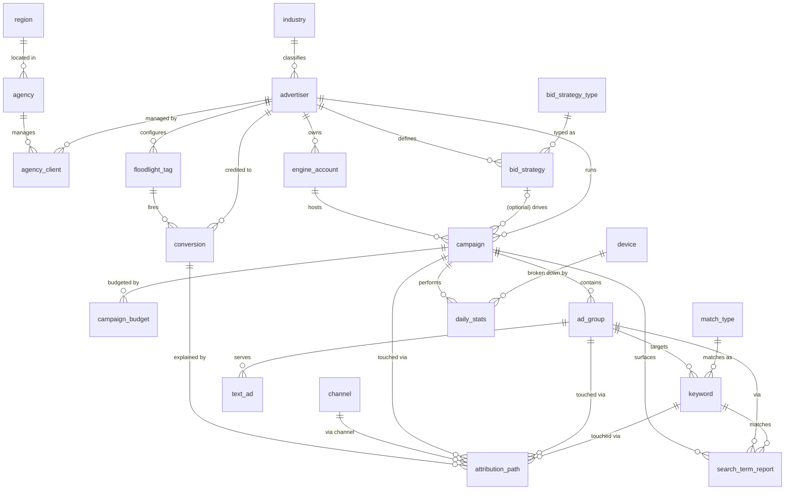

# Search Advertising Attribution Agent Dataset: ER Document

> Business context, industry primer, and glossary live in `01-search_advertising_attribution_agent_large_business_context.md`. This document only describes the data.

## 1. Dataset Overview

This dataset simulates the rolled-up campaign portfolio data layer that a North American media agency holding group (Lumina Reach Media Group) sees inside Search Ads 360 (SA360). It covers 80 U.S. advertisers across 10 IAB-style industries, running paid search on Google Ads (about 75% of spend) and Microsoft Advertising (about 25%). The data shapes are purpose-built for Text-to-SQL and Agent-style analysis; the distributions are anchored to real benchmarks rather than uniform noise. The company profile, business model, industry primer, account tree, attribution-model primer, and glossary are all in the business-context document — this document covers tables, columns, constraints, examples, and generation rules only.

### 1.1 Dataset Metadata

- **Complexity tier:** Large
- **Tables:** 21 (6 dimension, 3 organization, 8 account structure, 1 conversion tracking, 3 fact)
- **Total rows:** approximately 570,000
- **FK relationships:** about 29. One critical set of scoping rules cannot be enforced by DDL alone and is upheld by the generator (see §5.1.A): every touchpoint in `attribution_path` must sit inside the conversion's owning advertiser's account subtree; a `campaign`'s `engine_account_id` and `bid_strategy_id` must match the campaign's advertiser; and `conversion.floodlight_tag_id` must belong to the same advertiser as the conversion.
- **Reference date (`REFERENCE_DATE`):** exposed by the SQL view `v_reference_date`, defined as `MAX(daily_stats.report_date)`. All time-window queries count back from this value, not from `DATE('now')` (see §5.2). `daily_stats` covers the 90 days before the reference date; `search_term_report` covers the 30 days before.
- **Single currency / single timezone:** all USD, all `America/Los_Angeles`.

### 1.2 Business Process to Table Mapping

Eight day-to-day business processes produce or consume tables in this dataset:

| # | Business process | Who runs it | Tables involved |
|---|---|---|---|
| 1 | **Campaign setup and maintenance** — build the account tree, set targeting, pause/enable | Campaign manager | `campaign`, `ad_group`, `keyword`, `text_ad`, `match_type` |
| 2 | **Bid strategy configuration** — pick Target CPA / Target ROAS / Manual CPC and set the goal | Senior analyst | `bid_strategy`, `bid_strategy_type`, `campaign.bid_strategy_id` |
| 3 | **Budget planning and pacing** — set daily / monthly budgets, adjust mid-month based on pacing | Account manager | `campaign_budget` |
| 4 | **Daily performance reporting** — yesterday's spend, clicks, conversions; cross-device CPA; engine comparison | Analyst / executive | `daily_stats`, `device`, `engine_account` |
| 5 | **Impression share diagnostics** — were my lost impressions due to bids being too low (`lost_is_rank`) or budget running out (`lost_is_budget`)? | Manager | `daily_stats.lost_is_*`, `campaign_budget` |
| 6 | **Search term mining** — what did users actually search for, which queries converted, which should be excluded | Operations | `search_term_report`, `keyword`, `match_type` |
| 7 | **Conversion tracking** — Floodlight tag fires when a user completes a purchase / signup on the advertiser's site | Marketing ops | `floodlight_tag`, `conversion` |
| 8 | **Multi-touch attribution** — for each conversion, what channels and campaigns were touched along the way; how does credit get allocated under different attribution models | Senior analyst / executive | `attribution_path`, `channel`, `conversion` |

The 20 SQL queries in `03-search_advertising_attribution_agent_large_sql_queries.md` collectively cover these 8 processes.

### 1.3 Data Lifecycle

The 21 tables fall into four lifecycle classes. These dictate how many rows each table has and how often the table gets rewritten in a real system:

| Class | What it is | Real-world cadence | In this dataset |
|---|---|---|---|
| **Reference / dimension** | Global taxonomies that don't belong to any one advertiser | Google might refresh once a year | `industry`, `region`, `bid_strategy_type`, `match_type`, `device`, `channel` (about 37 rows total) |
| **Organization** | The advertiser-agency-engine commercial relationship | Changes on contract events (monthly / yearly) | `agency`, `advertiser`, `agency_client`, `engine_account` (about 320 rows) |
| **Account structure** | The campaign tree — what's being run, at what bid, on what budget | Edited weekly: new / paused campaigns, budget tweaks | `bid_strategy`, `campaign`, `campaign_budget`, `ad_group`, `keyword`, `text_ad`, `floodlight_tag` (about 60,000 rows — keywords dominate) |
| **Fact / event** | What actually happened, day by day | Written by the engine daily; events arrive continuously | `daily_stats`, `conversion`, `attribution_path`, `search_term_report` (about 480,000 rows) |

This is why in production an advertiser has only about 10 campaign rows but generates 2,000+ rows of `daily_stats` per day — account structure data is slow, fact data is high-frequency. This dataset keeps the same ratio.

The table-by-table generator (`*_data_generator.py`) implements specific production rules — for example, `daily_stats` is generated per (campaign × day × device) and only within the campaign's active window; when `cost / daily_budget` is near the limit, `lost_is_budget` is biased upward. The complete rules are in §5 ("Data Generation Rules").

## 2. Complexity Tier: Large

- **Tables:** 21 (6 dimension, 3 organization, 8 account structure, 1 conversion tracking, 3 fact)
- **Total rows:** approximately 570,000
- **Reference window:** `daily_stats` covers the last 90 days, `search_term_report` covers the last 30 days
- **Single currency** (USD), **single timezone** (America/Los_Angeles)

> **On the complexity label.** The Skill spec defines three tiers — `low` / `medium` / `high` (4–6 / 8–12 / 15–20 tables respectively). This dataset uses `large` as a deliberate extension above `high`: 21 tables and approximately 570,000 rows are needed to end-to-end model SA360's attribution + bidding + budgeting business surface. Functionally it should be read as "extended high."

| Table | Rows | Purpose |
|---|---:|---|
| industry | 10 | IAB-style industry taxonomy |
| region | 7 | U.S. Census–style region codes |
| bid_strategy_type | 8 | Google Ads bid strategy archetypes |
| match_type | 3 | Exact / Phrase / Broad |
| device | 3 | Mobile / Desktop / Tablet |
| channel | 6 | Attribution channel taxonomy |
| agency | 15 | Media agency entities |
| advertiser | 80 | Advertiser brands |
| agency_client | 64 | About 80% of advertisers are agency-managed |
| engine_account | ~120 | Per-advertiser per-engine accounts (Google primary, Microsoft secondary) |
| bid_strategy | ~270 | Bid strategy instances |
| campaign | ~800 | Campaigns |
| campaign_budget | ~1,500 | Historical budget revisions |
| ad_group | ~4,200 | Ad groups |
| keyword | ~42,000 | Keywords |
| text_ad | ~12,500 | Text ads |
| floodlight_tag | ~285 | Conversion-tracking tags |
| daily_stats | ~165,000 | Daily campaign performance |
| conversion | 5,000 | Conversion events |
| attribution_path | ~15,400 | Per-touchpoint attribution credit (about 3.1 touchpoints per conversion on average; the geometric path-length distribution has expectation 3.08) |
| search_term_report | ~318,000 | Search term performance, stratified by keyword |

---

## 3. Entity Relationship Diagram



The diagram intentionally collapses to the relationship layer; full column definitions are below.

---

## 4. Table Definitions

### Dimension Tables

#### 1. industry
Advertiser industry taxonomy (IAB-style).

| Column | Type | Constraint | Notes |
|---|---|---|---|
| id | INTEGER | Primary key | |
| code | VARCHAR(30) | UNIQUE, NOT NULL | Short code (e.g. `RETAIL`) |
| name | VARCHAR(50) | NOT NULL | Display name |
| description | TEXT | Nullable | One-line scope |

Example: `(1, 'RETAIL', 'Retail & E-commerce', 'Online and brick-and-mortar consumer goods')`

#### 2. region
Agency location, using U.S. Census–style codes.

| Column | Type | Constraint | Notes |
|---|---|---|---|
| id | INTEGER | Primary key | |
| code | VARCHAR(20) | UNIQUE, NOT NULL | NE / MW / SO / SE / WE / PAC / MT |
| name | VARCHAR(50) | NOT NULL | Northeast, Midwest, … |

#### 3. bid_strategy_type
The 8 Google Ads bid strategy archetypes. `is_automated=1` flags Smart Bidding strategies.

| Column | Type | Constraint | Notes |
|---|---|---|---|
| id | INTEGER | Primary key | |
| code | VARCHAR(30) | UNIQUE, NOT NULL | `MANUAL_CPC`, `TARGET_CPA`, `MAX_CONV`, … |
| name | VARCHAR(100) | NOT NULL | Display name |
| description | TEXT | Nullable | One-line semantics |
| is_automated | BOOLEAN | NOT NULL | Stored as `0`/`1` in SQLite |

#### 4. match_type
Exact / Phrase / Broad keyword match types.

| Column | Type | Constraint | Notes |
|---|---|---|---|
| id | INTEGER | Primary key | |
| code | VARCHAR(20) | UNIQUE | `EXACT` / `PHRASE` / `BROAD` |
| name | VARCHAR(50) | NOT NULL | Display name |

#### 5. device
Mobile / Desktop / Tablet — the device-breakdown axis of `daily_stats`.

#### 6. channel
Attribution channel taxonomy: Paid Search, Display, Paid Social, Email, Direct, Organic Search. Used only by `attribution_path`.

### Organization Tables

#### 7. agency
Media agency that brokers the advertiser relationship.

| Column | Type | Constraint | Notes |
|---|---|---|---|
| id | INTEGER | Primary key | |
| agency_code | VARCHAR(20) | UNIQUE | `AGY_001`, … |
| agency_name | VARCHAR(100) | NOT NULL | en_US Faker company name + " Media" |
| region_id | INTEGER | FK → region.id | |
| tier_level | VARCHAR(20) | NOT NULL | Platinum / Gold / Silver / Standard |
| account_manager | VARCHAR(50) | NOT NULL | Person name |
| contact_email | VARCHAR(100) | NOT NULL | |
| contact_phone | VARCHAR(30) | NOT NULL | |
| created_at | DATETIME | NOT NULL | |

#### 8. advertiser
Advertiser brand. Industry distribution follows the IAB-style taxonomy in `industry`.

| Column | Type | Constraint | Notes |
|---|---|---|---|
| id | INTEGER | Primary key | |
| advertiser_code | VARCHAR(20) | UNIQUE | `ADV_001`, … |
| company_name | VARCHAR(100) | NOT NULL | en_US Faker company name |
| industry_id | INTEGER | FK → industry.id | |
| sub_industry | VARCHAR(50) | Nullable | Not populated in this dataset |
| company_size | VARCHAR(20) | NOT NULL | SMB / Mid-Market / Enterprise |
| monthly_spend_tier | VARCHAR(20) | NOT NULL | `<10K`, `10K-50K`, `50K-200K`, `>200K` |
| primary_goal | VARCHAR(50) | NOT NULL | Brand Awareness / Lead Generation / Sales Conversion / App Installs |
| website_url | VARCHAR(200) | NOT NULL | |
| created_at | DATETIME | NOT NULL | |
| account_status | VARCHAR(20) | NOT NULL | Active / Paused / Suspended (~85/12/3) |

#### 9. agency_client
M:N bridge table between agency and advertiser. About 80% of advertisers are agency-managed; the other 20% are direct.

> **Currently used as 1:N.** The schema permits one advertiser to associate with multiple agencies (concurrent sub-channel contracts, historical contracts during agency migration, etc.), but the current generator produces **at most 1 row per advertiser** (each managed advertiser is picked exactly once by `random.sample`). So these 64 rows behave as a "current primary agency" 1:N lookup table. The M:N schema is preserved so future extensions (multi-agency history, sub-agency rollups) won't require a table migration. `UNIQUE(agency_id, advertiser_id)` is enforced at the database layer.

> **Invariant.** `(agency_id, advertiser_id)` is unique within this table. The same advertiser is never doubly managed by the same agency. (Otherwise an `agency_client` join into a fact table would fan out due to duplicate bridge rows.)
>
> **`is_active` distribution.** About 60% of rows have `contract_end IS NULL` (open-ended contract, `is_active=1`); about 20% have `contract_end` in the past (`is_active=0`); about 20% have `contract_end` in the future (`is_active=1`). Net effect: about 80% active / 20% expired. This 0/1 split makes the `is_active = 1` filter actually do something.
>
> **Tier ↔ company-size correlation.** When assigning agencies to advertisers, an agency's `tier_level` is weighted by the advertiser's `company_size`: Platinum agencies skew toward Enterprise / Mid-Market; Standard agencies only serve SMB.

| Column | Type | Constraint | Notes |
|---|---|---|---|
| id | INTEGER | Primary key | |
| agency_id | INTEGER | FK → agency.id | Participates in `UNIQUE(agency_id, advertiser_id)` |
| advertiser_id | INTEGER | FK → advertiser.id | Participates in `UNIQUE(agency_id, advertiser_id)` |
| contract_start | DATE | NOT NULL | |
| contract_end | DATE | Nullable | NULL = open-ended |
| fee_percentage | FLOAT | NOT NULL | 8–20% |
| is_active | BOOLEAN | NOT NULL | Stored as `0`/`1` |

### Account Structure Tables

#### 10. engine_account
Per-engine account under an advertiser. Every advertiser has a Google Ads account (the dominant engine in NA); about 50% also have a Microsoft Advertising account. Combined with campaign-level engine choice, the final portfolio is about 75% of campaigns / spend on Google Ads and 25% on Microsoft Advertising. Yahoo Japan, previously included as a third engine, has been removed — it's an SA360 partner specific to the Japanese market and does not serve U.S. advertisers.

| Column | Type | Constraint | Notes |
|---|---|---|---|
| id | INTEGER | Primary key | |
| account_code | VARCHAR(20) | UNIQUE | `ENG_0001`, … |
| advertiser_id | INTEGER | FK → advertiser.id | |
| engine_type | VARCHAR(30) | NOT NULL | Google Ads / Microsoft Advertising |
| account_name | VARCHAR(100) | NOT NULL | |
| currency | VARCHAR(10) | NOT NULL | Always `USD` in this dataset |
| timezone | VARCHAR(50) | NOT NULL | Always `America/Los_Angeles` |
| status | VARCHAR(20) | NOT NULL | Active / Paused (~90/10) |
| created_at | DATETIME | NOT NULL | |

#### 11. bid_strategy
Bid strategy configuration per advertiser. 2–5 per advertiser.

| Column | Type | Constraint | Notes |
|---|---|---|---|
| id | INTEGER | Primary key | |
| strategy_code | VARCHAR(20) | UNIQUE | `BID_0001`, … |
| advertiser_id | INTEGER | FK → advertiser.id | |
| strategy_name | VARCHAR(100) | NOT NULL | |
| strategy_type_id | INTEGER | FK → bid_strategy_type.id | |
| target_cpa | FLOAT | Nullable | Set only for Target CPA |
| target_roas | FLOAT | Nullable | Set only for Target ROAS |
| max_cpc_limit | FLOAT | Nullable | Set only for Manual / Enhanced CPC |
| target_impr_share | FLOAT | Nullable | Set only for Target Impression Share |
| impr_share_location | VARCHAR(30) | Nullable | Anywhere / Top of page / Absolute top |
| status | VARCHAR(20) | NOT NULL | Active / Paused |
| created_at | DATETIME | NOT NULL | |
| last_modified | DATETIME | NOT NULL | |

#### 12. campaign
Campaign entity. 5–15 per advertiser. Naming follows Google Ads convention: `{Brand}_{Product}_{MatchType}_{Geo}_{Device}_C{id}`.

| Column | Type | Constraint | Notes |
|---|---|---|---|
| id | INTEGER | Primary key | |
| campaign_code | VARCHAR(20) | UNIQUE | `CMP_00001`, … |
| advertiser_id | INTEGER | FK → advertiser.id | |
| engine_account_id | INTEGER | FK → engine_account.id | |
| campaign_name | VARCHAR(200) | NOT NULL | |
| campaign_type | VARCHAR(30) | NOT NULL | Search / Shopping / Display / Video / Performance Max |
| campaign_subtype | VARCHAR(30) | Nullable | Standard / Smart / Dynamic for Search; NULL otherwise |
| bid_strategy_id | INTEGER | FK, nullable | |
| status | VARCHAR(20) | NOT NULL | Enabled / Paused / Removed (~70/25/5) |
| start_date | DATE | NOT NULL | Earliest 18 months ago |
| end_date | DATE | Nullable | 30% of campaigns have an end_date |
| targeting_location | VARCHAR(100) | NOT NULL | A single U.S. state, metro, or "United States" (a single-value VARCHAR — unlike `targeting_language`, this is not a pipe-list). Real SA360 supports multi-geo targeting; this is a known demo simplification. |
| targeting_language | VARCHAR(50) | NOT NULL | English / Spanish / English; Spanish |
| targeting_device | VARCHAR(50) | NOT NULL | All / Mobile only / Desktop + Tablet / Mobile + Tablet |
| created_at | DATETIME | NOT NULL | |

> **Note:** `targeting_location` / `targeting_language` / `targeting_device` are all scalar VARCHARs storing a single value or a short pipe-list. Real SA360 supports multi-value targeting; this is a known demo simplification.

#### 13. campaign_budget
Budget rows are versioned by `effective_date`. To resolve the budget in effect on date D, callers take `MAX(effective_date) WHERE effective_date <= D`. There is no `is_current` flag and no `end_date`; the next row's `effective_date` implicitly closes the previous version.

> **Invariant.** `(campaign_id, effective_date)` is unique — enforced at the database layer via a `UNIQUE` constraint. The generator spaces adjacent `effective_date`s for the same campaign by at least 20 days (cumulative offset), so strict monotonicity holds within a campaign. `daily_budget` is sampled from a range scaled by the parent advertiser's `monthly_spend_tier` (SMB advertisers $50–$500, Enterprise-tier $3,000–$30,000).

| Column | Type | Constraint | Notes |
|---|---|---|---|
| id | INTEGER | Primary key | |
| campaign_id | INTEGER | FK → campaign.id | |
| daily_budget | FLOAT | NOT NULL | USD |
| monthly_budget | FLOAT | NOT NULL | **Derived: identically equal to `daily_budget × 30`.** Materialized on the row for query convenience; either column should produce the same result (rounding aside). |
| budget_delivery | VARCHAR(30) | NOT NULL | Standard / Accelerated |
| effective_date | DATE | NOT NULL | Budget effective date |
| created_at | DATETIME | NOT NULL | |

#### 14. ad_group
3–8 per campaign. Names are seeded from the keyword pool of the campaign's industry (e.g., `"medicare supplement plans - AdGroup"`).

| Column | Type | Constraint | Notes |
|---|---|---|---|
| id | INTEGER | Primary key | |
| ad_group_code | VARCHAR(20) | UNIQUE | `AGP_00001`, … |
| campaign_id | INTEGER | FK → campaign.id | |
| ad_group_name | VARCHAR(200) | NOT NULL | |
| default_cpc | FLOAT | NOT NULL | |
| status | VARCHAR(20) | NOT NULL | Enabled / Paused / Removed |
| created_at | DATETIME | NOT NULL | |

#### 15. keyword
5–15 per ad group, drawn from an industry-specific English keyword pool. Quality Score skews 6–8 (bell-shaped), not uniform.

| Column | Type | Constraint | Notes |
|---|---|---|---|
| id | INTEGER | Primary key | |
| keyword_code | VARCHAR(20) | UNIQUE | `KW_000001`, … |
| ad_group_id | INTEGER | FK → ad_group.id | |
| keyword_text | VARCHAR(300) | NOT NULL | English keyword |
| match_type_id | INTEGER | FK → match_type.id | |
| status | VARCHAR(20) | NOT NULL | Enabled / Paused / Removed |
| max_cpc | FLOAT | NOT NULL | CPC ceiling set by the advertiser |
| quality_score | INTEGER | NOT NULL | 3–10, bell-shaped peaking at 6–7 |
| expected_ctr | VARCHAR(20) | NOT NULL | Below Average / Average / Above Average |
| ad_relevance | VARCHAR(20) | NOT NULL | Same as above |
| landing_page_exp | VARCHAR(20) | NOT NULL | Same as above |
| first_page_cpc | FLOAT | NOT NULL | Demo simplification: 0.6 × max_cpc |
| top_of_page_cpc | FLOAT | NOT NULL | Demo simplification: 1.2 × max_cpc |
| created_at | DATETIME | NOT NULL | |

#### 16. text_ad
2–4 per ad group. Keeping `quality_score` at the ad level is for query flexibility; real Google Ads only exposes QS at the keyword level. Two headlines and one description are nullable, simulating RSA's optional asset slots.

| Column | Type | Constraint | Notes |
|---|---|---|---|
| id | INTEGER | Primary key | |
| ad_code | VARCHAR(20) | UNIQUE | `AD_000001`, … |
| ad_group_id | INTEGER | FK → ad_group.id | |
| headline_1 | VARCHAR(100) | NOT NULL | |
| headline_2 | VARCHAR(100) | NOT NULL | |
| headline_3 | VARCHAR(100) | Nullable | |
| description_1 | VARCHAR(200) | NOT NULL | |
| description_2 | VARCHAR(200) | Nullable | |
| final_url | VARCHAR(500) | NOT NULL | |
| display_url | VARCHAR(200) | NOT NULL | |
| status | VARCHAR(20) | NOT NULL | Enabled / Paused / Removed |
| quality_score | INTEGER | NOT NULL | 4–10 |
| created_at | DATETIME | NOT NULL | |

### Conversion Tracking and Fact Tables

#### 17. floodlight_tag
SA360 Floodlight tag — the conversion-tracking definition per advertiser. 2–5 per advertiser. `attribution_model` records the "production" model the advertiser uses for reporting; the `attribution_path` table independently stores credit under **all six** models so what-if comparisons are possible (see §5.3).

| Column | Type | Constraint | Notes |
|---|---|---|---|
| id | INTEGER | Primary key | |
| tag_code | VARCHAR(30) | UNIQUE | `FL_0001`, … |
| advertiser_id | INTEGER | FK → advertiser.id | |
| tag_name | VARCHAR(100) | NOT NULL | |
| conversion_type | VARCHAR(50) | NOT NULL | Purchase / Lead / Signup / PageView / AddToCart / AppInstall |
| counting_method | VARCHAR(30) | NOT NULL | Standard / Unique |
| attribution_model | VARCHAR(30) | NOT NULL | One of the 6 attribution models |
| lookback_window | INTEGER | NOT NULL | One of {7, 14, 30, 60, 90}; constrains `attribution_path.hours_before_conv` |
| status | VARCHAR(20) | NOT NULL | |
| created_at | DATETIME | NOT NULL | |

#### 18. daily_stats
Per-campaign / per-day / per-device performance. **Grain: `(campaign_id, report_date, device_id)`.** This is the single largest fact table.

> A retired earlier version used an `(entity_type, entity_id)` polymorphic key, which could carry multiple grain levels — but it broke FK integrity and forced every query to include an `entity_type='Campaign'` filter. The polymorphic columns have been removed; all rows are now campaign-grain.

| Column | Type | Constraint | Notes |
|---|---|---|---|
| id | INTEGER | Primary key | |
| campaign_id | INTEGER | FK → campaign.id | NOT NULL |
| report_date | DATE | NOT NULL | |
| device_id | INTEGER | FK → device.id | NOT NULL |
| impressions | INTEGER | NOT NULL | |
| clicks | INTEGER | NOT NULL | |
| cost | FLOAT | NOT NULL | USD |
| conversions | FLOAT | NOT NULL | |
| conversion_value | FLOAT | NOT NULL | USD |
| ctr | FLOAT | NOT NULL | clicks/impressions, 4 decimal places |
| avg_cpc | FLOAT | NOT NULL | USD |
| cpa | FLOAT | Nullable | NULL when conversions = 0 |
| roas | FLOAT | Nullable | NULL when cost = 0 |
| impression_share | FLOAT | NOT NULL | 25–95 |
| search_impr_share | FLOAT | **Nullable** | Equal to `impression_share` for Search campaigns; **NULL** for Display / Video / Performance Max / Shopping |
| lost_is_budget | FLOAT | NOT NULL | Biased upward when daily cost > 80% of in-effect budget |
| lost_is_rank | FLOAT | NOT NULL | `100 - impression_share - lost_is_budget`, guaranteed ≥ 0 by construction |
| search_abs_top_is | FLOAT | **Nullable** | ≤ `search_top_is`; **NULL** for non-Search campaigns |
| search_top_is | FLOAT | **Nullable** | ≤ `impression_share`; **NULL** for non-Search campaigns |

> **`search_*_is` semantics.** Real SA360 only reports impression-share position metrics for search traffic; Display / Video / Performance Max / Shopping rows have no equivalent. This dataset follows that convention: `search_impr_share`, `search_top_is`, and `search_abs_top_is` are all NULL for non-Search campaigns. Queries that reference these columns (especially Query 16) must filter on `campaign_type = 'Search'` or `WHERE search_top_is IS NOT NULL`.

> **`daily_stats.conversions` vs the `conversion` table.** These two "conversion" measurements count different things and **should not be added or compared row-by-row**. `daily_stats.conversions` is the engine's day-aggregated count (the value shown in engine reports); across 165k rows it sums to the millions. The `conversion` table is the Floodlight event log (5,000 individual events). For teaching purposes the scale gap is intentional — a Text-to-SQL prompt like "how many conversions total" must pick **one** definition and stick with it.

Coverage: rows are only generated within the intersection of `[today-90, today]` and the campaign's active window `[start_date, end_date or today]`. Total approximately 165,000 rows.

#### 19. conversion
Conversion events. 5,000 rows within the 90-day window.

| Column | Type | Constraint | Notes |
|---|---|---|---|
| id | INTEGER | Primary key | |
| conversion_code | VARCHAR(30) | UNIQUE | `CONV_000001`, … |
| advertiser_id | INTEGER | FK → advertiser.id | |
| floodlight_tag_id | INTEGER | FK → floodlight_tag.id | |
| conversion_time | DATETIME | NOT NULL | |
| conversion_value | FLOAT | NOT NULL | USD |
| currency | VARCHAR(10) | NOT NULL | Always `USD` |
| quantity | INTEGER | NOT NULL | 1–5 |

#### 20. attribution_path
Per-touchpoint conversion credit. **Grain: one row per `(conversion_id, touchpoint_order)`.** 2–6 touchpoints per conversion.

Hard invariants (validated at generation time):

- `(campaign_id, ad_group_id, keyword_id)` references — when non-NULL — must belong to the parent conversion's advertiser. No cross-advertiser touchpoints.
- `(ad_group_id ∈ campaign.children, keyword_id ∈ ad_group.children)` — each row is hierarchy-consistent internally.
- `touchpoint_order = 1` is the earliest touchpoint in time; `touchpoint_order = N` sits immediately before the conversion. `hours_before_conv` is monotonically non-increasing as `touchpoint_order` rises.
- `hours_before_conv ≤ floodlight_tag.lookback_window * 24`.

| Column | Type | Constraint | Notes |
|---|---|---|---|
| id | INTEGER | Primary key | |
| conversion_id | INTEGER | FK → conversion.id | NOT NULL |
| advertiser_id | INTEGER | FK → advertiser.id | NOT NULL. **Denormalized** — also derivable via `conversion.advertiser_id`. Materialized on the touchpoint row so per-advertiser channel queries don't need a `conversion` join. The generator guarantees the two values match. |
| touchpoint_order | INTEGER | NOT NULL | Starts at 1; 1 = first touch |
| channel_id | INTEGER | FK → channel.id | NOT NULL |
| campaign_id | INTEGER | FK → campaign.id, nullable | |
| ad_group_id | INTEGER | FK → ad_group.id, nullable | NULL when campaign_id is NULL |
| keyword_id | INTEGER | FK → keyword.id, nullable | NULL when ad_group_id is NULL |
| interaction_type | VARCHAR(20) | NOT NULL | Impression (80%) / Click (15%) / View (5%) |
| interaction_time | DATETIME | NOT NULL | |
| days_before_conv | INTEGER | NOT NULL | `hours_before_conv // 24` |
| hours_before_conv | INTEGER | NOT NULL | See invariant above |
| last_click_credit | FLOAT | NOT NULL | Only 1.0 at the last touchpoint |
| first_click_credit | FLOAT | NOT NULL | Only 1.0 at the first touchpoint |
| linear_credit | FLOAT | NOT NULL | `1/N` per touchpoint |
| time_decay_credit | FLOAT | NOT NULL | Geometric decay: `2^i / Σ 2^j` |
| position_credit | FLOAT | NOT NULL | 40% first, 40% last, 20% split across middle. **N=2 special case: (0.5, 0.5)** (see §5.1.B #9). Because the path-length distribution skews to N=2 (about 40% of conversions), 0.5 is a visible spike on the `position_credit` histogram — that's by design, not a bug. |
| data_driven_credit | FLOAT | NOT NULL | Normalized random — see §5.3 for caveats |

#### 21. search_term_report
Actual user queries that triggered an ad impression. Stratified by keyword (about 5 random days × 1–2 search terms each). `keyword_id` is **nullable**: about 15% are broad-match overflow (the engine served a query that didn't directly match any stored keyword); for those rows, `campaign_id` and `ad_group_id` still point to the ad group whose impression got triggered.

| Column | Type | Constraint | Notes |
|---|---|---|---|
| id | INTEGER | Primary key | |
| report_date | DATE | NOT NULL | |
| campaign_id | INTEGER | FK → campaign.id | NOT NULL |
| ad_group_id | INTEGER | FK → ad_group.id | NOT NULL |
| keyword_id | INTEGER | FK → keyword.id, nullable | About 15% NULL (broad-match overflow) |
| search_term | VARCHAR(500) | NOT NULL | Raw user query |
| match_type_used | VARCHAR(20) | NOT NULL | Exact / Phrase / Broad |
| impressions | INTEGER | NOT NULL | |
| clicks | INTEGER | NOT NULL | |
| cost | FLOAT | NOT NULL | |
| conversions | FLOAT | NOT NULL | |
| conversion_value | FLOAT | NOT NULL | |
| added_excluded | VARCHAR(20) | Nullable | NULL / Added / Excluded |

---

## 5. Data Generation Rules

### 5.1 Business Logic Constraints

#### 5.1.A Cross-table advertiser-scope invariants

Every fact and account-structure row carries one or more references that must stay within the same advertiser. These invariants are upheld by the generator's construction and validated at the end of every run:

| Table | Reference | Constraint |
|---|---|---|
| `engine_account` | `advertiser_id` | (Source of truth) |
| `bid_strategy` | `advertiser_id` | (Source of truth) |
| `floodlight_tag` | `advertiser_id` | (Source of truth) |
| `campaign` | `engine_account_id` | `engine_account.advertiser_id == campaign.advertiser_id` |
| `campaign` | `bid_strategy_id` (when non-NULL) | `bid_strategy.advertiser_id == campaign.advertiser_id` |
| `conversion` | `floodlight_tag_id` | `floodlight_tag.advertiser_id == conversion.advertiser_id` |
| `attribution_path` | `campaign_id` / `ad_group_id` / `keyword_id` | All located in the parent conversion's advertiser subtree |

#### 5.1.B Distribution constraints

1. **Advertiser hierarchy is a hard constraint.** `attribution_path` touchpoint references to `campaign_id`, `ad_group_id`, and `keyword_id` only point to entities under the conversion's advertiser. The campaign → ad_group → keyword hierarchy within a touchpoint row is also kept consistent.
2. **Touchpoint time order ⇒ touchpoint_order.** Sample N `hours_before_conv` values, sort descending, and assign 1..N in order. So `touchpoint_order=1` is always the earliest touchpoint in time.
3. **Lookback window constraint.** `hours_before_conv ≤ lookback_window × 24`.
4. **Impression-share decomposition is non-negative.** Sample `impression_share` first; then sample `lost_is_budget` from `[0, 100 - impression_share]`; derive `lost_is_rank` as the remainder.
5. **IS positions are monotonic.** Sample `search_top_is ≤ impression_share`, then `search_abs_top_is ≤ search_top_is`. (Only for Search campaigns.)
6. **`search_*_is` is NULL on non-Search campaigns.** `search_impr_share`, `search_top_is`, and `search_abs_top_is` are NULL in `daily_stats` rows for Display / Video / Performance Max / Shopping.
7. **Budget pressure correlates with `lost_is_budget`.** When a campaign's daily cost exceeds about 80% of the in-effect `daily_budget`, `lost_is_budget` is biased upward.
8. **daily_stats respects the campaign lifecycle.** Rows are generated only for `report_date ∈ [max(campaign.start_date, today-90), min(campaign.end_date or today, today)]`.
9. **The credit column for each model sums to 1.0 per conversion** (tolerance ≤ 0.0005 from `round(..., 4)`). This includes the (0.5, 0.5) special case for Position-Based on N=2 paths — the textbook (0.4, 0.4) split would sum to 0.8.
10. **Path-length distribution.** Touchpoints per conversion are sampled from a truncated geometric distribution: N ∈ {2, 3, 4, 5, 6} with weights `[40, 30, 15, 10, 5]` — skewed toward short paths, consistent with real attribution data.
11. **Channels are biased by touchpoint position.** First touchpoints skew Display / Paid Social (upper funnel); last touchpoints skew Paid Search / Direct (lower funnel). Middle touchpoints use a flatter distribution.
12. **QS sub-component correlation.** `expected_ctr`, `ad_relevance`, and `landing_page_exp` are weighted by the keyword's overall `quality_score`: a QS-9 keyword draws "Above Average" with about 70% probability; a QS-4 keyword draws "Below Average" with about 55% probability.
13. **Broad-match overflow.** About 15% of `search_term_report` rows have NULL `keyword_id` — the engine matched the user query without hitting any stored keyword directly.
14. **CTR realism.** Sampled from a mixture skewed toward 1–6% (the paid-search industry benchmark), occasionally up to about 12% (brand terms). There is no uniform 0–15% tail.
15. **Device differentiation.** Per-row `impressions` is scaled by device: Mobile × 1.5, Desktop × 0.7, Tablet × 0.25. Conversion rate scales inversely: Desktop × 1.5, Mobile × 0.75, Tablet × 0.95. Net result: Mobile carries about 60% of impressions, but Desktop posts the lowest CPA.
16. **Engine differentiation.** Microsoft Advertising rows have CPC about 80% of Google Ads (less competition) and conversion rate about 12% lower (`ENGINE_CPC_SCALE`, `ENGINE_CONV_RATE_SCALE`). Portfolio-level CPA differs by single-digit percentages.
17. **Industry conversion value.** `avg_conv_value` per row is sampled from a per-industry range (`INDUSTRY_CONV_VALUE_RANGE`): real estate / finance / insurance / automotive land high ($500–$2000); food service / retail land low ($15–$350). Cross-industry ROAS reflects real-world order-value patterns.
18. **Industry Quality Score bias.** Competitive verticals (insurance, finance, real estate) skew QS toward 5–6; low-competition verticals (B2B SaaS, education, food service) skew QS toward 8–9.
19. **`agency_client.is_active` distribution.** About 80% active / 20% expired, not 100% active. The `is_active = 1` filter is meaningful. (The 20% "expired" comes from the `past` branch of the `contract_end` sample — `[60% open, 20% past, 20% future]`.)

#### 5.1.C Known simplifications

- `created_at` timestamps along the parent → child chain are sampled from overlapping windows. Children's `created_at` is occasionally earlier than the parent's. Strict ordering would require threading the parent timestamp through 8 generation functions, with little payoff for a teaching dataset (no query joins on `created_at`).
- **No `negative_keyword` entity.** In real SA360 operations, negative-keyword lists (attached at the campaign or ad-group level) are first-class objects — they record the search terms the advertiser wants to *exclude* from matching. This dataset only models the *historical event* of "this search term was excluded" (via `search_term_report.added_excluded = 'Excluded'`); there's no separate table of currently active negative lists. Process #6 (search-term mining) is still functional; processes that need to evaluate "would this query be blocked today" are out of scope.
- **`agency_client` is currently used as 1:N.** See §9 for the rationale.
- **`campaign.targeting_location` is a single value.** See §12 for the rationale.
- **`text_ad.quality_score`** — Google Ads only exposes Quality Score at the keyword level. The numeric QS at the ad level is kept for query flexibility and should be read as a synthetic "per-ad quality proxy," not an SA360-reportable metric.
- **`daily_stats.cost` is not capped by `daily_budget`.** When the day's spend approaches the budget, the generator raises `lost_is_budget` but does not hard-cap cost at the daily budget. Real engines stop serving when the budget is exhausted; for teaching purposes, not capping cost lets queries see the overspend signal cleanly via `lost_is_budget` rather than via a "missing rows" pattern.

### 5.2 Reference-date convention (`v_reference_date` view)

All time-window SQL queries reference

```sql
(SELECT reference_date FROM v_reference_date)
```

rather than `DATE('now', ...)`. The view is created by `create_sqlite_database()` as

```sql
CREATE VIEW v_reference_date AS
SELECT MAX(report_date) AS reference_date FROM daily_stats
```

which anchors the dataset's "today" to its most recent fact row. That way, no matter how long ago the dataset was generated, queries still return meaningful results.

### 5.3 Floodlight `attribution_model` vs the 6 `*_credit` columns

The Floodlight tag declares the **production** attribution model the advertiser uses (e.g., "Data Driven"). The `attribution_path` table, regardless of the tag's setting, stores credit under **all 6** models on every touchpoint. This is a deliberate teaching denormalization: it lets analysts run "what would these conversions look like under last-click vs. first-click vs. data-driven" comparison queries without modifying the dataset. The trade-off is that `floodlight_tag.attribution_model` has no row-level link to "which credit column is the truthful one for this tag" — that mapping must be expressed in SQL (e.g., a `CASE` that picks the column matching `tag.attribution_model`).

**Production model distribution.** `floodlight_tag.attribution_model` skews toward Last Click — sampling weights are roughly `Last Click: 45%, Data Driven: 15%, First Click / Linear / Time Decay / Position Based: 10% each`. This matches both SA360 defaults and the actual usage of most advertisers, so a "which model is used in production" query will be Last Click–dominated. For multi-model what-if analysis, use the 6 `*_credit` columns directly.

### 5.4 Single-currency / single-timezone simplification

All `engine_account.currency` and all `conversion.currency` are `USD`. All `engine_account.timezone` is `America/Los_Angeles`. The schema keeps these columns because real SA360 is a multi-currency, multi-timezone deployment; this dataset just doesn't exercise that path.

### 5.5 Faker strategy

| Field pattern | Faker method | Notes |
|---|---|---|
| Company name | `fake.company()` | `en_US` locale |
| Person name | `fake.name()` | |
| Email | `fake.company_email()` | |
| Phone | `fake.phone_number()` | U.S. format |
| URL | `https://www.{fake.domain_name()}` | |
| Date | `fake.date_between(start_date="-540d", end_date="-30d")` | Offsets in days (Faker reads `-30m` as minutes, not months) |
| Datetime | `fake.date_time_between(...)` | Same offset convention |
| Boolean | Written as Python int 0/1 directly | Avoids polars's `true`/`false` text |

### 5.6 Booleans on disk

`agency_client.is_active` and `bid_strategy_type.is_automated` are written to TSV as integer `0` / `1` (not `true` / `false`). The loader coerces both string and integer forms to a Python `bool` before handing them to SQLAlchemy. All SQL queries can reliably use `is_active = 1` and `is_active = 0`.

---

## 6. Database Schema (SQLite DDL)

The full DDL is created at runtime by `Base.metadata.create_all(engine)`. Core definitions (excerpt):

```sql
CREATE TABLE daily_stats (
    id INTEGER PRIMARY KEY AUTOINCREMENT,
    campaign_id INTEGER NOT NULL REFERENCES campaign(id),
    report_date DATE NOT NULL,
    device_id INTEGER NOT NULL REFERENCES device(id),
    impressions INTEGER NOT NULL,
    clicks INTEGER NOT NULL,
    cost FLOAT NOT NULL,
    conversions FLOAT NOT NULL,
    conversion_value FLOAT NOT NULL,
    ctr FLOAT NOT NULL,
    avg_cpc FLOAT NOT NULL,
    cpa FLOAT,
    roas FLOAT,
    impression_share FLOAT NOT NULL,
    search_impr_share FLOAT,         -- NULL for non-Search campaigns
    lost_is_budget FLOAT NOT NULL,
    lost_is_rank FLOAT NOT NULL,
    search_abs_top_is FLOAT,         -- NULL for non-Search campaigns
    search_top_is FLOAT              -- NULL for non-Search campaigns
);

CREATE TABLE attribution_path (
    id INTEGER PRIMARY KEY AUTOINCREMENT,
    conversion_id INTEGER NOT NULL REFERENCES conversion(id),
    advertiser_id INTEGER NOT NULL REFERENCES advertiser(id),
    touchpoint_order INTEGER NOT NULL,
    channel_id INTEGER NOT NULL REFERENCES channel(id),
    campaign_id INTEGER REFERENCES campaign(id),
    ad_group_id INTEGER REFERENCES ad_group(id),
    keyword_id INTEGER REFERENCES keyword(id),
    interaction_type VARCHAR(20) NOT NULL,
    interaction_time DATETIME NOT NULL,
    days_before_conv INTEGER NOT NULL,
    hours_before_conv INTEGER NOT NULL,
    last_click_credit FLOAT NOT NULL,
    first_click_credit FLOAT NOT NULL,
    linear_credit FLOAT NOT NULL,
    time_decay_credit FLOAT NOT NULL,
    position_credit FLOAT NOT NULL,
    data_driven_credit FLOAT NOT NULL
);

CREATE VIEW v_reference_date AS
SELECT MAX(report_date) AS reference_date FROM daily_stats;

-- UNIQUE constraints SQLAlchemy creates on the tables above:
-- agency_client:    UNIQUE (agency_id, advertiser_id)
-- campaign_budget:  UNIQUE (campaign_id, effective_date)
```

---

## 7. File Inventory

| # | File name | Table | Rows | Depends on |
|---|---|---|---:|---|
| 01 | 01_industry.tsv | industry | 10 | — |
| 02 | 02_region.tsv | region | 7 | — |
| 03 | 03_bid_strategy_type.tsv | bid_strategy_type | 8 | — |
| 04 | 04_match_type.tsv | match_type | 3 | — |
| 05 | 05_device.tsv | device | 3 | — |
| 06 | 06_channel.tsv | channel | 6 | — |
| 07 | 07_agency.tsv | agency | 15 | region |
| 08 | 08_advertiser.tsv | advertiser | 80 | industry |
| 09 | 09_agency_client.tsv | agency_client | 64 | agency, advertiser |
| 10 | 10_engine_account.tsv | engine_account | ~120 | advertiser |
| 11 | 11_bid_strategy.tsv | bid_strategy | ~270 | advertiser, bid_strategy_type |
| 12 | 12_campaign.tsv | campaign | ~800 | advertiser, engine_account, bid_strategy |
| 13 | 13_campaign_budget.tsv | campaign_budget | ~1,500 | campaign |
| 14 | 14_ad_group.tsv | ad_group | ~4,200 | campaign |
| 15 | 15_keyword.tsv | keyword | ~42,000 | ad_group, match_type |
| 16 | 16_text_ad.tsv | text_ad | ~12,500 | ad_group |
| 17 | 17_floodlight_tag.tsv | floodlight_tag | ~285 | advertiser |
| 18 | 18_daily_stats.tsv | daily_stats | ~165,000 | campaign, device |
| 19 | 19_conversion.tsv | conversion | 5,000 | advertiser, floodlight_tag |
| 20 | 20_attribution_path.tsv | attribution_path | ~15,400 | conversion, channel, campaign, ad_group, keyword |
| 21 | 21_search_term_report.tsv | search_term_report | ~318,000 | campaign, ad_group, keyword |

After all TSVs load, the SQL view `v_reference_date` is created.
