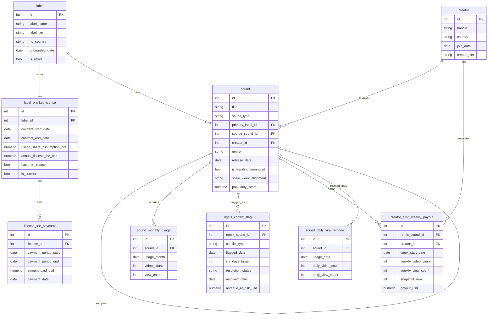

> 业务背景、行业科普、术语表请见 `01-social_media_music_blanket_licensing_medium_business_context-cn.md`。本文档只描述数据。

# ER 文档

## 1. 数据集元信息

- **复杂度**：Medium
- **表数量**：9 张
- **总行数（约）**：24,900 行
- **外键关系数**：10 条 FK（含 1 条自引用 FK：`sound.source_sound_id → sound.id`）
- **无法用 DDL 强制的范围规则**：见第 5 节"数据生成规则"
- **REFERENCE_DATE**：`2026-06-30`（与业务背景文档、SQL 查询文档一致）

---

## 2. Mermaid ER 图



---

## 3. 逐表说明

### 1. label

**业务含义**：ReelWave 签订打包授权合同的唱片厂牌或聚合发行商。这是 Rights & Licensing Compliance 团队管理的"合作方名单"，Head of Label Relations 关心这张表里每一家的合作层级和活跃状态。

| 列名 | 类型 | 约束 | 说明 |
|------|------|------|------|
| id | INTEGER | PK | 厂牌 ID |
| label_name | VARCHAR(150) | NOT NULL, UNIQUE | 虚构厂牌/聚合发行商名称 |
| label_tier | VARCHAR(20) | NOT NULL | `major`（大型跨国厂牌）/ `mid_size`（中型厂牌）/ `indie_aggregator`（独立聚合发行商） |
| hq_country | VARCHAR(20) | NOT NULL | 总部所在国：`US` 或 `Canada` |
| onboarded_date | DATE | NOT NULL | 首次成为 ReelWave 合作方的日期（早于打包授权合同签约日） |
| is_active | BOOLEAN | NOT NULL | 是否仍是活跃合作方，本数据集全部为 `TRUE` |

**外键**：无（顶层表）

**示例数据**：

| id | label_name | label_tier | hq_country | onboarded_date | is_active |
|----|------------|------------|------------|-----------------|-----------|
| 1 | Titan Sound Group | major | US | 2020-03-10 | 1 |
| 4 | Northline Aggregator | indie_aggregator | US | 2025-08-01 | 1 |
| 9 | Cascade Harmonic Group | major | Canada | 2020-11-02 | 1 |

---

### 2. creator

**业务含义**：在 ReelWave 上发布 UGC remix、有资格参与 Creator Fund 分成的普通创作者。Creator Fund Program Manager 用这张表理解创作者构成（头部 / 中部 / 长尾）。

| 列名 | 类型 | 约束 | 说明 |
|------|------|------|------|
| id | INTEGER | PK | 创作者 ID |
| handle | VARCHAR(50) | NOT NULL, UNIQUE | 创作者账号昵称 |
| country | VARCHAR(20) | NOT NULL | `US` 或 `Canada` |
| join_date | DATE | NOT NULL | 注册日期 |
| creator_tier | VARCHAR(20) | NOT NULL | `top`（头部，约 10%）/ `mid`（中部，约 30%）/ `long_tail`（长尾，约 60%） |

**外键**：无（顶层表）

**示例数据**：

| id | handle | country | join_date | creator_tier |
|----|--------|---------|-----------|--------------|
| 3 | @midnight.mixes | US | 2023-02-14 | top |
| 47 | @porchlightbeats | Canada | 2024-06-30 | mid |
| 112 | @quietloopstudio | US | 2025-01-05 | long_tail |

---

### 3. label_blanket_license

**业务含义**：每家厂牌当前生效的打包授权合同条款——份额假设、年费、是否带 MFN（最惠国）保护。这是**陷阱 1（曲库使用份额漂移）**和**陷阱 4（MFN 合规）**共同依赖的核心表。

> **范围说明**：每家厂牌只建模**当前生效**的一份合同（`is_current = TRUE`），不追踪历史上已到期的旧合同版本。

| 列名 | 类型 | 约束 | 说明 |
|------|------|------|------|
| id | INTEGER | PK | 合同 ID |
| label_id | INTEGER | FK → label.id, NOT NULL | 所属厂牌 |
| contract_start_date | DATE | NOT NULL | 合同生效日 |
| contract_end_date | DATE | NOT NULL | 合同到期日（生效日起 2-3 年） |
| usage_share_assumption_pct | NUMERIC(5,2) | NOT NULL | 签约时约定的曲库使用份额假设（百分比，如 `18.50` 代表 18.5%） |
| annual_license_fee_usd | NUMERIC(12,2) | NOT NULL | 固定年费，合同期内不随实际使用份额调整 |
| has_mfn_clause | BOOLEAN | NOT NULL | 是否带最惠国 (MFN) 条款保护 |
| is_current | BOOLEAN | NOT NULL | 是否为当前生效合同，本数据集全部为 `TRUE` |

**外键**：`label_id → label.id`（1:1，当前数据；概念上 1:N，为未来续约留出扩展空间）

**示例数据**：

| id | label_id | contract_start_date | contract_end_date | usage_share_assumption_pct | annual_license_fee_usd | has_mfn_clause |
|----|----------|----------------------|---------------------|------------------------------|---------------------------|-----------------|
| 1 | 1 (Titan Sound Group) | 2023-08-16 | 2026-07-31 | 14.98 | 11,203,962.08 | 1 |
| 11 | 4 (Northline Aggregator) | 2026-01-15 | 2027-12-31 | 1.74 | 1,392,000.00 | 0 |

---

### 4. sound

**业务含义**：ReelWave 平台上被追踪的每一段音乐素材，包括厂牌拥有版权的官方曲目 (`official_track`) 和用户自制的二次创作 remix (`ugc_remix`)。这是全数据集连接最多的核心实体表。

> **范围说明**：`primary_label_id` 只在 `sound_type = 'official_track'` 时非空；`creator_id` 和 `source_sound_id` 只在 `sound_type = 'ugc_remix'` 时可能非空。DDL 不强制这条规则，生成逻辑和下游 SQL 都需要遵守。`source_sound_id` 指向该 remix 采样的官方曲目；完全原创、不采样任何官方曲目的 remix 该字段为空。`spike_week_alignment` 只在 `is_trending_monitored = TRUE` 时非空。

| 列名 | 类型 | 约束 | 说明 |
|------|------|------|------|
| id | INTEGER | PK | 声音 ID |
| title | VARCHAR(200) | NOT NULL | 曲目/声音标题 |
| sound_type | VARCHAR(20) | NOT NULL | `official_track`（官方曲目）或 `ugc_remix`（用户二创） |
| primary_label_id | INTEGER | FK → label.id, NULL | 拥有该官方曲目版权的厂牌；仅 official_track 非空 |
| source_sound_id | INTEGER | FK → sound.id（自引用）, NULL | 该 remix 采样的官方曲目；仅采样类 remix 非空 |
| creator_id | INTEGER | FK → creator.id, NULL | 制作该 remix 的创作者；仅 ugc_remix 非空 |
| genre | VARCHAR(30) | NOT NULL | 曲风（Pop / Hip-Hop / Electronic / Country / R&B / Indie Rock / Latin） |
| release_date | DATE | NOT NULL | 上线日期 |
| is_trending_monitored | BOOLEAN | NOT NULL | 是否属于被每日精细化追踪的 120 个"热门候选声音" |
| spike_week_alignment | VARCHAR(20) | NULL | `aligned`（爆火窗口完整落在一个自然周内）或 `split_across_weeks`（跨周）；仅 is_trending_monitored=TRUE 时有值 |
| popularity_score | NUMERIC(8,4) | NOT NULL | 内部热度评分（相对值，用于分配月度/周度使用量），分数越高代表该声音相对同类越受欢迎 |

**外键**：
- `primary_label_id → label.id`（1:N，可空）
- `source_sound_id → sound.id`（自引用，1:N，可空）
- `creator_id → creator.id`（1:N，可空）

**示例数据**：

| id | title | sound_type | primary_label_id | source_sound_id | creator_id | genre | release_date | is_trending_monitored | spike_week_alignment |
|----|-------|------------|-------------------|--------------------|-------------|-------|---------------|--------------------------|------------------------|
| 12 | "Golden Skyline" | official_track | 1 (Titan Sound Group) | NULL | NULL | Pop | 2022-09-14 | 0 | NULL |
| 430 | "skyline sped up" | ugc_remix | NULL | 12 | 3 | Pop | 2025-11-02 | 1 | split_across_weeks |
| 512 | "Neon Horizon" | ugc_remix | NULL | NULL | 47 | Hip-Hop | 2025-04-20 | 0 | NULL |

---

### 5. license_fee_payment

**业务含义**：每份打包授权合同的季度实付款记录。VP of Finance 用这张表核对实际现金流出，也是计算"合同到期前累计已付了多少"的依据。

| 列名 | 类型 | 约束 | 说明 |
|------|------|------|------|
| id | INTEGER | PK | 付款记录 ID |
| license_id | INTEGER | FK → label_blanket_license.id, NOT NULL | 所属合同 |
| payment_period_start | DATE | NOT NULL | 计费期起始日 |
| payment_period_end | DATE | NOT NULL | 计费期结束日（约 91 天一期） |
| amount_paid_usd | NUMERIC(12,2) | NOT NULL | 该期实付金额，约为年费的四分之一 |
| payment_date | DATE | NOT NULL | 实际付款日期（计费期结束后 10-20 天内） |

**外键**：`license_id → label_blanket_license.id`（1:N）

**示例数据**：

| id | license_id | payment_period_start | payment_period_end | amount_paid_usd | payment_date |
|----|------------|------------------------|------------------------|--------------------|----------------|
| 1 | 1 | 2025-10-01 | 2025-12-31 | 2,806,120.00 | 2026-01-13 |
| 2 | 1 | 2026-01-01 | 2026-03-31 | 2,795,480.00 | 2026-04-14 |

---

### 6. sound_monthly_usage

**业务含义**：每个声音每月的视频量和播放量汇总，是计算厂牌曲库使用份额（陷阱 1）的原始事实数据。Rights & Licensing Compliance Officer 每个季度都要重新跑一遍基于这张表的份额计算。

| 列名 | 类型 | 约束 | 说明 |
|------|------|------|------|
| id | INTEGER | PK | 记录 ID |
| sound_id | INTEGER | FK → sound.id, NOT NULL | 所属声音 |
| usage_month | DATE | NOT NULL | 月份（存为当月第一天，如 `2026-06-01`） |
| video_count | INTEGER | NOT NULL | 当月新增使用该声音的视频数 |
| view_count | INTEGER | NOT NULL | 当月这些视频累计获得的播放量 |

**外键**：`sound_id → sound.id`（1:N）

**索引**：`(sound_id, usage_month)` 建议建唯一索引，每个声音每月只有一行。

**示例数据**：

| id | sound_id | usage_month | video_count | view_count |
|----|----------|--------------|--------------|-------------|
| 4001 | 12 | 2025-06-01 | 8,210 | 6,340,500 |
| 4002 | 12 | 2026-05-01 | 3,120 | 2,110,800 |
| 8815 | 430 | 2025-11-01 | 41,600 | 58,220,000 |

---

### 7. rights_conflict_flag

**业务含义**：UGC remix 因疑似未授权采样、元数据不匹配或权属重复申领而进入**人工升级稽核队列**的合规记录。平台绝大多数音频匹配在上传时由指纹自动识别实时处理，这张表只记录自动识别拿不准、需要人工核实的那部分争议残差，所以行数（几十条）远小于平台海量视频总量。需要特别注意：即便被采样的曲目来自已签打包合同的厂牌，采样仍可能构成冲突——因为打包授权只覆盖"原封不动使用母带"，而 remix 的变速/切片/混音构成衍生作品，落在母带授权覆盖不到的灰区（衍生改编权与 publishing 侧权利）。这是**陷阱 2（UGC 未授权采样合规稽核）**的核心表。

> **范围说明**：`remix_sound_id` 只能指向 `sound.sound_type = 'ugc_remix'` 且 `source_sound_id` 非空的记录——只有真正采样了官方曲目的 remix 才会被标记版权冲突。

| 列名 | 类型 | 约束 | 说明 |
|------|------|------|------|
| id | INTEGER | PK | 标记记录 ID |
| remix_sound_id | INTEGER | FK → sound.id, NOT NULL | 被标记的 remix |
| conflict_type | VARCHAR(30) | NOT NULL | `unauthorized_sample`（未授权采样）/ `mismatched_metadata`（元数据不匹配）/ `duplicate_claim`（权属重复申领） |
| flagged_date | DATE | NOT NULL | 标记日期 |
| sla_days_target | INTEGER | NOT NULL | 内部约定的处理时限（天），本数据集固定为 30 |
| resolution_status | VARCHAR(30) | NOT NULL | `open` / `under_review` / `cleared` / `takedown` / `licensed_retroactively` |
| resolved_date | DATE | NULL | 处理完成日期；仍未解决时为空 |
| revenue_at_risk_usd | NUMERIC(10,2) | NOT NULL | 该 remix 关联视频的估算广告收入敞口 |

**外键**：`remix_sound_id → sound.id`（1:N）

**示例数据**：

| id | remix_sound_id | conflict_type | flagged_date | sla_days_target | resolution_status | resolved_date | revenue_at_risk_usd |
|----|------------------|------------------|----------------|--------------------|------------------------|------------------|------------------------|
| 5 | 430 | unauthorized_sample | 2025-11-20 | 30 | under_review | NULL | 8,450.00 |
| 22 | 611 | duplicate_claim | 2025-08-02 | 30 | cleared | 2025-09-25 | 1,120.00 |

---

### 8. creator_fund_weekly_payout

**业务含义**：Creator Fund 按自然周（周一到周日）给每个 UGC remix 及其创作者计算的分成记录。这是**陷阱 3（热度快照错位）**的核心表。

> **计算口径说明**：`payout_usd` 由当周播放量、基础费率、创作者层级系数和（若适用）爆火窗口对齐系数共同计算得出，不是资金池按播放量占比的严格等额切分——这与真实世界里很多创作者基金项目"公式化计算 + 存在系统性偏差"的实际情况一致。

| 列名 | 类型 | 约束 | 说明 |
|------|------|------|------|
| id | INTEGER | PK | 记录 ID |
| remix_sound_id | INTEGER | FK → sound.id, NOT NULL | 所属 remix（仅 ugc_remix） |
| creator_id | INTEGER | FK → creator.id, NOT NULL | 收款创作者 |
| week_start_date | DATE | NOT NULL | 结算周的周一日期 |
| weekly_video_count | INTEGER | NOT NULL | 当周新增使用该 remix 的视频数 |
| weekly_view_count | INTEGER | NOT NULL | 当周播放量 |
| snapshot_rank | INTEGER | NOT NULL | 当周在所有参与分成的 remix 中按播放量排名 |
| payout_usd | NUMERIC(10,2) | NOT NULL | 当周计算得到的分成金额 |

**外键**：
- `remix_sound_id → sound.id`（1:N）
- `creator_id → creator.id`（1:N）

**示例数据**：

| id | remix_sound_id | creator_id | week_start_date | weekly_video_count | weekly_view_count | snapshot_rank | payout_usd |
|----|------------------|-------------|--------------------|------------------------|------------------------|------------------|---------------|
| 990 | 430 | 3 | 2025-11-17 | 18,400 | 24,100,000 | 2 | 21,590.40 |
| 991 | 430 | 3 | 2025-11-24 | 11,200 | 15,980,000 | 6 | 14,326.30 |

---

### 9. sound_daily_viral_window

**业务含义**：120 个"热门候选声音"在其爆火前后约 45 天窗口内的每日播放量明细，用来在陷阱 3 的分析里直观看到"爆火高峰到底落在哪几天、是否跨越了周结算边界"。

> **范围说明**：`sound_id` 只能指向 `is_trending_monitored = TRUE` 的 120 个声音；其余 480 个声音没有每日精细化数据。

| 列名 | 类型 | 约束 | 说明 |
|------|------|------|------|
| id | INTEGER | PK | 记录 ID |
| sound_id | INTEGER | FK → sound.id, NOT NULL | 所属声音 |
| usage_date | DATE | NOT NULL | 日期 |
| daily_video_count | INTEGER | NOT NULL | 当日新增使用该声音的视频数 |
| daily_view_count | INTEGER | NOT NULL | 当日播放量 |

**外键**：`sound_id → sound.id`（1:N）

**示例数据**：

| id | sound_id | usage_date | daily_video_count | daily_view_count |
|----|----------|--------------|------------------------|------------------------|
| 21400 | 430 | 2025-11-27 | 1,850 | 2,610,000 |
| 21401 | 430 | 2025-11-28 | 4,920 | 7,880,000 |
| 21402 | 430 | 2025-12-01 | 5,610 | 9,015,000 |

---

## 4. 数据生成规则

### 时间顺序

- `label.onboarded_date` 早于该厂牌 `label_blanket_license.contract_start_date`。
- `label_blanket_license.contract_end_date` = `contract_start_date` + 24 或 36 个月。
- `sound.release_date`：`official_track` 全部早于 2025-01-01（早于曲库月度使用窗口起点，保证签约初期就有完整曲库可供使用）；`ugc_remix` 分布在 2024-06-01 至 2026-05-15 之间。
- `sound.source_sound_id` 指向的官方曲目，其 `release_date` 必须早于该 remix 自身的 `release_date`。
- `sound_monthly_usage.usage_month` 覆盖 2025-01-01 至 2026-06-01（18 个月），且不早于对应 `sound.release_date` 所在月份。
- `rights_conflict_flag.flagged_date` 晚于对应 remix 的 `release_date` 至少 7 天，早于 REFERENCE_DATE 至少 5 天。
- `rights_conflict_flag.resolved_date`（若非空）晚于 `flagged_date`。
- `creator_fund_weekly_payout.week_start_date` 覆盖 REFERENCE_DATE 前 52 周，且不早于对应 remix 的 `release_date`。
- `sound_daily_viral_window.usage_date` 落在对应声音 45 天追踪窗口内，且不早于其 `release_date`。
- `license_fee_payment` 按季度覆盖 `contract_start_date` 至 REFERENCE_DATE（从签约日起每季度一期，不做回溯期数封顶），保证累计实付与"合同已生效时长"口径一致，供 Query 14 做现金流对账。

### 参照完整性（DDL 无法强制的范围规则）

- `sound.primary_label_id` 仅在 `sound_type = 'official_track'` 时非空；`sound.creator_id` 与 `sound.source_sound_id` 仅在 `sound_type = 'ugc_remix'` 时可能非空。
- `rights_conflict_flag.remix_sound_id` 只能指向 `source_sound_id` 非空的 `ugc_remix`（即真正采样了官方曲目的 remix）。
- `sound_daily_viral_window.sound_id` 只能指向 `is_trending_monitored = TRUE` 的声音。
- `sound.spike_week_alignment` 只在 `is_trending_monitored = TRUE` 时非空。

### 数值范围

- `label_tier` 分布：3 家 `major`，7 家 `mid_size`，10 家 `indie_aggregator`（共 20 家）。
- `usage_share_assumption_pct`：按厂牌类型分区间随机生成后，整体归一化保证 20 家厂牌总和恰好为 100%（因为它们共同覆盖了全部"可归属曲库"的播放量）；归一化后实际量级约为 major 14-15%，mid_size 3-7%，indie_aggregator 0.8-2.6%。
- `has_mfn_clause = TRUE`：全部 3 家 major + 随机 2 家 mid_size，共 5 家；其余 15 家为 `FALSE`。
- `sound_type` 分布：600 个声音中 400 个 `official_track`，200 个 `ugc_remix`。
- `ugc_remix` 中，130 个采样了某首官方曲目（`source_sound_id` 非空），70 个完全原创。
- `is_trending_monitored = TRUE`：200 个 remix 里热度评分最高的 120 个。
- `creator_tier` 分布：约 10% top，30% mid，60% long_tail（150 位创作者）。
- `sla_days_target` 固定为 30 天。

### 计算字段

- `label_blanket_license.annual_license_fee_usd` = `usage_share_assumption_pct` × 该厂牌的有效费率（`effective_rate_per_point`，见下方陷阱 4 说明），有效费率本身按厂牌类型和 MFN 状态分区间生成，不独立随机。
- `license_fee_payment.amount_paid_usd` ≈ `annual_license_fee_usd` / 4 ± 1% 噪声。
- `sound_monthly_usage.view_count` = `video_count` × 该声音的平均单视频播放量（由 `popularity_score` 驱动），非独立随机数。
- `creator_fund_weekly_payout.payout_usd` = `weekly_view_count` × 基础费率 (`CREATOR_FUND_BASE_RATE_PER_1000_VIEWS` / 1000) × 创作者层级系数 × （若 `is_trending_monitored=TRUE`）对齐系数。

### 分布规律（观测到的实际量级）

- 20 家厂牌里，5 家的当前曲库使用份额相对签约假设**上涨约 1-4.5 个百分点**（"growth" 型，且相对自身签约份额普遍上涨 40%-80%）；4 家**下跌约 2-4.8 个百分点**（"decline" 型，相对自身签约份额萎缩 55%-75%）；其余 11 家（含全部 3 家大型厂牌，理由见下方陷阱 1 说明）在 ±1 个百分点内基本保持稳定。大型厂牌因为曲库分散在成百上千首歌里，被刻意排除在 growth/decline 分组之外，只承担零和调整里很小的残差。
- `rights_conflict_flag` 里约 43% 处于 `open` 或 `under_review` 状态；已解决的记录里约 40% 实际处理时长超过 30 天 SLA。综合来看（含仍未解决且已超期、以及已解决但超时处理的记录），全部标记里约 60%-70% 构成"逾期"。
- `sound.spike_week_alignment` 在 120 个热门候选声音里约 50% 为 `aligned`，50% 为 `split_across_weeks`。
- `split_across_weeks` 声音的 Creator Fund 有效费率（`payout_usd` / `weekly_view_count` × 1000）比 `aligned` 声音低约 28%。

### 内嵌业务陷阱

1. **陷阱 1 — 曲库使用份额漂移（对应 Q1）**：5 家 "growth" 厂牌的实际使用份额比签约假设高出约 1-4.5pp（相对自身签约份额涨了 40%-80%），意味着这些厂牌按当前实际使用价值本该拿到更高年费，却被锁定在旧假设上；4 家 "decline" 厂牌相反，份额比假设低约 2-4.8pp（相对自身签约份额萎缩 55%-75%），意味着平台可能在为已经不再具备当初热度的曲库多付钱；其余 11 家（含 3 家大型厂牌）份额基本不变（±1pp 以内）。SQL Query 1、Query 2、Query 16 用 `usage_share_pct(label, month)` 对比 `usage_share_assumption_pct` 暴露这条偏置（对应业务问题 Q1）。
2. **陷阱 2 — UGC 未授权采样合规稽核（对应 Q2）**：约 58 条 `rights_conflict_flag` 记录里，约 60%-65% 构成 SLA 逾期（含仍悬而未决且已超期、以及已解决但处理超时两类），对应的 `revenue_at_risk_usd` 汇总约 21 万美元敞口。SQL 查询暴露逾期记录数量、占比和金额敞口。
3. **陷阱 3 — Creator Fund 热度快照错位（对应 Q3）**：`split_across_weeks` 声音每千次播放的有效分成比 `aligned` 声音低约 28%-30%，意味着爆火窗口恰好跨越自然周边界的创作者被系统性少付了钱。SQL 查询按 `spike_week_alignment` 分组对比两类声音的有效费率暴露这条偏置。
4. **陷阱 4 — MFN 条款合规稽核（对应 Q4）**：厂牌 **Titan Sound Group**（`has_mfn_clause = TRUE`）当前有效费率（约 75 万美元/份额点）低于没有 MFN 保护的 **Northline Aggregator**（约 80 万美元/份额点），构成对 Titan MFN 条款的违反，年化补差敞口约 78 万美元。其余 4 家 MFN 厂牌的有效费率均高于全部非 MFN 厂牌，不构成违反。SQL 查询用 `effective_rate_per_point` 逐厂牌对比暴露这唯一一起违反案例。

---

## 5. Faker 策略

| 字段模式 | Faker 方法 | 说明 |
|----------|------------|------|
| label_name | 预定义虚构厂牌/发行商名称池，按 tier 分类抽取 | 保证 major/mid/indie 命名风格有区分度，且 Titan Sound Group、Northline Aggregator 固定出现以承载陷阱 4 |
| sound.title | 形容词/名词/动词词表组合成"像歌名"的短标题（如 `Golden Hours`、`Echoes in the Rain`）；采样类 remix 用"歌名词根 + 二创后缀"（如 `midnight sped up`、`skyline remix`） | 模拟真实的曲目/remix 标题，避免出现企业口号式短语 |
| creator.handle | `"@" + fake.user_name()` 变体 | 模拟社交媒体账号昵称 |
| hq_country / creator.country | 按 90% US / 10% Canada 加权抽样 | 反映平台以美国市场为主 |
| genre | 按加权列表抽样（Pop 最高权重） | 短视频平台音乐曲风分布不均匀 |
| popularity_score | `random.paretovariate(2.5)` 归一化后取值 | 制造少数声音远比多数声音热门的长尾分布 |
| 各类 date 字段 | `datetime.timedelta` 在给定区间内均匀或加权抽样 | 保证落在第 4 节规定的时间顺序内 |

---

## 6. 文件清单（拓扑顺序）

| # | 文件名 | 表 | 行数（约） | 依赖 |
|---|--------|-----|--------------|------|
| 01 | 01_label.tsv | label | 20 | 无 |
| 02 | 02_creator.tsv | creator | 150 | 无 |
| 03 | 03_label_blanket_license.tsv | label_blanket_license | 20 | label |
| 04 | 04_sound.tsv | sound | 600 | label, creator, sound（自引用） |
| 05 | 05_license_fee_payment.tsv | license_fee_payment | 149 | label_blanket_license |
| 06 | 06_sound_monthly_usage.tsv | sound_monthly_usage | 9,679 | sound |
| 07 | 07_rights_conflict_flag.tsv | rights_conflict_flag | 58 | sound |
| 08 | 08_creator_fund_weekly_payout.tsv | creator_fund_weekly_payout | 8,832 | sound, creator |
| 09 | 09_sound_daily_viral_window.tsv | sound_daily_viral_window | 5,400 | sound |

---

## 7. SQLite DDL

```sql
CREATE TABLE label (
    id INTEGER PRIMARY KEY AUTOINCREMENT,
    label_name VARCHAR(150) NOT NULL UNIQUE,
    label_tier VARCHAR(20) NOT NULL,
    hq_country VARCHAR(20) NOT NULL,
    onboarded_date DATE NOT NULL,
    is_active BOOLEAN NOT NULL
);

CREATE TABLE creator (
    id INTEGER PRIMARY KEY AUTOINCREMENT,
    handle VARCHAR(50) NOT NULL UNIQUE,
    country VARCHAR(20) NOT NULL,
    join_date DATE NOT NULL,
    creator_tier VARCHAR(20) NOT NULL
);

CREATE TABLE label_blanket_license (
    id INTEGER PRIMARY KEY AUTOINCREMENT,
    label_id INTEGER NOT NULL REFERENCES label(id),
    contract_start_date DATE NOT NULL,
    contract_end_date DATE NOT NULL,
    usage_share_assumption_pct NUMERIC(5, 2) NOT NULL,
    annual_license_fee_usd NUMERIC(12, 2) NOT NULL,
    has_mfn_clause BOOLEAN NOT NULL,
    is_current BOOLEAN NOT NULL
);

CREATE TABLE sound (
    id INTEGER PRIMARY KEY AUTOINCREMENT,
    title VARCHAR(200) NOT NULL,
    sound_type VARCHAR(20) NOT NULL,
    primary_label_id INTEGER REFERENCES label(id),
    source_sound_id INTEGER REFERENCES sound(id),
    creator_id INTEGER REFERENCES creator(id),
    genre VARCHAR(30) NOT NULL,
    release_date DATE NOT NULL,
    is_trending_monitored BOOLEAN NOT NULL,
    spike_week_alignment VARCHAR(20),
    popularity_score NUMERIC(8, 4) NOT NULL
);

CREATE TABLE license_fee_payment (
    id INTEGER PRIMARY KEY AUTOINCREMENT,
    license_id INTEGER NOT NULL REFERENCES label_blanket_license(id),
    payment_period_start DATE NOT NULL,
    payment_period_end DATE NOT NULL,
    amount_paid_usd NUMERIC(12, 2) NOT NULL,
    payment_date DATE NOT NULL
);

CREATE TABLE sound_monthly_usage (
    id INTEGER PRIMARY KEY AUTOINCREMENT,
    sound_id INTEGER NOT NULL REFERENCES sound(id),
    usage_month DATE NOT NULL,
    video_count INTEGER NOT NULL,
    view_count INTEGER NOT NULL
);

CREATE TABLE rights_conflict_flag (
    id INTEGER PRIMARY KEY AUTOINCREMENT,
    remix_sound_id INTEGER NOT NULL REFERENCES sound(id),
    conflict_type VARCHAR(30) NOT NULL,
    flagged_date DATE NOT NULL,
    sla_days_target INTEGER NOT NULL,
    resolution_status VARCHAR(30) NOT NULL,
    resolved_date DATE,
    revenue_at_risk_usd NUMERIC(10, 2) NOT NULL
);

CREATE TABLE creator_fund_weekly_payout (
    id INTEGER PRIMARY KEY AUTOINCREMENT,
    remix_sound_id INTEGER NOT NULL REFERENCES sound(id),
    creator_id INTEGER NOT NULL REFERENCES creator(id),
    week_start_date DATE NOT NULL,
    weekly_video_count INTEGER NOT NULL,
    weekly_view_count INTEGER NOT NULL,
    snapshot_rank INTEGER NOT NULL,
    payout_usd NUMERIC(10, 2) NOT NULL
);

CREATE TABLE sound_daily_viral_window (
    id INTEGER PRIMARY KEY AUTOINCREMENT,
    sound_id INTEGER NOT NULL REFERENCES sound(id),
    usage_date DATE NOT NULL,
    daily_video_count INTEGER NOT NULL,
    daily_view_count INTEGER NOT NULL
);

CREATE INDEX idx_sound_monthly_usage_sound_month ON sound_monthly_usage(sound_id, usage_month);
CREATE INDEX idx_rights_conflict_flag_remix ON rights_conflict_flag(remix_sound_id);
CREATE INDEX idx_creator_fund_weekly_payout_remix_week ON creator_fund_weekly_payout(remix_sound_id, week_start_date);
CREATE INDEX idx_sound_daily_viral_window_sound_date ON sound_daily_viral_window(sound_id, usage_date);
```
